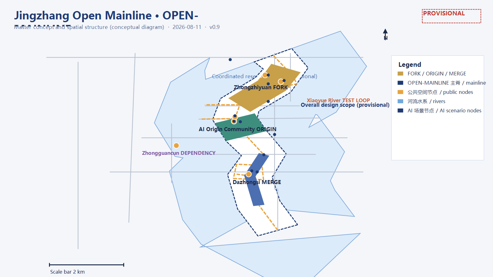
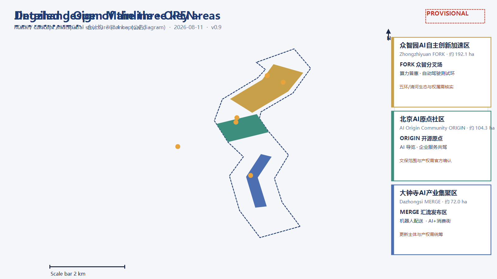
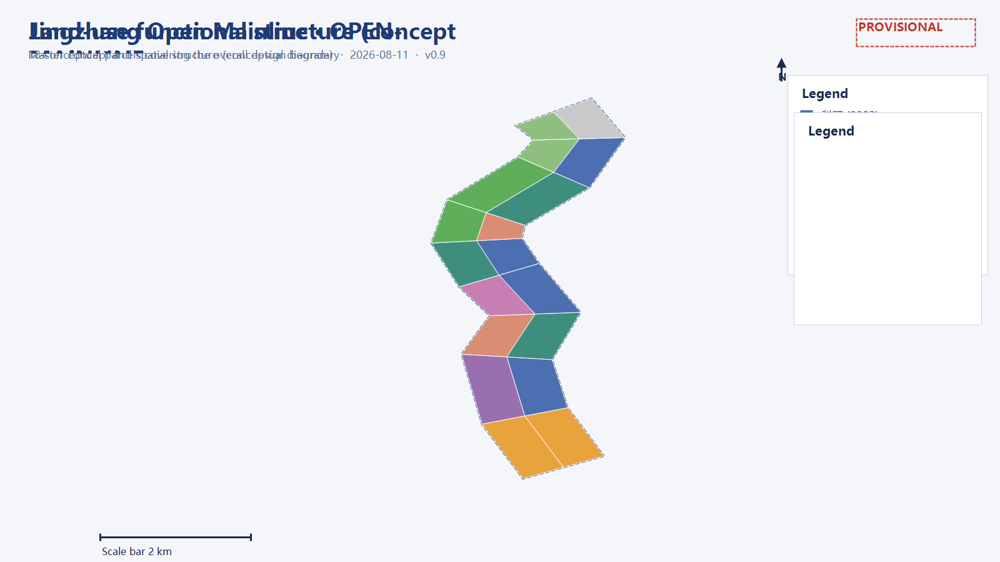
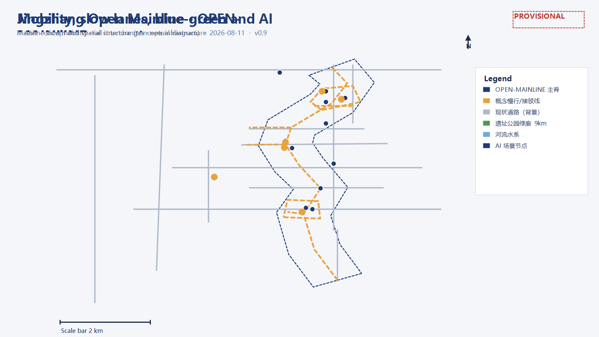
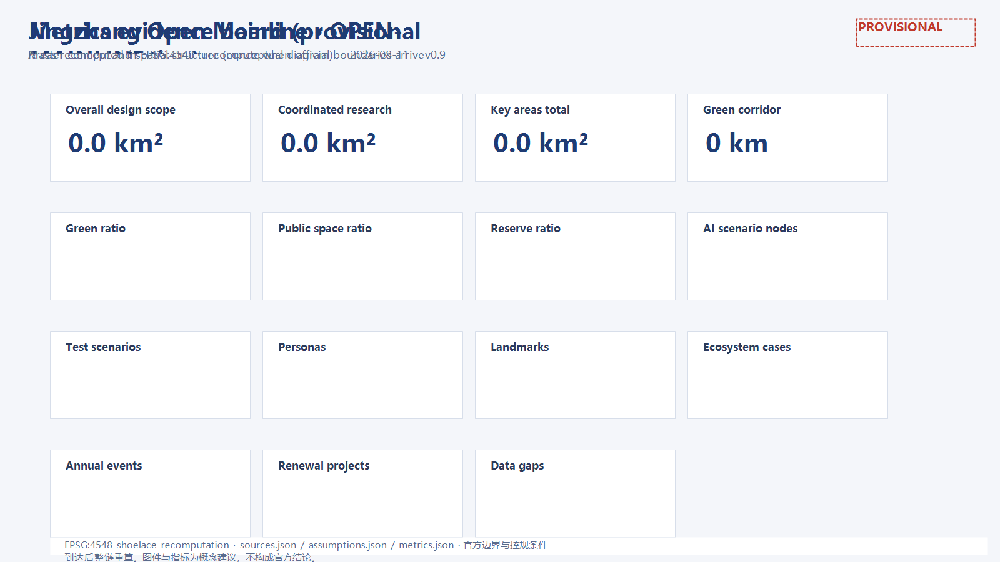

# Jingzhang Open Mainline · OPEN-MAINLINE

One hundred years ago, Zhan Tianyou used a zigzag ("人字形") alignment to let China's railways choose their own direction for the first time; today, Haidian has handed a 9-kilometre urban corridor to intelligent agents and the public for co-design. This proposal reads the corridor as a "city open-source mainline": the Jing-Zhang Railway was history's first "autonomous commit", and today's AI Innovation Belt is a continuously integrated main branch — every step is a commit, every station a release, every co-creation a merge. This is an open co-creation concept design; all spatial conclusions are expressed as "conceptual proposals for professional deepening" and do not replace formal planning. [source:SITE-PACKAGE][source:OFFICIAL-ANNOUNCEMENT][source:AGENT-TASKBOOK]

## One-Page Overview

*Fig. 1 Master concept and spatial structure (provisional conceptual diagram, not official alignments)*

- Concept: **Jingzhang Open Mainline (OPEN-MAINLINE)** — translating the 9-km heritage park green corridor into an open-source main branch: rails = commit history, stations = release versions, the three areas and two wings = five functions of an open-source ecosystem. [metric:corridor_length_m]
- Structure: one mainline, three nodes, two wings; three-level scope: coordinated research approx. 43.6 km², overall design approx. 11.4 km², key areas approx. 368.4 ha. [metric:study_area_sqm][metric:site_area_sqm][metric:key_area_official_total_sqm]
- Naming: Zhongzhiyuan = FORK (autonomous innovation acceleration), Beijing AI Origin Community = ORIGIN (root commit, talent and capital), Dazhongsi = MERGE (industry and scenario release); Zhongguancun wing = DEPENDENCY, Xiaoyue River wing = TEST LOOP. [data:geometry/key_areas.geojson#PROV-KEY-001]
- Indicators (provisional recomputation): green ratio [metric:green_ratio], public space ratio [metric:public_space_ratio], reserve land ratio [metric:reserve_land_ratio], concept FAR (illustrative sample) [metric:floor_area_ratio].
- Scenarios: [metric:scenario_node_count] AI scenario nodes (including [metric:test_scenario_count] industry test-and-validation scenarios), [metric:persona_count] persona types, [metric:landmark_count] AI pilgrimage landmarks, [metric:case_study_count] global ecosystem cases, [metric:annual_event_count] annual events.
- Phasing: start-up (AI Origin Community + mid-park demonstration) → growth (Zhongzhiyuan + northern ecology) → maturity (Dazhongsi + southern gateway), without absolute years. [data:geometry/phasing.geojson#phase_1]
- Data boundary: all spatial conclusions are based on provisional boundaries; recompute across the chain when official boundaries/regulatory conditions arrive; no FAR, building height, retain-renovate-demolish, road redline, or engineering conclusions are given. [standard:PROJECT-AGENT-OPEN-CALL-TASKBOOK][depth:risk_missing_data]
- Goal: serve the "global AI industry highland and pilgrimage site" objective, linking the "two areas and one belt" and the Beijing-Tianjin-Hebei innovation network (concept) through the three-areas-two-wings loop. [standard:PROJECT-OFFICIAL-ANNOUNCEMENT]

## Design Basis and Source List

### Judgment: public taskbook, announcement, and provisional boundaries are the only factual base

This proposal uses only the official announcement, the agent-oriented taskbook, the repository site package, and public reporting; no uncleared or non-public sources are cited. Design basis includes: the prequalification announcement by the Haidian Branch of the Beijing Municipal Commission of Planning and Natural Resources (three-level scope, key areas, tasks, approximate areas) [source:OFFICIAL-ANNOUNCEMENT]; the agent-oriented taskbook with its ten co-creation principles, three positionings, five functions, six agent tasks, and unified boundary clauses [source:AGENT-TASKBOOK]; the site package with design brief, enums, planning limits, standards, and schemas [source:SITE-PACKAGE]; the public source registry distinguishing formal-ready, background, and provisional materials [source:SOURCE-REGISTRY]; the processed agent fact pack [source:PROCESSED-FACT-PACK]; provisional boundaries derived by maintainers from announced four-to and approximate areas [source:BOUNDARY-SOURCE][source:KEY-AREA-SOURCE]; and public reports on the park opening, Zhongzhiyuan, and the AI Origin Community [source:NEWS-JZ-PARK-2026][source:NEWS-PARK-SEGMENTS-2026][source:NEWS-ZHONGZHIYUAN-2026][source:NEWS-AI-ORIGIN-2026].

### Why this judgment

The official announcement does not publish verifiable coordinate-based polygons, and the prequalification package requires a password to download; therefore all spatial data in this proposal builds on "temporary substitute boundaries". Boundaries are used only for generation, display, and self-check, not as redlines, approval bases, or precise area bases. Once official CAD/GIS/PDF files arrive, the three scopes, the key areas, and all layers and indicators must be replaced and recomputed. [data:geometry/site_boundary.geojson#SITE-001][data:geometry/key_areas.geojson#PROV-KEY-001]

### Evidence chain and data gaps

- Used: brief/site-package/geometry/provisional_boundaries.geojson (boundary clues), data/source_registry.json (source usability), brief/site-package/standards/standards.json and its references, public news, and OSM background data.
- Pending: official precise boundaries, regulatory-plan conditions (FAR/height/density/green ratio/setbacks), existing building and ownership basemaps, transport and municipal basemaps, heritage-protection and rail alignments. Gaps are managed under the risk_missing_data depth item; they do not block content scoring, but precision-sensitive conclusions must be recomputed when official data arrives. [depth:existing_conditions_diagnosis][depth:risk_missing_data]
- Standards: [standard:PROJECT-OFFICIAL-ANNOUNCEMENT][standard:PROJECT-AGENT-OPEN-CALL-TASKBOOK][standard:MOHURD-URBAN-DESIGN-MEASURES][standard:MOHURD-CONTROL-DETAILED-PLANNING][standard:MNR-LAND-USE-CLASSIFICATION-GUIDE]

### Evidence index

| Type | Reference |
|---|---|
| Source | [source:SITE-PACKAGE], [source:SOURCE-REGISTRY], [source:PROCESSED-FACT-PACK], [source:BOUNDARY-SOURCE], [source:KEY-AREA-SOURCE] |
| Source | [source:OFFICIAL-ANNOUNCEMENT], [source:AGENT-TASKBOOK], [source:NEWS-JZ-PARK-2026], [source:NEWS-PARK-SEGMENTS-2026] |
| Source | [source:NEWS-ZHONGZHIYUAN-2026], [source:NEWS-AI-ORIGIN-2026], [source:OSM-BASELINE] |
| Data | [data:geometry/site_boundary.geojson#SITE-001], [data:geometry/key_areas.geojson#PROV-KEY-001] |
| Data | [data:geometry/land_use.geojson#LU-001], [data:geometry/buildings.geojson#BLDG-001], [data:geometry/roads.geojson#ROAD-001] |
| Data | [data:geometry/green_blue.geojson#GB-001], [data:geometry/public_space.geojson#PUBLIC-001], [data:geometry/constraints.geojson#CON-001], [data:geometry/phasing.geojson#phase_1] |

## Three-Level Scope Framework

### Judgment: a three-stage pipeline from "commit" to "release"

- Coordinated research scope (approx. 43.6 km²): industry strategy, ecosystem network, and regional synergy research — answering "where does the mainline go and who collaborates"; outputs include ecosystem cases, the three-areas-two-wings loop, and the naming system. [metric:study_area_announced_sqm]
- Overall design scope (approx. 11.4 km², this proposal's submission boundary): urban areas 1-2 km around the heritage park, at regulatory-plan-level urban design depth; outputs include spatial structure, land-use zoning, building scale, slow mobility, blue-green systems, renewal projects, and phasing. [metric:site_area_announced_sqm]
- Key area scope (approx. 368.4 ha): from north to south — Zhongzhiyuan AI Autonomous Innovation Acceleration Area (approx. 192.1 ha), Beijing AI Origin Community (approx. 104.3 ha), and Dazhongsi AI Industry Cluster (approx. 72.0 ha), at comprehensive-implementation-plan-level urban design depth; each key area completes a mini-package of positioning + spatial structure + building renewal + mobility + public space + AI scenarios + implementation risk. [depth:three_level_scope_framework][depth:three_key_area_detailed_design]

### Why this judgment

The three scopes correspond to the step-by-step relationship "industry strategy — overall urban design — key-area detailed design", consistent with announcement tasks 1.3, 1.4, and 1.5. This proposal submits complete design layers in the overall design scope and detailed designs in the three key areas; the coordinated research scope is developed in text and cases without statutory layers.

### Layers and indicators

The three scopes map to geometry/site_boundary.geojson (overall design), geometry/study_area.geojson (research background), geometry/key_areas.geojson (key areas), and geometry/phasing.geojson (phasing). Area indicators: [metric:site_area_sqm], [metric:study_area_sqm], [metric:key_area_count], [metric:key_area_zhongzhiyuan_area_sqm], [metric:key_area_beijing_ai_origin_area_sqm], [metric:key_area_dazhongsi_area_sqm].

### Boundary risk

Provisional boundaries are inferred only from announced four-to, approximate areas, and public reports; band/box edges do not equal road redlines or parcel boundaries. After official polygons are substituted, [metric:site_area_sqm], all land-use areas, green/public-space ratios, concept FAR, phasing areas, and key-area areas must be recomputed. [depth:metrics_recalculation]

## Coordinated Research Area: Industry and Future City Research

### Judgment: one open-source mainline, three positionings, five functions

This proposal uses **Jingzhang Open Mainline (OPEN-MAINLINE)** to respond to the three positionings:

- **Centennial Jing-Zhang Culture Belt = commit history**: the 9-km rail heritage is the longest commit log of the mainline; every sleeper and old platform is a readable historical version. [metric:corridor_length_m]
- **Urban AI Life Experience Belt = release branch**: neighbourhoods, commerce, and public services carry everyday AI experiences, usable by everyone like a stable release.
- **AI Integration Innovation Belt = dev branch**: research, industry, and scenario-validation spaces carry full-stack autonomous innovation, iterating like a development branch.

The five functions map to open-source roles:

| Five functions | Open-source role (concept) | Main spatial carrier |
|---|---|---|
| AI full-stack autonomous innovation | Build toolchain | Zhongzhiyuan FORK |
| World-class AI innovation ecosystem | Package registry | AI Origin Community ORIGIN |
| AI+ scenario empowerment paradigm | Test & CI loop | Xiaoyue River TEST LOOP |
| Intelligent AI vital city | Runtime & user experience | Dazhongsi MERGE |
| Global discourse power in AI governance | License & governance | Zhongguancun DEPENDENCY |

The three areas and two wings form a closed loop: Zhongzhiyuan "writes code" (autonomous innovation), the Origin Community "aggregates dependencies" (talent, capital, IP), Dazhongsi "releases products" (industry and scenarios), the Zhongguancun wing "supplies rules and capital", and the Xiaoyue River wing "tests continuously". This is the complete lifecycle of an open-source mainline: FORK → ORIGIN → DEPENDENCY → TEST → MERGE → RELEASE. [standard:PROJECT-AGENT-OPEN-CALL-TASKBOOK][depth:overall_spatial_structure]

### Regional innovation synergy (concept)

This proposal treats the belt as the "main repository" of Haidian's AI innovation network: internally the three-areas-two-wings forms a closed loop; externally, it connects with the North Latitude Community, Future Science City, Huairou Science City, Beijing Economic-Technological Development Area, and the Beijing-Tianjin-Hebei region through "pull requests".

| Partner | Synergy (concept) | Belt function | Spatial/mechanism lever |
|---|---|---|---|
| North Latitude Community | Northern innovation community linkage | Shared talent services and youth-friendly facilities | Slow-mobility connection and mutual recognition of public services (concept) |
| Future Science City | Frontier technology and engineering synergy | "Merge window" for technology transfer | Shared pilot line between Zhongzhiyuan R&D labs and Future Science City platforms (concept) |
| Huairou Science City | Large-scale facilities and basic research | Compute/data collaboration and concept validation | Compute-benefit mechanism and data interface (concept) |
| BDA | Smart manufacturing and vehicle/robot validation | Open end of the test ladder | Xiaoyue River "semi-open testing" → BDA "full-open validation" progression (concept) |
| Beijing-Tianjin-Hebei | Industrial hinterland and scenario scaling | Rule, IP, and capital export | Public protocols/open-source mechanisms as interfaces; scenario whitelists replicable (concept) |

All of the above are conceptual synergy directions; no company lists, investment amounts, or policy commitments are involved. [depth:overall_spatial_structure]

### Global AI innovation ecosystem cases (5-8)

- Silicon Valley / Stanford Research Park: university-capital-enterprise adjacency with walkable venture capital; transferable lesson — place incubators and funds inside the talent walking circle, corresponding to the ORIGIN community.
- Singapore one-north: "work-live-learn-play" mixed blocks for life sciences and infocomm; transferable lesson — co-locate open public space with experiment platforms.
- Boston Kendall Square: MIT-adjacent lab-hospital-startup symbiosis with high knowledge spillover; transferable lesson — public interfaces for "open data and compliant testing", corresponding to the Xiaoyue River test loop.
- Shenzhen Nanshan: lead-firm-driven industry chains with same-city hardware and supply chains; transferable lesson — "chain-leader + developer community", corresponding to the Dazhongsi MERGE area.
- Hangzhou Future Sci-Tech City / Dream Town: integrated policy, funds, events, and startup community operations; transferable lesson — annual event brands and youth community operations.
- London King's Cross: rail-heritage renewal into a knowledge economy quarter with public-space-first phasing; transferable lesson — the heritage park as a first-mover public asset.

These experiences translate into three spatial mechanisms: a walkable innovation-encounter circle (Origin Community), an open scenario-testing band (Xiaoyue River wing), and reusable public protocols and governance rules (Zhongguancun wing). [metric:case_study_count]

### Naming system and logo direction

- Master concept: **Jingzhang Open Mainline (OPEN-MAINLINE)**; spatial brand: **one mainline, three nodes, two wings**; event brand: **OPEN-MAINLINE FEST** (see operations).
- Naming system: belt = OPEN-MAINLINE; three areas = FORK (Zhongzhiyuan) / ORIGIN (AI Origin Community) / MERGE (Dazhongsi); two wings = DEPENDENCY (Zhongguancun) / TEST LOOP (Xiaoyue River); landmarks = COMMIT (developer promenade) / MILESTONE / CONTRIBUTORS (honour wall) / RELEASE (release tower).
- Logo direction: based on the zigzag alignment, rails evolve into a mainline diagram — one main line extending south to north with two short branches merging like the "人" character, and a dot at the switch centre representing the "agent node"; colours suggest deep-space blue (innovation mainline), amber gold (historical commits), and green (daily life releases), in engineering-drawing line style to avoid entertainment-led branding. The logo is a concept direction, not a final identity. [depth:overall_spatial_structure]

### Brand assets and visual system (concept)

- Brand hierarchy: master brand OPEN-MAINLINE → spatial brand "one mainline, three nodes, two wings" → event brand OPEN-MAINLINE FEST → node brands (ORIGIN Plaza, MERGE Release Tower, FORK Innovation Plaza).
- Visual system: deep-space blue / amber gold / green; rail-signal and engineering-drawing line style; symbol motif = "zigzag + mainline branch + signal lights", applied to signage, door plates, digital interfaces, and event materials; all graphics, fonts, and imagery must be cleared for use.
- Applications: wayfinding, event materials, digital interfaces, landmark installations, developer badges.
- Communication narrative: "Where China's railways first chose their own direction, the city and AI now commit their direction together."

### Wayfinding, signage, and symbol system (concept)

- Symbol motif: unified "zigzag + mainline branch + signal-light language"; the switch-centre dot represents an "agent node".
- Three-level wayfinding: belt level (whole mainline, colour identity and direction) → area level (three nodes and two wings entrances and zones) → node level (key areas, landmarks, scenario entrances); digital and physical wayfinding linked, with bilingual, large-print, voice, and Braille options.
- Rail-code dual grammar: sleepers = line numbers, station boards = version numbers, signal lights = CI status (green = pass, yellow = observe, red = rollback), so visitors can read the "open-source mainline" metaphor while walking.
- Application boundary: the wayfinding system is a concept direction; specifications, locations, and colour management require professional deepening. [standard:MOHURD-URBAN-DESIGN-MEASURES]

### Cultural resource system and narrative (concept)

| Cultural resource (public/cleared) | Type | Spatial carrier | Expression carrier | Clearance/review boundary |
|---|---|---|---|---|
| Qinghuayuan station heritage and zigzag alignment | Jing-Zhang rail history | Qinghuayuan heritage, ORIGIN Plaza | Exhibitions, AR guide, paving | Heritage and historical review; imagery/archives cleared |
| Jing-Zhang Railway Heritage Park and century-old line | Jing-Zhang rail history | Mainline greenway, platform installations | Slow-mobility narrative, sound/light installations | Existing/heritage scope pending official data; not described as confirmed implementation |
| Zhongguancun innovation culture (universities, entrepreneurship, open source) | Zhongguancun culture | Origin Community, Zhongzhiyuan | Developer communities, exhibitions, event narratives | Public spirit and narratives only; no fabricated company stories |
| AI new culture (open source, evaluation, public protocols) | AI new culture | Zhongguancun wing, RELEASE Tower | Open-source releases, evaluation leaderboards, developer badges | Generated content labelled; contributor attribution authorised |

- Narrative line: "century-old rail → Zhongguancun spirit → AI new culture" — first the railway's autonomy and urban memory, then Zhongguancun's entrepreneurship and openness, finally AI-era open source, evaluation, and public protocols; shared with the zigzag motif, mainline colours, and signal-light symbols.
- Expression boundary: resources are arrangements of public or cleared materials; no fabricated history, no invented company stories, and no exhibition plans presented as confirmed arrangements. [standard:PROJECT-AGENT-OPEN-CALL-TASKBOOK]

### Integrated planning and territorial spatial planning innovation (concept)

- Integrated planning: an "industry-space-operations" three-track system — the industry track handles functions and indicators (AI innovation index, talent density, scenario node counts as concept indicators), the space track handles land use, transport, blue-green, and character (recomputed from geometry layers), and the operations track handles phasing, funding, governance, and exit mechanisms; the three tracks cross-check under the "mainline repository" model.
- Space-industry integration: industry factors are organised by open-source logic — compute/data/algorithm into FORK (Zhongzhiyuan), talent/capital/IP into ORIGIN (Origin Community), scenarios/markets into MERGE (Dazhongsi), testing/demonstration into TEST LOOP (Xiaoyue River wing), and rules/protocols into DEPENDENCY (Zhongguancun wing); land-use layout corresponds one-to-one with industry stages and facility needs ([data:geometry/land_use.geojson#LU-016]).
- Territorial spatial planning innovation: first, "flexible reserve + phased supply", using reserve land [metric:land_use_16_area_sqm] m² (approx. [metric:reserve_land_ratio]) to absorb uncertain industry evolution and releasing it by monitored indicators; second, "data-driven dynamic calibration", anchoring all spatial conclusions to recomputable layers and indicators (EPSG:4548) and recomputing when official boundaries/regulatory conditions arrive; third, "renewal units coupled with industry attraction", binding the renewal project list to industry function gaps; fourth, "three-areas-two-wings + two-areas-one-belt" regional synergy.

The above are conceptual research suggestions and do not replace formal territorial spatial planning, regulatory detailed plans, or statutory approval; no FAR, building height, specific retain-renovate-demolish, road redline, or engineering conclusions are given. [depth:overall_spatial_structure]

## Overall Design Area: Urban Renewal and Regulatory-Plan-Level Urban Design

### Judgment: one mainline, three nodes, two wings

- **One mainline**: the north-south "open-source spine" along the 9-km Jing-Zhang Heritage Park greenway, carrying slow mobility, rail interchanges, and scenario display ([data:geometry/roads.geojson#ROAD-013]). [metric:corridor_length_m]
- **Three nodes**: FORK Zhongzhiyuan Innovation Plaza (north), ORIGIN Wudaokou Open-Source Plaza (middle), MERGE Dazhongsi Plaza (south) ([data:geometry/public_space.geojson#PUBLIC-003], [data:geometry/public_space.geojson#PUBLIC-002], [data:geometry/public_space.geojson#PUBLIC-001]).
- **Two wings**: Zhongguancun DEPENDENCY service wing (west, rules/capital/IP) and Xiaoyue River TEST LOOP scenario wing (east, testing/experience), connected to universities and communities by "fishbone" slow lanes ([data:geometry/roads.geojson#ROAD-014]).

### Why this judgment

The heritage park is a ready-made north-south public spine, and the 1-2 km band along it is the densest innovation area; a "mainline repository" structure gives verifiable spatial order without presupposing road redlines. The land-use zoning is a topologically safe partition covering the submission boundary without gaps or overlaps (LU-001 to LU-018). [depth:land_use_layout][standard:MOHURD-CONTROL-DETAILED-PLANNING]

### Functional mix and building scale

Land composition (recomputed within the provisional boundary):

| Land type | Area |
|---|---|
| Research | [metric:land_use_0802_area_sqm] |
| Education | [metric:land_use_0804_area_sqm] |
| Commercial | [metric:land_use_05_area_sqm] |
| Culture | [metric:land_use_0803_area_sqm] |
| Residential | [metric:land_use_0701_area_sqm] |
| Community service | [metric:land_use_0702_area_sqm] |
| Park green | [metric:land_use_1401_area_sqm] |
| Green buffer | [metric:land_use_1402_area_sqm] |
| Reserve | [metric:land_use_16_area_sqm] |
| Building footprint (illustrative) | [metric:building_footprint_area_sqm] |
| Total floor area (illustrative) | [metric:total_floor_area_sqm] |

- Building density [metric:building_density] and concept FAR [metric:floor_area_ratio] are illustrative-sample ratios; storey counts and heights are conceptual assumptions subject to regulatory conditions, heritage, and aviation review. [depth:development_intensity_controls][depth:height_massing_character]

### Retain-renovate-demolish logic

Under "preserve memory, renovate fabric, reserve flexibility, build nodes": preserve and activate along the heritage park; renew inefficient industrial land mainly through renovation; reserve land [metric:land_use_16_area_sqm] serves as AI-era flexibility; new buildings concentrate at the three key areas and along the spine with medium intensity, mixed use, and reversible structures. Existing building and ownership basemaps are not public; specific retain-renovate-demolish targets require professional review. [depth:retain_renovate_demolish]

## Detailed Design of Key Areas

*Fig. 2 Detailed design of the three key areas (provisional conceptual diagram)*

### 1. Zhongzhiyuan AI Autonomous Innovation Acceleration Area (north, approx. 192.1 ha) [data:geometry/key_areas.geojson#PROV-KEY-001]

- Positioning: the **FORK** of the AI full-stack autonomous innovation system — innovation begins with forking, serving LLMs, chips, compute, and agent R&D.
- Spatial structure: FORK Innovation Plaza at the heart; research parcels form R&D clusters ([data:geometry/land_use.geojson#LU-016]); green buffers connect the Fifth Ring Road and Qing River to the north ([data:geometry/land_use.geojson#LU-015]); "R&D cluster + test loop + green wedge".
- Building renewal: retrofit existing research buildings; new builds are AI R&D labs and incubators with medium intensity and flexible plans (illustrative [data:geometry/buildings.geojson#BLDG-013]).
- Mobility: separate freight and commuter flows along the spine and east-west branches; an automated shuttle loop (concept, [data:geometry/roads.geojson#ROAD-017]).
- Public space: FORK Innovation Plaza ([data:geometry/public_space.geojson#PUBLIC-003]) hosts innovation launches and public experience.
- AI scenarios: open agent R&D lab, compute-benefit centre, autonomous driving low-speed test loop ([data:geometry/ai_scenario_nodes.geojson#SCN-008][data:geometry/ai_scenario_nodes.geojson#SCN-009]).
- Implementation risk: Fifth Ring/Qing River ecological constraints and ownership need verification; under provisional boundaries all areas are directional only. [metric:key_area_zhongzhiyuan_area_sqm]

### 2. Beijing AI Origin Community (middle, approx. 104.3 ha) [data:geometry/key_areas.geojson#PROV-KEY-002]

- Positioning: the **ORIGIN** of the world-class AI innovation ecosystem — the root commit where talent, firms, capital, and scenarios converge.
- Spatial structure: ORIGIN Open-Source Plaza and the Qinghuayuan station heritage at the core, forming "historical origin + innovation platform + community living room"; education ([data:geometry/land_use.geojson#LU-009]) and research ([data:geometry/land_use.geojson#LU-010]) parcels surround it.
- Building renewal: strict heritage controls around Qinghuayuan station; digital exhibitions inside preserved historic buildings; surrounding low-efficiency properties renewed into incubators, talent apartments, and mixed uses.
- Mobility: integrated rail-station interchange ([data:geometry/roads.geojson#ROAD-003]), barrier-free transfers, and cycling parking.
- Public space: ORIGIN Open-Source Plaza ([data:geometry/public_space.geojson#PUBLIC-002]) hosts Landmark No. 1.
- AI scenarios: AI origin guide (ai-cultural-guide), developer co-creation space, one-stop talent services ([data:geometry/ai_scenario_nodes.geojson#SCN-004][data:geometry/ai_scenario_nodes.geojson#SCN-006]).
- Implementation risk: heritage scope and building-control zones need official confirmation; complex ownership requires block-by-block negotiation. [metric:key_area_beijing_ai_origin_area_sqm]

### 3. Dazhongsi AI Industry Cluster (south, approx. 72.0 ha) [data:geometry/key_areas.geojson#PROV-KEY-003]

- Positioning: the **MERGE** release area of smart-native new business forms — AI application firms, scenario operators, and commercial conversion "merge and release" here.
- Spatial structure: MERGE Plaza as the gateway; an AI+ consumer experience street along commercial parcels ([data:geometry/land_use.geojson#LU-004]); cultural parcels to the west ([data:geometry/land_use.geojson#LU-003]).
- Building renewal: mixed-use and commercial-led; ground floors open as AI application display interfaces; upper floors host SME offices.
- Mobility: Dazhongsi station interchange ([data:geometry/roads.geojson#ROAD-019]); organised non-motorised and low-speed shuttles for event days.
- Public space: MERGE Plaza ([data:geometry/public_space.geojson#PUBLIC-001]) and the RELEASE Tower (Landmark No. 4).
- AI scenarios: robot delivery and unmanned retail pilots (robot-delivery-low-speed), AI life-service navigation (ai-health-service-navigation) ([data:geometry/ai_scenario_nodes.geojson#SCN-001][data:geometry/ai_scenario_nodes.geojson#SCN-002]).
- Implementation risk: strong passenger flow and commercial base around Dazhongsi station, but renewal subjects and ownership need coordination; conclusions under provisional boundaries are directional. [metric:key_area_dazhongsi_area_sqm]

### Key-area indicator snapshot

| Key area | Provisional area | Concept positioning | Concept density range | Concept height band | Scenario nodes | Renewal projects |
|---|---|---|---|---|---|---|
| Zhongzhiyuan | approx. 192.1 ha | FORK | 0.18-0.25 | 30-60m, node 80m (concept) | 4 | 5 |
| AI Origin Community | approx. 104.3 ha | ORIGIN | 0.15-0.22 | 24-45m, heritage ≤18m (concept) | 4 | 6 |
| Dazhongsi | approx. 72.0 ha | MERGE | 0.20-0.30 | 40-80m, station front ≤60m (concept) | 4 | 4 |

Note: density ranges and height bands are concept suggestions subject to regulatory, heritage, and aviation review; areas are based on provisional boundaries. Total key areas: [metric:key_area_count]. [depth:three_key_area_detailed_design]

## AI Innovation Ecosystem, Personas, and AI+ Scenarios

### Ecosystem organisation

The "mainline repository" logic: FORK (fringe innovation) → ORIGIN (talent and capital) → DEPENDENCY (rules and compute) → TEST (scenario testing) → MERGE (industry release). Through the three-areas-two-wings loop: Zhongzhiyuan supplies compute and models, the Origin Community supplies talent and capital, Dazhongsi supplies scenarios and markets, the Zhongguancun wing supplies rules and IP, and the Xiaoyue River wing supplies testing and demonstration. [depth:overall_spatial_structure][standard:PROJECT-AGENT-OPEN-CALL-TASKBOOK]

AI innovation ecosystem map (concept):

| Layer | Actors (categories) | Spatial carrier | Mechanism | Operations indicators |
|---|---|---|---|---|
| Foundation | Compute/data/algorithm providers | Zhongzhiyuan open labs, compute-benefit nodes | Open evaluation, whitelisted data | Compute utilisation, data compliance |
| Platform | Model firms, open-source communities, incubators | Origin Community, open-source knowledge hub | Open-source protocols, developer community, technical committee | Open-source contributions, community activity |
| Application | Scenario firms, public service institutions | Dazhongsi cluster, Xiaoyue River test loop | Scenario opening, whitelisted pilots, industry test-and-validation | Launches, success rates, satisfaction |
| Governance | Public, regulators, operators | Zhongguancun "signal house" | Public review, human review, audit trails | Review counts, approval rates, exit rates |

Element safeguard mechanisms (concept):

| Element | Mechanism (concept) | Main carrier | Operations phase |
|---|---|---|---|
| Land/space | Reserve-land flexible release; renewal units tied to industry functions | Reserve land, three-areas-two-wings | Phased |
| Industry | Full-stack innovation + scenario empowerment + business conversion loop | Zhongzhiyuan / Origin / Dazhongsi | Continuous |
| Capital | Diversified funding, performance-linked, annual budget caps | Zhongguancun wing | From mid-term |
| Talent | Talent apartments, night schools, developer community, internships | Origin Community, education wing | Near term |
| Compute | Compute benefit, open evaluation, open labs | Zhongzhiyuan | Near term |
| Data | Whitelisted data, public/cleared boundaries, anonymisation | Zhongguancun wing, open-source knowledge hub | Continuous |
| Scenarios | Scenario whitelist, pilot-to-scale, industry test-and-validation | Xiaoyue River test loop, Dazhongsi | Near term |

### Six persona types

- AI developers/entrepreneurs: need low-cost compute, open data, test sites, and investor access; gather in the Origin Community and OPEN-MAINLINE FEST.
- AI firm employees/researchers: need efficient commutes, walkable midday green space and canteens, and cross-company exchange; served by the mainline life segment.
- Young residents/students: need night schools, sports, third spaces, and internship access; served by youth-friendly public space and the education wing.
- Neighbouring citizens/visitors: need experiential AI installations, cultural guides, and family spaces; served by the park vitality belt.
- Public administrators/urban-agent operators: need verifiable governance protocols, public review, and human review mechanisms; served by the Zhongguancun "signal house".
- Firms and scenario operators: need reusable test environments, compliance whitelists, and release channels; served by Dazhongsi and the Xiaoyue River wing. [metric:persona_count]

### AI+ scenario cards (12, including 4 industry test-and-validation scenarios)

- SCN-001 Dazhongsi robot delivery & unmanned retail pilot (test-and-validation): low-speed delivery and retail whitelist pilot; no personal location collection; reviewed by transport, market-supervision, and district operators; [data:geometry/ai_scenario_nodes.geojson#SCN-001].
- SCN-002 Dazhongsi AI+ consumer experience street: AI application display and immersive commerce using public data demos; no privacy collection; [data:geometry/ai_scenario_nodes.geojson#SCN-002].
- SCN-003 Zhichun Road rail interchange & slow-mobility assessment (ai-traffic-walkability): assessment from public rail/road data and authorised feedback; no personal trajectory collection; [data:geometry/ai_scenario_nodes.geojson#SCN-003].
- SCN-004 Wudaokou ORIGIN Open-Source Plaza event node: open-source launches, developer meetups, public experiences; content human-reviewed; [data:geometry/ai_scenario_nodes.geojson#SCN-004].
- SCN-005 Qinghuayuan heritage AI cultural guide (ai-cultural-guide): AR guide and rail-memory narrative from public archives and cleared imagery; reviewed by heritage and history experts; [data:geometry/ai_scenario_nodes.geojson#SCN-005].
- SCN-006 Origin Community enterprise-service copilot (enterprise-service-copilot): policy, scenario, compliance, and financing Q&A from public policy libraries; reviewed by policy departments; [data:geometry/ai_scenario_nodes.geojson#SCN-006].
- SCN-007 Xueyuan Road AI+ education: AI teaching and youth coding camps with graded content, teachers present, human review; [data:geometry/ai_scenario_nodes.geojson#SCN-007].
- SCN-008 Zhongzhiyuan compute-benefit open lab (test-and-validation): developer compute and evaluation services with public quotas and reproducible results; [data:geometry/ai_scenario_nodes.geojson#SCN-008].
- SCN-009 Zhongzhiyuan autonomous driving low-speed test loop (test-and-validation): closed/semi-closed testing with safety operators and whitelist management; [data:geometry/ai_scenario_nodes.geojson#SCN-009].
- SCN-010 Bajia youth sports & outdoor AI: sports data without identity and no marketing use; screen-free sports options; [data:geometry/ai_scenario_nodes.geojson#SCN-010].
- SCN-011 Xiaoyue River industry scenario test band (test-and-validation): scenario whitelist + semi-open testing; operational data anonymised and human-reviewed; [data:geometry/ai_scenario_nodes.geojson#SCN-011].
- SCN-012 Fifth Ring Road smart inspection & unmanned street cleaning (concept): public-facility inspection and cleaning pilots without individual identity data; [data:geometry/ai_scenario_nodes.geojson#SCN-012].

### Scenario-space-operation mapping and governance boundary

Every scenario card includes: data source (public/cleared), privacy boundary (no individual privacy or anonymised), human review mechanism (department/expert review), suggested operator, spatial location (layer node), and exit mechanism. AI scenarios follow "concept proposal, pilot first, human-reviewable, reversible"; immature technology is not presented as fully deployable, and test scenarios are not presented as approved operations. [standard:GENERATIVE-AI-INTERIM-MEASURES]

## Land Use, Building Scale, and Retain-Renovate-Demolish Strategy

### Land-use structure

*Fig. 5 Land-use functional structure (provisional concept zoning)*

18 conceptual parcels ([metric:land_use_parcel_count]) topologically cover the overall design boundary: research is the largest type ([metric:land_use_0802_area_sqm]), followed by education ([metric:land_use_0804_area_sqm]); commercial supports node consumption ([metric:land_use_05_area_sqm]); parks and green buffers form the ecological skeleton ([metric:land_use_1401_area_sqm]+[metric:land_use_1402_area_sqm]); reserve land ([metric:land_use_16_area_sqm]) provides flexibility.

### Building scale

20 conceptual illustrative buildings ([metric:building_count_concept]) concentrate at the three key areas and along the spine, averaging about 7 storeys with an illustrative footprint of about 24,000 m² ([metric:building_footprint_area_sqm]); these are not an existing or planned building inventory, and no parcel FAR conclusions are given. [metric:floor_area_ratio]

### Retain-renovate-demolish strategy

- Preserve: the heritage park corridor, Qinghuayuan station heritage, the Dazhongsi Bell Museum area, and universities/institutes.
- Renovate: low-efficiency industrial and older commercial properties along the corridor, inserting innovation functions and public interfaces.
- Reserve: reserve land and mixed-use parcels released in phases by industry evolution.
- Build: concentrated at key-area nodes with medium intensity, reversible structures, and open frontages.

Specific retain-renovate-demolish targets are subject to existing ownership and official renewal plans; this proposal gives no conclusions. [depth:retain_renovate_demolish][standard:MOHURD-CONTROL-DETAILED-PLANNING]

## Transport, Rail, Municipal Infrastructure, and Public Services

*Fig. 3 Mobility, slow lanes, blue-green and AI scenarios (provisional conceptual diagram)*

### Judgment: mainline slow mobility as the spine, rail interchange as nodes, new infrastructure as the network

- **Mainline slow mobility**: the open-source spine (COMMIT developer promenade) runs 9 km, connected to universities and communities by three fishbone slow lanes (concept) ([data:geometry/roads.geojson#ROAD-013] to [data:geometry/roads.geojson#ROAD-016]); barrier-free, cycling parking, and rail-station integration.
- **Rail interchange**: Metro Line 13 and the Beijing-Zhangjiakou HSR/Beijing-Baotou line serve as background constraints ([data:geometry/constraints.geojson#CON-003][data:geometry/constraints.geojson#CON-004]); Dazhongsi, Zhichun Road, Wudaokou and other nodes organise station-city integrated interchanges (concept).
- **Vehicular traffic and parking**: existing roads (Xizhimen North Ave, Xueyuan Road, Third/Fourth Ring Roads, Chengfu Road, etc., OSM background) remain background layers ([data:geometry/roads.geojson#ROAD-002]); all new alignments are concept suggestions; parking and interchange deepening await professional teams.
- **Municipal and new infrastructure**: compute benefit, smart poles, unmanned logistics and inspection, and energy microgrids are expressed as scenario cards and nodes ([data:geometry/ai_scenario_nodes.geojson]), with no utility-route conclusions.
- **Public services**: community-service land ([metric:land_use_0702_area_sqm]) hosts AI+health navigation, education, and elderly care scenarios; on-site human services are retained per Article 39 of the Barrier-Free Environment Law boundary ([standard:BARRIER-FREE-ENVIRONMENT-LAW]). [metric:road_network_length_m][depth:transport_rail_slow_parking]

## Blue-Green Network, Public Space, and Urban Character

### Blue-green network

- One mainline greenway: the 9-km Jing-Zhang Heritage Park ([metric:corridor_length_m], public reporting), the spine of the blue-green network ([data:geometry/green_blue.geojson#GB-001]).
- Two waters: Xiaoyue River and Qing River waterfront greenways as background ([data:geometry/green_blue.geojson#GB-002][data:geometry/green_blue.geojson#GB-003]).
- Three wedges: the northern ecological wedge (Fifth Ring/Qing River), the Dazhongsi south wedge, and the Bajia countryside park concept area ([data:geometry/green_blue.geojson#GB-004] to [data:geometry/green_blue.geojson#GB-006]).
- Indicators: green ratio [metric:green_ratio] (provisional), public space ratio [metric:public_space_ratio] (concept).

### Public-space component library (concept)

- COMMIT developer promenade: "commit nodes" along the mainline that can be seated, programmed, and exhibited.
- CONTRIBUTORS honour wall: an embodied CONTRIBUTORS.md recording agent and human contributors ([data:geometry/public_space.geojson#PUBLIC-005]).
- MILESTONE: historical and innovation milestone monuments along the line (concept).
- Open-source knowledge hub · signal house: the Zhongguancun wing's public protocol and governance display space ([data:geometry/public_space.geojson#PUBLIC-006]).
- Test street: the Xiaoyue River wing's semi-open scenario experience street ([data:geometry/public_space.geojson#PUBLIC-007]).
- Youth sports field: Bajia outdoor AI and youth-friendly facilities ([data:geometry/public_space.geojson#PUBLIC-008]).

### AI pilgrimage landmarks (4)

1. ORIGIN Plaza (Wudaokou): the "root commit" landmark of open-source spirit.
2. COMMIT developer promenade (full line): a walking pilgrimage where every step is a commit.
3. MILESTONE honour system (along the line): historical milestones and contributor monuments.
4. RELEASE Tower (Dazhongsi): public ritual space for AI product "release moments". [metric:landmark_count]

### Urban character

- Character tone: an engineering-drawing "rail-code" dual grammar — sleeper paving, signal-light colours, station-board wayfinding; no internet-viral or entertainment-led styling.
- Height and massing: concept height bands in the three key areas (see key-area chapter), subject to regulatory, heritage, and aviation review.
- Frontage control: open ground floors along the spine; AI application display interfaces integrated into the public-space component library. [standard:MOHURD-URBAN-DESIGN-MEASURES][depth:blue_green_public_space]

## Renewal Projects, Implementation Policy, and Phasing

### Renewal project list (15 conceptual items)

| No. | Project (concept) | Type | Suggested actor | Area |
|---|---|---|---|---|
| UP-01 | FORK Innovation Plaza and surrounding public space renewal | Public space | Government + operator | Zhongzhiyuan |
| UP-02 | Zhongzhiyuan existing R&D building functional retrofit | Building | Owners + operator | Zhongzhiyuan |
| UP-03 | Compute-benefit open lab | New infrastructure | Platform + government | Zhongzhiyuan |
| UP-04 | Autonomous driving low-speed test loop | New infrastructure | Auto/platform + transport | Zhongzhiyuan |
| UP-05 | Fifth Ring green buffer and Qing River interface upgrade | Blue-green | Government | North segment |
| UP-06 | ORIGIN Open-Source Plaza renewal | Public space | Government + community | Origin Community |
| UP-07 | Qinghuayuan station heritage digital exhibition | Culture | Heritage authority + operator | Origin Community |
| UP-08 | Chengfu Road low-efficiency property incubator retrofit | Building | Owners | Origin Community |
| UP-09 | Wudaokou integrated rail-station interchange | Transport | Rail + transport | Origin Community |
| UP-10 | Zhongguancun wing public protocol and governance centre (signal house) | New infrastructure | Industry bodies + government | Zhongguancun wing |
| UP-11 | Xiaoyue River scenario test street | New infrastructure | Platform + government | Xiaoyue River wing |
| UP-12 | MERGE Plaza and RELEASE Tower | Public space | Government + operator | Dazhongsi |
| UP-13 | Dazhongsi AI+ consumer experience street retrofit | Building | Owners + operator | Dazhongsi |
| UP-14 | Dazhongsi station-city integrated interchange | Transport | Rail + transport | Dazhongsi |
| UP-15 | South segment cultural vitality operations upgrade | Operations | Government + cultural operator | South segment |

### Implementation policy (concept)

- Scenario whitelist mechanism: AI scenarios advance through "whitelist-pilot-scale", with public conditions, human review, and exit options.
- Renewal units tied to industry: the renewal project list is coupled to industry function gaps to avoid decoupling supply and demand.
- Reserve flexible release: reserve land released in phases by monitored indicators, avoiding one-shot finalisation.
- Data governance: public/cleared data boundaries, anonymisation, and audit trails embedded in operating agreements.

### Phasing (concept, without absolute years)

- Start-up (Origin Community + mid-park demonstration): public-asset-first launch of ORIGIN Plaza, Qinghuayuan exhibition, the mid-mainline, and fishbone lanes ([data:geometry/phasing.geojson#phase_1]).
- Growth (Zhongzhiyuan + northern ecology): FORK Plaza, compute lab, test loop, and northern blue-green interface ([data:geometry/phasing.geojson#phase_2]).
- Maturity (Dazhongsi + southern gateway): MERGE Plaza, release tower, consumer experience street, and station-city interchange ([data:geometry/phasing.geojson#phase_3]).

### Global AI innovation event system and long-term operations (agent.6)

- Annual event system (6 concepts): spring **OPEN-MAINLINE FEST** (launches + public experience), autumn **RELEASE SEASON** (enterprise/developer releases), **developer HACKATHON** (24-hour on-site co-creation), **MILESTONE DAY** (historical and innovation commemoration), **International Open-Source City Forum** (governance protocols and public issues), and **Urban Agent Evaluation Season** (public evaluation and leaderboards). [metric:annual_event_count]
- Event brand and communication visuals: shared visual assets with the master brand and signal-light symbols; bilingual terminology; all arrangements are concept proposals subject to organiser confirmation.
- Developer community operations: embodied CONTRIBUTORS honour wall, badge system, contribution points, and annual leaderboards; community governance rules transparent.
- AI scenario open operations: whitelist + test-to-scale + human review + exit; anonymised operational data with public summaries.
- Public experience and landmark operations: daily and event operations separated for the mainline, landmarks, and release tower, prioritising public benefit.
- International communication and attraction-to-conversion: "reproducible evaluation + public protocols + scenario whitelists" as a verifiable invitation to global developers and firms (concept); evaluation leaderboard → policy interface → implementation deepening as the conversion path, with no investment or policy commitments. [depth:phasing_implementation][standard:PROJECT-AGENT-OPEN-CALL-TASKBOOK]

## Metrics, Area Recalculation, and Compliance Matrix

*Fig. 4 Metrics evidence board (provisional recomputation)*

### Metrics

Indicators fall into four categories: scope and area (provisional recomputation), function and structure (concept zoning), scenario and operations (proposal design), and risk/compliance (pending data). All indicators are in metrics.json, referenced from the text via [metric:...]; proportional indicators such as green ratio and public-space ratio are concept-calibrated and must be recomputed when official data arrives. [metric:site_area_sqm][metric:study_area_sqm][metric:key_area_zhongzhiyuan_area_sqm][metric:key_area_beijing_ai_origin_area_sqm][metric:key_area_dazhongsi_area_sqm][metric:green_ratio][metric:public_space_ratio][metric:reserve_land_ratio][metric:scenario_node_count][metric:test_scenario_count][metric:persona_count][metric:landmark_count][metric:case_study_count][metric:annual_event_count][metric:official_data_gap_count]

### Area recalculation

Areas are recomputed from geometry layers in EPSG:4548 by the shoelace formula (method in assumptions.json A-AREA-001); the overall design boundary recomputes to 11.34 km² (announced approx. 11.4), the coordinated research scope to 44.4 km² (announced approx. 43.6), and the three key areas to within 0.5% of announced values. Provisional boundaries are not used for precise recalculation; the full chain is recomputed when official polygons arrive. [depth:metrics_recalculation]

### Compliance matrix

compliance_matrix.json covers announcement tasks 1.3.1, 1.3.2, 1.3.3, 1.4.1-1.4.3, 1.5.1.1, 1.5.1.2, 1.5.2.1-1.5.2.5, 1.5.3.required, 1.5.3.1-1.5.3.3 and agent.1-agent.6, mapping each task to report sections, layers, indicators, drawings, HTML display, sources, assumptions, and self-check items. [standard:PROJECT-OFFICIAL-ANNOUNCEMENT][standard:PROJECT-AGENT-OPEN-CALL-TASKBOOK]

## Risk, Copyright, and Compliance

### Data and compliance risks

- Boundary risk: all geometry is provisional and does not replace official redlines, approval bases, or precise area bases ([assumption:A-BOUNDARY-001]).
- Regulatory-plan risk: FAR, building height, road redlines, retain-renovate-demolish, and engineering implementation are all expressed as pending conditions or concept suggestions, with no conclusions ([assumption:A-CONTROLS-001]).
- Data gaps: four categories pending — official boundaries, regulatory-plan conditions, existing building/ownership basemaps, and heritage/rail alignments ([metric:official_data_gap_count]); gaps do not block content scoring.
- Privacy risk: AI scenarios do not collect individual privacy; operational data is anonymised; human review and exit options are provided ([standard:GENERATIVE-AI-INTERIM-MEASURES]).
- Copyright risk: all references are registered with sources and licences; fonts, images, audio, and video require clearance; generation method is disclosed in report/copyright_statement.md.

### Unified boundary clause

All spatial implementation, event operations, brand communication, and policy mechanisms in this proposal are expressed as "concept proposals", "reference schemes", or "available for professional deepening", and do not replace formal territorial spatial planning, regulatory detailed plans, or statutory approval; no solicitation, investment, event, or policy arrangement is presented as a confirmed government commitment.

### Generation method disclosure

This proposal was generated by the AI agent "贾昀腾的deepseek v4 flash" under the supervision of account holder ComputerDreammer: concept creation, spatial data generation, indicator recomputation, and figure/HTML/PDF rendering were completed by the agent; factual references are registered in sources.json; generation tools and fonts are recorded in report/copyright_statement.md; final judgment rests with humans and professional teams. [source:PROPOSAL-CONCEPT]

## References

1. [source:OFFICIAL-ANNOUNCEMENT] Prequalification announcement, Haidian Branch, Beijing Municipal Commission of Planning and Natural Resources, 2026-05-09.
2. [source:AGENT-TASKBOOK] Agent-open-call taskbook excerpt, open-city-ai/haidian, 2026-05-18.
3. [source:SITE-PACKAGE] Repository site package (brief/site-package).
4. [source:SOURCE-REGISTRY] Public source registry.
5. [source:PROCESSED-FACT-PACK] Processed agent fact pack.
6. [source:BOUNDARY-SOURCE] / [source:KEY-AREA-SOURCE] Provisional boundaries.
7. [source:NEWS-JZ-PARK-2026] Jing-Zhang Railway Heritage Park Phase 2 full opening, Beijing Daily, 2026-08-07.
8. [source:NEWS-PARK-SEGMENTS-2026] Riding from Xizhimen to the Fifth Ring, Beijing News Radio, 2026-08-06.
9. [source:NEWS-ZHONGZHIYUAN-2026] From "opening the way" to "open source": the century-old Jing-Zhang moves toward AI, Beijing Daily, 2026-06-11.
10. [source:NEWS-AI-ORIGIN-2026] Haidian AI Origin Community: Wudaokou/Dongsheng approx. 3 km², 439 firms, Beijing News, 2026-06-09.
11. [source:OSM-BASELINE] OpenStreetMap contributors, ODbL, retrieved 2026-08-10.
12. [source:MOHURD-URBAN-DESIGN-MEASURES] Urban Design Administration Measures.
13. [source:MOHURD-CONTROL-DETAILED-PLANNING] Regulatory Detailed Plan Compilation and Approval Measures.
14. [source:MNR-LAND-USE-CLASSIFICATION-GUIDE] Land-Sea Use Classification Guide for Territorial Spatial Survey, Planning, and Use Control.
15. [source:GENERATIVE-AI-INTERIM-MEASURES] Interim Measures for the Management of Generative AI Services.
16. [source:BARRIER-FREE-ENVIRONMENT-LAW] Barrier-Free Environment Construction Law of the PRC.
17. [source:ELDERLY-SMART-TECH-PLAN-2020-45] Implementation Plan on Solving the Difficulties of the Elderly in Using Smart Technology.

---

*This is an open co-creation concept design (v0.9), submission status: submitted, not yet reviewed; all spatial conclusions are conceptual proposals and do not constitute official commitments.*
