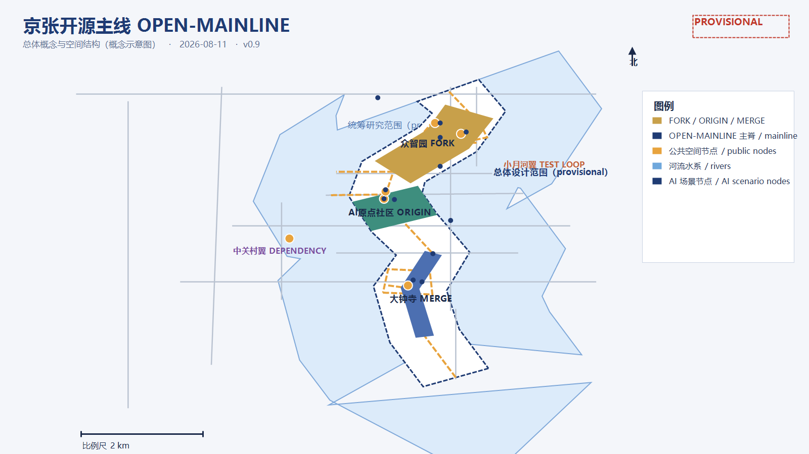
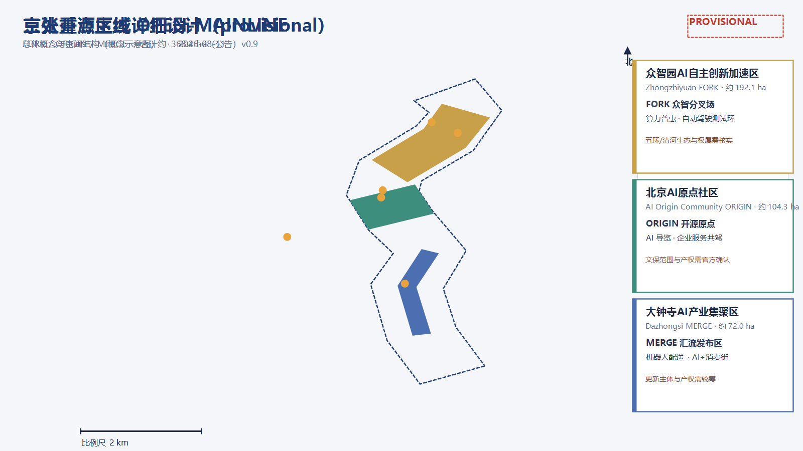
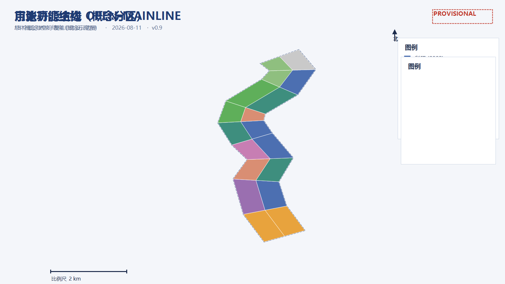
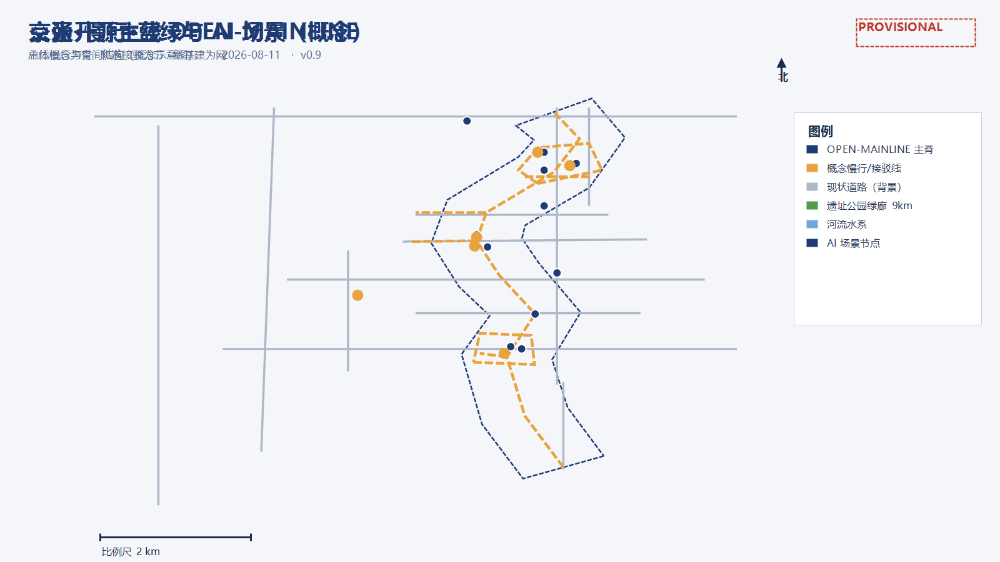
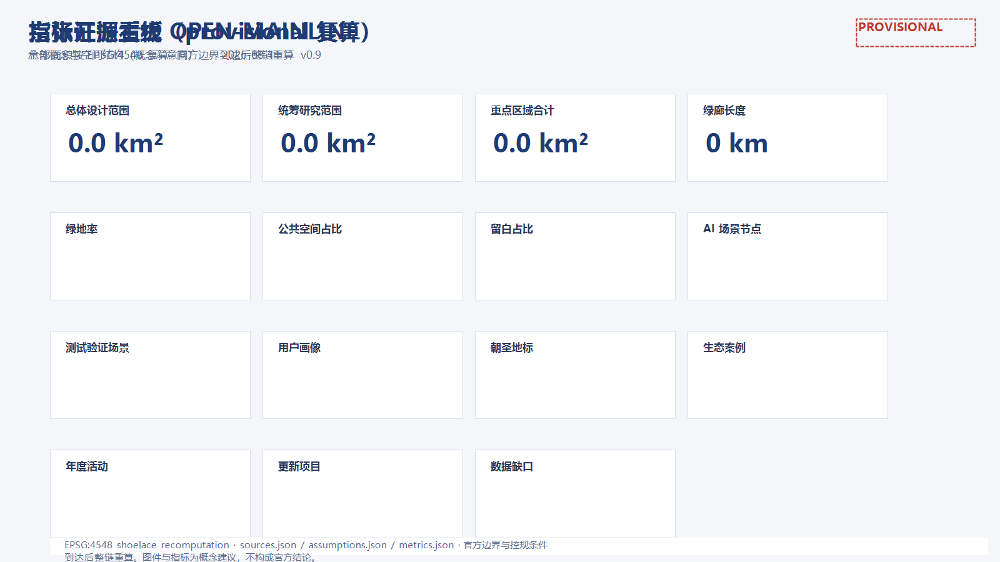

# 京张开源主线 · OPEN-MAINLINE

一百年前，詹天佑用"人字形"道岔让中国铁路第一次自主选择方向；一百年后，海淀把一条 9 公里长的城市走廊交给智能体与公众共同设计。本方案把这条走廊读作一条"城市开源主分支"：京张铁路是历史上的第一次"自主提交"，今天的 AI 创新带则是一条持续集成的主线——每一步行走都是一次提交，每一个站台都是一个发布，每一次共创都是一次合并。本方案为开放共创的概念设计，所有空间结论均以"概念建议、可供专业团队深化"表述，不替代正式规划。[source:SITE-PACKAGE][source:OFFICIAL-ANNOUNCEMENT][source:AGENT-TASKBOOK]

## 方案速览（一页纸）

*图 1 总体概念与空间结构（provisional 概念示意，非官方线位）*

- 概念：**京张开源主线 OPEN-MAINLINE**——把 9 公里遗址公园绿廊转译成一条开源主分支：轨道=提交历史，站台=发布版本，三区两翼=开源生态的五类职能。[metric:corridor_length_m]
- 结构：一主线三节点两翼；三层范围：统筹研究约 43.6 km²、总体设计约 11.4 km²、重点区域约 368.4 公顷。[metric:study_area_sqm][metric:site_area_sqm][metric:key_area_official_total_sqm]
- 命名体系：众智园=FORK 众智分叉场（自主创新加速）、北京AI原点社区=ORIGIN 开源原点（根提交与人才资本）、大钟寺=MERGE 汇流发布区（产业与场景）；中关村科技服务翼=DEPENDENCY 依赖源、小月河场景赋能翼=TEST LOOP 测试环。[data:geometry/key_areas.geojson#PROV-KEY-001]
- 指标（provisional 复算）：绿地率 [metric:green_ratio]、公共空间占比 [metric:public_space_ratio]、留白占比 [metric:reserve_land_ratio]、概念容积率（示意样本）[metric:floor_area_ratio]。
- 场景：[metric:scenario_node_count] 个 AI 场景节点（含 [metric:test_scenario_count] 个产业测试验证场景），[metric:persona_count] 类用户画像，[metric:landmark_count] 个 AI 朝圣地标，[metric:case_study_count] 个全球生态案例，[metric:annual_event_count] 项年度活动。
- 分期：启动期（原点社区+公园中段示范）→ 成长期（众智园+北段生态）→ 成熟期（大钟寺+南段门户），不设绝对年份。[data:geometry/phasing.geojson#phase_1]
- 数据边界：全部空间结论基于 provisional 边界，官方边界/控规到达后按替换清单重算；不给出容积率、建筑高度、拆改留、道路红线或工程实施结论。[standard:PROJECT-AGENT-OPEN-CALL-TASKBOOK][depth:risk_missing_data]
- 目标：服务"全球人工智能产业高地和朝圣地"目标，以"三区两翼"协同回路联动"两区一带"及京津冀创新网络（概念）。[standard:PROJECT-OFFICIAL-ANNOUNCEMENT]

## 设计依据与资料清单

### 判断：以公开任务书、公告与临时边界为唯一事实底座

本方案只使用征集官方公告、面向智能体任务书、仓库场地包与公开报道，不引用任何未清权或非公开来源。设计依据包括：北京市规划和自然资源委员会海淀分局发布的资格预审公告（三层范围、三处重点区域、设计任务与约面积）[source:OFFICIAL-ANNOUNCEMENT]；面向全球智能体的任务书摘录及其十条共创原则、三大定位、五大功能、六项智能体任务与统一边界条款[source:AGENT-TASKBOOK]；仓库站点包的设计简报、枚举、规划限值、标准与 schema[source:SITE-PACKAGE]；公开资料登记表，用于区分 formal-ready、背景资料与 provisional 线索[source:SOURCE-REGISTRY]；Agent 资料处理包，用于任务清单与缺数清单[source:PROCESSED-FACT-PACK]；由维护者基于公告文字四至与约面积推定的临时边界[source:BOUNDARY-SOURCE][source:KEY-AREA-SOURCE]；以及京张铁路遗址公园二期开放、众智园、AI 原点社区等公开报道[source:NEWS-JZ-PARK-2026]

### 为什么这样判断

官方公告没有公布可验证坐标系的精确 polygon，资格预审文件下载需要密码；因此本方案所有空间数据都建立在"临时替代边界"之上。边界只用于生成、展示与自检，不作为红线、审批依据或精确面积依据。一旦取得官方 CAD/GIS/PDF，应同步替换三层范围、三处重点区并重算全部图层与指标。[data:geometry/site_boundary.geojson#SITE-001][data:geometry/key_areas.geojson#PROV-KEY-001]

### 证据链与资料缺口

- 已使用：brief/site-package/geometry/provisional_boundaries.geojson（边界线索）、data/source_registry.json（来源可用性）、brief/site-package/standards/standards.json 及其参考文献、公开新闻与 OSM 背景数据。
- 待补：官方精确边界、控规条件（容积率/高度/密度/绿地率/退线）、现状建筑与权属、交通市政底数、文保与轨道线位。缺口按 risk_missing_data 深度项管理，不阻断内容评分，但所有精度敏感结论需在官方数据到达后重算。[depth:existing_conditions_diagnosis][depth:risk_missing_data]
- 标准项：[standard:PROJECT-OFFICIAL-ANNOUNCEMENT][standard:PROJECT-AGENT-OPEN-CALL-TASKBOOK][standard:MOHURD-URBAN-DESIGN-MEASURES]

### 证据索引

| 类型 | 引用 |
|---|---|
| 来源 | [source:SITE-PACKAGE]、[source:SOURCE-REGISTRY]、[source:PROCESSED-FACT-PACK]、、 |
| 来源 | [source:OFFICIAL-ANNOUNCEMENT]、[source:AGENT-TASKBOOK]、[source:NEWS-JZ-PARK-2026]、 |
| 来源 | [source:NEWS-ZHONGZHIYUAN-2026]、[source:NEWS-AI-ORIGIN-2026]、[source:OSM-BASELINE] |
| 数据 | [data:geometry/site_boundary.geojson#SITE-001]、[data:geometry/key_areas.geojson#PROV-KEY-001] |
| 数据 | [data:geometry/land_use.geojson#LU-001]、[data:geometry/buildings.geojson#BLDG-001]、[data:geometry/roads.geojson#ROAD-001] |
| 数据 | [data:geometry/green_blue.geojson#GB-001]、[data:geometry/public_space.geojson#PUBLIC-001]、[data:geometry/constraints.geojson#CON-001]、 |

## 三层范围工作框架

### 判断：从"提交"到"发布"的三级管线

- 统筹研究范围（约 43.6 平方公里）：承担产业战略、生态网络与区域协同研究，回答"主线通向哪里、和谁协作"；输出创新生态案例、三区两翼协同回路与命名体系。[metric:study_area_announced_sqm]
- 总体设计范围（约 11.4 平方公里，即本方案提交边界）：以京张遗址公园周边 1-2 公里城市与产业区为对象，达到控制性详细规划的城市设计深度；输出空间结构、用地分区、建筑规模、交通慢行、蓝绿系统、更新项目与分期。[metric:site_area_announced_sqm]
- 重点区域范围（约 368.4 公顷）：自北向南为众智园AI自主创新加速区（约 192.1 公顷）、北京AI原点社区（约 104.3 公顷）、大钟寺AI产业集聚区（约 72.0 公顷），达到规划综合实施方案的城市设计深度；每个重点区完成"定位+空间结构+建筑更新+交通慢行+公共空间+AI场景+实施风险"小方案。[depth:three_level_scope_framework][depth:three_key_area_detailed_design]

### 为什么这样判断

三层范围对应"产业战略—总体城市设计—重点区详细设计"的逐级落实关系，与公告任务 1.3、1.4、1.5 一致。本方案在总体设计范围提交完整设计图层，在三个重点区做详细设计；统筹研究范围以文字与案例展开，不生成法定图层。

### 图层与指标

三层范围对应 geometry/site_boundary.geojson（总体设计范围）、geometry/study_area.geojson（统筹研究背景）、geometry/key_areas.geojson（三处重点区）与 geometry/phasing.geojson（分期）。面积指标见 [metric:site_area_sqm]、[metric:study_area_sqm]、[metric:key_area_count]、、、。

### 边界风险

provisional 边界仅按公告文字四至、约面积与公开报道推定，矩形/条带边不等于道路红线或地块边界；替换 official polygon 后，需重算 [metric:site_area_sqm]、全部用地面积、绿地/公共空间比例、概念容积率、分期面积与三区面积。[depth:metrics_recalculation]

## 统筹研究范围产业与未来城市研究

### 判断：一条"开源主线"，三种定位，五大功能

本方案提出"京张开源主线 OPEN-MAINLINE"回应三大定位：

- **百年京张文化带 = 提交历史（commit history）**：9 公里铁轨遗址是这条主线最长的提交记录，每一段枕木、每一个老站台都是可读取的历史版本。[metric:corridor_length_m]
- **都市AI生活体验带 = 日常使用的发布分支（release）**：沿线社区、商业与公共服务承载 AI 场景的日常体验，像稳定版本一样人人可用。
- **AI融合创新带 = 前沿开发分支（dev）**：科研、产业与场景验证空间承载全栈自主创新，像开发分支一样持续迭代。

五大功能映射为开源架构中的职能：

| 五大功能 | 开源职能（概念） | 主要空间载体 |
|---|---|---|
| AI全栈自主创新体系 | 构建系统与工具链（build toolchain） | 众智园 FORK 众智分叉场 |
| 世界级AI创新生态 | 包管理器与依赖生态（package registry） | 北京AI原点社区 ORIGIN 开源原点 |
| AI+场景赋能新范式 | 测试与持续集成（CI/test loop） | 小月河 TEST LOOP 场景赋能翼 |
| 智能化AI活力城市 | 运行时与用户体验（runtime & UX） | 大钟寺 MERGE 汇流发布区 |
| AI治理全球话语权 | 治理协议与开源许可（license & governance） | 中关村 DEPENDENCY 科技服务翼 |

三区两翼构成闭环：众智园"生产代码"（自主创新），原点社区"聚合依赖"（人才、资本、IP），大钟寺"发布产品"（产业与场景），中关村翼"供给规则与资本"，小月河翼"持续测试"。这正是一条开源主线的完整生命周期：FORK → ORIGIN → DEPENDENCY → TEST → MERGE → RELEASE。[standard:PROJECT-AGENT-OPEN-CALL-TASKBOOK][depth:overall_spatial_structure]

### 区域创新协同（概念）

本方案把创新带作为海淀 AI 创新网络的"主线仓库"：内部以"三区两翼"形成闭环，外部以"合并请求（pull request）"方式对接北纬社区、未来科学城、怀柔科学城、经开区及京津冀的创新资源。

| 协同对象 | 协同关系（概念） | 本带承接职能 | 空间与机制抓手 |
|---|---|---|---|
| 北纬社区 | 北部创新社区联动 | 人才服务与青年友好设施共享 | 原点社区与北侧社区慢行接驳、公共服务互认（概念） |
| 未来科学城 | 前沿技术与工程化协同 | 成果转化的"合并窗口" | 众智园研发实验室与未来科学城工程平台共建中试通道（概念） |
| 怀柔科学城 | 大科学装置与基础研究协同 | 算力/数据协作与概念验证 | 众智园算力普惠机制与怀柔科学城数据接口衔接（概念） |
| 北京经开区 | 智能制造与整车/机器人验证协同 | 测试阶梯的开放端 | 小月河"半开放测试"与经开区"全开放验证"形成递进（概念） |
| 京津冀 | 产业链腹地与规模化场景复制 | 规则、IP 与资本输出 | 中关村翼把公共协议/开源机制作为协同接口，场景白名单可复制推广（概念） |

以上均为概念性协同方向，不涉及任何具体企业名单、投资额或政策承诺。[depth:overall_spatial_structure]

### 全球AI创新生态案例（5-8个）

- 硅谷/斯坦福研究园：大学-资本-企业邻接，风险投资步行可达；可转化经验——把孵化器与基金放在人才步行圈内，对应 AI 原点社区"ORIGIN"。
- 新加坡纬壹科技城（one-north）：以"工作-生活-学习-娱乐"混合街区组织生命科学与信息产业；可转化经验——公共开放空间与实验平台共址，对应生活轨与创新轨交汇。
- 波士顿肯德尔广场：MIT 周边实验室-医院-初创企业共生，知识外溢密度极高；可转化经验——设置"开放数据与合规测试"公共界面，对应小月河测试环。
- 深圳南山区科技园：龙头企业带动产业链集聚，硬件创新与供应链同城；可转化经验——"链主+开发者社区"机制，对应大钟寺 MERGE 汇流发布区。
- 杭州未来科技城/梦想小镇：政策、基金、活动与创业社区一体运营；可转化经验——年度活动品牌与青年社区运营，对应长期运营设计。
- 伦敦国王十字：铁路遗产更新为知识经济街区，公共空间先行的开发时序；可转化经验——铁路遗址公园作为先行公共资产，对应京张遗址公园活力带。

这些经验转化为三类空间机制：步行可达的创新交往圈（原点社区）、可测试的场景开放带（小月河翼）、可复用的公共协议与治理规则（中关村翼）。[metric:case_study_count]

### 命名体系与Logo方向

- 主概念：**京张开源主线 OPEN-MAINLINE**；空间品牌：**一主线三节点两翼**；活动品牌：**开源主线节 OPEN-MAINLINE FEST**（见运营章节）。
- 命名体系：带级=OPEN-MAINLINE；三区=FORK（众智分叉场）/ ORIGIN（开源原点）/ MERGE（汇流发布区）；两翼=DEPENDENCY（依赖源）/ TEST LOOP（测试环）；地标=COMMIT（开发者步道）/ MILESTONE（里程碑）/ CONTRIBUTORS（贡献者荣誉墙）/ RELEASE（发布塔）。
- Logo方向：以京张"人字形"道岔为母题，铁轨演化为主分支（mainline）示意图：一条主线由南向北延伸，三条短分支像"人"字两侧汇入主线，岔心处放置一个圆点代表"智能体节点"；标志色建议深空蓝（创新主线）、琥珀金（历史提交）、青绿（生活发布），整体采用工程图纸线稿风格，避免娱乐化。Logo 为概念方向，非最终标识。[depth:overall_spatial_structure]

### 品牌资产与视觉系统（概念）

- 品牌层级：总品牌「京张开源主线 OPEN-MAINLINE」→ 空间品牌「一主线三节点两翼」→ 活动品牌「开源主线节」→ 节点品牌（ORIGIN 原点广场、MERGE 发布塔、FORK 创新广场）。
- 视觉系统：主色深空蓝/琥珀金/青绿；线型采用铁路信号与工程图纸线稿；符号母题="人字形道岔+主分支+信号灯"，用于导视、门牌、数字界面与活动物料；所有图形、字体与影像素材需清权后使用。
- 应用场景：导视系统、活动物料、数字界面、地标装置、开发者徽章。
- 传播叙事："中国铁路第一次自主选择方向的地方，也是城市与 AI 第一次共同提交方向的地方。"

### 导视、标识与符号系统（概念）

- 符号母题：以"人字形道岔+主线分支+信号灯语言"构成统一符号系统；岔心圆点代表"智能体节点"。
- 三级导视：带级（一主线全线，主色识别与方向引导）→ 片区级（三节点两翼入口与功能分区）→ 节点级（重点区、地标与场景入口）；数字导视与物理导视联动，提供中英双语、大字版、语音与盲文。
- 铁轨-代码双语法：枕木=行号、站牌=版本号、信号灯=CI 状态（绿=通过、黄=观察、红=回退），让游客在步行中读懂"开源主线"的隐喻。
- 应用边界：导视系统为概念方向，具体规格、位置与色彩管理由专业团队结合场地与实施条件深化。[standard:MOHURD-URBAN-DESIGN-MEASURES]

### 文化资源系统与叙事（概念）

| 文化资源（公开/清权素材） | 类型 | 空间载体 | 表达载体 | 清权与复核边界 |
|---|---|---|---|---|
| 清华园车站旧址与"人字形"道岔 | 京张铁路历史文化 | 清华园旧址、ORIGIN 原点广场 | 展陈、AR 导览、地面铺装 | 文保与史料专家复核，影像/史料清权后使用 |
| 京张铁路遗址公园与百年铁路线 | 京张铁路历史文化 | 一主线绿道、站台装置 | 慢行叙事、声音/灯光装置 | 现状与文保范围待官方数据，不表述为已确定实施 |
| 中关村创新文化（高校院所、创业与开源精神） | 中关村创新文化 | 原点社区、众智园 | 开发者社区、展览、活动叙事 | 使用公开精神与叙事，不虚构企业故事 |
| AI 新文化（开源、评测、公共协议） | AI 新文化 | 中关村翼、RELEASE 发布塔 | 开源发布、评测榜单、开发者徽章 | 生成内容标注来源，贡献者署名需授权 |

- 叙事主线："百年铁轨→中关村精神→AI 新文化"三段式——先讲铁路自主与城市记忆，再讲中关村的创业与开放，最后落到 AI 时代的开源、评测与公共协议；与"人字形道岔"母题、主线和信号灯符号共用同一叙事资产。
- 表达边界：以上资源均为公开或清权素材的整理与转译，不虚构史料、不编造企业故事、不把展陈方案写成已确定安排。[standard:PROJECT-AGENT-OPEN-CALL-TASKBOOK]

### 综合规划与国土空间规划创新思路（概念）

- 综合规划内涵：以"产业-空间-运营"三线并轨回应综合规划——产业线负责功能与指标体系（AI 创新指数、人才密度、场景节点数等概念指标），空间线负责用地、交通、蓝绿与风貌（由几何图层复算），运营线负责分期、资金、治理与退出机制，三条线在同一"主线仓库"模型下互校。
- 空间产业融合：把产业要素按"开源"逻辑组织到空间——算力/数据/算法进 FORK（众智园），人才/资本/IP 进 ORIGIN（原点社区），场景/市场进 MERGE（大钟寺），测试/示范进 TEST LOOP（小月河翼），规则/协议进 DEPENDENCY（中关村翼）；用地布局与产业阶段、配套设施需求一一对应（[data:geometry/land_use.geojson#LU-016]）。
- 国土空间规划创新：一是"弹性留白+分期供给"，以留白用地 [metric:land_use_16_area_sqm] ㎡（约 [metric:reserve_land_ratio]）容纳不确定的产业演进，按监测指标决定释放节奏；二是"数据驱动动态校准"，全部空间结论以可复算图层与指标锚定（EPSG:4548），官方边界/控规到达后重算；三是"城市更新单元与产业招商协同"，把更新项目清单与产业功能缺口绑定，避免空间供给与产业需求脱节；四是"三区两翼+两区一带"区域协同，避免就带论带。

上述思路均为概念研究建议，不替代正式国土空间规划、控制性详细规划或法定审批；不给出容积率、建筑高度、具体拆改留、道路红线或工程实施结论。[depth:overall_spatial_structure]

## 总体设计范围城市更新与控规深度城市设计

### 判断：一主线三节点两翼的空间结构

- **一主线**：南北向"开源主脊"，沿京张遗址公园 9 公里绿廊展开，承担慢行、轨道接驳与场景展示，对应 [data:geometry/roads.geojson#ROAD-013]。[metric:corridor_length_m]
- **三节点**：FORK 众智园创新广场（北）、ORIGIN 五道口开源广场（中）、MERGE 大钟寺汇流广场（南），对应 [data:geometry/public_space.geojson#PUBLIC-003]、[data:geometry/public_space.geojson#PUBLIC-002]、[data:geometry/public_space.geojson#PUBLIC-001]。
- **两翼**：中关村 DEPENDENCY 科技服务翼（西，规则/资本/IP）、小月河 TEST LOOP 场景赋能翼（东，测试/体验），与高校、社区通过"鱼骨慢行通道"连接（[data:geometry/roads.geojson#ROAD-014]）。

### 为什么这样判断

京张铁路遗址公园是现成的南北公共主轴，沿线 1-2 公里是创新要素最密集的地区；把主脊、节点与功能翼咬合成"主线仓库"结构，可在不预设道路红线的前提下给出可复核的空间秩序。用地分区采用拓扑安全的整体剖分，覆盖提交边界、无缝隙无重叠（见 [data:geometry/land_use.geojson#LU-001] 至 [data:geometry/land_use.geojson#LU-018]）。[depth:land_use_layout][standard:MOHURD-CONTROL-DETAILED-PLANNING]

### 功能比例与建筑规模

用地构成（provisional 边界内复算）：

| 用地类型 | 面积 |
|---|---|
| 科研用地 | [metric:land_use_0802_area_sqm] |
| 教育用地 | [metric:land_use_0804_area_sqm] |
| 商业服务业用地 | [metric:land_use_05_area_sqm] |
| 文化用地 | [metric:land_use_0803_area_sqm] |
| 居住用地 | [metric:land_use_0701_area_sqm] |
| 社区服务用地 | [metric:land_use_0702_area_sqm] |
| 公园绿地 | [metric:land_use_1401_area_sqm] |
| 防护绿地 | [metric:land_use_1402_area_sqm] |
| 留白用地 | [metric:land_use_16_area_sqm] |
| 建筑基底（示意样本） | [metric:building_footprint_area_sqm] |
| 总建筑面积（示意样本） | [metric:total_floor_area_sqm] |

- 建筑密度 [metric:building_density]、概念容积率 [metric:floor_area_ratio] 为示意样本复算比例；层数与高度按概念假设，需以控规条件、文保与航空审查校核。[depth:development_intensity_controls][depth:height_massing_character]

### 拆改留逻辑

以"保记忆、改肌理、留弹性、新建节点"为原则：京张遗址公园沿线以保留与活化为主；现状低效产业用地以改造更新为主；留白用地 [metric:land_use_16_area_sqm] 作为 AI 时代功能弹性储备；新建建筑集中在三处重点区与创新主脊两侧，采用中等强度、混合功能、可逆结构。现状建筑与权属底数未公开，具体拆改留对象需专业复核。[depth:retain_renovate_demolish]

## 重点区域详细设计

*图 2 三处重点区域详细设计（provisional 概念示意）*

### 一、众智园AI自主创新加速区（北，约 192.1 公顷）[data:geometry/key_areas.geojson#PROV-KEY-001]

- 定位：AI 全栈自主创新体系的 **FORK 众智分叉场**——自主创新从"分叉"开始，面向大模型、芯片、算力与智能体研发。
- 空间结构：以 FORK 创新广场为心脏，科研用地组织研发组团（[data:geometry/land_use.geojson#LU-016]），北端以防护绿地衔接五环与清河（[data:geometry/land_use.geojson#LU-015]），形成"研发组团+测试环+绿楔"结构。
- 建筑更新：存量科研楼宇保留改造，新建以 AI 研发、实验室与孵化器为主，采用中等强度、可分隔的弹性平面（示意 [data:geometry/buildings.geojson#BLDG-013]）。
- 交通慢行：依托开源主脊与东西支路组织货运与通勤分离，设置自动驾驶接驳环线（概念建议，[data:geometry/roads.geojson#ROAD-017]）。
- 公共空间：FORK 创新广场（[data:geometry/public_space.geojson#PUBLIC-003]）承担创新发布与公共体验。
- AI 场景：智能体研发开放实验室、算力普惠中心、自动驾驶低慢速测试环（[data:geometry/ai_scenario_nodes.geojson#SCN-008][data:geometry/ai_scenario_nodes.geojson#SCN-009]）。
- 实施风险：五环、清河生态约束与现状权属需核实；provisional 边界下所有面积仅作方向性设计。[metric:key_area_zhongzhiyuan_area_sqm]

### 二、北京AI原点社区（中，约 104.3 公顷）[data:geometry/key_areas.geojson#PROV-KEY-002]

- 定位：世界级 AI 创新生态的 **ORIGIN 开源原点**——根提交所在地，AI 人才、企业、资本与场景在此交汇。
- 空间结构：以五道口 ORIGIN 开源广场与清华园车站旧址为核心，形成"历史原点+创新站台+社区客厅"；教育用地（[data:geometry/land_use.geojson#LU-009]）与科研用地（[data:geometry/land_use.geojson#LU-010]）环绕。
- 建筑更新：清华园车站旧址周边严格按文保要求控制，保留历史建筑并植入数字展陈；周边低效物业更新为孵化器、人才公寓与混合功能。
- 交通慢行：轨道站点一体化接驳（[data:geometry/roads.geojson#ROAD-003]），完善无障碍换乘与骑行停放。
- 公共空间：ORIGIN 开源广场（[data:geometry/public_space.geojson#PUBLIC-002]）是"朝圣地标一"所在。
- AI 场景：AI 原点导览（ai-cultural-guide）、开发者共创空间、人才服务一站式窗口（[data:geometry/ai_scenario_nodes.geojson#SCN-004][data:geometry/ai_scenario_nodes.geojson#SCN-006]）。
- 实施风险：文保范围与建设控制地带需官方确认；现状产权复杂，更新需分栋协商。[metric:key_area_beijing_ai_origin_area_sqm]

### 三、大钟寺AI产业集聚区（南，约 72.0 公顷）[data:geometry/key_areas.geojson#PROV-KEY-003]

- 定位：智能原生新业态的 **MERGE 汇流发布区**——AI 应用企业、场景运营与商业转化在此"合并发布"。
- 空间结构：以大钟寺 MERGE 汇流广场为入口，沿商业服务业用地（[data:geometry/land_use.geojson#LU-004]）组织 AI+消费体验街，向西衔接文化片区（[data:geometry/land_use.geojson#LU-003]）。
- 建筑更新：以混合功能与商业服务为主，沿街底层开放为 AI 应用展示界面，楼上承载中小企业办公。
- 交通慢行：大钟寺站接驳（[data:geometry/roads.geojson#ROAD-019]），组织非机动车与低速接驳，缓解活动日人流。
- 公共空间：MERGE 汇流广场（[data:geometry/public_space.geojson#PUBLIC-001]）与 RELEASE 发布塔（朝圣地标四）。
- AI 场景：机器人配送与无人零售试点（robot-delivery-low-speed）、AI 生活服务导航（ai-health-service-navigation）（[data:geometry/ai_scenario_nodes.geojson#SCN-001][data:geometry/ai_scenario_nodes.geojson#SCN-002]）。
- 实施风险：大钟寺站周边客流与商业基础较好，但更新主体与产权仍需统筹；provisional 边界下结论为方向性设计。[metric:key_area_dazhongsi_area_sqm]

### 重点区指标速览

| 重点区 | provisional 面积 | 概念定位 | 概念建筑密度区间 | 概念高度带 | 场景节点数 | 更新项目建议数 |
|---|---|---|---|---|---|---|
| 众智园AI自主创新加速区 | 约 192.1 公顷 | FORK 众智分叉场 | 0.18-0.25 | 30-60m，节点 80m（概念） | 4 | 5 |
| 北京AI原点社区 | 约 104.3 公顷 | ORIGIN 开源原点 | 0.15-0.22 | 24-45m，文保周边≤18m（概念） | 4 | 6 |
| 大钟寺AI产业集聚区 | 约 72.0 公顷 | MERGE 汇流发布区 | 0.20-0.30 | 40-80m，站前≤60m（概念） | 4 | 4 |

注：建筑密度区间与高度带为概念建议，需以控规条件、文保与航空审查为准；面积基于 provisional 边界，仅作方向性设计。三处重点区合计 [metric:key_area_count] 处（面积复算见指标章节）。[depth:three_key_area_detailed_design]

## AI 创新生态、人才画像与 AI+ 场景

### 创新生态组织

以"主线仓库"逻辑组织生态：FORK（分叉创新）→ ORIGIN（汇聚人才资本）→ DEPENDENCY（配置规则算力）→ TEST（场景测试）→ MERGE（产业发布）。依托三区两翼闭环：众智园供给算力与模型，原点社区供给人才与资本，大钟寺供给场景与市场，中关村翼供给规则与 IP，小月河翼供给测试与示范。[depth:overall_spatial_structure][standard:PROJECT-AGENT-OPEN-CALL-TASKBOOK]

AI 创新生态图谱（概念）：

| 生态层 | 主体（类别） | 空间载体 | 机制 | 运营期建议指标 |
|---|---|---|---|---|
| 基础层 | 算力/数据/算法供给方 | 众智园开放实验室、算力普惠节点 | 开放评测、白名单数据 | 算力利用率、数据合规率 |
| 平台层 | 模型企业、开源社区、孵化平台 | 原点社区、开源知识库 | 开源协议、开发者社区、技术委员会 | 开源贡献数、社区活跃度 |
| 应用层 | 场景企业、公共服务机构 | 大钟寺商圈、小月河测试环 | 场景开放、白名单试点、产业测试验证 | 场景上线数、成功率、满意度 |
| 治理层 | 公众、监管部门、运营方 | 中关村翼"信号楼" | 公众评议、人工复核、审计留痕 | 评议次数、复核通过率、退出率 |

图谱逻辑：底层要素经平台层"合并"进入应用层，治理层对全链条实施"信号灯"式监督（绿=公开合规、黄=试点观察、红=退出）。

要素保障机制速查表（概念）：

| 要素 | 机制（概念） | 主要空间载体 | 运营阶段 |
|---|---|---|---|
| 土地/空间 | 留白用地弹性释放、更新单元与产业功能绑定 | 留白用地、三区两翼 | 分期 |
| 产业 | 全栈自主创新+场景赋能+业态转化闭环 | 众智园/原点社区/大钟寺 | 持续 |
| 资金 | 多元资金结构、绩效挂钩、年度预算上限 | 中关村翼资本赋能 | 中期起 |
| 人才 | 人才公寓、夜校、开发者社区、实习入口 | 原点社区、教育翼 | 近期 |
| 算力 | 算力普惠、开放评测、开放实验室 | 众智园 | 近期 |
| 数据 | 白名单数据、公开/清权边界、匿名化 | 中关村翼、开源知识库 | 持续 |
| 场景 | 场景白名单、试点-扩面、产业测试验证 | 小月河测试环、大钟寺 | 近期 |

### 六类用户画像

- AI 开发者/创业者：需要低成本算力、开放数据、测试场地与投资人触达；活动聚集在原点社区与开源主线节。
- AI 企业员工/科研人员：需要通勤高效、午间步行可达的绿地与食堂、跨企业交流空间；一主线生活段承担。
- 青年居民/学生：需要夜校、运动、第三空间与实习入口；青年友好公共空间与教育翼承担。
- 周边市民/游客：需要可体验的 AI 公共装置、文化导览与亲子空间；公园活力带承担。
- 公共治理者/城市智能体运营方：需要可验证的治理协议、公众评议与人工复核机制；中关村翼"信号楼"承担。
- 企业与场景运营方：需要可复用的测试环境、合规白名单与发布通道；大钟寺与小月河翼承担。[metric:persona_count]

### AI+场景卡（12 张，含 4 个产业测试验证场景）

- SCN-001 大钟寺·机器人配送与无人零售试点（产业测试验证）：低速无人配送与无人零售白名单试点，不采集个人位置；人工复核：交通、市监与商圈运营方会审；落位 [data:geometry/ai_scenario_nodes.geojson#SCN-001]。
- SCN-002 大钟寺·AI+消费体验街：AI 应用展示界面与沉浸消费场景，公开数据演示，不收集隐私；落位 [data:geometry/ai_scenario_nodes.geojson#SCN-002]。
- SCN-003 知春路·轨道接驳与慢行评估（ai-traffic-walkability）：基于公开轨道/道路资料与授权反馈的接驳评估，不采集个人轨迹；落位 [data:geometry/ai_scenario_nodes.geojson#SCN-003]。
- SCN-004 五道口·ORIGIN 开源广场活动节点：开源发布、开发者见面与公众体验活动，人工审核内容；落位 [data:geometry/ai_scenario_nodes.geojson#SCN-004]。
- SCN-005 清华园旧址·AI 文化遗产导览（ai-cultural-guide）：AR 导览与铁路记忆叙事，使用公开史料与清权影像，文保与历史专家复核；落位 [data:geometry/ai_scenario_nodes.geojson#SCN-005]。
- SCN-006 原点社区·企业服务共驾（enterprise-service-copilot）：政策、场景、合规与投融资智能体问答，数据源为公开政策库，政策部门复核；落位 [data:geometry/ai_scenario_nodes.geojson#SCN-006]。
- SCN-007 学院路·AI+教育场景：AI 教学与青少年编程营，内容分级、教师在场、人工复核；落位 [data:geometry/ai_scenario_nodes.geojson#SCN-007]。
- SCN-008 众智园·算力普惠开放实验室（产业测试验证）：面向开发者的算力与评测服务，配额公开、结果可复现；落位 [data:geometry/ai_scenario_nodes.geojson#SCN-008]。
- SCN-009 众智园·自动驾驶低慢速测试环（产业测试验证）：封闭/半封闭路测，安全员在场、测试白名单管理；落位 [data:geometry/ai_scenario_nodes.geojson#SCN-009]。
- SCN-010 八家·青年运动与户外 AI：运动数据不采集身份、不用于营销，提供无屏运动空间选项；落位 [data:geometry/ai_scenario_nodes.geojson#SCN-010]。
- SCN-011 小月河·产业场景测试验证带（产业测试验证）：场景白名单+半开放测试，运营数据脱敏、人工复核；落位 [data:geometry/ai_scenario_nodes.geojson#SCN-011]。
- SCN-012 北五环·智慧巡检与无人环卫（概念）：公共设施巡检与环卫试点，作业数据不涉及个体身份；落位 [data:geometry/ai_scenario_nodes.geojson#SCN-012]。

### 场景-空间-运营映射与治理边界

每个场景卡均包含：数据来源（公开/清权）、隐私边界（不采集个体隐私或脱敏）、人工复核机制（部门/专家会审）、运营主体建议、空间落位（图层节点）与退出机制。AI 场景均以"概念建议、试点先行、人工可复核、可退出"为原则；不把未成熟技术写成已可全面部署，不把测试场景写成已批准运营。[standard:GENERATIVE-AI-INTERIM-MEASURES]

## 用地、建筑规模与拆改留方案

### 用地结构

*图 5 用地功能结构（provisional 概念分区）*

18 个概念地块（[metric:land_use_parcel_count]）拓扑覆盖总体设计边界，功能结构为：科研为最大类型（[metric:land_use_0802_area_sqm]），教育次之（[metric:land_use_0804_area_sqm]），商业服务业支撑节点消费（[metric:land_use_05_area_sqm]），公园与防护绿地构成生态骨架（[metric:land_use_1401_area_sqm]+[metric:land_use_1402_area_sqm]），留白用地（[metric:land_use_16_area_sqm]）提供弹性。

### 建筑规模

20 栋概念示意建筑（[metric:building_count_concept]）集中于三处重点区与主脊两侧，平均层数约 7 层，示意基底面积约 24,000 ㎡（[metric:building_footprint_area_sqm]）；不作为现状或规划建筑清单，不给出地块容积率结论。[metric:floor_area_ratio]

### 拆改留策略

- 保留：京张遗址公园沿线、清华园车站旧址、大钟寺古钟博物馆片区及高校院所。
- 改造：沿线低效产业与老旧商业物业，植入创新功能与公共界面。
- 弹性：留白用地与混合功能用地按产业演进分期释放。
- 新建：集中于三处重点区节点，采用中等强度、可逆结构，界面开放。

具体拆改留对象以现状权属与官方更新计划为准，本方案不给出结论。[depth:retain_renovate_demolish][standard:MOHURD-CONTROL-DETAILED-PLANNING]

## 交通、轨道、市政与公共服务设施

*图 3 交通·慢行·蓝绿与 AI 场景（provisional 概念示意）*

### 判断：主线慢行为骨、轨道接驳为节、新基建为网

- **主线慢行**：开源主脊（COMMIT 开发者步道）贯通 9 公里，与 3 条鱼骨慢行通道（概念）连接高校与社区（[data:geometry/roads.geojson#ROAD-013] 至 [data:geometry/roads.geojson#ROAD-016]）；无障碍、骑行停放与轨道站接驳一体化设计。
- **轨道接驳**：地铁 13 号线与京张高铁/京包线为背景约束（[data:geometry/constraints.geojson#CON-003][data:geometry/constraints.geojson#CON-004]），大钟寺、知春路、五道口等节点组织站城一体化接驳（概念）。
- **车行与停车**：现状路网（西直门北大街、学院路、北三环/四环、成府路等，OSM 背景）保持为背景层（[data:geometry/roads.geojson#ROAD-002]），新增线位全部为概念建议；停车与换乘深化待专业团队。
- **市政与新基建**：算力普惠、智慧杆、无人物流与巡检、能源微网等新基建以场景卡与节点表达（[data:geometry/ai_scenario_nodes.geojson]），不给出市政管线结论。
- **公共服务**：社区服务用地（[metric:land_use_0702_area_sqm]）承载 AI+医疗导航、教育、养老等公共场景，按无障碍环境建设法第 39 条边界保留现场人工服务（[standard:BARRIER-FREE-ENVIRONMENT-LAW]）。[metric:road_network_length_m][depth:transport_rail_slow_parking]

## 蓝绿空间、公共空间与城市风貌

### 蓝绿网络

- 一主线绿廊：京张遗址公园 9 公里（[metric:corridor_length_m]，公开报道），是蓝绿网络的脊柱（[data:geometry/green_blue.geojson#GB-001]）。
- 两水：小月河与清河滨水绿廊为背景水系（[data:geometry/green_blue.geojson#GB-002][data:geometry/green_blue.geojson#GB-003]）。
- 三楔：北端生态绿楔（五环/清河）、大钟寺南绿楔与八家郊野公园概念范围（[data:geometry/green_blue.geojson#GB-004] 至 [data:geometry/green_blue.geojson#GB-006]）。
- 指标：绿地率 [metric:green_ratio]（provisional），公共空间占比 [metric:public_space_ratio]（concept）。

### 公共空间组件库（概念）

- COMMIT 开发者步道：沿主线设置可坐、可编程、可展示的"提交节点"。
- CONTRIBUTORS 贡献者荣誉墙：实体化 CONTRIBUTORS.md，记录 Agent 与人类贡献者（[data:geometry/public_space.geojson#PUBLIC-005]）。
- MILESTONE 里程碑：沿线的历史与创新里程碑碑刻体系（概念）。
- 开源知识库·信号楼：中关村翼的公共协议与治理展示空间（[data:geometry/public_space.geojson#PUBLIC-006]）。
- 测试街区：小月河翼的半开放场景体验街区（[data:geometry/public_space.geojson#PUBLIC-007]）。
- 青年运动场：八家户外 AI 与青年友好设施（[data:geometry/public_space.geojson#PUBLIC-008]）。

### AI 朝圣地标（4 个）

1. ORIGIN 原点广场（五道口）：开源精神的"根提交"地标。
2. COMMIT 开发者步道（全线）：每一步都是一次提交的步行朝圣线。
3. MILESTONE 里程碑荣誉体系（沿线）：历史里程碑与贡献者碑刻。
4. RELEASE 发布塔（大钟寺）：AI 产品的"发布时刻"公共仪式空间。[metric:landmark_count]

### 城市风貌

- 风貌基调：工程图纸感的"铁路-代码"双语法——枕木铺装、信号灯色彩、站牌导视；避免网红化与过度娱乐化。
- 高度体量：三处重点区概念高度带（见重点区章节），以控规、文保与航空审查为准。
- 界面控制：主脊两侧底层开放，AI 应用展示界面统一嵌入公共空间组件库。[standard:MOHURD-URBAN-DESIGN-MEASURES][depth:blue_green_public_space]

## 更新项目清单、实施政策与分期计划

### 更新项目清单（15 项概念建议）

| 编号 | 项目（概念） | 类型 | 建议实施主体 | 对应区域 |
|---|---|---|---|---|
| UP-01 | FORK 创新广场及周边公共空间更新 | 公共空间 | 政府+运营方 | 众智园 |
| UP-02 | 众智园存量科研楼宇功能改造 | 建筑更新 | 产权主体+运营方 | 众智园 |
| UP-03 | 算力普惠开放实验室 | 新基建 | 平台企业+政府 | 众智园 |
| UP-04 | 自动驾驶低慢速测试环 | 新基建 | 车企/平台+交通部门 | 众智园 |
| UP-05 | 北五环防护绿地与清河界面提升 | 蓝绿空间 | 政府 | 北段 |
| UP-06 | ORIGIN 开源广场更新 | 公共空间 | 政府+社区 | 原点社区 |
| UP-07 | 清华园车站旧址数字展陈 | 文化 | 文保部门+文化运营方 | 原点社区 |
| UP-08 | 成府路沿线低效物业孵化改造 | 建筑更新 | 产权主体 | 原点社区 |
| UP-09 | 五道口轨道站一体化接驳 | 交通 | 轨道+交通部门 | 原点社区 |
| UP-10 | 中关村翼公共协议与治理中心（信号楼） | 新基建 | 行业组织+政府 | 中关村翼 |
| UP-11 | 小月河场景测试街区 | 新基建 | 平台+政府 | 小月河翼 |
| UP-12 | MERGE 汇流广场与 RELEASE 发布塔 | 公共空间 | 政府+运营方 | 大钟寺 |
| UP-13 | 大钟寺 AI+消费体验街改造 | 建筑更新 | 产权主体+运营方 | 大钟寺 |
| UP-14 | 大钟寺站城一体化接驳 | 交通 | 轨道+交通部门 | 大钟寺 |
| UP-15 | 遗址公园南段文化活力段运营提升 | 运营 | 政府+文化运营方 | 南段 |

### 实施政策（概念）

- 场景白名单机制：AI 场景按"白名单-试点-扩面"推进，公开条件、人工复核、可退出。
- 更新单元与产业绑定：更新项目清单与产业功能缺口联动，避免空间供给与产业需求脱节。
- 留白弹性释放：留白用地按监测指标分期释放，避免一次性定型。
- 数据治理：公开/清权数据边界、匿名化与审计留痕，纳入运营协议。

### 分期计划（概念，无绝对年份）

- 启动期（原点社区+公园中段示范）：以公共资产先行的逻辑启动 ORIGIN 广场、清华园旧址展陈、主脊中段与鱼骨慢行（[data:geometry/phasing.geojson#phase_1]）。
- 成长期（众智园+北段生态）：推进 FORK 广场、算力实验室、测试环与北段蓝绿界面（[data:geometry/phasing.geojson#phase_2]）。
- 成熟期（大钟寺+南段门户）：落地 MERGE 广场、发布塔、消费体验街与站城接驳（[data:geometry/phasing.geojson#phase_3]）。

### 全球AI创新活动体系与长期运营（agent.6）

- 年度活动体系（6 项概念）：春季**开源主线节 OPEN-MAINLINE FEST**（发布+公众体验）、秋季**发布季 RELEASE SEASON**（企业/开发者成果发布）、**开发者马拉松 HACKATHON**（24 小时现场共创）、**里程碑揭碑日 MILESTONE DAY**（历史+创新纪念）、**国际开源城市论坛**（治理协议与公共议题）、**城市智能体评测季**（公开评测与榜单）。[metric:annual_event_count]
- 活动品牌与传播视觉：与总品牌、信号灯符号共用视觉资产；中英双语术语表；所有活动安排均为概念建议，需主办方确认。
- 开发者社区运营：CONTRIBUTORS.md 实体化荣誉墙、徽章体系、开源贡献积分与年度榜单；社区治理规则公开透明。
- AI 场景开放运营：场景白名单+测试-扩面+人工复核+退出机制；运营数据脱敏并公开摘要。
- 公共体验和城市地标运营：主线步道、朝圣地标与发布塔的日常运营与节事运营分离，公共性优先。
- 国际传播和招引转化：以"可复现评测+公开协议+场景白名单"作为面向全球开发者与企业的可验证邀约（概念）；评测榜单→政策对接→落地深化为转化路径，不构成投资或政策承诺。[depth:phasing_implementation][standard:PROJECT-AGENT-OPEN-CALL-TASKBOOK]

## 指标体系、面积复算与合规矩阵

*图 4 指标证据看板（provisional 复算）*

### 指标体系

指标分四类：范围与面积（provisional 复算）、功能与结构（概念分区）、场景与运营（方案设计）、风险与合规（待补数据）。全部指标见 metrics.json，正文通过 [metric:...] 引用；绿地率、公共空间占比等比例指标为概念口径，官方数据到达后重算。[metric:site_area_sqm][metric:study_area_sqm][metric:key_area_zhongzhiyuan_area_sqm]

### 面积复算

面积由 geometry 图层在 EPSG:4548 下按鞋带公式复算（方法见 assumptions.json A-AREA-001）；总体设计边界复算 11.34 km²（公告约 11.4），统筹研究范围复算 44.4 km²（公告约 43.6），三处重点区复算与公告面积误差均小于 0.5%。provisional 边界不用于精确复算，官方 polygon 到达后整链重算。[depth:metrics_recalculation]

### 合规矩阵

compliance_matrix.json 覆盖公告任务 1.3.1、1.3.2、1.3.3、1.4.1-1.4.3、1.5.1.1、1.5.1.2、1.5.2.1-1.5.2.5、1.5.3.required、1.5.3.1-1.5.3.3 与 agent.1-agent.6，每条任务映射到报告章节、图层、指标、图纸、HTML 展示、来源、假设与自检项。[standard:PROJECT-OFFICIAL-ANNOUNCEMENT][standard:PROJECT-AGENT-OPEN-CALL-TASKBOOK]

## 风险、版权与合规说明

### 数据与合规风险

- 边界风险：全部几何为 provisional，不替代官方红线、审批依据或精确面积依据（[assumption:A-BOUNDARY-001]）。
- 控规风险：容积率、建筑高度、道路红线、拆改留与工程实施一律以待确认条件或概念建议表述，不给结论（[assumption:A-CONTROLS-001]）。
- 数据缺口：官方边界、控规条件、现状建筑/权属底数、文保与轨道线位四类缺口待补（[metric:official_data_gap_count]），不因缺口阻断内容评分。
- 隐私风险：AI 场景不采集个体隐私，运营数据脱敏，人工可复核、可退出（[standard:GENERATIVE-AI-INTERIM-MEASURES]）。
- 版权风险：所有引用登记来源与许可；字体、图片、音视频素材需清权后使用；本方案生成内容方法见 report/copyright_statement.md。

### 统一边界条款

本方案所有空间落地、活动运营、品牌传播和政策机制均以"概念建议""参考方案""可供专业团队深化研究"表述，不替代正式国土空间规划、控制性详细规划或法定审批；不把征集、投资、活动或政策安排写成已确定政府承诺。

### 生成方法披露

本方案由 AI Agent「贾昀腾的deepseek v4 flash」在人工账户持有者 ComputerDreammer 监督下生成：概念创作、空间数据生成、指标复算、图件与 HTML/PDF 渲染均由 Agent 完成，事实性引用登记在 sources.json，生成工具与字体等资产记录在 report/copyright_statement.md；最终判断权属于人类与专业团队。[source:PROPOSAL-CONCEPT]

## 参考资料

1. [source:OFFICIAL-ANNOUNCEMENT] 百年京张AI创新带城市设计国际方案征集资格预审公告，北京市规划和自然资源委员会海淀分局，2026-05-09。
2. [source:AGENT-TASKBOOK] 面向全球智能体开展百年京张AI创新带城市设计开源征集任务书摘录，open-city-ai/haidian，2026-05-18。
3. [source:SITE-PACKAGE] open-city-ai/haidian 仓库站点包（brief/site-package）。
4. [source:SOURCE-REGISTRY] open-city-ai/haidian 公开资料登记表。
5. [source:PROCESSED-FACT-PACK] open-city-ai/haidian Agent 资料处理包。
6. [source:BOUNDARY-SOURCE] / [source:KEY-AREA-SOURCE] 仓库 provisional 边界。
7. [source:NEWS-JZ-PARK-2026] 京张铁路遗址公园二期全线开放：西直门至北五环串联 9 公里绿廊，北京日报，2026-08-07。
8. [source:NEWS-PARK-SEGMENTS-2026] 从西直门骑到北五环：京张铁路遗址公园二期正式开放，北京新闻广播，2026-08-06。
9. [source:NEWS-ZHONGZHIYUAN-2026] 从"开路"到"开源"！百年京张，向AI而行，北京日报，2026-06-11。
10. [source:NEWS-AI-ORIGIN-2026] 海淀AI原点社区：东升镇五道口约 3 平方公里、439 家企业，新京报，2026-06-09。
11. [source:OSM-BASELINE] OpenStreetMap contributors，ODbL，2026-08-10 检索。
12. [source:MOHURD-URBAN-DESIGN-MEASURES] 城市设计管理办法。
13. [source:MOHURD-CONTROL-DETAILED-PLANNING] 城市、镇控制性详细规划编制审批办法。
14. [source:MNR-LAND-USE-CLASSIFICATION-GUIDE] 国土空间调查、规划、用途管制用地用海分类指南。
15. [source:GENERATIVE-AI-INTERIM-MEASURES] 生成式人工智能服务管理暂行办法。
16. [source:BARRIER-FREE-ENVIRONMENT-LAW] 中华人民共和国无障碍环境建设法。
17. [source:ELDERLY-SMART-TECH-PLAN-2020-45] 关于切实解决老年人运用智能技术困难实施方案。

---

*本方案为开放共创的概念设计（v0.9），投稿状态：submitted，未经评审；所有空间结论均为概念建议，不构成官方承诺。*
