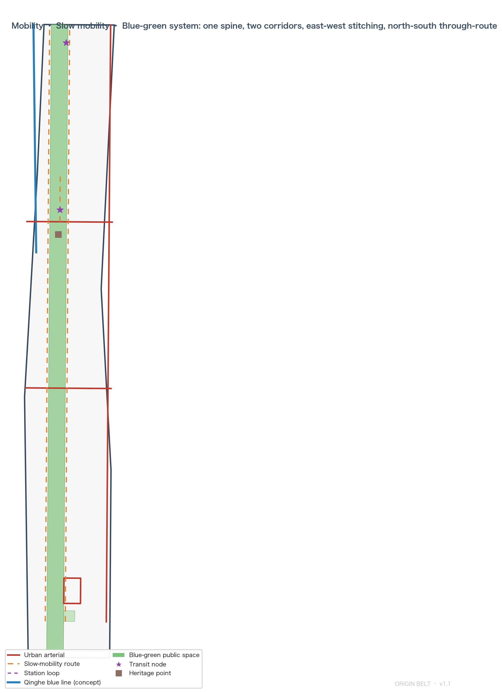

# ORIGIN BELT: Three Origins, One Belt — Synapse Coordination of Three Cores and Two Wings

## Design Basis and Source List

This proposal is organised around the Qualification Pre-announcement of the Centennial Jing-Zhang AI Innovation Belt International Urban Design Open Call and the agent open-call taskbook (agent.1–agent.6) [source:OFFICIAL-ANNOUNCEMENT] [source:AGENT-TASKBOOK]. Machine-readable design tasks, provisional rough boundaries, key areas, land-use enums, planning limits and validation rules come from the `brief/site-package/` site package [source:SITE-PACKAGE]; fact and reuse boundaries follow `data/source_registry.json` [source:SOURCE-REGISTRY].

This proposal is an **open co-creation concept proposal generated by an AI agent**. It does not replace formal planning and does not constitute a government-approved conclusion; every spatial recommendation is phrased as a "concept suggestion / reference scheme / available for professional teams to deepen" [standard:PROJECT-AGENT-OPEN-CALL-TASKBOOK]. Because the organisers have not yet published the official `SITE_BOUNDARY` and the three `KEY_AREA` polygons, this package uses `brief/site-package/geometry/provisional_boundaries.geojson`: `geometry/site_boundary.geojson` and `geometry/key_areas.geojson` are labelled `provisional_constraint` with `official_boundary=false`, for generation, self-check, visualisation and design discussion only — not as an official redline, approval basis or precise-area basis [data:geometry/site_boundary.geojson#SITE-001] [depth:existing_conditions_diagnosis]. This organiser-side data gap does not block content scoring; once official polygons are released, boundary, key areas, land use, roads, green space, public space, buildings, phasing and all metrics must be recalculated [metric:site_area_sqm].

Completeness is carried by structured files: task coverage in `compliance_matrix.json` (announcement 1.3/1.4/1.5 and agent.1–agent.6 item by item), professional standards in `standard_matrix.json`, design depth in `design_depth_matrix.json`, metric recalculation in `metrics.json`, sources and assumptions in `sources.json` and `assumptions.json`, and self-checks in `self_check.json`. The narrative keeps only the most relevant evidence next to each claim instead of dumping machine indexes.

## Overall Concept: ORIGIN BELT

### The Three-Origin Narrative

The proposal introduces the **ORIGIN BELT** concept: the Jing-Zhang corridor is the superposition of three Chinese autonomous-innovation origins on one spatial belt — a rare continuum of innovation origins [source:AGENT-TASKBOOK] [depth:overall_spatial_structure].

- **Origin 1 · Engineering Autonomy (1909)**: The Jing-Zhang Railway was the first trunk line surveyed, designed and constructed independently by Chinese engineers. Zhan Tianyou's famous "renzi" (人字形, herringbone) switchback crossing of Badaling proved that autonomous innovation can overcome impossible terrain. The heritage park in Haidian is the spatial carrier of this origin [source:OFFICIAL-ANNOUNCEMENT].
- **Origin 2 · Reform Innovation (1980s)**: From "Electronics Street" to the New Technology Industrial Development Pilot Zone, Zhongguancun is the origin of China's science-and-technology institutional reform — the global resource hinterland this belt must coordinate with.
- **Origin 3 · AI Emergence (2020s–)**: The taskbook names the "Beijing AI Origin Community", writing the word "origin" into the place name — the official recognition of an AI-era origin. The three origins make this belt a century-long continuum from engineering autonomy to intelligent autonomy [source:AGENT-TASKBOOK].

The three origins are not nostalgia but spatial logic: each origin anchors a place (heritage park, Zhongguancun hinterland, AI Origin Community), forming a synapse loop of "ideation — open source — testing — incubation — roadshow — landing" along the belt [depth:renewal_project_list].

### Naming System and Visual Identity Direction

| Level | Chinese name | English name | Positioning |
| --- | --- | --- | --- |
| Belt | 原点京张 | ORIGIN BELT (JZ-OB) | Three origins, one belt of synapses |
| North core | 众智园 · 核心突触 | CORE SYNAPSE | Full-stack autonomous innovation and AI governance discourse |
| Middle core | AI原点社区 · 原点突触 | ORIGIN SYNAPSE | World-class AI innovation ecosystem |
| South core | 大钟寺 · 枢纽突触 | HUB SYNAPSE | AI-native new business forms |
| West wing | 中关村科技服务翼 | SERVICE WING | Global factor allocation, Zhongguancun IP and capital |
| East wing | 小月河场景赋能翼 | SCENARIO WING | AI scenario enablement and smart vibrant city |

Three naming rules: cores share the "SYNAPSE" word family to translate the coordination loop into communicable spatial language; wings share the "WING" word family, strictly aligned with the taskbook's "three areas, two wings"; the belt name copies no city, park or enterprise name and is not slogan-only [source:AGENT-TASKBOOK].

**Logo direction — "Renzi Synapse"**: using the herringbone alignment of the Jing-Zhang Railway as the base form, two rail lines fork from one origin point and end in synaptic boutons — a figure unifying "human/herringbone" with "neural node". Colours pair heritage rust red (historical autonomy) with AI electric blue (future networks). The mark carries three meanings at once: history (herringbone), structure (one belt forking into three cores and two wings), future (synapse network). It is a direction and design language only; no font, image, trademark or portrait is used without authorisation [source:AGENT-TASKBOOK] [depth:height_massing_character].

### Spatial Structure: One Belt, Three Cores, Two Wings, Synapse Loop

The structure is directly supported by the submitted layers [data:geometry/land_use.geojson#LU-001]:

- **One belt**: the Jing-Zhang heritage park green spine, the north-south public-space mainline linking the three origins [data:geometry/green_space.geojson#GREEN-001];
- **Three cores**: Zhongzhiyuan, AI Origin Community and Dazhongsi as innovation synapses for full-stack autonomy, ecosystem origination and business transformation [data:geometry/key_areas.geojson#PROV-KEY-001] [data:geometry/key_areas.geojson#PROV-KEY-002] [data:geometry/key_areas.geojson#PROV-KEY-003];
- **Two wings**: the Zhongguancun Service Wing (west research-and-service belt) and the Xiaoyuehe Scenario Wing (open scenarios and urban experimentation) as the two return paths of the loop;
- **Synapse loop**: innovation signals cycle "university ideation (Origin Community) → full-stack breakthrough (Zhongzhiyuan) → business transformation (Dazhongsi) → scenario validation (Xiaoyuehe) → capital services (Zhongguancun) → back to ideation", closing the loop of the five functions [source:AGENT-TASKBOOK].

## Three-Level Scope Framework

Work is organised by the three announcement levels [standard:PROJECT-OFFICIAL-ANNOUNCEMENT] [depth:three_level_scope_framework]:

| Level | Design question | Proposal answer | Data anchors |
| --- | --- | --- | --- |
| Coordinated research area (43.6 km2) | AI ecosystem and future urban form | Three-origin narrative + five-layer ecosystem map + synapse loop | `metrics.json`, `compliance_matrix.json` |
| Overall design area (11.4 km2) | Industry space, renewal, transport, character | One-belt-three-cores land-use structure + complete zoning + mobility and blue-green system | [data:geometry/land_use.geojson#LU-001], [data:geometry/roads.geojson#ROAD-001] |
| Key detailed design area (368.4 ha) | Fine-grained design of three areas | Cores with functions, spatial moves, AI scenarios and implementation dependencies | [data:geometry/key_areas.geojson#PROV-KEY-001] |

The three levels are not separate drawing sets: the coordinated study sets industrial and urban-form judgements; the overall design turns them into land-use, building, mobility, blue-green and phasing layers; the key-area design validates implementability of the three cores. No area, ratio or count that cannot be recomputed from structured data enters the conclusions [depth:metrics_recalculation].

## Coordinated Research Area: Industry and Future City Research

### Global Cases and Ecosystem Map

Six global cases inform the ecosystem mechanisms (public sources, see `sources.json` and the scenario-card annex): Kendall Square (campus-incubator-VC loop), King's Cross (renewal-industry-public space integration), one-north Singapore (government-industry-research co-governance), Shenzhen Nanshan (hardware agility), Hangzhou Future Sci-Tech City (platform economy and talent zone), Tel Aviv (open-source collaboration and risk culture). The shared lesson: **an innovation ecosystem is not a cluster of office towers but a continuous loop of ideation, incubation, validation and capital** [source:AGENT-TASKBOOK] [depth:overall_spatial_structure].

The **five-layer ecosystem map** follows: compute layer (edge-compute stations, low-carbon compute), data layer (data-element lounge), model layer (full-stack test field, open-source interoperability), application layer (the 12 scenario cards), governance layer (governance sandbox, standards workshops). The five layers are distributed along the synapse loop, not stacked in one district [depth:industry_space_mapping].

### Functional Placement of Three Cores and Two Wings

- **Zhongzhiyuan · CORE SYNAPSE**: full-stack autonomous innovation and AI governance discourse — full-stack test field, governance sandbox, standards workshops, industry showcase, low-carbon green innovation exchange [data:geometry/key_areas.geojson#PROV-KEY-001];
- **AI Origin Community · ORIGIN SYNAPSE**: world-class AI ecosystem — near-campus incubation, open-source launch hall, incubation street, talent-zone services, showcase and release [data:geometry/key_areas.geojson#PROV-KEY-002];
- **Dazhongsi · HUB SYNAPSE**: AI-native new business forms — agent and terminal showcase, content consumption, data elements, international roadshow [data:geometry/key_areas.geojson#PROV-KEY-003];
- **Zhongguancun Service Wing**: global factor allocation, Zhongguancun IP and capital enablement, mostly "soft space" of services and platforms;
- **Xiaoyuehe Scenario Wing**: AI scenario enablement and smart vibrant city — the base for the scenario test belt and public experience route.

### Factor Mechanisms (Concept Suggestions)

Land and space: reserved flexible land leaves interfaces for future functions; industry: anchor-enterprise traction plus open-source co-building; capital: roadshow-to-investment matching (concept, not investment commitment); talent: talent-zone services and youth housing; compute: edge-compute stations and shared compute entry points; data: compliant, authorised data-element lounge; scenarios: open application and test-validation system. All are concept suggestions for professional teams to deepen; nothing industrial, financial or policy-related is stated as decided [source:AGENT-TASKBOOK] [depth:renewal_project_list].

## Overall Design Area: Urban Renewal and Regulatory-Plan-Level Urban Design

## Land Use, Building Scale, and Retain-Renovate-Demolish Strategy

The overall design area (about 11.41 km2) is the core working layer for building a new urban form adapted to AI new productive forces. The renewal framework is **"green belt first, three cores leading, two corridors stitching, phased rolling"**: the heritage-park green belt establishes the public-value baseline [data:geometry/green_space.geojson#GREEN-001], the three key areas act as renewal engines [data:geometry/key_areas.geojson#PROV-KEY-001], the two transverse corridors stitch east and west [data:geometry/roads.geojson#ROAD-001], and implementation rolls from three cores first through vitality stitching to full network [data:geometry/phasing.geojson#PHASE-001]. At regulatory-plan depth the proposal reaches a "conceptual regulatory depth": the land-use layout fully covers the boundary with no overlap or gap (verified by spatial review) [standard:MNR-LAND-USE-CLASSIFICATION-GUIDE] [metric:site_area_sqm]; FAR, height, density and setback stay unknown until official regulatory conditions are published, listed as formal-deepening prerequisites rather than inferred approved values [metric:floor_area_ratio] [depth:development_intensity_controls]. The full existing-conditions and data-gap inventory is in `assumptions.json` (A-CONTROLS-001 etc.) [depth:existing_conditions_diagnosis].

### Land-Use Structure

The land-use scheme follows the national classification, forming complete closed zones that exactly match the submitted boundary with no overlap and no coverage gap [standard:MNR-LAND-USE-CLASSIFICATION-GUIDE] [data:geometry/land_use.geojson#LU-001] [metric:site_area_sqm]. The structure is "central green belt + two functional belts + transverse stitching corridors":

- **Central green belt (1401)**: the heritage park, about 249 ha through the whole belt — the spatial mainline of the three-origin narrative [data:geometry/green_space.geojson#GREEN-001] [metric:green_ratio];
- **West functional belt**: southward — Zhongzhiyuan research (0802), university education (0804), Origin Community incubation (0802), residential (0701), Dazhongsi commercial and culture (05/0803), echoing the Zhongguancun Service Wing;
- **East functional belt**: southward — Zhongzhiyuan research (0802), university education (0804), residential support (0701), medical and health (0806), Dazhongsi commercial (05), echoing the Xiaoyuehe Scenario Wing and Xueyuan Road vitality;
- **Transverse stitching corridors**: Chengfu Road–Tsinghua East Road and Zhichun Road corridors (1207) stitch the two belts and the central green belt into a "one spine, two corridors" mobility skeleton [data:geometry/roads.geojson#ROAD-001];
- **Reserved flexible land (16)**: interfaces for future function adjustment and new infrastructure after the official boundary is released.

Per-code areas are recomputed in `metrics.json` `land_use_area_total_sqm` from `geometry/land_use.geojson` in EPSG:4548 [metric:land_use_area_total_sqm].

### Buildings, Intensity and Retain-Renovate-Demolish

The building layer (`geometry/buildings.geojson`) provides **concept-illustrative** footprints of R&D, incubation, commercial and educational types — for design discussion and spatial-ratio calibration only, not as surveyed or statutory scheme [data:geometry/buildings.geojson#BLDG-001] [metric:building_footprint_area_sqm]. FAR, density, height and setback stay unknown until official regulatory conditions are published; no inferred values are presented as approved controls [metric:floor_area_ratio] [depth:development_intensity_controls]. Retain-renovate-demolish is proposed as a five-class method framework (retain / renovate / renew / new / pending confirmation); plot-level conclusions await ownership and existing-building data [depth:retain_renovate_demolish].

## Transport, Rail, Municipal Infrastructure, and Public Services

Mobility strategy centres on station-area integration, road micro-circulation, stitching of walking gaps and green transport [depth:traffic_rail_slow_parking]: north-south external links along the Xueyuan Road–Xitucheng Road corridor, east-west stitching along Chengfu Road–Tsinghua East Road and Zhichun Road, slow mobility along both sides of the heritage park, and a loop organising the four-quadrant walking connection at Dazhongsi station [data:geometry/roads.geojson#ROAD-001] [data:geometry/public_space.geojson#PUBLIC-002]. The Qinghe blue line and the Jing-Zhang heritage alignment enter `geometry/constraints.geojson` as concept lines labelled provisional pending official verification [data:geometry/constraints.geojson#CONSTRAINTS] [depth:municipal_new_infrastructure]. Municipal and new infrastructure propose edge-compute stations, distributed energy and AI public-service nodes; utility, energy and fire conditions are listed as prerequisites for formal deepening.

## Detailed Design of Key Areas

Each of the three key areas reaches a "planning comprehensive implementation scheme" concept depth, covering functions, spatial moves, AI scenarios and implementation dependencies [depth:three_key_area_detailed_design].

| Key area | Positioning | Spatial moves | AI and operation scenarios | Evidence |
| --- | --- | --- | --- | --- |
| Zhongzhiyuan · CORE SYNAPSE | Garden-style full-stack autonomous innovation block | Qinghe interface, industry showcase, low-carbon exchange, external transport; green space carries open testing and governance showcase | Full-stack test field, governance sandbox, standards workshop, edge-compute station | [data:geometry/key_areas.geojson#PROV-KEY-001] [depth:three_key_area_detailed_design] |
| AI Origin Community · ORIGIN SYNAPSE | Near-campus transformation and talent community | Campus-district-block slow-mobility stitching; release, talent services, housing, open-source space; Qinghuayuan station site as an origin memorial node | Launch hall, incubation street, open-source community, talent-zone services | [data:geometry/key_areas.geojson#PROV-KEY-002] [source:AGENT-TASKBOOK] |
| Dazhongsi · HUB SYNAPSE | Urban intelligent economy and international exchange block | Station integration, four-quadrant walking, commercial services, public-environment renewal; station square as the hub living room | Agent and terminal showcase, content consumption, data-element lounge, international roadshow | [data:geometry/key_areas.geojson#PROV-KEY-003] [data:geometry/public_space.geojson#PUBLIC-002] |

The three key areas are bounded by the three provisional polygons in `geometry/key_areas.geojson`, non-overlapping and inside the overall design boundary [data:geometry/key_areas.geojson#PROV-KEY-001] [metric:key_area_count]. After the official polygons are released, the proposal commits to a full-chain recheck of the three cores' positioning, functions and indicators.

## AI Innovation Ecosystem, Personas, and AI+ Scenarios

### 12 AI Scenario Cards

The scenario system serves the "urban AI life experience belt" positioning across industry, public service and city life; each card defines its spatial carrier, privacy boundary, human-review mechanism and operator [source:AGENT-TASKBOOK] [depth:blue_green_public_space]:

| # | Scenario card | Spatial carrier | Design note |
| --- | --- | --- | --- |
| 01 | Renzi Experience Field | North heritage park | Immersive history + AI-guided experience along the herringbone alignment, respecting heritage authenticity |
| 02 | Origin Launch Hall | AI Origin Community | Open-source release, code-contribution showcase, small roadshows for universities, communities and startups |
| 03 | Synapse Incubation Street | Near-campus Origin Community | Incubation, legal, IP and financing services in one street |
| 04 | Full-Stack Test Field | Zhongzhiyuan | **Industry test-validation**: full-stack model testing, interoperability, red-team testing |
| 05 | Governance Sandbox | Zhongzhiyuan | **Industry test-validation**: standards workshops, safety evaluation, governance showcase |
| 06 | Edge-Compute Station | Zhongzhiyuan / belt nodes | Low-carbon edge compute, shared compute entry, energy strategy |
| 07 | Bell Interaction Hall | Dazhongsi | Acoustic heritage + AI art interaction, digital translation of cultural resources |
| 08 | Data-Element Lounge | Dazhongsi | Compliant, authorised, auditable data-element and digital-asset circulation showcase |
| 09 | Four-Quadrant Wayfinding | Dazhongsi station | Explainable walking guidance and accessibility enhancement at the junction |
| 10 | Xiaoyuehe Scenario Test Belt | Xiaoyuehe Wing | **Industry test-validation**: open application-test-evaluation public belt |
| 11 | Belt Wayfinding Beacons | Belt slow-mobility system | Explainable signage and low-intrusion sensing for gaps and congestion |
| 12 | Community AI Kiosk | Community nodes | Medical, education, legal, life-service AI interface with human review |

Every scenario anchors to a layer: public-space scenarios to `geometry/public_space.geojson`, mobility scenarios to `geometry/roads.geojson`, open-space scenarios to `geometry/green_space.geojson` [data:geometry/roads.geojson#ROAD-001] [metric:scenario_card_count]. All scenarios follow data minimisation, explainability, human review and no-replacement-of-planning-approval; immature technology is not presented as fully deployable, test scenarios not as approved operations [source:AGENT-TASKBOOK].

### 6 Personas

| Persona | Typical needs | Spatial response | Self-check boundary |
| --- | --- | --- | --- |
| Open-source developer | Release, collaboration, testing, community reputation | Launch hall, public code wall, night collaboration space | No personal behaviour tracking; aggregate statistics only |
| Startup team | Low-cost office, compute entry, product testbed | Shared test slots, edge-compute service points, governance consulting | Compute and data services need separate authorisation |
| University faculty and students | Incubation, cross-campus collaboration, daily walking | Campus-block stitching, incubation street, AI education points | Campus data and research results need authorisation |
| Enterprise visitors | Showcase, business, international reception, hiring | Roadshow lounge, transit connection, public environment around enterprises | Enterprise marks and cases need clearance |
| Residents | Commuting, leisure, community services, low-disturbance renewal | Park slow loop, community AI kiosk, graded events | No commercial recommendation from resident profiles |
| International AI talent | Global collaboration, living support, international exchange | Bilingual signage, international roadshow, talent-zone services | Privacy and cross-border data compliance |

### Scenario-Space-Operation Mapping

The full mapping of cards, personas, layers, operators, privacy boundaries and human review lives in `compliance_matrix.json` and the "AI scenarios" section of `visual/index.html`, so every scenario is experienceable, displayable, promotable and human-reviewable [depth:risk_missing_data].

## AI Public Space, AI-Native Business Forms and Pilgrimage Landmarks

## Blue-Green Network, Public Space, and Urban Character

### AI Public Space and Stitching Strategy

The heritage-park public-space belt (PUBLIC-001) and the station square (PUBLIC-002) form the public-space skeleton [data:geometry/public_space.geojson#PUBLIC-001] [metric:public_space_ratio]. **East-west stitching**: stitching nodes along Chengfu Road–Tsinghua East Road and Zhichun Road reconnect daily life across the rail corridor. **North-south through-route**: the green spine connects the three public living rooms of Zhongzhiyuan, Origin Community and Dazhongsi. Public-space component library (direction): replaceable activity furniture, herringbone paving units, synapse lighting, explainable information screens, continuous accessible paths — composable, replaceable, clearance-clean [source:AGENT-TASKBOOK].

### 4 AI Pilgrimage Landmarks

| # | Landmark | Location | Meaning |
| --- | --- | --- | --- |
| L1 | Renzi Station · Three-Origins Monument | AI Origin Community (Qinghuayuan station concept node) | Materialised start of the three-origin narrative |
| L2 | Full-Stack Ring | Zhongzhiyuan | Full-stack innovation showcase ring for testing and governance |
| L3 | Bell Courtyard | Dazhongsi | Acoustic interaction and AI art hall, digital translation of heritage |
| L4 | Belt Light Ribbon | Along the belt | Smart slow-mobility light ribbon and honour-display carrier |

Landmarks respect heritage, green, blue-line and traffic-safety constraints; no bridge/tunnel or engineering-feasibility conclusions; no unauthorised modification of enterprise buildings or owned spaces; no over-entertainment, over-internet-fame or kitsch [source:AGENT-TASKBOOK] [depth:blue_green_public_space]. **Honour-display system**: "contribution wall" nodes along the light ribbon showcase developer, co-creation and governance contributions, sharing one visual language with the event system (agent.6).

## Culture Narrative: Jing-Zhang Century, Zhongguancun and AI New Culture

### Spatial Storyline

The storyline sets the three origins on the time axis and the belt on the space axis: "**one station, one origin; one segment, one narrative**" — Qinghuayuan station (engineering autonomy) → Zhongguancun hinterland (reform innovation) → AI Origin Community (AI emergence) → Zhongzhiyuan (autonomy narrative) → Dazhongsi (transformation narrative) → Xiaoyuehe (scenario narrative) [source:AGENT-TASKBOOK] [depth:overall_spatial_structure]. The narrative respects historical facts with public documentation; culture is not distorted, decorated or sloganised [source:OFFICIAL-ANNOUNCEMENT].

### Signage, Identity and Symbol System

The signage system takes the "Renzi Synapse" as its motif and develops three composable symbol families: track symbols (history line), synapse symbols (innovation nodes), signal symbols (experience guidance) — consistent with, not confused with, the belt logo [source:AGENT-TASKBOOK]. **International communication**: "THREE ORIGINS, ONE BELT" is the master phrase, with scenario cards and landmarks as communicable visual assets; all fonts, images, portraits and trademarks require clearance.

## Global AI Innovation Event System and Long-Term Operation

### Annual Event System

| Level | Event | Frequency | Operation notes |
| --- | --- | --- | --- |
| Annual flagship | ORIGIN WEEK | Every October (Jing-Zhang Railway anniversary month) | Global AI innovation week: releases, roadshows, open days, awards |
| Semi-annual | Spring Developer Summit / Autumn Industry Summit | Twice a year | Industry matchmaking, international communication, conversion |
| Monthly | Open Origin Day | Monthly | Open-source collaboration, code wall, community honours |
| Weekly | Scenario Saturday | Weekly | Rotating scenario-card openings with experience feedback |

The event system is a concept suggestion for professional deepening; events are not described as decided arrangements and no government commitments or effects are exaggerated [source:AGENT-TASKBOOK] [depth:phasing_implementation].

### Operation Mechanisms and Conversion Pathway

- **Brand IP system**: ORIGIN events share the Renzi Synapse visual language, accumulating brand assets;
- **Developer community**: Open Origin network anchored at the launch hall, code wall and contribution wall; objects, frequency and responsibilities are stated in `compliance_matrix.json`;
- **Scenario open operation**: cards open to enterprises and developers through "apply — test — evaluate — iterate"; the Xiaoyuehe test belt serves public testing;
- **Conversion pathway**: event participation → test application → roadshow → investor matchmaking → landing and registration — a sustainable conversion channel for talent, enterprises and developers;
- **Risk boundary**: investment attraction, policies and funding are concept suggestions, never decided commitments.

## Renewal Projects, Implementation Policy, and Phasing

### Renewal Project List

| # | Project | Type | Key dependencies | Evidence |
| --- | --- | --- | --- | --- |
| JZ-01 | Heritage-park walking-gap stitching | Public space/mobility | Road redlines, underpass space, traffic review | [data:geometry/roads.geojson#ROAD-001] |
| JZ-02 | Zhongzhiyuan Qinghe innovation interface | Blue-green/industry showcase | River blue line, ecology and flood conditions | [data:geometry/constraints.geojson#CONSTRAINTS] |
| JZ-03 | Origin Community incubation street | Renewal/industry services | Campus boundary, ownership, ground-floor use | [data:geometry/buildings.geojson#BLDG-001] |
| JZ-04 | Dazhongsi four-quadrant walking | Station integration/slow mobility | Station, junction, utilities | [data:geometry/public_space.geojson#PUBLIC-002] |
| JZ-05 | AI public service and edge-compute nodes | New infrastructure/public service | Energy, compute, safety, operator | [data:geometry/land_use.geojson#LU-001] |
| JZ-06 | ORIGIN public route | Operation/brand | Space permits, event safety, IP clearance | [data:geometry/phasing.geojson#PHASE-001] |

### Phasing

Phasing is strictly distinguished from the call cycle: the call cycle is a submission deadline; implementation phasing is the renewal pathway [depth:phasing_implementation]:

- **Near term (2026–2028) cores first**: light, reversible, low-disturbance pilots at the three cores (scenario cards, events, walking stitching) [data:geometry/phasing.geojson#PHASE-001];
- **Mid term (2029–2031) vitality stitching**: public-service upgrades in the middle residential and medical band, transverse corridors completed [data:geometry/phasing.geojson#PHASE-002];
- **Far term (2032–2035) full network**: the southern Dazhongsi commercial district matures and the whole synapse loop runs [data:geometry/phasing.geojson#PHASE-003].

Phasing areas are recomputed in `metrics.json` `phasing_area_total_sqm` from `geometry/phasing.geojson` [metric:phasing_area_total_sqm]. Where ownership, funding, implementation bodies or approval paths are missing, projects are stated as implementation risks, not landing commitments [depth:risk_missing_data].

## Metrics, Area Recalculation, and Compliance Matrix

Indicators are managed in three classes: class one, spatial indicators recomputable from submitted geometry (boundary area, green and public ratios, building footprint, road length, phasing areas, key-area counts and areas); class two, regulatory indicators needing official controls (FAR, density, height, setback, green-ratio control) — currently unknown and listed as formal-submission prerequisites [metric:floor_area_ratio] [metric:building_density]; class three, operational performance indicators (event participation, scenario usage) to be calibrated in the operation phase. Every known indicator is recomputable from GeoJSON or this proposal [depth:metrics_recalculation].

Key indicators: overall design area about 11.41 km2 (0.1% from the announced 11.40 million m2, within provisional-boundary precision) [metric:site_area_sqm]; green ratio about 21.8% and public-space ratio about 22.1% (computed from geometry) [metric:green_ratio] [metric:public_space_ratio]; 3 key areas [metric:key_area_count]; the scenario system includes 12 scenario cards and 3 industry test-validation scenarios [metric:scenario_card_count] [metric:test_scenario_count]; 6 personas and 4 landmarks [metric:persona_count] [metric:landmark_count].

The compliance matrix is the master control of task responsiveness: every mandatory task of announcement 1.3.1–1.5.3 and agent.1–agent.6 maps to report sections, layers, metrics, drawings, HTML pages, sources, assumptions and self-checks (see `compliance_matrix.json`); standards coverage in `standard_matrix.json`, design-depth completion in `design_depth_matrix.json` [standard:PROJECT-OFFICIAL-ANNOUNCEMENT] [depth:metrics_recalculation].

## Risk, Copyright, and Compliance

**Boundary risk**: all spatial conclusions rest on provisional boundaries; when the official `SITE_BOUNDARY` and the three `KEY_AREA` polygons are released, a full-chain recalculation is mandatory (geometry, metrics, figures, visual, drawings); this trigger is registered in `assumptions.json`, `sources.json` and `self_check.json` [source:BOUNDARY-SOURCE] [source:KEY-AREA-SOURCE].

**Data risk**: regulatory conditions, road redlines, ownership, municipal and heritage data are missing; affected conclusions are downgraded to pending confirmation [source:SITE-PACKAGE] [depth:risk_missing_data].

**Compliance boundary**: this is an open co-creation concept proposal; it does not replace formal planning or constitute government approval; it makes no statutory-planning judgements (regulatory plan adjustments, FAR, height, intensity), no plot-level retain-renovate-demolish schemes, no alignment/geometry/engineering solutions for roads, rail, bridges or utilities, no underground, energy-load or utility-capacity calculations, and no ownership, investment, phasing or approval judgements [standard:PROJECT-AGENT-OPEN-CALL-TASKBOOK]. All data are public or cleared; sources, licences and generation method are registered in `sources.json` and `report/copyright_statement.md`; the generation method is structured derivation by an AI agent from the site package and public materials, not government-document citation [source:SOURCE-REGISTRY].

**Language contract**: the primary file is Chinese; the full English translation is `proposal.en.md`; A3/A0 drawings and HTML provide corresponding language copies, with terms preferring the taskbook's recommended translations.

**Self-check status**: deterministic validation, spatial review, visual packaging check and professional evidence review results are in `self_check.json`; passing self-checks only means structural completeness, with no implication of professional planning approval.

## References

- brief/site-package/design_brief.json, agent_taskbook.json, sources.json, enums/, ranges/planning_limits.json, schemas/, geometry/provisional_boundaries.geojson
- data/source_registry.json, data/processed/agent_fact_pack.md
- skills/urban-design-ai-submission/references/*.md
- Full machine index: sources.json, metrics.json, compliance_matrix.json, standard_matrix.json, design_depth_matrix.json, assumptions.json, self_check.json [source:SITE-PACKAGE] [standard:PROJECT-OFFICIAL-ANNOUNCEMENT]
