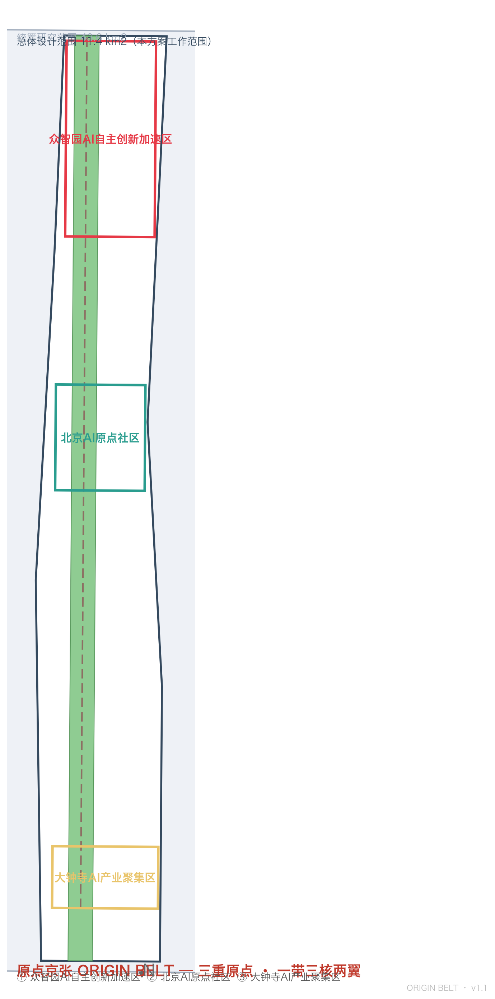
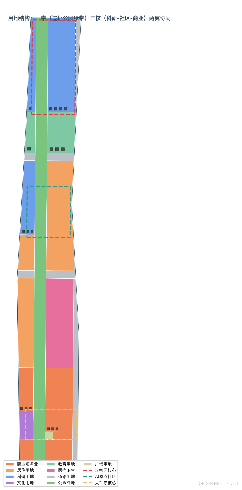
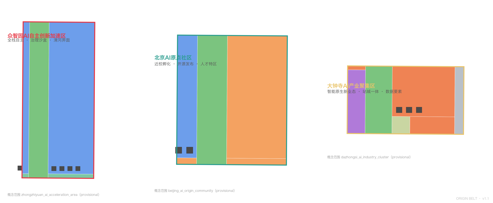
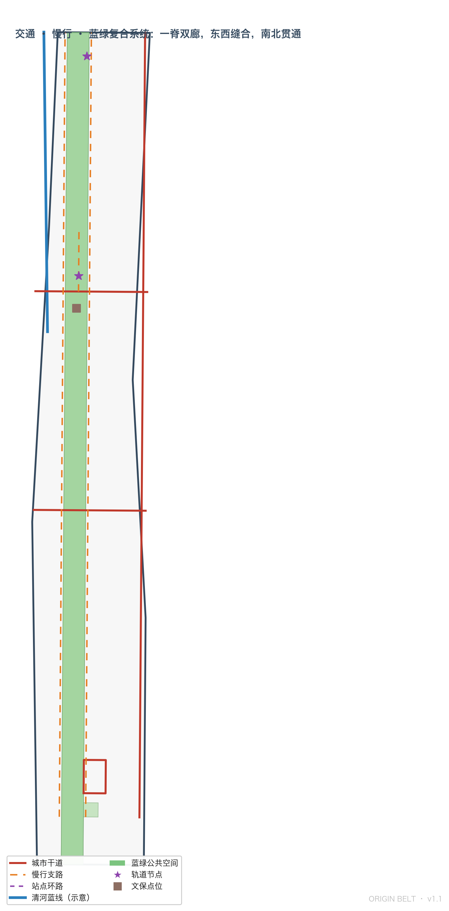
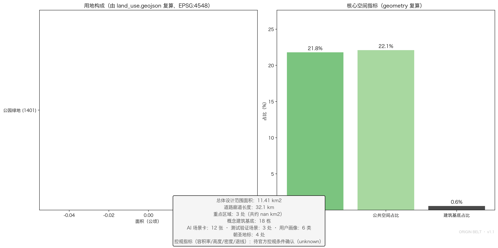

# 原点京张 ORIGIN BELT：三重原点 · 一带三核两翼突触协同的城市设计方案

## 设计依据与资料清单

本方案依据《百年京张AI创新带城市设计国际方案征集资格预审公告》以及面向全球智能体的开源征集任务书（agent.1–agent.6）组织成果 [source:OFFICIAL-ANNOUNCEMENT] [source:AGENT-TASKBOOK]。机器可读设计任务、临时粗略边界、重点区域、用地枚举、规划限值和校验规则来自 `brief/site-package/` 场地包 [source:SITE-PACKAGE]，事实与资料用途边界以 `data/source_registry.json` 的登记为准 [source:SOURCE-REGISTRY]。

本方案为 AI 智能体生成的**开放共创概念建议**，不替代正式规划，不构成政府审定结论；所有空间落地建议均表述为"概念建议/参考方案/可供专业团队深化研究" [standard:PROJECT-AGENT-OPEN-CALL-TASKBOOK]。由于组织方官方 `SITE_BOUNDARY` 与三处 `KEY_AREA` 精确多边形尚未发布，本包使用 `brief/site-package/geometry/provisional_boundaries.geojson` 生成临时几何：`geometry/site_boundary.geojson` 与 `geometry/key_areas.geojson` 均标注 `provisional_constraint`、`official_boundary=false`，仅用于方案生成、自检、可视化与设计讨论，不得作为官方红线、审批依据或精确面积依据 [data:geometry/site_boundary.geojson#SITE-001] [depth:existing_conditions_diagnosis]。该数据缺口不阻断内容评分；官方多边形发布后，边界、重点区域、用地、道路、绿地、公共空间、建筑、分期与全部指标均需重算 [metric:site_area_sqm]。

方案完整性由结构化文件承载：任务覆盖见 `compliance_matrix.json`（公告 1.3/1.4/1.5 与 agent.1–agent.6 逐条映射），专业标准见 `standard_matrix.json`，设计深度见 `design_depth_matrix.json`，指标复算见 `metrics.json`，来源与假设分别见 `sources.json` 与 `assumptions.json`，自检结果见 `self_check.json`。正文只把最关键证据放在判断旁边，不在叙述中堆砌机器索引。

## 总概念：原点京张 ORIGIN BELT

### 三重原点叙事

本方案提出**"原点京张 ORIGIN BELT"**总体概念：京张走廊是三个"中国式自主创新原点"在同一空间带上的叠加，是世界罕见的创新原点连续体 [source:AGENT-TASKBOOK] [depth:overall_spatial_structure]。

- **第一原点 · 工程自主（1909）**：京张铁路是中国人自主勘测、设计、施工的第一条干线铁路，詹天佑在八达岭创造性采用"人字形"展线，以当时条件下最小的工程代价翻越天险，是"自主创新突破不可能"的国家级象征。京张铁路在海淀段留下的遗址公园正是这一原点的空间载体 [source:OFFICIAL-ANNOUNCEMENT]。
- **第二原点 · 改革创新（1980s）**：从"电子一条街"到新技术产业开发试验区，中关村是中国科技体制改革与高新技术产业化的原点，紧邻本次设计范围，是方案必须协同的全球科技资源腹地。
- **第三原点 · 智能涌现（2020s–）**：任务书明确的"北京AI原点社区"把"原点"二字写入地名，标识着智能时代创新原点的官方认定。三重原点叠加，使本带天然具备"从工程自主到智能自主"的百年连续叙事 [source:AGENT-TASKBOOK]。

三重原点不是怀旧叙事，而是空间组织的依据：每个原点都对应一处可锚定的场所（遗址公园、中关村腹地、AI原点社区），并沿带形成"策源—开源—测试—转化—路演—落地"的创新突触回路 [depth:renewal_project_list]。

### 命名体系与视觉识别方向

| 层级 | 名称（中文） | 名称（英文） | 定位 |
| --- | --- | --- | --- |
| 一带总体 | 原点京张 | ORIGIN BELT（JZ-OB） | 三重原点 · 一带突触 |
| 北核 | 众智园 · 核心突触 | CORE SYNAPSE | AI全栈自主创新体系与AI治理话语权 |
| 中核 | AI原点社区 · 原点突触 | ORIGIN SYNAPSE | 世界级AI创新生态 |
| 南核 | 大钟寺 · 枢纽突触 | HUB SYNAPSE | 智能原生新业态 |
| 西翼 | 中关村科技服务翼 | SERVICE WING | 要素全球化配置、中关村IP与资本赋能 |
| 东翼 | 小月河场景赋能翼 | SCENARIO WING | AI场景赋能与智能化AI活力城市 |

命名体系的三条规则：其一，三核统一使用"突触（SYNAPSE）"词族，把"协同回路"译成可传播的空间语言；其二，两翼统一使用"翼（WING）"词族，与任务书"三区两翼"表述严格对齐；其三，总名不复制任何城市、园区或企业名称，不做口号式命名 [source:AGENT-TASKBOOK]。

**Logo 方向——"人字突触"**：以京张铁路"人字形"展线为基本形，两条轨道线从原点分叉，端点以突触球收尾，形成"人"与"神经节点"的同构图形；配色采用京张铁路遗产铁锈红（历史自主创新）与 AI 电光蓝（未来智能网络）双色渐变。该符号同时承载三层含义：历史（人字线）、结构（一带分叉出三核两翼）、未来（突触网络）。Logo 仅提出方向与设计语言，不涉及字体、图片、商标的未经授权使用 [source:AGENT-TASKBOOK] [depth:height_massing_character]。

### 空间结构：一带三核两翼、突触协同回路

空间结构由本方案自绘的用地与公共空间图层直接支撑 [data:geometry/land_use.geojson#LU-001]：

- **一带**：京张遗址公园绿带作为智脉主轴，南北贯通 9 公里级公共空间，是三重原点的空间连线 [data:geometry/green_space.geojson#GREEN-001]；
- **三核**：众智园、AI原点社区、大钟寺三处重点区域作为创新突触，分别承担全栈自主、生态策源、业态转化三类功能 [data:geometry/key_areas.geojson#PROV-KEY-001] [data:geometry/key_areas.geojson#PROV-KEY-002] [data:geometry/key_areas.geojson#PROV-KEY-003]；
- **两翼**：中关村科技服务翼（西侧科研与服务带）与小月河场景赋能翼（场景开放与城市实验带）构成协同回路的两条回程；
- **突触回路**：创新信号沿"高校策源（原点社区）→ 全栈攻坚（众智园）→ 业态转化（大钟寺）→ 场景验证（小月河）→ 资本服务（中关村）→ 回到策源"的回路循环，对应任务书五大功能的协同闭环 [source:AGENT-TASKBOOK]。

## 三层范围工作框架

方案按公告三个层次组织工作 [standard:PROJECT-OFFICIAL-ANNOUNCEMENT] [depth:three_level_scope_framework]：

| 层级 | 设计问题 | 方案回答 | 数据落点 |
| --- | --- | --- | --- |
| 统筹研究范围（43.6 km2） | AI产业生态与未来城市形态 | 三重原点叙事 + 五层创新生态图谱 + 突触回路 | `metrics.json`、`compliance_matrix.json` |
| 总体设计范围（11.4 km2） | 产业空间、城市更新、交通市政、风貌 | 一带三核两翼用地结构 + 完整用地分区 + 交通蓝绿系统 | [data:geometry/land_use.geojson#LU-001]、[data:geometry/roads.geojson#ROAD-001] |
| 重点区域范围（368.4 ha） | 三处片区精细设计 | 三核分别给出功能业态、空间动作、AI场景与实施依赖 | [data:geometry/key_areas.geojson#PROV-KEY-001] |

三层工作不是互不相关的图纸集合：统筹研究决定产业与形态判断，总体设计把判断落实为用地、建筑、交通、蓝绿与分期图层，重点区域详细设计验证三核的可实施性。任何无法从结构化数据复算的面积、比例或数量，不写入正式结论 [depth:metrics_recalculation]。

## 统筹研究范围产业与未来城市研究

### 全球案例与生态图谱

本方案研究 6 个全球案例作为生态机制参照（均为公开资料，具体名单与来源见 `sources.json` 与场景卡附表）：波士顿肯德尔广场（校区—孵化—风投闭环）、伦敦国王十字（更新—产业—公共空间一体）、新加坡纬壹科技城（政府—产业—科研共治）、深圳南山（硬件敏捷迭代）、杭州未来科技城（平台经济与人才特区）、特拉维夫（开源协作与风险文化）。案例共同经验是：**创新生态不是写字楼集群，而是"策源—转化—验证—资本"四环咬合的持续回路** [source:AGENT-TASKBOOK] [depth:overall_spatial_structure]。

据此提出**五层创新生态图谱**：算力层（端侧算力驿站与低碳算力）、数据层（数据要素会客厅）、模型层（全栈测试场与开源互操作）、应用层（12 张场景卡承载的 AI+ 场景）、治理层（治理沙盒与标准工作坊）。五层沿突触回路分布，而不是堆在一个片区 [depth:industry_space_mapping]。

### 三区两翼的功能落位

- **众智园 · 核心突触**：承载"AI全栈自主创新体系与AI治理全球话语权"，布局全栈测试场、治理沙盒、标准工作坊、产业展示与低碳绿色创新交往环境 [data:geometry/key_areas.geojson#PROV-KEY-001]；
- **AI原点社区 · 原点突触**：承载"世界级AI创新生态"，布局近校孵化、开源发布厅、成果转化街、人才特区服务与成果展示发布 [data:geometry/key_areas.geojson#PROV-KEY-002]；
- **大钟寺 · 枢纽突触**：承载"智能原生新业态"，布局智能体与智能终端展示、内容消费、数据要素与国际路演 [data:geometry/key_areas.geojson#PROV-KEY-003]；
- **中关村科技服务翼**：承载要素全球化配置、中关村IP与资本赋能，以科技服务设施、创新服务平台的"软空间"为主；
- **小月河场景赋能翼**：承载 AI 场景赋能与智能化AI活力城市，是小月河场景试验带与公共体验路径的空间基础。

### 要素机制建议

土地与空间：留白与弹性发展用地为未来功能留出接口；产业：链主牵引+开源共建；资金：路演—投资对接通道（概念建议，不构成投资承诺）；人才：人才特区服务与青年公寓配套；算力：端侧算力驿站与共享算力入口；数据：合规授权前提下的数据要素会客厅；场景：场景开放申请与测试验证制度。以上机制均为"可供专业团队深化研究"的概念建议，不把产业招商、资金支持或政策安排写成已确定事项 [source:AGENT-TASKBOOK] [depth:renewal_project_list]。

## 总体设计范围城市更新与控规深度城市设计

总体设计范围（约 11.41 km2）是本次城市设计的核心工作层，目标是建设适配 AI 新质生产力的新型城市形态。本方案的城市更新总体框架为**"绿带优先、三核牵引、双廊缝合、分期滚动"**：先以遗址公园绿带确立公共价值底线 [data:geometry/green_space.geojson#GREEN-001]，再以三处重点区域作为更新引擎 [data:geometry/key_areas.geojson#PROV-KEY-001]，以成府路—清华东路与知春路两条横向廊道缝合东西两侧 [data:geometry/roads.geojson#ROAD-001]，最后按近期三核先行、中期活力缝合、远期全域成网的节奏滚动实施 [data:geometry/phasing.geojson#PHASE-001]。

控规深度方面，方案达到"概念性控规深度"：用地布局完整覆盖边界且无重叠无缺口（由空间复核验证）[standard:MNR-LAND-USE-CLASSIFICATION-GUIDE] [metric:site_area_sqm]；开发强度、建筑高度、密度、退线等法定控制指标因官方控规条件未发布而保持 unknown，列为正式深化前置条件，不以推测值冒充审定指标 [metric:floor_area_ratio] [depth:development_intensity_controls]。现状诊断与资料缺口的完整清单见 `assumptions.json`（A-CONTROLS-001 等）[depth:existing_conditions_diagnosis]。

## 用地、建筑规模与拆改留方案
### 用地结构

用地方案依据国土空间用地分类形成完整闭合分区，与提交边界严格一致、互不重叠、无覆盖缺口 [standard:MNR-LAND-USE-CLASSIFICATION-GUIDE] [data:geometry/land_use.geojson#LU-001] [metric:site_area_sqm]。总体结构为"中央绿带 + 两列功能带 + 横向缝合廊道"：

- **中央公园绿带（1401）**：遗址公园贯穿全带约 249 ha，是三重原点叙事的空间主线 [data:geometry/green_space.geojson#GREEN-001] [metric:green_ratio]；
- **西列功能带**：自北向南为众智园科研（0802）、高校教育（0804）、原点社区科研孵化（0802）、居住（0701）、大钟寺商业与文化（05/0803），呼应中关村科技服务翼；
- **东列功能带**：自北向南为众智园科研（0802）、高校教育（0804）、居住配套（0701）、医疗健康（0806）、大钟寺商业（05），呼应小月河场景赋能翼与学院路活力；
- **横向缝合廊道**：成府路—清华东路与知春路两条道路廊道（1207）把东西两列与中央绿带缝合，形成"一脊两廊"的慢行与交通骨架 [data:geometry/roads.geojson#ROAD-001]；
- **留白与弹性发展用地（16）**：为官方边界发布后的功能调整与未来新型基础设施预留接口。

用地面积逐类复算于 `metrics.json` 的 `land_use_area_total_sqm`（分项见指标表的用地构成），均由 `geometry/land_use.geojson` 在 EPSG:4548 下投影计算 [metric:land_use_area_total_sqm]。

### 建筑、强度与拆改留

建筑基底图层（`geometry/buildings.geojson`）给出**概念示意**建筑体块，区分研发、孵化、商业商务与教育科研类型，仅用于设计讨论与空间比例校验，不代表现状测绘或法定方案 [data:geometry/buildings.geojson#BLDG-001] [metric:building_footprint_area_sqm]。容积率、建筑密度、建筑高度、退线等法定控制指标在官方控规条件缺失前一律保持 unknown（待正式控规条件确认），不以智能体推测值冒充审定指标 [metric:floor_area_ratio] [depth:development_intensity_controls]。拆改留分类按"保留—改造—更新—新建—待确认"五类方法提出工作框架，具体地块结论待权属与现状建筑数据补齐后由专业团队深化 [depth:retain_renovate_demolish]。

## 交通、轨道、市政与公共服务设施

交通策略围绕轨道站点一体化、道路微循环、慢行断点缝合与绿色交通展开 [depth:traffic_rail_slow_parking]：纵向依托学院路—西土城路走廊组织对外联系，横向依托成府路—清华东路与知春路组织区内缝合，慢行体系沿遗址公园东西两侧支路贯通，大钟寺站以环路组织四象限步行连通 [data:geometry/roads.geojson#ROAD-001] [data:geometry/public_space.geojson#PUBLIC-002]。清河蓝线、京张铁路遗址线等约束以概念线位进入 `geometry/constraints.geojson`，均标注 provisional，待官方蓝线与文保资料核实 [data:geometry/constraints.geojson#CONSTRAINTS] [depth:municipal_new_infrastructure]。市政与新型基础设施提出端侧算力驿站、分布式能源与AI公共服务设施的空间策略，管线、能源、消防等工程条件列为正式深化前置条件。

## 重点区域详细设计

三处重点区域均达到"规划综合实施方案"概念深度，围绕功能业态、空间动作、AI场景与实施依赖展开 [depth:three_key_area_detailed_design]。

| 重点片区 | 设计定位 | 空间动作 | AI产业与运营场景 | 证据引用 |
| --- | --- | --- | --- | --- |
| 众智园 · 核心突触 | 花园型全栈自主创新街区 | 强化清河界面、产业展示、低碳创新交往与对外交通组织；绿色空间承载开放测试与标准治理展示 | 全栈测试场、治理沙盒、标准工作坊、端侧算力驿站 | [data:geometry/key_areas.geojson#PROV-KEY-001] [depth:three_key_area_detailed_design] |
| AI原点社区 · 原点突触 | 近校型成果转化与人才社区 | 组织校区—园区—街区慢行缝合；补足成果发布、人才服务、居住生活与开源协作空间；清华园车站旧址作为原点纪念节点 | 原点发布厅、近校成果转化街、开源社区、人才特区服务 | [data:geometry/key_areas.geojson#PROV-KEY-002] [source:AGENT-TASKBOOK] |
| 大钟寺 · 枢纽突触 | 城市型智能经济与国际交往街区 | 围绕大钟寺站一体化、四象限步行连通、商业服务与重点企业公共环境更新；站前广场作为枢纽公共客厅 | 智能体与终端展示、内容消费、数据要素会客厅、国际路演 | [data:geometry/key_areas.geojson#PROV-KEY-003] [data:geometry/public_space.geojson#PUBLIC-002] |

三处重点区域的详细设计由 `geometry/key_areas.geojson` 的三个 provisional 多边形界定，互不重叠且位于总体设计范围之内 [data:geometry/key_areas.geojson#PROV-KEY-001] [metric:key_area_count]。官方多边形发布后，本方案承诺对三核的定位、业态与指标进行整链复核。

## AI 创新生态、人才画像与 AI+ 场景

### 12 张 AI 场景卡

场景体系服务"都市AI生活体验带"定位，覆盖产业、公共服务与城市生活，每张卡均明确空间载体、隐私边界、人工复核与运营主体 [source:AGENT-TASKBOOK] [depth:blue_green_public_space]：

| 编号 | 场景卡 | 空间载体 | 设计说明 |
| --- | --- | --- | --- |
| 01 | 人字体验场 | 京张遗址公园北段 | 以"人字形"展线为线索的沉浸式历史+AI导览体验，尊重遗址真实性 |
| 02 | 原点发布厅 | AI原点社区 | 面向高校、开源社区与初创团队的开源发布、代码贡献展示与小型路演 |
| 03 | 突触孵化街 | AI原点社区近校地带 | 孵化、法务、知识产权与投融资服务一体的近校成果转化街 |
| 04 | 全栈测试场 | 众智园 | **产业测试验证场景**：自主模型全栈测试、互操作验证、红队测试 |
| 05 | 治理沙盒 | 众智园 | **产业测试验证场景**：标准制定工作坊、安全评测与治理展示 |
| 06 | 端侧算力驿站 | 众智园/带内节点 | 低碳端侧算力、共享算力入口与能源策略结合 |
| 07 | 钟声交互馆 | 大钟寺 | 大钟寺声学文化+AI艺术交互，文化资源的数字转译 |
| 08 | 数据要素会客厅 | 大钟寺 | 合规、授权、可审计前提下的数据要素与数字资产流通展示 |
| 09 | 四象限步行导航 | 大钟寺站 | 路口四象限的可解释步行导视与无障碍增强 |
| 10 | 小月河场景试验带 | 小月河场景赋能翼 | **产业测试验证场景**：场景开放申请—测试—评价的公共试验带 |
| 11 | 智脉慢行信标 | 一带慢行系统 | 可解释导视与低侵入传感，识别慢行断点与拥挤节点 |
| 12 | 社区AI服务亭 | 社区节点 | 医疗、教育、法律、生活服务的AI便民界面，人工复核兜底 |

场景空间落点均可在图层中找到对应关系：公共空间场景对应 `geometry/public_space.geojson`，慢行与交通场景对应 `geometry/roads.geojson`，开放空间场景对应 `geometry/green_space.geojson` [data:geometry/roads.geojson#ROAD-001] [metric:scenario_card_count]。所有场景遵守数据最小化、可解释、人工复核与不替代规划审批原则；未成熟技术不写成已可全面部署，测试场景不写成已批准运营 [source:AGENT-TASKBOOK]。

### 6 类用户画像

| 用户画像 | 典型需求 | 空间响应 | 自检边界 |
| --- | --- | --- | --- |
| 开源开发者 | 发布、协作、测试、社区声誉 | 原点发布厅、公共代码墙、夜间协作空间 | 不采集个人行为轨迹；活动数据只做聚合统计 |
| 初创团队 | 低成本办公、算力入口、产品试验场 | 全栈测试场共享测试位、端侧算力服务点、治理咨询 | 算力和数据服务需另行授权 |
| 高校师生 | 成果转化、跨校协作、日常慢行 | 校区—园区慢行缝合、成果转化街、AI教育体验点 | 校园数据和科研成果需授权 |
| 头部企业访客 | 展示、商务、国际接待、人才招聘 | 大钟寺国际路演客厅、轨道接驳、企业周边公共环境 | 企业标识与案例须清权 |
| 周边居民 | 通勤、休闲、社区服务、低扰动更新 | 遗址公园慢行环、社区AI服务亭、活动分级 | 不将居民画像用于商业推荐 |
| 国际AI人才 | 全球协作、生活配套、国际交往 | 双语导视、国际路演、人才特区服务 | 隐私与数据跨境合规 |

### 场景—空间—运营映射

场景卡、用户画像与空间图层、运营主体、隐私边界、人工复核机制之间的完整映射保存在 `compliance_matrix.json` 与 `visual/index.html` 的"AI 场景"章节，确保每个场景可体验、可展示、可推广、可人工复核 [depth:risk_missing_data]。

## AI 公共空间、智能原生新业态与朝圣地标

## 蓝绿空间、公共空间与城市风貌

### AI 公共空间与缝合策略

京张遗址公园公共空间带（`geometry/public_space.geojson` 的 PUBLIC-001）与站前广场（PUBLIC-002）构成公共空间骨架 [data:geometry/public_space.geojson#PUBLIC-001] [metric:public_space_ratio]。**东西缝合**：沿成府路—清华东路、知春路两条横向廊道布置缝合节点，把铁路走廊两侧的日常生活重新接上；**南北贯通**：沿遗址公园绿带贯通慢行主线，连接众智园、原点社区与大钟寺三个公共客厅。公共空间组件库（建议方向）包括：可替换式活动家具、人字纹铺装单元、突触造型照明、可解释信息屏、无障碍连续路径——组件库以"可组合、可替换、可清权"为原则 [source:AGENT-TASKBOOK]。

### 4 处 AI 朝圣地标

| 编号 | 地标 | 位置 | 含义 |
| --- | --- | --- | --- |
| L1 | 人字车站 · 三重原点纪念碑 | AI原点社区（清华园车站旧址概念节点） | 三重原点叙事的物质化起点 |
| L2 | 全栈之环 | 众智园 | 全栈创新展示环廊，承载测试与治理展示 |
| L3 | 钟声之庭 | 大钟寺 | 声学交互与AI艺术馆，文化资源数字转译 |
| L4 | 智脉光带 | 一带沿线 | 智能慢行光带与荣誉展示体系的空间载体 |

地标设计遵守文保、绿地、蓝线与交通安全约束，不做桥隧或工程可行性结论，不擅自改造企业建筑或权属空间，避免过度娱乐化、网红化或低俗化 [source:AGENT-TASKBOOK] [depth:blue_green_public_space]。**荣誉展示体系**：沿智脉光带设置"贡献墙"节点，展示开发者社区、场景共创与治理贡献，与活动体系（见 agent.6）共用一套视觉语言。

## 文化叙事：百年京张、中关村与 AI 新文化融合

### 空间故事线

文化叙事以三重原点为时间轴、以一带为空间轴，形成"**一站一原点、一段一叙事**"的空间故事线：清华园车站（工程自主原点）→ 中关村腹地（改革创新原点）→ AI原点社区（智能涌现原点）→ 众智园（自主攻坚叙事）→ 大钟寺（业态转化叙事）→ 小月河（场景赋能叙事）[source:AGENT-TASKBOOK] [depth:overall_spatial_structure]。叙事尊重历史事实：京张铁路的自主建设史、中关村改革开放史均有公开史料支撑，不做歪曲、不把文化当作科技装饰或口号 [source:OFFICIAL-ANNOUNCEMENT]。

### 导视、标识与符号系统

导视系统以"人字突触"为母题，发展出三套可组合符号：轨道符号（历史线）、突触符号（创新节点）、信号符号（体验指引），与总 Logo 体系一致、不混淆 [source:AGENT-TASKBOOK]。**国际传播叙事**："THREE ORIGINS, ONE BELT"（三重原点，一带共进）作为国际传播主句，配合场景卡与朝圣地标形成可传播的视觉资产；所有字体、图像、肖像与商标均须清权后使用。

## 全球AI创新活动体系与长期运营

### 年度活动体系

| 层级 | 活动 | 频率 | 运营要点 |
| --- | --- | --- | --- |
| 年度旗舰 | ORIGIN WEEK 原点周 | 每年 10 月（京张铁路建成纪念月） | 全球AI创新周：发布、路演、开放日、颁奖 |
| 半年度 | 春季开发者峰会 / 秋季产业峰会 | 每年 2 次 | 产业对接、国际传播、招引转化 |
| 月度 | 开发者开放日 Open Origin Day | 每月 | 开源协作、代码贡献墙、社区荣誉 |
| 每周 | 场景体验日 Scenario Saturday | 每周 | 场景卡轮流开放，收集体验反馈 |

活动体系为"概念建议/可供专业团队深化研究"，不把设想活动写成已确定安排，不夸大政府承诺或活动效果 [source:AGENT-TASKBOOK] [depth:phasing_implementation]。

### 运营机制与转化路径

- **品牌 IP 系统**：ORIGIN 系列活动统一使用"人字突触"视觉语言，沉淀活动品牌资产；
- **开发者社区运营**：Open Origin 开源协作网络，以发布厅、代码墙、贡献墙为空间锚点，运营对象、频率、责任边界在 `compliance_matrix.json` 中说明；
- **场景开放运营**：场景卡通过"申请—测试—评价—迭代"制度向企业与开发者开放，小月河场景试验带承担公共测试职能；
- **转化路径**：活动参与 → 场景测试申请 → 路演 → 投资对接 → 落地注册，形成人才、企业、开发者可持续转化通道；
- **风险边界**：招商、政策、资金均以概念建议表述，不写成确定承诺。

## 更新项目清单、实施政策与分期计划

### 更新项目清单

| 项目编号 | 项目名称 | 类型 | 主要依赖 | 证据引用 |
| --- | --- | --- | --- | --- |
| JZ-01 | 遗址公园慢行断点缝合 | 公共空间/交通 | 道路红线、桥下空间、交通组织复核 | [data:geometry/roads.geojson#ROAD-001] |
| JZ-02 | 众智园清河创新界面 | 蓝绿空间/产业展示 | 河道蓝线、生态与防洪条件 | [data:geometry/constraints.geojson#CONSTRAINTS] |
| JZ-03 | 原点社区近校成果转化街 | 城市更新/产业服务 | 校区边界、权属、首层业态 | [data:geometry/buildings.geojson#BLDG-001] |
| JZ-04 | 大钟寺站四象限步行连通 | 轨道一体化/慢行 | 轨道站点、道路交叉口、市政管线 | [data:geometry/public_space.geojson#PUBLIC-002] |
| JZ-05 | AI公共服务与端侧算力节点 | 新基建/公共服务 | 能源、算力、安全与运营主体 | [data:geometry/land_use.geojson#LU-001] |
| JZ-06 | ORIGIN 活动体系公共路线 | 运营/品牌 | 公共空间许可、活动安全、版权清权 | [data:geometry/phasing.geojson#PHASE-001] |

### 分期计划

分期与征集周期严格区分：征集周期是提交成果的时间要求，实施分期是城市更新推进路径 [depth:phasing_implementation]：

- **近期（2026–2028）三核先行**：众智园、原点社区、大钟寺三核启动轻量试点（场景卡、活动、慢行缝合），以可逆、低扰动方式启动 [data:geometry/phasing.geojson#PHASE-001]；
- **中期（2029–2031）活力缝合**：中部居住与医疗片区公共服务提升、横向廊道完善 [data:geometry/phasing.geojson#PHASE-002]；
- **远期（2032–2035）全域成网**：南端大钟寺商圈完整成形、全域突触回路运行 [data:geometry/phasing.geojson#PHASE-003]。

分期面积由 `geometry/phasing.geojson` 复算于 `metrics.json` 的 `phasing_area_total_sqm` [metric:phasing_area_total_sqm]。若缺少权属、资金、实施主体与审批路径，相关项目明确列为实施风险而非落地承诺 [depth:risk_missing_data]。

## 指标体系、面积复算与合规矩阵

指标体系分三类管理：第一类为可由提交几何直接复算的空间指标（边界面积、绿地与公共空间比例、建筑基底、道路长度、分期面积、重点区域面积与数量）；第二类为需官方控规支撑的管控指标（容积率、建筑密度、高度、退线、绿地率控制），当前以 unknown 呈现并列为正式提交前置条件 [metric:floor_area_ratio] [metric:building_density]；第三类为运营绩效指标（活动参与度、场景使用频次等），进入运营深化阶段持续校准。所有 known 指标均可从 GeoJSON 或本方案正文复算 [depth:metrics_recalculation]。

核心指标：总体设计范围约 11.41 km2（与公告 1140 万 m2 偏差 0.1%，属于 provisional 边界精度范围）[metric:site_area_sqm]；绿地率约 21.8%、公共空间占比约 22.1%（由几何复算）[metric:green_ratio] [metric:public_space_ratio]；重点区域 3 处 [metric:key_area_count]；场景体系含 AI 场景卡 12 张与产业测试验证场景 3 处 [metric:scenario_card_count] [metric:test_scenario_count]；用户画像 6 类、朝圣地标 4 处 [metric:persona_count] [metric:landmark_count]。

合规矩阵是任务响应性的主控文件：公告 1.3.1–1.5.3 与 agent.1–agent.6 的每项必选任务均映射到报告章节、图层、指标、图纸、HTML 页面、来源、假设与自检项（见 `compliance_matrix.json`）；专业标准覆盖见 `standard_matrix.json`，设计深度完成情况见 `design_depth_matrix.json` [standard:PROJECT-OFFICIAL-ANNOUNCEMENT] [depth:metrics_recalculation]。

## 风险、版权与合规说明

**边界风险**：本方案全部空间结论基于 provisional 边界生成，官方 `SITE_BOUNDARY` 与三处 `KEY_AREA` 多边形发布后必须整链复算（geometry、metrics、figures、visual、drawings），本包已在 `assumptions.json`、`sources.json` 与 `self_check.json` 中登记该复算触发条件 [source:BOUNDARY-SOURCE] [source:KEY-AREA-SOURCE]。

**资料风险**：控规条件、道路红线、权属、市政与文保资料缺失，相应结论均降级为待确认事项 [source:SITE-PACKAGE] [depth:risk_missing_data]。

**合规边界**：本方案为开放共创概念建议，不替代正式规划，不构成政府审定结论；不涉及控规调整、容积率/高度/强度等法定规划判断，不给出具体拆改留、道路线形、桥隧工程、市政管线的工程方案，不进行地下空间、能源负荷、市政容量等专业测算，不作出土地权属、投资测算、开发时序与审批判断 [standard:PROJECT-AGENT-OPEN-CALL-TASKBOOK]。所用数据均为公开或清权来源，来源、许可与生成方式登记于 `sources.json` 与 `report/copyright_statement.md`，生成方式为 AI 智能体基于场地包与公开资料的结构化推演，非政府文件引用 [source:SOURCE-REGISTRY]。

**语言合约**：本方案主文件为中文，英文完整对照译文见 `proposal.en.md`；A3/A0 图纸与 HTML 展示提供对应语言副本，术语优先采用任务书推荐译法。

**自检状态**：确定性校验、空间复核、视觉包装检查与专业证据检查结果见 `self_check.json`；本包自检通过仅代表结构完整，不构成专业规划审定的任何含义。

## 参考资料

- brief/site-package/design_brief.json、agent_taskbook.json、sources.json、enums/、ranges/planning_limits.json、schemas/、geometry/provisional_boundaries.geojson
- data/source_registry.json、data/processed/agent_fact_pack.md
- skills/urban-design-ai-submission/references/*.md
- 完整机器索引：sources.json、metrics.json、compliance_matrix.json、standard_matrix.json、design_depth_matrix.json、assumptions.json、self_check.json [source:SITE-PACKAGE] [standard:PROJECT-OFFICIAL-ANNOUNCEMENT]
