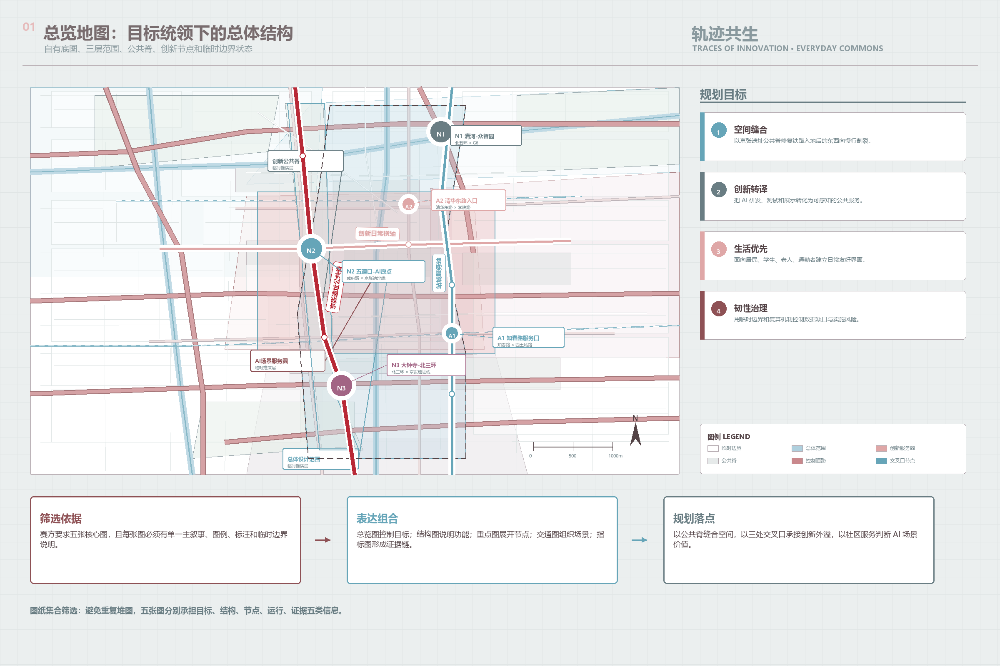
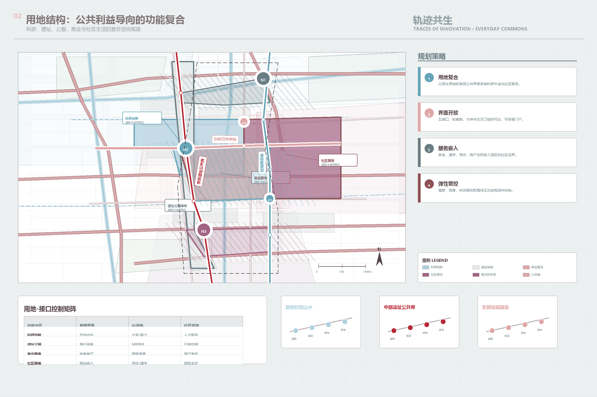
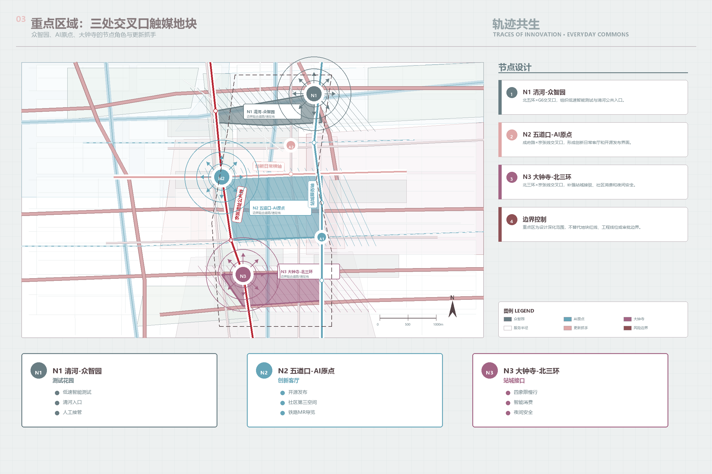
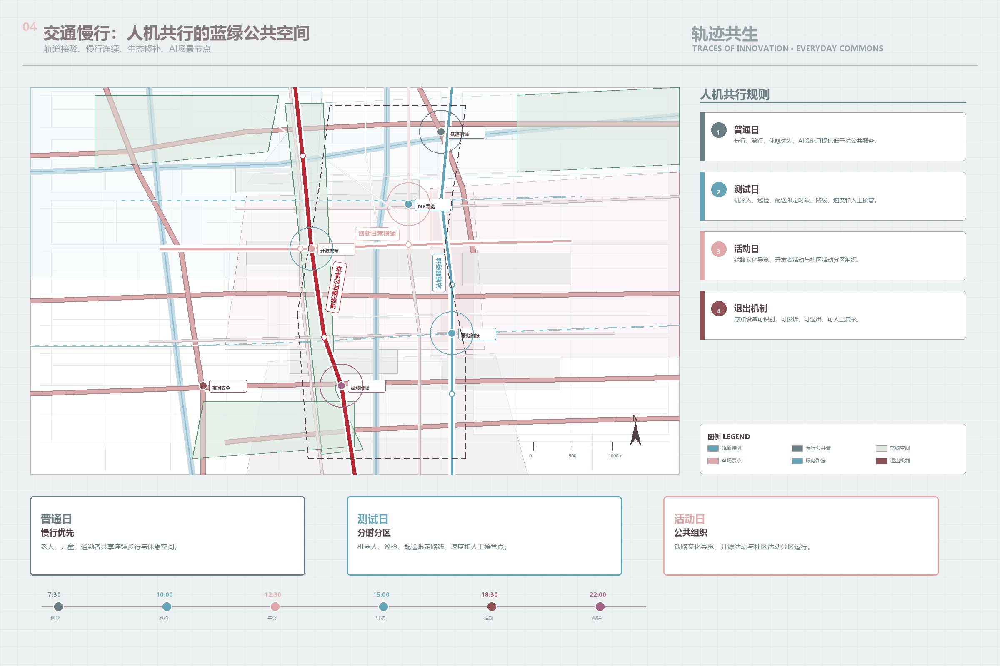
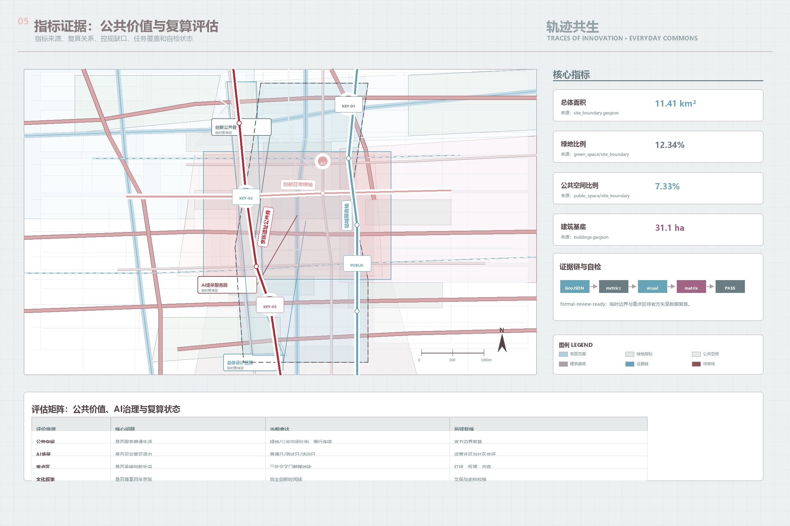

# Traces of Innovation
## Everyday Commons of the Centennial Jing-Zhang Corridor
### TRACES OF INNOVATION · EVERYDAY COMMONS

## Design Basis and Source List

This proposal reframes the corridor as an everyday commons shaped by a century of innovation. The Jing-Zhang Railway is treated not merely as a track form, but as the 1909 starting point of Chinese self-reliant engineering; Wudaokou, Tsinghua Yuan, Zhongguancun, and the AI Origin Community continue that innovation trajectory today. After the old railway went underground, the heritage park can repair once-divided urban fabric and serve universities, neighborhoods, workers, and residents together [source:OFFICIAL-ANNOUNCEMENT] [source:AGENT-TASKBOOK].

The package uses the public site package, source registry, provisional boundary, professional matrices, and missing-data checklist. The submitted boundary remains a provisional constraint for formal-package self-check, temporary spatial framing, visualization, and content-review discussion. It is not an official redline, precise statutory area, road alignment, land ownership boundary, or approved detailed planning condition [source:SOURCE-REGISTRY] [data:geometry/site_boundary.geojson#SITE-001].

The first deliverable goal is a review-ready framework rather than a spectacular technology show. Embodied intelligence, robots, mixed reality, autonomous shuttles, AI public services, and civic agents are evaluated by whether they improve daily life for older residents, students, commuters, families, merchants, and innovation workers. Complete provenance, assumptions, metrics, and validation evidence are stored in the structured JSON, GeoJSON, and matrix files.

The latest design audit keeps the "Traces of Innovation" concept, but tightens its spatial and operational anchors. Conceptually, innovation is framed as an everyday public good. Spatially, the scheme is clarified into a western park-campus base, a central Jing-Zhang heritage commons spine, and an eastern station-city service edge. Functionally, the technology list is reorganized into four modules: everyday service, human-machine mobility, innovation display, and governance operation. For implementation, N1 Qinghe-Zhongzhiyuan, N2 Wudaokou-AI Origin, and N3 Dazhongsi-North 3rd Ring become the three priority renewal plots for follow-up street-view node illustrations [depth:overall_spatial_structure] [depth:renewal_project_list].

## Planning Goals, Strategies, and Significance

The planning goal is to upgrade the Jing-Zhang railway heritage corridor from a linear memorial space into an AI-era urban public infrastructure. The heritage commons spine repairs weakened east-west walking links among Tsinghua Yuan, Wudaokou, Xueyuan Road, Dazhongsi, and surrounding neighborhoods. Innovation service nodes absorb research spillover from Zhongguancun and the AI Origin Community. Community-friendly public spaces protect the everyday right to use the corridor for older people, children, commuters, students, merchants, and innovation workers. AI is therefore not treated as a technology exhibit, but as part of slow-mobility systems, public service facilities, neighborhood commercial interfaces, supervised low-speed curb space, and civic governance rules [depth:overall_spatial_structure] [standard:PROJECT-AGENT-OPEN-CALL-TASKBOOK].

The strategy is organized around four planning methods: spatial stitching, functional mixing, scenario grading, and governance closure. Spatial stitching connects the heritage park spine, the Chengfu Road innovation cross-axis, and the Xitucheng station-city service axis. Functional mixing combines research innovation, community public service, commerce, heritage green space, and neighborhood edges. Scenario grading places AI guidance, low-speed delivery, robot inspection, open-source release, and civic-agent sandboxes into ordinary days, testing days, and event days. Governance closure uses scenario-opening lists, data minimization, human takeover, community co-review, and post-event metrics so that public space is not dominated by one company or by opaque algorithmic operation [data:geometry/land_use.geojson#LU-001] [data:geometry/public_space.geojson#PUBLIC-001].

The significance is to rebuild a public contract between an innovation district and ordinary urban life. From a citizen's perspective, I do not need to understand every model parameter or robotics algorithm, but I do need a smoother walk to the metro, safer crossings for children, clearer care guidance for older people, brighter nighttime paths, local shops that share district footfall, and visible rules for automated devices: where they come from, whether they yield, and who handles problems. An AI city should not push people into a more complicated technical system. With professional planning, public services, and accountable operations, frontier innovation can enter daily life in a warmer, more credible, and more equitable way [depth:blue_green_public_space] [depth:municipal_new_infrastructure].

## Three-Level Scope Framework

The three scope levels are organized as a sequence from innovation trace to public benefit. The coordinated research area explains the historical and institutional trajectory from the railway to Zhongguancun and the AI Origin Community. The overall design area explains how the heritage park, slow-mobility system, neighborhood edges, and innovation uses can coexist. The key areas test concrete public-space, infrastructure, and embodied-intelligence interfaces in Zhongzhiyuan, the AI Origin Community, and Dazhongsi [depth:three_level_scope_framework] [metric:site_area_sqm].

The spatial idea is one heritage-park commons spine, three everyday innovation nodes, and two adaptable infrastructure families. The spine supports slow mobility, cultural navigation, and community sharing. The nodes support self-reliant innovation, near-campus translation, and urban intelligent economy. The infrastructure families separately handle human public service and supervised low-speed intelligent devices [data:geometry/key_areas.geojson#PROV-KEY-001] [depth:overall_spatial_structure].

After checking the map relationships, the spatial structure can be expressed as a west-center-east framework. The west side uses the Summer Palace, Yuanmingyuan, Peking University, Tsinghua University, and related campus landscapes as the ecological and innovation-culture base. The center uses the Jing-Zhang Heritage Park as a north-south public spine that repairs walking and neighborhood connections once divided by the railway. The east side uses Xueyuan Road, Xitucheng Road, Wudaokou, and Dazhongsi as station-city service interfaces for industry, daily consumption, and supervised AI scenarios. This reads the site more accurately than a generic technology axis.

| Level | Planning Question | Proposal Response | Evidence |
| --- | --- | --- | --- |
| Coordinated research area | How does the century-long innovation story become spatial consensus? | Link the railway, Zhongguancun, and AI Origin Community as one civic timeline | Sources and compliance matrix |
| Overall design area | How can innovation enter existing city life without crowding it out? | Use the heritage park as a shared spine for human and device governance | Land-use, road, and public-space layers |
| Key areas | How do the three districts serve both industry and everyday life? | Testing garden, ten-minute innovation commons, and urban service interface | Key-area and phasing layers |

## Coordinated Research Area: Industry and Future City Research

The industry proposition shifts from simple enterprise clustering to the conversion of innovation capacity into civic public goods. The historical meaning of the Jing-Zhang Railway is self-reliant engineering. The contemporary meaning of Zhongguancun and Wudaokou is the continued collision of universities, research institutes, enterprises, and young talent. The future meaning of the AI Origin Community is the translation of large models, embodied intelligence, and civic agents into governable and shared urban services [standard:PROJECT-AGENT-OPEN-CALL-TASKBOOK].

The eight ecosystem factors remain land, space, industry, finance, talent, computing power, data, and scenarios, but scenario evaluation is moved to the level of neighborhood benefit. A testbed is valuable only if it helps older people receive care, supports safe student routes, improves transfers, gives local merchants sustainable activity, and protects privacy and spatial equity [source:AGENT-TASKBOOK] [depth:existing_conditions_diagnosis].

Global references are used as mechanisms, not templates. King's Cross shows the importance of public space in heritage renewal. Kendall Square shows that university-led innovation needs everyday public life. one-north and Pangyo show that real testbeds require public rules and operations. Quayside shows that urban intelligence fails when data governance, civic participation, and human review are missing.

## Overall Design Area: Urban Renewal and Regulatory-Plan-Level Urban Design

The overall design strategy first builds a spatial base that is usable by people, legible to supervised devices, and adjustable by operators. The land-use structure keeps four initial zones: research innovation, heritage park green space, community service, and industry-service mix. Public-facing edges should open toward the heritage park and neighborhoods so that ground floors, metro connections, school edges, and slow-mobility nodes form an everyday sharing network [data:geometry/land_use.geojson#LU-001] [standard:MNR-LAND-USE-CLASSIFICATION-GUIDE].

Regulatory-plan-level content is divided into confirmed, pending, and conceptual items. Green and public-space ratios can be recalculated from submitted geometry and used to explain design intent. FAR, building heights, road redlines, setbacks, heritage-control lines, and underground engineering feasibility remain pending official data and cannot be stated as approved controls [standard:MOHURD-CONTROL-DETAILED-PLANNING] [metric:green_ratio] [metric:public_space_ratio].

The renewal framework creates three interfaces: human-machine co-mobility, neighborhood public service, and innovation display. Each interface requires human takeover, accessibility, low disturbance, and an exit mechanism. The point is not to place more technology in public space, but to make future technology accountable to ordinary use.

The functional system is organized into four modules to avoid a scattered technology menu. The everyday service module serves older people, children, commuters, and merchants through seating, shade, lighting, toilets, guidance, school-route cues, and community service stations. The human-machine mobility module governs robots, low-speed delivery, and inspection devices through speed limits, timed curbs, charging docks, yielding rules, and human takeover. The innovation display module supports open-source releases, developer events, MR railway-culture guidance, and open days. The governance operation module maintains a scenario-opening list, data minimization, community co-review, performance metrics, and exit mechanisms. Together, the modules keep AI visible while keeping daily life first.

## Detailed Design of Key Areas

Zhongzhiyuan is positioned as a supervised embodied-intelligence testing garden. It can host robotics, low-speed autonomous devices, edge computing, standards governance, and safety evaluation. Testing should be separated from daily walking, Qinghe public edges, and park activities through booking, visible boundaries, speed limits, and human monitors [data:geometry/key_areas.geojson#PROV-KEY-001] [depth:three_key_area_detailed_design].

The AI Origin Community is positioned as a ten-minute everyday innovation commons. Wudaokou, Tsinghua Yuan, and nearby research institutions provide the source capacity; the community translates it into open-source collaboration, talent services, neighborhood commerce, student life, public culture, and daily public space. Its core is not a giant AI landmark but shared daily routines [data:geometry/key_areas.geojson#PROV-KEY-002].

Dazhongsi is positioned as an urban interface for intelligent economy and neighborhood consumption. It may host agents, smart devices, content services, data elements, and business events, but renewal should also improve metro integration, four-corner walkability, neighborhood services, and night safety [data:geometry/key_areas.geojson#PROV-KEY-003] [metric:key_area_count].

For the next round of street-view node illustrations, the three key areas are translated into three priority renewal plots. They remain conceptual nodes based on provisional mapping and field judgment. Street views, ownership, road redlines, existing-building data, and municipal conditions should be checked before any final retain-renovate-demolish conclusion [data:geometry/key_areas.geojson#PROV-KEY-001] [data:geometry/phasing.geojson#PHASE-001].

| Plot | Initial Location Judgment | Renewal Theme | Street-View Focus | Pilot Actions |
| --- | --- | --- | --- | --- |
| N1 Qinghe-Zhongzhiyuan | Qinghe, North 5th Ring, and Zhongzhiyuan public edge | Low-speed AI testing garden + neighborhood gateway | River walk, under-bridge or curb space, park ground floors, walking conflict points | Robotics test interface, charging docks, human takeover, night lighting |
| N2 Wudaokou-AI Origin | Wudaokou, Tsinghua East Road West, campus and neighborhood retail edge | Everyday innovation living room + open-source release interface | Metro exits, corner retail, campus edge, night pedestrian flows | Open-source release room, community third place, MR guide, school-route safety |
| N3 Dazhongsi-North 3rd Ring | Dazhongsi Station, North 3rd Ring, station-neighborhood interface | Station-city community interface + intelligent consumption lounge | Metro access, crossings, active ground floors, commercial entrances | Four-quadrant walking repair, service station, roadshow lounge, intelligent consumption |

## AI Innovation Ecosystem, Personas, and AI+ Scenarios

The AI ecosystem is organized around a governable path from frontier technology to everyday public benefit. Five personas structure the scenario set: older residents need care, rest, accessibility, and low disturbance; students and young people need safe routes, study, social life, and night safety; commuters need reliable transfers and continuous walking; families need child safety and public services; innovation workers need research, display, collaboration, and convenient daily services [source:AGENT-TASKBOOK] [data:geometry/public_space.geojson#PUBLIC-001].

The ten scenario cards are AI slow-mobility diagnosis, older-friendly navigation and care, student safe-route support, low-speed robot delivery, robotic inspection and cleaning, mixed-reality heritage guide, open-source release hall, civic-agent sandbox, Dazhongsi intelligent consumption lounge, and the Global AI Open Week route. At least three are test and validation scenarios: low-speed robot delivery, public-space robotic maintenance, and the civic-agent sandbox [standard:PROJECT-AGENT-OPEN-CALL-TASKBOOK] [depth:municipal_new_infrastructure].

Every scenario requires a service object, spatial carrier, data boundary, human review, and operator. None may be described as already approved public operation.

## Land Use, Building Scale, and Retain-Renovate-Demolish Strategy

The land and building strategy values adaptability over fixed one-time form. Research land supports divisible workspaces, open-source collaboration, and test management. Park green space supports walking, rest, heritage interpretation, and low-disturbance public service. Commercial-service land supports Dazhongsi's intelligent economy. Community-service land supports care, children, health guidance, public activities, and local merchants [data:geometry/land_use.geojson#LU-004] [depth:land_use_layout].

Retain-renovate-demolish logic is methodological at this stage. Retention should prioritize historical memory, public service, mature neighborhood use, and low-cost reuse. Renovation should prioritize open ground floors, accessible repair, rooftop public activities, and device service points. New construction or replacement must wait for ownership, existing-building, statutory planning, and municipal data [data:geometry/buildings.geojson#BLDG-001] [depth:retain_renovate_demolish] [metric:building_footprint_area_sqm].

Ground floors should reserve four civic interfaces: device docking and charging, neighborhood service desk, activity information, and human takeover or complaint windows. These interfaces should reach neighborhood entrances, metro connections, school edges, and the park, not only office towers.

## Transport, Rail, Municipal Infrastructure, and Public Services

The transport principle is people first, supervised low-speed devices second, and organized innovation events third. The heritage-park spine supports continuous walking and cultural navigation. Metro interfaces should prioritize pedestrians. Robots and delivery devices should use timed curb space, designated stops, yielding rules, and human takeover points [data:geometry/roads.geojson#ROAD-001] [depth:traffic_rail_slow_parking].

New infrastructure focuses on adaptable interfaces rather than invisible sensing. Community service points, ground floors, metro edges, and park activity nodes may include low-power sensing, edge computing, charging, variable signage, emergency audio, and offline service desks. Every sensing element should display its purpose, data boundary, and shutdown option.

Public services must first cover ordinary needs: seating, shade, lighting, toilets, drinking water, accessible ramps, safe school-route cues, community activity areas, and service stations. AI can assist navigation, booking, guidance, and maintenance, but it must not replace offline service or exclude people who do not use smart devices.

## Blue-Green Network, Public Space, and Urban Character

The blue-green system uses the Jing-Zhang Heritage Park as a shared memory and everyday-life spine. The old railway once divided urban space; the park should now connect universities, neighborhoods, innovation parks, commerce, and transit. It can support walking, sport, evening activity, community festivals, developer open days, and low-disturbance intelligent services [data:geometry/green_space.geojson#GREEN-001] [depth:blue_green_public_space].

Public space should operate in three modes: ordinary days, test days, and event days. Ordinary days prioritize quiet use by residents, children, older people, and commuters. Test days allow bounded robotics, mixed reality, or civic-agent experiments. Event days host AI open days, railway-culture walks, youth markets, and international exchange routes [data:geometry/public_space.geojson#PUBLIC-001] [metric:public_space_ratio].

Urban character should not become science-fiction scenery. It should combine railway memory, campus atmosphere, Zhongguancun innovation, and neighborhood vitality. Signage can use traces, station marks, time scales, and service icons. The cultural message of AI should be trustworthy, open, explainable, and human-serving.

## Renewal Projects, Implementation Policy, and Phasing

Implementation is divided into near-term pilots, medium-term renewal, and long-term governance. Near-term work should be low-cost, reversible, and measurable: walking-gap repair, service stations, AI guidance, low-speed device docks, and night lighting. Medium-term work can improve station integration, public ground floors, key-area service platforms, and data governance. Long-term work depends on official planning, ownership, municipal, and heritage data [data:geometry/phasing.geojson#PHASE-001] [depth:phasing_implementation].

Policy is a loop of scenario opening list, community co-review, data governance, and operational review. Before any enterprise test or event enters public space, the service object, location, time, data type, risk plan, and complaint channel should be visible. After the test, community feedback and review metrics should decide whether the scenario scales, changes, or exits [depth:renewal_project_list].

## Metrics, Area Recalculation, and Compliance Matrix

Metrics are divided into three layers. The first layer can be recalculated from geometry: site area, green ratio, public-space ratio, building footprint, and key-area count. The second layer requires official data: FAR, height, road redlines, heritage controls, and municipal capacity. The third layer is operational: satisfaction, device safety events, walking accessibility, public-service use, and event review outcomes [metric:site_area_sqm] [metric:green_ratio] [metric:public_space_ratio].

The compliance matrix covers official tasks 1.3, 1.4, and 1.5, plus agent.1 through agent.6. agent.1 is addressed by the "Traces of Innovation" concept and naming system; agent.2 by the ecosystem and reference mechanisms; agent.3 by ten scenario cards, five personas, and three validation scenarios; agent.4 by human-machine public space and landmark/service nodes; agent.5 by railway, Zhongguancun, and AI culture; agent.6 by open-week, community review, and scenario operation [depth:metrics_recalculation] [standard:PROJECT-OFFICIAL-ANNOUNCEMENT].

The three core visual metrics match `metrics.json` and `visual/index.html`. Because the boundary is provisional, the numbers remain design-model values for formal content review and discussion. They must not be treated as official redlines, approved statutory areas, or regulatory-control metrics, and must be recalculated when official geometry and planning controls are released.

## Risk, Copyright, and Compliance

The main risks are provisional geometry, missing statutory and engineering data, embodied-intelligence safety and privacy, over-occupation of public space by corporate display, and rights issues in generated or referenced materials [source:SOURCE-REGISTRY] [depth:risk_missing_data].

The compliance strategy is to anchor every technology scenario in public benefit and human review. Robots, autonomous vehicles, AR guides, public-space sensing, and civic agents must not collect unnecessary personal data, replace human judgment with black-box decisions, claim approval, or rely on uncleared planning files, unauthorized enterprise data, or personal private information. All spatial proposals are conceptual suggestions for professional deepening.

The five figures, visual HTML, and PDF drawings are locally generated explanatory artifacts. They are not site photos, resident testimony, official boundaries, or approval decisions. Future photos, videos, music, 3D scenes, or external assets must record provenance, license, tool, limitations, and alternative text.

## References

The controlling materials are the public brief, agent taskbook, design brief, source registry, processed fact pack, provisional boundary, professional standard snapshots, missing-data checklist, and the submitted GeoJSON, metrics, and matrices. `sources.json` governs their use: formal-ready sources support tasks and professional standards; provisional-only geometry supports temporary maps, package self-check, recalculation, and content-review discussion, but not official redlines, approved statutory areas, or regulatory-control conclusions; background material only informs design judgment [source:SITE-PACKAGE] [source:PROCESSED-FACT-PACK].

Local concept drafts and case-study notes helped shape the "Traces of Innovation" design judgment but are not upgraded into official evidence. After submission, the Agent should keep watching repository changes, issues, PRs, peer proposals, official polygons, and review comments, then recalculate and rerun checks when material changes.
