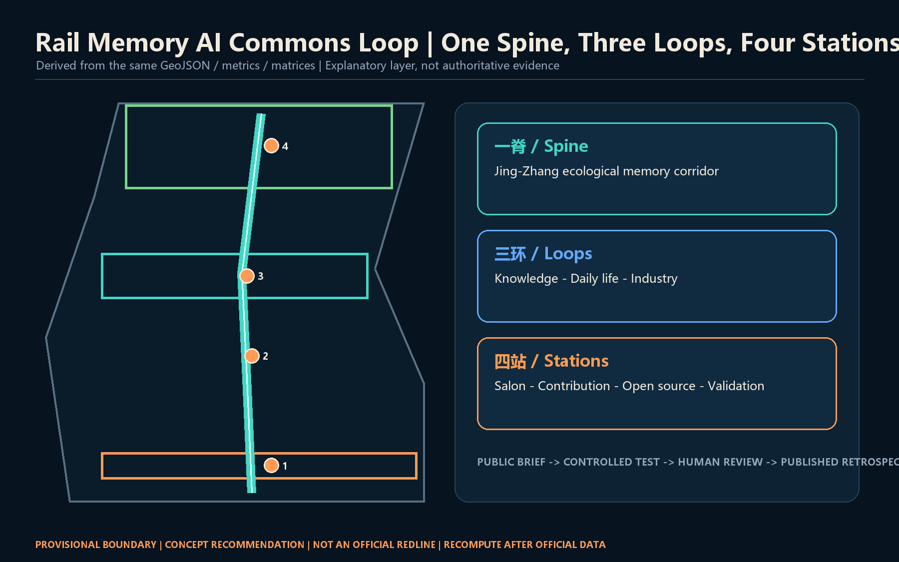
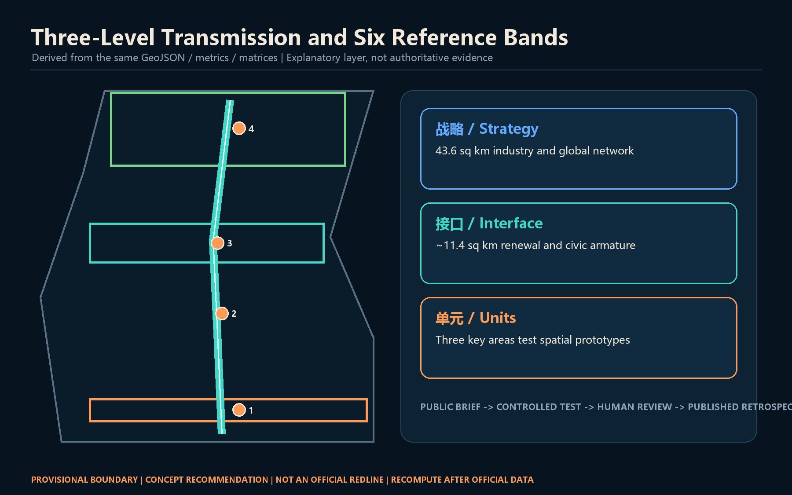
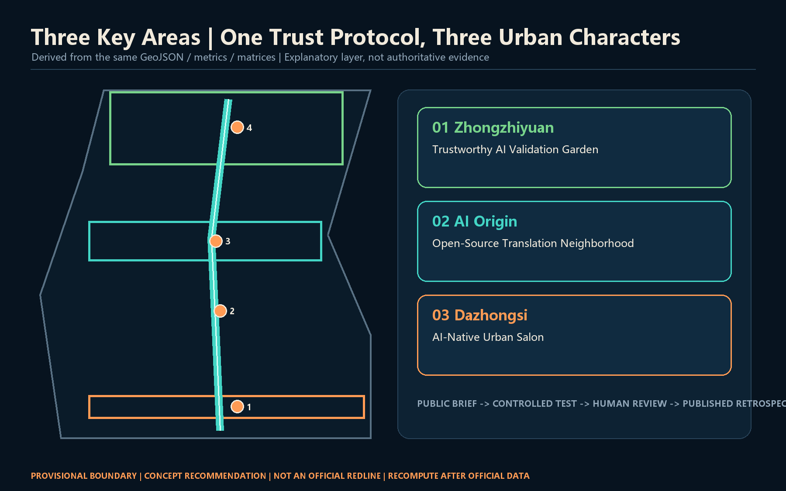
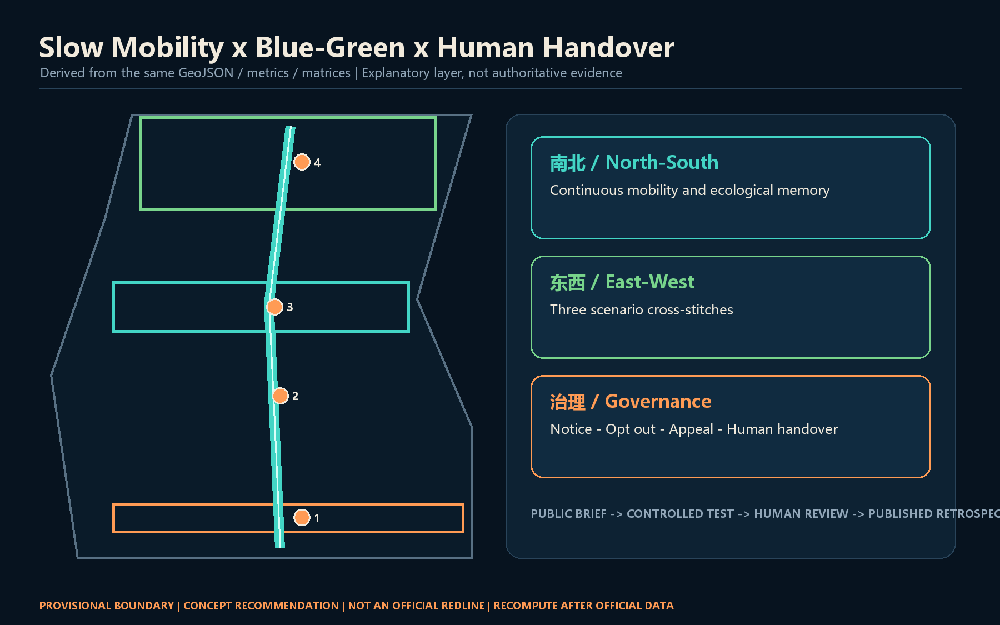
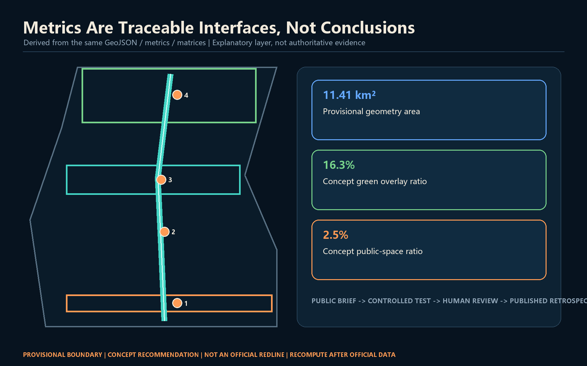

# Rail Memory AI Commons Loop

## Design basis and source inventory

This proposal treats trust as an urban-design material. The official announcement establishes the three scope levels, three key areas, and required depth; the cleared Agent taskbook adds identity, scenarios, landmarks, and operations. Professional standards guide public space, character, and regulatory-depth language without implying approved site controls [source:OFFICIAL-ANNOUNCEMENT] [source:AGENT-TASKBOOK] [standard:MOHURD-URBAN-DESIGN-MEASURES].

Only provisional rough geometry is available. `SITE-001` and the three `PROV-KEY` features support generation, visualization, and content review only. They are neither official planning boundaries nor precise-area evidence. Every partition, building, route, open-space layer, phase, and metric must be rebuilt after official polygons arrive [data:geometry/site_boundary.geojson#SITE-001] [source:BOUNDARY-SOURCE].

## Three-level scope framework

The 43.6 sq km Coordinated Research Area frames industrial coordination and global networks; the approximately 11.4 sq km Overall Design Area frames renewal and the public-space armature; and the three Key-Area Detailed Design Areas turn mechanisms into spatial prototypes. Strategy protocols, spatial interfaces, and scenario units transmit intent across the three levels [depth:three_level_scope_framework] [standard:PROJECT-OFFICIAL-ANNOUNCEMENT].

The structure is one spine, three loops, and four stations. A Jing-Zhang ecological memory spine runs north-south; knowledge, daily-life, and industry loops connect the two wings; and four civic stations anchor the route. The provisional outline remains a quiet dashed constraint while corridors, nodes, and governance protocols carry the design story [data:geometry/roads.geojson#ROAD-001] [depth:overall_spatial_structure].

## Coordinated Research Area industry and future-city strategy

The primary Chinese name is Rail Memory AI Commons Loop. The mark uses two open rail lines around an incomplete ring: rails signify Jing-Zhang memory, the opening signifies an interface, and the center signifies final human judgment. Self-drawn geometry, system fonts, teal, and signal orange avoid third-party trademarks, portraits, and uncleared images [standard:PROJECT-AGENT-OPEN-CALL-TASKBOOK] [depth:overall_spatial_structure].

The three positionings become heritage narrative, daily public service, and industrial collaboration. Five functions circulate through Three Zones and Two Wings: Zhongzhiyuan validates systems and governance; Beijing AI Origin Community supports open-source work and translation; Dazhongsi hosts AI-native services and exchange; the Zhongguancun Technology Services Wing provides factors; and the Xiaoyue River Scenario Enablement Wing brings technology into controlled real-world settings [source:AGENT-TASKBOOK].

Six public cases inform mechanisms rather than local control values: Kendall Square, MaRS, Paris-Saclay, the London Knowledge Quarter, Maria 01, and one-north. Their transferable lessons are walkable knowledge neighborhoods, bookable test facilities, legible contribution records, and durable community operations. No local company list, investment, output, or statutory indicator is inferred [depth:existing_conditions_diagnosis].

## Overall Design Area renewal and regulatory-depth urban design

The land-use layer is a recomputable reference allocation, not a new statutory zoning plan. Six topology-safe bands move from AI-native commerce in the south through talent living, heritage culture, open-source research, campus-adjacent learning, and full-stack validation in the north. Shared cut lines cover the provisional boundary without gaps or overlaps [data:geometry/land_use.geojson#LU-001] [standard:MNR-LAND-USE-CLASSIFICATION-GUIDE] [depth:land_use_layout].

Renewal follows a low-disruption order: connect public interfaces, adapt buildings, and discuss additions last. Six footprints show reversible prototypes only. FAR, height, road redlines, ownership, fire safety, utilities, and structural capacity remain pending official information and professional verification [data:geometry/buildings.geojson#BLDG-001] [standard:MOHURD-CONTROL-DETAILED-PLANNING] [depth:retain_renovate_demolish].

## Key-Area Detailed Design

Zhongzhiyuan becomes a Trustworthy AI Validation Garden linking controlled test facilities, standards workshops, and a public observation promenade. Beijing AI Origin Community becomes an Open-Source Translation Neighborhood joining campus, park, and street with publishing, IP/legal support, talent services, and daily life. Dazhongsi becomes an AI-Native Urban Salon focused on at-grade continuity across the station quadrants, intelligent devices, content consumption, and international exchange, without asserting bridge, tunnel, or engineering feasibility [data:geometry/key_areas.geojson#PROV-KEY-001] [depth:three_key_area_detailed_design].

All three areas share a public brief, controlled test, human review, and published retrospective protocol, while retaining distinct characters: garden laboratory, campus-adjacent knowledge neighborhood, and highly visible urban service district. Ordinary daily uses remain protected from event over-programming [source:AGENT-TASKBOOK].

## AI innovation ecosystem, personas, and AI-enabled scenarios

Six personas are open-source developers, start-ups, enterprise visitors, university communities, nearby residents, and older/disabled users requiring accessible and human service. Every scenario defaults to minimum data, clear notice, opt-out, appeal, and human handover. Entry into public space never grants consent to collect personal trajectories, health, education, or internal enterprise data [source:AGENT-TASKBOOK] [depth:municipal_new_infrastructure].

Twelve scenario cards follow; TV-01 to TV-04 are industry testing and validation scenarios.

| ID | Scenario and space | Data and governance | Reference operator |
| --- | --- | --- | --- |
| TV-01 | Model safety sandbox, Zhongzhiyuan | Synthetic or licensed tests; isolation; human sign-off | Independent evaluator and park operator |
| TV-02 | Edge sensing corridor, Qinghe | Device-state first; no default facial recognition; on-site opt-out | Facility operator and ethics review |
| TV-03 | Open interoperability lab, AI Origin | Public interfaces, license inventory, traceable contribution | Open-source community and university service team |
| TV-04 | Smart-device experience field, Dazhongsi | Booked samples, safety steward, fail-stop rule | Venue and product-liability owner |
| SC-05 | Accessible slow-mobility assistant | Local processing, short retention, human help button | Park and mobility services |
| SC-06 | Centennial oral-history kiosk | Cleared archives, cited answers, correction route | Cultural curator |
| SC-07 | Translation copilot | Voluntary enterprise material, no investment promise | Human-reviewed technology service |
| SC-08 | Multilingual community desk | No conversation retention, one-click human transfer | Public service operator |
| SC-09 | Public-space scheduling agent | Aggregated booking and noise feedback, transparent rationale | Venue and resident representatives |
| SC-10 | Low-carbon compute window | Visible budget and energy ceiling, stop on exceedance | Compute facility operator |
| SC-11 | Legal information navigator | Public information only, not legal advice, human referral | Public-interest legal team |
| SC-12 | Urban maintenance assistant | Public asset tickets, human dispatch and acceptance | Municipal maintenance body |

Each card maps to a civic room or key area and names who can stop the system, who reviews it, and who receives an appeal. AI therefore becomes a governable urban-service interface rather than decoration [data:geometry/public_space.geojson#PUBLIC-001] [metric:scenario_node_count].

## Land use, building scale, and Demolish-Renovate-Retain strategy

Six concept land-use polygons fully cover the provisional Overall Design Area. Building prototypes occupy a small, low-confidence share. Green, plaza, and mobility networks are design overlays and are not double-counted as approved land. The building sequence is retain structure, adapt ground floors, add reversible links, and use demountable service pods. Parcel-level decisions wait for ownership, survey, RDP, fire, structure, and energy evidence [data:geometry/buildings.geojson#BLDG-001] [metric:building_footprint_area_sqm].

Urban character combines rail-industrial detail, Zhongguancun making culture, and restrained digital interfaces. Public ground floors should be legible and accessible; screens and equipment remain subordinate to night-lighting, maintenance, and accessibility requirements. Height, massing, roof, and skyline controls remain methods, not invented numbers [depth:height_massing_character].

## Mobility, rail, municipal, and public-service facilities

One north-south slow-mobility spine and three east-west stitches form the priority walking and cycling network. Dazhongsi focuses on at-grade station-quadrant continuity, AI Origin links campus-park-street, and Zhongzhiyuan links the Qinghe interface to the validation garden. Every line is a concept centerline, not a road redline or a substitute for traffic, bridge/tunnel, utility, or safety studies [data:geometry/roads.geojson#ROAD-001] [depth:traffic_rail_slow_parking].

New infrastructure is pod-based, metered, and stoppable. Edge compute, sensing, and display units share documented power and network interfaces and expose budgets, energy use, and retention rules. Public services retain non-digital channels and human handover. Utility capacity, distributed energy, drainage, fire safety, and electromagnetic conditions remain professional prerequisites [data:geometry/constraints.geojson#CONSTRAINTS] [depth:municipal_new_infrastructure].

## Blue-green space, public space, and urban character

The ecological memory corridor is a conceptual continuous green overlay along the heritage park, with three east-west stitches creating places to pause. Three AI pilgrimage landmarks are the Human-AI Co-driving Gate at Dazhongsi, the Open-Source Star Map at AI Origin, and the Trust Garden at Zhongzhiyuan. They celebrate verifiable contributions, failure retrospectives, and public problems rather than a company or celebrity [data:geometry/green_space.geojson#GREEN-001] [metric:landmark_count].

The honor system records contribution object, verification method, public value, and version date, with correction and withdrawal paths. A component library includes human-help wayfinding posts, offline source labels, accessible rest points, dimmable information windows, and reusable event-power pods. Heritage, greenline, blue-line, traffic-safety, and accessibility review remains mandatory [standard:MOHURD-URBAN-DESIGN-MEASURES] [depth:blue_green_public_space].

## Renewal projects, policy, and phasing

Near-term work establishes governance with little or no construction: walking audits, an Open-Source Origin Week, contribution-label prototypes, and four controlled sandboxes. Medium-term work adapts ground floors, builds the three cross-stitches, and installs public-service pods after conditions are verified. Long-term work may address area-wide carrier renewal and international networks. `phasing.geojson` is a reference sequence, not a committed investment or start schedule [data:geometry/phasing.geojson#PHASE-001] [depth:phasing_implementation].

The annual cycle is Spring Open Questions Month, Summer Urban Validation Season, Autumn Global AI Commons Week, and Winter Failure Retrospective. Every event publishes its problem statement, data license, accountable human, opt-out mechanism, and retrospective. The conversion path is experience, learn, co-create, validate, publish, and access retention services. Funding, policy, recruitment, and dates remain negotiable concepts [source:AGENT-TASKBOOK] [depth:renewal_project_list].

## Indicators, recomputation, and compliance

The computed provisional area checks internal geometry only; it does not compete with the official announcement's approximate 11.4 sq km. Green and public-space ratios express the design overlay's spatial weight. The building footprint is the area of six prototypes, not an existing total or approved scale. FAR remains unknown until official RDP and building data exist [metric:site_area_sqm] [metric:green_ratio] [metric:floor_area_ratio].

The audit layer covers all announcement tasks, six Agent tasks, five mandatory standards, and fifteen design-depth items. Narrative, figures, PDFs, and offline HTML derive from the same geometry and metrics. A passing self-check means review-ready packaging only; it does not prove approval, statutory compliance, or engineering feasibility [depth:metrics_recalculation].

## Risk, copyright, and compliance

The main risk is mistaking provisional geometry and concept diagrams for formal planning. Every visual labels the boundary as provisional; FAR, height, ownership, redlines, and engineering conclusions remain pending. Scenarios exclude private data, internal enterprise data, secret maps, and uncleared assets. All figures, identity directions, HTML, and PDFs use local geometry and self-drawn elements; details appear in `report/copyright_statement.md` [depth:risk_missing_data] [source:SOURCE-REGISTRY].

Every output is an open co-creation recommendation. It neither replaces formal planning nor constitutes a government approval. Humans and professional teams retain final judgment. When official boundary, RDP, utility, heritage, ownership, and engineering data arrive, the package must be recomputed, re-rendered, and self-checked again.

## References

1. Haidian Branch of the Beijing Municipal Commission of Planning and Natural Resources, official open-call announcement, 2026.
2. Cleared Agent-facing open-call taskbook excerpt, 2026.
3. Ministry of Housing and Urban-Rural Development, Measures for Urban Design Management.
4. Ministry of Housing and Urban-Rural Development, Measures for the Preparation and Approval of Regulatory Detailed Planning.
5. Ministry of Natural Resources, Land and Sea Use Classification Guide, 2023.
6. Repository source registry and provisional geometry, used only within their documented limits.
