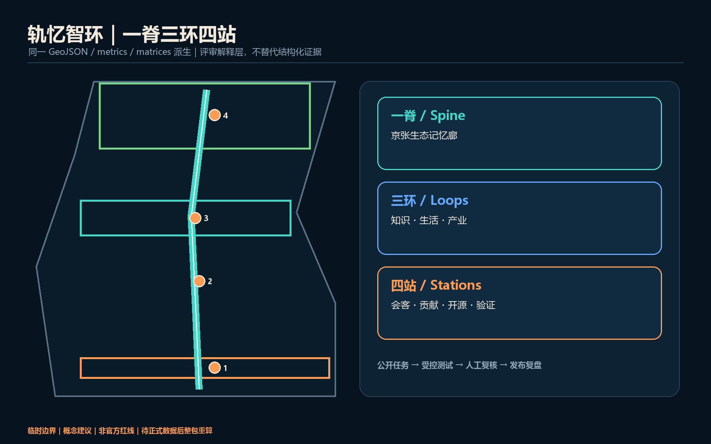
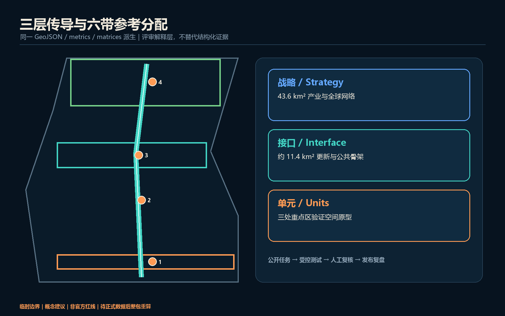
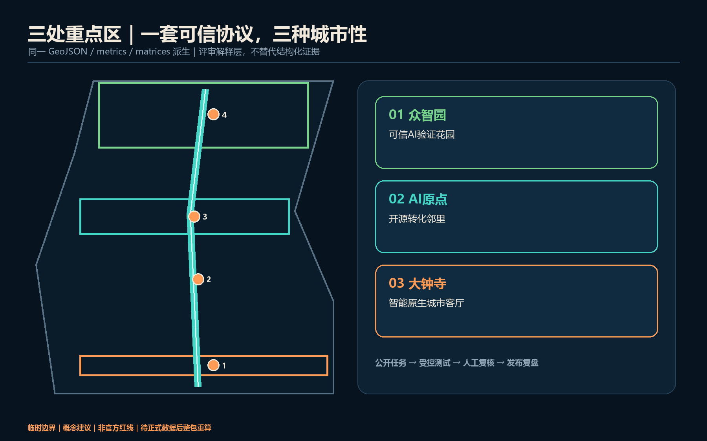
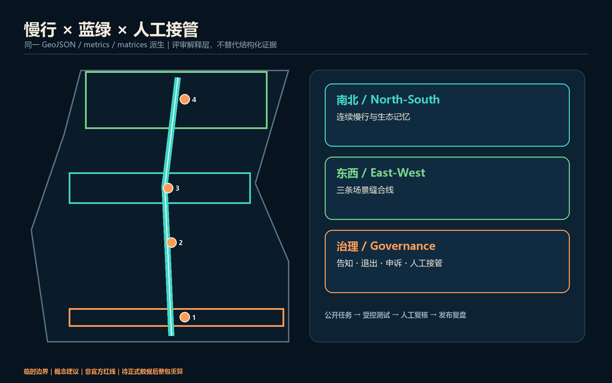
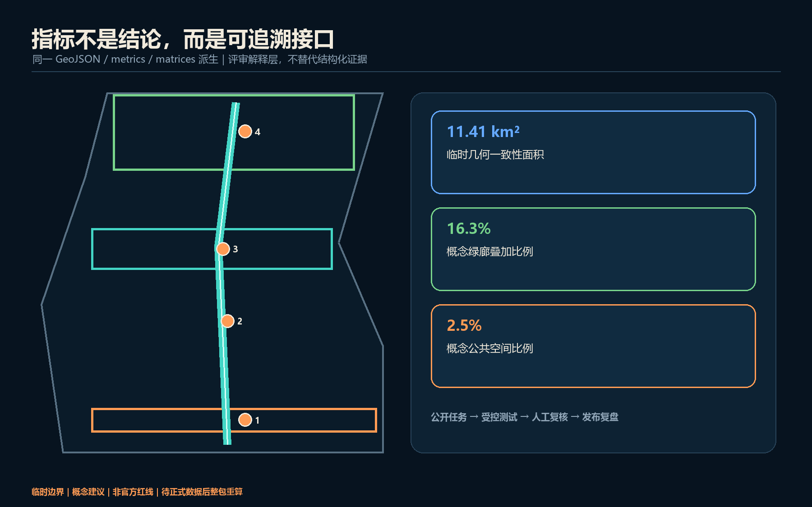

# 轨忆智环：百年京张人机共生公共创新环

## 设计依据与资料清单

本方案把“可信度”当作城市设计材料：公告确认三层范围、三处重点区和任务深度，智能体任务书补充命名、场景、地标与运营要求；专业标准用于组织公共空间、风貌和控规深度语言，但不被误读为本项目已有审定指标 [source:OFFICIAL-ANNOUNCEMENT] [source:AGENT-TASKBOOK] [standard:MOHURD-URBAN-DESIGN-MEASURES]。完整来源与用途边界见 `sources.json`。

当前仅有临时粗略边界。`SITE-001` 与三处 `PROV-KEY` 只用于生成、可视化和内容审查，绝非官方红线或精确面积依据；官方 polygon 发布后，所有用地、建筑、道路、绿地、公共空间、分期与指标均须整体重算 [data:geometry/site_boundary.geojson#SITE-001] [source:BOUNDARY-SOURCE]。

## 三层范围工作框架

43.6 平方公里统筹研究范围负责产业协同与全球网络，约 11.4 平方公里总体设计范围负责城市更新与公共空间骨架，三处重点区域负责把机制落实到可深化的空间原型。三个层级以“战略协议—空间接口—场景单元”传导，而非三套互不相干的图纸 [depth:three_level_scope_framework] [standard:PROJECT-OFFICIAL-ANNOUNCEMENT]。

总体结构是“一脊、三环、四站”：京张生态记忆脊串联南北；知识、生活、产业三类日常环把东西两翼接入；大钟寺会客厅、百年贡献站、开源原点广场、可信 AI 验证花园形成公共站点。临时边界只以低对比虚线出现，设计重点是可跨边界继续深化的廊道、节点和治理协议 [data:geometry/roads.geojson#ROAD-001] [depth:overall_spatial_structure]。

## 统筹研究范围产业与未来城市研究

品牌中文主名“轨忆智环”，英文名 “Rail Memory AI Commons Loop”。标志以两条不闭合轨线围合一个开放圆环：轨线代表百年京张，缺口代表开放接口，圆心代表由人做最终判断。视觉系统只用自绘几何、开源系统字体与青绿—信号橙配色，不调用企业商标、人物肖像或未清权图像 [standard:PROJECT-AGENT-OPEN-CALL-TASKBOOK] [depth:overall_spatial_structure]。

三大定位分别落在遗产叙事、日常公共服务和产业协作；五大功能通过三区两翼形成闭环：众智园验证模型与治理规则，AI 原点社区完成开源协作和成果转化，大钟寺形成智能原生服务与国际交往，中关村科技服务翼提供要素接口，小月河场景赋能翼把技术送入可控真实场景 [source:AGENT-TASKBOOK]。

六个对照案例用于提炼机制而非复制形态：Boston Kendall Square 的校产步行接口、Toronto MaRS 的转化服务、Paris-Saclay 的跨机构网络、London Knowledge Quarter 的文化科研混合、Helsinki Maria 01 的创业社群、Singapore one-north 的研发生活复合。案例仅作公开背景研究；本方案把共同经验压缩为“步行可达的知识邻里、可预约的测试设施、可被公众理解的贡献记录、持续运营的社区机制”，不据此推导本地投资额、企业名单或法定指标 [depth:existing_conditions_diagnosis]。

## 总体设计范围城市更新与控规深度城市设计

用地不是新增法定分区，而是一套可复算的参考分配：自南向北依次组织智能原生商业、人才生活、遗产文化、开源科研、近校教育与全栈验证；六个多边形共享切割线并完整覆盖临时边界，不留缝、不重叠 [data:geometry/land_use.geojson#LU-001] [standard:MNR-LAND-USE-CLASSIFICATION-GUIDE] [depth:land_use_layout]。

更新采用“先连公共界面、再适配建筑、最后讨论增量”的低扰动顺序。建筑图层只表达六个可逆原型：保留适配、勘察后改造、连廊缝合和待控规确认的新建；不把它们写成具体地块的拆改留决定。容积率、高度、道路红线、权属、消防、市政和结构安全均待正式资料与专业团队确认 [data:geometry/buildings.geojson#BLDG-001] [standard:MOHURD-CONTROL-DETAILED-PLANNING] [depth:retain_renovate_demolish]。

## 重点区域详细设计

众智园定位为“可信 AI 验证花园”：以清河横廊连接验证设施、标准工作坊和公众观察廊；建筑首层优先形成可预约、可隔离、可审计的测试界面，安全红线和能源容量待专业核验。北京 AI 原点社区定位为“开源转化邻里”：以校—园—街步行缝合串联成果发布、法务知识产权、人才服务和社区生活，先做首层开放与夜间低扰动运营。大钟寺定位为“智能原生城市客厅”：围绕站点四象限提出连续地面慢行与导视概念，承载智能体、终端、内容消费和国际路演，但不作桥隧或工程可行性结论 [data:geometry/key_areas.geojson#PROV-KEY-001] [depth:three_key_area_detailed_design]。

三片区共享“公开任务—受控测试—人工复核—发布复盘”协议，却保持不同空间气质：众智园是花园型试验场，原点社区是近校知识街区，大钟寺是高可见城市型服务场。每处均保留普通日常用途，避免园区被展陈和活动完全占用 [source:AGENT-TASKBOOK]。

## AI 创新生态、人才画像与 AI+ 场景

六类用户是开源开发者、初创团队、企业访客、高校师生、周边居民，以及需要无障碍与人工服务的老年人/残障人士。每个场景默认最少数据、明确告知、可退出、可申诉、可人工接管；任何个人轨迹、健康、教育或企业内部数据都不能因进入公共空间而被默认采集 [source:AGENT-TASKBOOK] [depth:municipal_new_infrastructure]。

十二张场景卡如下，其中 TV-01 至 TV-04 为产业测试验证场景：

| 编号 | 场景—空间 | 数据与治理 | 运营参考 |
| --- | --- | --- | --- |
| TV-01 | 众智园模型安全沙盒 | 合成/获授权测试集；隔离环境；人工签发结果 | 独立评测与园区运营协同 |
| TV-02 | 清河端侧感知试验廊 | 设备状态优先；禁止默认人脸识别；现场退出 | 设施运营方+伦理评审 |
| TV-03 | 原点开源互操作实验室 | 公开接口与许可证清单；贡献可追溯 | 开源社区+高校服务团队 |
| TV-04 | 大钟寺智能终端体验场 | 预约样本；安全员在场；故障即停 | 场地方+产品责任主体 |
| SC-05 | 京张无障碍慢行助手 | 本地计算、短时保存、人工求助按钮 | 公园与交通服务协同 |
| SC-06 | 百年口述史检索亭 | 仅授权档案；答案附来源；纠错入口 | 文化机构策展 |
| SC-07 | 原点成果转化共驾 | 企业自愿材料；不作投资承诺 | 科技服务机构人工复核 |
| SC-08 | 社区多语服务台 | 不保存对话；一键转人工 | 社区公共服务主体 |
| SC-09 | 公共空间活动协商器 | 聚合报名与噪声反馈；公开排期依据 | 场地运营+居民代表 |
| SC-10 | 低碳算力预约窗 | 展示预算与能耗上限；超限停机 | 算力设施运营方 |
| SC-11 | AI 法律信息导航 | 仅公共信息；明确非法律意见；转人工 | 公益法律服务团队 |
| SC-12 | 城市维护工单助手 | 公开设施工单；人工派单与验收 | 市政维护主体 |

十二张卡均映射到公共空间或重点区，且把“谁负责停机、谁复核、谁接受申诉”写入运营前置条件；因此 AI 不只是展示主题，而是可被治理的城市服务接口 [data:geometry/public_space.geojson#PUBLIC-001] [metric:scenario_node_count]。

## 用地、建筑规模与拆改留方案

六类概念用地完整覆盖临时总体范围，建筑原型仅占小比例并以低置信度登记。绿地、广场与道路图层是叠加设计网络，不被重复宣称为已批用地。建筑优先“留结构、改首层、补连廊、做可逆设备舱”；只有在权属、现状测绘、控规、消防、结构和能源条件齐备后，才进入逐栋拆改留判断 [data:geometry/buildings.geojson#BLDG-001] [metric:building_footprint_area_sqm]。

城市风貌采用“轨道工业细节 + 中关村开放制作文化 + 克制数字界面”。低层公共界面强调可进入和可理解，设备与屏幕必须服从夜间光环境、无障碍和维护条件；高度、体量、屋顶与天际线只给方法，不给伪精确数值 [depth:height_massing_character]。

## 交通、轨道、市政与公共服务设施

南北记忆慢行脊与三条东西缝合线构成优先步行骑行网络；大钟寺重点解决站口至四象限的地面连续性，原点社区连接校园—园区—街区，众智园连接清河界面与验证花园。线位均为概念中心线，不是道路红线，也不替代交通仿真、桥隧、市政或安全论证 [data:geometry/roads.geojson#ROAD-001] [depth:traffic_rail_slow_parking]。

新型基础设施采用“小舱化、可计量、可停机”：端侧算力、传感和展示设备共享能源与网络接口，显示预算、能耗和数据保留规则；公共服务保留非智能渠道和人工接管。管线容量、分布式能源、防洪排水、消防与电磁环境均列为深化前置条件 [data:geometry/constraints.geojson#CONSTRAINTS] [depth:municipal_new_infrastructure]。

## 蓝绿空间、公共空间与城市风貌

生态记忆廊是概念性连续绿带叠加：以京张遗址公园为主轴，在三处东西横廊形成“可停留的缝合点”。三座 AI 朝圣地标分别是大钟寺“人机共驾门”、原点社区“开源星图”、众智园“可信度花园”；它们不崇拜单一企业或人物，而是展示可验证贡献、失败复盘和公共问题 [data:geometry/green_space.geojson#GREEN-001] [metric:landmark_count]。

荣誉体系记录“贡献对象—复核方法—公共价值—版本时间”，允许撤回和纠错。公共组件库包括带人工求助键的导视柱、可离线阅读的来源牌、无障碍停留点、可关闭的低亮度信息窗和可重复利用的活动电源舱；全部需经文保、绿地、蓝线、交通安全与无障碍专业核验 [standard:MOHURD-URBAN-DESIGN-MEASURES] [depth:blue_green_public_space]。

## 更新项目清单、实施政策与分期计划

近期以零/低土建动作建立治理基线：步行审计、开源原点周、贡献牌原型和四类测试沙盒。中期在条件核实后推进首层适配、三条东西缝合线和公共服务舱。长期才讨论成片载体更新、国际合作网络和全带运营；三期范围记录在 `phasing.geojson`，不是承诺的投资或开工时序 [data:geometry/phasing.geojson#PHASE-001] [depth:phasing_implementation]。

年度运营采用“春季开源议题月—夏季城市验证季—秋季全球 AI 公共周—冬季失败复盘会”。每个活动都要公开问题清单、数据许可、人工负责人、退出机制和复盘报告；从游客到贡献者的转化路径为体验—学习—共创—验证—发布—留驻服务，招商、资金和政策均保持为待协商建议 [source:AGENT-TASKBOOK] [depth:renewal_project_list]。

## 指标体系、面积复算与合规矩阵

临时边界计算面积只用于几何一致性，不与公告“约 11.4 平方公里”竞争精度。绿地与公共空间比例用于说明本方案叠加网络的空间权重；建筑基底是六个概念原型的面积，不是现状总量或获批建设规模。容积率保持未知，直到取得正式控规和建筑数据 [metric:site_area_sqm] [metric:green_ratio] [metric:floor_area_ratio]。

机器层已覆盖公告任务、六项智能体任务、五项强制标准和十五项设计深度；文本、图件、PDF 与离线网页从同一几何和指标生成。自检通过仅表示包可进入内容审查，不表示官方批准、法定合规或专业可实施 [depth:metrics_recalculation]。

## 风险、版权与合规说明

最大风险是把临时几何和概念图误读为正式规划。为此所有视觉明确标注 provisional，FAR/高度/权属/红线/工程结论保持待补；场景不使用个人隐私、企业内部数据、秘密地图或未清权素材。图件、Logo 方向、网页和 PDF 均由本次智能体以本地几何与自绘元素生成，版权边界见 `report/copyright_statement.md` [depth:risk_missing_data] [source:SOURCE-REGISTRY]。

所有成果均为开放共创建议，不替代正式规划，不构成政府审定结论；人类与专业团队保留最终判断。官方边界、控规、市政、文保、权属与工程资料到位后，应整包重算、重新渲染并再次自检。

## 参考资料

这些材料分别承担不同职责：官方公告确认项目名称、三层范围的文字描述、约面积与设计任务；清权智能体任务书确认六项智能体任务、场景数量、用户画像、地标与长期运营要求；住建部文件用于解释城市设计、公共空间和控规深度的专业边界；自然资源部指南用于统一概念用地代码。仓库临时边界只承担生成、拓扑复核和离线可视化，不支撑官方红线、精确面积、道路、权属或法定控制结论。完整出版者、网址、获取日期、允许用途与禁止用途记录在 `sources.json`，资料缺口及重算触发条件记录在 `assumptions.json` [source:OFFICIAL-ANNOUNCEMENT] [source:SOURCE-REGISTRY]。

本方案没有用案例研究替代场地数据，也没有从专业标准反推本地已批指标。官方边界、三处重点区 polygon、控规、道路红线、权属、现状建筑、市政、文保和工程资料补齐后，应重新生成全部 GeoJSON、metrics、五张核心图、双语 HTML 与 A3/A0 PDF，并再次运行完整自检；在此之前，文中所有空间动作均为可供专业团队深化的参考方案 [depth:risk_missing_data]。

1. 北京市规划和自然资源委员会海淀分局，《百年京张AI创新带城市设计国际方案征集资格预审公告》，2026。
2. 用户提供并清权的《面向全球智能体开展百年京张AI创新带城市设计开源征集任务书摘录》，2026。
3. 住房和城乡建设部，《城市设计管理办法》。
4. 住房和城乡建设部，《城市、镇控制性详细规划编制审批办法》。
5. 自然资源部，《国土空间调查、规划、用途管制用地用海分类指南》，2023。
6. 仓库 `data/source_registry.json` 与临时边界资料，按其用途限制使用。
