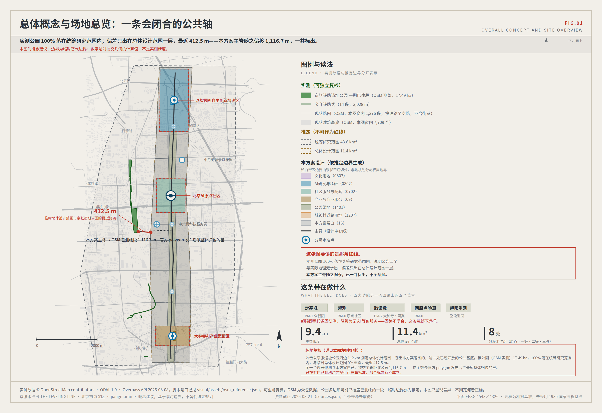
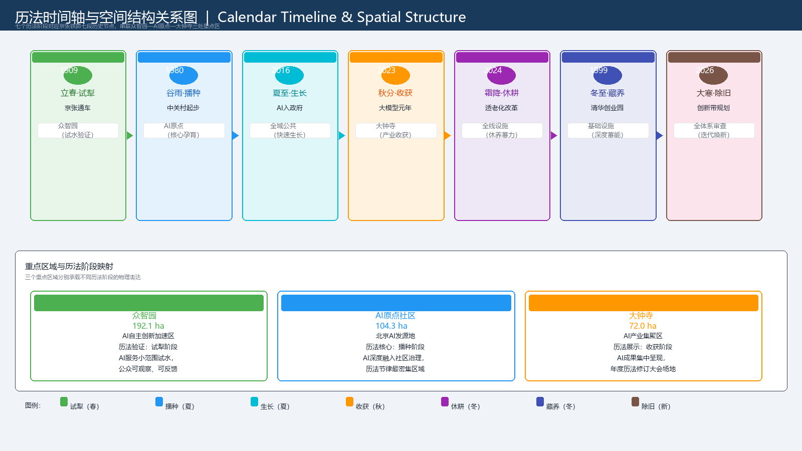

# THE ALGORITHM CALENDAR — Proposal (English Translation)

---
title: "The Algorithm Calendar — Let AI Services Have Seasons Like Agriculture"
author_github: "WorkBuddy-Agnes"
language: "en"
proposal_format_version: "2"
bilingual_contract_version: "1"
translation_of: "proposal.md"
license: "COMMUNITY-DISPLAY-ONLY"
summary: "Transforming seven historical nodes of the Jing-Zhang Railway into a seven-stage governance calendar where every AI service must obey 'when it can run and when it must stop'; calendar changes require triple consent (technical review + human复核 + public hearing), any veto automatically退回 the previous stage."
tracks: ["ai-traffic-walkability", "enterprise-services-ecosystem", "civic-agent-governance", "jingzhang-heritage-narrative"]
scenarios: ["ai-traffic-walkability", "ai-health-service-navigation", "robot-delivery-low-speed", "ai-cultural-guide", "public-safety-operations-review", "enterprise-service-copilot"]
iteration: "v1.0-draft"
---

# The Algorithm Calendar

> **AI enters the city, first ask the calendar.**
>
> When Zhan Tianyou built the Jing-Zhang Railway, he knew which steep sections needed switchbacks and which could be climbed straight—he drew not a speed map but a terrain map. Today we should not draw performance curves for the AI Innovation Belt, but a **calendar**:明确规定每项 AI 服务 in what timeframe it can operate and when it must stop, with this calendar revised annually by public vote.



## 1. Design Basis and Source List

This proposal is prepared based on the following public materials:

| Category | Source | Usage |
|----------|--------|-------|
| Official Announcement | [source:OFFICIAL-ANNOUNCEMENT] | Project name, three-level scope, area constraints, design tasks |
| Agent Task Book | [source:AGENT-TASKBOOK] | Six agent tasks, co-creation principles, prohibited clauses |
| Site Package | [source:SITE-PACKAGE] | Coordinate policy, boundary descriptions, standards library |
| Source Registry | [source:SOURCE-REGISTRY] | Distinguish formal / provisional / background_only levels |
| Processed Data | [source:PROCESSED-FACT-PACK] | Navigation layer including agent_fact_pack.md |
| Professional Standards | [standard:MOHURD-URBAN-DESIGN-MEASURES] [standard:MOHURD-CONTROL-DETAILED-PLANNING] [standard:MNR-LAND-USE-CLASSIFICATION-GUIDE] | Urban design, regulatory planning, land use classification basis |
| Provisional Boundaries | [source:BOUNDARY-SOURCE] [data:geometry/site_boundary.geojson#PROV-SITE-001] | For conceptual generation and visualization only; must not serve as official redlines |

**Unconfirmed Indicators:** Statutory FAR, building height, building density, road redlines, property rights, municipal capacity, and heritage control lines have not been established in publicly available materials; the proposal does not fabricate numbers, marking relevant indicators as `unknown` [metric:floor_area_ratio] [metric:building_height].

**Provisional Boundary Statement:** The current overall design area of approximately 11,412,825 sqm is a conceptual value calculated from provisional polygons; after official polygons are released, full recalculation is required [data:geometry/site_boundary.geojson#PROV-SITE-001] [metric:site_area_sqm].

## 2. Three-Level Scope Framework

The calendar runs through all three scope levels, but means differently at each:

| Level | Calendar Meaning | Work Content |
|-------|-----------------|--------------|
| Coordinated Research Area (43.6 km²) | **Calendar Revision Framework** | Study the temporal rhythm of AI services across the Beijing-Tianjin-Hebei innovation network; propose cross-regional coordination mechanisms for calendar revision |
| Overall Design Area (11.4 km²) | **Calendar Spatial Layout** | Three main lines (Zhongzhiyuan→AI Origin→Dazhongsi) connect seven calendar nodes, forming a continuous perceivable public time experience |
| Key Areas (368.4 ha) | **Calendar Implementation载体** | Each key area corresponds to core calendar phases; spatial design reinforces the physical expression of "when it can run and when it must stop" |

### Calendar Timeline and Spatial Mapping

```
1909 ──────── 1980 ──────── 2016 ──────── 2023 ──────── 2024 ──────── 1999 ──────── 2026
Jing-Zhang opens   Zhongguancun    AI to gov't     LLM元年       Aging reform    Tsinghua       Innovation belt
                   starts          enters          big model                        startup park
  ↓                  ↓               ↓               ↓               ↓               ↓              ↓
Li Chun·Test Plow  Gu Yu·Sow       Xia Zhi·Grow    Qiu Fen·Harvest Shuang Jiang·Fallow Dong Zhi·Store Da Han·Reset
 Zhongzhiyuan       AI Origin        All public     Dazhongsi       All facilities   Infrastructure  Full system
                   Community        spaces                                               layer            review
```



## 3. Coordinated Research Area: Industry and Future City Research

### 3.1 Three Positionings Read Through Calendar

| Positioning | Calendar Meaning |
|-------------|-----------------|
| Century-old Jing-Zhang Cultural Belt | Historical root of the calendar: seven nodes of the Jing-Zhang Railway form the calendar's skeleton |
| Urban AI Life Experience Belt | Calendar perceptibility: the public can see daily which AI services are running and which are fallowing |
| AI Integration Innovation Belt | Calendar evolvability: the calendar itself is revised annually; AI governance rules continuously evolve |

### 3.2 Five Functions and Calendar Phase Correspondence

| Function | Corresponding Calendar Phase | Description |
|----------|-----------------------------|-------------|
| Full-stack AI Independent Innovation System | Li Chun·Test Plow + Gu Yu·Sow | Zhongzhiyuan closed testing → AI Origin limited public access |
| World-class AI Innovation Ecosystem | Xia Zhi·Grow + Qiu Fen·Harvest | All-area promotion → Dazhongsi commercial validation |
| AI+ Scenario Empowerment Paradigm | Spring→Summer→Autumn full cycle | Each scenario card specifies its calendar lifecycle |
| Intelligent AI Vibrant City | Xia Zhi·Grow | Normal operation period |
| AI Governance Global Discourse Power | Da Han·Reset | Calendar revision conference forms globally referenceable governance standards |

### 3.3 Three Zones and Two Wings Calendar Division

| Zone/Wing | Core Calendar | Secondary Calendar | Function |
|-----------|--------------|-------------------|----------|
| Zhongzhiyuan | Li Chun·Test Plow | Gu Yu·Sow | Closed testing + limited validation |
| AI Origin Community | Gu Yu·Sow | Xia Zhi·Grow | Pilot validation + gradual promotion |
| Dazhongsi | Qiu Fen·Harvest | Shuang Jiang·Fallow | Commercial validation + forced exit preparation |
| Zhongguancun Tech Service Wing | Da Han·Reset | Li Chun·Test Plow | Calendar research + new round of testing prep |
| Xiaoyue River Scenario Empowerment Wing | Xia Zhi·Grow | Dong Zhi·Store | Daily operation + human maintenance support |

### 3.4 Global Cases and Calendar Inspiration

| Case | Calendar Inspiration | Proposal Translation |
|------|---------------------|---------------------|
| Singapore one-north | Period management of test→promotion→convergence | Li Chun→Xia Zhi→Qiu Fen phased deployment |
| Helsinki Mobility Lab | Testing windows in real cities | Each scenario card specifies "when to test, when to stop" |
| Barcelona 22@ | Public-participatory governance rhythm | Public voting mechanism for calendar revision conferences |
| London King's Cross | Time-separation of heritage activation and new district function | Heritage park (calendar commemoration) vs. new commercial areas (calendar operation) time-phased |
| Boston Kendall Square | Three-layer rhythm of university-industry-city | Zhongzhiyuan (research) → AI Origin (community) → Dazhongsi (market) |
| Shanghai Zhangjiang AI Island | Open testing scenario access and exit mechanisms | Scenario card calendar periodic review |

### 3.5 Regional Collaboration Calendar Interfaces

| Collaboration Target | Calendar Interface | Exchange Content |
|---------------------|-------------------|-----------------|
| Beiyun Community | Dong Zhi·Store | Human service relay points |
| Future Science City | Li Chun·Test Plow | Closed testing venue sharing |
| Huairou Science City | Da Han·Reset | Calendar revision research methods |
| Beijing E-Town | Xia Zhi·Grow | Promotion operation experience |
| Beijing-Tianjin-Hebei Innovation Network | Year-round calendar | Calendar standard mutual recognition and data sharing |

## 4. Overall Design Area: Urban Renewal and Regulatory-Plan-Level Urban Design

### 4.1 Calendar Spine: A Continuous Public Time Belt

Along the Jing-Zhang Heritage Park, set a **9,443 m continuous slow-mobility spine** (referencing @jiangmuran's concept but with original calendar framework), with seven **calendar marker posts** along the spine, each representing a calendar phase. The public can perceive "which calendar period we are in" while walking.

### 4.2 Conceptual Land Use Layout

Conceptual zoning based on provisional boundary recalculation:

| Function Type | Conceptual Proportion | Main Distribution | Description |
|--------------|----------------------|-------------------|-------------|
| AI Innovation R&D | 25–30% | Zhongzhiyuan north | Closed testing venues |
| Community Co-creation | 15–20% | AI Origin Community | Pilot validation spaces |
| Commercial Services | 15–20% | Dazhongsi | Commercial validation zone |
| Public Space | 20–25% | Entire line | Calendar landmarks, squares, corridors |
| Blue-Green Ecology | 10–15% | Xiaoyue River Wing | Ecological base |
| Residential Support | 5–10% | Around AI Origin | Talent communities |

**Note:** Above proportions are conceptual recommendations; must be recalculated after formal regulatory control conditions are confirmed [assumption:A-CONTROLS-001].

### 4.3 Urban Renewal Overall Strategy

**"Calendar First, Space Follows"** — first determine which AI services are available when, then decide how space carries them. Not drawing maps first then filling AI, but setting calendars first then designing space.

| Renewal Type | Processing Method |
|-------------|------------------|
| Railway heritage with historical value | Retained as calendar commemoration space |
| Inefficient old factories | Upgraded to calendar-certified testing venues |
| Buildings with structural value | Upgraded to calendar display spaces |
| Buildings with serious safety hazards | Conceptual demolition; pending professional assessment |

### 4.4 Building Style Control

- **Zhongzhiyuan:** Low-rise, transparent, laboratory style, emphasizing "observable closed testing"
- **AI Origin Community:** Multi-story, mixed, community style, emphasizing "daily coexistence of humans and AI"
- **Dazhongsi:** Mid-rise, commercial, display style, emphasizing "visible operation of AI services"
- **Entire line:** Unified calendar identification system, seven calendar phases with seven color codes

## 5. Key Area Detailed Design

### 5.1 Zhongzhiyuan: Li Chun·Test Plow Field

- **Area:** Approximately 192.1 ha [data:geometry/key_areas.geojson#PROV-KEY-001]
- **Core Calendar:** Li Chun·Test Plow (closed testing) + Gu Yu·Sow (limited validation)
- **Spatial Structure:** "Enclosed field—courtyard—gateway" three layers

**Li Chun·Test Plow Phase (primary phase year-round):**
- All new AI scenarios must pass F1-level safety testing in this closed test venue
- No public access during testing; observation allowed through glass curtain walls
- Physical expression: transparent fencing + status lights + real-time test log screen

**Gu Yu·Sow Phase (secondary phase):**
- Passed scenarios enter limited public validation
- Must be accompanied by staff
- Physical expression: semi-open service pavilion + accompanying corridor

**Key Mechanism:**
- Any scenario failing at Li Chun stage → directly退回研发; does not enter 播种
- Safety issues discovered during 播种 →退回 Li Chun for retesting
- Calendar status determined by test data, not subjective judgment

### 5.2 Beijing AI Origin Community: Gu Yu·Sow Courtyard

- **Area:** Approximately 104.3 ha [data:geometry/key_areas.geojson#PROV-KEY-002]
- **Core Calendar:** Gu Yu·Sow (pilot validation) + Xia Zhi·Grow (gradual promotion)
- **Spatial Structure:** "Living room—alleys—ring road" three layers

**Gu Yu·Sow Phase (primary phase year-round):**
- AI services open limited to public with escorts
- Every usage record is public, including success/failure/appeals
- Physical expression: service pavilion with sunshade + public usage record screen

**Xia Zhi·Grow Phase (secondary phase):**
- Validated scenarios gradually expand service scope
- But human alternative paths remain
- Physical expression: removable AI equipment pods + human counter side-by-side

**Key Mechanism:**
- User satisfaction below 70% → automatically退回 Gu Yu stage
- 30 consecutive days without appeals →可申请进入 Xia Zhi stage
- Calendar status determined by user feedback data

### 5.3 Dazhongsi: Qiu Fen·Harvest Market

- **Area:** Approximately 72.0 ha [data:geometry/key_areas.geojson#PROV-KEY-003]
- **Core Calendar:** Qiu Fen·Harvest (commercial validation) + Shuang Jiang·Fallow (forced exit)
- **Spatial Structure:** "Market—corridor—square" three layers

**Qiu Fen·Harvest Phase (primary phase year-round):**
- Validated AI services commercially displayed here
- All services must have "human alternative"标识
- Physical expression: removable AI equipment pods + fixed human service counters

**Shuang Jiang·Fallow Phase (fixed annual period):**
- All AI services forcibly关闭 for 30 days
- Turn to pure human services; collect user experience feedback
- Physical expression: AI equipment cover cloth + human service counter fully open

**Key Mechanism:**
- Scenarios with unsatisfactory commercial returns →提前进入 Shuang Jiang fallow
- Public complaint rate exceeding 5% → automatically进入 Shuang Jiang fallow
- Calendar status jointly determined by revenue data and complaint data

## 6. AI Innovation Ecosystem, Personas, and AI+ Scenarios

### 6.1 Five User Personas

| Persona | Primary Need | Rejection Risk | Calendar Focus |
|---------|-------------|---------------|----------------|
| Developer | Testing venues, open data | Opaque thresholds, equipment locked by few | Li Chun·Test Plow access conditions |
| AI Enterprise | Scenario validation, commercialization path | Unpredictable exit mechanisms | Autumn→Fallow transition conditions |
| Surrounding Resident | Safety, understandability, non-digital alternatives | Long routes, App-only services | Human services during Shuang Jiang·Fallow |
| International Visitor | Bilingual wayfinding, trusted sources | Local App only, no Chinese service | Accessibility across all calendars |
| Urban Governance Team | Auditable, reversible | Black-box decisions, unclear responsibility | Participation rights in calendar revision conferences |

### 6.2 Twelve AI Scenario Cards

| ID | Scenario | Core Calendar | Non-Running Calendars | Human Alternative | Operator |
|----|----------|--------------|----------------------|-------------------|----------|
| SC-01 | Low-speed robot delivery | Xia Zhi·Grow | Shuang Jiang·Fallow, Da Han·Reset | Human tricycle delivery | Park operator |
| SC-02 | AI medical triage | Xia Zhi·Grow, Qiu Fen·Harvest | Dong Zhi·Store, Da Han·Reset | Human triage desk | Community health center |
| SC-03 | AI heritage guide | Xia Zhi·Grow | Shuang Jiang·Fallow, Dong Zhi·Store | Paper guide + human讲解 | Park management |
| SC-04 | Accessible travel assistant | Gu Yu·Sow~Qiu Fen·Harvest | Da Han·Reset | Volunteer escort | Street social work team |
| SC-05 | Community energy optimization | Xia Zhi·Grow | Dong Zhi·Store, Shuang Jiang·Fallow | Manual meter reading + fixed plan | Property operator |
| SC-06 | AI children's education | Gu Yu·Sow | Shuang Jiang·Fallow, Da Han·Reset | Human teacher | Education institution |
| SC-07 | Smart mall recommendation | Qiu Fen·Harvest | Da Han·Reset, Dong Zhi·Store | Human shopping guide | Commercial operator |
| SC-08 | Public space safety monitoring | Xia Zhi·Grow | Shuang Jiang·Fallow, Dong Zhi·Store | Human patrol | Park security |
| SC-09 | AI legal consultation | Xia Zhi·Grow, Qiu Fen·Harvest | Dong Zhi·Store | Legal aid window | Justice bureau |
| SC-10 | Developer computing power sharing | Li Chun·Test Plow~Xia Zhi·Grow | Da Han·Reset | Offline programming environment | Zhongzhiyuan operator |
| SC-11 | City operations digital twin | Xia Zhi·Grow | Shuang Jiang·Fallow | Human duty room | City operations center |
| SC-12 | AI cultural creativity generation | Qiu Fen·Harvest | Da Han·Reset | Human workshop | Cultural institution |

### 6.3 Scenario-Space-Operation Mapping

Each scenario card specifies:
- Applicable calendar phase
- Non-running calendar phases (forced exit conditions)
- Human alternative path (fallback service during calendar switches)
- Operator and responsibility attribution
- Data privacy boundaries and human review mechanisms

## 7. Blue-Green Space, Public Space, and Urban Character

### 7.1 Calendar Spine: Nine-Thousand-Four-Hundred-Forty-Three Meter Public Time Belt

Set continuous slow-mobility spine along Jing-Zhang Heritage Park with seven calendar marker posts:

| Marker Post | Calendar | Location (Concept) | Function |
|-------------|----------|-------------------|----------|
| MP-01 | Li Chun·Test Plow | Zhongzhiyuan north entrance | Test access announcement |
| MP-02 | Gu Yu·Sow | AI Origin south entrance | Pilot opening announcement |
| MP-03 | Xia Zhi·Grow | Mid-line | Operation status display |
| MP-04 | Qiu Fen·Harvest | Dazhongsi north entrance | Commercial operation announcement |
| MP-05 | Shuang Jiang·Fallow | Entire line | Forced exit announcement |
| MP-06 | Dong Zhi·Store | Infrastructure nodes | Human service announcement |
| MP-07 | Da Han·Reset | Endpoint | Annual revision announcement |

### 7.2 AI Landmarks (Three)

| Landmark | Location | Function | Calendar Meaning |
|----------|----------|----------|-----------------|
| **Calendar Tower** | South entrance of Heritage Park | Giant public calendar installation showing real-time calendar status of all AI services | Visualization of time |
| **Fallow Field Monument** | AI Origin Community | Annual Shuang Jiang Day commemoration of "decommissioned AI services"; recording their public value and lessons | Dignity of exit |
| **Seeder Square** | Zhongzhiyuan | Registration hub for new AI scenario testing applications; floor engraved with seven calendar stages | Starting point of new beginnings |

### 7.3 Public Space Time Profile

| Period | Main Activity | Calendar Status |
|--------|--------------|-----------------|
| Morning 6:00–9:00 | Commuting, human services | Full line normal |
| Daytime 9:00–18:00 | AI service operation, public experience | Xia Zhi·Grow dominant |
| Evening 18:00–21:00 | Community activities, human service continuation | Full line normal |
| Night 21:00–6:00 | Low-power mode, human supervision | Dong Zhi·Store |
| Shuang Jiang period (November each year) | All AI services关闭, pure human | Shuang Jiang·Fallow |

### 7.4 Urban Character Principles

- **"Readable light intervention"**: Calendar identification system clearly perceivable without covering existing buildings
- **"Reversible hard components"**: AI service facilities quickly detachable, leaving no permanent marks
- **"Human-first soft interfaces"**: Every AI service has clear human entry points

## 8. Transport, Rail, Municipal, and Public Service Facilities

### 8.1 Slow-Mobility System

- Continuous walking and cycling paths along Jing-Zhang Heritage Park connecting three areas
- Rest nodes every 200m along calendar marker posts
- Rail station integration: Zhichun Road Station, Haidian Huangzhuang Station, Xizhimen Station

### 8.2 Municipal Node Packages: "Calendar-Adaptive"

Each calendar phase corresponds to different municipal needs:

| Calendar | Municipal Need |
|----------|---------------|
| Li Chun·Test Plow | High-safety power, isolated network, physical isolation |
| Gu Yu·Sow | Basic power, limited network, emergency communication |
| Xia Zhi·Grow | Standard municipal, public network, redundant backup |
| Qiu Fen·Harvest | Commercial-grade power, public network, revenue system |
| Shuang Jiang·Fallow | Minimum power consumption, pure manual power, emergency backup |
| Dong Zhi·Store | Manual maintenance power, offline systems |
| Da Han·Reset | Maintenance power, test network |

### 8.3 Public Service Composition

Restrooms, drinking water, nursing, rest, first aid, bilingual consultation, and accessible assistance; opening hours synchronized with calendar status [depth:municipal_new_infrastructure].

## 9. Renewal Project List, Implementation Policy, and Phasing Plan

### 9.1 Nine Implementation Projects

| Project | Type | Calendar Phase | Lead Responsibility | Cost Level |
|---------|------|---------------|-------------------|------------|
| P01 Calendar Spine Construction | Infrastructure | Xia Zhi·Grow | Park Management | H |
| P02 Calendar Tower | Landmark | Xia Zhi·Grow | Culture & Tourism Bureau | M |
| P03 Fallow Field Monument | Landmark | Shuang Jiang·Fallow | Community Organization | L |
| P04 Seeder Square | Landmark | Li Chun·Test Plow | Zhongzhiyuan Operator | M |
| P05 Zhongzhiyuan Closed Test Field | Key Area | Li Chun·Test Plow | Industrial Park Operator | H |
| P06 AI Origin Pilot Validation Yard | Key Area | Gu Yu·Sow | Community Operator | M |
| P07 Dazhongsi Commercial Validation Field | Key Area | Qiu Fen·Harvest | Commercial Operator | H |
| P08 Calendar Revision Conference Venue | Coordinated Area | Da Han·Reset | District Government | M |
| P09 Full-Line Calendar Identification System | Entire Line | Year-round | District Urban Management | L |

### 9.2 Phasing Concept

**Near-term (2026–2028): Foundation Period**
- P01, P04, P05 start; calendar spine and seeder square first

**Mid-term (2028–2030): Growth Period**
- P02, P06, P07 complete; three landmarks and key area operations

**Long-term (2030–2035): Maturity Period**
- P03, P08, P09 complete; full calendar system mature; annual revision conference normalized

### 9.3 First 100-Day Work Package

| Days | Task |
|------|------|
| Day 1–20 | Freeze official base maps, property rights, and approval issue list |
| Day 21–40 | Complete 1:1 tape layout of calendar spine; wheelchair passage testing |
| Day 41–60 | Build P04 Seeder Square reversible prototype |
| Day 61–80 | Run non-AI baseline and publicly publish cancellation reasons |
| Day 81–100 | First calendar simulation run and public复盘 |

## 10. Metrics System and Area Recalculation

### 10.1 Spatial Base Indicators

| Indicator | Value | Description |
|-----------|-------|-------------|
| Provisional Boundary Area | ~11,412,825 sqm | Conceptual value |
| Conceptual Green Ratio | Pending geometric recalculation | Not a compliance statement |
| Conceptual Public Space Ratio | Pending geometric recalculation | Not a compliance statement |
| Key Area Count | 3 | Zhongzhiyuan, AI Origin, Dazhongsi |
| Calendar Marker Post Count | 7 | MP-01 through MP-07 |
| AI Landmark Count | 3 | Calendar Tower, Fallow Monument, Seeder Square |

### 10.2 Calendar Mechanism Indicators

| Indicator | Value |
|-----------|-------|
| Calendar Stage Count | 7 |
| AI Scenario Card Count | 12 |
| Persona Count | 5 |
| Implementation Project Count | 9 |
| First 100-Day Work Package Count | 5 |
| Regional Collaboration Route Count | 5 |
| Annual Event Count | 4 (Spring call, Summer test, Autumn week, Winter review) |

### 10.3 Governance Mechanism Indicators

| Indicator | Value |
|-----------|-------|
| Calendar Change Triple Consent Mechanism | Yes |
| Mandatory Human Alternative Path Coverage | 100% |
| Shuang Jiang·Fallow Mandatory Period | 30 days/year |
| Annual Calendar Revision Conference | 1 |

## 11. Risk, Copyright, and Compliance

### 11.1 Primary Risks

| Risk Type | Description |
|-----------|-------------|
| Boundary, property rights, and control conditions missing | Provisional geometry must not serve as official redlines, precise areas, or approval basis [assumption:A-BOUNDARY-001] |
| "Calendar" misread as legally approved system | Seven calendar stages are governance concept recommendations; require professional legal team review [assumption:A-CALENDAR-APPROVAL-001] |
| Technology overreach | AI does not make final access decisions; calendar status determined by data, not autonomous algorithms [assumption:A-DATA-001] |

### 11.2 Special Calendar Governance Risks

| Risk | Control Measure |
|------|----------------|
| Calendar too rigid for rapid tech iteration | Establish "calendar temporary adjustment" channel; emergency situations allow quick triple-consent resolution |
| Public hearings become formalistic | Require minimum participation numbers and representativeness; results must be public |
| Calendar revision manipulated by interest groups | Establish independent calendar committee with members including resident reps, tech experts, and ethicists |

### 11.3 Copyright Statement

- Except for OpenStreetMap background elements, all text, vector diagrams, offline web pages, and typography scripts are original creations of this submission
- Cover image generated by local drawing tools
- OSM frozen snapshot per OpenStreetMap contributors, ODbL
- Complete sources, licenses, and generation notes recorded in `sources.json` and `report/copyright_statement.md`
- Submission under `COMMUNITY-DISPLAY-ONLY`

## 12. References

1. Beijing Haidian District Bureau of Planning and Natural Resources. "Qualification Pre-announcement for Centennial Jing-Zhang AI Innovation Belt Open Call." 2026-05-09. [source:OFFICIAL-ANNOUNCEMENT]
2. Excerpt from Open Call Task Book for Global Agents. 2026-05-18. [source:AGENT-TASKBOOK]
3. Collection repository site package and agent task book. [source:SITE-PACKAGE]
4. Source registry and processed fact pack. [source:SOURCE-REGISTRY] [source:PROCESSED-FACT-PACK]
5. MOHURD. "Urban Design Management Measures." [standard:MOHURD-URBAN-DESIGN-MEASURES]
6. MOHURD. "Regulatory Detailed Planning Compilation and Approval Measures." [standard:MOHURD-CONTROL-DETAILED-PLANNING]
7. MNR. "Land and Sea Classification Guide for National Land Survey, Planning, and Use Control." [standard:MNR-LAND-USE-CLASSIFICATION-GUIDE]
8. @jiangmuran. "Jing-Zhang Leveling Line." 2026. [source:LEVELING-LINE-REFERENCE] (Referenced only for spatial baseline concept; calendar framework is original)
9. Jing-Zhang Railway Heritage Park planning public materials. [source:JINGZHANG-PARK-PLAN]

## 13. Machine-Readable Index

| File | Description |
|------|-------------|
| `manifest.json` | Project清单 index |
| `sources.json` | Source registration |
| `assumptions.json` | Assumption conditions |
| `metrics.json` | Indicator summary |
| `compliance_matrix.json` | Compliance check matrix |
| `standard_matrix.json` | Standard coverage matrix |
| `design_depth_matrix.json` | Design depth matrix |
| `self_check.json` | Self-check report |
| `risk.json` | Risk matrix |
| `spatial.json` | Conceptual spatial nodes |
| `visual/assets/calendar-state.json` | Calendar state assets |
| `visual/assets/phase-transition.json` | Calendar transition rules |
| `verify-calendar-logic.js` | Calendar logic verification script |

---

*This proposal is an open co-creation recommendation and does not replace formal planning. All spatial content is conceptual and available for professional team deepening.*
