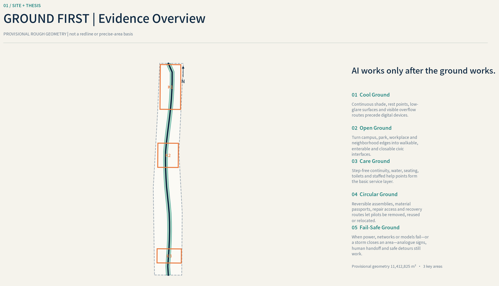
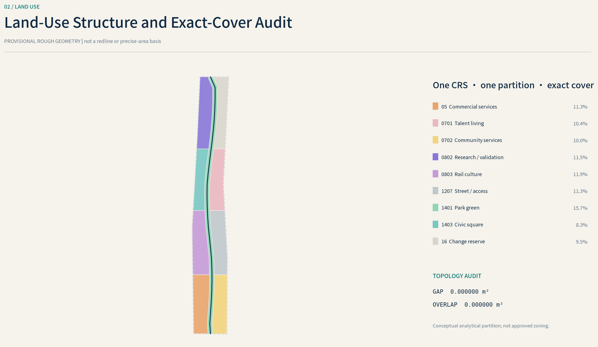
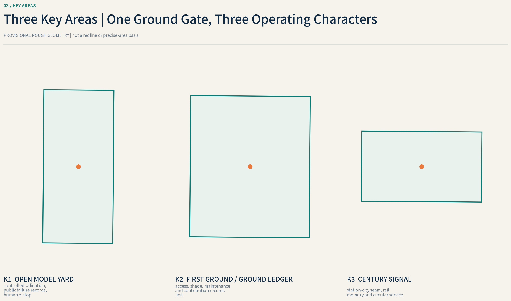
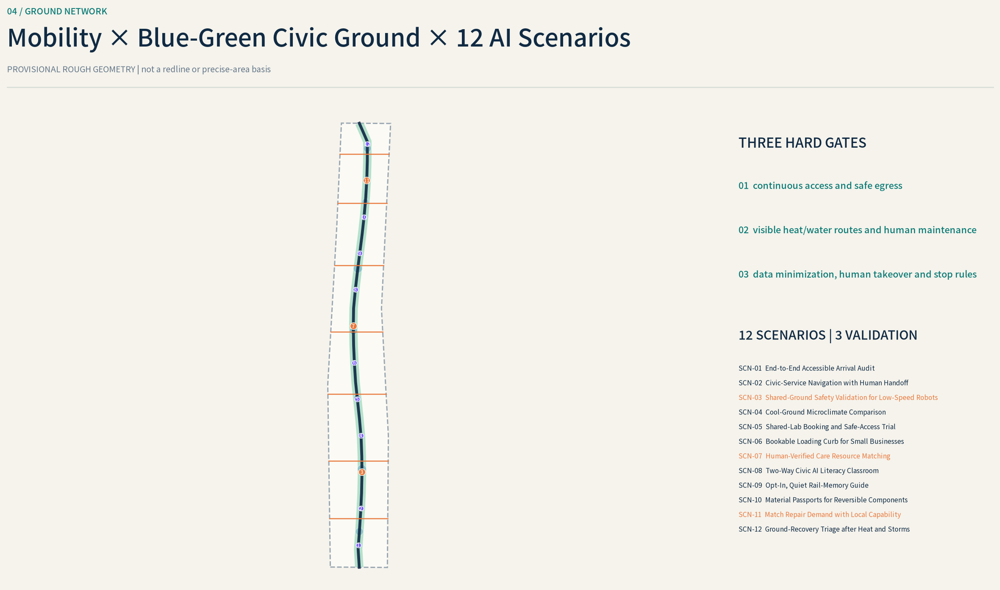
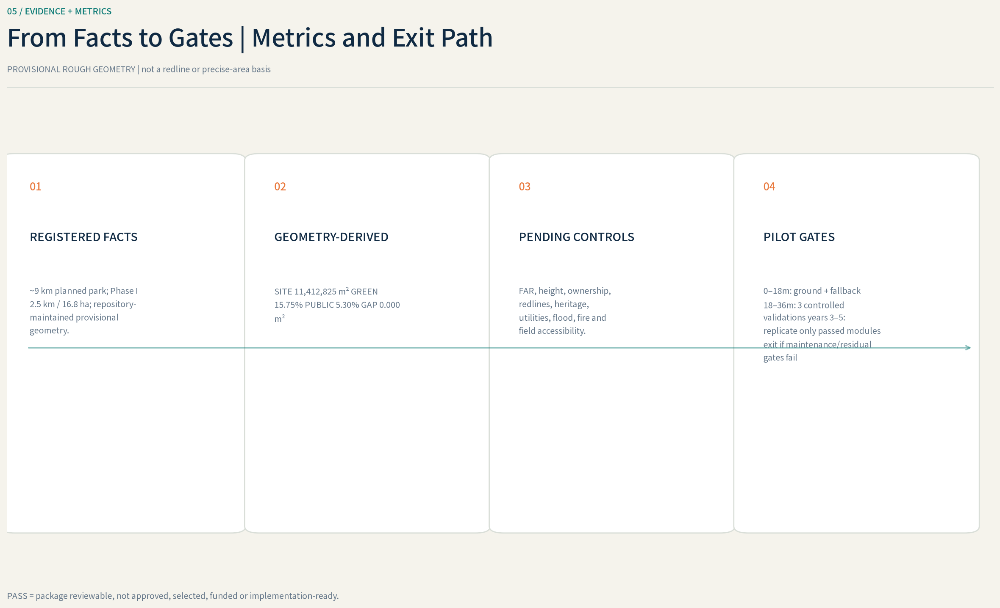

# GROUND FIRST: A Resilient Civic Ground for the Centennial Jing-Zhang AI Innovation Belt

## Design Basis and Source List

The central judgment of GROUND FIRST is that AI is not the starting point of urban space. It becomes an eligible service layer only after the ground is accessible, inhabitable, evacuable, drainable, and maintainable. The proposal defines a “ground-performance contract” comprising continuous universal access, shade and rain shelter, visible overflow routes, safe egress, separation of servicing from pedestrians, reversible installation, and accountable human operation. A scenario that fails its applicable contract remains offline, falls back to a human service, or is removed. This responds to the open call’s public-interest, AI-native, and human-final-judgment principles, while every spatial move remains a conceptual suggestion rather than planning approval or engineering proof.[source:AGENT-TASKBOOK] [standard:PROJECT-AGENT-OPEN-CALL-TASKBOOK] [depth:existing_conditions_diagnosis]

Evidence is used in four tiers. The official announcement and local professional standards establish tasks, terminology, and compliance boundaries; Jing-Zhang Park, Haidian climate, water, and accessibility material provides existing-condition leads; international cases contribute transferable mechanisms only; and the GeoJSON and metric files hold the proposal’s own recalculable evidence. Phase I material documents intentions such as railway-heritage reuse, rain gardens, and slow-mobility space, while later schemes propose additional entrances, reopened side streets, and cycling connections. Announcements, directories, and design schemes do not constitute a current audit of continuous accessibility, drainage capacity, or facility condition.[source:LOCAL-JZ-PHASE1-2023] [source:LOCAL-JZ-SPONGE-2023] [source:LOCAL-JZ-PHASE2-2024]

The current `SITE-001` and `PROV-KEY-001`, `PROV-KEY-002`, and `PROV-KEY-003` are repository-maintained provisional rough polygons. They must retain `geometry_role="provisional_constraint"`, `official_boundary=false`, and `boundary_precision="provisional_rough"`. They support concept generation, intake self-checking, graphic composition, and non-statutory discussion only. They are not official redlines, ownership parcels, road redlines, approval evidence, or a basis for precise area claims.[data:geometry/site_boundary.geojson#SITE-001] [source:BOUNDARY-SOURCE] [source:KEY-AREA-SOURCE]

Once official polygons are obtained, the package must replace them as a whole; reclip `land_use`, `buildings`, `roads`, `green_space`, `public_space`, `constraints`, and `phasing`; recalculate every metric; and regenerate the five figures, bilingual HTML/PDF outputs, three professional matrices, and manifest hashes. Replacing only the boundary layer is insufficient. Formal development also requires existing-building, ownership, regulatory-plan, municipal, fire, heritage, tree, thermal, and segment-by-segment accessibility surveys. The organizer-supplied geometry gap does not block conceptual content scoring, but it prevents claims of precise control or engineering feasibility.[depth:risk_missing_data] [standard:MOHURD-CONTROL-DETAILED-PLANNING] [metric:site_area_sqm]

## Three-Level Scope Framework

The coordinated research area examines how the innovation ecosystem shares land, talent, capital, compute, data, and real-world scenarios; it is not drawn as a new construction redline. The proposal organizes the “three areas and two wings” relationally: Zhongzhiyuan supports open validation and governance capability, the Beijing AI Origin Community supports near-campus translation and contribution records, and Dazhongsi supports urban applications, business, and international exchange. The Zhongguancun Technology Service Wing supplies professional services, while the Xiaoyue River Scenario Empowerment Wing provides public-environment and long-term operating interfaces. Their common rule is not “install equipment first,” but “establish walkable, legible, repairable public ground first.”[source:AGENT-TASKBOOK] [source:OFFICIAL-ANNOUNCEMENT] [depth:three_level_scope_framework]

Within the overall design area, `ROAD-001` expresses a conceptual north–south public-ground spine. The blue-green and shade layer `GREEN-001` and the inclusive civic and test commons `PUBLIC-001` use the same shared spatial framework. The three levels are not separate drawing sets: the research level establishes resource loops, the overall level translates them into streets, ground floors, green space, and facilities, and the key areas test those relationships through operable small-scale scenarios.[data:geometry/roads.geojson#ROAD-001] [data:geometry/green_space.geojson#GREEN-001] [data:geometry/public_space.geojson#PUBLIC-001]

The three key areas carry detailed-design hypotheses within provisional constraints. They do not seek a uniform image; instead, they share a ground threshold comprising a continuous accessible route, visible entrances, climatic shelter, separation of servicing and pedestrians, emergency closure procedures, reversible components, and an accountable operator. Any formal boundary change triggers coordinated recalculation of the three mini-plans, scenario nodes, and metrics.[data:geometry/key_areas.geojson#PROV-KEY-001] [data:geometry/key_areas.geojson#PROV-KEY-002] [data:geometry/key_areas.geojson#PROV-KEY-003]

The generator must insert the displayed overall area, key-area count, and ratios into `11,412,825 m²`, `3`, `15.75%`, and `5.30%`, matching `metrics.json`. No placeholder may remain in the formal render. If official polygons are still unavailable, each displayed value must retain the notice “based on provisional geometry; unsuitable for formal area determination.”[metric:site_area_sqm] [metric:key_area_count] [depth:metrics_recalculation]

## Coordinated Research Area: Industry and Future City Research

The brand name is “地面先行 / GROUND FIRST,” with the line “AI works only after the ground works.” The logo direction uses a continuous horizontal datum interrupted by three traversable openings representing the key areas; an upward signal stroke appears only when the datum is continuous. It must remain legible in monochrome, at small scale, as tactile signage, and in motion. The palette prioritizes ground charcoal, shade green, rainwater blue, and a safety accent; the AI signal color appears only as a secondary “gate passed” state. Final fonts, icons, and color specifications must use openly reusable or cleared assets.[source:AGENT-TASKBOOK] [standard:PROJECT-AGENT-OPEN-CALL-TASKBOOK]

The industrial ecosystem follows a “common ground—shared facility—open validation—professional service—scaled translation” loop. Research, housing, culture, commerce, public services, and park space are not isolated functional islands; they connect through accessible ground floors, bookable proving spaces, public demonstrations, everyday talent services, and governed data interfaces. Compute and data are not unconditional utilities. A scenario connects only after the spatial operator, authorized purpose, retention period, human reviewer, and exit mechanism are explicit.[depth:overall_spatial_structure] [data:geometry/public_space.geojson#PUBLIC-001]

The following eight precedents are background comparisons only. They do not support local redlines, capacity, or statutory controls:

| Case | Transferable mechanism | Haidian transfer rule and non-transfer caveat |
| --- | --- | --- |
| Punggol Digital District, Singapore | A public developer, open digital platform, and announced physical-AI testing conditions organize the district together | Translate this into vendor-neutral interfaces and a “test passport”; Singapore’s land, procurement, and governance conditions cannot be imported directly.[source:CASE-PUNGGOL] |
| Yangjae AI Innovation District / Seoul AI Hub | A public innovation hub links incubation, enterprise services, and district identity | Translate this into shared labs, training, and business services within a walking network; verify delivery stage and operating performance before use.[source:CASE-SEOUL] |
| Barcelona 22@ | Infrastructure planning, mixed use, and incremental renewal support industrial transition | Apply “repair streets and public ground before adding intensity”; its market, governance, and social effects are not Haidian planning conclusions.[source:CASE-22B] |
| Paris-Saclay | A mission-led public development body works with publicly accessible campus ground floors | Translate this into cross-institution ground agreements and open ground floors; French development law and a dispersed campus form are not a local template.[source:CASE-PARIS-SACLAY] |
| Cambridge Kendall / Volpe PUD-7 | Public-space, mobility, housing, and other public benefits are bundled with development negotiation | Translate the method into a verifiable public-benefit package; US parcel negotiation cannot replace Beijing statutory planning.[source:CASE-KENDALL] |
| Tsukuba Super Science City | One-stop demonstration management incorporates privacy-impact assessment into test governance | Translate this into scenario admission, impact assessment, and exit criteria; a Japanese regulatory sandbox does not imply local authorization.[source:CASE-TSUKUBA] |
| London East Bank | Publicly accessible research, education, and cultural anchors structure an innovation district | Translate this into public programs preceding landmark imagery; its Olympic legacy, public capital, and institutional mix are not reproducible assumptions.[source:CASE-EAST-BANK] |
| Brainport / High Tech Campus Eindhoven | Shared laboratories operate with government–university–industry governance | Translate this into shared proving facilities and multi-party governance seats; campus ownership and corporate structure are unsuitable as public-street rules.[source:CASE-BRAINPORT] |

“World-class” is therefore demonstrated neither by building height nor by screen count, but by whether contribution is accessible, testing is accountable, and public ground remains useful over time. All eight mechanisms must be registered in `sources.json` with publisher, URL, retrieval date, rights, and limitations and remain `background_only`. They generate testable questions rather than local planning answers.[source:SOURCE-REGISTRY] [depth:risk_missing_data]

## Overall Design Area: Urban Renewal and Regulatory-Plan-Level Urban Design

The overall structure combines a continuous public-ground spine, civic rooms in the three key areas, a blue-green climatic support layer, and station–community thresholds. `ROAD-001` is a conceptual relationship line, not a road redline or engineering alignment. It first connects existing or proposed park entrances, side streets, rail stations, neighborhoods, and industry nodes, after which segment-level audits determine where slopes, shade, crossings, lighting, seating, drainage, or servicing interfaces require repair. Earlier Jing-Zhang planning recorded vertical relationships and blockages among the railway, transit, and surrounding blocks, while later schemes proposed reopened side streets and slow-mobility connections; neither replaces current survey and field testing.[source:LOCAL-JZ-PLAN-2021] [source:LOCAL-JZ-PHASE2-2024] [data:geometry/roads.geojson#ROAD-001]

The land-use structure starts from retention of the existing city and compatible renewal. It uses territorial-spatial classification terms for housing, community services, research, culture, commerce, roads, green space, squares, and reserved land without presenting conceptual zoning as an approved land-use change. Where permitted, public services and research can gain shared ground floors, courtyards, and reversible facilities. Development intensity, height, road setbacks, and parking controls all remain pending formal regulatory-plan confirmation.[standard:MNR-LAND-USE-CLASSIFICATION-GUIDE] [data:geometry/land_use.geojson#LU-0802] [depth:development_intensity_controls]

Building renewal follows “retain useful fabric, repair the ground-floor interface, and only then discuss replacement.” `BLDG-001` represents a conceptual adaptive-renewal and test-support envelope subject to professional verification, not a parcel-level retain–renovate–demolish decision. Ground floors prioritize step-free entrances, shelter, legible lobbies, public toilets, separated loading, removable service bands, and safe night closure. No demolition label is assigned where structural, fire, ownership, heritage, or operating evidence is absent.[data:geometry/buildings.geojson#BLDG-001] [depth:retain_renovate_demolish] [depth:height_massing_character]

Regulatory-plan-level material is presented in “known—design suggestion—pending confirmation” columns. The generator inserts `11,412,825 m²`, `12,768 m²`, `15.75%`, and `5.30%`. If official total floor area and controls are unavailable, `待正式数据补齐 / pending official data` must display “pending official data” rather than being inferred from conceptual massing. The proposal’s professional value lies in establishing reviewable ground, building, mobility, and operating interfaces, not in manufacturing false precision.[metric:building_footprint_area_sqm] [metric:floor_area_ratio] [standard:MOHURD-CONTROL-DETAILED-PLANNING]

## Detailed Design of Key Areas

### Zhongzhiyuan AI Autonomous Innovation Acceleration Area

The reference mini-plan within `PROV-KEY-001` centers on the “Open Model Yard.” A continuous accessible loop links verifiable public entrances; shaded meeting points, reversible power and data interfaces, a public test-viewing edge, and servicing access occupy safe ground that does not compromise flood operations. Waterfront or lower ground accepts only closable and recoverable landscape or test functions. `LM-02` records models, datasets, and scenario methods that pass public evaluation, while failures remain visible. `SCN-03` and `SCN-11` open only after access, heat, overflow, egress, and human-supervision gates pass.[data:geometry/key_areas.geojson#PROV-KEY-001] [data:geometry/public_space.geojson#LM-02] [depth:three_key_area_detailed_design]

The building strategy first identifies shareable ground floors, loading yards, and existing laboratory space before discussing new construction. Pedestrians and experimental servicing must not cross within an uncontrolled interface. Formal development must verify Qinghe-related blue-line, flood, water-operation, tree, ownership, fire, and road conditions; this mini-plan is not a waterfront-engineering or building-implementation conclusion.[source:LOCAL-WATER-PROJECTS-2025] [source:LOCAL-WATER-OPS-2026]

### Beijing AI Origin Community

The mini-plan within `PROV-KEY-002` organizes a contribution route among campus, community, and park around the “Ground Ledger.” Accessible ground floors and courtyards support open-source collaboration, research release, talent services, community deliberation, and small exhibitions; step-free resting places, night lighting, drinking water, toilets, and legible public/semi-public boundaries line the route. `LM-01` is not a celebrity wall. It records traceable versions, maintainers, resident feedback, and public value, while `SCN-01`, `SCN-06`, and `SCN-08` support everyday access, translation, and contribution governance.[data:geometry/key_areas.geojson#PROV-KEY-002] [data:geometry/public_space.geojson#LM-01] [source:AGENT-TASKBOOK]

“Near-campus” does not authorize the use of internal campus data or opening controlled boundaries. Formal work must verify campus and parcel entrances, ownership, historic fabric, fire access, and living-service capacity. Housing, research, commerce, and public-service proportions remain conceptual and must not be read as an approved mixed-development program.[standard:MOHURD-URBAN-DESIGN-MEASURES] [depth:land_use_layout]

### Dazhongsi AI Industry Cluster

The mini-plan within `PROV-KEY-003` makes the transition among the rail station, commercial ground floors, enterprise entrances, and Jing-Zhang public ground into the “Century Signal.” `LM-03` uses reversible components to explain the shared railway and AI principle of “calibrate before release.” Its surroundings provide an all-weather civic room, legible crossing waiting areas, cycle parking, and a servicing yard separated from pedestrian movement. The embodied-logistics test `SCN-07` operates only in enclosed or controlled service space, while `SCN-09` and `SCN-10` support civic services and event operations.[data:geometry/key_areas.geojson#PROV-KEY-003] [data:geometry/public_space.geojson#LM-03] [source:LOCAL-JZ-PHASE2-2024]

“Four-quadrant connection” is a conceptual objective pending transport-engineering study; it does not predetermine a bridge, tunnel, underground passage, or intersection treatment. Until rail facilities, road redlines, underground utilities, commercial ownership, fire egress, and passenger data are verified, the proposal does not claim that continuous station–city integration exists.[depth:traffic_rail_slow_parking] [standard:MOHURD-CONTROL-DETAILED-PLANNING]

## AI Innovation Ecosystem, Personas, and AI+ Scenarios

Every AI scenario follows the same admission chain: complete a physical-ground audit; complete data and privacy-impact review; define the space, operating window, accountable person, and stop condition; only then connect a model. Each card answers: who benefits, what physical ground must be repaired first, what AI adds, who reviews it, and when it stops. `12` records the count of structured nodes from `SCN-01` through `SCN-12`, while `3` records qualifying validation scenarios.[source:AGENT-TASKBOOK] [standard:PROJECT-AGENT-OPEN-CALL-TASKBOOK] [metric:public_space_ratio]

### Personas and mappings

| Persona | Primary needs | Spatial and scenario mapping | Operating boundary |
| --- | --- | --- | --- |
| Wheelchair users, stroller users, and caregivers | Continuous grades, resting points, reliable lifts, and crossings | Park–station route; SCN-01 and SCN-03 | Digital navigation cannot relabel a physical barrier as accessible |
| Older people, children, and neighboring families | Shade, water, toilets, low-speed safety, and clear wayfinding | Community nodes; SCN-02, SCN-04, and SCN-09 | No facial recognition or unauthorized behavioral profiling |
| Cycle and rail commuters | Continuous routes, parking, transfers, and weather shelter | `ROAD-001` and station thresholds; SCN-01 and SCN-10 | Recommendations do not replace traffic management or physical signage |
| Researchers, developers, and start-ups | Low-barrier collaboration, test facilities, release venues, and professional services | Open Model Yard; SCN-03, SCN-06, and SCN-11 | Tests require booking, separation, logging, and human supervision |
| Merchants, property teams, and building operators | Customer access, loading, maintenance, and energy feedback | Active ground floors and service yards; SCN-07 and SCN-12 | No mandatory single-platform or equipment lock-in |
| Park, water, and emergency operators | Closable space, inspection, overflow, egress, and recovery | Blue-green ground; SCN-04, SCN-10, and SCN-11 | Prediction is advisory; field command retains final authority |
| International visitors, students, and event participants | Multilingual access, context, and publicly accessible experiences | Three landmarks; SCN-05, SCN-08, and SCN-09 | Sources are visible and non-device alternatives remain available |

### Scenario cards SCN-01—SCN-06

| ID and name | Ground prerequisite | AI service, human review, and stop condition |
| --- | --- | --- |
| SCN-01 Continuous Accessible Route Assistant | Segment-level rolling/walking audit and verified ramps, lifts, crossings, and rest points | Interprets only field-confirmed routes; a facility outage withdraws the recommendation until an operator updates status.[data:geometry/public_space.geojson#SCN-01] |
| SCN-02 Heat-Safe Route and Shelter Guide | Real tree shade, canopies, water, seats, and verified opening hours | Combines sensors and human inspection to suggest a more comfortable route; official warnings and closure orders prevail.[data:geometry/public_space.geojson#SCN-02] |
| **SCN-03 Accessible Perception and Low-Speed Mobility Proving Ground** | Controlled space, physical markings, buffers, assistants, and accessible entry/exit | Tests perception, warning, and crossing assistance; no open-road automated decision, and any missed detection or conflict stops testing.[data:geometry/public_space.geojson#SCN-03] |
| SCN-04 Rain-Garden Maintenance Triage | Visible catchment, overflow and closure routes, with an accountable maintenance team | Identifies blockage or ponding signals and creates work orders; model predictions never become a flood guarantee.[data:geometry/public_space.geojson#SCN-04] |
| SCN-05 Jing-Zhang Heritage Interpreter | Verified heritage locations, accessible stopping surfaces, and permanent offline text | Provides multilingual, source-linked interpretation; curatorial and heritage staff review disputed facts, and the story remains complete without a device.[data:geometry/public_space.geojson#SCN-05] |
| SCN-06 Talent and Enterprise Civic-Service Desk | Accessible counter, quiet consultation spaces, public service catalogue, and accessible booking | Aggregates public service routes and transfers complex cases to people; it makes no funding, approval, or investment promise.[data:geometry/public_space.geojson#SCN-06] |

### Scenario cards SCN-07—SCN-12

| ID and name | Ground prerequisite | AI service, human review, and stop condition |
| --- | --- | --- |
| **SCN-07 Embodied-AI Last-Leg Logistics Proving Yard** | Pedestrian-separated enclosed service yard, loading place, fire clearance, and physical emergency stop | Tests low-speed handling, handover, and recovery; boundary breach, lost communication, or failed human takeover stops operation.[data:geometry/public_space.geojson#SCN-07] |
| SCN-08 Ground Ledger Contribution Registry | Accessible physical display, public contribution rules, appeal, and version history | Produces contribution summaries linked to open records; naming requires consent, and disputes go to a human committee.[data:geometry/public_space.geojson#SCN-08] |
| SCN-09 Multilingual Civic-Service Node | Clear queuing, privacy distance, human counter, and paper/tactile alternatives | Assists translation and routing; sensitive sessions are not retained, and low-confidence results transfer directly to a person.[data:geometry/public_space.geojson#SCN-09] |
| SCN-10 Event Capacity and Egress Assistant | Verified exits, visible assembly points, human counts, and a closure plan | Uses aggregate signals to assist distribution; no face tracking, and the field manager can revert to static egress at once.[data:geometry/public_space.geojson#SCN-10] |
| **SCN-11 Microclimate, Shade, and Stormwater Model Benchmark** | Calibrated sensors, measured reference points, published error bands, and safety inspection | Benchmarks thermal, shade, and ponding models; drift, missing data, or extreme events suspend automated advice.[data:geometry/public_space.geojson#SCN-11] |
| SCN-12 Reversible-Component Material Passport | Component IDs, demountable joints, maintenance manuals, and responsible recovery party | Forecasts maintenance and residual value and flags reuse options; licensed professionals retain structural-safety judgment.[data:geometry/public_space.geojson#SCN-12] |

All scenarios default to data minimization, edge processing where practical, short retention, purpose limitation, explainable output, human review, and a non-device alternative. Facial recognition, commercialized individual trajectories, unappealable scoring, and mandatory vendor lock-in are prohibited. Every scenario publishes a data card, model card, accountable operator, complaint channel, incident log, and closure record.[source:CASE-TSUKUBA] [depth:risk_missing_data]

## Land Use, Building Scale, and Retain-Renovate-Demolish Strategy

The land-use GeoJSON is a complete analytical partition based on provisional geometry, not a statutory land-use amendment. `LU-0701` represents housing; `LU-0702`, community services; `LU-0802`, research; `LU-0803`, culture; `LU-05`, commercial services; `LU-1207`, roads; `LU-1401`, park green space; `LU-1403`, squares; and `LU-16`, reserved land pending formal evidence. The MultiPolygons share cut lines, do not overlap, and cover `SITE-001`. They must be reclassified when official regulatory-plan and cadastral material is available.[standard:MNR-LAND-USE-CLASSIFICATION-GUIDE] [data:geometry/land_use.geojson#LU-0701] [depth:land_use_layout]

Functional mixing occurs through verifiable spatial interfaces rather than arbitrary code changes. Housing gains community services and accessible park entrances; research gains bookable validation and release space; cultural and commercial ground floors support public narrative and everyday services; and roads, green spaces, and squares form continuous ground. The generator replaces `1,185,274 m²` and equivalent tokens, and their sum must equal `11,412,825 m²`. The provisional-boundary notice must appear with the values.[metric:site_area_sqm] [depth:metrics_recalculation]

Buildings receive a four-level survey rather than a predetermined demolition verdict. Category A covers safe fabric with continuing use value; B covers buildings with ground-floor, energy, accessibility, or fire-upgrade opportunities; C covers reversible temporary and test-support structures; D identifies objects requiring structural, ownership, heritage, and implementation comparison. Without a building-by-building survey, D must never be translated as “demolish.” `BLDG-001` is therefore a conceptual renewal envelope. `12,768 m²` can be recalculated from geometry, while total floor area, density, and FAR remain pending where official evidence is absent.[data:geometry/buildings.geojson#BLDG-001] [depth:retain_renovate_demolish] [metric:building_footprint_area_sqm]

A common “ground interface” governs the building edge: step-free principal entrance, visible lobby, sittable edge, shade and rain protection, separated loading, removable power/data band, legible night closure, and maintenance access. Height, setbacks, daylight, fire, parking, and structure for any new mass require professional development under official controls. This proposal only recommends shallower public ground floors, courtyards, and passages as ways to reduce superblock obstruction.[standard:MOHURD-URBAN-DESIGN-MEASURES] [depth:height_massing_character]

## Transport, Rail, Municipal Infrastructure, and Public Services

The mobility hierarchy is walking and wheeling first, then cycling, rail and bus transfer, emergency and servicing access, and finally general motor-vehicle convenience. `ROAD-001` links the park, key areas, and station thresholds, but each segment must be tested by wheelchair, stroller, bicycle, and night walking. The appearance of accessibility facilities on station pages or in a park directory does not prove continuous compliance from platform to exit, crossing, and park.[data:geometry/roads.geojson#ROAD-001] [source:LOCAL-ACCESSIBILITY-GB55019] [depth:traffic_rail_slow_parking]

Reference actions at rail thresholds place ramps, lifts, tactile routes, crossings, cycle parking, and weather shelter on one continuity drawing; remove loading conflicts at entrances; provide understandable alternatives during equipment failure; and test surface traffic management and staffed guidance before considering bridges, tunnels, or underground space at complex nodes such as Dazhongsi. Later Jing-Zhang schemes propose entrances, side streets, and cycling links, but these remain design leads rather than proof of completion.[source:LOCAL-JZ-PHASE2-2024] [standard:MOHURD-CONTROL-DETAILED-PLANNING]

Municipal support uses a “maintainable ground band.” Drainage channels, rain gardens, overflow points, lighting, power, communications, edge compute, drinking water, toilets, and emergency calls each identify ownership, access for repair, and closure procedure. AI equipment does not occupy fire clearance, tactile routes, tree-root protection, or primary drainage paths; low-voltage and data interfaces are removable, isolatable, and auditable. A single flood-season operating record demonstrates that gates, lowered base levels, obstruction removal, and restricted access require human action; it does not prove immunity for any parcel.[source:LOCAL-WATER-OPS-2026] [depth:municipal_new_infrastructure]

Public-service nodes first provide seats, water, toilets, nursing and care space, maps, human assistance, and emergency assembly information without requiring a phone; SCN-01, SCN-02, SCN-09, and SCN-10 are then added. Directory metadata describing a park as continuously open, free, or accessible is only an operating lead. The absence of listed public parking or emergency-shelter status also requires field verification and cannot be algorithmically filled in.[source:LOCAL-PARK-DIRECTORY-2025] [data:geometry/public_space.geojson#PUBLIC-001]

The generator inserts `11.27%`, `待逐段现场审计 / pending segment audit`, and the applicable audit state. If no continuous accessible route has passed field testing, the metric must display the gap and related navigation or automated-mobility scenarios cannot be marked operational.[metric:public_space_ratio] [depth:metrics_recalculation]

## Blue-Green Network, Public Space, and Urban Character

The blue-green strategy does not declare success by applying a “sponge” label. It makes the rainfall process legible: where water lands, how it is detained, where it safely overflows, when space closes, who clears obstruction, and how it recovers. Phase I material describes track paving draining toward channels, rain gardens, bioswales, and storage and proposes reuse of excavated material. These are transferable design intentions, not evidence of zero runoff or measured long-term performance.[source:LOCAL-JZ-SPONGE-2023] [data:geometry/green_space.geojson#GREEN-001] [depth:blue_green_public_space]

Beijing climate-adaptation material indicates increasing extreme-heat, heavy-rainfall, and waterlogging risk, while Haidian sponge targets are district-level targets rather than parcel performance. The proposal therefore puts continuous shade, closable low ground, higher safe resting surfaces, legible overflow, flood-tolerant demountable materials, and rapid post-event repair into one ground gate. `15.75%`, `待季节性实测 / pending seasonal field measurement`, and `5.30%` must derive from geometry or field audits and state their confidence.[source:LOCAL-CLIMATE-PLAN-2024] [source:LOCAL-SPONGE-ACTION-2025] [metric:green_ratio]

Urban character layers three narratives: the engineering rationality and duration of the Jing-Zhang Railway; Zhongguancun’s culture of open experimentation and knowledge contribution; and an AI culture of explainability, correction, and public responsibility. Heritage components remain in place or are reused only after heritage confirmation. New work uses low-glare, removable, human-scaled ground components rather than giant screens, simulated heritage objects, or corporate branding over railway fabric.[source:LOCAL-JZ-PHASE1-2023] [standard:MOHURD-URBAN-DESIGN-MEASURES]

Three pilgrimage and contribution landmarks form a public learning route:

| Landmark | Location and experience | Contribution rule |
| --- | --- | --- |
| LM-01 Ground Ledger | An accessible contribution arcade in the AI Origin Community, pairing physical version records with a digital index | Records code, research, maintenance, and resident feedback; supports correction, withdrawal, and dispute notes.[data:geometry/public_space.geojson#LM-01] |
| LM-02 Open Model Yard | A controlled public testing and deliberation court at Zhongzhiyuan | Displays test conditions, failures, human takeover, and improvement rather than one-way product launches.[data:geometry/public_space.geojson#LM-02] |
| LM-03 Century Signal | A reversible signal installation where Dazhongsi meets Jing-Zhang public ground | Uses “calibrate—release—stop” to connect railway and AI responsibility; content receives historical and copyright review.[data:geometry/public_space.geojson#LM-03] |

The public-space component kit includes sittable edges, seats with arms, shade structures, drinking water, tactile and high-contrast wayfinding, visible rain channels, replaceable paving, reversible equipment bases, human-service counters, and material passports. Components are valued by maintainability, accessibility, climate performance, and recoverable residual value—not sensor count.[metric:public_space_ratio] [depth:blue_green_public_space]

## Renewal Projects, Implementation Policy, and Phasing

Renewal follows “repair the ground, admit scenarios, then extend the network.” Every project remains a reference scheme:

| Project | Core delivery and prerequisite | Phasing evidence |
| --- | --- | --- |
| GF-R01 Segment-Level Public-Ground Audit and Repair | Accessibility, shade, drainage, lighting, egress, ownership, and maintenance baseline; field audit precedes design | PHASE-001.[data:geometry/phasing.geojson#PHASE-001] |
| GF-R02 Jing-Zhang Blue-Green and Shade Patches | Reversible tree pits, rain nodes, shelter, and visible overflow; depends on tree, water, and utility review | PHASE-001.[data:geometry/green_space.geojson#GREEN-001] |
| GF-R03 Open Model Yard | Controlled test court, human observation point, emergency stop, and published test rules; depends on fire review and an operator | PHASE-002.[data:geometry/public_space.geojson#LM-02] |
| GF-R04 Ground Ledger | Physical contribution arcade, open index, appeals, and version governance; depends on copyright, privacy, and community co-governance | PHASE-002.[data:geometry/public_space.geojson#LM-01] |
| GF-R05 Century Signal | Reversible heritage interpretation and public resting ground; depends on heritage, traffic, and sightline review | PHASE-002.[data:geometry/public_space.geojson#LM-03] |
| GF-R06 Continuous Station–Park Thresholds | Field-tested access, crossings, cycle parking, and wet-weather routes; engineering form remains pending | PHASE-002.[data:geometry/roads.geojson#ROAD-001] |
| GF-R07 Shared Ground-Floor and Service-Yard Renewal | Adaptive reuse first, separated servicing, and demountable infrastructure; depends on building-by-building surveys | PHASE-002.[data:geometry/buildings.geojson#BLDG-001] |
| GF-R08 Belt-Scale Learning and Operating System | Scenario passports, maintenance logs, annual review, and exit rules; only evaluated components extend | PHASE-003.[data:geometry/phasing.geojson#PHASE-003] |

PHASE-001 completes baselines, light repairs, and reversible prototypes within `0–18 个月 / months`; PHASE-002 connects the key areas and station thresholds into an operable network within `18–36 个月 / months`; PHASE-003 uses published performance to expand, redesign, or exit within `第 3–5 年 / years 3–5`. These placeholders are suggested windows, not government schedules or funding commitments.[data:geometry/phasing.geojson#PHASE-001] [data:geometry/phasing.geojson#PHASE-002] [depth:phasing_implementation]

Implementation-policy suggestions include a Ground Permit, Test Passport, reversible-facility procurement, public-ground-floor use agreements, data-minimization clauses, and annual contribution review. Procurement pays for outcomes such as accessibility, thermal comfort, maintenance duration, human takeover, and residual-value recovery rather than device quantity. International public-benefit negotiation methods may inform the approach but must return to local statutory procedure.[source:CASE-KENDALL] [source:CASE-TSUKUBA] [depth:renewal_project_list]

Long-term operations include the conceptual Ground Truth Week, Developer Ground School, Open Model Yard public reviews, Century Signal public route, and seasonal rain-and-heat drills. Each requires a named organizer, venue permission, insurance, safety, accessibility, copyright, data rules, and a conversion pathway. An activity without an accountable operator or stable maintenance budget remains a proposal, not a confirmed program.[source:AGENT-TASKBOOK] [standard:PROJECT-AGENT-OPEN-CALL-TASKBOOK]

## Metrics, Area Recalculation, and Compliance Matrix

Every value is inserted by the generator from the same GeoJSON version, field audit, or formal source. The narrative keeps replacement tokens rather than hand-entered pseudo-precision:

| Metric and token | Formula or test | Current evidence boundary |
| --- | --- | --- |
| `site_area_sqm` / `11,412,825 m²` | Area of `SITE-001` in EPSG:4548 | Provisional-boundary value, not an official precise area.[metric:site_area_sqm] |
| `green_space_area_sqm` / `1,797,149 m²` | Sum of `GREEN_SPACE` polygon areas | Conceptual design layer; recalculate after official polygons. |
| `green_ratio` / `15.75%` | `green_space_area_sqm / site_area_sqm` | Must equal the visual `data-metric` value.[metric:green_ratio] |
| `public_space_area_sqm` / `604,959 m²` | Sum of `PUBLIC_SPACE` polygon areas | Public accessibility still depends on ownership and operation. |
| `public_space_ratio` / `5.30%` | `public_space_area_sqm / site_area_sqm` | Must equal the visual value.[metric:public_space_ratio] |
| `building_footprint_area_sqm` / `12,768 m²` | Sum of building-footprint polygon areas | Conceptual envelopes, not cadastral buildings. |
| `floor_area_ratio` / `待正式数据补齐 / pending official data` | `total_floor_area_sqm / site_area_sqm` | Display “pending official data” without an official building total.[metric:floor_area_ratio] |
| `key_area_count` / `3` | Count of `KEY_AREA` features | All three features are provisional constraints.[metric:key_area_count] |
| `accessible_public_ground_ratio` / `待逐段现场审计 / pending segment audit` | Audited public-route length that passes / total audited length | Cannot be inferred from mapping alone. |
| `reversible_intervention_ratio` / `试点构件清单后填报 / pending pilot component schedule` | New components removable without major substrate damage / all new components | Verified through component schedules and details. |
| `shade_or_shelter_coverage_ratio` / `待季节性实测 / pending seasonal field measurement` | Route with effective shade or shelter during the design period / audited route | Must state season and time window. |
| `residual_value_recovery_ratio` / `试点校准后填报 / pending calibrated pilot evidence` | Residual value with an identified recovery route / component input | Operating estimate, not an investment commitment. |
| `validation_scenario_count` / `3` | Scenarios marked as validation with passport, emergency stop, and accountable person | SCN-03, SCN-07, and SCN-11 meet the structural definition. |

“AI works only after the ground works” becomes an executable gate: without continuous accessibility evidence, SCN-01 and SCN-03 remain offline; without heat and shelter evidence, SCN-02 degrades; without overflow and closure plans, low-ground scenarios stop; without privacy-impact review and human appeal, data services collect no personal data; without maintenance and recovery responsibility, equipment is not procured.[depth:metrics_recalculation] [depth:risk_missing_data]

The compliance matrix links announcement tasks 1.3–1.5 and agent tasks agent.1–agent.6 to chapters, layers, metrics, drawings, HTML, sources, assumptions, and self-checks. The standards matrix separates statutory evidence from project suggestions. The design-depth matrix covers existing conditions, three levels, land use, massing, retain–renovate–demolish, mobility, municipal systems, blue-green space, all key areas, projects, phasing, metrics, and risks. A PASS means the package is reviewable; it does not mean planning approval or design selection.[standard:PROJECT-OFFICIAL-ANNOUNCEMENT] [standard:MOHURD-URBAN-DESIGN-MEASURES] [depth:overall_spatial_structure]

## Risk, Copyright, and Compliance

The first risk is spatial precision. `SITE-001` and all three key areas are provisional rough boundaries, so every area, ratio, functional partition, project location, and phase is suitable only for generation and discussion. The entire package must be recalculated after official polygons arrive. If a new boundary leaves a scenario outside the scope, introduces zoning gaps, or creates a constraint conflict, the proposal must delete or redesign the element rather than shifting it merely to preserve an earlier image.[data:geometry/site_boundary.geojson#SITE-001] [depth:risk_missing_data]

The second risk is presenting plans, directories, or a single operating event as present fact. Later Jing-Zhang entrances and side streets are scheme information; a water-operation record documents one warning event; district sponge targets do not prove project performance; and international cases do not prove that the same mechanism works in Haidian. Each creates a hypothesis for field verification only.[source:LOCAL-JZ-PHASE2-2024] [source:LOCAL-WATER-OPS-2026] [source:LOCAL-SPONGE-ACTION-2025]

The third risk is the statutory and engineering evidence gap. FAR, height, building density, road redlines, bridges and tunnels, underground space, municipal capacity, flood control, fire, heritage, ownership, investment, and schedule have not been confirmed. No diagram is an approved scheme. Building change, station connection, and waterfront work require development by the relevant professional teams using cleared evidence and field surveys.[standard:MOHURD-CONTROL-DETAILED-PLANNING] [depth:development_intensity_controls] [depth:municipal_new_infrastructure]

AI risks include privacy intrusion, bias, misleading navigation, cyberattack, equipment failure, vendor lock-in, and responsibility drift. Mitigation comprises non-device alternatives, data minimization, edge processing, short retention, red-team testing, published error, human takeover, incident reporting, and verifiable deletion. High-risk or low-confidence output cannot automatically control transport, water, fire, or public safety.[source:CASE-TSUKUBA] [standard:PROJECT-AGENT-OPEN-CALL-TASKBOOK]

Climate and operating risks are addressed through visible overflow, closable low ground, flood-tolerant demountable material, redundant shade, spare components, human inspection, and post-event repair. A scenario without an accountable operator, maintenance budget, insurance, or emergency authority remains experimental or exits.[source:LOCAL-CLIMATE-PLAN-2024] [depth:phasing_implementation]

Only public or cleared text, data, fonts, icons, and images are used. Protected precedent drawings are not copied; the logo does not combine enterprise trademarks; and landmark attribution requires consent and supports correction or withdrawal. Generated figures record method, input data, date, and rights. Offline HTML loads no remote fonts, scripts, tiles, iframes, forms, or tracking.[source:SOURCE-REGISTRY] [source:AGENT-TASKBOOK]

## References

This chapter is a human-readable entry point. Complete publishers, titles, URLs, dates, retrieval methods, rights, transformations, and limitations belong in `sources.json`; this list does not replace structured registration.[source:SOURCE-REGISTRY]

- Project and rules: `OFFICIAL-ANNOUNCEMENT`, `AGENT-TASKBOOK`, `SITE-PACKAGE`, `SOURCE-REGISTRY`, and `PROCESSED-FACT-PACK`. The announcement supports tasks and textual scope; the taskbook supports Agent requirements; processed material is navigation only.[source:OFFICIAL-ANNOUNCEMENT] [source:AGENT-TASKBOOK]
- Spatial boundaries: `BOUNDARY-SOURCE` and `KEY-AREA-SOURCE`. Both remain provisional-only and support temporary generation, visualization, self-checking, and discussion.[source:BOUNDARY-SOURCE] [source:KEY-AREA-SOURCE]
- Professional standards: urban-design management, regulatory-detailed-planning preparation and approval, territorial-spatial land classification, and the universal accessibility standard. They supply methods and terminology, not project-specific controls.[standard:MOHURD-URBAN-DESIGN-MEASURES] [standard:MOHURD-CONTROL-DETAILED-PLANNING] [standard:MNR-LAND-USE-CLASSIFICATION-GUIDE]
- Jing-Zhang and park material: `LOCAL-JZ-PLAN-2021`, `LOCAL-JZ-PHASE1-2023`, `LOCAL-JZ-SPONGE-2023`, `LOCAL-JZ-PHASE2-2024`, and `LOCAL-PARK-DIRECTORY-2025`. Planning and scheme content must remain distinct from current field conditions.[source:LOCAL-JZ-PLAN-2021] [source:LOCAL-JZ-PHASE1-2023]
- Water and climate material: `LOCAL-WATER-PROJECTS-2025`, `LOCAL-WATER-OPS-2026`, `LOCAL-CLIMATE-PLAN-2024`, and `LOCAL-SPONGE-ACTION-2025`. Approved scopes, one operating event, and district targets cannot be upgraded into parcel performance.[source:LOCAL-WATER-OPS-2026] [source:LOCAL-CLIMATE-PLAN-2024]
- Accessibility: `LOCAL-ACCESSIBILITY-GB55019` supplies mandatory general requirements; continuous park–street–platform compliance still requires segment-level professional verification.[source:LOCAL-ACCESSIBILITY-GB55019]
- Eight background cases: `CASE-PUNGGOL`, `CASE-SEOUL`, `CASE-22B`, `CASE-PARIS-SACLAY`, `CASE-KENDALL`, `CASE-TSUKUBA`, `CASE-EAST-BANK`, and `CASE-BRAINPORT`. All remain background-only and support no local statutory or engineering conclusion.[source:CASE-PUNGGOL] [source:CASE-BRAINPORT]
- Proposal evidence: `geometry/*.geojson`, `metrics.json`, `assumptions.json`, the compliance, standards, and design-depth matrices, self-checks, five derived figures, and bilingual PDF/HTML outputs. Structured data is the recalculation layer; graphics are the interpretation layer.[depth:metrics_recalculation] [depth:risk_missing_data]
