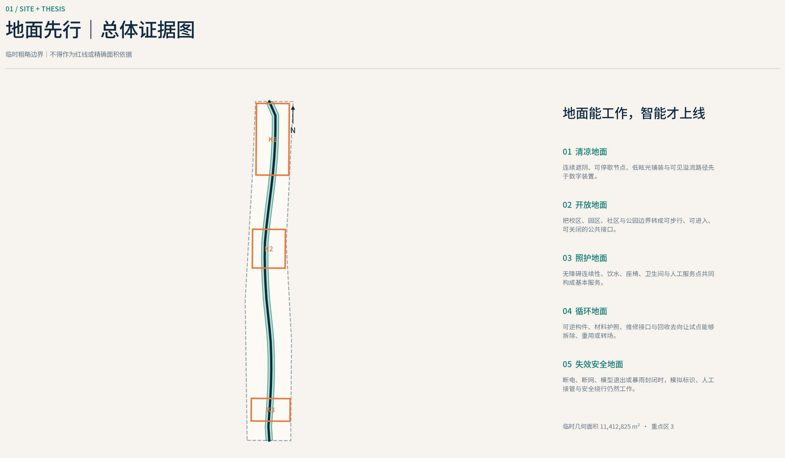
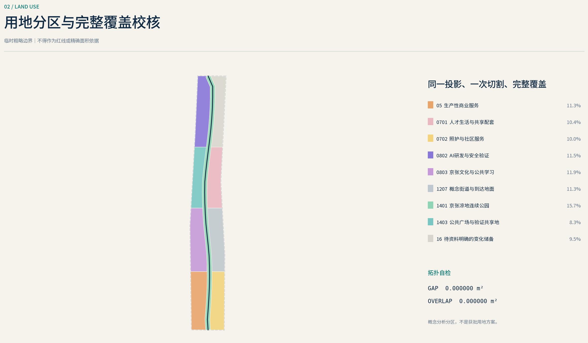
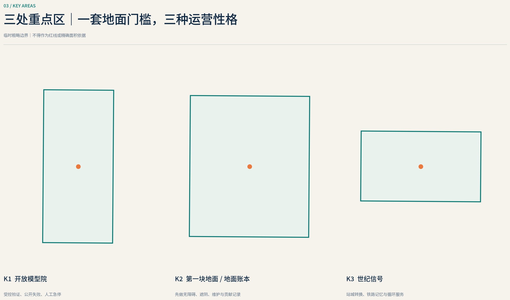
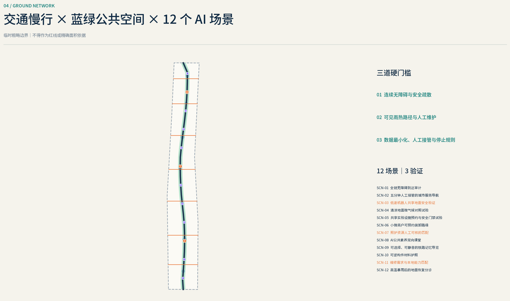
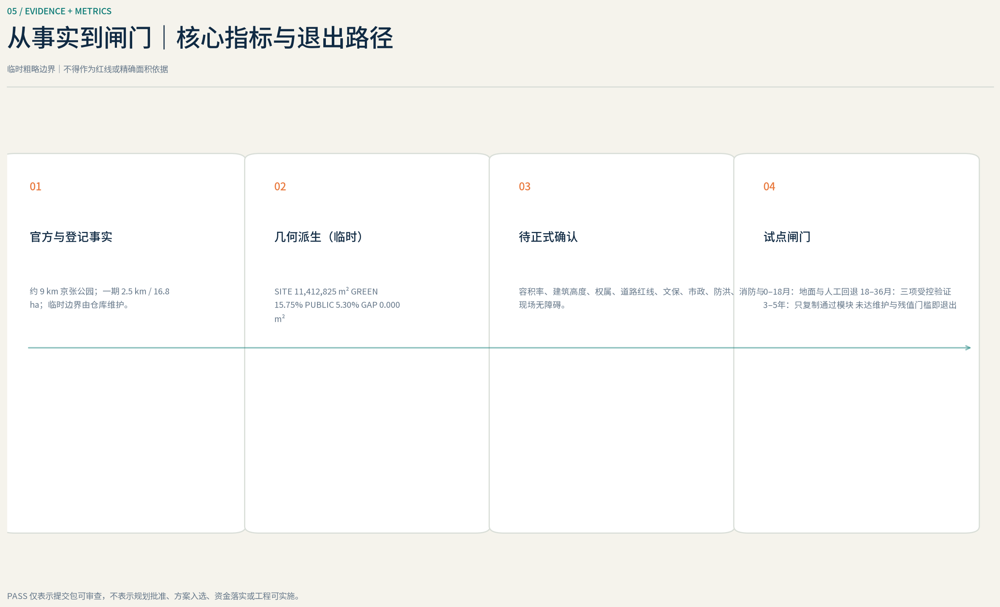

# 地面先行：百年京张韧性公共底盘

## 设计依据与资料清单

“地面先行 / GROUND FIRST”的核心判断是：AI 不是城市空间的起点，而是地面已经可达、可停留、可疏散、可排水、可维护之后才被允许开启的服务层。方案把无障碍连续性、遮阴与避雨、明示溢流路径、安全疏散、后勤分流、可逆安装和人工值守定义为“地面性能契约”；任何场景未通过相应契约，就保持离线、降级为人工服务或撤除。该逻辑回应征集任务对公共利益、AI 原生场景和人类最终判断的要求，但所有空间动作仍是概念建议，不能替代规划审批或工程论证。[source:AGENT-TASKBOOK] [standard:PROJECT-AGENT-OPEN-CALL-TASKBOOK] [depth:existing_conditions_diagnosis]

依据分四层使用：官方公告和本地专业标准决定任务、术语与合规边界；京张公园、海淀气候、水务和无障碍资料提供现状线索；国际案例只提供可转化机制；GeoJSON 和指标文件保存本方案自己的可复算证据。京张一期已经出现铁路遗存再利用、雨水花园和慢行空间等设计意图，后续方案也提出更多入口、支路缝合和骑行衔接，但公告、名录或建设方案不等于当前连续无障碍、排水能力和设施状态的现场审计。[source:LOCAL-JZ-PHASE1-2023] [source:LOCAL-JZ-SPONGE-2023] [source:LOCAL-JZ-PHASE2-2024]

当前 `SITE-001` 以及 `PROV-KEY-001`、`PROV-KEY-002`、`PROV-KEY-003` 均来自仓库的临时粗略 polygon，属性必须保持 `geometry_role="provisional_constraint"`、`official_boundary=false` 和 `boundary_precision="provisional_rough"`。它们只用于构思、入口自检、图件编排和非正式讨论，不是官方红线、地块权属、道路红线、审批依据或精确面积依据。[data:geometry/site_boundary.geojson#SITE-001] [source:BOUNDARY-SOURCE] [source:KEY-AREA-SOURCE]

取得官方 polygon 后，必须整体替换并重新裁切 `land_use`、`buildings`、`roads`、`green_space`、`public_space`、`constraints` 和 `phasing`，再重算全部指标、刷新五张图、两种语言的 HTML/PDF、三个专业矩阵和 manifest 哈希；不能只修改边界图层。正式深化还需补齐现状建筑、权属、控规、市政管线、消防、文保、树木、热环境和逐段无障碍审计。边界缺口不阻断概念内容评分，却阻止本方案声称精确控制或工程可行性。[depth:risk_missing_data] [standard:MOHURD-CONTROL-DETAILED-PLANNING] [metric:site_area_sqm]

## 三层范围工作框架

统筹研究范围用于判断创新生态如何共享土地、人才、资金、算力、数据和真实场景，不把研究范围误画成新的建设红线。方案以“三核两翼”为组织关系：众智园承担开放验证与治理能力，AI 原点社区承担近校转化与贡献记录，大钟寺承担城市型应用、商务和国际交往；中关村科技服务翼提供专业服务，小月河场景赋能翼提供公共环境和长期运营接口。其共同规则不是“先装设备”，而是先建立可步行、可识别、可维修的公共地面。[source:AGENT-TASKBOOK] [source:OFFICIAL-ANNOUNCEMENT] [depth:three_level_scope_framework]

总体设计范围以 `ROAD-001` 表达概念性的南北公共地面主脊，并把 `GREEN-001` 的蓝绿遮阴层、`PUBLIC-001` 的包容性公共与测试空间叠合在同一套共享边界上。三层不是三套互不相干的图：研究层决定要素循环，总体层把循环翻译成街道、首层、绿地和设施，重点区再以可运营的小场景检验它是否成立。[data:geometry/roads.geojson#ROAD-001] [data:geometry/green_space.geojson#GREEN-001] [data:geometry/public_space.geojson#PUBLIC-001]

重点区域范围由三个临时约束区承载详细设计假设。三个区之间不追求同质化形象，而共享一套“地面门槛”：连续无障碍路径、可见出入口、气候庇护、服务与行人分流、应急关闭方式、可逆构件和责任主体。任何正式边界调整都将触发三处小总图、场景节点和指标的同步重算。[data:geometry/key_areas.geojson#PROV-KEY-001] [data:geometry/key_areas.geojson#PROV-KEY-002] [data:geometry/key_areas.geojson#PROV-KEY-003]

图件展示的总体面积、重点区数量及比例必须由生成器写入 `11,412,825 m²`、`3`、`15.75%` 和 `5.30%`，并与 `metrics.json` 一致。占位符在正式渲染前不得留存；若 official polygon 仍缺失，数值旁必须保留“基于临时边界、不得用于正式面积判断”的提示。[metric:site_area_sqm] [metric:key_area_count] [depth:metrics_recalculation]

## 统筹研究范围产业与未来城市研究

品牌名称为“地面先行 / GROUND FIRST”，传播句为“AI works only after the ground works / 地面能工作，智能才上线”。Logo 方向是一条连续的水平基准线，线上设置三个可穿越的开口代表三处重点区，只有当基准线连续时才出现向上的信号笔画；它应在黑白、小尺寸、触觉标识和动态界面中保持可识别。色彩以地面深灰、树荫绿、雨水蓝和安全提示色为主，AI 信号色只作为通过门槛后的次级状态；最终字体、图标和色值须采用可公开复用或完成清权的资产。[source:AGENT-TASKBOOK] [standard:PROJECT-AGENT-OPEN-CALL-TASKBOOK]

产业生态采用“共同地面—共享设施—开放验证—专业服务—规模转化”的回路。科研、居住、文化、商业、公共服务和公园空间不是互相隔离的功能岛，而通过可进入的首层、预约制测试场、公共展示、人才日常服务和合规数据接口连接。算力和数据不被当作无条件基础设施：只有空间责任主体、授权目的、保留周期、人工复核和退出机制明确后，场景才能接入。[depth:overall_spatial_structure] [data:geometry/public_space.geojson#PUBLIC-001]

以下八个案例只作为背景对标，不支撑本地红线、容量或法定控制：

| 案例 | 可借鉴机制 | 海淀转化规则与不可照搬之处 |
| --- | --- | --- |
| 新加坡 Punggol Digital District | 公共开发主体、开放数字平台与已宣布的 physical-AI 试验条件共同组织园区 | 转化为供应商中立的数据接口和“测试护照”；新加坡的土地、采购和治理条件不能直接移植。[source:CASE-PUNGGOL] |
| 首尔 Yangjae AI Innovation District / Seoul AI Hub | 以公共创新枢纽连接孵化、企业服务和片区品牌 | 转化为步行网络中的共享实验、培训和企业服务；项目阶段和运营绩效需在使用前复核。[source:CASE-SEOUL] |
| Barcelona 22@ | 以基础设施计划、混合功能和渐进更新共同支撑产业转型 | 转化为“先补街道和公共地面，再谈强度”；其市场、治理和社会影响不能套用为海淀结论。[source:CASE-22B] |
| Paris-Saclay | 任务导向的公共开发机构与面向公众的校园首层 | 转化为跨机构地面协议和开放首层；法国开发制度及分散校园形态不构成本地模板。[source:CASE-PARIS-SACLAY] |
| Cambridge Kendall / Volpe PUD-7 | 将公共空间、交通、住房等公共利益与开发协商绑定 | 转化为可核验的公共利益包；美国地块协商制度不能替代北京法定规划程序。[source:CASE-KENDALL] |
| Tsukuba Super Science City | 一站式示范组织并把隐私影响评估纳入试验治理 | 转化为场景准入、影响评估和退出条件；日本监管沙盒不等于本地试点已获许可。[source:CASE-TSUKUBA] |
| London East Bank | 以公众可进入的研究、教育和文化锚点构造创新片区 | 转化为公共节目先于形象建筑；其奥运遗产、公共投资和机构组合不可复制。[source:CASE-EAST-BANK] |
| Brainport / High Tech Campus Eindhoven | 共享实验设施与政府—高校—企业协同治理 | 转化为共享验证设施和多方治理席位；封闭园区产权及企业结构不适合作为公共街区规则。[source:CASE-BRAINPORT] |

因此，“世界级”不由建筑高度或屏幕数量证明，而由贡献是否可进入、测试是否可追责、公共地面是否长期可用来证明。八个案例的机制必须在 `sources.json` 中登记发布者、URL、获取日期、许可与局限，并保持 `background_only`；其价值是提出可测试问题，不是提供本地规划答案。[source:SOURCE-REGISTRY] [depth:risk_missing_data]

## 总体设计范围城市更新与控规深度城市设计

总体空间结构由连续公共地面主脊、三处重点区公共客厅、蓝绿气候支撑层和若干站点—社区阈值构成。`ROAD-001` 是概念性关系线，不是道路红线或工程线位；它优先连接已经存在或已提出的公园入口、支路、轨道站点、社区和产业节点，再通过逐段审计决定哪里需要平坡、遮阴、过街、照明、座椅、排水或服务口调整。早期京张规划曾记录铁路、轨道和街区之间的竖向关系及阻隔问题，后续建设方案提出支路重开和慢行联系，但这些资料不能代替当前测绘与现场测试。[source:LOCAL-JZ-PLAN-2021] [source:LOCAL-JZ-PHASE2-2024] [data:geometry/roads.geojson#ROAD-001]

用地结构以现有城市肌理的保留和兼容更新为前提，采用国土空间分类语义表达居住、社区服务、科研、文化、商业、道路、绿地、广场和留白，不把概念分区表述为已批准的用地调整。公共服务和研发可在允许条件下通过共享首层、院落和可逆设施增强；新增开发强度、建筑高度、道路退线和停车指标全部保持待正式控规确认。[standard:MNR-LAND-USE-CLASSIFICATION-GUIDE] [data:geometry/land_use.geojson#LU-0802] [depth:development_intensity_controls]

建筑更新遵循“先保留使用价值，再修复首层，最后讨论替换”。`BLDG-001` 只表达待专业团队核查的适应性更新与测试支撑包络，不是具体建筑拆改留结论。首层设计优先解决无台阶入口、雨棚与遮阴、清晰门厅、公共卫生间、装卸分流、可拆服务带和夜间安全；结构、消防、产权、文保或运营资料缺失时，不分配拆除标签。[data:geometry/buildings.geojson#BLDG-001] [depth:retain_renovate_demolish] [depth:height_massing_character]

控规深度通过“已知—设计建议—待确认”三栏表达。生成器把空间结果写入 `11,412,825 m²`、`12,768 m²`、`15.75%` 和 `5.30%`；`待正式数据补齐 / pending official data` 若缺少官方总建筑规模和控规条件，应显示“待正式数据补齐”，不得用概念体量反推。方案的专业价值在于建立可复核的地面、建筑、交通和运营接口，而不是制造伪精确指标。[metric:building_footprint_area_sqm] [metric:floor_area_ratio] [standard:MOHURD-CONTROL-DETAILED-PLANNING]

## 重点区域详细设计

### 众智园 AI 自主创新加速区

`PROV-KEY-001` 内的参考小总图以“开放模型院 / Open Model Yard”作为核心：沿可核实的公共入口组织连续无障碍环线，在安全且不影响防洪的高地布置遮阴会合点、可逆电力与数据接口、公开测试看台和后勤服务口；滨水或低洼地面只承担可关闭、可恢复的景观与测试功能。`LM-02` 记录通过公开评测的模型、数据集和场景方法，失败记录同样可见。`SCN-03` 与 `SCN-11` 只有在通行、热环境、溢流、疏散和人工监护通过后才开放。[data:geometry/key_areas.geojson#PROV-KEY-001] [data:geometry/public_space.geojson#LM-02] [depth:three_key_area_detailed_design]

众智园的建筑策略是先识别可共享的首层、装卸院和存量实验空间，再讨论新建需求；行人与实验后勤不得在同一无控制界面交叉。正式深化前须核实清河相关蓝线、防洪与水务运行条件、树木、产权、消防和道路组织，因此本小总图不能作为滨水工程或建筑实施结论。[source:LOCAL-WATER-PROJECTS-2025] [source:LOCAL-WATER-OPS-2026]

### 北京 AI 原点社区

`PROV-KEY-002` 的参考小总图围绕“地面账本 / Ground Ledger”组织校区—社区—公园之间的贡献路径。可进入的首层和院落提供开源协作、成果发布、人才服务、社区议事与小型展览；沿途设置无障碍休息、夜间照明、饮水、卫生间和明确的公共/半公共边界。`LM-01` 不做名人纪念墙，而以可追溯的版本、维护者、居民反馈和公共价值记录贡献；`SCN-01`、`SCN-06`、`SCN-08` 服务日常出行、转化协作与贡献治理。[data:geometry/key_areas.geojson#PROV-KEY-002] [data:geometry/public_space.geojson#LM-01] [source:AGENT-TASKBOOK]

这里的“近校”不等于使用校园内部数据或打开受控边界。正式深化需确认校园与地块出入口、产权、历史建筑、消防和生活服务承载；住宅、科研、商业与公共服务的比例保持概念性，不能解释为已决定的混合开发方案。[standard:MOHURD-URBAN-DESIGN-MEASURES] [depth:land_use_layout]

### 大钟寺 AI 产业聚集区

`PROV-KEY-003` 的参考小总图把轨道站点、商业首层、企业入口和京张公共地面之间的转换做成“世纪信号 / Century Signal”。`LM-03` 以可逆构件解释铁路信号、城市创新和人工智能的“先校准、后通行”共同逻辑；周边设置全天候公共客厅、清晰过街等待区、骑行停放和与人流隔离的服务庭院。`SCN-07` 的具身智能物流测试只在封闭或受控服务空间运行，`SCN-09` 与 `SCN-10` 面向公共服务和活动运营。[data:geometry/key_areas.geojson#PROV-KEY-003] [data:geometry/public_space.geojson#LM-03] [source:LOCAL-JZ-PHASE2-2024]

“四象限连通”仅是待交通专业论证的概念目标，不预设桥隧、地下通道或路口改造方式。轨道设施、道路红线、地下管线、商业产权、消防疏散和客流数据未核实前，不声称连续站城一体化已经形成。[depth:traffic_rail_slow_parking] [standard:MOHURD-CONTROL-DETAILED-PLANNING]

## AI 创新生态、人才画像与 AI+ 场景

AI 场景采用同一准入链：先完成物理地面审计，再完成数据和隐私影响评估，然后限定空间、时段、责任人和停止条件，最后才接入模型。每张卡必须能回答“谁受益、地面先补什么、AI 增加什么、谁人工复核、何时关闭”。场景数量由 `12` 写入，验证类场景数量由 `3` 写入；二者从 `SCN-01` 至 `SCN-12` 的结构化节点统计。[source:AGENT-TASKBOOK] [standard:PROJECT-AGENT-OPEN-CALL-TASKBOOK] [metric:public_space_ratio]

### 用户画像与映射

| 用户画像 | 首要需求 | 对应空间与场景 | 运营边界 |
| --- | --- | --- | --- |
| 轮椅使用者、推车者及照护者 | 连续坡度、可停留点、可靠电梯与过街 | 公园—站点路径；SCN-01、SCN-03 | 数字导航不能把物理障碍包装成“可达” |
| 老年人、儿童与周边家庭 | 遮阴、饮水、卫生间、低速安全和清晰导视 | 社区节点；SCN-02、SCN-04、SCN-09 | 不进行面部识别或未授权行为画像 |
| 骑行与轨道通勤者 | 连续路径、停放、换乘和天气庇护 | ROAD-001 与站点阈值；SCN-01、SCN-10 | 推荐不替代交通管理和现场标识 |
| 研究者、开发者与初创团队 | 低门槛协作、测试设施、发布和专业服务 | Open Model Yard；SCN-03、SCN-06、SCN-11 | 测试需预约、隔离、日志和人工监督 |
| 商户、物业与楼宇运营者 | 客流可达、装卸、维护和能耗反馈 | 活跃首层与服务庭；SCN-07、SCN-12 | 不以单一平台锁定商户或设备 |
| 公园、水务与应急人员 | 可关闭空间、巡检、溢流、疏散和恢复 | 蓝绿地面；SCN-04、SCN-10、SCN-11 | 预测只作辅助，现场指挥保留最终权力 |
| 国际访客、学生与活动参与者 | 多语言、背景理解、可进入的公共体验 | 三处地标；SCN-05、SCN-08、SCN-09 | 内容标注来源，提供无设备替代方式 |

### 场景卡 SCN-01—SCN-06

| ID 与名称 | 地面前置条件 | AI 服务、人工复核与停止条件 |
| --- | --- | --- |
| SCN-01 连续可达路径助手 | 逐段轮行/步行审计、坡道、电梯、过街和休息点真实可用 | 只解释经现场确认的路线；设施失效即撤回推荐，由运营人员更新状态。[data:geometry/public_space.geojson#SCN-01] |
| SCN-02 热安全与庇护导航 | 真实树荫、雨棚、饮水、座椅和开放时段 | 结合现场传感与人工巡查提示较舒适路线；极端天气服从官方预警和封闭指令。[data:geometry/public_space.geojson#SCN-02] |
| **SCN-03 无障碍感知与低速交通验证场** | 受控场地、实体标线、缓冲区、辅助人员和可进入退出路径 | 测试感知、提示与过街辅助；不在开放道路自动决策，出现漏检或冲突即停测。[data:geometry/public_space.geojson#SCN-03] |
| SCN-04 雨水花园维护分诊 | 明示汇水、溢流和关闭路径，养护责任人可到场 | 识别堵塞或积水线索并生成工单；不得把模型预测写成防洪保证。[data:geometry/public_space.geojson#SCN-04] |
| SCN-05 京张遗产解释器 | 经核实的遗产点位、无障碍停留面和离线文字标识 | 提供多语言、可追源内容；争议事实交由策展与文保人员复核，设备关闭后叙事仍完整。[data:geometry/public_space.geojson#SCN-05] |
| SCN-06 人才与企业公共服务协作台 | 可进入柜台、安静洽谈位、公开服务目录和无障碍预约 | 汇总公开政策与服务入口，复杂事项转人工；不承诺资金、审批或招商结果。[data:geometry/public_space.geojson#SCN-06] |

### 场景卡 SCN-07—SCN-12

| ID 与名称 | 地面前置条件 | AI 服务、人工复核与停止条件 |
| --- | --- | --- |
| **SCN-07 具身智能“最后一段”物流验证庭** | 与行人分离的封闭服务庭、装卸位、消防净空和物理急停 | 测试低速搬运、交接和异常恢复；越界、失联或人工接管失败即停止。[data:geometry/public_space.geojson#SCN-07] |
| SCN-08 Ground Ledger 贡献账本 | 可进入的实体展示、公开贡献规则、申诉和版本记录 | 生成贡献摘要并连接开源记录；署名须获同意，争议由人类委员会裁定。[data:geometry/public_space.geojson#SCN-08] |
| SCN-09 多语言公共服务节点 | 清晰排队、隐私距离、人工窗口和纸质/触觉替代 | 辅助翻译和事项分流；敏感事务不留会话，低置信度直接转人工。[data:geometry/public_space.geojson#SCN-09] |
| SCN-10 活动容量与疏散助手 | 核定出口、可见集合点、人工计数与关闭预案 | 使用聚合数据辅助分流；不做人脸追踪，现场负责人可一键降级为静态疏散方案。[data:geometry/public_space.geojson#SCN-10] |
| **SCN-11 微气候、遮阴与雨水模型基准场** | 校准传感器、实测样点、公开误差范围和安全巡检 | 对热舒适、遮阴与积水模型做对照测试；数据漂移、缺测或极端事件时停止自动建议。[data:geometry/public_space.geojson#SCN-11] |
| SCN-12 可逆构件材料护照 | 构件编号、可拆节点、维护手册和回收责任方 | 预测维护与残值并提示复用机会；结构安全判断仍由持证专业人员完成。[data:geometry/public_space.geojson#SCN-12] |

所有场景默认数据最小化、边缘处理优先、短期留存、用途限定、可解释输出、人工复核和无设备替代。禁止将人脸识别、个体轨迹商业化、不可申诉评分或指定供应商锁定作为必要条件；任何场景都必须公开数据卡、模型卡、责任主体、投诉入口、事件日志和关闭记录。[source:CASE-TSUKUBA] [depth:risk_missing_data]

## 用地、建筑规模与拆改留方案

用地 GeoJSON 是基于临时边界的完整分析分区，不是法定用地调整。`LU-0701` 表达居住，`LU-0702` 表达社区服务，`LU-0802` 表达科研，`LU-0803` 表达文化，`LU-05` 表达商业服务，`LU-1207` 表达道路，`LU-1401` 表达公园绿地，`LU-1403` 表达广场，`LU-16` 表达待正式资料明确的留白。所有 MultiPolygon 共享切割边、无重叠并覆盖 `SITE-001`；正式控规和地籍资料到位后必须重新分类。[standard:MNR-LAND-USE-CLASSIFICATION-GUIDE] [data:geometry/land_use.geojson#LU-0701] [depth:land_use_layout]

功能混合发生在可验证的空间接口，而不是通过任意改变用地代码：居住区补社区服务和可达公园入口，科研区开放预约制测试与发布空间，文化和商业首层承担公共叙事与日常服务，道路、绿地和广场共同构成连续地面。各代码面积由 `1,185,274 m²` 等生成器占位符替换，合计必须等于 `11,412,825 m²`；临时边界状态必须与数值同时显示。[metric:site_area_sqm] [depth:metrics_recalculation]

建筑采用四级调查而不做先验拆除：A 类为安全且有持续使用价值的保留建筑；B 类为首层、能耗、无障碍或消防条件有改造机会的建筑；C 类为可逆临时设施和测试支撑；D 类仅表示需要结构、产权、文保和实施比较后再判断的对象。没有逐栋调查时，D 类不得被翻译成“拆除”。`BLDG-001` 因而是概念性更新包络，建筑基底 `12,768 m²` 可由几何复算，建筑总量、密度和容积率若无官方依据则保持待补。[data:geometry/buildings.geojson#BLDG-001] [depth:retain_renovate_demolish] [metric:building_footprint_area_sqm]

首层设计采用统一“地面接口”：无台阶主入口、可见门厅、可坐边缘、遮阴避雨、与行人分离的装卸、可拆电力/数据带、夜间关闭方式和维修可达性。新建体量的高度、退台、日照、消防、停车和结构必须由专业团队在官方条件下深化；本方案仅建议通过较小进深的公共首层、院落和通廊降低大地块对城市地面的阻隔。[standard:MOHURD-URBAN-DESIGN-MEASURES] [depth:height_massing_character]

## 交通、轨道、市政与公共服务设施

交通优先级为步行与轮行、骑行、轨道和公交接驳、应急与后勤，最后才是一般机动车便利。`ROAD-001` 连接公园、重点区和站点阈值，但每一段必须用轮椅、推车、自行车和夜间步行实测；站点网页或公园名录中出现无障碍设施，不等于站台—出口—过街—公园之间已经连续符合标准。[data:geometry/roads.geojson#ROAD-001] [source:LOCAL-ACCESSIBILITY-GB55019] [depth:traffic_rail_slow_parking]

轨道阈值的参考动作包括：把坡道、电梯、盲道、过街、骑行停放和候车庇护画在同一张连续性图上；消除入口前的装卸冲突；为设施故障提供可理解的替代路线；在大钟寺等复杂节点先做地面交通组织和人工引导试验，再讨论桥隧或地下空间。后续京张方案提出入口、支路和骑行联系，只能作为设计线索，不能作为已建成证明。[source:LOCAL-JZ-PHASE2-2024] [standard:MOHURD-CONTROL-DETAILED-PLANNING]

市政采用“可维护地面带”：排水沟、雨水花园、溢流口、照明、电力、通信、端侧计算、饮水、卫生间和紧急呼叫分别标识权属、检修面和关闭方式。AI 设备不进入消防净空、盲道、树根保护或主要泄水路径；低压电和数据接口采用可拆、可断电、可审计的模块。一次汛期运行记录说明闸门、降水位、清障和限制进入需要人工操作，它不能证明任何具体地块免于水患。[source:LOCAL-WATER-OPS-2026] [depth:municipal_new_infrastructure]

公共服务节点先提供不依赖手机的座椅、饮水、卫生间、母婴和照护空间、地图、人工咨询及紧急集合信息，再叠加 SCN-01、SCN-02、SCN-09 和 SCN-10。公园名录中的全天开放、免费或无障碍元数据只作为运营线索；未列公共停车或应急避难功能同样需要现场核查，不能被算法补写。[source:LOCAL-PARK-DIRECTORY-2025] [data:geometry/public_space.geojson#PUBLIC-001]

生成器应填入 `11.27%`、`待逐段现场审计 / pending segment audit` 和相关审计状态。若连续无障碍路线没有通过实测，指标必须显示缺口，相应导航或自动交通场景不得标记为可运营。[metric:public_space_ratio] [depth:metrics_recalculation]

## 蓝绿空间、公共空间与城市风貌

蓝绿策略不是用“海绵”标签宣布达标，而是把降雨过程画清楚：雨落在哪里、如何滞蓄、从哪里安全溢流、何时关闭、谁清障、如何恢复。京张一期资料记录轨道铺装向沟渠、雨水花园、生物滞留和储水设施排水，并提出土方再利用；这些是可借鉴的设计意图，不是零径流或长期性能实测。[source:LOCAL-JZ-SPONGE-2023] [data:geometry/green_space.geojson#GREEN-001] [depth:blue_green_public_space]

北京气候适应资料提示极端热、强降水和内涝风险增加，海淀海绵行动目标也只是区级目标，不能被转换为本地地块成绩。方案因此把连续树荫、可关闭低洼空间、较高安全停留面、明确溢流路径、耐淹材料和汛后快速维修纳入同一个地面门槛；`15.75%`、`待季节性实测 / pending seasonal field measurement` 和 `5.30%` 必须由几何或现场审计生成并注明置信度。[source:LOCAL-CLIMATE-PLAN-2024] [source:LOCAL-SPONGE-ACTION-2025] [metric:green_ratio]

城市风貌由三条叙事叠合：京张铁路的工程理性与时间深度，中关村的开放试验和知识贡献，AI 新文化的可解释、可纠错与公共责任。遗产构件只在文保确认后原位保护或再利用；新增设施采用低反射、可拆卸、尺度友好的地面构件，不用巨型屏幕、仿历史构件或企业商标覆盖铁路遗存。[source:LOCAL-JZ-PHASE1-2023] [standard:MOHURD-URBAN-DESIGN-MEASURES]

三处朝圣与贡献地标共同组成一条公共学习路线：

| 地标 | 位置与体验 | 贡献规则 |
| --- | --- | --- |
| LM-01 Ground Ledger / 地面账本 | AI 原点社区的可进入贡献廊，实体版本记录与数字索引并置 | 记录代码、研究、维护和居民反馈；允许更正、撤回和争议说明。[data:geometry/public_space.geojson#LM-01] |
| LM-02 Open Model Yard / 开放模型院 | 众智园的受控公共测试与评议庭院 | 展示测试条件、失败、人工接管和改进，不做单向产品发布。[data:geometry/public_space.geojson#LM-02] |
| LM-03 Century Signal / 世纪信号 | 大钟寺与京张公共地面交汇的可逆信号装置 | 用“校准—放行—停车”解释铁路和 AI 的共同责任，内容须经历史与版权复核。[data:geometry/public_space.geojson#LM-03] |

公共空间组件库包括可坐边缘、带扶手座椅、遮阴架、饮水点、触觉与高对比导视、雨水明沟、可替换铺装、可逆设备底座、人工服务柜台和材料护照。构件的价值由维护便利、无障碍、气候表现和回收残值衡量，而不是传感器数量。[metric:public_space_ratio] [depth:blue_green_public_space]

## 更新项目清单、实施政策与分期计划

更新项目以“先修地面、再开放场景、最后扩大网络”为顺序，所有项目均为参考方案：

| 项目 | 核心交付与前置依赖 | 分期证据 |
| --- | --- | --- |
| GF-R01 公共地面逐段审计与修补 | 无障碍、遮阴、排水、照明、疏散、产权和维护基线；先现场审计再设计 | PHASE-001。[data:geometry/phasing.geojson#PHASE-001] |
| GF-R02 京张蓝绿与遮阴补丁 | 可逆树池、雨水节点、庇护与明确溢流；依赖树木、水务和地下管线复核 | PHASE-001。[data:geometry/green_space.geojson#GREEN-001] |
| GF-R03 Open Model Yard | 受控测试庭、人工观察台、急停与公开测试规则；依赖消防和运营主体 | PHASE-002。[data:geometry/public_space.geojson#LM-02] |
| GF-R04 Ground Ledger | 实体贡献廊、开源索引、申诉与版本治理；依赖版权、隐私和社区共治 | PHASE-002。[data:geometry/public_space.geojson#LM-01] |
| GF-R05 Century Signal | 可逆遗产解释装置与公共停留面；依赖文保、交通和视线审查 | PHASE-002。[data:geometry/public_space.geojson#LM-03] |
| GF-R06 站点—公园连续阈值 | 实测无障碍、过街、骑行停放和雨天路线；工程方式待专业论证 | PHASE-002。[data:geometry/roads.geojson#ROAD-001] |
| GF-R07 共享首层与服务庭更新 | 优先适应性再利用、后勤分流和可拆基础设施；依赖逐栋调查 | PHASE-002。[data:geometry/buildings.geojson#BLDG-001] |
| GF-R08 一带学习与运营系统 | 场景护照、维护日志、年度复核和退出机制；只扩展通过评估的组件 | PHASE-003。[data:geometry/phasing.geojson#PHASE-003] |

PHASE-001 在 `0–18 个月 / months` 内完成基线、轻量修补和可逆样件；PHASE-002 在 `18–36 个月 / months` 内把三处重点区与站点阈值连成可运营网络；PHASE-003 在 `第 3–5 年 / years 3–5` 内依据公开绩效决定扩展、重做或退出。时间占位符只表示建议窗口，不构成政府工期或资金承诺。[data:geometry/phasing.geojson#PHASE-001] [data:geometry/phasing.geojson#PHASE-002] [depth:phasing_implementation]

实施政策建议包括“Ground Permit”地面准入单、“Test Passport”测试护照、可逆设施采购、公共首层使用协议、数据最小化条款和年度贡献审查。采购按可达性、热舒适、维护时长、人工接管和残值回收等结果付费，而不是按设备数量；开发利益协商可参考国际案例的方法，但须回到本地法定程序。[source:CASE-KENDALL] [source:CASE-TSUKUBA] [depth:renewal_project_list]

长期运营以概念活动“Ground Truth Week”、开发者地面学校、Open Model Yard 公开评议、Century Signal 公共路线和季节性雨热演练组成。每项活动都需明确主办、场地许可、保险、安全、无障碍、版权、数据规则和转化路径；没有责任主体或稳定维护预算时，不把活动写成已确定安排。[source:AGENT-TASKBOOK] [standard:PROJECT-AGENT-OPEN-CALL-TASKBOOK]

## 指标体系、面积复算与合规矩阵

所有值由生成器从同一版 GeoJSON、现场审计或正式来源写入；正文只保留替换标记，不手填伪精确数字：

| 指标与占位符 | 公式或判定 | 当前证据边界 |
| --- | --- | --- |
| `site_area_sqm` / `11,412,825 m²` | EPSG:4548 下 `SITE-001` 面积 | 临时边界值，不是官方精确面积。[metric:site_area_sqm] |
| `green_space_area_sqm` / `1,797,149 m²` | `GREEN_SPACE` polygon 面积之和 | 概念设计层，official polygon 后重算。 |
| `green_ratio` / `15.75%` | `green_space_area_sqm / site_area_sqm` | 必须与 visual 的 `data-metric` 一致。[metric:green_ratio] |
| `public_space_area_sqm` / `604,959 m²` | `PUBLIC_SPACE` polygon 面积之和 | 公共可进入性仍需运营与产权确认。 |
| `public_space_ratio` / `5.30%` | `public_space_area_sqm / site_area_sqm` | 必须与 visual 同值。[metric:public_space_ratio] |
| `building_footprint_area_sqm` / `12,768 m²` | 建筑基底 polygon 面积之和 | 概念包络，不代表确权建筑。 |
| `floor_area_ratio` / `待正式数据补齐 / pending official data` | `total_floor_area_sqm / site_area_sqm` | 无官方建筑总量时显示待补。[metric:floor_area_ratio] |
| `key_area_count` / `3` | `KEY_AREA` feature 数量 | 三个 feature 均为临时约束。[metric:key_area_count] |
| `accessible_public_ground_ratio` / `待逐段现场审计 / pending segment audit` | 通过逐段审计的公共路线长度 / 审计总长度 | 不能只由地图推算。 |
| `reversible_intervention_ratio` / `试点构件清单后填报 / pending pilot component schedule` | 可无重大基底破坏拆除的新增构件 / 新增构件 | 由构件清单与节点复核。 |
| `shade_or_shelter_coverage_ratio` / `待季节性实测 / pending seasonal field measurement` | 设计时段内有效遮阴或庇护路径 / 审计路径 | 需季节与时段说明。 |
| `residual_value_recovery_ratio` / `试点校准后填报 / pending calibrated pilot evidence` | 有明确回收去向的构件残值 / 构件投入 | 属运营估算，不是投资承诺。 |
| `validation_scenario_count` / `3` | 标记为验证且具有护照、急停和人工责任人的场景数 | SCN-03、SCN-07、SCN-11 满足结构要求。 |

“AI works only after the ground works”被转译为可执行闸门：无连续无障碍证据，SCN-01 与 SCN-03 不上线；无热环境与庇护证据，SCN-02 降级；无溢流和关闭方案，低洼场景停止；无隐私影响评估和人工申诉，数据服务不采集个人数据；无维护和回收责任，新增设备不采购。[depth:metrics_recalculation] [depth:risk_missing_data]

任务覆盖矩阵应逐条连接公告 1.3—1.5、agent.1—agent.6、上述章节、图层、指标、图纸、HTML、来源、假设和自检。专业标准矩阵区分法定依据与项目建议，设计深度矩阵须覆盖现状、三层范围、用地、体量、拆改留、交通、市政、蓝绿、三处重点区、项目、分期、指标和风险。PASS 仅表示包可审查，不表示规划批准或方案优胜。[standard:PROJECT-OFFICIAL-ANNOUNCEMENT] [standard:MOHURD-URBAN-DESIGN-MEASURES] [depth:overall_spatial_structure]

## 风险、版权与合规说明

第一风险是空间精度：`SITE-001` 和三处重点区均为临时粗略边界，所有面积、覆盖率、功能分区、项目落点和分期只用于生成与讨论。官方 polygon 到位后必须整包重算；若新边界导致场景位于范围外、用地出现缝隙或项目与约束冲突，应删除或重做，而不是平移以保持旧图。[data:geometry/site_boundary.geojson#SITE-001] [depth:risk_missing_data]

第二风险是把计划、名录或一次运营记录写成现状事实。京张后续入口和支路属于方案信息，水务记录只说明一次警戒运行，区级海绵目标不证明项目地块达标，国际案例也不证明相同机制在海淀有效。它们只能形成待现场验证的假设。[source:LOCAL-JZ-PHASE2-2024] [source:LOCAL-WATER-OPS-2026] [source:LOCAL-SPONGE-ACTION-2025]

第三风险来自法定与工程缺口。容积率、建筑高度、建筑密度、道路红线、桥隧、地下空间、市政容量、防洪、消防、文保、权属、投资和工期均未由本方案确认；任何图示都不得解释为批准方案。建筑拆改、站城连接和滨水动作必须由相应专业团队在清权资料和现场调查基础上深化。[standard:MOHURD-CONTROL-DETAILED-PLANNING] [depth:development_intensity_controls] [depth:municipal_new_infrastructure]

AI 风险包括隐私侵害、偏差、误导性导航、网络攻击、设备失效、供应商锁定和责任漂移。缓解方式是无设备替代、数据最小化、边缘处理、短期留存、红队测试、公开误差、人工接管、事件通报和可验证删除；高风险或低置信度输出不得自动控制交通、水务、消防或公共安全。[source:CASE-TSUKUBA] [standard:PROJECT-AGENT-OPEN-CALL-TASKBOOK]

气候与运营风险通过可见溢流、可关闭低洼空间、耐淹可拆材料、遮阴冗余、备件、人工巡检和汛后维修计划处理。无稳定运营主体、维护预算、保险或应急权限的场景必须保持试验状态或退出。[source:LOCAL-CLIMATE-PLAN-2024] [depth:phasing_implementation]

版权方面，只使用公开或清权的文字、数据、字体、图标和图像；国际案例不得复制受保护图纸，Logo 不得混用企业商标，贡献地标的署名须取得同意并支持更正或撤回。所有生成图注明生成方法、输入数据、日期和许可，HTML 不加载远程字体、脚本、瓦片、iframe、表单或跟踪代码。[source:SOURCE-REGISTRY] [source:AGENT-TASKBOOK]

## 参考资料

本节是人类阅读入口；完整发布者、标题、URL、日期、获取方式、许可、转换和局限应保存在 `sources.json`，不能以本节替代结构化登记。[source:SOURCE-REGISTRY]

- 项目与规则：`OFFICIAL-ANNOUNCEMENT`、`AGENT-TASKBOOK`、`SITE-PACKAGE`、`SOURCE-REGISTRY`、`PROCESSED-FACT-PACK`。其中公告用于任务和文字范围，任务书用于 AI 共创要求，处理资料仅为阅读导航。[source:OFFICIAL-ANNOUNCEMENT] [source:AGENT-TASKBOOK]
- 空间边界：`BOUNDARY-SOURCE`、`KEY-AREA-SOURCE`。二者均为 provisional-only，只可用于临时生成、可视化、自检和讨论。[source:BOUNDARY-SOURCE] [source:KEY-AREA-SOURCE]
- 专业标准：城市设计管理、控规编制审批、国土空间用地分类和无障碍通用规范；它们提供方法与术语，不提供项目专属控制值。[standard:MOHURD-URBAN-DESIGN-MEASURES] [standard:MOHURD-CONTROL-DETAILED-PLANNING] [standard:MNR-LAND-USE-CLASSIFICATION-GUIDE]
- 京张与公园资料：`LOCAL-JZ-PLAN-2021`、`LOCAL-JZ-PHASE1-2023`、`LOCAL-JZ-SPONGE-2023`、`LOCAL-JZ-PHASE2-2024`、`LOCAL-PARK-DIRECTORY-2025`。规划和方案内容须与当前现场状态区分。[source:LOCAL-JZ-PLAN-2021] [source:LOCAL-JZ-PHASE1-2023]
- 水与气候资料：`LOCAL-WATER-PROJECTS-2025`、`LOCAL-WATER-OPS-2026`、`LOCAL-CLIMATE-PLAN-2024`、`LOCAL-SPONGE-ACTION-2025`。批准范围、一次运行事件和区级目标均不能升级为地块实测结果。[source:LOCAL-WATER-OPS-2026] [source:LOCAL-CLIMATE-PLAN-2024]
- 无障碍：`LOCAL-ACCESSIBILITY-GB55019` 提供强制性通用要求；连续的公园—街道—站台合规仍需逐段专业核查。[source:LOCAL-ACCESSIBILITY-GB55019]
- 八个背景案例：`CASE-PUNGGOL`、`CASE-SEOUL`、`CASE-22B`、`CASE-PARIS-SACLAY`、`CASE-KENDALL`、`CASE-TSUKUBA`、`CASE-EAST-BANK`、`CASE-BRAINPORT`。全部保持 background-only，不支撑本地法定或工程结论。[source:CASE-PUNGGOL] [source:CASE-BRAINPORT]
- 本方案证据：`geometry/*.geojson`、`metrics.json`、`assumptions.json`、任务覆盖矩阵、专业标准矩阵、设计深度矩阵、自检、五张派生图和双语 PDF/HTML。结构化数据是复算层，图件是解释层。[depth:metrics_recalculation] [depth:risk_missing_data]
