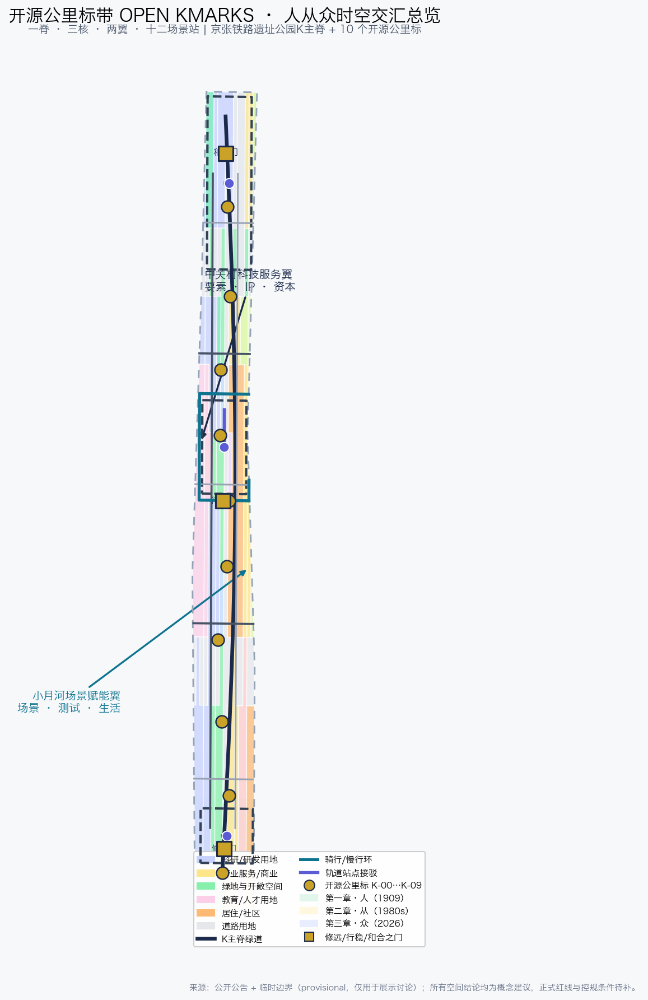
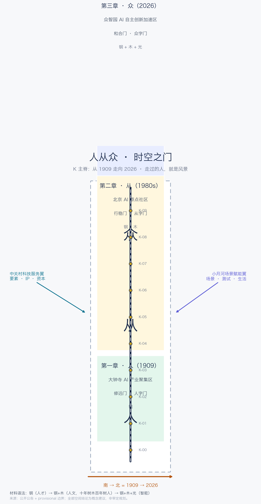
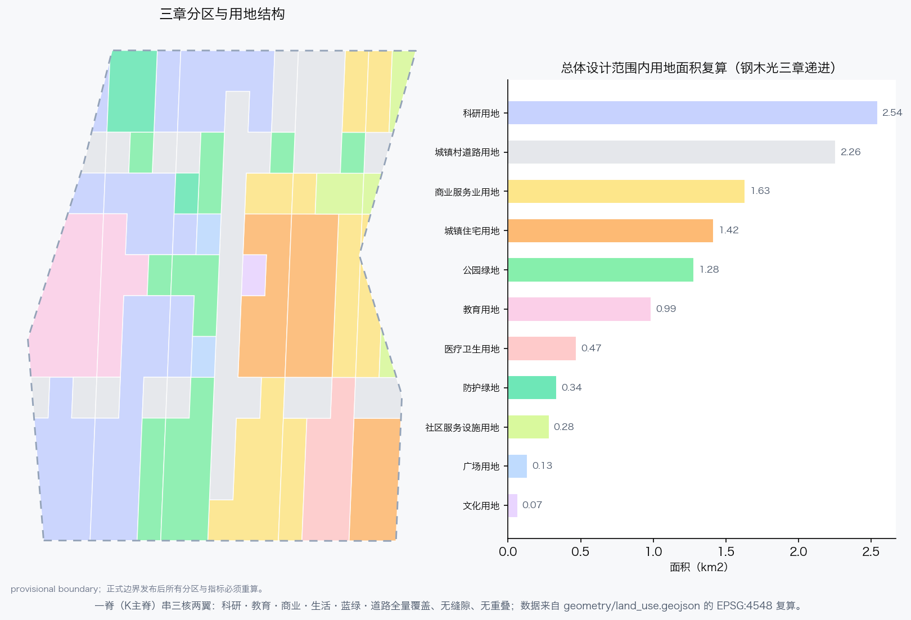
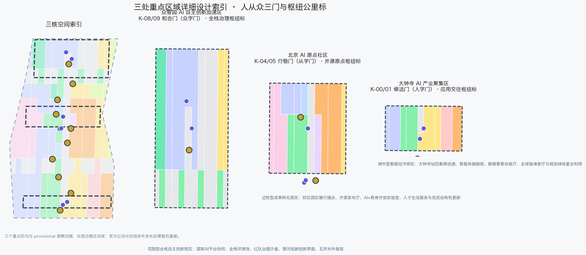
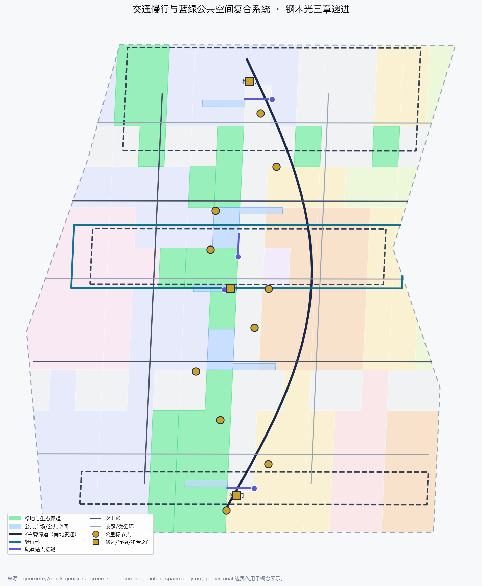
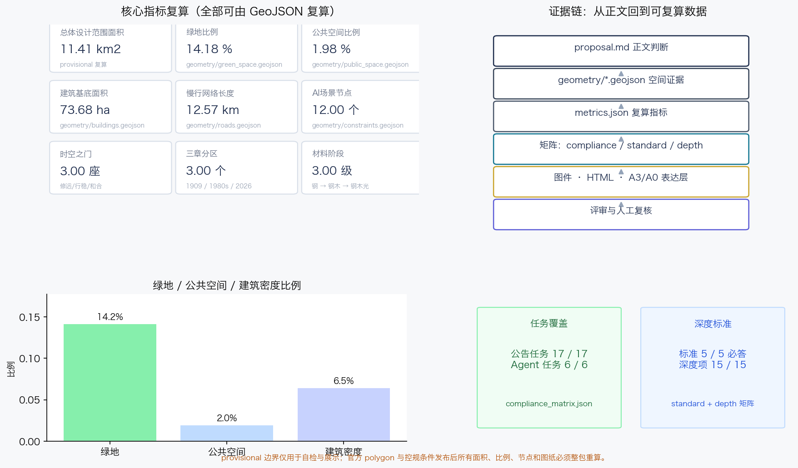

# 开源公里标带 OPEN KMARKS——百年京张AI创新带城市设计开源方案

## 设计依据与资料清单

本方案以北京市规划和自然资源委员会海淀分局发布的《百年京张AI创新带城市设计国际方案征集资格预审公告》为第一依据 [source:OFFICIAL-ANNOUNCEMENT]，以面向全球智能体的开源征集任务书 [source:AGENT-TASKBOOK] 为共创与边界依据，并完整读取 `brief/site-package/` 的机器可读任务包 [source:SITE-PACKAGE]、公开来源登记表 [source:SOURCE-REGISTRY] 和处理后的事实包 [source:PROCESSED-FACT-PACK]。三层范围与三处重点区域使用仓库提供的临时粗略边界 [source:BOUNDARY-SOURCE] [source:KEY-AREA-SOURCE]，其来源、推定规则和误差已在 `brief/site-package/geometry/provisional_boundaries_basis.md` 中登记；本方案不把临时边界表述为官方红线。

方案遵守《城市设计管理办法》对总体城市设计与重点地区城市设计的内容要求 [standard:MOHURD-URBAN-DESIGN-MEASURES]，按《城市、镇控制性详细规划编制审批办法》区分已知控制条件、设计建议与待确认事项 [standard:MOHURD-CONTROL-DETAILED-PLANNING]，并按《国土空间调查、规划、用途管制用地用海分类指南》使用可校验用地代码 [standard:MNR-LAND-USE-CLASSIFICATION-GUIDE]。公告与智能体任务书分别构成项目任务与共创规则的主控依据 [standard:PROJECT-OFFICIAL-ANNOUNCEMENT] [standard:PROJECT-AGENT-OPEN-CALL-TASKBOOK]；《建筑工程设计文件编制深度规定（2016年版）》因官方文件尚未入库，仅登记为待补标准 [standard:MOHURD-ARCH-DESIGN-DEPTH-2016] [depth:existing_conditions_diagnosis]。

v0.2 新增“人从众”三章时代锚点，全部使用可查证的时代话语：第一章以詹天佑“各出所学，各尽所知，使国家富强，不受外侮，足以自立于地球之上”为铭文 [source:SRC-ERA-1909-ZHANG-QUOTE]；第二章以 1988 年中国第一个国家级高新技术产业开发区与“科学技术是第一生产力”为锚点 [source:SRC-ERA-1988-ZGC-FIRST-ZONE]；第三章以“人工智能+”行动、海淀“人才是海淀最美的风景”为锚点 [source:SRC-ERA-2026-BJ-AI-POLICY] [source:SRC-ERA-HAIDIAN-TALENT-SLOGAN]。这些来源仅支撑文化叙事与门铭文，不构成空间边界或法定控制依据。

正文每一处空间判断都通过 `[data:geometry/xxx.geojson#feature]`、`[metric:...]`、`[source:...]` 与 `[depth:...]` 标签回到可复算证据。当前提交包中，`geometry/site_boundary.geojson#SITE-001` 与 `geometry/key_areas.geojson#PROV-KEY-001` 等要素均标注 `geometry_role=provisional_constraint`、`official_boundary=false`，只能用于生成、展示、自检与设计讨论 [data:geometry/site_boundary.geojson#SITE-001] [data:geometry/key_areas.geojson#PROV-KEY-001]；官方 polygon 发布后，全部图层、指标、图件、HTML 与 A3/A0 成果必须整包重算，不能只替换边界文件。

## 三层范围工作框架

方案按公告确定的三层范围组织工作：统筹研究范围约 43.6 平方公里，回答“AI 创新带在全球与京津冀创新网络中承担什么角色”；总体设计范围约 11.4 平方公里，回答“京张遗址公园周边 1—2 公里的城市地区如何更新”；重点区域范围约 368.4 公顷，回答“众智园、北京 AI 原点社区、大钟寺三处片区如何达到规划综合实施方案深度”。三层范围在 [data:geometry/site_boundary.geojson#SITE-001]、[data:geometry/key_areas.geojson#PROV-KEY-002] 与 [metric:site_area_sqm]、[metric:key_area_count] 中分别有图层和面积落点，任务依据是 [standard:PROJECT-OFFICIAL-ANNOUNCEMENT] 的 1.3、1.4、1.5 节，深度框架由 [depth:three_level_scope_framework] 与 [depth:overall_spatial_structure] 约束。

三层不是三层图纸，而是三级设计判断：统筹研究决定命名、生态与协同回路；总体设计把判断落实到用地、交通、蓝绿、建筑与更新项目；重点区域验证具体街区里的功能、形态、公共空间和 AI 场景。本方案建议的总体概念为“开源公里标带 OPEN KMARKS”，v0.2 升华为“人从众 · 时空之门”：以京张铁路的公里标为原型，把铁路工程里程、中关村创新刻度与开源版本标记合成为一个公共符号系统；沿京张遗址公园形成 K 主脊，设置 K-00 至 K-09 共 10 个开源公里标 [metric:kmark_node_count]，三处重点区作为三座枢纽公里标，中关村科技服务翼与小月河场景赋能翼作为两翼，12 个 AI 场景站沿主脊和翼带分布 [metric:scenario_node_count]。

时空交汇是全案的母题：行人站在现在，触摸到的是 1909 年的钢轨与公里标，感受到的是 2026 年的智能与开源。K 主脊因此不是一条普通的公园路，而是一条时间轴——从南端大钟寺走向北端众智园，就是从 1909 走向 2026 [data:geometry/constraints.geojson#GATE-01] [data:geometry/constraints.geojson#GATE-03] [metric:gate_count] [metric:chapter_zone_count]。

## 统筹研究范围产业与未来城市研究

统筹研究范围的核心是把“全球人工智能产业高地与 AI 朝圣地”目标转化为可协同的创新链：高校院所原始创新、开源社区协作、企业工程化、场景验证、国际传播与人才回流。本方案把这条链组织成“五站一程”的 OPEN KMARKS 协同回路：策源站（清华、北大、中科院及周边高校）→ 开源站（AI 原点社区）→ 测试站（众智园全栈评测场与红队沙盒）→ 应用站（大钟寺智能经济区）→ 传播站（全球路演与开源公里标日），中关村科技服务翼提供 IP、资本、要素与专业化服务，小月河场景赋能翼提供真实场景与城市生活测试场 [source:AGENT-TASKBOOK]。

### 命名体系与视觉识别

主名称：开源公里标带；英文：OPEN KMARKS；简称：KMARKS。命名逻辑有三层：K 同时代表“公里（Kilometre）”“京张（K=京张拼音首字母的转写创意）”“知识（Knowledge）”；MARKS 是铁路公里标、开源版本标记与城市记忆标记的合体。视觉识别方向采用“K 标”：两条轨道与一条人字折线构成 K，折点处放置一颗金色公里标点，象征京张铁路“人字线”在 AI 时代再次转辙；标准色为钢轨深蓝、公里标金、开源绿与治理紫，字体使用开源或系统字体，不引入未清权字体、商标或人物肖像 [depth:overall_spatial_structure]。该命名与公告三大定位一一对应：百年京张文化带由 K 主脊与公里标承载，都市 AI 生活体验带由十二场景站承载，AI 融合创新带由三核两翼产业回路承载。

v0.2 把命名体系升级为“人从众”三章：第一章「人」（1909，大钟寺）为一个人的自立，门名**修远门**（亻旁，人字门）；第二章「从」（1980s，AI 原点社区）为一代人的行进，门名**行稳门**（彳旁，从字门）；第三章「众」（2026，众智园）为一座城的汇聚，门名**和合门**（人部件，众字门）。“众”字本身就是“人 + 从”，第三章在字形上收进前两章；三座门的字形链 **亻 → 彳 → 人部件**，与“人才是海淀最美的风景”共同构成全带题眼。三座门分别落在 [data:geometry/constraints.geojson#GATE-01]、[data:geometry/constraints.geojson#GATE-02]、[data:geometry/constraints.geojson#GATE-03] [metric:gate_count]。

### 全球 AI 创新生态案例

本方案研究 6 个可公开核验的全球案例作为机制参考，全部登记为背景资料，不构成对案例数据的精确承诺：斯坦福研究园（Stanford Research Park）验证了大学—园区—风险资本长期协同的低密度研发空间模式 [source:SRC-CASE-STANFORD-RPK]；波士顿肯德尔广场（Kendall Square）验证了轨道站点、公共空间与生命科学/AI 集聚相互强化的模式 [source:SRC-CASE-KENDALL-SQUARE]；新加坡裕廊创新区 one-north 验证了国家平台、公共研发设施与测试场联动机制 [source:SRC-CASE-JTC-ONE-NORTH]；伦敦国王十字知识区（Knowledge Quarter London）验证了铁路枢纽更新与知识产业、开放公共空间同步推进的模式 [source:SRC-CASE-KINGSCROSS-KQ]；中关村软件园验证了国内龙头企业、创业企业与服务生态集聚的经验 [source:SRC-CASE-ZPARK]；之江实验室验证了新型研发机构在城郊创新带中承担公共平台角色的可能 [source:SRC-CASE-ZHEJIANG-LAB]。这些案例转化为本方案的六条机制：公共测试场、开源发布厅、轨道一体化、蓝绿公共空间、专业服务翼与年度传播活动，分别对应 [data:geometry/constraints.geojson#ZONE-FULLSTACK]、[data:geometry/constraints.geojson#ZONE-OPENSOURCE] 与 [data:geometry/constraints.geojson#ZONE-APPLICATION]。

### 五大功能与三区两翼协同回路

五大功能落到空间：AI 全栈自主创新体系由众智园承担 [data:geometry/key_areas.geojson#PROV-KEY-001]；世界级 AI 创新生态由北京 AI 原点社区承担 [data:geometry/key_areas.geojson#PROV-KEY-002]；AI+ 场景赋能新范式由小月河场景赋能翼承担；智能化 AI 活力城市由 K 主脊、蓝绿公共空间与十二场景站承担；AI 治理全球话语权由众智园的标准治理沙盒与开源公里标日共同承担。三区两翼通过人才流、数据流、资本流与活动流形成回路：高校成果在原点社区开源化，进入众智园评测与治理验证，在大钟寺完成应用与商业转化，中关村翼提供要素，小月河翼提供真实生活场景，传播与人才回流再回到策源站 [source:AGENT-TASKBOOK] [standard:PROJECT-AGENT-OPEN-CALL-TASKBOOK]。

## 总体设计范围城市更新与控规深度城市设计

总体设计范围采用“一脊三章三门两翼十二站”的空间结构：K 主脊沿京张遗址公园贯通南北，是文化、慢行、蓝绿与公共体验的公共主线；三章为人从众三章（1909/1980s/2026），在 [data:geometry/constraints.geojson#CHZ-1909]、[data:geometry/constraints.geojson#CHZ-1980s] 与 [data:geometry/constraints.geojson#CHZ-2026] 中落为三章区 [metric:chapter_1909_area_sqm] [metric:chapter_1980s_area_sqm] [metric:chapter_2026_area_sqm]；三门为修远/行稳/和合之门；两翼为产业服务翼与场景赋能翼；十二站为沿脊与翼带布置的 AI 场景驿站。该结构在 [data:geometry/land_use.geojson#LU-001]、[data:geometry/roads.geojson#ROAD-SPINE-01] 与 [data:geometry/phasing.geojson#PHASE-1-01] 中有图层落点，深度由 [depth:land_use_layout]、[depth:development_intensity_controls]、[depth:height_massing_character] 与 [depth:retain_renovate_demolish] 管理。

材料语法随章节递进，作为空间的隐形叙事：第一章只用钢（人才与工程之骨），第二章钢+木（人文与育人之土，“十年树木，百年树人”），第三章钢+木+光（智能与未来）。三章区在 [data:geometry/constraints.geojson#CHZ-1909] 至 [data:geometry/constraints.geojson#CHZ-2026] 中登记 `material_stage` 属性 [metric:material_stage_count]，图面与街道家具按同一语法表达。

用地结构以“产业混合、生活就近、蓝绿成网”为原则，把科研、教育、商业、居住、文化、医疗、绿地、广场、道路与留白用地组织为可复核的完整分区 [data:geometry/land_use.geojson#LU-002] [metric:research_area_sqm] [metric:education_area_sqm] [metric:residential_area_sqm] [metric:commercial_area_sqm] [metric:cultural_area_sqm]。更新对象分为四类：保留并活化（高校建筑、文保与重要公共建筑周边）、功能改造（低效办公与沿街首层）、预留重建（潜力地块的复合开发方向，仅为概念建议）、新建补充（公里标广场、开源发布厅、测试场等公共与产业节点）。涉及容积率、建筑高度、建筑密度、退线与道路红线的判断均属待补控规条件，本方案不给出伪精确控制值 [standard:MOHURD-CONTROL-DETAILED-PLANNING] [depth:development_intensity_controls] [depth:height_massing_character]。

建筑总规模与拆改留方案在 [data:geometry/buildings.geojson#BLDG-001] 中表达为概念更新单元：AI 研发、实验室、孵化器、办公、混合功能、教育、人才公寓、社区服务、文化展示等类型分别对应不同的功能组织与改造方向 [metric:building_footprint_area_sqm] [metric:building_density_ratio]。任何地块权属、投资测算与开发时序均不构成本方案结论；缺少现状建筑轮廓、高度、建成年代与保留状态数据，已在 [depth:existing_conditions_diagnosis] 与风险章节中列为待补资料。

## 重点区域详细设计

重点区域范围是三座“枢纽公里标”，每一处都按“定位 + 空间结构 + 建筑更新 + 交通慢行 + 公共空间 + AI 场景 + 实施风险”展开，深度依据 [depth:three_key_area_detailed_design] 与 [standard:PROJECT-OFFICIAL-ANNOUNCEMENT] 的 1.5.3 节。三处重点区均为 provisional 范围 [source:KEY-AREA-SOURCE]，因此所有空间动作只能作为概念建议与专业团队深化方向。

### 众智园 AI 自主创新加速区（K-08/K-09 和合门 · 全栈·治理枢纽标）

定位为花园型全栈自主创新街区 [data:geometry/key_areas.geojson#PROV-KEY-001]。空间结构为“清河界面 + 全栈评测场 + 治理沙盒 + 花园交往带”：北侧依托清河组织低碳蓝绿界面，中部组织全栈评测场与标准治理工坊，南侧与五环方向组织对外交通接驳 [data:geometry/roads.geojson#ROAD-TRANSIT-01]。建筑更新以科研楼宇保留改造为主，增加产业展示、测试与交往功能；新建部分仅为展示与测试设施的概念方向 [data:geometry/buildings.geojson#BLDG-002]。AI 场景包括全栈评测场 [data:geometry/constraints.geojson#SCN-02]、红队治理沙盒 [data:geometry/constraints.geojson#SCN-03] 与清河低碳创新界面 [data:geometry/constraints.geojson#SCN-09]。实施风险：国家平台协同机制、五环交通一体化、河道蓝线与防洪条件均需专业确认。

### 北京 AI 原点社区（K-04/K-05 行稳门 · 开源·原点枢纽标）

定位为近校型成果转化与人才社区 [data:geometry/key_areas.geojson#PROV-KEY-002]。空间结构为“校区—园区缝合 + 开源发布厅 + 人才服务街 + 骑行环”：围绕五道口、清华东路西口等轨道站点组织一体化接驳 [data:geometry/roads.geojson#ROAD-TRANSIT-02]，用骑行环与慢行连廊缝合高校、园区与街区 [data:geometry/roads.geojson#ROAD-CYCLE-01]。建筑更新采用低扰动、有机更新方式：沿街首层活化、科研建筑功能复合、补足成果发布与人才居住配套 [data:geometry/buildings.geojson#BLDG-003]。AI 场景包括开源发布厅 [data:geometry/constraints.geojson#SCN-01]、校区园区智能接驳测试 [data:geometry/constraints.geojson#SCN-05] 与 AI+教育开放实验室 [data:geometry/constraints.geojson#SCN-10]。实施风险：校区边界与权属、站点设施边界、文保控制要求均需正式资料。

### 大钟寺 AI 产业聚集区（K-00/K-01 修远门 · 应用·交往枢纽标）

定位为城市型智能经济与国际交往街区 [data:geometry/key_areas.geojson#PROV-KEY-003]。空间结构为“大钟寺站四象限 + 智能体旗舰街 + 数据要素会客厅 + 规划绿地复合利用”：以轨道站点为核心组织四象限步行连通与非机动车停放 [data:geometry/roads.geojson#ROAD-TRANSIT-03]，把智能体、智能终端与内容消费新业态组织为可体验的商业与展示界面 [data:geometry/constraints.geojson#SCN-06]。建筑更新以商务楼宇功能复合与重点企业周边公共环境提升为主 [data:geometry/buildings.geojson#BLDG-004]。AI 场景包括数据要素会客厅 [data:geometry/constraints.geojson#SCN-07] 与全球路演客厅 [data:geometry/constraints.geojson#SCN-11]。实施风险：站点一体化、规划绿地复合利用与重点企业空间协调均需专业深化，不得擅自改变企业权属空间。

## AI 创新生态、人才画像与 AI+ 场景

### 用户画像

方案形成 6 类用户画像，每类都对应具体空间响应与数据边界：开源开发者与研究者（发布、协作、测试、声誉），初创团队（低成本空间、算力入口、产品试验场），头部企业访客与投资者（展示、商务、国际接待、人才招聘），高校师生（成果转化、跨校协作、通学通勤），周边居民（通勤、休闲、社区服务、低扰动更新），公共治理者与运营者（标准、安全、场景开放、活动运营）。画像直接映射到 [data:geometry/public_space.geojson#PUBLIC-001]、[data:geometry/roads.geojson#ROAD-SPINE-01] 与 [metric:scenario_node_count]。

### AI 场景卡（12 张，其中 4 张为产业测试验证场景）

| 编号 | 场景卡 | 空间载体 | 服务对象 | 数据与隐私边界 | 人工复核与运营主体 |
| --- | --- | --- | --- | --- | --- |
| SCN-01 | 开源发布厅 | AI原点社区 K-04 | 开发者/高校/初创 | 仅公开聚合数据，不采集个人行为轨迹 | 社区管委会与开源社区联合运营，发布前人工审核 |
| SCN-02 | 全栈评测场 | 众智园 K-08 | 模型企业/研究机构 | 评测数据分级授权，默认不公开私有评测集 | 专业评测机构复核基准与结果 |
| SCN-03 | 红队治理沙盒 | 众智园 K-09 | 治理者/安全团队 | 模拟数据优先，禁止真实个人隐私进入 | 安全与伦理委员会人工放行、申诉与回滚 |
| SCN-04 | 慢行断点观测站 | K主脊 K-05 | 行人/骑行人群 | 低侵入传感，聚合热力，不做个体画像 | 街道与运营方每周人工复核异常事件 |
| SCN-05 | 校区园区智能接驳 | AI原点社区 K-05 | 高校师生/通勤者 | 仅预约与车辆状态，不使用位置追踪营销 | 交通管理方与高校人工复核安全事件 |
| SCN-06 | 智能体旗舰街 | 大钟寺 K-01 | 消费者/企业 | 展示数据可追溯，拒绝过度收集 | 商业运营方与消费者委员会共同监督 |
| SCN-07 | 数据要素会客厅 | 大钟寺 K-00 | 企业/数据提供方 | 只展示授权样本与流程，不公开原始数据 | 合规审计与人工授权放行 |
| SCN-08 | 人才生活管家 | 居住配套区 K-02 | 人才/居民 | 服务订阅制，数据最小化，可随时退出 | 社区服务组织人工复核建议 |
| SCN-09 | 清河低碳创新界面 | 众智园北 K-09 | 企业与公众 | 环境与能耗公开数据，不含企业商业秘密 | 园区运营方与环保部门公开复核 |
| SCN-10 | AI+教育开放实验室 | 原点社区教育用地 K-06 | 学生/教师 | 教学数据脱敏，未成年数据特殊保护 | 学校与教研机构人工审核课程内容 |
| SCN-11 | 全球路演客厅 | 大钟寺/中关村翼 K-00 | 国际企业/投资者 | 访客登记最小化，直播与录播需授权 | 活动主办方与内容合规审核 |
| SCN-12 | 开源公里标日活动周 | K主脊全程 K-03 | 公众/全球开发者 | 活动报名数据最小化，不跨活动共享 | 组委会与公安、应急、街道联合管理 |

其中 SCN-02、SCN-03、SCN-05 为产业测试验证场景，SCN-04 为公共空间验证观测站；所有场景都遵守数据最小化、可解释、可申诉、可退出和人工复核原则，不把未成熟技术表述为已全面部署 [source:AGENT-TASKBOOK]。场景的空间位置全部进入 [data:geometry/constraints.geojson#SCN-01] 至 [data:geometry/constraints.geojson#SCN-12]，服务区进入 AI_SERVICE_ZONE 图层 [data:geometry/constraints.geojson#ZONE-FULLSTACK]。

## 用地、建筑规模与拆改留方案

用地分区依据 [standard:MNR-LAND-USE-CLASSIFICATION-GUIDE]，采用科研、教育、商业、居住、文化、医疗、绿地、广场、道路与留白用地代码，由 [data:geometry/land_use.geojson#LU-001] 等 56 个多边形全量覆盖总体设计范围，无缝隙、无重叠 [data:geometry/land_use.geojson#LU-003] [data:geometry/land_use.geojson#LU-004]。复算结果：科研用地约 254.4 公顷 [metric:research_area_sqm]，教育用地约 98.8 公顷 [metric:education_area_sqm]，居住用地约 141.6 公顷 [metric:residential_area_sqm]，商业服务业用地约 163.4 公顷 [metric:commercial_area_sqm]，文化用地约 6.7 公顷 [metric:cultural_area_sqm]，蓝绿与广场用地合计约 175.3 公顷 [metric:green_land_use_area_sqm]，道路用地约 225.6 公顷 [metric:road_land_use_area_sqm]。

建筑基底由 [data:geometry/buildings.geojson#BLDG-005] 等 62 个更新单元表达，总基底约 73.7 公顷 [metric:building_footprint_area_sqm]，占边界比例约 6.5% [metric:building_density_ratio]；该比例是提交几何复算结果，不是已批控规指标。拆改留方案以“保留为主、改造为辅、新建为公共补充”为原则：高校、科研与重点商务建筑以保留活化为主；低效沿街空间以功能改造为主；新建仅限公里标广场、开源发布厅、评测展示设施等公共与产业节点 [data:geometry/buildings.geojson#BLDG-006]。缺少现状建筑、权属、控规与工程条件，因此地块级拆改留结论全部列为待确认事项 [depth:retain_renovate_demolish] [depth:existing_conditions_diagnosis]。

## 交通、轨道、市政与公共服务设施

交通组织以 K 主脊绿道为慢行骨干，结合原点社区骑行环、东西微循环联络道与轨道站点接驳形成绿色通勤网络 [data:geometry/roads.geojson#ROAD-CROSS-01] [data:geometry/roads.geojson#ROAD-CROSS-02]。道路中心线网络总长约 34.5 公里 [metric:road_network_length_m]，其中慢行网络约 12.6 公里 [metric:slow_network_length_m]，轨道站点接驳约 0.6 公里 [metric:transit_connection_length_m]；轨道接驳覆盖三处重点区 [data:geometry/roads.geojson#ROAD-TRANSIT-02]，与五道口、清华东路西口、大钟寺站等站点的一体化设计方向一致 [standard:PROJECT-OFFICIAL-ANNOUNCEMENT] [depth:traffic_rail_slow_parking]。

市政与新型基础设施采用“传统市政 + 场景接口”复合策略：公共服务设施与端侧算力驿站、分布式能源展示、场景传感器接口结合，但具体管线、能源负荷、消防与防洪容量必须由正式工程资料确认 [depth:municipal_new_infrastructure]。停车与非机动车组织优先在轨道站点周边布置共享停放与接驳点，涉及道路红线、站点边界与市政管线的结论均为待补事项 [data:geometry/roads.geojson#ROAD-CYCLE-01]。

## 蓝绿空间、公共空间与城市风貌

蓝绿系统以京张遗址公园 K 主脊为南北主轴，连接清河、小月河与沿线高校、社区绿地，形成“一脊多廊、串珠成网”的结构 [data:geometry/green_space.geojson#GREEN-001]。绿地复算约 161.8 公顷 [metric:green_space_area_sqm]，占边界 14.2% [metric:green_ratio]；公共空间约 22.6 公顷 [metric:public_space_area_sqm]，占边界 2.0% [metric:public_space_ratio]，以公里标广场、社区花园与站点广场为主 [data:geometry/public_space.geojson#PUBLIC-002] [data:geometry/public_space.geojson#PUBLIC-003]。

城市风貌以“钢轨深蓝、公里标金、开源绿、治理紫”为基调，K 标导视系统统一公里标、场景站与荣誉节点的视觉语言 [depth:blue_green_public_space]。公共空间组件库包括：公里标（信息柱）、开源成果展示廊（沿主脊的贡献展示单元）、智能体贡献荣誉墙（发布厅内墙）、可坐可交互的轨道长凳、场景站顶棚与夜间照明分级系统。荣誉展示体系与组织方“里程碑/碑刻”方向一致：K-00 清华园站方向设“百年原点标”，K-05 五道口设“开源交换标”，K-09 清河设“未来里程碑”，三处均为概念地标方向，不得视为已批准建设。

v0.2 把荣誉体系升级为“时空之门”系统：修远门（大钟寺）、行稳门（AI 原点社区）、和合门（众智园）三座门既是空间结构装置，也是章节高潮与时代铭文载体，分别对应 [data:geometry/constraints.geojson#GATE-01]、[data:geometry/constraints.geojson#GATE-02]、[data:geometry/constraints.geojson#GATE-03] [metric:gate_count]。门的结构形态随章节进化（人字→从字→众字），材料随章节叠加（钢→钢木→钢木光），行人穿过门即穿过一个时代；开源贡献以“添一笔人字笔画”的方式参与，从「人」长成「从」再长成「众」。

## 更新项目清单、实施政策与分期计划

方案提出 14 项概念更新项目 [metric:renewal_project_count]，全部表述为可供专业团队深化研究的项目方向：

| 编号 | 项目 | 类型 | 分期 | 主要依赖 |
| --- | --- | --- | --- | --- |
| JZ-01 | K主脊慢行断点缝合 | 公共空间/慢行 | P1 | 道路红线、桥下空间、交通组织复核 |
| JZ-02 | 原点开源发布厅 | 产业服务/文化 | P1 | 权属、首层业态、活动许可 |
| JZ-03 | 原点骑行环 | 慢行 | P1 | 校区边界、站点设施、慢行断点 |
| JZ-04 | 校区园区智能接驳测试 | AI场景测试 | P1 | 交通管理、数据授权、人工复核 |
| JZ-05 | 众智园全栈评测场 | 产业测试 | P2 | 国家平台协同、算力与数据授权 |
| JZ-06 | 众智园红队治理沙盒 | 治理测试 | P2 | 安全伦理委员会、模拟数据 |
| JZ-07 | 清河低碳创新界面 | 蓝绿/产业展示 | P2 | 河道蓝线、防洪、生态条件 |
| JZ-08 | 众智园五环对外接驳 | 交通 | P2 | 五环一体化规划、道路红线 |
| JZ-09 | 大钟寺站四象限连通 | 轨道一体化 | P2 | 站点边界、交叉口、管线 |
| JZ-10 | 智能体旗舰街 | 商业/展示 | P2 | 企业权属、公共环境、业态协调 |
| JZ-11 | 数据要素会客厅 | 产业服务 | P2 | 数据合规、授权流程、运营主体 |
| JZ-12 | 三门（修远/行稳/和合）与公里标广场、荣誉墙 | 公共空间/纪念 | P1/P3 | 文保控制、公共艺术审批、结构工程 |
| JZ-13 | 全球路演客厅 | 运营设施 | P3 | 国际交往、建筑功能复合 |
| JZ-14 | 两翼微循环与市政接口 | 市政/慢行 | P3 | 管线、能源、消防与权属资料 |

实施分期在 [data:geometry/phasing.geojson#PHASE-1-01]、[data:geometry/phasing.geojson#PHASE-2-01] 与 [data:geometry/phasing.geojson#PHASE-3-01] 中表达：P1 近期以原点社区与 K 主脊中段低扰动试点为主 [metric:phase_1_area_sqm]，P2 中期强化众智园与 K-00/K-01 应用标 [metric:phase_2_area_sqm]，P3 远期完成两翼协同与全域品质提升 [metric:phase_3_area_sqm] [depth:phasing_implementation] [depth:renewal_project_list]。

长期运营对应 agent.6：年度活动体系为“一标四季”——春季开源公里标日（年度版本发布与贡献者纪念）、夏季场景开放测试季、秋季全球 AI 开发者周、冬季贡献者碑刻仪式；开发者社区运营采用“贡献里程”积分与 K 标荣誉等级；场景开放运营通过公开申请、人工复核、可回滚测试场实现；国际传播以 OPEN KMARKS 命名体系、三门故事线与开源仓库为内容资产；“添一笔”参与机制让每次开源贡献在门、公里标与铺装刻度上叠加一笔“人”字笔画，从「人」到「从」再到「众」；招引转化路径为“场景体验 → 社区贡献 → 企业对接 → 政策与资本服务”。所有活动、招商、资金与政策安排均为概念建议 [source:AGENT-TASKBOOK]。

## 指标体系、面积复算与合规矩阵

指标体系分为三类：空间复算指标、待补管控指标与运营绩效指标。空间复算指标全部由提交几何在 EPSG:4548 下重算：总体设计范围面积约 1141.3 公顷 [metric:site_area_sqm]，重点区域合计约 369.3 公顷 [metric:key_area_total_area_sqm]，绿地 161.8 公顷、公共空间 22.6 公顷、建筑基底 73.7 公顷、慢行网络 12.6 公里；场景节点 12 个 [metric:scenario_node_count]、公里标 10 个 [metric:kmark_node_count]、AI 服务区 3 个 [metric:ai_service_zone_count]。v0.2 新增时空系统指标：三座门 [metric:gate_count]、三个三章区 [metric:chapter_zone_count]、三个材料阶段 [metric:material_stage_count]，三章面积分别为第一章 72.0 公顷 [metric:chapter_1909_area_sqm]、第二章 104.3 公顷 [metric:chapter_1980s_area_sqm]、第三章 192.9 公顷 [metric:chapter_2026_area_sqm]。待补管控指标包括容积率、建筑高度与建筑密度（官方口径），因官方控规条件未入库，全部登记为 unknown 并说明前置条件 [standard:MOHURD-CONTROL-DETAILED-PLANNING] [depth:metrics_recalculation] [depth:development_intensity_controls]。运营绩效指标（AI 创新指数、人才密度、活动参与度等）需在后续运营中校准，不写入本提交的已知指标。

合规矩阵覆盖公告 1.3、1.4、1.5 全部 17 项任务与 agent.1—agent.6 六项任务；标准矩阵覆盖 5 项必答标准；成果深度矩阵覆盖 15 项 formal 深度项 [depth:metrics_recalculation]。指标表与正文通过 [metric:green_ratio]、[metric:public_space_ratio]、[metric:building_density_ratio] 等标签一一对应，所有数字均可在 [data:geometry/site_boundary.geojson#SITE-001]、[data:geometry/green_space.geojson#GREEN-001]、[data:geometry/public_space.geojson#PUBLIC-001]、[data:geometry/buildings.geojson#BLDG-001]、[data:geometry/roads.geojson#ROAD-SPINE-01] 与 [data:geometry/constraints.geojson#SCN-01] 中复算。

## 风险、版权与合规说明

本方案的全部空间结论均为开放共创概念建议，不替代正式规划，不构成政府审定结论 [source:AGENT-TASKBOOK]。主要风险与缺资料包括：官方 polygon 缺失（provisional 边界仅用于展示与自检）、控规条件缺失、道路红线与轨道站点边界缺失、现状建筑与权属缺失、市政与文保控制缺失；三门与三章区的定位同样受 provisional 边界限制，需在官方红线发布后重新核位；对应风险、缓解与人工复核路径见 `risk.json` 与 [depth:risk_missing_data]。资料合法性由 [source:SOURCE-REGISTRY] 与 [source:PROCESSED-FACT-PACK] 保障：案例来源均为可公开核验的官方网站 [source:SRC-CASE-STANFORD-RPK] [source:SRC-CASE-KENDALL-SQUARE] [source:SRC-CASE-JTC-ONE-NORTH] [source:SRC-CASE-KINGSCROSS-KQ] [source:SRC-CASE-ZPARK] [source:SRC-CASE-ZHEJIANG-LAB]；时代锚点同样为可查证公开来源 [source:SRC-ERA-1909-ZHANG-QUOTE] [source:SRC-ERA-1988-ZGC-FIRST-ZONE] [source:SRC-ERA-2026-BJ-AI-POLICY] [source:SRC-ERA-HAIDIAN-TALENT-SLOGAN]，不包含非公开数据、个人隐私或未清权图像；版权声明见 `report/copyright_statement.md` [standard:MOHURD-ARCH-DESIGN-DEPTH-2016]。

本方案由 AI 智能体生成并承担生成责任：所有图件、几何、指标与 HTML 均由同一组数据派生，A3/A0 图纸仅为表达层；方案未获得官方批准、未承诺实施、未给出法定控规结论。正式深化必须由具备城乡规划或建筑设计资质的专业团队完成，并在官方资料发布后整包重算 [standard:PROJECT-OFFICIAL-ANNOUNCEMENT] [source:OFFICIAL-ANNOUNCEMENT]。

## 参考资料

- brief/public-brief.md
- brief/site-package/design_brief.json
- brief/site-package/allowed_design_space.json
- brief/site-package/agent_taskbook.json
- brief/site-package/sources.json
- data/source_registry.json
- data/processed/agent_fact_pack.md
- data/processed/project_scope_summary.csv
- data/processed/agent_task_requirements.csv
- data/processed/source_use_matrix.csv
- data/processed/missing_data_checklist.csv
- brief/site-package/standards/standards.json
- brief/site-package/standards/references/
- brief/site-package/schemas/
- [source:SITE-PACKAGE] [source:SOURCE-REGISTRY] [source:PROCESSED-FACT-PACK] [source:OFFICIAL-ANNOUNCEMENT] [source:AGENT-TASKBOOK] [source:BOUNDARY-SOURCE] [source:KEY-AREA-SOURCE]
