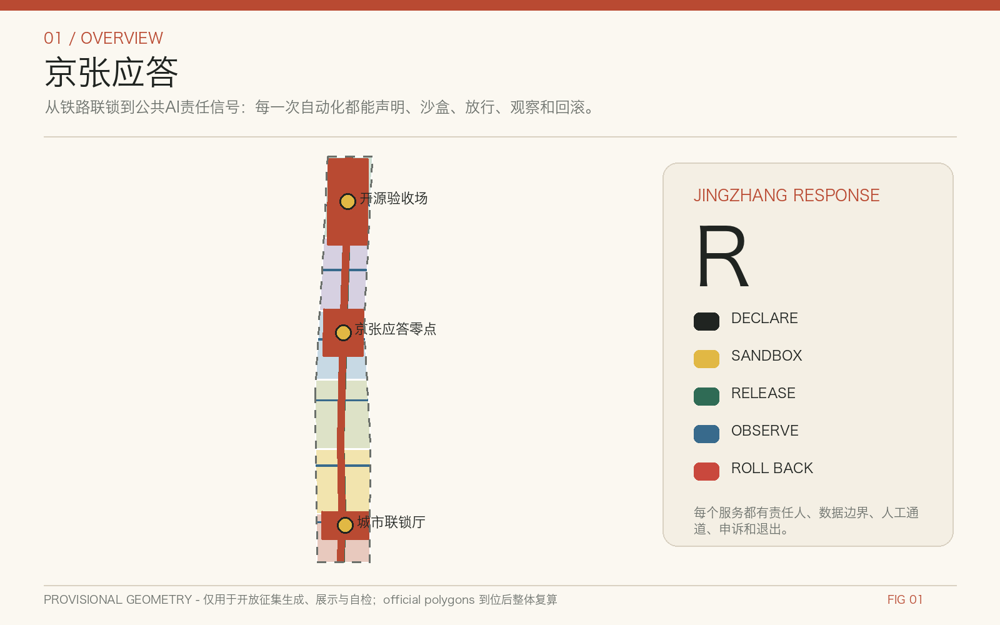
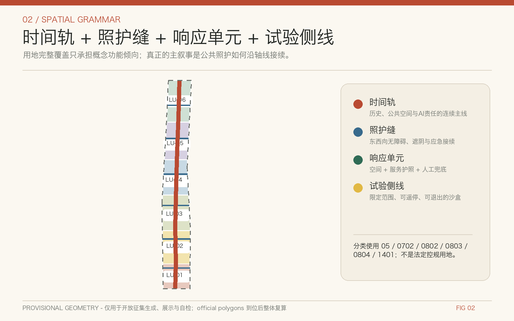
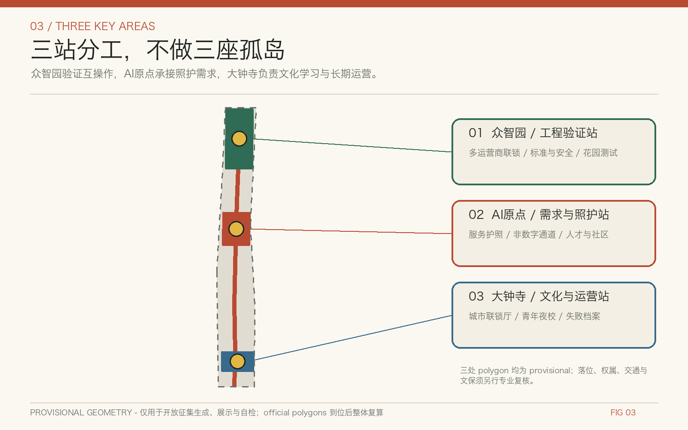
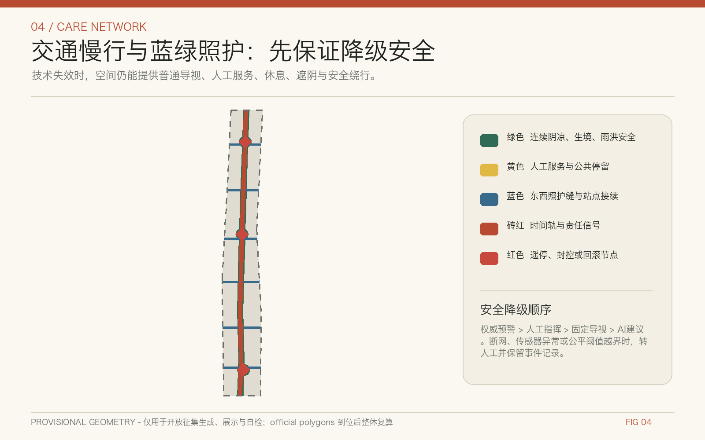
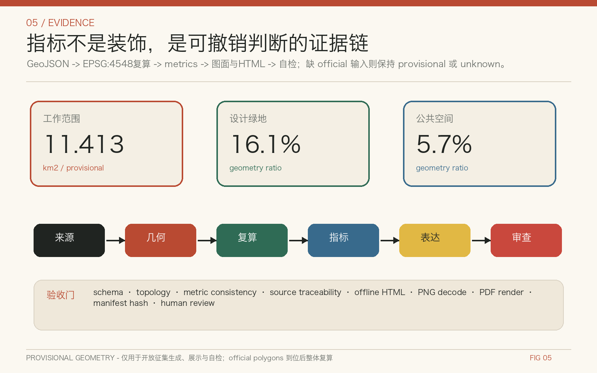

# 京张应答：可审计的城市照护信号系统

英文名：JINGZHANG RESPONSE

副标题：可审计的城市照护信号系统 / An Auditable Urban Care Signalling System

核心宣言：每一次自动化，都留下可见的责任信号。

本成果是面向社区开源征集的概念建议和参考方案，可供专业团队深化研究；它不替代正式规划，不构成政府审定结论。所有基于临时边界的面积和比率只是可复算的工作值，official polygons 到位后必须整体重算。

## 设计依据与资料清单

“京张应答”把证据分为四级：官方公告和法律标准回答“任务与责任是什么”；官方历史、遗产和建设公开信息回答“为什么需要谨慎延续”；国际案例回答“哪些机制值得比较”；仓库 provisional geometry 只回答“怎样先跑通拓扑、图面与自检”。这四级不得混写。项目名称、43.6 平方公里统筹研究范围、11.4 平方公里总体设计范围、368.4 公顷重点区域以及三处片区约值来自公告 [source:OFFICIAL-ANNOUNCEMENT]；实际提交 polygon 来自 [source:PROVISIONAL-BOUNDARIES]，在 [data:geometry/site_boundary.geojson#SITE-001] 和 [data:geometry/key_areas.geojson#PROV-KEY-001] 中均标为 `official_boundary=false`、`geometry_role=provisional_constraint`、`boundary_precision=provisional_rough`。

数据治理遵循 [source:SOURCE-REGISTRY] 的用途分级，[source:PROCESSED-FACT-PACK] 仅作导航，[source:SITE-PACKAGE] 提供 EPSG:4326 交换和 EPSG:4548 量算规则。用地、公共空间和城市风貌响应 [standard:MOHURD-URBAN-DESIGN-MEASURES]，控规法定边界响应 [standard:MOHURD-CONTROL-DETAILED-PLANNING]，分类术语响应 [standard:MNR-LAND-USE-CLASSIFICATION-GUIDE]。公告与智能体任务分别由 [standard:PROJECT-OFFICIAL-ANNOUNCEMENT]、[standard:PROJECT-AGENT-OPEN-CALL-TASKBOOK] 统领；[standard:MOHURD-ARCH-DESIGN-DEPTH-2016] 因官方文件未入库维持 data gap，不冒充已满足依据。[depth:existing_conditions_diagnosis]

本包不使用商业地图截图、远程瓦片、人物肖像或品牌图形。几何、指标、矩阵和图纸由本地确定性脚本生成；文字与设计候选由 AI 协助，但来源选择、许可证、概念方向和远端发布仍由人类用户决定。外部网页只保留事实引用，不复制其图片；原创文字、图解、设计图层、HTML 和 PDF 采用 CC-BY-4.0，第三方材料保留原权利和用途边界。[source:AGENT-TASKBOOK] [source:RFC7946]

## 三层范围工作框架

三层工作通过同一条“责任链”上下传导。统筹研究范围讨论创新生态、区域协同和公共价值，不绘制新的精确红线；总体设计范围以“时间轨、照护缝、响应单元、试验侧线”形成空间语法；三处重点区域验证不同类型的照护与创新机制。范围级别见 [data:geometry/site_boundary.geojson#SITE-001]，重点区索引见 [data:geometry/key_areas.geojson#PROV-KEY-001]、[data:geometry/key_areas.geojson#PROV-KEY-002]、[data:geometry/key_areas.geojson#PROV-KEY-003]。[depth:three_level_scope_framework]

“时间轨”借用铁路联锁的可见秩序，串联百年京张文化、中关村创新文化和未来公共 AI；“照护缝”是东西向步行、无障碍、遮阴、应急和服务接续；“响应单元”把一项城市服务绑定到空间、责任主体、数据边界和回滚条件；“试验侧线”允许机器人或智能体先在有限时间、有限人群、有限空间中沙盒测试。总体结构不是一张技术覆盖网，而是一套优先保护老人、儿童、照护者、残障人士、夜间劳动者和普通居民选择权的城市规则。[depth:overall_spatial_structure]

三处重点区承担不同角色：众智园是工程验证与多运营商互操作的“开源验收场”；北京 AI 原点社区是日常需求、人才服务与公共照护的“京张应答零点”；大钟寺是文化学习、青年活动和长期运营的“城市联锁厅”。三区以公共协议而非单一平台连接，两翼则提供科技服务与真实场景。所有位置只是对临时边界的概念映射，不能推导权属、拆建、道路红线或工程可行性。[source:OFFICIAL-ANNOUNCEMENT] [source:AGENT-TASKBOOK]

## 统筹研究范围产业与未来城市研究

国际比较只提取机制，不复制形态。Helsinki 3D 说明城市模型需要开放格式、版本和公共复用 [source:CASE-HELSINKI-3D]；Punggol Digital District 说明物理 AI 需要研究、测试、部署、运营反馈分级 [source:CASE-PUNGGOL-PDD]；Decidim 提醒提案、讨论、决策与反馈要留下可追溯记录 [source:CASE-BARCELONA-DECIDIM]；Milton Keynes 把技术试验放进城市产业与服务战略，而非孤立展项 [source:CASE-MILTON-KEYNES]；King's Cross 展示铁路工业遗产更新需要长期公共空间与混合使用组织 [source:CASE-KINGS-CROSS]；Amsterdam 的算法生命周期把上线后的监测与退役也纳入责任 [source:CASE-AMSTERDAM-ALGORITHM]；Paris 的邻近城市强调日常服务可达与照护绩效 [source:CASE-PARIS-15M]。Toronto Quayside 作为负面治理提醒：数据治理、公众信任和退出权应先于技术规模化 [source:CASE-TORONTO-QUAYSIDE]。

据此形成四层创新生态：第一层是高校、研究机构和开源社区的知识策源；第二层是算力、数据、评测、安全和标准等共享基础设施；第三层是企业、公共部门与社区共同提出的场景；第四层是申诉、审计、故障档案和退役机制。空间上，[data:geometry/land_use.geojson#LU-01] 提供功能响应单元，[data:geometry/phasing.geojson#PHASE-01] 提供分级推进，[data:geometry/public_space.geojson#PUBLIC-AXIS] 提供公众可见界面。产业价值不是只统计企业或活动数量，还要观察复用协议、跨运营商互操作、问题关闭时间、无 AI 替代通道与公众异议处理。[depth:overall_spatial_structure]

京张铁路由中国人自主设计建造的历史意义，支持“可验证、自主负责”的叙事，但不能被简化成科技装饰 [source:JINGZHANG-HISTORY-NRA]。遗址公园的公开规划与阶段建设说明这条线已经承担城市缝合和公共空间角色 [source:BEIJING-OPEN-SPACE-2021] [source:JINGZHANG-PARK-PHASE1] [source:JINGZHANG-PARK-PHASE2]。未来城市研究因此把 AI 看作可撤回的公共服务能力，而不是无处不在的感知基础设施；中关村与 AI 原点社区背景只用于识别策源与转化关系，不编造企业名单、产值或招商承诺。[source:BEIJING-AI-DISTRICT-2024]

## 总体设计范围城市更新与控规深度城市设计

总体设计把约 11.413 平方公里临时 polygon 划分为连续响应单元，完整覆盖且不重叠；这只是从同一边界确定性切分出的概念功能倾向，不能替代控规。用地证据位于 [data:geometry/land_use.geojson#LU-01]，建筑原型位于 [data:geometry/buildings.geojson#BLDG-01]，概念慢行位于 [data:geometry/roads.geojson#ROAD-AXIS]，待补约束以数据缺口标记位于 [data:geometry/constraints.geojson#GAP-BOUNDARY]。四类文件共同说明设计意图、可复算关系和不能下结论的部分。[depth:land_use_layout]

城市更新不先做“拆、改、留”结论，而是设置三道门。第一道是证据门：核对权属、年代、结构、使用、消防、文保和控规；第二道是公共价值门：比较保留修缮、适应性再利用和新建的碳、可达与服务影响；第三道是授权门：由责任部门、权利人、专业团队和公众程序决定。当前 buildings.geojson 仅是“未来专业深化可替换的空间原型”，其约 8.2 公顷基底工作值不能识别任何现状建筑，更不能支持拆除。[depth:retain_renovate_demolish] [depth:height_massing_character]

每项 AI 服务使用“声明 Declare—沙盒 Sandbox—放行 Release—观察 Observe—回滚 Roll back”五状态。服务护照必须写明 owner、purpose、data、retention、model/version、evaluation、human review、non-AI channel、appeal、release trigger、rollback trigger、incident、audit 和 retirement。未通过沙盒的服务不进入公共空间；观测到安全、公平、可达或隐私异常时转人工或回滚。该机制参考 [source:NIST-AI-RMF] 和 [source:UNESCO-AI-ETHICS]，并服从 [source:PIPL]。它是治理建议，不是既有行政流程。[depth:development_intensity_controls]

## 重点区域详细设计

众智园 AI 自主创新加速区被定义为“工程验证站”。概念动作包括：在不改变临时边界属性的前提下组织开源验收场、标准与安全工作坊、低碳算力解释节点、多运营商机器人会车试验和清河文化学习界面。试验侧线按时段封闭、限速、人工值守和事件记录运行；任何设备进入公共道路前仍需交通、安全和运营许可。片区详细设计引用 [data:geometry/key_areas.geojson#PROV-KEY-001]，不能把粗略 polygon 当作园区或地块边界。

北京 AI 原点社区被定义为“需求与照护站”。概念动作包括：京张应答零点、无障碍服务台、开源成果发布厅、照护者与儿童共用的可转换空间、夜间安全路线和非数字服务窗口。这里优先测试公共 AI 是否真的减少办事负担，而不是增加登录、授权和设备门槛；每个服务都展示负责人、用途、数据留存、人工渠道和申诉入口。片区详细设计引用 [data:geometry/key_areas.geojson#PROV-KEY-002]，站点一体化和建筑更新必须等待交通、权属与现状调查。

大钟寺 AI 产业聚集区被定义为“文化与运营站”。概念动作包括：城市联锁厅、青年开源夜校、可核验遗产学习、公共设施公平预约、节庆人流响应和长期故障档案展。四象限步行连通仅表达应优先解决的用户旅程，不画桥隧或地下工程结论；商业、内容与智能终端体验保留无追踪、无个性化的普通选择。片区详细设计引用 [data:geometry/key_areas.geojson#PROV-KEY-003]。[depth:three_key_area_detailed_design]

三处共同设置三类朝圣地标：京张应答零点展示“谁负责、怎样退出”；城市联锁厅展示跨主体协调和故障复盘；开源验收场展示可重复测试、版本和证据。地标应轻触地面、可逆、不依附文物本体，落位前须取得文物与场地专业意见。[source:TSINGHUAYUAN-HERITAGE] 这种“可见责任”比大型屏幕或拟人机器人更能形成持久辨识度。

## AI 创新生态、人才画像与 AI+ 场景

六类合成画像用于挑战设计，不对应真实个人：老人居民关注阴凉、休息、人工服务和紧急求助；轮椅研究者关注连续无障碍与设备失效后的接续；照护者与儿童关注可见边界、低刺激和不持续追踪；国际学生或开发者关注多语言、开源协作与短期服务；夜间维护和配送劳动者关注照明、补给、限速和人机协同；社区与应急协调员关注权威信息、人工接管和跨主体联络。画像只定义需求，不采集个人轨迹或推断身份。[source:WCAG22]

十二张场景卡均包含用户、空间、数据、AI 作用、人工兜底和停止条件：

- S01 凉行响应：按公开天气和现场人工观察提示有阴凉、饮水与休息的路线，设备失效时保留固定导视。
- S02 无障碍接续：报告电梯或坡道中断并给出人工确认的替代路径，不用残障身份做隐性画像。
- S03 暴雨安全绕行：只引用权威预警和现场封控，冲突时以人工安全命令优先。
- S04 夜间照护路线：提供照明、值守和开放设施信息，不开启人脸识别或持续跟随。
- S05 药品与物资配送：低速机器人在限定侧线运行，必须具备人工遥停、让行和事故记录。
- S06 儿童友好通学与游玩：信息面向监护人与学校确认，不建立儿童长期行为档案。
- S07 多运营商机器人会车：在开源验收场测试优先权、紧急停车和互操作日志。
- S08 可核验遗产学习：每个历史解释回指权威来源，争议内容提供人工勘误渠道。
- S09 公共设施公平预约：公开排队规则、保留电话或现场渠道，并检查不同人群等待差异。
- S10 节庆人流响应：只使用聚合计数与人工巡查，不把流量推断为个人意图。
- S11 设施故障诊断：模型提出候选原因，工程人员确认后才派单或关闭设施。
- S12 申诉退出删除：任何服务都能查看记录、请求更正、选择非 AI 路径并触发退役评估。

四项产业测试形成可审计门：T01 多运营商机器人联锁，验证让行、遥停和日志互认；T02 公共 AI 服务互操作，验证服务护照、身份最小化和人工转接；T03 极端天气降级，验证断网、传感器失效与权威预警冲突时安全退出；T04 无障碍与公平挑战，邀请不同能力和语言用户发现失败。任何测试未达到预设门槛时停留在 Sandbox，不因展示需求提前 Release。[depth:municipal_new_infrastructure]

## 用地、建筑规模与拆改留方案

land_use.geojson 由同一临时 SITE_BOUNDARY 在 EPSG:4548 中切分后再交换为 EPSG:4326，因此相邻单元共享边界、全域覆盖、无重叠。分类使用自然资源部指南在仓库登记的代码，但只表达概念功能倾向：[standard:MNR-LAND-USE-CLASSIFICATION-GUIDE] [data:geometry/land_use.geojson#LU-01]。当前分区工作值如下：

- 0803 文化用地：临时边界内设计分区工作值约 146.5 公顷；用于表达响应单元的功能倾向，不构成法定用地性质。
- 05 商业服务业用地：临时边界内设计分区工作值约 200.5 公顷；用于表达响应单元的功能倾向，不构成法定用地性质。
- 0702 城镇社区服务设施用地：临时边界内设计分区工作值约 211.4 公顷；用于表达响应单元的功能倾向，不构成法定用地性质。
- 0802 科研用地：临时边界内设计分区工作值约 187.6 公顷；用于表达响应单元的功能倾向，不构成法定用地性质。
- 0804 教育用地：临时边界内设计分区工作值约 187.3 公顷；用于表达响应单元的功能倾向，不构成法定用地性质。
- 1401 公园绿地：临时边界内设计分区工作值约 208.0 公顷；用于表达响应单元的功能倾向，不构成法定用地性质。

建筑层不使用虚构的现状底数。buildings.geojson 中的原型矩形表达“什么类型的空间接口可能需要”：研发、实验、孵化、社区服务、文化展示和交通接驳；其总基底工作值为 8.2 公顷 [metric:building_footprint_area_sqm]。每个原型标注 `conceptual_only=true`、`geometry_role=design_proposal`，不对应具体建筑、产权或层数。[data:geometry/buildings.geojson#BLDG-01]

拆改留使用“证据—公共价值—授权”三门，不用一张颜色图预先决定命运。保留优先核对历史、社区和碳价值；改造优先检验结构安全、消防、无障碍和适应性再利用；新建只在功能缺口、专业条件和法定程序同时满足时讨论。容积率、总建筑面积、建筑高度和法定建筑密度均保持 unknown，原因和解锁条件写入 metrics 与 assumptions。[depth:development_intensity_controls] [depth:retain_renovate_demolish]

## 交通、轨道、市政与公共服务设施

交通策略不是绘制新道路，而是把“接续是否可靠”作为第一指标。roads.geojson 包含一条概念时间轨和六条照护缝：时间轨服务步行、骑行、遗产学习与低速试验；照护缝连接东西两侧的站点、社区、高校和公共服务。所有线都由临时边界裁切，线长工作值约 16.73 公里 [metric:road_centerline_length_m] [data:geometry/roads.geojson#ROAD-AXIS]，不代表道路红线、桥隧方案或施工可行性。[depth:traffic_rail_slow_parking]

对轨道接驳，方案先描绘用户旅程：下车后能否找到无障碍路径、阴凉休息点、人工服务和夜间照明；对机器人，方案先确定让行、限速、遥停和事故处理；对自行车，方案先解决断点与安全停放；对小汽车，方案只提出停车需求调查与共享评估，不给出供给数量。关键接口以 [data:geometry/constraints.geojson#GAP-ROAD] 标为待核数据，进入专业深化前必须取得道路、站点与交通专项。

市政和公共服务采用“接口清单”而非容量承诺：端侧算力需要能源、散热、网络与维修责任；遮阴、饮水、厕所和休息需要设施底数与运维；暴雨绕行需要权威预警、排水和封控；应急服务需要明确人工指挥。没有管线、消防、防洪、能源和设施容量时，不做设备数量或负荷测算。[data:geometry/constraints.geojson#GAP-MUNICIPAL] [depth:municipal_new_infrastructure]

## 蓝绿空间、公共空间与城市风貌

蓝绿系统把连续性、阴凉、休息、雨洪安全和生境放在技术展示之前。green_space.geojson 由时间轨缓冲带与三个响应口袋组成，临时边界内工作面积约 184.3 公顷、比率 16.1%；public_space.geojson 由更窄的可达走廊、地标前场与照护节点组成，工作面积约 65.5 公顷、比率 5.7%。[data:geometry/green_space.geojson#GREEN-CORRIDOR] [data:geometry/public_space.geojson#PUBLIC-AXIS] [metric:green_ratio] [metric:public_space_ratio]

这些比率不是官方绿地率或公共空间标准，只是当前设计 geometry 的可复算结果。图面把 provisional boundary 用低对比虚线表示，把连续绿廊、照护节点、重点区和安全接续置于前景。空间组件包括可移动遮阴、不同高度座椅、无障碍补给台、人工服务窗口、低刺激提示、离线导视、机器人遥停点和事件公告牌；每个组件都能在技术撤出后继续作为普通城市家具使用。[depth:blue_green_public_space]

城市风貌以“铁路秩序 + 北京砖色 + 中关村开源文化”为方向：炭黑表达轨道和责任，砖红表达历史与公共行动，深绿表达照护生态，信号黄表达待确认，信号红表达停止或回滚，米白提供阅读背景。状态同时用形状、文字、线型表达，不依赖颜色。清华园车站旧址和遗址公园相关节点必须轻触、可逆并经文物专业审查 [source:TSINGHUAYUAN-HERITAGE]；历史叙事回引国家铁路局史料 [source:JINGZHANG-HISTORY-NRA]，不使用未经授权的肖像、字体或图片。[standard:MOHURD-URBAN-DESIGN-MEASURES] [depth:height_massing_character]

## 更新项目清单、实施政策与分期计划

phasing.geojson 把临时范围切成四个可重算阶段，但阶段不是确定开发时序。[data:geometry/phasing.geojson#PHASE-01] 第一阶段“证据与共识”建立边界替换、设施调查、服务护照和公众问题库；第二阶段“有限沙盒”只在可控空间开展互操作、无障碍和极端天气测试；第三阶段“条件放行”要求责任主体、数据合法性、评测、人工接管和保险等门槛齐备；第四阶段“观察与退役”公开事件、申诉、修复和退出记录。[depth:phasing_implementation]

八个更新项目包均为概念建议：P01 京张应答零点与服务护照台；P02 城市联锁厅与公共故障档案；P03 开源验收场与多运营商沙盒；P04 六条照护缝与无障碍接续；P05 蓝绿凉行与暴雨降级；P06 三处重点区轻触式公共界面；P07 场景退出、申诉和数据删除通道；P08 年度运营与开放评审工具包。项目先满足资料、权属、专业和公众程序，再讨论投资或建设。[metric:renewal_project_count] [depth:renewal_project_list]

长期运营称为“京张应答季”：春季发布可测试问题与数据缺口，夏季开展 Bug Bash 和无障碍挑战，秋季进行红灯回滚演练，冬季公开失败档案、修复结果和下一年度准入清单。运营组织由公共部门、社区、专业机构、高校、企业和独立评测角色共同组成，任何单一平台不得同时拥有规则、数据、评测与申诉最终权。活动、品牌、资金和场地均需责任主体后续确认，当前不视为既定安排。[source:CASE-BARCELONA-DECIDIM] [source:CASE-AMSTERDAM-ALGORITHM]

## 指标体系、面积复算与合规矩阵

所有几何在 GeoJSON 中以 EPSG:4326 交换，在 EPSG:4548 中量算。当前 site_area_sqm 工作值为 11412825.386 平方米，来源是临时 boundary；green_ratio 为 0.161451，public_space_ratio 为 0.057421，分别由 union 后面积除以 site 面积。数字保留是为了复算与发现错误，不意味着边界达到测绘精度。[metric:site_area_sqm] [metric:green_space_area_sqm] [metric:public_space_area_sqm] [depth:metrics_recalculation]

机器指标索引如下；每个 known 值都给出单位、公式、来源文件、置信度和 assumptions，unknown 值给出原因和正式数据触发条件：

- [metric:site_area_sqm]：11412825.386 sqm；area(union(site_boundary)) in EPSG:4548；置信度 medium。
- [metric:land_use_partition_area_sqm]：11412825.386 sqm；area(union(land_use)) in EPSG:4548；置信度 medium。
- [metric:building_footprint_area_sqm]：82067.827 sqm；area(union(concept_building_footprints)) in EPSG:4548；置信度 medium。
- [metric:building_footprint_ratio]：0.007191 ratio；building_footprint_area_sqm / site_area_sqm；置信度 medium。
- [metric:green_space_area_sqm]：1842615.267 sqm；area(union(green_space)) in EPSG:4548；置信度 medium。
- [metric:green_ratio]：0.161451 ratio；green_space_area_sqm / site_area_sqm；置信度 medium。
- [metric:public_space_area_sqm]：655331.843 sqm；area(union(public_space)) in EPSG:4548；置信度 medium。
- [metric:public_space_ratio]：0.057421 ratio；public_space_area_sqm / site_area_sqm；置信度 medium。
- [metric:road_centerline_length_m]：16726.816 m；sum(length(concept_road_centerlines)) in EPSG:4548；置信度 medium。
- [metric:phasing_area_sqm]：11412825.386 sqm；area(union(phasing)) in EPSG:4548；置信度 medium。
- [metric:key_area_count]：3 count；count(required_key_areas)；置信度 high。
- [metric:renewal_project_count]：8 count；count(unique conceptual project_ids)；置信度 high。
- [metric:scenario_count]：12 count；count(S01..S12 scenario cards)；置信度 high。
- [metric:test_scenario_count]：4 count；count(T01..T04 test scenarios)；置信度 high。
- [metric:persona_count]：6 count；count(synthetic personas)；置信度 high。
- [metric:global_case_count]：7 count；count(formal positive international cases)；置信度 high。
- [metric:service_passport_field_count]：15 count；count(required service passport fields)；置信度 high。

compliance_matrix.json 覆盖公告 17 项与 agent.1-agent.6 共 23 项；standard_matrix.json 覆盖五项 mandatory standards 并保留一项 non-mandatory data gap；design_depth_matrix.json 覆盖十五项 formal 深度。矩阵的每一行都回到正文、GeoJSON、指标、图纸、来源、假设和 self-check，而不是把“complete”作为自证。A3 文册和 A0 展板是解释层，结构化数据仍是复算权威。[standard:PROJECT-OFFICIAL-ANNOUNCEMENT] [depth:risk_missing_data]

机器可读图层总索引：[data:geometry/site_boundary.geojson#SITE-001]、[data:geometry/key_areas.geojson#PROV-KEY-001]、[data:geometry/land_use.geojson#LU-01]、[data:geometry/buildings.geojson#BLDG-01]、[data:geometry/roads.geojson#ROAD-AXIS]、[data:geometry/green_space.geojson#GREEN-CORRIDOR]、[data:geometry/public_space.geojson#PUBLIC-AXIS]、[data:geometry/constraints.geojson#GAP-BOUNDARY]、[data:geometry/phasing.geojson#PHASE-01]。该索引确保九个文件均可从正文到达。

## 风险、版权与合规说明

最高风险不是模型“不够聪明”，而是责任、边界和退出不可见。空间风险包括 official polygon、道路、地块、现状建筑、文保、市政和设施底数缺失；AI 风险包括目的漂移、过度采集、差异性错误、供应商锁定、无法申诉和退出后仍保留数据。对应控制是 fail closed：资料不足则标 unknown 或 provisional，测试不达门则停在 Sandbox，运行异常则转人工或 Roll back。[data:geometry/constraints.geojson#GAP-BOUNDARY] [depth:risk_missing_data]

隐私控制遵循最小必要、明确目的、最短留存、分级访问和可撤回原则 [source:PIPL]。明确禁止人脸识别式全域识别、社会评分、儿童持续追踪、基于脆弱特征的商业引导，以及模型单独作出高影响公共决定。公开指标只使用聚合或确定性几何；场景如需个体信息，必须由未来责任主体另行完成合法性、敏感信息、自动化决策和安全评估。本方案不是法律意见，也不声明任何具体系统已合规。

AI 输出边界参照 [source:NIST-AI-RMF] 与 [source:UNESCO-AI-ETHICS]：模型可以提出候选、解释和检查线索；schema、几何、指标、哈希和拒绝条件由确定性代码执行；专业人员确认规划、工程、文保和安全；公众拥有非 AI 通道、申诉与更正；维护者保留发布和现实采用判断。Toronto 经验提醒应把信任与退出放在扩张之前 [source:CASE-TORONTO-QUAYSIDE]。[depth:development_intensity_controls]

原创方案文字、视觉图解、agent 设计图层、HTML 和 PDF 采用 CC-BY-4.0。仓库 provisional geometry 不被本方案重新许可，外部网页、法律、标准和案例保留各自权利；本包不嵌入其照片、地图截图、商标或远程资产。版权细则见 report/copyright_statement.md。所有空间动作均为“概念建议”“参考方案”或“可供专业团队深化研究”，不构成法定规划、审批、工程、权属、投资或政府承诺。[source:RFC7946] [source:WCAG22]

## 参考资料

以下清单按来源角色说明如何使用，而不是把链接数量当作研究质量。官方任务与法律承担权威事实，国际案例承担机制比较，仓库数据承担生成与自检；任何来源都不能超出其记录的 limitations。完整 URL、访问日期、许可摘要和禁止用途见 sources.json。

- [source:OFFICIAL-ANNOUNCEMENT] 百年京张AI创新带城市设计国际方案征集资格预审公告，发布者：北京市规划和自然资源委员会海淀分局。用途：确认项目名称、三层范围约值、三处重点区约值及设计任务。 限制：不提供 official polygon、控规指标、工程线位或政府实施承诺。
- [source:AGENT-TASKBOOK] 面向全球智能体开展百年京张AI创新带城市设计开源征集任务书摘录，发布者：User-provided cleared document / repository maintainers。用途：确认十条共创原则、三大定位、五大功能、六项智能体任务与边界条款。 限制：不是官方红线、法定规划、工程可行性或政府决策依据。
- [source:SITE-PACKAGE] 百年京张AI创新带机器可读 site package，发布者：open-city-ai/haidian repository maintainers。用途：读取任务结构、枚举、标准索引、schema、允许设计空间和量算坐标系。 限制：不能把其中的临时几何升级为 official 或 statutory 数据。
- [source:SOURCE-REGISTRY] 公开资料登记表，发布者：open-city-ai/haidian repository maintainers。用途：区分 formal-ready、background、provisional 与禁止用途。 限制：登记表是治理层，不替代其所指向的原始权威来源。
- [source:PROCESSED-FACT-PACK] 百年京张AI创新带 Agent 事实包，发布者：open-city-ai/haidian repository maintainers。用途：建立范围、任务、资料用途和缺资料清单。 限制：不是新的事实权威，不能提升原始资料确定性。
- [source:PROVISIONAL-BOUNDARIES] 百年京张AI创新带三层范围与三处重点区临时粗略 polygon，发布者：open-city-ai/haidian repository maintainers。用途：仅用于本地生成、拓扑自检、解释性图面和开放讨论。 限制：不得用于 official redline、精确面积、审批、权属或工程判断。
- [source:JINGZHANG-HISTORY-NRA] 京张铁路：由中国人自主设计建造的第一条干线铁路相关史料，发布者：国家铁路局。用途：核对詹天佑、京张铁路自主建造与工程精神的历史叙事。 限制：不用于推导现状保护边界或工程条件。
- [source:BEIJING-OPEN-SPACE-2021] 京张铁路遗址公园相关公开规划信息，发布者：北京市规划和自然资源委员会。用途：理解遗址公园公共空间连续性与城市缝合背景。 限制：网页示意不能作为本投稿的 official boundary 或工程图。
- [source:JINGZHANG-PARK-PHASE1] 京张铁路遗址公园一期建设公开信息，发布者：北京市园林绿化局。用途：理解遗址公园已实施公共空间的阶段性背景。 限制：不替代竣工图、现状测绘、权属或后续实施边界。
- [source:JINGZHANG-PARK-PHASE2] 京张铁路遗址公园二期相关公开信息，发布者：北京市人民政府。用途：理解南北贯通和阶段实施语境。 限制：不提供本方案可直接采用的施工图、道路红线或投资承诺。
- [source:TSINGHUAYUAN-HERITAGE] 清华园车站旧址保护范围与建设控制地带公开信息，发布者：北京市文物局。用途：确认文化遗产节点需要文物专业复核和保守介入。 限制：未在本投稿中取得可复算 GIS 保护线，不能绘制精确控制范围。
- [source:BEIJING-AI-DISTRICT-2024] 北京AI原点社区与人工智能产业集聚相关公开信息，发布者：北京市科学技术委员会、中关村科技园区管理委员会。用途：理解 AI 原点社区的策源、转化与产业生态背景。 限制：不用于编造企业名单、产值、投资、招商或空间控制。
- [source:CASE-HELSINKI-3D] Helsinki 3D，发布者：City of Helsinki。用途：借鉴开放三维城市模型、数据版本与公共复用机制。 限制：技术与治理机制须本地化，不能直接证明北京数据可开放。
- [source:CASE-PUNGGOL-PDD] Punggol Digital District，发布者：JTC Singapore / IMDA Singapore。用途：借鉴园区作为物理 AI 研究、测试、部署与运营反馈闭环的做法。 限制：不照搬供应商、监管框架或工程条件。
- [source:CASE-BARCELONA-DECIDIM] Decidim: participatory democracy framework，发布者：Decidim Association / Barcelona-origin open community。用途：借鉴可追溯提案、讨论、决策与反馈记录。 限制：数字参与不能替代法定公众参与程序和线下可达渠道。
- [source:CASE-MILTON-KEYNES] Milton Keynes City Technology, Smart City, Digital and Creative Industries Strategy 2024-2029，发布者：Milton Keynes City Council。用途：借鉴城市尺度技术试验、产业与公共服务协同。 限制：战略愿景不等于具体机器人线路或安全许可。
- [source:CASE-KINGS-CROSS] King's Cross Central，发布者：London Borough of Camden。用途：借鉴铁路工业遗产、公共空间和混合功能更新的长期组织。 限制：不复制项目图纸、建筑语言或权属实施方式。
- [source:CASE-AMSTERDAM-ALGORITHM] Algorithm Lifecycle Management Playbook，发布者：Municipality of Amsterdam。用途：借鉴算法从目的、评估、部署、监测到退役的责任链。 限制：不能替代中国法律、采购、安全与行政责任要求。
- [source:CASE-PARIS-15M] Paris, ville du quart d'heure，发布者：Ville de Paris。用途：借鉴把服务可达性和日常照护作为空间绩效。 限制：不将十五分钟概念机械化为未经数据支持的达标结论。
- [source:CASE-TORONTO-QUAYSIDE] Waterfront Toronto digital governance reflections after Quayside，发布者：Waterfront Toronto。用途：提醒城市技术项目必须先解决数据治理、公众信任与退出机制。 限制：不把个案争议简化为单一技术或单一机构因果。
- [source:NIST-AI-RMF] AI Risk Management Framework，发布者：National Institute of Standards and Technology。用途：构建 AI 服务护照、风险测试、监测与退役门。 限制：参考框架不替代中国法律法规、行业许可或本地专业责任。
- [source:UNESCO-AI-ETHICS] Recommendation on the Ethics of Artificial Intelligence，发布者：UNESCO。用途：校核尊严、公平、透明、监督和环境责任。 限制：原则性文件不直接给出项目审批或技术合规结论。
- [source:PIPL] 中华人民共和国个人信息保护法，发布者：全国人民代表大会常务委员会。用途：约束最小必要、明确目的、敏感信息、自动化决策与个人权利。 限制：本方案不是法律意见，具体处理活动需由责任主体另行合规评估。
- [source:RFC7946] The GeoJSON Format (RFC 7946)，发布者：IETF。用途：约束 GeoJSON 交换坐标、对象结构与互操作性。 限制：不规定本项目的 official boundary、量算 CRS 或规划语义。
- [source:WCAG22] Web Content Accessibility Guidelines (WCAG) 2.2，发布者：World Wide Web Consortium。用途：校核离线网页的对比、结构、文字替代和不依赖颜色表达。 限制：静态自检不等于完整无障碍认证或用户测试。

复核规则是：历史事实回到发布机构，规划任务回到官方公告，数据用途回到 source registry，空间面积回到 GeoJSON 与 EPSG:4548 复算，AI 行为回到服务护照与测试证据，现实采用回到人类专业和法定程序。official polygons 到位后，应从 site boundary 开始重建 land use、buildings、roads、green space、public space、phasing、metrics、五张图、HTML 和 PDF，而不是只改一处数字。[depth:metrics_recalculation] [depth:risk_missing_data]
