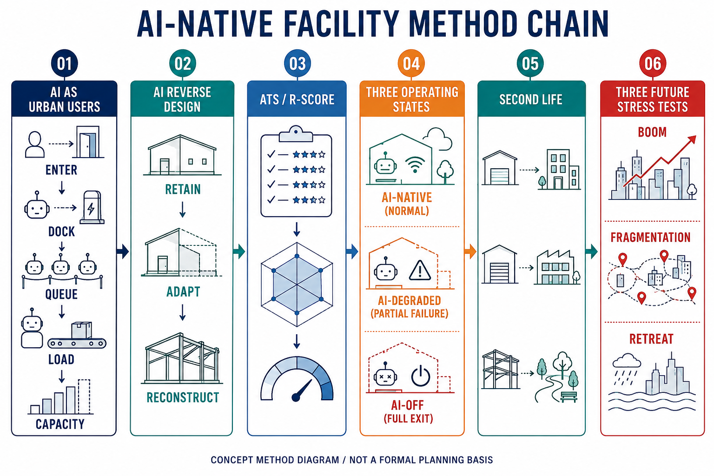

# Jing-Zhang AI-Native Reversible Facility Belt

## AI-Native Facility Method v0.1
The facility protocol treats AI, robots, and autonomous vehicles as physical urban users. It moves from reverse-design decisions (`retain`, `adapt`, or `reconstruct`) to ATS and R-Score, three operating states, Second Life, and three future stress tests. The diagram is an explanatory concept only; facility scores and future-test outcomes remain pending evidence and independent review [metric:ai_transformation_score] [metric:urban_ai_reversibility_score].

*Figure 1: AI-native facility method chain. Concept method diagram / not a formal planning basis [source:METHOD-CHAIN-FIGURE-EN].*

## Project and Multi-Agent Collaboration

This project uses project-level multi-agent role contracts to organise sources, spatial work, evidence, and quality checks. The six roles are: `orchestrator` for task decomposition, routing, and stage decisions; `evidence_planner` for evidence quality and planning constraints; `gis_analyst` for coordinates, geometry, and spatial recomputation; `researcher` for bounded source and case comparison; `librarian` for filing, citations, and version maintenance; and `qa_worker` for schema, field, hash, and deterministic gates. These roles define a collaboration and audit framework; they do not imply that every run exposes independently observable model calls.

The contracts are stored in the project architecture branch [`.codex/agents/`](https://github.com/CurvatureSoup/haidian/tree/codex/agent-architecture/.codex/agents). This submission package contains the deliverables and evidence, not a copy of the project-level configuration. The submission entry is [PR #4146](https://github.com/open-city-ai/haidian/pull/4146); the offline report and visualization are under this package's `report/` and `visual/` directories. Runtime model metadata remains independently unverified.

## Design Basis and Source List
This provisional concept package follows the official open-call brief, the agent taskbook, the site package, and the registered source-use boundaries [source:OFFICIAL-ANNOUNCEMENT] [source:AGENT-TASKBOOK] [source:SOURCE-REGISTRY]. It is a reviewable concept, not an approved plan. The boundary and key areas are provisional; official redlines, ownership, regulatory controls, utility data, and field surveys remain gaps [data:geometry/site_boundary.geojson#SITE-001] [source:BOUNDARY-SOURCE]. All known metrics are linked to package geometry or structured records, while unknown controls remain explicitly unknown.

## Three-Level Scope Framework
The proposal keeps the three levels of research area, overall design area, and key-area design. Research frames the AI ecosystem; the overall area connects renewal, mobility, municipal systems, and blue-green space; key areas test facility protocols in place [depth:three_level_scope_framework] [depth:overall_spatial_structure]. The three levels are coordinated rather than separate image sets, and each conclusion is limited by provisional geometry.

## Coordinated Research Area: Industry and Future City Research
The concept links university research, open-source collaboration, enterprise translation, public demonstration, and international exchange. AI changes the city when an agent physically enters, docks, queues, loads, unloads, charges, or occupies capacity; a dashboard or camera alone is not an AI-native spatial change [source:AGENT-TASKBOOK] [metric:ai_native_facility_count]. Human authorities retain planning, safety, accessibility, and approval decisions.

## Overall Design Area: Urban Renewal and Regulatory-Plan-Level Urban Design
The overall framework proposes a connected AI service belt, renewal projects, mixed public interfaces, and a blue-green slow-mobility spine. Building, intensity, road-redline, and utility conclusions are design suggestions only because official controls are missing [standard:MOHURD-CONTROL-DETAILED-PLANNING] [data:geometry/land_use.geojson#LU-001]. No demolition, floor area, investment, or statutory boundary is asserted.

## Detailed Design of Key Areas
The three key areas become testing contexts: Zhongzhiyuan for open testing and low-carbon innovation, Beijing AI Origin Community for near-campus translation and daily life, and Dazhongsi for enterprise, station, and public interface integration [data:geometry/key_areas.geojson#PROV-KEY-001] [data:geometry/key_areas.geojson#PROV-KEY-002] [data:geometry/key_areas.geojson#PROV-KEY-003]. Detailed professional design must follow when official conditions arrive.

## AI Innovation Ecosystem, Personas, and AI+ Scenarios
Ten concept scenario cards connect open-source publishing, safety governance, edge computing, slow-mobility diagnosis, talent services, enterprise translation, data-element exchange, low-carbon computing, heritage memory, and an AI activity route. Users include developers, start-ups, enterprise visitors, residents, and students. Data minimization, explainability, and human review are mandatory [source:AGENT-TASKBOOK] [data:geometry/public_space.geojson#PUBLIC-001].

## Land Use, Building Scale, and Retain-Renovate-Demolish Strategy
Land-use and building layers are provisional design expressions. Retain, adapt, renovate, demolish, and new-build decisions are not made without official parcels, ownership, heritage, fire, and engineering information [standard:MNR-LAND-USE-CLASSIFICATION-GUIDE] [depth:retain_renovate_demolish]. Building intensity and height remain unknown, with replacement and recomputation paths recorded in assumptions.

## Transport, Rail, Municipal Infrastructure, and Public Services
The mobility concept joins station access, safe crossings, slow routes, curb logistics, ordinary parking, municipal service, and emergency manual control. The road layer is a concept corridor, not a road redline [data:geometry/roads.geojson#ROAD-001] [depth:traffic_rail_slow_parking]. Utility, drainage, fire, energy, and operator conditions must be confirmed before implementation.

## Blue-Green Network, Public Space, and Urban Character
The Jing-Zhang heritage park and river interfaces form a public network for walking, cycling, rest, testing, and cultural interpretation. AI nodes must not reduce universal access or ordinary public use. The green and public-space ratios are reproducible from submitted geometry but remain provisional [data:geometry/green_space.geojson#GREEN-001] [metric:green_ratio] [metric:public_space_ratio].

## Renewal Projects, Implementation Policy, and Phasing
The concept identifies slow-mobility stitching, river innovation interface, near-campus translation street, station quadrant connections, public AI and edge nodes, and an activity route. Phasing distinguishes light operational pilots from later regulatory and engineering work [depth:renewal_project_list] [data:geometry/phasing.geojson#PHASE-001]. Responsibility, funding, ownership, and permits remain open risks.

## Metrics, Area Recalculation, and Compliance Matrix
The package reports site area, building footprint, green ratio, public-space ratio, key-area count, and six facility records. ATS measures spatial, functional, interface, and physical-use transformation; R-Score measures service retention, conversion time and cost, stranded assets, openness, and second life [metric:site_area_sqm] [metric:ai_transformation_score] [metric:urban_ai_reversibility_score]. Unknown scores cannot enter High-High.

## Risk, Copyright, and Compliance
Every facility has AI-Native, AI-Degraded, and AI-Off states, a basic service floor, and a Second Life path. Boom, Fragmentation, and Retreat tests remain unknown until evidence and independent review exist. The package includes a separately attributed OSM L2 trial extract for visual texture and concept networks. Microsoft Global ML Building Footprints was checked against its published index, but no matching Beijing tile was found, so no Microsoft geometry was substituted from another region [source:DATA-SRC-OSM-L2-TRIAL-20260828] [source:DATA-SRC-MICROSOFT-ML-BUILDINGS-20260828] [depth:risk_missing_data]. No government approval or construction commitment is claimed.

## References
The machine-auditable package contains `metrics.json`, `assumptions.json`, `sources.json`, `compliance_matrix.json`, `standard_matrix.json`, `design_depth_matrix.json`, GeoJSON layers, the facility matrix, and the offline visual. The matrix is the single source for later derivation. Official boundary replacement must trigger geometry, metric, figure, HTML, and drawing recomputation [source:SITE-PACKAGE] [depth:metrics_recalculation].
