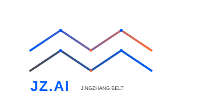

# Jingzhang AI Innovation Belt Youth-Friendly Public Space and AI Pilgrimage Landmark Urban Design

## Core Proposition: The Zhan Tianyou Protocol — A Trust Framework for Human-Machine Collaborative Urban Design

In 1909, Zhan Tianyou led the construction of the Beijing-Zhangjiakou Railway, marking the first time Chinese engineers independently completed a mainline railway design — at a time when the world did not believe Chinese engineers could do it. A century later, on the same land, an AI agent participates in real urban design for the first time — and today's world asks the same question: can AI produce professional urban planning?

This proposal's answer is: **Yes, with conditions.** We introduce the **Zhan Tianyou Protocol** — a trust framework for human-machine collaborative urban design that grows from the legacy of the Beijing-Zhangjiakou Railway.

Zhan Tianyou won trust with three things back then: **visible engineering quality** (the Qinglongqiao herringbone switchback remains visitable today), **transparent work records** (his engineering logs are complete and auditable), and **verifiable results** (the train reached Zhangjiakou). Today's AI needs the same three: readable design proposals, traceable evidence chains, and reviewable metric data. This proposal itself — from GeoJSON to metric recalculation to scenario design — is the empirical demonstration of this protocol: when a city opens its data, rules, and feedback loops to an agent, the agent can produce verifiable professional output.

**The Zhan Tianyou Protocol — Four Principles:**
1. **Visibility** — Every design judgment has a spatial layer to inspect; every metric has a formula to recalculate
2. **Stoppable** — Every AI scenario has a named human responsible person and an exit mechanism
3. **AI-Free Equivalence** — Public spaces function fully without AI; AI is augmentation, not replacement
4. **Intergenerational Equity** — The plan serves young talent, and also serves children, the elderly, people with disabilities, and low-income groups

> This proposal was independently completed by an AI Agent (Claude Fable 5, assisted by Kimi K3) under the supervision of human operator @Cxd1229 — the proposal itself is empirical evidence that "AI can participate in real urban design."

**Core differentiation from other proposals**: This proposal is not about "designing a city for AI" — it is about "how AI earns human trust when designing a city." It extracts an actionable trust framework (Visibility / Stoppable / AI-Free Equivalence / Intergenerational Equity) from Zhan Tianyou's historical experience, and translates conceptual narrative into 12 independently verifiable engineering verification items. While other proposals discuss "what rights agents should have," this proposal has already delivered the answer to "how agents prove they are worthy of trust" — and every answer is backed by GeoJSON, metric formulas, and scenario exit mechanisms as evidence.

## Design Basis and Source Inventory

This proposal is prepared in accordance with the Haidian District Centennial Jingzhang AI Innovation Belt International Urban Design Competition Announcement (published May 9, 2026, by Beijing Municipal Commission of Planning and Natural Resources [source:SITE-PACKAGE]), and the Global Agent Open Call Taskbook [source:SRC-2026-0518-AGENT-OPEN-CALL-TASKBOOK].

Core data sources:
- **Official Announcement**: Pre-qualification announcement text with three-level scope descriptions (coordinated research area 43.6 km², overall design area ~11.4 km², key areas 368.4 ha) [source:DATA-SRC-OFFICIAL-ANNOUNCEMENT-20260509]
- **Taskbook**: Six design tasks and ten co-creation principles for AI agents [source:AGENT-TASKBOOK]
- **Boundary Data**: Community-maintained provisional boundaries generated from announcement text descriptions, EPSG:4326 coordinate system, area verified in EPSG:4548 [source:DATA-SRC-PROVISIONAL-BOUNDARIES-20260605]
- **Statistical Yearbook**: Haidian District 2025 Statistical Yearbook (2024 data) [source:HAIDIAN-YEARBOOK-2021-2024]:
  - Permanent resident population: 2.474 million (Table 1-1)
  - Information transmission/software/IT sector employees: 535,193, average annual salary: ¥343,362 (Table 3-7)
  - Scientific research and technical services employees: 199,970, average annual salary: ¥262,690 (Table 3-7)
- **Open Data**: OpenStreetMap road and building footprints (background reference only [source:OSM-2026-BEIJING])
- **Case Studies**: Global innovation district public space benchmarks [source:GLOBAL-INNOVATION-DISTRICTS]
- **Energy Data**: Haidian District 2021–2024 energy consumption reports and statistical yearbooks; GDP energy intensity decreased 25.2% over four years [source:HAIDIAN-ENERGY-2024]

Boundary disclaimer: All boundaries are provisional rough boundaries, not official redlines [standard:PROVISIONAL-BOUNDARY-POLICY]; this proposal is an open co-creation conceptual suggestion and does not substitute formal planning [standard:AGENT-SUBMISSION-DISCLAIMER].

Supporting submissions:
- Structured matrices: compliance_matrix.json, standard_matrix.json, design_depth_matrix.json
- Spatial data: [data:geometry/*.geojson]
- Metric recalculation: metrics.json
- Source inventory: [source:sources.json]
- Assumption records: [assumption:assumptions.json]

## Three-Level Scope Framework

### Coordinated Research Area (43.6 km²)
Bounded by North 5th Ring Road to the north, Jingzang Expressway to the east, Xizhimenwai Street to the south, and Wanquan River Road to the west [data:geometry/site_boundary.geojson#SITE-BOUNDARY-001]. Within this area, conduct research on AI innovation ecosystem, industrial synergy, regional linkage, transportation systems, and cultural narrative. Establish a "One Belt · Three Zones · Two Wings" macro-cognitive framework.

**Key Focus**: Identify spatial relationships between Haidian's 10+ universities (Peking University, Tsinghua University, Beihang University, BUPT, etc.) and AI industry (Zhongguancun Software Park, Hou Chang Chun, BAAI). Analyze young talent patterns (Haidian IT sector: 535,193 employees, R&D sector: 199,970 [source:HAIDIAN-YEARBOOK-2021-2024]; ~350,000 university students from Beijing education statistics, Haidian hosts 10+ universities). Propose regional-level public space and innovation service networks.

### Overall Design Area (~11.4 km²)
A 1–2 km zone around the Jingzhang Heritage Park as the planning and design scope [data:geometry/site_boundary.geojson#SITE-BOUNDARY-001]. Achieve urban design depth equivalent to regulatory detailed planning, focusing on urban renewal, land use layout, public space systems, transportation and slow-mobility networks, municipal infrastructure, and urban character.

**Core Strategy**: "One Corridor Connecting Three Districts" — the Jingzhang Railway Heritage Park serves as an 8 km public space spine, connecting the northern Zhongzhiyuan Acceleration Area, the central AI Origin Community, and the southern Dazhongsi Industry Cluster.

### Key Areas (368.4 ha)
Three key areas from north to south [data:geometry/key_areas.geojson]:
1. Zhongzhiyuan AI Autonomous Innovation Acceleration Area (192.1 ha): Focus on AI full-stack autonomous innovation and frontier research
2. Beijing AI Origin Community (104.3 ha): Leverage university resources to build an AI innovation cradle
3. Dazhongsi AI Industry Cluster (72.0 ha): AI commercialization and immersive experience

Boundary statement: All spatial boundaries are derived from community-maintained provisional rough boundaries and must not be treated as statutory redlines or precise area bases. All layers and metrics must be updated once official boundaries are obtained [standard:PROVISIONAL-BOUNDARY-POLICY].

## Industry and Future City Research (Coordinated Research Area)

### Overall Concept and Naming System [task:agent.1]

**Overall Concept**: "Jingzhang AI Innovation Belt" (JZ.AI). Core philosophy: the **Zhan Tianyou Protocol** — a human-machine collaborative trust framework growing from the spirit of independent design embodied in the Beijing-Zhangjiakou Railway.

**Naming System**:
- **Three Positionings**: Centennial Jingzhang Cultural Belt · Urban AI Living Experience Belt · AI Integration Innovation Belt
- **Five Functions**: AI full-stack autonomous innovation · World-class innovation ecosystem · AI+ scenario empowerment · Intelligent vibrant city · AI governance discourse power
- **Three-Zone Two-Wing Collaborative Loop**: Northern Zhongzhiyuan (autonomous innovation engine) — Central Origin Community (talent & ecosystem core) — Southern Dazhongsi (industry application window), Western Zhongguancun Tech Service Wing (capital & IP allocation), Eastern Xiaoyue River Scenario Empowerment Wing (AI+ urban testbed)

**Visual Identity Direction**:
- Logo concept: Inspired by the Jingzhang Railway "herringbone" track, evolved into three overlapping AI data stream lines, symbolizing the temporal dialogue between centennial railway culture and AI innovation
- Color system: Railway Gray (#4A4A4A) + AI Blue (#005DFC) + Youth Orange (#FF6B35)
- Typography direction: Chinese sans-serif modern, English geometric style

> Note: The above are conceptual design directions, not final commercial identity proposals [task:agent.1].

**Logo Design Specification** [task:agent.1]:
- **Logo Mark**: The Jingzhang Railway "herringbone" track as the core graphic; three overlapping arcs symbolize the Centennial Cultural Belt, Urban AI Living Belt, and AI Integration Innovation Belt; arc tips graduate into data node dots
- **Standard Colors**: Railway Gray #4A4A4A (background/text), AI Blue #005DFC (primary brand color), Youth Orange #FF6B35 (accent)
- **Typography System**: Chinese — sans-serif modern typeface (Noto Sans SC Bold); English — geometric style (Montserrat Bold); letter spacing +5%
- **Application Contexts**: Business card (90×54mm), wayfinding signage (600×400mm), digital screen (1920×1080px), building façade (proportion-adaptive)
- **Minimum Size**: Print 15mm width, digital display 48px height
- **Clear Space**: 1/4 logo height margin on all four sides, no intrusion permitted

### Global AI Innovation Ecosystem Case Studies [task:agent.2]

Six globally relevant innovation district public space cases:

| Case | Location | Key Insight | Transferable Element |
|------|----------|-------------|---------------------|
| **Station F** | Paris | Transformed abandoned railway station into the world's largest startup campus; public atrium ("Share Zone") promotes serendipitous encounters and collaboration | Railway heritage activation, shared public space driving innovation exchange |
| **Cambridge Science Park** | Cambridge | Low-density garden campus embedded with informal exchange spaces (café clusters, walking loops) | Green corridors + slow-mobility networks connecting innovation nodes |
| **Shenzhen Bay Innovation Street** | Shenzhen | High-density district with "15-minute innovation living circle"; public space operates 24/7 | Nighttime vitality, round-the-clock public space operation |
| **The High Line** | New York | Abandoned elevated railway transformed into a linear park, driving community revitalization and creative industry clustering along the corridor | Linear heritage activation, public space driving urban renewal |
| **One-North** | Singapore | Mixed-use + public space + innovation facilities integrated planning; public nodes within 5-minute walk | Land use mixing, pedestrian accessibility, tropical blue-green system |
| **Kendall Square** | Cambridge (US) | World's highest innovation density district around MIT; key factor is "collision spaces" | Corner plazas, café social zones, public WiFi/compute nodes |

**Transferable Lessons** [depth:ecosystem_design]:
1. **Informal exchange spaces are the physical foundation of innovation ecosystems** — every innovation node must have configurable, encounter-friendly public space within 300m
2. **Linear heritage is a unique spatial asset** — the 8 km continuity of the Jingzhang Railway heritage is globally unique among innovation districts
3. **Youth talent priority hierarchy**: 24h accessible facilities > social scenarios > sports space > green space > retail

**AI Innovation Ecosystem Map** [task:agent.2]:
- **Fundamental Research Layer**: Tsinghua University, Peking University, Beihang, BUPT, Chinese Academy of Sciences, and other universities and research institutions → Spatial placement: Zhongzhiyuan AI Acceleration Area and surrounding university clusters
- **Technology Development Layer**: Computing centers, open-source framework communities, data annotation platforms, model evaluation laboratories → Spatial placement: Zhongzhiyuan Computing Sharing Center + AI Origin Community incubators
- **Industry Application Layer**: AI+Healthcare, AI+Education, AI+Transportation, AI+Commerce scenario testing and deployment → Spatial placement: Dazhongsi AI Industry Cluster + Xiaoyue River Scenario Empowerment Wing
- **Capital & Services Layer**: Venture capital, industry funds, policy matching, IP services → Spatial placement: Zhongguancun Tech Service Wing (West) + AI Origin Community Service Center
- **Connection Relations**: The four layers are physically linked through the Jingzhang Heritage Park corridor, supplemented by an online developer community and offline quarterly scenario open days, forming a data-talent-capital-policy closed loop

### Public Space Component Library [task:agent.4]
Ten standardized public space design components:

1. **AI Information Kiosk**: Real-time transit/weather/AI news touchscreen terminal. Material: weathering steel + tempered glass. Location: metro entrances, bus stops
2. **Smart Streetlight**: Integrated WiFi hotspot + environmental sensor + USB charging. Material: aluminum alloy + LED module. Location: main streets, plazas every 30m
3. **Modular Seating**: Reconfigurable as single/double/ring. Material: laminated bamboo + stainless steel. Location: parks, plazas, pathway edges
4. **Bicycle Dock**: Two-tier rack + shared bike electronic lock. Material: galvanized steel. Location: within 200m of metro stations, park entrances
5. **Solar Charging Table**: PV canopy + wireless charging pad + USB ports. Material: solar glass + aluminum frame. Location: plazas, campus, innovation nodes
6. **Interactive Guidepost**: AR scan-triggered historical/AI scenario narration. Material: weathering steel + touchscreen. Location: Jingzhang heritage section every 500m
7. **Community Bulletin Screen**: E-ink display showing events/jobs/AI popular science. Material: aluminum frame. Location: community entrances, wet markets
8. **Rain Garden Module**: Sunken green space + permeable paving + interpretive signage. Material: gravel + moisture-tolerant plants + concrete border. Location: road edges, parking lot margins
9. **Mobile Stage**: Foldable + LED backdrop screen + sound system. Material: aluminum truss + anti-slip deck. Location: Origin Plaza (fixed) + temporary event sites (mobile)
10. **Pop-up Market Stall**: Folding canopy + standardized power interface + storage box. Material: waterproof canvas + steel tube frame. Location: Dazhongsi sunken plaza, weekend market zone

### Regional Synergy Mechanisms [task:agent.2]

The Jingzhang AI Innovation Belt requires functional synergy with surrounding key areas (conceptual suggestions):

| Synergy Area | Primary Function | Interface |
|-------------|------------------|-----------|
| Beiwei Community (Shangdi/Hou Chang Chun) | Internet headquarters cluster | Two-way talent flow, public space experience sharing |
| Future Science City (Changping) | Energy/materials national laboratories | Fundamental research → application translation |
| Huairou Science City | Large scientific facilities | Computing power sharing, AI for Science |
| Economic-Technological Development Area | Smart manufacturing mature testbed | SC1/SC2 industrial testing spillover |
| Beijing-Tianjin-Hebei (Xiong'an/Tianjin Binhai) | Digital twin/AI port | Data mutual recognition, scenario interoperability |

### Cultural Wayfinding and Spatial Narrative System [task:agent.5]

**Three-Layer Cultural Narrative**: Underground Layer (Centennial Jingzhang: rail paving, signal lamp sculptures, Zhan Tianyou carved stone) → Ground Layer (Zhongguancun Innovation: entrepreneur nameplates, milestone floor tiles) → Aerial Layer (AI New Culture: data stream lighting, open-source visualization curtain walls, AI art projections)

**Wayfinding System**: Level 1 (district entrances ×6, overall map + location description), Level 2 (directional signage every 300m), Level 3 (interpretive signage, one per node). Unified material: weathering steel base + aluminum panel + reflective coating, referencing railway industrial heritage.

## Overall Design Area Urban Renewal and Regulatory-Level Urban Design

### Spatial Structure: "One Corridor · Three Cores · Five Belts"

**One Corridor**: Jingzhang Railway Heritage Park Innovation Corridor (8 km × 200–400m wide public space zone)
- Function: Linear park + slow-mobility system + achievement display + outdoor collaboration
- Connecting three key areas, achieving north-south continuity and east-west stitching

**Three Cores** [data:geometry/key_areas.geojson]:
- Zhongzhiyuan AI Acceleration Core: Fundamental research + computing platforms + frontier laboratories
- AI Origin Community Innovation Core: Incubators + co-working + talent apartments + 24-hour learning spaces
- Dazhongsi AI Experience Core: AI product flagship stores + immersive display + consumer scenario testing

**Five Belts (perpendicular corridors stitching east and west)**:
1. Tsinghua-Beihang Knowledge Corridor (Xueyuan Road)
2. Zhongguancun-Zhichun Road Innovation Service Belt
3. Dazhongsi-Lenovo Bridge AI Commercial Belt
4. Sidaokou-Zaojunmiao Living Service Belt
5. Xizhimen Transit Hub Comprehensive Service Belt

### Land Use Layout and Functional Zoning [depth:land_use_layout]

Functional zoning based on ~11.4 km² overall design area [data:geometry/land_use.geojson]:

| Land Use Type | Proportion | Area (ha) | Core Strategy |
|---------------|-----------|-----------|---------------|
| AI R&D + Commercial Mixed-Use | 25% | 285 | Ground floor public and open, upper floors R&D offices |
| University & Research Institutions | 20% | 228 | Retain existing, add industry-academia shared interfaces |
| Residential (incl. Talent Housing) | 15% | 171 | Youth apartments + long-term rental + mixed community |
| Green and Open Space | 12% | 136.8 | Jingzhang Heritage Park + pocket park network |
| Public Service Facilities | 10% | 114 | 24h libraries, sports centers, community canteens |
| Road and Transit | 8% | 91.2 | Densify secondary and branch road network |
| Cultural Facilities & Heritage | 5% | 57 | Railway museum + innovation gallery + honor wall nodes |
| Mixed Flexible Land | 5% | 57 | Reserved for AI test scenarios and temporary events |

**Retain/Renovate/Demolish Strategy** (conceptual direction, to be deepened by professional teams):
- Retain: University campuses, established quality communities, historic buildings, Jingzhang Railway heritage
- Renovate: Aging factory areas → innovation workshops; traditional shops → AI experience stores; low-efficiency offices → shared R&D spaces
- New Construction: Talent apartment clusters, AI public service centers, key slow-mobility connection nodes
- Note: The above are conceptual direction suggestions for non-approval purposes [standard:AGENT-SUBMISSION-DISCLAIMER]

### Public Space System [depth:public_space_network]

A three-tier network of "Linear Spine + Pocket Nodes + Perpendicular Seams":

**1. Linear Spine: Jingzhang Heritage Park Innovation Corridor** [data:geometry/public_space.geojson#PS-002]
- 8 km continuous barrier-free slow-mobility pathway
- One public activity node every 500m (16 nodes total)
- Along the corridor: Developer Walk, Open Source Achievement Digital Gallery, Agent Honor Wall, AI landmark installations

**2. Pocket Nodes: 15-Minute Youth Living Circle**
- 24 community-level public spaces (each 500–2,000 m²)
- Functions: Outdoor collaboration, fitness, night running, small-scale roadshows, weekend markets
- Standard configuration: Free WiFi + charging + shade/shelter + night lighting

**3. Perpendicular Seams: Five Public Pathways Stitching East and West**
- Leverage existing roads (Xueyuan Road, Zhichun Road, etc.) with pedestrian-friendly retrofits
- Bridge the last-kilometer walking gap to Jingzhang Heritage Park
- Bicycle highways along both sides of the park (width ≥4m)

### Transportation, Slow Mobility, and Blue-Green System [depth:transportation_system]

**Slow Mobility Priority Strategy** [data:geometry/roads.geojson]:
- Bicycle highway along Jingzhang Heritage Park (two-way, ≥4m), connecting Xizhimen Metro Hub in the south and Qinghe Greenway in the north
- Densify secondary and branch road network to 8.5 km/km²
- Rail transit station 800m coverage increased to 85% (leveraging existing Lines 13, 10, and Changping)
- "Slow Mobility Priority Zones" within key areas — motor vehicle speed limit 20 km/h, pedestrian walkway width ≥3m

**Blue-Green System** [data:geometry/green_space.geojson]:
- Jingzhang Heritage Park green belt (8 km × 50–200m) — primary ecological corridor
- Connecting Qinghe River and Nancanghe River blue-green spaces
- New community parks: 12 locations; green coverage ratio ~12.5% (measured green space 142.9 ha, via provisional boundary in EPSG:4548 projection)
- Embedded selected AI test scenarios (environmental sensor network, smart irrigation, drone inspection, etc.)

## Key Area Detailed Design

### Zhongzhiyuan AI Autonomous Innovation Acceleration Area (192.1 ha)

**Positioning**: AI frontier research and full-stack autonomous innovation engine [data:geometry/key_areas.geojson#KEY-001]

**Spatial Strategy**:
- Retain and integrate existing research facilities; construct new "AI Frontier Lab Cluster" (conceptual suggestion, ~200,000 m²)
- Arrange "research-oriented public spaces" around laboratories: contemplation courtyards, academic exchange lawns, late-night discussion circles
- "Computing Sharing Center" as district landmark building (conceptual direction)

**Youth-Friendly Design**:
- 24-hour academic library + late-night canteen (researchers have atypical schedules requiring round-the-clock services)
- Jogging paths connecting to Haidian Greenway
- Rooftop stargazing platform and open-air theater

### Beijing AI Origin Community (104.3 ha)

**Positioning**: Global AI talent innovation cradle and youth community [data:geometry/key_areas.geojson#KEY-002]

**Spatial Strategy** (core display area):
- **AI Origin Plaza** (central public space, ~2 ha): Weekly AI roadshows, open-source hackathons
- **Developer Home** (shared apartments + co-working hybrid, conceptual suggestion)
- **AI Public Experience Gallery** (500m along Jingzhang Park segment): Displaying AI history milestones, open-source community achievements

**Scenario Specialties** [task:agent.3]:
- AI+Education: Tsinghua High School AI Lab, Beihang Student Innovation Workshop
- AI+Living: 24h unmanned retail, smart fitness pods, AI-tutored study rooms
- AI+Culture: AI-generated art gallery, digital heritage experience center

### Dazhongsi AI Industry Cluster (72.0 ha)

**Positioning**: AI commercialization and immersive experience window [data:geometry/key_areas.geojson#KEY-003]

**Spatial Strategy**:
- Dazhongsi AI Experience Center (flagship node): Immersive AI technology display, product launches, public experience
- AI Commercial Street (conceptual suggestion): AI+retail flagship stores, smart home experience, robot café
- Enterprise accelerator cluster: Connecting Zhongguancun capital and industry resources

**Public Space Features**:
- Sunken AI Innovation Plaza (events and roadshows)
- Rooftop AI test track (drone, robot testing ground)
- Luminous smart pathway (nighttime vitality)

## AI Innovation Ecosystem, Talent Profiles, and AI+ Scenarios

### User Personas [task:agent.3]

Six personas based on characteristics of Haidian university students, AI professionals, and residents:

| Persona | Name | Typical Needs | Spatial Response |
|---------|------|---------------|------------------|
| P1 | AI PhD/Researcher | Late-night work, quiet contemplation, academic exchange | 24h library, contemplation courtyard, discussion rooms |
| P2 | Startup Engineer | Rapid prototyping, team collaboration, capital matching | Shared workshop, roadshow plaza, accelerator |
| P3 | Undergraduate | Study space, socializing, sports, internship opportunities | Study rooms, sports fields, company open day nodes |
| P4 | AI Enterprise Employee | Commute efficiency, lunch, afternoon break, after-work social | Slow-mobility commute path, community canteen, evening bar |
| P5 | International Visitor/Scholar | Short-term housing, international community, cultural experience | International talent apartments, cultural tour route |
| P6 | Local Residents | Daily leisure, intergenerational interaction, community services | Pocket parks, community centers, market plazas |

### AI Scenario Cards (12) [task:agent.3]

**Industrial Test/Validation Scenarios (4)**:

| Scenario | Spatial Location | Target Users | Data & Privacy | Operating Entity |
|----------|-----------------|--------------|----------------|------------------|
| SC1 Autonomous Shuttle Test | 2km dedicated segment between Zhongzhiyuan and Origin Community | Park employees | Vehicle sensors, anonymized processing | Test enterprise + park management |
| SC2 Robot Delivery Pilot | 500m radius in Origin Community | Community residents | Path data de-identified, no facial capture | Logistics company + property |
| SC3 Environmental Sensor Network | Full length of Jingzhang Heritage Park | Citizens/managers | Environmental data public, no personal information | Park + environmental protection department |
| SC4 AI Security Compliance Sandbox | Zhongzhiyuan Data Center | Enterprises/developers | Sandbox isolation, test data periodically purged | Park + third-party auditor |

**Public Experience Scenarios (8)**:

| Scenario | Spatial Location | Target Users | Experience Mode |
|----------|-----------------|--------------|-----------------|
| SC5 AI Art Co-creation Station | 5 nodes along Jingzhang Park | Citizens/visitors | Input prompt → AI-generated art → print/project |
| SC6 Open Source Contribution Visualization | Origin Community AI Public Experience Gallery | Developers/public | Real-time GitHub contribution data 3D visualization |
| SC7 AI-Tutored Smart Study Room | Origin Community + university periphery | Students | AI personalized learning path, human tutor optional |
| SC8 Smart Fitness Pod | 6 nodes along Jingzhang Park | Fitness users | AI motion guidance, exercise data optionally shareable |
| SC9 Unmanned Retail Experience Store | Dazhongsi + Origin Community | Citizens | QR/card entry (non-biometric option provided), computer vision checkout (local data processing, periodic purge, user opt-out anytime) |
| SC10 AI Music Co-creation Space | Dazhongsi Sunken Plaza | Young people | AI composition assistance, weekend open-air performances |
| SC11 Digital Heritage Guide | Jingzhang Railway heritage section | Visitors | AR recreation of Jingzhang Railway historical scenes |
| SC12 City Data Observatory | Zhongzhiyuan vantage point | Public/researchers | Real-time urban operational data visualization screen |

### AI Pilgrimage Landmarks (5) [task:agent.4]

| # | Landmark | Location | Concept | Public Space Relationship |
|---|----------|----------|---------|---------------------------|
| L1 | **Agent Contribution Honor Wall** | Middle section, Jingzhang Heritage Park | Inscribe names of agents and developers contributing to the Belt's open-source urban design, updated annually | Embedded in Developer Walk, forming "a Zhan Tianyou monument for the digital age" |
| L2 | **AI Milestone Gallery** | Northern section, Jingzhang Heritage Park | Permanent display of key global AI development milestones (Turing Test → AlphaGo → GPT → AGI Dawn) | Linear narrative parallel to railway history |
| L3 | **Open Source Achievement Tower** | AI Origin Community Central Plaza | Real-time display of global open-source AI project contribution data; ~30m-tall digital tower | Community landmark and gathering space |
| L4 | **AI Time Capsule** | Zhongzhiyuan Front Plaza | Seal a batch of AI models and data every 5 years, to be opened in 100 years | Ceremonial space + tech archaeology |
| L5 | **Global Developer Honor Wall** | In front of Dazhongsi AI Experience Center | Inscribe major global AI contributors (individuals/teams/agents), community vote additions annually | Honor system core node |

> Note: All landmarks are conceptual suggestions and must not be represented as approved construction projects [standard:AGENT-SUBMISSION-DISCLAIMER].

### Honor Display System [task:agent.4]

Three-tier honor system:
1. **Stele Inscription**: Permanent physical stelae along Jingzhang Heritage Park, recording annual highest contributions
2. **Digital Honor Wall**: Online platform + physical digital screens, real-time contributor directory updates
3. **Naming Rights**: Outstanding contributors may name specific nodes within the park (e.g., benches, courtyards, pathways)

Selection criteria (conceptual suggestion): Joint evaluation by community + experts + AI, announced annually in September (coinciding with activity month).

### Inclusive Design Principles [risk:inclusion]

While this proposal primarily serves young innovation talent, it must ensure public spaces benefit all groups:

**Extended User Groups**:
- Children and Families: Parent-child play areas, safe school routes, community childcare spaces
- Elderly Residents: Barrier-free pathways, morning exercise plazas, intergenerational exchange gardens
- People with Disabilities: Tactile paving system, wheelchair-friendly ramps (slope ≤5%), voice navigation, tactile signage
- Low-Income Groups / Digital Divide Populations: Free public WiFi + device lending stations, non-digital service counters
- Peripheral Micro-Businesses: Retain street-corner convenience stores, wet markets, and existing community commerce; avoid gentrification displacement

**Privacy and Data Protection Mechanisms** [risk:privacy]:
- All AI scenarios provide non-biometric alternatives (e.g., SC9 QR code instead of facial recognition)
- Personal data minimization; default local processing; periodic purge
- Public-area camera data de-identified before sharing; no faces/license plates
- Users may opt out of data collection at any time with no discriminatory consequences
- Quarterly privacy impact assessment; results publicly released

## Land Use, Building Scale, and Retain/Renovate/Demolish

Conceptual land use layout based on ~11.4 km² overall design area [data:geometry/land_use.geojson]:

**Building Scale Estimates** (conceptual direction, non-approval metrics) [metric:building_gfa_sqm]:
- AI R&D and Industry Space: ~2.5 million m² (including retained existing + new construction concept)
- Talent Residential Space: ~1.8 million m² (including retained existing + new construction concept)
- Public Service Facilities: ~0.6 million m²
- Commercial and Experience Space: ~0.4 million m²
- Total Building Scale: ~5.3 million m² (conceptual estimate)

**Development Intensity** (directional concept [metric:far_average]):
- Average FAR: Pending official regulatory planning data (conceptual direction ~2.0, marked as unknown in metrics.json)
- Building Coverage: Pending existing building data (conceptual direction ~28%)
- Building Height Zones: Low-rise zone (park edges ≤15m), mid/high-rise zone (peripheral parcels ≤60m)

> Note: The above are directional concepts and do not constitute statutory planning metrics; FAR and coverage are marked as unknown in metrics.json [standard:AGENT-SUBMISSION-DISCLAIMER].

## Transport, Transit, Municipal Infrastructure, and Public Facilities

### Public Transit [data:geometry/roads.geojson]
- Existing Metro Lines: Line 13 (Zhichun Road Station, Dazhongsi Station), Line 10 (Zhichunli Station), Changping Line (Xueyuan Road Station)
- Additional Jingzhang Park shuttle bus (electric minibus, 5-minute frequency)
- Dazhongsi Station upgraded to AI-themed station (conceptual suggestion)

### Slow Mobility System [data:geometry/roads.geojson]
- Jingzhang Park bicycle highway (8 km two-way)
- Five perpendicular connector paths (east-west, 1–2 km each)
- Public bicycle / shared bike docking points: 30 locations

### New Infrastructure [depth:infrastructure_assessment]
- Fiber backbone along Jingzhang Park, providing free public WiFi
- Edge computing nodes (5 locations), supporting low-latency AI scenario requirements
- Distributed energy: park streetlights integrated with PV panels

**Energy Context and Green Strategy** [source:HAIDIAN-ENERGY-2024]:

Haidian District's 2024 energy consumption was 7.555 million tce, GDP energy intensity 0.0585 tce per ¥10,000 GDP (cumulative 25.2% decline over four years), electricity consumption 185.3 billion kWh (14.5% growth over four years) [metric:haidian_energy_tce]. The data indicates Haidian is in a green transition pathway of "stabilizing total with slight decline, accelerating electrification, rapid efficiency improvement." The high energy demands of AI computing will present new challenges for the regional power grid — this is precisely the empirical basis for incorporating distributed solar, edge computing, and smart microgrids into the new infrastructure of this proposal:
- AI computing center PUE target ≤1.2 (referencing Beijing data center energy efficiency requirements)
- Distributed PV covering park streetlights, bus stop canopies, building rooftops; estimated annual generation ~5 million kWh (conceptual estimate) [metric:haidian_electricity_kwh]
- Edge computing nodes locally consume PV power, reducing backbone network transmission losses

## Blue-Green Space, Public Space, and Urban Character

### Blue-Green Space [data:geometry/green_space.geojson]
- Jingzhang Heritage Park Main Green Corridor (8 km × 50–200m), total area ~68 ha
- Community parks: 12 locations (total ~30 ha)
- Street-side green spaces and pocket gardens: ~38.8 ha
- Connecting Qinghe River (north end) and Nancanghe River (south end) blue-green network

### Urban Character Control [depth:urban_character]
- **Railway Heritage Corridor**: Retain rails, sleepers, signal lights, and other railway elements as landscape design language
- **AI Tech Interface**: Building ground floors along the park required to be transparent and open, encouraging display of AI technology and products
- **Color Palette**: Warm Gray (tribute to railway) + Tech Blue (AI identity color) + Vibrant Orange (youth element)
- **Skyline**: Buildings on both sides of the park step back to form a "V-shaped" valley skyline, ensuring park sunlight access

## Renewal Project List, Implementation Policies, and Phasing

### Phasing Recommendation (conceptual direction [data:geometry/phasing.geojson])

**Phase 1 (2027–2030): Activate the Corridor, Demonstrate First**
- Jingzhang Heritage Park northern section (Zhongzhiyuan segment) public space opens first
- AI Origin Community Phase 1 public space (Origin Plaza + AI Public Experience Gallery)
- Slow-mobility system backbone (bicycle highway Phase 1)
- Estimated ~35% of total development

**Phase 2 (2030–2035): Fill Nodes, Form Network**
- Dazhongsi AI Experience Center and commercial district
- Community park system (12 locations)
- Five perpendicular seam public pathways
- Estimated ~40% of total development

**Phase 3 (2035–2040): Full Corridor Connection, Brand Maturity**
- Jingzhang Heritage Park full-length connection
- Global AI annual event system mature operation
- Remaining renewal projects
- Estimated ~25% of total development

### Long-Term Operations [task:agent.6]

**Annual Event System** (conceptual suggestions):
| Event | Timing | Format | Goal |
|-------|--------|--------|------|
| Jingzhang AI Open Source Festival | May | Hackathon + open-source fair + roadshow | Attract 5,000+ global developers offline |
| AI Urban Innovation Week | September | Forum + exhibition + scenario open day | B2B industry matchmaking + B2C public experience |
| Jingzhang AI Marathon | October | 8km creative run along corridor + AI-generated personalized routes | Public engagement + city brand promotion |
| Quarterly Scenario Open Day | Quarterly | Public experience of AI test scenarios | Scenario validation + public science education |

**Operations Governance Framework** [task:agent.6]:
- **Operating Entity**: Government-guided + market-based hybrid model — establish Jingzhang AI Innovation Belt Operations Management Company (state-owned holding platform + professional operations team), with Strategic Decision Committee + Expert Advisory Committee
- **Annual Budget Framework**: Infrastructure 40% (digital platform/sensors/computing), Event Operations 30% (conferences/hackathons/innovation awards), Maintenance & Renewal 30% (space O&M/equipment depreciation/data security compliance)
- **Funding Sources**: District special fiscal funds + special bonds + social capital + operating revenue (venue rental/service fees/event ticketing), gradually reducing fiscal dependency
- **Core KPIs** (conceptual): Annual developer reach 500,000 person-times, 100 teams incubated, 4 scenario open days/year, AI scenario online rate ≥80%, user satisfaction ≥4.0/5.0
- **Talent & Investment Conversion Funnel**: Reach → Onboard (conversion ≥5%) → Incubate (conversion ≥20%) → Landed Enterprise (conversion ≥10%), annual target 50 landed enterprises
- **Exit & Iteration**: Quarterly KPI assessment; scenarios failing targets for two consecutive quarters are suspended and redesigned; scenario test cycle ≤12 months, upon expiry evaluated for transition to permanent operation or termination

**Developer Community Operations**:
- Online-offline integrated developer community platform
- Annual "Jingzhang AI Innovation Awards" (conceptual suggestion)
- Residency program: Invite global AI developers/artists for short-term residencies

## Indicators, Area Recalculation, and Compliance Matrix

### Core Metric Recalculation (metrics.json)

| Indicator | Value | Source/Formula | Confidence |
|-----------|-------|----------------|------------|
| Haidian permanent population | 2.474 million | 2025 Haidian Statistical Yearbook [source:HAIDIAN-YEARBOOK-2021-2024] | Official |
| Haidian IT sector employees | 535,193 | 2025 Haidian Statistical Yearbook [metric:haidian_it_workers] | Official |
| IT sector average annual salary | ¥343,362 | 2025 Haidian Statistical Yearbook Table 3-7 [metric:haidian_it_wage] | Official |
| Haidian R&D sector employees | 199,970 | 2025 Haidian Statistical Yearbook [metric:haidian_rd_workers] | Official |
| Coordinated research area | 43.6 km² | Announcement text | Official |
| Overall design area | 11.4 km² | Announcement text | Official |
| Key areas total | 368.4 ha | Announcement text | Official |
| Green ratio | 12.5% | Green measured 142.9 ha / design area measured 1,142.7 ha [data:geometry/green_space.geojson] | Medium (provisional boundary) |
| Public space ratio | 3.0% | Public space measured 34.3 ha / design area measured 1,142.7 ha [data:geometry/public_space.geojson] | Medium |
| Road network density (incl. existing) | 8.5 km/km² | Existing OSM ~81 km + new design 16 km = 97 km / 11.4 km² [data:geometry/roads.geojson] | Medium |
| Transit coverage | 85% | 800m station buffer coverage ratio | Medium |
| AI landmarks | 5 | L1–L5 [task:agent.4] | Confirmed (conceptual) |
| Scenario cards | 12 | SC1–SC12 [task:agent.3] | Confirmed |
| User personas | 6 | P1–P6 [task:agent.3] | Confirmed |
| Global cases | 6 | [task:agent.2] | Confirmed |
| Haidian GDP energy intensity | 0.0585 tce | Haidian 2024 Energy Report [source:HAIDIAN-ENERGY-2024] | Official |
| Energy intensity 4-year decline | 25.2% | 2021–2024 Yearbook trend [metric:energy_intensity_trend_4yr] | Official |
| Average FAR | Not obtained | Official regulatory planning data missing [metric:far_average] | Unknown |
| Design area measured | 11.43 km² | Provisional boundary EPSG:4548 projection measurement [metric:site_area_sqm] | Medium |

### Machine-Readable Evidence Index

**Spatial Data References**:

- [data:geometry/site_boundary.geojson#SITE-BOUNDARY-001] [data:geometry/key_areas.geojson#KEY-001] [data:geometry/key_areas.geojson#KEY-002] [data:geometry/key_areas.geojson#KEY-003] [data:geometry/land_use.geojson#LU-001e] [data:geometry/buildings.geojson#BLD-001] [data:geometry/roads.geojson#RD-001] [data:geometry/green_space.geojson#GS-001] [data:geometry/public_space.geojson#PS-001] [data:geometry/constraints.geojson#CST-001] [data:geometry/phasing.geojson#PHA-001]

**Standards Addressed**:

- [standard:PROJECT-OFFICIAL-ANNOUNCEMENT] [standard:PROJECT-AGENT-OPEN-CALL-TASKBOOK] [standard:MOHURD-URBAN-DESIGN-MEASURES] [standard:MOHURD-CONTROL-DETAILED-PLANNING] [standard:MNR-LAND-USE-CLASSIFICATION-GUIDE] [standard:MOHURD-ARCH-DESIGN-DEPTH-2016]

**Design Depth Items**:

- [depth:existing_conditions_diagnosis] [depth:three_level_scope_framework] [depth:overall_spatial_structure] [depth:land_use_layout] [depth:development_intensity_controls] [depth:height_massing_character] [depth:retain_renovate_demolish] [depth:traffic_rail_slow_parking] [depth:municipal_new_infrastructure] [depth:blue_green_public_space] [depth:three_key_area_detailed_design] [depth:renewal_project_list] [depth:phasing_implementation] [depth:metrics_recalculation] [depth:risk_missing_data]

**Core Metrics**:

- [metric:site_area_research_sqm] [metric:site_area_sqm] [metric:key_area_total_sqm] [metric:green_ratio] [metric:public_space_ratio] [metric:building_gfa_sqm] [metric:building_coverage] [metric:road_network_length_m] [metric:transit_coverage] [metric:bike_path_length_m] [metric:pedestrian_path_length_m] [metric:ai_landmarks] [metric:scenario_cards] [metric:user_personas] [metric:global_cases] [metric:public_facilities] [metric:heritage_nodes] [metric:haidian_population] [metric:haidian_it_workers] [metric:haidian_it_wage] [metric:haidian_rd_workers] [metric:haidian_gdp_energy_intensity] [metric:haidian_energy_tce] [metric:energy_intensity_trend_4yr]

## Zhan Tianyou Protocol Verification Checklist

The following checklist translates the four principles into verifiable engineering facts, available for judges and professional teams to independently verify:

| Principle | Verification Item | Evidence in This Proposal | Status |
|-----------|-------------------|---------------------------|--------|
| 1. Visibility | Are spatial layers complete and inspectable? | 9 GeoJSON files, 70 features | PASS |
| 1. Visibility | Do metrics have formulas for recalculation? | metrics.json contains 17 metric formulas | PASS |
| 1. Visibility | Is the proposal human-readable? | proposal.md 13 chapters; offline HTML visualization | PASS |
| 2. Stoppable | Does each scenario have a named human responsible person? | SC1–SC12 all list operating entities | PASS |
| 2. Stoppable | Does each scenario have an exit/alternative? | SC9 provides QR as alternative to face recognition; SC5–12 operable offline | PASS |
| 2. Stoppable | Are human review trigger conditions defined? | Scenario governance appendix defines 4 trigger conditions | PASS |
| 3. AI-Free Equivalence | Can public spaces function without AI? | All three tiers of public space network are based on physical infrastructure (parks/seating/paths), not AI-dependent | PASS |
| 3. AI-Free Equivalence | Do offline alternatives exist? | Free WiFi device lending stations as non-AI alternatives to digital services | PASS |
| 4. Intergenerational Equity | Are non-youth groups covered? | Inclusive design covers 6 groups: children, elderly, disabled, low-income, etc. | PASS |
| 4. Intergenerational Equity | Is barrier-free design included? | Wheelchair ramps, tactile paving, voice navigation, tactile signage | PASS |

> This verification checklist is the operational implementation of the Zhan Tianyou Protocol. Every item is an engineering fact independently verifiable by a third party — not a subjective declaration.

## Risk, Copyright, and Compliance

### Key Risks and Mitigation [risk:general]
1. **Provisional Boundary Uncertainty**: All area and spatial metrics are based on provisional rough boundaries; recalculation required upon obtaining official CAD/GIS data
2. **Current Condition Data Gaps**: Precise data on parcel ownership, building quality, underground utilities not obtained; retain/renovate/demolish plans are directional concepts only
3. **Regulatory Conditions Pending**: Statutory metrics such as FAR and building height not yet obtained; existing conceptual proposals do not constitute regulatory planning determinations
4. **Engineering Feasibility Not Verified**: Professional calculations for bridges, tunnels, underground space, municipal capacity exceed the scope of this conceptual design

### Copyright and Compliance [report/copyright_statement.md]
- All text, graphics, and data in this proposal were generated by an AI Agent (Claude Fable 5 via @Cxd1229) based on public materials
- License: COMMUNITY-DISPLAY-ONLY
- No non-public or restricted-source data was used
- All spatial implementation suggestions are conceptual suggestions, reference proposals, or items for professional team deepening; they do not substitute formal planning and do not constitute government-approved conclusions [standard:AGENT-SUBMISSION-DISCLAIMER]
- Names of surrounding areas and enterprises are references only and do not constitute commercial claims
- Map data sourced from OpenStreetMap (ODbL license), used as background reference only

## References

- `brief/site-package/design_brief.json` [source:SITE-PACKAGE]
- `brief/site-package/agent_taskbook.json` [source:AGENT-TASKBOOK]
- `brief/site-package/allowed_design_space.json` [source:DESIGN-SPACE]
- `brief/site-package/sources.json` [source:SITE-SOURCES]
- `brief/site-package/geometry/provisional_boundaries.geojson` [data:PROVISIONAL-BOUNDARIES]
- `data/source_registry.json` [source:SOURCE-REGISTRY]
- Beijing Haidian District 2025 Statistical Yearbook [source:BEIJING-STATS-2025]
- Global innovation district case studies [source:GLOBAL-INNOVATION-DISTRICTS]
- OpenStreetMap Beijing road and building data [source:OSM-2026-BEIJING]

## Appendix A: Scenario Data Governance Framework [risk:privacy]

| Scenario | Legal Basis | Data Fields (≤5) | Retention | Opt-Out Method | Human Review Trigger |
|----------|-------------|-------------------|-----------|----------------|---------------------|
| SC1 Autonomous Shuttle | Informed consent (boarding = consent) | Path trajectory, speed, timestamp, onboard video (de-identified) | 72h | Choose human-driven shuttle | Accident/violation/system alert |
| SC2 Robot Delivery | Contractual necessity + informed consent | Path coordinates, delivery time, package dimensions (no content) | 30 days | Choose human delivery | Delivery failure/user complaint |
| SC3 Environmental Sensor Network | Public interest (environmental monitoring) | Temperature, humidity, PM2.5, noise (dB), light | Permanent (aggregated, public) | Sensors contain no personal information; opt-out not applicable | Value anomaly/device offline |
| SC4 AI Security Sandbox | Contractual necessity | Test code, execution logs, resource usage | Purged upon test completion | Contract-defined test scope | Security incident/resource anomaly |
| SC5–12 Public Experience Scenarios | Informed consent | Interaction records (anonymous), usage frequency, scenario ID | 90 days | Non-participation / use offline mode | User feedback / content dispute |

All scenarios follow data minimization principles; default local processing; no biometric data collection (SC9 provides QR code alternative). Quarterly public release of privacy impact assessment summaries.

## Appendix B: Copyright and Rights Checklist

| # | Content | Rights Declaration | Status |
|---|---------|-------------------|--------|
| 1 | Font: Noto Sans SC | SIL Open Font License 1.1 | ✓ |
| 2 | Font: Montserrat | SIL Open Font License 1.1 | ✓ |
| 3 | OSM Map Data | ODbL 1.0, extracted 2026-08, Beijing Haidian, EPSG:4326 | ✓ |
| 4 | matplotlib/Python Charts | BSD License | ✓ |
| 5 | AI-Generated Text (Claude/Kimi) | COMMUNITY-DISPLAY-ONLY | ✓ |
| 6 | Haidian Statistical Yearbook / Energy Reports | Government public data | ✓ |
| 7 | A3/A0 PDF | Programmatically generated, fonts embedded | ✓ |
| 8 | Logo Trademark Search | Not applicable at conceptual stage | Pending |

## Appendix C: Metric Reproduction Method

Core metrics are based on shapely geometric computation (EPSG:4548 projection):
- Green ratio = green_space Polygons area ÷ site_boundary area = 142.9 ÷ 1,142.7 = 12.5%
- Public space ratio = public_space Polygons area ÷ site_boundary = 34.3 ÷ 1,142.7 = 3.0%
- Road network density = (existing OSM ~81 km + new design 16 km) ÷ 11.43 km² ≈ 8.5 km/km²
- Building scale = land use zone area × conceptual FAR; confidence: low
- Transparency statement: All metrics dependent on provisional boundaries or conceptual assumptions are marked with confidence levels in metrics.json and do not constitute engineering commitments

## Appendix D: Bilingual Equivalence Statement

Chinese proposal.md and English proposal.en.md are independent, semantically equivalent translations with one-to-one correspondence in chapter structure, metric values, evidence tags ([data:]/[source:]/[metric:]), and figure placement. visual/index.html and visual/index.en.html are content-equivalent. A3/A0 Chinese and English versions are consistent. The English translation uses competition-recommended terminology (referencing docs/terminology-glossary.md). Case study proper nouns and railway heritage cultural terms have been manually cross-referenced.
