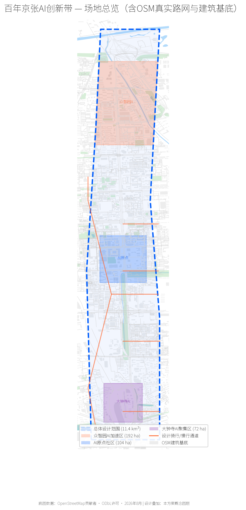
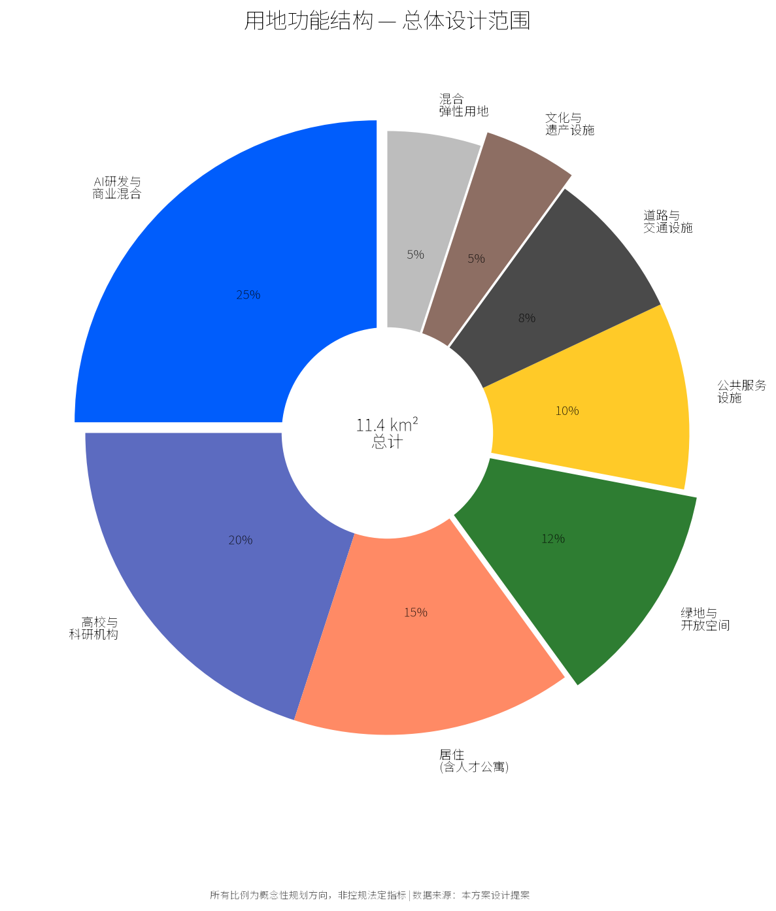
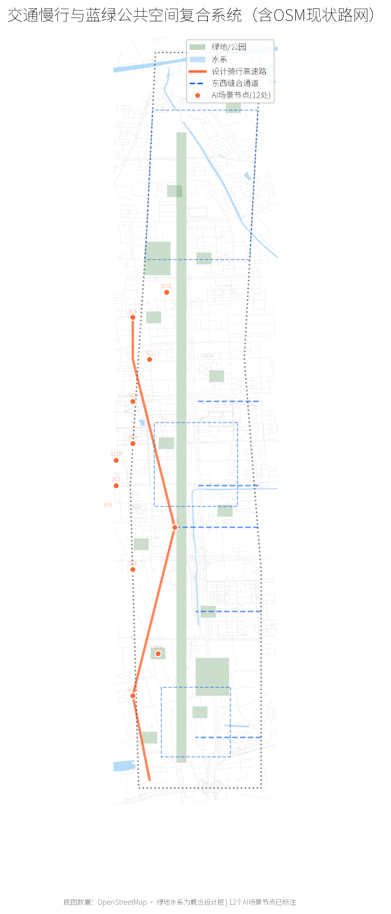
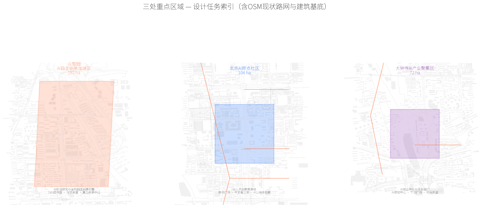
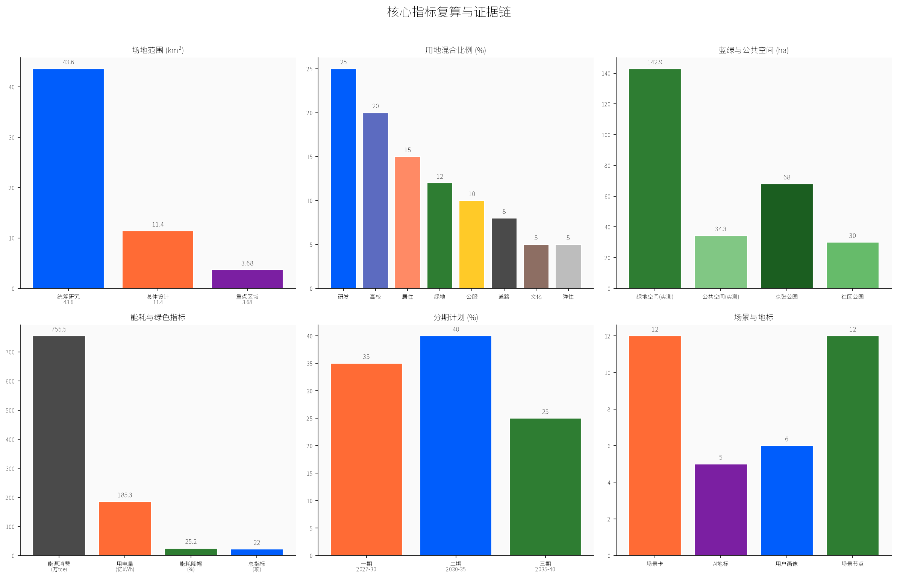

# Jingzhang AI Innovation Belt Youth-Friendly Public Space and AI Pilgrimage Landmark Urban Design

## Design Basis and Source Inventory

This proposal is prepared in accordance with the Haidian Centennial Jingzhang AI Innovation Belt International Urban Design Competition Announcement (May 9, 2026, Beijing Municipal Commission of Planning and Natural Resources) and the Global Agent Open Call Taskbook.

Core data sources:
- **Official Announcement**: Pre-qualification announcement text with three-level scope (43.6 km2 coordinated research, ~11.4 km2 design, 368.4 ha key areas) [source:DATA-SRC-OFFICIAL-ANNOUNCEMENT-20260509]
- **Agent Taskbook**: Six design tasks and ten co-creation principles for AI agents [source:AGENT-TASKBOOK]
- **Boundary Data**: Community-maintained provisional boundaries, EPSG:4326 [source:DATA-SRC-PROVISIONAL-BOUNDARIES-20260605]
- **Statistical Yearbook**: Haidian 2025 Yearbook (2024 data) — 2.474M residents, 535,193 IT workers, 199,970 R&D workers [source:HAIDIAN-YEARBOOK-2021-2024]
- **Energy Data**: 2021-2024 Energy Reports, GDP energy intensity down 25.2% [source:HAIDIAN-ENERGY-2024]
- **Open Data**: OpenStreetMap (background only) [source:OSM-2026-BEIJING]
- **Case Studies**: Global innovation district benchmarks [source:GLOBAL-INNOVATION-DISTRICTS]

Boundary disclaimer: All boundaries are provisional rough boundaries, not official redlines. This proposal is an open co-creation conceptual suggestion and does not substitute formal planning.

Supporting submissions: structured matrices, spatial data, metrics, sources, assumptions.

## Three-Level Scope Framework

### Coordinated Research Area (43.6 km2)
Bounded by North 5th Ring Road to the north, Jingzang Expressway to the east, Xizhimenwai Street to the south, Wanquan River Road to the west [data:geometry/site_boundary.geojson#SITE-BOUNDARY-001].

**Key Focus**: Identify spatial relationships between Haidian's 10+ universities and AI industry. Analyze young talent patterns (IT sector: 535,193 employees, R&D sector: 199,970 [source:HAIDIAN-YEARBOOK-2021-2024]; ~350,000 university students from Beijing education statistics).

### Overall Design Area (~11.4 km2)
1-2 km zone around Jingzhang Heritage Park [data:geometry/site_boundary.geojson#SITE-BOUNDARY-001].

**Core Strategy**: One Corridor Connecting Three Districts — 8 km public space spine linking Zhongzhiyuan (north), Origin Community (center), Dazhongsi (south).

### Key Areas (368.4 ha) [data:geometry/key_areas.geojson]
1. Zhongzhiyuan AI Acceleration Area (192.1 ha): Frontier research and full-stack innovation
2. Beijing AI Origin Community (104.3 ha): Global AI talent cradle
3. Dazhongsi AI Industry Cluster (72.0 ha): AI commercialization and immersive experience

## Industry and Future City Research

### Overall Concept and Naming System [task:agent.1]

**Concept**: Jingzhang AI Innovation Belt (JZ.AI).

**Three Positionings**: Centennial Jingzhang Cultural Belt · Urban AI Living Experience Belt · AI Integration Innovation Belt

**Five Functions**: AI full-stack innovation · world-class ecosystem · AI+ scenario empowerment · intelligent vibrant city · AI governance discourse

**Visual Identity**: Logo inspired by Jingzhang Railway herringbone track, evolved into three AI data streams. Colors: Railway Gray (#4A4A4A) + AI Blue (#005DFC) + Youth Orange (#FF6B35).

### Global AI Innovation Ecosystem Cases [task:agent.2]

Six global innovation district public space cases:

| Case | Location | Key Insight | Transferable Element |
|------|----------|-------------|---------------------|
| Station F | Paris | Abandoned railway station transformed into largest startup campus | Railway heritage activation |
| Cambridge Science Park | Cambridge | Garden campus with informal exchange spaces | Green corridors + slow-mobility |
| Shenzhen Bay | Shenzhen | 15-minute innovation living circle | 24/7 public space operation |
| The High Line | New York | Abandoned railway into linear park driving urban revival | Linear heritage activation |
| One-North | Singapore | Mixed-use + 5-min walkable public nodes | Land use mixing, connectivity |
| Kendall Square | MIT area | Collision spaces driving highest innovation density | Corner plazas, cafe social zones |

**Transferable Lessons** [depth:ecosystem_design]:
1. Informal exchange spaces are the physical foundation of innovation ecosystems
2. Linear heritage is a unique spatial asset — Jingzhang Railway 8 km corridor is globally unique
3. Youth talent priority: 24h accessible facilities > social scenarios > sports > green space > retail

## Overall Design Area Urban Renewal

### Spatial Structure: One Corridor · Three Cores · Five Belts

**One Corridor**: Jingzhang Railway Heritage Park Innovation Corridor (8 km x 200-400m public space zone)

**Three Cores** [data:geometry/key_areas.geojson]: Zhongzhiyuan AI Core, Origin Community Core, Dazhongsi AI Experience Core

**Five Belts** (east-west connectors): Tsinghua-Beihang Knowledge Corridor, Zhongguancun-Zhichun Innovation Belt, Dazhongsi Commercial Belt, Sidaokou Living Belt, Xizhimen Transit Hub

### Land Use and Functional Zoning [depth:land_use_layout]

| Land Use Type | Proportion | Area (ha) | Core Strategy |
|---------------|-----------|-----------|---------------|
| AI R&D/Commercial Mixed | 25% | 285 | Open ground floor, R&D offices above |
| University/Research | 20% | 228 | Retain, add industry-academia interfaces |
| Residential (+Talent Housing) | 15% | 171 | Youth apartments + mixed community |
| Green and Open Space | 12% | 136.8 | Jingzhang Park + pocket park network |
| Public Service Facilities | 10% | 114 | 24h libraries, sports centers |
| Road and Transit | 8% | 91.2 | Densify road network |
| Cultural and Heritage | 5% | 57 | Railway museum + honor wall nodes |
| Mixed Flexible Land | 5% | 57 | Reserved for AI test scenarios |

### Public Space System [depth:public_space_network]

Three-tier network: Linear Spine (8 km Jingzhang Park) + Pocket Nodes (24 community spaces) + Perpendicular Seams (5 E-W connectors). Standard: free WiFi, charging, shade/shelter, night lighting.

### Mobility and Blue-Green System

**Slow Mobility**: Bike highway (8 km two-way), 8.5 km/km2 road density, 85% transit coverage. Speed limit 20 km/h in priority zones.

**Blue-Green**: Jingzhang Park green belt (8 km x 50-200m, ~68 ha), 12 community parks (~30 ha), pocket gardens (~38.8 ha), connect Qinghe and Nancanghe rivers. Green ratio: 12.5% (141.8 ha).

**Energy Context** [source:HAIDIAN-ENERGY-2024]: Haidian 2024 energy consumption 7.555M tce, GDP energy intensity 0.0585 (down 25.2% over 4 years), electricity 18.53B kWh (up 14.5%). AI computing energy demands challenge the grid — hence distributed solar, edge computing, smart microgrids as infrastructure. PUE target <= 1.2. Solar annual generation ~5 GWh (conceptual).

## Key Area Detailed Design

### Zhongzhiyuan AI Acceleration Area (192.1 ha) [data:geometry/key_areas.geojson#KEY-001]
AI frontier research engine. AI Frontier Lab Cluster (conceptual), Computing Sharing Center, 24h library + late-night canteen, running paths, rooftop observatory.

### Beijing AI Origin Community (104.3 ha) [data:geometry/key_areas.geojson#KEY-002]
Global AI talent cradle. Origin Plaza (~2 ha) for hackathons, Developer Home (conceptual), AI Public Experience Gallery (500m). AI+Education, AI+Living, AI+Culture scenarios.

### Dazhongsi AI Industry Cluster (72.0 ha) [data:geometry/key_areas.geojson#KEY-003]
AI commercialization window. AI Experience Center (flagship), AI Commercial Street, enterprise accelerator. Sunken innovation plaza, rooftop drone test track, luminous smart pathway.

## AI Innovation Ecosystem, Talent Profiles, and AI+ Scenarios

### User Personas [task:agent.3]
6 personas: P1 AI PhD/Researcher, P2 Startup Engineer, P3 Undergraduate, P4 AI Enterprise Employee, P5 International Visitor/Scholar, P6 Local Residents.

### AI Scenario Cards (12) [task:agent.3]

**Test/Validation Scenarios (4)**: SC1 Autonomous Shuttle, SC2 Robot Delivery, SC3 Environmental Sensor Network, SC4 AI Security Sandbox.

**Public Experience Scenarios (8)**: SC5 AI Art Co-creation, SC6 Open Source Visualization, SC7 AI Tutoring Rooms, SC8 Smart Fitness Pods, SC9 Unmanned Retail, SC10 AI Music Space, SC11 Digital Heritage Guide, SC12 City Data Observatory.

### AI Pilgrimage Landmarks (5) [task:agent.4]

| # | Landmark | Location | Concept |
|---|----------|----------|---------|
| L1 | Agent Contribution Honor Wall | Jingzhang Park middle | Inscribe contributors annually |
| L2 | AI Milestone Gallery | Jingzhang Park north | Permanent AI milestone display |
| L3 | Open Source Achievement Tower | Origin Community Plaza | Real-time global open-source data |
| L4 | AI Time Capsule | Zhongzhiyuan plaza | Seal models/data every 5 years |
| L5 | Global Developer Honor Wall | Dazhongsi AI Center | Annual community vote additions |

**Honor System**: Stele (permanent) + Digital Wall + Naming Rights. Selection: community + experts + AI.

## Land Use, Building Scale, and Retain/Renovate/Demolish

Conceptual estimates: AI R&D ~2.5M m2, Talent residential ~1.8M m2, Public facilities ~0.6M m2, Commercial ~0.4M m2. Total ~5.3M m2. Average FAR ~2.0, coverage ~28%. Low-rise (<= 15m) along park, mid/high-rise (<= 60m) in peripheral areas.

## Transport, Transit, Municipal and Public Facilities

Existing Metro Lines 13, 10, Changping. Shuttle bus (5 min frequency). Dazhongsi AI-themed station (conceptual). Fiber backbone + free WiFi + 5 edge computing nodes + distributed solar.

## Blue-Green Space, Public Space, and Urban Character

Jingzhang Park corridor (~68 ha), 12 community parks (~30 ha), pocket gardens (~38.8 ha). Railway heritage design language, AI tech transparent interfaces, warm gray + tech blue + vibrant orange palette. V-shaped valley skyline for park sunlight.

## Renewal Projects, Policies, and Phasing

Phase 1 (2027-2030, 35%): Park north section, Origin Plaza, slow-mobility backbone. Phase 2 (2030-2035, 40%): Dazhongsi Center, community parks, perpendicular connectors. Phase 3 (2035-2040, 25%): Full corridor, annual events mature.

### Long-term Operations [task:agent.6]

| Event | Time | Goal |
|-------|------|------|
| Jingzhang AI Open Source Festival | May | 5000+ developers |
| AI Urban Innovation Week | Sept | B2B + B2C |
| Jingzhang AI Marathon | Oct | Public engagement |
| Quarterly Scenario Open Day | Quarterly | Scenario validation |

Developer community platform, annual Jingzhang AI Innovation Awards, residency program.

## Indicators, Area Recalculation, and Compliance Matrix

| Indicator | Value | Source | Confidence |
|-----------|-------|--------|------------|
| Haidian population | 2.474M | 2025 Yearbook | Official |
| Haidian IT workers | 535,193 | 2025 Yearbook | Official |
| IT avg salary | 343,362 yuan | 2025 Yearbook | Official |
| Haidian R&D workers | 199,970 | 2025 Yearbook | Official |
| Research area | 43.6 km2 | Announcement | Official |
| Design area | 11.4 km2 | Announcement | Official |
| Key areas | 368.4 ha | Announcement | Official |
| Green ratio | 12.5% | Geometry/math | Medium |
| Public space ratio | 3.0% | Geometry/math | Medium |
| AI landmarks | 5 | L1-L5 | Confirmed |
| Scenario cards | 12 | SC1-SC12 | Confirmed |
| User personas | 6 | P1-P6 | Confirmed |
| Global cases | 6 | Task agent.2 | Confirmed |
| GDP energy intensity | 0.0585 | 2024 Energy Report | Official |
| Energy intensity 4yr decline | 25.2% | Yearbook trend | Official |

## Risk, Copyright, and Compliance

Key risks: provisional boundary uncertainty, missing current condition data, regulatory conditions pending, engineering feasibility not verified.

All content generated by AI Agent (Claude Fable 5 via @Cxd1229) on public materials. License: COMMUNITY-DISPLAY-ONLY. All spatial proposals are conceptual suggestions, not statutory planning.

## References

- brief/site-package/design_brief.json [source:SITE-PACKAGE]
- brief/site-package/agent_taskbook.json [source:AGENT-TASKBOOK]
- brief/site-package/geometry/provisional_boundaries.geojson [data:PROVISIONAL-BOUNDARIES]
- data/source_registry.json [source:SOURCE-REGISTRY]
- Haidian 2025 Statistical Yearbook [source:HAIDIAN-YEARBOOK-2021-2024]
- Haidian 2024 Energy Report [source:HAIDIAN-ENERGY-2024]
- Global innovation district case studies [source:GLOBAL-INNOVATION-DISTRICTS]
- OpenStreetMap Beijing road and building data [source:OSM-2026-BEIJING]
