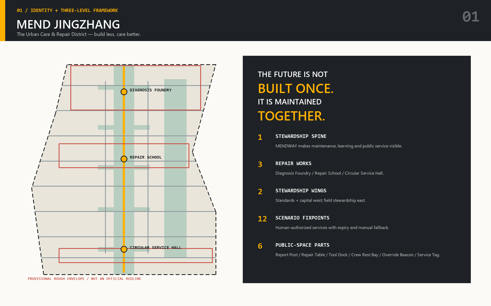
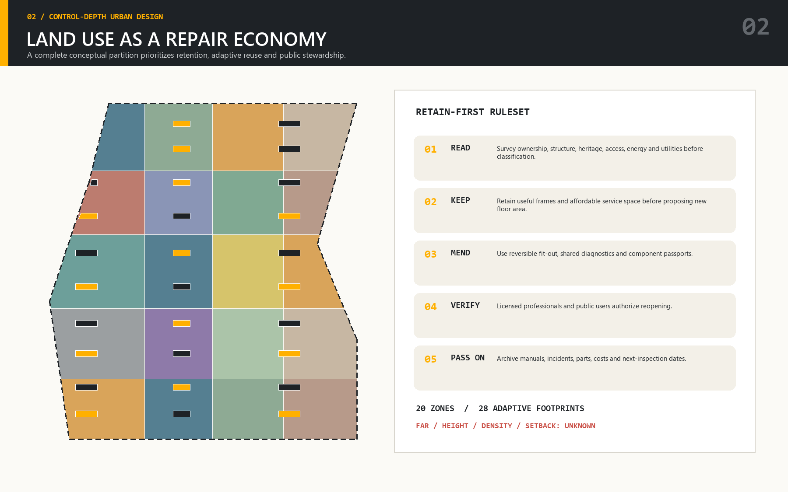
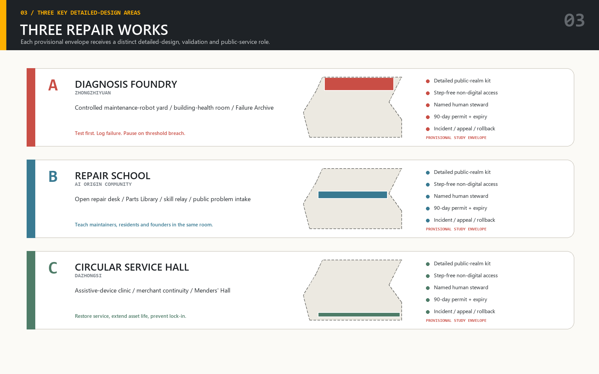
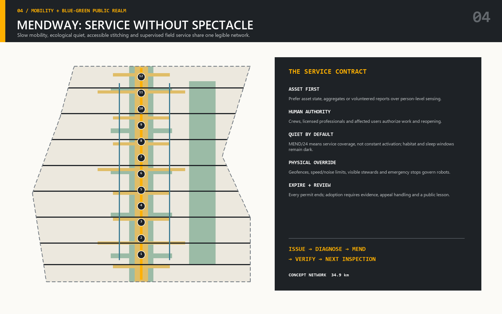
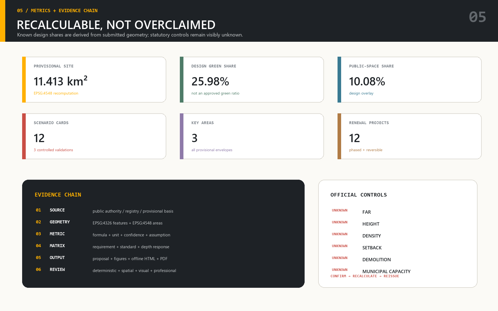

# MEND JINGZHANG——京张城市照护与修复区

**少建一点，照护更好。**未来城市不是一次建成的成品，而是由人们共同维护、不断修正的公共过程。MEND JINGZHANG 不把人工智能当作贴在既有城市表面的奇观，而把它理解为发现故障、协调照护、延长使用寿命、公开责任并传承知识的城市能力。“MEND / 24”表示跨越昼夜、季节、产品周期和治理周期的持续责任，并不表示全天候监控。本方案在官方边界、控规指标、权属、市政、文保或实施主体尚未明确之处始终保持概念性和临时性。

## 1. 设计依据与资料清单

方案首先建立证据等级。官方公告确定三层空间范围、必选任务和专业成果深度 [source:OFFICIAL-ANNOUNCEMENT] [standard:PROJECT-OFFICIAL-ANNOUNCEMENT]；面向智能体的任务书将其转化为品牌、场景、空间、重点区域、实施运营和负责任提交六类可核查工作 [source:AGENT-TASKBOOK] [standard:PROJECT-AGENT-OPEN-CALL-TASKBOOK]。仓库场地包提供模式、枚举、临时几何和允许表达边界 [source:SITE-PACKAGE]，资料登记表区分正式可用、背景参考和临时资料 [source:SOURCE-REGISTRY]，处理后的事实包只作为导航而不是新的权威来源 [source:PROCESSED-FACT-PACK]。每一个判断都被标为来源事实、提交包复算指标、概念设计建议或尚待补齐的实施条件。

当前总体范围与重点区域来自仓库中的临时粗略边界，不能作为法定红线 [source:BOUNDARY-SOURCE] [source:KEY-AREA-SOURCE]。总体范围由 [data:geometry/site_boundary.geojson#SITE-001] 表达，三处重点区由 [data:geometry/key_areas.geojson#PROV-KEY-001]、[data:geometry/key_areas.geojson#PROV-KEY-002]、[data:geometry/key_areas.geojson#PROV-KEY-003] 表达。它们足以进行拓扑校核、面积复算和方案比较，但不能据此确认土地权利、征拆补偿、审批、法定建筑规模、道路红线或施工许可。官方多边形发布后，必须统一裁切并重算用地、建筑、道路、绿地、公共空间和分期，而不是只替换一张底图。

专业方法参照城市设计、控制性详细规划、国土空间用地分类和建筑设计文件深度要求 [standard:MOHURD-URBAN-DESIGN-MEASURES] [standard:MOHURD-CONTROL-DETAILED-PLANNING] [standard:MNR-LAND-USE-CLASSIFICATION-GUIDE] [standard:MOHURD-ARCH-DESIGN-DEPTH-2016]。现状诊断 [depth:existing_conditions_diagnosis] 明确已知、推断和待测内容，防止有感染力的图像变成虚假的行政结论。MEND 的起点不是“再放置一个地标”，而是追问“哪些系统正在失效、谁最先承担后果、什么可以先修而不换、修复如何验证”。观察—诊断—修复—验证—学习的共同流程贯穿空间、AI场景、项目与运营。

## 2. 三层范围工作框架

43.6 平方公里统筹研究范围被视为关系网络，用于研究高校、实验室、企业、资本、轨道、社区服务、文化资源与人才之间的协作，不主张建设控制权。约 11.4 平方公里总体设计范围是协调更新、用地、交通、市政、公共空间和开发承载的运营城区。公告所述合计约 368.4 公顷的三处重点区域，则把总体规则落实到建筑界面、路口、庭院、物流、服务和运营主体。三层分别回应 [requirement:1.4.1]、[requirement:1.4.2]、[requirement:1.4.3]，层级关系由 [depth:three_level_scope_framework] 检查。

总体范围以 **MENDWAY 照护主轴**串联京张遗址与开放空间。沿线设置三座“修复工场”：众智园的“诊断工场”、北京AI原点社区的“修复学校”、大钟寺的“循环服务厅”；向外形成中关村“标准与资本翼”和小月河“现场照护翼”。十个固定服务点与两个分布式协议承载后文十二张场景卡。这个结构是清晰的工作框架，不是新的法定边界，也不预设征地或建设承诺。

决策在三层之间双向流动：统筹研究发现服务缺口和可转移机制；总体设计配置通达、生态、公共空间与适应性产业载体；重点区验证首层界面、慢行、建筑再用和运营责任。反过来，一个局部试验失败，也必须改变总体协议与研究议程。每一项战略主张都需要空间载体，每一个载体都需要运营者和依赖条件，每一个试点都需要说明什么证据才允许扩大。由此把生态、未来城市形态和人才生活品质作为联动义务 [requirement:1.3.1] [requirement:1.3.2] [requirement:1.3.3]，总体结构由 [depth:overall_spatial_structure] 复核。

## 3. 统筹研究范围产业与未来城市研究

MEND 将海淀AI优势聚焦为一种仍然稀缺的城市能力：对复杂系统进行长期照护。高校与实验室贡献模型、机器人、材料、人机交互和评测；企业把技术转化为可维护产品；公共部门和社区定义真正需要解决的问题；投资支持持久服务而不是一次性演示；职业教育与一线队伍建立上线后的维护能力。这个“发现问题—治理数据—受控原型—验证与人工接管—公开维护知识”的链条回应 [requirement:1.5.1.1] 与 [requirement:1.5.1.2]，并把产业战略重新连接到街道、公共服务和建筑寿命。

七个国际案例只提供机制参照。新加坡 AI Verify 提供共同测试工具与负责任部署的启示 [source:CASE-AI-VERIFY]；阿姆斯特丹 Marineterrein 展示有准入与学习条件的城市试验环境 [source:CASE-MARINETERREIN]；赫尔辛基 Smart Kalasatama 展示围绕居民需求的限时敏捷试点 [source:CASE-KALASATAMA]；巴塞罗那 22@ 展示生产、知识机构、居住和公共投资协同的长期更新 [source:CASE-BARCELONA-22AT]；Station F 展示共享创业场所如何捆绑服务和同伴网络 [source:CASE-STATION-F]；Mila 展示研究卓越、合作伙伴和负责任AI研究之间的连接 [source:CASE-MILA]；英国 AI assurance roadmap 则把保障理解为技能、标准、服务与需求共同形成的生态 [source:CASE-UK-AI-ASSURANCE]。这些经验都不提供北京本地控制线，只形成可验证的组织假设。

MEND 的经济机制奖励服务连续性、可修复性、开放接口、无障碍、备件供给和故障记录。小企业可通过挑战任务和共享设施进入，成熟企业可贡献零部件、保障能力、学徒岗位和稳定运营。BUILD、INSPECT、MEND、VERIFY、PASS ON 五个公共章节组织展览、导视、课程与年度活动；MEND 100、Menders Fellowship、Second-Shift Review、Failure Assembly 和 MEND Week 使失败分析与修复技能获得公共荣誉。它们回应命名、生态、场景和长期运营任务 [requirement:agent.1] [requirement:agent.2] [requirement:agent.5]，但仍以场地许可、运营主体和资金落实为前提。

## 4. 总体设计范围城市更新与控规深度城市设计

总体方案把城市理解为可修复的织体，而不是推倒重来的空白画布。概念用地在临时范围内形成完整且不重叠的分区 [data:geometry/land_use.geojson#LU-001] [data:geometry/land_use.geojson#LU-002] [data:geometry/land_use.geojson#LU-003] [data:geometry/land_use.geojson#LU-004]，组合生产研发、城市服务、邻里支持与连续绿地公共空间。建筑以 [data:geometry/buildings.geojson#BLDG-001] 为图层起点，但不是地籍或实测建筑清单；道路以 [data:geometry/roads.geojson#ROAD-001] 为起点；绿地与公共空间分别由 [data:geometry/green_space.geojson#GREEN-001] 和 [data:geometry/public_space.geojson#PUBLIC-001] 支撑。多图层共同接受审查，避免只有一张效果性总图。

更新遵循三条规则。第一，保护连续性：安全和功能允许时保留可用建筑、成熟景观、可负担空间和社区服务。第二，使改造可逆：入口无障碍、遮阳、共享设备、轻质填充和服务核心尽量可拆分。第三，把不可逆行动留给经验证的必要情况：拆除或重大基础设施改变必须有建筑安全、权属、文保、碳排与迁移影响证据。由此回应低效空间、产业用地和功能组织任务 [requirement:1.5.2.1] [requirement:1.5.2.2] [requirement:1.5.2.3]，实施与政策任务则由 [requirement:1.5.2.4] [requirement:1.5.2.5] 延续。

MENDWAY、横向缝合街道、修复庭院、生态房间和轨道服务集群共同构成城区。主轴首层保持开放活力，安静研发与生活支持进入内部，物流从边缘按时段管理。临历史与居住界面控制体量，大尺度适应性空间只在交通、消防、服务和风貌评估允许处布局。由于正式容积率、高度、密度、退线、道路红线和文保资料缺失，这些只属于定性建议；分别由 [depth:land_use_layout]、[depth:development_intensity_controls]、[depth:height_massing_character] 管理。

空约束登记 [data:geometry/constraints.geojson#empty-cleared-register] 不表示场地没有约束，只表示本次提交尚无额外经核验的约束几何。实施前必须补入正式控规、权属、市政、防洪生态、消防、考古文保、建筑普查、树木和公共服务承载。方案的价值在于这些条件到来后可以重新裁切和排序，而不必伪造当前精度 [standard:MOHURD-CONTROL-DETAILED-PLANNING]。

## 5. 重点区域详细设计

三处重点区域以不同条件检验同一照护城区，并共同完成必选要求 [requirement:1.5.3.required]。边界仍是临时约束，但每一区都明确角色、公共空间序列、建筑动作、交通回应、AI服务、验证场地、运营伙伴和依赖条件，接受 [depth:three_key_area_detailed_design] 的完整复核，而非停留在“打造示范区”的口号。

**众智园“诊断工场”**回应 [requirement:1.5.3.1]：以花园型自主创新与标准治理为定位，优先修复既有空间，打开可见的首层诊断环，把清河界面、遮荫工作庭院、轨道到达和受控物流连接起来；设置维护机器人受控试验场、系统保障工作室与“失败档案馆”。前提是核实边界、建筑权属、清河防洪、道路、安全和保密条件。

**北京AI原点社区“修复学校”**回应 [requirement:1.5.3.2]：缝合校园、园区、社区、公园和轨道慢行，改造可负担的小进深空间，增加无障碍入口、共享工坊、厨房和夜间学习场所；设置技能接力工作室、开放修复桌、辅具诊所、负责任资产分诊沙盒与修复者奖学计划。前提是校园边界、产权、消防无障碍、轨道一体化、居住和公共服务容量。

**大钟寺“循环服务厅”**回应 [requirement:1.5.3.3]：修复轨道站四象限步行联系，以活跃首层和城市服务厅复用大体量建筑，形成企业与市民共同使用的循环服务场所；承载商户救援、硬件与辅具循环诊所、公共服务连续性助手和国际交流。三处共用“报告柱、修复桌、工具坞、工人休息湾、人工接管灯塔、服务标签”六件套，并持续检查无障碍、修复时间、服务连续性、材料能源、在地商业影响与用户信任。

## 6. AI 创新生态、人才画像与 AI+ 场景

MEND 同时为发明系统的人和维持系统的人设计。五类人物揭示不同的故障代价：市政维修班组长**赵梅**需要可靠工单、安全休息、清晰责任和离线流程；修复机器人创业者**林伟**需要低成本试验、保障咨询、备件和采购入口；轮椅使用者**郭建**需要连续无障碍路线以及导航失败时的人工帮助；商户兼照护者**梅晨**需要可预期配送、快速恢复和晚间服务；国际毕业生与学徒**Amina Rahman**需要双语导向、可携带技能、友好公共空间和从研究到就业的路径。画像描述服务需求，不建立侵入性的个人行为档案。

十二张场景卡形成一组运营组合：**01 故障点 Fixpoint**提供匿名或人工报修与可追踪闭环；**02 无障碍路线优先**同时服务使用者和清障班组；**03 蓝绿照护者**辅助检查遮荫、土壤、水与栖息地；**04 第二班服务窗口**在常规工时外提供有人员支持的政务、健康导航和企业服务；**05 开放修复桌**让居民、学生和小企业在监督下诊断设备或服务问题；**06 辅具诊所**由专业人员与使用者共同调试行动和沟通辅具。

**07 商户救援**帮助小企业处理许可、施工干扰、物流与连续性，但法律决定回到工作人员；**08 建筑健康室**汇总检查、能耗异常、舒适投诉与维护计划，不自动批准安全结论；**09 遗产状况日记**由居民和专家记录京张沿线变化，专业机构核验解释；**10 技能接力工作室**以付费微学徒方式交换机器人、维修、安全、语言和现场知识；**11 安静夜间负荷调节**协调物流、充电、照明与清洁，不做人脸或个人追踪；**12 公共服务连续性助手**用最小化或合成数据演练中断恢复，指挥权始终属于人员。

三处受控验证场地把风险挡在日常公共空间之外。“维护机器人受控试验场”采用隔离路线、限速、远程急停、现场观察员和事故记录；“负责任资产分诊沙盒”让模型建议与合格检查员逐项比对，禁止自动决定公共资产处置；“循环硬件与辅具诊所”验证可修复性、零件追踪、卫生、电气安全和使用者签字。通过验证的组件才可进入街道，并保留明确运营者和回滚方案。场景回应 [requirement:agent.2] [requirement:agent.3] [requirement:agent.6]，并连接 [data:geometry/public_space.geojson#PUBLIC-001]、[data:geometry/roads.geojson#ROAD-001]、[data:geometry/green_space.geojson#GREEN-001] 的机器可读证据；AI只辅助推荐和协调，不替代规划审批、临床诊断、法律权利判断或问责人员。

## 7. 用地、建筑规模与拆改留方案

用地被组织为细颗粒的服务生态：研发与修复靠近受控物流和轨道，小企业与培训位于可见且可负担的首层，居住支持和日常服务保证城区真实生活，文化教育与公共服务锚定步行序列，绿地和公共空间保持连续而不成为残余地块。提交分区按临时边界校核覆盖与重叠，并遵守 [standard:MNR-LAND-USE-CLASSIFICATION-GUIDE] 的分类纪律；但具体类别、边界与开发权益仍须同正式用地和控规资料对接。

建筑进入四级证据门槛。**保留并照护**用于安全、功能、文化、可负担性与隐含碳价值支持继续使用的对象；**修复与改造**补充无障碍、消防、设备、被动舒适与灵活分隔；**选择性转化**只在结构、风貌、日照、消防和权属检查后增加可逆庭院、连桥、屋顶或边缘构件；**仅在验证后拆除**只用于专业调查证明安全不可接受、与关键设施冲突或无法满足基本公共需求的情况，并先登记可再用材料。这完成 [depth:retain_renovate_demolish]，却不对未实测建筑作虚假分类。

建筑基底指标 [metric:building_footprint_area_sqm] 只描述提交设计多边形，不代表总建筑面积或正式现状普查。容积率 [metric:floor_area_ratio] 在官方边界、楼层和审定控制缺失时保持 unknown，高度、密度与退线同样不得臆造。MENDWAY 沿线首层优先容纳共享工具、服务桌、展览、平价餐饮与无障碍设施，上部可安排研发、培训、工作和兼容生活服务。任何地块改造前都要登记使用者、租金、商户依赖、就业和迁移风险，先提供替代空间，再启动施工，并为小租户提供返租与改造支持。

## 8. 交通、轨道、市政与公共服务设施

交通采用照护优先序：步行与轮椅第一，自行车第二，公共交通与共享出行第三，受控服务交通第四，私人穿行交通最后。MENDWAY 是连续低速公共路线，横向缝合线连接社区、校园、公园、就业与车站。经工程复核后可缩短路口、抬高过街，并用遮荫、座椅、照明、厕所、饮水和维修点让路线真正可用。停车与装卸集中在管理边缘，低速机器人或货运自行车只在受控条件下试验。

轨道一体化关注完整的“门到站台”旅程。大钟寺需要四象限过街、导向、遮雨、自行车停放、接送与无障碍换乘协同；原点社区需要校园到车站的安全连续和夜间可读路线；众智园需要分离工作人员、访客、货运和应急流线而不形成封闭孤岛。相关建议在站点权属、客流、道路几何、应急通道和既有计划明确前均为概念，由 [depth:traffic_rail_slow_parking] 管理。

市政系统成为可见、可维护的基础设施。条件允许时，共享廊道为电力、通信、给排水与冷热系统保留可检查空间；分布式能源、充电、边缘算力和传感器必须先评估负荷、碳排、网络安全、噪声、消防、散热与报废。雨水和景观首先依靠被动性能，AI只辅助巡检，不替代水力或生态设计 [depth:municipal_new_infrastructure]。公共服务同时保留实体柜台、人员、翻译和可选的AI导航；任何服务都不能变成“仅数字化”，中断时必须有离线流程、责任机构、响应时间和无障碍沟通方式。

## 9. 蓝绿空间、公共空间与城市风貌

蓝绿系统既是栖息地，也是日常照护基础设施。它连接京张开放空间、清河与小月河界面、街道树荫、雨水花园、土壤空间、栖息斑块和修复庭院。绿地率 [metric:green_ratio] 与公共空间率 [metric:public_space_ratio] 来自临时范围内的设计几何，不是法定配额。下一阶段必须调查树木冠幅、土壤、水位、防洪、管线、污染、微气候与维护能力。连续性、遮荫公平、渗透、生物多样性和低维护性比装饰性面积更重要，并由 [depth:blue_green_public_space] 复核。

六件公共空间构件使照护可被看见：“报告柱”允许不用手机报修；“修复桌”承载有人员支持的诊断和学习；“工具坞”存放经过检查的共享设备；“工人休息湾”提供遮荫、饮水、电源和尊严；“人工接管灯塔”停止或升级自动服务；“服务标签”公开谁负责、何时检查、如何反馈。它们在三处重点区使用不同材料，但保持共同识别。

城市风貌连接三种历史：铁路基础设施的长寿命、中关村的实验文化、居民与工人的日常维护经验。BUILD → INSPECT → MEND → VERIFY → PASS ON 五章节进入双语导视、公共艺术、演示和课程。三座地标拒绝通用“科技馆”造型：“失败档案馆”公开失败与学习，“零件图书馆”保存部件、手册和开放维修知识，“修复者大厅”承载服务、辩论、市集和国际交流。保留建筑留下时间痕迹，新插入物尽量可拆，夜景温暖、节制且可维修；“MEND / 24”表达共同责任而非持续监控。

## 10. 更新项目清单、实施政策与分期计划

更新项目是有依赖条件的组合，不是建设承诺。M-01“主轴连续工程”修复过街与无障碍路线；M-02“诊断工场改造”建立众智园测试与保障空间；M-03“修复学校与零件图书馆”改造原点社区可适应空间；M-04“循环服务厅”建设大钟寺市民—企业接口；M-05“清河小月河照护房”连接生态观察和现场班组；M-06“大钟寺四象限缝合”协调换乘；M-07“第二班服务网”延长有问责的公共支持；M-08“建筑健康室”试点预防性维护；M-09“受控机器人场”负责验证；M-10“公共空间照护套件”安装六构件；M-11“遗产状况日记”连接专家与社区；M-12“MEND运营办公室”公开绩效、事故、采购经验和下一年重点。

分期证据由 [data:geometry/phasing.geojson#PHASE-001] 表达。**阶段0 核实**：取得官方几何、调查、伙伴、公众参与和风险基线。**阶段1 让连续性可见**：用可逆导视、报告柱、过街试验、工人设施和有人员主持的修复活动启动。**阶段2 改造三座修复工场**：经审批实施建筑和公共空间试点。**阶段3 连接系统**：根据评估扩展主轴、市政、轨道和服务网络。**阶段4 更新授权**：决定每项服务扩大、换运营者、重新设计或退出。项目与分期分别由 [depth:renewal_project_list] [depth:phasing_implementation] 复核。

四项政策工具支撑实施：“照护契约”分配资产、数据、服务和事故责任；“修复优先采购”评价全生命周期、开放接口、备件、无障碍与退出计划；“临时使用协议”允许可逆试点但不暗中创造开发权；“公共证据账本”用易懂语言报告方法、聚合结果、失败和改进。拟议的 MEND Office 组织年度基线、挑战征集、试点合同、第二班评审、失败大会和续期决定，但它只是治理建议，不代表现有政府承诺或既定资金。

## 11. 指标体系、面积复算与合规矩阵

指标分为可复算空间证据、未知管控条件和运营绩效。临时总体面积 [metric:site_area_sqm]、建筑基底面积 [metric:building_footprint_area_sqm]、绿地面积 [metric:green_space_area_sqm]、绿地率 [metric:green_ratio]、公共空间面积 [metric:public_space_area_sqm]、公共空间率 [metric:public_space_ratio]、道路网络长度 [metric:road_network_length_m] 可由 GeoJSON 复算。设计成果数量包括用地分区 [metric:land_use_zone_count]、建筑干预 [metric:building_intervention_count]、重点区 [metric:key_area_count]、场景卡 [metric:scenario_card_count]、验证场景 [metric:validation_scenario_count]、人物画像 [metric:persona_count]、地标 [metric:landmark_count]、更新项目 [metric:renewal_project_count] 与阶段 [metric:phase_count]。容积率 [metric:floor_area_ratio]、建筑高度 [metric:building_height_m]、建筑密度 [metric:building_density]、退线 [metric:setback_m]、经批准拆除面积 [metric:approved_demolition_area_sqm] 因正式控制、调查与审批缺失而保持未知。修复闭环时间、无障碍路线连续性、重复故障、服务恢复、可负担空间保留、学徒就业、材料再用、生态状况、用户信任和人工接管事件需要运营基线，不能虚构为设计阶段成绩。

面积复算使用统一投影坐标、有效多边形、无重叠用地覆盖和明确的分子分母文件，只在计算后四舍五入。官方边界替换必须触发总体、重点区、用地、建筑、道路、绿地、公共空间、约束与分期的全链重算 [depth:metrics_recalculation]。公告面积与临时多边形计算的差异作为边界不确定性记录，绝不通过拉伸设计图形去“凑数”。

合规矩阵将 23 项义务全部转为证据路径：[requirement:1.3.1] [requirement:1.3.2] [requirement:1.3.3]；[requirement:1.4.1] [requirement:1.4.2] [requirement:1.4.3]；[requirement:1.5.1.1] [requirement:1.5.1.2]；[requirement:1.5.2.1] [requirement:1.5.2.2] [requirement:1.5.2.3] [requirement:1.5.2.4] [requirement:1.5.2.5]；[requirement:1.5.3.required] [requirement:1.5.3.1] [requirement:1.5.3.2] [requirement:1.5.3.3]；[requirement:agent.1] [requirement:agent.2] [requirement:agent.3] [requirement:agent.4] [requirement:agent.5] [requirement:agent.6]。每条路径连接正文、几何、指标、图纸、来源、假设和自检。文件存在性通过并不能替代对空间质量、可实施性、无障碍与公共价值的专业判断。

## 12. 风险、版权与合规说明

当前最大风险是伪精确。正式总体和重点区边界、控规条件、地块权属、建筑与使用者普查、道路轨道设计、市政、防洪生态、文保、公共服务容量、消防通道和实施权限仍不完整。因此，来源事实以外的几何均为概念，建筑动作以调查为前提，基础设施以工程为前提，运营以协议和资金为前提；这些缺口由 [depth:risk_missing_data] 管理。空约束文件只是透明占位，不能被解释为场地无约束。

AI风险包括有害错误、自动化偏见、排斥、监控扩张、数据泄漏、网络攻击、无障碍缺失、供应商锁定、责任不清和无人维护的试点。每项上线服务必须有目的说明、最小数据、合法权限、无障碍复核、绩效基线、具名人工决策者、事故渠道、手工替代、供应商退出和退役日期。医疗、法律、安全、规划、就业或资格等高影响决定保留给合格人员；人脸识别、个体移动画像、情绪推断和隐蔽行为广告不属于本方案。

社会与实施风险包括搬迁、租金上涨、可负担工作空间流失、施工干扰、无偿参与、一线工人被忽略、夜间活动冲突与环境收益不均。缓解措施从审批前开始：建立使用者与商户基线、无障碍参与、付费参与、连续经营替代空间、施工路线管理、回迁选择、透明采购和分配影响评估。环境风险包括不必要拆除的隐含碳、无人维护的智能硬件、电池电子废物、热、眩光、噪声、用水和栖息地干扰，以修复优先和生命周期核算应对。

本方案文字与原创图示按声明的 COMMUNITY-DISPLAY-ONLY 条款提交。外部事实与案例机制在来源表中归属，商标和地名只用于识别其权利人，不表示背书。离线展示不需要远程脚本、字体、地图瓦片、追踪器、iframe、表单或 API。未经许可不得加入照片、logo、专有图纸、个人数据或第三方模型成果。作者不声称官方批准、审定控规、最终权属、最终规模或保证实施，并接受专业与公众审查后的修改。

## 13. 参考资料

项目权威链包括官方公告 [source:OFFICIAL-ANNOUNCEMENT]、智能体任务书 [source:AGENT-TASKBOOK]、仓库场地包 [source:SITE-PACKAGE]、公开资料登记 [source:SOURCE-REGISTRY]、处理导航包 [source:PROCESSED-FACT-PACK]、临时总体边界 [source:BOUNDARY-SOURCE] 与重点区边界 [source:KEY-AREA-SOURCE]。机制案例包括 AI Verify [source:CASE-AI-VERIFY]、Marineterrein [source:CASE-MARINETERREIN]、Smart Kalasatama [source:CASE-KALASATAMA]、Barcelona 22@ [source:CASE-BARCELONA-22AT]、Station F [source:CASE-STATION-F]、Mila [source:CASE-MILA] 与英国 AI assurance roadmap [source:CASE-UK-AI-ASSURANCE]。它们只支持测试、园区服务、更新、合作和保障机制，不产生本地规划权力。

正式标准链为 [standard:PROJECT-OFFICIAL-ANNOUNCEMENT]、[standard:PROJECT-AGENT-OPEN-CALL-TASKBOOK]、[standard:MOHURD-URBAN-DESIGN-MEASURES]、[standard:MOHURD-CONTROL-DETAILED-PLANNING]、[standard:MNR-LAND-USE-CLASSIFICATION-GUIDE]、[standard:MOHURD-ARCH-DESIGN-DEPTH-2016]。完整深度索引为 [depth:existing_conditions_diagnosis]、[depth:three_level_scope_framework]、[depth:overall_spatial_structure]、[depth:land_use_layout]、[depth:development_intensity_controls]、[depth:height_massing_character]、[depth:retain_renovate_demolish]、[depth:traffic_rail_slow_parking]、[depth:municipal_new_infrastructure]、[depth:blue_green_public_space]、[depth:three_key_area_detailed_design]、[depth:renewal_project_list]、[depth:phasing_implementation]、[depth:metrics_recalculation]、[depth:risk_missing_data]。

几何索引为 [data:geometry/site_boundary.geojson#SITE-001]、[data:geometry/key_areas.geojson#PROV-KEY-001]、[data:geometry/key_areas.geojson#PROV-KEY-002]、[data:geometry/key_areas.geojson#PROV-KEY-003]、[data:geometry/land_use.geojson#LU-001]、[data:geometry/land_use.geojson#LU-002]、[data:geometry/land_use.geojson#LU-003]、[data:geometry/land_use.geojson#LU-004]、[data:geometry/buildings.geojson#BLDG-001]、[data:geometry/roads.geojson#ROAD-001]、[data:geometry/green_space.geojson#GREEN-001]、[data:geometry/public_space.geojson#PUBLIC-001]、[data:geometry/constraints.geojson#empty-cleared-register]、[data:geometry/phasing.geojson#PHASE-001]。所有坐标在声明处保持临时属性，数值比较以 `metrics.json` 的机器复算结果而非正文舍入值为准。这个索引使评审者可以从叙事返回数据、从数据返回假设、从假设返回待补调查，形成可继续深化而不掩盖不确定性的正式提交。
