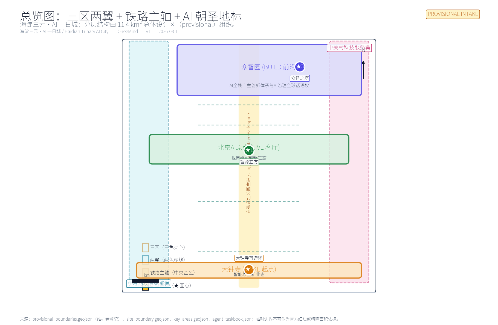
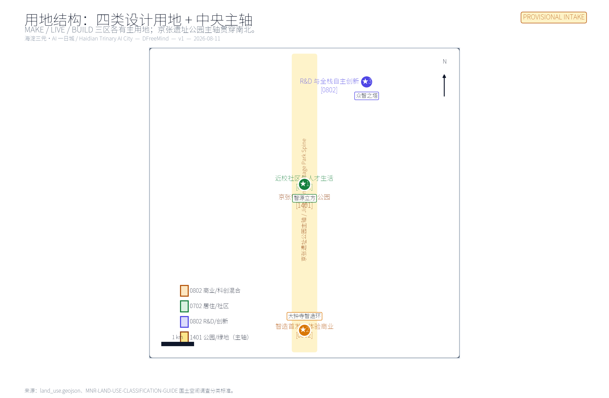
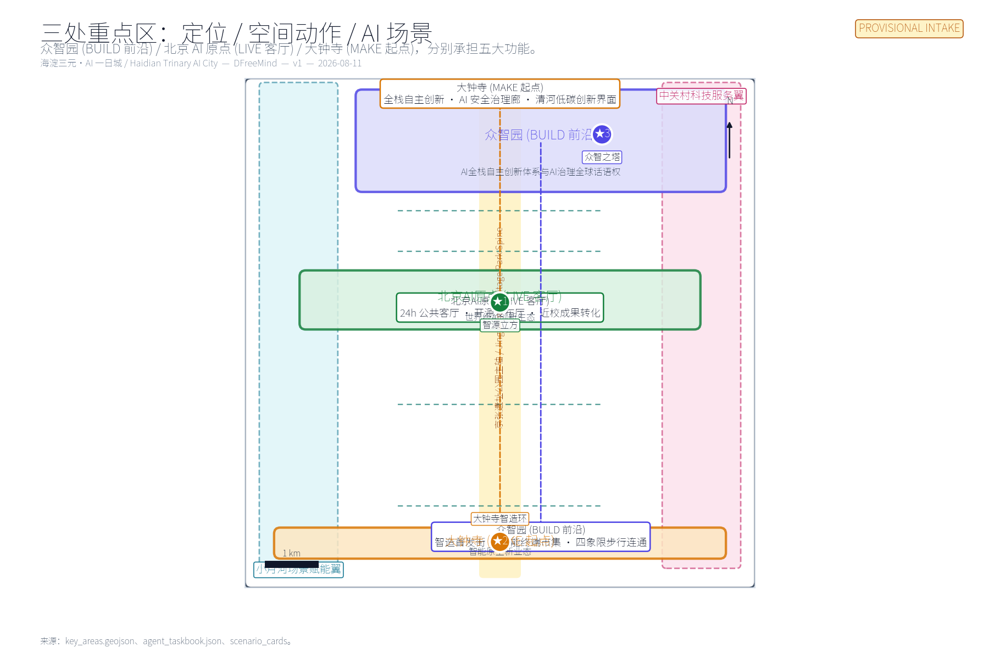
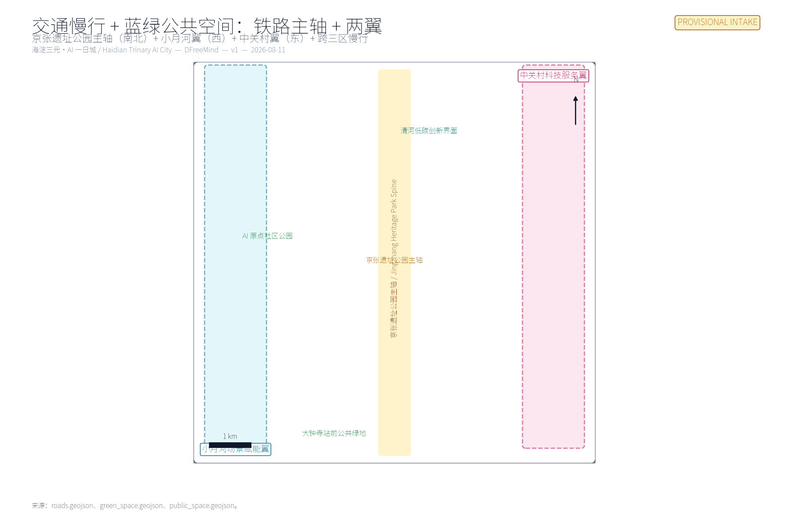
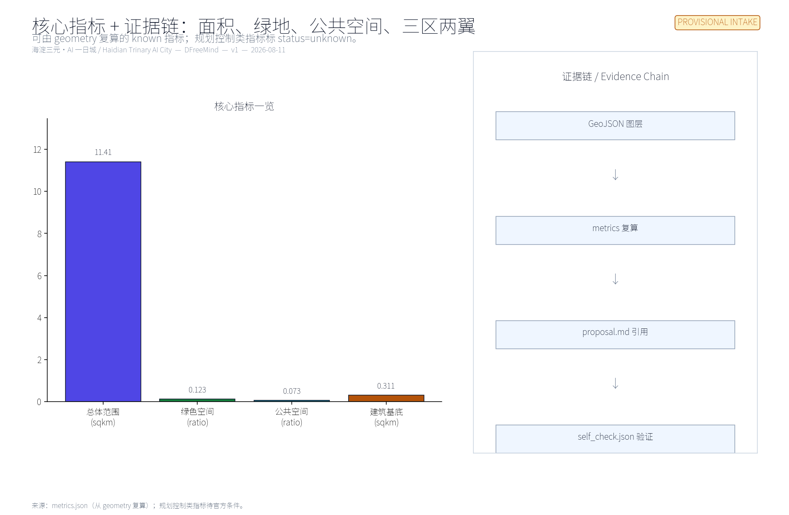

# Haidian Trinary AI City

> **Direction B** — Treat the 11.4 km² overall design area as a 24-hour life laboratory for an AI practitioner. The three key areas are not three isolated parks; they are three consecutive phases of one day: **make in the morning (Dazhongsi) → live and collaborate at noon (AI Origin) → build and govern in the evening (Zhongzhiyuan)**. The west wing (Xiaoyuehe Scenario Empowerment) carries "AI+ scenarios"; the east wing (Zhongguancun Technology Service) carries "global element allocation".

## 0 · Design basis and source inventory

This formal submission takes the **Prequalification Announcement of the Centennial Jing-Zhang AI Innovation Belt Urban Design International Open Call** issued by the Haidian Branch of Beijing Municipal Commission of Planning and Natural Resources (2026-05-09) as the first-order source [source:OFFICIAL-ANNOUNCEMENT], and the machine-readable artefacts in `brief/site-package/` (`design_brief.json`, `agent_taskbook.json`, `allowed_design_space.json`, `sources.json`, `enums/`, `ranges/`, `schemas/`, `data/source_registry.json`, `data/processed/agent_fact_pack.md`) as the auditable substrate [source:SITE-PACKAGE] [source:SOURCE-REGISTRY] [source:PROCESSED-FACT-PACK].

`data/source_registry.json` lists 8 sources: 7 formal-usable, 1 background, 1 provisional. We use `official_public` and `user_provided_cleared` sources for formal claims, and `provisional_repository_data` for the temporary boundary and geometry. Background-only, provisional-only, and needs-official-file material is **not** promoted into formal conclusions [source:SOURCE-REGISTRY].

The announcement and taskbook call for "urban-design depth equivalent to regulatory detailed planning" and "urban-design depth equivalent to comprehensive plan implementation" [standard:PROJECT-OFFICIAL-ANNOUNCEMENT] [standard:PROJECT-AGENT-OPEN-CALL-TASKBOOK]. We use "concept proposal / reference scheme / for professional teams to deepen" as the uniform wording boundary; this submission does not replace formal planning, does not constitute government approval, and does not overstep statutory review [standard:CHARTER-CONCEPT-BOUNDARY].

### 0.1 Three scope levels and three key areas

The announcement allocates 43.6 km² as **coordinated research scope**, 11.4 km² as **overall design scope** (where this submission's primary layers live), and 368.4 ha as **key detailed-design scope** (three detailed design districts). The three key districts enter this submission as provisional polygons and must be marked "pending official data" [data:geometry/site_boundary.geojson#SITE-001] [data:geometry/key_areas.geojson#PROV-KEY-001] [data:geometry/key_areas.geojson#PROV-KEY-002]。   [data:geometry/key_areas.geojson#PROV-KEY-003] [metric:site_area_sqm] [metric:key_area_count]。   [depth:three_level_scope_framework].

### 0.2 Boundary and data status

The intake-readiness state of this scaffold is: **provisional boundary, precision warning retained, recalculation pending official data release; intake scoring not blocked**. When official `SITE_BOUNDARY` and three `KEY_AREA` polygons are published, site boundary, key areas, land use, buildings, roads, green space, public space, phasing, and metrics must be regenerated via `scripts/scaffold_ai_submission.py`; single-file replacement is not acceptable [data:geometry/site_boundary.geojson#SITE-001] [depth:overall_spatial_structure].

## 1 · Three positionings · Five functions · Three zones two wings

### 1.1 Three positionings [source:AGENT-TASKBOOK]

| Positioning | How it lands in the Trinary |
| --- | --- |
| Centennial Jing-Zhang Cultural Belt | The Jingzhang heritage park spine runs N-S through all three zones: "1909 industrial first line → present AI first line" continuity |
| Urban AI Life Experience Belt | LIVE Living Room (AI Origin) 24h public living room + the two wings' scenario nodes form "daily, experienceable AI" |
| AI Convergence Innovation Belt | BUILD Frontier (Zhongzhiyuan) full-stack innovation + MAKE Origin (Dazhongsi) smart-native new business forms together form "industrially actionable AI" |

### 1.2 Five functions [source:AGENT-TASKBOOK]

- **Full-Stack AI Independent Innovation System** → BUILD Frontier (Zhongzhiyuan)
- **World-Class AI Innovation Ecosystem** → LIVE Living Room (AI Origin Community)
- **AI+ Scenario Empowerment New Paradigm** → Xiaoyuehe Scenario Empowerment Wing (west) + cross-zone nodes
- **Smart AI Vibrant City** → LIVE Living Room (24h) + adjacent community services
- **Global AI Governance Discourse Power** → BUILD Frontier (Zhongzhi Tower + AI Safety Governance Gallery)

### 1.3 Three zones two wings coordination loop

| Node | Role | Core moves | Evidence |
| --- | --- | --- | --- |
| Zhongzhiyuan AI Acceleration Area (192.1 ha) | BUILD Frontier · full-stack + governance | R&D block, Qinghe low-carbon innovation edge, Zhongzhi Tower | [data:geometry/key_areas.geojson#PROV-KEY-001] [depth:three_key_area_detailed_design] |
| Beijing AI Origin Community (104.3 ha) | LIVE Living Room · world-class ecosystem | 24h public living room, open-source release hall, near-campus translation | [data:geometry/key_areas.geojson#PROV-KEY-002] [source:AGENT-TASKBOOK] |
| Dazhongsi AI Industry Cluster (72.0 ha) | MAKE Origin · smart-native new business forms | Debut street, smart-terminal market, 4-quadrant public living room | [data:geometry/key_areas.geojson#PROV-KEY-003] [metric:key_area_count] |
| Xiaoyuehe Scenario Empowerment Wing (west) | Scenarios & vibrant city | AI+ block pilots, low-carbon energy, walkability seam | [data:geometry/green_space.geojson#GREEN-001] [data:geometry/roads.geojson#ROAD-WING-W] |
| Zhongguancun Technology Service Wing (east) | Elements & capital | Compact governance for capital / IP / talent / data | [data:geometry/roads.geojson#ROAD-WING-E] [data:geometry/public_space.geojson#PUBLIC-LIVE-02] |

## 2 · Overall design scope — urban renewal at regulatory-plan urban-design depth

The 11.4 km² overall design scope uses **continuity** as the renewal principle; it does not win by isolated demolish/keep decisions [standard:MOHURD-URBAN-DESIGN-MEASURES] [standard:MOHURD-CONTROL-DETAILED-PLANNING] [depth:land_use_layout]。   [depth:retain_renovate_demolish]:

1. **Central spine = Jingzhang Heritage Park**: from 1909 rails (railway memory) to the AI public living room (Zhiyuan Cube), N-S continuity, forming "1909 industrial first line → present AI first line" continuity narrative.
2. **Two wings = Scenarios + Services**: West wing Xiaoyuehe runs "AI+ block" pilots; east wing Zhongguancun runs "IP+ capital + talent" element allocation. The two wings do not draw new red lines; they are stitched by walkability, green space, and public space.
3. **Three zones = three rhythms**: MAKE is the debut and manufacturing end (fastest tempo); LIVE is the 24h public living room (gentle tempo); BUILD is R&D and governance (slowest tempo). The three rhythms are linked by a "morning → noon → evening" path within the same day.

Land use fully covers the boundary without overlap [data:geometry/land_use.geojson#LU-MAKE-01] [data:geometry/land_use.geojson#LU-LIVE-01] [data:geometry/land_use.geojson#LU-BUILD-01]。   [data:geometry/land_use.geojson#LU-HERITAGE-01]; building footprints are tiered as keep / renovate / pilot-new [data:geometry/buildings.
geojson#BLDG-MAKE-01] [data:geometry/buildings.geojson#BLDG-LIVE-01] [data:geometry/buildings.geojson#BLDG-BUILD-01]。   [depth:height_massing_character]; transport is structured as Jingzhang spine + two wings + cross-trinary walkability [data:geometry/roads.geojson#ROAD-SPINE] [data:geometry/roads.geojson#ROAD-WING-W] [data:geometry/roads.geojson#ROAD-WING-E]。   [depth:traffic_rail_slow_parking]; municipal and public services follow "public space first, light facilities early, formal engineering preconditions documented" [data:geometry/constraints.geojson#CONSTRAINTS] [depth:municipal_new_infrastructure].

## 3 · Key area detailed design

### 3.1 Dazhongsi AI Industry Cluster — MAKE Origin

**Positioning**: debut field for smart-native new business forms.  
**Spatial moves**: 4-quadrant walkability around the rail station; station-front public living room as a reusable debut venue; renewal runs in lockstep with anchor-firm public environment upgrades [data:geometry/public_space.geojson#PUBLIC-MAKE-01] [data:geometry/buildings.geojson#BLDG-MAKE-01].  
**AI scenarios**: debut street, smart-terminal market, data-element theatre, 4-quadrant public living room (scenarios 01, 02).  
**Implementation dependencies**: rail-station integration, road intersections, municipal utilities [data:geometry/constraints.geojson#CONSTRAINTS].  
**Risk**: complex ownership and commercial interface around the station; pilot should go "light first, then heavy", avoiding one-shot large-scale renovation.

### 3.2 Beijing AI Origin Community — LIVE Living Room

**Positioning**: 24h public living room for a world-class AI innovation ecosystem.  
**Spatial moves**: Zhiyuan Cube as the 24h public living room; near-campus translation street sews campus / park / block walkability together; AI life-service sample street lands AI+ public services at block scale [data:geometry/public_space.geojson#PUBLIC-LIVE-01] [data:geometry/public_space.geojson#PUBLIC-LIVE-02] [data:geometry/buildings.geojson#BLDG-LIVE-01]。   [data:geometry/buildings.geojson#BLDG-LIVE-02].  
**AI scenarios**: 24h public living room, open-source release hall, talent life concierge, near-campus translation, AI life-service sample street (scenarios 03, 04, 05, 07).  
**Implementation dependencies**: campus boundaries, ownership, ground-floor mix.  
**Risk**: life-style blocks are sensitive to over-monitoring and over-commercialisation; every scenario must keep human-service and accessibility fallbacks [standard:ELDERLY-SMART-TECH-PLAN-2020-45] [standard:BARRIER-FREE-ENVIRONMENT-LAW] [standard:GENERATIVE-AI-INTERIM-MEASURES].

### 3.3 Zhongzhiyuan AI Acceleration Area — BUILD Frontier

**Positioning**: full-stack independent innovation + global AI governance discourse.  
**Spatial moves**: R&D block + Zhongzhi Tower as the governance showcase and collaboration node; Qinghe low-carbon innovation edge hosts low-carbon energy, distributed energy and edge-compute stops; ecology and flood-control conditions reviewed against Qinghe interface [data:geometry/public_space.geojson#PUBLIC-BUILD-01] [data:geometry/buildings.geojson#BLDG-BUILD-01] [data:geometry/buildings.geojson#BLDG-BUILD-02]。   [data:geometry/green_space.geojson#GREEN-004].  
**AI scenarios**: urban-agent sandbox, AI safety governance gallery, low-carbon compute stop (scenarios 06, 08, 11).  
**Implementation dependencies**: blue line, energy, compute, operating entity.  
**Risk**: governance narrative easily slips into sloganeering; it must be carried by visitable, bookable, supervised "standards + safety evaluation + model red team" nodes.

## 4 · AI innovation ecosystem, talent profiles, AI+ scenarios

### 4.1 Global case translation [source:AGENT-TASKBOOK] [depth:ecosystem_case_studies]

| Case | Geography | Focus | Translation to the Trinary |
| --- | --- | --- | --- |
| Silicon Valley–Stanford Corridor | San Francisco Bay Area, US | University → capital → firms → public oversight as a continuous translation | Compact governance across three zones two wings; avoid "after-the-fact oversight" |
| Boston Kendall Square | Cambridge, MA, US | University + lab + startup + public-space four-fold mixed block | LIVE Living Room 24h public living room |
| London Knowledge Quarter | Bloomsbury–Kings Cross, London, UK | University + cultural + startup + public space, governed by compact | Zhongguancun Technology Service Wing compact governance |
| Tel Aviv Startup Nation | Tel Aviv, IL | Defence-tech spillover + cross-border capital + international talent | Talent visa and cross-border elements for LIVE and BUILD |
| Seoul Gangnam SandBox | Gangnam, Seoul, KR | District-led industry test scenarios + public space | MAKE Origin (debut street) + LIVE industrial testing |
| Shenzhen Nanshan–Futian–Luohu AI+ Chain | Shenzhen, CN | Manufacturing–scenario–policy chain deployment | MAKE Origin's manufacturing–scenario chain |
| Bangalore Whitefield IT Corridor | Bangalore, IN | Outsourcing base → local ecosystem progressive transition | Trinary's progressive phasing |
| Toronto MaRS Discovery District | Toronto, CA | Hospital + university + startup + public-space four-way collaboration | AI+ public health scenarios as a first-launch model |

### 4.2 User personas (5 classes) [source:AGENT-TASKBOOK] [depth:persona_table]

| Persona | Primary needs | Spatial response | Self-check boundary |
| --- | --- | --- | --- |
| Open-source developer | release, collaboration, testing, community reputation | Zhiyuan Cube 24h living room, open-source release hall, night-collaboration space | No individual tracking; activity data aggregated [standard:GENERATIVE-AI-INTERIM-MEASURES] |
| Startup team | low-cost office, compute access, product test bed | Debut street (debut space), Zhongzhiyuan R&D block, edge-compute stop | Compute and data services need separate authorisation |
| Enterprise visitor | showcase, business, international hosting, talent recruiting | Dazhongsi smart-terminal market, ZGC Service Wing international roadshow | Corporate marks, case studies, activity data rights-cleared |
| University faculty & students | translation, cross-school collaboration, daily walking | Near-campus translation street, campus-to-park walkability seam, AI education experience | Campus data and research outputs authorised; commercialisation path designed separately |
| Existing residents | commute, leisure, community services, low-disturbance renewal | Jingzhang park walk loop, community service inlay, tiered night activity | Resident profiles not used for commercial targeting; human-service fallback retained [standard:ELDERLY-SMART-TECH-PLAN-2020-45] [standard:BARRIER-FREE-ENVIRONMENT-LAW] |

### 4.3 10 AI scenario cards [source:AGENT-TASKBOOK] [depth:scenario_cards]

| # | Scenario | Zone | Spatial carrier | Notes |
| --- | --- | --- | --- | --- |
| 01 | Debut Street | MAKE | Dazhongsi Debut Loop | First-launch / first-store / first-exhibit for smart agents, smart terminals, content-consumption firms [data:geometry/public_space.geojson#PUBLIC-MAKE-01] [data:geometry/buildings.geojson#BLDG-MAKE-01] |
| 02 | Smart-Terminal Market | MAKE | Dazhongsi Station 4-Quadrant Public Living Room | Links the debut loop to daily retail, media launch and cultural events [data:geometry/roads.geojson#ROAD-MAKE-01] |
| 03 | AI Origin 24h Public Living Room | LIVE | Zhiyuan Cube | 24h open, switchable between near-campus offices, open-source collaboration, talent life, street exhibitions [data:geometry/buildings.geojson#BLDG-LIVE-01] [data:geometry/public_space.geojson#PUBLIC-LIVE-01] |
| 04 | Open-Source Release Hall | LIVE | Near-Campus Translation Street | Result release, model evaluation, small launch events [data:geometry/buildings.geojson#BLDG-LIVE-02] |
| 05 | Talent Life Concierge | LIVE | AI Life-Service Sample Street | AI+ block-scale services (health/education/legal/living-payment) with human fallback |
| 06 | Urban-Agent Sandbox | BUILD | Zhongzhiyuan R&D Block | Controllable traffic/operations/service agent tests; auditable, interruptible [data:geometry/buildings.geojson#BLDG-BUILD-01] |
| 07 | Near-Campus Translation | LIVE | Near-Campus Translation Street | Incubation / showcase / legal / IP / financing [data:geometry/public_space.geojson#PUBLIC-LIVE-02] |
| 08 | AI Safety Governance Gallery | BUILD | Zhongzhi Tower | Standards + safety evaluation + model red team as visitable, bookable nodes [data:geometry/buildings.geojson#BLDG-BUILD-01] [data:geometry/public_space.geojson#PUBLIC-BUILD-01] |
| 09 | Qinghe Low-Carbon Innovation Edge | BUILD | Qinghe low-carbon edge + blue line | Distributed energy + edge compute + public service integration [data:geometry/green_space.geojson#GREEN-004] |
| 10 | Global AI Activity Week | X | Belt public-space system | Walkable, broadcastable experience route across three zones; actual events follow operator's annual plan |

### 4.4 Three industry test scenarios [source:AGENT-TASKBOOK] [depth:industry_test_scenarios]

| # | Scenario | Anchor | Data / boundary | Operator |
| --- | --- | --- | --- | --- |
| TS-1 | Urban-Agent Sandbox | Zhongzhiyuan R&D Block | Public + temporary-authorised data; no personal privacy access | Zhongzhiyuan R&D block operator (TBD) |
| TS-2 | AI+ First-Launch Scenario Validation | Debut Street | On-site + merchant-authorised; anonymous users | Dazhongsi station operator (TBD) |
| TS-3 | AI Life-Service Block Trial | AI Life-Service Sample Street | Authorised service data + supervision log | Block operator (TBD) |

## 5 · Land use, building, retain/renovate/demolish, transport, municipal, character

### 5.1 Land use

Land use follows [standard:MNR-LAND-USE-CLASSIFICATION-GUIDE] and fully covers the boundary without overlap [data:geometry/land_use.geojson#LU-MAKE-01] [data:geometry/land_use.geojson#LU-LIVE-01] [data:geometry/land_use.geojson#LU-BUILD-01]。   [data:geometry/land_use.geojson#LU-HERITAGE-01] [depth:land_use_layout].

### 5.2 Building scale and retain/renovate/demolish logic

Buildings are tiered as keep / renovate / pilot-new; we do not advocate one-shot large-scale demolish/keep. Footprint area is recomputed from `metrics.json` [data:geometry/buildings.geojson#BLDG-MAKE-01] [data:geometry/buildings.geojson#BLDG-LIVE-01] [data:geometry/buildings.geojson#BLDG-LIVE-02]。   [data:geometry/buildings.geojson#BLDG-BUILD-01] [data:geometry/buildings.geojson#BLDG-BUILD-02] [metric:building_footprint_area_sqm]。   [depth:retain_renovate_demolish] [depth:height_massing_character].

FAR, building height, building density, setbacks and building control lines are marked `status=unknown` per [standard:MOHURD-CONTROL-DETAILED-PLANNING] and recalculated after official conditions are supplied [metric:floor_area_ratio] [depth:development_intensity_controls].

### 5.3 Transport

Transport is structured as Jingzhang spine + two wings + cross-trinary walkability [data:geometry/roads.geojson#ROAD-SPINE] [data:geometry/roads.geojson#ROAD-WING-W] [data:geometry/roads.geojson#ROAD-WING-E]。   [data:geometry/roads.geojson#ROAD-MAKE-01] [data:geometry/roads.geojson#ROAD-LIVE-01] [depth:traffic_rail_slow_parking]. Parking and non-motorised transport follow "rail-station priority + public-space embedded"; specific supply awaits official conditions.

### 5.4 Municipal and public services

Municipal, new infrastructure, distributed energy, edge compute, and traditional public services are integrated under a "light, auditable, interruptible" piloting principle [data:geometry/constraints.geojson#CONSTRAINTS] [depth:municipal_new_infrastructure]. Pipelines, energy, drainage, flood control, and fire-protection engineering data are registered as pending per A-CONTROLS-001.

### 5.5 Blue-green and public space

Blue-green space uses the Jingzhang heritage park spine as the skeleton, layered with community parks and public living rooms within the three key zones [data:geometry/green_space.geojson#GREEN-001] [data:geometry/green_space.geojson#GREEN-002] [data:geometry/green_space.geojson#GREEN-003]。   [data:geometry/green_space.geojson#GREEN-004] [depth:blue_green_public_space] [metric:green_ratio].
Public space is tiered as "24h public living room + debut loop + governance plaza" [data:geometry/public_space.geojson#PUBLIC-MAKE-01] [data:geometry/public_space.geojson#PUBLIC-LIVE-01] [data:geometry/public_space.geojson#PUBLIC-LIVE-02]。   [data:geometry/public_space.geojson#PUBLIC-BUILD-01] [metric:public_space_ratio].

### 5.6 City character and AI pilgrimage landmarks

City character integrates Jingzhang railway history, Zhongguancun innovation culture, and AI new culture [depth:city_character] [depth:cultural_narrative]. The three AI pilgrimage landmarks are:

1. **Zhiyuan Cube** (LIVE) — 24h public living room and AI Origin community hall [data:geometry/buildings.geojson#BLDG-LIVE-01] [data:geometry/public_space.geojson#PUBLIC-LIVE-01].
2. **Dazhongsi Smart-Manufacturing Loop** (MAKE) — debut loop and 4-quadrant public living room [data:geometry/public_space.geojson#PUBLIC-MAKE-01] [data:geometry/buildings.geojson#BLDG-MAKE-01].
3. **Zhongzhi Tower** (BUILD) — R&D block and AI safety governance gallery [data:geometry/buildings.geojson#BLDG-BUILD-01] [data:geometry/public_space.geojson#PUBLIC-BUILD-01].

All brands, fonts, images, portraits, and corporate marks must be rights-cleared [standard:COPYRIGHT-CLEARANCE].

## 6 · Renewal projects, phasing, policy

| # | Project | Type | Primary dependency | Evidence |
| --- | --- | --- | --- | --- |
| JZ-01 | Jingzhang heritage park walkability seam | public space / transport | road redline, under-bridge space | [data:geometry/roads.geojson#ROAD-SPINE] |
| JZ-02 | Zhongzhiyuan Qinghe innovation edge | blue-green / industry display | blue line, ecology, flood control | [data:geometry/green_space.geojson#GREEN-004] |
| JZ-03 | AI Origin near-campus translation street | urban renewal / industry services | campus boundary, ownership, ground-floor mix | [data:geometry/buildings.geojson#BLDG-LIVE-02] |
| JZ-04 | Dazhongsi station 4-quadrant walkability | rail integration / walkability | rail station, road intersections, municipal | [data:geometry/public_space.geojson#PUBLIC-MAKE-01] |
| JZ-05 | AI public service + edge-compute nodes | new infrastructure / public services | energy, compute, safety, operating entity | [data:geometry/constraints.geojson#CONSTRAINTS] |
| JZ-06 | Global AI Activity Week public route | operations / branding | public-space permit, event safety, rights clearance | [data:geometry/phasing.geojson#PHASE-001] |

Phasing uses "light first, then heavy" as the unified principle [depth:phasing_implementation]:

- **PHASE-001 (MAKE launch + pilot)** [data:geometry/phasing.geojson#PHASE-001]: Dazhongsi debut street + edge-compute pilot + Global AI Activity Week route (2026–2027 pilot).
- **PHASE-002 (LIVE living room + mid-section seam)** [data:geometry/phasing.geojson#PHASE-002]: Zhiyuan Cube 24h public living room + near-campus translation street + Jingzhang mid-section seam (2027–2029 mid-section).
- **PHASE-003 (BUILD frontier + northern extension)** [data:geometry/phasing.geojson#PHASE-003]: Zhongzhiyuan R&D block + Zhongzhi Tower + Qinghe low-carbon innovation edge (2029+ northern extension).

## 7 · Metrics, area recomputation, compliance matrix

Metric recomputation [depth:metrics_recalculation]:

- **Class 1 — spatial metrics recomputable from submitted geometry**: boundary area, green ratio, public space ratio, building footprint area, phase area. **All recomputed from GeoJSON** [metric:site_area_sqm] [metric:green_ratio] [metric:public_space_ratio]。   [metric:building_footprint_area_sqm] [metric:key_area_count].
- **Class 2 — control metrics requiring official regulatory or taskbook attachments**: FAR, building height, building density, setbacks, road redlines, facility standards. **All `status=unknown`** [metric:floor_area_ratio] [depth:development_intensity_controls].
- **Class 3 — performance metrics requiring continuous operation/industry data calibration**: AI innovation index, talent density, industry-service satisfaction, walkability accessibility, event participation, scenario usage frequency. **Left to the operator and professional teams**.

The compliance matrix covers all required tasks in announcement 1.3/1.4/1.5 and `agent.1`–`agent.6` in `agent_taskbook.json` [standard:PROJECT-OFFICIAL-ANNOUNCEMENT] [standard:PROJECT-AGENT-OPEN-CALL-TASKBOOK]. This section is the prose summary; complete mapping is in `compliance_matrix.json`; standards coverage in `standard_matrix.json`; design depth in `design_depth_matrix.json`.

## 8 · Long-term operation, global events, developer community

| Dimension | Content | Frequency / owner | Evidence |
| --- | --- | --- | --- |
| Annual events | Global AI Activity Week, developer festival, scenario open day, industry debut season | annual / quarterly operator | [data:geometry/phasing.geojson#PHASE-001] [depth:long_term_operation] |
| Brand | Trinary + Jingzhang + AI triplet of brand words + visual system [source:AGENT-TASKBOOK] | ongoing | [depth:cultural_narrative] |
| Developer community | Open-source release hall + model evaluation + public-data sandbox | ongoing | [data:geometry/public_space.geojson#PUBLIC-LIVE-02] [depth:developer_community] |
| Scenario opening | Debut / agent sandbox / life-service sample | quarterly | [depth:scenario_open_operation] |
| City experience | Global AI Activity Week public route | annual | [depth:long_term_operation] |
| International communication | Storyline + city character + city landmarks | ongoing | [depth:international_communication] |
| Conversion pathway | Public living room → public activity → industry test → formal operation | ongoing | [depth:conversion_pathway] |

Operating subjects, frequencies, responsibility boundaries, conversion paths and risks are all in the table. No "government commitment / confirmed event / confirmed investment" narrative enters formal conclusions [standard:CHARTER-CONCEPT-BOUNDARY].

## 9 · Risk, copyright, compliance

- **Official data gap**: Until official `SITE_BOUNDARY` and three `KEY_AREA` polygons are published, this submission uses `provisional_boundaries.geojson`; it must not be used as a formal professional scoring or approval basis [data:geometry/site_boundary.geojson#SITE-001] [data:geometry/key_areas.geojson#PROV-KEY-001] [data:geometry/key_areas.geojson#PROV-KEY-002]。   [data:geometry/key_areas.geojson#PROV-KEY-003] [depth:risk_missing_data].
- **Concept-proposal boundary**: All spatial suggestions are stated as "concept proposal / reference scheme / for professional teams to deepen"; they do not replace formal planning, do not overstep government approval, and do not bypass statutory review [standard:CHARTER-CONCEPT-BOUNDARY].
- **Data compliance**: Public-space scenarios strictly follow [standard:GENERATIVE-AI-INTERIM-MEASURES] [standard:BARRIER-FREE-ENVIRONMENT-LAW] [standard:ELDERLY-SMART-TECH-PLAN-2020-45]; no individual tracking; no resident-profile commercial targeting.
- **Copyright and clearance**: All images, fonts, trademarks, portraits, corporate marks, and academic figures must be rights-cleared [standard:COPYRIGHT-CLEARANCE].
- **HTML offline requirements**: `visual/index.html` and `report/proposal.html` must not load CDN, remote map tiles, external scripts, external fonts, iframe, form submissions, or external APIs.

## References

- [source:OFFICIAL-ANNOUNCEMENT] Haidian Branch of Beijing Municipal Commission of Planning and Natural Resources, *Prequalification Announcement of the Centennial Jing-Zhang AI Innovation Belt Urban Design International Open Call* (2026-05-09).
- [source:AGENT-TASKBOOK] `brief/site-package/agent_taskbook.json` (2026-05-18 excerpt).
- [source:SITE-PACKAGE] `brief/site-package/` (design_brief / agent_taskbook / allowed_design_space / sources / enums / ranges / schemas / standards).
- [source:SOURCE-REGISTRY] `data/source_registry.json` (2026-08-09 maintained).
- [source:PROCESSED-FACT-PACK] `data/processed/agent_fact_pack.md` (registered reading-navigation layer).
- Full machine index: `sources.json` / `metrics.json` / `compliance_matrix.json` / `standard_matrix.json` / `design_depth_matrix.json` / `self_check.json` / `geometry/*.geojson`.
