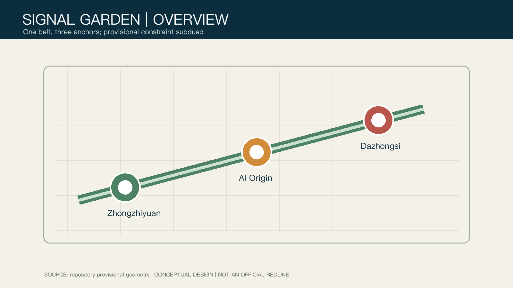
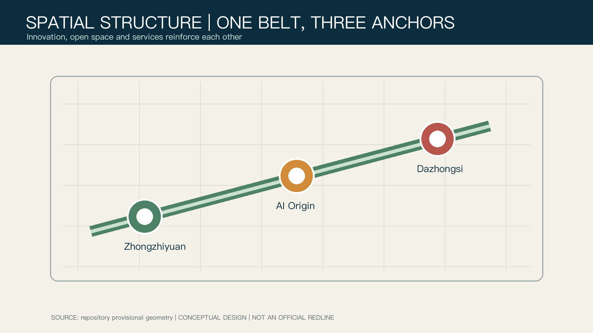
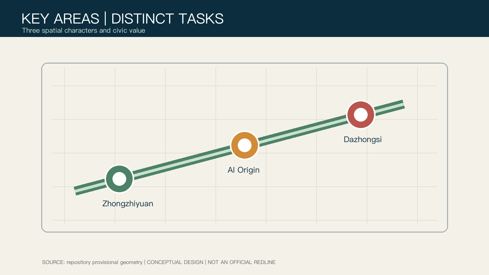
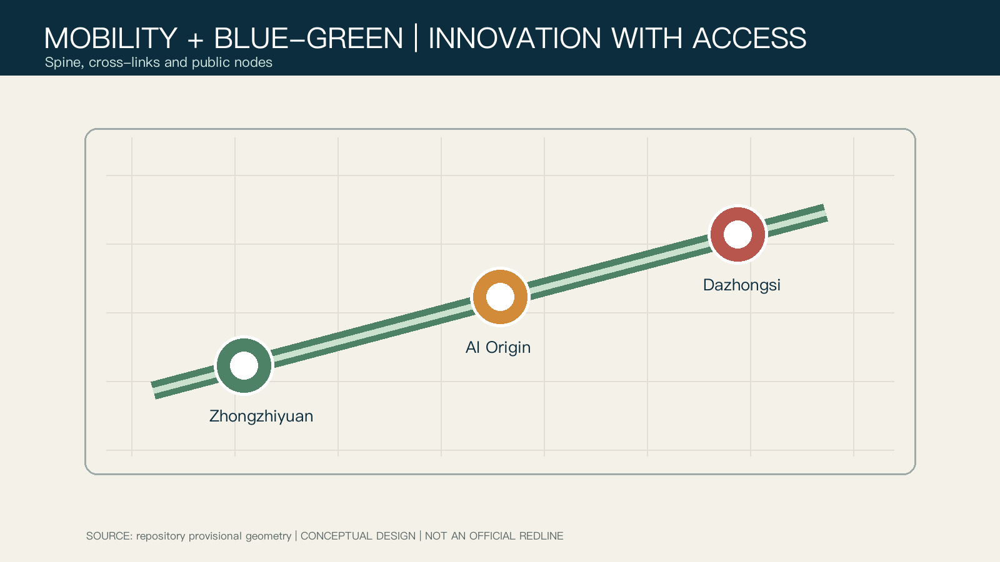
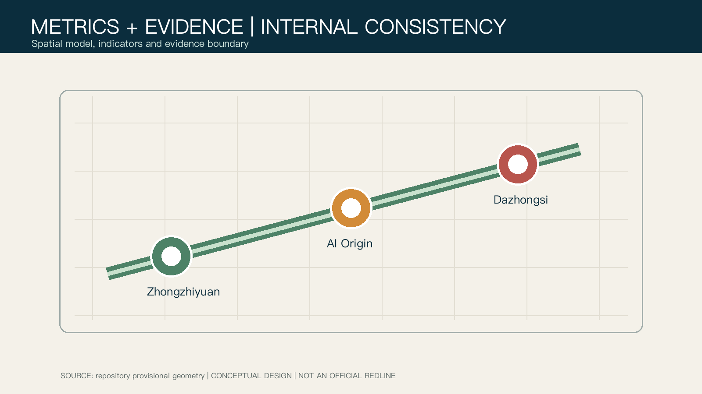

# Jing-Zhang Signal Garden: A Walkable, Verifiable AI Innovation Belt

## Design Basis and Source List

The proposal treats the Jing-Zhang heritage-park corridor as a public signal line: a way to make research, open-source collaboration, talent support and civic exchange visible in everyday life. It is not a new statutory boundary. The announcement supplies the project scope; the Agent Taskbook supplies scenario and operations requirements. [source:OFFICIAL-ANNOUNCEMENT] [source:AGENT-TASKBOOK]

No precise official redline or key-area polygons are in the public package. This package uses only the repository provisional constraint for generation, display and self-check; all layers and metrics must be recalculated when official data arrives. [data:geometry/site_boundary.geojson#SITE-001] [metric:site_area_sqm]

## Three-Level Scope Framework

The coordinated-research, overall-design and key-area levels form a chain from innovation ecosystem to daily space: research organizes sources, collaboration, translation, public experience and exchange; overall design creates one belt, three anchors and a blue-green walking network; key areas test whether space, service and governance can be deepened professionally. [depth:three_level_scope_framework] [depth:overall_spatial_structure]

## Coordinated Research Area: Industry and Future City Research

Jing-Zhang Signal Garden joins railway memory, park walking and open scenarios. Its three positions are a full-stack innovation test corridor, a campus-adjacent translation commons, and an international civic meeting line. Its five functions are research, translation, services, display and exchange. “Three areas and two wings” is used as a coordination method, not as a claim of an approved project. [standard:PROJECT-AGENT-OPEN-CALL-TASKBOOK]

## Overall Design Area: Urban Renewal and Regulatory-Plan-Level Urban Design

The spatial proposal is “one belt, three anchors, two cross-links.” The heritage-park spine connects the anchors; campus-to-park and station-to-community links restore daily continuity. Land use, green space, public space, roads, buildings and phasing derive from the same provisional geometry. [data:geometry/land_use.geojson#LU-001] [data:geometry/roads.geojson#ROAD-001]

FAR, height, road lines, ownership and municipal conditions remain pending. Retaining useful space, low-disruption ground-floor renewal and public-facing interfaces are reference strategies only. [standard:MOHURD-CONTROL-DETAILED-PLANNING] [depth:development_intensity_controls]

## Detailed Design of Key Areas

Zhongzhiyuan is a garden-like full-stack test district with a shared test garden and standards workshop. Beijing AI Origin is a campus-adjacent translation street with an open-source hall and talent services. Dazhongsi is an urban international meeting district with a pitch lounge, device display and station walking links. These are conceptual suggestions, not engineering or approval conclusions. [data:geometry/key_areas.geojson#PROV-KEY-001] [data:geometry/key_areas.geojson#PROV-KEY-002] [data:geometry/key_areas.geojson#PROV-KEY-003]

## AI Innovation Ecosystem, Personas, and AI+ Scenarios

Five personas are open-source developers, start-up teams, enterprise visitors, nearby residents and university teachers/students. Ten scenario cards include an open-source hall, safety-governance sandbox, edge-compute stop, AI walking guide, pitch lounge, low-carbon river corridor, campus-adjacent translation street, data-elements lounge, AI service street and a global-AI-week route. The sandbox, edge-compute stop and translation street are three test-and-validation scenarios.

Every scenario requires data minimisation, visible notice, explainable outputs and a human fallback. It must not depend on individual tracking, emotion inference or automated enforcement in public space. [standard:GENERATIVE-AI-INTERIM-MEASURES] [data:geometry/public_space.geojson#PUBLIC-001]

## Land Use, Building Scale, and Retain-Renovate-Demolish Strategy

The submitted land-use partition covers the provisional overall scope. Green and public-space layers bring innovation services into a daily walkable network. The building layer expresses conceptual retain-renovate-new work packages, not a surveyed condition, ownership result or demolition decision. [standard:MNR-LAND-USE-CLASSIFICATION-GUIDE] [depth:retain_renovate_demolish]

## Transport, Rail, Municipal Infrastructure, and Public Services

The approach is “connect first, densify later”: the heritage spine joins the three anchors, while station links, campus-park connections and accessible wayfinding repair breaks. Road sections, parking, utilities and fire conditions all await official files and specialist review. Public-service nodes retain staffed help and accessible information channels. [standard:BARRIER-FREE-ENVIRONMENT-LAW] [depth:traffic_rail_slow_parking]

## Blue-Green Network, Public Space, and Urban Character

The blue-green network connects garden, street and station spaces, carrying railway memory, Zhongguancun innovation culture and a new AI civic culture. Three possible pilgrimage nodes are the Jing-Zhang Time Gate, Open-Source Contribution Walk and Algorithm Honour Garden. Their location and form require later cultural, ownership, ecological and safety confirmation. [standard:MOHURD-URBAN-DESIGN-MEASURES] [depth:blue_green_public_space]

## Renewal Projects, Implementation Policy, and Phasing

Near-term work can test walking guidance, open-source publishing and staffed public-service fallback; mid-term work can study interface renewal and station links; long-term work can study cross-area operations and physical renewal. A four-season programme is an operational reference, not an approved activity commitment. [data:geometry/phasing.geojson#PHASE-001] [depth:phasing_implementation]

## Metrics, Area Recalculation, and Compliance Matrix

The same GeoJSON produces the core internal-consistency indicators: provisional overall design area about 11.41 km², green ratio 12.34%, public-space ratio 7.33%, and three key areas. They are not official-redline or approval indicators. [metric:site_area_sqm] [metric:green_ratio] [metric:public_space_ratio]

The compliance matrix covers announcement sections 1.3, 1.4 and 1.5 and agent.1 through agent.6; the standard and depth matrices link requirements to geometry, drawings, metrics and self-check. [depth:metrics_recalculation]

## Risk, Copyright, and Compliance

All generated imagery is conceptual presentation, not a current-condition photograph, official rendering or construction commitment. The cover was generated with GPT Image; diagrams derive from package geometry and metrics. Sources, rights and limitations are recorded in `sources.json` and the copyright statement. Official redlines, controls, roads, utilities, ownership, heritage constraints and engineering conditions are required before professional deepening. [depth:risk_missing_data] [data:geometry/constraints.geojson#CONSTRAINTS]

## References

- Haidian Branch of the Beijing Municipal Commission of Planning and Natural Resources, 2026, prequalification announcement.
- Open call taskbook excerpt for global agents, 2026.
- MOHURD Urban Design Measures and local reference snapshots.
