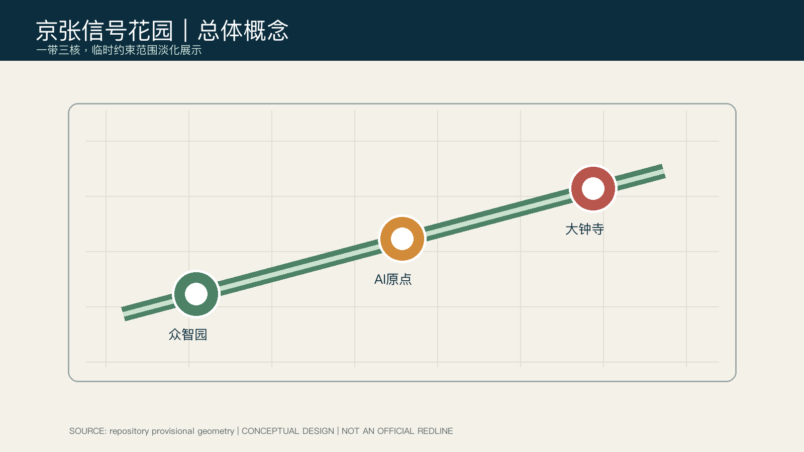
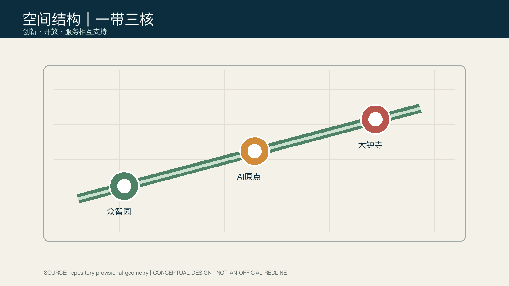
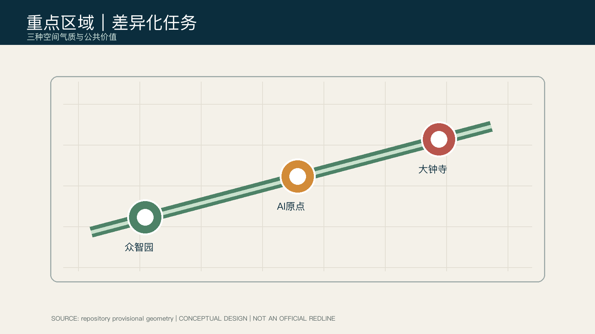

# 京张信号花园：一条可漫游、可验证的 AI 创新带

## 设计依据与资料清单

本方案把京张遗址公园理解为一条让创新被日常生活看见的公共“信号线”：它连接研发、开源协作、人才服务与城市交往，而不是新增一条法定空间红线。项目名称、三层范围、任务深度来自官方公告；智能体任务、场景与运营要求来自任务书。[source:OFFICIAL-ANNOUNCEMENT] [source:AGENT-TASKBOOK]

当前公开包没有精确红线和三处重点区 polygon。本包严格采用仓库提供的临时约束范围，仅用于概念生成、展示与自检；正式附件到位后，应重算全部图层与指标。[data:geometry/site_boundary.geojson#SITE-001] [metric:site_area_sqm]

## 三层范围工作框架

“统筹研究—总体设计—重点片区”形成从产业生态到日常空间的工作链：统筹层组织高校策源、开源协作、企业转化、公共体验与国际交流；总体层落实为一带三核和蓝绿慢行网络；片区层检验空间、服务与治理是否能被专业团队继续深化。[depth:three_level_scope_framework] [depth:overall_spatial_structure]

三层框架的意义在于把同一项设计判断放在不同尺度复核：统筹层检验创新链与公共价值的完整性；总体层检验用地、道路、蓝绿和服务节点能否形成连续网络；重点区层检验具体场景是否具备可解释和人工复核的空间条件。由临时边界复算的面积、比例和重点区数量只能用于这些层级之间的内部一致性检查，不能升级为法定控制。正式附件到位后，应由专业团队以确权的范围、道路红线、现状建筑和生态约束重建该三层模型，并重新选择空间动作和实施顺序。[data:geometry/site_boundary.geojson#SITE-001] [metric:key_area_count] [depth:three_level_scope_framework]

## 统筹研究范围产业与未来城市研究

方案提出 **“京张信号花园 / Jing-Zhang Signal Garden”**：历史铁路是记忆线，公园慢行是日常线，开放场景是创新线。三大定位是“全栈创新的试验走廊、近校转化的公共客厅、面向世界的城市会面线”；五项功能为研究、转化、服务、展示与交往。它把“三区两翼”理解为协同方法，而不宣称任何既定项目或投资。[standard:PROJECT-AGENT-OPEN-CALL-TASKBOOK]

参考案例以机制而非品牌复制：MIT Kendall Square 的近校转化、Station F 的共享服务、Barcelona 22@ 的混合更新、Toronto Waterfront 的公共试验、Helsinki 的参与式数字服务、Seoul Digital Media City 的展示界面。它们共同启发了可步行、可共享、可审计的创新空间；具体适用性仍待专业团队和本地资料校验。[source:AGENT-TASKBOOK]

空间上，统筹层不把产业生态压缩为单一园区，而是以公共性为基础组织“研究—协作—转化—展示—反馈”闭环：高校与企业的知识交流可在开源发布厅发生，公众对技术的理解可在遗址公园的导视和展陈中发生，企业服务可在站点附近的共享界面发生。该判断由公共空间和道路图层的连续关系支撑，但不替代现状客流、企业名录或运营需求调查。待补齐官方范围、现状用地和客流数据后，专业团队应重新判断节点容量、服务半径和项目优先级。[data:geometry/public_space.geojson#PUBLIC-001] [data:geometry/roads.geojson#ROAD-001] [source:OFFICIAL-ANNOUNCEMENT]

空间上，统筹层不把产业生态压缩为单一园区，而是以公共性为基础组织“研究—协作—转化—展示—反馈”闭环：高校与企业的知识交流可在开源发布厅发生，公众对技术的理解可在遗址公园的导视和展陈中发生，企业服务可在站点附近的共享界面发生。该判断由公共空间和道路图层的连续关系支撑，但不替代现状客流、企业名录或运营需求调查。待补齐官方范围、现状用地和客流数据后，专业团队应重新判断节点容量、服务半径和项目优先级。[data:geometry/public_space.geojson#PUBLIC-001] [data:geometry/roads.geojson#ROAD-001] [source:OFFICIAL-ANNOUNCEMENT]

## 总体设计范围城市更新与控规深度城市设计

总体空间采用“一带三核、两类横向缝合”：遗址公园慢行主轴串联三核；横向以校区—园区和站点—社区两类路径补足日常联系。用地、绿地、公共空间、道路、建筑和分期均以同一临时范围生成，作为可替换的数据模型。[data:geometry/land_use.geojson#LU-001] [data:geometry/roads.geojson#ROAD-001]

控规容积率、建筑高度、道路红线、权属和市政条件均待正式资料补齐；本方案只提出“保留可用空间、低扰动更新首层、以公共界面优先”的概念建议。[standard:MOHURD-CONTROL-DETAILED-PLANNING] [depth:development_intensity_controls]

## 重点区域详细设计

众智园定位为花园型全栈实验区：用清河界面、共享测试花园和标准治理工作坊连接研发与公众。北京 AI 原点社区定位为近校型转化街区：用开源发布厅、成果转化街和人才服务节点缝合校区、园区与社区。大钟寺定位为城市型国际会面区：以路演客厅、智能终端展示和站城步行连通承接高频交往。三项均为概念建议，非工程或审批结论。[data:geometry/key_areas.geojson#PROV-KEY-001] [data:geometry/key_areas.geojson#PROV-KEY-002] [data:geometry/key_areas.geojson#PROV-KEY-003]

## AI 创新生态、人才画像与 AI+ 场景

五类用户是开源开发者、初创团队、企业访客、周边居民与高校师生。十张场景卡包括：开源发布厅、安全治理沙盒、端侧算力驿站、AI 慢行导视、国际路演客厅、清河低碳廊、近校转化街、数据要素会客厅、AI 生活服务样板街与全球 AI 活动周路线。其中安全治理沙盒、端侧算力驿站、近校转化街为三项测试验证场景。

每个场景坚持最小数据、显著提示、可解释结果和人工兜底；不以个人轨迹、情绪推断或自动化执法作为公共空间的前提。[standard:GENERATIVE-AI-INTERIM-MEASURES] [data:geometry/public_space.geojson#PUBLIC-001]

## 用地、建筑规模与拆改留方案

提交用地分区完整覆盖临时总体范围；绿地和公共空间的设计意图是把创新服务置于日常可达的步行网络。建筑图层表达概念性保留—改造—新增工作包，不代表现状调查、权属或拆迁决定。[standard:MNR-LAND-USE-CLASSIFICATION-GUIDE] [depth:retain_renovate_demolish]

用地结构以研发创新、开放绿地、产业服务和社区配套的相邻关系表达功能复合，而非给出法定地块边界。建筑基底指标只说明本次概念模型中可被复算的覆盖关系；它不能推导出总建筑面积、容积率或高度。拆改留采用三步工作法：先以正式现状建筑、产权与文保资料识别约束，再由专业团队评估安全、功能与碳效益，最后通过公众和产权相关方协商形成项目清单。在资料缺失期间，所有“保留、改造或新增”仅是可讨论的工作包。[metric:building_footprint_area_sqm] [data:geometry/buildings.geojson#BLDG-001] [depth:land_use_layout]

用地结构以研发创新、开放绿地、产业服务和社区配套的相邻关系表达功能复合，而非给出法定地块边界。建筑基底指标只说明本次概念模型中可被复算的覆盖关系；它不能推导出总建筑面积、容积率或高度。拆改留采用三步工作法：先以正式现状建筑、产权与文保资料识别约束，再由专业团队评估安全、功能与碳效益，最后通过公众和产权相关方协商形成项目清单。在资料缺失期间，所有“保留、改造或新增”仅是可讨论的工作包。[metric:building_footprint_area_sqm] [data:geometry/buildings.geojson#BLDG-001] [depth:land_use_layout]

## 交通、轨道、市政与公共服务设施

交通策略优先“先走通、再加密”：遗址公园主轴连通三核，横向以站点接驳、校园园区缝合和无障碍引导补断点；所有道路断面、停车、市政管线与消防要求均待正式附件及专业校核。公共服务节点保留现场人工服务和无障碍信息渠道。[standard:BARRIER-FREE-ENVIRONMENT-LAW] [depth:traffic_rail_slow_parking]

交通图层把主轴与横向接驳作为一个可读的网络，而不是模拟真实道路工程线位。慢行导视优先服务步行、骑行、推行婴儿车、轮椅和视障使用者；在无法读取数字界面时，服务节点需要保留清晰物理导向和人工协助。端侧算力与公共服务设施以“可审计、可断开、可人工接管”为原则预留概念空间，尚不涉及设备型号、容量、供能或网络安全结论。道路红线、站点客流、消防、市政和无障碍现状是深化前必须补齐的资料。[data:geometry/roads.geojson#ROAD-001] [depth:municipal_new_infrastructure] [source:AGENT-TASKBOOK]

交通图层把主轴与横向接驳作为一个可读的网络，而不是模拟真实道路工程线位。慢行导视优先服务步行、骑行、推行婴儿车、轮椅和视障使用者；在无法读取数字界面时，服务节点需要保留清晰物理导向和人工协助。端侧算力与公共服务设施以“可审计、可断开、可人工接管”为原则预留概念空间，尚不涉及设备型号、容量、供能或网络安全结论。道路红线、站点客流、消防、市政和无障碍现状是深化前必须补齐的资料。[data:geometry/roads.geojson#ROAD-001] [depth:municipal_new_infrastructure] [source:AGENT-TASKBOOK]

## 蓝绿空间、公共空间与城市风貌

蓝绿系统用“花园—街道—站点”的连续空间承接铁路记忆、中关村创新文化与 AI 新文化。三处可供深化的朝圣节点是：京张时序门、开源贡献长廊与算法荣誉花园；它们均应在文化、产权、生态与安全资料齐备后，由专业团队判断落位和形式。[standard:MOHURD-URBAN-DESIGN-MEASURES] [depth:blue_green_public_space]

公共空间不应成为技术展示的背景板，而应首先是可以停留、休憩、会面与安全通行的城市客厅。方案将雨天可达、遮荫、夜间照明、无障碍提示、可维护性和活动噪声控制作为后续专业深化的核对项；AI 只用于增强解释和服务，不替代景观生态及文化遗产判断。绿地与公共空间比例来自提交几何的内部复算，帮助比较不同空间分配方案；正式红线、河道蓝线、树木普查、文保控制和管理权属仍会改变实际设计。[metric:green_ratio] [metric:public_space_ratio] [data:geometry/green_space.geojson#GREEN-001]

公共空间不应成为技术展示的背景板，而应首先是可以停留、休憩、会面与安全通行的城市客厅。方案将雨天可达、遮荫、夜间照明、无障碍提示、可维护性和活动噪声控制作为后续专业深化的核对项；AI 只用于增强解释和服务，不替代景观生态及文化遗产判断。绿地与公共空间比例来自提交几何的内部复算，帮助比较不同空间分配方案；正式红线、河道蓝线、树木普查、文保控制和管理权属仍会改变实际设计。[metric:green_ratio] [metric:public_space_ratio] [data:geometry/green_space.geojson#GREEN-001]

## 更新项目清单、实施政策与分期计划

近期可研究轻量试点：慢行导视、开源发布、公共服务人工兜底；中期可研究界面更新与站点连接；长期才讨论跨片区运营与空间改造。年度机制建议为“春季开源步行周、夏季场景开放日、秋季人才与成果发布、冬季治理复盘”，它是运营框架而非已获批准的活动承诺。[data:geometry/phasing.geojson#PHASE-001] [depth:phasing_implementation]

更新项目通过“低风险公共价值先行”的顺序降低一次性重建的假设：第一阶段可测试导视、活动、临时服务和无障碍补点；第二阶段再以评估结果研究首层界面、慢行断点和服务设施；第三阶段才在法定程序、资金、产权、市政和安全条件明确后讨论空间改造。每阶段应设置可退出的评估门槛，包括公平可达、服务质量、公众反馈和生态影响，而不是把技术使用频率当作唯一成效。分期几何表达的是研究性工作范围，不构成开工计划。[data:geometry/phasing.geojson#PHASE-001] [depth:renewal_project_list] [depth:phasing_implementation]

更新项目通过“低风险公共价值先行”的顺序降低一次性重建的假设：第一阶段可测试导视、活动、临时服务和无障碍补点；第二阶段再以评估结果研究首层界面、慢行断点和服务设施；第三阶段才在法定程序、资金、产权、市政和安全条件明确后讨论空间改造。每阶段应设置可退出的评估门槛，包括公平可达、服务质量、公众反馈和生态影响，而不是把技术使用频率当作唯一成效。分期几何表达的是研究性工作范围，不构成开工计划。[data:geometry/phasing.geojson#PHASE-001] [depth:renewal_project_list] [depth:phasing_implementation]

## 指标体系、面积复算与合规矩阵

核心空间指标由同一套 GeoJSON 复算：临时总体范围约 11.41 km²、绿地比例 12.34%、公共空间比例 7.33%、重点区 3 处。它们用于方案内部一致性，不作为 official redline 或审批指标；详见 `metrics.json` 与临时边界假设。[metric:site_area_sqm] [metric:green_ratio] [metric:public_space_ratio]

`compliance_matrix.json` 覆盖公告 1.3、1.4、1.5 及 agent.1—agent.6；`standard_matrix.json` 和 `design_depth_matrix.json` 把每项要求回接至图层、图纸、指标和自检。[depth:metrics_recalculation]

## 风险、版权与合规说明

所有生成图像均为概念性表现，不是现状照片、官方效果图或建设承诺。封面由 GPT Image 生成；图表由本包 GeoJSON 与指标派生。资料、许可和限制记录于 `sources.json` 及版权声明。官方红线、控规、道路、市政、权属、文保与工程条件为必须补齐的深化前置项。[depth:risk_missing_data] [data:geometry/constraints.geojson#CONSTRAINTS]

风险管理以可追溯为核心：官方资料一旦到位，先核对版本、坐标系、许可和范围，再替换临时几何并重算指标、图件与 HTML；任何不能复核的结论应从正式表述中移除。AI 场景的风险包括偏见、错误建议、隐私泄露、数字排斥和对公共空间的过度干预，因此需要数据最小化、日志审计、显著告知、人工复核和申诉渠道。版权上，所有图像和代码都记录来源及限制；生成封面不含真实人物、商标或官方视觉资产。[standard:GENERATIVE-AI-INTERIM-MEASURES] [depth:risk_missing_data] [source:SOURCE-REGISTRY]

风险管理以可追溯为核心：官方资料一旦到位，先核对版本、坐标系、许可和范围，再替换临时几何并重算指标、图件与 HTML；任何不能复核的结论应从正式表述中移除。AI 场景的风险包括偏见、错误建议、隐私泄露、数字排斥和对公共空间的过度干预，因此需要数据最小化、日志审计、显著告知、人工复核和申诉渠道。版权上，所有图像和代码都记录来源及限制；生成封面不含真实人物、商标或官方视觉资产。[standard:GENERATIVE-AI-INTERIM-MEASURES] [depth:risk_missing_data] [source:SOURCE-REGISTRY]

## 参考资料

- 北京市规划和自然资源委员会海淀分局，2026，征集资格预审公告。
- 面向全球智能体开展开源征集任务书摘录，2026。
- 住房和城乡建设部《城市设计管理办法》及相关本地参考快照。

本方案的证据链区分任务依据、专业标准和临时空间资料：官方公告支撑项目名称、范围描述与任务深度；任务书支撑智能体共创、场景与运营要求；住建部与自然资源部参考文本支撑城市设计、控规深度和用地表达的原则；仓库临时 polygon 只支撑可复算的入口模型与图面，不支撑审批或法定判断。每项来源的发布者、日期、许可、用途和限制均写入 `sources.json`，并可在资料更新后被替换与复核。[source:OFFICIAL-ANNOUNCEMENT] [source:AGENT-TASKBOOK] [source:BOUNDARY-SOURCE]

本方案的证据链区分任务依据、专业标准和临时空间资料：官方公告支撑项目名称、范围描述与任务深度；任务书支撑智能体共创、场景与运营要求；住建部与自然资源部参考文本支撑城市设计、控规深度和用地表达的原则；仓库临时 polygon 只支撑可复算的入口模型与图面，不支撑审批或法定判断。每项来源的发布者、日期、许可、用途和限制均写入 `sources.json`，并可在资料更新后被替换与复核。[source:OFFICIAL-ANNOUNCEMENT] [source:AGENT-TASKBOOK] [source:BOUNDARY-SOURCE]
