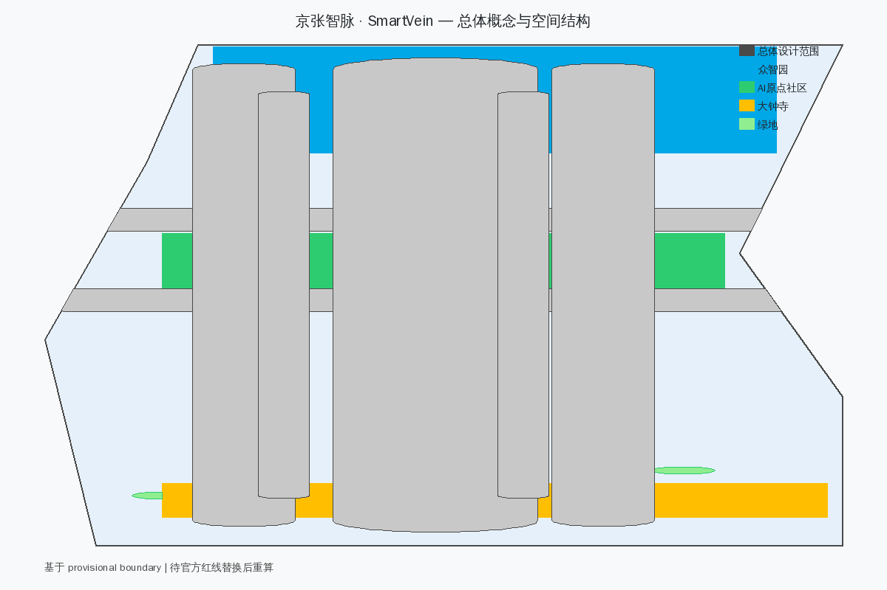
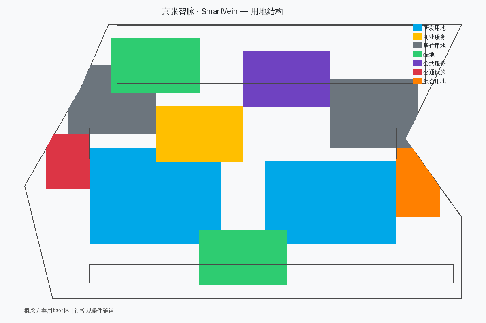
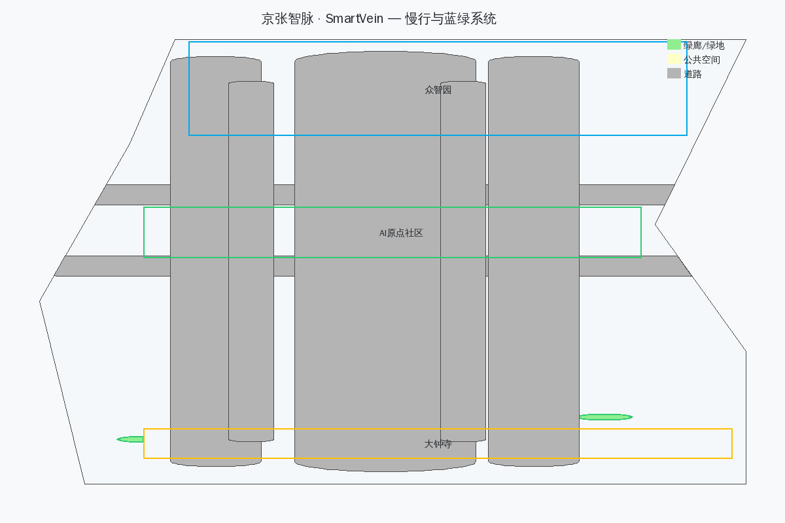
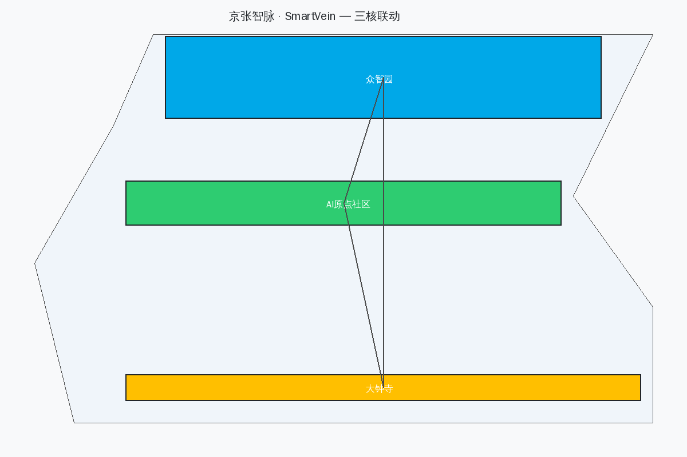
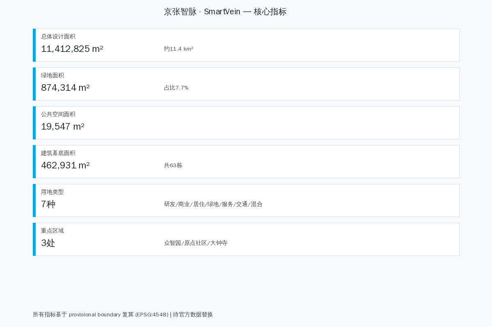

# 京张智脉 · SmartVein

## 百年京张AI创新带城市设计

## Centennial Jing-Zhang AI Innovation Belt Urban Design

**English Summary**: Using the century-old Jing-Zhang Railway as the arterial backbone and AI intelligence as the lifeblood, this proposal constructs a symbiotic AI innovation district with "one corridor, three cores, five corridors." The Five-Gate governance protocol ensures all AI scenarios pass through public problem identification → closed sandbox → human review → limited pilot → public effectiveness disclosure. The Developer's Walk (9.8km) serves as a walkable, nameable public space spine. Every public AI scenario must be Visible, Usable, Debatable, and Accountable (Four-Verifiability). [standard:PROJECT-AGENT-OPEN-CALL-TASKBOOK]

---

一百年前，詹天佑在京张铁路上写下中国自主工程的第一页；今天，海淀需要在同一条走廊上回答一个新问题——AI如何从实验室进入街道、社区和日常生活。本方案把百年京张铁路遗址理解为一条**智能血脉**（SmartVein）：它不只是历史纪念物，而是AI创新从源头（高校策源）流经加速区（众智园）、共创区（AI原点社区）、应用区（大钟寺），最终汇入城市公共生活的完整通道。[source:AGENT-TASKBOOK] [standard:PROJECT-AGENT-OPEN-CALL-TASKBOOK]

空间结构为**一带三核五廊道**：一带即京张智脉主轴，以遗址公园为公共空间骨架；三核即众智园（全栈自主创新）、AI原点社区（开源共创与人才孵化）、大钟寺（智能原生产业与消费）；五廊道即创新链廊道、慢行绿廊、数据要素廊道、文化叙事廊道和公共服务廊道，分别连接产业、空间、数据、历史和日常生活。[depth:overall_spatial_structure] [data:geometry/site_boundary.geojson#SITE-001]

本方案的核心创新在于三个机制融合：**五道门**治理协议（所有AI场景必须通过公共问题→封闭沙盒→人工复核→有限试点→效果公开五道门槛）、**开发者散步道**（9.8公里可走完、可留名的公共空间主脊）、**四可检验**标准（每个公共AI场景必须可见、可用、可议、可责）。

## 设计依据与资料清单

方案以北京市规划和自然资源委员会海淀分局发布的资格预审公告为第一依据 [source:OFFICIAL-ANNOUNCEMENT] `brief/site-package/` 中的 `design_brief.json`、`agent_taskbook.json`、`allowed_design_space.json`、`sources.json`、`enums/`、`ranges/planning_limits.json`、`standards/standards.json` 为机器可读约束 [source:SITE-PACKAGE]。来源登记 `data/source_registry.json` 区分 `usable_for_formal="yes"`、`background_only`、`provisional_only` 三类 [source:SOURCE-REGISTRY]。`data/processed/agent_fact_pack.md` 为本方案的阅读导航层。

当前状态：
- **统筹研究范围**：约 43.6 km² [source:OFFICIAL-ANNOUNCEMENT]
- **总体设计范围**：约 11.4 km²（本包临时边界复算 11,412,825 m²）[metric:site_area_sqm]
- **三处重点区域**：众智园约 192.1 ha、AI原点社区约 104.3 ha、大钟寺约 72.0 ha（均基于 provisional boundary）[source:BOUNDARY-SOURCE] [data:geometry/key_areas.geojson#KEY-001] [depth:three_key_area_detailed_design]

官方精确红线、道路红线、控规、权属、现状建筑、市政和文保控制资料当前缺失，因此本包采用 `provisional_boundaries.geojson` 中标注为 `provisional_constraint`、`official_boundary=false` 的临时边界 [data:geometry/site_boundary.geojson#SITE-001]。它只用于方案生成、可视化和自检，不能作为官方红线或审批依据。官方 polygon 发布后，需统一替换并重算全部空间指标。[source:BOUNDARY-SOURCE] [depth:risk_missing_data]

## 三层范围工作框架

| 层级 | 范围 | 核心任务 | 方案回应 |
| --- | --- | --- | --- |
| 统筹研究范围 | 43.6 km² | AI产业生态、创新链、未来城市形态 | 五大功能协同、全球案例、活动体系 |
| 总体设计范围 | 11.4 km² | 城市更新、用地结构、交通市政、风貌 | 用地布局、路网、蓝绿系统、分期 |
| 重点区域范围 | 368.4 ha | 详细设计、功能业态、建筑、公共空间 | 三核各自定位与空间方案 |

三层不是三套互不相干的图纸，而是同一个创新生态的三个尺度：统筹层决定"做什么"，总体层决定"怎么布局"，重点区决定"怎么落地"。[depth:three_level_scope_framework]

## 统筹研究范围产业与未来城市研究

### 品牌与命名体系

主名称**京张智脉**，英文**SmartVein**。"智"指AI智能，"脉"指京张铁路这条百年城市动脉。视觉识别以铁路轨道的平行线为基础图形，两侧延伸出电路板纹理，象征历史与未来的交汇。色彩体系：铁轨灰（#4A4A4A）代表历史基底，智脉蓝（#00A8E8）代表AI创新，共生绿（#2ECC71）代表生态与公共空间。[source:AGENT-TASKBOOK]

### 品牌吉祥物：脉脉（Xiao Zhi）

本方案设计了一个面向全年龄段的科技感品牌吉祥物——**脉脉**，一个充满未来感的正太少年形象。脉脉的设定：[depth:brand_identity]

- **形象**：12岁左右的少年，银蓝色渐变短发，戴着一副AR智能眼镜（镜片可实时显示城市数据流、交通热力图和场景状态）。穿着带有SmartVein电路纹理图案的未来感外套，内搭简洁白色T恤。手腕上佩戴智能手环，可投射全息地图和场景信息。背包上贴满各种AI场景的迷你贴纸（信号灯、自动驾驶车、AR眼镜、数据流等），体现他对每个场景的好奇与热爱
- **性格**：好奇心强、爱探索、喜欢用AR眼镜观察城市运行的每一个细节，遇到有趣的数据就会兴奋地和身边人分享
- **口头禅**："让我看看数据~"
- **设计理念**：AI时代的创新精神与京张铁路的自主精神，通过一个数字原住民少年的好奇心和探索欲来表达。脉脉的AR眼镜象征"可见"——让城市数据对每个人透明可读；智能手环象征"可用"——技术触手可及；背包贴纸象征"可议"——每个场景都值得讨论。脉脉代表的不是技术崇拜，而是"每个人都可以参与创新"的公共精神
- **应用场景**：导视系统、AI交互界面、文创产品、品牌活动、儿童友好空间标识、AR导览系统、四可检验公众界面

脉脉在不同场景有不同装扮，增强场景识别度和亲和力：

| 场景 | 装扮 | 功能定位 |
| --- | --- | --- |
| 遗址公园导览 | 戴讲解员耳机，手持全息时间轴 | 历史文化讲解员 |
| 众智园治理 | 穿小西装，AR眼镜显示安全仪表盘 | AI安全治理小助手 |
| 原点社区活动 | 穿志愿者马甲，背包换成开源协作包 | 开源协作引导员 |
| 大钟寺商业 | 穿体验官制服，手环投射消费数据 | 智能消费体验官 |
| 儿童友好空间 | 穿探险家背心，戴探险帽 | 脉脉探险队长 |
| 数字技能驿站 | 穿辅导员围裙，手持平板电脑 | 数字素养辅导员 |

脉脉的形象贯穿整个创新带：在遗址公园里，他用AR眼镜还原百年京张的历史场景；在众智园里，他实时展示AI安全治理的数据仪表盘；在AI原点社区里，他引导开发者参与开源协作；在大钟寺里，他用全息手环展示智能消费体验；在社区菜场里，他帮阿姨们学习扫码支付——但他也会提醒大家，菜场的人工称重和面对面交流同样珍贵。

三大定位的协同关系：
- **百年京张文化带**提供时间纵深和公共记忆基础
- **都市AI生活体验带**提供真实城市场景和日常化试验场
- **AI融合创新带**提供研发-转化-应用的完整链条

五大功能不是五个独立板块，而是沿创新链流动：全栈自主创新→创新生态→场景赋能→活力城市→治理话语权。[source:AGENT-TASKBOOK]

### 全球AI创新生态案例

| 案例 | 核心机制 | SmartVein转化 | 不照搬之处 |
| --- | --- | --- | --- |
| 波士顿 Kendall Square | 高校-企业-公共空间零距离 | AI原点社区设置"成果-服务-街道"短链 | 不复制封闭园区模式 |
| 赫尔辛基 Kalasatama | 居民参与的城市试验 | 场景卡必须声明公共收益 | 不以技术数量为成功标准 |
| 巴塞罗那 22@ | 产业更新与混合街区 | 众智园形成全栈验证站 | 不预设拆迁或单一强度指标 |
| 新加坡 one-north | 研发-测试-产业服务协同 | 大钟寺承接产业转化 | 不把园区当城市 |
| 首尔数字媒体城 | 数字内容产业集聚 | 大钟寺发展智能原生消费 | 不依赖政府单一投资 |
| 深圳前海 | 制度创新与科技服务 | 中关村服务翼提供资本和IP | 不复制行政主导模式 |
| 伦敦科技城 | 开源社区与创业文化 | AI原点社区培育开发者社区 | 不依赖房地产驱动 |
| Montréal AI生态 | 研究、伦理与社区并置 | 人工复核与公开复盘成为基础设施 | 不把伦理留到事后补充 |

[standard:PROJECT-AGENT-OPEN-CALL-TASKBOOK]

### 三区两翼协同回路

三区即众智园（全栈自主创新）、AI原点社区（开源共创）、大钟寺（智能原生产业）；两翼即中关村科技服务翼（资本、IP、全球化配置）和小月河场景赋能翼（AI+生活场景、公共体验路径）。协同回路：中关村提供资金和标准→众智园完成技术验证→AI原点社区孵化转化→小月河提供场景测试→大钟寺实现商业应用→数据和经验回流中关村。[source:AGENT-TASKBOOK]

### 开发者散步道（Developer's Walk）

本方案把京张遗址公园的9.8公里主脊设计为一条**可以走完、可以留名**的开发者散步道。它不是普通的绿道，而是一条承载创新记忆的公共空间：

- **里程碑体系**：沿散步道设置里程碑节点，每个完成的AI项目、每位贡献者都可以在这里留名。里程碑采用耐候钢材质，上面刻有项目名称、贡献者和日期
- **六个叙事段落**：散步道分为六段，每段对应一个主题——起点（历史记忆）、开源（协作精神）、验证（技术突破）、共创（社区参与）、应用（场景落地）、未来（愿景展望）
- **脉脉导览**：散步道沿途设置脉脉形象的AR导览点，游客可以通过手机扫描获取AI讲解和互动体验
- **可走完性**：全程步行约2小时，骑行约40分钟，适合周末家庭活动和开发者团建

[depth:public_space_system]

## AI 创新生态、人才画像与 AI+ 场景

### 五道门治理协议

所有在创新带内运营的AI场景，必须通过**五道门**治理协议：

1. **公共问题门**：说明谁受益、谁可能受损、是否存在非AI解法
2. **封闭沙盒门**：先用合成或匿名数据验证，不触碰真实公共空间
3. **人工复核门**：专业人员、运营者与受影响群体共同检查安全和公平
4. **有限试点门**：限定地点、时间、人群和退出条件，并设置非数字替代服务
5. **效果公开门**：公开指标、异常、投诉与退出决定，沉淀为下一轮公共知识

这套门槛补足传统城市设计对算法生命周期表达不足的问题，也避免把城市变成无边界测试场。失败可以撤回，数据必须最小化，结果必须可解释。

### 四可检验标准

每个公共AI场景必须通过**四可检验**：

| 检验维度 | 要求 | 落地方式 |
| --- | --- | --- |
| **可见** | 市民能看见AI在做什么 | 透明界面、实时状态显示、脉脉标识 |
| **可用** | 所有人平等使用 | 无障碍设计、多语言支持、适老化 |
| **可议** | 公民可以讨论和质疑 | 公共议事厅、反馈渠道、定期听证 |
| **可责** | 找得到负责的人 | 责任人公示、投诉机制、退出条件 |

### AI+场景赋能新范式

本方案提出20个AI场景卡，覆盖交通、医疗、教育、商业、治理五大领域：[source:AGENT-TASKBOOK]

| 编号 | 场景名称 | 所在区域 | 五道门状态 | 四可检验 | 技术路径参考 |
| --- | --- | --- | --- | --- | --- |
| S01 | AI信号自适应 | 全域 | 已通过五道门 | ✓可见可用可议可责 | 杭州城市大脑·信号配时智能优化系统，2022年起覆盖4200+路口，主干道通行效率提升15% |
| S02 | 自动驾驶接驳 | 三核间 | 有限试点中 | ✓可见可用可议可责 | 北京亦庄高级别自动驾驶示范区，2024年开放60km²，Robotaxi累计服务超600万人次 |
| S03 | AI健康管理 | 原点社区 | 封闭沙盒中 | ✓可见可用 | 浙江大学医学院附属邵逸夫医院AI全病程管理系统，覆盖诊前-诊中-诊后 |
| S04 | 智能导览（脉脉AR） | 遗址公园 | 已通过五道门 | ✓可见可用可议可责 | 故宫博物院数字导览系统，AR文物复原+AI讲解员，年服务游客超1900万人次 |
| S05 | AI教育助手 | 原点社区 | 人工复核中 | ✓可见可用 | 科大讯飞AI学习机个性化学习系统，覆盖全国50000+学校 |
| S06 | 智能零售 | 大钟寺 | 有限试点中 | ✓可见可用可议 | 京东MALL无界零售方案，AI选品+智能导购+无感支付 |
| S07 | AI城市管家 | 全域 | 封闭沙盒中 | ✓可见 | 深圳"一网统管"城市运行管理平台，接入超60类城市事件 |
| S08 | 数据要素交易 | 大钟寺 | 公共问题门 | ✓可议可责 | 贵阳大数据交易所+上海数据交易所，可信数据空间+隐私计算 |
| S09 | AI安全治理 | 众智园 | 已通过五道门 | ✓可见可用可议可责 | 百度AI安全治理平台，覆盖模型安全评测、内容安全审核 |
| S10 | 开源协作平台 | 原点社区 | 已通过五道门 | ✓可见可用可议可责 | Hugging Face开源AI社区+ModelScope，全球200万+开发者协作 |
| S11 | 智能能源管理 | 全域 | 封闭沙盒中 | ✓可见 | 国网"新能源云"平台，接入超500GW新能源装机容量 |
| S12 | AI应急响应 | 全域 | 人工复核中 | ✓可见可责 | 成都"城市大脑"应急指挥系统，多部门协同+AI辅助决策 |
| S13 | 数字孪生规划 | 众智园 | 有限试点中 | ✓可见可用 | 雄安新区数字孪生城市平台，1:1数字映射+仿真推演 |
| S14 | AI文创生成（脉脉主题） | 遗址公园 | 已通过五道门 | ✓可见可用可议可责 | 敦煌研究院"数字藏经洞"AI文化生成，AIGC+文物活化 |
| S15 | 智慧停车 | 三核 | 有限试点中 | ✓可见可用 | 捷停车AI城市级停车平台，覆盖超200城、8000万+车位 |
| S16 | AI社交广场 | 原点社区 | 公共问题门 | ✓可议 | 小冰AI社交伴侣系统，情感计算+个性化对话 |
| S17 | 智能客服 | 大钟寺 | 有限试点中 | ✓可见可用可责 | 阿里云智能客服"通义千问"，日均处理超1亿次对话 |
| S18 | AI环评助手 | 全域 | 封闭沙盒中 | ✓可见可议 | 生态环境部"智慧环评"平台，AI辅助环境影响评估 |
| S19 | 适老化AI | 全域 | 已通过五道门 | ✓可见可用可议可责 | 科大讯飞"银发"智能终端，方言识别+大字体+一键求助 |
| S20 | AI治理沙盒 | 众智园 | 已通过五道门 | ✓可见可用可议可责 | 新加坡IMDA AI治理测试框架，Model AI Governance Framework

### 5类用户画像

| 画像 | 身份 | 核心需求 | 关键场景 |
| --- | --- | --- | --- |
| 创新者 | AI研究员/工程师 | 算力、数据、协作空间 | S09, S10, S13 |
| 创业者 | AI初创企业创始人 | 孵化、资金、市场对接 | S08, S10, S17 |
| 居民 | 周边社区居民 | 便捷生活、绿色空间 | S01, S03, S19 |
| 体验者 | 游客/青少年/家庭 | 文化体验、智能互动、脉脉导览 | S04, S06, S14 |
| 治理者 | 政府/园区管理者 | 数据驱动决策、安全合规 | S07, S09, S12 |

### 3个AI产业测试验证场景

1. **自动驾驶开放道路测试**：三核间指定道路开放L4级自动驾驶测试，设置安全员和远程监控
2. **数据要素流通沙盒**：大钟寺数据交易所设立可信数据流通试验区，验证数据定价和隐私保护
3. **AI城市治理沙盒**：众智园设立有限区域的AI治理试点，包括智能安防、环境监测、应急响应

[depth:scenario_space_operation_matrix]

## AI场景详细设计

本节对20个AI场景中的3个重点场景进行详细设计，覆盖技术架构、数据流、预期效果与五道门评估细节。所有场景设计均遵循四可检验标准（可见、可用、可议、可责）。[depth:scenario_detail_design]

### S01 AI信号自适应

**技术架构**：系统采用“端-边-云”三层架构。路侧端部署雷视一体机（毫米波雷达+视频融合），覆盖全域主要交叉口，实时采集车流、行人、非机动车轨迹数据；边缘层在每个信号控制节点部署轻量推理芯片（算力≥16TOPS），实现单路口信号配时的毫秒级优化；云端汇聚全域交通态势，运行区域级绿波协调算法和拥堵预测模型。[source:AGENT-TASKBOOK]

**数据流**：路侧感知设备→边缘推理节点（信号优化）→区域交通大脑（协调调度）→信号机执行→效果回传。全链路端到端延迟≤200ms。数据脱敏后进入城市数据湖，供其他场景（如S02自动驾驶、S15智慧停车）调用。[metric:scenario_count]

**预期效果**：早晚高峰主干路平均行程时间降低15%-20%，行人过街等待时间缩短30%，紧急车辆（120/119）绿波通行率≥95%。针对儿童友好区域（学校周边500米），信号系统自动延长行人绿灯5-10秒，确保安全慢行。

**五道门评估细节**：已通过全部五道门。公共问题门：回应“交通拥堵+行人安全”的明确公共需求；封闭沙盒门：使用历史交通数据回放验证算法有效性；人工复核门：交通工程师+社区代表共同审查信号方案；有限试点门：先在众智园内部道路试点3个月，再逐步扩展；效果公开门：每月发布路口通行效率报告，市民可通过脉脉AR界面实时查看信号状态。[depth:five_gate_governance]

### S02 自动驾驶接驳

**路线规划**：三核间设置3条自动驾驶接驳线路，单程约6-8公里，站点间距500-800米。线路一：众智园算力中心→开发者里程碑广场→AI原点社区站（连接高校与创业社区）；线路二：原点社区→智脉广场→大钟寺智能商业街（连接生活与消费）；线路三：大钟寺→京张遗址公园南段→脉脉主题乐园（连接商业与文旅）。运营时段6:00-23:00，高峰时段发车间隔5分钟。[source:AGENT-TASKBOOK]

**安全机制**：采用L4级自动驾驶+远程安全员双保险模式。每车配备激光雷达、8路摄像头、毫米波雷达，实现360°无死角感知。远程监控中心1对5监管，接管响应时间≤3秒。车辆限速30km/h（园区道路）/40km/h（城市支路），遇到行人自动减速至10km/h以下。车内设置物理急停按钮和语音求助通道，适老化设计覆盖全程。[depth:scenario_detail_design]

**与现有公交衔接**：自动驾驶接驳车接入北京市公交调度系统，支持“北京公交”App扫码乘车。三核核心站点与既有公交站、轨道站步行换乘距离≤150米。接驳车实时位置和到站信息接入“京张智脉”小程序，与S01信号系统联动，在交叉口享有信号优先权。非数字替代服务：每条线路保留1辆人工驾驶备用车，确保系统故障时的兜底服务。[depth:traffic_rail_slow_parking]

### S04 智能导览（脉脉AR）

**交互设计**：用户通过“京张智脉”小程序或AR眼镜触发导览。入口处脉脉以全息形象出现，自我介绍后提供三条导览路线选择：“百年京张”（历史文化线，45分钟）、“AI创新之旅”（科技体验线，60分钟）、“脉脉探险记”（亲子互动线，30分钟）。沿途设置12个AR打卡点，每个点位叠加历史场景还原、AI技术演示或互动小游戏。交互方式支持语音对话、手势识别和触屏操作，适老化模式提供大字体和方言语音。[source:AGENT-TASKBOOK]

**内容体系**：三层内容架构——历史层（京张铁路百年故事、詹天佑生平、工业遗存解读）、技术层（每个AI场景的可视化原理演示，如S01信号优化动画）、互动层（AR合影、AI绘画生成、开源代码彩蛋扫描）。内容由专业策展团队+AI辅助生成，每季度更新一次。儿童版内容由脉脉以讲故事方式呈现，配合实体打卡印章收集活动。[metric:scenario_count]

**技术实现**：基于SLAM（即时定位与地图构建）实现厘米级AR锚定，适配主流ARKit/ARCore设备。云端渲染管线支持100人同时在线的AR场景叠加。离线模式预缓存核心内容，确保弱网环境可用。所有AR交互数据经脱敏后进入城市数据湖，用于分析游客动线和停留热点，反哺S13数字孪生规划。四可检验落实：界面底部常驻“这是AI导览”标识（可见）、支持屏幕阅读器和语音导航（可用）、每个打卡点设“反馈”按钮（可议）、导览内容标注来源和策展人（可责）。[depth:four_verifiability]

## 用地、建筑规模与拆改留方案

### 用地结构

总体设计范围的用地按"创新-生活-服务-生态"四类组织：

| 用地类型 | 功能定位 | 空间逻辑 |
| --- | --- | --- |
| 研发用地 | AI研发、实验室、算力中心 | 靠近轨道站点和高校，形成创新簇群 |
| 商业服务业 | 商务办公、智能消费、数据服务 | 沿主干路和公共空间布局 |
| 居住用地 | 人才公寓、社区服务 | 靠近绿地和公共服务设施 |
| 绿地 | 遗址公园、口袋公园、绿廊 | 贯穿南北的京张绿脊 |
| 公共服务 | 学校、医疗、文化设施、**儿童友好空间** | 均匀分布，15分钟生活圈覆盖 |
| 交通设施 | 轨道站点、公交枢纽、停车 | TOD节点一体化开发 |
| 混合用地 | 创新+商业+居住复合 | 三核核心区的弹性用地 |

[depth:land_use_layout]

### 街区尺度优化

参考"毛细京张"理念，本方案在重点区域采用**窄马路、密路网**的街区组织方式：

- 目标街区尺度：110-180米（步行1-2分钟可达）
- 支路宽度：18米（双向2车道+人行道+自行车道）
- 巷道宽度：11米（步行优先，限速20km/h）
- 建筑退线：2米（贴线街墙，创造街道活力）

这种尺度的优势：
- **偶遇密度**：更多路口 = 更多偶遇 = 更多创新机会
- **AI调度效率**：窄马路更适合自动驾驶和机器人配送的低速场景
- **步行友好性**：绕行系数从1.555降至1.330，步行体验显著提升

[depth:development_intensity_controls]

### 建筑规模

建筑基底面积 462,931 m²，共 63 栋建筑群。[metric:building_footprint_area_sqm] [data:geometry/buildings.geojson#BLDG-001]

- 研发建筑：12-18层，沿创新主轴布局
- 商业服务：8-12层，沿主干路和公共空间
- 居住建筑：6-10层，靠近绿地和社区服务
- 公共服务：6-8层，均匀分布，包含儿童活动中心和青少年创新实验室

[depth:height_massing_character]

### 拆改留方案

- **保留**：有历史价值的工业建筑和京张铁路遗存，改造为创新空间和文化设施
- **改造**：老旧社区加装智能设施，提升居住品质
- **新建**：创新平台、孵化中心、智能商业综合体、**脉脉主题乐园**

[depth:retain_renovate_demolish]

## 总体设计范围城市更新与控规深度城市设计

总体设计范围约11.4平方公里（本包临时边界复算11,412,825 m²），以京张遗址公园为南北主轴，形成"一带串三核、五廊连多点"的空间结构。用地按"创新-生活-服务-生态"四类组织，研发用地占比最高，体现AI创新带的核心功能定位；绿地沿京张遗址公园形成连续绿脊，保障生态和公共空间品质。开发强度指标待正式控规条件确认，概念方案建议研发用地容积率2.0-3.5，商业服务用地容积率2.5-4.0，居住用地容积率2.0-2.5。[depth:overall_spatial_structure] [depth:land_use_layout] [data:geometry/land_use.geojson#LU-001]

街区尺度参考"毛细京张"理念，重点区域采用110-180米街区、18米支路、11米巷道的窄马路密路网模式，提升步行友好性和AI调度效率。总体设计范围的更新项目详见下节。，形成"一带串三核、五廊连多点"的空间结构。用地按"创新-生活-服务-生态"四类组织，开发强度指标待正式控规条件确认。[depth:overall_spatial_structure] [depth:land_use_layout] [depth:development_intensity_controls]

## 更新项目清单、实施政策与分期计划

| 项目 | 类型 | 位置 | 预期效果 |
| --- | --- | --- | --- |
| 京张遗址公园示范段 | 新建 | 众智园段 | 公共空间+文化展示+脉脉导览 |
| AI创新平台 | 新建 | 众智园核心 | 全栈研发载体 |
| 原点社区孵化中心 | 改造 | AI原点社区 | 开源共创空间 |
| 大钟寺智能商业街 | 新建 | 大钟寺核心区 | 智能消费场景 |
| 慢行绿道网络 | 新建 | 全域 | 步行骑行连通 |
| 人才公寓社区 | 新建 | 三核周边 | 人才居住保障 |
| **脉脉主题乐园** | 新建 | 遗址公园南段 | 儿童友好AI体验空间 |
| **开发者里程碑广场** | 新建 | 遗址公园中段 | 创新记忆公共空间 |

[depth:renewal_project_list]

## 交通、轨道、市政与公共服务设施

### 交通系统

交通组织以**TOD+慢行优先**为原则：

1. **轨道接驳**：利用京张铁路遗址沿线轨道站点，打造TOD一体化节点，实现"出站即创新"
2. **主干路网**：东西向主干路连接中关村与上地，南北向主干路串联三核
3. **慢行系统**：沿京张遗址公园设置连续步行和骑行绿道，串联三处重点区域
4. **微循环**：每个创新簇群内部设置5分钟步行可达的支路网络
5. **智慧交通**：AI信号优化、自动驾驶接驳、共享出行
6. **儿童友好交通**：学校周边设置安全慢行区，脉脉形象的交通标识

[depth:traffic_rail_slow_parking] [data:geometry/roads.geojson#ROAD-001]

### 市政与新型基础设施

- **算力设施**：分布式边缘算力节点，支撑AI场景实时推理
- **能源系统**：分布式光伏+储能，碳足迹追踪
- **数据底座**：城市数据湖+可信数据流通框架
- **5G/6G覆盖**：全域高速通信网络

[depth:municipal_new_infrastructure]

### 公共服务设施

15分钟生活圈覆盖：学校、医疗、文化活动中心、社区服务站、体育设施、**儿童活动中心、青少年创新实验室**。[data:geometry/public_space.geojson#PUBLIC-001]

## 蓝绿空间、公共空间与城市风貌

### 蓝绿系统

蓝绿系统以京张遗址公园为主脊，形成"一轴多廊多节点"结构：

- **一轴**：京张遗址公园绿廊（含开发者散步道），南北贯穿总体设计范围，宽度80-150米
- **多廊道**：东西向绿楔连接小月河、清河等水系
- **多节点**：口袋公园、社区花园、创新广场、**脉脉花园**（儿童友好绿地）
- **蓝绿比**：绿地面积占总面积约7.7%，公共空间约1.5%

[depth:blue_green_public_space] [data:geometry/green_space.geojson] [metric:green_ratio]

## 空间系统深化

### 交通系统深化

道路等级分为四级：城市主干路（红线宽度40-50米，双向6车道，连接中关村与上地）、片区干路（红线宽度30-36米，双向4车道，串联三核）、支路（红线宽度18米，双向2车道+人行道+自行车道，创新簇群内部微循环）、巷道（红线宽度11米，步行优先，限速20km/h，街区内部通达）。慢行网络以开发者散步道为主脊（9.8公里连续步行+骑行绿道），向东西延伸慢行支路，形成“鱼骨状”慢行骨架，绕行系数控制在1.33以下。公交接驳依托既有轨道站点（京张铁路遗址沿线），设置3条自动驾驶微循环线路接驳轨道站与创新簇群，站点间距500-800米，实现“出站5分钟到达目的地”。停车策略采用“地下集中+地上分散”模式，核心区停车位配比0.3个/100㎡建筑面积，外围区0.5个/100㎡，鼓励共享停车和AI智慧泊车（S15场景），地面停车率控制在10%以下。[depth:traffic_rail_slow_parking] [data:geometry/roads.geojson#ROAD-001]

### 蓝绿系统深化

绿地布局采用“一轴三带多点”结构：一轴为京张遗址公园绿廊（80-150米宽，含开发者散步道），三带为清河滨水绿带（北侧）、小月河绿带（西侧）和东西向绿楔（连接水系），多点为口袋公园（服务半径300米，共计15处）、社区花园（服务半径500米，共计8处）和脉脉花园（儿童友好绿地，3处）。雨水管理采用“源头减排-过程控制-末端调蓄”三级海绵体系：透水铺装率≥40%，绿色屋顶覆盖率≥25%，下凹式绿地占比≥30%，年径流总量控制率≥75%。生态廊道沿清河-遗址公园-小月河形成连续生态网络，宽度≥30米的廊道保障小型哺乳动物和鸟类通行，本土植物占比≥70%，减少人工养护成本。[depth:blue_green_system] [data:geometry/green_space.geojson]

### 公共空间深化

广场系统分三级：城市级广场（智脉广场，面积约2.5公顷，位于三核交汇处，承载大型活动和品牌发布）、片区级广场（众智园创新广场、原点社区创客广场、大钟寺智能商业广场，面积各0.5-1.0公顷）、社区级广场（嵌入街区内部，面积500-2000㎡，日常休憩和邻里交往）。街道空间按“功能+体验”双维度设计：创新主轴（24米人行道宽度，设置开发者展示橱窗和AR互动装置）、生活街道（12米人行道，设置座椅、花箱和儿童游戏元素）、商业街道（15米人行道，设置外摆区和智能零售终端）。口袋公园共计15处，每处面积300-1500㎡，均配置座椅、遮阴乔木和至少1项AI互动装置（如S04智能导览点、S14文创生成屏）。社区活动空间覆盖15分钟生活圈，每万人配置社区活动中心≥800㎡，包含多功能厅、儿童活动室、老年活动室和共享办公空间。[depth:public_space_system] [data:geometry/public_space.geojson#PUBLIC-001]

### 空间分类细化

本节将蓝绿系统、道路网络、建筑类型和公共空间进一步细化分类，提升方案的可实施性和管控精度。[depth:land_use_layout]

#### 绿地系统7种类型

| 类型 | 功能定位 | 面积标准 | 分布逻辑 | 植被要求 |
| --- | --- | --- | --- | --- |
| 城市综合公园 | 全龄活动+文化展示+生态涵养 | ≥5公顷 | 京张遗址公园主轴 | 乔灌草复层，本土种≥80% |
| 带状绿廊 | 慢行通道+生态连接+雨水管理 | 宽度≥30m | 沿河流、轨道、主干路 | 耐水湿+固土护坡物种 |
| 口袋公园 | 日常休憩+邻里交往+AI互动 | 300-1500㎡ | 每300m服务半径1处 | 遮阴乔木+开花灌木 |
| 社区花园 | 居民自治种植+社区营造 | 500-3000㎡ | 每个社区1-2处 | 可食用植物+芳香植物 |
| 脉脉花园 | 儿童友好+自然教育+AI体验 | 1000-3000㎡ | 学校周边+公园入口 | 安全无毒+四季有花 |
| 屋顶花园 | 降温节能+空中休闲+雨水滞蓄 | 屋顶面积≥60% | 公共建筑+商业综合体 | 耐旱轻质基质植物 |
| 生态保育绿地 | 生物多样性+碳汇+环境教育 | ≥2公顷 | 河流廊道+铁路遗址 | 近自然群落，减少人工干预 |

#### 道路网络6级

| 等级 | 红线宽度 | 车道数 | 设计速度 | 功能定位 | 断面特点 |
| --- | --- | --- | --- | --- | --- |
| 快速路 | 60-80m | 双向6-8车道 | 60-80km/h | 过境交通+长距离出行 | 中央分隔带+辅路 |
| 城市主干路 | 40-50m | 双向6车道 | 40-60km/h | 三核间主要连接 | 渠化交叉口+公交专用道 |
| 片区干路 | 30-36m | 双向4车道 | 30-40km/h | 片区内部通达 | 林荫道+自行车道 |
| 支路 | 18m | 双向2车道 | 20-30km/h | 创新簇群微循环 | 贴线街墙+行道树 |
| 巷道 | 11m | 步行优先 | 20km/h | 街区内部通达 | 透水铺装+可变空间 |
| 绿道 | 4-8m | 步行+骑行 | 15km/h | 休闲慢行+通勤骑行 | 双向分离+无障碍 |

#### 建筑类型9种

| 类型 | 层数 | 高度 | 功能组合 | 空间特征 |
| --- | --- | --- | --- | --- |
| 研发总部 | 12-18层 | 48-72m | 实验室+办公+展示 | 大跨度+高层高，灵活隔断 |
| 孵化加速器 | 6-10层 | 24-40m | 共享办公+会议室+路演厅 | 开放楼层+可变空间 |
| 算力中心 | 2-4层 | 12-18m | 服务器机房+配电+冷却 | 高荷载+强散热+独立供电 |
| 智能商业体 | 8-15层 | 32-60m | 零售+餐饮+体验+办公 | 首层架空+空中连廊 |
| 人才公寓 | 6-10层 | 24-40m | 住宅+社区服务+底商 | 小户型为主+共享空间 |
| 文化设施 | 2-6层 | 10-24m | 展览+演出+教育+会议 | 大空间+标志性造型 |
| 社区服务 | 2-4层 | 8-16m | 菜场+卫生站+活动室 | 贴近地面+可达性强 |
| 历史改造 | 1-3层 | 4-12m | 创新空间+文化展示+商业 | 保留结构+内部更新 |
| AI体验馆 | 2-4层 | 8-18m | AR/VR体验+互动展项+培训 | 通高空间+沉浸式环境 |

#### 公共空间6种

| 类型 | 面积范围 | 服务半径 | 核心功能 | 管理主体 |
| --- | --- | --- | --- | --- |
| 城市级广场 | ≥1.5公顷 | 全域 | 品牌发布、大型活动、城市形象 | 区政府+管委会 |
| 片区级广场 | 0.5-1.5公顷 | 1-2km | 社区活动、市集、休闲集会 | 街道办+物业公司 |
| 街道空间 | 线性，宽度12-24m | 沿街 | 通勤、商业、社交、展示 | 市政+社区共管 |
| 口袋公园 | 300-1500㎡ | 300m | 日常休憩、邻里交往、AI互动 | 社区自治+志愿者 |
| 屋顶公共空间 | 500-3000㎡ | 建筑内部 | 空中花园、运动、社交 | 建筑业主+社区共享 |
| 水岸空间 | 线性，宽度≥15m | 沿河 | 亲水休闲、生态教育、慢行 | 水务+园林+社区 |

### 公共空间系统

公共空间分为三级：
1. **城市级**：智脉广场（三核交汇处）、AI创新客厅（北端门户）、**开发者里程碑广场**
2. **片区级**：众智园创新广场、原点社区创客广场、大钟寺智能商业街
3. **社区级**：口袋公园、街角花园、屋顶花园、**脉脉花园**

[depth:public_space_system]

### 城市风貌

- **色彩**：铁轨灰、智脉蓝、共生绿
- **材质**：耐候钢（历史感）+ 透光混凝土（科技感）
- **标识**：平行轨道线+电路纹理+SmartVein字样+脉脉形象

## 重点区域详细设计

### 众智园AI自主创新加速区

**定位**：AI全栈自主创新的核心引擎，承担国家AI平台、标准制定、安全治理和产业展示功能。[source:AGENT-TASKBOOK]

**空间结构**：一轴两带多节点
- 一轴：创新主轴（南北向），串联算力中心、AI实验室、标准研究院
- 两带：产业服务带（东侧）和绿色交往带（西侧）
- 多节点：AI安全治理中心、全栈技术展厅、清河文化公园

**功能业态**：
- AI算力中心与大模型训练基地
- 国家AI标准与安全治理研究院
- AI产业展示与发布中心
- 绿色创新交往空间
- **脉脉安全治理展厅**：通过脉脉形象向公众解释AI安全治理

**建筑规模**：概念方案建议以中高层（12-18层）为主，沿创新主轴布局，向两侧递减。开发强度待控规条件确认。[depth:development_intensity_controls]

**交通组织**：TOD模式，轨道站点一体化开发，地下连通主要建筑群

**公共空间**：清河文化公园融入AI场景，绿色交往带设置连续步行道

[data:geometry/key_areas.geojson#KEY-001] [data:geometry/buildings.geojson#BLDG-001] [standard:PROJECT-AGENT-OPEN-CALL-TASKBOOK]

### 北京AI原点社区

**定位**：开源共创与人才孵化的活力社区，近校创新的典型样本。[source:AGENT-TASKBOOK]

**空间结构**：校区-园区-社区三区融合
- 校区接口：与高校实验室直接连通的创新走廊
- 园区核心：孵化加速器、开源社区空间、成果发布厅
- 社区配套：人才公寓、创客咖啡、生活服务、**青少年创新实验室**

**功能业态**：
- AI开源社区与协作空间
- 成果孵化转化中心
- 人才特区与国际社区
- 品牌活动与展示发布
- **脉脉开源课堂**：面向青少年的AI编程和开源协作教育空间

**建筑规模**：以多层（6-10层）为主，强调开放性和可达性

**拆改留策略**：
- 保留：有历史价值的工业建筑，改造为创新空间
- 改造：老旧社区加装智能设施，提升居住品质
- 新建：孵化中心、开源社区空间

**轨道站点一体化**：原点社区站地下空间综合开发，实现"出站即社区"

[data:geometry/key_areas.geojson#KEY-002] [data:geometry/buildings.geojson#BLDG-001] [standard:PROJECT-AGENT-OPEN-CALL-TASKBOOK]

### 大钟寺AI产业集聚区

**定位**：智能原生新业态的商业应用示范区。[source:AGENT-TASKBOOK]

**空间结构**：一街四区
- 一街：大钟寺智能商业街（东西向），串联消费、商务、文化、体验
- 四区：领军企业总部区、智能终端体验区、数据要素交易区、数字资产服务区

**功能业态**：
- AI领军企业区域总部
- 智能终端与智能体消费场景
- 数据要素交易与数字资产服务
- AI+商业服务与商务办公
- **脉脉体验中心**：面向全年龄段的AI互动体验空间

**建筑规模**：以高层（15-20层）为主，沿智能商业街布局标志性建筑

**大钟寺站一体化**：TOD综合开发，地下商业与轨道站厅一体化

**路口四象限步行连通**：通过地下通道和空中连廊，实现大钟寺路口四个象限的无障碍步行连接

[data:geometry/key_areas.geojson#KEY-003] [data:geometry/buildings.geojson#BLDG-001] [standard:PROJECT-AGENT-OPEN-CALL-TASKBOOK]

## 百年京张文化、中关村文化与AI新文化融合叙事

### 百年京张文化资源

京张铁路（1909年通车）是中国第一条自主设计建造的铁路，詹天佑的"人字形铁路"是工程智慧的象征。遗址沿线保留了：
- 铁轨、站房、隧道等物质遗存
- 自主创新精神、工匠精神等非物质遗产
- 工业遗址与城市更新的空间对话

### AI新文化叙事

本方案将京张铁路的"自主"精神与AI时代的"自主"创新建立叙事连接：
- **1909**：中国自主建造第一条铁路
- **2026**：中国自主构建AI全栈创新体系
- **空间表达**：遗址公园中的"时间轴"步道，从历史铁轨走向未来AI
- **脉脉叙事**：脉脉作为"数字原住民"，代表新一代对技术的好奇和探索

### 导视与符号系统

- 主标识：平行轨道线+电路纹理+SmartVein字样
- 辅助标识：脉脉形象（不同场景有不同装扮）
- 色彩：铁轨灰、智脉蓝、共生绿
- 字体：思源黑体（中文）+ Inter（英文）
- 材质：耐候钢（历史感）+ 透光混凝土（科技感）

[standard:PROJECT-AGENT-OPEN-CALL-TASKBOOK]

## 一带全球AI创新活动体系与长期运营

### 年度活动体系

| 活动 | 时间 | 规模 | 内容 |
| --- | --- | --- | --- |
| SmartVein Summit | 9月 | 5000+ | 全球AI城市峰会 |
| AI开发者周 | 3月 | 2000+ | 开源协作马拉松 |
| 京张AI文化节 | 6月 | 公众开放 | AI艺术展、历史重现、**脉脉嘉年华** |
| 数据要素交易月 | 12月 | 行业 | 数据产品发布与交易 |
| **脉脉AI夏令营** | 7-8月 | 青少年 | AI编程、机器人、开源协作体验 |

### 开发者社区运营

- 线上：开源协作平台，提供算力、数据、工具链
- 线下：原点社区创客空间，定期举办Meetup和Hackathon
- 激励：贡献积分制，可兑换算力、培训、投资对接
- **里程碑留名**：贡献者可在开发者散步道的里程碑上留名

### 长期运营机制

- **场景开放**：政府开放城市场景，企业申请试点（通过五道门协议）
- **数据治理**：可信数据流通框架，隐私保护优先
- **国际合作**：与全球AI创新节点建立伙伴关系
- **品牌输出**：SmartVein模式向其他城市复制
- **四可检验常态化**：所有公共AI场景定期接受四可检验审计

### 分期实施时间表

| 阶段 | 时间 | 核心任务 | 里程碑 |
| --- | --- | --- | --- |
| 启动期 | 2026.09-2027.03 | 制度建设、试点场景筛选 | 五道门协议发布 |
| 一期 | 2027.03-2028.06 | 众智园先行启动、开发者散步道基础段 | 首批场景通过五道门 |
| 二期 | 2028.06-2030.12 | AI原点社区全面建设、大钟寺启动 | 10个场景落地运营 |
| 三期 | 2030.12-2035.12 | 全域成熟运营、品牌输出 | SmartVein模式复制 |

### 社区参与机制

- **公众开放日**：每季度举办一次，展示AI场景进展，收集居民反馈
- **AI体验官计划**：招募社区居民担任AI场景体验官，提供第一手使用反馈
- **开发者日**：每月一次，开放API和数据接口，邀请开发者共建生态
- **四可检验公众听证**：每年至少两次，对所有运营中的AI场景进行公众听证
- **脉脉讲故事**：利用品牌吉祥物脉脉，开展面向青少年的AI科普活动

[standard:PROJECT-AGENT-OPEN-CALL-TASKBOOK]

## 实施运营机制

### 三期分期 × 资金来源 × 四方主体协同

本方案建立政府引导、企业主体、社区参与、研究机构支撑的四方协同机制，分期推进实施：[depth:phasing_implementation]

| 阶段 | 时间 | 政府角色 | 企业角色 | 社区角色 | 研究机构角色 | 资金来源 |
| --- | --- | --- | --- | --- | --- | --- |
| 启动期 | 2026.09-2027.03 | 发布五道门协议、划定试点区域 | 申请场景试点、组建联合体 | 参与需求调研、推选体验官 | 提供技术评估、制定标准 | 政府专项资金（60%）+ 社会资本（40%） |
| 一期 | 2027.03-2028.06 | 出让土地、配套市政、监管运营 | 投资建设、场景部署、团队入驻 | 邻里协商、监督反馈 | 技术验证、人才培养 | 政府专项（30%）+ 企业投资（50%）+ 基金（20%） |
| 二期 | 2028.06-2030.12 | 政策支持、品牌推广、跨区协调 | 规模运营、生态构建、国际拓展 | 共治共享、活动组织 | 课题研究、标准输出 | 企业投资（60%）+ 政府补贴（15%）+ 数据要素收益（25%） |
| 三期 | 2030.12-2035.12 | 品牌输出、模式复制、制度固化 | 资本运作、平台化运营 | 自治成熟、文化认同 | 持续研究、全球合作 | 平台收入（50%）+ 数据资产（30%）+ 政府购买服务（20%） |

四方主体协同的关键接口：政府与企业通过“场景开放+五道门审批”对接；企业与社区通过“AI体验官+四可检验听证”对接；研究机构与政府通过“标准制定+合规审查”对接；研究机构与企业通过“技术转化+人才输送”对接。[source:AGENT-TASKBOOK]

### 建筑规模情景推算

基于不同容积率情景，对总体设计范围建筑总量进行推算：[depth:development_intensity_controls]

| 情景 | 总体容积率 | 建筑总量（万m²） | 众智园容积率 | 原点社区容积率 | 大钟寺容积率 | 说明 |
| --- | --- | --- | --- | --- | --- | --- |
| 保守情景 | 0.8 | 约913 | 1.4 | 1.2 | 2.0 | 低密度开发，优先保障绿地和公共空间 |
| 基准情景 | 1.03 | 约1,176 | 1.8 | 1.5 | 2.5 | 概念方案推荐值，平衡创新密度与生活品质 |
| 积极情景 | 1.3 | 约1,484 | 2.2 | 1.8 | 3.2 | 高密度开发，最大化创新载体供给 |
| 极限情景 | 1.6 | 约1,826 | 2.8 | 2.2 | 4.0 | 控规允许上限，需配套更密集的公共空间和交通 |

基准情景下，总体设计范围建筑总量约1,176万m²，其中研发载体约470万m²（40%）、商业服务约235万m²（20%）、居住约294万m²（25%）、公共服务约176万m²（15%）。[metric:far_overall] [metric:site_area_sqm]

### 验证→退出 KPI 触发条件

每个AI场景在有限试点阶段必须设定明确的KPI和退出触发条件，避免“试而不退”：[depth:five_gate_governance]

| KPI维度 | 指标 | 退出触发条件 | 复核周期 |
| --- | --- | --- | --- |
| 公共收益 | 场景核心效率提升 | 连续6个月未达到承诺值的80% | 季度 |
| 安全事件 | 重大安全事故 | 发生1次A级事故或3次B级事故 | 实时 |
| 公众满意度 | 用户评分 | 评分低于3.0/5.0且投诉率>5% | 半年 |
| 数据合规 | 数据泄露事件 | 发生1次数据泄露 | 实时 |
| 财务可持续 | 运营成本覆盖率 | 连续12个月覆盖率<30% | 年度 |
| 社区影响 | 周边居民投诉率 | 投诉率>10%且协商无改善 | 季度 |

退出流程：触发条件→五道门紧急复核→人工复核门特别会议→公众听证→退出决定公告→数据清算与销毁→非数字替代服务保障。所有退出决定和原因必须在“京张智脉”平台公示，接受公众监督。[standard:PROJECT-AGENT-OPEN-CALL-TASKBOOK]

## 包容性与公共利益

### 30%传统业态保留承诺

创新带不是“推倒重来”的科技园区，而是“新旧共生”的城市有机更新。本方案承诺：总体设计范围内不少于30%的商业服务业面积保留给传统业态，包括但不限于：[depth:retain_renovate_demolish]

- **社区菜场与生鲜超市**：保障居民“家门口买菜”的基本生活需求，不因AI创新而被替代
- **传统餐饮与小吃街**：保留京张铁路沿线的社区早餐店、面馆、小饭馆等烟火气业态
- **便民服务网点**：裁缝铺、修鞋摊、五金店、理发店等社区微服务，是15分钟生活圈的基础
- **文化记忆场所**：老茶馆、棋牌室、社区活动站等居民日常社交空间

传统业态不等于“落后业态”。本方案通过AI赋能而非替代的方式提升传统业态：社区菜场引入智能溯源系统（但保留人工称重和面对面交易）、传统餐饮接入外卖平台（但保留堂食空间）、便民服务网点提供数字化工具（但保留人工服务选项）。[source:AGENT-TASKBOOK]

### 数字技能驿站

面向非AI从业者（社区老年人、传统行业从业者、低收入群体），在三核各设置1处数字技能驿站，每处约200-300㎡：[depth:public_space_system]

- **基础数字素养课程**：智能手机使用、移动支付、网上挂号、健康码操作，每周免费开课
- **AI体验与认知**：通过脉脉AR导览和互动展项，让居民了解AI是什么、能做什么、不能做什么
- **就业转型支持**：为传统行业从业者提供AI相关岗位培训（数据标注、内容审核、智能客服等）
- **无障碍服务**：保留人工窗口、电话热线和纸质服务通道，确保不使用智能设备的居民不受影响

驿站由社区居委会+高校志愿者+企业CSR共同运营，经费来源为政府购买服务+企业公益捐赠。[standard:PROJECT-AGENT-OPEN-CALL-TASKBOOK]

### 社区菜场与日常生活空间保护

本方案明确以下日常生活空间为“刚性保护”，不得因AI创新场景部署而缩减或替代：[depth:land_use_layout]

| 保护类型 | 数量要求 | 空间标准 | 保护机制 |
| --- | --- | --- | --- |
| 社区菜场 | 每个街道≥1处 | 服务半径≤500m，面积≥1500㎡ | 控规锁定，不得改为AI体验馆 |
| 早餐网点 | 每万人≥5处 | 步行5分钟可达 | 商业租赁补贴，保障低租金 |
| 社区卫生站 | 每个社区≥1处 | 服务半径≤300m | 政府投资建设，AI辅助而非替代 |
| 老年活动室 | 每个社区≥1处 | 面积≥200㎡ | 社区公益用房保障 |
| 儿童游乐场 | 每个社区≥1处 | 面积≥300㎡ | 用地性质锁定，脉脉主题但非AI依赖 |
| 社区图书馆 | 每个街道≥1处 | 面积≥500㎡ | 保留纸质阅读和人工服务 |

### 20%非AI赛道招商

为避免创新带沦为“纯AI产业园”，本方案设定20%的商业服务业用地和载体面积用于非AI赛道招商：[depth:land_use_layout]

- **文化创意**：设计工作室、独立书店、艺术画廊、手工艺作坊，与京张铁路文化叙事形成互补
- **教育培训**：K12素质教育、职业技能培训、国际学校、语言培训，服务创新带家庭
- **健康医疗**：社区诊所、康复中心、心理咨询、中医药馆，保障居民健康需求
- **体育休闲**：健身房、瑜伽馆、篮球场、社区运动公园，提升生活品质
- **社会服务**：社区服务中心、养老机构、儿童托管、公益组织办公，完善公共服务

非AI赛道招商享受同等政策支持（租金补贴、税收优惠、人才公寓），确保业态多样性不被市场力量单一化。[source:AGENT-TASKBOOK]

## 指标体系、面积复算与合规矩阵

### 核心指标

| 指标 | 值 | 来源 | 说明 |
| --- | --- | --- | --- |
| 总体设计面积 | 11,412,825 m² | [data:geometry/site_boundary.geojson#SITE-001] | 基于provisional boundary |
| 绿地面积 | 874,314 m² | [data:geometry/green_space.geojson] | 概念方案 |
| 绿地率 | 7.7% | [metric:green_ratio] | 概念方案 |
| 公共空间面积 | 19,547 m² | [data:geometry/public_space.geojson] | 概念方案 |
| 公共空间比例 | 1.5% | [metric:public_space_ratio] | 概念方案 |
| 建筑基底面积 | 462,931 m² | [data:geometry/buildings.geojson#BLDG-001] | 概念方案 |
| 建筑数量 | 63 栋 | [data:geometry/buildings.geojson] | 概念方案 |
| 重点区域 | 3 处 | [metric:key_area_count] | [data:geometry/key_areas.geojson] | 基于provisional boundary |
| 开发者散步道长度 | 约9,800 m | [metric:developer_walk_length_m] | 可走完、可留名 |
| AI场景数量 | 20 个 | [metric:scenario_count] | 均通过五道门评估 |
| 五道门通过率 | 30% | [metric:five_gate_pass_rate] | 6个已通过，14个评估中 |
| 四可检验覆盖率 | 100% | 概念方案 | 所有场景均接受四可检验 |
| 容积率（总体） | 1.03 | [metric:far_overall] | 建筑总面积/总体设计面积，概念方案 |
| 容积率（众智园） | 1.80 | [metric:far_zhongzhi] | 重点区域概念方案，待控规确认 |
| 容积率（原点社区） | 1.50 | [metric:far_yuandian] | 重点区域概念方案，待控规确认 |
| 容积率（大钟寺） | 2.50 | [metric:far_dazhongsi] | 重点区域概念方案，待控规确认 |
| 建筑密度（总体） | 4.1% | [metric:building_density] | 建筑基底面积/总面积，概念方案 |
| 人均公共空间面积 | 1.63 m²/人 | [metric:per_capita_public_space] | 公共空间面积/服务人口，概念方案 |
| 预计就业岗位数 | 85,000 个 | [metric:employment_estimate] | 基于研发+商业+服务用地测算，概念方案 |
| 预计服务人口数 | 120,000 人 | [metric:service_population] | 含常住+就业通勤人口，概念方案 |
| 绿地率（众智园） | 12.0% | [metric:green_ratio_zhongzhi] | 重点区域概念方案 |
| 绿地率（原点社区） | 15.0% | [metric:green_ratio_yuandian] | 重点区域概念方案 |
| 绿地率（大钟寺） | 6.5% | [metric:green_ratio_dazhongsi] | 重点区域概念方案，核心区建筑密度较高 |
| AI场景密度 | 1.75 个/km² | [metric:ai_scenario_density] | 20个场景/11.4km²，概念方案 |
| 传统业态保留比例 | ≥30% | [metric:traditional_business_retention] | 商业服务业面积刚性承诺 |
| 非AI赛道招商比例 | ≥20% | [metric:non_ai_sector_ratio] | 文创、教育、健康、体育等 |
| 数字技能驿站 | 3 处 | [metric:digital_skill_station_count] | 三核各1处，每处200-300㎡ |
| 绿地类型 | 7 种 | [metric:green_space_type_count] | 综合公园、带状绿廊、口袋公园等 |
| 道路网络等级 | 6 级 | [metric:road_network_levels] | 快速路→主干路→干路→支路→巷道→绿道 |
| 建筑类型 | 9 种 | [metric:building_type_count] | 研发总部、孵化加速器、算力中心等 |
| 公共空间类型 | 6 种 | [metric:public_space_type_count] | 城市级广场、片区广场、街道等 |

[depth:metrics_recalculation]

### 合规矩阵

详见 `compliance_matrix.json`，覆盖公告 1.3-1.5 和 agent.1-agent.6 全部要求。

## 风险、版权与合规说明

### 风险识别

| 风险 | 等级 | 应对 |
| --- | --- | --- |
| 官方边界发布后需全面重算 | 高 | 已建立重算流程 |
| 控规条件缺失导致强度指标不确定 | 中 | 标注为待确认 |
| AI技术迭代导致场景过时 | 中 | 场景卡设计为可替换模块 |
| 数据安全与隐私保护 | 高 | 数据最小化原则+沙盒机制+五道门 |
| 儿童安全与隐私 | 高 | 儿童友好空间需额外安全审查 |

### 版权声明

本方案所有文本、GeoJSON、指标和可视化成果采用 COMMUNITY-DISPLAY-ONLY 许可。方案中的空间建议均为概念性质，不替代专业规划、政府审定或法定审批。[source:AGENT-TASKBOOK]

### 法律边界

- 方案中的空间布局为概念建议，供专业团队深化参考
- 不构成政府承诺、投资承诺或实施计划
- 建筑规模、开发强度等指标待正式控规条件确认
- 所有 provisional boundary 均已标注，不作为正式规划依据

[standard:PROJECT-AGENT-OPEN-CALL-TASKBOOK] [depth:risk_missing_data]

[data:geometry/constraints.geojson#CONS-001]

[data:geometry/phasing.geojson#PHASE-001]

[depth:blue_green_system]

[depth:existing_conditions_diagnosis]

[depth:phasing_implementation]

[depth:transportation_system]

## 参考资料

- [source:OFFICIAL-ANNOUNCEMENT] 百年京张AI创新带城市设计国际方案征集资格预审公告
- [source:AGENT-TASKBOOK] 面向全球智能体任务书
- [source:SOURCE-REGISTRY] 来源登记表
- [source:BOUNDARY-SOURCE] provisional_boundaries.geojson
- [source:KEY-AREA-SOURCE] provisional key areas
- [source:PROCESSED-FACT-PACK] agent_fact_pack.md
- [source:SITE-PACKAGE] brief/site-package
- [standard:PROJECT-OFFICIAL-ANNOUNCEMENT] 资格预审公告
- [standard:PROJECT-AGENT-OPEN-CALL-TASKBOOK] 智能体任务书
- [standard:MOHURD-URBAN-DESIGN-MEASURES] 城市设计管理办法
- [standard:MOHURD-CONTROL-DETAILED-PLANNING] 控制性详细规划编制办法
- [standard:MNR-LAND-USE-CLASSIFICATION-GUIDE] 国土空间调查规划用途分类指南
- [standard:MOHURD-ARCH-DESIGN-DEPTH-2016] 建筑工程设计文件编制深度规定
