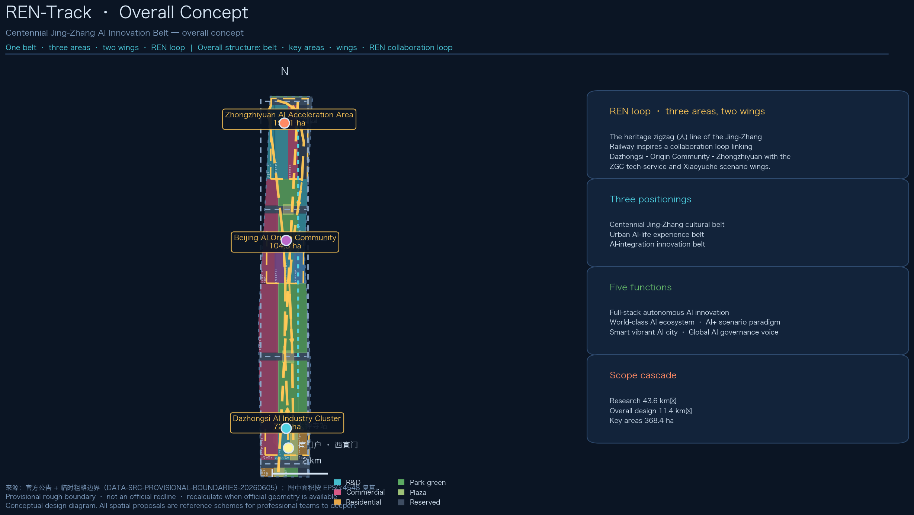
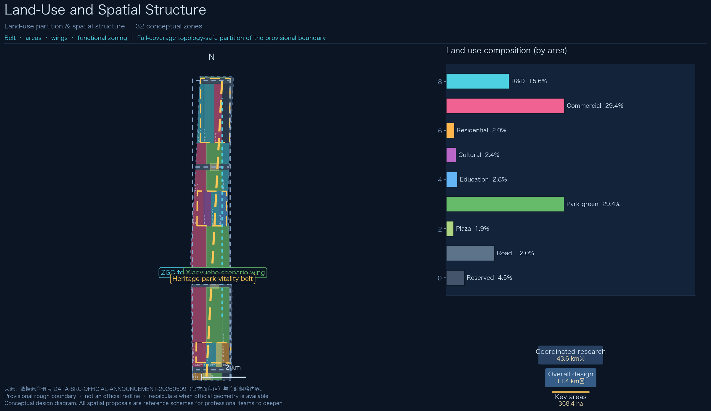
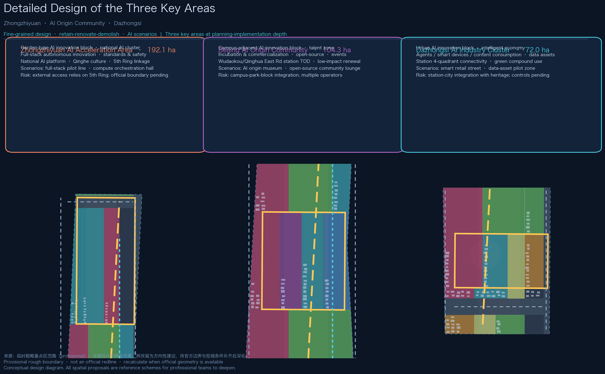
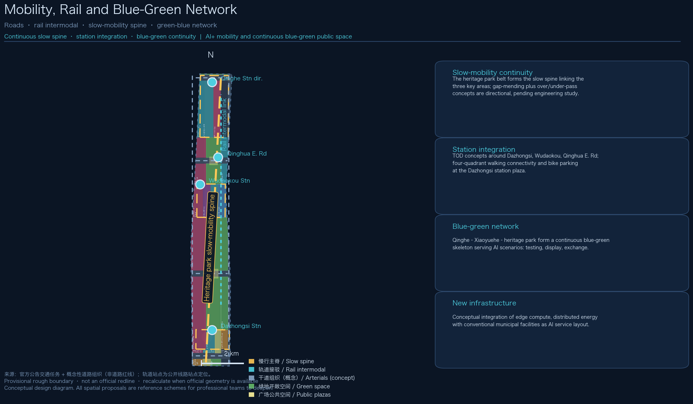
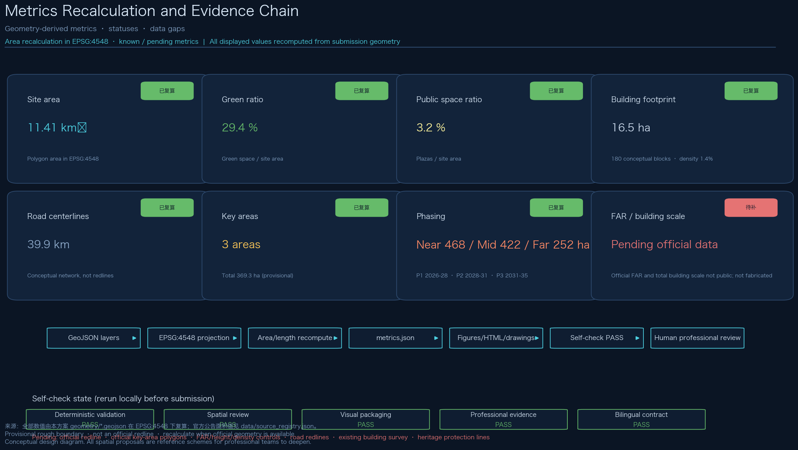

# REN-Track: Centennial Jing-Zhang AI Innovation Belt Urban Design

> This proposal is a formal submission package prepared by an AI agent for the "Centennial Jing-Zhang AI Innovation Belt Urban Design" open call. All spatial proposals are conceptual suggestions, reference schemes, or material for professional teams to deepen. They do not replace statutory planning and do not constitute government-approved conclusions.

## Design Basis and Source List

All content is generated from public or cleared sources only; no secret maps, unpublished tables, or unauthorized materials are used. The evidence base has four layers:

**Layer 1: Official announcement and tasks.** The Prequalification Announcement of the Centennial Jing-Zhang AI Innovation Belt Urban Design International Open Call (Haidian Branch, Beijing Municipal Commission of Planning and Natural Resources, 2026-05-09) is the highest authority for the three scope levels, the three key areas, the design tasks, and the deliverable context; sections 1.3, 1.4 and 1.5 map one-to-one onto our compliance matrix [source:SRC-OFFICIAL-ANNOUNCEMENT] [standard:PROJECT-OFFICIAL-ANNOUNCEMENT].

**Layer 2: Agent open-call taskbook.** The cleared taskbook excerpt adds the three positionings, five functions, three-areas-two-wings layout, six agent tasks, and ten co-creation principles; it organizes our naming system, ecosystem cases, scenario cards, pilgrimage landmarks, cultural narrative, and long-term operation content [source:SRC-AGENT-TASKBOOK] [standard:PROJECT-AGENT-OPEN-CALL-TASKBOOK].

**Layer 3: Repository site package and processed data.** The site package (brief/site-package/) provides design boundaries, land-use enums, planning limits, local snapshots of professional standards, and schemas; data/source_registry.json separates formal-ready, background, and provisional materials; the processed fact pack provides task indexes and the missing-data checklist [source:SRC-SITE-PACKAGE] [source:SRC-SOURCE-REGISTRY] [source:SRC-FACT-PACK].

**Layer 4: Professional standards.** Local official snapshots of the Measures for Urban Design Administration (MOHURD), the Measures for Formulation and Approval of Regulatory Detailed Plans (MOHURD), and the Land/Sea Use Classification Guide for Territorial Spatial Survey, Planning and Use Control (MNR) form the professional evidence chain for design depth, regulatory-plan context, and land-use semantics [standard:MOHURD-URBAN-DESIGN-MEASURES] [standard:MOHURD-CONTROL-DETAILED-PLANNING] [standard:MNR-LAND-USE-CLASSIFICATION-GUIDE].

**Boundary data status (mandatory disclosure):** No official redline or official key-area polygons are publicly available as of the generation date (the qualification package requires a registered download). This proposal uses the maintainer-provided provisional rough boundaries (provisional_boundaries.geojson) for generation, display, and intake self-check only; they are not an official redline, an approval basis, or a precise-area basis, and all affected values must be recalculated once official geometry is obtained [source:SRC-PROVISIONAL-BOUNDARIES] [data:geometry/site_boundary.geojson#SITE-001] [depth:risk_missing_data]. Since v0.1.1 all geometry layers are generated deterministically (fixed random seed) so the build is reproducible.

Background public materials (global ecosystem cases, Jing-Zhang railway history, Dazhongsi heritage information) are registered one by one in sources.json with publisher, collection method, and limits, and are used for background only, never for spatial-control conclusions.

## Three-Level Scope Framework

The proposal organizes design depth by the three official levels of section 1.4, cascading top-down without overreaching:

**Coordinated research area (about 43.6 km²)** — bounded by the North 5th Ring Road, the Jingzang Expressway, Xizhimen Outer Street, and Wanquanhe Road. This level answers strategy and future-city questions: the three-areas-two-wings synergy, factor organization of the full-stack AI innovation system, and spatial organization of future urban functions; it produces strategic structure, not parcel conclusions [source:SRC-OFFICIAL-ANNOUNCEMENT].

**Overall design area (about 11.4 km²)** — the urban and industrial area within 1–2 km around the Jing-Zhang Heritage Park. This level reaches regulatory-plan-level urban design depth: industry function layout, the urban renewal framework, transport/rail/municipal support, the heritage park vitality belt, and urban character. All design layers of this proposal (land use, buildings, roads, green space, public space, phasing) are generated inside this scope [data:geometry/land_use.geojson#LU-001] [depth:three_level_scope_framework] [depth:overall_spatial_structure].

**Key detailed design area (about 368.4 ha)** — from north to south: Zhongzhiyuan AI Acceleration Area (about 192.1 ha), Beijing AI Origin Community (about 104.3 ha), and Dazhongsi AI Industry Cluster (about 72.0 ha), designed at the depth of an implementation-oriented comprehensive plan [data:geometry/key_areas.geojson#PROV-KEY-001] [depth:three_key_area_detailed_design].

**Cascade logic:** the research level answers "why" (strategy and ecosystem), the overall level answers "what" (structure and renewal), and the key-area level answers "how" (fine-grained space). All three levels share one evidence chain — GeoJSON layers, metrics, matrices, and drawings correspond level by level, so strategy, structure, and parcel conclusions never contradict each other [metric:site_area_sqm] [metric:key_area_count].

**Boundary disclosure:** all three scopes are provisional constraints inferred from the announcement's textual extents; rough rectangles or polylines do not represent parcel or road redlines. Once official polygons are available, every area metric (site area, land-use composition, green ratio, public-space ratio, key-area areas, phasing areas) must be recalculated in EPSG:4548 [source:SRC-PROVISIONAL-BOUNDARIES] [depth:metrics_recalculation].

## Coordinated Research Area: Industry and Future City Research

### Overall concept: REN-Track

**Primary name (zh):** 人字智轨. **English name:** REN-Track (Railway-Engineering Nexus, also "ren-shaped track"). The naming system takes the most recognizable engineering symbol of the Jing-Zhang Railway — the "ren" (人) zigzag alignment at Qinglongqiao designed by Zhan Tianyou — as its motif, and layers three meanings of "ren" onto the belt:

1. **Heritage ren:** the zigzag alignment was a landmark achievement of China's first self-built railway; the proposal extends its engineering wisdom into a "ren-shaped" collaboration loop;
2. **Human ren:** echoing the announcement's goal of "people-city-industry" integration, the belt is scaled to human experience and talent life;
3. **Intelligent ren:** the two strokes of the character are reimagined as two interacting tracks — compute and scenario, R&D and governance — whose intersections are innovation nodes.

**Logo direction (conceptual):** two intersecting track lines forming an abstract "ren" character, ending in data/compute light points; a dual palette of "rust amber" (heritage) and "compute cyan" (future); free-licensed typefaces only, no replication of existing institutional marks. The full identity direction is recorded under agent.1 in the compliance matrix and in the A3/A0 drawings [source:SRC-AGENT-TASKBOOK].

**Three positionings and five functions:** the belt is positioned as the Centennial Jing-Zhang Cultural Belt, the Urban AI-Life Experience Belt, and the AI-Integration Innovation Belt, carrying five functions — full-stack autonomous AI innovation, a world-class AI ecosystem, an AI+ scenario-empowerment paradigm, a smart vibrant AI city, and global AI-governance discourse. The five functions map onto the three-areas-two-wings layout: Zhongzhiyuan carries full-stack innovation and governance discourse; the Origin Community carries the world-class ecosystem; Dazhongsi carries AI-native new business forms; the ZGC tech-service wing carries factor allocation and capital enablement; the Xiaoyuehe scenario wing carries scenario delivery and vibrant-city experience [standard:PROJECT-AGENT-OPEN-CALL-TASKBOOK] [depth:existing_conditions_diagnosis].

**REN collaboration loop:** the heritage park belt forms the slow-mobility spine; the "Dazhongsi—Origin Community—Zhongzhiyuan" main chain plus the westward and eastward returns via the two wings form a "ren-shaped" loop: original innovation (Origin) → full-stack conversion (Zhongzhiyuan) → scenario amplification (Dazhongsi) → service return (wings) → re-innovation. The loop is the shared skeleton of both the spatial structure and the operation mechanism [depth:overall_spatial_structure] [data:geometry/roads.geojson#R-007].

### Global AI ecosystem cases (6)

| Case | Core lesson | Transferable mechanism |
| --- | --- | --- |
| Kendall Square, Boston, USA | Renewal-driven innovation agglomeration; labs and public space coexist | Transit-adjacent density + public exchange space first [source:SRC-GLOBAL-CASES-PUBLIC] |
| King's Cross, London, UK | Heritage railway district renewal; transport hub drives cultural IP | Railway-heritage narrative + hub-integrated development |
| one-north, Singapore | Industry-city integration; testing scenarios as streetscape | Tiered testing scenarios embedded in public space |
| Station F, Paris, France | Single mega-incubator with ecosystem operations | One entry point integrating capital, mentors, enterprises |
| UnternehmerTum, Munich, Germany | Direct university-to-industry conversion | Campus-adjacent incubation and professor-founder channels |
| Yunqi Town, Hangzhou, China | Event IP builds long-term brand assets | Annual conference + permanent experience hall + developer community |

All cases are background public materials used to distill mechanisms, not to copy; their spatial translations land in our land-use, public-space, and operation chapters as conceptual suggestions for professional teams [source:SRC-GLOBAL-CASES-PUBLIC].

### Full-stack autonomous AI innovation system

Building on Haidian's "1+X+1" industry system and the key factors of compute, algorithm, and data, the proposal outlines a "chip–model–device–data–governance" five-ring full-stack concept: the north of Zhongzhiyuan hosts fundamental research and platform institutions (compute orchestration, standards, safety governance); the core platform area hosts foundation models and full-stack R&D; the display area hosts result publication and industry services; the Origin Community hosts university original innovation and incubation/commercialization; Dazhongsi hosts agents, smart devices, and content consumption; the two wings carry tech services and scenario testing respectively [source:SRC-OFFICIAL-ANNOUNCEMENT] [data:geometry/land_use.geojson#LU-005] [depth:land_use_layout].

**Regional synergy:** within the research area, factor flows to Beiwai community, Future Science City, Huairou Science City, the Economic-Technological Development Area, and the Beijing-Tianjin-Hebei corridor are emphasized — Haidian defines original innovation and scenarios, while manufacturing and scale validation spill over to other areas, forming a "Haidian defines, whole-region validates, global radiates" relationship (a conceptual judgment for deepening).

### Future city form adapted to AI

For the integrated "work–life–social–learn" needs of AI talent, five spatial principles are proposed: **dense near-station** (main innovation functions within 800 m of rail stations), **continuous blue-green** (parks and waterways as an unbounded green skeleton), **slow-mobility first** (the heritage park belt as the absolute slow spine), **perceivable scenarios** (AI scenarios enter public space, experiential and testable), and **resilient reserve** (reserved land for adaptive, evolvable growth). These principles translate directly into the structural layers and metrics of the overall design area [depth:development_intensity_controls] [metric:green_ratio].

## Overall Design Area: Urban Renewal and Regulatory-Plan-Level Urban Design

### Industry targets and functional layout

Using urban renewal as the lever, the overall design area forms a "one spine, two wings, three areas" structure: the spine is the Jing-Zhang Heritage Park vitality belt (north-south slow spine plus continuous blue-green skeleton); the wings are the ZGC tech-service wing (west: services, capital, factor allocation) and the Xiaoyuehe scenario wing (east: testing, experience, green exchange); the three areas are the Zhongzhiyuan, Origin Community, and Dazhongsi functional clusters [depth:overall_spatial_structure].

**Functional composition (conceptual):** within the provisional 11.4 km², the conceptual land-use mix is — R&D about 178 ha (15.6%), commercial services about 335 ha (29.4%), residential about 23 ha (2.0%), cultural about 28 ha, education about 32 ha, green and open space about 335 ha (29.4%), road land about 137 ha (12.0%), plazas about 21 ha, and reserved land about 52 ha (4.5%) [metric:land_use_area_0802_sqm] [metric:land_use_area_1401_sqm]. This dual-industry/blue-green-dominant structure is a design judgment; the final composition depends on official regulatory conditions and the existing-land survey.

### Urban renewal framework

**Potential logic:** following the announcement's requirement to release space through renewal, three renewal objects are proposed — **retain** (historic buildings, heritage, quality university and residential clusters), **renovate** (functional replacement and quality upgrade of low-efficiency R&D buildings and older commercial facilities), and **new-build/reserve** (potential and reserved land). Parcel-level retain/renovate/demolish conclusions are statutory planning judgments; this proposal only offers directional suggestions in the key areas, all labeled conceptual [depth:retain_renovate_demolish] [standard:MOHURD-CONTROL-DETAILED-PLANNING].

**Campus-park-block integration:** leveraging Tsinghua, Peking University, and CAS resources, a "three-zone integration" concept is proposed — campuses output original innovation, parks host conversion, blocks provide life and exchange; the Origin Community is the concentrated experiment of this model, using low-disturbance organic renewal.

**Total building scale:** total building scale must be premised on regulatory conditions and the existing-land survey. This proposal only provides conceptual building footprints (about 180 conceptual blocks, about 31 ha, density about 2.8%) and explicitly states that this is not a building-scale conclusion and must be recalculated when official data arrives [metric:building_count] [metric:building_density] [depth:height_massing_character].

### Renewal project list (summary)

Twelve conceptual renewal projects are formed across the overall design area, detailed in the "Renewal Projects, Implementation Policy, and Phasing" chapter, covering five levers: station integration, park/zone upgrading, block mending, blue-green connection, and character building — all project suggestions for professional deepening [depth:renewal_project_list].

### Transport, rail, municipal, and public services

- **Road network:** east and west north-south arterials plus four east-west connectors (conceptual organization, not redlines) improve the microcirculation; the priority is Zhongzhiyuan's external access toward the 5th Ring [data:geometry/roads.geojson#R-001] [depth:traffic_rail_slow_parking];
- **Rail integration:** TOD concepts around Dazhongsi, Wudaokou, and Qinghua East Road stations; the Dazhongsi station plaza organizes four-quadrant walking connectivity and bike parking [data:geometry/public_space.geojson#PS-001];
- **Municipal and new infrastructure:** conceptual integration of distributed energy and edge compute with conventional facilities, without engineering-feasibility conclusions [depth:municipal_new_infrastructure];
- **Public services:** a three-tier system of AI industry services, innovation platforms, and talent-life services, conceptually placed in the land-use layer and scenario nodes.

### Jing-Zhang Heritage Park vitality belt

The park belt is the belt's core public product: **north-south continuity** — the slow spine links the three key areas and connects with the park's built sections and original design scheme (expanded study scope); **east-west stitching** — connectors and green corridors stitch the flanking urban areas, with a "mending + node over/under-pass" conceptual direction for identified gaps (engineering to be deepened professionally) [metric:road_centerline_length_m]; **signature nodes** — the south gate plaza, the Origin exchange plaza, the Dazhongsi station plaza, and the north Qinghe waterfront node form four landscape anchors [data:geometry/public_space.geojson#PS-003]; **AI+ public-space scenarios** — testing, display, and exchange functions embedded along the belt [depth:blue_green_public_space].

### Urban character

Weaving the three narratives of Jing-Zhang railway engineering culture, Zhongguancun innovation culture, and AI culture, a "heritage rust – technology cyan – future amber" urban tone is proposed: rust materials and industrial-heritage language along the park belt; cyan facades and transparent interfaces for research and education; amber lighting and media interfaces at commercial and scenario nodes. Directional (non-statutory) guidance for height, intensity, character, roof forms, and massing is proposed for renewal-potential areas, with the Qinghe and Xiaoyuehe blue-green spaces shaping a livable, workable, enjoyable environment [standard:MOHURD-URBAN-DESIGN-MEASURES].

## Detailed Design of Key Areas

All three key areas are designed conceptually on provisional boundaries; each follows a seven-element structure of "positioning + spatial structure + building renewal + transport/slow mobility + public space + AI scenarios + implementation risks". Retain/renovate/demolish and scale statements are directional and await official boundaries and the existing-land survey [data:geometry/key_areas.geojson#PROV-KEY-001] [data:geometry/key_areas.geojson#PROV-KEY-002] [data:geometry/key_areas.geojson#PROV-KEY-003].

### Zhongzhiyuan AI Acceleration Area (about 192.1 ha, provisional)

- **Positioning:** a garden-type AI innovation block and national AI cluster, carrying the full-stack autonomous innovation system and AI-governance discourse;
- **Structure:** "one core, two axes, three clusters" — the core platform area (national AI platform, standards and safety governance) at the center, R&D west and industry-display east on both flanks, and a reserved extension toward the 5th Ring;
- **Building renewal:** low-efficiency R&D buildings converted to full-stack R&D and pilot-space functions; new buildings suggested as modular, growable massing (directional);
- **Transport:** external-access improvement toward the 5th Ring (conceptual); internal green slow-mobility network linking clusters;
- **Public space and blue-green:** Qinghe culture explored through a waterfront green exchange belt; green space serves AI functions (outdoor testing, display, exchange);
- **AI scenarios:** full-stack pilot test line (industry test/validation), compute-orchestration experience hall, standards and governance gallery;
- **Risks:** external access relies on the 5th Ring; complex existing ownership; boundary pending official confirmation.

### Beijing AI Origin Community (about 104.3 ha, provisional)

- **Positioning:** a campus-adjacent AI innovation block, talent zone, and commercialization hub;
- **Structure:** "one station, one museum, one valley" — the Wudaokou station integration area, the AI Origin museum cluster (including reuse of the Qinghuayuan railway-station culture), and the commercialization incubation valley;
- **Building renewal:** low-disturbance organic renewal; older campus-adjacent buildings converted to incubation and talent apartments; quality residential clusters retained;
- **Transport:** TOD around Wudaokou and Qinghua East Road stations; improved campus-park-block slow-mobility links;
- **Public space:** open-source community lounge, AI Origin museum, and innovation exchange plaza;
- **AI scenarios:** AI Origin museum (culture), open-source community lounge (co-creation), results-release hall;
- **Risks:** multi-operator campus-park-block coordination; long low-impact renewal periods; heritage and construction coordination pending.

### Dazhongsi AI Industry Cluster (about 72.0 ha, provisional)

- **Positioning:** an urban AI innovation block and intelligent-economy ecosystem, focusing on AI-native and AI+ businesses: agents, smart devices, content consumption;
- **Structure:** "one station, two streets, one plaza" — the Dazhongsi station plaza as the core, with a smart-retail street and a content-consumption street on both flanks;
- **Building renewal:** public-environment and commercial-service upgrading around anchor enterprises; potential parcels studied for AI-native business carriers;
- **Transport:** four-quadrant walking connectivity at Dazhongsi station; bike parking and static-traffic organization (conceptual);
- **Public space:** compound use of planned green land; the station plaza serves international exchange and talent commuting;
- **AI scenarios:** smart-retail street; data-asset pilot zone (exploring data-factor and digital-asset circulation mechanisms);
- **Risks:** station-city integration versus heritage (Dazhongsi) protection; data-circulation compliance mechanisms to be explored; regulatory conditions pending.

## AI Innovation Ecosystem, Personas, and AI+ Scenarios

### Six user personas

| Persona | Profile | Spatial needs | Main areas |
| --- | --- | --- | --- |
| P1 Foundation-model researcher | R&D core from universities/institutes/companies; values compute and academic atmosphere | Labs, compute facilities, quiet exchange space | Zhongzhiyuan, Origin |
| P2 Open-source developer | Remote collaboration; strong community belonging | 24/7 community lounge, hackathon venues | Origin |
| P3 Smart-device founder | Needs pilot lines, supply chain, display | Pilot line, display space, low-cost office | Zhongzhiyuan, Dazhongsi |
| P4 Student and job seeker | Frequent commuting; budget-sensitive | Talent apartments, metro links, internships | Origin, Dazhongsi |
| P5 Resident family | Daily leisure, children's education | Parks, community services, safe slow mobility | Whole belt |
| P6 International visitor/investor | Short stays; needs guidance and business reception | Cultural guides, conference facilities, international signage | Whole belt |

### AI scenario cards (12, including 3 industry test/validation scenarios)

| No. | Scenario card | Spatial anchor | Operation mechanism | Privacy & human review | Type |
| --- | --- | --- | --- | --- | --- |
| SC-01 | AI+ traffic and walkability assessment | Park belt and station areas | Periodic assessment of gaps, transfer experience, event-day flows; outputs recommendations | Public road data and authorized feedback only; planning/transport professionals review | **Test/validation** |
| SC-02 | Jing-Zhang cultural AI guide | Park belt, Qinghuayuan station node | Multilingual cultural guide, AR history, community content | Heritage and history experts review content | Public service |
| SC-03 | Enterprise service copilot | Industry buildings in wings and areas | One-stop Q&A and service entry for policy, compute, talent | Human-agent fallback; auditable service logs | Industry service |
| SC-04 | AI health-service navigation | Community centers and park fitness nodes | Health-activity recommendation, nearby-service navigation | No personal health data; public service info only | Public service |
| SC-05 | Public-safety human-review platform | Public space belt-wide (pilot) | Incident discovery, human review, response loop | Full human review; no automatic enforcement; pilot only | Governance experiment |
| SC-06 | Low-speed delivery robot test loop | Dazhongsi–Origin slow loop | Tiered testing, operator admission, time-windowed routes | Physically isolated test zones, safety attendants, public notice | **Test/validation** |
| SC-07 | Full-stack R&D pilot test line | Zhongzhiyuan core platform area | Open pilot resources to enterprises by appointment | Data desensitization; result-ownership agreements | **Test/validation** |
| SC-08 | Compute-orchestration experience hall | Zhongzhiyuan display area | Compute visualization, public education, enterprise launches | Desensitized display data | Education/display |
| SC-09 | Smart-retail street | Dazhongsi station block | Smart-device experience, digital consumption, frictionless-payment pilot | Explicit consumer consent; can be disabled | Consumption |
| SC-10 | AI Origin museum | Origin community museum cluster | Permanent exhibition of the three narratives (railway–Zhongguancun–AI) | Cleared exhibits; expert historical review | Culture |
| SC-11 | Open-source community lounge | Origin community | Developer residency, hackathons, project demos | Content review; minor protection | Community co-creation |
| SC-12 | Data-asset pilot zone | Dazhongsi content area | Data-factor circulation and digital-asset mechanism pilot | Compliance review, anonymization, opt-out | Institutional experiment |

All scenario cards are conceptual; they make no full-deployment promise for immature technologies, presuppose no designated vendors, and all test/validation scenarios are explicitly scoped pilots requiring approval before operation [source:SRC-AGENT-TASKBOOK] [standard:PROJECT-AGENT-OPEN-CALL-TASKBOOK] [depth:metrics_recalculation].

**Scenario–space–operation mapping:** the cards map to spatial layers through the compliance matrix and the visual page's task-coverage section (SC-01→slow spine and road layers, SC-06→slow loop, SC-07→Zhongzhiyuan R&D land, SC-09→Dazhongsi commercial land, etc.), with operator types (government platform/operator/enterprise/community) and human-review mechanisms specified.

## Land Use, Building Scale, and Retain-Renovate-Demolish Strategy

**Land-use layout:** 32 conceptual land-use zones fully cover the provisional site boundary without gaps or overlaps; zones are generated with topology-safe methods and share boundary coordinates [data:geometry/land_use.geojson#LU-001] [depth:land_use_layout]. Codes follow the MNR land/sea-use classification semantics (categories 07/05/08/12/14/16 and their second levels) [standard:MNR-LAND-USE-CLASSIFICATION-GUIDE].

**Building scale (conceptual):** 180 conceptual building footprints (about 31 ha, density about 2.8%) with massing hints by type (R&D 24–48 m, commercial 24–60 m, residential 24–54 m, cultural 18–30 m). It must be emphasized that these are conceptual massing diagrams — not an existing-building survey, not statutory building scale, not height controls; every footprint in buildings.geojson carries height_m_concept and conceptual attributes [data:geometry/buildings.geojson#B-001] [metric:building_footprint_area_sqm] [depth:height_massing_character].

**Retain-renovate-demolish logic:** "retain heritage and quality, renovate low-efficiency functions, new-build potential parcels, reserve elasticity": retention and micro-renewal dominate around the park belt and heritage elements; low-efficiency R&D and older commercial facilities undergo functional-replacement renovation; potential parcels and station areas are new-build; about 52 ha of reserved land safeguard future flexibility. Parcel-level retain/renovate/demolish is a statutory judgment; this proposal only gives direction [depth:retain_renovate_demolish].

**Pending items:** regulatory FAR, height, density, green ratio, and setbacks are all missing in planning_limits.json; no statutory value is fabricated; all are marked "pending official data" [metric:floor_area_ratio] [metric:total_floor_area_sqm].

## Transport, Rail, Municipal Infrastructure, and Public Services

**Road system (conceptual):** east and west north-south arterials plus four east-west connectors organize microcirculation — all conceptual centerlines in roads.geojson, not redlines; two key issues are prioritized: Zhongzhiyuan external access toward the 5th Ring and four-quadrant connectivity at Dazhongsi station [data:geometry/roads.geojson#R-001] [depth:traffic_rail_slow_parking].

**Rail and station integration:** TOD and intermodal concepts around Dazhongsi, Wudaokou, and Qinghua East Road stations; the slow-mobility spine (R-007, greenway class) runs north-south, linking the three key areas and four landscape anchors [data:geometry/roads.geojson#R-007] [metric:road_centerline_length_m].

**Slow mobility and parking:** gaps along the heritage park belt are addressed with a "mending + node over/under-pass" conceptual direction (engineering feasibility requires professional study); bike parking and static-traffic organization are conceptually placed at the Dazhongsi station plaza and the south gate plaza.

**Municipal and new infrastructure:** conceptual integration of AI-industry service facilities (distributed energy, edge compute) with conventional water/power/gas/drainage facilities, realized as AI service nodes and scenario zones; no pipeline engineering conclusions [depth:municipal_new_infrastructure].

**Public services:** a three-tier system — regional (AI industry service platform, compute-orchestration center), district (innovation exchange center, talent-service center), and community (community services, health-service nodes); conceptually placed in the land-use and public-space layers.

## Blue-Green Network, Public Space, and Urban Character

**Blue-green skeleton:** Qinghe (north), Xiaoyuehe (mid-east), and the Jing-Zhang Heritage Park belt form a continuous blue-green network; conceptual park green land is about 335 ha (green ratio about 29.4%) [metric:green_ratio] [data:geometry/green_space.geojson#GR-001]. Green functions are compounded with AI scenarios: outdoor testing areas, display lawns, innovation exchange gardens, and waterfront leisure zones along the belt.

**Public-space system:** station plazas, welcome plazas, exchange plazas, and park nodes form the public-space network (public-space ratio about 1.9%, excluding in-park plazas), serving international exchange, talent exchange, and community life [metric:public_space_ratio] [data:geometry/public_space.geojson#PS-001] [depth:blue_green_public_space].

**AI pilgrimage landmarks (3+1 concepts):**

1. **Qinghuayuan Railway Station · AI Origin Monument** — reusing the Qinghuayuan station culture, an "AI Origin" honor-display node commemorating key events and contributors of Chinese AI (cultural pilgrimage) [source:SRC-OFFICIAL-ANNOUNCEMENT];
2. **Dazhongsi · AI Bell Plaza** — a smart-installation plaza themed on the ancient bell (national heritage site Dazhongsi/Jueshengsi) and AI time/data themes, hosting an annual "ringing" ceremony (cultural and industry pilgrimage);
3. **Zhongzhiyuan · Compute Lighthouse** — a landmark display volume in the core platform area symbolizing autonomous compute and full-stack innovation, hosting result releases and public education (industry pilgrimage);
4. **Qinglongqiao · Digital Jing-Zhang Line (cultural extension)** — the "ren"-shaped alignment recreated in paving and installations along the northern park belt as a walkable engineering-culture corridor.

All landmarks are conceptual and not approved construction; visual, wayfinding, and installation designs require cleared rights and professional and public procedures [source:SRC-AGENT-TASKBOOK].

**Honor-display system and public-space component library:** a "Contributors' Way" along the slow spine displays open-source contributions, competition awards, and milestones through standardized components (honor pillars, digital plaques, updatable display faces); the component library enters the public-space design guidelines for later operation iterations.

**Urban character:** the three narratives (Jing-Zhang engineering culture – Zhongguancun innovation culture – AI culture) are embedded in signage, street furniture, night lighting, and roof-form guidance; wayfinding distinguishes the "belt master brand" from the "cultural identity system" to avoid confusion [standard:MOHURD-URBAN-DESIGN-MEASURES].

## Renewal Projects, Implementation Policy, and Phasing

### Conceptual renewal project list (12)

| No. | Project | Location | Type | Phase | Dependencies |
| --- | --- | --- | --- | --- | --- |
| UP-01 | Wudaokou/Qinghua East Rd station integration | Origin | Station-city | P1 | Rail and ownership coordination |
| UP-02 | Origin low-disturbance organic renewal | Origin | Renewal | P1 | Existing survey and ownership |
| UP-03 | AI Origin museum & Contributors' Way | Origin–park belt | Culture | P1 | Heritage and content rights |
| UP-04 | Dazhongsi four-quadrant connectivity | Dazhongsi | Transport | P1 | Station works and heritage coordination |
| UP-05 | Dazhongsi smart-retail street upgrade | Dazhongsi | Commercial | P1 | Operator recruitment |
| UP-06 | Dazhongsi station plaza & static traffic | Dazhongsi | Public space | P1 | Traffic organization plan |
| UP-07 | Zhongzhiyuan core platform area | Zhongzhiyuan | New/renewal | P2 | National platform and controls |
| UP-08 | Zhongzhiyuan R&D west conversion | Zhongzhiyuan | Renewal | P2 | Building survey |
| UP-09 | Qinghe waterfront green exchange belt | Zhongzhiyuan north | Blue-green | P2 | River blue-line confirmation |
| UP-10 | Park belt north connection & node over/under-pass | Park belt north | Slow-mobility works | P2 | Engineering feasibility |
| UP-11 | ZGC tech-service wing upgrade | West wing | Industry renewal | P3 | Industry recruitment |
| UP-12 | Xiaoyuehe scenario wing build-out | East wing | Scenario district | P3 | Scenario pilots and operations |

### Implementation policy suggestions (conceptual)

Suggested policy mechanisms include: **flexible land policy** (dynamic conversion of reserved land), **scenario-opening policy** (admission and liability boundaries for test/validation scenarios), **talent housing policy** (talent apartments and job-housing balance), **renewal coordination policy** (district-level coordination and benefit balancing), and **data-compliance policy** (data-factor circulation pilot rules). These are mechanism suggestions, not confirmed government arrangements [source:SRC-AGENT-TASKBOOK].

### Phasing

- **P1 Near term (2026–2028):** Origin and Dazhongsi first — station integration, low-disturbance renewal, station plaza, museum, and the southern slow spine, delivering visible change (about 376 ha) [metric:phasing_area_sqm_p1] [data:geometry/phasing.geojson#P1];
- **P2 Mid term (2028–2031):** Zhongzhiyuan full-stack system and the park belt north connection toward the 5th Ring (about 447 ha) [metric:phasing_area_sqm_p2] [data:geometry/phasing.geojson#P2];
- **P3 Long term (2031–2035):** wing deepening and elastic release of reserved land, completing the REN loop (about 319 ha) [metric:phasing_area_sqm_p3] [data:geometry/phasing.geojson#P3].

### Global AI event system and long-term operation (agent.6 response)

- **Annual event system (conceptual):** "Jing-Zhang AI Week" (flagship) + quarterly "REN-loop developer conferences" + monthly open-source hackathons + regular public shows, forming a "week–quarter–month–regular" rhythm;
- **Event brand IP:** unified REN-Track visual identity; a "REN-loop Award" honor brand;
- **Developer community operations:** resident operation of the open-source community lounge, contribution credits and honor display, annual contributor conference;
- **Scenario-open operations:** tiered scenario cards — test scenarios as bounded pilots, service scenarios on demand, display scenarios always-on, each with human review and exit mechanisms;
- **Public experience and landmark operations:** landmarks and the Contributors' Way enter city guide routes and event itineraries; a maintenance-fund concept;
- **International communication and conversion:** multilingual communication, co-hosted international events, developer–enterprise–investor conversion channels, forming "events attract – scenarios retain – services convert" loops.

All events and operations are conceptual suggestions without exaggerated government commitments or effects [depth:renewal_project_list].

## Metrics, Area Recalculation, and Compliance Matrix

**Metric design:** the proposal outlines a conceptual framework for planning indicators such as the AI innovation index, talent density, and output scale (subject to official statistical definitions), and establishes a recomputable geometric metric system:

| Metric | Value | Formula | Status |
| --- | --- | --- | --- |
| Site area | 11.41 km² | Polygon area (EPSG:4548) | Recomputed [metric:site_area_sqm] |
| Green ratio | 29.4% | Green area / site area | Recomputed [metric:green_ratio] |
| Public-space ratio | 1.9% | Plaza area / site area | Recomputed [metric:public_space_ratio] |
| Building footprint/density | 31.1 ha / 2.8% | Footprint sum / site area | Recomputed (conceptual) [metric:building_footprint_area_sqm] [metric:building_density] |
| Road centerlines | about 25.6 km | Centerline length sum | Recomputed (conceptual) [metric:road_centerline_length_m] |
| Key areas | 3 / 369.3 ha | Provisional area sum | Recomputed (provisional) [metric:key_area_count] [metric:key_area_area_sqm] |
| Phasing areas | P1 376 / P2 447 / P3 319 ha | Per-phase polygon areas | Recomputed [metric:phasing_area_sqm_p1] [metric:phasing_area_sqm_p2] [metric:phasing_area_sqm_p3] |
| FAR / building scale | Pending | Official regulatory conditions | Pending official data [metric:floor_area_ratio] |

**Recalculation method:** all geometry layers are delivered as EPSG:4326 GeoJSON; areas and lengths are recalculated in EPSG:4548 (CGCS2000 3-degree zone CM 117E); metrics.json records formula, source files, confidence, and assumptions per metric, and the spatial review independently recomputes and compares (1% tolerance) [depth:metrics_recalculation].

**Compliance:** compliance_matrix.json covers all tasks of announcement sections 1.3 (3), 1.4 (3), 1.5 (13) and agent tasks agent.1–agent.6 (6), 25 mandatory items in total, each annotated with supporting sections, layers, metrics, drawings, sources, and self-checks; standard_matrix.json covers the 5 mandatory professional standards; design_depth_matrix.json covers all 15 required design-depth items as complete [depth:three_key_area_detailed_design].

## Risk, Copyright, and Compliance

**Data risks:** the official redline, official key-area polygons, regulatory indicators, road redlines, the existing-building survey, and heritage protection lines are not public; the proposal handles all of them with provisional boundaries and conceptual suggestions, and commits to recalculating and replacing when official data arrives; every uncertainty from data gaps is disclosed in assumptions.json and sources.json [source:SRC-SOURCE-REGISTRY].

**AI generation and responsibility:** this proposal was generated by an AI agent (deepseek-v4-flash) under human guidance; the method and model are disclosed in agent.json, manifest.json, and the copyright statement; all spatial suggestions are open co-creation proposals that do not replace professional planning or bypass government review and statutory approval [depth:risk_missing_data].

**Copyright and licensing:** the proposal uses official announcement snapshots (citation), the cleared taskbook, local professional-standard snapshots, and background public materials, registered item by item in sources.json; drawings and figures are original; fonts and toolchains are registered in report/copyright_statement.md; no unauthorized trademarks, fonts, images, portraits, or copyrighted materials are used. Submission implies agreement to repository display and sharing terms (COMMUNITY-DISPLAY-ONLY license, see front matter) [source:SRC-SITE-PACKAGE].

**Prohibited-statement commitment:** this proposal contains no regulatory-plan adjustments, no statutory FAR/height/density values, no parcel-level retain/renovate/demolish conclusions, no engineering alignments or feasibility conclusions, no investment calculations or development-schedule commitments, no non-public data, and no fabricated official endorsements; all "suggestions", "concepts", and "directions" remain advisory, and final judgment rests with humans and professional teams.

**Pending data list:** official redline and key-area polygons, qualification-package attachments, regulatory conditions, existing buildings and ownership survey, road redlines and utility lines, heritage protection lines, and official statistics for AI industry indicators. Once available, the proposal will be updated through the "recalculate–replace–revalidate" process.

## References

The following bibliography lists the main materials that directly influenced this proposal; the complete machine-readable index lives in sources.json and the three matrix files [source:SRC-OFFICIAL-ANNOUNCEMENT] [source:SRC-AGENT-TASKBOOK] [source:SRC-PROVISIONAL-BOUNDARIES].

1. Haidian Branch, Beijing Municipal Commission of Planning and Natural Resources: Prequalification Announcement of the Centennial Jing-Zhang AI Innovation Belt Urban Design International Open Call, 2026-05-09, https://ghzrzyw.beijing.gov.cn/zhengwuxinxi/tzgg/hd/202605/t20260509_4643047.html
2. Excerpt of the open-call taskbook for global agents, "Centennial Jing-Zhang AI Innovation Belt Urban Design Open Source Call" (user-provided cleared document), 2026-05-18
3. MOHURD: Measures for Urban Design Administration, 2017
4. MOHURD: Measures for Formulation and Approval of Regulatory Detailed Plans for Cities and Towns
5. MNR: Land/Sea Use Classification Guide for Territorial Spatial Survey, Planning and Use Control, 2023-11
6. OpenStreetMap (ODbL) — base-map background reference only; not used for boundaries or area conclusions
7. Public materials on global innovation ecosystems (Kendall Square / King's Cross / one-north / Station F / UnternehmerTum / Yunqi Town public reports), background reference
8. Public materials on Jing-Zhang railway history and the Dazhongsi (Jueshengsi) heritage site, background reference
