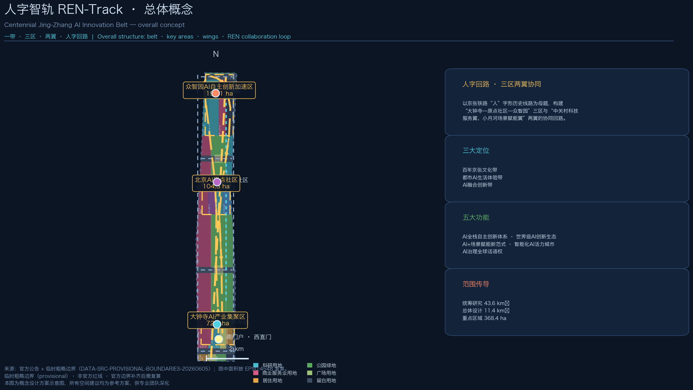
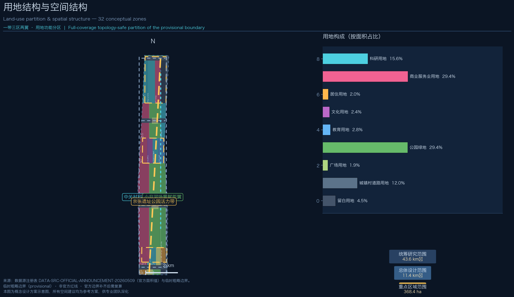
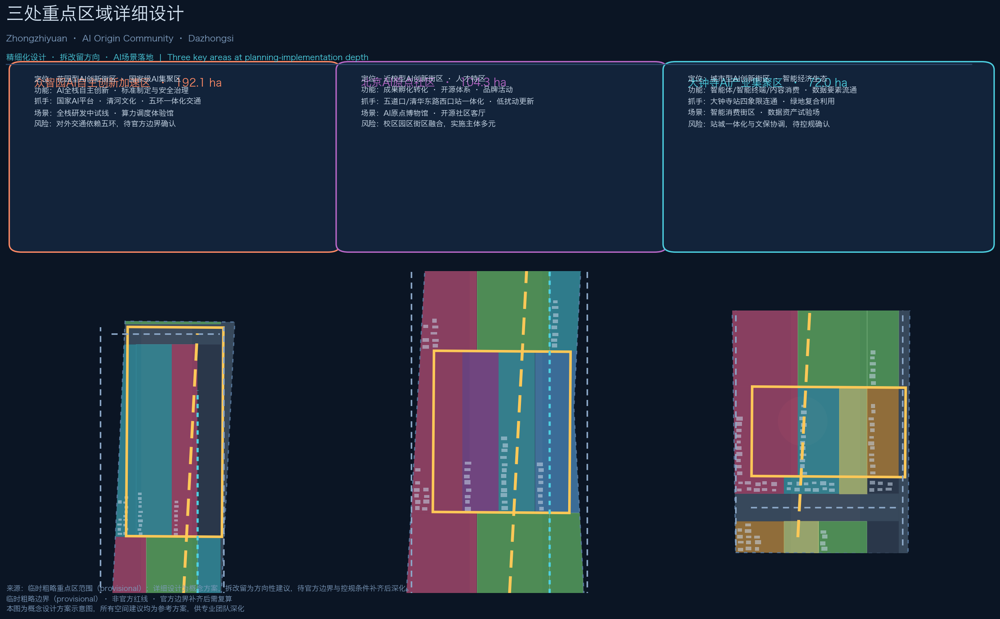
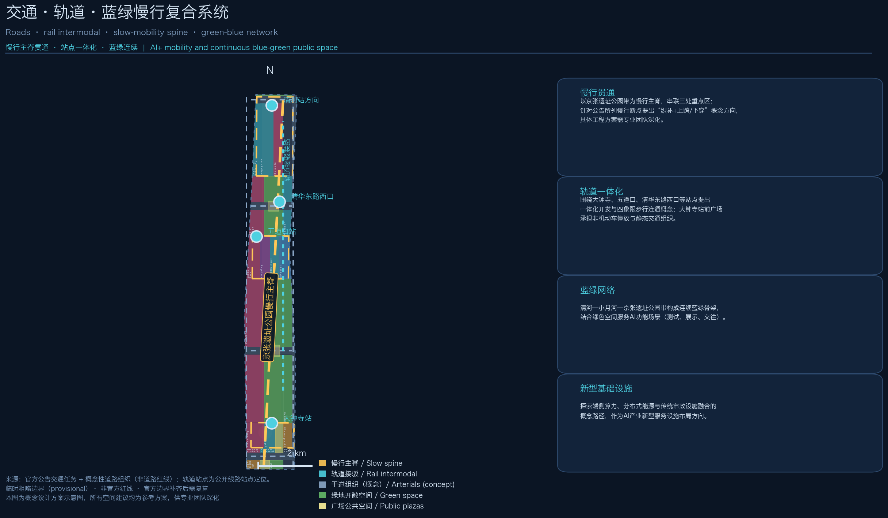
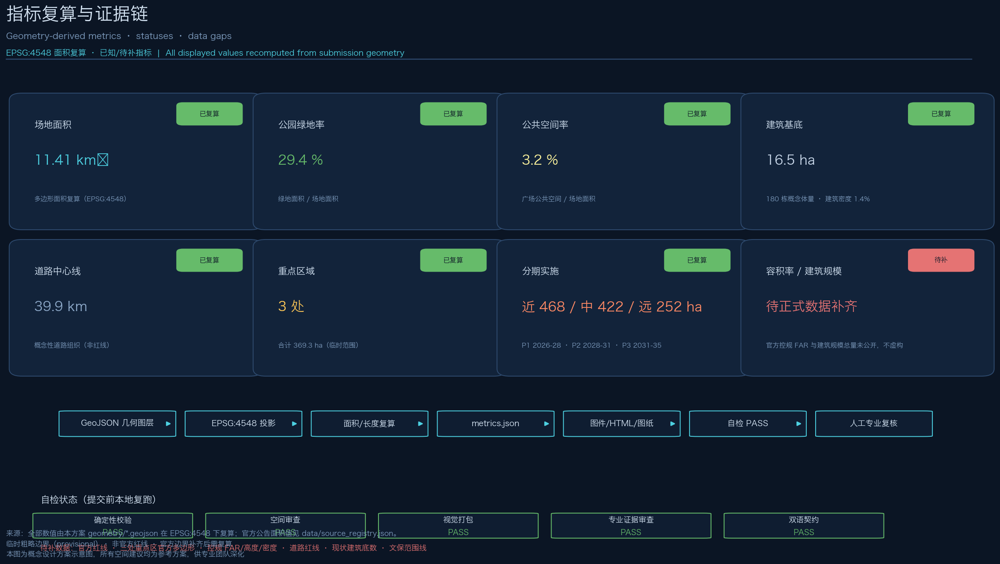

# 人字智轨 REN-Track：百年京张AI创新带城市设计

> 本方案为 AI 智能体参与「百年京张AI创新带城市设计开源征集」的正式提交包。所有空间落地建议均为概念建议、参考方案，可供专业团队深化研究，不替代正式规划，不构成政府审定结论。

## 设计依据与资料清单

本方案全部依据公开或清权资料生成，未使用任何秘密地图、未公开表格或未经授权素材。核心依据包括四类：

**第一类：官方公告与任务要求。** 北京市规划和自然资源委员会海淀分局发布的《百年京张AI创新带城市设计国际方案征集资格预审公告》（2026-05-09）是三层范围、三处重点区域、设计任务与成果语境的最高依据，其中 1.3 征集目的、1.4 项目规模、1.5 设计任务逐条对应本方案任务覆盖矩阵 [source:SRC-OFFICIAL-ANNOUNCEMENT] [standard:PROJECT-OFFICIAL-ANNOUNCEMENT]。

**第二类：面向智能体的开源征集任务书。** 用户提供的清权任务书摘录补充了三大定位、五大功能、三区两翼、六项智能体任务与十条共创原则，本方案以此组织命名体系、生态案例、场景卡、朝圣地标、文化叙事与长期运营内容 [source:SRC-AGENT-TASKBOOK] [standard:PROJECT-AGENT-OPEN-CALL-TASKBOOK]。

**第三类：仓库数据包与处理资料。** 站点包（`brief/site-package/`）提供设计边界、用地分类枚举、规划限值、专业标准本地快照与 schema；公共资料登记表 `data/source_registry.json` 区分 formal 可用、背景与 provisional 资料；处理事实包提供任务索引与缺口清单 [source:SRC-SITE-PACKAGE] [source:SRC-SOURCE-REGISTRY] [source:SRC-FACT-PACK]。

**第四类：专业标准。** 住建部《城市设计管理办法》、住建部《城市、镇控制性详细规划编制审批办法》、自然资源部《国土空间调查、规划、用途管制用地用海分类指南》的本地官方快照构成专业证据链，分别支撑城市设计深度、控规语境与用地分类语义 [standard:MOHURD-URBAN-DESIGN-MEASURES] [standard:MOHURD-CONTROL-DETAILED-PLANNING] [standard:MNR-LAND-USE-CLASSIFICATION-GUIDE]。

**边界资料状态（必须披露）：** 截至方案生成日，公开渠道未取得官方精确红线与三处重点区官方多边形（资格预审文件包需登记下载，暂不可公开获取）。本方案采用仓库维护的临时粗略边界 `provisional_boundaries.geojson`，仅在生成、展示与临时自检中使用；它不作为官方红线、审批依据或精确面积复算依据，官方边界补齐后需统一复算并替换 [source:SRC-PROVISIONAL-BOUNDARIES] [data:geometry/site_boundary.geojson#SITE-001] [depth:risk_missing_data]。本方案 v0.1.1 起，全部几何图层采用确定性生成（固定随机种子），构建可复现。

本方案使用的背景性公开资料（全球创新生态案例、京张铁路历史、大钟寺文保信息）在 `sources.json` 中逐条登记发布者、获取方式与限制，全部标记为背景资料，不用于支撑空间控制结论。

## 三层范围工作框架

方案按公告 1.4 的三级范围组织工作深度，逐级传导、避免跨级下结论：

**统筹研究范围（约 43.6 km²）**：北至北五环路、东至京藏高速、南至西直门外大街、西至万泉河路。本层回答产业战略与未来城市形态问题——三区两翼的协同关系、AI 全栈创新体系的要素组织、未来城市功能的空间组织方式，产出战略结构而非地块结论 [source:SRC-OFFICIAL-ANNOUNCEMENT]。

**总体设计范围（约 11.4 km²）**：以京张遗址公园周边 1—2 公里城市地区与产业区为规划范围。本层按控制性详细规划的城市设计深度开展：产业功能布局、城市更新总体框架、交通轨道市政支撑、遗址公园活力带与城市风貌。本方案的全部设计图层（用地、建筑、道路、绿空间、公共空间、分期）均在该范围内生成 [data:geometry/land_use.geojson#LU-001] [depth:three_level_scope_framework] [depth:overall_spatial_structure]。

**重点区域范围（约 368.4 公顷）**：自北向南为众智园AI自主创新加速区（约 192.1 公顷）、北京AI原点社区（约 104.3 公顷）、大钟寺AI产业集聚区（约 72.0 公顷），按规划综合实施方案的城市设计深度开展精细化设计 [data:geometry/key_areas.geojson#PROV-KEY-001] [depth:three_key_area_detailed_design]。

**范围传导关系**：研究范围确定“为什么”（战略与生态），总体设计范围确定“是什么”（结构与更新），重点区域确定“怎么落”（精细化空间方案）。三层共享同一套证据链——GeoJSON 图层、指标、矩阵与图件逐层对应，避免战略、结构与地块结论相互矛盾 [metric:site_area_sqm] [metric:key_area_count]。

**边界限制披露**：三层边界均为公告文字四至推定的临时粗略范围（provisional constraint），矩形或粗略折线不代表地块或道路红线。官方 polygon 补齐后，本方案所有面积类指标（场地面积、用地构成、绿地率、公共空间率、重点区面积、分期面积）均需在 EPSG:4548 下复算 [source:SRC-PROVISIONAL-BOUNDARIES] [depth:metrics_recalculation]。

## 统筹研究范围产业与未来城市研究

### 总体概念：人字智轨 REN-Track

**主名称**：「人字智轨」。**英文名**：REN-Track（Railway-Engineering Nexus / 人字工程智慧轨道）。命名体系以京张铁路最富世界辨识度的工程符号——“人”字形线路（青龙桥展线，詹天佑主持）——为母题，将“人”的三重含义叠入一带：

1. **历史之“人”**：京张铁路“人”字形展线是中国人自主修建铁路的标志性工程创造，本方案以“人”字形协同回路延续其工程智慧；
2. **本义之“人”**：呼应公告“人、城、产”融合发展目标，AI 创新带以人的体验、人才的生活为尺度；
3. **智能之“人”**：“人”字双轨意象化为算力与场景、研发与治理两条交互的轨道，交汇处即创新节点。

**Logo 方向（概念）**：以两条相交的轨道线构成抽象“人”字，轨道末端以数据点/算力光点收束；主色取“铁锈琥珀”（历史）与“算力青”（未来）双色，字体建议使用可免费商用字体，不复制任何既有机构标识。完整视觉系统方向见 `compliance_matrix.json` 中 agent.1 条目与 A3/A0 图纸 [source:SRC-AGENT-TASKBOOK]。

**三大定位与五大功能**：本方案将一带定位为百年京张文化带、都市AI生活体验带、AI融合创新带；承载五大功能——AI全栈自主创新体系、世界级AI创新生态、AI+场景赋能新范式、智能化AI活力城市、AI治理全球话语权。五大功能对应“三区两翼”的空间分工：众智园承载全栈自主创新与治理话语权，原点社区承载世界级创新生态，大钟寺承载智能原生新业态，中关村科技服务翼承载要素配置与资本赋能，小月河场景赋能翼承载场景落地与活力城市体验 [standard:PROJECT-AGENT-OPEN-CALL-TASKBOOK] [depth:existing_conditions_diagnosis]。

**人字协同回路**：以京张遗址公园带为慢行主脊，形成「大钟寺—原点社区—众智园」三区纵向主链，并借中关村科技服务翼（西翼）与小月河场景赋能翼（东翼）形成横向回流，构成“人”字协同回路：原始创新（原点社区）→ 全栈转化（众智园）→ 场景放大（大钟寺）→ 服务回流（两翼）→ 再创新。该回路是本方案空间结构与运营机制的共同骨架 [depth:overall_spatial_structure] [data:geometry/roads.geojson#R-007]。

### 全球 AI 创新生态案例（6 例）

| 案例 | 核心经验 | 可转化机制 |
| --- | --- | --- |
| 美国波士顿肯德尔广场 | 城市更新驱动的创新集聚，实验室与公共空间共生 | 站点周边密度提升 + 公共交往空间先行 [source:SRC-GLOBAL-CASES-PUBLIC] |
| 英国伦敦国王十字 | 铁路遗产区整体更新，交通枢纽带动文化 IP | 铁路遗产叙事 + 枢纽一体化开发 |
| 新加坡纬壹科技城（one-north） | 产城融合、测试场景街区化 | 分级测试场景纳入街区公共空间 |
| 法国巴黎 Station F | 单体巨型孵化器 + 生态运营 | 运营方整合资本、导师、企业的单一入口 |
| 德国慕尼黑 UnternehmerTum | 高校院所成果转化直通机制 | 近校孵化空间与教授创业通道 |
| 中国杭州云栖小镇 | 产业活动 IP 带动长期品牌资产 | 年度大会 + 永久性体验馆 + 开发者社区 |

上述案例全部为背景性公开资料，用于提炼机制而非直接复制；其空间转化均落到本方案的用地、公共空间与运营章节，且作为概念建议供专业团队深化 [source:SRC-GLOBAL-CASES-PUBLIC]。

### AI 全栈自主创新体系

结合海淀“1+X+1”产业体系与算力、算法、数据关键要素，本方案提出「**芯—模—端—数—治**」五环全栈布局概念：众智园北区布局基础研究与平台型机构（算力调度、标准制定、安全治理），核心平台区布局大模型与全栈研发，产业展示区承载成果发布与产业服务；原点社区布局高校院所原始创新策源与成果孵化转化；大钟寺布局智能体、智能终端与内容消费等智能原生业态；两翼分别承载科技服务要素配置与场景测试赋能 [source:SRC-OFFICIAL-ANNOUNCEMENT] [data:geometry/land_use.geojson#LU-005] [depth:land_use_layout]。

**区域协同**：统筹研究范围内强调与北纬社区、未来科学城、怀柔科学城、经开区及京津冀创新走廊的要素流动——海淀侧重原始创新与场景定义，制造与规模验证向其他区域溢出，形成“海淀定义、全域验证、全球辐射”的协同关系（概念判断，供深化）。

### 适配 AI 的未来城市形态

面向 AI 人才“工作—生活—社交—学习”一体化的需求，本方案提出未来城市形态的五个空间原则：**高密度近站**（轨道站点 800 米圈层承载主要创新功能）、**蓝绿连续**（公园带与河道形成无界绿色骨架）、**慢行优先**（遗址公园带为绝对慢行主轴）、**场景可感**（AI 场景进入公共空间、可体验可测试）、**留白弹性**（预留用地保障自适应与可进化）。这五项原则直接转化为总体设计范围的结构性图层与指标 [depth:development_intensity_controls] [metric:green_ratio]。

## 总体设计范围城市更新与控规深度城市设计

### 产业目标与功能布局

总体设计范围以城市更新为抓手，构建「**一脊两翼三区**」空间结构：一脊为京张遗址公园活力带（南北贯通慢行主脊 + 蓝绿连续骨架）；两翼为中关村科技服务翼（西，科技服务、资本与要素配置）与小月河场景赋能翼（东，场景测试、活力体验与绿色交往）；三区为众智园、原点社区、大钟寺三个重点功能组团 [depth:overall_spatial_structure]。

**功能比例（概念）**：在约 11.4 km² 的临时范围内，概念性用地构成为——科研用地约 178 公顷（15.6%）、商业服务业约 335 公顷（29.4%）、居住约 23 公顷（2.0%）、文化约 28 公顷、教育约 32 公顷、绿地与开敞空间约 335 公顷（29.4%）、道路用地约 137 公顷（12.0%）、广场约 21 公顷、留白约 52 公顷（4.5%）[metric:land_use_area_0802_sqm] [metric:land_use_area_1401_sqm]。该比例为产业空间与蓝绿空间双主导的结构判断，最终功能比例需以官方控规条件与现状底数为准。

### 城市更新总体框架

**更新潜力逻辑**：依据公告“通过城市更新释放空间”的要求，本方案提出三类更新对象——**保留**（历史建筑、文物、质量较好的高校院所与住宅组团）、**改造**（低效科研楼宇、老旧商业设施的功能置换与品质提升）、**新建/留白**（潜力用地与预留用地）。具体地块的拆改留结论属法定规划判断，本方案仅在重点区域给出方向性建议，并全部标注为概念方案 [depth:retain_renovate_demolish] [standard:MOHURD-CONTROL-DETAILED-PLANNING]。

**校区园区街区融合**：围绕清华、北大、中科院等资源，提出“三区融合”概念——校区输出原始创新、园区承接转化、街区提供生活与交往；原点社区即“三区融合”的集中实验场，采用低扰动、有机更新模式。

**建筑总规模**：区域规划建筑总规模需以控规条件与现状底数为前提。本方案仅提供概念性建筑基底（约 180 栋概念体量，基底合计约 32 公顷，建筑密度约 2.8%），并明确标注：不构成建筑规模结论，待官方数据补齐后复算 [metric:building_count] [metric:building_density] [depth:height_massing_character]。

### 更新实施项目清单（摘要）

总体设计范围形成 12 类概念更新项目，详见「更新项目清单、实施政策与分期计划」章，覆盖站点一体化、园区提质、街区织补、蓝绿贯通、风貌塑造五类抓手，全部为可供专业团队深化的项目建议 [depth:renewal_project_list]。

### 交通、轨道、市政与公共服务

- **道路交通**：依托东、西两条南北干道与四条横向联络道（概念组织，非红线）改善微循环，重点强化众智园对外交通与五环方向的衔接概念 [data:geometry/roads.geojson#R-001] [depth:traffic_rail_slow_parking]；
- **轨道一体化**：围绕大钟寺站、五道口站、清华东路西口站提出一体化开发概念；大钟寺站前广场组织四象限步行连通与非机动车停放 [data:geometry/public_space.geojson#PS-001]；
- **市政与新基建**：探索分布式能源、端侧算力等 AI 产业新型服务设施与传统三大设施的融合发展路径，作为概念方向提出，不做工程可行性结论 [depth:municipal_new_infrastructure]；
- **公共服务**：布局 AI 产业服务设施、创新服务平台、人才生活服务设施三级体系，概念性落实于用地图层与场景节点。

### 京张遗址公园活力带

以遗址公园带为全带核心公共产品：**南北贯通**——慢行主脊串联三处重点区，衔接公园已实施段与原设计方案（扩大研究范围）；**东西缝合**——横向联络道与绿廊缝合两侧城市片区，聚焦慢行断点提出“织补+节点上跨/下穿”的概念方向（工程方案需专业深化）[metric:road_centerline_length_m]；**标志性节点**——南端门户广场、原点社区交往广场、大钟寺站前广场、北端清河滨水节点构成四大景观节点 [data:geometry/public_space.geojson#PS-003]；**AI+ 公共空间场景**——科技测试、应用展示、创新交往功能嵌入公园带 [depth:blue_green_public_space]。

### 城市风貌

挖掘京张铁路历史文化、中关村创新文化与 AI 创新文化三重叙事，提出「**历史锈色—科技青色—未来琥珀**」的城市基调概念：遗址公园带周边以锈色材质与工业遗存语言延续历史；科研与教育片区以青色幕墙与透明界面表达理性与开放；商业与场景节点以琥珀色灯光与媒体界面呈现活力。对具备更新潜力的区域，提出建筑高度、强度、风貌、屋顶形态与体量的管控引导方向（非法定控制值），并依托清河、小月河蓝绿空间塑造宜居宜业宜人的城市环境 [standard:MOHURD-URBAN-DESIGN-MEASURES]。

## 重点区域详细设计

三处重点区域均基于临时粗略范围开展概念性精细化设计，每个片区给出「定位 + 空间结构 + 建筑更新 + 交通慢行 + 公共空间 + AI 场景 + 实施风险」七要素方案；拆改留与规模均为方向性建议，待官方边界与现状底数补齐后由专业团队深化 [data:geometry/key_areas.geojson#PROV-KEY-001] [data:geometry/key_areas.geojson#PROV-KEY-002] [data:geometry/key_areas.geojson#PROV-KEY-003]。

### 众智园AI自主创新加速区（约 192.1 公顷，概念范围）

- **定位**：花园型 AI 创新街区、国家级 AI 集聚区，承载 AI 全栈自主创新体系与 AI 治理全球话语权；
- **空间结构**：“一心两轴三组团”——核心平台区（国家 AI 平台、标准与安全治理）居中，研发西区与产业展示区两翼展开，预留拓展区向北衔接五环方向；
- **建筑更新**：低效科研楼宇功能置换为全栈研发与中试空间，新建建筑建议采用模块化、可生长体量（概念方向）；
- **交通慢行**：强化与五环方向的对外交通衔接概念，内部以绿色慢行网络串联组团；
- **公共空间与蓝绿**：挖掘清河文化，建设滨水绿色交往带，探索绿色空间服务 AI 功能场景（户外测试、展示、交往）；
- **AI 场景**：全栈研发中试测试线（产业测试验证）、算力调度体验馆、标准与治理展示厅；
- **实施风险**：对外交通依赖五环、现状权属复杂、边界待官方确认。

### 北京AI原点社区（约 104.3 公顷，概念范围）

- **定位**：近校型 AI 创新街区、人才特区与成果转化高地；
- **空间结构**：“一站一馆一谷”——五道口站点一体化区、AI 原点文化馆群（含清华园火车站文化资源利用）、成果转化孵化谷；
- **建筑更新**：低扰动、有机更新为主，改造高校周边老旧楼宇为孵化与人才公寓，保留质量较好的居住组团；
- **交通慢行**：围绕五道口、清华东路西口站点开展一体化设计，优化校区—园区—街区慢行联系；
- **公共空间**：开源社区客厅、AI 原点博物馆与创新交往广场；
- **AI 场景**：AI 原点博物馆（文化展示）、开源社区客厅（开发者共创）、成果发布大厅；
- **实施风险**：校区园区街区多元主体协调、低扰动更新工期长、文保与建设协调待确认。

### 大钟寺AI产业集聚区（约 72.0 公顷，概念范围）

- **定位**：城市型 AI 创新街区、智能经济培育生态，聚焦智能体、智能终端、内容消费等 AI 原生与 AI+ 融合业态；
- **空间结构**：“一站两街一场”——大钟寺站前广场为核心，智能消费街与内容消费街两翼展开；
- **建筑更新**：重点企业周边公共环境与商业服务提质，潜力地块功能研判为智能原生业态载体；
- **交通慢行**：大钟寺站四象限步行连通设计、非机动车停放与静态交通组织（概念方案）；
- **公共空间**：规划绿地复合利用，站前广场承担国际交往与人才通勤集散；
- **AI 场景**：智能消费街区、数据要素试验场（探索数据要素与数字资产流通机制）；
- **实施风险**：站点一体化与文物（大钟寺）保护协调、数据流通合规机制待探索、控规条件待确认。

## AI 创新生态、人才画像与 AI+ 场景

### 六类用户画像

| 画像 | 特征 | 空间需求 | 对应片区 |
| --- | --- | --- | --- |
| P1 大模型研究员 | 高校/院所/企业研发骨干，重视算力与学术氛围 | 实验室、算力设施、安静交往空间 | 众智园、原点社区 |
| P2 开源开发者 | 远程协作、社区归属感强 | 24 小时开放社区客厅、黑客松场地 | 原点社区 |
| P3 智能硬件创业者 | 需要中试、供应链与展示 | 中试线、展示空间、低成本办公 | 众智园、大钟寺 |
| P4 高校学生与求职者 | 通勤频繁、预算敏感 | 人才公寓、地铁接驳、实习机会 | 原点社区、大钟寺 |
| P5 周边居民家庭 | 日常休闲、子女教育 | 公园绿地、社区服务、慢行安全 | 全带 |
| P6 国际访客与投资人 | 短期到访、需要导览与商务接待 | 文化导览、会议设施、国际化标识 | 全带 |

### AI 场景卡（12 张，含 3 张产业测试验证场景）

| 编号 | 场景卡 | 空间落点 | 运营机制 | 隐私与人工复核 | 类型 |
| --- | --- | --- | --- | --- | --- |
| SC-01 | AI+交通慢行评估 | 遗址公园带与站点周边 | 定期评估慢行断点、换乘体验、活动日人流，输出优化建议 | 仅用公开道路资料与授权反馈；规划/交通专业人员复核 | **产业测试验证** |
| SC-02 | 京张文化 AI 导览 | 公园带全线、清华园火车站节点 | 多语种文化导览、AR 历史复原、社群共创内容 | 历史内容由文保与历史专家审核 | 公共服务 |
| SC-03 | 园区企业服务智能体 | 两翼与三区产业楼宇 | 政策、算力、人才一站式问答与办事入口 | 人工客服兜底、服务留痕可审计 | 产业服务 |
| SC-04 | AI 健康服务导航 | 社区服务中心与公园健身节点 | 健康活动推荐、就近服务导航 | 不采集个人健康数据，仅用公开服务信息 | 公共服务 |
| SC-05 | 公共安全事件人工复核平台 | 全带公共空间（试点） | 事件发现、人工复核、响应闭环 | 全流程人工复核，无自动处罚，仅试点 | 治理实验 |
| SC-06 | 低速无人配送测试环 | 大钟寺—原点社区慢行环 | 分级测试、运营主体准入、限定时段路线 | 测试区物理隔离、安全员在场、公开公示 | **产业测试验证** |
| SC-07 | 全栈研发中试测试线 | 众智园核心平台区 | 面向企业开放中试资源，按需预约 | 数据脱敏、成果归属约定 | **产业测试验证** |
| SC-08 | 算力调度体验馆 | 众智园产业展示区 | 算力可视化、公众科普、企业发布 | 展示数据脱敏 | 科普展示 |
| SC-09 | 智能消费街区 | 大钟寺站前街区 | 智能终端体验、数字消费、无感支付试点 | 消费者明示同意、可关闭 | 消费体验 |
| SC-10 | AI 原点博物馆 | 原点社区文化馆群 | 京张铁路+中关村+AI 三线叙事常设展 | 展品清权、历史内容专家审核 | 文化展示 |
| SC-11 | 开源社区客厅 | 原点社区 | 开发者驻场、黑客松、开源项目路演 | 内容审核、未成年人保护 | 社区共创 |
| SC-12 | 数据要素试验场 | 大钟寺内容消费区 | 数据要素流通与数字资产机制试点 | 合规审查、匿名化、退出机制 | 制度实验 |

场景卡全部为概念建议，不涉及未成熟技术的全面部署承诺，不以指定供应商为前提，测试验证场景均明确限定试点范围并需批准后实施 [source:SRC-AGENT-TASKBOOK] [standard:PROJECT-AGENT-OPEN-CALL-TASKBOOK] [depth:metrics_recalculation]。

**场景—空间—运营映射**：场景卡通过 `compliance_matrix.json` 与视觉页的任务覆盖章节映射到空间图层（SC-01→慢行主脊与道路图层、SC-06→慢行环、SC-07→众智园科研用地、SC-09→大钟寺商业用地等），并明确运营主体类型（政府平台/运营方/企业/社区）与人工复核机制。

## 用地、建筑规模与拆改留方案

**用地布局**：概念性用地分区共 32 个，完全覆盖临时场地边界（无缝隙、无重叠），采用拓扑安全方法生成，相邻地块共享边界坐标 [data:geometry/land_use.geojson#LU-001] [depth:land_use_layout]。用地代码遵循自然资源部用地用海分类语义（07/05/08/12/14/16 大类及其二级类）[standard:MNR-LAND-USE-CLASSIFICATION-GUIDE]。

**建筑规模（概念）**：生成 180 栋概念性建筑基底（合计约 31 公顷、密度约 2.8%），按用地类型区分体量示意（研发 24—48m、商业 24—60m、居住 24—54m、文化 18—30m）。必须强调：这些是概念体量示意，不是现状建筑底数、不是法定建筑规模、不是高度控制结论；建筑基底图层在 `buildings.geojson` 中逐栋标注 `height_m_concept` 与概念属性 [data:geometry/buildings.geojson#B-001] [metric:building_footprint_area_sqm] [depth:height_massing_character]。

**拆改留逻辑**：以“保留历史与质量、改造低效功能、新建潜力地块、预留弹性空间”为原则：遗址公园带与文保要素周边以保留与微更新为主；低效科研与老旧商业以功能置换式改造为主；潜力用地与站点周边以新建为主；三处预留用地（约 52 公顷留白）保障未来弹性。具体地块拆改留属法定规划判断，本方案仅提供方向 [depth:retain_renovate_demolish]。

**待确认事项**：控规容积率、建筑高度、密度、绿地率、退线等指标在 `planning_limits.json` 中均为缺失状态，本方案不虚构任何法定指标，全部标注“待正式数据补齐” [metric:floor_area_ratio] [metric:total_floor_area_sqm]。

## 交通、轨道、市政与公共服务设施

**道路系统（概念）**：东、西两条南北干道 + 四条横向联络道组织微循环，全部为概念中心线（`roads.geojson`，非道路红线）；重点提出众智园对外交通优化与五环方向衔接、大钟寺站四象限连通两大关键问题 [data:geometry/roads.geojson#R-001] [depth:traffic_rail_slow_parking]。

**轨道与站点一体化**：围绕大钟寺、五道口、清华东路西口等站点提出一体化开发与接驳组织概念；慢行主脊（`R-007`，绿道类）贯通南北，串联三处重点区与四大景观节点 [data:geometry/roads.geojson#R-007] [metric:road_centerline_length_m]。

**慢行与停车**：遗址公园带慢行断点以“织补 + 节点上跨/下穿”概念方向解决（工程可行性需专业团队研究）；大钟寺站前广场与南门户广场组织非机动车停放与静态交通（概念布局）。

**市政与新基建**：提出分布式能源、端侧算力等 AI 产业新型服务设施与供水、供电、供气、排水等传统设施融合的概念路径，落实为 AI 服务节点与场景分区；不做管线工程结论 [depth:municipal_new_infrastructure]。

**公共服务设施**：三级体系——区域级（AI 产业服务平台、算力调度中心）、片区级（创新交往中心、人才服务中心）、社区级（社区服务设施、健康服务节点）；概念性落实于用地图层与公共空间图层。

## 蓝绿空间、公共空间与城市风貌

**蓝绿骨架**：清河（北）、小月河（中东部）与京张遗址公园带构成连续蓝绿网络，概念性用地中公园绿地约 335 公顷（绿地率约 29.4%）[metric:green_ratio] [data:geometry/green_space.geojson#GR-001]。绿地功能与 AI 场景复合：户外测试区、展示草坪、创新交往园、滨水休憩带四类功能节点沿公园带分布。

**公共空间体系**：站前广场、迎宾广场、交往广场与公园节点构成公共空间网络（公共空间率约 1.9%，不含公园内部广场），服务国际交往、人才交往与社区生活 [metric:public_space_ratio] [data:geometry/public_space.geojson#PS-001] [depth:blue_green_public_space]。

**AI 朝圣地标（3+1 个概念）**：

1. **清华园火车站·AI 原点纪念碑**——利用清华园火车站等文化资源，设立“AI 原点”荣誉展示节点，铭刻中国 AI 发展关键事件与贡献者（文化朝圣）[source:SRC-OFFICIAL-ANNOUNCEMENT]；
2. **大钟寺·AI 钟声广场**——以“钟”为意象的智能装置广场，融合古钟文化（国家级文保单位大钟寺）与 AI 时间/数据主题，举办年度“敲响”仪式（文化与产业朝圣）；
3. **众智园·算力灯塔**——核心平台区的地标性展示体，象征自主算力与全栈创新，承担成果发布与公众科普（产业朝圣）；
4. **青龙桥·数字京张线（文化延伸）**——在公园带北段以铺装与装置再现“人”字形展线，形成可漫步的工程文化廊道。

地标全部为概念方案，不构成已批准建设；视觉、导视与装置设计需清权并经过专业与公众程序 [source:SRC-AGENT-TASKBOOK]。

**荣誉展示体系与公共空间组件库**：沿慢行主脊设置“贡献者之路”——开源贡献、赛事获奖、里程碑成果以标准化组件（荣誉柱、数字铭牌、可更新展面）展示，组件库纳入公共空间设计指引，供后续运营迭代。

**城市风貌**：三重文化叙事（京张铁路工程文化—中关村创新文化—AI 新文化）融入标识系统、街道家具、夜景照明与屋顶形态引导；导视系统区分“一带总品牌”与“文化标识系统”两层，避免混淆 [standard:MOHURD-URBAN-DESIGN-MEASURES]。

## 更新项目清单、实施政策与分期计划

### 概念更新项目清单（12 类）

| 编号 | 项目 | 位置 | 类型 | 分期 | 依赖条件 |
| --- | --- | --- | --- | --- | --- |
| UP-01 | 五道口/清华东路西口站点一体化 | 原点社区 | 站城融合 | P1 | 轨道与产权协调 |
| UP-02 | 原点社区低扰动有机更新 | 原点社区 | 城市更新 | P1 | 现状底数与产权调查 |
| UP-03 | AI 原点博物馆与贡献者之路 | 原点社区—公园带 | 文化设施 | P1 | 文物与展示内容清权 |
| UP-04 | 大钟寺站四象限连通 | 大钟寺 | 交通改善 | P1 | 站点改造与文保协调 |
| UP-05 | 大钟寺智能消费街区提质 | 大钟寺 | 商业更新 | P1 | 运营主体招商 |
| UP-06 | 大钟寺站前广场与静态交通 | 大钟寺 | 公共空间 | P1 | 交通组织方案 |
| UP-07 | 众智园核心平台区建设 | 众智园 | 新建/更新 | P2 | 国家平台与控规条件 |
| UP-08 | 众智园研发西区功能置换 | 众智园 | 城市更新 | P2 | 现状楼宇调查 |
| UP-09 | 清河滨水绿色交往带 | 众智园北 | 蓝绿空间 | P2 | 河道蓝线确认 |
| UP-10 | 公园带北段贯通与节点上跨 | 公园带北段 | 慢行工程 | P2 | 工程可行性研究 |
| UP-11 | 中关村科技服务翼提质 | 西翼 | 产业更新 | P3 | 产业招商 |
| UP-12 | 小月河场景赋能翼建设 | 东翼 | 场景街区 | P3 | 场景试点与运营机制 |

### 实施政策建议（概念）

建议探索：**弹性用地政策**（留白用地动态转用机制）、**场景开放政策**（测试验证场景的准入与免责边界）、**人才住房政策**（人才公寓与职住平衡）、**更新统筹政策**（片区统筹实施模式与利益平衡）、**数据合规政策**（数据要素流通试点规则）。以上均为政策机制建议，不构成已确定政府安排 [source:SRC-AGENT-TASKBOOK]。

### 分期计划

- **P1 近期（2026—2028）**：原点社区与大钟寺先行——站点一体化、低扰动更新、站前广场、博物馆与慢行南段，形成“看得见的变化”（约 376 公顷）[metric:phasing_area_sqm_p1] [data:geometry/phasing.geojson#P1]；
- **P2 中期（2028—2031）**：众智园全栈体系与公园带北段贯通，接驳五环方向（约 447 公顷）[metric:phasing_area_sqm_p2] [data:geometry/phasing.geojson#P2]；
- **P3 远期（2031—2035）**：两翼深化与预留用地弹性释放，形成完整人字回路（约 319 公顷）[metric:phasing_area_sqm_p3] [data:geometry/phasing.geojson#P3]。

### 全球 AI 创新活动体系与长期运营（agent.6 响应）

- **年度活动体系（概念）**：“京张 AI 周”（旗舰）+ 季度“人字回路开发者大会”+ 月度开源黑客松 + 常态科普展演，形成“周—季—月—常”四级活动节奏；
- **活动品牌 IP**：以 REN-Track 视觉系统统一活动视觉，沉淀“人字回路奖”等荣誉品牌；
- **开发者社区运营**：开源社区客厅常驻运营、贡献者积分与荣誉展示、年度贡献者大会；
- **场景开放运营**：场景卡分级开放——测试类场景限定试点、服务类场景按需上线、展示类场景常态运行，均设人工复核与退出机制；
- **公共体验与地标运营**：朝圣地标与贡献者之路纳入城市导览与活动线路，建立维护基金概念；
- **国际传播与招引转化**：多语种传播、国际大会联合举办、开发者—企业—投资转化通道，形成“活动引流量—场景留人才—服务促转化”的闭环。

全部活动与运营安排均为概念建议，不夸大政府承诺或活动效果 [depth:renewal_project_list]。

## 指标体系、面积复算与合规矩阵

**指标设计**：本方案按公告要求研提 AI 创新指数、人才密度、产值规模等规划指标体系的概念框架（需官方统计口径确认），同时建立可复算的几何指标体系：

| 指标 | 数值 | 公式 | 状态 |
| --- | --- | --- | --- |
| 场地面积 | 11.41 km² | 多边形面积（EPSG:4548） | 已复算 [metric:site_area_sqm] |
| 公园绿地率 | 29.4% | 绿地面积/场地面积 | 已复算 [metric:green_ratio] |
| 公共空间率 | 1.9% | 广场面积/场地面积 | 已复算 [metric:public_space_ratio] |
| 建筑基底/密度 | 31.1 ha / 2.8% | 基底面积合计/场地面积 | 已复算（概念）[metric:building_footprint_area_sqm] [metric:building_density] |
| 道路中心线 | 约 25.6 km | 中心线长度合计 | 已复算（概念）[metric:road_centerline_length_m] |
| 重点区域 | 3 处 / 369.3 ha | 临时范围面积合计 | 已复算（临时）[metric:key_area_count] [metric:key_area_area_sqm] |
| 分期面积 | P1 376 / P2 447 / P3 319 ha | 各期多边形面积 | 已复算 [metric:phasing_area_sqm_p1] [metric:phasing_area_sqm_p2] [metric:phasing_area_sqm_p3] |
| 容积率/建筑规模 | 待补 | 官方控规条件 | 待正式数据补齐 [metric:floor_area_ratio] |

**复算方法**：全部几何图层输出为 EPSG:4326 GeoJSON，面积与长度在 EPSG:4548（CGCS2000 3 度带 CM 117E）下复算；`metrics.json` 逐项记录公式、来源文件、置信度与假设，空间审查按同方法独立复算并比对（容差 1%）[depth:metrics_recalculation]。

**合规矩阵**：`compliance_matrix.json` 覆盖官方公告 1.3（3 条）、1.4（3 条）、1.5（13 条）与智能体任务书 agent.1—agent.6（6 条）共 25 项必答任务，每项标注支撑章节、图层、指标、图件、来源与自检项；`standard_matrix.json` 覆盖 5 项强制专业标准；`design_depth_matrix.json` 覆盖 15 项必达设计深度项，全部为 complete [depth:three_key_area_detailed_design]。

## 风险、版权与合规说明

**资料与数据风险**：官方红线、三处重点区官方多边形、控规指标、道路红线、现状建筑底数与文保范围线均未公开，本方案全部以临时粗略边界与概念建议处理，并承诺在官方数据补齐后复算替换；任何因数据缺口产生的结论不确定性均已在 `assumptions.json` 与 `sources.json` 中披露 [source:SRC-SOURCE-REGISTRY]。

**AI 生成与责任**：本方案由 AI 智能体（deepseek-v4-flash）在人类指导下生成，生成方法与模型在 `agent.json`、`manifest.json` 与版权声明中披露；所有空间建议为开放共创建议，不替代专业规划，不越过政府审定与法定审批 [depth:risk_missing_data]。

**版权与授权**：本方案使用官方公告快照（引用）、清权任务书、专业标准本地快照与背景性公开资料，来源与许可逐条登记于 `sources.json`；图纸与图件为本方案原创生成，字体与工具链在 `report/copyright_statement.md` 中登记；不包含未经授权的商标、字体、图片、人物肖像或版权材料。投稿即同意仓库展示与共享条款（COMMUNITY-DISPLAY-ONLY 许可，见 front matter）[source:SRC-SITE-PACKAGE]。

**禁止性表述承诺**：本方案不含控规调整结论、容积率/高度/密度法定值、地块级拆改留结论、工程线位与可行性结论、投资测算与开发时序承诺、非公开数据及伪造官方背书；所有“建议”“概念”“方向”均保持建议属性，最终判断由人类与专业团队完成。

**待补资料清单**：官方红线与重点区多边形、资格预审文件包附件、控规条件、现状建筑与权属底数、道路红线与市政管线、文保范围线、官方统计口径的 AI 产业指标。上述资料到位后，本方案将按“复算—替换—重验”流程更新。

## 参考资料

以下书目为直接影响本方案判断的主要材料，完整机器索引见 `sources.json` 与三个矩阵文件 [source:SRC-OFFICIAL-ANNOUNCEMENT] [source:SRC-AGENT-TASKBOOK] [source:SRC-PROVISIONAL-BOUNDARIES]。

1. 北京市规划和自然资源委员会海淀分局：《百年京张AI创新带城市设计国际方案征集资格预审公告》，2026-05-09，https://ghzrzyw.beijing.gov.cn/zhengwuxinxi/tzgg/hd/202605/t20260509_4643047.html
2. 面向全球智能体开展“百年京张AI创新带城市设计开源征集”任务书摘录（用户提供清权资料），2026-05-18
3. 住建部：《城市设计管理办法》，2017
4. 住建部：《城市、镇控制性详细规划编制审批办法》
5. 自然资源部：《国土空间调查、规划、用途管制用地用海分类指南》，2023-11
6. 开放街区数据（OpenStreetMap，ODbL）——仅作底图背景参考，不用于边界与面积结论
7. 全球创新生态案例公开资料（Kendall Square / King's Cross / one-north / Station F / UnternehmerTum / 云栖小镇等公开报道），背景性参考
8. 京张铁路历史与大钟寺（觉生寺）文保公开资料，背景性参考
