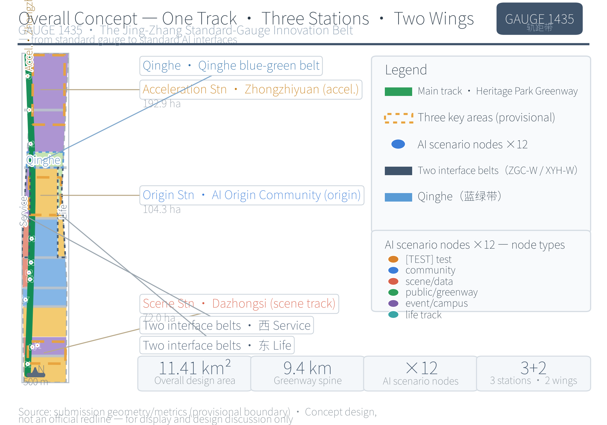
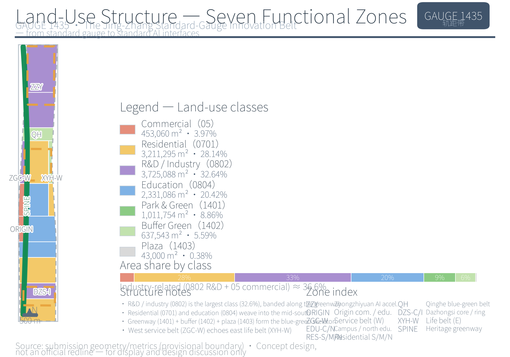
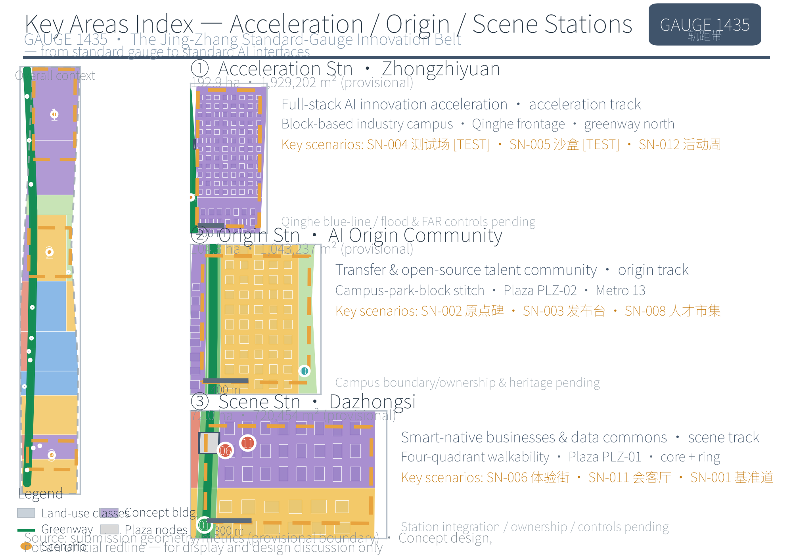
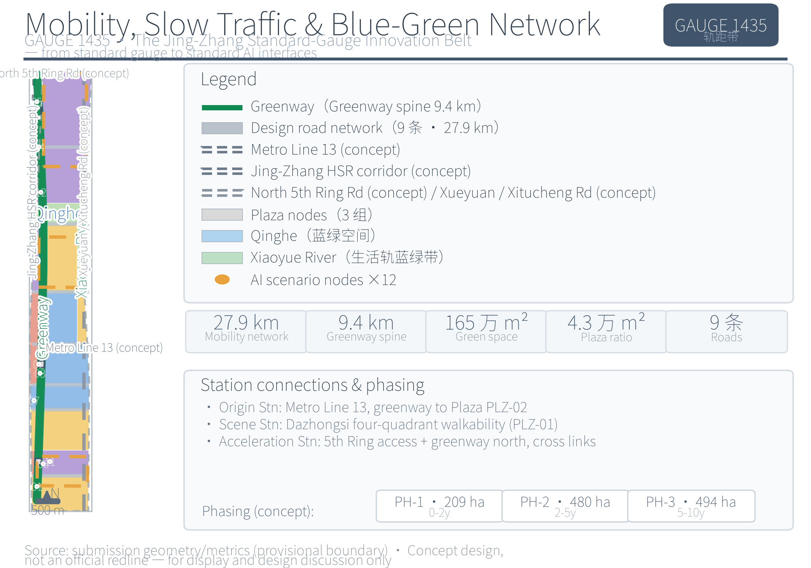
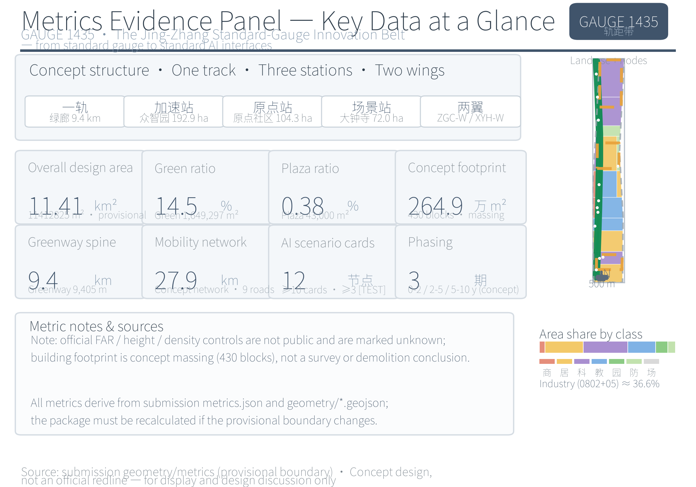

# GAUGE 1435 — The Jing-Zhang Standard-Gauge Innovation Belt: Urban Design Proposal for the Centennial Jing-Zhang AI Innovation Belt, from the Standard Gauge to the AI Standard Interface

This proposal takes "standards are the track, open source is the roadbed, and talent is the train" as its overarching image, translating the 1435 mm standard gauge from a railway engineering parameter into a modular system, spatial-structure metaphor, and governance language for urban design: the Centennial Jing-Zhang Cultural Belt corresponds to the main track (the historical track), the Urban AI Lifestyle Experience Belt to the yielding track (the human-centred track), and the AI Integration Innovation Belt to the track connection (the industry track). Structured around "one track, three stations, and two wings" — the one track being the green-corridor spine of the Jing-Zhang Heritage Park, the three stations being the Zhongzhiyuan Acceleration Station, the AI Origin Community Origin Station, and the Dazhongsi Scene Station, and the two wings being the Zhongguancun Technology Services Wing and the Xiaoyue River Scenario Enablement Wing — the proposal uses 12 AI scenario cards, five user profiles, six global cases, and more than three AI pilgrimage landmarks to form an experienceable, reviewable conceptual proposal that professional teams can continue to develop [source:GAUGE-1435-DESIGN].

## Design Basis and Source Inventory

This proposal takes the Prequalification Announcement for the International Open Call for the Centennial Jing-Zhang AI Innovation Belt Urban Design, issued by the Haidian Branch of the Beijing Municipal Commission of Planning and Natural Resources, as its primary task basis, and takes the `brief/site-package/` site package registered by the maintainer (design tasks, three-tier scope, three key areas, enumerations, value ranges, and permitted design space) together with the excerpt of the open-call taskbook addressed to global agents as its machine-readable basis [source:OFFICIAL-ANNOUNCEMENT] [source:SITE-PACKAGE] [source:AGENT-TASKBOOK]. In the formal review context, the requirements of the announcement and the taskbook are carried by two standard entries, [standard:PROJECT-OFFICIAL-ANNOUNCEMENT] and [standard:PROJECT-AGENT-OPEN-CALL-TASKBOOK] respectively, both being mandatory formal bases; the requirements for urban design, regulatory-detailed-planning depth, and land-use classification follow the MOHURD Measures for the Administration of Urban Design, the MOHURD Measures for the Formulation and Approval of Regulatory Detailed Plans for Cities and Towns, and the MNR Guidelines for the Classification of Land and Sea Use in Territorial Spatial Survey, Planning, and Use Control [standard:MOHURD-URBAN-DESIGN-MEASURES] [standard:MOHURD-CONTROL-DETAILED-PLANNING]; accessibility and generative-AI governance requirements respectively follow such public standards as the Barrier-Free Environment Building Law of the Standing Committee of the National People's Congress and the Interim Measures for the Administration of Generative Artificial Intelligence Services of the Cyberspace Administration of China and six other departments. Among these, the Regulations on the Depth of Preparation of Architectural Engineering Design Documents (2016 Edition) has not yet been obtained as an official document and is registered only as an architectural professional depth reference, not as a formal authoritative basis [standard:MOHURD-ARCH-DESIGN-DEPTH-2016].

The boundaries of material use follow the registrations in `data/source_registry.json` [source:SOURCE-REGISTRY]: seven items — the announcement, the taskbook, the Urban Design Measures, the Regulatory Detailed Planning Measures, the Land-Use Classification Guide, the Interim Measures for Generative AI, and the Barrier-Free Environment Law — are formal-ready; the Implementation Plan for Effectively Solving the Difficulties of the Elderly in Using Intelligent Technology (Guo Ban Fa [2020] No. 45), whose nationwide phased targets have expired, serves only as background reference [standard:ELDERLY-SMART-TECH-PLAN-2020-45]; the temporary coarse polygons are provisional-only and may be used solely for proposal generation, self-checking, and display. Industrial background citations draw on public reports on the "Three Zones and Two Wings" of the Beijing International Science and Technology Innovation Center and on the public information about Haidian District's "1+X+1" modern industrial system, used only for the industry-positioning narrative [source:BJ-KW-THREE-AREAS-WINGS] [source:HAIDIAN-1X1-INDUSTRY]. The six global cases (London King's Cross, Singapore one-north, Hangzhou Yunqi [source:CASE-KINGSCROSS] [source:CASE-ONENORTH] [source:CASE-YUNQI], Berlin Adlershof, the US Research Triangle Park, and Shenzhen Nanshan [source:CASE-SHENZHEN-NANSHAN]) are all public background materials, used only for mechanism learning and constituting no local commitments.

The formal text does not transcribe `sources.json`, `metrics.json`, or the three matrices (compliance/standard/design_depth) item by item; the machine index and the human-readable text support each other. Every key judgment in this proposal is decomposed into a four-layer traceable relationship of "source—layer—metric—depth item", and gaps in the existing-conditions data are registered under the depth item [depth:existing_conditions_diagnosis] and enter the risk list in Chapter 12. The relationship between the data evidence chain and the submission package structure is shown in Figure 1.

> Figure 1 Relationship between the data evidence chain and the submission package. Source: drawn from `sources.json`, `source_registry.json`, and the submission package directory structure; this figure expresses the classification of material use and the organization of deliverables, not spatial boundaries — see Chapter 2 for the status of the provisional boundary.

## Three-Tier Scope Working Framework

The three-tier scope is defined by the announcement, and this proposal implements it level by level according to each tier's working objectives, spatial boundary, design depth, and deliverable expression: the Coordinated Research Area studies the AI industry ecosystem and future urban form across 43.6 square kilometres; the Overall Design Area takes the 1–2 km urban district and industrial areas around the Jing-Zhang Heritage Park as its object, producing an 11.4 square kilometre overall urban-renewal framework and regulatory-detailed-planning-level urban design; the Key-Area Detailed Design Area conducts integrated-planning-implementation-plan-level detailed design on the three areas of Zhongzhiyuan, the AI Origin Community, and Dazhongsi, totalling approximately 368.4 hectares [source:OFFICIAL-ANNOUNCEMENT] [source:SITE-PACKAGE]. The spatial organization, depth requirements, and evidence placement of the three tiers are set out in Table 1, with depth constraints carried by [depth:three_level_scope_framework] and [depth:overall_spatial_structure].

Table 1 Three-tier scope working framework

| Tier | Design question | Design response | Area/data reference |
| --- | --- | --- | --- |
| Coordinated Research Area | How is the AI industry ecosystem and future urban form organized? | Innovation chain of "university origin—origin incubation—full-stack acceleration—scenario monetization—two-wing feedback" and the overall "one track, three stations, two wings" structure | 43.6 km² [metric:research_area_sqm] |
| Overall Design Area | How are industrial space, the renewal framework, mobility and municipal infrastructure, and urban character mapped? | Expressed jointly through layers of land use (44 zones), buildings (430 conceptual buildings), roads (9), green space (18 parcels), public space (9 surfaces), and phasing (3 phases) | 11.4 km² [metric:site_area_sqm] [data:geometry/land_use.geojson#LU-001] |
| Key-Area Detailed Design Area | How do the three areas reach detailed design depth? | Each forms a sub-proposal of "positioning + spatial structure + building renewal + mobility and walking/cycling + public space + AI scenarios + implementation risks" | 368.4 ha [data:geometry/key_areas.geojson#PROV-KEY-001] |

**Provisional boundary limitation.** The organizer's official GIS/CAD planning boundaries and the official polygons of the three key areas have not yet been publicly released, so all three tiers use temporary coarse polygons inferred by the maintainer under EPSG:4548 from the announcement's verbal four-to boundaries and announced areas [source:BOUNDARY-SOURCE] [source:KEY-AREA-SOURCE]. The recalculated area of the Overall Design Area is 11412825.4 square metres, deviating from the announced value of 11.4 square kilometres by approximately 1.3% [metric:site_area_sqm]; the Coordinated Research Area recalculates to 43609232.6 square metres [metric:research_area_sqm]; the three key areas recalculate to 1929201.9 / 1043236.9 / 720454.2 square metres, deviating from the announced itemized areas (1921000 / 1043000 / 720000 square metres) by approximately 0.02%–0.43%, a deviation arising from the inferred boundaries rather than from measurement [metric:key_area_zhongzhiyuan_sqm] [metric:key_area_origin_sqm] [metric:key_area_dazhongsi_sqm]. All areas, proportions, and metrics in this proposal are therefore intended only for proposal generation, self-checking, and design discussion, and must not be treated as official planning boundaries, precise areas, approval bases, or statutory control conclusions; once the official polygons are released, the site boundary, key areas, land use, buildings, roads, green space, public space, phasing, and all metrics must be recalculated as a whole package, and the conclusions of this text revised accordingly.

The three tiers are not a set of disconnected drawings: the Coordinated Research Area determines the judgments on the industry chain and urban form; the Overall Design Area translates those judgments into renewal projects and facility capacity; the key areas verify the implementability of specific parcels, buildings, mobility, and scenarios. On this basis, this proposal locks the provisional boundary, generates all layers, and recalculates the metrics, and any conclusion that cannot be recalculated from structured data is excluded from the formal text.

> Figure 2 Three-tier scope and spatial working framework. Source: drawn from `geometry/site_boundary.geojson` (SITE-001), `geometry/key_areas.geojson` (PROV-KEY-001/002/003), and `metrics.json`; all three-tier boundaries are provisional coarse substitute boundaries (not official planning boundaries), shown only in light colours/dashed lines, and must be recalculated as a whole package once the official polygons are released.

## Coordinated Research Area: Industry and Future Urban Form Study

The core task of the Coordinated Research Area is to translate a "world-class AI innovation ecosystem" into a locatable spatial structure. In the GAUGE 1435 vocabulary, the three positionings correspond respectively to three tracks: the Centennial Jing-Zhang Cultural Belt → main track (the Jing-Zhang Heritage Park vitality belt, the historical track); the Urban AI Lifestyle Experience Belt → yielding track (1435-module public space and accessible walking and cycling, the human-centred track); and the AI Integration Innovation Belt → track connection (AI+ scenario deployment and standard interfaces, the industry track) [source:AGENT-TASKBOOK] [standard:PROJECT-AGENT-OPEN-CALL-TASKBOOK]. The five functions set out in the agent-facing taskbook are further mapped into a five-track strategy, as shown in Table 2.

Table 2 Five function areas → five-track strategy

| Five function areas | Track | Spatial/governance placement |
| --- | --- | --- |
| Full-Stack Independent AI Innovation System | Acceleration track | Zhongzhiyuan (the "testing track" for model training, evaluation, standard-setting, and safety governance) |
| World-class AI innovation ecosystem | Origin track | AI Origin Community (a near-campus technology-transfer and open-source talent community) |
| AI+ scenario enablement as a new paradigm | Scene track | Dazhongsi (a city-level scenario ground for AI-native new business forms and data elements) |
| Smart, vibrant AI city | Track merging + double tracking | Track merging = east–west stitching (the two wings' interface belts); double tracking = north–south connection (green-corridor walking/cycling and rail interchange) |
| Global voice in AI governance | Yielding track | Human-centred governance, transparent operational status, human review, and data minimization |

Within the Coordinated Research Area, the "Three Zones and Two Wings" form a collaborative loop of university origin → origin-community incubation → Zhongzhiyuan full-stack acceleration → Dazhongsi scenario monetization → two-wing service feedback; the two-wing main bodies (the Zhongguancun Technology Services Wing and the Xiaoyue River Scenario Enablement Wing) are expressed in full within the Coordinated Research Area and appear within the Overall Design Area as the "west-side service-track interface belt" and the "east-side living-track interface belt", corresponding respectively to the ZGC-WING and XYH-WING zones in land_use [data:geometry/land_use.geojson#LU-006] [data:geometry/land_use.geojson#LU-018]. The industrial positioning also draws on the "Three Zones and Two Wings" synergy narrative of the Beijing International Science and Technology Innovation Center and on the public background of Haidian District's modern industrial system, as directional support rather than local fact [source:BJ-KW-THREE-AREAS-WINGS] [source:HAIDIAN-1X1-INDUSTRY].

**Naming and logo direction (agent.1).** One belt: the Jing-Zhang 1435 Gauge Belt (GAUGE 1435 — The Jing-Zhang Standard-Gauge Innovation Belt), subtitled "from the standard gauge to the AI standard interface"; three stations: the Acceleration Station (Zhongzhiyuan), the Origin Station (AI Origin Community), and the Scene Station (Dazhongsi); two wings: the service track (Zhongguancun) and the living track (Xiaoyue River). The visual-identity direction uses two parallel lines (the gauge) framing the number "1435" treated with scale graduations; the auxiliary graphics are an abstraction of the steel-rail I-section cross-profile plus tick marks. The colour system takes rail grey-blue as the primary colour, with signal green for open/passage, amber for testing/caution, and white for public. The typeface is the open-source Noto Sans CJK; the system contains no third-party trademarks or unauthorized assets, and the logo and wordmark are given only as directional concepts for professional visual teams to develop [source:AGENT-TASKBOOK] [source:GAUGE-1435-DESIGN].

**Global AI innovation ecosystem cases (agent.2).** All six cases are public background materials [source:CASE-KINGSCROSS] [source:CASE-ONENORTH] [source:CASE-YUNQI]; their transferable mechanisms are given in Table 3, and links to the case sites are given in item 11 of the References [source:CASE-SHENZHEN-NANSHAN].

Table 3 Global cases and mechanism translation

| Case | Core lessons (public background summary) | Mechanism translation |
| --- | --- | --- |
| London King's Cross | Railway industrial heritage renewed into a knowledge-economy quarter, retaining the rail heritage, anchored by a university, and led by public space | Narrativizing the rail heritage → the Jing-Zhang Heritage Park vitality belt and the sleeper scale band |
| Singapore one-north | Government–university–industry co-built R&D community, mixed use plus walk-friendly | Mixed use and walk-first → 1435-module blocks and an accessible baseline route |
| Hangzhou Yunqi Town | Industry-community operation anchored by an annual conference | Event-driven investment attraction → the Global AI Activity Week and the "Release Season" |
| Berlin Adlershof | University research institutes relocated in + business incubation + unified brand operation | Brand-led operation → GAUGE 1435 brand assets and the Origin Station release hall |
| US Research Triangle Park | Governance structure co-built by government, three universities, and industry, with long-term land reserves | Tripartite governance → the co-governance committee concept |
| Shenzhen Nanshan Science Park | Campus–park–city synergy, university origin + supply chain + capital loop | City–campus synergy → the Track Connection Lab and the Switching Track talent market |

Case translation transfers only mechanisms and does not copy names, company lists, investment amounts, or output values; anything involving industrial investment attraction, funding, or policy is expressed only as conceptual recommendations [source:AGENT-TASKBOOK].

The international-communication narrative takes "GAUGE 1435 — where standards meet" as its one-liner, weaving three layers of narrative: the century of the rail (the Jing-Zhang Railway, connecting to the global system through independent construction plus open standards) → the four decades of Zhongguancun (knowledge becoming industry) → the present of AI (open source and standard interfaces), forming a complete storyline that developer communities and international visitors can spread [source:GAUGE-1435-DESIGN].

**Future urban form.** The Coordinated Research Area grounds the impact of AI on work, life, social interaction, learning, mobility, and public services in visible nodes and corridors: a continuous green-space system (the green-corridor spine and blue-green belts) responds to the "smart, vibrant AI city", transit-station integration and walking/cycling priority respond to "AI + mobility", and open testing grounds, release platforms, and public screens respond to the "Full-Stack Independent AI Innovation System" and governance transparency. All these judgments are carried through to land use, public space, mobility and walking/cycling, AI scenario nodes, and metrics [depth:overall_spatial_structure] [depth:land_use_layout], and serve as inputs to the Overall Design Area.

## Overall Design Area: Urban Renewal and Regulatory-Detailed-Planning-Level Urban Design

The Overall Design Area is organized at regulatory-detailed-planning depth, and its core question is "what to renew, why, on which layer, and what conditions are missing". The overall spatial structure is "one track, three stations, and two wings": the one track is the green-corridor spine of the Jing-Zhang Heritage Park (9405.3 m long) [metric:corridor_length_m], the three stations are the three key areas, and the two wings are the west-side service-track and east-side living-track interface belts. Following the territorial land-use classification guide, the land-use structure is expressed by 44 conceptual zones [standard:MNR-LAND-USE-CLASSIFICATION-GUIDE]: research land (0802, 32.64%) and commercial land (05, 3.97%) form the main body of industrial space [data:geometry/land_use.geojson#LU-009] [data:geometry/land_use.geojson#LU-002], residential (0701, 28.14%) and education (0804, 20.42%) support jobs–housing balance and near-campus technology transfer, and park green space (1401), protective green space (1402), and squares (1403) together make up about 14.8% of the blue-green and public-space base, with the proportions verified by metrics [metric:land_use_industry_ratio] [metric:land_use_residential_ratio]. The identification of inefficient space, the objects of the Demolish–Renovate–Retain strategy, and the renewal project list are developed in Chapters 7 and 10.

The overall building scale is expressed through the footprints of 430 conceptual buildings, with a recalculated building-footprint area of 2649208.0 square metres, representing only conceptual massing and constituting neither an existing-conditions survey nor demolition/renovation conclusions [metric:building_footprint_area_sqm] [data:geometry/buildings.geojson#BLDG-001]. Roads and walking/cycling are expressed through 9 conceptual roads (totalling 27901.9 m) and the green-corridor greenways [metric:road_network_length_m] [data:geometry/roads.geojson#ROAD-001]. Content involving floor area ratio, building height, building coverage ratio, setbacks, road red lines, and facility standards, which lacks official regulatory-planning conditions, is consistently stated as "to be confirmed pending formal regulatory-planning conditions" and never substitutes design assumptions for approved metrics [standard:MOHURD-CONTROL-DETAILED-PLANNING] [depth:development_intensity_controls]. The reviewable organization of regulatory-detailed-planning-depth content is shown in Figure 2 and the indicator system in Chapter 11; every important conclusion states its corresponding layer, metric, source, standard, and pending regulatory-planning conditions, ensuring that the urban-renewal framework, functional proportions, public space, mobility organization, municipal capacity, and urban-character control support one another rather than being listed as slogans [depth:land_use_layout] [depth:height_massing_character].

The comprehensive carrying-capacity assessment overlays four categories of layers — "industrial space—residential and education—blue-green and public—mobility and municipal": industrial space (0802+05) at about 36.6% secures the supply of innovation carriers, residential and education together at about 48.6% support jobs–housing balance and near-campus technology transfer, blue-green and public space at about 14.8% provides the ecological and social base, and roads and the green corridor provide the north–south connecting skeleton; the proportions of these four categories within the provisional boundary are used only as structural judgments, while municipal capacity, flood control and drainage, fire safety, and utility-line loading are listed as to-be-confirmed pending engineering data [depth:municipal_new_infrastructure]. The implementation-policy recommendations focus on three aspects — coordinated implementation of urban renewal, spatial supply, and industrial services: renewal projects are advanced in a graded sequence JZ-01…JZ-06, spatial supply is layered as "shared testing—incubation—headquarters showcase", and industrial services use talent, computing power, data, and scenarios as the four interface elements, all expressed as conceptual directions for professional teams to develop [standard:MOHURD-CONTROL-DETAILED-PLANNING].

## Key-Area Detailed Design

The three key areas each reach the urban-design depth of an integrated planning implementation plan, organized uniformly as "positioning + spatial structure + building renewal + mobility and walking/cycling + public space + AI scenarios + implementation risks" [depth:three_key_area_detailed_design]. All three polygons are provisional coarse ranges [source:KEY-AREA-SOURCE]; the conclusions in this section are directional designs, and areas follow `metrics.json`.

> Figure 3 Index of the three key areas and design tasks. Source: drawn from `geometry/key_areas.geojson` (PROV-KEY-001/002/003) and the AI scenario-card table in Chapter 6 (SN-001…SN-012); the key areas are provisional coarse ranges (not official planning boundaries), expressed only in light colours, and must be recalculated once the official polygons are released.

**Zhongzhiyuan AI Independent Innovation Acceleration Area (Acceleration Station/Acceleration Track, 192.1 ha).** Positioned as a garden-style full-stack independent-innovation acceleration area that hosts model training, evaluation, standard-setting, and safety governance [data:geometry/key_areas.geojson#PROV-KEY-001] [metric:key_area_zhongzhiyuan_sqm]. In spatial structure, research land (ZZY, 0802) in an industrial-park block layout forms the main body, the frontage along the Qinghe River is opened up (the QH blue-green belt), and the northern section of the green corridor is brought through the area; in building form, it comprises conceptual massing of mid-to-high-rise R&D building clusters and laboratory/workshop buildings (a height of 12–60 m is a conceptual indication pending formal regulatory-planning confirmation). In mobility, the North Fifth Ring Road entrance (RD-EX-001 conceptual indication), the green-corridor greenway connection, and lateral link-road interchange are organized. The AI scenarios are SN-004 Acceleration Track Test Ground ([TEST], large-model evaluation / red-team testing showcases), SN-005 Safety Governance Sandbox ([TEST], standard workshops and safety evaluation), and the SN-012 northern node of the Global AI Activity Week. Implementation risks: the Qinghe River blue line and flood-control conditions to be confirmed, regulatory-planning intensity undetermined, and land ownership unclear.

**Beijing AI Origin Community (Origin Station/Origin Track, 104.3 ha).** Positioned as a near-campus technology-transfer and open-source talent community — the origin of "from code to product" [data:geometry/key_areas.geojson#PROV-KEY-002] [metric:key_area_origin_sqm]. In spatial structure, the action is stitching campus–park–block walking and cycling together, mixing research (ORIGIN-RD, 0802), commercial services (ORIGIN-COM, 05), and education (EDU-ORIGIN, 0804), with the green corridor's middle section crossing the area and the Origin Station square (PLZ-02, 1403) established there; in building form, it is mid-to-low-rise block-scale mixed use (offices + talent apartments + commercial), with open ground floors and embedded technology-release and talent-service spaces [data:geometry/land_use.geojson#LU-005]. In mobility, it connects to the station interchange of the conceptual indication line of Metro Line 13 (RAIL-001) and organizes greenway walking and cycling [data:geometry/constraints.geojson#RAIL-001]. The AI scenarios are SN-002 Gauge Origin Monument AR tour, SN-003 Open-Source Release Platform, and SN-008 Switching Track talent market. Implementation risks: campus boundary and land ownership to be confirmed, and heritage-protection requirements related to the former Qinghuayuan Station site pending official layers.

**Dazhongsi AI Industry Cluster (Scene Station/Scene Track, 72.0 ha).** Positioned as a city-level scenario ground for AI-native new business forms and data elements — a place where "AI is seen, consumed, and discussed" [data:geometry/key_areas.geojson#PROV-KEY-003] [metric:key_area_dazhongsi_sqm]. In spatial structure, it comprises the four-quadrant pedestrian connection at Dazhongsi station (PLZ-01 station forecourt square, 1403), a commercial core (DZS-COM, 05), and an industry ring (DZS-IND, 0802), with the green corridor's southern section crossing the area [data:geometry/land_use.geojson#LU-042]; in building form, it is mid-to-high-rise commercial complexes and smart-device flagship-store blocks. In mobility, walking and interchange are organized on the premise of transit-station integration. The AI scenarios are SN-006 Scene Track smart-device experience street, SN-011 Data Element Reception Hall, and the southern end of SN-001 1435 Accessible Mobility Baseline Route. Implementation risks: transit-station integration conditions, commercial-renewal land ownership, and heritage-protection and urban-character controls to be confirmed.

The industrial functions, building forms, Demolish–Renovate–Retain classifications, public-space connectivity, and implementation projects of the three key areas correspond respectively to the relevant content in Chapters 6, 7, and 10, and their design depth is examined by [depth:three_key_area_detailed_design].

## AI Innovation Ecosystem, User Profiles, and AI-Enabled Scenarios

The proposal establishes five user profiles addressed to AI talent, enterprises, residents, and public governance, responding to the AI+ directions raised by the announcement — mobility, services, consumption, healthcare, education, law, and life services [source:AGENT-TASKBOOK] [standard:PROJECT-AGENT-OPEN-CALL-TASKBOOK]. The profiles, needs, and spatial responses are given in Table 4; profile data are used only for spatial and operational design inference and no individual behavioural traces are collected [source:GAUGE-1435-DESIGN].

Table 4 Five user profiles

| Profile | Typical needs | Spatial response | Data and privacy boundary |
| --- | --- | --- | --- |
| Open-source developer | Release, collaboration, testing, community reputation | Origin Station release hall, code wall, night-time collaboration space (SN-003) | No personal behavioural traces collected; activity data used only for aggregate statistics |
| Startup team | Low-cost office space, computing-power access, product testing ground | Zhongzhiyuan shared testing ground, edge-side computing-power station (SN-004) | Computing-power and data services require separate authorization |
| Leading-enterprise visitor | Showcasing, business, international reception, talent recruitment | Dazhongsi international roadshow hall, station interchange (SN-006) | Corporate identities and cases must be rights-cleared |
| Nearby resident | Commuting, leisure, community services, low-disturbance renewal | Green-corridor walking/cycling loop, community services, Xiaoyue River living track (SN-010) | Resident profiles not used for commercial recommendation; parallel traditional service channels retained |
| University faculty and students | Technology transfer, cross-university collaboration, everyday walking and cycling | Campus–park stitching, Track Connection Lab, AI education experience points (SN-007) | Campus data and research outputs require authorization |

**Twelve AI scenario cards.** Each card specifies the target users, spatial carrier, data source and privacy boundary, human-review mechanism, operating entity, and key risks, as shown in Table 5 [metric:scenario_node_count]. Among them, SN-004, SN-005, and SN-007 are AI industry testing-and-validation scenarios, marked **[TEST]**, and are all "conceptual testing scenarios, not approved for operation".

Table 5 AI scenario cards (12)

| ID | Scenario card | Target users | Spatial carrier | Data source and privacy boundary | Human review | Operating entity | Key risks |
| --- | --- | --- | --- | --- | --- | --- | --- |
| SN-001 | 1435 Accessible Mobility Baseline Route | All citizens, the elderly, people with limited mobility | Public space in the southern section of the green corridor | Low-intrusion environmental sensing; only aggregated pedestrian-flow/bottleneck data, no personal identification | Facility maintenance and accessibility requests handled by a manned service desk | District subdistrict office and park operator (conceptual) | Accessibility compliance pending on-site verification |
| SN-002 | Gauge Origin Monument AR Tour | Citizens, developers, tourists | Green-corridor node in the Origin Community (Origin Station square) | Only public cultural information; AR collects no data beyond location | Cultural content reviewed by history and planning professionals | Community operator and developer volunteers (conceptual) | Accuracy of the historical narrative, AR content copyright |
| SN-003 | Open-Source Release Platform | Open-source developers, university teams | Green corridor in the Origin Community (release-platform installation) | Release content self-reported by the community; public information; no behavioural traces collected | Release bookings and content reviewed by community administrators | Developer community operator (conceptual) | Content-moderation boundary, event safety |
| SN-004 | Acceleration Track Test Ground **[TEST]** | Model training and evaluation institutions | Zhongzhiyuan shared testing ground | Test data supplied and authorized by users; only aggregated evaluation results | Evaluation methods and results reviewed by third-party experts | Co-built by the park operator and evaluation institutions (conceptual) | Conceptual testing scenario not approved for operation; computing-power and data authorization |
| SN-005 | Safety Governance Sandbox **[TEST]** | Standard-setting and safety-evaluation institutions | Zhongzhiyuan safety governance sandbox | Red-team test data under restricted authorization; results published anonymized | Safety conclusions reviewed by professional teams | Standard workshop operator (conceptual) | Conceptual testing scenario not approved for operation; test boundaries and compliance |
| SN-006 | Scene Track Smart-Device Experience Street | Consumers, enterprise visitors | Dazhongsi commercial core (DZS-COM) | Demonstration data minimized; no facial recognition or transaction details collected | Display content and signage go live only after rights clearance | Commercial operator (conceptual) | Trademark and content copyright, crowd safety |
| SN-007 | Track Connection Lab **[TEST]** | University faculty and students, startup teams | Near-campus belt (campus–park stitching belt) | On-campus research data require authorization; only publishable outputs displayed | Output releases reviewed by the university and the team | University–industry co-built platform (conceptual) | Conceptual testing scenario not approved for operation; intellectual-property boundaries |
| SN-008 | Switching Track Talent Market | Career-transition talent, corporate HR | Talent-service space in the Origin Community | Resumes and matching data submitted and authorized voluntarily by participants | Recommendations reviewed at a manned service desk | Talent service agency (conceptual) | Personal-information protection, truthfulness of job information |
| SN-009 | Operational Status Public Screen | All citizens | Governance-transparency node in the middle section of the green corridor | Only aggregated operational status displayed; no personal data | Screen content published manually by the governance team | Public governance operator (conceptual) | Misreading of information, event-safety grading |
| SN-010 | Xiaoyue River Living Track Demonstration | Nearby residents | East-wing Xiaoyue River living-track interface belt | Life-service data minimized; not used for commercial profiling | Service content reviewed manually by the community | Community service operator (conceptual) | Digital divide for the elderly; traditional parallel channels must be retained |
| SN-011 | Data Element Reception Hall | Data holders, compliance institutions | Dazhongsi data-element circulation node | Anonymized data within a compliance sandbox; authorization and audit trails traceable | Circulation rules reviewed by legal and governance experts | Compliance operating entity (conceptual) | Data security and authorization boundaries |
| SN-012 | Global AI Activity Week Route | Participants, international visitors | Public route from the northern section of the green corridor to Dazhongsi | Event registration and tour data minimized; no individual trajectories tracked | Event safety and crowd flow controlled manually by the organizer | Event organizer and public-space manager (conceptual) | Event safety, public-space permits, copyright |

AI governance recommendations follow the principles of data minimization, public sources, explainability, and human review: urban agents may assist in identifying walking/cycling bottlenecks, public-space heat patterns, facility maintenance, and event-safety risks, but must not replace planning approval, must not produce unauthorized personal profiles, and must not claim official implementation commitments [source:AGENT-TASKBOOK]. The compliance boundary of generative-AI services is understood by reference to the scope of application and compliance requirements of the Interim Measures for the Administration of Generative Artificial Intelligence Services [standard:GENERATIVE-AI-INTERIM-MEASURES], without generalizing it into blanket conclusions for all public spaces or digital interfaces; accessible human-service requirements are strictly confined to the public-service matters specified in the Barrier-Free Environment Building Law; and high-frequency service scenarios for the elderly draw on Guo Ban Fa [2020] No. 45 as policy background, emphasizing the parallel operation of traditional and intelligent services rather than stating them as current legal obligations [standard:ELDERLY-SMART-TECH-PLAN-2020-45].

## Land Use, Building Scale, and the Demolish–Renovate–Retain Strategy

The land-use plan is expressed according to the classification logic of the territorial-spatial land and sea use categories, forming a complete and closed set of conceptual zones [depth:land_use_layout]. Of the 44 zones: research 0802 is about 372.5 ha (32.64%), residential 0701 about 321.1 ha (28.14%), education 0804 about 233.1 ha (20.42%), commercial 05 about 45.3 ha (3.97%), park green space 1401 about 101.2 ha (8.86%), protective green space 1402 about 63.8 ha (5.59%), and squares 1403 about 4.3 ha (0.38%) [data:geometry/land_use.geojson#LU-001] [metric:land_use_industry_ratio] [metric:land_use_residential_ratio]. Industry-related land (0802+05) is about 36.6%, and residential plus education together about 48.6%, forming an overall structure of "industry-led, jobs–housing–education mixed" that supports the everyday spatial needs of near-campus technology transfer, open-source collaboration, and innovation-driven interaction.

Building scale is expressed through 430 conceptual buildings, with a recalculated building footprint of 2649208.0 square metres — conceptual massing rather than an existing-conditions survey conclusion [metric:building_footprint_area_sqm] [data:geometry/buildings.geojson#BLDG-001]. Because official regulatory-planning conditions are lacking, building height, floor area ratio, building coverage ratio, setbacks, and building control lines are all listed as unknown metrics, and no figures are fabricated in the text [metric:building_height_m] [metric:floor_area_ratio]; the conceptual height range of 12–60 m serves only as a directional indication for form studies [depth:height_massing_character] [depth:development_intensity_controls].

In the absence of an existing-building survey, land-ownership, and engineering data, the Demolish–Renovate–Retain plan provides only a method and a list of items to be calibrated: a classification framework of four categories — "retain (historical/cultural and high-quality existing stock) — renovate (functional upgrading and façade renewal) — demolish and rebuild (inefficient and structurally driven renewal) — build anew (industry and public-space supply)" — and each category is marked "to be confirmed pending formal regulatory planning and the existing-conditions survey" when applied to specific parcels, rather than being disguised as approved demolition/renovation conclusions [depth:retain_renovate_demolish] [source:SOURCE-REGISTRY]. In operational strategy, industrial space is supplied in layers of "shared testing ground—incubation office—headquarters showcase", and residential and talent apartments follow the principles of open ground floors and functional mixing; all of these are conceptual recommendations.

The recommended priority order for demolition–renovate–retain decisions is: heritage-protected and historical-cultural resources are retained first (such as the former Qinghuayuan Station site, whose extent awaits official layers); existing buildings with clear ownership, sound structure, and upgradable functions are prioritized for renovation; inefficient buildings in clear conflict with industrial functions, public space, and mobility organization are listed as candidates for demolition and rebuild; and industrial and public-space gaps are filled through new construction. The data required for such decisions — the age, structure, ownership, and regulatory-planning status of existing buildings — are all pending; this chapter provides only a methodological framework and gives no demolition/renovation conclusions for any specific building [depth:retain_renovate_demolish] [metric:building_footprint_area_sqm].

## Mobility, Rail, Municipal Infrastructure, and Public Service Facilities

The mobility plan is built on the skeleton of transit-station integration, road microcirculation, walking/cycling priority, and external interchange [depth:traffic_rail_slow_parking]. The conceptual road network totals 27901.9 m (9 centre lines), carrying microcirculation and interchange organization [metric:road_network_length_m] [data:geometry/roads.geojson#ROAD-001]; the Jing-Zhang Heritage Park green-corridor greenway is 9405.3 m long, serving as the north–south connecting walking/cycling spine (double tracking) [metric:corridor_length_m]. At the rail level, both Metro Line 13 and the Jing-Zhang high-speed rail/existing railway corridor are expressed as conceptual indication lines (RAIL-001, RAIL-002), not surveyed alignments, used to explain station-interchange and green-corridor line-crossing relationships [data:geometry/constraints.geojson#RAIL-001] [data:geometry/constraints.geojson#RAIL-002]. Among external conditions, the North Fifth Ring Road (RD-EX-001) organizes Zhongzhiyuan's north-facing entrance, and Xueyuan Road/Xitucheng Road (RD-EX-002) form the eastern boundary, both as conceptual indications [data:geometry/constraints.geojson#RD-EX-001] [data:geometry/constraints.geojson#RD-EX-002]. The four-quadrant pedestrian connection at Dazhongsi station, the stitching of green-corridor walking/cycling gaps, and the overpass-cross-road nodes are listed as JZ-01 and JZ-04 in the project list in Chapter 10; conceptual arrangements are proposed for parking and non-motorized-vehicle organization and for station-forecourt-square interchange.

> Figure 4 Integrated system of mobility, walking/cycling, and blue-green public space. Source: drawn from `geometry/roads.geojson`, `geometry/green_space.geojson`, `geometry/public_space.geojson`, `geometry/constraints.geojson`, and `metrics.json`; the rail alignments (RAIL-001/002) are conceptual indications, not surveyed alignments, and road and rail conditions follow official materials.

Municipal and new infrastructure are given conceptual layouts in four categories — "innovation service platforms—talent life services—new infrastructure—integration with traditional municipal works" [depth:municipal_new_infrastructure]: edge-side computing-power stations are combined with public services and low-carbon energy strategies as new-infrastructure prototypes to be developed; distributed energy is combined conceptually with the green corridor and park public space. Road red lines, utilities, fire safety, drainage, flood control, and municipal capacity are listed as prerequisites for formal development because engineering data are lacking [source:SOURCE-REGISTRY]; under the provisional boundary, mobility and municipal conclusions serve only as provisional design discussion and do not constitute engineering conclusions [source:BOUNDARY-SOURCE].

## Blue-Green Space, Public Space, and Urban Character

The blue-green plan takes the Jing-Zhang Heritage Park vitality belt (green-corridor spine, 9405.3 m) as its skeleton and coordinates the travel needs of the Qinghe River (QH), the Xiaoyue River (XYH-WING), and the surrounding universities and communities, proposing a system of pedestrian paths, cycle paths, and green space that connects north–south (double tracking) and east–west (track merging) [metric:corridor_length_m] [data:geometry/green_space.geojson#GREEN-001] [depth:blue_green_public_space]. Green space recalculates to 1649297.2 square metres with a green ratio of 14.45%, with the green-space metrics verified at [metric:green_space_area_sqm] [metric:green_ratio]; public space recalculates to 43000.0 square metres, accounting for 0.38% of the overall area, with the public-space metrics verified at [metric:public_space_area_sqm] [metric:public_space_ratio]. The 9 square surfaces are split from the 1403 square land use into the PLZ-01/02/03 groups, as shown in the public-space layer [data:geometry/public_space.geojson#PUBLIC-001]. The green-space proportion supports everyday social interaction and ecological experience in talent life, and although the public-space proportion is small, it carries innovation-oriented social functions such as releases, markets, experiences, and governance displays; together the two constitute the spatial base of the "yielding track".

Public space uses the 1435-module component library (seating, paving, wayfinding, accessible baseline route) as a unified language, with a pilot listed as JZ-05; SN-001 1435 Accessible Mobility Baseline Route serves as the demonstration section of the human-centred track, responding to barrier-free regulatory requirements [standard:BARRIER-FREE-ENVIRONMENT-LAW]. **AI pilgrimage landmarks (≥3, agent.4):** ① the Gauge Origin Monument (green-corridor node SN-002 in the AI Origin Community) — a physical 1435 mm scale reference with a "standard lineage" AR tour, one element of the honours-display system; ② the release platform (green corridor SN-003 in the Origin Community) — a "departure timetable" release installation for AI models/outputs that physicalizes the open-source community's release ritual; ③ the sleeper scale band (along the full length of the Jing-Zhang Heritage Park, with a set of "standard milestone" sleepers every 1435 m recording the history of AI standards from the Dartmouth workshop to open-source licences and governance rules); ④ the honours-display system — the contributor honour wall, the corporate standards-contribution leaderboard, and the community's "track-switchers" directory, displayed at the Origin Station release hall and heritage-park nodes [source:AGENT-TASKBOOK] [source:GAUGE-1435-DESIGN]. All landmarks, wayfinding, logos, typefaces, images, people, and corporate identities are conceptual directions that must be rights-cleared and are not stated as approved for construction [source:SOURCE-REGISTRY].

Urban character unifies the tone through the colour system of "rail grey-blue + signal green + amber + white" and the auxiliary graphics of the I-section cross-profile and scale graduations; design recommendations are offered for roof form, massing, and frontage control, pending formal regulatory-planning confirmation; historical and cultural resources such as the former Qinghuayuan Station site serve as urban-character narrative resources, with their heritage-protection extents and requirements pending official layers — this proposal does not draw falsely precise control lines [standard:MOHURD-URBAN-DESIGN-MEASURES] [depth:height_massing_character].

The detailed urban-character recommendations are organized in four layers: first, the colour and material tone (rail grey-blue as the base with signal colours as accents, with paving and street furniture following the 1435 module); second, building massing and roof form (stepping down and terracing along the green-corridor frontages in the key areas, integrating roof equipment, with specific heights pending regulatory planning); third, wayfinding and public art (the sleeper scale band, scale rulers, and I-section symbols running through the whole belt, distinguished from the ground-floor visual system by functional hierarchy); and fourth, night-time and event lighting (signal colours used only during event periods to avoid urban light pollution). All four layers are design directions for professional teams to develop and do not constitute statutory control lines [depth:height_massing_character] [source:GAUGE-1435-DESIGN].

## Renewal Project List, Implementation Policy, and Phasing Plan

The renewal project list contains 6 items (JZ-01…JZ-06), each specifying the type, spatial location, dependency conditions, and recommended implementing entity, as shown in Table 6 [depth:renewal_project_list].

Table 6 Renewal project list

| ID | Project | Type | Spatial location | Key dependencies | Recommended implementing entity |
| --- | --- | --- | --- | --- | --- |
| JZ-01 | Jing-Zhang Heritage Park green-corridor connection and sleeper scale band | Public space | Full length of the green corridor (9405.3 m) | Road red lines, under-bridge space, heritage protection | Coordinated by the local government, developed by professional teams (conceptual) |
| JZ-02 | Origin Station release hall and Switching Track talent market | Renewal / industrial services | AI Origin Community | Land ownership, ground-floor uses | Park and talent service agencies (conceptual) |
| JZ-03 | Zhongzhiyuan testing ground and safety governance sandbox | Industrial facility | Zhongzhiyuan | Regulatory-planning intensity, Qinghe River blue line | Co-built by the park operator and evaluation institutions (conceptual) |
| JZ-04 | Four-quadrant pedestrian connection at Dazhongsi station | Transit-station integration | Around Dazhongsi station | Station, utilities, intersections | Led by rail and transport authorities (conceptual) |
| JZ-05 | 1435 public-space component-library pilot | Public space | Green-corridor and key-area nodes | Barrier-Free Law compliance, implementing entity | Public-space manager (conceptual) |
| JZ-06 | Global AI Activity Week public route and brand operation | Operations | From the northern section of the green corridor to Dazhongsi | Public-space permits, event safety, copyright | Event organizer and public-space manager (conceptual) |

Phased implementation (`geometry/phasing.geojson`) distinguishes three conceptual phases — near, medium, and far term: PHASE-001 near term, 0–2 years (2087143.8 square metres: the Origin Community core, the middle section of the green corridor, and the Dazhongsi station node) [data:geometry/phasing.geojson#PHASE-001]; PHASE-002 medium term, 2–5 years (4798000.5 square metres: the Zhongzhiyuan acceleration area, the Qinghe River blue-green belt, and the northern and southern sections of the green corridor); PHASE-003 far term, 5–10 years (4943737.5 square metres: the mid-section residential areas, the two-wing interfaces, and quality improvement of reserved land), with the three-phase areas verified by metrics [metric:phasing_near_area_sqm] [metric:phasing_mid_area_sqm] [metric:phasing_far_area_sqm] and implementation depth managed by the depth item [depth:phasing_implementation]. **The 100-day open-call cycle ≠ implementation phasing**: the open-call cycle is the time requirement for delivering outputs, while implementation phasing is the pathway for advancing urban renewal; the near term can start with lightweight facilities, operational activities, and service platforms (such as the release platform, public screens, and event routes), while the medium and far terms must wait for confirmation of formal regulatory planning, municipal works, mobility, and land-ownership conditions.

**Long-term operation system (agent.6; all conceptual recommendations):** the annual activity system follows the railway rhythm of "spring inspection/summer peak/autumn timetable/winter maintenance" to set four seasonal activities — spring "Track Connection Week" (university–industry engagement), summer "Release Season" (model releases), autumn "Gauge Convention" / Global AI Activity Week (flagship), and winter "Yield Fest" (public life/accessibility) [source:AGENT-TASKBOOK]. The brand IP is the GAUGE 1435 visual system + the sleeper scale band + the signal-colour system; developer-community operations rely on the open-source release platform, the contributor honour wall, and PR/Issue culture; scenario-access operations use a booking system for testing grounds/sandboxes, human review, and data minimization; international communication relies on the GAUGE 1435 narrative, event livestreaming, and developer ambassadors; and the conversion pathway is "event → community → incubation → acceleration → scenario → global release". All events, investment attraction, funding, policies, and operational arrangements are expressed as conceptual recommendations or directions for further development and must not be stated as confirmed government arrangements [source:AGENT-TASKBOOK] [source:GAUGE-1435-DESIGN].

Public participation and operation-and-maintenance mechanisms are recommended to be organized as "event grading—feedback loop—maintenance responsibilities": events are graded by crowd flow and impact into daily (walking/cycling and public screens), festival (Track Connection Week/Release Season/Gauge Convention/Yield Fest), and flagship (Global AI Activity Week) levels, each subject to different public-space permit and safety-control processes; opinions from residents, developers, and enterprises form a feedback loop through community operators and manned service desks; and public-space and facility maintenance share responsibilities between the implementing entities of JZ-01 and JZ-05 and the local operators. The mechanism only proposes an operating framework and risk reminders; the specific permits, safety arrangements, and division of responsibilities must be developed by professional teams and competent authorities [depth:phasing_implementation] [source:AGENT-TASKBOOK].

## Indicator System, Area Recalculation, and Compliance Matrix

The indicator system contains 26 items in three categories: spatial metrics that can be recalculated directly from the submitted geometry, control metrics requiring official regulatory-planning support, and performance metrics requiring ongoing calibration with operational or industry data [depth:metrics_recalculation]. The values, formulas, sources, and confidence levels of all known metrics are stored in `metrics.json`, and the text explains their design meanings, as shown in Table 7.

Table 7 Indicator system and design meanings

| Metric | Status | Value/description | Design meaning |
| --- | --- | --- | --- |
| site_area_sqm | known | 11412825.4 m² | Overall Design Area; provisional recalculation deviates 1.3% from the announced value |
| research_area_sqm | known | 43609232.6 m² | Coordinated Research Area; boundary of the industry-ecosystem study |
| key_area_count | known | 3 | The three key areas as objects of detailed design |
| key_area_zhongzhiyuan_sqm | known | 1929201.9 m² | Zhongzhiyuan acceleration area (announced 1921000) |
| key_area_origin_sqm | known | 1043236.9 m² | AI Origin Community area (announced 1043000) |
| key_area_dazhongsi_sqm | known | 720454.2 m² | Dazhongsi cluster area (announced 720000) |
| green_space_area_sqm | known | 1649297.2 m² | Total blue-green space, supporting ecological experience in talent life |
| green_ratio | known | 14.45% | Green ratio, measuring the supply of ecological and open space |
| public_space_area_sqm | known | 43000.0 m² | Total public space (squares etc.), carrying innovation-oriented social interaction |
| public_space_ratio | known | 0.38% | Public-space share; relatively low, so compensated by mixed use |
| building_footprint_area_sqm | known | 2649208.0 m² | Footprint of 430 conceptual buildings; not an existing-conditions demolition/renovation conclusion |
| road_network_length_m | known | 27901.9 m | Length of the conceptual road network, measuring microcirculation supply |
| corridor_length_m | known | 9405.3 m | Length of the green-corridor spine; the north–south connecting skeleton |
| scenario_node_count | known | 12 | Number of spatial nodes for the AI scenario cards |
| land_use_industry_ratio | known | 36.6% | Share of research + commercial land; industrial-space supply |
| land_use_residential_ratio | known | 28.14% | Residential share; basis for jobs–housing balance |
| phasing_near/mid/far_area_sqm | known | 208.7/479.8/494.4 ha | Conceptual extents of the three phases |
| floor_area_ratio | unknown | Pending formal regulatory planning | No official FAR control; not fabricated |
| building_height_m | unknown | Pending formal regulatory planning | Conceptual massing of 12–60 m is only a directional indication |
| building_density | unknown | Pending formal regulatory planning | No official density control |
| planning_green_ratio_control | unknown | Pending formal regulatory planning | The submitted green ratio is a design metric, not an approved metric |
| setback_m | unknown | Pending formal regulatory planning | Road red lines and setbacks to be supplemented |
| ai_innovation_index | unknown | No authoritative public data | Composite index requires ongoing calibration with industry data |
| talent_density_per_km2 | unknown | No official talent statistics | Talent density not fabricated |

Known metrics can be recalculated directly from the GeoJSON, such as the verification of the overall area and green-space data [metric:site_area_sqm] [data:geometry/green_space.geojson#GREEN-001]; the prerequisites for formally submitting unknown metrics (official regulatory planning, talent statistics, road red lines) are listed in `assumptions.json` and in the pending-materials list in Chapter 12 [metric:floor_area_ratio] [metric:talent_density_per_km2].

> Figure 5 Core metric recalculation and evidence chain. Source: drawn from recalculation of `geometry/*.geojson` under EPSG:4548 against `metrics.json`; all areas and proportions are based on the provisional boundary and must be recalculated as a whole package once the official polygons are released; the figure also marks known/unknown status.

The compliance matrix (`compliance_matrix.json`) maps the announcement tasks and agent.1–agent.6 item by item to chapters, layers, metrics, drawings, sources, assumptions, and self-check items; the standards matrix (`standard_matrix.json`) registers the scope and boundaries of each standard (such as the generative-AI interim measures, the Barrier-Free Environment Law, and the background use of the elderly policy); and all 15 required depth items in the design-depth matrix (`design_depth_matrix.json`) are completed and jointly supported by this text, the drawings, and the self-check results. The three matrices are mutually controlling master documents: if any mandatory task is left uncovered, the proposal may not enter formal professional review.

## Risks, Copyright, and Compliance Statement

**Bilingual contract.** This document is the Chinese master text; its equivalent translation is `proposal.en.md` (translation_of: proposal.md); figures are provided in `.png`/`.en.png` pairs, and A3/A0 and HTML deliverables provide corresponding language copies; terminology preferentially follows the recommended translations in `docs/terminology-glossary.md`. If any required translation is missing, finalize and CI will block the submission.

**Copyright and materials (agent responsibility).** All text, geometry, metrics, charts, drawings, and visualizations in this package were generated by the AI agent declared in `agent.json` from public or rights-cleared materials, with no non-public data used; the design concept, naming system, scenario cards, profiles, pilgrimage landmarks, and operation mechanisms are original conceptual recommendations (GAUGE-1435-DESIGN) with no third-party copyrighted materials [source:GAUGE-1435-DESIGN]. Background materials all come from public URLs registered in `sources.json`; no copyrighted images, typefaces, trademarks, likenesses, or corporate identities are embedded; the typeface is the open-source Noto Sans CJK; no OpenStreetMap data are used (the ODbL is outside the scope of this package) [source:OSM-COPYRIGHT]; and the HTML is an offline static file that loads no remote scripts, tiles, typefaces, iframes, or external APIs. The complete material and rights status is in `report/copyright_statement.md` [source:SOURCE-REGISTRY].

**Risks and responsibility boundary.** This proposal is an open-co-creation conceptual recommendation: it does not substitute for formal planning, does not override government review and statutory approval, and constitutes no approval, investment commitment, or engineering-feasibility conclusion; the text uses no expressions such as "approved/will be implemented/guaranteed". The provisional boundary is used only for generation, display, and interim self-checking, and the whole package must be recalculated once the official polygons are released [source:BOUNDARY-SOURCE] [depth:risk_missing_data]. The compliance boundaries of generative-AI services, accessible human services, and elderly-service scenarios follow the standard provisions described in Chapter 6, without generalization and without replacing case-by-case compliance determinations and legal opinions. **Pending materials:** official precise boundaries and key-area polygons, regulatory-planning conditions (FAR/height/density/setbacks), road red lines, land ownership, existing buildings, heritage-protection extents, municipal and engineering data, and authoritative talent and industry statistics [source:SOURCE-REGISTRY] [data:geometry/constraints.geojson#RAIL-001]. Each of the above gaps is downgraded to a to-be-confirmed item until formal materials are obtained; the AI agent is responsible for facts, sources, copyright, spatial data, metrics, and expression, while professional planning, legal, and engineering review is carried out by human professional teams.

## References
Task and scope basis: [source:OFFICIAL-ANNOUNCEMENT] and [source:AGENT-TASKBOOK]; the complete machine index is in `sources.json` and the three matrices.

The following are the human-readable materials that chiefly influenced the judgments in this proposal (the complete machine index follows `sources.json` and the three matrices; the file-ID lists are not reproduced here):

1. Haidian Branch, Beijing Municipal Commission of Planning and Natural Resources: Prequalification Announcement for the International Open Call for the Centennial Jing-Zhang AI Innovation Belt Urban Design, 2026-05-09. https://ghzrzyw.beijing.gov.cn/zhengwuxinxi/tzgg/hd/202605/t20260509_4643047.html
2. Excerpt of the taskbook for the Open Call for the Centennial Jing-Zhang AI Innovation Belt Urban Design Addressed to Global Agents (rights-cleared material provided by the user), `brief/site-package/agent_taskbook.json`.
3. Ministry of Housing and Urban-Rural Development: Measures for the Administration of Urban Design, 2017. https://www.mohurd.gov.cn/gongkai/zc/wjk/art/2023/art_17339_775476.html
4. Ministry of Housing and Urban-Rural Development: Measures for the Formulation and Approval of Regulatory Detailed Plans for Cities and Towns. https://www.gov.cn/zhengce/2022-01/25/content_5711967.htm
5. Ministry of Natural Resources: Guidelines for the Classification of Land and Sea Use in Territorial Spatial Survey, Planning, and Use Control (Trial), 2023-11-22. https://www.gov.cn/zhengce/zhengceku/202311/content_6917279.htm
6. Cyberspace Administration of China and six other departments: Interim Measures for the Administration of Generative Artificial Intelligence Services, 2023-07-13. https://www.cac.gov.cn/2023-07/13/c_1690898327029107.htm
7. Standing Committee of the National People's Congress: Barrier-Free Environment Building Law of the People's Republic of China, 2023-06-28. https://www.gov.cn/yaowen/liebiao/202306/content_6888910.htm
8. General Office of the State Council: Implementation Plan for Effectively Solving the Difficulties of the Elderly in Using Intelligent Technology (Guo Ban Fa [2020] No. 45), 2020-11-24. https://www.gov.cn/zhengce/content/2020-11/24/content_5563804.htm
9. Public report on the "Three Zones and Two Wings" industrial synergy of the Beijing International Science and Technology Innovation Center. https://kw.beijing.gov.cn/xwdt/kcyx/xwdtcyfz/202604/t20260403_4573808.html
10. Public information on Haidian District's "1+X+1" modern industrial system. https://www.bjhd.gov.cn/ztzx/2026/2026jjshgzlfzdh/yw/202603/t20260303_4806875.shtml
11. Global cases (public background): London King's Cross (https://www.kingscross.co.uk/), Singapore one-north (https://www.jtc.gov.sg/grow-and-transform/one-north/), Hangzhou Yunqi (https://www.hangzhou.gov.cn/), Berlin Adlershof (https://www.adlershof.de/en/), US Research Triangle Park (https://www.rtp.org/), and Shenzhen Nanshan Science Park (https://www.sz.gov.cn/).
