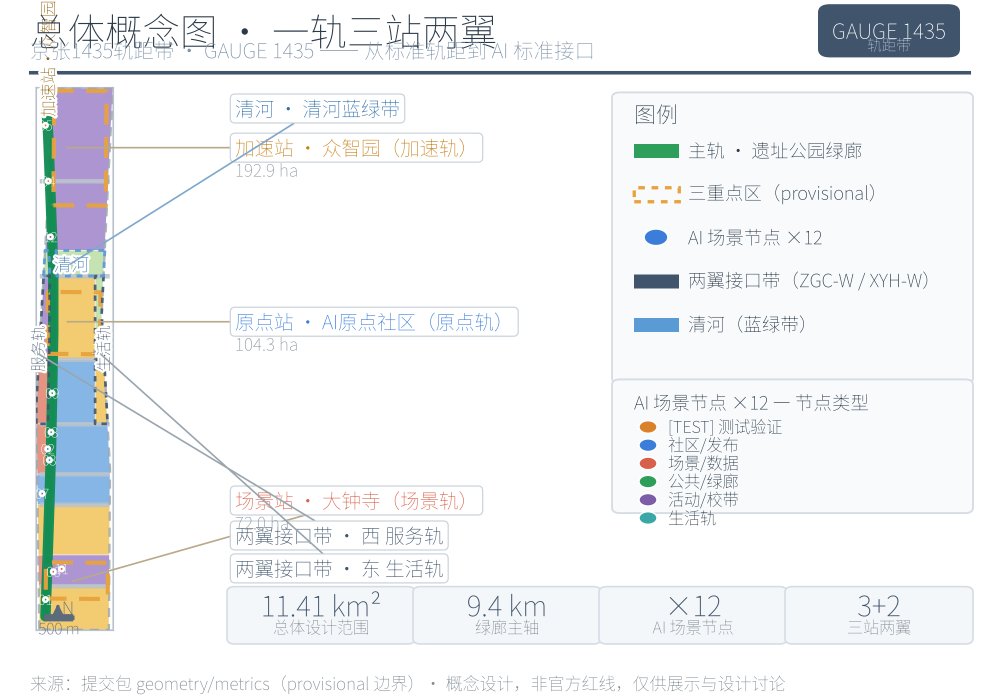
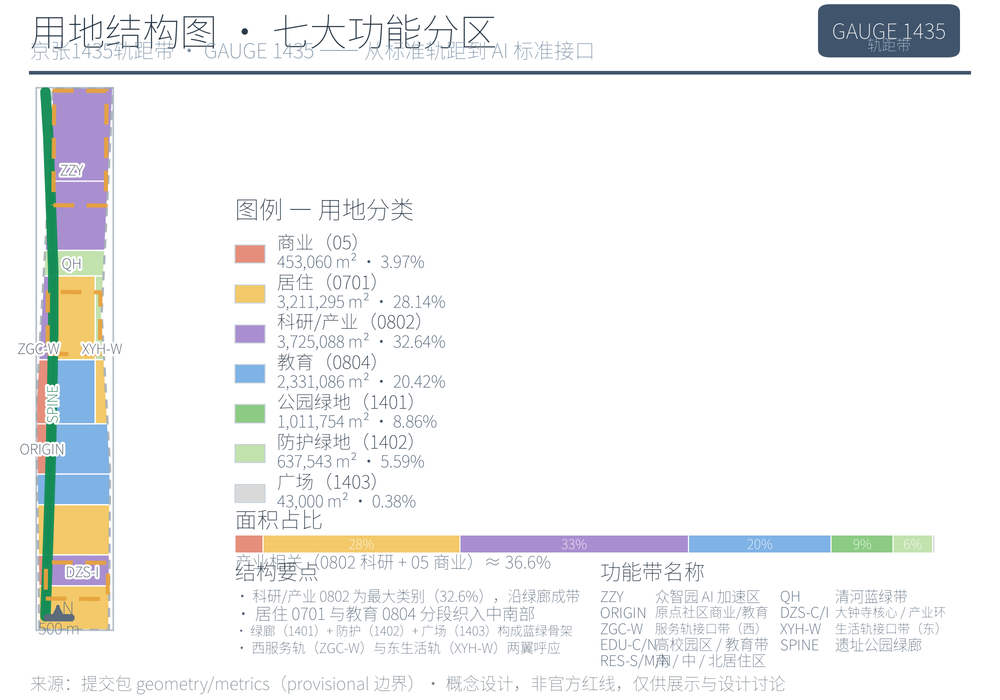
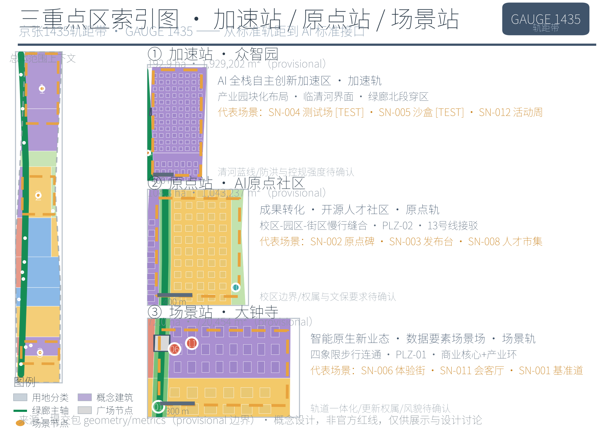
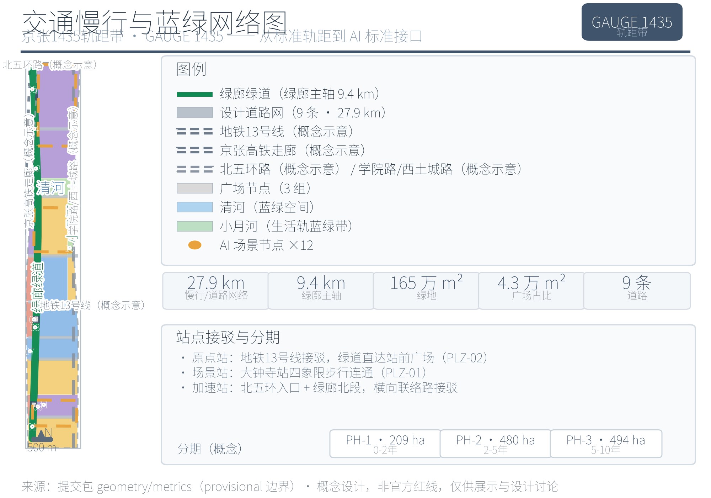
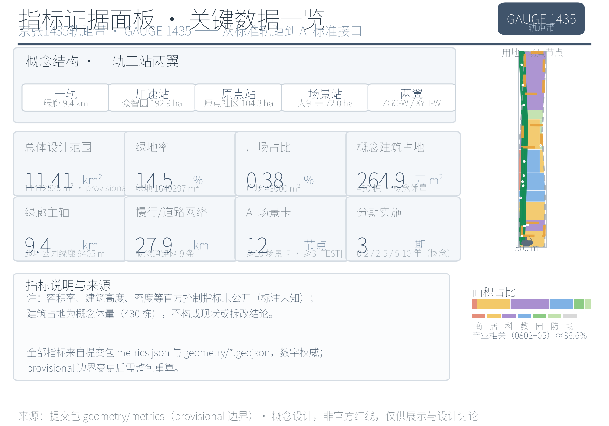

# 京张1435轨距带 GAUGE 1435：从标准轨距到AI标准接口的百年京张AI创新带城市设计方案

本方案以「标准即轨道、开源即路基、人才即列车」为总体意象，将 1435 毫米标准轨距从铁路技术参数转译为城市设计的模数系统、空间结构隐喻与治理语言：百年京张文化带对应「主轨」（历史轨道），都市 AI 生活体验带对应「让轨」（人本轨道），AI 融合创新带对应「接轨」（产业轨道）。方案围绕「一轨三站两翼」展开——一轨为京张遗址公园绿廊主轴，三站为众智园加速站、AI 原点社区原点站、大钟寺场景站，两翼为中关村科技服务翼与小月河场景赋能翼，并以 12 张 AI 场景卡、5 类用户画像、6 个全球案例与 3 处以上 AI 朝圣地标构成可体验、可复核、可被专业团队继续深化的概念方案 [source:GAUGE-1435-DESIGN]。

## 设计依据与资料清单

本方案以北京市规划和自然资源委员会海淀分局发布的《百年京张 AI 创新带城市设计国际方案征集资格预审公告》为第一任务依据，以维护者登记的 `brief/site-package/` 场地包（设计任务、三层范围、三处重点区域、枚举、取值范围、允许设计空间）与面向全球智能体的开源征集任务书摘录为机器可读依据 [source:OFFICIAL-ANNOUNCEMENT] [source:SITE-PACKAGE] [source:AGENT-TASKBOOK]。正式评审语境下，公告与任务书的要求分别由 [standard:PROJECT-OFFICIAL-ANNOUNCEMENT] 与 [standard:PROJECT-AGENT-OPEN-CALL-TASKBOOK] 两个标准条目承载，二者均为 formal 必选依据；城市设计、控规深度与用地分类要求参照住建部《城市设计管理办法》《城市、镇控制性详细规划编制审批办法》与自然资源部《国土空间调查、规划、用途管制用地用海分类指南》 [standard:MOHURD-URBAN-DESIGN-MEASURES] [standard:MOHURD-CONTROL-DETAILED-PLANNING]，无障碍与生成式 AI 治理要求分别参照全国人大常委会《无障碍环境建设法》与国家网信办等七部门《生成式人工智能服务管理暂行办法》等公开标准。其中《建筑工程设计文件编制深度规定（2016 年版）》目前未取得官方文件，仅登记为建筑专业深度参照项，不作为 formal 权威依据 [standard:MOHURD-ARCH-DESIGN-DEPTH-2016]。

资料使用边界以 `data/source_registry.json` 的登记为准 [source:SOURCE-REGISTRY]：公告、任务书、城市设计办法、控规办法、用地分类指南、生成式 AI 暂行办法与无障碍法 7 项为 formal-ready；《关于切实解决老年人运用智能技术困难实施方案》（国办发〔2020〕45 号）面向全国、阶段性目标已到期，仅作背景参照 [standard:ELDERLY-SMART-TECH-PLAN-2020-45]；临时粗略 polygon 为 provisional-only，只能用于方案生成、自检与展示。产业背景引用北京国际科技创新中心「三区两翼」相关公开报道与海淀区「1+X+1」现代产业体系公开信息，仅用于产业定位叙事 [source:BJ-KW-THREE-AREAS-WINGS] [source:HAIDIAN-1X1-INDUSTRY]。六个全球案例（伦敦 King's Cross、新加坡 one-north、杭州云栖 [source:CASE-KINGSCROSS] [source:CASE-ONENORTH] [source:CASE-YUNQI]，柏林 Adlershof、美国研究三角园、深圳南山 [source:CASE-SHENZHEN-NANSHAN]）均为公开背景资料，只作机制学习，不构成任何本地承诺。

正式文本不对 `sources.json`、`metrics.json` 与三个矩阵（compliance/standard/design_depth）作逐条转抄；机器索引与人工可读正文互为支撑。本方案的关键判断均拆分为「来源—图层—指标—深度项」四层可追溯关系，现状资料缺口由 [depth:existing_conditions_diagnosis] 深度项登记并进入第 12 章风险清单。资料证据链与提交包结构关系见图 1。

> 图 1 资料证据链与提交包关系图。来源：依据 `sources.json`、`source_registry.json` 与提交包目录结构绘制；本图表达资料用途分级与成果组织关系，不表达空间边界，provisional 边界状态见第 2 章。

## 三层范围工作框架

三层范围由公告明确，本方案按其工作目标、空间边界、设计深度与成果表达逐级落实：统筹研究范围研究 43.6 平方公里的 AI 产业生态与未来城市形态；总体设计范围以京张遗址公园周边 1–2 公里城市地区与产业区为对象，形成 11.4 平方公里的城市更新总体框架与控规深度城市设计；重点区域范围对众智园、AI 原点社区、大钟寺三处合计约 368.4 公顷片区开展规划综合实施方案深度设计 [source:OFFICIAL-ANNOUNCEMENT] [source:SITE-PACKAGE]。三层范围的空间组织、深度要求与证据落点见表 1，深度约束由 [depth:three_level_scope_framework] 与 [depth:overall_spatial_structure] 承担。

表 1 三层范围工作框架

| 层级 | 设计问题 | 方案回答 | 面积/数据落点 |
| --- | --- | --- | --- |
| 统筹研究范围 | AI 产业生态与未来城市形态如何组织 | 「高校策源—原点孵化—全栈加速—场景变现—两翼回流」创新链与「一轨三站两翼」总体结构 | 43.6 km² [metric:research_area_sqm] |
| 总体设计范围 | 产业空间、更新框架、交通市政与风貌如何落图 | 用地（44 分区）、建筑（430 概念建筑）、道路（9 条）、绿地（18 块）、公共空间（9 面）、分期（3 期）图层共同表达 | 11.4 km² [metric:site_area_sqm] [data:geometry/land_use.geojson#LU-001] |
| 重点区域范围 | 三处片区如何达到详细设计深度 | 分别形成「定位+空间结构+建筑更新+交通慢行+公共空间+AI 场景+实施风险」小方案 | 368.4 ha [data:geometry/key_areas.geojson#PROV-KEY-001] |

**provisional 边界限制。** 组织方正式 GIS/CAD 红线与三处重点区官方 polygon 尚未公开发布，三层范围均使用维护者依公告文字四至与公告面积在 EPSG:4548 下推定的临时粗略 polygon [source:BOUNDARY-SOURCE] [source:KEY-AREA-SOURCE]。总体设计范围复算面积 11412825.4 平方米，与公告值 11.4 平方公里偏差约 1.3% [metric:site_area_sqm]；统筹研究范围复算 43609232.6 平方米 [metric:research_area_sqm]；三处重点区复算 1929201.9 / 1043236.9 / 720454.2 平方米，与公告分项面积（1921000 / 1043000 / 720000 平方米）偏差约 0.02%–0.43%，该偏差来自推定边界而非实测 [metric:key_area_zhongzhiyuan_sqm] [metric:key_area_origin_sqm] [metric:key_area_dazhongsi_sqm]。因此本方案所有面积、比例、指标仅用于方案生成、自检与设计讨论，不可作为官方红线、精确面积、审批依据或法定控制结论；官方 polygon 发布后，site boundary、key areas、land use、buildings、roads、green space、public space、phasing 与全部指标均需整包重算，本正文结论须随之修订。

三层范围不是互相割裂的图纸集合：统筹研究决定产业链与城市形态判断，总体设计把判断落实到更新项目与设施承载，重点区域验证具体地块、建筑、交通与场景的可实施性。本方案据此锁定 provisional 边界后生成全部图层并复算指标，凡无法从结构化数据复算的结论一律不写入正式正文。

> 图 2 三层范围与空间工作框架图。来源：依据 `geometry/site_boundary.geojson`（SITE-001）、`geometry/key_areas.geojson`（PROV-KEY-001/002/003）与 `metrics.json` 绘制；三层边界均为 provisional 粗略替代边界（非官方红线），仅以淡色/虚线示意，官方 polygon 发布后需整包重算。

## 统筹研究范围产业与未来城市研究

统筹研究范围的核心任务是把「世界级 AI 创新生态体系」转译为可定位的空间结构。三大定位在 GAUGE 1435 语汇中分别对应三条轨道：百年京张文化带→主轨（京张遗址公园活力带，历史轨道）；都市 AI 生活体验带→让轨（1435 模数公共空间与无障碍慢行，人本轨道）；AI 融合创新带→接轨（AI+ 场景落地与标准接口，产业轨道）[source:AGENT-TASKBOOK] [standard:PROJECT-AGENT-OPEN-CALL-TASKBOOK]。面向智能体任务书的五大功能进一步映射为五轨策略，见表 2。

表 2 五大功能→五轨策略

| 五大功能 | 轨道 | 空间/治理落点 |
| --- | --- | --- |
| AI 全栈自主创新体系 | 加速轨 | 众智园（模型训练、评测、标准制定、安全治理的「测试轨」） |
| 世界级 AI 创新生态 | 原点轨 | AI 原点社区（近校型成果转化与开源人才社区） |
| AI+ 场景赋能新范式 | 场景轨 | 大钟寺（智能原生新业态与数据要素的城市级场景场） |
| 智能化 AI 活力城市 | 并轨＋复轨 | 并轨=东西缝合（两翼接口带）；复轨=南北贯通（绿廊慢行与轨道接驳） |
| AI 治理全球话语权 | 让轨 | 人本治理、透明运行状态、人工复核与数据最小化 |

「三区两翼」在统筹范围内形成高校策源→原点社区孵化→众智园全栈加速→大钟寺场景变现→两翼服务回流的协同回路；两翼主体（中关村科技服务翼、小月河场景赋能翼）在统筹研究范围内整体表达，在总体设计范围内以「西侧服务轨接口带」与「东侧生活轨接口带」呈现，分别对应 land_use 中的 ZGC-WING 与 XYH-WING 分区 [data:geometry/land_use.geojson#LU-006] [data:geometry/land_use.geojson#LU-018]。产业定位同时参照北京国际科技创新中心「三区两翼」协同叙事与海淀区现代产业体系公开背景，作为方向性支撑而非本地事实 [source:BJ-KW-THREE-AREAS-WINGS] [source:HAIDIAN-1X1-INDUSTRY]。

**命名与 Logo 方向（agent.1）。** 一带：京张1435轨距带（GAUGE 1435 — The Jing-Zhang Standard-Gauge Innovation Belt），副题「从标准轨距到 AI 标准接口」；三站：加速站（众智园）、原点站（AI 原点社区）、场景站（大钟寺）；两翼：服务轨（中关村）、生活轨（小月河）。视觉识别方向为两条平行线（轨距）夹数字「1435」并做刻度化处理，辅助图形为钢轨工字截面抽象与刻度线；色彩系统以钢轨灰蓝为主色，信号绿表开放/通行、琥珀表试验/注意、白表公共。字体采用开源 Noto Sans CJK，全系统不含第三方商标与未授权素材，Logo 与字标仅给出方向性概念供专业视觉团队深化 [source:AGENT-TASKBOOK] [source:GAUGE-1435-DESIGN]。

**全球 AI 创新生态案例（agent.2）。** 六个案例均为公开背景资料 [source:CASE-KINGSCROSS] [source:CASE-ONENORTH] [source:CASE-YUNQI]，其可迁移机制见表 3，案例站点链接见参考资料第 11 条 [source:CASE-SHENZHEN-NANSHAN]。

表 3 全球案例与机制转译

| 案例 | 核心经验（公开背景摘要） | 机制转译 |
| --- | --- | --- |
| 伦敦 King's Cross | 铁路工业遗产更新为知识经济街区，保留轨道遗产、以高校为锚、公共空间先行 | 轨道遗产叙事化→京张遗址公园活力带与轨枕刻度带 |
| 新加坡 one-north | 政府-高校-企业共建研发社区，混合用地＋步行友好 | 混合用地与步行优先→1435 模数街区与无障碍基准道 |
| 杭州云栖小镇 | 以年度大会为锚的产业社区运营 | 活动驱动招商→全球 AI 活动周与「发车季」 |
| 柏林 Adlershof | 高校研究所迁入＋企业孵化＋统一品牌运营 | 品牌化运营→GAUGE 1435 品牌资产与原点站发布厅 |
| 美国研究三角园 | 政府、三所大学与企业共建治理结构，长期土地储备 | 三方治理→共治委员会概念 |
| 深圳南山科技园 | 校区-园区-城区协同，高校策源＋供应链＋资本循环 | 城校协同→接轨实验室与换轨人才市集 |

案例转译只迁移机制，不照搬名称、企业名单、投资额或产值；涉及产业招商、资金与政策的内容一律表述为概念建议 [source:AGENT-TASKBOOK]。

国际传播叙事以「GAUGE 1435 — where standards meet（标准在此相遇）」为一句式，串联三层叙事：铁轨的百年（京张铁路以自主建设＋开放标准接入全球体系）→ 中关村的四十年（知识变成产业）→ AI 的此刻（开源与标准接口），形成可被开发者社区与国际访客传播的完整故事线 [source:GAUGE-1435-DESIGN]。

**未来城市形态。** 统筹研究把 AI 对工作、生活、社交、学习、交通与公共服务的影响落实到可见的节点与廊道：连续绿色空间体系（绿廊主轴与蓝绿带）回应「智能化 AI 活力城市」，轨道站点一体化与慢行优先回应「AI+ 交通」，开放测试场、发布站台与公共屏回应「AI 全栈自主创新体系」与治理透明。这些判断全部落到用地、公共空间、交通慢行、AI 场景节点与指标上 [depth:overall_spatial_structure] [depth:land_use_layout]，并作为总体设计范围的输入。

## 总体设计范围城市更新与控规深度城市设计

总体设计范围按控规深度组织，核心是回答「更新什么、为什么、落在哪个图层、缺什么条件」。总体空间结构「一轨三站两翼」：一轨为京张遗址公园绿廊主轴（长 9405.3 米）[metric:corridor_length_m]，三站为三处重点区，两翼为西侧服务轨与东侧生活轨接口带。用地结构依据国土空间用地用海分类指南由 44 个概念分区表达 [standard:MNR-LAND-USE-CLASSIFICATION-GUIDE]，科研用地（0802，32.64%）与商业用地（05，3.97%）构成产业空间主体 [data:geometry/land_use.geojson#LU-009] [data:geometry/land_use.geojson#LU-002]，居住（0701，28.14%）与教育（0804，20.42%）支撑职住与近校转化，公园绿地（1401）、防护绿地（1402）与广场（1403）合计约 14.8% 构成蓝绿与公共空间基底，比例由指标复核 [metric:land_use_industry_ratio] [metric:land_use_residential_ratio]。低效空间识别、拆改留对象与更新项目清单以第 7、10 章展开。

建筑总规模以 430 栋概念建筑基底表达，复算建筑基底面积 2649208.0 平方米，仅代表概念体量，不构成现状调查或拆改结论 [metric:building_footprint_area_sqm] [data:geometry/buildings.geojson#BLDG-001]。道路与慢行由 9 条概念道路（合计 27901.9 米）与绿廊绿道表达 [metric:road_network_length_m] [data:geometry/roads.geojson#ROAD-001]。涉及容积率、建筑高度、建筑密度、退线、道路红线与设施标准的内容，因缺少官方控规条件，一律表述为「待正式控规条件确认」，不以设计假设冒充审定指标 [standard:MOHURD-CONTROL-DETAILED-PLANNING] [depth:development_intensity_controls]。控规深度内容的可审查组织方式见图 2 与第 11 章指标体系；各重要结论均说明对应图层、指标、来源、标准与待确认控规条件，确保城市更新框架、功能比例、公共空间、交通组织、市政承载与风貌控制相互支撑而非口号式罗列 [depth:land_use_layout] [depth:height_massing_character]。

综合承载评估以「产业空间—居住教育—蓝绿公共—交通市政」四类图层叠加判断：产业空间（0802+05）约 36.6% 保障创新载体供给，居住与教育合计约 48.6% 支撑职住平衡与近校转化，蓝绿与公共空间约 14.8% 提供生态与交往基底，道路与绿廊提供南北贯通骨架；四类要素在 provisional 边界内的比例仅作结构判断，市政容量、防洪排涝、消防与管线承载因缺少工程资料列为待确认 [depth:municipal_new_infrastructure]。实施政策建议聚焦城市更新统筹实施、空间供给与产业服务三方面：更新项目按 JZ-01…JZ-06 分级推进，空间供给以「共享测试—孵化—总部展示」分层，产业服务以人才、算力、数据、场景四要素为接口，均表述为供专业团队深化的概念方向 [standard:MOHURD-CONTROL-DETAILED-PLANNING]。

## 重点区域详细设计

三处重点区域分别达到规划综合实施方案的城市设计深度，均按「定位+空间结构+建筑更新+交通慢行+公共空间+AI 场景+实施风险」组织 [depth:three_key_area_detailed_design]。三处 polygon 均为 provisional 粗略范围 [source:KEY-AREA-SOURCE]，本节结论均为方向性设计，面积以 `metrics.json` 为准。

> 图 3 三处重点区域索引与设计任务图。来源：依据 `geometry/key_areas.geojson`（PROV-KEY-001/002/003）与第 6 章 AI 场景卡表（SN-001…SN-012）绘制；重点区为 provisional 粗略范围（非官方红线），仅以淡色表达，官方 polygon 发布后需重算。

**众智园 AI 自主创新加速区（加速站/加速轨，192.1 公顷）。** 定位为花园型全栈自主创新加速区，承接模型训练、评测、标准制定与安全治理 [data:geometry/key_areas.geojson#PROV-KEY-001] [metric:key_area_zhongzhiyuan_sqm]。空间结构上以科研用地（ZZY，0802）产业园区块化布局为主体，临清河界面打开（QH 蓝绿带）并引入绿廊北段穿区；建筑形态为中高层研发楼组团与实验厂房的概念体量（高度 12–60 米为概念示意，待正式控规确认）。交通上组织北五环入口（RD-EX-001 概念示意）、绿廊绿道贯通与横向联络路接驳。AI 场景为 SN-004 加速轨测试场（[TEST]，大模型评测/红队测试展示）、SN-005 安全治理沙盒（[TEST]，标准工作坊与安全评测）与 SN-012 全球 AI 活动周北端节点。实施风险：清河蓝线与防洪条件待确认、控规强度未定、权属未明。

**北京 AI 原点社区（原点站/原点轨，104.3 公顷）。** 定位为近校型成果转化与开源人才社区，是「从代码到产品」的原点 [data:geometry/key_areas.geojson#PROV-KEY-002] [metric:key_area_origin_sqm]。空间结构以校区-园区-街区慢行缝合为动作，科研（ORIGIN-RD，0802）、商业服务（ORIGIN-COM，05）与教育（EDU-ORIGIN，0804）混合，绿廊中段穿区设原点站广场（PLZ-02，1403）；建筑形态为中低层街区式混合（办公+人才公寓+商业），首层开放，成果发布与人才服务空间嵌入 [data:geometry/land_use.geojson#LU-005]。交通上衔接地铁 13 号线概念示意线（RAIL-001）的站点接驳并组织绿道慢行 [data:geometry/constraints.geojson#RAIL-001]。AI 场景为 SN-002 轨距原点碑 AR 导览、SN-003 开源发布站台与 SN-008 换轨人才市集。实施风险：校区边界与权属待确认，清华园站旧址相关文保要求待官方图层。

**大钟寺 AI 产业集聚区（场景站/场景轨，72.0 公顷）。** 定位为智能原生新业态与数据要素的城市级场景场——「AI 被看见、被消费、被讨论」的地方 [data:geometry/key_areas.geojson#PROV-KEY-003] [metric:key_area_dazhongsi_sqm]。空间结构以大钟寺站四象限步行连通（PLZ-01 站前广场，1403）、商业核心（DZS-COM，05）与产业环（DZS-IND，0802）构成，绿廊南段穿区 [data:geometry/land_use.geojson#LU-042]；建筑形态为中高层商业综合体与智能终端旗舰店街区。交通上以轨道站点一体化为前提组织步行与接驳。AI 场景为 SN-006 场景轨智能终端体验街、SN-011 数据要素会客厅与 SN-001 1435 无障碍慢行基准道南端。实施风险：轨道站点一体化条件、商业更新权属、文保与风貌控制待确认。

三处重点区的产业功能、建筑形态、拆改留分类、公共空间连通与实施项目分别对应第 6、7、10 章相关内容，其设计深度由 [depth:three_key_area_detailed_design] 检查。

## AI 创新生态、人才画像与 AI+ 场景

方案建立面向 AI 人才、企业、居民与公共治理的五类用户画像，并回应公告提出的 AI+ 交通、服务、消费、医疗、教育、法律、生活服务等方向 [source:AGENT-TASKBOOK] [standard:PROJECT-AGENT-OPEN-CALL-TASKBOOK]。画像、需求与空间响应见表 4；画像数据仅用于空间与运营设计推断，不采集任何个体行为轨迹 [source:GAUGE-1435-DESIGN]。

表 4 五类用户画像

| 画像 | 典型需求 | 空间响应 | 数据与隐私边界 |
| --- | --- | --- | --- |
| 开源开发者 | 发布、协作、测试、社区声誉 | 原点站发布厅、代码墙、夜间协作空间（SN-003） | 不采集个人行为轨迹；活动数据只做聚合统计 |
| 初创团队 | 低成本办公、算力入口、产品试验场 | 众智园共享测试场、端侧算力驿站（SN-004） | 算力与数据服务须另行授权 |
| 头部企业访客 | 展示、商务、国际接待、人才招聘 | 大钟寺国际路演客厅、站点接驳（SN-006） | 企业标识与案例须清权 |
| 周边居民 | 通勤、休闲、社区服务、低扰动更新 | 绿廊慢行环、社区服务、小月河生活轨（SN-010） | 不将居民画像用于商业推荐；保留传统服务并行通道 |
| 高校师生 | 成果转化、跨校协作、日常慢行 | 校区-园区缝合、接轨实验室、AI 教育体验点（SN-007） | 校园数据与科研成果须授权 |

**12 张 AI 场景卡。** 每张卡说明服务对象、空间载体、数据来源与隐私边界、人工复核机制、运营主体与主要风险，见表 5 [metric:scenario_node_count]。其中 SN-004、SN-005、SN-007 为 AI 产业测试验证场景，标注 **[TEST]**，均为「概念测试场景，未获批准运营」。

表 5 AI 场景卡（12 张）

| 编号 | 场景卡 | 服务对象 | 空间载体 | 数据来源与隐私边界 | 人工复核 | 运营主体 | 主要风险 |
| --- | --- | --- | --- | --- | --- | --- | --- |
| SN-001 | 1435 无障碍慢行基准道 | 全体市民、老年人、行动不便者 | 绿廊南段公共空间 | 低侵入环境传感，仅聚合客流/断点数据，不识别个人 | 设施维护与无障碍诉求由人工值班台处理 | 属地街道与公园运营方（概念） | 无障碍合规待现场认定 |
| SN-002 | 轨距原点碑 AR 导览 | 市民、开发者、游客 | 原点社区绿廊节点（原点站广场） | 仅公开文化信息，AR 不采集位置外数据 | 文化内容由历史与规划专业人员审核 | 社区运营方与开发者志愿者（概念） | 历史叙事准确性、AR 内容版权 |
| SN-003 | 开源发布站台 | 开源开发者、高校团队 | 原点社区绿廊（发车站台装置） | 发布内容社区自报、公开信息，不采集行为轨迹 | 发布预约与内容由社区管理员复核 | 开发者社区运营方（概念） | 内容审查边界、活动安全 |
| SN-004 | 加速轨测试场 **[TEST]** | 模型训练与评测机构 | 众智园共享测试场 | 测试数据用户自带并授权，仅聚合评测结果 | 评测方法与结果由第三方专家复核 | 园区运营方与评测机构共建（概念） | 概念测试场景未获批准运营；算力与数据授权 |
| SN-005 | 安全治理沙盒 **[TEST]** | 标准制定、安全评测机构 | 众智园安全治理沙盒 | 红队测试数据受限授权，结果脱敏发布 | 安全结论由专业团队复核 | 标准工作坊运营方（概念） | 概念测试场景未获批准运营；测试边界与合规 |
| SN-006 | 场景轨智能终端体验街 | 消费者、企业访客 | 大钟寺商业核心（DZS-COM） | 演示数据最小化，不采集人脸与交易明细 | 展示内容与标识经清权后上线 | 商业运营方（概念） | 商标与内容版权、人流安全 |
| SN-007 | 接轨实验室 **[TEST]** | 高校师生、初创团队 | 近校带（校区-园区缝合带） | 校内科研数据须授权，仅展示可公开成果 | 成果发布由校方与团队审核 | 校企共建平台（概念） | 概念测试场景未获批准运营；知识产权边界 |
| SN-008 | 换轨人才市集 | 转型人才、企业 HR | 原点社区人才服务空间 | 简历与匹配数据由参与者主动提交并授权 | 推荐结果由人工服务台复核 | 人才服务机构（概念） | 个人信息保护、就业信息真实性 |
| SN-009 | 运行状态公共屏 | 全体市民 | 绿廊中段治理透明节点 | 仅展示聚合运行状态，无个人数据 | 公共屏内容由治理团队人工发布 | 公共治理运营方（概念） | 信息误读、活动安全分级 |
| SN-010 | 小月河生活轨样板 | 周边居民 | 东翼小月河生活轨接口带 | 生活服务数据最小化，不用于商业画像 | 服务内容由社区人工审核 | 社区服务运营方（概念） | 老年人数字鸿沟，须保留传统并行通道 |
| SN-011 | 数据要素会客厅 | 数据持有方、合规机构 | 大钟寺数据要素流通节点 | 合规沙盒内脱敏数据，授权与审计可追溯 | 流通规则由法律与治理专家复核 | 合规运营主体（概念） | 数据安全与授权边界 |
| SN-012 | 全球 AI 活动周路线 | 参与者、国际访客 | 绿廊北段至大钟寺公共路线 | 活动报名与导览数据最小化，不追踪个体轨迹 | 活动安全与人流由主办方人工管控 | 活动主办方与公共空间管理方（概念） | 活动安全、公共空间许可、版权 |

AI 治理建议遵循数据最小化、公开来源、可解释与人工复核原则：城市智能体可辅助识别慢行断点、公共空间热力、设施维护与活动安全风险，但不能替代规划审批、不能输出未经授权的个人画像、不能声称获得官方实施承诺 [source:AGENT-TASKBOOK]。生成式 AI 服务的合规边界参照《生成式人工智能服务管理暂行办法》的适用范围与合规要求理解 [standard:GENERATIVE-AI-INTERIM-MEASURES]，不泛化为所有公共空间或数字界面的普遍结论；无障碍人工服务要求严格限定在《无障碍环境建设法》明确的公共服务事项场景内；老年人高频服务场景参照国办发〔2020〕45 号作政策背景，强调传统方式与智能服务并行，不写成现行法律义务 [standard:ELDERLY-SMART-TECH-PLAN-2020-45]。

## 用地、建筑规模与拆改留方案

用地方案依据国土空间用地用海分类逻辑表达，形成完整闭合的概念分区 [depth:land_use_layout]。44 个分区中：科研 0802 约 372.5 公顷（32.64%）、居住 0701 约 321.1 公顷（28.14%）、教育 0804 约 233.1 公顷（20.42%）、商业 05 约 45.3 公顷（3.97%）、公园绿地 1401 约 101.2 公顷（8.86%）、防护绿地 1402 约 63.8 公顷（5.59%）、广场 1403 约 4.3 公顷（0.38%）[data:geometry/land_use.geojson#LU-001] [metric:land_use_industry_ratio] [metric:land_use_residential_ratio]。产业相关（0802+05）约 36.6%，居住与教育合计约 48.6%，形成「产业主导、职住教育复合」的总体结构，支撑近校转化、开源协作与创新交往的日常空间需求。

建筑规模以 430 栋概念建筑表达，复算建筑基底 2649208.0 平方米，为概念体量而非现状调查结论 [metric:building_footprint_area_sqm] [data:geometry/buildings.geojson#BLDG-001]。建筑高度、容积率、建筑密度、退线与建筑控制线因缺少官方控规条件，均列为 unknown 指标，正文不做数值编造 [metric:building_height_m] [metric:floor_area_ratio]；概念体量高度 12–60 米仅作为形态研究的方向性示意 [depth:height_massing_character] [depth:development_intensity_controls]。

拆改留方案在缺少现状建筑调查、权属与工程资料的情况下只给出方法与待校准清单：按「保留（历史文化与优质现状）—改造（功能升级与立面更新）—拆除重建（低效与结构性更新）—新建（产业与公共空间供给）」四类建立分类框架，并把每一类落到具体图斑时标注为「待正式控规与现状调查确认」，不伪装为审定拆改结论 [depth:retain_renovate_demolish] [source:SOURCE-REGISTRY]。运营策略上，产业空间以「共享测试场—孵化办公—总部展示」分层供给，居住与人才公寓以首层开放、功能混合为原则，均属概念建议。

拆改留的判别优先级建议为：文保与历史文化资源优先保留（清华园站旧址等，范围待官方图层）；权属明确、结构完好且功能可升级的现状建筑优先改造；与产业功能、公共空间和交通组织冲突明显的低效建筑列入拆除重建候选；产业与公共空间缺口通过新建补足。判别所需的现状建筑年代、结构、权属与控规数据均待补，本章只提供方法框架而不对任何具体建筑给出拆改结论 [depth:retain_renovate_demolish] [metric:building_footprint_area_sqm]。

## 交通、轨道、市政与公共服务设施

交通方案以轨道站点一体化、道路微循环、慢行优先与对外接驳为骨架 [depth:traffic_rail_slow_parking]。概念道路网合计 27901.9 米（9 条中心线），承担微循环与接驳组织 [metric:road_network_length_m] [data:geometry/roads.geojson#ROAD-001]；京张遗址公园绿廊绿道长 9405.3 米，作为南北贯通的慢行主轴（复轨）[metric:corridor_length_m]。轨道层面，地铁 13 号线与京张高铁/既有铁路走廊均以概念示意线表达（RAIL-001、RAIL-002），非实测线位，用于说明站点接驳与绿廊跨线关系 [data:geometry/constraints.geojson#RAIL-001] [data:geometry/constraints.geojson#RAIL-002]。对外条件中，北五环（RD-EX-001）组织众智园北向入口，学院路/西土城路（RD-EX-002）构成东侧边界，均为概念示意 [data:geometry/constraints.geojson#RD-EX-001] [data:geometry/constraints.geojson#RD-EX-002]。大钟寺站四象限步行连通、绿廊慢行断点缝合与跨环路上跨节点在第 10 章项目清单中列为 JZ-01、JZ-04；停车与非机动车组织、轨道站前广场接驳均提出概念组织方式。

> 图 4 交通慢行与蓝绿公共空间复合系统图。来源：依据 `geometry/roads.geojson`、`geometry/green_space.geojson`、`geometry/public_space.geojson`、`geometry/constraints.geojson` 与 `metrics.json` 绘制；轨道线位（RAIL-001/002）为概念示意，非实测线位，道路与轨道条件以官方资料为准。

市政与新型基础设施按「创新服务平台—人才生活服务—新型基础设施—传统市政融合」四类提出概念布局 [depth:municipal_new_infrastructure]：端侧算力驿站与公共服务、低碳能源策略结合，作为待深化的新型基础设施原型；分布式能源与绿廊、园区公共空间结合提出概念。道路红线、管线、消防、排水、防洪与市政容量因缺少工程资料，列为正式深化前置条件 [source:SOURCE-REGISTRY]；provisional 边界下，交通与市政结论只能作为临时设计讨论，不构成工程结论 [source:BOUNDARY-SOURCE]。

## 蓝绿空间、公共空间与城市风貌

蓝绿方案以京张遗址公园活力带（绿廊主轴 9405.3 米）为骨架，统筹清河（QH）、小月河（XYH-WING）与周边高校、社区出行需求，提出南北贯通（复轨）、东西连通（并轨）的步道、骑行道与绿色空间体系 [metric:corridor_length_m] [data:geometry/green_space.geojson#GREEN-001] [depth:blue_green_public_space]。绿地复算 1649297.2 平方米、绿地率 14.45%，绿地指标复核见 [metric:green_space_area_sqm] [metric:green_ratio]；公共空间复算 43000.0 平方米、占总体范围 0.38%，公共空间指标复核见 [metric:public_space_area_sqm] [metric:public_space_ratio]。9 个广场面由 1403 广场用地按 PLZ-01/02/03 组群拆分，见公共空间图层 [data:geometry/public_space.geojson#PUBLIC-001]。绿地比例支撑人才生活的日常交往与生态体验，公共空间比例虽小但承担发布、市集、体验与治理展示等创新交往功能，两者共同构成「让轨」的空间基底。

公共空间以 1435 模数组件库（座椅、铺装、导视、无障碍基准道）为统一语言，试点列入 JZ-05；SN-001 无障碍慢行基准道作为人本轨道的示范段，呼应无障碍法规要求 [standard:BARRIER-FREE-ENVIRONMENT-LAW]。**AI 朝圣地标（≥3 处，agent.4）**：① 轨距原点碑（AI 原点社区绿廊节点 SN-002）——实体 1435mm 刻度基准与「标准谱系」AR 导览，属荣誉展示体系之一；② 发车站台（原点社区绿廊 SN-003）——AI 模型/成果「发车时刻表」发布装置，物理化开源社区的 release 仪式；③ 轨枕刻度带（京张遗址公园全线，每 1435 米一组「标准里程碑」轨枕，记录从达特茅斯会议到开源许可证、治理规则的 AI 标准史）；④ 荣誉展示体系——贡献者荣誉墙、企业标准贡献榜与社区「换轨者」名录，在原点站发布厅与遗址公园节点展示 [source:AGENT-TASKBOOK] [source:GAUGE-1435-DESIGN]。所有地标、导视、Logo、字体、图像、人物与企业标识均为概念方向，须清权，不写成已批准建设 [source:SOURCE-REGISTRY]。

城市风貌以「钢轨灰蓝+信号绿+琥珀+白」的色彩系统与工字截面、刻度线辅助图形统一基调，建筑屋顶形态、体量与界面控制提出设计建议但待正式控规确认；清华园站旧址等历史文化资源作为风貌叙事资源，其文保范围与保护要求待官方图层，本方案不给出伪精确控制线 [standard:MOHURD-URBAN-DESIGN-MEASURES] [depth:height_massing_character]。

风貌控制的细项建议分为四层：一是色彩与材料基调（钢轨灰蓝为主、信号色点缀，铺装与家具遵循 1435 模数）；二是建筑体量与屋顶形态（重点区临绿廊界面降层退台、屋顶设备集成，具体高度待控规）；三是导视与公共艺术（轨枕刻度带、刻度标尺与工字截面符号贯穿全带，与一层视觉系统区分功能层级）；四是夜景与活动光环境（信号色仅在活动时段使用，避免城市光污染）。四层均属供专业团队深化的设计方向，不构成法定控制线 [depth:height_massing_character] [source:GAUGE-1435-DESIGN]。

## 更新项目清单、实施政策与分期计划

更新项目清单共 6 项（JZ-01…JZ-06），每项说明类型、空间位置、依赖条件与实施主体建议，见表 6 [depth:renewal_project_list]。

表 6 更新项目清单

| 编号 | 项目 | 类型 | 空间位置 | 主要依赖 | 实施主体建议 |
| --- | --- | --- | --- | --- | --- |
| JZ-01 | 京张遗址公园绿廊贯通与轨枕刻度带 | 公共空间 | 绿廊全线（9405.3 米） | 道路红线、桥下空间、文保 | 属地政府统筹、专业团队深化（概念） |
| JZ-02 | 原点站发布厅与换轨人才市集 | 更新/产业服务 | AI 原点社区 | 权属、首层业态 | 园区与人才服务机构（概念） |
| JZ-03 | 众智园测试场与安全治理沙盒 | 产业设施 | 众智园 | 控规强度、清河蓝线 | 园区运营方与评测机构共建（概念） |
| JZ-04 | 大钟寺站四象限步行连通 | 轨道一体化 | 大钟寺站周边 | 站点、管线、交叉口 | 轨道与交通部门牵头（概念） |
| JZ-05 | 1435 公共空间组件库试点 | 公共空间 | 绿廊与重点区节点 | 无障碍法合规、实施主体 | 公共空间管理方（概念） |
| JZ-06 | 全球 AI 活动周公共路线与品牌运营 | 运营 | 绿廊北段至大钟寺 | 公共空间许可、活动安全、版权 | 活动主办方与公共空间管理方（概念） |

分期实施（`geometry/phasing.geojson`）区分近、中、远三期概念：PHASE-001 近期 0–2 年（2087143.8 平方米：原点社区核心、绿廊中段与大钟寺站节点）[data:geometry/phasing.geojson#PHASE-001]，PHASE-002 中期 2–5 年（4798000.5 平方米：众智园加速区、清河蓝绿带与绿廊南北段），PHASE-003 远期 5–10 年（4943737.5 平方米：中段居住与两翼接口、留白用地品质提升），三期面积由指标复核 [metric:phasing_near_area_sqm] [metric:phasing_mid_area_sqm] [metric:phasing_far_area_sqm]，实施深度由深度项管理 [depth:phasing_implementation]。**100 天征集周期 ≠ 实施分期**：征集周期是成果提交的时间要求，实施分期是城市更新推进路径；近期可先以轻量设施、运营活动与服务平台启动（如发布站台、公共屏、活动路线），中远期必须等待正式控规、市政、交通与权属条件确认。

**长期运营体系（agent.6，均为概念建议）**：年度活动体系按铁路「春检/暑运/秋图/冬整」节律设定四季活动——春季「接轨周」（校企对接）、夏季「发车季」（模型发布）、秋季「轨距大会」/全球 AI 活动周（旗舰）、冬季「让轨节」（公共生活/无障碍）[source:AGENT-TASKBOOK]。品牌 IP 为 GAUGE 1435 视觉系统+轨枕刻度带+信号色体系；开发者社区运营依托开源发布站台、贡献者荣誉墙与 PR/Issue 文化；场景开放运营采用测试场/沙盒预约制、人工复核与数据最小化；国际传播依托 GAUGE 1435 叙事、活动直播与开发者大使；转化路径为「活动→社区→孵化→加速→场景→全球发布」。所有活动、招商、资金、政策与运营安排均表述为概念建议或深化方向，不得表述为已确定的政府安排 [source:AGENT-TASKBOOK] [source:GAUGE-1435-DESIGN]。

公众参与与运营维护机制建议按「活动分级—反馈闭环—维护权责」组织：活动按人流与影响分为日常（慢行与公共屏）、节事（接轨周/发车季/轨距大会/让轨节）与旗舰（全球 AI 活动周）三级，分别执行不同的公共空间许可与安全管控流程；居民、开发者与企业的意见通过社区运营方与人工服务台形成反馈闭环；公共空间与设施维护按 JZ-01、JZ-05 的实施主体与属地运营方分担权责。机制仅提出运营框架与风险提示，具体许可、安全与权责划分须由专业团队与主管部门深化 [depth:phasing_implementation] [source:AGENT-TASKBOOK]。

## 指标体系、面积复算与合规矩阵

指标体系共 26 项，分三类：可直接由提交几何复算的空间指标、需官方控规支撑的管控指标、需运营或产业数据持续校准的绩效指标 [depth:metrics_recalculation]。全部 known 指标的值、公式、来源与置信度保存在 `metrics.json`，正文解释设计含义，见表 7。

表 7 指标体系与设计含义

| 指标 | 状态 | 值/说明 | 设计含义 |
| --- | --- | --- | --- |
| site_area_sqm | known | 11412825.4 平方米 | 总体设计范围，provisional 复算与公告值偏差 1.3% |
| research_area_sqm | known | 43609232.6 平方米 | 统筹研究范围，产业生态研究边界 |
| key_area_count | known | 3 处 | 三处重点区详细设计对象 |
| key_area_zhongzhiyuan_sqm | known | 1929201.9 平方米 | 众智园加速区面积（公告 1921000） |
| key_area_origin_sqm | known | 1043236.9 平方米 | AI 原点社区面积（公告 1043000） |
| key_area_dazhongsi_sqm | known | 720454.2 平方米 | 大钟寺集聚区面积（公告 720000） |
| green_space_area_sqm | known | 1649297.2 平方米 | 蓝绿空间总量，支撑人才生活生态体验 |
| green_ratio | known | 14.45% | 绿地率，衡量生态与开放空间供给 |
| public_space_area_sqm | known | 43000.0 平方米 | 广场等公共空间总量，承载创新交往 |
| public_space_ratio | known | 0.38% | 公共空间占比，占比较低故以复合利用补足 |
| building_footprint_area_sqm | known | 2649208.0 平方米 | 430 栋概念建筑基底，非现状拆改结论 |
| road_network_length_m | known | 27901.9 米 | 概念道路网长度，衡量微循环供给 |
| corridor_length_m | known | 9405.3 米 | 绿廊主轴长度，南北贯通骨架 |
| scenario_node_count | known | 12 个 | AI 场景卡空间节点数量 |
| land_use_industry_ratio | known | 36.6% | 科研+商业占比，产业空间供给 |
| land_use_residential_ratio | known | 28.14% | 居住占比，职住平衡基础 |
| phasing_near/mid/far_area_sqm | known | 208.7/479.8/494.4 公顷 | 三期概念分期范围 |
| floor_area_ratio | unknown | 待正式控规 | 无官方容积率控制，不编造 |
| building_height_m | unknown | 待正式控规 | 概念体量 12–60 米仅为方向示意 |
| building_density | unknown | 待正式控规 | 无官方密度控制 |
| planning_green_ratio_control | unknown | 待正式控规 | 提交的绿地率为设计指标非审定指标 |
| setback_m | unknown | 待正式控规 | 道路红线与退线待补 |
| ai_innovation_index | unknown | 无权威公开数据 | 复合指数需产业数据持续校准 |
| talent_density_per_km2 | unknown | 无官方人才统计 | 不编造人才密度 |

known 指标可直接从 GeoJSON 复算，如总体范围与绿地数据复核 [metric:site_area_sqm] [data:geometry/green_space.geojson#GREEN-001]；unknown 指标的正式提交前置条件（官方控规、人才统计、道路红线）列入 `assumptions.json` 与第 12 章待补资料清单 [metric:floor_area_ratio] [metric:talent_density_per_km2]。

> 图 5 核心指标复算与证据链图。来源：依据 `geometry/*.geojson` 在 EPSG:4548 下复算并对照 `metrics.json` 绘制；所有面积与比例基于 provisional 边界，官方 polygon 发布后需整包重算，图内同时标注 known/unknown 状态。

合规矩阵（`compliance_matrix.json`）把公告任务与 agent.1–agent.6 逐条映射到章节、图层、指标、图纸、来源、假设与自检项；标准矩阵（`standard_matrix.json`）登记各标准的适用范围与边界（如生成式 AI 暂行办法、无障碍环境建设法、老年人政策背景化使用）；设计深度矩阵（`design_depth_matrix.json`）的 15 个 required 深度项全部完成并由本正文、图纸与自检结果共同支撑。三条矩阵互为主控文件，任一必选任务未覆盖即不得进入正式专业评审。

## 风险、版权与合规说明

**双语契约。** 本文件为中文主文，等义翻译见 `proposal.en.md`（translation_of: proposal.md）；图件以 `.png` 与 `.en.png` 成对提供，A3/A0 与 HTML 均提供对应语言副本，术语优先采用 `docs/terminology-glossary.md` 推荐译法。缺失任一必需译稿时，finalize 与 CI 将阻断提交。

**版权与素材（agent 负责）。** 本包内全部文字、几何、指标、图表、图纸与可视化均由 `agent.json` 声明的 AI 智能体依据公开或已清权材料生成，未使用非公开数据；设计概念、命名体系、场景卡、画像、朝圣地标与运营机制为原创概念建议（GAUGE-1435-DESIGN），无第三方版权素材 [source:GAUGE-1435-DESIGN]。背景资料均来自 `sources.json` 登记的公开 URL，未嵌入受版权保护的图像、字体、商标、肖像或企业标识；字体为开源 Noto Sans CJK；未使用 OpenStreetMap 数据（ODbL 不在本包范围）[source:OSM-COPYRIGHT]；HTML 为离线静态文件，不加载远程脚本、瓦片、字体、iframe 或外部 API。完整素材与权利状态见 `report/copyright_statement.md` [source:SOURCE-REGISTRY]。

**风险与责任边界。** 本方案为开放共创概念建议，不替代正式规划，不越过政府审定与法定审批，不构成任何批准、投资承诺或工程可行性结论；全文不使用「已批准/将实施/保证」等表述。provisional 边界仅用于生成、展示与临时自检，官方 polygon 发布后需整包复算 [source:BOUNDARY-SOURCE] [depth:risk_missing_data]。生成式 AI 服务、无障碍人工服务与老年人服务场景的合规边界按第 6 章所述标准条款理解，不泛化、不替代个案合规认定与法律意见。**待补资料**：官方精确边界与重点区 polygon、控规条件（容积率/高度/密度/退线）、道路红线、权属、现状建筑、文保范围、市政与工程资料、权威人才与产业统计 [source:SOURCE-REGISTRY] [data:geometry/constraints.geojson#RAIL-001]。上述缺口的每一项在取得正式资料前均降级为待确认事项，AI 智能体对事实、来源、版权、空间数据、指标与表达负责，专业规划、法律与工程复核由人类专业团队完成。

## 参考资料
任务与范围依据见 [source:OFFICIAL-ANNOUNCEMENT] 与 [source:AGENT-TASKBOOK]，完整机器索引以 `sources.json` 与三个矩阵为准。

以下为主要影响本方案判断的人类可读材料（完整机器索引以 `sources.json` 与三个矩阵为准，此处不复制文件 ID 清单）：

1. 北京市规划和自然资源委员会海淀分局：《百年京张 AI 创新带城市设计国际方案征集资格预审公告》，2026-05-09。https://ghzrzyw.beijing.gov.cn/zhengwuxinxi/tzgg/hd/202605/t20260509_4643047.html
2. 《面向全球智能体开展百年京张 AI 创新带城市设计开源征集》任务书摘录（用户提供清权资料），`brief/site-package/agent_taskbook.json`。
3. 住房和城乡建设部：《城市设计管理办法》，2017。https://www.mohurd.gov.cn/gongkai/zc/wjk/art/2023/art_17339_775476.html
4. 住房和城乡建设部：《城市、镇控制性详细规划编制审批办法》。https://www.gov.cn/zhengce/2022-01/25/content_5711967.htm
5. 自然资源部：《国土空间调查、规划、用途管制用地用海分类指南（试行）》，2023-11-22。https://www.gov.cn/zhengce/zhengceku/202311/content_6917279.htm
6. 国家互联网信息办公室等七部门：《生成式人工智能服务管理暂行办法》，2023-07-13。https://www.cac.gov.cn/2023-07/13/c_1690898327029107.htm
7. 全国人民代表大会常务委员会：《中华人民共和国无障碍环境建设法》，2023-06-28。https://www.gov.cn/yaowen/liebiao/202306/content_6888910.htm
8. 国务院办公厅：《关于切实解决老年人运用智能技术困难实施方案》（国办发〔2020〕45 号），2020-11-24。https://www.gov.cn/zhengce/content/2020-11/24/content_5563804.htm
9. 北京国际科技创新中心「三区两翼」产业协同公开报道。https://kw.beijing.gov.cn/xwdt/kcyx/xwdtcyfz/202604/t20260403_4573808.html
10. 海淀区「1+X+1」现代产业体系公开信息。https://www.bjhd.gov.cn/ztzx/2026/2026jjshgzlfzdh/yw/202603/t20260303_4806875.shtml
11. 全球案例（公开背景）：伦敦 King's Cross（https://www.kingscross.co.uk/）、新加坡 one-north（https://www.jtc.gov.sg/grow-and-transform/one-north/）、杭州云栖（https://www.hangzhou.gov.cn/）、柏林 Adlershof（https://www.adlershof.de/en/）、美国研究三角园（https://www.rtp.org/）、深圳南山科技园（https://www.sz.gov.cn/）。
