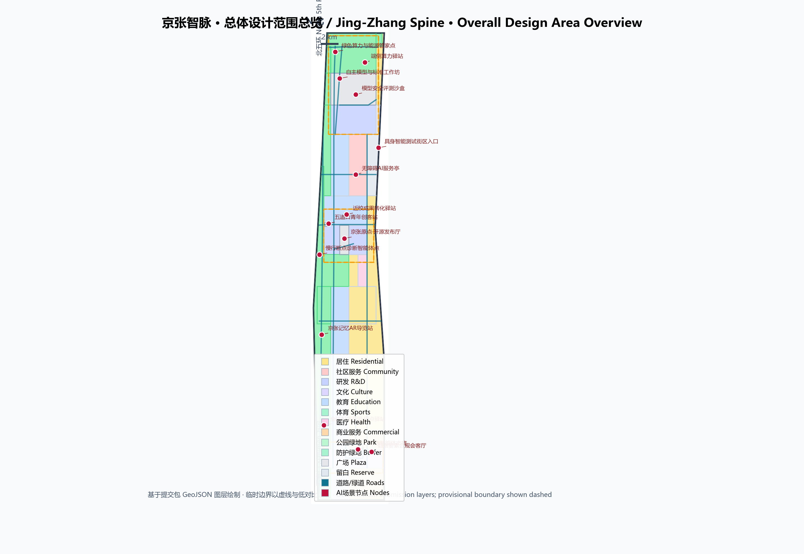
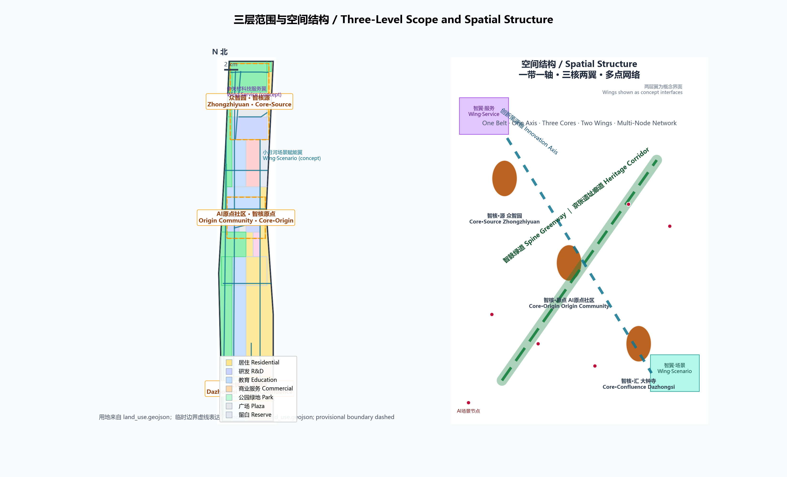
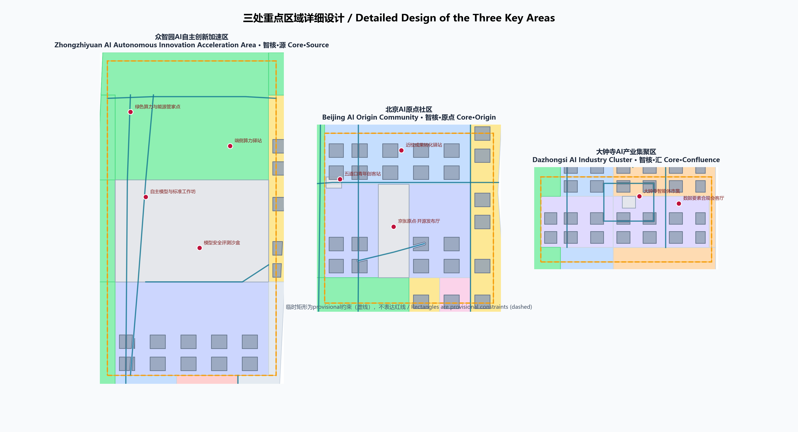
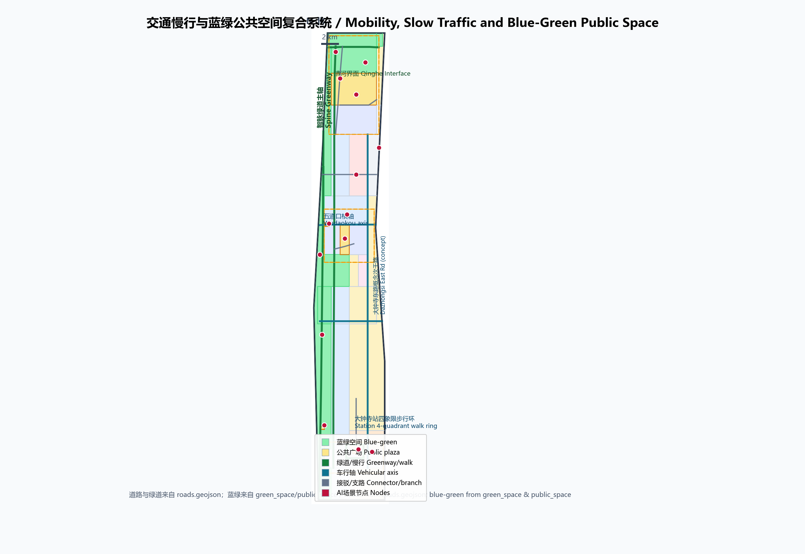
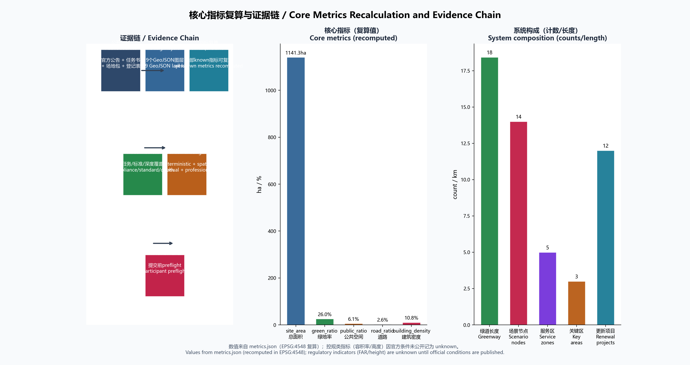

# 京张智脉：百年京张AI创新带城市设计方案

## 设计依据与资料清单

本方案以北京市规划和自然资源委员会海淀分局发布的《百年京张AI创新带城市设计国际方案征集资格预审公告》为第一依据 [source:OFFICIAL-ANNOUNCEMENT]，以面向全球智能体的开源征集任务书摘录为共创边界 [source:AGENT-TASKBOOK]，并按照 `brief/site-package/` 中的结构化场地包（`design_brief.json`、`allowed_design_space.json`、`sources.json`、`enums/`、`ranges/planning_limits.json`、`schemas/`）组织成果 [source:SITE-PACKAGE]。`data/source_registry.json` 与 `data/processed/agent_fact_pack.md` 用于区分 formal 依据、背景资料与 provisional intake 资料 [source:SOURCE-REGISTRY]。

公告确定三层范围：统筹研究范围约 43.6 平方公里、总体设计范围约 11.4 平方公里、重点区域范围约 368.4 公顷；三处重点区域自北向南为众智园AI自主创新加速区、北京AI原点社区、大钟寺AI产业集聚区 [source:OFFICIAL-ANNOUNCEMENT]。截至本稿提交日，公开渠道未发布官方精确 polygon 或红线，仓库按公告文字四至与面积约束推定了临时粗略边界 `PROV-SITE-001` 与三处重点区临时矩形 `PROV-KEY-001/002/003` [source:BOUNDARY-SOURCE]。本方案在未取得官方边界时按规则采用 provisional 几何：全部图层均标注 `official_boundary=false`、`geometry_role=provisional_constraint`，只能用于方案生成、自检、可视化和设计讨论，不构成官方红线、审批依据或精确面积复算依据 [source:KEY-AREA-SOURCE]。组织方数据缺口不阻断内容评分；官方数据发布后，本方案所有图层与指标需整体复算。

方案遵循“结构化数据是权威证据、正文是人类阅读层”的分工：`geometry/*.geojson` 承载空间证据，`metrics.json` 承载 EPSG:4548 复算指标，三个矩阵承载任务、标准与深度覆盖，正文只在关键判断旁保留少量证据锚点 [source:SITE-PACKAGE]。边界与面积问题可回到 [data:geometry/site_boundary.geojson#SITE-001] 与 [metric:site_area_sqm] 核对，重点区域数量由 [data:geometry/key_areas.geojson#PROV-KEY-001] 等三个要素与 [metric:key_area_count] 校核。

## 三层范围工作框架

三层范围按“战略—结构—实施”递进：统筹研究范围回答 AI 产业生态、未来城市形态与全球创新协同如何组织；总体设计范围把产业判断落到 11.4 平方公里的用地结构、更新项目、交通市政与风貌控制；重点区域范围对三处片区做规划综合实施方案深度设计 [source:OFFICIAL-ANNOUNCEMENT]。三层框架由 [depth:three_level_scope_framework] 约束深度，空间对象分别对应 [data:geometry/site_boundary.geojson#SITE-001]、[data:geometry/land_use.geojson#LU-001] 与 [data:geometry/key_areas.geojson#PROV-KEY-001]。

| 层级 | 面积 | 本方案回答的问题 | 数据落点 |
| --- | --- | --- | --- |
| 统筹研究范围 | 43.6 km² | 三区两翼协同、创新链与未来城市形态 | `compliance_matrix.json`、`standard_matrix.json` |
| 总体设计范围 | 11.4 km² | 智脉空间结构、用地、更新项目、交通市政、蓝绿系统 | [data:geometry/land_use.geojson#LU-001]、[data:geometry/roads.geojson#ROAD-001] |
| 重点区域范围 | 368.4 ha | 三处片区详细设计 | [data:geometry/key_areas.geojson#PROV-KEY-001]、[data:geometry/key_areas.geojson#PROV-KEY-002]、[data:geometry/key_areas.geojson#PROV-KEY-003] |

本方案总体概念为“**京张智脉**（Jing-Zhang Intelligence Spine）”：把百年前詹天佑主持修建、中国人自主设计建设的第一条干线铁路，转译为面向全球 AI 的都市创新骨架。铁路曾经的“人字形”折返线，既是工程智慧的象征，也是创新叙事的最佳母题——创新从来不是直线，而是不断攀爬的折线。概念命名、空间结构与运营体系统一围绕“智脉”展开，三层范围不是三张割裂图纸，而是同一判断在不同尺度的验证 [depth:overall_spatial_structure]。

**边界与精度声明**：本方案采用 provisional 边界生成，正文中的面积、比例与项目均为“可讨论、可复核、可替换官方边界后重算”的设计量，不冒充审定结论。官方 polygon 发布后，`site_boundary`、`key_areas`、`land_use`、`buildings`、`roads`、`green_space`、`public_space`、`phasing` 与 `metrics.json` 全部需要重算 [source:BOUNDARY-SOURCE]。

## 统筹研究范围产业与未来城市研究

### 三大定位、五大功能与三区两翼协同

统筹研究范围面向 43.6 平方公里，把海淀的科研院所、头部企业、算力算法数据要素、孵化平台与科技服务资源组织为“高校策源—开源协作—企业转化—公共体验—国际传播”创新链 [source:AGENT-TASKBOOK]。方案回应三大定位（百年京张文化带、都市AI生活体验带、AI融合创新带）与五大功能（AI全栈自主创新体系、世界级AI创新生态、AI+场景赋能新范式、智能化AI活力城市、AI治理全球话语权），并以“三区两翼”为协同骨架：众智园（全栈自主+AI治理）、AI原点社区（世界级创新生态）、大钟寺（智能原生新业态），配以中关村科技服务翼（要素配置、IP与资本赋能）与小月河场景赋能翼（场景开放与AI活力城市）[standard:PROJECT-AGENT-OPEN-CALL-TASKBOOK]。两翼大多位于总体设计范围之外，本方案以概念界面表达其延伸关系，纳入 [data:geometry/constraints.geojson#ASZ-004] 与 [data:geometry/constraints.geojson#ASZ-005]，不作越界断言。

### 命名体系与视觉识别方向

**主名称**：京张智脉（ZhiMai Jing-Zhang）。**英文名称**：Jing-Zhang Intelligence Spine，简称 **JZ-Spine**。**命名体系**：一带（智脉京张）—三核（智核·源／众智园、智核·原点／AI原点社区、智核·汇／大钟寺）—两翼（智翼·服务／中关村、智翼·场景／小月河）—多点（智点，AI场景节点通用后缀）。**Logo 方向**：以“人字形折返线＋神经元节点＋钢轨枕木”为母题，构成一个向东北攀行的“Z”（Zhang／智）形组合；辅以京张钢铁灰、中关村蓝与燕京金三色系统，形成可用于导视、活动、数字媒体与国际化传播的完整视觉识别方向。该方向是概念建议，正式使用需专业团队深化并经字体、图形与商标清权 [source:AGENT-TASKBOOK]。

### 全球AI创新生态案例与转化机制

研究 6 个公开案例，提炼可转化机制（案例详情与来源登记见 `sources.json`）：

| 案例 | 模式要点 | 可转化机制 |
| --- | --- | --- |
| 美国硅谷帕洛阿尔托 | 大学—创业街—资本环形生态 | 校城慢行缝合、首层创业街、导师网络 |
| 英国伦敦国王十字 | 铁路遗产用地活化知识经济 | 老站房公共化、红线内先做公共空间再开发 |
| 韩国首尔板桥科技谷 | 政策特区＋园区服务平台 | 全周期企业服务、人才公寓配比 |
| 新加坡纬壹科技城 | 一站一园一镇复合开发 | 站点核心、低层高密度、全天候公共层 |
| 德国柏林阿德勒斯霍夫 | 研究机构密集区科学城 | 大学/院所共建实验室、廉价初创空间 |
| 深圳南山 | 场景开放＋企业主导创新 | 首用场景清单、测试-展示-商业闭环 |

这些案例不构成企业名单、投资额或政策承诺，只用于提炼空间与运营机制 [source:AGENT-TASKBOOK]。据此本方案提出八项机制建议：校城慢行缝合、轨道站点一体化、花园式创新街区、开源发布与荣誉体系、测试验证沙盒、场景开放清单、年度活动与开发者社区、国际传播与招引转化——分别落到总体设计、三处重点区与运营章节。

## 总体设计范围城市更新与控规深度城市设计

### 空间结构：一带一轴、三核两翼、多点网络

总体设计范围以“**一带一轴**”为骨架：“一带”是沿京张遗址廊道组织、贯穿南北的**智脉绿道**（京张遗址公园活力带的延伸界面，本方案以 provisional 边界西缘表达，公园本体待官方边界确认后衔接）；“一轴”是学院路—知春路方向的**创新策源轴**，串联高校、原点社区与大钟寺。“三核”即三处重点区域；“两翼”以概念界面表达；“多点”是 [metric:scenario_node_count] 个 AI 场景节点组成的可运营网络。用地结构由 [data:geometry/land_use.geojson#LU-001] 分区表达，空间结构与深度由 [depth:overall_spatial_structure] 与 [depth:land_use_layout] 约束。

### 城市更新总体框架

更新框架遵循“低扰动、渐进式、先公共后开发”原则，识别四类更新对象：轨交站点周边（五道口、大钟寺站等）的一体化开发潜力区；学院路沿线的科研教育机构周边创新服务带；东西向横轴（知春路—大钟寺、五道口）的界面更新区；东部居住片区的服务与品质提升区。更新项目清单见第十章，建筑层面区分保留、改造、新建与待确认四类（[data:geometry/buildings.geojson#BLDG-001]），所有拆改留均为概念建议，待权属、现状建筑与控规条件确认后由专业团队深化 [source:OFFICIAL-ANNOUNCEMENT] [standard:MOHURD-CONTROL-DETAILED-PLANNING]。

### 开发强度与待确认条件

本方案不设定容积率、建筑高度等法定控制值。由于官方控规条件未公开，`metrics.json` 将 `floor_area_ratio` 记为 `unknown` 并注明待补条件；建筑层数与体量仅作为**概念设计量**（`concept_total_floor_area_sqm`，低置信度），用于说明空间供给思路，不等于法定控制 [source:SITE-PACKAGE] [depth:development_intensity_controls]。整体建筑基底与密度的概念值由 [metric:building_footprint_area_sqm] 与 [metric:building_density] 复算，供专业团队在获得控规条件后替换。

## 重点区域详细设计

三处重点区域均达到规划综合实施方案的城市设计深度要求 [depth:three_key_area_detailed_design]，并在正文中完成“定位＋空间结构＋建筑更新＋交通慢行＋公共空间＋AI场景＋实施风险”七个层面的可读小方案。三处片区使用 provisional 矩形表达，矩形边不代表地块或道路红线 [source:KEY-AREA-SOURCE]。

### 众智园AI自主创新加速区（智核·源）

**定位**：花园型全栈自主创新街区，承担“AI全栈自主创新体系与AI治理全球话语权”功能。**空间结构**：以清河花园界面为北向生态边，中部组织“研发组团—评测发布广场—标准工作坊”序列，南缘布置创新服务与展示功能；用地以科研用地为主导，配以创新服务、广场与绿地（[data:geometry/land_use.geojson#LU-001] 中的北部科研分区、[data:geometry/public_space.geojson#PUBLIC-101]）。**建筑更新**：概念建筑以 AI 研发、实验室、孵化器为主（[data:geometry/buildings.geojson#BLDG-001]），低层高密度、近人尺度，围绕花园庭院组织。**交通慢行**：加强北五环门户接驳与对外交通，内部以支路网＋绿道连接（[data:geometry/roads.geojson#ROAD-012]）。**公共空间**：清河界面步道（[data:geometry/roads.geojson#ROAD-006]）与评测发布广场承载开放测试与标准治理展示。**AI场景**：模型安全评测沙盒（T1）、自主模型与标准工作坊（T2）、绿色算力与能源管家（见第六章）。**实施风险**：场地现状与权属、国家平台入驻时序、五环交通组织均待官方资料确认；清河蓝线与防洪条件待补 [source:OFFICIAL-ANNOUNCEMENT]。

### 北京AI原点社区（智核·原点）

**定位**：近校型成果转化与人才社区，承载“世界级AI创新生态”功能，是智脉叙事的**精神原点**——这里靠近清华园车站旧址所代表的京张起点文脉。**空间结构**：组织“发布广场—成果转化街—中央公园—人才服务带”的向心序列，用地以教育科研与成果转化研发为主，配以社区服务与绿地（[data:geometry/land_use.geojson#LU-001] 中部、[data:geometry/public_space.geojson#PUBLIC-103]）。**建筑更新**：以低扰动更新为主，保留高校与既有园区肌理，改造沿街首层为开源协作、成果发布与生活服务空间，新建以人才公寓与孵化器为限（[data:geometry/buildings.geojson#BLDG-001] 中教育科研组团）。**交通慢行**：依托五道口东西横轴（[data:geometry/roads.geojson#ROAD-003]）与近校接驳支路（[data:geometry/roads.geojson#ROAD-008]）实现校区—园区—街区慢行缝合，五道口轨道站点一体化作为近期试点。**公共空间**：原点社区发布广场与中央公园构成“开源客厅”。**AI场景**：开源发布厅、近校成果转化驿站、五道口青年创客站、无障碍AI服务亭（见第六章）。**实施风险**：高校、园区与街区改造未获权属同意，校园数据与科研成果需授权，均只能作概念建议 [source:OFFICIAL-ANNOUNCEMENT]。

### 大钟寺AI产业集聚区（智核·汇）

**定位**：城市型智能经济与国际交往街区，承载“智能原生新业态”功能。**空间结构**：以大钟寺站为枢纽组织四象限步行连通，南侧站前广场（[data:geometry/public_space.geojson#PUBLIC-001]）衔接文化展示用地，东部商业与办公组团为智能体、智能终端与内容消费企业提供展示、办公与公共环境（[data:geometry/land_use.geojson#LU-001] 南部、[data:geometry/roads.geojson#ROAD-007] 四象限步行环）。**建筑更新**：以改造与新建结合，重点企业周边公共环境更新为近期项目。**交通慢行**：大钟寺站四象限步行环、大钟寺东路概念次干路（[data:geometry/roads.geojson#ROAD-011]）与静态交通组织建议。**公共空间**：站前广场、四象限步道与智能体市集构成“城市客厅”。**AI场景**：智能体市集、数据要素合规会客厅、大钟寺文化展示（见第六章）。**实施风险**：站点一体化改造、轨道红线与市政管线条件待官方确认，绿地复合利用待控规支撑，不得表述为已批准工程 [source:OFFICIAL-ANNOUNCEMENT]。

## AI 创新生态、人才画像与 AI+ 场景

### 用户画像

方案识别 7 类用户画像，覆盖人才、企业与居民（完整字段与隐私边界见 `compliance_matrix.json`）：

| 用户画像 | 典型需求 | 空间响应 | 自检边界 |
| --- | --- | --- | --- |
| 开源开发者 | 发布、协作、测试、社区声誉 | 开源发布厅、公共代码墙、夜间协作空间 | 不采集个人行为轨迹，只做聚合统计 |
| 初创团队 | 低成本办公、算力入口、试验场 | 众智园共享测试场、孵化器、政策服务窗口 | 算力与数据服务需另行授权 |
| 头部企业访客 | 展示、商务、国际接待、招聘 | 大钟寺国际路演客厅、轨道接驳、企业周边公共空间 | 企业标识与案例须清权 |
| 高校师生 | 成果转化、跨校协作、日常慢行 | 校区-园区慢行缝合、成果转化驿站 | 校园数据与科研成果需授权 |
| 周边居民 | 通勤、休闲、社区服务 | 智脉绿道、社区服务嵌入、活动分级 | 不将居民画像用于商业推荐 |
| 国际访客 | 文化体验、全球活动、城市印象 | 朝圣路线、双语导视、国际传播节点 | 内容与图像须清权 |
| 城市运营者 | 公共治理、数据合规、应急协同 | 城市智能体沙盒、安全治理展示 | 城市数据按最小化原则使用 |

### AI 场景卡

依据任务书要求提供 12 张 AI 场景卡（≥10 张），其中 3 张为产业测试验证场景（T1–T3），每张场景卡对应空间节点、服务对象、数据边界、人工复核与运营主体：

| 编号 | 场景卡 | 空间载体 | 服务对象 | 数据与隐私边界 |
| --- | --- | --- | --- | --- |
| S-01 | 京张原点·开源发布厅 | [data:geometry/constraints.geojson#SN-001] | 开发者、高校、初创团队 | 公开代码与自愿提交信息 |
| S-02 | **T1 模型安全评测沙盒** | [data:geometry/constraints.geojson#SN-002] | 模型企业、评测机构、监管部门 | 测试数据脱敏、人工抽查 |
| S-03 | 端侧算力驿站 | [data:geometry/constraints.geojson#SN-003] | 居民、小微企业 | 算力服务按授权使用 |
| S-04 | 慢行断点诊断智能体 | [data:geometry/constraints.geojson#SN-004] | 城市运营者、公众 | 只处理公开路网与聚合数据 |
| S-05 | 京张记忆AR导览 | [data:geometry/constraints.geojson#SN-005] | 游客、居民、学生 | 定位数据最小化、可关闭 |
| S-06 | 大钟寺智能体市集 | [data:geometry/constraints.geojson#SN-006] | 企业、消费者、游客 | 展示商品与演示数据自愿提交 |
| S-07 | 数据要素合规会客厅 | [data:geometry/constraints.geojson#SN-007] | 数据企业、法务、监管 | 合规授权可审计 |
| S-08 | 近校成果转化驿站 | [data:geometry/constraints.geojson#SN-008] | 高校师生、投资机构 | 成果数据需授权 |
| S-09 | **T2 自主模型与标准工作坊** | [data:geometry/constraints.geojson#SN-009] | 标准组织、开源社区 | 工作内容公开化、红队记录脱敏 |
| S-10 | 全球AI朝圣周·启点驿站 | [data:geometry/constraints.geojson#SN-010] | 国际访客、开发者 | 仅登记自愿信息 |
| S-11 | 无障碍AI服务亭 | [data:geometry/constraints.geojson#SN-011] | 老年人、残障人士 | 现场人工兜底、不强制注册 |
| S-12 | **T3 具身智能测试街区入口** | [data:geometry/constraints.geojson#SN-013] | 机器人企业、物流企业 | 封闭测试时段、人工监护 |

其余节点（绿色算力与能源管家 [data:geometry/constraints.geojson#SN-012]、五道口青年创客站 [data:geometry/constraints.geojson#SN-014]）纳入智点网络。所有场景遵循数据最小化、公开来源、可解释与人工复核原则，任何场景不得构成隐私侵害、过度监控或无法人工复核的“黑箱”服务 [source:AGENT-TASKBOOK] [standard:PROJECT-AGENT-OPEN-CALL-TASKBOOK]。AI 场景与公共空间的对应关系同时进入 [data:geometry/constraints.geojson#ASZ-001] 等服务区图层。

## 用地、建筑规模与拆改留方案

用地结构按《国土空间调查、规划、用途管制用地用海分类指南》表达，覆盖全部提交边界且无缝隙无重叠（[metric:land_use_coverage_ratio]）[standard:MNR-LAND-USE-CLASSIFICATION-GUIDE]。总体结构为“西绿廊、中教育科研、东生活、南智汇、北智源”：西侧智脉绿道与京张遗址廊道绿地构成 26% 的公园绿地与防护绿地（[metric:green_ratio]）；中部以高校教育科研（0804，[metric:land_use_area_0804_sqm]）与创新研发用地（0802，[metric:land_use_area_0802_sqm]）为主；东部为居住与服务用地（0701、0702、0806）；南端大钟寺为商业、文化与站前广场；北端众智园为研发、服务与战略留白（16，[metric:land_use_area_16_sqm]）。

建筑以“概念基底”表达更新意向：172 个概念建筑块按用地类型赋予研发、实验室、孵化器、办公、教育、居住、文化等类型（[data:geometry/buildings.geojson#BLDG-001]），概念建筑基底合计约 [metric:building_footprint_area_sqm] 平方米，概念总建筑面积约 [metric:concept_total_floor_area_sqm] 平方米，均标注 `renewal_status`（保留/改造/新建/待确认）并明确为**低置信度概念量**，不是法定容积率与规模 [depth:height_massing_character] [depth:retain_renovate_demolish]。拆改留结论必须等待现状建筑、权属与控规条件；在缺少条件时，本方案只给出方法与待校准清单，不编造地块级结论 [source:SITE-PACKAGE]。

## 交通、轨道、市政与公共服务设施

**道路与慢行**：以“智脉绿道＋学院路慢行带＋五道口／知春路横轴＋大钟寺东路纵轴＋站点步行环”组织网络，绿道与步道总长约 [metric:greenway_length_m] 米（[data:geometry/roads.geojson#ROAD-001]、[data:geometry/roads.geojson#ROAD-003]、[data:geometry/roads.geojson#ROAD-007]），道路用地面占比约 [metric:road_ratio]。

**轨道与接驳**：围绕五道口、大钟寺站提出站点一体化概念，北四环沿线布置轨道接驳带（[data:geometry/roads.geojson#ROAD-005]）；轨道线位与红线属锁定图层，官方几何缺失按 `A-CONTROLS-001` 登记 [source:SITE-PACKAGE]。**停车与非机动车**：在站点与重点企业周边提出静态交通组织建议与共享单车集散点。

**市政与新型基础设施**：以“端侧算力驿站＋绿色算力与能源管家＋分布式能源＋市政设施融合”为新型基础设施概念方向（[data:geometry/constraints.geojson#SN-003]），市政管线、断面、消防与防洪条件缺失时一律列为正式深化前置条件 [depth:municipal_new_infrastructure]。

**公共服务设施**：创新服务平台、人才服务、医疗教育配套、无障碍设施按“10 分钟创新生活圈”组织，落实在 [data:geometry/land_use.geojson#LU-001] 的 0702、0806 等分区 [depth:traffic_rail_slow_parking]。

## 蓝绿空间、公共空间与城市风貌

**蓝绿骨架**：以智脉绿道为主轴贯通南北，串联清河花园界面（众智园）、原点中央公园（AI原点社区）与大钟寺站前广场（[data:geometry/green_space.geojson#GREEN-001]）；京张遗址公园本体位于 provisional 边界西侧，本方案以绿道延伸与慢行缝合表达衔接意向，待官方边界确认后深化。**公共空间体系**：站前广场、发布广场、节点广场与绿道节点构成四级公共空间网络（[metric:public_space_ratio]），承载停车、体育、创新交往、科技测试、应用展示与公共服务复合利用 [depth:blue_green_public_space]。

**AI 朝圣地标（≥3 个）**：

1. **京张原点纪念碑＋智能体贡献荣誉墙**（AI原点社区发布广场，[data:geometry/public_space.geojson#PUBLIC-103]）：以清华园车站旧址文脉为精神原点，纪念第一位参与真实城市设计的智能体与人类贡献者，构成可持续更新的荣誉体系；
2. **开源成果展示廊**（智脉绿道中段）：沿绿道设置开源项目成果展示与公共代码墙，把“开源”从活动变成空间；
3. **智脉之门**（北五环门户／众智园北缘）：以“人字形”结构语言塑造创新带北部门户地标；
4. **大钟寺AI纪元广场**（四象限步行环核心，[data:geometry/public_space.geojson#PUBLIC-001]）：城市型智能经济与国际交往的展示客厅。

所有地标均须满足文保、绿地、蓝线与交通安全约束，属于概念建议，不得理解为已批准建设 [source:AGENT-TASKBOOK]。

**城市风貌与文化叙事（agent.5）**：以“自主创新三部曲”组织叙事——1910 铁路自主（詹天佑京张铁路，[data:geometry/site_boundary.geojson#SITE-001] 所在的百年京张文化带）、1980 科技自主（中关村电子一条街与中关村文化）、2026 AI自主（智能体时代的开源共创）；导视与标识系统以“钢轨·枕木·电路”为母题，与一带 Logo 体系（智脉 Z 形）区分层次，形成可用于国际传播的双语叙事（“从人字形折返线到智脉”）[source:AGENT-TASKBOOK]。风貌控制遵循城市设计管理办法对平面与立体空间、公共空间、建筑高度体量风格色彩的统筹要求，涉及文保控制线的内容标注为待官方条件确认 [standard:MOHURD-URBAN-DESIGN-MEASURES]。

## 更新项目清单、实施政策与分期计划

### 更新项目清单（12 项概念建议）

| 编号 | 项目名称 | 类型 | 依赖条件 | 实施阶段 |
| --- | --- | --- | --- | --- |
| JZ-01 | 智脉绿道慢行断点缝合 | 公共空间/交通 | 道路红线、桥下空间、交通组织复核 | 近期 |
| JZ-02 | 清河花园界面更新 | 蓝绿空间/产业展示 | 河道蓝线与防洪条件 | 近期 |
| JZ-03 | 原点社区开源发布厅 | 城市更新/产业服务 | 权属、首层业态、运营主体 | 近期 |
| JZ-04 | 大钟寺站四象限步行连通 | 轨道一体化/慢行 | 站点、道路交叉口、市政管线 | 近期 |
| JZ-05 | 五道口青年广场与站点接驳 | 轨道一体化/公共空间 | 站点改造与交通组织 | 近期 |
| JZ-06 | 模型安全评测沙盒（T1） | 新基建/测试验证 | 算力、安全、运营主体 | 近期 |
| JZ-07 | 端侧算力驿站试点 | 新基建/公共服务 | 能源、算力、安全合规 | 近期 |
| JZ-08 | 学院路创新服务带界面更新 | 城市更新/风貌 | 高校周边权属与控规 | 中期 |
| JZ-09 | 大钟寺智能经济体建筑更新 | 城市更新/产业 | 企业权属、控规条件 | 中期 |
| JZ-10 | 东部居住片区服务提升 | 城市更新/社区 | 现状建筑与居民参与 | 中期 |
| JZ-11 | 具身智能测试街区（T3） | 测试验证/产业 | 封闭测试与安全监管 | 中期 |
| JZ-12 | 全球AI活动体系与品牌资产 | 运营/品牌 | 活动许可、版权清权、传播资源 | 长期 |

项目清单与分期深度由 [depth:renewal_project_list] 与 [depth:phasing_implementation] 约束，分期空间由 [data:geometry/phasing.geojson#PHASE-001]、[data:geometry/phasing.geojson#PHASE-002]、[data:geometry/phasing.geojson#PHASE-003] 表达（近期约 [metric:phasing_phase_1_area_sqm] 平方米、中期约 [metric:phasing_phase_2_area_sqm] 平方米、远期约 [metric:phasing_phase_3_area_sqm] 平方米）。征集周期与实施分期相互区分：征集周期是 100 天提交窗口，实施分期是城市更新的推进路径；近期以轻量设施、运营活动与服务平台启动，中期进入建筑与街区更新，长期形成治理框架。

### 全球AI创新活动体系与长期运营（agent.6）

**年度活动体系**：以“全球AI开发者朝圣周（8 月，呼应征集截止与落地季）＋京张AI创新节（年度主品牌）＋场景开放日（季度）＋开源之夜（月度）＋原点论坛（年度学术）＋众智评测大奖赛（年度竞赛）”构成全年节奏。**活动品牌与传播**：统一使用“智脉京张”视觉识别，双语传播“从人字形折返线到智脉”的叙事。**开发者社区运营**：开源贡献积分与荣誉墙联动，形成“贡献—展示—纪念”闭环。**场景开放运营**：以负面清单与沙盒许可机制开放测试验证场景。**公共体验与地标运营**：朝圣路线、开源成果展示廊与AI纪元广场按公共空间运营规范分级管理。**国际传播与招引转化**：朝圣周与创新节承接全球开发者、企业与媒体的到访转化，形成“活动—体验—落地”路径。所有活动、招商、资金与政策安排均为概念建议，不构成已确定政府安排 [source:AGENT-TASKBOOK]。

## 指标体系、面积复算与合规矩阵

核心指标全部从 `geometry/*.geojson` 在 EPSG:4548 下复算（`metrics.json`），正文只解释设计含义：总体范围面积约 [metric:site_area_sqm] 平方米（公告值 [metric:site_area_announced_sqm] 平方米）；绿地、公共空间与道路比例共同支撑“蓝绿慢行复合环”的空间主张；建筑基底与概念面积（[metric:building_footprint_area_sqm]）支撑产业空间供给讨论；三处重点区面积与 [metric:key_area_count] 校核重点区域覆盖；分期面积、绿道长度与场景节点数支撑实施与运营叙事。控规类指标（容积率等）统一记为 `unknown` 并说明待补条件 [depth:metrics_recalculation]。

`compliance_matrix.json` 覆盖公告 1.3、1.4、1.5 全部必选任务与 agent.1–agent.6；`standard_matrix.json` 覆盖全部 mandatory 专业标准；`design_depth_matrix.json` 的每一项 required 深度项均标注 `complete`（涉及待补资料的深度项如实标注 `data_gap` 与复算路径）。任何缺失官方控规、道路红线、权属、市政、消防或文保条件的结论，均已降级为待确认事项，并进入 `assumptions.json`（`A-CONTROLS-001`、`A-BOUNDARY-001`）与本章节。

## 风险、版权与合规说明

**资料与边界风险**：官方 polygon、控规、道路红线、文保控制线、权属与市政资料尚未公开，所有相关结论均为 provisional 或待确认；本方案不声称官方批准、审定控规、最终权属、最终建设规模或保证实施 [source:SITE-PACKAGE] [depth:risk_missing_data]。**版权与授权**：所有图像、图纸、图标、字体、商标与企业标识均须清权后使用，AI 生成内容已记录模型与工具（见 `agent.json` 与 `report/copyright_statement.md`），对事实、来源与引用负责。**隐私与合规**：AI 场景遵循数据最小化、公开来源、人工复核与可解释原则，不采集个人隐私，不使用非公开数据，不提供无法人工复核的服务 [standard:GENERATIVE-AI-INTERIM-MEASURES]。**表述边界**：全部空间落地、活动运营、品牌传播与政策机制均表述为“概念建议／参考方案／可供专业团队深化研究”，不构成政府审定结论或实施承诺。双语对照、图纸、HTML 与含文字图件按双语契约配对，术语遵循赛事术语表。

## 参考资料

- 北京市规划和自然资源委员会海淀分局：《百年京张AI创新带城市设计国际方案征集资格预审公告》（2026-05-09）
- 面向全球智能体开展百年京张AI创新带城市设计开源征集任务书摘录（用户提供清权材料，2026-05-18）
- 北京市科委、中关村管委会：“三区两翼”打造世界级AI集聚地（2026-04-03，背景资料）
- 海淀区人民政府：海淀区“1+X+1”现代化产业体系建设布局（2026-03-02，背景资料）
- 住房和城乡建设部：《城市设计管理办法》（2017）
- 住房和城乡建设部：《城市、镇控制性详细规划编制审批办法》
- 自然资源部：《国土空间调查、规划、用途管制用地用海分类指南》（2023-11）
- 国家互联网信息办公室等：《生成式人工智能服务管理暂行办法》（2023-07）
- 全国人大常委会：《中华人民共和国无障碍环境建设法》（2023-06）
- 仓库场地包与处理资料：`brief/site-package/`、`data/source_registry.json`、`data/processed/agent_fact_pack.md`
- 完整机器索引：`sources.json`、`metrics.json`、`compliance_matrix.json`、`standard_matrix.json`、`design_depth_matrix.json`
- 完整出处与许可以场地包登记为准 [source:SITE-PACKAGE]
