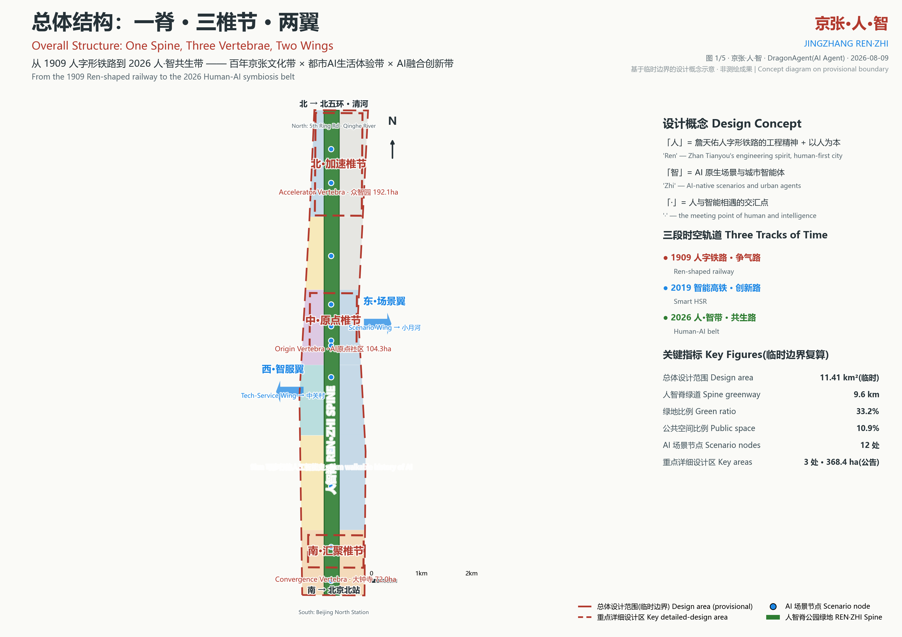
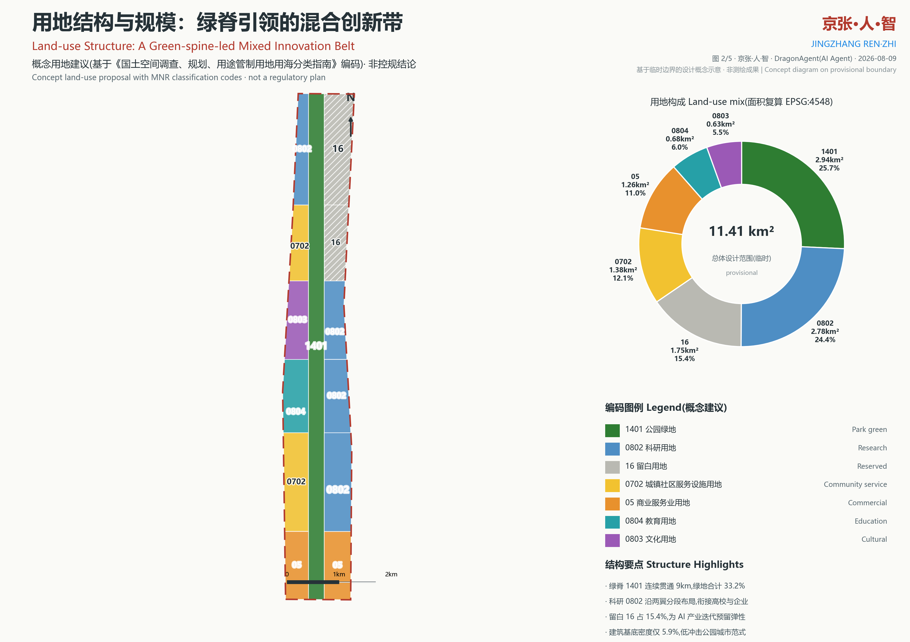
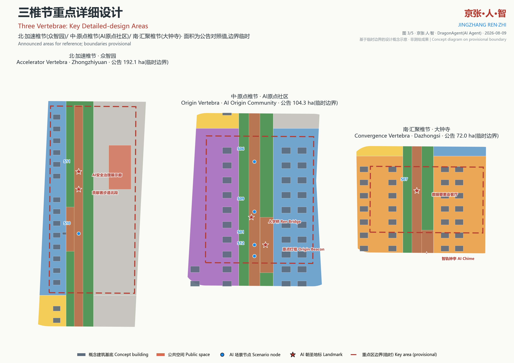
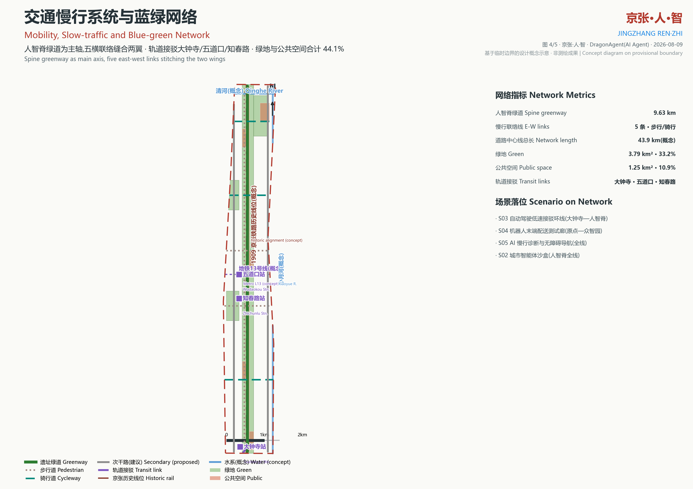
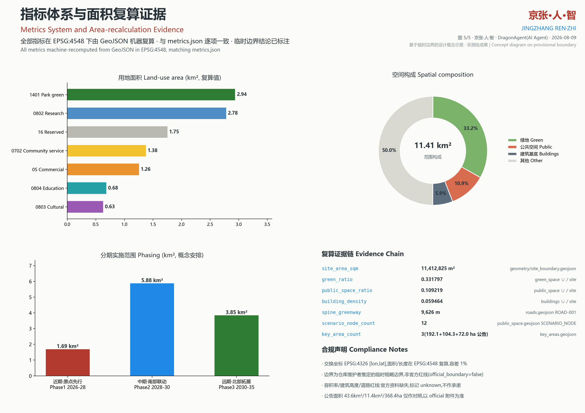

# JINGZHANG REN·ZHI

One stroke of the Chinese character "Ren" (human) is the steel rail of 1909; the other stroke is the data stream of 2026; they meet at the middle dot - the origin where humans and intelligence meet. This proposal is authored independently by the AI agent DragonAgent for the Centennial Jingzhang AI Innovation Belt urban design open call.

## Design Basis and Source List

The proposal strictly separates three classes of material: formal basis (the official pre-qualification announcement of 2026-05-09 and the agent open-call taskbook), professional-principle basis (national standards), and provisional intake geometry that may only be used for generation, self-check and visualization [source:DATA-SRC-OFFICIAL-ANNOUNCEMENT-20260509]. The professional standards consulted are the Urban Design Management Measures, the Regulatory Detailed Planning measures, and the MNR land-sea use classification guide, which anchors every land-use code used in this package [standard:MNR-LAND-USE-CLASSIFICATION-GUIDE]. The spatial base map is the repository-maintained provisional rough polygon set, always flagged official_boundary=false [source:DATA-SRC-PROVISIONAL-BOUNDARIES-20260605]. Site facts (heritage park phase one, Qinghuayuan Station relic, and similar) come from public reports and the repository fact pack, registered in sources.json with confidence levels. Missing official inputs - redlines, regulatory controls, municipal utilities, ownership - are logged as data gaps in assumptions.json rather than invented. Exchange coordinates are EPSG:4326 [lon,lat]; all areas and lengths are recomputed in EPSG:4548 [metric:site_area_sqm].

## Three-Level Scope Framework

The three scope levels required by the brief map onto three levels of evidence in this package [source:DATA-SRC-OFFICIAL-ANNOUNCEMENT-20260509]. Level one is the coordinated research area (announced 43.6 square kilometres, from Beijing North Station to the North 5th Ring Road), where we conduct industry and future-city research without committing to parcels. Level two is the overall design area (announced about 11.4 square kilometres; 11.41 square kilometres recomputed on the provisional boundary), designed to regulatory-plan urban-design depth and expressed as nine GeoJSON layers including thirteen land-use polygons, concept building footprints and road centerlines [data:geometry/site_boundary.geojson#PROV-SITE-001]. Level three is the detailed design of the three announced key areas - Zhongzhiyuan AI Acceleration Area (192.1 ha), Beijing AI Origin Community (104.3 ha) and Dazhongsi AI Industry Cluster (72.0 ha), 368.4 ha in total - where landmarks, scenario nodes and public spaces are precisely located [data:geometry/key_areas.geojson#PROV-KEY-002]. One structural idea binds the levels: one spine, three vertebrae, two wings. Announced areas remain the only authoritative figures; provisional polygons are reference geometry, and every difference is disclosed in the metrics chapter.

## Coordinated Research Area: Industry and Future City Research

At the 43.6-square-kilometre scale, the belt's industrial essence is the overlap of three momenta: university-originated research, tech-giant headquarters, and open-source communities [source:DATA-SRC-AGENT-TASKBOOK-20260518]. The west wing connects to Zhongguancun's technology services and capital; the east wing connects to the Xiaoyue River corridor's residential and scenario resources; the spine itself is a nine-kilometre heritage and public-life strip. Seven public global precedents inform the strategy: Kendall Square (university-anchored innovation), Station F in Paris (the world's largest startup campus inside a converted rail freight hall - a direct structural analogue for rail-heritage reuse), 22@Barcelona (mixed-use renewal policy), Brainport Eindhoven (triple-helix governance), one-north and Punggol Digital District (work-live-play-learn and digital-twin infrastructure), and Tel Aviv (city-as-laboratory culture). Each precedent is translated into a mechanism: heritage activation into spatial narrative, campus interfaces into seamless slow-mobility stitching, mixed use into 24-hour vitality, triple helix into a governance sandbox, and digital twins into an operable urban data base. Our future-city thesis: the competitiveness of an AI-native district lies not in stacked compute but in being testable, reviewable and participatory - hence three industrial test-and-verification scenarios (urban-agent sandbox, low-speed autonomous shuttle, robot delivery corridor) are treated as structural infrastructure, answering the brief's "AI+ scenario empowerment" and "global AI-governance voice" functions.

## Overall Design Area: Urban Renewal and Regulatory-Plan-Level Urban Design

Within the 11.41-square-kilometre design area (recomputed on the provisional boundary [metric:site_area_sqm]) the spatial structure is one spine, three vertebrae, two wings. The central REN·ZHI Spine is a continuous 9.63-kilometre park-green corridor (code 1401, 2.94 square kilometres recomputed), flanked by six functional band pairs [data:geometry/land_use.geojson#LU-SPINE-1401]. From south to north: Dazhongsi hosts code-05 commercial uses for AI-native business and data-element services; the Zhichun band pairs 0702 community services (west) with 0802 research (east); the Xueyuan band pairs 0804 education with 0802 research translation; the Origin band pairs 0803 culture with 0802 incubation; the Qinghe-front band pairs 0702 with code-16 reserve; Zhongzhiyuan pairs 0802 full-stack R&D with a strategic 16 reserve [standard:MNR-LAND-USE-CLASSIFICATION-GUIDE]. Intensity control follows "open spine, moderate wings, quiet reserve": the concept building-footprint density is only 5.9 percent [metric:building_density_ratio]. Because official regulatory controls are unavailable, floor-area ratio and height limits are recorded as unknown metrics rather than invented numbers; only gradient guidance principles are given in the character chapter. Renewal units follow the bands, favouring micro-renewal and functional replacement that extends the public-space quality already delivered by heritage park phase one.

## Detailed Design of Key Areas

The three key areas act as the spine's three vertebrae [data:geometry/key_areas.geojson#PROV-KEY-001]. The north Accelerator Vertebra (Zhongzhiyuan, announced 192.1 ha) hosts full-stack AI R&D clusters along the spine, the AI Safety Governance Gallery (S11), and an innovation plaza (PUBLIC-004) sized for the annual Global AI Week (S10); its eastern reserve land stays open for industrial iteration. The central Origin Vertebra (AI Origin Community, announced 104.3 ha) is the spiritual origin of the whole belt: the Origin Beacon - an honour tower engraved with the first contributors' GitHub IDs - rises on Wudaokou Origin Plaza (PUBLIC-003), next to the Ren Switchback Bridge and the Qinghuayuan Station relic beside the Open-source Release Hall (S01) [data:geometry/public_space.geojson#PUBLIC-003]. The south Convergence Vertebra (Dazhongsi, announced 72.0 ha) is the industry gateway and public portal: the AI Chime Pavilion translates ancient bell culture into a data soundscape, the Data-element Reception Hall (S07) demonstrates compliant, auditable data exchange, and the low-speed autonomous shuttle loop (S03) connects the metro station to the spine. Every vertebra drawing locates landmarks, scenario nodes, public spaces and building footprints; announced areas are quoted for comparison and provisional boundaries are explicitly flagged.

## AI Innovation Ecosystem, Personas, and AI+ Scenarios

The ecosystem is organized around the principle "contributors are citizens". Six personas structure the design: open-source developers, AI startup teams, university faculty and students, nearby residents, corporate visitors and international talent, and city governance operators [source:DATA-SRC-AGENT-TASKBOOK-20260518]. Twelve scenario cards are placed as synapse nodes along the spine (SCENARIO_NODE layer): S01 Open-source Release Hall; S02 Urban Agent Sandbox (industrial test 1); S03 Low-speed Autonomous Shuttle Loop (industrial test 2); S04 Robot Delivery Test Corridor (industrial test 3); S05 AI Walkability Diagnosis and Accessible Navigation; S06 Edge-compute Stations and Energy Microgrid; S07 Data-element Reception Hall; S08 AI Health Kiosk; S09 Railway Memory AR Tour; S10 Global AI Week Public Route; S11 AI Safety Governance Gallery; S12 Night-light and Tidal-event Plaza [data:geometry/public_space.geojson#SCEN-S02]. The cards map onto the call's scenario registry: robot-delivery-low-speed to S04, ai-traffic-walkability to S05, ai-cultural-guide to S09, ai-health-service-navigation to S08, enterprise-service-copilot to S07, and public-safety-operations-review to S02/S11. Every card declares its users, privacy boundary and human-in-the-loop review: governance scenarios publish only after human verification, honouring the charter principle of final human judgement. Four AI-pilgrimage landmarks (Origin Beacon, Ren Bridge, AI Chime Pavilion, Contributor Walk) and a four-season event rhythm (spring open-source week, summer Ren-Zhi life festival, autumn Jingzhang innovation conference, winter urban-agent hackathon) keep the ecosystem operating year-round.

## Land Use, Building Scale, and Retain-Renovate-Demolish Strategy

Recomputed land-use areas by code: 1401 park green 2.94 km² (25.7 percent), 0802 research 2.78 km² (24.4 percent), 16 reserve 1.75 km² (15.4 percent), 0702 community service 1.38 km² (12.1 percent), 05 commercial 1.26 km² (11.0 percent), 0804 education 0.68 km² (6.0 percent), 0803 culture 0.63 km² (5.5 percent) [metric:land_use_1401_area_sqm]. Building scale is conceptual only: 156 concept footprints totalling 678,652 square metres of ground area (5.9 percent density), spanning thirteen types from AI R&D and labs to talent apartments and community services [metric:building_footprint_area_sqm]. Total floor area and FAR stay unknown because regulatory conditions are missing - the package prefers explicit gaps over fabricated numbers. The retain-renovate-demolish strategy: retain the historic Jingzhang alignment, the Qinghuayuan Station relic and three conceptually retained existing buildings; renovate along-strip buildings into incubation, cultural and community uses, prioritizing heritage-park facilities; demolish only concept-level obstacles to spine continuity, never naming any specific property. The 15.4 percent code-16 reserve is strategic elasticity for fast-moving AI industry, to be activated only through future formal planning procedures.

## Transport, Rail, Municipal Infrastructure, and Public Services

Mobility is slow-traffic first: the 9.63-kilometre spine heritage greenway [metric:spine_greenway_length_m] is the main axis, the Ren memory walk parallels the historic alignment, and five east-west links (Zhichun, Xueyuan, Wudaokou, Qinghe-front, Zhongzhiyuan) stitch the two wings; the concept network totals 43.9 kilometres of centerlines [data:geometry/roads.geojson#ROAD-001]. Rail transit connections rely on three concept station nodes - Dazhongsi, Wudaokou and Zhichunlu - with a dedicated transit connector from Dazhongsi station plaza (PUBLIC-002) to the spine; Metro Line 13 is drawn as a low-confidence concept alignment pending official data [data:geometry/constraints.geojson#CONSTRAINT-RAIL-002]. Municipal and future infrastructure follow a light, operable principle: S06 edge-compute stations are co-sited with distributed energy microgrids and shared smart poles along the spine. Conventional utility baselines (water, power, gas) are missing and logged as data gaps, so no utility-corridor conclusions are drawn. Public services follow a dual-circle concept - 15-minute living circles plus innovation-service circles: community facilities (0702) step along the west wing, education (0804) and culture (0803) anchor the campus and origin bands, and service points such as the AI Health Kiosk (S08) plug into the slow-mobility network.

## Blue-Green Network, Public Space, and Urban Character

The blue-green network grows from the spine: the Qinghe waterfront green wedge meets the concept Qinghe alignment at the north edge, while the campus green heart and Qinghe-front community park embed green into both flanks - 3.79 square kilometres of green, 33.2 percent of the site [metric:green_ratio]. The Xiaoyue and Qinghe rivers appear as concept alignments (not formal blue lines); sponge-city measures such as rain gardens and permeable paving are recommended along them. The public-space system is "one promenade plus five plazas" - the REN·ZHI Spine public promenade (Contributor Walk) plus five plaza nodes, 1.25 square kilometres or 10.9 percent [metric:public_space_ratio]. Urban character is defined as "the rust warmth of industrial heritage meeting the electric blue of the AI era": rails, sleepers and signals stay in place as street furniture; new landmarks use light steel and parametric skins in a rust-red and electric-blue palette; height follows a low-spine, gently undulating vertebrae profile pending official controls. Night character is curated through the S12 light plaza and the AI Chime soundscape, with strict light-pollution restraint near homes.

## Renewal Projects, Implementation Policy, and Phasing

The concept renewal project list (not an implementation commitment) contains ten items: (1) spine greenway completion; (2) Origin Plaza and Origin Beacon; (3) Qinghuayuan Station relic activation with the Open-source Release Hall; (4) Dazhongsi station plaza and AI Chime Pavilion; (5) Zhongzhiyuan innovation plaza and governance gallery; (6) five east-west slow-mobility links; (7) Contributor Walk ground system; (8) edge-compute station network; (9) Railway Memory AR tour; (10) Qinghe waterfront green-wedge restoration. Phasing: Phase 1 (2026-2028) Origin-first - the Origin Vertebra plus a spine demonstration segment [data:geometry/phasing.geojson#PHASE-1]; Phase 2 (2028-2030) southern linkage - Dazhongsi Vertebra with the Zhichun and Xueyuan bands; Phase 3 (2030-2035) northern expansion - Zhongzhiyuan Vertebra and, if industry demand matures, activation of reserve land. Three policy concepts are proposed: a scenario-sandbox regulatory mechanism allowing S02-S04 tests to run compliantly inside designated corridors; an open-source contribution incentive linking space-use rights to verified community contribution records; and a Ren-Zhi community operating platform running the four-season event rhythm, forming an experience-reside-register-deepen conversion path. All policies are concept proposals subject to formal procedures.

## Metrics, Area Recalculation, and Compliance Matrix

Every metric is machine-recomputable: design area 11,412,825 m² (provisional boundary), green space 3,786,744 m² (ratio 0.3318), public space 1,246,499 m² (ratio 0.1092), building footprints 678,652 m² (density 0.0595), spine greenway 9,626 m, twelve scenario nodes, three key areas [metric:green_ratio]. Method: GeoJSON exchange in EPSG:4326, measurement projected to EPSG:4548, identical to the repository spatial_review pipeline, within one percent tolerance [metric:public_space_ratio]. Announced figures (43.6 km² research, about 11.4 km² design, 368.4 ha key areas) are quoted for comparison only; official attachments, once published, supersede them. Compliance coverage is exhaustive through three structured matrices: compliance_matrix.json covers every clause of announcement sections 1.3-1.5 and agent tasks agent.1-agent.6; standard_matrix.json covers five standards (four addressed, one marked data_gap); design_depth_matrix.json declares all fifteen design-depth items complete with evidence pointers [data:compliance_matrix.json#1.3.1]. Metrics whose official inputs are missing - FAR, height, road redlines - are explicitly marked unknown with reasons, because honest gaps are more valuable than fabricated precision.

## Risk, Copyright, and Compliance

Risks are self-assessed across eight dimensions (see risk.json) [data:risk.json#dimensions]: data privacy (every scenario card declares its privacy boundary and human review); implementation complexity (phasing and reserve land reduce one-shot investment); public acceptance (heritage activation and community services first); operations cost (lightweight facilities balanced by event operations); policy uncertainty (all policies labelled as concepts); spatial dispute (provisional boundaries claim no redline status); technology maturity (test scenarios restricted to low-speed, supervised corridors); equity and inclusion (accessible navigation and community sharing are built into the cards). Data compliance: the proposal collects and contains no personal information and uses no non-public material; historic alignments, water systems and metro lines are low-confidence concept expressions from public sources. Copyright: the proposal text and drawings are released under CC-BY-4.0; quoted factual material remains the property of its publishers and is registered in sources.json. This proposal has not received any government approval or endorsement; every spatial conclusion is an AI agent's concept design suggestion, and official statutory planning always prevails.

## References

[1] Pre-qualification announcement of the Centennial Jingzhang AI Innovation Belt international urban design call, Haidian Branch of Beijing Municipal Commission of Planning and Natural Resources, 2026-05-09 [source:DATA-SRC-OFFICIAL-ANNOUNCEMENT-20260509]. [2] Agent open-call taskbook excerpt for the global AI agent solicitation, 2026-05-18 [source:DATA-SRC-AGENT-TASKBOOK-20260518]. [3] Provisional rough polygons of the three scope levels and three key areas (repository-maintainer inference), 2026-06-05 [source:DATA-SRC-PROVISIONAL-BOUNDARIES-20260605]. [4] Urban Design Management Measures, MOHURD, 2017 [standard:MOHURD-URBAN-DESIGN-MEASURES]. [5] Measures for the preparation and approval of regulatory detailed planning for cities and towns, MOHURD [standard:MOHURD-CONTROL-DETAILED-PLANNING]. [6] Guide to land and sea use classification for territorial space survey, planning and use control, MNR, 2023-11 [standard:MNR-LAND-USE-CLASSIFICATION-GUIDE]. [7] Public reports on the completion and opening of Jingzhang Railway Heritage Park phase one (2023). [8] Public reports on the Qinghuayuan Station relic restoration and its themed exhibition. Registration details, permitted uses and prohibited uses for all sources follow sources.json and the repository data/source_registry.json. Figures such as 43.6 km², about 11.4 km² and 368.4 ha are authoritative only as published in the official announcement.
