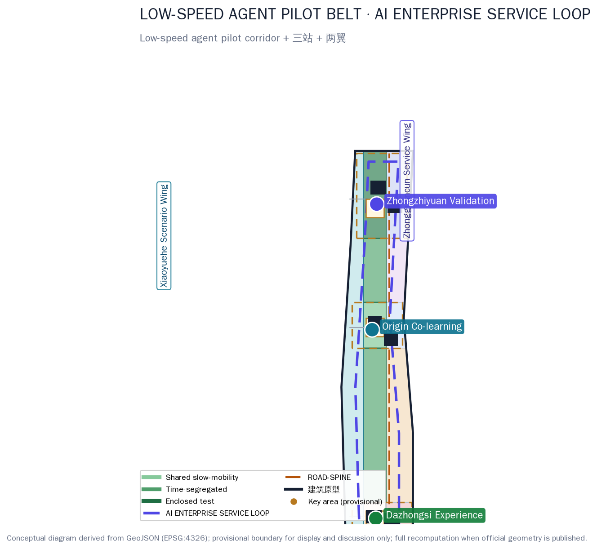
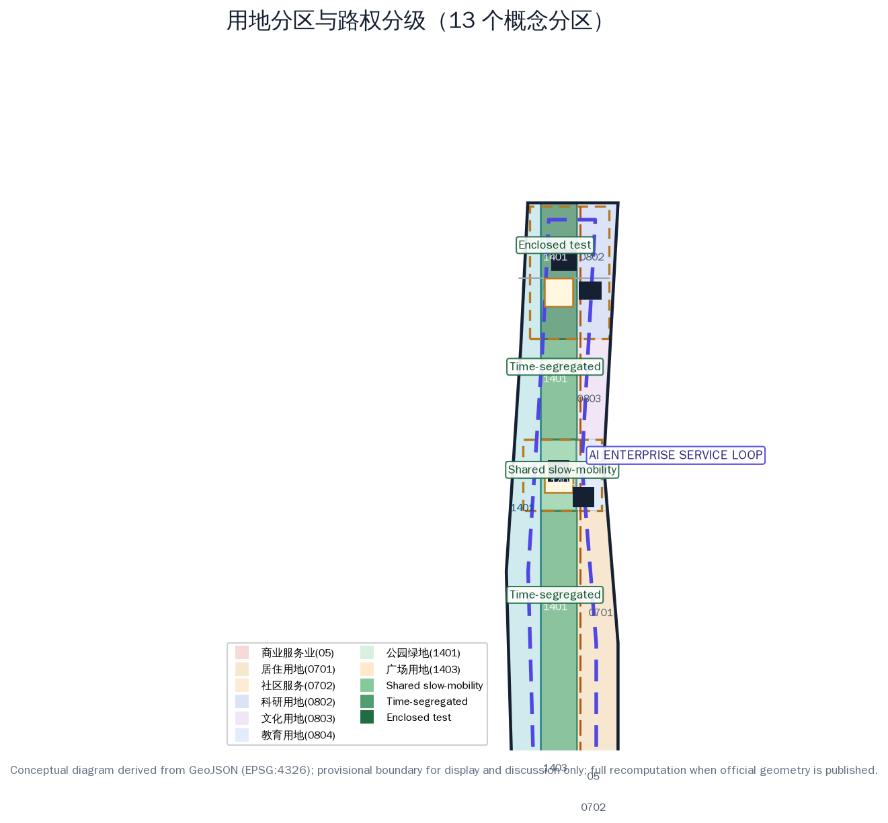
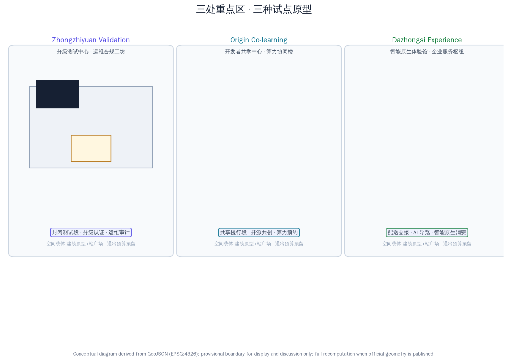
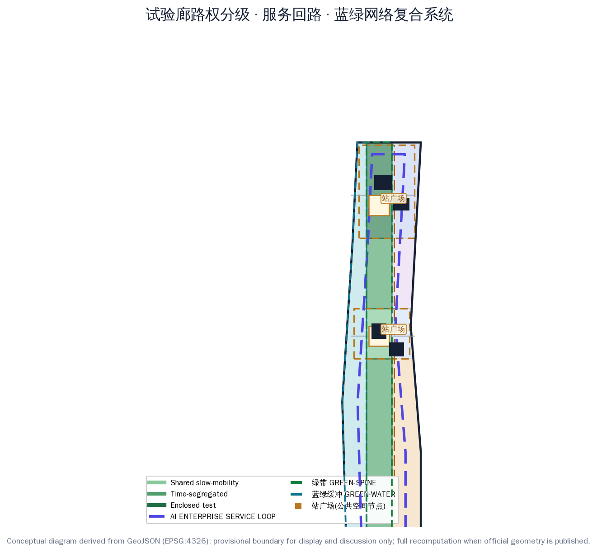
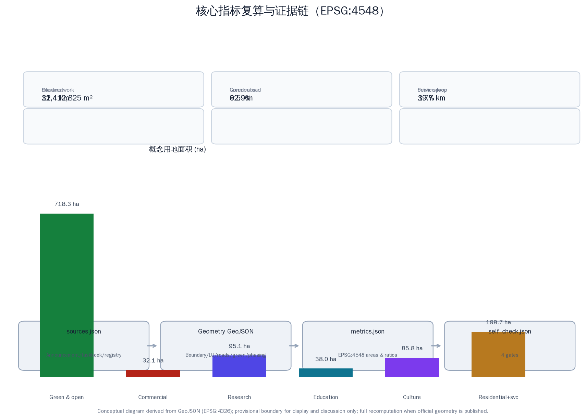

# LOW-SPEED AGENT PILOT BELT & ENTERPRISE SERVICE RING / 京张低速智能体试验带与企业服务环

## Design Basis and Source List

This proposal responds to the pre-qualification announcement for the Centennial Jing-Zhang AI Innovation Belt urban design open call and the agent-facing taskbook, focusing on two interlocking capabilities of the official "three areas and two wings" pattern that are rarely addressed on their own — **low-speed agent pilot capability** and **enterprise-service ecosystem capability**. The proposal argues that the Belt will become a model "urban agent" area not by building more floors, but by turning low-speed robotics and enterprise services into two sets of **runnable, reversible, auditable** urban infrastructure: a low-speed agent pilot belt along the heritage corridor where delivery, inspection, guide and cleaning robots can actually operate, and an AI enterprise service loop led by the Zhongguancun Technology Services Wing where enterprises, developers and research institutes can send scenarios in and receive compliance answers back [source:OFFICIAL-ANNOUNCEMENT] [source:AGENT-TASKBOOK] [standard:PROJECT-OFFICIAL-ANNOUNCEMENT].

Spatial data is generated on the maintainers' registered provisional rough boundary: the overall design area is approximately 11.4 km², and the three key areas (Zhongzhiyuan, Beijing AI Origin Community, Dazhongsi) total approximately 368.4 ha. All geometry is flagged `official_boundary=false`, `boundary_precision=provisional_rough` and may only be used for generation, display and intake self-check; it must not be treated as an official redline, precise-area basis or statutory control. The full package will be recalculated when official polygons are published [data:geometry/site_boundary.geojson#SITE-001] [assumption:A-BOUNDARY-001].

Data use follows the four-level registry policy: official announcements and standard snapshots define the task boundary; the planning-limits table records known areas and missing statutory controls; OSM serves only as a conceptual basemap and display reference; and this package's conceptual land use, building prototypes and pilot nodes are design suggestions, not land-supply, property-right, right-of-way or approval opinions [source:SOURCE-REGISTRY] [source:SITE-PACKAGE].

## Three-Level Scope Framework

The three nested scopes follow the announcement: the coordinated research area is approximately 43.6 km², answering how low-speed agents and enterprise services form an industrial loop along the Jing-Zhang corridor; the overall design area is approximately 11.4 km², realizing the "one belt, one loop, three stations, two wings" spatial framework and renewal projects; and the key detailed design area is approximately 368.4 ha, turning the three key areas into three pilot prototypes — Zhongzhiyuan the validation station, the AI Origin Community the co-learning station, and Dazhongsi the experience station [metric:announced_research_area_sqm] [metric:announced_overall_area_sqm] [metric:announced_key_areas_total_sqm].

The "one belt, one loop, three stations, two wings" is the cross-scale unifying structure: **one belt** is the Jing-Zhang low-speed agent pilot corridor (continuous along the heritage green spine, graded from south to north as shared slow-mobility, time-segregated and enclosed test segments, with about 387 ha of 1401 green land and about 415 ha for the full LU-SPINE series including the gateway plaza), **one loop** is the AI enterprise service loop (a circuit line offset 260 m inside the site perimeter, conceptual length about 19.7 km, linking the three stations and the Zhongguancun Technology Services Wing), **three stations** are Zhongzhiyuan validation, Origin co-learning and Dazhongsi experience, and **two wings** are the Zhongguancun Technology Services Wing (factor allocation and loop origin) and the Xiaoyue River Scenario Enablement Wing (daily-life scenario flank) [data:geometry/roads.geojson#ROAD-RING] [metric:pilot_corridor_1401_area_sqm] [depth:three_level_scope_framework].

Working method across the three levels: the research level decides where the pilot belt and service loop should go using industrial and urban-form judgment; the overall level decides how the pilot belt lands using land-use zoning, right-of-way grading and renewal projects; the key-area level decides how a single scenario is registered, tested, corrected and exited using building prototypes, public space and scenario cards. Every level's conclusions map to layers and metrics so the vision does not float [depth:overall_spatial_structure].

## Coordinated Research Area: Industry and Future City Research

The core judgment of the coordinated research area: **low-speed agent pilot rights are among the scarcest public assets in the AI era**. Haidian already supplies models, compute, talent and capital, but robotics firms generally lack legal, auditable test space on real streets, and enterprises generally lack a one-stop service interface covering scenarios, data, compliance and finance. This proposal gives each of the three positionings a landing path: the Centennial Jing-Zhang culture belt unfolds along the pilot corridor green belt, the urban AI living-experience belt unfolds along the Xiaoyuehe waterfront and the three stations' experience scenarios, and the AI integration-innovation belt is carried by the "pilot belt—service loop" industrial circuit [source:AGENT-TASKBOOK] [standard:PROJECT-AGENT-OPEN-CALL-TASKBOOK].

Naming and identity: "LOW-SPEED AGENT PILOT BELT & ENTERPRISE SERVICE RING / 京张低速智能体试验带与企业服务环", with a "dual-track loopback" logo concept in which the Jing-Zhang rail line intersects the robot test path in a loop — cyan for technology and low-speed agents, amber for railway memory, ink for the Zhongguancun industrial base. The identity never covers the heritage fabric and is used only for public wayfinding, scenario cards and the events system [depth:brand_identity_system].

Global AI innovation ecosystem cases (mechanisms translated, forms not copied):
1. Singapore Punggol Digital District — real-environment testing and industry-city integration, translated into the corridor's "graded right-of-way" regime;
2. Shenzhen intelligent connected vehicle and low-speed unmanned vehicle pilots — local pilot regulations and the "test zone to demonstration application" path, translated into the "enclosed test, time-segregated, shared open" three-step progression;
3. Japan Aichi smart mobility test field — multi-actor co-built test base, translated into Zhongzhiyuan's co-construction and certification mechanism;
4. Hangzhou Yunqi Town — annual developer conference anchoring an industry community, translated into the "pilot open week" mechanism;
5. Seoul Digital Media City — content and technology industry cluster, translated into showcase and matchmaking nodes on the service loop;
6. Munich IABG urban traffic test site — safety testing and data-recording standards, translated into public trusted-test audit days;
7. Tokyo Kashiwa-no-ha smart city — living-scenario experiments and resident participation, translated into the Origin co-learning station's open-source co-creation mechanism;
8. Barcelona 22@ — innovation district plus public space, translated into the three stations' plazas and the pilot station network.

Five functional landing points: full-stack AI self-innovation (Zhongzhiyuan validation station + service loop), world-class AI innovation ecosystem (Origin co-learning station + university collaboration), new AI+ scenario empowerment paradigm (pilot corridor + scenario cards), intelligent AI-vibrant city (three-station public space + data dashboard), and global voice in AI governance (data sandbox + trusted audit). The AI innovation ecosystem map follows a "factor loop": universities and research institutes supply talent and foundation models, Zhongzhiyuan supplies testing and certification, the Origin community supplies open source and compute, the service loop supplies policy, scenario, data, compliance, investment and events, and the Xiaoyue River wing supplies daily-life scenarios; every link has an explicit spatial carrier and responsible actor, and the loop breaks if any link is missing [source:AGENT-TASKBOOK] [source:GLOBAL-CASES-2026].

## Overall Design Area: Urban Renewal and Regulatory-Plan-Level Urban Design

Overall structure: the pilot corridor is the longitudinal spine and the service loop the circular connection, with east-west functional zoning and three east-west connectors completing the "east-west stitching". The west Xiaoyuehe waterfront is the blue-green buffer and waterfront shared segment (LU-WATER, about 303 ha conceptually); the middle heritage spine is the pilot corridor (LU-SPINE series, about 415 ha, of which about 387 ha is 1401 green land and 28 ha is the gateway plaza, including shared slow-mobility, time-segregated and enclosed test segments); and the east is the functional development belt — from south to north community services (LU-SOUTH-MIX), Dazhongsi AI-native commercial (LU-DZS-COMM), south residential (LU-S-RES), Origin education and research (LU-ORI-EDU), the middle scenario-conversion and enterprise-service hub (LU-MID-TRANS), and Zhongzhiyuan R&D and test (LU-ZZ-RES) [data:geometry/land_use.geojson#LU-ZZ-RES] [metric:spine_series_total_area_sqm] [metric:gateway_plaza_area_sqm].

Right-of-way grading is the corridor's core design move: the south and Origin segments are **shared slow-mobility segments** (speed-limited robots, yielding to pedestrians, low-density daytime operation); the middle and north-link segments are **time-segregated segments** (portions of the roadbed closed to pilots at specified hours); and the Zhongzhiyuan segment is an **enclosed test segment** (physical separation, credential entry). Grading does not hand streets to machines; it confines pilot risk to the smallest auditable scope [data:geometry/land_use.geojson#LU-SPINE-S] [data:geometry/land_use.geojson#LU-SPINE-Z] [assumption:A-ROBOTICS-001].

The renewal logic is a four-step sequence: preserve usable space, repair public interfaces, insert small prototypes, then decide increments. The current six building footprints are public prototypes — a graded test center, an O&M and compliance workshop, a developer co-learning center, a compute-collaboration building, an AI-native experience pavilion and an enterprise-service hub — with no retain/renovate/demolish conclusion for any real building; formal deepening requires unique building IDs, age, structure, ownership and heritage-control data [data:geometry/buildings.geojson#BLDG-ZZ-A] [assumption:A-EXISTING-001].

At regulatory-plan depth, the contribution is a "fill-in control table": every land-use unit reserves fields for dominant function, mix ratio, ground-floor openness, night services, accessibility, logistics time windows, pilot right-of-way, data facilities and operation responsibility; FAR, density, height and setback remain `status=unknown` because statutory basis is missing, to be rechecked against the same fields when the approved regulatory plan arrives [metric:floor_area_ratio] [source:PLANNING-LIMITS] [assumption:A-CONTROLS-001].

## Detailed Design of Key Areas

The three key areas are three pilot prototypes, not three cloned science parks [data:geometry/key_areas.geojson#PROV-KEY-001] [metric:key_area_count].

**Zhongzhiyuan AI Independent Innovation Acceleration Area (validation station, provisional approx. 192 ha)**: positioned as a "graded-test and trusted-certification field". Spatial structure: the graded test center (BLDG-ZZ-A) and O&M compliance workshop (BLDG-ZZ-B) in the north, with a green link to the validation station plaza (PUB-NODE-N) in the middle. The enclosed test segment uses physical separation and credential entry; test programs are registered by risk grade and released on evidence; transport connects east-west connectors to the north-south main road; public space is a reversible outdoor test and release interface; AI scenarios cover enclosed-test certification, robot O&M audit and human-robot collaborative maintenance; implementation risks are test-data privacy and site safety grading [data:geometry/key_areas.geojson#PROV-KEY-001] [depth:three_key_area_detailed_design].

**Beijing AI Origin Community (co-learning station, provisional approx. 104 ha)**: positioned as a "developer-service and open-source co-creation community". Spatial structure: the developer co-learning center (BLDG-ORI-A) and compute-collaboration building (BLDG-ORI-B) form an east-west dual core with the co-learning station plaza (PUB-NODE-M) between them. Functions emphasize developer camps, open-source co-creation, compute reservation, family time and accessible learning; transport is shared slow-mobility first, with only low-speed service robots allowed; public space is courtyards for sitting and learning; AI scenarios cover AI+education, open-source collaboration and multilingual services; implementation risks are university-collaboration boundaries and intellectual property [data:geometry/key_areas.geojson#PROV-KEY-002].

**Dazhongsi AI Industry Cluster (experience station, provisional approx. 72 ha)**: positioned as a "delivery-landing and AI-native consumption gateway". Spatial structure: the AI-native experience pavilion (BLDG-DZS-A) and enterprise-service hub (BLDG-DZS-B) face the pilot gateway plaza (LU-SPINE-DZS), with the experience station plaza (PUB-NODE-S) receiving rail-arriving crowds. Functions emphasize last-mile delivery handover, AI-native retail, night services and multilingual reception; AI scenarios cover delivery handover, AI guiding and AI-native consumption; implementation risks are crowd management, human-robot shared safety and commercial sustainability [data:geometry/key_areas.geojson#PROV-KEY-003].

## AI Innovation Ecosystem, Personas, and AI+ Scenarios

Six user personas: P-01 algorithm engineers and robot O&M operators, P-02 founders and developers, P-03 university students and researchers, P-04 residents and older adults, P-05 people with disabilities and their caregivers, P-06 international visitors and multilingual users. Personas check whether pilots miss specific shifts, languages, bodily abilities or chains of responsibility; they are not identity labels or behavioral predictions [metric:user_persona_count] [assumption:A-PRIVACY-001].

Twelve AI scenario cards (SC-01..SC-12) follow a shared template covering people, place, spatial carrier, operation responsibility, data boundary, human review and pause/exit thresholds; full field details and task-coverage relations are in the compliance matrix and the scenario-card list:
- SC-01 Enclosed-test graded certification (Zhongzhiyuan validation station, robot test admission)
- SC-02 Last-mile delivery pilot (Dazhongsi experience station + south corridor segment, handover)
- SC-03 Robot inspection and facility health (corridor + municipal nodes, condition monitoring)
- SC-04 AI guide robots (heritage green spine, multilingual guiding)
- SC-05 Cleaning and maintenance robot collaboration (whole belt, night cleaning windows)
- SC-06 Low-speed shuttle pilot (corridor time-segregated segment, station shuttle)
- SC-07 Enterprise Service Copilot (Zhongguancun Technology Services Wing + service loop, policy/scenario/compliance Q&A)
- SC-08 Data compliance sandbox (service loop, data grading and deletion protocols)
- SC-09 Compute reservation and collaboration (Origin compute-collaboration building, university-enterprise sharing)
- SC-10 Developer camp and open-source co-creation (Origin co-learning station, hackathons and open repositories)
- SC-11 Scenario open laboratory (Dazhongsi + Zhongzhiyuan, scenario listing and exit)
- SC-12 Public-safety and event operations review (whole belt, event-day robot scheduling with human gate)

Four industry test and validation scenarios (T-01..T-04): graded right-of-way and collision-avoidance testing (Zhongzhiyuan enclosed test segment), delivery-handover and pedestrian-sharing testing (Dazhongsi experience station), extreme-weather and failure-takeover testing (corridor), and service-loop data sandbox with fairness audit (service loop) [metric:test_validation_scenario_count] [data:geometry/public_space.geojson#PUB-NODE-N].

Unified operations requirements: human review, non-digital fallback and data minimization cover all scenarios; every pilot enters and exits through a seven-step protocol — claim the problem, build a no-data prototype, enclosed test, time-segregated test, publish metrics, user review, exit or scale [source:AGENT-TASKBOOK] [assumption:A-OPERATIONS-001].

## Land Use, Building Scale, and Retain-Renovate-Demolish Strategy

Conceptual land use follows the national classification: park green space (1401) carries the pilot corridor and waterfront shared segments, plaza land (1403) carries the Dazhongsi pilot gateway plaza, commercial service land (05) carries AI-native formats, research land (0802) carries Zhongzhiyuan, education land (0804) carries the Origin community, culture land (0803) carries the middle service hub, and residential land (0701/0702) carries south community life [source:MNR-LAND-USE] [metric:green_ratio] [metric:public_space_ratio].

Conceptual land-use areas (recomputed in EPSG:4548): green and open space about 718 ha (1401 green land totals 690.5 ha, comprising 303.3 ha of waterfront and 387.2 ha of pilot corridor green belt, plus 27.7 ha of pilot gateway plaza), commercial about 32 ha, research about 95 ha, education about 38 ha, culture about 86 ha, residential and community services about 200 ha. Building footprints total about 53 ha across 6 public prototypes; total floor area and FAR are not derived [metric:building_footprint_area_sqm] [metric:building_count] [depth:retain_renovate_demolish].

The retain/renovate/demolish decision follows four steps: establish unique building IDs, register age, structure, use, ownership and embodied carbon, overlay heritage, safety, rail and municipal controls, then let professional teams and community review determine the category. Heritage control area, road redlines and municipal capacity are currently unknown; the drawings reserve replacement interfaces rather than inventing numbers [metric:heritage_control_area_sqm] [assumption:A-HERITAGE-001].

## Transport, Rail, Municipal Infrastructure, and Public Services

Road network: the low-speed agent pilot corridor main road (ROAD-SPINE, conceptual length about 9.5 km) runs through all three stations; the AI enterprise service loop (ROAD-RING, conceptual length about 19.7 km) organizes circular service connections along the inner edge of the site [data:geometry/roads.geojson#ROAD-SPINE] [data:geometry/roads.geojson#ROAD-RING]. East-west connectors join rail and bus nodes at Zhongzhiyuan, Origin and Dazhongsi and, together with the waterfront and city-side green belts, complete the east-west stitching and north-south through-connection [metric:road_centerline_length_km]. Slow mobility relies mainly on corridor footpaths and waterfront cycleways linked with rail stations; parking, loading, battery-swap, robot right-of-way and signal-control experiments require a formal transport study [assumption:A-MOBILITY-001].

Municipal and new infrastructure: the waterfront reserves rain gardens, permeable pavement and sponge facilities; Zhongzhiyuan and Origin reserve distributed energy, edge compute and energy-disclosure interfaces; the corridor reserves low-speed robot battery-swap/charging posts, removable sensing and data-sandbox interfaces; service-loop nodes reserve unified counters, compliance windows and accessible interfaces. Public services follow the pilot station network; childcare, night food, accessible toilets and health rest take priority over new apps [metric:municipal_capacity_index] [assumption:A-PRIVACY-001].

## Blue-Green Network, Public Space, and Urban Character

The pilot corridor green belt is the soul of the proposal: continuous shade, permeable ground, rain gardens and sit-able, lie-able edges come before smart devices; the corridor arranges test, service, consumption and care nodes in segments so low-speed agents run, are seen and can exit in real life [data:geometry/green_space.geojson#GREEN-SPINE] [depth:blue_green_public_space].

Three AI pilgrimage landmarks (L-01..L-03): L-01 the Jing-Zhang "kilometre zero" memory node (south corridor, railway culture); L-02 the robot milestone loop (Zhongzhiyuan validation station, open-test honor display); L-03 the open-source contributor gallery (Origin co-learning station, developer honor display). Landmarks use reversible installations and wayfinding, never cover heritage fabric and never imply government endorsement [metric:pilgrimage_landmark_count] [assumption:A-BRAND-001].

Character control: the heritage side keeps low-disturbance, transparent and reversible public interfaces; the city side allows small-scale production, community services and ground-floor openness; roof, massing and view corridors await official control data — the skyline is not unified by a "robotic future" aesthetic [data:geometry/constraints.geojson#PROV-KEY-003-CONSTRAINT]. The public-space component library (seating, shade, wayfinding, charging, accessibility and removable sensing units) and the signage system (the "dual-track loopback" mark, three right-of-way grade signs and pilot-station markers) are designed as one assembly kit for the scenario cards; the international narrative uses "the source of China’s high-speed railway is here, and the testing ground for low-speed agents is here" as its motif, weaving the Centennial Jing-Zhang, Zhongguancun and AI-new-culture timelines [depth:brand_identity_system] [source:AGENT-TASKBOOK].

## Renewal Projects, Implementation Policy, and Phasing

Eight renewal projects (R-01..R-08): pilot corridor graded right-of-way retrofit (pilot segments), Zhongzhiyuan enclosed test field and certification center, Dazhongsi delivery-handover and AI-native gateway, Origin developer co-learning block, AI enterprise service loop with Copilot interfaces (12 nodes), data compliance sandbox with public dashboard, compute collaboration with low-speed battery-swap network, and accessible and vulnerable-group pilot safeguards. Each reserves fields for a space owner, operation owner, data owner, annual maintenance budget and exit budget, to be filled by professional teams against official data [metric:renewal_project_count] [depth:renewal_project_list].

Implementation has three phases: near term (0-2 years) "pilot segments" — Dazhongsi experience station and the south corridor, using low-cost public space, paper ledgers and on-site surveys to validate demand; medium term (3-5 years) "service loop formation" — Origin co-learning station and the middle corridor, expanding developer services and time-segregated pilots; long term (6-10 years) "full-network integration" — Zhongzhiyuan validation station and the north corridor, opening enclosed tests, trusted audits and global pilot exchange [data:geometry/phasing.geojson#PHASE-1] [data:geometry/phasing.geojson#PHASE-2] [data:geometry/phasing.geojson#PHASE-3].

Long-term operations and global events: an annual "Pilot Open Week", a "Service Loop Developer Conference", public trusted-test audit days, and a global low-speed pilot exchange camp; the developer community enters through the seven-step protocol; international communication and investment-conversion mechanisms are tied to the event system. All events, recruitment, funding and policy arrangements are conceptual suggestions, never stated as confirmed government arrangements [source:AGENT-TASKBOOK] [metric:annual_event_system_count] [assumption:A-OPERATIONS-001].

## Metrics, Area Recalculation, and Compliance Matrix

Metrics have four layers: announced known quantities (three-level scope areas), this package's geometric recalculation (land use, green space, public space, buildings, roads, phasing, corridor and loop lengths), design counts (scenario cards, personas, landmarks, renewal projects), and statutory gaps (FAR, height, density, setback). Every metric records status, unit, formula, source files, confidence and assumptions [metric:site_area_sqm] [metric:green_ratio] [metric:key_areas_total_area_sqm].

Recalculation basis: all areas are recomputed from GeoJSON in EPSG:4548; the gap between the land-use partition and the site boundary is about 31 m² (within a relative tolerance of 0.0001) and pairwise overlap is zero; the key areas recompute to about 369.3 ha versus the announced 368.4 ha, a difference attributable to the provisional boundary pending official polygon verification; when official polygons are published, the boundary, land use, buildings, roads, green space, public space, phasing and all metrics are recalculated as one set [metric:land_use_coverage_ratio] [metric:land_use_overlap_sqm] [depth:metrics_recalculation].

The compliance matrix covers all announcement tasks in sections 1.3/1.4/1.5 and agent.1-6; the standard matrix covers the five mandatory professional standards, with one design-depth standard pending official-file enablement; the design-depth matrix covers all sixteen required depth items. The complete machine index lives in the three matrices and the manifest; the narrative keeps only one to three citations beside each key judgment [standard:MOHURD-CONTROL-DETAILED-PLANNING] [standard:MOHURD-URBAN-DESIGN-MEASURES].

## Risk, Copyright, and Compliance

The primary risk is misreading provisional boundaries, conceptual land use and pilot nodes as statutory parcels or approved right-of-way conclusions; all drawings and metrics repeat the provisional label and the whole package is recalculated when official data arrives. The second risk is "surveillance in the name of pilots": inspection, delivery and safety scenarios forbid default face recognition, emotion analysis or continuous location tracking, and sensitive data requires re-authorization, impact assessment, retention periods and deletion mechanisms [assumption:A-BOUNDARY-001] [assumption:A-PRIVACY-001].

The third risk is pilots remaining demo devices rather than entering operation: every device, model and platform must register a maintainer, response time, shutdown mode and exit cost; graded right-of-way requires a human gate and failure-takeover plan. The fourth risk is intellectual-property boundaries among universities, enterprises and the community: open-source co-creation defaults to reversible, attributable, exitable agreements [metric:human_review_coverage_ratio] [metric:non_digital_fallback_coverage_ratio].

The author's original text, graphics, schematic geometry and layout use the COMMUNITY-DISPLAY-ONLY license; OSM-derived content retains ODbL attribution; this submission does not represent that any government, community, enterprise or professional body has approved, funded or committed to implementation [source:OSM-COPYRIGHT] [depth:risk_missing_data].

## References

Direct project basis: the pre-qualification announcement, the agent-facing taskbook, the site package, the source registry, planning limits and the six professional standards. Industrial and urban judgments reference global innovation-district and pilot cases (Punggol, Shenzhen pilots, Aichi test field, Yunqi, Seoul DMC, IABG, Kashiwa-no-ha, 22@), extracting only transferable mechanisms. The complete source, metric, standard and depth index is in `sources.json`, `metrics.json`, `compliance_matrix.json`, `standard_matrix.json`, `design_depth_matrix.json` and `manifest.json` [source:OFFICIAL-ANNOUNCEMENT] [source:SOURCE-REGISTRY] [standard:MOHURD-ARCH-DESIGN-DEPTH-2016].
