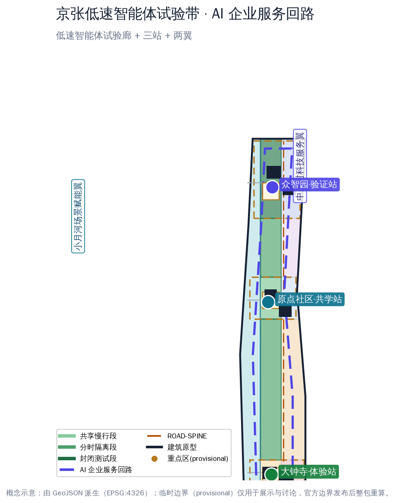
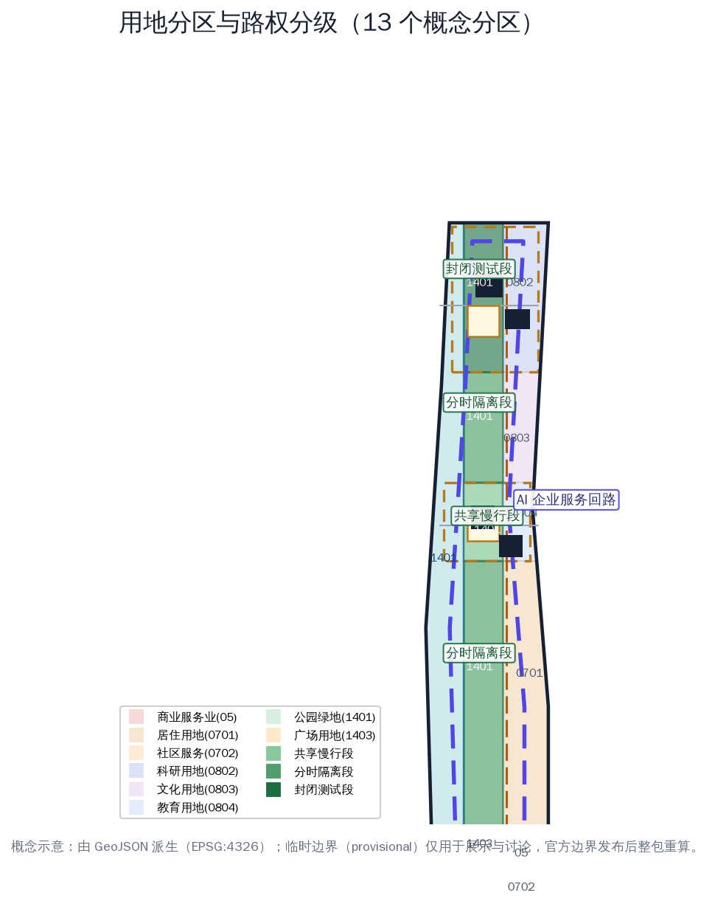
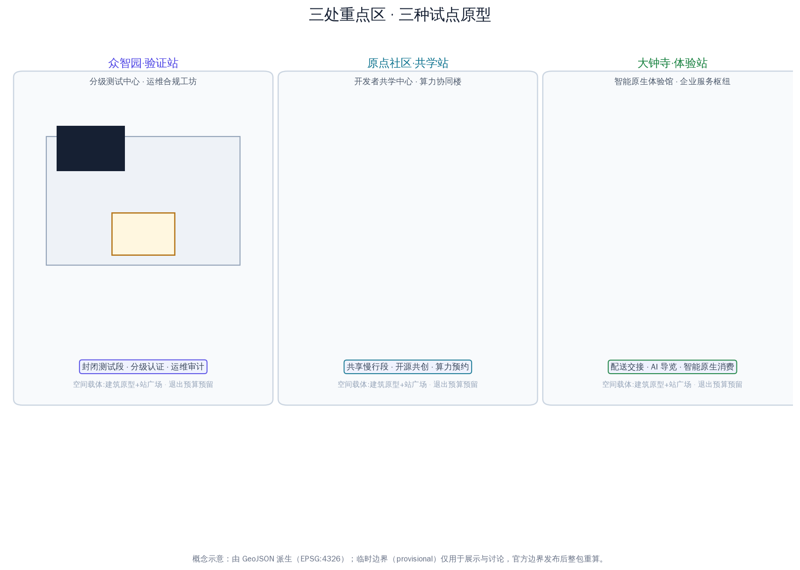
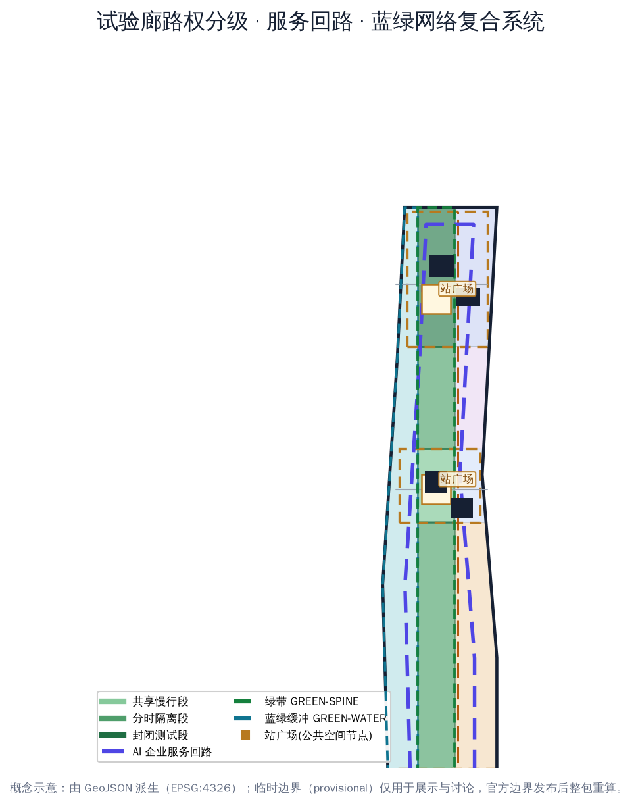
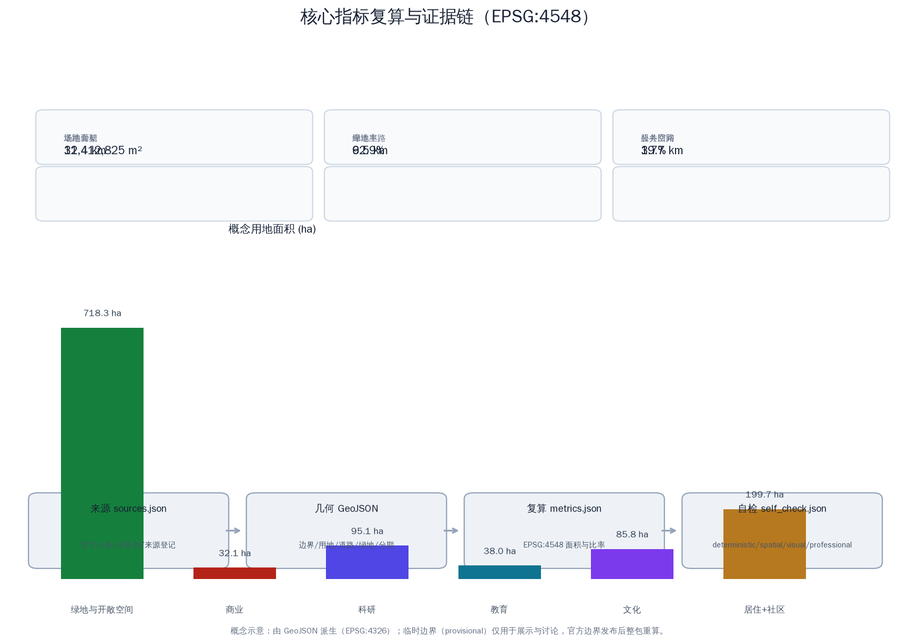

# 京张低速智能体试验带与企业服务环 / LOW-SPEED AGENT PILOT BELT & ENTERPRISE SERVICE RING

## 设计依据与资料清单

本方案回应《百年京张AI创新带城市设计国际方案征集》资格预审公告与面向智能体任务书，聚焦官方"三区两翼"格局中两项相互咬合但尚未被单独讲透的能力——**低速智能体试点能力**与**企业服务生态能力**。方案判断：京张创新带能否成为"城市智能体样板区"，不取决于再建多少楼，而取决于能否把低速机器人与企业服务做成两套**可运行、可回退、可复核**的城市基础设施：一条沿遗址廊道的低速智能体试验带，让配送、巡检、导览、清洁机器人有地方"真正跑起来"；一个以中关村科技服务翼为龙头的 AI 企业服务回路，让企业、开发者和科研机构有机制"把场景送进来、把合规接回去" [source:OFFICIAL-ANNOUNCEMENT] [source:AGENT-TASKBOOK] [standard:PROJECT-OFFICIAL-ANNOUNCEMENT]。

空间资料以维护者登记的临时粗略边界为生成基础：总体设计范围约 11.4 平方公里，三处重点区（众智园、北京 AI 原点社区、大钟寺）合计约 368.4 公顷。所有 geometry 均标记 `official_boundary=false`、`boundary_precision=provisional_rough`，只能用于方案生成、展示与自检，不得作为官方红线、精确面积或法定控制依据；官方 polygon 发布后整包重算 [data:geometry/site_boundary.geojson#SITE-001] [assumption:A-BOUNDARY-001]。

数据使用遵循来源登记的四级口径：官方公告与标准快照用于任务边界；规划限制表登记已知面积与缺失控规；OSM 仅作概念底图与展示参考；本包生成的概念用地、建筑原型与试点节点均为设计建议，不构成供地、产权、路权或审批意见 [source:SOURCE-REGISTRY] [source:SITE-PACKAGE]。

## 三层范围工作框架

三层范围按公告口径组织：统筹研究范围约 43.6 平方公里，回答"低速智能体与企业服务如何在京张走廊上组织成产业回路"；总体设计范围约 11.4 平方公里，落实"一廊一环三站两翼"的空间骨架与更新项目；重点区域范围约 368.4 公顷，把三处重点区做成三种试点原型——众智园是验证站、AI 原点社区是共学站、大钟寺是体验站 [metric:announced_research_area_sqm] [metric:announced_overall_area_sqm] [metric:announced_key_areas_total_sqm]。

"一廊一环三站两翼"是本方案跨尺度的统一结构：**一廊**是京张低速智能体试验廊（沿遗址绿脊连续展开，由南向北依次为共享慢行段、分时隔离段与封闭测试段，其中 1401 绿地约 387 公顷，连同大钟寺试验门户广场共约 415 公顷），**一环**是 AI 企业服务回路（沿场地内缘约 260 米等距回路的服务线位，概念长度约 19.7 公里，串联三站与中关村科技服务翼），**三站**是众智园验证站、原点共学站、大钟寺体验站，**两翼**是中关村科技服务翼（要素配置与服务回路源头）与小月河场景赋能翼（生活场景侧翼）[data:geometry/roads.geojson#ROAD-RING] [metric:pilot_corridor_1401_area_sqm] [depth:three_level_scope_framework]。

三层范围工作方式：研究层用产业与城市形态判断决定"试点带与服务环往哪走"；总体层用用地分区、路权分级与更新项目决定"试点带怎么落地"；重点区用建筑原型、公共空间与场景卡决定"单一场景如何登记、测试、纠错与退出"。每层结论都对应图层与指标，避免愿景悬空 [depth:overall_spatial_structure]。

## 统筹研究范围产业与未来城市研究

统筹研究范围的核心判断：**低速智能体试点权是 AI 时代城市最稀缺的公共资产之一**。海淀已具备模型、算力、人才与资本的供给优势，但机器人企业普遍缺少"真实街道上的合法、可审计测试空间"，企业服务则普遍缺少"场景、数据、合规、资金一次办齐"的服务界面。本方案提出三大定位的落地路径：百年京张文化带沿试验廊绿带展开，都市 AI 生活体验带沿小月河水岸与三站体验场景展开，AI 融合创新带由"试验带—服务环"产业回路承载 [source:AGENT-TASKBOOK] [standard:PROJECT-AGENT-OPEN-CALL-TASKBOOK]。

命名与标识：方案名"京张低速智能体试验带与企业服务环 / LOW-SPEED AGENT PILOT BELT & ENTERPRISE SERVICE RING"，Logo 概念为"双轨回环"——京张铁轨线与机器人测试路径相交成回环，青色代表科技与低速智能体、琥珀色代表铁路记忆、墨色代表中关村产业底座。标识不覆盖遗产本体，仅用于公共导视、场景卡与活动体系 [depth:brand_identity_system]。

全球 AI 创新生态案例（机制转译，不复制形态）：
1. 新加坡榜鹅数字园区——真实环境测试与产城融合，转译为试验廊"分级路权"制度；
2. 深圳智能网联汽车与低速无人车试点——地方试点条例与"测试区—示范应用"路径，转译为"封闭测试—分时隔离—共享开放"三级递进；
3. 日本爱知县智慧移动测试场——多主体共建测试基地，转译为众智园验证站的多元共建与认证机制；
4. 杭州云栖小镇——年度开发者大会锚定产业社区，转译为"试验开放周"机制；
5. 首尔数字媒体城——内容与科技产业集群，转译为服务回路上的展示与对接节点；
6. 慕尼黑 IABG 城市交通测试场——安全测试与数据记录标准，转译为可信测试公开审计日；
7. 东京柏之叶智慧城市——生活场景实验与居民参与，转译为原点共学站的开源共创机制；
8. 巴塞罗那 22@——创新街区与公共空间并重，转译为三站公共广场与试点驿站网络。

五大功能落点：AI 全栈自主创新体系（众智园验证站+服务环）、世界级 AI 创新生态（原点共学站+高校协同）、AI+ 场景赋能新范式（试验廊+场景卡）、智能化 AI 活力城市（三站公共空间+数据仪表盘）、AI 治理全球话语权（数据沙盒+可信审计）。AI 创新生态图谱按"要素回路"组织：高校与科研机构供给人才与基础模型，众智园供给测试与认证，原点社区供给开源与算力，服务回路供给政策、场景、数据、合规、投融资与活动，小月河翼供给生活场景；每一环都有明确的空间载体与责任主体，缺一环即回路断裂 [source:AGENT-TASKBOOK] [source:GLOBAL-CASES-2026]。

## 总体设计范围城市更新与控规深度城市设计

总体结构：以试验廊为纵向主轴、服务回路为环向回路，东西向功能分区并辅以三条东西连接路完成"东西缝合"。西侧小月河水岸为蓝绿缓冲与滨水共享段（LU-WATER，概念分区约 303 公顷），中部遗址绿脊为试验廊（LU-SPINE 系列约 415 公顷，其中 1401 绿地 387 公顷、门户广场 28 公顷，含共享慢行段、分时隔离段与封闭测试段），东侧为功能发展带——自南向北依次为社区服务（LU-SOUTH-MIX）、大钟寺智能原生商业（LU-DZS-COMM）、南部居住（LU-S-RES）、原点教育科研（LU-ORI-EDU）、中段场景转换与企业服务枢纽（LU-MID-TRANS）、众智园研发测试（LU-ZZ-RES）[data:geometry/land_use.geojson#LU-ZZ-RES] [metric:spine_series_total_area_sqm] [metric:gateway_plaza_area_sqm]。

路权分级是试验廊的核心设计动作：南段与原点段为**共享慢行段**（机器人限速、礼让行人、白天低密度运行），中段与北段连接段为**分时隔离段**（特定时段封闭部分路幅给试点运行），众智园段为**封闭测试段**（物理隔离、凭证进入）。分级不是把路让给机器，而是把"试点风险"限制在最小可审计的范围内 [data:geometry/land_use.geojson#LU-SPINE-S] [data:geometry/land_use.geojson#LU-SPINE-Z] [assumption:A-ROBOTICS-001]。

更新逻辑为"保留可用空间—修复公共界面—插入小型原型—再决定增量"四步。当前建筑图斑（6 处）是分级测试中心、运维与合规工坊、开发者共学中心、算力协同楼、智能原生体验馆、企业服务枢纽等公共原型，不对任何真实建筑作拆改留判断；正式深化需现状建筑唯一编码、年代、结构、权属与遗产控制数据 [data:geometry/buildings.geojson#BLDG-ZZ-A] [assumption:A-EXISTING-001]。

控规层面的贡献是一张"待填控制表"：每个用地单元预留主导功能、混合比例、首层开放、夜间服务、无障碍、物流时窗、试点路权、数据设施与运维责任字段；容积率、建筑密度、高度、退界因缺少法定依据保持 `status=unknown`，待正式控规到位后按同一字段复核 [metric:floor_area_ratio] [source:PLANNING-LIMITS] [assumption:A-CONTROLS-001]。

## 重点区域详细设计

三处重点区是三种试点原型，不是三座复制粘贴的科技园 [data:geometry/key_areas.geojson#PROV-KEY-001] [metric:key_area_count]。

**众智园 AI 自主创新加速区（验证站，provisional 约 192 公顷）**：定位"分级测试与可信认证场"。空间结构：北段分级测试中心（BLDG-ZZ-A）与运维合规工坊（BLDG-ZZ-B），中部绿廊连接验证站广场（PUB-NODE-N）。封闭测试段以物理隔离与凭证进入组织，测试项目按风险分级登记、按证据放行；交通以东西连接路接入南北主路；公共空间为可回退的户外测试与发布界面；AI 场景为封闭测试认证、机器人运维审计、人机协作维护；实施风险为测试数据隐私与场地安全分级 [data:geometry/key_areas.geojson#PROV-KEY-001] [depth:three_key_area_detailed_design]。

**北京 AI 原点社区（共学站，provisional 约 104 公顷）**：定位"开发者服务与开源共创社区"。空间结构：开发者共学中心（BLDG-ORI-A）与算力协同楼（BLDG-ORI-B）构成东西双核，共学站广场（PUB-NODE-M）居中。功能强调开发者营地、开源共创、算力预约、家庭时间与无障碍学习；交通以共享慢行为主，试点机器人仅限低速服务型；公共空间为可坐可学的庭院；AI 场景为 AI+教育、开源协作、多语服务；实施风险为高校协同的边界与知识产权 [data:geometry/key_areas.geojson#PROV-KEY-002]。

**大钟寺 AI 产业聚集区（体验站，provisional 约 72 公顷）**：定位"配送落地与智能原生消费门户"。空间结构：智能原生体验馆（BLDG-DZS-A）与企业服务枢纽（BLDG-DZS-B）临试验门户广场（LU-SPINE-DZS），体验站广场（PUB-NODE-S）承接轨道抵达人流。功能强调无人配送末公里交接、智能原生零售、夜间服务、多语接待；AI 场景为配送交接、AI 导览、智能原生消费；实施风险为客流组织、人机共行安全与商业运营可持续性 [data:geometry/key_areas.geojson#PROV-KEY-003]。

## AI 创新生态、人才画像与 AI+ 场景

六类用户画像：P-01 算法工程师与机器人运维员、P-02 创业者与开发者、P-03 大学生与科研人员、P-04 社区居民与老年人、P-05 残障人士与照护者、P-06 国际访客与多语使用者。画像用于检查试点是否遗漏具体班次、语言、身体能力与责任关系，不作身份标签或行为预测 [metric:user_persona_count] [assumption:A-PRIVACY-001]。

十二张 AI 场景卡（SC-01..SC-12）统一按"人物、地点、空间载体、运营责任、数据边界、人工复核与暂停/退出阈值"的模板登记，完整字段明细与任务覆盖关系见合规矩阵与场景卡清单：
- SC-01 封闭测试场分级认证（众智园验证站，机器人测试准入）
- SC-02 无人配送末公里试点（大钟寺体验站+试验廊南段，配送交接）
- SC-03 机器人巡检与设施健康（试验廊+市政节点，设施监测）
- SC-04 AI 导览机器人（遗址绿脊，多语导览）
- SC-05 清洁维护机器人协同（全带，夜间清洁时窗）
- SC-06 低速接驳班车试点（试验廊分时隔离段，站点接驳）
- SC-07 企业服务 Copilot（中关村科技服务翼+服务回路，政策/场景/合规问答）
- SC-08 数据合规沙盒（服务回路，数据分级与删除协议）
- SC-09 算力预约与协同（原点算力协同楼，高校与企业共享）
- SC-10 开发者营地与开源共创（原点共学站，黑客松与开放仓库）
- SC-11 场景开放实验室（大钟寺+众智园，场景挂牌与退出）
- SC-12 公共安全与活动运营复核（全带，活动日机器人调度与人工闸门）

四类产业测试验证场景（T-01..T-04）：分级路权与碰撞避让测试（众智园封闭测试段）、配送交接与行人共行测试（大钟寺体验站）、极端天气与故障接管测试（试验廊）、服务回路数据沙盒与公平审计（服务回路）[metric:test_validation_scenario_count] [data:geometry/public_space.geojson#PUB-NODE-N]。

场景运营统一要求：人工复核、非数字兜底与数据最小化覆盖全部场景；任何试点以"问题认领—无数据原型—封闭测试—分时隔离—公开指标—使用者评审—退出或扩展"七步进入与退出 [source:AGENT-TASKBOOK] [assumption:A-OPERATIONS-001]。

## 用地、建筑规模与拆改留方案

概念用地沿国家分类口径组织：公园绿地（1401）承载试验廊与滨水共享段，广场用地（1403）承载大钟寺试验门户广场，商业服务业用地（05）承载智能原生新业态，科研用地（0802）承载众智园，教育用地（0804）承载原点社区，文化用地（0803）承载中段服务枢纽，居住用地（0701/0702）承载南部社区生活 [source:MNR-LAND-USE] [metric:green_ratio] [metric:public_space_ratio]。

概念用地面积（EPSG:4548 复算）：绿地与开敞空间约 718 公顷（1401 绿地合计 690.5 公顷，其中滨水 303.3 公顷、试验廊绿带 387.2 公顷，另加试验门户广场 27.7 公顷），商业约 32 公顷，科研约 95 公顷，教育约 38 公顷，文化约 86 公顷，居住与社区服务约 200 公顷。建筑基底合计约 53 公顷，为 6 处公共原型，不推导总建筑面积与容积率 [metric:building_footprint_area_sqm] [metric:building_count] [depth:retain_renovate_demolish]。

拆改留决策四步：先建现状建筑唯一编码，再登记年代、结构、使用、权属与隐含碳，随后叠加遗产、安全、轨道与市政控制，最后由专业团队与社区评审确定类别。当前遗产控制面积、道路红线与市政容量均为 unknown，图面预留替换接口而不填造数字 [metric:heritage_control_area_sqm] [assumption:A-HERITAGE-001]。

## 交通、轨道、市政与公共服务设施

道路骨架：低速智能体试验廊主路（ROAD-SPINE，概念线位约 9.5 公里）贯通三站，AI 企业服务回路（ROAD-RING，概念线位约 19.7 公里）沿场地内缘组织环向服务联系 [data:geometry/roads.geojson#ROAD-SPINE] [data:geometry/roads.geojson#ROAD-RING]。东西连接路在众智园、原点社区、大钟寺三处接入轨道与公交节点，与滨水、城市侧绿带共同完成东西缝合与南北贯通 [metric:road_centerline_length_km]。慢行以廊道步道与滨水骑行道为主，衔接轨道站点一体化；停车、装卸、换电、机器人路权与信控实验需正式交通专项校核 [assumption:A-MOBILITY-001]。

市政与新型基础设施：滨水预留雨洪花园、透水铺装与海绵设施接口；众智园与原点社区预留分布式能源、端侧算力与能耗披露接口；试验廊沿线预留低速机器人换电/充电桩、可拆卸传感与数据沙盒接口；服务回路节点预留统一服务柜台、合规窗口与无障碍接口。公共服务按试点驿站网络布局，托育、夜间餐食、无障碍卫生间、健康休息优先于新增 App [metric:municipal_capacity_index] [assumption:A-PRIVACY-001]。

## 蓝绿空间、公共空间与城市风貌

试验廊绿带是方案的灵魂空间：连续树荫、透水地面、雨水花园与可坐可躺的边界先于智能装置；廊道分段布置测试、服务、消费与照护节点，让低速智能体在真实生活中运行、被看见、可退出 [data:geometry/green_space.geojson#GREEN-SPINE] [depth:blue_green_public_space]。

三处 AI 朝圣地标（L-01..L-03）：L-01 京张"零公里"记忆节点（试验廊南段，铁路文化）；L-02 机器人里程碑环（众智园验证站，开放测试荣誉展示）；L-03 开源贡献者回廊（原点共学站，开发者荣誉展示）。地标采用可逆装置与导视系统，不覆盖遗产本体、不暗示政府背书 [metric:pilgrimage_landmark_count] [assumption:A-BRAND-001]。

风貌控制：遗址一侧保持低扰动、透空与可逆公共界面；城市一侧允许小尺度生产、社区服务与首层开放混合；屋顶、体量与视廊等待正式控制数据后再给数值，不以"机器人未来感"统一天际线 [data:geometry/constraints.geojson#PROV-KEY-003-CONSTRAINT]。

公共空间组件库（座椅、遮荫、导视、充电、无障碍与可拆卸传感单元）与导视符号系统（"双轨回环"标识、三级路权标志、试点驿站标识）统一设计，作为场景卡的空间装配件；国际传播叙事以"中国高速铁路的源头在这里，低速智能体的试验场也在这里"为母题，串联百年京张、中关村与 AI 新文化三层时间线 [depth:brand_identity_system] [source:AGENT-TASKBOOK]。

## 更新项目清单、实施政策与分期计划

八个更新项目（R-01..R-08）：试验廊分级路权改造（试点段）、众智园封闭测试场与认证中心、大钟寺配送交接与智能原生门户、原点开发者共学街区、AI 企业服务回路与 Copilot 界面（12 节点）、数据合规沙盒与公共仪表盘、算力协同与低速换电网络、无障碍与弱势群体试点保障。每项预留空间责任人、运营责任人、数据责任人、年度维护费与退出预算字段，具体数值待专业团队按正式资料填列 [metric:renewal_project_count] [depth:renewal_project_list]。

实施分三阶段：近期（0-2 年）"试点段"——大钟寺体验站与试验廊南段，用低成本公共空间、纸面账本与现场调查验证需求；中期（3-5 年）"服务环成型"——原点共学站与中段廊道，扩展开发者服务与分时隔离试点；远期（6-10 年）"全域联网"——众智园验证站与北段廊道，开放封闭测试、可信审计与全球试点交换 [data:geometry/phasing.geojson#PHASE-1] [data:geometry/phasing.geojson#PHASE-2] [data:geometry/phasing.geojson#PHASE-3]。

长期运营与全球活动体系：年度"试验开放周"、"服务环开发者大会"、可信测试公开审计日、全球低速试点交换营；开发者社区按七步协议进入；国际传播与招引转化机制与活动体系绑定。所有活动、招商、资金与政策安排均为概念建议，不表述为已确定的政府安排 [source:AGENT-TASKBOOK] [metric:annual_event_system_count] [assumption:A-OPERATIONS-001]。

## 指标体系、面积复算与合规矩阵

指标分四层：公告已知量（三层范围面积）、本包几何复算量（用地、绿地、公共空间、建筑、道路、分期、廊道与回路长度）、设计计数（场景卡、画像、地标、更新项目）、法定缺口（容积率、高度、密度、退线）。全部指标记录状态、单位、公式、来源文件、置信度与假设 [metric:site_area_sqm] [metric:green_ratio] [metric:key_areas_total_area_sqm]。

本包复算口径：全部面积在 EPSG:4548 投影下由 GeoJSON 复算；用地分区与场地边界 gap 约 31 平方米（相对容差 0.0001 内），分区两两重叠为 0；重点区几何复算约 369.3 公顷，较公告值 368.4 公顷相差约 0.9 公顷，差异源于临时边界，待官方 polygon 校验；官方 polygon 发布后，边界、用地、建筑、道路、绿地、公共空间、分期与全部指标成套重算 [metric:land_use_coverage_ratio] [metric:land_use_overlap_sqm] [depth:metrics_recalculation]。

合规矩阵覆盖公告 1.3/1.4/1.5 全部任务与 agent.1-6；专业标准矩阵覆盖五项强制标准，另有一项设计深度标准待官方文件启用后补充；设计深度矩阵覆盖十六项必选深度。完整机器索引见三个矩阵与 manifest，正文只在关键判断旁保留一至三条引用 [standard:MOHURD-CONTROL-DETAILED-PLANNING] [standard:MOHURD-URBAN-DESIGN-MEASURES]。

## 风险、版权与合规说明

首要风险是把临时边界、概念用地与试点节点误读为法定地块或已批准路权结论；所有图纸与指标重复标注 provisional，官方数据到位后整体重算。第二类风险是"以试点之名进行监控"：巡检、配送与安全场景禁止默认人脸识别、情绪分析或连续定位，敏感数据需重新授权、影响评估、保存期限与删除机制 [assumption:A-BOUNDARY-001] [assumption:A-PRIVACY-001]。

第三类风险是试点停留在演示装置而不进入运营：每个装置、模型与平台必须登记维护人、响应时限、停机模式与退出费用；分级路权必须有人工闸门与故障接管预案。第四类风险是高校、企业与社区协同的知识产权边界：开源共创默认以可回退、可署名、可退出的协议组织 [metric:human_review_coverage_ratio] [metric:non_digital_fallback_coverage_ratio]。

投稿者原创文本、图形、示意几何与版式采用 COMMUNITY-DISPLAY-ONLY 许可；OSM 衍生内容保留 ODbL 署名；本投稿不代表任何政府、社区、企业或专业机构已批准、出资或承诺实施 [source:OSM-COPYRIGHT] [depth:risk_missing_data]。

## 参考资料

项目直接依据：征集资格预审公告、面向智能体任务书、站点资料包、来源登记、规划限制与六项专业标准。产业与城市判断参考全球创新区与试点案例（榜鹅、深圳试点、爱知县测试场、云栖、首尔 DMC、IABG、柏之叶、22@），仅提炼可转移机制。完整来源、指标、标准与深度索引见 `sources.json`、`metrics.json`、`compliance_matrix.json`、`standard_matrix.json`、`design_depth_matrix.json` 与 `manifest.json` [source:OFFICIAL-ANNOUNCEMENT] [source:SOURCE-REGISTRY] [standard:MOHURD-ARCH-DESIGN-DEPTH-2016]。
