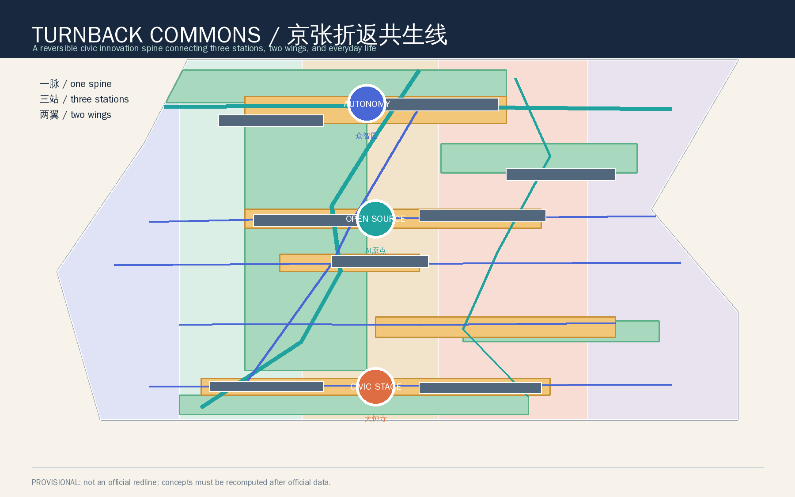
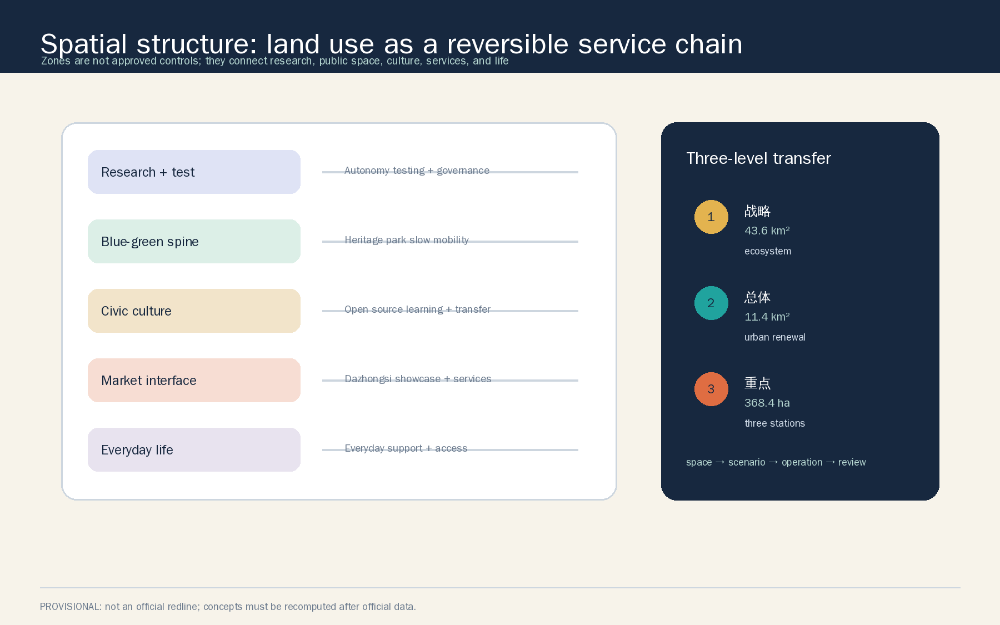
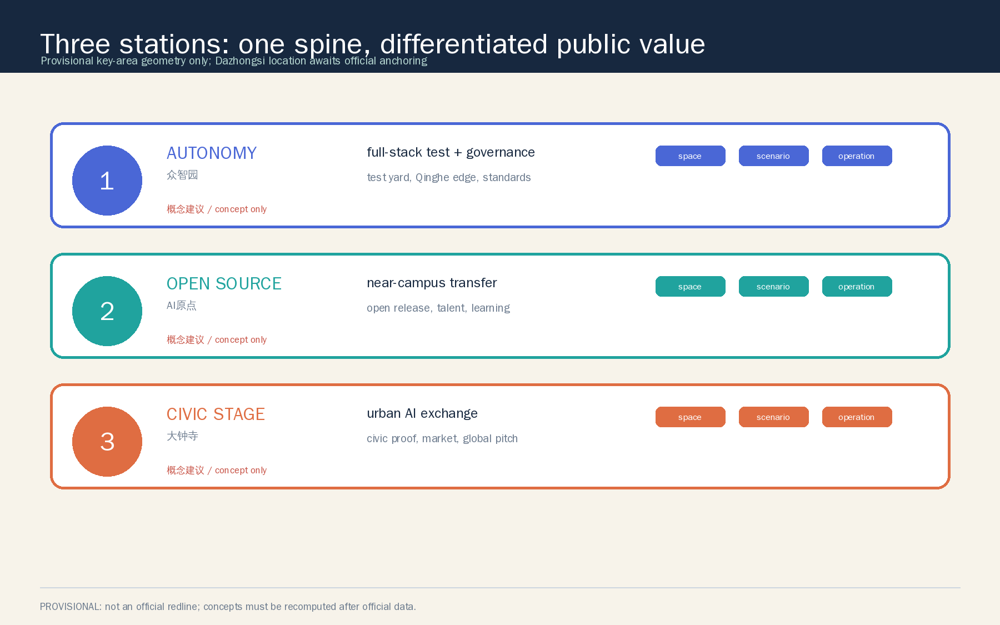
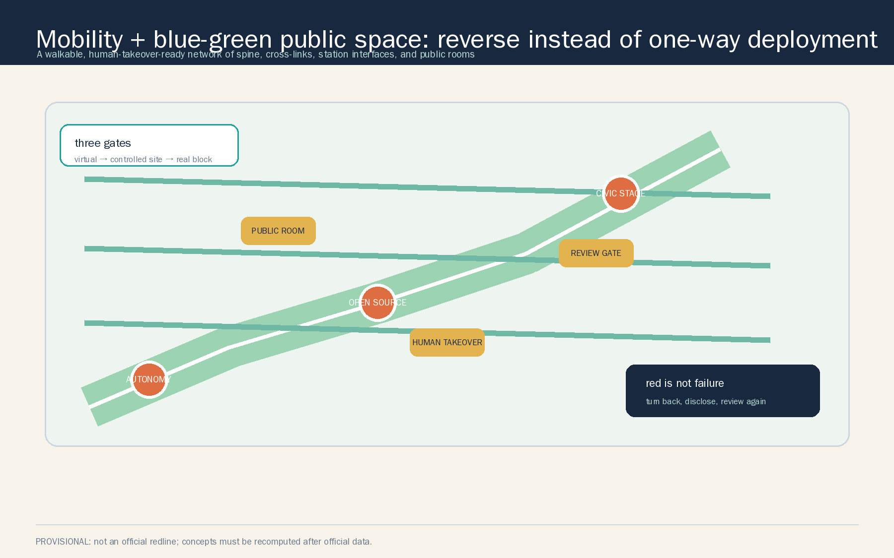
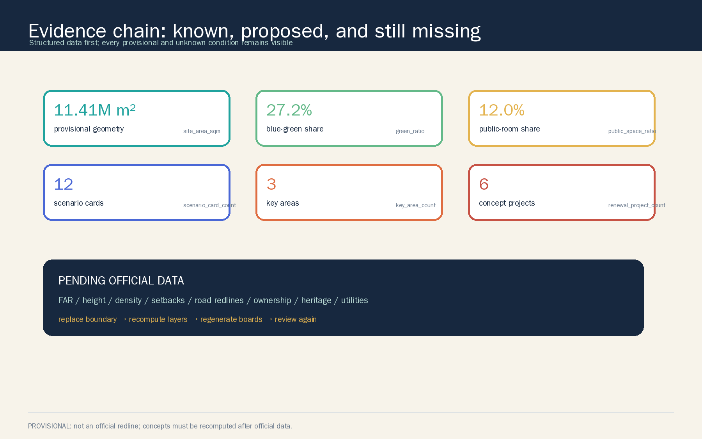

# TURNBACK COMMONS / 京张折返共生线

## Design Basis and Source List

This proposal reads the Centennial Jing-Zhang AI Innovation Belt as a public interface carrying heritage, AI innovation, and ordinary life at the same time, rather than as a one-way technology showcase corridor. The design judgment is based on the official call notice, the cleared agent-facing taskbook, the repository site package, and local professional reference snapshots. Complete source, assumption, metric, and matrix records are kept in `sources.json`, `assumptions.json`, `metrics.json`, `compliance_matrix.json`, `standard_matrix.json`, and `design_depth_matrix.json` [source:OFFICIAL-ANNOUNCEMENT] [source:AGENT-TASKBOOK] [depth:existing_conditions_diagnosis].

The evidence boundary has three parts. The announcement and taskbook support project goals, scope descriptions, approximate areas, scenario, identity, and operation requirements. Ministry and national land-use references support professional language and land-use codes. The repository polygons support temporary generation, visualization, topology checking, and concept discussion only [source:SOURCE-REGISTRY] [source:SITE-PACKAGE]. Five official public AI ecosystem pages are recorded for mechanism transfer only: no external logo, image, company list, valuation, or investment fact is copied [source:CASE-MILA] [source:CASE-VECTOR] [source:CASE-AI-SINGAPORE].

The official redline, official key-area polygons, road redlines, ownership, existing-building survey, heritage controls, regulatory controls, municipal capacity, and transport baseline are not in the public site package. The submission therefore marks `SITE_BOUNDARY` and all three `KEY_AREA` features as `provisional_constraint`; they are not presented as statutory redlines. Issue #1029's concern about the naming anchor of `PROV-KEY-003` is recorded as a pending condition, and this proposal does not locally shift the maintainer geometry [source:BOUNDARY-SOURCE] [source:KEY-AREA-SOURCE] [data:geometry/site_boundary.geojson#SITE-001].

## Three-Level Scope Framework

The proposal uses a strategic, overall, and detailed scope framework. The coordinated research area is approximately 43.6 square kilometres and addresses the AI ecosystem, the three areas and two wings, cultural narrative, and regional collaboration. The overall design area is approximately 11.4 square kilometres and organizes urban renewal, land use, transport, municipal support, blue-green space, and urban character. The detailed-design scope is approximately 368.4 hectares and differentiates the three named key areas. Announcement areas are task context; calculated areas in the package are technical readings of provisional geometry and do not replace one another [source:OFFICIAL-ANNOUNCEMENT] [depth:three_level_scope_framework].

The three levels use a four-step transfer: define public value, lock the spatial interface, test a small human-reviewable scenario, and only then discuss operational extension. Every pilot keeps a yellow controlled state and a red turnback state. AI new productive capacity is therefore expressed not only through buildings or devices but through a reversible chain between research, learning, work, care, consumption, mobility, and governance [data:geometry/site_boundary.geojson#SITE-001] [metric:announced_overall_design_area_sqm].

## Coordinated Research Area: Industry and Future City Research

### 1. Concept, name, and identity

The Chinese name is “京张折返共生线”; the English name is `TURNBACK COMMONS`. “Turnback” refers to a railway return, an AI scenario returning to a stable state when risk rises, and innovation returning to public life for questioning. “Commons” requires productivity and human dignity to remain simultaneous design objectives. The identity direction is a broken-and-reconnected double rail loop: the inner rail is the Jing-Zhang memory line, the outer rail is the AI service line, and green, yellow, and red indicate normal, controlled pilot, and turnback. No external company identity or unlicensed font is used [source:AGENT-TASKBOOK] [standard:PROJECT-AGENT-OPEN-CALL-TASKBOOK].

The three positions become three visible urban layers. The Centennial Jing-Zhang Cultural Belt is the memory and public-space spine. The Urban AI Life Experience Belt is a walkable service network. The AI Integrated Innovation Belt is an interface for research, industry, data, talent, and governance. The five functions form a loop: full-stack autonomy, world-class ecosystem, AI+ scenarios, intelligent lively city, and global governance voice. The three areas and two wings are linked by a “test—open—return to daily life” circuit rather than treated as parallel campuses [depth:overall_spatial_structure] [data:geometry/roads.geojson#ROAD-001].

### 2. Transferable ecosystem cases

The table extracts mechanisms from official public pages. It does not transplant institutions, figures, funding, or partnerships into Haidian.

| Case | Public mechanism | Spatial and operational translation |
| --- | --- | --- |
| Mila, Montreal | Research community, talent development, venture support, and public-interest AI policy are adjacent in one ecosystem | A Zhongzhiyuan sequence of test lab, accelerator, and governance display, without an implied investment or recruitment promise [source:CASE-MILA] |
| Vector Institute, Toronto | Research, talent, industry adoption, and startup acceleration are connected by bridge organizations | An AI Origin transfer street and open-release hall connect university work, developers, and enterprise services in a publicly legible interface [source:CASE-VECTOR] |
| AI Singapore | Cross-sector partners, AI literacy, and inclusive education widen participation | The Xiaoyuehe wing starts with human-equivalent learning and service options, not personal-data extraction [source:CASE-AI-SINGAPORE] |
| The Alan Turing Institute | Research, knowledge exchange, public policy, and responsible governance are oriented to public benefit | Urban-agent governance becomes a public display and review practice, not only a technology showcase [source:CASE-TURING] |
| STATION F | A large startup community, technology partners, events, mentorship, and international transfer create a dense network | Dazhongsi becomes a city-scale pitch room and civic proof theatre, without presupposing tenants, companies, or investment [source:CASE-STATION-F] |

The resulting ecosystem map has upstream university and open knowledge, a middle layer of compute, authorized data, safety, and industry services, and a downstream layer of public space, daily services, and global communication. The Zhongguancun service wing handles factor interfaces such as legal, IP, and enterprise support. The Xiaoyuehe scenario wing returns AI to residents, students, developers, and visitors. Every interface still needs professional confirmation of ownership, capacity, and authorization [depth:overall_spatial_structure].

### 3. Site and industry facts (public sources)

To ground the design in verifiable facts rather than aspirational language, this section records several official, public background items [source:OFFICIAL-PARK-PHASE1] [source:OFFICIAL-HAIDIAN-1X1].

- The Jing-Zhang Railway Heritage Park extends along the former surface alignment from Xizhimen / Beijing North railway station to the North Fifth Ring Road: about 9 km long and about 70 ha in total. Phase 1 (Zhichun Road to Qinghua East Road) opened in 2023 at roughly 16.8 ha with a continuous running, walking, and cycling corridor (“three lanes, one green”). Phase 2 extends south toward Xizhimen and north toward the North Fifth Ring Road, with a planned link to the Qinghe green corridor. The park’s stated goal is to stitch the east-west city that the railway and metro had split back into continuous public ground [source:OFFICIAL-PARK-PHASE1] [source:OFFICIAL-PARK-PHASE2].
- The Beijing AI Innovation Highland action plan (January 2026) lists the Haidian AI Origin Community among the first batch of AI innovation neighborhoods, officially described as radiating roughly 3 km² around the Wudaokou Origin Building with universities, institutes, and a developer community [source:OFFICIAL-AI-ORIGIN]. Haidian’s “1+X+1” industrial-system statement and its “super AI test field” narrative describe the Jing-Zhang heritage AI belt as a core vehicle combining urban renewal, innovation, and public life, with a “three areas, two wings” layout and open, real-scenario testing in governance and daily services. These are policy-context citations, not evidence that this proposal is approved or implemented [source:OFFICIAL-HAIDIAN-1X1] [source:OFFICIAL-SUPER-AI-TESTFIELD].
- The Beijing-Zhangjiakou high-speed railway opened in December 2019; within the city it runs underground through the Qinghua Park Tunnel, parallel to metro Line 13 and crossing municipal roads and utilities. Any advice touching underground, rail, or under-bridge space is therefore treated in this proposal only as a direction pending specialist review, not as an engineering conclusion [source:OFFICIAL-TUNNEL-BUILD].

These figures and descriptions set design context only. They are not official calibration of boundary, area, ownership, capacity, or approval; they must be re-verified with official redlines and site data.

## Overall Design Area: Urban Renewal and Regulatory-Plan-Level Urban Design

### 1. One spine, three stations, two wings

The overall structure is the Jing-Zhang historic slow-mobility spine, three stations, two wings, and a network of public rooms. The spine prioritizes low speed, continuity, and staying. The stations take different roles: full-stack testing, open-source transfer, and civic proof with urban exchange. The wings extend the spine into enterprise services and Xiaoyuehe everyday life. `roads.geojson` contains eight conceptual walking, cycling, access, and transit links; `green_space.geojson` and `public_space.geojson` contain five blue-green groups and five public rooms [data:geometry/roads.geojson#ROAD-001] [data:geometry/green_space.geojson#GREEN-001] [data:geometry/public_space.geojson#PUBLIC-001].

### 2. Land use and renewal logic

The land-use partition uses shared cut lines and leaves no unexplained remainder. Research land supports research and testing, park green land supports the Jing-Zhang spine, cultural land supports open learning and railway narrative, commercial-service land supports international exchange and intelligent-native services, and community-service land supports talent life. The codes follow the repository's subset of the Ministry of Natural Resources classification, while design roles remain proposals and are not approved parcel uses [standard:MNR-LAND-USE-CLASSIFICATION-GUIDE] [depth:land_use_layout] [data:geometry/land_use.geojson#LU-001].

Renewal does not use a single demolish-and-rebuild logic. It starts with the public interface and then considers building interfaces; it retains usable structures before discussing capacity. The eight building interfaces in `buildings.geojson` are marked as retain/renovate or new-build concepts. They do not identify existing buildings and do not constitute ownership consent or demolition decisions [data:geometry/buildings.geojson#BLDG-001] [depth:retain_renovate_demolish].

The proposed character grammar is legible heritage cues, restrained new interfaces, open ground floors, phased massing, and removable infrastructure. Heritage nodes avoid pastiche; AI nodes avoid oversized screens and excessive surveillance. Height, massing, density, and setbacks remain pending official regulatory, heritage, landscape, fire, and road conditions [standard:MOHURD-URBAN-DESIGN-MEASURES] [depth:height_massing_character] [metric:floor_area_ratio].

### 3. Honest regulatory-plan depth

The package reaches a reviewable urban-design depth through structured data without fabricating approved statutory controls. Known values include announcement areas, provisional geometry readings, design-layer topology, scenario counts, and a concept project menu. Unknown values include official FAR, height, road redlines, ownership, heritage controls, and municipal capacity. When official files arrive, the boundary, land use, buildings, roads, blue-green layers, public rooms, phasing, figures, and manifest must be regenerated together [standard:MOHURD-CONTROL-DETAILED-PLANNING] [depth:development_intensity_controls] [metric:site_area_sqm].

## Detailed Design of Key Areas

The three key areas use the repository provisional geometry only to compare roles and concept actions. Because Issue #1029 records unresolved anchoring between `PROV-KEY-003` and the name “Dazhongsi Station,” the station interface below is not an exact station location or engineering alignment [data:geometry/key_areas.geojson#PROV-KEY-001] [data:geometry/key_areas.geojson#PROV-KEY-002] [data:geometry/key_areas.geojson#PROV-KEY-003].

### 1. Zhongzhiyuan AI Autonomy Acceleration Area: the Test Station

Its concept role is a garden-like full-stack test station. The spatial sequence is a Qinghe garden interface, test-lab cluster, full-stack accelerator cluster, and safe-evaluation sandbox. The operational route links model evaluation, standards workshops, low-carbon computing, open contribution, and human review without exposing sensitive data. “National-level cluster” is treated only as a directional response to the announcement, not as a claim about companies, output, or platform status. Retain-and-renovate is the first building direction; all new-build discussion remains subject to survey, ownership, regulatory, and environmental confirmation [depth:three_key_area_detailed_design] [data:geometry/constraints.geojson#NODE-003].

### 2. Beijing AI Origin Community: the Open Station

Its concept role is a near-campus transfer and talent-life station. The spatial sequence links an open learning court, transfer street, open-release hall, and public service station across campus, industry, neighborhood, and daily life. The operating sequence is publish, co-translate, small test, and review. The proposal does not assume university, campus, district, or neighborhood consent, and does not turn a talent policy or residential quantity into a fixed arrangement [data:geometry/key_areas.geojson#PROV-KEY-002] [data:geometry/public_space.geojson#PUBLIC-002].

### 3. Dazhongsi AI Industry Cluster: the Civic Proof Stage

Its concept role is an urban intelligent-economy and international-exchange station. The spatial sequence is a civic proof theatre, intelligent-native street, Dazhongsi public verification square, and global event route. Transport is expressed only as a four-quadrant walking interface; station entrances, roads, intersections, accessibility, and fire-safety data must come first. The area can host agent, terminal, content, data-governance, and international-pitch concepts, but it does not name companies, promise recruitment, or describe an approved station integration project [data:geometry/key_areas.geojson#PROV-KEY-003] [data:geometry/roads.geojson#ROAD-005] [depth:three_key_area_detailed_design].

## AI Innovation Ecosystem, Personas, and AI+ Scenarios

### 1. Six user personas

These are design hypotheses, not personal data and not inputs to commercial recommendation.

| User | Main task | Spatial response | Human and privacy boundary |
| --- | --- | --- | --- |
| Open-source developer | Publish, collaborate, test, and build contribution memory | Open-release hall, contribution wall, and night collaboration court | No personal tracking; authors choose what to publish |
| Startup team | Find compute, authorized data, test space, and professional services | Safe-evaluation sandbox, edge-compute kiosk, service wing | Data and compute require separate authorization |
| University student or researcher | Learn, transfer results, collaborate across institutions, and move daily | Transfer street, open-learning court, public route | Campus data, research results, and portraits are not default inputs |
| Resident or caregiver | Commute, rest, care for children or older adults, and reach public services | Heritage public rooms, Xiaoyuehe service deck, accessible wayfinding | Keep a non-smart equivalent route; no resident profiling |
| Enterprise visitor or international partner | Experience, pitch, collaborate, and meet talent | Civic proof theatre, international pitch room, station interface | Enterprise examples and marks require clearance |
| Public-space steward | Observe, take over, review, explain, and repair | Turnback signal court, operation ledger, review gate | People retain pause, turnback, and appeal rights |

### 2. Twelve scenario cards

Before any pilot, every card must add authorization, data minimization, human takeover, equivalent service, stop conditions, and review evidence. The cards are concept suggestions, not deployed systems [source:AGENT-TASKBOOK] [metric:scenario_card_count].

| No. and type | Spatial carrier | Service or test | Minimum data and human boundary |
| --- | --- | --- | --- |
| 01 Open-release hall | AI Origin open-release hall | Optional display of models, code, papers, and failure reviews | Public material only; author withdrawal; human host |
| 02 Safe governance sandbox (industry test) | Zhongzhiyuan sandbox | Virtual, controlled-site, and real-block validation gates | No real personal data; safety officer can pause |
| 03 Slow-mobility diagnosis (industry test) | Jing-Zhang heritage spine | Use public networks and observation to identify accessible-route breaks | Aggregated counts; no face or identity recognition; field review |
| 04 Low-carbon compute experience (industry test) | Qinghe test lawn | Explain edge compute, energy, water, and public-service relations | Authorized device-level aggregates only; energy and safety pending |
| 05 Near-campus transfer street | AI Origin transfer block | Connect research, IP, legal, product, and public explanation | No default research-data access; professional confirmation |
| 06 Edge-compute kiosk | Xiaoyuehe service deck | Concept prototype for low-threshold public services and edge inference | No sensitive storage; human and offline option |
| 07 Data-governance living room | Dazhongsi civic theatre | Explain data authorization, digital assets, and model purpose auditably | No personal-data trading; authorization and exit rules first |
| 08 AI everyday-service street | Community and retail interface | Make education, health, legal, and daily services explainable | Referral and explanation only; no diagnosis or legal advice |
| 09 Jing-Zhang memory co-translation line | Historic slow-mobility spine | Link railway, innovation, and AI culture through multilingual guidance | Traceable sources; no unchecked historical claims |
| 10 Public maintenance desk | Turnback signal court | Coordinate maintenance, feedback, and scenario state | Anonymous or voluntary feedback; public questioning |
| 11 Intelligent-terminal experience street | Dazhongsi intelligent-native block | Let robots, terminals, and content services meet public observation | Safety envelope, human takeover, child and accessibility protection |
| 12 Global AI innovation week route | Belt-wide public-space system | Walkable route from heritage narrative to open source and industry test | Permission, rights clearance, and safety review per event |

The operating cards use the optional turnback logic from community Issue #1119: green is normal, yellow is a controlled pilot, and red returns to the previous stable state with a public reason. A 90-day review and response times are design goals, not government commitments or field-performance claims [source:COMMUNITY-SWITCHBACK-1119] [data:geometry/constraints.geojson#NODE-002].

## Land Use, Building Scale, and Retain-Renovate-Demolish Strategy

`land_use.geojson` is a complete partition generated from the provisional overall boundary and shared cut lines. Its areas are recomputed in `metrics.json`. Its purpose is to make research, blue-green space, culture, services, and life comparable in one evidence layer, not to lock approved parcels [data:geometry/land_use.geojson#LU-001] [metric:green_space_area_sqm] [metric:public_space_area_sqm].

The building layer contains eight interface prototypes: laboratory, accelerator, open learning, transfer, civic proof, intelligent-native retail, public service, and technology service wing. Each is marked with a conceptual retain/renovate or new-build tendency, but no existing-building survey, ownership, regulatory control, or demolition conclusion is hidden in the layer [data:geometry/buildings.geojson#BLDG-001] [metric:building_footprint_area_sqm].

The proposed character grammar is legible heritage cues, restrained new interfaces, open ground floors, phased massing, and removable infrastructure. Formal refinement must add building age, height, ownership, fire, heritage, green-space, and engineering conditions. FAR, height, density, and setbacks remain pending official data [depth:height_massing_character] [depth:retain_renovate_demolish].

## Transport, Rail, Municipal Infrastructure, and Public Services

The transport concept follows slow-mobility priority, cross-link repair, station interfaces pending verification, and no unbounded motor-traffic claim. Eight conceptual links cover greenway, cycleway, pedestrian, access, and transit-connection roles; they are not road redlines, bridges, tunnels, underground works, or construction alignments. Dazhongsi, Wudaokou, Qinghua East Road West Entrance, and other station relationships require formal transport data and field review [data:geometry/roads.geojson#ROAD-005] [depth:traffic_rail_slow_parking].

Parking and cycling are proposed as an external interchange, time-shared access, and short-stay public-room research direction, with accessibility, fire safety, and walking continuity first. No parking count, road section, or signal timing is asserted. Public-service types include open learning, talent life, IP/legal referral, health and education referral, international reception, and neighborhood maintenance. No school, hospital, elderly-care, or enterprise capacity is fabricated.

Municipal and new infrastructure follow “explain first, test second, extend later.” The edge-compute kiosk is a low-power service prototype; the Qinghe low-carbon innovation edge is a framework for explaining energy, water, and ecological relations. Utility lines, energy, fire safety, flood drainage, capacity, and cyber security require specialist evidence before any implementation statement [data:geometry/constraints.geojson#NODE-006] [depth:municipal_new_infrastructure] [metric:scenario_node_count].

## Blue-Green Network, Public Space, and Urban Character

The blue-green system is human infrastructure, not background landscaping. Five green-space groups connect the Jing-Zhang historic spine, Qinghe garden interface, southern civic room, Xiaoyuehe pocket park, and northern compute ecology test yard. Five public rooms handle signal, open source, civic proof, testing, and daily service. Their ratios are provisional design readings, not statutory green-space or public-space controls [data:geometry/green_space.geojson#GREEN-001] [data:geometry/public_space.geojson#PUBLIC-001] [metric:green_ratio] [metric:public_space_ratio].

Three AI pilgrimage landmarks use low-intervention, maintainable, and withdrawable public components. The Turnback Signal Court makes scenario state, human takeover, and public questions visible. The AI Origin Open Court makes contribution, publishing, and failure review part of voluntary public culture. The Dazhongsi Civic Proof Theatre lets terminals, data authorization, and city services be explained and questioned before controlled testing. All three are concept landmarks, not approved construction projects [metric:landmark_count] [depth:blue_green_public_space].

The cultural narrative uses a three-part guide system: the direction left by the railway, the methods left by Zhongguancun innovation, and the public questions left by AI. The first part uses only verifiable and cleared historical material. The second explains collaboration, open source, engineering, and entrepreneurship. The third puts models, data, bias, energy, and human judgment on the same experience line. Wayfinding can coordinate with the belt identity but must not reuse external marks, portraits, or paper images [standard:MOHURD-URBAN-DESIGN-MEASURES] [source:AGENT-TASKBOOK].

## Renewal Projects, Implementation Policy, and Phasing

The project list is a menu for professional selection, not an investment or government implementation commitment.

| ID | Concept project | Prerequisite | Suggested phase |
| --- | --- | --- | --- |
| JZ-01 | Jing-Zhang slow-mobility breaks and accessible guidance | Road redlines, heritage, transport, and public review | P0 |
| JZ-02 | Zhongzhiyuan Qinghe interface and safe-governance sandbox | Water/flood, energy, data, and safety conditions | P0-P1 |
| JZ-03 | AI Origin near-campus transfer street | Campus/industry boundary, ownership, and ground-floor operation | P1 |
| JZ-04 | Dazhongsi civic proof theatre and four-quadrant walking interface | Official key area, entrances, intersections, and accessibility baseline | P1 |
| JZ-05 | Public AI service and edge-compute nodes | Compute, energy, privacy, cyber security, and human service | P1-P2 |
| JZ-06 | Global AI innovation week public route | Event permission, rights clearance, safety, and review | P2 |

Phasing is expressed as readiness rather than a fixed construction schedule. P0 starts with public space, wayfinding, and low-cost human-takeover scenarios. P1 develops the three station interfaces, open community, and controlled industry tests. P2 discusses international events, industry networks, and regional collaboration. `phasing.geojson` expresses sequence only; it is not a development schedule or investment plan [data:geometry/phasing.geojson#PHASE-001] [depth:renewal_project_list] [depth:phasing_implementation].

Long-term operation uses four loops: quarterly scenario review, monthly developer co-repair, quarterly public experience routes, and an annual global AI innovation week. Each event records authorization, voluntary participation, human takeover, complaint access, exit reason, and a publishable review summary. Operators, funding, partners, and dates remain open for later professional and public negotiation.

### Plain-language implementation contract: who, for whom, when, with what, and how to stop

To avoid inventing names without saying who does what for whom and when, the six concept moves below are written as contracts whose every cell can be completed before a pilot. Responsible parties, baselines, timelines, and permits are pending items, not commitments [source:AGENT-TASKBOOK] [depth:phasing_implementation].

| Concept move | Who (responsible party, pending) | For whom | When | Resources / permits needed | How success is measured (baseline pending) | When to stop / human fallback |
| --- | --- | --- | --- | --- | --- | --- |
| Safe-governance sandbox | Test operator + safety officer | Researchers, developers, regulators | Controlled pilot phase | Data authorization, privacy impact assessment, site and network boundary | Pass rate, red-team report, human-takeover success; baselines established in phase 1 | Pause and disclose on any safety takeover event above threshold |
| Slow-mobility diagnosis | Transport/accessibility lead + volunteers | Residents, older adults, children, people with reduced mobility | Front-loading research phase | Public road data, site observation, public-participation consent | Each break with photo, distance, peak period, and alternative route | Do not publish without human review or source traceability |
| Near-campus transfer street | University-industry liaison + legal/IP | Students, staff, startups, community | Design development phase | Campus/industry boundary, ownership, ground-floor use, fire safety | Transfer occupancy, opening hours, dispute-resolution time | No construction discussion without ownership and fire permits |
| Intelligent-terminal experience street | Commercial/public operator | Public, children, people with disabilities | Pilot phase | Safety separation, insurance, data-minimization pledge | Visits, safety incidents, accessibility pass-through | Withdraw without human-equivalent service or sufficient safety envelope |
| Global AI week route | Event organizer + public agencies | Public, developers, international visitors | Yearly rhythm, per-event application | Event permits, rights clearance, contingency plan | Attendance, complaint rate, appeal-response time | Do not hold without permits or safety review |
| Public maintenance desk | Facilities maintainer + public representatives | All users | Ongoing | Anonymous feedback channel, ledger, responsibility list | Work-order closure, feedback loop, turnback count | Close the entry without human review or responsibility records |

**Site and stakeholder evidence disclosure**: this proposal was generated by an AI agent from public materials; its authors did not visit the site, conduct resident interviews, or perform field measurement. The ten personas, scenario cards, and event ideas are hypotheses awaiting field verification, not validated resident needs or operational outcomes. Any phrasing about who is served, how many, or satisfaction levels remains pending evidence until authorized data and public-participation records exist; PR discussion, Issue records, and review comments serve as the ledger for objections and responses, and simulation or design targets are never written as field facts.

## Metrics, Area Recalculation, and Compliance Matrix

The metrics are divided into three groups. First are direct geometry readings: provisional site area, green-space area, public-space area, building interface footprint, road/slow-link count, key-area count, and phase count. Second are completeness readings: twelve scenario cards, three industry-test cards, six personas, three concept landmarks, and six concept renewal projects. Third are official-data-dependent controls: FAR, height, density, setbacks, road redlines, ownership, heritage controls, and municipal capacity [metric:site_area_sqm] [metric:scenario_card_count] [metric:industry_test_scenario_count] [metric:persona_count].

The visual package presents the current recomputation in human-readable form, while `metrics.json` preserves formulas, source files, confidence, and assumptions. For example, `green_ratio` and `public_space_ratio` describe relationships under the provisional boundary only. When official polygons arrive, all precision-sensitive metrics and all display artifacts must be regenerated [depth:metrics_recalculation] [data:geometry/land_use.geojson#LU-001] [metric:green_ratio].

`compliance_matrix.json` covers every announcement requirement in 1.3, 1.4, and 1.5 plus agent.1 through agent.6. `standard_matrix.json` covers the five mandatory announcement, taskbook, urban-design, regulatory-planning, and land-use standards. `design_depth_matrix.json` covers diagnosis, three levels, structure, land use, buildings, transport, municipal systems, blue-green space, the three key areas, project list, phasing, metrics, and risk. Drawings and offline HTML use the same geometry and metrics and are not treated as authoritative data [metric:key_area_count] [metric:phase_count].

## Risk, Copyright, and Compliance

The main risk is not a lack of attractive rendering; it is treating uncertain data as certain spatial fact. Official boundary, key-area position, regulatory control, road, ownership, building, heritage, municipal, public-service, and scenario-baseline gaps are recorded in `assumptions.json`. The Dazhongsi provisional geometry is retained rather than locally corrected, so a second competing fact is not manufactured before the source is resolved [depth:risk_missing_data] [data:geometry/constraints.geojson#NODE-004].

Scenario governance follows data minimization, explainability, human-equivalent service, public appeal, and reversibility. The data-minimization, explainability, human-equivalent-service, and reversibility principles reference the scope boundary of the Interim Measures for the Management of Generative AI Services (services provided to the domestic public that generate text, images, audio, or video; illegal-content handling and complaint obligations); this proposal cites them as background and does not claim completed filing or security assessment [standard:GENERATIVE-AI-INTERIM-MEASURES]. The "retain in-person service and on-site guidance" boundary in the slow-mobility gap diagnosis and the intelligent-terminal experience street references Article 39 of the Barrier-Free Environment Law, limited to the enumerated public-service scenarios and not generalized to all public spaces or digital interfaces [standard:BARRIER-FREE-ENVIRONMENT-LAW]. The "parallel traditional and intelligent service" background for the public rooms and the Xiaoyuehe life-service desk references the State Council General Office Document No. 45 (2020); that document applies nationally and its 2020-2022 interim goals have expired, so it is cited as policy context only [standard:ELDERLY-SMART-TECH-PLAN-2020-45].

A model update, withdrawn authorization, privacy risk, energy or safety anomaly may trigger a pause. A package passing structural checks is not evidence of field performance, pilot authorization, government adoption, professional approval, merge, selection, or construction. Public communication should call this a submitted concept and link to the repository and PR [source:COMMUNITY-SWITCHBACK-1119] [standard:MOHURD-CONTROL-DETAILED-PLANNING].

The declared AI agent generated the prose, code, GeoJSON, figures, PDFs, and HTML. External cases are linked and summarized from official public pages. Issue #1119's turnback protocol is attributed within the CC-BY-4.0 scope stated by that issue; the rest of this package remains `COMMUNITY-DISPLAY-ONLY`. No secret map, personal data, internal company material, unlicensed image, commercial map tile, unlicensed font, or third-party trademark is used [standard:MOHURD-ARCH-DESIGN-DEPTH-2016].

## References

- Official prequalification announcement for the Centennial Jing-Zhang AI Innovation Belt, Haidian planning bureau, 2026-05-09 [source:OFFICIAL-ANNOUNCEMENT]
- Cleared agent-facing taskbook for the open-call urban design [source:AGENT-TASKBOOK]
- Measures for Urban Design Management, official Ministry of Housing and Urban-Rural Development page and local snapshot [source:MOHURD-URBAN-DESIGN-MEASURES]
- Measures for the preparation and approval of regulatory detailed plans [source:MOHURD-CONTROL-DETAILED-PLANNING]
- Ministry of Natural Resources land-use classification guide [source:MNR-LAND-USE-CLASSIFICATION-GUIDE]
- Official pages for Mila, Vector Institute, AI Singapore, The Alan Turing Institute, and STATION F [source:CASE-MILA] [source:CASE-VECTOR]
- Official coverage of Jing-Zhang Railway Heritage Park phases 1 and 2 and the overall plan [source:OFFICIAL-PARK-PHASE1] [source:OFFICIAL-PARK-PHASE2]
- Official coverage of the Beijing AI Innovation Highland action plan, Haidian’s “1+X+1” industrial system, and the super AI test field [source:OFFICIAL-AI-ORIGIN] [source:OFFICIAL-SUPER-AI-TESTFIELD]
- Official material on smart construction of the Qinghua Park Tunnel [source:OFFICIAL-TUNNEL-BUILD]
- Issue #1119, “Switchback Protocol v1.0” community contribution [source:COMMUNITY-SWITCHBACK-1119]
