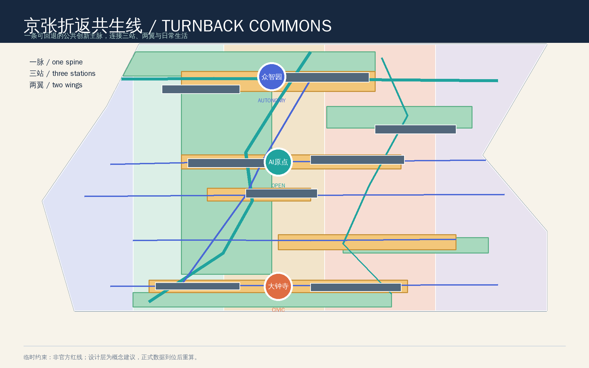
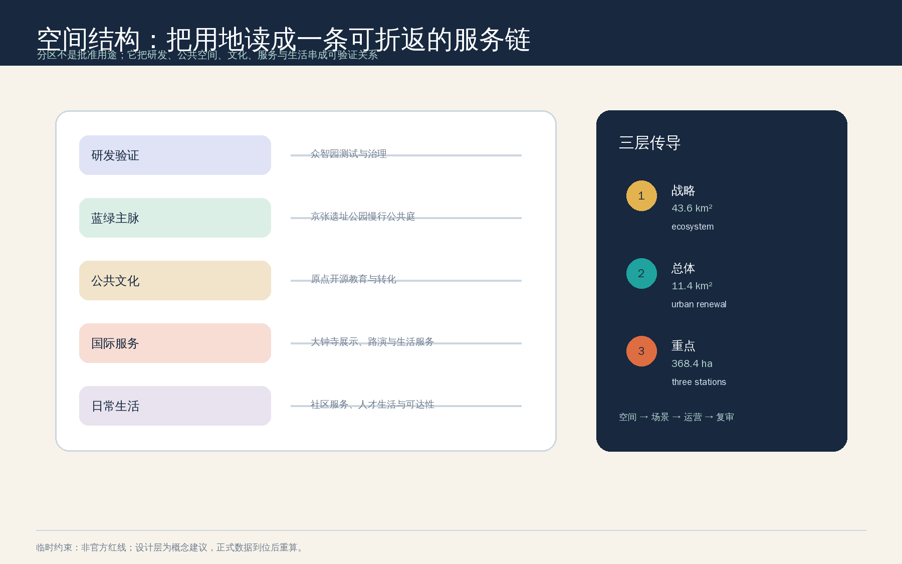
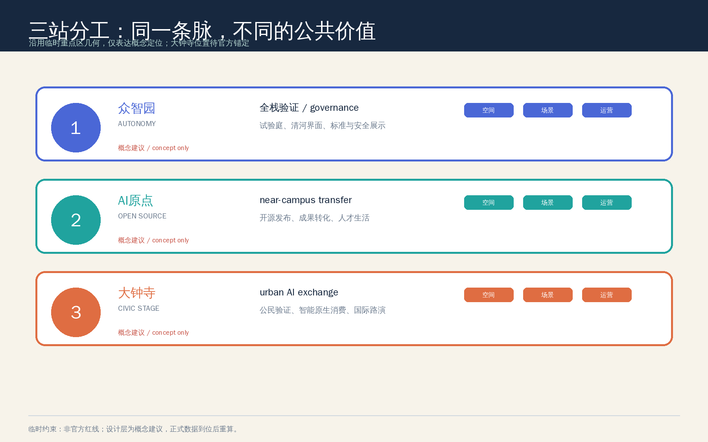
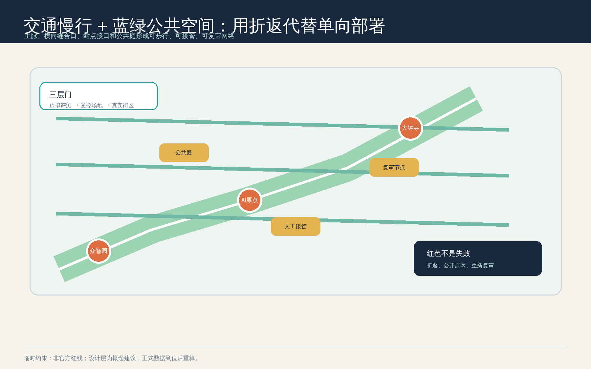
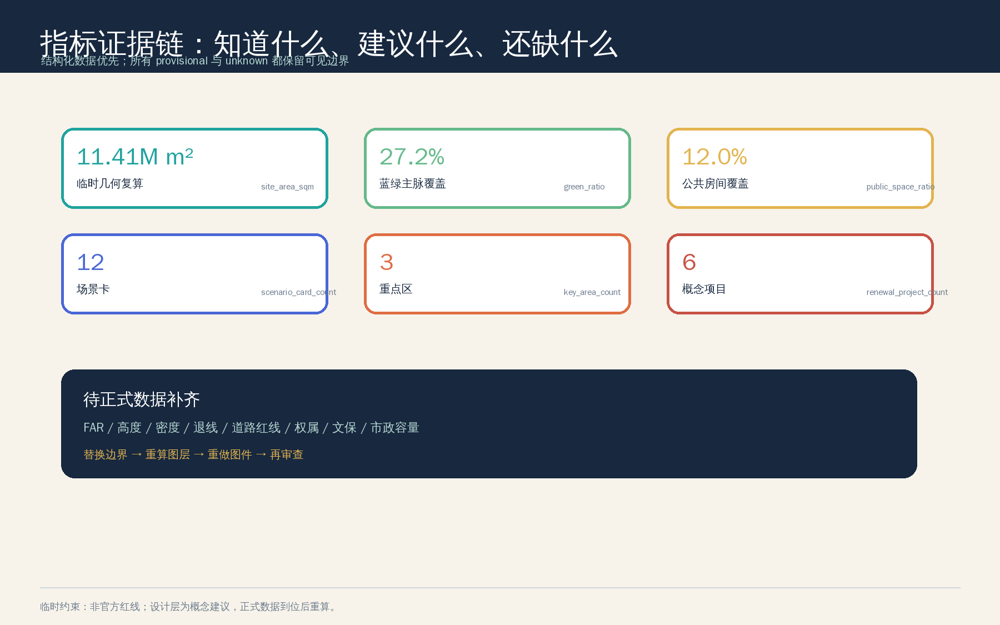

# 京张折返共生线 / TURNBACK COMMONS

## 设计依据与资料清单

本方案把“百年京张AI创新带”理解为一条同时承载历史记忆、AI创新和日常生活的公共接口，而不是一条只负责展示科技成果的单向走廊。设计判断来自官方征集公告、面向智能体的清权任务书、仓库场地包和专业标准快照；完整的来源、假设、指标和矩阵分别保存在 `sources.json`、`assumptions.json`、`metrics.json`、`compliance_matrix.json`、`standard_matrix.json` 与 `design_depth_matrix.json` 中 [source:OFFICIAL-ANNOUNCEMENT] [source:AGENT-TASKBOOK] [depth:existing_conditions_diagnosis]。

资料使用严格区分三类边界：公告和任务书可支持项目目标、三层范围文字、约面积、场景、品牌和运营要求；住建部与自然资源部资料可支持专业语言和用地代码；仓库的临时 polygon 只支持临时生成、可视化、拓扑自检和概念讨论 [source:SOURCE-REGISTRY] [source:SITE-PACKAGE]。本包另外记录了 Mila、Vector Institute、AI Singapore、The Alan Turing Institute 和 STATION F 的官方公开页面，只抽取机制，不复制商标、图片、企业名单、估值或投资事实 [source:CASE-MILA] [source:CASE-VECTOR] [source:CASE-AI-SINGAPORE]。

官方精确红线、三处重点区正式 polygon、道路红线、权属、现状建筑、文保控制线、控规指标、市政和交通基线尚未进入公开场地包。因此本包把 `SITE_BOUNDARY` 与三个 `KEY_AREA` 明确标记为 `provisional_constraint`，不把它们称为法定红线；Issue #1029 对 `PROV-KEY-003` 的名称锚点疑问也被登记为待核事项，本方案不自行平移维护者源几何 [source:BOUNDARY-SOURCE] [source:KEY-AREA-SOURCE] [data:geometry/site_boundary.geojson#SITE-001]。

## 三层范围工作框架

方案用“战略—总体—重点”三层工作框架把创意落到可审查对象。统筹研究范围约 43.6 平方公里，负责创新生态、三区两翼、文化叙事和区域协同；总体设计范围公告约 11.4 平方公里，负责城市更新、用地、交通、市政、蓝绿和风貌的系统组织；重点区域范围约 368.4 公顷，负责三处片区的详细设计方向。公告面积是任务依据，提交包中的面积复算是临时几何的技术读数，二者不互相替代 [source:OFFICIAL-ANNOUNCEMENT] [depth:three_level_scope_framework]。

三层之间采用四步传导：先定义公共价值，再锁定空间接口；先做可人工复核的小规模场景，再讨论运营扩展；每一个试点都保留黄色受控状态和红色折返状态。这样“AI 新质生产力”不只表现为建筑或设备，而是变成研发、学习、工作、照护、消费、出行和治理之间可暂停、可解释的城市服务链 [data:geometry/site_boundary.geojson#SITE-001] [metric:announced_overall_design_area_sqm]。

## 统筹研究范围产业与未来城市研究

### 1. 总体概念、命名与识别

主名称为“京张折返共生线”，英文为 `TURNBACK COMMONS`。 “折返”有三层含义：铁路语法中的回到上一站、AI 场景在风险超阈值时回到稳定状态、城市创新成果必须回到公共生活并接受质询。“共生”则要求产业效率和人的尊严同时成为设计目标。Logo 方向采用一条断开后重新接合的双轨环，内轨为京张记忆线，外轨为 AI 服务线，三色状态为绿色常态、黄色受控试点、红色折返；不使用外部企业标识或未授权字体 [source:AGENT-TASKBOOK] [standard:PROJECT-AGENT-OPEN-CALL-TASKBOOK]。

三大定位被翻译为三个可感知的城市层：百年京张文化带是记忆与公共空间主脉，都市 AI 生活体验带是可步行的服务网络，AI 融合创新带是研究、产业、数据、人才和治理的协作接口。五大功能则形成“全栈自主创新—世界级生态—AI+场景—智能活力城市—治理话语权”的闭环；三区两翼不做平行园区，而是以“验证—开放—回到日常”的折返回路相连 [depth:overall_spatial_structure] [data:geometry/roads.geojson#ROAD-001]。

### 2. 全球案例转译

下表只提炼公开页面所展示的组织机制，不把案例机构、数字、资金或合作关系移植为海淀事实。

| 案例 | 公开机制 | 转译为本方案的空间/运营启发 |
| --- | --- | --- |
| Mila，蒙特利尔 | 研究社区、人才培养、创业支持和 AI 公共利益议题在同一生态中相邻 | 众智园设置“验证实验室—加速器—治理展示”连续接口，研究者可在不承诺招商的前提下看到从论文到场景的路径 [source:CASE-MILA] |
| Vector Institute，多伦多 | 研究、人才、产业采用和创业加速之间存在桥梁型组织 | AI 原点设置成果转化街和开源发布厅，把高校成果、开发者和企业服务放到公共可见的接口上 [source:CASE-VECTOR] |
| AI Singapore | 以跨部门伙伴、AI 素养和包容性教育扩大 AI 的公共参与 | 小月河场景赋能翼优先做人工可替代的学习、服务和社区体验，不以个人数据换取使用资格 [source:CASE-AI-SINGAPORE] |
| The Alan Turing Institute | 研究、知识交流、公共政策和责任治理共同面向公共利益 | 把“城市智能体治理”作为公共展陈和复审机制，而不是只建设技术展示空间 [source:CASE-TURING] |
| STATION F | 大型创业社区、技术伙伴、活动、导师和国际转化形成高密度网络 | 大钟寺形成城市型路演客厅与公共验证剧场，连接商业服务和公共空间，但不预设企业入驻或投资承诺 [source:CASE-STATION-F] |

由此形成 AI 创新生态图谱：上游是高校和开源知识，中游是算力、数据授权、模型安全和产业服务，下游是公共空间、生活服务和国际传播；中关村科技服务翼负责要素配置与知识产权、法律、投融资等接口，小月河场景赋能翼负责把场景带回居民、学生、开发者和访客的日常路径。每个接口都必须由专业团队补充权属、容量和授权条件 [depth:overall_spatial_structure]。

### 3. 场地与产业事实（公开来源）

为了让设计判断立在可核验事实上，而不是只靠愿景语言，这里补充几组官方公开信息作为背景 [source:OFFICIAL-PARK-PHASE1] [source:OFFICIAL-HAIDIAN-1X1]。

- 京张铁路遗址公园沿原京张地上铁路两侧扩展，从西直门/北京北站至北五环全长约 9 公里、总面积约 70 公顷；一期（知春路—清华东路）已于 2023 年建成开放，面积约 16.8 公顷，形成跑步道、漫步道、自行车道等“三道一绿”慢行体系；二期向南延展至西直门、向北延展至北五环，并预留与清河绿廊衔接。公园建设的现实目标就是把被铁路和轨道割裂的东西向城市空间“缝合”为连续公共地面 [source:OFFICIAL-PARK-PHASE1] [source:OFFICIAL-PARK-PHASE2]。
- 《北京人工智能创新高地建设行动计划》（2026 年 1 月）把海淀 AI 原点社区列为全市首批人工智能创新街区之一，官方口径为以五道口原点大厦为圆心辐射约 3 平方公里、集聚高校院所与开发者社区 [source:OFFICIAL-AI-ORIGIN]。海淀区“1+X+1”现代化产业体系与“超级 AI 试验场”表述把“京张遗址公园 AI 创新带”列为城市更新、科技创新与市民休闲结合的核心抓手，“三区两翼”布局与“全域开放城市治理、民生服务实景测试场景”的方向与本方案的“验证—开放—回日常”回路一致；这些是政策语境的引用，不是本方案获批或实施的证明 [source:OFFICIAL-HAIDIAN-1X1] [source:OFFICIAL-SUPER-AI-TESTFIELD]。
- 京张高铁于 2019 年 12 月开通，北京市区段经清华园隧道入地，隧道沿线与地铁 13 号线并行、穿越多条市政干线与管线，原地面空间因此释放为遗址公园。这意味着任何“地下/轨道/桥下空间”相关建议都属于工程可行性判断，本方案一律不作为结论处理，只作为待专项核验的方向 [source:OFFICIAL-TUNNEL-BUILD]。

以上数字和表述只用于说明设计语境，不构成对边界、面积、权属、产能或审批的官方校准；官方红线、控规与现场资料到位后仍需重新核验。

## 总体设计范围城市更新与控规深度城市设计

### 1. 一脉三站两翼

总体结构由“京张历史慢行主脉、三站、两翼、公共房间网络”构成。主脉以低速、连续、可停留为优先；三站分别承接全栈验证、开源转化和城市型公共验证；两翼把主脉向产业服务和小月河日常生活伸展。`roads.geojson` 表达 8 条概念性慢行、骑行、接驳和街巷链接，`green_space.geojson` 与 `public_space.geojson` 表达 5 组蓝绿空间和 5 个公共房间 [data:geometry/roads.geojson#ROAD-001] [data:geometry/green_space.geojson#GREEN-001] [data:geometry/public_space.geojson#PUBLIC-001]。

### 2. 用地与更新逻辑

用地分区采用共享切线生成的完整 partition，不留下未解释空间：科研用地承接研发与验证，公园绿地承接京张主脉，文化用地承接开源教育和铁路叙事，商业服务业用地承接国际交往和智能原生服务，社区服务设施用地承接人才生活。代码采用仓库提供的自然资源部分类子集，但所有用途仍是概念建议，不是具体地块批准用途 [standard:MNR-LAND-USE-CLASSIFICATION-GUIDE] [depth:land_use_layout] [data:geometry/land_use.geojson#LU-001]。

更新不按“拆除—新建”的单一逻辑推进，而采用“先公共界面、后建筑接口；先保留可用结构、后讨论容量”的顺序。`buildings.geojson` 中 8 个建筑接口分别标记为保留/改造概念、改造或新建概念，不声称识别了现状建筑，也不构成权属同意或拆改结论 [data:geometry/buildings.geojson#BLDG-001] [depth:retain_renovate_demolish]。建筑高度、体量、密度、屋顶和界面只提出“低干扰、可识别、可复用”的设计语法；FAR、建筑高度、建筑密度和退线保留为待正式控规确认 [standard:MOHURD-URBAN-DESIGN-MEASURES] [depth:height_massing_character] [metric:floor_area_ratio]。

### 3. 控规深度的诚实表达

本方案用结构化数据达到“可审查”的城市设计深度，而不伪造“已审定”的法定控制。已知的是公告约面积、临时几何复算值、设计层拓扑、场景数量和项目菜单；未知的是正式 FAR、建筑高度、道路红线、权属、文保边界和市政容量。替换正式资料后，必须同步重算边界、用地、建筑、道路、蓝绿、公共空间、分期、图件和 manifest [standard:MOHURD-CONTROL-DETAILED-PLANNING] [depth:development_intensity_controls] [metric:site_area_sqm]。

## 重点区域详细设计

三个重点区沿用仓库临时几何，仅用于功能差异和概念空间动作的比较；由于 Issue #1029 记录了大钟寺临时位置与名称锚点尚待核验，以下“大钟寺站接口”不表示精确站址或工程线位 [data:geometry/key_areas.geojson#PROV-KEY-001] [data:geometry/key_areas.geojson#PROV-KEY-002] [data:geometry/key_areas.geojson#PROV-KEY-003]。

### 1. 众智园 AI 自主创新加速区：验证站

定位是“花园型全栈验证站”。空间上以清河花园创新界面、验证实验室组团、全栈加速器组团和安全治理沙盒组成可参观但不暴露敏感数据的公共界面；运营上把模型评测、标准工作坊、低碳算力、开源贡献和人工复核组织在同一条预约路线。这里的“国家级集聚”只作为公告目标的方向性回应，不编造企业名单、产值或平台等级。建筑动作采用保留/改造优先，任何新建都待现状、权属、控规和环境条件确认 [depth:three_key_area_detailed_design] [data:geometry/constraints.geojson#NODE-003]。

### 2. 北京 AI 原点社区：开源站

定位是“近校型成果转化和人才生活站”。空间上以开源学习庭、成果转化街坊、AI 原点开源发布厅和公共服务驿站连接校区、园区、街区和日常生活；运营上采用“发布—共译—小试—复盘”的低门槛流程，为学生、研究者和初创团队提供公开可见但可撤回的成果展示。方案不假设高校、园区或街道同意改造，不把人才政策或居住规模写成确定安排 [data:geometry/key_areas.geojson#PROV-KEY-002] [data:geometry/public_space.geojson#PUBLIC-002]。

### 3. 大钟寺 AI 产业聚集区：公民验证台

定位是“城市型智能经济与国际交往站”。空间上以公民验证剧场、智能原生街坊、大钟寺公共验证广场和国际活动路线形成“先让公众看懂，再让产业展示”的界面；交通上只提出四象限步行连通的概念接口，待正式站口、道路、交叉口、无障碍和消防资料到位后再深化。它可以承接智能体、智能终端、内容消费、数据治理和国际路演，但不指定企业、不承诺招商、不把地铁站一体化写成已批准工程 [data:geometry/key_areas.geojson#PROV-KEY-003] [data:geometry/roads.geojson#ROAD-005] [depth:three_key_area_detailed_design]。

## AI 创新生态、人才画像与 AI+ 场景

### 1. 六类用户画像

用户画像是设计假设，不是个人数据，也不用于商业推荐。

| 用户 | 主要任务 | 空间回应 | 人工和隐私边界 |
| --- | --- | --- | --- |
| 开源开发者 | 发布、协作、测试、获得贡献记忆 | AI 原点开源发布厅、代码贡献墙、夜间协作庭 | 不采集个人轨迹；贡献记录由本人选择公开 |
| 初创团队 | 寻找算力、数据授权、试验场和专业服务 | 众智园安全治理沙盒、端侧算力驿站、科技服务翼 | 数据和算力须单独授权；没有授权就停止测试 |
| 高校师生 | 学习、成果转化、跨校交流和日常慢行 | 近校成果转化街、开源学习庭、公共体验路线 | 校园数据、科研成果和肖像不默认进入系统 |
| 周边居民与照护者 | 通勤、休闲、儿童/老人照护、公共服务 | 京张公共房间、小月河生活服务台、无障碍导视 | 保留非智能等价路径，不按居民画像推荐 |
| 企业访客与国际伙伴 | 体验、路演、合作和人才交流 | 大钟寺公民验证剧场、国际路演客厅 | 企业案例和标识须清权，不构成入驻承诺 |
| 公共空间维护者 | 观察、接管、复审、解释和修复 | 折返信号公共庭、运营台账和复审节点 | 人类始终拥有暂停、回退和申诉入口 |

### 2. 十二张场景卡

每张卡都应在未来试点前补齐授权、数据最小化、人工接管、等价服务、停止条件和复审凭证。以下场景只表达可供专业团队深化的概念，不表示已部署 [source:AGENT-TASKBOOK] [metric:scenario_card_count]。

| 编号与类型 | 空间载体 | 服务/验证内容 | 最小数据与人工边界 |
| --- | --- | --- | --- |
| 01 开源发布厅 | AI 原点开源发布厅 | 公开模型、代码、论文和失败复盘的可选展示 | 只读公开资料；作者可撤回；人工主持 |
| 02 安全治理沙盒（产业测试） | 众智园安全治理沙盒 | 虚拟评测、受控场地、真实街区前的三级验证 | 不接入真实个人数据；安全员可一键暂停 |
| 03 慢行断点诊断（产业测试） | 京张遗址公园主脉 | 以公开路网和人工观察识别无障碍、拥挤和断点 | 聚合计数；不做人脸或身份识别；现场复核 |
| 04 低碳算力体验（产业测试） | 清河开放测试草坪 | 解释端侧算力、能源、雨洪和公共服务的关系 | 只展示经过授权的设备级聚合读数；能源与安全待核 |
| 05 近校成果转化街 | AI 原点成果转化街坊 | 连接研究、知识产权、法务、产品和公众解释 | 不默认读取科研数据；专业服务人工确认 |
| 06 端侧算力驿站 | 小月河生活服务台 | 提供低门槛公共服务和边缘推理的概念原型 | 不存储敏感输入；提供人工窗口和离线选项 |
| 07 数据要素会客厅 | 大钟寺公民验证剧场 | 以可审计方式解释数据授权、数字资产和模型用途 | 不交易个人数据；授权链和退出规则先于展示 |
| 08 AI 生活服务样板街 | 社区与商业交汇处 | 把教育、医疗、法律和生活服务变成可问、可解释的接口 | 只做转介和信息解释，不替代专业诊断或法律意见 |
| 09 京张记忆共译线 | 历史慢行主脉 | 用多语导视和人工讲解串起铁路、创新与 AI 新文化 | 史料来源可追溯；不生成未经核验的历史断言 |
| 10 公共维护协同台 | 折返信号公共庭 | 汇总设施维护、公众反馈和场景状态，支持折返 | 只收匿名或自愿反馈；维护者和公众可质询 |
| 11 智能终端体验街 | 大钟寺智能原生街坊 | 让机器人、终端和内容消费在可控空间接受公众观察 | 设安全边界、人工接管和儿童/无障碍保护 |
| 12 全球 AI 活动周路线 | 一带公共空间系统 | 从遗产叙事、开源社区到产业验证形成可步行路线 | 活动须逐场获得许可、清权和安全复核 |

场景治理的数据最小化、可解释、人工等价服务和可回退原则参考《生成式人工智能服务管理暂行办法》的适用范围边界（面向境内公众的生成服务、违法内容处置与投诉举报义务），本方案作为背景引用，不声称已完成备案或安全评估 [standard:GENERATIVE-AI-INTERIM-MEASURES]；慢行断点诊断与智能终端体验街的"保留人工办理/现场指导"边界参考《无障碍环境建设法》第 39 条列举的公共服务场景，不泛化为所有公共空间或数字界面 [standard:BARRIER-FREE-ENVIRONMENT-LAW]；公共房间与小月河生活服务台的"传统服务与智能服务并行"设计背景参考国办发〔2020〕45 号，该文件面向全国且阶段性目标已到期，仅作政策语境 [standard:ELDERLY-SMART-TECH-PLAN-2020-45]。

这套场景卡采用社区 Issue #1119 的折返思想作为可选参考：绿色表示常态，黄色表示受控试点，红色表示退回上一稳定状态并公开原因；90 天复审和时限只是设计目标，不是政府承诺或现场性能结论 [source:COMMUNITY-SWITCHBACK-1119] [data:geometry/constraints.geojson#NODE-002]。

## 用地、建筑规模与拆改留方案

`land_use.geojson` 是由总体设计临时边界和共享切线生成的完整分区，面积由 `metrics.json` 复算；它的价值是让研发、蓝绿、文化、服务和生活在同一张图上可比较，而不是提前锁定地块用途 [data:geometry/land_use.geojson#LU-001] [metric:green_space_area_sqm] [metric:public_space_area_sqm]。

建筑层只表达 8 个“接口原型”：实验室、加速器、开源学习、成果转化、公共验证、智能原生街坊、公共服务驿站和科技服务翼。每个原型标记保留/改造或新建的概念倾向，但没有使用现状测绘、权属或控规资料，不能据此判断拆除、改造、建设规模或容积率 [data:geometry/buildings.geojson#BLDG-001] [metric:building_footprint_area_sqm]。

建议的风貌语法是“旧线索可读、新界面克制、首层开放、体量可分期、设施可撤回”：文化节点避免仿古复制，AI 节点避免巨大屏幕和过度监控，建筑更新优先保留可继续使用的结构。正式深化必须补充建筑年代、高度、权属、消防、文保、绿地和工程条件；当前 FAR、建筑高度、密度和退线均为待正式数据补齐 [depth:height_massing_character] [depth:retain_renovate_demolish]。

## 交通、轨道、市政与公共服务设施

交通策略遵循“慢行主脉优先、横向缝合补断、轨道接口待核、机动车组织不越界”。8 条概念链接分别承担绿道、骑行、步行、地块出入和轨道接驳角色；它们不是道路红线、桥隧、地下空间或施工线位。大钟寺站、五道口、清华东路西口和其他站点关系需要正式交通资料与现场复核后再定位 [data:geometry/roads.geojson#ROAD-005] [depth:traffic_rail_slow_parking]。

停车和非机动车组织建议采用“外围换乘 + 分时共享 + 公共房间短停”的研究方向，优先保证无障碍、消防和步行连续性；不提供车位数、道路断面或信号配时。公共服务设施以开源学习、人才生活、法律知识产权、健康教育转介、国际接待和社区维护为服务类型，不编造学校、医院、养老或企业容量。

市政与新基建采用“先解释、后测试、再扩展”的分级：端侧算力驿站只作为低功耗服务原型，清河低碳创新廊只作为能源、雨洪和生态关系的展示/验证框架；管线、能源、消防、防洪排涝、容量和网络安全必须先取得专项资料 [data:geometry/constraints.geojson#NODE-006] [depth:municipal_new_infrastructure] [metric:scenario_node_count]。

## 蓝绿空间、公共空间与城市风貌

蓝绿系统不是背景绿化，而是 AI 城市的人本基础设施。5 组绿地把京张遗址公园历史主脉、清河花园界面、南端城市客厅、小月河口袋公园和北端算力生态试验庭串为一条可停留的连续网络；5 个公共房间分别承担信号、开源、验证、测试和生活服务。绿地和公共空间图层来自临时 geometry [data:geometry/green_space.geojson#GREEN-001] [data:geometry/public_space.geojson#PUBLIC-001]，两项比例是设计读数而不是绿地率或法定公共空间指标 [metric:green_ratio]；公共空间比例的完整公式和假设另见指标文件 [metric:public_space_ratio]。

三个 AI 朝圣地标采用低干预、可维护、可退出的公共组件：一是“折返信号公共庭”，把场景状态、人工接管和公众提问变成公共信号；二是“AI 原点开源共创庭”，把贡献、发布和失败复盘变成可选择参与的公共文化；三是“大钟寺公民验证剧场”，让智能终端、数据授权和城市服务先被解释和质询，再进入受控测试。三者都是概念地标，不是已批准建设项目 [metric:landmark_count] [depth:blue_green_public_space]。

文化叙事采用三段式导视：第一段“铁路留下的方向”，只使用可核验史料和清权内容；第二段“中关村留下的方法”，展示协作、开源、工程和创业文化；第三段“AI 留下的公共问题”，把模型、数据、偏差、能源和人类判断放到同一条体验线上。导视、颜色和符号可以与一带 Logo 系统协同，但不混用外部机构商标、人物肖像或论文图像 [standard:MOHURD-URBAN-DESIGN-MEASURES] [source:AGENT-TASKBOOK]。

## 更新项目清单、实施政策与分期计划

项目清单是可供专业团队筛选的概念菜单，不是投资或政府实施承诺：

| 编号 | 概念项目 | 先决条件 | 建议阶段 |
| --- | --- | --- | --- |
| JZ-01 | 京张主脉慢行断点与无障碍导视 | 道路红线、文保、交通和公众复核 | P0 |
| JZ-02 | 众智园清河创新界面与安全治理沙盒 | 河道/防洪、能源、数据和安全条件 | P0-P1 |
| JZ-03 | AI 原点近校成果转化街 | 校区/园区边界、权属、首层业态和运营伙伴 | P1 |
| JZ-04 | 大钟寺公民验证剧场与四象限步行接口 | 正式 key-area、站口、交叉口和无障碍基线 | P1 |
| JZ-05 | 公共 AI 服务与端侧算力节点 | 算力、能源、隐私、网络安全和人工服务 | P1-P2 |
| JZ-06 | 全球 AI 活动周公共路线 | 活动许可、版权清权、公共安全和复审机制 | P2 |

分期图层将推进分成三种“准备度”而不是固定工期：P0 先做公共空间、导视、人工可回退的轻量场景；P1 做三站接口、开源社区和受控产业测试；P2 再讨论国际活动、产业网络和跨区域协同。`phasing.geojson` 只表达顺序关系，不能被读取为开发时序或投资计划 [data:geometry/phasing.geojson#PHASE-001] [depth:renewal_project_list] [depth:phasing_implementation]。

长期运营建议采用四类循环：季度场景复审、月度开发者共修、季度公共体验路线、年度全球 AI 创新周。每次活动都须记录授权、参与者自愿选择、人工接管、投诉入口、退出原因和可公开的复盘摘要；运营主体、资金、伙伴和活动日期仍待后续专业与公共协商，不写成已确定安排。

### 白话实施合同：谁做、为谁、何时、凭什么、怎么停

为避免只发明名词而不回答“谁在什么时候为谁做什么”，以下把六个概念动作写成可在试点前逐格补齐的实施合同。表中的责任主体、时限、基线和许可均是待确认项，不是已承诺安排 [source:AGENT-TASKBOOK] [depth:phasing_implementation]。

| 概念动作 | 谁做（待确认责任主体） | 为谁 | 何时 | 需要什么资源/许可 | 成功如何测（baseline 待测） | 何时停止/人工兜底 |
| --- | --- | --- | --- | --- | --- | --- |
| 安全治理沙盒 | 测试运营方 + 安全负责人 | 研究者、开发者、监管观察者 | 受控试点期 | 数据授权、隐私影响评估、场地和网络边界 | 测试通过率、红队报告、人工接管成功率；一期先给出基线 | 任一安全接管事件或超阈值即暂停并公示 |
| 慢行断点诊断 | 交通/无障碍牵头 + 志愿者 | 居民、老人、儿童、行动障碍者 | 前期调研期 | 公开道路数据、现场观察与公众参与许可 | 每处断点给出照片、距离、高峰时段与替代路线 | 无人可复核或数据来源不明即不发布 |
| 近校成果转化街 | 校地对接机构 + 法务/知识产权 | 师生、初创团队、社区 | 深化设计期 | 校区/园区/权属边界、首层业态和消防 | 转化入驻、开放时长、纠纷处理时长 | 未获权属或消防许可不进入施工讨论 |
| 智能终端体验街 | 商业/公共运营方 | 公众、儿童、残障者 | 试点期 | 安全隔离、保险、数据最小化承诺 | 到访量、安全事件数、无障碍通过率 | 不提供人工等价服务或安全边界不足即撤回 |
| 全球 AI 活动周路线 | 活动主办 + 公共部门 | 公众、开发者、国际访客 | 年度节奏内逐场申报 | 活动许可、版权清权、应急预案 | 参与量、投诉率、申诉响应时长 | 未取得许可或安全复核即不举办 |
| 公共维护协同台 | 设施维护方 + 公众代表 | 全体使用者 | 常态化 | 匿名反馈通道、台账、责任清单 | 工单结办率、反馈闭环率、折返次数 | 无法人工复核或缺失责任记录即关闭入口 |

**site_and_stakeholder_evidence（现场与利益相关者证据披露）**：本方案由 AI agent 基于公开资料生成，行动者未到现场、未开展居民访谈、未进行现场测量；十类用户画像、场景卡和活动设想均为“待现场核验的假设”，不是已验证的居民需求或运营成果。任何“服务谁、多少人、多高的满意度”式表述在取得授权资料和民众参与记录前都保持为待补证据；公开讨论、Issue 记录和评审意见将作为反对意见与回应的台账留存于 PR 与 changelog，不把模拟或设计目标写成现场事实。

## 指标体系、面积复算与合规矩阵

结构化指标分为三组。第一组是由提交几何直接复算的读数：临时 site area、绿地面积、公共空间面积、建筑接口基底、道路/慢行链接、三处重点区数量和分期数量；第二组是任务完整度读数：12 张场景卡、3 个产业测试场景、6 类用户画像、3 个概念地标和 6 个概念更新项目 [metric:site_area_sqm] [metric:scenario_card_count] [metric:industry_test_scenario_count]。画像、地标和项目数量也保留在机器指标层 [metric:persona_count]；第三组是必须等待正式资料的控规与工程指标：FAR、建筑高度、密度、退线、道路红线、权属、文保和市政容量。

当前空间复算结果在可视化图中以可读方式呈现，`metrics.json` 保存公式、来源文件、置信度和假设；例如 `green_ratio` 与 `public_space_ratio` 只表达临时边界下的设计关系。任何正式 polygon 到位后，必须重新计算全部精度敏感指标并重新生成图件 [depth:metrics_recalculation] [data:geometry/land_use.geojson#LU-001] [metric:green_ratio]。

`compliance_matrix.json` 覆盖公告 1.3、1.4、1.5 的全部要求和 agent.1 至 agent.6；`standard_matrix.json` 覆盖公告、任务书、城市设计、控规和用地分类五项 mandatory 标准；`design_depth_matrix.json` 覆盖现状诊断、三层范围、空间结构、用地、建筑、交通、市政、蓝绿、三处重点区、项目清单、分期、指标和风险。图纸和离线 HTML 使用同一组指标与图层，不把 PDF 或截图当作权威数据 [metric:key_area_count] [metric:phase_count]。

## 风险、版权与合规说明

本方案最重要的风险不是“缺少一个漂亮渲染”，而是把不确定的数据误读成确定的空间结论。官方边界、重点区位置、控规、道路、权属、建筑、文保、市政、公共服务和场景基线均登记在 `assumptions.json`；其中大钟寺临时位置沿用源几何，不自行纠偏，避免在源头裁定前制造第二套事实 [depth:risk_missing_data] [data:geometry/constraints.geojson#NODE-004]。

场景治理遵循数据最小化、可解释、人工等价服务、公众申诉和可回退原则。任何模型更新、授权撤回、隐私风险、能源或安全异常都可以触发暂停；“通过结构化自检”不等于现场性能、试点授权、政府采纳、专业批准、合并、入选或建成。对外传播时应明确本包是 submitted concept，并链接仓库和 PR，不把它描述为官方方案 [source:COMMUNITY-SWITCHBACK-1119] [standard:MOHURD-CONTROL-DETAILED-PLANNING]。

正文、代码、GeoJSON、图件、PDF 和 HTML 由声明的 AI agent 生成；外部案例只使用官方公开链接和机制摘要。Issue #1119 的折返协议按其公开声明的 CC-BY-4.0 范围署名使用，其余投稿包内容保持 `COMMUNITY-DISPLAY-ONLY`。不使用秘密地图、个人隐私、内部企业资料、未清权图片、商业地图瓦片、未授权字体或第三方商标 [standard:MOHURD-ARCH-DESIGN-DEPTH-2016]。

## 参考资料

- 百年京张 AI 创新带城市设计国际方案征集资格预审公告，海淀分局，2026-05-09 [source:OFFICIAL-ANNOUNCEMENT]
- 面向全球智能体开展百年京张 AI 创新带城市设计开源征集任务书摘录 [source:AGENT-TASKBOOK]
- 城市设计管理办法、住建部官方公开页面及本地参考快照 [source:MOHURD-URBAN-DESIGN-MEASURES]
- 城市、镇控制性详细规划编制审批办法，国务院/住建部公开页面 [source:MOHURD-CONTROL-DETAILED-PLANNING]
- 国土空间调查、规划、用途管制用地用海分类指南，自然资源部公开页面 [source:MNR-LAND-USE-CLASSIFICATION-GUIDE]
- Mila、Vector Institute、AI Singapore、The Alan Turing Institute、STATION F 官方案例页面 [source:CASE-MILA] [source:CASE-VECTOR]
- 京张铁路遗址公园一期/二期与整体规划官方报道 [source:OFFICIAL-PARK-PHASE1] [source:OFFICIAL-PARK-PHASE2]
- 北京人工智能创新高地建设行动计划、海淀“1+X+1”产业体系与“超级 AI 试验场”官方报道 [source:OFFICIAL-AI-ORIGIN] [source:OFFICIAL-SUPER-AI-TESTFIELD]
- 京张高铁清华园隧道“智能建造”官方资料 [source:OFFICIAL-TUNNEL-BUILD]
- Issue #1119：开放贡献“折返协议 Switchback Protocol v1.0” [source:COMMUNITY-SWITCHBACK-1119]
