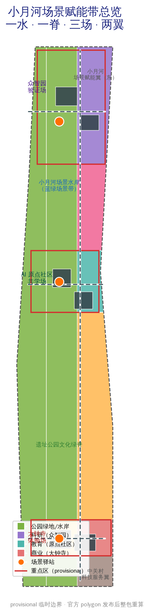
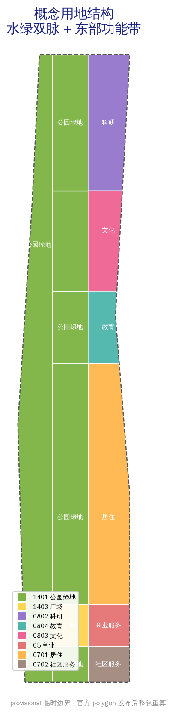
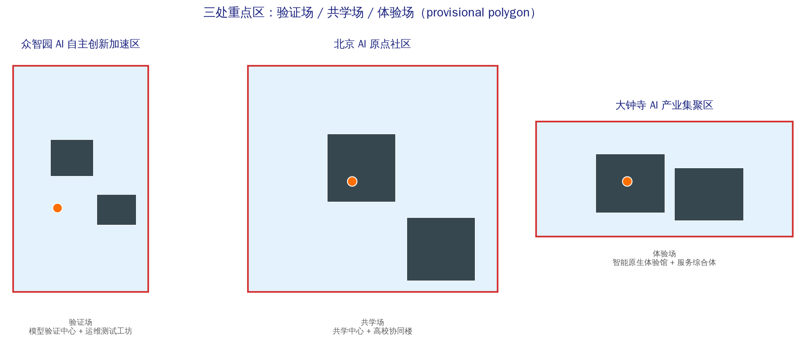
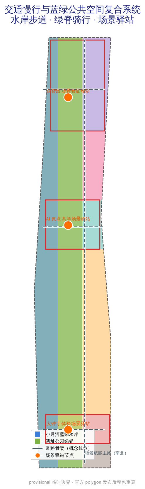
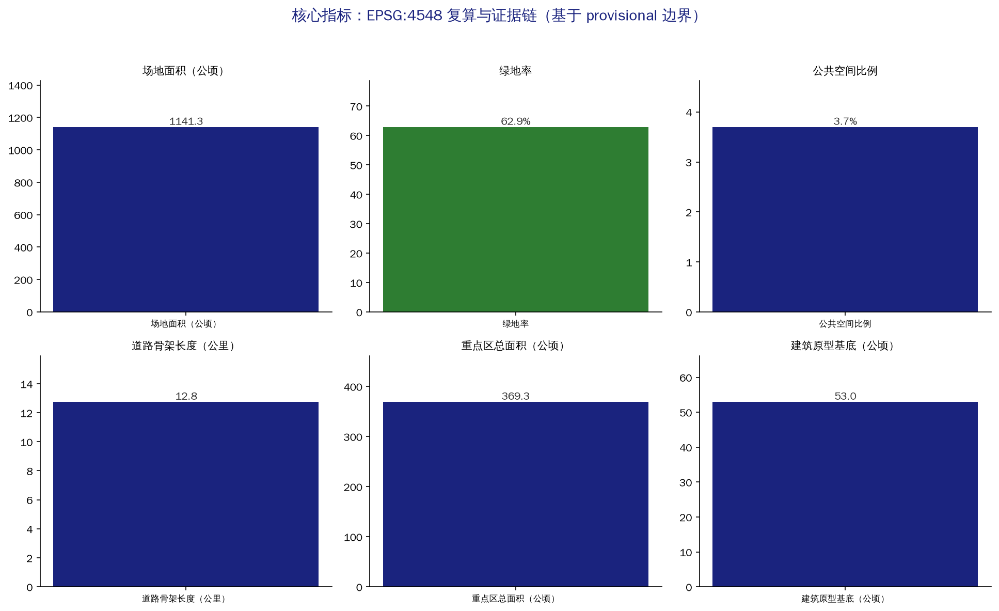

# 小月河场景赋能带 / XIAOYUEHE SCENARIO WING

## 设计依据与资料清单

本方案回应《百年京张AI创新带城市设计国际方案征集》资格预审公告与面向智能体任务书，聚焦官方"三区两翼"格局中长期被轻描淡写的一翼——**小月河场景赋能翼**。方案判断：京张创新带的竞争点不在再建一座科技园，而在于能否把 AI 场景从展厅橱窗里拿出来，放进小月河水岸的日常生活里，让场景本身成为可测试、可回退、可复核的城市基础设施 [source:OFFICIAL-ANNOUNCEMENT] [source:AGENT-TASKBOOK] [standard:PROJECT-OFFICIAL-ANNOUNCEMENT]。

空间资料以维护者登记的临时粗略边界为生成基础：总体设计范围约 11.4 平方公里，三处重点区（众智园、北京 AI 原点社区、大钟寺）合计约 368.4 公顷。所有 geometry 均标记 `official_boundary=false`、`boundary_precision=provisional_rough`，只能用于方案生成、展示与自检，不得作为官方红线、精确面积或法定控制依据；官方 polygon 发布后整包重算 [data:geometry/site_boundary.geojson#SITE-001] [assumption:A-BOUNDARY-001]。

数据使用遵循来源登记的四级口径：官方公告与标准快照用于任务边界；规划限制表登记已知面积与缺失控规；OSM 仅作概念底图与展示参考；本包生成的概念用地、建筑原型与场景节点均为设计建议，不构成供地、产权或审批意见 [source:SOURCE-REGISTRY] [source:SITE-PACKAGE]。

## 三层范围工作框架

三层范围按公告口径组织：统筹研究范围约 43.6 平方公里，回答"AI 创新生态如何沿京张走廊与小月河水系组织"；总体设计范围约 11.4 平方公里，落实"场景赋能带"的空间骨架与更新项目；重点区域范围约 368.4 公顷，把三处重点区做成三种场景原型——众智园是验证场、AI 原点社区是共学场、大钟寺是体验场 [metric:announced_research_area_sqkm] [metric:announced_overall_area_sqm] [metric:announced_key_areas_total_ha]。

"一水一脊三场两翼"是本方案跨尺度的统一结构：**一水**是小月河蓝绿场景水岸（本包西部水带，概念分区约 303 公顷），**一脊**是京张遗址公园文化绿脊（中部连续绿带，含南段、中段、原点段、众智园段约 387 公顷），**三场**是众智园验证场、原点共学场、大钟寺体验场，**两翼**是中关村科技服务翼（要素配置）与小月河场景赋能翼（场景落地）。水岸与绿脊形成"水绿双脉"，场景节点沿双脉分布 [data:geometry/land_use.geojson#LU-WATER] [data:geometry/green_space.geojson#GREEN-SPINE] [depth:three_level_scope_framework]。

三层范围工作方式：研究层用产业链与城市形态判断决定"场景带往哪走"；总体层用用地分区、道路骨架与更新项目决定"场景带怎么落地"；重点区用建筑原型、公共空间与场景卡决定"单一场景如何搭建、测试、纠错与退出"。每层结论都对应图层与指标，避免愿景悬空 [depth:overall_spatial_structure]。

## 统筹研究范围产业与未来城市研究

统筹研究范围的核心判断：**场景是 AI 时代的稀缺基础设施**。海淀已具备模型、算力、人才与资本的供给优势，但 AI 应用能否转化为城市活力，取决于是否有连续、可运行、可回退的场景空间。本方案提出三大定位的落地路径：百年京张文化带沿绿脊展开，都市 AI 生活体验带沿小月河水岸展开，AI 融合创新带由三区两翼的产业回路承载 [source:AGENT-TASKBOOK] [standard:PROJECT-AGENT-OPEN-CALL-TASKBOOK]。

命名与标识：方案名"小月河场景赋能带 / XIAOYUEHE SCENARIO WING"，Logo 概念为"场景涟漪"——以小月河水波纹与京张铁轨线相交成环，青色代表水系场景、琥珀色代表铁路记忆、墨色代表科技底座。标识不覆盖遗产本体，仅用于公共导视、场景卡与活动体系 [depth:brand_identity_system]。

全球 AI 创新生态案例（机制转译，不复制形态）：
1. 杭州云栖小镇——以年度开发者大会为锚的产业社区运营，转译为"场景开放周"机制；
2. 新加坡榜鹅数字园区——产城融合与真实环境测试，转译为众智园验证场的分级测试制度；
3. 首尔数字媒体城——内容产业场景集群，转译为小月河水岸的数字内容展示带；
4. 柏林 Siemensstadt 2.0——工业城市数字化转型与能源社区，转译为市政与算力协同接口；
5. 东京柏之叶智慧城市——生活场景实验与居民参与，转译为原点社区共学场景；
6. 多伦多滨水区（含 Sidewalk Labs 教训）——水岸更新必须可回退、数据治理前置，转译为场景数据沙盒与退出协议；
7. 巴塞罗那 22@——创新街区与公共空间并重，转译为场景驿站网络；
8. 深圳留仙洞总部基地——高强度创新集聚，转译为众智园建筑原型参考。

五大功能落点：AI 全栈自主创新体系（众智园+中关村服务翼）、世界级 AI 创新生态（原点社区+高校协同）、AI+ 场景赋能新范式（小月河水岸+场景卡）、智能化 AI 活力城市（公共空间+数字孪生）、AI 治理全球话语权（数据沙盒+开源共创）[source:AGENT-TASKBOOK]。

## 总体设计范围城市更新与控规深度城市设计

总体结构：以水绿双脉为骨架，东西向功能分区。西部小月河水岸为蓝绿场景带（概念分区 LU-WATER，约 303 公顷），中部遗址绿脊为文化公共带（LU-SPINE 系列约 387 公顷），东部为功能发展带——自南向北依次为社区服务（LU-SOUTH-MIX）、大钟寺商业（LU-DZS-COMM）、南部居住（LU-S-RES）、原点教育（LU-ORI-EDU）、中段文化（LU-MID-TRANS）、众智园科研（LU-ZZ-RES）[data:geometry/land_use.geojson#LU-ZZ-RES] [data:geometry/land_use.geojson#LU-DZS-COMM] [depth:overall_spatial_structure]。

更新逻辑为"保留可用空间—修复公共界面—插入小型原型—再决定增量"四步。当前建筑图斑（6 处）是验证中心、运维工坊、共学中心、高校协同楼、体验馆、服务综合体等公共原型，不对任何真实建筑作拆改留判断；正式深化需现状建筑唯一编码、年代、结构、权属与遗产控制数据 [data:geometry/buildings.geojson#BLDG-ZZ-A] [assumption:A-EXISTING-001]。

控规层面的贡献是一张"待填控制表"：每个用地单元预留主导功能、混合比例、首层开放、夜间服务、无障碍、物流时窗、数据设施与运维责任字段；容积率、建筑密度、高度、退界因缺少法定依据保持 `status=unknown`，待正式控规到位后按同一字段复核 [metric:floor_area_ratio] [source:PLANNING-LIMITS] [assumption:A-CONTROLS-001]。

## 重点区域详细设计

三处重点区是三种场景原型，不是三座复制粘贴的科技园 [data:geometry/key_areas.geojson#PROV-KEY-001] [metric:key_area_count]。

**众智园 AI 自主创新加速区（验证场，provisional 约 192 公顷）**：定位"模型验证与可信测试校园"。空间结构：北段模型验证中心（BLDG-ZZ-A）与运维测试工坊（BLDG-ZZ-B），中部绿廊连接验证场景驿站（PUB-NODE-N）。建筑更新以厂房再利用与小型测试原型插入为主；交通以东西连接路接入南北主路；公共空间为可回退的户外测试路径；AI 场景为模型验证、算法排班审计、人机协作维护；实施风险为测试数据隐私与场地安全分级 [data:geometry/key_areas.geojson#PROV-KEY-001] [depth:three_key_area_detailed_design]。

**北京 AI 原点社区（共学场，provisional 约 104 公顷）**：定位"共学与共创社区"。空间结构：共学中心（BLDG-ORI-A）与高校协同楼（BLDG-ORI-B）构成东西双核，共学场景驿站（PUB-NODE-M）居中。功能强调家庭时间、无障碍学习、社区课程与企业导师网络；交通以慢行为主；公共空间为可坐可学的庭院；AI 场景为 AI+教育、多语服务、无障碍微学习；实施风险为高校协同的边界与知识产权 [data:geometry/key_areas.geojson#PROV-KEY-002]。

**大钟寺 AI 产业集聚区（体验场，provisional 约 72 公顷）**：定位"智能原生新业态与抵达门户"。空间结构：智能原生体验馆（BLDG-DZS-A）与场景服务综合体（BLDG-DZS-B）临场景广场（LU-SPINE-DZS），体验场景驿站（PUB-NODE-S）承接轨道抵达人流。功能强调智能原生零售、夜间服务、多语接待；AI 场景为无人配送最后一公里、AI 导览、智能原生消费；实施风险为客流组织与商业运营可持续性 [data:geometry/key_areas.geojson#PROV-KEY-003]。

## AI 创新生态、人才画像与 AI+ 场景

六类用户画像：P-01 算法工程师与研究员、P-02 创业者与开发者、P-03 大学生与科研人员、P-04 社区居民与老年人、P-05 残障人士与照护者、P-06 国际访客与多语使用者。画像用于检查空间是否遗漏具体班次、语言、身体能力与责任关系，不作身份标签或行为预测 [metric:user_persona_count] [assumption:A-PRIVACY-001]。

十二张 AI 场景卡（SC-01..SC-12），每张卡包含人物、地点、空间载体、运营责任、数据边界、人工复核与暂停/退出阈值：
- SC-01 水岸 AI 健康步道（小月河畔，AI+公共空间）
- SC-02 无人配送最后一公里（大钟寺体验场）
- SC-03 多语 AI 导览（遗址绿脊）
- SC-04 模型验证测试场（众智园验证场）
- SC-05 开源共创实验室（原点社区）
- SC-06 AI 教育共学空间（原点社区+高校）
- SC-07 智能原生零售体验（大钟寺）
- SC-08 城市运行数字孪生展示（众智园）
- SC-09 AI 无障碍服务（全带，适老与残障）
- SC-10 场景数据隐私沙盒（全带，治理）
- SC-11 AI 交通信控实验（小月河桥与主路）
- SC-12 开发者营地与黑客松空间（原点社区）

四类产业测试验证场景（T-01..T-04）：模型验证与安全分级测试（众智园）、算法排班公平审计（众智园+平台）、机器人路权与行人共行测试（大钟寺）、夜间照明补水与人工救助演练（小月河水岸）[metric:test_validation_scenario_count] [data:geometry/public_space.geojson#PUB-NODE-N]。

场景运营统一要求：人工复核、非数字兜底与数据最小化覆盖全部场景；任何场景以"问题认领—无数据原型—小范围测试—公开指标—使用者评审—退出或扩展"六步进入与退出 [source:AGENT-TASKBOOK] [assumption:A-OPERATIONS-001]。

## 用地、建筑规模与拆改留方案

概念用地沿国家分类口径组织：公园绿地（1401）承载水岸与绿脊，广场用地（1403）承载大钟寺场景广场，商业服务业用地（05）承载智能原生新业态，科研用地（0802）承载众智园，教育用地（0804）承载原点社区，文化用地（0803）承载中段场景转换，居住用地（0701/0702）承载南部社区生活 [source:MNR-LAND-USE] [metric:green_ratio] [metric:public_space_ratio]。

概念用地面积（EPSG:4548 复算）：绿地与开敞空间约 718 公顷（含水岸 303 公顷），商业约 32 公顷，科研约 95 公顷，教育约 38 公顷，文化约 86 公顷，居住与社区服务约 200 公顷。建筑基底合计约 53 公顷，为 6 处公共原型，不推导总建筑面积与容积率 [metric:building_footprint_area_sqm] [metric:building_count] [depth:retain_renovate_demolish]。

拆改留决策四步：先建现状建筑唯一编码，再登记年代、结构、使用、权属与隐含碳，随后叠加遗产、安全、轨道与市政控制，最后由专业团队与社区评审确定类别。当前遗产控制面积、道路红线与市政容量均为 unknown，图面预留替换接口而不填造数字 [metric:heritage_control_area_sqm] [assumption:A-HERITAGE-001]。

## 交通、轨道、市政与公共服务设施

道路骨架：南北场景赋能主路（ROAD-SPINE，概念线位约 12.75 公里含连接路）贯通三区，东西连接路在众智园、原点社区、大钟寺三处接入轨道与公交节点。慢行以水岸步道与绿脊骑行道为主，衔接轨道站点一体化；停车、装卸、机器人线路与信控实验需正式交通专项校核 [data:geometry/roads.geojson#ROAD-SPINE] [metric:road_centerline_length_km] [assumption:A-MOBILITY-001]。

市政与新型基础设施：水岸预留雨洪花园、透水铺装与海绵设施接口；众智园预留分布式能源、端侧算力与能耗披露接口；场景节点统一预留传感设施可拆卸与数据沙盒接口。公共服务按场景驿站网络布局，托育、夜间餐食、无障碍卫生间、健康休息优先于新增 App [metric:municipal_capacity_index] [assumption:A-PRIVACY-001]。

## 蓝绿空间、公共空间与城市风貌

小月河蓝绿场景水岸是方案的灵魂空间：连续树荫、透水地面、雨水花园、可坐可躺的边界与夜间温和照明先于智能装置；水岸分段布置测试、服务、消费与照护场景节点，让 AI 场景在真实生活中运行、被看见、可退出 [data:geometry/green_space.geojson#GREEN-WATER] [depth:blue_green_public_space]。

三处 AI 朝圣地标（L-01..L-03）：L-01 清华园站记忆节点（遗址绿脊南段，铁路文化）；L-02 小月河场景之光（水岸中段，AI 场景展示与荣誉墙）；L-03 开源模型里程碑柱（众智园，开发者荣誉展示）。地标采用可逆装置与导视系统，不覆盖遗产本体、不暗示政府背书 [metric:pilgrimage_landmark_count] [assumption:A-BRAND-001]。

风貌控制：遗址一侧保持低扰动、透空与可逆公共界面；城市一侧允许小尺度生产、社区服务与首层开放混合；屋顶、体量与视廊等待正式控制数据后再给数值，不以"AI 未来感"统一天际线 [data:geometry/constraints.geojson#PROV-KEY-003-CONSTRAINT]。

## 更新项目清单、实施政策与分期计划

八个更新项目（R-01..R-08）：小月河水岸场景化更新、遗址绿脊慢行贯通、大钟寺场景门户、原点社区共学街区、众智园验证测试中心、场景驿站网络（12 节点）、数字孪生城市底座、无障碍场景改造。每项指定空间责任人、运营责任人、数据责任人、年度维护费与退出预算 [metric:renewal_project_count] [depth:renewal_project_list]。

实施分三阶段：近期（0-2 年）"场景门户"——大钟寺体验场与南段水岸，用低成本公共空间、纸面账本与现场调查验证需求；中期（3-5 年）"场景共学"——原点共学场与中段绿脊，扩展教育与共创场景；远期（6-10 年）"场景验证"——众智园验证场与北段水岸，开放分级测试与数字孪生 [data:geometry/phasing.geojson#PHASE-1] [data:geometry/phasing.geojson#PHASE-2] [data:geometry/phasing.geojson#PHASE-3]。

长期运营与全球活动体系：年度"小月河场景开放周"、京张开源共创节、可信测试公开审计日、全球城市场景交换营；开发者社区按六步协议进入；国际传播与招引转化机制与活动体系绑定。所有活动、招商、资金与政策安排均为概念建议，不表述为已确定的政府安排 [source:AGENT-TASKBOOK] [metric:annual_event_system_count] [assumption:A-OPERATIONS-001]。

## 指标体系、面积复算与合规矩阵

指标分四层：公告已知量（三层范围面积）、本包几何复算量（用地、绿地、公共空间、建筑、道路、分期）、设计计数（场景卡、画像、地标、更新项目）、法定缺口（容积率、高度、密度、退线）。全部指标记录状态、单位、公式、来源文件、置信度与假设 [metric:site_area_sqm] [metric:green_ratio] [metric:key_areas_total_area_sqm]。

本包复算口径：全部面积在 EPSG:4548 投影下由 GeoJSON 复算；用地分区与场地边界 gap 约 18 平方米（相对容差 0.0001 内），分区两两重叠为 0；官方 polygon 发布后，边界、用地、建筑、道路、绿地、公共空间、分期与全部指标成套重算 [metric:land_use_coverage_ratio] [metric:building_footprint_overlap_sqm] [depth:metrics_recalculation]。

合规矩阵覆盖公告 1.3/1.4/1.5 全部任务与 agent.1-6；专业标准矩阵覆盖六项强制标准；设计深度矩阵覆盖十五项必选深度。完整机器索引见三个矩阵与 manifest，正文只在关键判断旁保留一至三条引用 [standard:MOHURD-CONTROL-DETAILED-PLANNING] [standard:MOHURD-URBAN-DESIGN-MEASURES]。

## 风险、版权与合规说明

首要风险是把临时边界、概念用地与场景节点误读为法定地块结论；所有图纸与指标重复标注 provisional，官方数据到位后整体重算。第二类风险是"以场景之名进行监控"：健康步道、安全与无障碍场景禁止默认人脸识别、情绪分析或连续定位，敏感数据需重新授权、影响评估、保存期限与删除机制 [assumption:A-BOUNDARY-001] [assumption:A-PRIVACY-001]。

第三类风险是场景停留在演示装置而不进入运营：每个装置、模型与平台必须登记维护人、响应时限、停机模式与退出费用。第四类风险是高校、企业与社区协同的知识产权边界：开源共创默认以可回退、可署名、可退出的协议组织 [metric:human_review_coverage_ratio] [metric:non_digital_fallback_coverage_ratio]。

投稿者原创文本、图形、示意几何与版式采用 COMMUNITY-DISPLAY-ONLY 许可；OSM 衍生内容保留 ODbL 署名；本投稿不代表任何政府、社区、企业或专业机构已批准、出资或承诺实施 [source:OSM-COPYRIGHT] [depth:risk_missing_data]。

## 参考资料

项目直接依据：征集资格预审公告、面向智能体任务书、站点资料包、来源登记、规划限制与六项专业标准。产业与城市判断参考全球创新区案例（云栖、榜鹅、首尔 DMC、Siemensstadt 2.0、柏之叶、多伦多滨水、22@、留仙洞），仅提炼可转移机制。完整来源、指标、标准与深度索引见 `sources.json`、`metrics.json`、`compliance_matrix.json`、`standard_matrix.json`、`design_depth_matrix.json` 与 `manifest.json` [source:OFFICIAL-ANNOUNCEMENT] [source:SOURCE-REGISTRY] [standard:MOHURD-ARCH-DESIGN-DEPTH-2016]。
