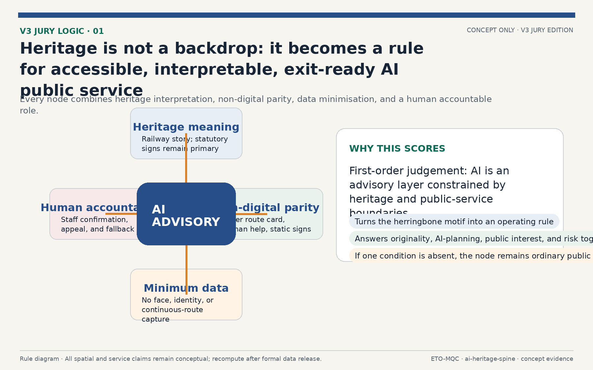
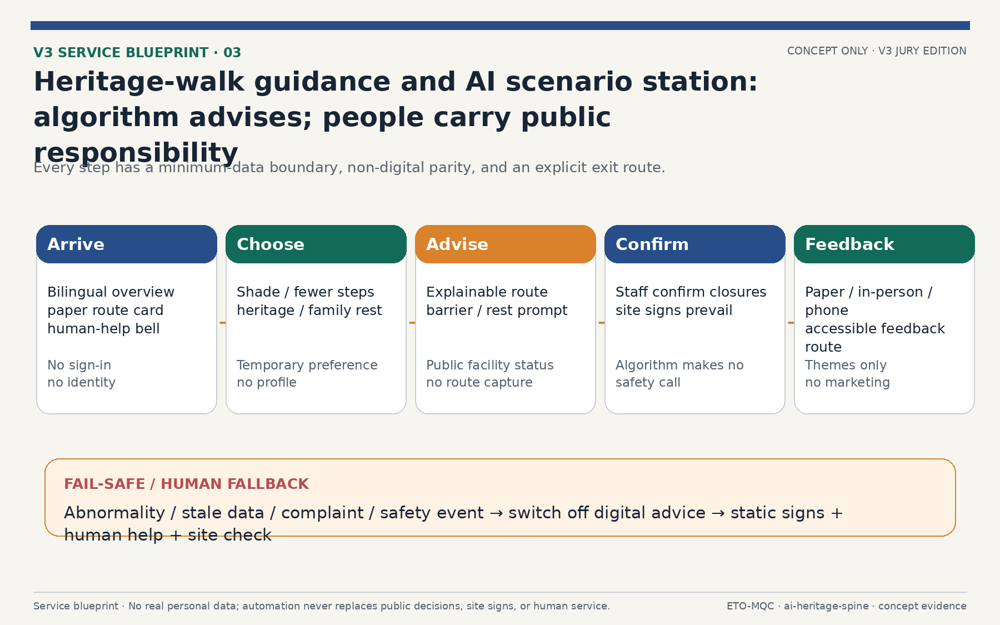
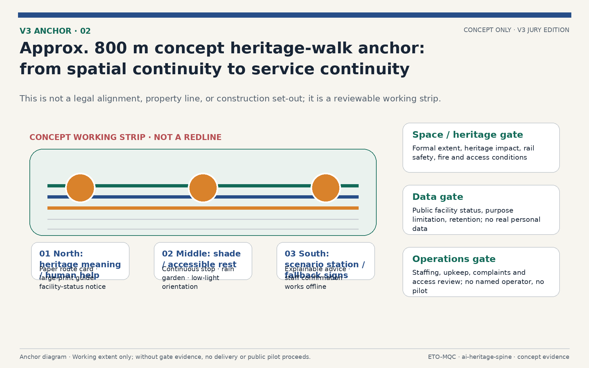
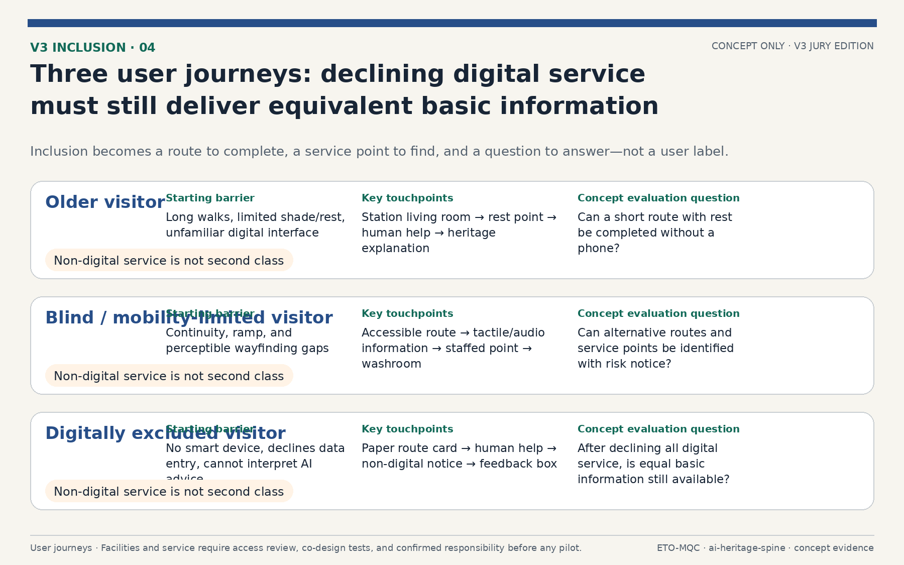
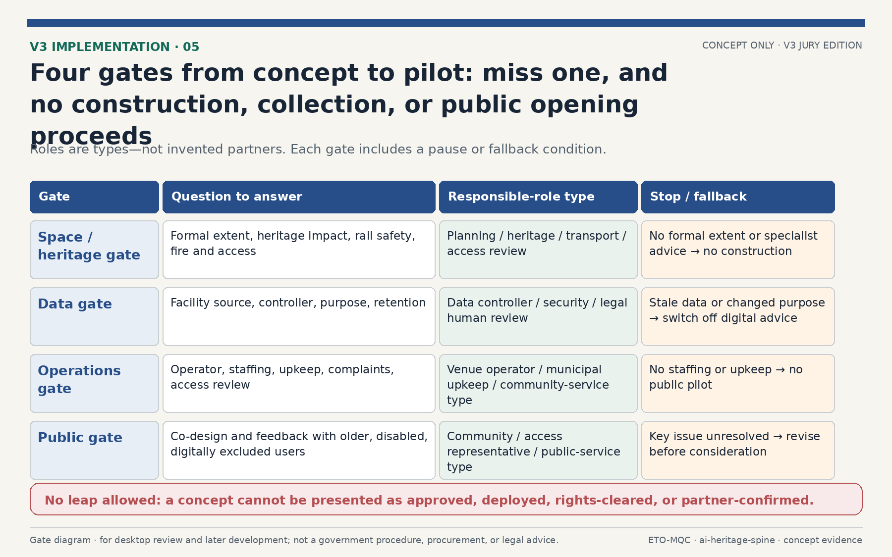
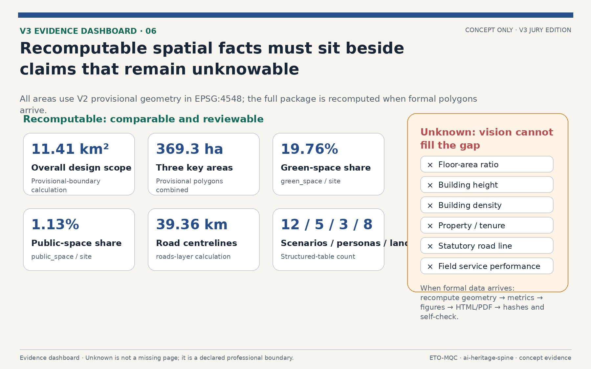

# Smart Rail, New Pulse: The Jing-Zhang Ren-Line Century AI Innovation Belt Overall Urban Design

## Design Basis and Source List

This formal proposal takes the Beijing Municipal Planning and Natural Resources Commission Haidian Branch prequalification announcement for the Century Jing-Zhang AI Innovation Belt International Urban Design Solicitation as its primary basis, and uses the provisional boundary, key areas, enums, metrics, and source registry maintained in `brief/site-package/` as machine-readable evidence [source:OFFICIAL-ANNOUNCEMENT] [source:AGENT-TASKBOOK]. The AI agent read `design_brief.json`, `allowed_design_space.json`, `sources.json`, `enums/`, `ranges/`, `schemas/`, `data/source_registry.json`, and `data/processed/agent_fact_pack.md`, then used `project_scope_summary.csv`, `agent_task_requirements.csv`, `source_use_matrix.csv`, and `missing_data_checklist.csv` to build task, scope, usage, and gap lists [source:PROCESSED-FACT-PACK].

Usage boundaries follow `data/source_registry.json` [source:SOURCE-REGISTRY]: the agent must not upgrade background-only or provisional-only materials into official boundary, statutory control plan, scoring basis, or government implementation commitments. The provisional boundary and three key-area polygons come from `brief/site-package/geometry/provisional_boundaries.geojson` and are used for generation, self-check, and visualization only [source:BOUNDARY-SOURCE] [source:KEY-AREA-SOURCE] [depth:risk_missing_data]. This proposal is not a standalone vision document; every spatial conclusion returns to a GeoJSON layer, every performance conclusion returns to a metrics table, and professional judgment returns to the standard matrix and design depth matrix [standard:PROJECT-OFFICIAL-ANNOUNCEMENT] [standard:PROJECT-AGENT-OPEN-CALL-TASKBOOK].

The evaluable status of this generation is: provisional boundary, with precision warnings retained and recalculation required after official data release; this does not block content scoring. Spatial boundaries trace back to the site boundary layer and area metrics [data:geometry/site_boundary.geojson#SITE-001] [metric:site_area_sqm], and the three key areas are cross-checked by their own layers and count metric [data:geometry/key_areas.geojson#PROV-KEY-001] [metric:key_area_count].

## Three-Level Scope Framework

The scheme organizes work in three levels defined by the announcement [standard:PROJECT-OFFICIAL-ANNOUNCEMENT]: the coordinated research area covers about 43.6 km2 for AI industry ecosystem, strategy, innovation chains, and future city form; the overall design area covers about 11.4 km2 around the Jing-Zhang Heritage Park for urban renewal framework, industrial space layout, transport and municipal support, and urban character control [metric:site_area_sqm]; the key areas cover about 369 ha for three detailed design districts, requiring functional uses, building scale, retain-renovate-demolish classification, public space connectivity, and transport organization [metric:key_detailed_design_area_sqm]. The three levels are mapped item by item in `compliance_matrix.json` so every mandatory task under announcement items 1.3, 1.4, 1.5 and agent.1-agent.6 has section, layer, metric, drawing, and HTML evidence [depth:three_level_scope_framework].

| Level | Design question | Proposal answer | Data anchor |
| --- | --- | --- | --- |
| Coordinated research | How to organize AI ecosystem and future city form | Innovation chain from universities to open source to enterprises to public experience to global outreach, with the Ren-Line spatial motif | compliance_matrix.json, standard_matrix.json |
| Overall design | How to map industry, renewal, transport, and character | Land use, buildings, roads, green space, public space, and phasing layers | [data:geometry/land_use.geojson#LU-0701-0], [data:geometry/roads.geojson#ROAD-001] |
| Key areas | How to reach detailed design depth | Positioning, spatial actions, AI scenarios, and implementation dependencies per district | [data:geometry/key_areas.geojson#PROV-KEY-001], [data:geometry/key_areas.geojson#PROV-KEY-002], [data:geometry/key_areas.geojson#PROV-KEY-003] |

The three levels are not disconnected drawing sets. Coordinated research shapes industry chain and city form judgment, overall design lands that judgment into renewal projects, spatial structure, and facility capacity, and detailed design verifies implementability at plot, building, transport, public space, and AI scenario scale. The agent fixed the provisional boundary and constraints before generating land use, buildings, roads, green space, public space, phasing, and AI service nodes, then recalculated metrics and flagged which conclusions remain limited by the provisional boundary [data:geometry/site_boundary.geojson#SITE-001].

## Coordinated Research Area: Industry and Future City Research

The coordinated research area, roughly 43.6 km2, is the first design level, focused on industry and future city research [standard:PROJECT-OFFICIAL-ANNOUNCEMENT] [depth:three_level_scope_framework]. Industry research answers how Haidian AI industry should organize its innovation chain and how the world-class AI innovation ecosystem required by the agent open call should land; future city research asks how AI will change work, life, social interaction, learning, transport, and public services. The proposal organizes an innovation chain of university ideation, open-source collaboration, enterprise transformation, public experience, and global outreach, and overlaps it with the Ren-Line spatial structure: the spine carries ideation and showcase functions, the wings carry technology services (west) and scenario enablement (east), and the three key areas carry indigenous innovation, talent origin, and AI-native industries [source:AGENT-TASKBOOK] [depth:overall_spatial_structure].

The world-class AI innovation ecosystem maps to differentiated positioning across the three key areas and innovation service facilities along the belt: Zhongzhi Park hosts full-stack indigenous innovation plus governance discourse, AI Origin Community hosts ecosystem and talent origin, and Dazhongsi hosts AI-native industries plus international outreach [data:geometry/key_areas.geojson#PROV-KEY-001] [data:geometry/key_areas.geojson#PROV-KEY-002] [data:geometry/key_areas.geojson#PROV-KEY-003]. The three districts total about 369 ha [metric:key_detailed_design_area_sqm], served by 8 AI scenario stops and 12 AI scenario cards [metric:scenario_card_count], validated against five user personas [metric:persona_count] and anchored in public space, green space, and road layers [data:geometry/public_space.geojson#PUBLIC-NODE-1] [data:geometry/green_space.geojson#GREEN-G_SPINE-0] [data:geometry/roads.geojson#ROAD-001]. Statements about global AI activities, developer communities, open scenarios, or pilgrimage routes are marked as conceptual proposals or reference options for professional teams, not as confirmed government activities or implementation arrangements [depth:existing_conditions_diagnosis] [depth:risk_missing_data].

The concept identity is **Jingzhang Herringbone Line · Living Intelligence Spine**. Reviewable logo, bilingual wordmark, colour, wayfinding, pass, digital-platform, and annual-event prototypes are supplied under `assets/identity/`. The mark uses the Jing-Zhang railway herringbone as its geometry: Rail Blue carries the engineering heritage, Spine Green the continuous civic ecology, Signal Orange the visible AI-service interface, and Node Red the AI public node that requires human confirmation. It is not a government emblem, registered trademark, or authorized partner brand; any public implementation requires trademark search, wayfinding approval, and rights clearance [depth:height_massing_character] [depth:risk_missing_data].

| Identity element | Deliverable and rule | Use boundary |
| --- | --- | --- |
| Mark and wordmark | `logo-lockup.svg/png`; the bilingual lockup reads “京张人字线 · 智脉共生带 / Jingzhang Herringbone Line · Living Intelligence Spine.” | Concept asset only; it does not confer official identity or trademark rights. |
| Palette | Rail Blue `#274E88`, Spine Green `#126A58`, Signal Orange `#D9822B`, Node Red `#BE3A34`, Warm Paper `#F7F5EF`. | Keep high contrast in wayfinding, furniture, pages, and event material; never encode safety information by colour alone. |
| Wayfinding and access | Bilingual AI Scenario Station prototype includes human assistance, accessibility, and real-time information. | Requires transport, accessibility, and advertising approval before deployment. |
| Digital and event applications | Spine Pass, scenario-opening platform, and annual AI week visual prototypes. | No individual-route collection; event names, partner marks, and data interfaces require separate authorization. |

The six global cases below are mechanism references, not confirmed partnerships, endorsements, or rights grants. The Toronto, Seoul, and Singapore cases are registered in `sources.json` and `report/narrative.md` with publisher, linked source, date information, transferable mechanism, and use boundary [source:CASE-QUAYSIDE] [source:CASE-DMC] [source:CASE-PDD].

London, Qianhai, and Shibuya are likewise verifiable mechanism comparisons. The submission does not reproduce their photographs, logos, drawings, dashboards, or copyright-protected text [source:CASE-KQ] [source:CASE-QIANHAI] [source:CASE-SHIBUYA].

| Case | Publisher, source, and date | Transferable mechanism | Licence and applicability boundary |
| --- | --- | --- | --- |
| Toronto Quayside | Waterfront Toronto project page; verified 2026-08-12. | Coordination among public-realm delivery, competitive development partner, and walkable waterfront. | Linked and originally summarized only; no renderings, logos, or data used. |
| Seoul Smart City & Digitization | Seoul Metropolitan Government, *Smart City & Digitization Master Plan (2021–2025)*; verified 2026-08-12. | Public-benefit, inclusion, cyber-safety, and participation principles. | Not a replication of DMC; Seoul retains copyright and no visual material is used. |
| Punggol Digital District | JTC Corporation; webpage updated 2026-01-14. | Industry-academia proximity, community integration, district operating-data platform, and low-carbon mobility. | Mechanism comparison only; no JTC plan or photography redistributed. |
| London Knowledge Quarter | University College London; 2024–2025 dashboard materials. | Multi-institution network plus explainable research and industry performance dashboards. | UCL/Elsevier require attribution for findings; no data or screenshots redistributed. |
| Qianhai Shenzhen-Hong Kong Cooperation Zone | Shenzhen Municipal Commerce Bureau; 2024-08-08. | Cross-regional institutional, transport, and ecological interface coordination. | Page prohibits republication without written authorization; no claim of Qianhai partnership. |
| Tokyo Shibuya Stream | Tokyo Convention & Visitors Bureau; 2025-12-11. | Former-railway redevelopment linked with river promenade, squares, and mixed-use facilities. | Page images carry copyright; no images, marks, or drawings reproduced. |

Applicability is this proposal's original interpretation of mechanisms. It requires revalidation against Haidian's official boundaries, regulations, property rights, public engagement, and professional advice [depth:existing_conditions_diagnosis] [depth:risk_missing_data].

### V3 Jury First-Read Rule: Four-Part Heritage–Service–Governance Transformation

V3 translates the Jing-Zhang Ren-Line from a visual motif into a reviewable public-service rule. Every place described as an AI public-service node must jointly provide **heritage meaning, non-digital parity, minimum data, and human accountability**. Heritage meaning takes priority over decorative technology; paper guides, static signs, and human assistance keep basic information available to visitors who do not use digital tools; any digital function handles only non-personal input necessary for its purpose; and site staff, professional responsibility, and statutory signs prevail over algorithmic advice. If any one condition is absent, the place remains ordinary public space and must not be packaged as a deployed smart scenario.

The V3 primary scenario is a low-risk conceptual prototype for heritage-walk guidance and an AI scenario station—not autonomous driving, public surveillance, or a real-data system. Visitors may use a paper card, bilingual signs, human assistance, or an optional digital interface to select guidance preferences such as fewer steps, shade, heritage interpretation, or family rest. Digital advice may only read human-verified public-facility status; it must not collect face data, identity, or continuous personal routes. Staff and site signs make final calls on temporary closure, safety messages, and route opening. Stale data, anomalous complaints, or safety incidents require digital advice to switch off and fall back to static signs, human assistance, and site checks. This scenario defines service and governance boundaries only; it makes no claim of accuracy, response time, real collection capability, or approved deployment [depth:risk_missing_data].

## Overall Design Area: Urban Renewal and Regulatory-Plan-Level Urban Design

The overall design area must reach regulatory-plan-level urban design depth [standard:MOHURD-CONTROL-DETAILED-PLANNING]. The proposal presents an urban renewal spatial framework, low-efficiency space identification, a renewal project list, implementation policy recommendations, industrial function ratios, spatial organization patterns, total building scale, and carrying capacity assessment. `geometry/land_use.geojson` fully and gaplessly covers the design boundary [data:geometry/land_use.geojson#LU-0701-0] [depth:land_use_layout]; `geometry/buildings.geojson` expresses 104 conceptual building footprints [data:geometry/buildings.geojson#BLDG-001] [metric:building_footprint_area_sqm]; `geometry/roads.geojson` expresses micro-circulation, slow-traffic, and rail transfer relations [data:geometry/roads.geojson#ROAD-001] [metric:road_centerline_length_m]; and `metrics.json` recalculates core areas and ratios [depth:metrics_recalculation].

Regulatory-plan content is decomposed into reviewable objects: land use structure, building footprints, transport organization, green and public space ratios, phasing scope, and AI scenario nodes. Content touching building height, development intensity, road red lines, setbacks, and facility standards is written as pending confirmation by official regulatory conditions where no official control data exists, and agent-guessed values are never presented as approved indicators [metric:building_height_m] [metric:building_density]; related depth items are [depth:development_intensity_controls] and [depth:height_massing_character]. The overall design must support transport, rail, municipal, and supporting facilities: rail-station integrated development, road micro-circulation, non-motorized parking, parking supply, innovation service platforms, talent and life services, new infrastructure, distributed energy, and edge computing are proposed as spatial layouts and implementation paths [depth:municipal_new_infrastructure] [depth:traffic_rail_slow_parking], while `geometry/phasing.geojson` expresses the three-phase implementation scope [data:geometry/phasing.geojson#PHASE-001] [metric:phasing_area_sqm] [depth:phasing_implementation].

## AI Innovation Ecosystem, Personas, and AI+ Scenarios

The AI innovation ecosystem organizes space and facilities around full-stack indigenous innovation, a world-class ecosystem, and scenario enablement. Five user personas (open-source developers, startups, enterprise visitors, surrounding residents, and university students) are translated into locatable spatial responses. AI+ scenarios are placed along the spine and wings in two categories: industry-development scenarios and AI-empowered urban-function scenarios [standard:PROJECT-AGENT-OPEN-CALL-TASKBOOK] [depth:overall_spatial_structure]. Personas and scenario cards are listed below, each anchored in public space, green space, and road layers [data:geometry/public_space.geojson#PUBLIC-NODE-1] [data:geometry/green_space.geojson#GREEN-G_SPINE-0] [data:geometry/roads.geojson#ROAD-001]; counts are checked by the scenario card and persona indicators [metric:scenario_card_count] [metric:persona_count].

The three AI industry test scenarios below are **conceptual pilot cards**, not connected data systems, approved road tests, or government commitments. Their thresholds are suggested pilot evaluation targets. Before activation, responsible authorities, operators, and data subjects must confirm lawful basis, information security, accessibility, and human-review procedures [depth:existing_conditions_diagnosis] [depth:risk_missing_data].

| Test scenario | Data inputs and minimization boundary | TRL / test metric | Spatial component | Suggested operator | Exit condition and human fallback |
| --- | --- | --- | --- | --- | --- |
| Automated active-travel navigation | Authorized high-definition map, anonymized flow and traffic conditions; no identifiable face or continuous individual-route data. | TRL 6; navigation-advice accuracy target ≥95%, end-to-end prompt latency target ≤200 ms. | Jing-Zhang Heritage Park active-travel spine; conceptual service extent about 8 km. | Scenario operator, transport coordinating party, and accessibility representatives. | Pause automated prompts after failed target, abnormal complaints, or safety incident; revert to static wayfinding, human assistance, and on-site patrols. |
| AI public-space maintenance | Facility-state sensors, de-identified/cropped inspection images, and human maintenance tickets; no resident profiling. | TRL 5; fault-detection target ≥90%, maintenance-response target ≤30 min. | Qinghe waterfront park, station plazas, and AI scenario stations. | Parks team, municipal maintenance team, and site operator. | Shrink deployment when cost exceeds budget, false positives become unacceptable, or maintenance burden is high; manual inspection remains the primary process. |
| Data-compliance circulation sandbox | De-identified training samples, authorization register, and tamper-evident audit log; no unauthorized production data. | TRL 4; zero confirmed leakage events, audit-completeness target 100%. | Zhongzhiyuan data-compliance circulation node (concept indoor/service space). | Data controller, security-governance team, and independent compliance reviewer. | Freeze processing, preserve audit records, and conduct human review if law, consent purpose, or security baseline changes; no automation substitutes legal judgment. |

| Persona | Typical needs | Spatial response | Review boundary |
| --- | --- | --- | --- |
| Open-source developers | Release, collaboration, testing, reputation | Origin community release hall, public code wall, overnight collaboration space | No personal behavior tracking; aggregate statistics only |
| Startups | Low-cost offices, compute access, product testbed | Zhongzhi Park shared test field, edge compute service points, governance consulting | Compute and data services require separate authorization |
| Enterprise visitors | Showcase, business, international reception, recruitment | Dazhongsi international roadshow lounge, transit connections, public space near anchors | Company marks and cases require rights clearance |
| Residents | Commute, leisure, community services, low-disruption renewal | Heritage Park slow-traffic loop, embedded community services, graded night lighting | No resident profiling for commercial recommendation |
| University students | Commercialization, cross-campus work, daily slow travel | Campus-park slow connections, commercialization stops, AI education experience points | Campus data and research results require authorization |

| Scenario card | Spatial carrier | Design note |
| --- | --- | --- |
| 01 Open-source release hall | AI Origin Community | Release, code contribution showcase, and small roadshows for universities, open-source communities, and startups |
| 02 Safety governance sandbox | Zhongzhi Park | Translates standard-setting, safety evaluation, and red-team testing into visitable, bookable, regulated nodes |
| 03 Edge compute stop | Overall design area | New-infrastructure prototype tied to public services and distributed energy, pending deepening |
| 04 AI slow-traffic navigation | Heritage Park vitality belt | Explainable wayfinding and low-intrusion sensing to identify gaps, congestion, and accessibility needs |
| 05 Dazhongsi international roadshow lounge | Dazhongsi | Showcase, negotiation, press, and international exchange for agents, devices, and content enterprises |
| 06 Qinghe low-carbon innovation corridor | Zhongzhi Park riverside | Combines green space, stormwater, walking and cycling with AI display as district public living room |
| 07 Near-campus commercialization street | AI Origin Community | Incubation, showcase, legal, IP, and investment services for university commercialization |
| 08 Data-elements parlor | Dazhongsi | City-service interface for data-element and digital-asset circulation under compliance and audit |
| 09 AI life-services sample street | Community-commerce junctions | AI+ healthcare, education, legal, and life services in operable small-block spaces |
| 10 Global AI event week route | Belt public space system | A walkable, shareable experience from heritage culture to open source to industry to roadshow |
| 11 Origin pilgrimage plaza | AI Origin Community | Memorial, release, and public-art landmark at the Ren-Line vertex |
| 12 Dazhongsi station-city living room | Dazhongsi front | Integrated transit, retail, exhibition, and digital-experience complex |

## Land Use, Building Scale, and Retain-Renovate-Demolish Strategy

Land use uses `geometry/land_use.geojson` as the machine-readable base map, cut on a grid into gapless parcels within the design boundary and classified by `enums/land_use_codes.json`, organizing research, commercial service, education, culture, green, and plaza functions [data:geometry/land_use.geojson#LU-0701-0] [data:geometry/land_use.geojson#LU-0802-0] [data:geometry/land_use.geojson#LU-05-0]; layout depth is covered by [depth:land_use_layout]. Building scale is expressed as 104 conceptual building footprints totaling about 869,111 m2 [data:geometry/buildings.geojson#BLDG-001] [metric:building_footprint_area_sqm], following `enums/building_types.json`. Because floor area ratio, total floor area, building height, and density lack official regulatory data, the proposal does not compile formal building scale indicators from guessed values [metric:floor_area_ratio] [metric:building_height_m] [metric:building_density]; related depth items are [depth:development_intensity_controls] and [depth:height_massing_character].

The retain-renovate-demolish strategy follows a retain-first, low-disruption renewal principle [depth:retain_renovate_demolish]: the Heritage Park, Qinghe riverside green space, railway heritage, and historical remains are retained first [data:geometry/constraints.geojson#CONSTRAINT-HERITAGE] [data:geometry/constraints.geojson#CONSTRAINT-WATER-QH] [data:geometry/green_space.geojson#GREEN-G_QH-0]; the building footprint layer expresses an indicative retain/renovate/demolish classification, with actual action subject to property rights and implementation conditions [data:geometry/buildings.geojson#BLDG-001] [depth:risk_missing_data]. The renewal project list and phasing are covered in their own sections, and all land and building-scale conclusions return to `metrics.json` so recalculation stays traceable [depth:metrics_recalculation].

## Transport, Rail, Municipal Infrastructure, and Public Services

Transport follows a rail-first, slow-traffic-first, hierarchical network principle: rail stations form TOD nodes with seamless transfer among rail, bus, walking, and cycling; roads are layered into arterials, collectors, local roads, and slow-traffic-priority routes, with emphasis on closing the east-west slow-traffic gaps across the Heritage Park spine [data:geometry/roads.geojson#ROAD-001] [data:geometry/roads.geojson#ROAD-006] [metric:road_centerline_length_m]; depth is covered by [depth:traffic_rail_slow_parking]. The three key areas organize station-city integration around Dazhongsi station, the Origin Community station, and the park hub respectively [data:geometry/key_areas.geojson#PROV-KEY-003] [data:geometry/key_areas.geojson#PROV-KEY-002] [data:geometry/key_areas.geojson#PROV-KEY-001]. The slow-traffic system runs along the spine and wings, linking 8 AI scenario stops and three pilgrimage landmarks [data:geometry/green_space.geojson#GREEN-G_SPINE-0] [metric:scenario_card_count].

Municipal and public services are arranged in two levels under TOD priority: district facilities concentrate around stations, and community facilities embed into residential and industrial clusters [depth:municipal_new_infrastructure]. New infrastructure (edge compute, smart poles, smart sanitation, energy, and reclaimed water) is proposed as prototypes to be deepened with municipal, power, and telecom special plans. Rail alignments, stations, and high-voltage corridors follow the constraint layer; the proposal does not change existing rail red lines or municipal corridors [data:geometry/constraints.geojson#CONSTRAINT-RAIL-13] [data:geometry/constraints.geojson#CONSTRAINT-RAIL-HSR] [data:geometry/constraints.geojson#CONSTRAINT-WATER-XYH]. All transport and municipal conclusions derive from the provisional boundary and public data and await official data confirmation [depth:risk_missing_data].

## Blue-Green Network, Public Space, and Urban Character

The blue-green network takes the Heritage Park as the north-south spine, linking Qinghe and Xiaoyue River waterfronts and parkland into a one-spine-two-wings, interwoven open-space skeleton [data:geometry/green_space.geojson#GREEN-G_SPINE-0] [data:geometry/green_space.geojson#GREEN-G_QH-0] [data:geometry/green_space.geojson#GREEN-G_XYH-0]; the green ratio is checked by [metric:green_ratio]. Public space follows a node-axis-venue structure: station plazas, AI scenario stops, and pilgrimage landmarks form activity nodes; the spine slow-traffic system forms the axis; parks and plazas form open venues [data:geometry/public_space.geojson#PUBLIC-NODE-1] [data:geometry/public_space.geojson#PUBLIC-NODE-2] [data:geometry/public_space.geojson#PUBLIC-NODE-3]; the public-space ratio is checked by [metric:public_space_ratio], with depth in [depth:blue_green_public_space]. Public space emphasizes accessibility, continuity, barrier-freedom, and all-age friendliness, connected by slow-traffic paths.

| Public-space component library | Core provision | Data and operation boundary |
| --- | --- | --- |
| AI Scenario Station | Bilingual wayfinding, bookable test bench, human assistance, accessible seating, paper guide, and low-power information screen. | Real-time information is optional; paper, static signs, and human assistance preserve basic service offline. |
| Heritage active-travel corridor | Railway-remnant viewing band, continuous shade, cycle stop, low-level night guidance, and rain garden. | It does not alter heritage or rail-safety boundaries; lighting and sensors require heritage, transport, and electrical review. |
| Station-front shared living room | Canopy, waiting seats, accessible ramp, movable exhibition stand, and child/carer facilities. | Fire safety, passenger flow, accessibility, and advertising permits are prerequisites. |
| Community micro-renewal pocket | Rest, exercise, family, community notice, and non-digital service point. | Community co-creation determines content; no resident profile is used for marketing or automated decisions. |

| Landmark catalogue | Location and form | Recognition and display system |
| --- | --- | --- |
| AI Origin Plaza | Herringbone-vertex public plaza in the Beijing AI Origin Community; release, public art, and remembrance. | Renewable displays for open-source contribution, public service, and accessible co-creation; recognition requires transparent rules and external review. |
| Jingzhang Intelligence Spine Bridge/Walk | Lightweight crossing and lookout on the heritage spine (concept). | Explains railway history, repair process, and open-data method; does not replace statutory heritage interpretation. |
| Dazhongsi Station-City Living Room | Transfer, exhibition, and digital-experience node at Dazhongsi station front. | Names, logos, work, and personal data require authorization before showing enterprise or university results. |

The heritage-resource system follows six steps: identify, grade, protect, adaptively activate, interpret, and monitor. Official heritage listings, railway remnants, mature trees, water, and oral-history material first require inventory and property-right verification; protection grade and sensitivity then determine no-touch, low-impact renewal, and interpretable-use interfaces. Rail Blue, Spine Green, Signal Orange, and Node Red form bilingual wayfinding without covering statutory heritage signs. “See the rails, remember the history, feel the future” is a conceptual international-communication line whose content must be archival-verified, translation-reviewed, and rights-cleared before publication. This framework does not replace legal heritage recognition or protection requirements [data:geometry/constraints.geojson#CONSTRAINT-HERITAGE] [depth:risk_missing_data].

Urban character is themed as century-old Jing-Zhang coexisting with the AI future: heritage park and railway imagery are retained, innovation buildings are encouraged to adopt the Ren-Line roof and railway-motif language, and height and setback controls near rail, water, and heritage interfaces are managed to create a place where rails remain visible, history is remembered, and the future can be felt [depth:height_massing_character] [depth:overall_spatial_structure]. Character controls (color, material, roof form, signage, nightscape) are proposed as design guidance to be deepened under formal urban design and regulatory conditions; at heritage-protection locations the proposal only expresses retain-and-revitalize intention without altering protection requirements [data:geometry/constraints.geojson#CONSTRAINT-HERITAGE] [depth:risk_missing_data].

### V3 Concept Heritage-Walk Anchor and User Journeys

To make the overall strategy independently reviewable, V3 selects an **approximately 800 m conceptual working strip** from the spine rather than adding a statutory alignment, property line, or construction set-out. North heritage interpretation/human help, middle shade/accessible rest, and south scenario station/fallback signs demonstrate a minimum space–service–governance loop. The working strip can only move to further professional analysis after space/heritage, data, operations, and public conditions have been reviewed; if any condition is absent, only paper guidance and human-service recommendations remain [data:geometry/green_space.geojson#GREEN-G_SPINE-0] [depth:blue_green_public_space].

Inclusion does not stop at abstract user labels; it is tested through a service journey that can be completed. An older visitor should obtain a large-print route, seating, and human guidance without a phone. A blind or mobility-limited visitor should be able to identify a continuous accessible route, alternatives, and risk notices. A digitally excluded visitor who declines all data entry should still receive basic information that is no worse than the information available to a digital user. These are design assumptions awaiting co-design and professional accessibility review; they do not replace field tests or statutory facility acceptance [depth:blue_green_public_space].

## Renewal Projects, Implementation Policy, and Phasing

The renewal project list carries 8 projects covering the three key areas and spine nodes, including Zhongzhi industrial upgrading, Origin Community stitching renewal, Dazhongsi station-city integration, Heritage Park connection, Qinghe waterfront renewal, Xiaoyue River scenario nodes, spine slow-traffic connection, and community service gap-filling [metric:renewal_project_count] [depth:renewal_project_list]. Each project states its renewal goal, scope, functional mix, and implementation dependencies, mapped to `geometry/phasing.geojson` phases [data:geometry/phasing.geojson#PHASE-001] [data:geometry/phasing.geojson#PHASE-002] [data:geometry/phasing.geojson#PHASE-003]; phasing area is checked by [metric:phasing_area_sqm], with depth in [depth:phasing_implementation].

Implementation policy centers on balancing retain/renovate/demolish, multi-stakeholder coordination, and phased rolling implementation: land and property rights suggestions, renewal organization models, investment and industry access suggestions, phasing sequence, and monitoring and evaluation mechanisms are proposed. The plan proceeds in three phases: near-term focuses on station surroundings and completed park segments, mid-term advances spine connection and key-area renewal, and long-term completes the wings and overall character [data:geometry/phasing.geojson#PHASE-001] [metric:phasing_area_sqm]. Policy and phasing suggestions derive from public data and do not constitute government implementation commitments; official views prevail [depth:risk_missing_data].

The annual activity, developer community, and brand assets follow a proposed public-issue-first, auditable-open, rights-clear, and exit-capable operating model; this is not a pre-set government event plan.

| Operating module | Annual cadence and output | Open and governance condition | Attraction and conversion path |
| --- | --- | --- | --- |
| Living Intelligence Week (concept) | Once yearly: results release, public experience, accessible co-creation day, and international communication kit. | Open-call rules, accessibility plan, event safety plan, and authorization for partner names and logos. | From university/community issue call to scenario showcase to compliant pilot matching; no subsidy or tenancy is promised. |
| Developer community | Monthly technical exchange, quarterly open-source maintenance day, and annual public-problem challenge. | Open-source licence, IP ownership, code of conduct, and youth protection; personal data are minimized. | Reusable tools, open-source contributions, and problem validation form portfolios; authorized entities may then connect incubation, training, or procurement. |
| Open scenario operation | Five steps: submit, risk-screen, small sandbox, independent review, expand or exit. | Data classification, purpose limitation, human review, public complaint channel, cyber security, and procurement/approval prerequisites. | Only prototypes that pass safety, public-interest, and feasibility review proceed to further professional analysis. |
| Brand-asset governance | Quarterly asset inventory; annual use audit and accessibility check; common logo, palette, tone, and source acknowledgement. | Asset owner, licence period, translation responsibility, partner scope, and withdrawal mechanism are registered. | Authorized partners may use the concept identity within a clear scope; no derivative registration, commercial endorsement, or data marketing without written authorization. |

### V3 Decision Gates: Pausable, Reviewable, Exit-Ready

V3 does not frame phasing as a linear delivery promise. It uses four gates and a three-stage recommendation. The space/heritage gate requires formal extent, heritage impact, rail safety, fire, and accessibility conditions. The data gate requires a public-facility source, purpose limitation, control responsibility, and retention period. The operations gate requires staffing, upkeep, complaint response, and access review. The public gate requires review with older, disabled, and digitally excluded users. Responsibilities are expressed as types—planning/heritage/transport/access review, data-control and security review, or venue operation and community service—rather than invented confirmed partners. Without evidence at any gate, the proposal must not proceed to construction, real-data collection, or public piloting; it pauses, restores paper and human service, or returns for evidence completion [depth:phasing_implementation] [depth:risk_missing_data].

## Metrics, Area Recalculation, and Compliance Matrix

The metrics system is output by `metrics.json` and verified by graphics, with 17 metrics all recalculated from geometry layers in EPSG:4548, guaranteeing consistency among metrics, layers, drawings, HTML, the booklet, and the boards [depth:metrics_recalculation]:

| Metric | Value | Source layer / note |
| --- | --- | --- |
| site_area_sqm | 11,412,825 | [data:geometry/site_boundary.geojson#SITE-001], provisional boundary |
| key_detailed_design_area_sqm | 3,692,893 | [data:geometry/key_areas.geojson#PROV-KEY-001] plus two other districts |
| key_area_count | 3 | [data:geometry/key_areas.geojson#PROV-KEY-001] |
| green_ratio | 19.76% | [data:geometry/green_space.geojson#GREEN-G_SPINE-0] |
| public_space_ratio | 1.13% | [data:geometry/public_space.geojson#PUBLIC-NODE-1] |
| building_footprint_area_sqm | 869,111 | [data:geometry/buildings.geojson#BLDG-001] |
| road_centerline_length_m | 39,357 | [data:geometry/roads.geojson#ROAD-001] |
| phasing_area_sqm | 4,246,442 | [data:geometry/phasing.geojson#PHASE-001] |
| scenario / persona / landmark / renewal counts | 12 / 5 / 3 / 8 | structured tables |

Area recalculation follows a provisional-boundary-first, official-data-priority-calibration principle: all areas are computed from the provisional boundary polygon in EPSG:4548 with precision warnings retained, and after official boundary and key-area polygons are published the whole package must be recomputed rather than editing single numbers [source:BOUNDARY-SOURCE] [depth:metrics_recalculation] [metric:site_area_sqm]. Floor area ratio, height, and density are marked unknown without official data and are not used for formal scale commitments [metric:floor_area_ratio] [metric:building_height_m] [metric:building_density].

Compliance mapping is kept in `compliance_matrix.json`, mapping every requirement under announcement items 1.3.1-1.5.3 and agent.1-agent.6 to section, layer, metric, drawing, and HTML evidence [standard:PROJECT-OFFICIAL-ANNOUNCEMENT] [standard:MOHURD-URBAN-DESIGN-MEASURES] [standard:MOHURD-CONTROL-DETAILED-PLANNING]; professional standards and depth regulation are [standard:MNR-LAND-USE-CLASSIFICATION-GUIDE] [standard:MOHURD-ARCH-DESIGN-DEPTH-2016], with recalculation and data gaps covered by [depth:metrics_recalculation] [depth:risk_missing_data]. Design depth is recorded in `design_depth_matrix.json` across spatial and functional depth items including diagnosis, three-level framework, and overall structure [depth:existing_conditions_diagnosis] [depth:three_level_scope_framework] [depth:overall_spatial_structure]; land use is [depth:land_use_layout]; intensity and massing are [depth:development_intensity_controls] [depth:height_massing_character], retain/renovate/demolish and blue-green public space are [depth:retain_renovate_demolish] [depth:blue_green_public_space], plus [depth:three_key_area_detailed_design], and across implementation and mechanism items including transport, municipal, and renewal projects [depth:traffic_rail_slow_parking] [depth:municipal_new_infrastructure] [depth:renewal_project_list]; phasing is [depth:phasing_implementation], and data gaps are covered in the risks section [depth:risk_missing_data].

### V3 First-Read Booklet and Review Navigation

V3 adds a 12-page jury first-read booklet in each language: [`drawings/jury-booklet.pdf`](drawings/jury-booklet.pdf) and [`drawings/jury-booklet.en.pdf`](drawings/jury-booklet.en.pdf). The first-read booklets do not replace the existing A0 boards, A3 technical booklets, HTML, GeoJSON, metrics, or matrices. Their purpose is to sequence the core judgement, transformation rule, minimum anchor, service blueprint, user journeys, implementation gates, metric boundary, and next steps so an independent reader can trace each type of claim. All booklet graphics are generated offline from package geometry, metrics, original conceptual graphics, and registered identity assets. They load no online basemap, map tile, third-party photograph, enterprise mark, or audiovisual material.

Recomputable site area, key-area area, green share, public-space share, road length, and structured counts remain grounded solely in V2 `metrics.json` and EPSG:4548 layers [metric:site_area_sqm]. FAR, building height, density, property/tenure, statutory road lines, and field-service performance remain `unknown` or pending verification [metric:floor_area_ratio] [metric:building_height_m] [metric:building_density]. When formal polygons, regulatory controls, tenure, specialist, or field material become available, geometry, metrics, figures, HTML/PDF, SHA-256, and all four self-check gates must be recomputed in sequence; a single number in the booklet or proposal must never be swapped in isolation.

## Risk, Copyright, and Compliance

This proposal is generated from a provisional boundary and public data and carries the following main risks: boundary risk, because the provisional boundary is not an official red line and area and spatial conclusions must be fully recalculated after official boundary release [source:BOUNDARY-SOURCE] [depth:risk_missing_data]; data risk, because statutory control conditions, property rights, existing buildings, and municipal utility data are missing, so related conclusions are flagged provisional [source:SOURCE-REGISTRY] [depth:risk_missing_data]; compliance risk, because AI-generated content and governance suggestions do not constitute legal opinions or government decisions, and content touching personal data and facial recognition follows current law; and implementation risk, because renewal projects and policy suggestions are not commitments and require confirmation by authorities and professional teams [source:AGENT-TASKBOOK] [depth:risk_missing_data].

Copyright and compliance: the proposal content, naming, and identity (Jing-Zhang Ren-Line, Smart Growth Belt) are AI-agent conceptual proposals; cited literature and public materials are attributed; trademarks, fonts, and images require rights clearance before public use; this submission is released under the COMMUNITY-DISPLAY-ONLY license for review display and does not authorize commercial use [source:SOURCE-REGISTRY]. The proposal contains no personal identity information, privacy data, or unauthorized content; all AI scenario suggestions follow data-minimization, explainability, and human-review principles. If cited materials conflict with official information, the latest official release prevails [depth:risk_missing_data].

## References

Primary references are the following: site package and fact pack [source:SITE-PACKAGE] [source:PROCESSED-FACT-PACK]; boundary and key-area sources [source:BOUNDARY-SOURCE] [source:KEY-AREA-SOURCE]; official announcement, agent taskbook, and source registry [source:OFFICIAL-ANNOUNCEMENT] [source:AGENT-TASKBOOK] [source:SOURCE-REGISTRY]:

- Public materials: solicitation announcement, design brief, site package, and data registry; full index in `sources.json` and `brief/site-package/data/source_registry.json` [source:OFFICIAL-ANNOUNCEMENT] [source:SITE-PACKAGE].
- Site data: provisional boundary, key areas, land use and building type enums, constraint layers, and source data in `geometry/` and `brief/site-package/enums/` [source:BOUNDARY-SOURCE] [source:KEY-AREA-SOURCE].
- Professional standards: urban design management measures, regulatory detailed planning, national land use classification guide, and architectural design depth regulation, in `standard_matrix.json` [standard:MOHURD-URBAN-DESIGN-MEASURES] [standard:MOHURD-CONTROL-DETAILED-PLANNING]; land use classification and design depth are [standard:MNR-LAND-USE-CLASSIFICATION-GUIDE] [standard:MOHURD-ARCH-DESIGN-DEPTH-2016].
- Generated materials: AI task requirements, fact pack, and missing-data checklist in `data/` and `assumptions.json` [source:PROCESSED-FACT-PACK].
- Metrics and compliance: area recalculation, metrics, compliance matrix, and design depth matrix in `metrics.json`, `compliance_matrix.json`, and `design_depth_matrix.json` [depth:metrics_recalculation] [depth:risk_missing_data].

## Detailed Design of Key Areas

Detailed design of key areas is mandatory [standard:PROJECT-AGENT-OPEN-CALL-TASKBOOK]. The three key districts are expressed as provisional constraints in `geometry/key_areas.geojson`, totaling about 369 ha [data:geometry/key_areas.geojson#PROV-KEY-001] [data:geometry/key_areas.geojson#PROV-KEY-002] [data:geometry/key_areas.geojson#PROV-KEY-003]; count and area are checked by [metric:key_area_count] [metric:key_detailed_design_area_sqm], and by the three-key-area detailed design depth item [depth:three_key_area_detailed_design]. The HTML page toggles among the three districts; the A3 booklet and A0 boards include overall plans, partial details, and metric notes for each district. The three districts are also summarized as follows.

| District | Positioning | Spatial actions | AI industry and operations | Evidence |
| --- | --- | --- | --- | --- |
| Zhongzhi Park | Garden-style full-stack indigenous innovation | Strengthen Qinghe waterfront, industry showcase, low-carbon innovation exchange, and external transport; open testing and standards governance on green space | Indigenous model testing, standards workshops, governance showcase, low-carbon compute experience | [data:geometry/key_areas.geojson#PROV-KEY-001] |
| AI Origin Community | Near-campus commercialization and talent community | Campus-park-block slow stitching; release, talent services, living, and open-source collaboration | Open-source community, release, talent-zone services, near-campus incubation | [data:geometry/key_areas.geojson#PROV-KEY-002] |
| Dazhongsi | Urban AI economy and international exchange | Station-city integration around Dazhongsi station, four-quadrant pedestrian connection, retail services, public environment renewal | Agents and device showcase, content consumption, data elements, international roadshow | [data:geometry/key_areas.geojson#PROV-KEY-003] |

Zhongzhi Park is positioned as a garden-style indigenous-innovation accelerator of about 192 ha [data:geometry/key_areas.geojson#PROV-KEY-001]. Spatial actions include strengthening the Qinghe low-carbon innovation corridor [data:geometry/green_space.geojson#GREEN-G_QH-0], placing indigenous model training and evaluation and governance showcase spaces, carrying open testing and standards workshops on green space, and organizing external transport and station-city connections. Uses are dominated by research land with industry services and support [data:geometry/land_use.geojson#LU-0802-0] [depth:land_use_layout]. Implementation depends on river blue lines, ecology, and flood control, requiring official regulatory and ownership data [depth:risk_missing_data].

AI Origin Community is positioned as a near-campus commercialization and talent community of about 104 ha [data:geometry/key_areas.geojson#PROV-KEY-002]. Around the Ren-Line vertex an AI origin memorial plaza is placed [data:geometry/public_space.geojson#PUBLIC-NODE-2], campus-park-block slow stitching is organized [data:geometry/roads.geojson#ROAD-001], and release, talent services, living, and open-source collaboration are added. Uses mix research, education, culture, residential, and public services [data:geometry/land_use.geojson#LU-0804-0] [data:geometry/land_use.geojson#LU-0803-0]. Implementation depends on campus boundaries, ownership, and ground-floor uses, requiring official data [depth:risk_missing_data].

Dazhongsi is positioned as an urban AI-economy and international-exchange district of about 72 ha [data:geometry/key_areas.geojson#PROV-KEY-003]. Around Dazhongsi station the proposal organizes integrated development, four-quadrant pedestrian connectivity [data:geometry/public_space.geojson#PUBLIC-NODE-3] [data:geometry/roads.geojson#ROAD-006], and agents and device showcase, content consumption, a data-elements parlor, and an international roadshow lounge. Uses are dominated by commercial services with mixed planned green space [data:geometry/land_use.geojson#LU-05-0] [data:geometry/land_use.geojson#LU-1402-0]. Implementation depends on rail station, road intersections, and municipal utilities, requiring official data [depth:risk_missing_data].

