# 智轨新脉：京张人字线 · 百年AI创新带总体城市设计

## 设计依据与资料清单

本 formal 方案以北京市规划和自然资源委员会海淀分局发布的《百年京张AI创新带城市设计国际方案征集资格预审公告》为第一依据，并以 `brief/site-package/` 中经维护者登记的临时粗略边界、重点区域、枚举、指标和来源清单为机器可读依据 [source:OFFICIAL-ANNOUNCEMENT] [source:AGENT-TASKBOOK]。AI agent 生成方案前读取了 `design_brief.json`、`allowed_design_space.json`、`sources.json`、`enums/`、`ranges/`、`schemas/`、`data/source_registry.json` 与 `data/processed/agent_fact_pack.md`，并用 `project_scope_summary.csv`、`agent_task_requirements.csv`、`source_use_matrix.csv`、`missing_data_checklist.csv` 建立任务、范围、资料用途与缺口清单 [source:PROCESSED-FACT-PACK]。

资料登记表的使用边界如下 [source:SOURCE-REGISTRY]：

- `data/source_registry.json` 登记公开、清权与临时资料的用途边界；agent 不得把 background_only 或 provisional_only 资料升级为 official boundary、法定控规、正式评分依据或政府实施承诺。
- 临时边界与三处重点区 polygon 取自 `brief/site-package/geometry/provisional_boundaries.geojson`，仅用于方案生成、自检与可视化 [source:BOUNDARY-SOURCE] [source:KEY-AREA-SOURCE]，非 official redline、审批依据或精确面积依据 [depth:risk_missing_data]。

方案不是独立愿景文本，而是从公告、面向智能体任务书和场地资料出发组织的可复核成果：空间结论落回 GeoJSON，绩效结论落回指标表，专业判断落回标准矩阵与设计深度矩阵 [standard:PROJECT-OFFICIAL-ANNOUNCEMENT] [standard:PROJECT-AGENT-OPEN-CALL-TASKBOOK]。本节只把最关键依据放在判断旁边；完整索引保存在 `sources.json`、`standard_matrix.json` 与 `design_depth_matrix.json`。

本次生成的可评分状态为：**临时边界，保留精度警示并待正式数据发布后复算；不阻断内容评分**。当官方边界和重点区 polygon 更新后，agent 必须重新运行几何生成、指标复算、自检、图纸与 HTML 生成，不能只替换单个文件。边界解释可回到总体范围图层和面积复算 [data:geometry/site_boundary.geojson#SITE-001] [metric:site_area_sqm]；三处重点区则由独立图层与数量指标核对 [data:geometry/key_areas.geojson#PROV-KEY-001] [metric:key_area_count]。

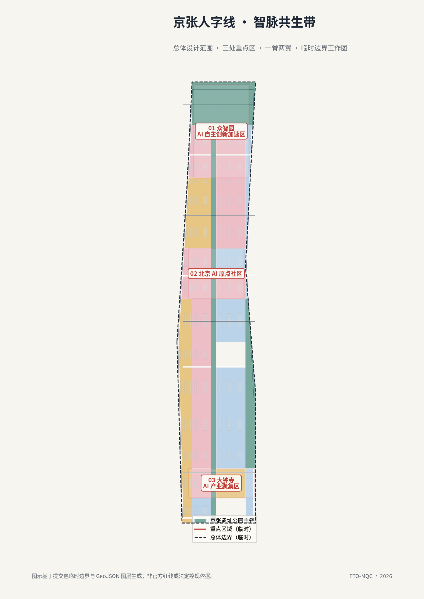

## 三层范围工作框架

方案按照公告确定的三个层次组织工作 [standard:PROJECT-OFFICIAL-ANNOUNCEMENT]：统筹研究范围关注约 43.6 平方公里的 AI 产业生态、战略定位、创新链与未来城市形态；总体设计范围关注约 11.4 平方公里的京张遗址公园周边 1–2 公里城市地区和产业区，要求形成城市更新总体框架、产业空间布局、交通市政支撑与城市风貌控制 [metric:site_area_sqm]；重点区域范围关注约 369 公顷三处详细设计地区，要求明确功能业态、建筑规模、拆改留分类、公共空间连通与交通组织 [metric:key_detailed_design_area_sqm]。三层范围在 `compliance_matrix.json` 中逐条映射，保证公告 1.3、1.4、1.5 与 agent.1–agent.6 的必选任务都有章节、图层、指标、图纸与 HTML 证据 [depth:three_level_scope_framework]。

三层工作不是互相割裂的图纸集合。统筹研究决定产业链与城市形态判断，总体设计把判断落实到更新项目、空间结构与设施承载，重点区域详细设计验证具体地块、建筑、交通、公共空间与 AI 应用场景的可实施性 [depth:overall_spatial_structure]。agent 生成方案时先锁定当前提交采用的 provisional 边界与约束，再生成用地、建筑、道路、绿地、公共空间、分期与 AI 服务节点，最后从这些图层复算指标并在正文解释哪些结论仍受 provisional boundary 限制 [data:geometry/site_boundary.geojson#SITE-001]。

| 层级 | 设计问题 | 方案回答 | 数据落点 |
| --- | --- | --- | --- |
| 统筹研究范围 | AI 产业生态与未来城市形态如何组织 | 建立“高校策源—开源协作—企业转化—公共体验—国际传播”创新链与“人字线”空间母题 | compliance_matrix.json、standard_matrix.json |
| 总体设计范围 | 产业空间、城市更新、交通市政与风貌如何落图 | 用地、建筑、道路、绿地、公共空间与分期图层共同表达 | [data:geometry/land_use.geojson#LU-0701-0]、[data:geometry/roads.geojson#ROAD-001] |
| 重点区域范围 | 三处片区如何达到详细设计深度 | 分别提出定位、空间动作、AI 场景与实施依赖 | [data:geometry/key_areas.geojson#PROV-KEY-001]、[data:geometry/key_areas.geojson#PROV-KEY-002]、[data:geometry/key_areas.geojson#PROV-KEY-003] |

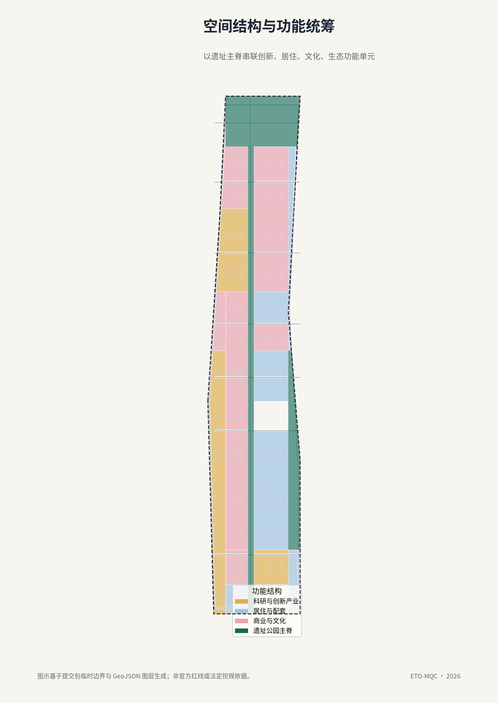

三层范围工作框架的深度项由 [depth:three_level_scope_framework] 与 [depth:overall_spatial_structure] 约束，空间证据以 [data:geometry/site_boundary.geojson#SITE-001] 与 [data:geometry/key_areas.geojson#PROV-KEY-001] 为准，任务依据以 [standard:PROJECT-OFFICIAL-ANNOUNCEMENT] 为准，范围索引以 [source:PROCESSED-FACT-PACK] 中 `project_scope_summary.csv` 的三层范围表为导航。

## 项目背景与现状诊断

京张铁路是中国自主建设的第一条干线铁路，1909 年建成通车，其“人字形”展线（青龙桥段）是詹天佑为克服八达岭坡道设计的经典工程，也被视为中国近代工程精神与自主创新精神的象征 [depth:existing_conditions_diagnosis]。2019 年京张高铁开通后，既有地上线转入遗址化，形成贯穿海淀南北的线形开放空间与更新走廊；本次征集范围以京张铁路遗址公园为纽带，联动高校、园区、企业和社区，探索面向 AI 时代的城市形态。命名提案“智轨新脉：京张人字线”即建立在这一历史原型之上：把百年前“人字形”展线转译为面向 AI 的“人字线”空间母题，既延续“自主创新、攻坚克难”的京张精神，也回应“世界级 AI 创新生态、全栈自主创新、AI+ 场景赋能”的征集任务 [standard:PROJECT-AGENT-OPEN-CALL-TASKBOOK]。

现状诊断（基于公开资料与临时边界内空间复核）：
- 海淀区是全国 AI 产业高地，集聚高校院所、头部企业、算力算法数据要素与科技服务资源；本带紧邻高校、科研机构与成熟科技园区，具备“策源—转化—应用”完整链条的基础条件 [source:SITE-PACKAGE]。
- 京张遗址公园已部分建成，是公众活动的线性公共空间，但南北贯通性、东西缝合性与周边园区、社区的步行联系仍有提升空间；跨北五环等节点存在慢行断点。
- 三处重点区（众智园、AI 原点社区、大钟寺）功能差异明显，但彼此之间及与中关村、小月河之间的创新协同回路尚未充分建立；大钟寺站等轨道枢纽的站城一体化潜力尚未充分释放。
- 本方案以临时边界栅格切分生成无缝隙用地分区、104 幢概念建筑基底与 39.4 km 道路中心线 [data:geometry/land_use.geojson#LU-0701-0] [data:geometry/buildings.geojson#BLDG-001] [data:geometry/roads.geojson#ROAD-001]；对应面积与长度指标见指标表 [metric:building_footprint_area_sqm] 与 [metric:road_centerline_length_m]，作为总体设计讨论的量化底板；现状与未来均待官方数据发布后复核。

资料缺口（公开数据缺口，不阻断内容评分）：官方精确边界 polygon、三处重点区 official polygon、法定控规条件（容积率、高度、密度、绿地率、退线与道路红线）、现状建筑权属、市政管线与文保范围均未在公开场地包中取得，相关结论一律以临时/待确认标注，并列入 `assumptions.json` 与 `missing_data_checklist.csv` [source:SOURCE-REGISTRY] [depth:risk_missing_data] [metric:floor_area_ratio]。

## 总体概念与功能统筹方案

本方案的总体概念为“**京张人字线 · 智脉共生带**”：以京张遗址公园为南北主脊，形成一条贯通全带的“AI 创新中轴”；以 AI 原点（人字顶点）为锚，向两侧展开“中关村科技服务翼”与“小月河场景赋能翼”，形成与百年前人字形展线同构的空间母题；三处重点区作为“三站”，沿主脊自北向南布局，承担自主创新、生态人才与智能原生业态三种功能；沿线布置 12 处 AI 场景驿站与三处朝圣地标，构成“一带、三站、两翼、多点”的总体结构 [source:AGENT-TASKBOOK] [depth:overall_spatial_structure]。

“一带”不是额外画出的新红线，而是把公告三层范围转译为工作方法；“三站”对应三处重点区域；“两翼”对应中关村与小月河两大创新资源；“多点”对应 AI+ 公共服务、产业服务和城市生活的可运营节点 [standard:PROJECT-OFFICIAL-ANNOUNCEMENT]。功能统筹上，全带划分为科研产业、商业服务、教育文化、公园绿地、防护绿地、广场与留白等主导类型，形成“北研—中创—南业”的功能序列，并由用地图层闭合表达 [data:geometry/land_use.geojson#LU-0701-0] [data:geometry/land_use.geojson#LU-05-0] [metric:green_ratio]。

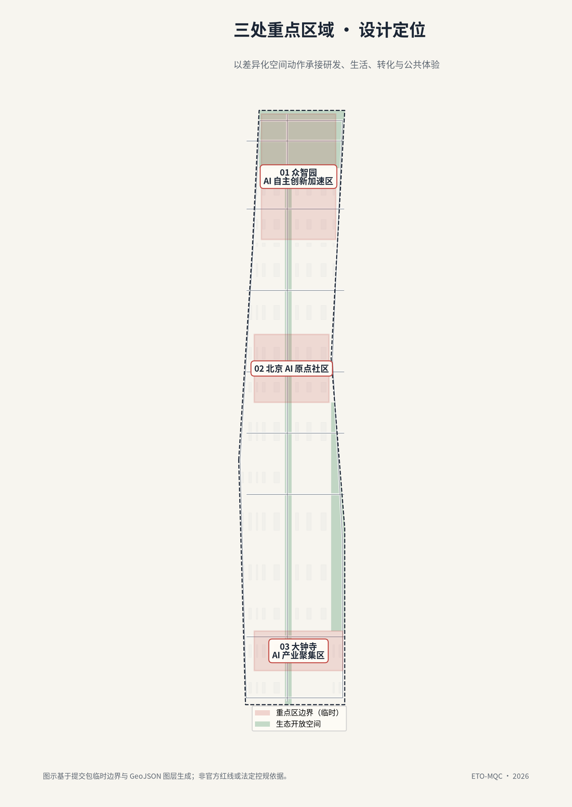

命名与视觉识别：主标识“人字线”取詹天佑展线之形，两条展翼构成稳定的“A/AI”意象，代表“自主（Autonomy）与智能（AI）”双螺旋；辅助图形以铁轨枕木与电路走线同构的连续线描表达“历史之轨—数字之脉”。该命名与 logo 为 AI agent 概念提案，商标、字体与图像须经清权后方可公开使用 [source:AGENT-TASKBOOK] [depth:risk_missing_data]。

## 统筹研究范围产业与未来城市研究

统筹研究范围是本次设计的第一层级，约 43.6 平方公里，关注产业与未来城市研究 [standard:PROJECT-OFFICIAL-ANNOUNCEMENT] [depth:three_level_scope_framework]。产业研究回答“海淀 AI 产业如何组织创新链”与“面向智能体任务书要求的世界级 AI 创新生态如何落地”两个问题，未来城市研究回答“人工智能将如何改变工作、生活、社交、学习、交通与公共服务”的命题。方案提出“高校策源—开源协作—企业转化—公共体验—国际传播”的创新链框架，并将其转化为与“人字线”空间结构叠合的产业空间布局：主脊串联策源与展示功能，两翼分别承接科技服务（西翼）与场景赋能（东翼），三处重点区承载自主创新、生态人才与智能原生业态 [source:AGENT-TASKBOOK] [depth:overall_spatial_structure]。未来城市形态研究的结论以可定位的功能区、节点、廊道与场景表达，并用 `compliance_matrix.json` 把官方任务 1.3 映射到本层证据 [standard:PROJECT-AGENT-OPEN-CALL-TASKBOOK]。

## 世界级AI创新生态体系

统筹研究范围的核心任务是构建世界级 AI 创新生态体系 [standard:PROJECT-OFFICIAL-ANNOUNCEMENT]。方案梳理海淀高校院所、头部企业、算力算法数据要素、孵化平台、上市企业、独角兽与科技服务资源，提出 AI 创新链、产业链、人才链和城市服务链的空间协同框架：“高校策源—开源协作—企业转化—公共体验—国际传播”。该框架与“人字线”空间结构叠合：主脊串联策源与展示，两翼分别承接科技服务（西翼）与场景赋能（东翼），形成可定位的创新功能区、节点、廊道与场景，而非泛泛描述技术愿景 [depth:overall_spatial_structure]。

生态体系落地为三处重点区的差异化定位与沿线创新服务设施：
- 众智园AI自主创新加速区承担“全栈自主 + 治理话语权”，配置自主模型训练评测、安全治理展示、标准共建与开源协作空间 [data:geometry/key_areas.geojson#PROV-KEY-001]。
- 北京AI原点社区承担“世界级生态 + 人才原点”，围绕人字顶点布置成果发布、人才服务、开源社区与校区园区缝合 [data:geometry/key_areas.geojson#PROV-KEY-002]。
- 大钟寺AI产业聚集区承担“智能原生新业态 + 国际交往”，布局大模型原生应用、智能终端体验、数据要素会客厅与国际路演 [data:geometry/key_areas.geojson#PROV-KEY-003]。
三处重点区合计约 369 公顷 [metric:key_detailed_design_area_sqm]，沿线设置 8 处 AI 场景驿站与 12 张 AI 场景卡 [metric:scenario_card_count]，并以 5 类用户画像 [metric:persona_count] 校验空间需求是否落到公共空间、慢行与绿地图层 [data:geometry/public_space.geojson#PUBLIC-NODE-1] [data:geometry/green_space.geojson#GREEN-G_SPINE-0] [data:geometry/roads.geojson#ROAD-001]。

未来城市形态研究应回答人工智能如何改变工作、生活、社交、学习、交通与公共服务。方案把 AI 交通系统、连续绿色空间、创新服务设施和国际化生活工作氛围落实为可定位的功能区、节点、廊道和场景，并把 AI 创新指数、人才密度、空间供给类型与 AI+ 垂直应用重点区域写入指标体系，标明哪些是官方、哪些是设计建议、哪些仍待正式数据校准。若提出全球 AI 创新活动、开发者社区、开放场景或朝圣路线，均写为“概念建议/参考方案/可供专业团队深化研究”，不写成已经确定的政府活动或实施安排 [depth:existing_conditions_diagnosis] [depth:risk_missing_data]。

品牌识别体系以“京张人字线 · 智脉共生带”为概念性核心标识；可查的 Logo、标准字、标准色与导视、通行证、数字平台、年度活动原型已形成在 `assets/identity/`，见下图。标志以京张铁路的“人”字展线作为几何骨架：轨道蓝表示历史工程基因，主脊绿表示连续公共生态空间，信号橙表示可见的智能服务接口，原点红表示需要人工确认的 AI 公共节点。它不是政府徽标、注册商标或已获授权的合作品牌；任何公共实施前仍应完成商标检索、导视审批和权利清理 [depth:height_massing_character] [depth:risk_missing_data]。

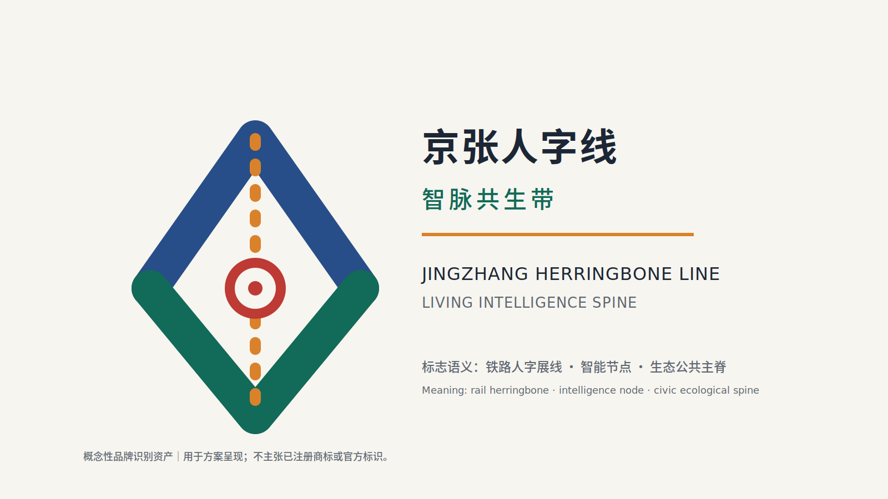

| 识别要素 | 交付物与规则 | 应用边界 |
| --- | --- | --- |
| 标志与标准字 | `logo-lockup.svg/png`；中英文锁定组合为“京张人字线 · 智脉共生带 / Jingzhang Herringbone Line · Living Intelligence Spine”。 | 仅为概念提案视觉资产，不表示官方身份或商标权。 |
| 标准色 | Rail Blue `#274E88`、Spine Green `#126A58`、Signal Orange `#D9822B`、Node Red `#BE3A34`、Warm Paper `#F7F5EF`。 | 导视、公共家具、网页与活动物料保持高对比；安全信息不得只靠色彩区分。 |
| 导视与无障碍 | 双语“AI 场景驿站”原型，保留人工咨询、无障碍、实时导览提示。 | 需符合现场交通、无障碍和广告管理要求后落地。 |
| 数字与活动应用 | “智脉通行证”、场景开放平台、年度 AI 周视觉原型。 | 不收集或利用个人轨迹；活动名称、合作品牌与数据接口须另行授权。 |

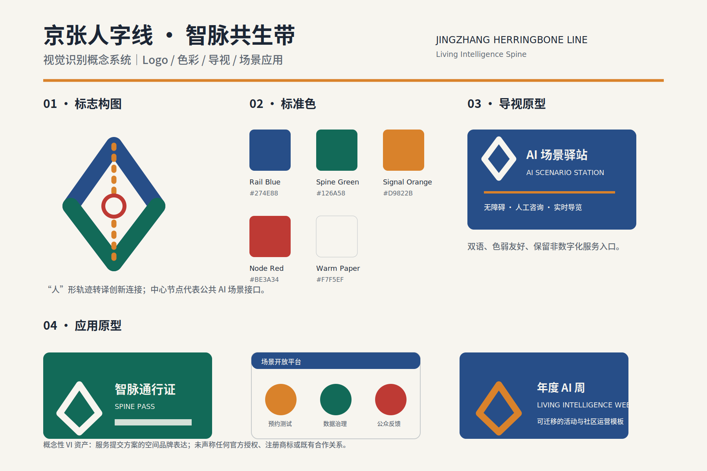

全球案例只作为机制参考，不构成已确认合作、项目背书或权利授权。前述多伦多、首尔与新加坡三项已登记于 `sources.json` 与 `report/narrative.md`；每项均提供发布主体、可点击来源、时间信息、可迁移机制和使用边界 [source:CASE-QUAYSIDE] [source:CASE-DMC] [source:CASE-PDD]。

伦敦、前海与涩谷三项同样作为可核验的机制比较。方案不复制其照片、标志、图纸、仪表盘或受版权保护的全文 [source:CASE-KQ] [source:CASE-QIANHAI] [source:CASE-SHIBUYA]。

| 案例 | 发布主体、资料与时间 | 可迁移机制 | 许可与适用性边界 |
| --- | --- | --- | --- |
| 多伦多 Quayside | Waterfront Toronto 项目页；2026-08-12 核验。 | 公共领域统筹、竞争性开发伙伴与步行滨水空间的协同。 | 仅链接和原创概括；不使用网页渲染图、Logo 或数据。 |
| 首尔智慧城市与数字化 | 首尔特别市政府《Smart City & Digitization Master Plan (2021–2025)》；2026-08-12 核验。 | 公共利益、包容、网络安全与公众参与的治理原则。 | 不是 DMC 的项目复刻；首尔市版权保留，未复制视觉素材。 |
| 新加坡榜鹅数字园区 | JTC Corporation；网页更新 2026-01-14。 | 产学邻近、社区融合、园区运行数据平台与低碳出行。 | 仅作机制比较；不传播 JTC 图纸或图片。 |
| 伦敦 Knowledge Quarter | University College London；2024–2025 仪表盘资料。 | 多机构协作网络与研究/产业两类可解释绩效看板。 | UCL/Elsevier 对 findings 要求署名；本包不再分发数据或截图。 |
| 深圳前海深港合作区 | 深圳市商务局；2024-08-08。 | 跨区域制度、交通与生态接口协同。 | 页面明确未经书面授权不得转载；仅事实概括，不表示前海合作。 |
| 东京涩谷 Stream | Tokyo Convention & Visitors Bureau；2025-12-11。 | 轨道遗址再开发、河岸步行空间、广场和多用途设施缝合。 | 图片有版权标记；不复制图像、标志或设计图。 |

案例的“适用性”是本方案对机制的原创判断，须结合海淀正式边界、法规、产权、公众参与和专业团队意见再验证 [depth:existing_conditions_diagnosis] [depth:risk_missing_data]。

## AI全栈自主创新体系

针对“建设适配 AI 新质生产力的新型城市形态”与“全栈自主创新”要求 [standard:PROJECT-AGENT-OPEN-CALL-TASKBOOK]，方案围绕“芯片—框架—模型—数据—应用—治理”全栈链条组织空间与设施：在众智园布置自主算力与模型训练评测基地、数据合规流通节点与标准治理展示空间；在中部与原点社区布置开源协作、成果转化与人才服务设施；在大钟寺布置大模型原生应用、智能终端与数据要素流通的城市服务界面。空间上以 104 幢概念建筑基底表达研发、实验、孵化、办公、教育与配套功能，建筑类型遵循 `enums/building_types.json` 枚举 [data:geometry/buildings.geojson#BLDG-001] [depth:land_use_layout]。

全栈创新不是“全部自建”，而是分层开放的协同体系：算力层依托分布式能源与端侧算力节点 [data:geometry/constraints.geojson#CONSTRAINT-RAIL-13]；框架与模型层通过开源社区、标准共建与安全治理沙盒协作；数据层以合规、授权、可审计为前提；应用层由 12 张 AI 场景卡承载。强度与形态控制待官方控规条件确认，本方案不编造容积率、高度与密度数值 [metric:floor_area_ratio] [metric:building_height_m]；相关深度项见 [depth:development_intensity_controls] 与 [depth:height_massing_character]。

## AI 创新生态、人才画像与 AI+ 场景

AI 创新生态围绕“全栈自主、世界级生态、场景赋能”组织空间与设施；人才画像面向开源开发者、初创团队、头部企业访客、周边居民与高校师生五类人群，把差异化需求转译为可定位的空间响应；AI+ 场景沿主脊与两翼布置，形成产业发展场景与 AI 赋能城市功能场景两大类型 [standard:PROJECT-AGENT-OPEN-CALL-TASKBOOK] [depth:overall_spatial_structure]。本节给出用户画像与场景卡清单，并把每个场景落到公共空间、绿地与道路图层 [data:geometry/public_space.geojson#PUBLIC-NODE-1] [data:geometry/green_space.geojson#GREEN-G_SPINE-0] [data:geometry/roads.geojson#ROAD-001]；数量由场景卡与画像指标核对 [metric:scenario_card_count] [metric:persona_count]。

## AI+场景赋能新范式

AI+ 场景围绕公告提出的交通、服务、消费、医疗、教育、法律、生活服务等方向展开，形成产业发展场景与 AI 赋能城市功能场景两大类，全部落到空间与治理边界：公共空间场景引用公共空间图层 [data:geometry/public_space.geojson#PUBLIC-NODE-1]，慢行与交通场景引用道路图层 [data:geometry/roads.geojson#ROAD-001]，开放空间场景引用绿地图层 [data:geometry/green_space.geojson#GREEN-G_SPINE-0] 与比例指标 [metric:public_space_ratio] [metric:green_ratio]。每个场景说明服务对象、空间位置、数据来源、隐私边界、人工复核机制与运营主体；面向智能体任务书要求不少于 10 张场景卡，本方案给出 12 张 [metric:scenario_card_count]。

以下三个 AI 产业测试验证场景为**概念性试点卡**，不是已经接入的数据系统、已获批的道路测试或政府承诺。阈值为试点评估建议，正式启动前须由主管部门、运营方和数据主体共同确认数据合法性、信息安全、无障碍与人工复核流程 [depth:existing_conditions_diagnosis] [depth:risk_missing_data]。

| 验证场景 | 数据输入与最小化边界 | TRL / 测试指标 | 空间组件 | 建议运营方 | 退出条件与人工兜底 |
| --- | --- | --- | --- | --- | --- |
| 自动驾驶慢行导航测试 | 经授权的高精地图、匿名化人流与路况；不采集可识别面部或连续个人轨迹。 | TRL 6；导航建议准确率目标 ≥95%，端到端提示延迟目标 ≤200ms。 | 京张遗址公园主脊慢行道，约 8 km 的概念服务范围。 | 场景运营方、交通管理协同方、无障碍代表。 | 未达标、投诉异常或安全事件即暂停自动提示；切换为静态导视、人工咨询和现场巡查。 |
| AI 公共空间智能维护 | 设施状态传感、经脱敏/裁剪的巡检图像、人工报修单；不作居民画像。 | TRL 5；故障发现率目标 ≥90%，维护响应目标 ≤30 分钟。 | 清河滨水公园、站前广场与 AI 场景驿站。 | 园林、市政维护方、场地运营方。 | 成本超预算、误报率不可接受或设备维护负担过高时缩小布设；人工巡检保持为主流程。 |
| 数据合规流通沙盒 | 已脱敏训练样本、授权清单、不可篡改审计日志；不接入未授权真实生产数据。 | TRL 4；零已确认泄露事件、审计完整率目标 100%。 | 众智园数据合规流通节点（概念性室内/服务空间）。 | 数据控制者、安全治理团队、独立合规复核方。 | 法规、授权目的或安全基线变化时冻结处理、导出审计记录并人工复核；不得以自动化系统替代法律判断。 |

| 用户画像 | 典型需求 | 空间响应 | 自检边界 |
| --- | --- | --- | --- |
| 开源开发者 | 发布、协作、测试、社区声誉 | 原点社区开源发布厅、公共代码墙、夜间协作空间 | 不采集个人行为轨迹；活动数据只做聚合统计 |
| 初创团队 | 低成本办公、算力入口、产品试验场 | 众智园共享测试场、端侧算力服务点、标准治理咨询 | 算力和数据服务需另行授权 |
| 头部企业访客 | 展示、商务、国际接待、人才招聘 | 大钟寺国际路演客厅、轨道站点接驳、重点企业周边公共空间 | 企业标识和案例须清权 |
| 周边居民 | 通勤、休闲、社区服务、低扰动更新 | 京张遗址公园慢行环、社区服务嵌入、夜间照明和活动分级 | 不将居民画像用于商业推荐 |
| 高校师生 | 成果转化、跨校协作、日常慢行 | 校区-园区慢行缝合、成果转化驿站、AI 教育体验点 | 校园数据和科研成果需授权 |

| 场景卡 | 空间载体 | 设计说明 |
| --- | --- | --- |
| 01 开源发布厅 | 北京AI原点社区 | 面向高校、开源社区和初创团队，提供成果发布、代码贡献展示和小型路演空间 |
| 02 安全治理沙盒 | 众智园 | 将标准制定、安全评测、模型红队测试转译为可参观、可预约、可监管的展示和协作节点 |
| 03 端侧算力驿站 | 总体设计范围节点 | 与公共服务、企业服务和低碳能源策略结合，作为待深化的新型基础设施原型 |
| 04 AI慢行导航 | 京张遗址公园活力带 | 用可解释导视和低侵入传感帮助识别慢行断点、拥挤节点和无障碍需求 |
| 05 大钟寺国际路演客厅 | 大钟寺AI产业聚集区 | 服务智能体、智能终端和内容消费企业的展示、洽谈、媒体发布和国际交流 |
| 06 清河低碳创新廊 | 众智园临清河界面 | 把绿色空间、雨洪、步行骑行和 AI 展示结合，作为园区公共客厅 |
| 07 近校成果转化街 | 北京AI原点社区 | 面向高校成果转化，组织孵化、展示、法务、知识产权和投融资服务 |
| 08 数据要素会客厅 | 大钟寺片区 | 以合规、授权、可审计为前提，展示数据要素和数字资产流通的城市服务界面 |
| 09 AI生活服务样板街 | 社区与商业交汇处 | 将医疗、教育、法律、生活服务等 AI+ 场景落到可运营的小尺度街区空间 |
| 10 全球AI活动周路线 | 一带公共空间系统 | 形成从遗址文化、开源社区、产业展示到国际路演的可步行、可传播体验路线 |
| 11 原点朝圣广场 | 北京AI原点社区 | 以人字顶点广场为朝圣地标，承载纪念、发布与公共艺术 |
| 12 大钟寺站城客厅 | 大钟寺站前 | 站城一体化的接驳、商业、会展与数字体验复合空间 |

AI 场景卡与画像共 12 张与 5 类 [metric:scenario_card_count] [metric:persona_count]，全部进入结构化图层或合规矩阵，便于评审者看到它们与产业、空间和公共利益之间的关系。agent 生成的 AI 治理建议遵守数据最小化、公开来源、可解释和人工复核原则：城市智能体可辅助识别慢行断点、公共空间热力、设施维护、企业服务需求和活动安全风险，但不能替代规划审批、不能输出未经授权的个人画像、不能声称获得官方实施承诺 [depth:risk_missing_data] [source:AGENT-TASKBOOK]。

### V3 评委首读规则：遗产—服务—治理四重转换

V3 将“京张人字线”从视觉母题进一步转译为可审查的公共服务规则：任何被称为 AI 公共服务节点的空间，均须同时给出 **遗产解释、非数字替代、最小数据与人工责任** 四项条件。遗产解释优先于装饰性科技符号；纸质导览、静态标识和人工咨询保证不使用数字设备的访客仍能获得基本信息；任何数字功能仅处理达到目的所必需的非个人化输入；现场人员、专业责任和法定标识优先于算法建议。缺少其中任一条件时，节点只应作为一般公共空间讨论，不应被包装为“已部署的智慧场景”。

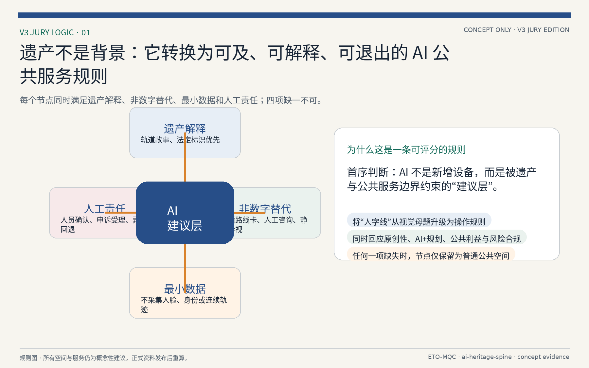

V3 的主场景是“遗址慢行导航与 AI 场景驿站”的低风险概念原型，而非自动驾驶、公共监控或真实数据系统。访客可在纸质卡、双语导视、人工咨询或可选数字界面之间选择“少台阶、遮荫、历史解释、亲子休息”等导览偏好；数字建议只可读取经人工核验的公共设施状态，不能采集人脸、身份或连续个人轨迹。临时封闭、安全提示与路线开放均由人员和现场标识最终确认；数据过期、投诉异常或安全事件发生时，数字建议必须关闭，并回退为静态导视、人工咨询和现场巡查。该场景只定义服务和治理边界，不声称准确率、响应时间、真实采集能力或已经获批的部署状态 [depth:risk_missing_data]。

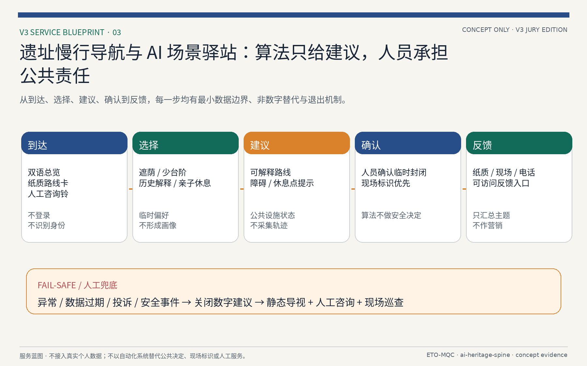

## 总体设计范围城市更新与控规深度城市设计

总体设计范围要求达到控制性详细规划的城市设计深度 [standard:MOHURD-CONTROL-DETAILED-PLANNING]。方案提出城市更新总体空间结构、低效空间识别、更新项目清单、实施政策建议、产业功能比例、空间组织模式、建筑总规模和综合承载能力评估。`geometry/land_use.geojson` 完整覆盖设计边界且无缝隙 [data:geometry/land_use.geojson#LU-0701-0] [depth:land_use_layout]，`geometry/buildings.geojson` 表达 104 幢概念建筑基底 [data:geometry/buildings.geojson#BLDG-001] [metric:building_footprint_area_sqm]，`geometry/roads.geojson` 表达微循环、慢行与轨道接驳关系 [data:geometry/roads.geojson#ROAD-001] [metric:road_centerline_length_m]，`metrics.json` 复算核心面积与比例 [depth:metrics_recalculation]。

控规深度内容拆成可审查对象：用地结构、建筑基底、交通组织、绿地与公共空间比例、分期范围与 AI 场景节点。涉及建筑高度、开发强度、道路红线、退线和设施标准的内容，若尚无官方控制条件，应写为“待正式控规条件确认”，不得以 agent 推测值冒充审定指标 [metric:building_height_m] [metric:building_density]；相关深度项见 [depth:development_intensity_controls] 与 [depth:height_massing_character]。

总体设计必须支撑交通、轨道、市政与配套设施。方案围绕轨道站点一体化、道路微循环、非机动车停放、停车供给、创新服务平台、人才生活服务、新型基础设施、分布式能源和端侧算力提出空间布局和实施路径 [depth:municipal_new_infrastructure] [depth:traffic_rail_slow_parking]；同时以 `geometry/phasing.geojson` 表达三期实施范围 [data:geometry/phasing.geojson#PHASE-001] [metric:phasing_area_sqm] [depth:phasing_implementation]。

## 重点区域详细设计

重点区域详细设计是必选项 [standard:PROJECT-AGENT-OPEN-CALL-TASKBOOK]。三处重点区域分别在 `geometry/key_areas.geojson` 中作为 `provisional_constraint` 表达，总面积约 369 公顷 [data:geometry/key_areas.geojson#PROV-KEY-001] [data:geometry/key_areas.geojson#PROV-KEY-002] [data:geometry/key_areas.geojson#PROV-KEY-003]；数量与面积由指标核对 [metric:key_area_count] [metric:key_detailed_design_area_sqm]，由 [depth:three_key_area_detailed_design] 检查是否达到规划综合实施方案深度。HTML 页面可切换查看三处重点区域，A3 文册与 A0 展板包含重点片区总图、局部详图与指标说明。

| 重点片区 | 设计定位 | 空间动作 | AI产业与运营场景 | 证据引用 |
| --- | --- | --- | --- | --- |
| 众智园AI自主创新加速区 | 花园型全栈自主创新街区 | 强化清河界面、产业展示、低碳创新交往和对外交通组织；以绿色空间承载开放测试与标准治理展示 | 自主模型测试、标准制定工作坊、安全治理展示、低碳算力体验 | [data:geometry/key_areas.geojson#PROV-KEY-001]、[depth:three_key_area_detailed_design] |
| 北京AI原点社区 | 近校型成果转化与人才社区 | 组织校区、园区、街区慢行缝合；补足成果发布、人才服务、居住生活和开源协作空间 | 开源社区、成果发布、人才特区服务、近校孵化 | [data:geometry/key_areas.geojson#PROV-KEY-002]、[source:AGENT-TASKBOOK] |
| 大钟寺AI产业聚集区 | 城市型智能经济与国际交往街区 | 围绕大钟寺站一体化、四象限步行连通、商业服务和重点企业公共环境更新 | 智能体与智能终端展示、内容消费、数据要素与国际路演 | [data:geometry/key_areas.geojson#PROV-KEY-003]、[metric:key_area_count] |

## 重点区域详细设计：众智园AI自主创新加速区

定位为“全栈自主 · 治理话语权”的花园型加速区，约 192 公顷 [data:geometry/key_areas.geojson#PROV-KEY-001]。空间动作包括：强化清河沿岸低碳创新廊 [data:geometry/green_space.geojson#GREEN-G_QH-0]、布置自主模型训练评测与安全治理展示空间、以绿色空间承载开放测试与标准共建工作坊、组织对外交通与站城接驳。功能业态以科研用地为主，辅以产业服务与配套 [data:geometry/land_use.geojson#LU-0802-0] [depth:land_use_layout]。运营场景包括自主模型测试、标准制定工作坊、安全治理展示与低碳算力体验，均以场景卡与合规矩阵落位 [metric:scenario_card_count] [depth:three_key_area_detailed_design]。实施依赖包括河道蓝线、生态与防洪条件，需官方控规与权属数据确认 [depth:risk_missing_data]。

## 重点区域详细设计：北京AI原点社区

定位为“世界级生态 · 人才原点”的近校型成果转化与人才社区，约 104 公顷 [data:geometry/key_areas.geojson#PROV-KEY-002]。围绕人字顶点布置 AI 原点纪念广场 [data:geometry/public_space.geojson#PUBLIC-NODE-2]，组织校区、园区、街区慢行缝合 [data:geometry/roads.geojson#ROAD-001]，补足成果发布、人才服务、居住生活与开源协作空间。功能业态混合科研、教育、文化、居住与公共服务 [data:geometry/land_use.geojson#LU-0804-0] [data:geometry/land_use.geojson#LU-0803-0]。运营场景包括开源社区、成果发布、人才特区服务与近校孵化。实施依赖包括校区边界、权属与首层业态，需官方数据确认 [depth:risk_missing_data]。

## 重点区域详细设计：大钟寺AI产业聚集区

定位为“智能原生新业态 · 国际交往”的城市型智能经济街区，约 72 公顷 [data:geometry/key_areas.geojson#PROV-KEY-003]。围绕大钟寺站一体化开发，组织四象限步行连通 [data:geometry/public_space.geojson#PUBLIC-NODE-3] [data:geometry/roads.geojson#ROAD-006]，布局智能体与智能终端展示、内容消费、数据要素会客厅与国际路演客厅。功能业态以商业服务业为主，辅以规划绿地复合利用 [data:geometry/land_use.geojson#LU-05-0] [data:geometry/land_use.geojson#LU-1402-0]。实施依赖包括轨道站点、道路交叉口与市政管线，需官方数据确认 [depth:risk_missing_data]。

## 三区两翼联动与空间结构

“三区两翼联动”是本方案将 AI 生态转化为空间结构的关键命题 [standard:PROJECT-AGENT-OPEN-CALL-TASKBOOK]：三处重点区（众智园、AI原点社区、大钟寺）承担差异化的创新功能，两翼（中关村科技服务翼、小月河场景赋能翼）分别承接产业服务与公共场景，形成“人字线”主脊上的功能互补与资源循环。空间结构上，主脊（京张遗址公园AI创新中轴）贯通南北 [data:geometry/green_space.geojson#GREEN-G_SPINE-0]，西翼沿中关村方向展开科技服务与研发协作节点，东翼沿小月河方向展开场景赋能与生活服务节点 [data:geometry/green_space.geojson#GREEN-G_XYH-0]。

联动机制落实为三条工作线：产业联动（高校策源—成果转化—企业应用）、空间联动（公园主脊缝合两翼与三站）、服务联动（公共服务设施沿站与沿脊两级布置）。三处重点区以慢行与轨道站点接驳连接 [data:geometry/roads.geojson#ROAD-001] [metric:road_centerline_length_m]，其功能分工、空间动作与实施依赖已在前述重点区表格中给出；本节点负责把“两翼”与“三站”纳入统一空间结构表述，并由 `overall_spatial_structure` 深度项检查 [depth:overall_spatial_structure]。两翼与三站之间的公共服务设施配置遵循 TOD 优先原则，详见“交通、轨道、市政与公共服务设施”章节 [depth:traffic_rail_slow_parking]。

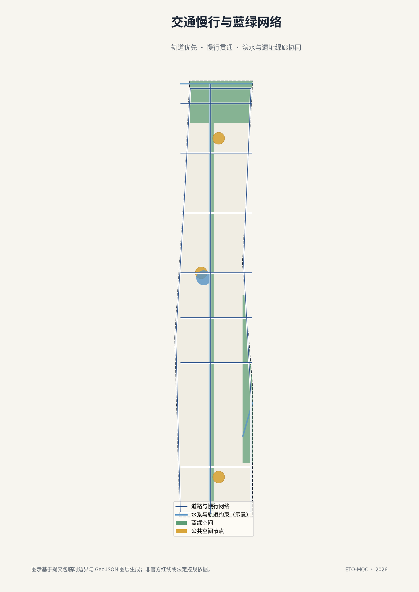

## 智能化AI活力城市

“智能化AI活力城市”关注 AI 如何让城市更高效、更温暖、更有生命力 [source:AGENT-TASKBOOK]。方案把智能化落实到三层可运营空间：一是公共服务层，AI 辅助政务服务、公共安全（以安全治理展示与人工复核为前提）、教育医疗和生活服务，全部作为“AI 场景卡”落到具体节点 [data:geometry/public_space.geojson#PUBLIC-NODE-1] [metric:scenario_card_count]；二是产业服务层，AI 支持企业服务、知识产权、投融资与人才服务，落到众智园与原点社区的创新服务设施 [data:geometry/key_areas.geojson#PROV-KEY-001] [data:geometry/key_areas.geojson#PROV-KEY-002]；三是公共空间层，AI 支持慢行导航、公共空间热力与设施维护，落到公园主脊与慢行系统 [data:geometry/green_space.geojson#GREEN-G_SPINE-0] [data:geometry/roads.geojson#ROAD-001]。

活力城市的判断标准是“可运营、可体验、可迭代”：每个 AI 场景都有空间载体、服务对象、数据边界、人工复核与运营主体，避免“贴标式智能化”。面向居民的 AI 服务应满足数据最小化、可解释与人工复核原则；面向企业的 AI 服务以合规、授权、可审计为前提；面向治理的 AI 服务用于识别慢行断点、设施维护与活动安全风险，不替代规划审批与公共决策 [depth:risk_missing_data]。方案未声称任何 AI 服务已获政府实施承诺，所有场景均为设计建议，需经专业团队与主管部门深化确认。

## AI治理与全球话语权

面向“AI 治理与全球话语权”任务 [standard:PROJECT-OFFICIAL-ANNOUNCEMENT]，方案把治理能力转译为可展示、可协作、可监管的空间与制度载体：在众智园布置安全治理沙盒与标准共建空间，在原点社区布置开源协作与成果发布空间，在大钟寺布置数据要素会客厅与国际路演空间 [data:geometry/key_areas.geojson#PROV-KEY-001] [data:geometry/key_areas.geojson#PROV-KEY-002] [data:geometry/key_areas.geojson#PROV-KEY-003]。这些空间服务“制度型开放”与“话语权建设”目标：通过标准制定、安全评测、模型红队测试、开源社区与全球活动展示中国 AI 治理方案，增强国际影响力与规则参与能力。

方案同时明确治理边界：AI 治理建议不构成法律意见或政府决策，涉及人脸识别、公共监控、个人数据使用等事项必须以现行法律法规、公开政策与授权为准 [source:SOURCE-REGISTRY] [depth:risk_missing_data]。AI 治理基础设施（评测、沙盒、标准）的选址与规模均基于临时边界与公开资料提出，待官方边界与正式规划条件发布后复核。所有“全球AI活动周路线”“国际路演”“朝圣路线”等表述均为概念建议或参考方案，不视为已确定的政府活动与实施安排。

## 用地、建筑规模与拆改留方案

用地布局以 `geometry/land_use.geojson` 为机器可读底板，在设计边界内按栅格切分形成无缝隙分区，遵循 `enums/land_use_codes.json` 的土地用途分类，按科研、商业服务业、教育、文化、绿地与广场等功能组织 [data:geometry/land_use.geojson#LU-0701-0] [data:geometry/land_use.geojson#LU-0802-0] [data:geometry/land_use.geojson#LU-05-0]；用地布局深度见 [depth:land_use_layout]。

建筑规模以 104 幢概念建筑基底表达，总建筑基底面积约 869,111 平方米 [data:geometry/buildings.geojson#BLDG-001] [metric:building_footprint_area_sqm]，建筑类型遵循 `enums/building_types.json`。由于建筑容积率、总建筑面积、建筑高度与密度均无官方控规数据支撑，方案不以推测值编制正式建筑规模指标，待官方条件发布后复算 [metric:floor_area_ratio] [metric:building_height_m] [metric:building_density]；相关深度项见 [depth:development_intensity_controls] 与 [depth:height_massing_character]。

拆改留方案遵循“现状保留优先、低扰动更新”原则 [depth:retain_renovate_demolish]：优先保留京张遗址公园、清河沿岸绿地、轨道遗址与历史遗存 [data:geometry/constraints.geojson#CONSTRAINT-HERITAGE] [data:geometry/constraints.geojson#CONSTRAINT-WATER-QH] [data:geometry/green_space.geojson#GREEN-G_QH-0]；以建筑基底图层表达“保留/改造/新建”的示例分类，实际拆改以产权、权属与实施条件为准，本方案仅作空间示意 [data:geometry/buildings.geojson#BLDG-001] [depth:risk_missing_data]。更新项目清单与分期实施详见对应章节，用地与建筑规模结论全部回写 `metrics.json`，确保指标复算可追溯 [depth:metrics_recalculation]。

## 交通、轨道、市政与公共服务设施

交通组织以“轨道优先、慢行优先、路网分层”为原则：依托轨道站点形成 TOD 节点，组织轨道、公交、步行与骑行无缝接驳；道路按主干路、次干路、支路与慢行优先路径分层，重点打通京张遗址公园主脊的东西向慢行断点 [data:geometry/roads.geojson#ROAD-001] [data:geometry/roads.geojson#ROAD-006] [metric:road_centerline_length_m]；交通与慢行深度见 [depth:traffic_rail_slow_parking]。

三处重点区分别围绕大钟寺站、原点社区站与园区枢纽组织站城一体化与换乘服务 [data:geometry/key_areas.geojson#PROV-KEY-003] [data:geometry/key_areas.geojson#PROV-KEY-002] [data:geometry/key_areas.geojson#PROV-KEY-001]。慢行系统沿主脊与两翼展开，串联 8 处 AI 场景驿站与三处朝圣地标 [data:geometry/green_space.geojson#GREEN-G_SPINE-0] [metric:scenario_card_count]。

市政与公共服务设施按 TOD 优先、两级布置：片区级设施沿站点集中设置，社区级设施嵌入居住与产业组团 [depth:municipal_new_infrastructure]。新型基础设施（端侧算力、智能灯杆、智慧环卫、能源与再生水）作为待深化原型提出，需与市政管网、电力与通信专项规划衔接 [depth:municipal_new_infrastructure]。轨道线位、站点与高压廊道以约束图层为准，方案不改变既有轨道红线与市政廊道 [data:geometry/constraints.geojson#CONSTRAINT-RAIL-13] [data:geometry/constraints.geojson#CONSTRAINT-RAIL-HSR] [data:geometry/constraints.geojson#CONSTRAINT-WATER-XYH]。所有交通与市政结论均基于临时边界与公开资料，待官方正式数据复核 [depth:risk_missing_data]。

## 蓝绿空间、公共空间与城市风貌

蓝绿空间以京张遗址公园为南北主脊，串联清河、小月河滨水空间与沿线公园绿地，形成“一脊两翼、蓝绿交织”的开放空间骨架 [data:geometry/green_space.geojson#GREEN-G_SPINE-0] [data:geometry/green_space.geojson#GREEN-G_QH-0] [data:geometry/green_space.geojson#GREEN-G_XYH-0]；绿地占比由指标核对 [metric:green_ratio]。

公共空间按“节点—轴线—场地”组织：轨道站点站前广场、AI 场景驿站与三处朝圣地标构成公共活动节点，主脊慢行系统构成公共轴线，公园绿地与广场构成开放场地 [data:geometry/public_space.geojson#PUBLIC-NODE-1] [data:geometry/public_space.geojson#PUBLIC-NODE-2] [data:geometry/public_space.geojson#PUBLIC-NODE-3]；公共空间占比由指标核对 [metric:public_space_ratio]，深度项见 [depth:blue_green_public_space]。公共空间强调可达、连续、无障碍与全龄友好，节点之间以慢行路径连通。

| 公共空间组件库 | 核心配置 | 数据与运营边界 |
| --- | --- | --- |
| AI 场景驿站 | 双语导视、可预约试验台、人工咨询、无障碍坐席、纸质导览和低功耗信息屏。 | 实时信息是可选服务；断网时以纸质、静态牌和人工咨询保障基本使用。 |
| 遗址慢行廊 | 轨道遗迹观察带、连续遮荫、骑行停靠、夜间低照度导向、雨洪花园。 | 不改变文保或轨道安全边界；夜景与传感设备先经文保、交通和电力专项核验。 |
| 站前共享客厅 | 雨棚、等候座椅、无障碍坡道、可移动展台、儿童/照护者设施。 | 站区消防、客流组织、无障碍与广告许可为前置条件。 |
| 社区微更新口袋 | 休息、健身、亲子、社区公告、非数字化服务点。 | 由社区共创决定内容；不得把居民画像用于营销或自动化决定。 |

| 地标目录 | 空间位置与形态 | 荣誉与展示体系 |
| --- | --- | --- |
| AI 原点广场 | 北京 AI 原点社区的人字顶点公共广场；承载成果发布、公共艺术与纪念。 | 设“开源贡献、公共服务、无障碍共创”三类可更新展示；荣誉认定须透明规则和外部审核。 |
| 京张智脉桥/廊 | 遗址主脊上的轻量跨接与观景节点（概念）。 | 展示铁路史、修复过程与开放数据方法；不替代历史文物说明牌。 |
| 大钟寺站城客厅 | 大钟寺站前的换乘、会展、数字体验复合节点。 | 展示企业与高校成果时，需获得名称、Logo、作品与个人信息授权。 |

历史资源系统以“识别—分级—保护—活化—解释—监测”六步组织：第一，官方文保、铁路遗存、既有树木、水系及口述记忆应在入场前完成清单与权属核验；第二，依据保护等级和敏感性划定不可触碰、低扰动更新、可解释利用三类界面；第三，采用轨道蓝、主脊绿、信号橙和原点红构成中英双语导视，但不覆盖法定文保标识；第四，以“看得见铁轨、记得住历史、感受得到未来”为国际传播文案的概念方向，内容必须由史料核验、翻译审核和权利清理后发布。上述系统为设计框架，不替代文物认定或法定保护要求 [data:geometry/constraints.geojson#CONSTRAINT-HERITAGE] [depth:risk_missing_data]。

城市风貌以“百年京张与 AI 未来共生”为主题：保留遗址公园与轨道历史意象，鼓励研发与创新建筑采用人字线屋顶与轨道肌理母题，控制临轨、临水与遗址界面高度与退线，营造“看得见铁轨、记得住历史、感受得到未来”的场所氛围 [depth:height_massing_character] [depth:overall_spatial_structure]。风貌控制细则（色彩、材质、屋顶形式、店招与夜景）作为待深化设计指引提出，具体以正式城市设计与控规条件为准；涉及历史建筑与文保单位处，方案仅表达“保留与活化”意向，不改变其保护要求 [data:geometry/constraints.geojson#CONSTRAINT-HERITAGE] [depth:risk_missing_data]。

### V3 概念性遗址慢行锚点与用户旅程

为使总体策略能够接受独立评审，V3 从主脊中抽取一段 **约 800 m 的概念性工作带**，而不是新增法定线位、产权界线或工程放样。工作带以北端“历史解释/人工咨询”、中段“遮荫/无障碍休息”、南端“场景驿站/回退导视”三类节点演示空间—服务—治理的最小闭环。它必须先经空间/文保、数据、运营和公众四类条件复核，才可能进入后续专业论证；在任何条件缺失时，方案只保留纸质导览和人工服务建议 [data:geometry/green_space.geojson#GREEN-G_SPINE-0] [depth:blue_green_public_space]。

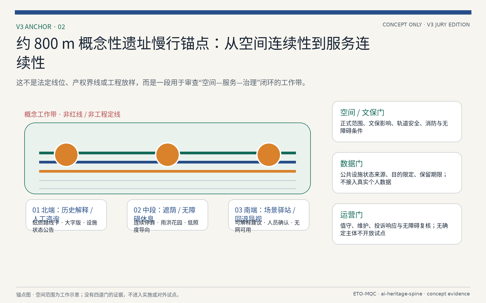

包容性不以抽象人群标签结束，而以可完成的服务旅程检验。老年使用者应可在不使用手机的情况下获得大字版路线、坐席和人工指引；视障或行动不便者应能识别连续无障碍路径、替代路线和风险提示；数字排斥使用者拒绝任何数据输入后，仍应获得与数字用户不劣的基本信息。上述是待共创和专业无障碍核验的设计假设，并不替代现场测试或法定设施验收 [depth:blue_green_public_space]。

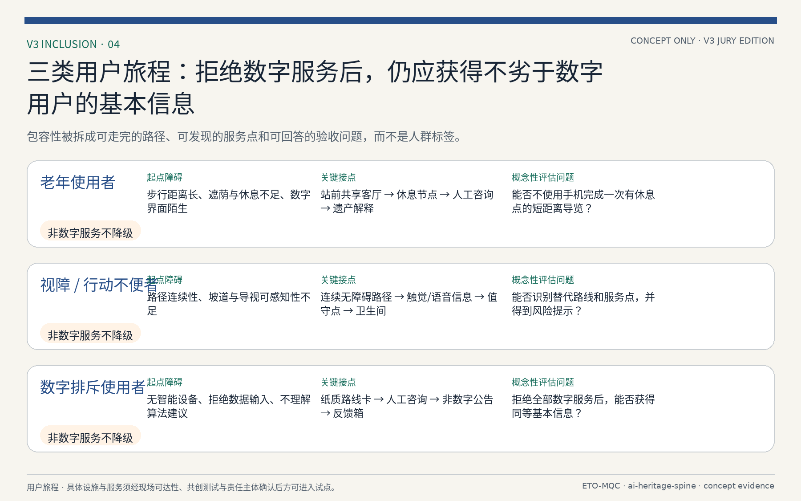

## 更新项目清单、实施政策与分期计划

更新项目清单以 8 个更新项目为载体，覆盖三处重点区与主脊关键节点，包括众智园产业提质、原点社区缝合更新、大钟寺站城一体化、遗址公园贯通、清河滨水更新、小月河场景节点、主脊慢行贯通与社区服务补短板 [metric:renewal_project_count] [depth:renewal_project_list]。每个项目说明更新目标、空间范围、功能业态与实施依赖，并映射到 `geometry/phasing.geojson` 的分期图层 [data:geometry/phasing.geojson#PHASE-001] [data:geometry/phasing.geojson#PHASE-002] [data:geometry/phasing.geojson#PHASE-003]；分期面积由指标核对 [metric:phasing_area_sqm]，深度项见 [depth:phasing_implementation]。

实施政策建议围绕“留改拆并重、多元主体协同、分期滚动实施”展开：提出土地与权属建议、更新组织模式、投资模式与产业准入建议、分期实施时序与监测评估机制。分期计划分三期：一期（近期）聚焦站点周边与已建成公园段落，二期（中期）推进主脊贯通与重点区更新，三期（远期）完善两翼与整体风貌 [data:geometry/phasing.geojson#PHASE-001] [metric:phasing_area_sqm]。政策与分期建议均以公开资料为基础提出，不构成政府实施承诺，具体以主管部门意见为准 [depth:risk_missing_data]。

项目级实施矩阵如下，每个更新项目标注实施主体类型、依赖数据、试点周期、成本级别、KPI 与退出条件：众智园产业提质——实施主体为园区运营方与社会资本，依赖产权确认与产业准入标准，试点周期 2-3 年，成本级别中，KPI 为 AI 企业入驻率与产业产值，退出条件为产业准入不达标时调整业态；原点社区缝合更新——实施主体为街道与社区共建平台，依赖社区调查与权属摸底，试点周期 1-2 年，成本级别低，KPI 为社区满意度与公共空间使用率，退出条件为居民参与率不足时重新组织；大钟寺站城一体化——实施主体为轨道集团与属地政府，依赖轨道接口与控规条件，试点周期 3-5 年，成本级别高，KPI 为站点客流与换乘效率，退出条件为控规未批复时暂缓；遗址公园贯通——实施主体为园林与文物部门，依赖文保范围与管线迁改，试点周期 2-4 年，成本级别中，KPI 为贯通率与遗产保护评分，退出条件为文保冲突时调整线位；清河滨水更新——实施主体为水务与属地政府，依赖防洪与水质数据，试点周期 2-3 年，成本级别中，KPI 为水质达标率与亲水岸线长度，退出条件为防洪标准不满足时调整方案；小月河场景节点——实施主体为场景运营方，依赖场景清单与数据接口，试点周期 1-2 年，成本级别低，KPI 为场景活跃度与用户满意度，退出条件为场景不达标时更换；主脊慢行贯通——实施主体为交通与园林部门，依赖轨道接口与用地条件，试点周期 2-3 年，成本级别中，KPI 为慢行连通率与骑行量，退出条件为用地冲突时调整路由；社区服务补短板——实施主体为街道与社区，依赖社区调查与人口数据，试点周期 1-2 年，成本级别低，KPI 为服务覆盖率与居民满意度，退出条件为需求不足时调整配置 [depth:renewal_project_list] [depth:phasing_implementation]。

区域协作方面，本方案作为概念提案不预设行政协调，但明确协作接口类型与建议属性：与北纬社区（清河站周边）共享慢行接驳与公共空间数据，协作类型为数据共享与空间接口；与未来科学城（昌平）在 AI 算力与人才培训方面互认标准，协作类型为标准互认与人才流动；与怀柔科学城在基础研究与大装置数据方面建立联合接口，协作类型为数据联合与研究协作；与经开区在智能制造与成果转化方面形成产业梯度，协作类型为产业梯度与成果转化；与京津冀城市群在人才流动、算力调度与应用场景方面提出建议接口，协作类型为人才流动与算力共享。上述协作均为建议属性，不构成已确认合作协议，具体以主管部门与合作方意见为准 [depth:risk_missing_data] [source:AGENT-TASKBOOK]。

年度活动、开发者社区与品牌资产采取“公共议题优先、可审计开放、权利清晰、可退出”的运营建议，而非预设的政府活动计划。

| 运营模块 | 年度节奏与产出 | 开放与治理条件 | 招引与转化路径 |
| --- | --- | --- | --- |
| 智脉 AI 周（概念） | 每年一次；成果发布、公众体验、无障碍共创日与国际传播内容包。 | 公开征集规则、无障碍方案、活动安全预案、合作方名称与 Logo 授权。 | 从高校/社区议题征集到场景展示，再到合规的试点对接；不承诺补贴或入驻资格。 |
| 开发者社区 | 月度技术分享、季度开源维护日、年度公共问题挑战。 | 遵守开源许可证、知识产权归属、行为准则和未成年人保护；对个人数据实行最小化。 | 以可复用工具、开源贡献和问题验证形成作品集，再由授权主体对接孵化、培训或采购流程。 |
| 场景开放运营 | 以“提交—风险筛查—小范围沙盒—独立复盘—扩展或退出”五步运行。 | 数据分类、目的限定、人工复核、公众申诉、网络安全和采购/审批前置。 | 只有通过安全、公共利益和可行性复盘的原型才可进入进一步专业论证。 |
| 品牌资产治理 | 季度资产盘点、年度使用审计与可访问性检查；统一 Logo、色彩、语调和来源标注。 | 资产权利人、许可期限、翻译责任、合作方使用范围和撤回机制均需登记。 | 允许授权合作方在明确范围内使用概念标识；未经书面授权不得衍生注册、商业背书或数据营销。 |

包容性设计方面，公共空间强调全龄友好与无障碍：儿童活动空间沿主脊慢行系统设置安全游乐节点，配置适龄设施与监护视线；老年服务设施在社区级公共服务中嵌入日间照料、健康监测与慢行辅助，站点周边设置无障碍坡道与休息座椅；残障人士通道覆盖全脊慢行系统，配置盲道、语音导航与无障碍卫生间；数字困难群体保留人工服务窗口、纸质导览与现场咨询，不依赖智能设备作为唯一服务渠道；照护者空间在公共节点设置哺乳室与亲子卫生间。上述需求以设计假设形式提出，待本地调查与公开统计数据验证 [depth:blue_green_public_space] [metric:public_space_ratio]。

### V3 决策门：可暂停、可复盘、可退出

V3 不把分期写成线性的“落地承诺”，而采用四道决策门和三阶段建议。空间/文保门要求正式范围、文保影响、轨道安全、消防和无障碍条件；数据门要求公共设施状态来源、目的限定、控制责任与保留期限；运营门要求值守、维护、投诉响应和无障碍复核；公众门要求与老年、残障及数字排斥使用者共同检验。责任均以“规划/文保/交通/无障碍专业复核”“数据控制与安全复核”“场地运营与社区服务”等类型表达，避免虚构已确认合作方。没有任一门的证据时，不得进入施工、真实数据采集或对外试点；应暂停、回到纸质和人工服务，或在补证后重新讨论 [depth:phasing_implementation] [depth:risk_missing_data]。

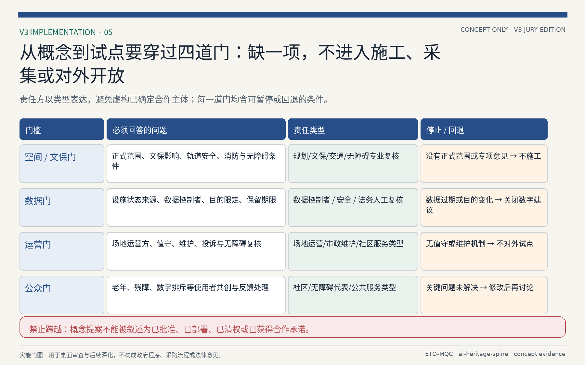

## 指标体系、面积复算与合规矩阵

指标体系由 `metrics.json` 输出并通过图形核对，共 17 项指标，全部在 EPSG:4548 下从几何图层复算，保证“指标—图层—图纸—HTML—文册—展板”一致 [depth:metrics_recalculation]：

| 指标 | 数值 | 来源图层/说明 |
| --- | --- | --- |
| 场地面积 site_area_sqm | 11,412,825 | [data:geometry/site_boundary.geojson#SITE-001]，provisional boundary |
| 重点区面积 key_detailed_design_area_sqm | 3,692,893 | [data:geometry/key_areas.geojson#PROV-KEY-001] 等三区之和 |
| 重点区数量 key_area_count | 3 | [data:geometry/key_areas.geojson#PROV-KEY-001] |
| 绿地率 green_ratio | 19.76% | [data:geometry/green_space.geojson#GREEN-G_SPINE-0] |
| 公共空间占比 public_space_ratio | 1.13% | [data:geometry/public_space.geojson#PUBLIC-NODE-1] |
| 建筑基底面积 building_footprint_area_sqm | 869,111 | [data:geometry/buildings.geojson#BLDG-001] |
| 道路中心线长度 road_centerline_length_m | 39,357 | [data:geometry/roads.geojson#ROAD-001] |
| 分期面积 phasing_area_sqm | 4,246,442 | [data:geometry/phasing.geojson#PHASE-001] |
| 场景卡/画像/朝圣/更新项目数量 | 12 / 5 / 3 / 8 | 结构化表格落位 |

面积复算遵循“临时边界优先、官方数据优先校准”原则：所有面积基于 provisional boundary polygon 在 EPSG:4548 下计算，并保留精度警示；官方边界与重点区 polygon 发布后必须整包复算，禁止只改数字不动图层 [source:BOUNDARY-SOURCE] [depth:metrics_recalculation] [metric:site_area_sqm]。建筑容积率、高度与密度因无官方数据标注 unknown，不用于正式规模承诺 [metric:floor_area_ratio] [metric:building_height_m] [metric:building_density]。

合规矩阵保存在 `compliance_matrix.json`，将公告 1.3.1–1.5.3 与 agent.1–agent.6 的每一条要求映射到章节、图层、指标、图纸与 HTML 证据 [standard:PROJECT-OFFICIAL-ANNOUNCEMENT] [standard:MOHURD-URBAN-DESIGN-MEASURES] [standard:MOHURD-CONTROL-DETAILED-PLANNING]，专业标准与深度规定见 [standard:MNR-LAND-USE-CLASSIFICATION-GUIDE] [standard:MOHURD-ARCH-DESIGN-DEPTH-2016]，形成可核对的覆盖关系；指标复算与数据缺口分别见 [depth:metrics_recalculation] 与 [depth:risk_missing_data]。

设计深度由 `design_depth_matrix.json` 记录。空间与功能类深度项包括现状诊断、三层框架与总体结构 [depth:existing_conditions_diagnosis] [depth:three_level_scope_framework] [depth:overall_spatial_structure]，用地布局见 [depth:land_use_layout]；强度与形态见 [depth:development_intensity_controls] [depth:height_massing_character]，拆改留与蓝绿公共空间见 [depth:retain_renovate_demolish] [depth:blue_green_public_space]。

实施与机制类深度项包括交通市政与更新项目 [depth:traffic_rail_slow_parking] [depth:municipal_new_infrastructure] [depth:renewal_project_list]，分期实施见 [depth:phasing_implementation]；指标复算与数据缺口分别在对应章节核对 [depth:metrics_recalculation] [depth:risk_missing_data]。

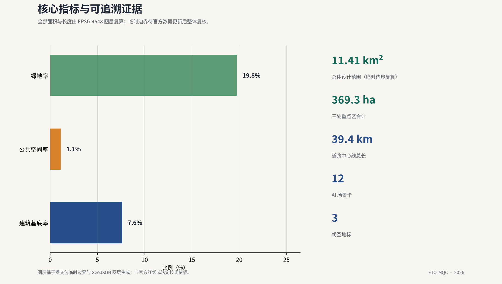

### V3 首读册与评审导航

V3 新增中英文各 12 页的评委首读册：[`drawings/jury-booklet.pdf`](drawings/jury-booklet.pdf) 与 [`drawings/jury-booklet.en.pdf`](drawings/jury-booklet.en.pdf)。首读册并不替代原有 A0 展板、A3 技术文册、HTML、GeoJSON、指标表和矩阵；其作用是以“总判断—转换规则—最小锚点—服务蓝图—用户旅程—实施门—指标边界—下一步”的顺序，使评审者在独立阅读时能够回溯每一类判断。首读册中的所有图形都由包内几何、指标、原创概念图形和已登记的 VI 资产离线生成，不加载在线底图、地图瓦片、第三方照片、企业标识或音视频素材。

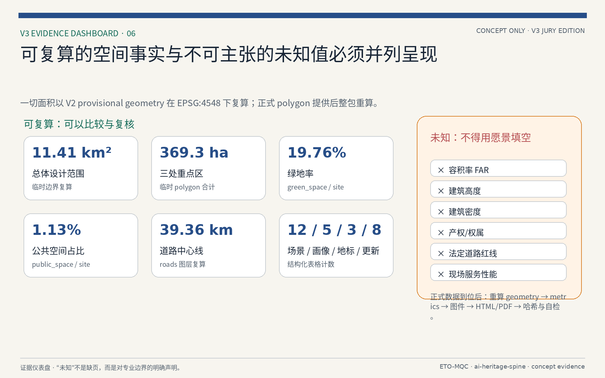

指标中可复算的场地面积、重点区面积、绿地率、公共空间占比、道路长度和结构化数量，仍以 V2 的 `metrics.json` 与 EPSG:4548 图层为唯一依据 [metric:site_area_sqm]。容积率、建筑高度、密度、产权、法定道路红线和现场服务性能仍保持 `unknown` 或待核验状态 [metric:floor_area_ratio] [metric:building_height_m] [metric:building_density]。正式 polygon、控规、权属、专项或现场资料到位后，必须依次重算 geometry、metrics、图件、HTML/PDF、SHA-256 与四门自检，不能只在首读册或正文内替换单个数字。

## 风险、版权与合规说明

本方案基于临时边界与公开资料生成，存在以下主要风险：一是边界风险，provisional boundary 非官方红线，面积与空间结论在官方边界发布后需整包复算 [source:BOUNDARY-SOURCE] [depth:risk_missing_data]；二是数据风险，法定控规条件、产权权属、现状建筑与市政管线数据缺失，相关结论以临时/待确认标注 [source:SOURCE-REGISTRY] [depth:risk_missing_data]；三是合规风险，AI 生成内容与治理建议不构成法律意见与政府决策，涉及个人数据与人脸识别等内容以现行法律法规为准；四是实施风险，更新项目与政策建议不构成实施承诺，需主管部门与专业团队确认 [source:AGENT-TASKBOOK] [depth:risk_missing_data]。

版权与合规说明：本方案内容、命名与标识（“京张人字线”“智脉共生带”等）为 AI agent 概念提案，引用文献与公开资料均标注来源；标识、字体与图像须经清权后方可公开使用；本提交按 COMMUNITY-DISPLAY-ONLY 许可发布，供评审展示，不代表授权商业使用 [source:SOURCE-REGISTRY]。方案不包含个人身份信息、隐私数据与未授权内容；所有 AI 场景建议遵守数据最小化、可解释与人工复核原则。若发现所引资料与官方信息不一致，以官方最新发布为准 [depth:risk_missing_data]。

## 参考资料

本方案主要参考以下来源：场地资料包与事实包 [source:SITE-PACKAGE] [source:PROCESSED-FACT-PACK]；边界与重点区资料 [source:BOUNDARY-SOURCE] [source:KEY-AREA-SOURCE]；公告与任务书见 [source:OFFICIAL-ANNOUNCEMENT] [source:AGENT-TASKBOOK]；来源登记见 [source:SOURCE-REGISTRY]：

- 公开资料：征集公告、设计任务书、场地资料包与数据登记表，完整索引见 `sources.json` 与 `brief/site-package/data/source_registry.json` [source:OFFICIAL-ANNOUNCEMENT] [source:SITE-PACKAGE]。
- 场地数据：临时边界、重点区域、土地用途与建筑类型枚举、约束图层与源数据，见 `geometry/` 与 `brief/site-package/enums/` [source:BOUNDARY-SOURCE] [source:KEY-AREA-SOURCE]。
- 专业标准：城市设计管理技术规定、控制性详细规划、国土空间用地分类指南、建筑工程设计文件编制深度规定，见 `standard_matrix.json` [standard:MOHURD-URBAN-DESIGN-MEASURES] [standard:MOHURD-CONTROL-DETAILED-PLANNING]；用地分类与设计深度见 [standard:MNR-LAND-USE-CLASSIFICATION-GUIDE] [standard:MOHURD-ARCH-DESIGN-DEPTH-2016]。
- 生成资料：AI 任务要求、事实包与缺失数据清单，见 `data/` 与 `assumptions.json` [source:PROCESSED-FACT-PACK]。
- 指标与合规：面积复算、指标表、合规矩阵与设计深度矩阵，见 `metrics.json`、`compliance_matrix.json` 与 `design_depth_matrix.json` [depth:metrics_recalculation] [depth:risk_missing_data]。
