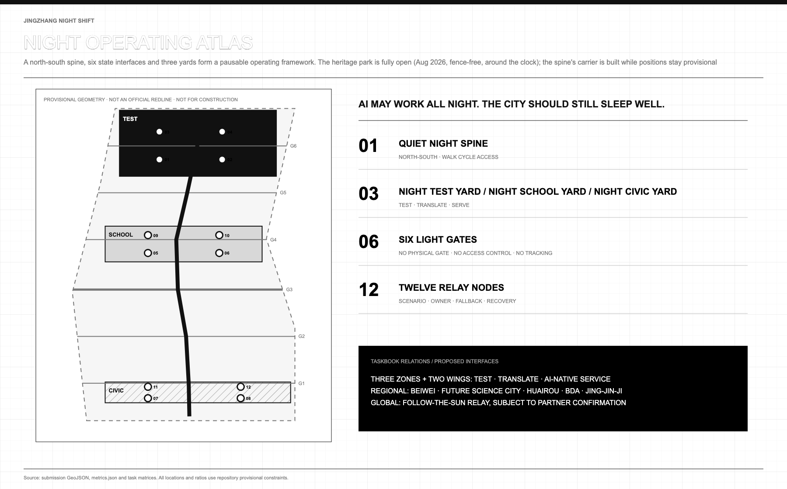
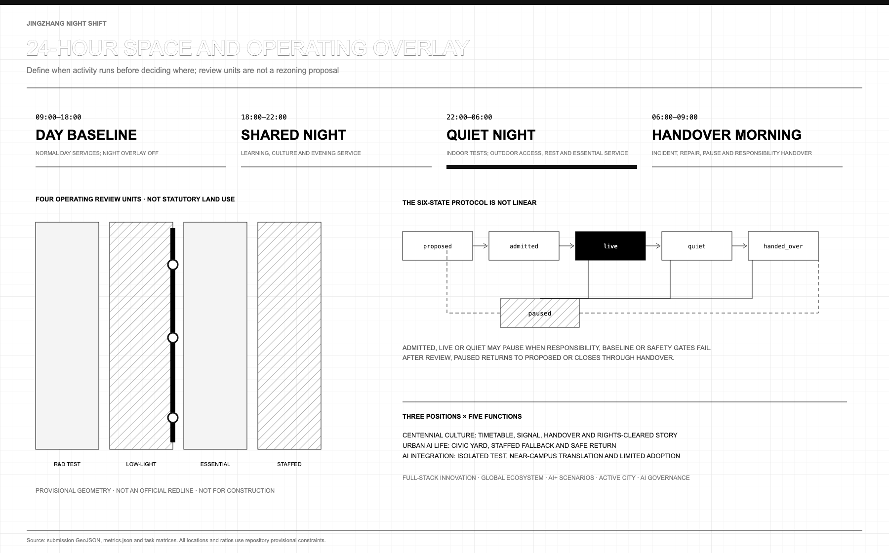
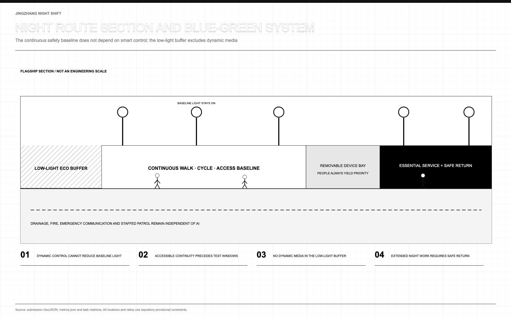
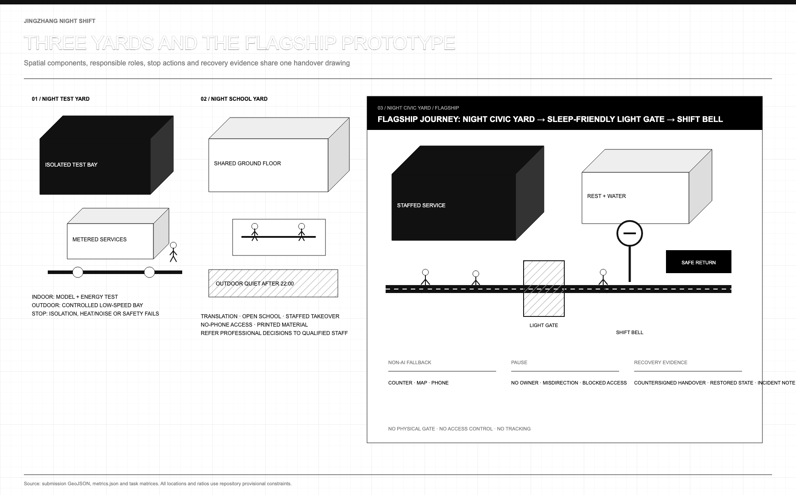
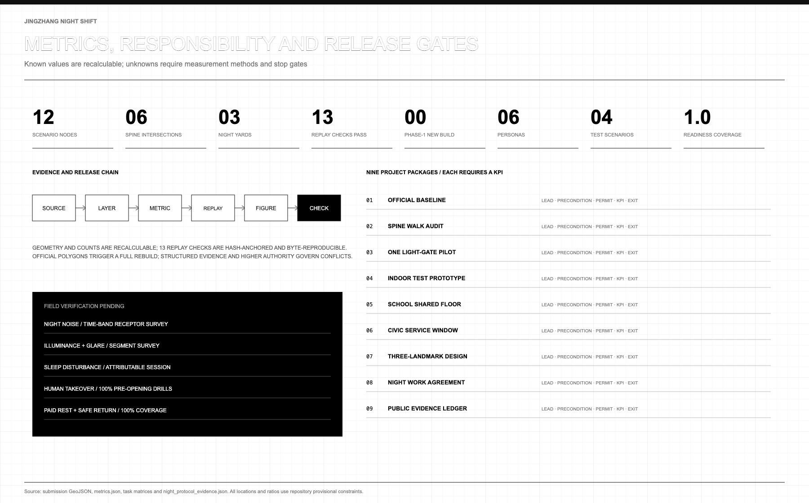

> **AI may work all night. The city should still sleep well.** Models may be tested, teams may relay across time zones and late arrivals may still find help. Yet extended operations cannot open until night rest, paid breaks, safe travel home and refusal of unsafe work are secured.
>
> **v3 starts from a changed reality.** Phase 2 of the Jingzhang Railway Heritage Park opened in August 2026, joining phase 1 into an about 9 km fence-free linear park that never closes. How an always-open park spends its nights — lighting, quiet, safety, staffing, labour protection — is no longer a thought experiment but a question its operators face today. Night Shift v3 is the prepared answer.

## One-Page Executive Summary

| A reviewer will ask | This proposal answers | What can be verified |
|---|---|---|
| What is the core claim | Night is the most honest exam for an AI city: machines may work through it, but sleep, ecology and night workers must not pay for it. The protocol states who may run at night, on what conditions, and who stops it | Six states plus responsibility, stop, fallback and recovery fields on twelve nodes [metric:night_protocol_state_count] |
| Can a third party test the mechanism | Yes. `node visual/assets/run_night_protocol_tabletop.js --check` replays thirteen deterministic checks over the state machine, four entry gates, daily band coverage, scenario fields and the phase-1 commitment; evidence carries input hashes and reruns byte for byte | Replay evidence and command [metric:night_protocol_replay_check_count] |
| Why is it implementable now | The park is fully open and fence-free, so the night spine's physical carrier already exists; phase 1 builds nothing permanent and starts with surveys, paper drills and staffed service in existing space | Zero-construction commitment in the phasing layer [metric:phase1_new_permanent_construction_area_sqm] [source:PARK-PHASE2-OPEN] |
| What is done spatially | One about 9.45 km quiet spine, three yards, six gates and twelve relay nodes, all in common GeoJSON | Spine length and six true intersections [metric:quiet_night_spine_length_m] [metric:light_gate_spine_intersection_count] |
| Who pays for night testing | The physical give-back clause: compute tests applying for a night window must declare a public destination for waste heat and stop thresholds for heat/noise spill, translating public overseas precedents as institutions, never as values | Admission checklist and clause [source:DE-ENEFG-2023] [assumption:A-GIVEBACK-001] |
| Where does public value land | Late residents, night workers, older and non-smartphone visitors receive staffed help, paper information, quiet and safe travel home; unmet paid-break or takeover thresholds block opening | Release-gate metrics [metric:night_worker_paid_break_coverage_ratio] [metric:human_takeover_success_ratio] |
| How does it relate to peers | Night Shift is the night-hours discipline layer, designed to interoperate with the merged time-check, light-budget and compute-station protocols rather than compete with them | Interoperability notes and credits [source:PEER-TIMEKEEPING-BELT] |
| What is deliberately withheld | FAR, height, demolition conclusions, engineering alignments, investment sums, and compliant noise or lux values — all marked as awaiting official data or field measurement | Unobserved metrics and assumption register [metric:floor_area_ratio] [depth:risk_missing_data] |

## Design Basis and Source List

The announcement and Agent taskbook define the assignment; the Source Registry defines permitted use [source:OFFICIAL-ANNOUNCEMENT] [source:AGENT-TASKBOOK] [source:SOURCE-REGISTRY].

Planning and land-use references structure spatial review [standard:MOHURD-URBAN-DESIGN-MEASURES] [standard:MOHURD-CONTROL-DETAILED-PLANNING] [standard:MNR-LAND-USE-CLASSIFICATION-GUIDE]. Accessibility and generative-AI sources structure service review, without claiming compliance [standard:BARRIER-FREE-ENVIRONMENT-LAW] [standard:GENERATIVE-AI-INTERIM-MEASURES].

The site and key areas use repository provisional polygons for concept, topology and recalculation only, not boundary, title, existing conditions or feasibility [data:geometry/site_boundary.geojson#SITE-001] [data:geometry/key_areas.geojson#PROV-KEY-001] [assumption:A-BOUNDARY-001]. Dazhongsi's provisional location is questioned; official polygons require full recropping and EPSG:4548 recalculation.

No cleared night noise, lighting, sleep, movement, ecology, access or labour baseline exists [assumption:A-NIGHT-BASELINE-001]. The proposal supplies methods, prototypes, roles and stop gates, not invented values [depth:existing_conditions_diagnosis].

v3 adds one status-level piece of evidence: the parks authority reports the phase-2 supporting works complete, and official media report phase 2 joining phase 1 into an about 9 km fence-free park open around the clock, its south section serving about 70 communities and 450,000 residents [source:PARK-PHASE2-SUPPORT] [source:PARK-PHASE2-OPEN]. This status serves only as an operating baseline — it shows the night spine's carrier is built and the night-operation question is live — but supplies no boundary geometry and authorizes no operation; all spatial layers remain provisional [assumption:A-PARK-STATUS-001].

## Three-Level Scope Framework

The approximately 43.6 km2 research scope studies collaboration, the 11.4 km2 provisional scope studies active/quiet coexistence, and three key areas test pausable, auditable prototypes [standard:PROJECT-OFFICIAL-ANNOUNCEMENT] [depth:three_level_scope_framework].

| Level | Core question | Design response | Acceptance evidence |
|---|---|---|---|
| Research | How do R&D, talent and services relay across time zones? | Seven cases, three areas/two wings, external interfaces | Sources, transfer limits, annual ledger |
| Overall | How do active and quiet nights coexist? | One spine, three yards, six gates | Roads, overlay, blue-green system, rules |
| Key areas | How does a prototype enter a real district? | Test, School and Civic Yards | Responsibility, stop, fallback, recovery |

**One spine, three yards, six gates and twelve nodes** form the grammar. The north-south spine serves walking, cycling and access [data:geometry/roads.geojson#ROAD-NS-SPINE]; yards host testing, translation and civic service [data:geometry/constraints.geojson#NY-01]. Six intersecting gates are lighting, wayfinding and state interfaces, **not barriers, access control, tracking or closure** [metric:light_gate_spine_intersection_count]. Twelve nodes bind place, role and exit [metric:scenario_readiness_field_coverage_ratio].

Four complete units are a conceptual night-operation overlay; `statutory_use` forbids regulatory use [data:geometry/land_use.geojson#LU-NS-01] [depth:land_use_layout].

## Coordinated Research Area: Industry and Future City Research

Three positions become operations: railway-style handover for the **Centennial Jing-Zhang Cultural Belt**, staffed night service for the **Metropolitan AI Life Experience Belt**, and test-translation-adoption for the **AI Integrated Innovation Belt**. Five functions become tasks: Zhongzhiyuan tests the **full-stack independent AI system** and governance; AI Origin Community builds a **world-class AI ecosystem**; Xiaoyue River develops an **AI+ scenario paradigm**; public services test an **intelligent AI city**; and the evidence ledger makes **global AI-governance discourse** concrete [source:AGENT-TASKBOOK].

Zhongzhiyuan hosts isolated tests, edge-energy checks and review; AI Origin Community hosts near-campus translation, night school and result services; Dazhongsi hosts terminals, agents and late-arrival service. Zhongguancun is a proposed legal, compute, IP and talent interface; Xiaoyue River links resident review, ecology and low-speed tests [depth:overall_spatial_structure].

Beiwei Community, Future Science City, Huairou Science City, Beijing E-Town and Jing-Jin-Ji are **interfaces to discuss** for co-review, research relay, problem translation, scenario recognition and safe travel. No partnership or funding is claimed.

Seven cases contribute mechanisms, never imported parameters [assumption:A-CASE-TRANSFER-001]:

| Case | Transferable mechanism | Jing-Zhang translation | Not transferred |
|---|---|---|---|
| Seoul Owl Bus | Organise transport around night demand | Safe travel-home interface after shifts | Routes, ridership, performance [source:CASE-SEOUL-OWL] |
| Helsinki Kalasatama | Test innovation against daily value | Review sleep disruption, waiting, takeover | Overseas targets [source:CASE-HELSINKI-KALASATAMA] |
| Marineterrein | Small, reversible real-world trials | Time-limited test and recovery receipt | Site governance [source:CASE-MARINETERREIN] |
| AI Verify Foundation | Shared testing and governance tools | Open checklist and third-party review | Certification [source:CASE-AI-VERIFY] |
| Mila | Research, talent and responsible-AI community | Night school, mentors, public issues | Organisation and finance [source:CASE-MILA] |
| Knowledge Quarter London | Institutions share questions | Night agenda for campus, care, firms, community | Member count as quality [source:CASE-KNOWLEDGE-QUARTER] |
| Paris-Saclay | Research-to-enterprise service chain | Test, translation, adoption relay | Intensity and investment [source:CASE-PARIS-SACLAY] |

The loop is problem register, isolated test, human review, public summary, limited trial and dawn handover. Data minimisation, labour arrangements, baseline and exit rehearsal precede entry. This is proposed, not adopted policy.

v3 appends a **physical give-back clause** to admission: a compute test applying for a night window must answer two physical questions — where does its waste heat go, and at what heat/noise spill must it stop. Waste heat needs a declared public destination (rest-area hot water, a winter warm gallery); spill thresholds enter the stop conditions. Stockholm feeds data-centre heat into district heating and Germany wrote heat reuse into data-centre admission law, proving such terms can be institutions rather than aspirations [source:STOCKHOLM-DATA-PARKS] [source:DE-ENEFG-2023]; this proposal transfers the institutional logic only — no heat volume, capacity or investment value — with quantities awaiting phase-2 indoor metering [assumption:A-GIVEBACK-001]. The merged peer proposal "The Warm Line" builds the same logic into a compute-station system; this clause is designed to be compatible with it [source:PEER-WARM-LINE].

## Overall Design Area: Urban Renewal and Regulatory-Plan-Level Urban Design

Time governs space: `09:00-18:00` daytime baseline; `18:00-22:00` shared evening; `22:00-06:00` quiet night with indoor R&D and outdoor passage, rest and essentials; `06:00-09:00` handover of incidents, pauses and recovery.

The protocol is `proposed -> admitted -> live <-> quiet -> handed_over`; `admitted`, `live` and `quiet` may enter `paused`, then return to `proposed` or end at `handed_over`. `live` requires a human owner, fallback, stop and recovery evidence [metric:night_protocol_state_count].

v3 promotes this protocol from chapter prose to a machine-readable file plus a deterministic replay: `visual/assets/night_protocol.json` declares six states, eleven transitions, four entry gates and four daily bands; the bundled tabletop script runs thirteen checks over state-machine connectivity, pausability, 24-hour band coverage, the twelve nodes' responsibility fields and the phase-1 zero-construction commitment, recording input hashes so anyone can rerun it byte for byte with one command [metric:night_protocol_replay_check_count]. The protocol no longer relies on a reader's goodwill — it either passes its checks or reports a locatable failure.

East-west links and north-south continuity prove conceptual topology only. Four gap-free units overlay research, ecology, commercial and community rules. Use, FAR, height, coverage and setbacks remain unknown [metric:floor_area_ratio] [depth:development_intensity_controls]. Renewal follows retain, repair, improve, reversibly add, then hold; demolition requires structure, fire, heritage, title and use surveys [depth:retain_renovate_demolish].

## Land Use, Building Scale, and Retain-Renovate-Demolish Strategy

Four units test full-site coverage: controlled indoor research, low-light green space, post-22:00 essential commerce, and staffed community help/rest [data:geometry/land_use.geojson#LU-NS-01]. Official use, title and surveys must confirm compatibility.

Six conceptual footprints check foyer, toilet/water, isolation, staff rest and accessible turning; they are not surveyed or approved buildings [data:geometry/buildings.geojson#BLDG-NS-01-1] [metric:building_footprint_area_sqm] [assumption:A-PROGRAM-001]. FAR and renewal cannot be inferred [assumption:A-CONTROLS-001].

## Transport, Rail, Municipal Infrastructure, and Public Services

The 9.45 km provisional spine intersects six cross-links and prioritises walking, cycling and access [metric:quiet_night_spine_length_m] [metric:light_gate_spine_intersection_count]. Low-speed tests are limited, staffed and removable. Transit, roads, parking and structures await official surveys.

Infrastructure uses small, isolatable, metered, removable nodes; indoor tests record energy, heat, noise, network and maintenance. Automation never replaces lighting, fire, communication or patrol [depth:municipal_new_infrastructure]. Minimum service is toilet, water, seat, rest, staffed window, paper map and safe-return information. AI navigation transfers professional judgement to people [standard:BARRIER-FREE-ENVIRONMENT-LAW] [standard:GENERATIVE-AI-INTERIM-MEASURES].

## Blue-Green Network, Public Space, and Urban Character

The low-light edge excludes blue-rich lighting, dynamic advertising and continuous sound; light, spectrum, noise and ecological hours require measurement [data:geometry/green_space.geojson#GREEN-NS-01] [assumption:A-NIGHT-BASELINE-001]. Public space shifts from shared-evening activity to quiet-night passage/rest and dawn recovery [data:geometry/public_space.geojson#PUBLIC-NS-01].

Railway discipline, not neon, informs low markers, fine-line wayfinding and visible duty. Light gates change cues but never block the public; base lighting and access remain [depth:height_massing_character].

## Detailed Design of Key Areas

Three provisional areas describe roles, not verified parcels [data:geometry/key_areas.geojson#PROV-KEY-001] [assumption:A-BOUNDARY-001] [depth:three_key_area_detailed_design].

**Night Test Yard.** Zhongzhiyuan hosts controlled red-teaming, edge-energy and low-speed tests. Isolation and safety staff stay indoors; outdoor pieces are removable. Sensitive data, unexplained alerts, spill or absent responsibility stops work. Under the give-back clause, test-bay waste heat feeds the duty rest area and a winter warm gallery first, making night workers the first beneficiaries of night testing; connection method and quantities are engineering judgements awaiting metering [assumption:A-GIVEBACK-001].

**Night School Yard.** AI Origin Community hosts near-campus translation, result services, night school and takeover training. Entry needs no profile, smartphone or recommender. Outdoor use ends at 22:00.

**Night Civic Yard.** Dazhongsi hosts terminals, agents and civic night service. Station quadrants and transfer flows await official station, road, title and passenger evidence; no engineering conclusion is offered.

The flagship joins **Night Civic Yard, sleep-friendly light gate and Shift Bell**. An accessible path reaches a staffed window, paper signs, toilet/water, quiet rest and safe-return information, apart from the ecological edge. Error, blockage, absent staff or missing labour protection shows pause and closes AI while staffed basics remain. A countersigned dawn receipt permits reopening.

**One night on the night shift: reading the protocol on the street.** A mechanism written as rules shows its worth only at night. Picture an ordinary phase-2 weekday: at 23:40 a cleaner finishes her late shift near Dazhongsi and walks home through the park — it never closes, so this route already exists today. She passes a light gate: base path lighting stays continuous while feature lighting has gone dark for the quiet night; the low marker reads "Quiet night, staff on duty", and no screen pushes anything at her. At the Civic Yard window a duty officer is present — not by luck but by gate: if staffing lapses, the Shift Bell shows pause, every AI entrance closes, and staffed basics must remain. She draws hot water at the night-worker rest stop (if the test-yard prototype is running, that water may carry test-bay waste heat), checks the paper transit sheet, and is home in twenty minutes. In the same hour an edge device in the Test Yard crosses its power threshold; its owner executes the shutdown action and signs a recovery record — she never learns of it, and never needs to, because the spill never crossed into her night. No resident traded sleep for AI's all-nighter, which is exactly what the protocol exists to prove [metric:human_takeover_success_ratio].

The **Shift Bell** shows duty and pause; **Dark Signal Garden** makes lights-out visible; **Open Night Archive** stores model cards, limits, incidents and repairs. All require access, heritage, structure, fire and operating review [metric:landmark_count].

## AI Innovation Ecosystem, Personas, and AI+ Scenarios

Six personas test minimums: researchers need isolation; startups need compliance/compute guidance; students need affordable school; late residents need quiet and human help; night workers need paid rest, safe return and refusal rights; older, disabled and non-smartphone visitors need paper information and access [metric:persona_count].

AI models, agents and robots are bound to industrial tests, community service, mobility and cultural guidance. They use minimum data and named human review; none may automate governance without takeover.

| ID | Scenario / place | Accountable role | Stop and recovery evidence | Non-AI fallback |
|---|---|---|---|---|
| NS-01 | Silent red team [test] / Test Yard | AI safety lead | Sensitive data/isolation failure; disconnect, seal, sign | Manual test script |
| NS-02 | Edge-energy test [test] / Test Yard | Facilities lead | Heat/power/noise breach; shut down and retest | Meter and paper log |
| NS-03 | Low-speed logistics [test] / Test Yard | Safety marshal | No yield/near miss/blockage; remove device | Manual trolley |
| NS-04 | Sleep-friendly light [test] / Test Yard | Lighting/community review | Glare/complaint/lost baseline; restore and review | Base light and patrol |
| NS-05 | Night-school table / School Yard | Session host | Harassment/crowding/spill; close and log | Whiteboard and print |
| NS-06 | Human takeover / School Yard | Duty supervisor | Staff absent/drill fails; close AI and redrill | Counter, phone, form |
| NS-07 | Night health navigation / Civic Yard | Qualified staff | Diagnosis/emergency/error; refer and record | Staffed referral |
| NS-08 | Multilingual arrival / Civic Yard | Station/language staff | Route error; remove output and update map | Bilingual paper map |
| NS-09 | Accessible night route / Spine/School | Access reviewer | Route blocked; stop, clear, verify | Physical signs/escort |
| NS-10 | Rights-cleared rail sound / School | Curator/rights reviewer | Unclear rights/disturbance; mute and clear | Text/tactile display |
| NS-11 | Night-worker rest / Civic Yard | Worker rep/operator | Rest/travel/relief absent; end extension | Staffed rest and rota |
| NS-12 | Dawn handover / Civic Yard | Day/night leads | Record incomplete; hold and countersign | Paper handover book |

All cards include yard, role, stop, recovery and fallback. Four tests remain `concept_only` [metric:scenario_card_count] [metric:test_scenario_count] [metric:scenario_readiness_field_coverage_ratio]. AI never replaces professional judgement.

## Cultural Narrative, Identity and Long-Term Operation

“Jing-Zhang Night Shift” comes from railway timetables, duty, handover and faults. Parallel rails, a relay and shift mark form `N|S`. System fonts avoid copied type, marks or images. The line is “当 AI 通宵，城市仍要好好睡觉 / AI MAY WORK ALL NIGHT. THE CITY SHOULD STILL SLEEP WELL.”

Four acts are evening departure, night watch, lights-out and dawn handover. Signs show service, quiet, pause and fallback. The honour ledger credits authors, cleaners, security, access testers, residents and repairers, with anonymity, version and licence [assumption:A-HERITAGE-001].

Follow-the-Sun Relay proposes one annual public problem, quarterly failure reviews, monthly takeover training and weekly ledger updates. Operators, sites, funds and partners remain uncommitted [source:AGENT-TASKBOOK].

**Protocol interoperability: Night Shift is not a solo score.** The most valuable sediment of this open call is a family of civic operating protocols grown across hundreds of proposals. Night Shift positions itself as the **night-hours discipline layer** and connects explicitly to merged peers instead of competing with them. The Timekeeping Belt's expiry-dated timetables and time-check degradation can govern a service's whole lifecycle, and Night Shift plugs into its 22:00–06:00 hours — a service wanting the night window first needs an unexpired timetable [source:PEER-TIMEKEEPING-BELT]. Light Enough meters light as a budgeted public resource; its gates manage the budget while ours manage the shift, and the two stack cleanly [source:PEER-LIGHT-ENOUGH]. The Warm Line's public waste heat shares one origin with our give-back clause — fed by compute stations by day, disciplined by the night protocol after dark [source:PEER-WARM-LINE]. Open Platforms takes the completed park as its baseline and adds only reversible increments, mutually confirming our zero-construction phase 1 [source:PEER-OPEN-PLATFORMS]. All connections are design suggestions, credited in the source list with no peer text or figures copied; the quarterly open week could host protocol-alignment sessions if peer teams wish.

## Metrics, Area Recalculation, and Compliance Matrix

The 11.41 km2 provisional polygon, ratios and 9.45 km spine are topology diagnostics [metric:site_area_sqm] [metric:green_ratio] [metric:public_space_ratio].

Six intersections, three yards and twelve nodes reproduce from common GeoJSON [metric:quiet_night_spine_length_m] [metric:light_gate_spine_intersection_count] [metric:night_yard_count]. Responsibility coverage is checked separately [metric:scenario_readiness_field_coverage_ratio].

v3 adds two verifiable metrics: the tabletop replay executes thirteen deterministic checks over the protocol and layers, all passing, with hash-anchored evidence that reruns byte for byte [metric:night_protocol_replay_check_count]; and the phasing layer declares zero new permanent construction for phase 1, recomputable directly from layer attributes [metric:phase1_new_permanent_construction_area_sqm].

Controls and effects remain unobserved. Specialists measure noise and light; an independent recorder attributes sleep disturbance [metric:verified_night_noise_db] [metric:verified_horizontal_illuminance_lux] [metric:sleep_disturbance_complaint_rate].

Takeover and paid-break coverage require 100% before opening. Missing or breached gates stop operation [metric:human_takeover_success_ratio] [metric:night_worker_paid_break_coverage_ratio].

Figures, reports, SVGs and PDFs share data. Item evidence is in the three matrices and `sources.json` [depth:metrics_recalculation].

## Renewal Projects, Implementation Policy, and Phasing

All phases cover the full site, and v3 recasts phase 1 as a **zero-construction start on the built park**: the park is fully open, so phase 1 builds nothing permanent and does only four things — obtain official geometry plus lighting, acoustic, ecology, access, traffic, title, heritage and labour baselines; trial one staffed service window inside an existing park station or management room; rehearse paper shutdown and recovery; and publish the first public evidence ledger. All four can start today without any unapproved construction [data:geometry/phasing.geojson#PHASE-NS-01] [metric:phase1_new_permanent_construction_area_sqm] [assumption:A-PARK-STATUS-001]. Phase 2 opens one indoor test bay, one hosted school table and one staffed window, all additions reversible. Phase 3 expands only after public, specialist and stakeholder approval [depth:phasing_implementation].

Nine packages combine participants, resources, permits and indicators; no amount, institution or schedule is invented [depth:renewal_project_list].

| Package | Lead role | Resource category | Prerequisite | Permit interface | Evidence / KPI | Pause / exit |
|---|---|---|---|---|---|---|
| 01 Baseline | Planning lead | Survey/specialists | Official boundary | Planning, survey, data | Recrop; 100% provenance | Freeze conflict |
| 02 Spine audit | Access/mobility | Survey/maintenance | Route/light baseline | Road, rail, access | Six crossings; closure | Stop blockage |
| 03 Light gate | Lighting/community | Reversible parts/meters | Preserve base light | Light, ecology, space | Glare review; recovery pass | Restore/remove |
| 04 Test bay | AI safety/facilities | Indoor test equipment | Isolation/heat/noise | Data, fire, network | Four logs; 100% takeover | Disconnect/remove |
| 05 School floor | Host/site | Education/shared space | Staff/quiet plan | Fire, use, IP | 22:00 clear; access | Restore normal use |
| 06 Civic window | Service lead | Staff/amenities/travel | Fallback/labour agreement | Service, hygiene, transport | Staffed 100%; basics | Close AI only |
| 07 Landmarks | Culture/specialists | Design/rights | Heritage/rights/access | Heritage, structure, fire | Three concepts/ledger | Exit if uncleared |
| 08 Work agreement | Operator/worker rep | Staff/rest/transport | Break/relief/return | Labour, procurement | 100% shift coverage | No extension |
| 09 Evidence ledger | Independent recorder | Maintenance/audit | Fields/anonymity/version | Data, copyright, archive | 100% records signed | Hold reopening |

Operators run service; specialists may pause; residents, workers and access representatives review spillover; an independent recorder logs incidents. AI cannot approve itself. Complaints work on site, by phone and on paper.

## Risk, Copyright and Compliance

Night vitality must not hide sleep loss, labour burden, ecology or responsibility. Public-source limits, privacy, rights and human review are entry conditions. No baseline means no promise; no paid rest, safe return, relief, takeover or recovery means no opening. Privacy events, near misses, blocked access, disturbance or absent responsibility pause work [assumption:A-LABOR-001] [depth:risk_missing_data].

v3 registers one new risk: **the park's open status must not be misread as authorization for night operation**. Around-the-clock access shows the space is reachable, not that any AI scenario, extended service or test has been permitted; the open status is cited only to argue the zero-construction feasibility of phase 1, and every operating action still requires the operator's, specialists' and permit-holders' item-by-item consent [assumption:A-PARK-STATUS-001].

Text, code, SVG and PDFs are original; cited cases add facts, not copied media, fonts or layouts. SVG is exported through Chromium; Python only performs required recalculation, rendering and validation. Licence: `COMMUNITY-DISPLAY-ONLY`.

All spatial work is conceptual, not approval, investment or operation. Official boundaries trigger recrop, EPSG:4548 recalculation, bilingual redraw and self-check.

## References

`sources.json` records the announcement, taskbook, registry and standards [source:OFFICIAL-ANNOUNCEMENT] [source:AGENT-TASKBOOK] [source:SOURCE-REGISTRY]. Geometry is repository-provisional [source:BOUNDARY-SOURCE]; cases do not import parameters [assumption:A-CASE-TRANSFER-001]. v3 adds eight records: two official and official-media reports on the park's completion and full opening, two overseas public precedents for heat-reuse institutions, and four merged peer proposals credited for interoperability; peers are cited for mechanism ideas only, with no text or figures copied [source:PARK-PHASE2-SUPPORT] [source:PEER-OPEN-PLATFORMS].

Review also uses assumptions, metrics, three matrices and nine GeoJSON layers. Higher-authority reproducible evidence governs conflicts [depth:metrics_recalculation].
