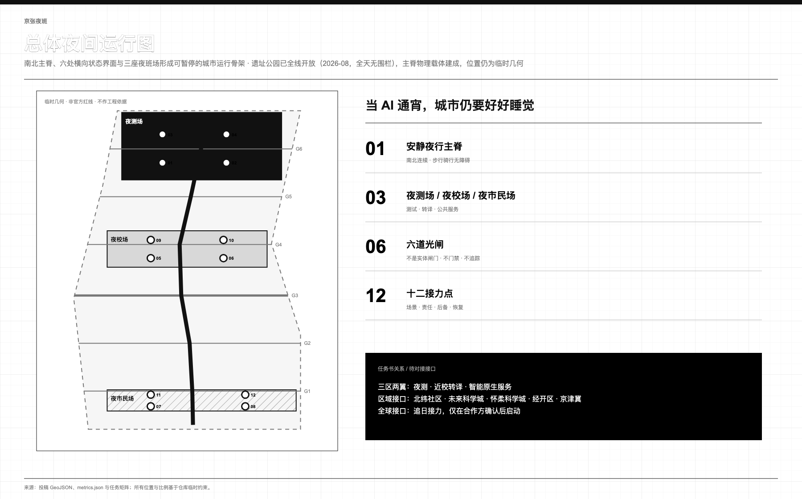
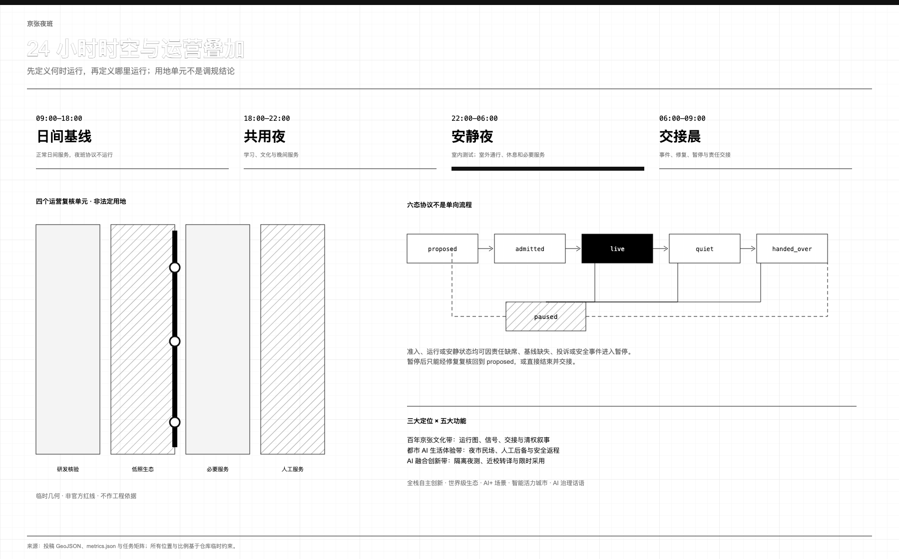
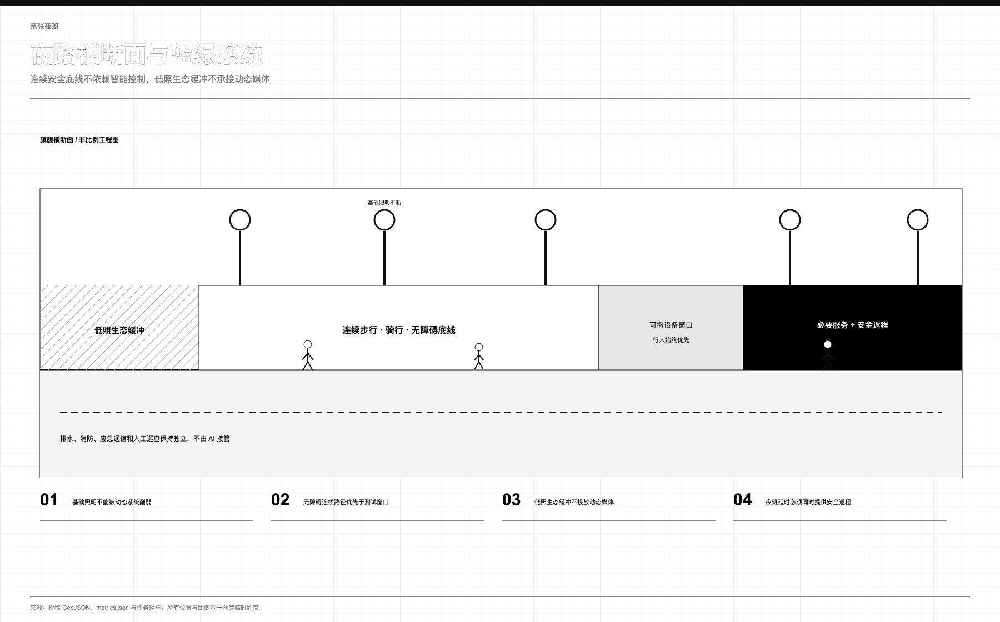
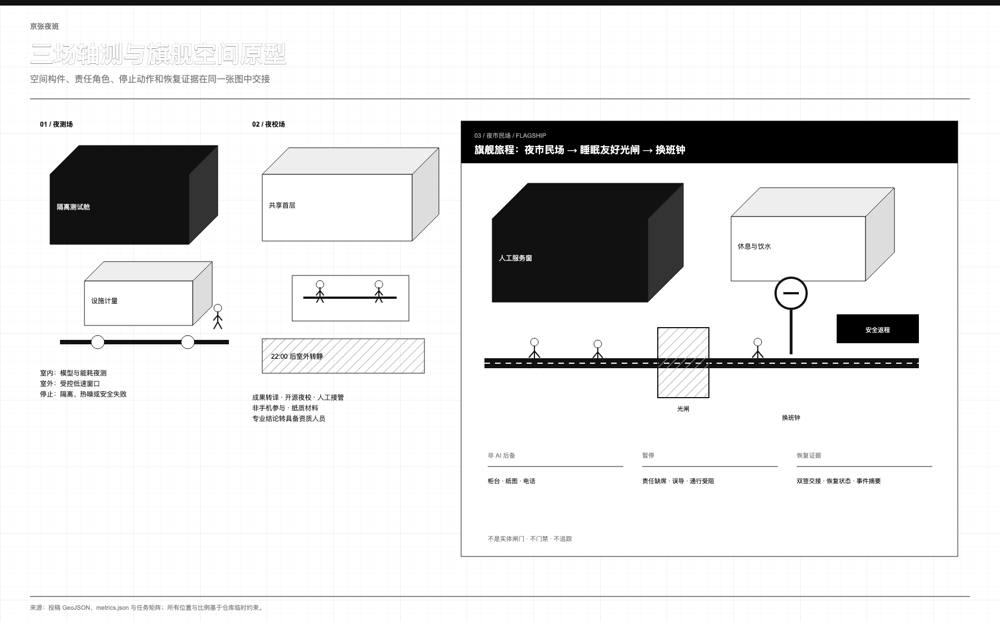
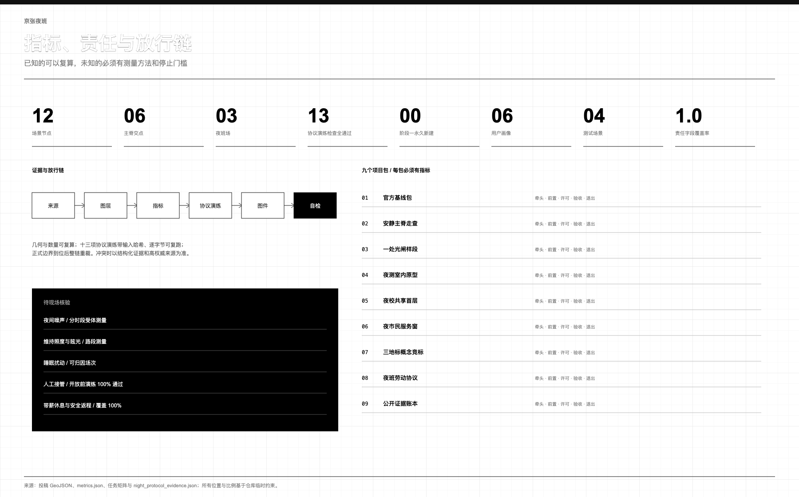

> **当 AI 通宵，城市仍要好好睡觉。** 模型可以夜测，跨时区团队可以接力，晚归者仍能获得帮助；但未落实夜间休息保障、带薪休息、安全返程和拒绝不安全任务机制的运营，不得启动。
>
> **v3 的起点变了。** 京张铁路遗址公园二期已于 2026 年 8 月全线开放，与一期连成约 9 公里、全天开放、无围栏的线性公园。一座彻夜不设门的公园如何度过夜晚——照明、安静、安全、值守、劳动保障——不再是概念练习，而是运营方今天就要回答的问题。京张夜班 v3 就是为这个问题准备的答卷。

## 一页执行摘要

| 评审会问 | 本方案的回答 | 可核验的东西 |
|---|---|---|
| 核心命题是什么 | 夜间是 AI 城市最诚实的考场：机器可以通宵，但城市的睡眠、生态与夜班劳动者不该为此买单。夜班协议规定谁可以在夜里运行、以什么条件运行、出了问题谁来停 | 六态协议与十二个场景节点的责任、停止、后备、恢复字段 [metric:night_protocol_state_count] |
| 机制能否被第三方检验 | 能。`node visual/assets/run_night_protocol_tabletop.js --check` 对协议状态机、四项运行门、时间带覆盖、场景责任字段与阶段一承诺做十三项确定性检查，证据带输入哈希、逐字节可复跑 | 演练证据文件与复跑命令 [metric:night_protocol_replay_check_count] |
| 为什么现在可实施 | 公园已全线开放且全天无围栏，夜行主脊的物理载体已经建成；阶段一零永久新建，只需基线调查、纸面演练与既有空间内的人工值守即可启动 | 分期图层的零新建承诺 [metric:phase1_new_permanent_construction_area_sqm] [source:PARK-PHASE2-OPEN] |
| 空间上做了什么 | 一条约 9.45 公里安静夜行主脊、三座夜班场、六道光闸、十二个接力节点，全部落在同源 GeoJSON 中 | 主脊长度与六处真实交点 [metric:quiet_night_spine_length_m] [metric:light_gate_spine_intersection_count] |
| 夜测的代价谁来付 | 物理回馈条款：申请夜间窗口的算力测试必须声明余热的公共去向与热噪外溢的停止阈值，参照余热入网的境外公开先例，只转译制度、不移植数值 | 准入清单与回馈条款 [source:DE-ENEFG-2023] [assumption:A-GIVEBACK-001] |
| 公共价值落在谁身上 | 晚归居民、夜班劳动者、老年与无智能手机访客拿到的是人工值守、纸面信息、安静与安全返程；带薪休息与人工接管未达标即不放行 | 放行门槛指标 [metric:night_worker_paid_break_coverage_ratio] [metric:human_takeover_success_ratio] |
| 与同行方案什么关系 | 夜班协议是夜间时段的运行纪律层，可与同一征集中已合并的对时协议、量光门与给算站机制互操作，不与任何方案互斥 | 互操作说明与出处 [source:PEER-TIMEKEEPING-BELT] |
| 刻意不给什么 | 容积率、高度、拆改留结论、工程线位、投资额、夜间噪声与照度的合规数值——全部标注为待正式数据或实测补齐 | 未观测指标与假设登记 [metric:floor_area_ratio] [depth:risk_missing_data] |

## 设计依据与资料清单

正式公告和智能体任务书界定任务，仓库来源登记表界定资料用途 [source:OFFICIAL-ANNOUNCEMENT] [source:AGENT-TASKBOOK] [source:SOURCE-REGISTRY]。

城市设计、详细规划和用地分类资料建立空间审查边界 [standard:MOHURD-URBAN-DESIGN-MEASURES] [standard:MOHURD-CONTROL-DETAILED-PLANNING] [standard:MNR-LAND-USE-CLASSIFICATION-GUIDE]。无障碍与生成式 AI 资料建立服务审查边界，不等于已经满足审批或专业标准 [standard:BARRIER-FREE-ENVIRONMENT-LAW] [standard:GENERATIVE-AI-INTERIM-MEASURES]。

总体范围和三处重点区均来自仓库临时多边形，只能支持概念生成、拓扑检查与面积复算，不能证明红线、权属、现状或工程可行性 [data:geometry/site_boundary.geojson#SITE-001] [data:geometry/key_areas.geojson#PROV-KEY-001] [assumption:A-BOUNDARY-001]。大钟寺临时位置存在公开疑问；取得官方多边形后必须重裁全部图层并以 EPSG:4548 重算。

现阶段没有清权的夜间噪声、照明、睡眠干扰、交通、生态、无障碍和劳动条件基线 [assumption:A-NIGHT-BASELINE-001]。因此本方案给出调查方法、空间原型、责任角色和停止门槛，不编造合规数值 [depth:existing_conditions_diagnosis]。

v3 新增一条现状级证据：园林部门公布二期配套项目完工，公开报道确认二期与一期连成约 9 公里全天开放的无围栏线性公园，南段覆盖约 70 个社区、45 万居民 [source:PARK-PHASE2-SUPPORT] [source:PARK-PHASE2-OPEN]。这一状态只用作运营基线——它证明夜行主脊的物理载体已经建成、夜间运营问题已经真实发生，但不提供边界几何、不构成任何夜间运营授权，全部空间图层仍为临时几何 [assumption:A-PARK-STATUS-001]。

## 三层范围工作框架

约 43.6 平方公里统筹研究范围研究跨区域协同；约 11.4 平方公里临时总体范围研究夜间活动与安静如何共存；三处重点区把原型落实到可暂停、可恢复、可审计的空间旅程 [standard:PROJECT-OFFICIAL-ANNOUNCEMENT] [depth:three_level_scope_framework]。

| 层级 | 核心问题 | 设计回应 | 验收证据 |
|---|---|---|---|
| 统筹研究 | 研发、人才、服务如何跨时区接力 | 七案例、三区两翼、外部协同接口 | 来源、转译边界、年度账本 |
| 总体设计 | 活跃夜与安静夜如何共存 | 一脊、三场、六闸 | 道路、用地叠加、蓝绿与运营规则 |
| 重点区域 | 原型如何进入真实街区 | 夜测场、夜校场、夜市民场 | 责任、停止、后备服务、恢复证据 |

**一脊、三场、六闸、十二点**构成空间语法。一脊是沿临时走廊南北连续的步行、骑行与无障碍路径 [data:geometry/roads.geojson#ROAD-NS-SPINE]；三场分别承接受控夜测、近校转译和夜间公共服务 [data:geometry/constraints.geojson#NY-01]；六道光闸与主脊真实相交，是照明、导视和运营状态转换界面，**不是实体闸门、门禁、人员追踪或公共空间封闭设施** [metric:light_gate_spine_intersection_count]；十二点把场景、场地、责任和退出规则连接起来 [metric:scenario_readiness_field_coverage_ratio]。

四个完整覆盖单元仅是临时夜间运营复核叠加层，`overlay_role` 为概念运营审查，`statutory_use` 明确禁止法定使用；它不提出调规 [data:geometry/land_use.geojson#LU-NS-01] [depth:land_use_layout]。

## 统筹研究范围产业与未来城市研究

方案逐项回应三大定位：以可核验的铁路交接制度承接**百年京张文化带**，以有人工后备的夜间服务承接**都市 AI 生活体验带**，以“夜测—转译—采用”承接**AI 融合创新带**。五大功能被分解为可执行任务：众智园承接 **AI 全栈自主创新体系**与治理测试，AI 原点社区承接**世界级 AI 创新生态**，小月河翼承接 **AI+ 场景赋能新范式**，夜间公共服务验证**智能化 AI 活力城市**，公开证据账本和可暂停协议形成 **AI 治理全球话语权**的具体议题 [source:AGENT-TASKBOOK]。

三区两翼不是三块孤岛。众智园做隔离夜测、端侧能耗与安全复盘；AI 原点社区做近校知识转译、开源夜校和成果服务；大钟寺做智能终端、智能体和晚归公共服务。中关村科技服务翼提供法务、算力、知识产权与人才的待对接接口，小月河场景赋能翼提供居民反馈、生态观察和低速测试接口 [depth:overall_spatial_structure]。

北纬社区、未来科学城、怀柔科学城、经开区及京津冀协同均只列为**拟对接接口**：分别讨论社区共评、跨区科研接力、科学装置需求转译、应用场景互认和区域安全返程；没有任何既有合作、资金或机构承诺。

七个案例只提取机制，不照搬指标 [assumption:A-CASE-TRANSFER-001]：

| 案例 | 可借鉴机制 | 京张转译 | 不照搬 |
|---|---|---|---|
| 首尔 Owl Bus | 夜间需求组织交通 | 换班后的安全返程接口 | 路线、客流、绩效 [source:CASE-SEOUL-OWL] |
| Helsinki Kalasatama | 用居民日常收益检验创新 | 睡眠干扰、等待与接管审查 | 海外目标值 [source:CASE-HELSINKI-KALASATAMA] |
| Marineterrein | 小步、可逆的真实环境试验 | 限时夜测与恢复回执 | 场地治理制度 [source:CASE-MARINETERREIN] |
| AI Verify Foundation | 共享测试与治理工具 | 开放夜测清单与第三方复核 | 认证背书 [source:CASE-AI-VERIFY] |
| Mila | 研究、人才与负责任 AI 社区 | 夜校、导师轮值、公开问题单 | 组织和资金机制 [source:CASE-MILA] |
| Knowledge Quarter London | 机构围绕共同议题协作 | 高校、医院、企业、社区夜间议程 | 成员数量等同质量 [source:CASE-KNOWLEDGE-QUARTER] |
| Paris-Saclay | 研究到企业的空间服务链 | 夜测—转译—采用接力 | 强度和招商承诺 [source:CASE-PARIS-SACLAY] |

产业闭环为“问题单—隔离测试—人工评审—公开摘要—限时试用—晨间交接”。只有通过数据最小化、劳动安排、环境基线和退出演练的项目才可进入夜间窗口；这是建议性准入协议，不是既定政策。

v3 在准入清单上追加**物理回馈条款**：申请夜间窗口的算力测试必须回答两个物理问题——余热去哪里、热噪外溢到什么程度必须停。余热应声明明确的公共去向（如驿站热水、冬季暖廊），热与声的外溢阈值写入停止条件。斯德哥尔摩把数据中心余热收入城市热网、德国立法把余热再利用写进数据中心准入，证明这类条款可以成为制度而非愿景 [source:STOCKHOLM-DATA-PARKS] [source:DE-ENEFG-2023]；本方案只转译制度逻辑，不移植任何热量、容量或投资数值，具体量值待阶段二室内原型计量后确定 [assumption:A-GIVEBACK-001]。同一征集中的「京张暖线」把这一逻辑做成了给算站空间系统，本条款与其机制同向兼容 [source:PEER-WARM-LINE]。

## 总体设计范围城市更新与控规深度城市设计

空间先按时间运行：`09:00–18:00` 为日间基线，夜班叠加层关闭；`18:00–22:00` 为共用夜；`22:00–06:00` 为安静夜，研发转入室内，户外只保留通行、休息与必要服务；`06:00–09:00` 为交接晨，公布事件、暂停与恢复。

六态协议不是单向流程：`proposed → admitted → live ↔ quiet → handed_over`；`admitted`、`live`、`quiet` 均可进入 `paused`，修复后回到 `proposed` 重新审查，或直接 `handed_over` 结束交接。缺少人工责任、非 AI 后备、停机动作或恢复证据时不得进入 `live` [metric:night_protocol_state_count]。

v3 把这套协议从章节文字升级为机器可读文件加确定性演练：`visual/assets/night_protocol.json` 声明六个状态、十一条转移、四项运行门与四个时间带；随包的桌面演练脚本对状态机连通性、可暂停性、时间带全覆盖、十二个场景节点的责任字段和阶段一零新建承诺执行十三项检查，证据记录三个输入文件的哈希，任何人可用一条命令逐字节复跑 [metric:night_protocol_replay_check_count]。协议因此不依赖读者对文字的善意理解——它要么通过检查，要么给出可定位的失败项。

总体策略是东西缝合、南北贯通，但当前只证明概念拓扑。四个用地单元保持无缝、无重叠的完整覆盖，叠加科研、生态、商业和社区的夜间规则；法定用途、容积率、高度、密度和退线保持未知 [metric:floor_area_ratio] [depth:development_intensity_controls]。更新顺序为保留、修缮、性能改善、可逆加建、待定；没有结构、消防、文保、权属和使用调查时不提出拆除 [depth:retain_renovate_demolish]。

## 用地、建筑规模与拆改留方案

四个机器可读用地单元只用于检查夜间运营是否覆盖全场地：科研单元允许受控室内夜测，绿地单元进入低照生态模式，商业服务单元 22:00 后收缩到必要服务，社区服务单元保留人工柜台与休息 [data:geometry/land_use.geojson#LU-NS-01]。取得正式用地、权属和现状资料后，专业团队逐单元核对兼容性。

六个小型建筑基底只是复核门厅、厕所饮水、设备隔离、值班休息和无障碍回转的概念占位，不是现状建筑或批准规模 [data:geometry/buildings.geojson#BLDG-NS-01-1] [metric:building_footprint_area_sqm] [assumption:A-PROGRAM-001]。容积率、总建筑规模及拆改留结论不得由这些占位反推 [assumption:A-CONTROLS-001]。

## 交通、轨道、市政与公共服务设施

约 9.45 公里的临时概念主脊贯通南北，六处东西联络均与其相交 [metric:quiet_night_spine_length_m] [metric:light_gate_spine_intersection_count]。主脊优先步行、骑行和无障碍；低速设备只可在限时、有人值守、可立即撤车的窗口测试。轨道接驳、道路红线、停车、桥隧和站城工程均待正式现状与专项论证。

市政和新型基础设施采用“小节点、可隔离、可计量、可退出”：设备先在室内记录功耗、散热、声响、网络和维护责任；自动控制不得替代基础照明、消防、应急通信或人工巡查 [depth:municipal_new_infrastructure]。公共服务底线是厕所、饮水、座椅、休息、人工服务窗、纸图与安全返程信息；AI 健康、导览和多语服务只辅助导航，专业判断立即转人工 [standard:BARRIER-FREE-ENVIRONMENT-LAW] [standard:GENERATIVE-AI-INTERIM-MEASURES]。

## 蓝绿空间、公共空间与城市风貌

低照生态边界把黑暗时间当作基础设施，不布置蓝光富集景观灯、动态广告或持续声景；照度、色温、声级和生态时段必须实测后确定 [data:geometry/green_space.geojson#GREEN-NS-01] [assumption:A-NIGHT-BASELINE-001]。公共空间在共用夜容纳学习文化，在安静夜收缩到通行休息，在交接晨公开恢复状态 [data:geometry/public_space.geojson#PUBLIC-NS-01]。

风貌取自铁路运行纪律，而非霓虹意象：低位刻度、细线导视、可见的值班与熄灯状态。光闸只改变光环境、导视和运营提示，不阻断公众；基础安全照明和连续无障碍路径始终保留 [depth:height_massing_character]。

## 重点区域详细设计

三处临时重点区只表明任务角色，不证明真实地块位置 [data:geometry/key_areas.geojson#PROV-KEY-001] [assumption:A-BOUNDARY-001] [depth:three_key_area_detailed_design]。

**夜测场 / Night Test Yard。** 对应众智园，承接受控模型红队、端侧能耗与低速设备夜测。室内设隔离设备位和人工安全桌，户外只放可撤构件；敏感数据、不可解释告警、热噪外溢或责任人缺席立即停机。按物理回馈条款，夜测设备位的余热优先接入值班休息区与冬季暖廊，让夜班劳动者成为夜测热量的第一受益人；接入方式与量值属工程判断，待计量后确定 [assumption:A-GIVEBACK-001]。

**夜校场 / Night School Yard。** 对应 AI 原点社区，承担近校转译、成果服务、开源夜校与人工接管培训。共享首层不以实名画像、手机或推荐算法为入口；22:00 后室外结束，室内转低声。

**夜市民场 / Night Civic Yard。** 对应大钟寺，承担智能终端、智能体和夜间公共服务。站点四象限、接驳流线和地块改造须取得正式站点、道路、权属与客流资料后深化，本轮不作工程结论。

旗舰旅程把**夜市民场 + 睡眠友好光闸 + 换班钟**连成一条可核验路径：晚归者从连续无障碍路径到人工值守服务窗，沿途依次可找到纸面导视、厕所饮水、安静休息和安全返程信息；低照生态边界与活动带分开。输出错误、通行受阻、人员缺席或劳动保障未落实时，换班钟显示暂停，AI 入口关闭而人工基础服务保留；清晨由日夜班双签恢复回执后才可重开。

**夜班的一夜：把协议放到街上读。** 写成规则的机制要放到夜里才知道成色。想象阶段二的一个普通工作日：23:40，一位保洁班组的师傅结束南段商圈的晚班，从大钟寺方向进入公园——公园全天开放，这条归家路今天已经真实存在。她先经过一道光闸：路面基础照明保持连续，只是两侧景观照明已按安静夜熄灭；闸柱上的低位刻度显示"安静夜 · 值班中"，没有一块屏幕对她推送任何内容。走到夜市民场的服务窗，值守人员在岗——这不是巧合，而是运行门：值守缺席时换班钟显示暂停，AI 入口全部关闭，人工基础服务反而必须保留。她在劳动者驿站接了热水（若夜测场原型已运行，这壶热水可能来自测试设备的余热），看了一眼纸面班车信息，二十分钟后到家。同一时刻，夜测场室内一台端侧设备的功耗曲线越过阈值，责任人执行停机动作、签署恢复单——这件事她全程不知情，也不需要知情，因为外溢没有越过她的夜。这一夜没有任何居民为 AI 的通宵付出睡眠，这正是协议要证明的事 [metric:human_takeover_success_ratio]。

三处责任地标是：**换班钟**显示责任、安静时段和暂停；**暗夜信号园**呈现主动熄灯的生态价值；**开源夜库**保存模型卡、限制、事件摘要与修复版本。它们均需无障碍、文保、结构、消防和运营复核，不做巨构 [metric:landmark_count]。

## AI 创新生态、人才画像与 AI+ 场景

六类用户用于检验服务底线：研究人员需要隔离测试；初创团队需要合规与算力导航；学生和全球协作者需要可负担夜校；晚归居民需要安静、安全与人工帮助；夜班劳动者需要带薪休息、安全返程和拒绝不安全任务；老年、残障及无智能手机访客需要纸面信息与连续无障碍路径 [metric:persona_count]。

这些 AI 场景把模型、智能体和机器人能力分别绑定到产业测试、社区公共服务、慢行交通和文化导览；只采最小数据，由明确责任人复核，不做无法人工接管的自动治理。

| ID | 场景 / 场地 | 责任角色 | 停止条件与恢复证据 | 非 AI 后备 |
|---|---|---|---|---|
| NS-01 | 静默模型红队【测试】/ 夜测场 | AI 安全负责人 | 敏感数据或隔离失效；断网封存并签恢复单 | 人工测试脚本 |
| NS-02 | 端侧能耗夜测【测试】/ 夜测场 | 设施与能耗负责人 | 热、功耗、声响越界；停机降载后复测 | 独立仪表与纸记 |
| NS-03 | 低速物流窗口【测试】/ 夜测场 | 现场安全员 | 不让行、近失、阻路；撤车并关闭窗口 | 人工推车 |
| NS-04 | 睡眠友好照明【测试】/ 夜测场 | 照明与社区复核组 | 眩光、投诉、削弱基线；恢复原状复核 | 基础照明与巡查 |
| NS-05 | 夜校协作桌 / 夜校场 | 课程主持 | 骚扰、超员、外溢；结束清场并登记 | 白板与纸质讲义 |
| NS-06 | 人工接管站 / 夜校场 | 当班主管 | 人员缺席或演练失败；关闭 AI 并复演 | 柜台、电话、纸表 |
| NS-07 | 夜间健康导航 / 夜市民场 | 具资质服务人员 | 诊断、急症或误导；转人工并留事件单 | 人工问询与急救转介 |
| NS-08 | 多语抵达台 / 夜市民场 | 站务/多语人员 | 路线错误；下线内容并更新纸图 | 双语纸图与指路 |
| NS-09 | 无障碍夜路 / 主脊/夜校场 | 无障碍审查员 | 路径阻断；关停场景、清障复核 | 物理导视与陪行 |
| NS-10 | 清权铁路声景 / 夜校场 | 策展与权利复核人 | 权利不明或扰民；静音下架并清权 | 文字与触摸模型 |
| NS-11 | 夜班劳动者驿站 / 夜市民场 | 劳动者代表与运营方 | 休息、返程、替班缺失；停延时运营 | 人工休息室与纸班表 |
| NS-12 | 晨间交接公示 / 夜市民场 | 日夜班共同责任人 | 记录不全；不续开并补齐双签 | 纸面交接簿 |

十二张卡均补齐所属场地、责任角色、停止条件、恢复证据和非 AI 后备；其中四张测试卡保持 `concept_only`，不代表获批 [metric:scenario_card_count] [metric:test_scenario_count] [metric:scenario_readiness_field_coverage_ratio]。AI 不替代医疗、法律、规划、安全或运营人员的最终判断。

## 文化叙事、品牌系统与长期运营

“京张夜班”取自铁路运行图、信号、值班、交接和故障记录。标志以平行轨道、横向接力线和换班刻度构成 `N|S`；系统字体栈合法分发，不复制第三方字体、铁路标识或历史图像。中英副句为“当 AI 通宵，城市仍要好好睡觉 / AI MAY WORK ALL NIGHT. THE CITY SHOULD STILL SLEEP WELL.”

空间叙事分黄昏发班、夜间值守、深夜熄灯、清晨交接四幕；导视只显示服务、安静、暂停和人工后备。三地标的荣誉账本同时记录模型作者、夜间保洁、安保、无障碍测试者、居民审阅者和修复者，允许匿名并标注版本与许可 [assumption:A-HERITAGE-001]。

“追日接力 / Follow-the-Sun Relay”建议每年以一项公共问题组织跨时区开源协作；季度开放周公开失败与修复，月度夜校训练人工接管，周度晨间交接更新账本。举办主体、场地、资金和外部伙伴均待对接审批，不写成既定合作 [source:AGENT-TASKBOOK]。

**协议互操作：夜班不是孤本。** 这次开源征集最有价值的沉淀，是几百份方案共同长出的一族城市运行协议。京张夜班定位为其中**夜间时段的运行纪律层**，与已合并的同行机制显式兑接而非互斥：「京张授时带」的到期时刻表与对时降级可以治理服务的全生命周期，夜班协议衔接其 22:00–06:00 时段——服务想进夜间窗口，先要有一张未过期的时刻表 [source:PEER-TIMEKEEPING-BELT]；「京张有度」把光作为有预算的公共资源分区计量，本方案的光闸负责运行状态切换，两者一个管额度、一个管班次，可叠加运行 [source:PEER-LIGHT-ENOUGH]；「京张暖线」的给算站余热公共化与本方案的物理回馈条款同源，白天由给算站供养、夜里由夜班协议约束是一种自然分工 [source:PEER-WARM-LINE]；「京张开放站台」以建成公园为基底只做可逆增量，与本方案零新建的阶段一互为印证 [source:PEER-OPEN-PLATFORMS]。这些兑接均为设计建议，出处已在来源清单登记，未复制任何同行文本或图件；若相关团队愿意，季度开放周可以作为协议对齐的公共场合。

## 指标体系、面积复算与合规矩阵

当前临时总体多边形投影面积约 11.41 平方公里，仅作拓扑诊断；临时绿地、公共空间比例和约 9.45 公里主脊可复算 [metric:site_area_sqm] [metric:green_ratio] [metric:public_space_ratio]。

六处交点、三座夜班场、十二节点及责任字段覆盖率来自同源 GeoJSON [metric:quiet_night_spine_length_m] [metric:light_gate_spine_intersection_count] [metric:night_yard_count]。责任字段完整度另由场景节点逐项核验 [metric:scenario_readiness_field_coverage_ratio]。

v3 新增两项可复核指标：桌面演练对协议与图层执行十三项确定性检查并全部通过，证据文件记录输入哈希、可逐字节复跑 [metric:night_protocol_replay_check_count]；分期图层声明阶段一零永久新建，新建面积可从图层属性直接复算为零 [metric:phase1_new_permanent_construction_area_sqm]。

法定强度和运行成效保持未观测：噪声由声学专业人员分时段、分受体测量；照明由照明、无障碍与社区共同走查；睡眠干扰由独立记录员按运行窗口归因 [metric:verified_night_noise_db] [metric:verified_horizontal_illuminance_lux] [metric:sleep_disturbance_complaint_rate]。

人工接管与夜班带薪休息须在开放前达到合同门槛 100%。任何门槛未满足即不放行，运行中出现经核实越界即暂停 [metric:human_takeover_success_ratio] [metric:night_worker_paid_break_coverage_ratio]。

五张核心图、双语报告、SVG 源和 PDF 使用同一结构化数据。任务、标准、设计深度与来源逐项证据分别见 `compliance_matrix.json`、`standard_matrix.json`、`design_depth_matrix.json` 和 `sources.json` [depth:metrics_recalculation]。

## 更新项目清单、实施政策与分期计划

三阶段均覆盖全场地并顺序推进，v3 把阶段一明确为**建成公园上的零新建启动**：公园已全线开放，阶段一不建任何永久构筑物，只做四件事——完成官方边界、现状、照明、声环境、生态、无障碍、交通、权属、文保和劳动基线；在既有驿站或管理用房内试运行一个人工值守服务窗；组织纸面停机与恢复演练；发布首期公开证据账本。这四件事今天就具备启动条件，不依赖任何未批准的建设 [data:geometry/phasing.geojson#PHASE-NS-01] [metric:phase1_new_permanent_construction_area_sqm] [assumption:A-PARK-STATUS-001]。阶段二只开放一个室内夜测位、一张有主持人的夜校桌和一个人工值守服务窗，新增构件全部可逆；阶段三仅对通过公开复盘、专业审查和利益相关者同意的项目扩展 [depth:phasing_implementation]。

以下九个项目包把参与主体、资源、许可和可衡量指标写在同一张放行表中；资源只写类别，不虚构投资额、机构承诺或工期 [depth:renewal_project_list]。

| 项目包 | 牵头角色 | 资源来源类别 | 启动前置 | 许可接口 | 验收证据 / KPI | 暂停与退出 |
|---|---|---|---|---|---|---|
| 01 官方基线包 | 规划统筹角色 | 公共调查与专业服务 | 官方边界和资料授权 | 规划、测绘、数据 | 图层重裁；关键字段 100% 有来源 | 来源冲突即冻结结论 |
| 02 主脊走查 | 无障碍与交通专业组 | 现场调查与维护 | 连续路径、照明、受体基线 | 道路、轨道、无障碍 | 六交点；障碍清单闭环 | 阻路或安全底线不足即停 |
| 03 光闸样段 | 照明与社区复核组 | 可逆构件与计量 | 基础照明不可削弱 | 照明、生态、公共空间 | 眩光/投诉复核；恢复演练通过 | 恢复原状并移除构件 |
| 04 夜测原型 | AI 安全与设施负责人 | 室内设备与测试服务 | 隔离、功耗、热噪基线 | 数据、消防、网络 | 四类测试记录完整；接管演练 100% | 断网、封存、撤机 |
| 05 夜校首层 | 课程主持与场地方 | 教育、共享空间、讲义 | 人工主持和低声安排 | 消防、使用、知识产权 | 22:00 清场；无障碍路径连续 | 停课并恢复普通共享空间 |
| 06 市民服务窗 | 公共服务主管 | 值守、厕所饮水、返程信息 | 人工后备与劳动协议 | 公共服务、卫生、交通 | 人工在岗 100%；基础服务可达 | 关闭 AI，保留人工底线 |
| 07 三地标设计 | 文化与专业复核组 | 设计竞选与清权 | 文保、权利、无障碍清单 | 文保、结构、消防 | 三套可逆概念及权利台账 | 不清权或巨构化即退出 |
| 08 夜班劳动协议 | 运营方与劳动者代表 | 人员、休息与交通保障 | 带薪休息、替班、安全返程 | 劳动、运营采购 | 合资格班次覆盖率 100% | 条件缺失即不延时运营 |
| 09 公开证据账本 | 独立记录员 | 开源维护与审计 | 字段、匿名、版本规则 | 数据、版权、档案 | 事件/暂停/恢复记录 100% 双签 | 记录不全则不续开 |

治理分权：运营者负责日常，专业安全组可暂停，居民、夜班劳动者和无障碍代表审阅外溢，独立记录员维护事件摘要。AI 只能整理和提示，不能批准自身运行。投诉同时提供现场、电话和纸面渠道。

## 风险、版权与合规说明

首要风险是用夜间活力掩盖睡眠损失、劳动负担、生态扰动和责任缺口。公开资料边界、隐私保护、内容授权和人工复核均是准入条件。没有现场基线不设效果承诺；没有带薪休息、安全返程、替班和值守安排不启动延时运营；没有人工接管不开放 AI；没有恢复演练不进入真实空间。隐私事件、近失、通行阻断、持续扰动或责任人缺席均触发暂停 [assumption:A-LABOR-001] [depth:risk_missing_data]。

v3 特别登记一条新风险：**不得把公园的开放状态误读为夜间运营授权**。公园全天开放只说明空间可达，不说明任何 AI 场景、延时服务或测试活动已获许可；本方案引用开放状态仅用于论证阶段一的零新建可行性，全部运营动作仍须逐项取得管理方、专业审查和相关许可 [assumption:A-PARK-STATUS-001]。

文字、代码、SVG、图表与 PDF 为本次征集原创生成；外部案例只引用公开事实，不复制图片、地图、标识、字体或版式。核心图由纯 SVG 直接创作并经 Chromium 导出，Python 仅用于仓库规定的复算、渲染和校验。许可为 `COMMUNITY-DISPLAY-ONLY`，详见 `report/copyright_statement.md`。

所有空间建议均为概念建议，不替代正式规划，不构成政府审定、投资、招商、建设或运营承诺。官方范围到位后必须坐标锁定、整链重裁、EPSG:4548 复算、双语重绘并重新自检。

## 参考资料

完整机器可读清单见 `sources.json`。核心依据为公告、智能体任务书、仓库来源登记表和本地标准快照 [source:OFFICIAL-ANNOUNCEMENT] [source:AGENT-TASKBOOK] [source:SOURCE-REGISTRY]；临时边界只来自仓库数据 [source:BOUNDARY-SOURCE]。案例只用于机制比较，不导入规划参数 [assumption:A-CASE-TRANSFER-001]。v3 新增八条来源：公园完工与全线开放的两条官方与官方媒体报道、余热制度的两条境外公开先例，以及四份同一征集中已合并同行方案的互操作出处；同行方案只署名引用其机制思想，未复制文本或图件 [source:PARK-PHASE2-SUPPORT] [source:PEER-OPEN-PLATFORMS]。

评审应同时读取 `assumptions.json`、`metrics.json`、三张矩阵和九个 GeoJSON 图层。正文和图件服务人类阅读，结构化文件服务复算；不一致时以较高权威来源和可复核证据为准 [depth:metrics_recalculation]。
