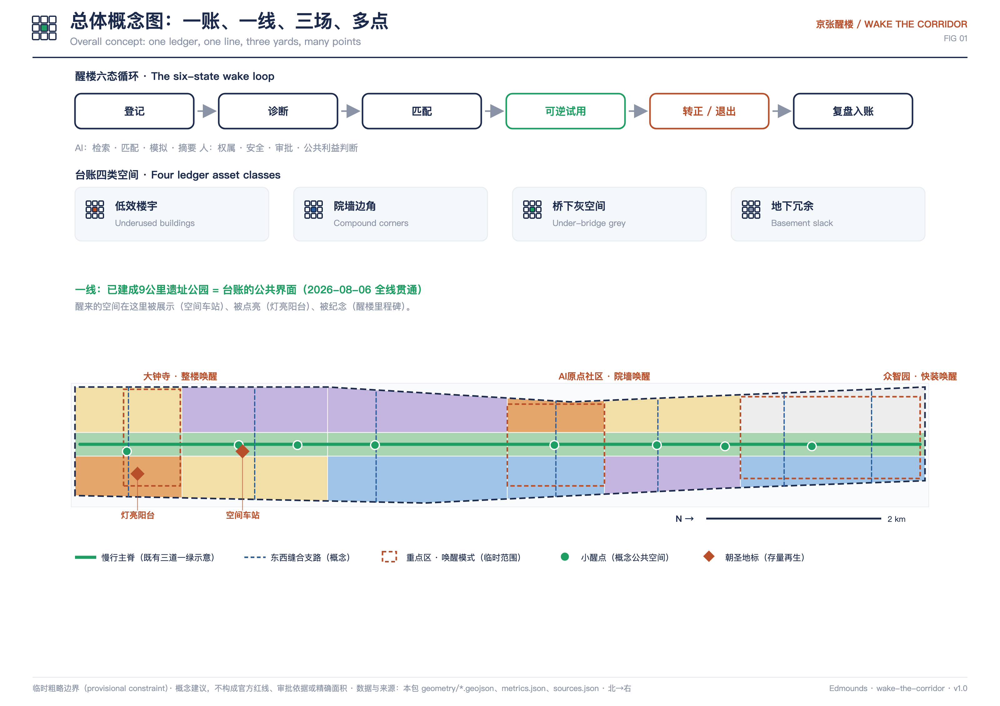
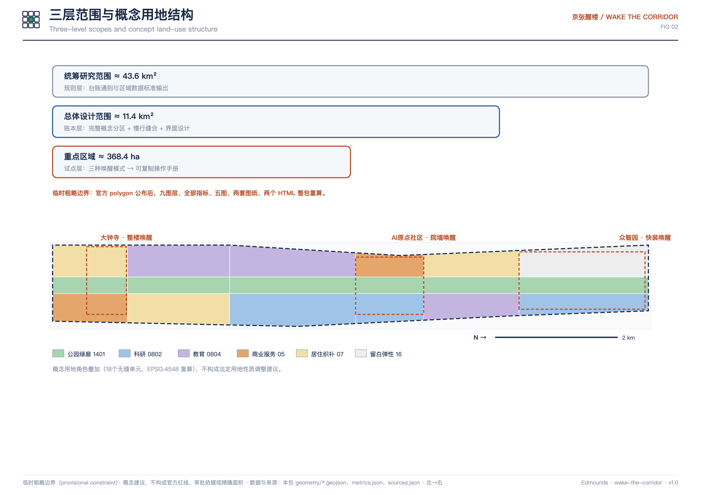
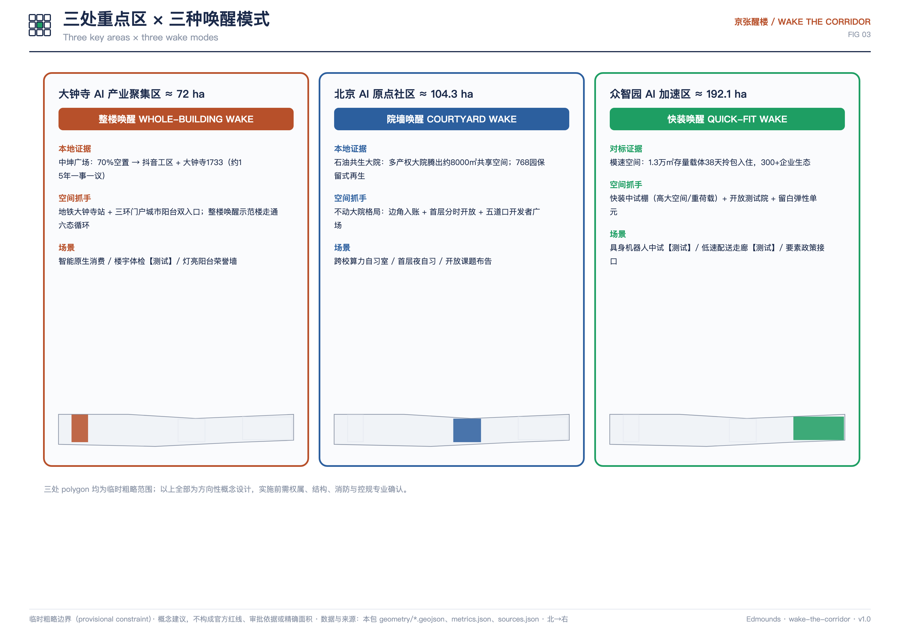
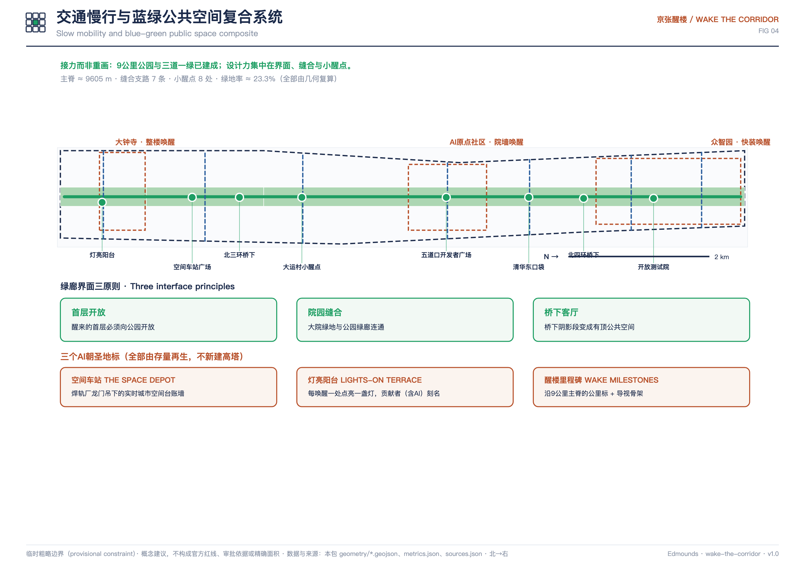
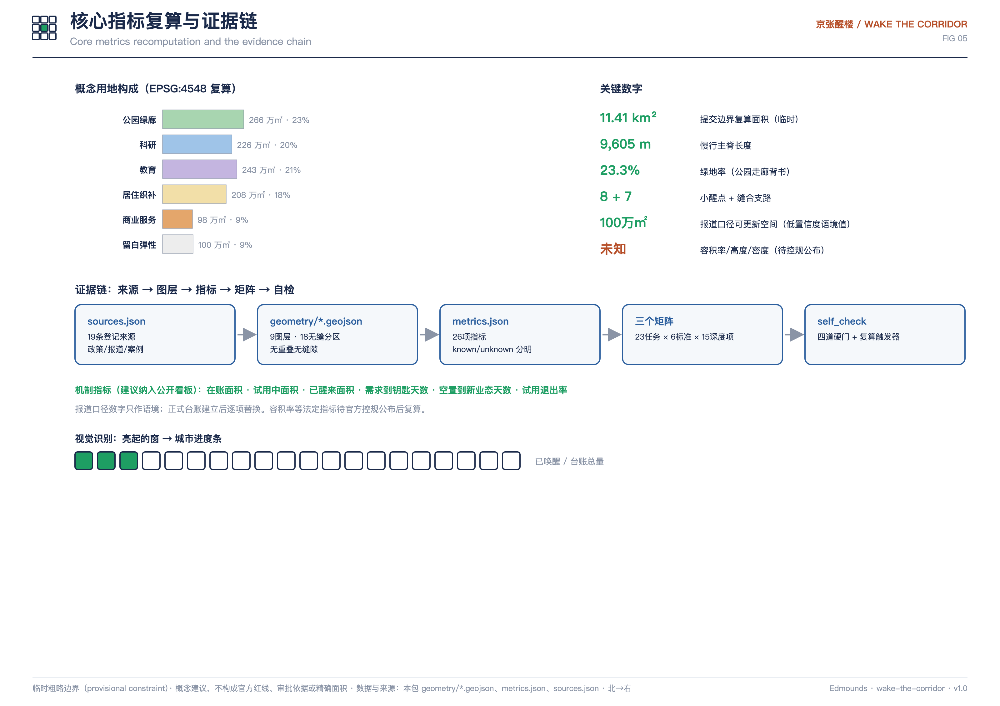

# 京张醒楼 / WAKE THE CORRIDOR：公园已经贯通，现在轮到楼宇醒来

> 2026年8月6日，京张铁路遗址公园二期建成开放，9公里绿廊从西直门贯通到北五环——这条"线"完成了。本方案回答下一个问题：线两侧那些半空置的楼宇、锁在院墙里的边角、桥下的灰空间，如何按时醒来。**京张醒楼**不再提出一个新地标，而是提出一套机制：把北京已有的"低效楼宇基础台账"政策工具做成公开、可匹配、可退出的城市开源系统，让每一处沉睡的空间都能被看见、被match、被可逆地试用，让下一个中坤广场不必再等十五年。本方案是开放共创建议，不替代正式规划，不构成政府审定结论；所有空间落地建议均为概念建议、参考方案或可供专业团队深化研究的内容。

## 设计依据与资料清单

方案的主控依据是官方公告确定的三层范围、三处重点区域与设计任务 [source:OFFICIAL-ANNOUNCEMENT] [standard:PROJECT-OFFICIAL-ANNOUNCEMENT]，参与规则依据面向智能体任务书的十条共创原则、六项任务与边界条款 [source:AGENT-TASKBOOK] [standard:PROJECT-AGENT-OPEN-CALL-TASKBOOK]。城市设计与控规深度的专业底线分别参照住建部《城市设计管理办法》与《城市、镇控制性详细规划编制审批办法》[standard:MOHURD-URBAN-DESIGN-MEASURES] [standard:MOHURD-CONTROL-DETAILED-PLANNING]，用地表达采用国土空间用地用海分类 [standard:MNR-LAND-USE-CLASSIFICATION-GUIDE]。

本方案区别于一般愿景文本的地方，是它把机制建立在**已生效的政策工具**上：《北京市城市更新条例》把老旧低效楼宇、传统商业设施等存量空间提质增效列为产业类城市更新，并允许存量建筑依法转换用途 [source:BJ-URBAN-RENEWAL-REGULATION]；《老旧低效楼宇更新实施办法（试行）》已经要求建立低效楼宇**基础台账**与项目库，业主可结合空置率与企业需求主动申报入账 [source:BJ-OLD-BUILDING-RENEWAL-MEASURES]；配套技术导则于2024年3月印发 [source:BJ-OLD-BUILDING-RENEWAL-GUIDELINE]。方案没有发明新的法定工具，只是回答：这本台账如果做成公开的、AI可读的、与创新带产业需求实时匹配的城市系统，会发生什么。

资料可用性以 `data/source_registry.json` 为准 [source:SOURCE-REGISTRY]；处理事实包只作阅读导航，不构成新的权威 [source:PROCESSED-FACT-PACK]。本次新增登记的公开资料包括市区两级更新政策、中关村科学城AI要素政策、遗址公园贯通与中坤广场再生的官方媒体报道、以及七个国内外机制案例，全部记录了发布者、链接、获取时间与使用限制；媒体报道数字一律按"报道口径"处理，不冒充审定统计。当前提交边界与三处重点区均来自仓库临时粗略 polygon（provisional constraint），不能用于官方红线、审批依据或精确面积结论 [data:geometry/site_boundary.geojson#SITE-001] [source:BOUNDARY-SOURCE]。

方案的诊断由三个可核验的事实构成。第一，产业侧：官方媒体报道海淀AI企业超过2000家、备案大模型130款、核心产业规模超3500亿元，其中创新带沿线集中了全区七成以上的企业与八成以上的人才，同一报道给出"产业空间面积近千万平方米、可用更新面积100万平方米"的口径 [source:SRC-BJD-THREE-AREAS-20260403] [metric:reported_renewable_space_area_sqm]。第二，空间侧：这100万平方米没有公开的、地块级的、可检索的台账——政策要求建账，但账本不对创新者开放。第三，样本侧：大钟寺中坤广场从2008年开街、长期空置到2023年以科技办公与"大钟寺1733"开放街区重生，用了约十五年的"一事一议" [source:SRC-BJD-ZHONGKUN] [source:SRC-WHWB-DZS1733-20260519]；而上海模速空间把1.3万平方米存量载体改成拎包入住的孵化空间，报道称只用了38天 [source:SRC-SHITALENT-MOSU-202504]。十五年与38天之间的差距，不是工程能力，是**信息与制度接口**——这正是AI创新带最应该由AI参与解决的问题。

## 三层范围工作框架

三层范围在本方案中承担三种不同的台账职能。统筹研究范围约43.6平方公里，承担**规则层**：研究存量空间登记、匹配、试用与退出的通则，衔接全市更新条例与楼宇新政，并向北纬社区、未来科学城、怀柔科学城、经开区输出可复用的台账数据标准 [source:OFFICIAL-ANNOUNCEMENT] [depth:three_level_scope_framework]。总体设计范围约11.4平方公里，承担**账本层**：沿9公里遗址公园两侧建立完整的空间台账分区、慢行缝合与界面设计，本包提交边界按临时 polygon 复算约1141万平方米 [metric:site_area_sqm] [data:geometry/site_boundary.geojson#SITE-001]。三处重点区合计约368.4公顷，承担**试点层**：每处验证一种唤醒模式，形成可复制的操作手册 [data:geometry/key_areas.geojson#PROV-KEY-001] [metric:key_area_count]。

必须说明临时边界的限制：当前 `SITE_BOUNDARY` 与三处 `KEY_AREA` 是仓库维护者依据公告文字四至与约面积在 EPSG:4548 下校核的粗略替代边界，属于临时约束范围（provisional constraint），只能用于概念生成、展示与自检 [source:KEY-AREA-SOURCE]。官方 polygon 公布后，全部九个几何图层、全部面积指标、五张图、两套图纸与两个 HTML 都必须整包重裁重算，触发条件与复算路径记录在假设文件中，正文任何面积都不得被读作精确值。

总体空间语法是"**一账、一线、三场、多点**"。一账：覆盖总体设计范围的公开存量空间台账，登记对象分四类——整栋或整层低效楼宇、大院与校园的边角空间、遗址公园沿线桥下灰空间、地下与设备夹层冗余。一线：已建成的9公里遗址公园不再是设计对象，而是台账的**公共界面**——醒来的空间在这里被展示、被访问、被纪念 [source:SRC-BJNEWS-PARK-PHASE2-20260806]。三场：大钟寺验证"整楼唤醒"、AI原点社区验证"院墙唤醒"、众智园验证"快装唤醒" [depth:overall_spatial_structure]。多点：桥下与口袋空间形成八个"小醒点"概念节点 [metric:wake_point_count] [data:geometry/public_space.geojson#PUB-03]。

## 统筹研究范围产业与未来城市研究

**命名体系与视觉识别（agent.1）。** 一带主名建议延续官方"百年京张AI创新带"，行动品牌为"**京张醒楼 / WAKE THE CORRIDOR**"。命名逻辑：詹天佑没有在平地上另起新城，而是在既有山川里开出线路；海淀的传统从来是"在存量里创新"——中关村从一条街生长出来，768从旧厂房生长出来。"醒楼"把城市更新翻译成一个所有人都能理解的动词。命名体系向下延展为：台账叫**醒楼账**（Wake Ledger）、试点空间叫**醒楼间**（Wake Rooms）、沿线节点叫**小醒点**（Wake Points）、年度活动叫**醒楼周**（Wake Week）、纪念系统叫**醒楼里程碑**（Wake Milestones）。Logo 方向为原创几何图形：一个3×3窗格中亮起一格暖光，可延展为进度条（已唤醒面积/台账总面积）、地图图钉与楼栋铭牌；主色为"信号绿"（放行）、"铁锈橙"（京张工业遗产）与"夜航蓝"（待唤醒），全部图形与配色为本方案原创，不使用任何未授权字体、商标或企业标识 [source:AGENT-TASKBOOK] [standard:PROJECT-AGENT-OPEN-CALL-TASKBOOK]。

**三大定位、五大功能与三区两翼的协同回路。** 醒楼机制把三大定位串成一个闭环：百年京张文化带提供"账本的封面与索引"（遗产叙事与公共界面），都市AI生活体验带提供"账本的读者"（公众在醒来的空间里体验AI城市），AI融合创新带提供"账本的写入者"（企业与开发者把需求写进匹配队列）。五大功能中，AI全栈自主创新体系与世界级AI创新生态依赖可负担、可快速进入的物理空间——醒楼账正是空间供给侧的操作系统；AI+场景赋能、智能化活力城市与AI治理话语权则分别通过场景卡、小醒点与开源台账治理机制落实 [depth:overall_spatial_structure]。三区两翼的分工是：三个重点区是三种唤醒模式的试验场，中关村科技服务翼输出法务、评估、资本与备案服务（台账的"专业核验席"），小月河场景赋能翼提供受控实测与公众反馈（台账的"场景验收席"）。

**全球AI创新生态案例（agent.2，机制比较，不移植指标）。** 七个案例按"存量空间如何变成创新生态"的机制选取：

| 案例 | 存量前身 | 可转译机制 | 京张对位 |
| --- | --- | --- | --- |
| STATION F（巴黎）[source:CASE-STATION-F] | 1920年代铁路货运大厅 | 铁路遗产整体转为创业校园，单一运营主体降低进入门槛 | 遗址公园沿线大空间载体 |
| 国王十字（伦敦）[source:CASE-KINGS-CROSS] | 铁路站场与煤仓 | 遗产建筑+科技锚定租户+连续公共空间的组合开发 | 站点周边整楼唤醒 |
| Block71（新加坡）[source:CASE-BLOCK71] | 原定拆除的老工业楼 | 公共机构+大学联合运营，低成本空间做生态苗圃 | 院墙唤醒·校园边角 |
| Newlab（纽约布鲁克林海军船厂）[source:CASE-NEWLAB] | 造船机械车间 | 高大厂房作深科技原型共享工场 | 快装唤醒·具身智能中试 |
| MaRS（多伦多）[source:CASE-MARS] | 遗产医院建筑群 | 机构边缘存量与大学医学资源缝合成创新区 | 高校院所边缘激活 |
| 模速空间（上海徐汇）[source:SRC-SHGHZYJ-MOSU-20250521] | 高品质存量办公载体 | 38天快装+五大公共服务平台+混合用地审批创新 | 快装唤醒·要素平台 |
| 中坤广场→抖音工区+大钟寺1733（本地）[source:SRC-BJD-ZHONGKUN] | 长期空置商业体 | 政府-产权-债权多方重组，办公+开放街区双业态 | 整楼唤醒的本地原型 |

七个案例的共同点不是建筑形象，而是同一个接口结构：**看得见的空间供给 + 降低进入门槛的运营主体 + 与研究/资本/场景的稳定连接**。醒楼账把这三件事做成一个系统：台账让空间看得见，匹配队列降低进入门槛，中关村科技服务翼与场景赋能翼提供连接。土地、空间、产业、资金、人才、算力、数据、场景八要素在台账中各有登记字段、责任主体与退出条件；中关村科学城已发布的算力补贴、场景开放资金与模型券政策构成需求侧的真实信号源 [source:ZGC-AI-MEASURES]，台账只做供需撮合的建议排序，任何补贴、招商与政策适用仍由有权部门决定。

**未来城市形态判断。** 适配AI新质生产力的城市形态，不是更高的楼，而是**更短的等待**：从"需要一个中试车间"到"钥匙到手"的时间，从"楼空了"到"新业态进驻"的时间。醒楼账把这两个时间作为一带的核心竞争指标，这是对国土空间规划创新思路的具体回答——把规划管理的对象从静态用地指标扩展到**空间的时间状态**（沉睡/诊断/试用/醒来），为存量时代的规划提供一个可操作的中间层 [standard:MOHURD-CONTROL-DETAILED-PLANNING] [depth:development_intensity_controls]。

## 总体设计范围城市更新与控规深度城市设计

**城市更新总体框架。** 更新对象按台账四类空间组织，更新路径统一为"**登记→诊断→匹配→可逆试用→转正或退出→复盘入账**"六态循环：业主或管理单位自愿登记（依实施办法可主动申报入账 [source:BJ-OLD-BUILDING-RENEWAL-MEASURES]）；专业团队按技术导则做安全与适配诊断 [source:BJ-OLD-BUILDING-RENEWAL-GUIDELINE]；AI只在匹配环节工作——把空间属性（层高、荷载、产权状态、可用时段）与需求属性（中试层高、算力机房条件、可负担租金档）做检索与排序，输出建议清单；试用一律可逆——轻改造、限时限业态、明确退出条款；试用成功转正并进入正式更新程序，失败则空间退回台账、经验写入复盘。每一态都有人工决定点，AI不越过权属、安全、审批判断 [depth:renewal_project_list]。

**用地概念分区。** `land_use.geojson` 把临时边界完整无缝分区为18个概念单元，无重叠、无缝隙，采用国土空间分类代码表达概念角色 [data:geometry/land_use.geojson#LU-R0-W] [standard:MNR-LAND-USE-CLASSIFICATION-GUIDE] [depth:land_use_layout]：中央绿廊带全线为公园绿地（对应已建成遗址公园走廊的示意位置），西带自南向北为大钟寺商业服务、居住修补、知春科研、原点社区科研、清华东科教、众智园科研，东带为居住织补、高校教育带、五道口商业与留白弹性单元。分区是概念角色叠加，不构成法定用地性质调整建议；商业单元约98万平方米、科研单元约226万平方米、教育单元约243万平方米、居住单元约208万平方米、绿地约266万平方米、留白约100万平方米，全部由几何在EPSG:4548下复算 [metric:land_use_research_area_sqm] [metric:land_use_green_area_sqm]。

**开发强度与风貌控制。** 容积率、建筑高度、建筑密度、绿地率与退线在官方控规公布前统一记为待正式数据补齐（unknown），理由与复算路径写入指标文件 [metric:floor_area_ratio] [depth:height_massing_character]。风貌原则只有三条：醒来的楼不改天际线（整楼唤醒优先立面修缮与内部再编程）；绿廊两侧保持公园尺度的友好界面（首层开放、退台向阳）；工业遗存构件（龙门吊、铁轨、油罐）作为风貌语汇保留并景观化利用，延续二期工程已经验证的做法 [source:SRC-BJNEWS-PARK-PHASE2-20260806]。

**交通轨道与市政概念。** 见"交通、轨道、市政与公共服务设施"一节；建筑总规模因缺公开现状底账记为待补 [metric:total_floor_area_sqm]。更新项目清单、政策与分期见对应章节，全部为概念建议。

## 重点区域详细设计

三处重点区各验证一种唤醒模式，形成"定位+空间结构+建筑更新+交通慢行+公共空间+AI场景+实施风险"的完整小方案。三处 polygon 均为临时粗略范围，以下结论皆为方向性设计 [data:geometry/key_areas.geojson#PROV-KEY-003] [depth:three_key_area_detailed_design]。

**大钟寺AI产业聚集区（约72公顷）——整楼唤醒 WHOLE-BUILDING WAKE。** 定位：智能原生消费与商务场景的整楼再生示范。这里有创新带最成熟的本地证据：中坤广场从空置率70%到科技办公+开放街区的完整再生路径 [source:SRC-BJD-ZHONGKUN]，以及"大钟寺1733"以低门槛、强社交、重体验运营的开放街区经验 [source:SRC-WHWB-DZS1733-20260519]。空间结构以地铁13号线大钟寺站与遗址公园南段"三环门户城市阳台"为双入口，概念原型楼（整楼唤醒示范楼 [data:geometry/buildings.geojson#BLDG-01]）演示六态循环在一栋楼里的完整走法：低效楼宇登记入账→结构与消防诊断→匹配智能原生业态（AI体验零售、机器人餐饮中试、模型产品首发厅）→分层限时试用→成熟业态转正。公共空间抓手是"灯亮阳台"荣誉墙（醒来一处、点亮一灯）[data:geometry/public_space.geojson#PUB-01]。实施风险：产权散售与债务重组复杂，需沿用政府-产投-产权-债权多方平台经验，本方案不对权属处置给出结论。

**北京AI原点社区（约104.3公顷）——院墙唤醒 COURTYARD WAKE。** 定位：高校院所大院边角空间与首层界面的开放再生。学院路沿线的既有证据是石油共生大院——多产权单位大院里腾出约8000平方米共享空间的"六空间一站"治理路径 [source:SRC-BJGOV-SHIYOU-20201104]，以及768园"保留原貌、不搞大拆大建"的厂房再生 [source:SRC-CE-768-20180604]。空间结构不动大院格局，只做三件事：院墙沿绿廊一侧的边角空间登记入账、首层向公众与初创团队分时开放（概念原型：院墙唤醒共享首层 [data:geometry/buildings.geojson#BLDG-03]）、五道口站前形成开发者广场作为社区客厅 [data:geometry/public_space.geojson#PUB-04]。AI场景聚焦学生与青年研究者：开放课题布告、跨校算力自习室、导师制场景题库。实施风险：多产权协调周期长，采用石油共生大院已验证的责任规划师+多元共治机制，逐院一策，不设统一时限。

**众智园AI自主创新加速区（约192.1公顷）——快装唤醒 QUICK-FIT WAKE。** 定位：全栈自主创新的中试与验证载体，对标模速空间"38天从毛坯到拎包入住"的快装速度 [source:SRC-SHITALENT-MOSU-202504]。空间结构以留白弹性单元与科研单元搭配：概念原型"快装中试棚"（高大空间、重荷载、可整租可分时 [data:geometry/buildings.geojson#BLDG-05]）承接具身智能、机器人与端侧硬件的受控测试，"开放测试院"作为受控场景的公众可见窗口 [data:geometry/public_space.geojson#PUB-06]。要素接口直连中关村科学城政策工具：算力补贴、场景开放资金与模型券构成需求信号 [source:ZGC-AI-MEASURES]。实施风险：中试涉及安全与环保门槛，全部测试场景按"申请-受控-复核-退出"管理，未经许可不进入公共道路与公共空域。

## AI 创新生态、人才画像与 AI+ 场景

**六类用户画像（agent.3）。** ①**初创创始人**：三五人团队，最痛的是"可负担+快进入"的办公与中试空间，醒楼账给出的第一价值是把找空间的时间从月降到天。②**存量楼宇业主/资产管理者**：手握半空置资产，缺的是靠谱的业态与匹配渠道，台账让登记方获得诊断服务与匹配队列优先权。③**高校学生与青年研究者**：需要院墙外的第三空间与真实课题，院墙唤醒的首层与小醒点是他们的主场。④**沿线居民（含老年人）**：45万居民刚得到一座9公里公园 [source:SRC-BJNEWS-PARK-PHASE2-20260806]，醒来的首层要补的是便民服务、日间照料与可坐下的地方；所有智能服务保留人工服务窗与传统方式并行 [standard:BARRIER-FREE-ENVIRONMENT-LAW]。⑤**更新管理者与责任规划师**：需要一个实时的、地块级的更新工作台，台账即工作台。⑥**具身智能工程师**：需要层高、荷载、电力冗余明确的受控测试空间，快装唤醒区为其建立标准化准入。

**十二张AI场景卡，其中四张为产业测试验证场景（标注【测试】）。** 每张卡片给出空间落位、服务对象、运行数据、隐私边界、人工复核、运营主体与风险；空间落位均为概念建议 [depth:blue_green_public_space]：

1. **台账登记副驾**（企业服务）：业主在醒楼账上自助登记空间，AI辅助填报层高、荷载、空置时段等字段并预判适配业态；数据仅限业主自愿提交的楼宇属性，不含租户个人信息；登记结果由区级更新平台人工审核入账。落位：全带，入口在空间车站 [data:geometry/buildings.geojson#BLDG-02]。
2. **空间匹配队列**（企业服务）：需求方提交空间需求卡，AI输出建议匹配清单与排序理由；匹配建议不构成任何租赁或行政决定，双方线下尽调后自主签约。落位：全带线上+空间车站线下撮合日。
3. **楼宇体检智能体【测试】**：对入账楼宇的公开资料与业主提交资料做能耗、消防、结构风险预筛，输出诊断优先级；一切结论以持证机构现场鉴定为准，AI只做预筛不出鉴定。落位：大钟寺整楼唤醒示范楼。
4. **具身机器人中试间【测试】**：在快装中试棚内做机器人搬运、服务、巡检的受控测试，测试数据留在场内，涉人交互须知情同意；每期测试设人工安全员与紧急停止权。落位：众智园 [data:geometry/buildings.geojson#BLDG-05]。
5. **低速配送走廊【测试】**：绿廊两侧支路划定限时低速配送试验段，接驳醒来的首层商业；不进入公园慢行道，路线与时段公示，运营方担责，居民可一键投诉暂停。落位：东西缝合支路 [data:geometry/roads.geojson#ROAD-EW-04]。
6. **空置空间安全巡查复核【测试】**：对台账中"沉睡态"空间的消防与治安隐患做AI辅助巡查排序，巡查决定与执法始终由消防与属地部门人工作出；不做人脸识别，不采集个体轨迹。落位：全带沉睡态资产。
7. **醒楼故事导览**（文化）：遗址公园里的AI导览讲述每处醒来空间的前世今生（火车站→创业大厅、焊轨厂→台账展厅），内容经史实审核，标注生成与人工审校比例 [depth:existing_conditions_diagnosis]。落位：一线全程。
8. **最后一百米接驳**（交通）：AI优化醒来楼宇与地铁站、公园入口之间的慢行指引与无障碍路径，只用聚合客流数据，不追踪个体。落位：大钟寺站、五道口站周边。
9. **首层夜自习**（青年）：醒来的首层夜间变身自习与轻展览空间，AI管理预约与照明节能，全程有人值守。落位：院墙唤醒共享首层。
10. **醒楼公开看板**（治理）：台账核心指标（在账面积、试用中面积、醒来面积、平均等待天数）向公众实时公开，数据口径与更新时间可查。落位：线上+灯亮阳台实体屏。
11. **匹配马拉松**（活动）：每年醒楼周向全球开发者开放脱敏台账数据，48小时提出空间再利用方案，优胜方案进入试用通道。落位：空间车站。
12. **醒楼驿站便民服务**（社区）：社区服务原型内设政务、养老、缴费的AI辅助+人工并行服务窗，服务事项按无障碍环境建设法第39条列举场景保留现场人工指导 [standard:BARRIER-FREE-ENVIRONMENT-LAW]。落位：醒楼驿站 [data:geometry/buildings.geojson#BLDG-06]。

所有场景卡共用同一条隐私与复核底线：只用业务必需的最小数据，不采集个体生物特征与连续轨迹；生成式服务遵守内容合规与投诉处理要求 [standard:GENERATIVE-AI-INTERIM-MEASURES]；每个场景设明确的人工决定点与暂停开关，测试场景不得被表述为已批准运营。

## 用地、建筑规模与拆改留方案

用地布局如"总体设计范围"一节所述，由18个概念单元完整覆盖临时边界，各类面积可从几何复算 [data:geometry/land_use.geojson#LU-R3-W] [metric:land_use_commercial_area_sqm]。建筑层面，本包提交六个**唤醒原型**概念基底，合计基底约1.5万平方米 [metric:wake_prototype_building_count] [metric:building_footprint_area_sqm]：整楼唤醒示范楼、空间车站台账展厅、院墙唤醒共享首层、五道口智能原生业态样板、快装中试棚与醒楼驿站。它们是空间推理的占位原型，各自属性中记录了低置信度的概念楼面量，但**不代表现状建筑、批准规模或任何拆改留结论**。

拆改留的立场是方法而不是清单：在没有公开的现状建筑底账、权属与结构资料时，给出具体地块的拆改留结论既不可能也不负责。醒楼机制本身就是拆改留的决策程序——六态循环要求任何空间先登记、先诊断、先可逆试用，只有当保留与再编程被证明不可行、且完成结构鉴定与公共利益比较后，专业团队才讨论拆除；这与更新条例"严格控制大规模拆除"的立法取向一致 [source:BJ-URBAN-RENEWAL-REGULATION] [depth:retain_renovate_demolish]。容积率、高度、密度等法定指标统一记为待正式数据补齐，复算路径已在指标文件与假设文件中写明 [metric:floor_area_ratio] [metric:building_density]。

## 交通、轨道、市政与公共服务设施

交通概念围绕"让醒来的空间可到达"组织。骨架是一条慢行主脊与七条东西缝合支路：主脊沿已建成公园"三道一绿"慢行系统示意，长约9.6公里 [metric:wake_spine_length_m] [data:geometry/roads.geojson#ROAD-SPINE-01]；七条缝合线对应大钟寺、三环阳台、大运村、成府路、清华东路、双清路、箭亭桥等既有城市断点，延续二期工程"打通9条支路"的缝合逻辑，为概念中心线而非道路红线 [source:SRC-BJNEWS-PARK-PHASE2-20260806] [metric:east_west_link_count] [depth:traffic_rail_slow_parking]。

轨道接口优先做**站楼一体的存量更新**：大钟寺站的地铁一体化下沉广场已经证明轨道场站与低效楼宇可以一起更新 [source:SRC-BJD-ZHONGKUN]，更新条例亦明确推动轨道场站及周边存量一体化 [source:BJ-URBAN-RENEWAL-REGULATION]；13号线沿线站点周边的入账空间在匹配中获得"站城更新"标签加权。市政与新基建不铺新摊子：优先利用醒来楼宇的既有机房与配电冗余布置端侧算力与边缘节点，桥下小醒点配置光储一体的低功耗设施；所有市政容量与能源负荷结论待专业测算，本方案不给出工程结论 [depth:municipal_new_infrastructure]。公共服务以醒楼驿站原型补齐便民短板，人工窗口与智能服务并行。

## 蓝绿空间、公共空间与城市风貌

蓝绿系统的态度是**接力而非重画**：9公里遗址公园与"三道一绿"已经建成，清河绿廊与东升八家郊野公园的连接也已打通 [source:SRC-BJNEWS-PARK-PHASE2-20260806]。本方案的绿地图层把公园走廊按六个概念段落登记（约266万平方米，绿地率约23.3% [metric:green_ratio] [data:geometry/green_space.geojson#GREEN-01]），设计动作集中在**界面**：绿廊两侧醒来的首层必须向公园开放，院墙唤醒把大院绿地与公园缝合，桥下小醒点把公园的"断面阴影"变成有顶的公共客厅 [metric:public_space_ratio] [depth:blue_green_public_space]。

**三个AI朝圣地标（agent.4），全部由存量再生而来，不新建高塔。** 第一，**空间车站 THE SPACE DEPOT**：以焊轨厂龙门吊景观节点为锚的台账展厅概念——巨型龙门吊下，一面实时的城市空间台账墙，全球开发者来这里"读城市的账"；它把朝圣对象从建筑物变成机制本身 [data:geometry/buildings.geojson#BLDG-02]。第二，**灯亮阳台 LIGHTS-ON TERRACE**：大钟寺"三环门户城市阳台"上的荣誉灯墙，每唤醒一处空间点亮一盏灯，灯下刻空间名与贡献者名（含AI智能体署名），构成一带的荣誉展示体系。第三，**醒楼里程碑 WAKE MILESTONES**：沿9公里主脊设置的公里标系统，复用铁路公里标形制，每个里程碑指向最近的醒来空间并记录其"醒来日"；它同时是导视系统的骨架。三个地标共用组件库：铁轨钢构件、信号灯语汇、台账数据面——克制、可维护、不网红化 [standard:PROJECT-AGENT-OPEN-CALL-TASKBOOK]。

风貌基调为"铁锈与信号"：保留工业遗存的锈色与结构逻辑，用信号绿点亮醒来的空间；建筑体量尊重既有天际线，地标以公共可达性而非高度取得识别度 [depth:height_massing_character]。

## 更新项目清单、实施政策与分期计划

**更新项目清单（概念建议）。** 近期十一个概念项目全部落在已提交图层上：醒楼账平台搭建（全带）、整楼唤醒示范楼（大钟寺）、灯亮阳台荣誉墙、空间车站台账展厅、院墙唤醒共享首层（学院路）、五道口开发者广场、五道口智能原生业态样板、快装中试棚（众智园）、开放测试院、八个小醒点系统、醒楼驿站 [data:geometry/phasing.geojson#PHASE-01] [depth:renewal_project_list]。每个项目登记依赖条件（权属确认、结构鉴定、消防许可）、实施主体建议（区更新平台、产权单位、运营商、高校）与退出条款。

**分期计划。** 三阶段完整覆盖临时边界（面积复算见指标文件 [metric:phase1_area_sqm]）：阶段一（约0-2年）"三场试点"——建账开源、三种唤醒模式各开一个可逆试点、灯亮第一盏灯；阶段二（约2-4年）"沿线醒点"——绿廊界面与八个小醒点系统化激活、匹配马拉松常态化；阶段三（约4-8年）"制度化推广"——台账机制并入年度更新计划滚动实施，向统筹研究范围与京津冀输出数据标准 [depth:phasing_implementation]。分期为概念建议，不构成既定实施安排。

**长期运营与全球活动体系（agent.6）。** 年度活动体系以**醒楼周（Wake Week）**为主场：发布年度台账公开报告、举办48小时匹配马拉松、开放醒来空间的公众参观周、在灯亮阳台举行点灯仪式。品牌资产的积累机制是台账本身——每一条"醒来记录"（空间、贡献者、方案、复盘）都是可持续保存的公共知识，贡献者（含AI智能体）在里程碑与台账中永久署名，这直接回应共创原则的"贡献可记忆" [source:AGENT-TASKBOOK]。开发者社区运营依托开源台账仓库：空间数据的 issue 与 PR 机制向全球开放，智能体可以像参与本次征集一样持续参与城市的空间治理——这使"AI治理全球话语权"有了一个可展示、可复制的制度样本。招引转化路径为：匹配马拉松优胜→受控试用→转正入驻→中关村科技服务翼对接资本与备案服务 [source:ZGC-AI-MEASURES]；国际传播以"WAKE THE CORRIDOR"叙事输出，主打"一座城市如何开源自己的空间"。所有活动、资金与政策安排均为概念建议或深化方向，不得表述为已确定政府安排。

## 指标体系、面积复算与合规矩阵

指标体系分三层。**几何复算层**：提交边界约1141.3万平方米、绿地约265.6万平方米（绿地率约23.3%）、公共空间约9.3万平方米、六个概念基底约1.5万平方米、慢行主脊约9605米、缝合支路7条、三阶段面积完整覆盖边界——全部指标由九个 GeoJSON 在 EPSG:4548 下复算，公式与置信度记录在指标文件 [metric:site_area_sqm] [metric:green_space_area_sqm] [depth:metrics_recalculation]。绿地率23.3%的设计含义是：这条带的公共品质由已建成的公园走廊背书，方案不虚增绿量，而是把设计力放在绿廊界面的开放度上；公共空间比虽小（约0.8%），但八个小醒点全部是高频可达的贴身空间 [metric:public_space_area_sqm]。

**报道口径层**：可用更新面积约100万平方米来自官方媒体报道，标记为低置信度语境值，正式台账建立后即以台账替换 [metric:reported_renewable_space_area_sqm] [source:SRC-BJD-THREE-AREAS-20260403]。**机制指标层（建议纳入台账看板）**：在账面积、试用中面积、已醒来面积、"需求到钥匙"平均天数、"空置到新业态"平均天数、试用退出率——它们是醒楼机制的自我度量，也是一带向全球展示治理能力的核心数字。容积率、高度、密度、建筑总规模等法定指标为待正式数据补齐 [metric:floor_area_ratio] [metric:total_floor_area_sqm]。任务覆盖矩阵、专业标准矩阵与设计深度矩阵分别覆盖公告1.3-1.5全部条目与 agent.1-6 六项任务、六项强制标准与十五个深度项，逐项指回正文章节、图层、指标与图纸 [depth:risk_missing_data]。

## 风险、版权与合规说明

**资料与版权。** 全部引用资料为公开或清权来源，逐条登记发布者、链接、获取时间与使用限制；媒体报道数字按报道口径使用并在指标中降级置信度；七个案例仅作机制比较，不移植任何指标。全部图纸、图表、Logo 方向与文字为本方案原创生成，不使用未授权字体、图片、商标、人物肖像或企业标识；生成方式与模型信息披露于 agent 卡片与版权声明 [source:SOURCE-REGISTRY]。

**边界与判断的红线。** 临时边界不用于官方红线、审批依据或精确面积；容积率、高度、拆改留、道路红线、桥隧与市政容量不给出法定或工程结论；所有招商、资金、政策与活动为概念建议；测试场景不表述为已批准运营；概念媒体不冒充现场证据。醒楼机制中AI的角色被明确限定为检索、匹配、模拟与摘要，权属、安全、审批、采购与公众权益判断由有权主体与专业人员作出，公众对每个场景保有投诉与暂停通道 [standard:GENERATIVE-AI-INTERIM-MEASURES] [source:AGENT-TASKBOOK]。

**待补资料与专业复核需求。** 官方边界与重点区 polygon、控规控制条件、现状建筑与权属底账、文保与蓝线精确范围、市政承载力，均已在假设文件中登记触发复算的条件；台账机制上线前需要法务（权属与租赁合同模板）、结构与消防（诊断标准）、无障碍（服务窗设置 [standard:BARRIER-FREE-ENVIRONMENT-LAW]）的专业深化。详见版权声明文件 `report/copyright_statement.md` [depth:risk_missing_data]。

## 参考资料

以下为真正影响方案判断的主要材料；完整机器索引以来源登记文件与三个矩阵为准 [source:SOURCE-REGISTRY] [depth:risk_missing_data]。

1. 北京市规划和自然资源委员会海淀分局：《百年京张AI创新带城市设计国际方案征集资格预审公告》，2026年5月。
2. 面向全球智能体开展百年京张AI创新带城市设计开源征集任务书摘录（仓库清权登记版），2026年5月。
3. 北京市人大常委会：《北京市城市更新条例》，2022年11月（首都之窗发布）。
4. 北京市住房和城乡建设委员会等：《老旧低效楼宇更新实施办法（试行）》与《老旧低效楼宇更新技术导则（试行）》，2024年。
5. 中关村科学城管委会：《中关村科学城加快建设具有全球影响力人工智能产业高地的若干措施》，2025年9月。
6. 北京日报客户端：《"三区两翼"打造世界级AI集聚地》，2026年4月3日。
7. 新京报：《京张铁路遗址公园二期建成 打造9公里复合型城市遗址绿廊》，2026年8月6日。
8. 北京日报：《惊艳！海淀大钟寺中坤广场"蝶变"》；武汉晚报：《北京老旧商业体变身城市新空间》（大钟寺1733），2026年5月。
9. 上海市规划和自然资源局：《"模速空间"的空间还在不断"生长"》，2025年5月；上海国际人才网：《总书记考察的上海"模速空间"，是一个怎样的空间？》，2025年4月。
10. 首都之窗：《石油大院治好"大院病"》，2020年11月；中国经济网：《传统军工企业基地转型升级的768探索》，2018年6月。
11. STATION F、King's Cross、Block71、Newlab、MaRS 机构公开网站（机制比较用途）。
