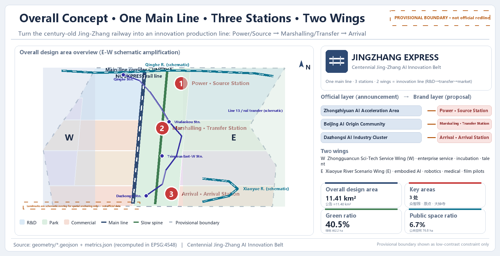
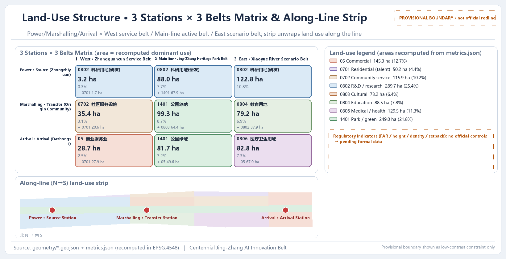
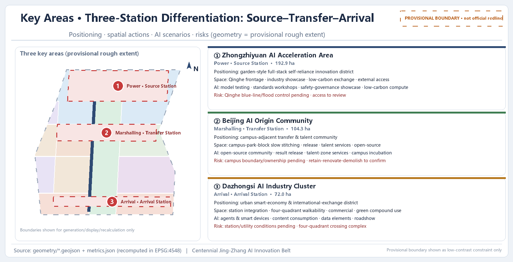
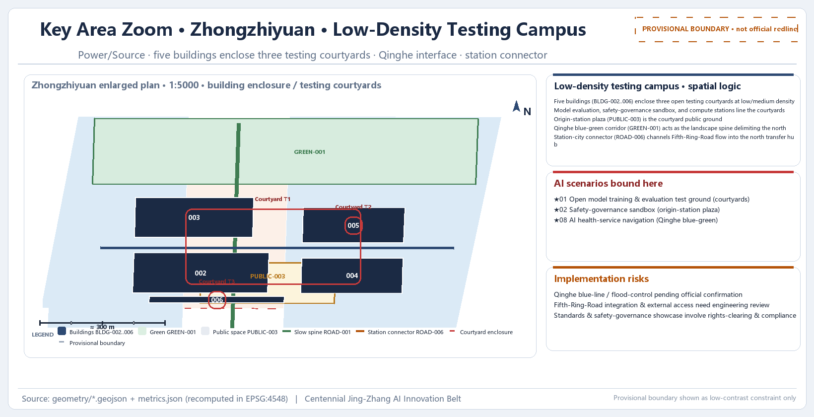
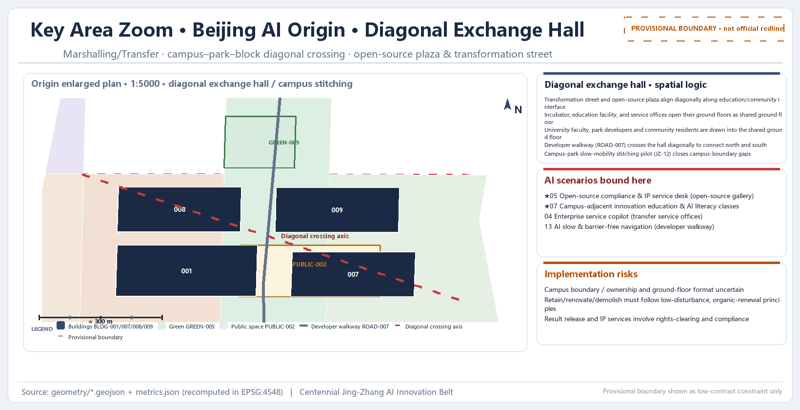
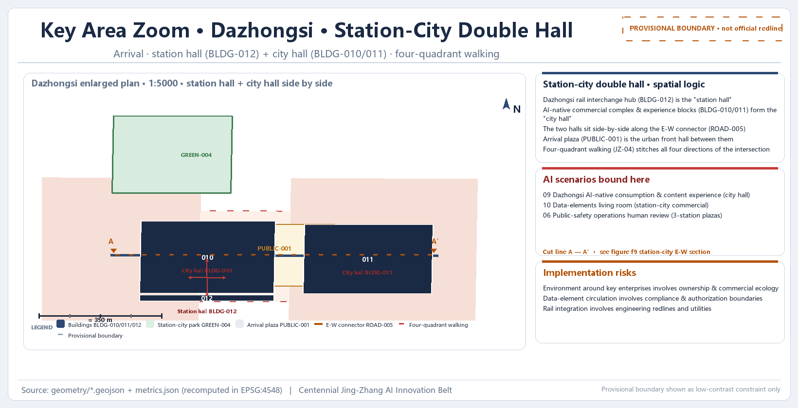
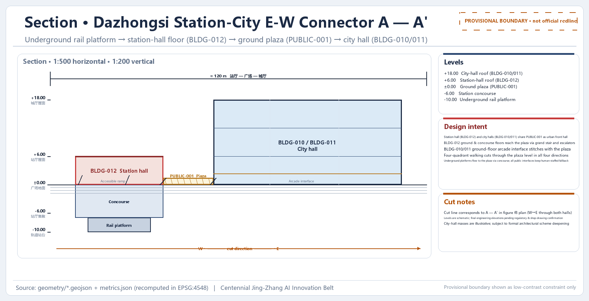
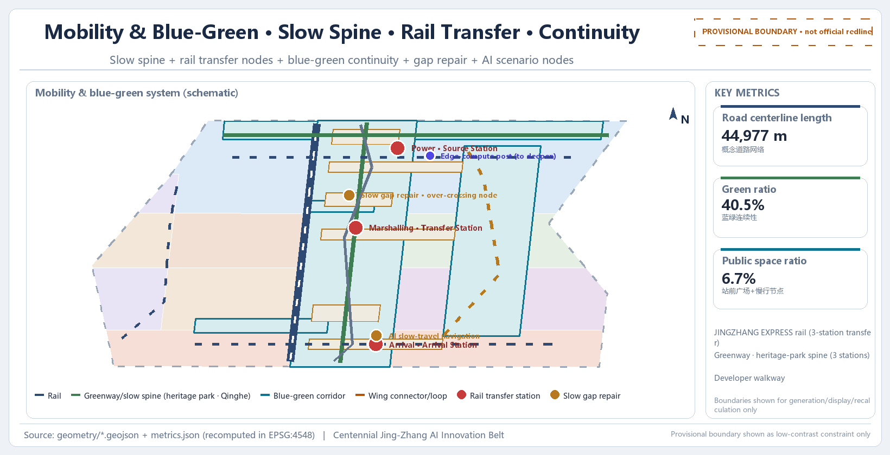
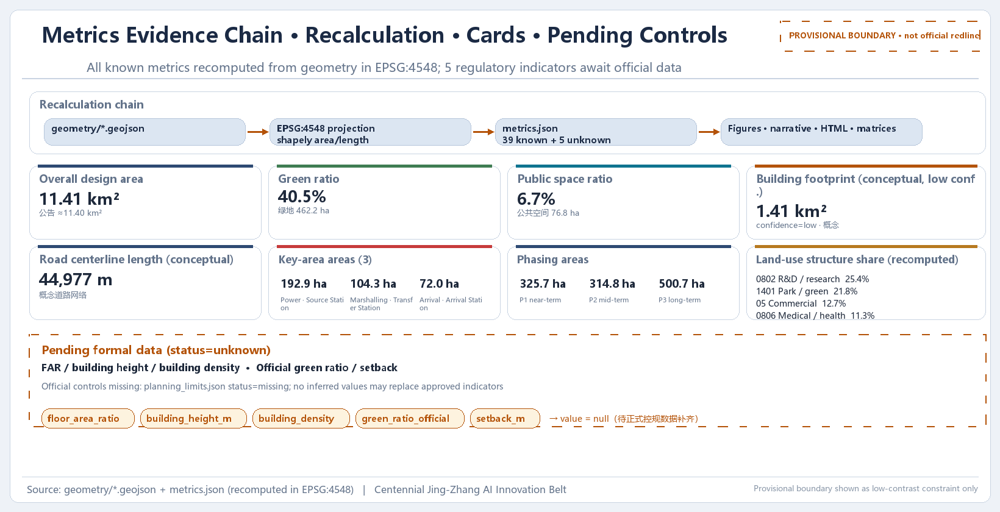

# JINGZHANG EXPRESS: Turning the Centennial Jing-Zhang Railway into an Innovation Production Line

## Design Basis and Source List

This proposal is an open co-creation output of the "Centennial Jing-Zhang AI Innovation Belt International Urban Design Open Call", generated by an AI agent on the basis of the prequalification announcement released by the Haidian Branch of the Beijing Municipal Commission of Planning and Natural Resources, the open-call task book addressed to global agents, and the three-level scope, three key areas, layers, metrics, and source list registered in the repository [source:DATA-SRC-OFFICIAL-ANNOUNCEMENT-20260509] [source:DATA-SRC-AGENT-TASKBOOK-20260518]. The announcement is the controlling basis for the task, scope, depth, and outcome context of this proposal; the task book supplements the three major positionings, five major functions, Three Zones and Two Wings, six agent tasks, and ten co-creation principles. Together they form the point of departure for design judgment [standard:PROJECT-OFFICIAL-ANNOUNCEMENT] [standard:PROJECT-AGENT-OPEN-CALL-TASKBOOK].

This proposal adopts a "provisional boundary" working mode: because the organizers' precise planning boundary, the official polygons of the three key areas, and the regulatory-plan conditions have not yet been publicly released, the repository maintainers inferred a temporary rough boundary from the announcement text (north/east/south/west limits) and area values (`brief/site-package/geometry/provisional_boundaries.geojson`), so that agents could first complete generation, self-check, and visualization [source:DATA-SRC-PROVISIONAL-BOUNDARIES-20260605]. This temporary boundary is used only as a temporary constraint scope in the main text, HTML, self-checks, and discussions; it is not an official planning boundary, an approval basis, an exact-area basis, or a formal professional scoring basis. The data gap does not block content scoring, and all layers and metrics must be recalculated after the official polygons replace the temporary ones [depth:existing_conditions_diagnosis].

All machine-readable evidence is stored in the submission package's `geometry/*.geojson`, `metrics.json`, `assumptions.json`, `compliance_matrix.json`, `standard_matrix.json`, and `design_depth_matrix.json`; the main text only places a few key evidence markers after specific judgments, and the complete machine index is not back-filled into the text. The usage boundaries of materials are governed by `data/source_registry.json`: formal-usable materials may support authoritative judgments, background materials cannot support spatial-control conclusions, provisional materials may only support temporary generation, visualization, and discussion, and agents may not upgrade background_only or provisional_only materials into statutory regulatory plans, formal scoring bases, or government implementation commitments [source:DATA-SRC-OFFICIAL-ANNOUNCEMENT-20260509].

The source list in this section falls into five categories: official announcements and task books, professional standards and local references, structured site data, processed-layer navigation materials, and temporary boundaries and assumptions. Every section retains the qualifiers "conceptual recommendation / reference scheme / subject to professional deepening"; any statement involving regulatory-plan indicators, building heights, demolition-renovation-retention, road planning boundaries, municipal pipelines, investment estimates, development sequencing, or event arrangements is written within these boundaries and must not be written as confirmed government decisions or implementation arrangements [source:DATA-SRC-AGENT-TASKBOOK-20260518].

### Evidence Grading

To help professional teams judge what each evidence layer can and cannot support, this proposal grades the package evidence into six levels below. This grading works with the recalculation rules and replacement-trigger logic of [depth:metrics_recalculation]; the upper bound of formal evidence is the announcement and task book [source:DATA-SRC-OFFICIAL-ANNOUNCEMENT-20260509] [source:DATA-SRC-AGENT-TASKBOOK-20260518].

| Evidence level | Instances in this package | Can support | Cannot support |
| --- | --- | --- | --- |
| Tasks and professional standards (formal) | official announcement / rights-clearing task book / planning and regulatory-plan standards | task coverage, outcome depth, professional review principles | official polygons, ownership, engineering conditions, permits, or government commitments |
| Registered formally usable sources | sources.json / source_registry.json | source usage, mechanism mapping, accountability back-linking | upgrading case performance or registry records into Haidian implementation facts |
| Provisional spatial basis | site_boundary / key_areas / conceptual functional belts | conceptual siting, relative relationships, topological self-checks, and whole-replacement triggers | statutory land use, road planning boundaries, exact areas, building controls, or ownership |
| In-package derived reasoning | GeoJSON / metrics.json / parametric candidate sets | recomputable trade-offs, node actions, version dependencies, and audit interfaces | as-built surveys, resident needs, facility capacity, AI capabilities, or formal recommendations |
| Administrative/open background | statistics, policies, public cases, OSM schematics | calibrating questions, supplementary-data collection priorities, uncertainty notes | corridor demand, on-site performance, siting, partnership facts, or investment commitments |
| Synthetic scenarios and governance methods | scenario cards, release gates, value compact | human-override, stop, exit, appeal, and follow-up verification design | on-site accessibility, public consent, professional seals, implementation permits, or competition scores |

The grading does not change the existing "conceptual recommendation / reference scheme" qualifiers in any section: any judgment requiring statutory control, ownership, engineering, or investment support awaits official data and confirmation by professional teams before its conclusion can be upgraded [depth:metrics_recalculation].

## Three-Level Scope Framework

The three-level scope is the working skeleton established by the announcement: the Coordinated Research Area covers approximately 43.6 square kilometers and is responsible for systematic research on the AI industrial ecosystem, strategic positioning, the innovation chain, and future city forms; the Overall Design Area covers approximately 11.4 square kilometers and is responsible for the overall urban renewal framework, industrial spatial layout, transport and municipal support, and urban character control, reaching the urban design depth of a regulatory detailed plan; and the Key-Area Detailed Design Area covers approximately 368.4 hectares and is responsible for detailed design of the three key areas, reaching the urban design depth of an integrated planning implementation plan [standard:PROJECT-OFFICIAL-ANNOUNCEMENT].

Using the "innovation production line" as a metaphor, this proposal translates the three levels into a set of progressive railway segments: the coordinated level answers "where the entire production line is headed", the overall level answers "how marshalling, road networks, and station-city relationships are organized", and the key-area level answers "what each of the three stations builds and how it lands". The rhythm of the innovation chain from origin research, through transformation and incubation, to market agglomeration extends naturally from north to south along the Jing-Zhang railway: Zhongzhiyuan carries basic research and full-stack independent innovation, the Beijing AI Origin Community carries incubation and transformation, and Dazhongsi carries market, capital, and global exchange. The three levels are therefore not a disconnected set of drawings but the same production line expressed at different resolutions [depth:three_level_scope_framework].

Caption: the Qinghe and Xiaoyue rivers and the Metro Line 13 corridor shown are public schematic overlays for spatial anchoring only; they are not official redlines or transport-planning commitments [source:DATA-SRC-OFFICIAL-ANNOUNCEMENT-20260509].

The area and layer evidence for the three-level scope is as follows: the Overall Design Area is expressed by `geometry/site_boundary.geojson#SITE-001` in the submission package, with a recalculated area of 11,412,825.386 square meters, consistent with the announced approximate 11.4 square kilometers (the difference stems from the precision error of the temporary boundary inference); the Key-Area Detailed Design Area is the sum of the three KEY_AREAs, and the quantity metric `key_area_count` is 3 [data:geometry/site_boundary.geojson#SITE-001] [metric:site_area_sqm] [metric:key_area_count]. Any area, proportion, building scale, or project count recalculated from the submitted geometry may only be discussed under the "provisional boundary" basis; after official polygons arrive, the entire set must be recalculated according to the replacement-triggered recalculation flow [depth:metrics_recalculation].

The correspondence between the three-level scope and the official four limits, temporary boundaries, and assumptions is stored in `data/processed/project_scope_summary.csv` and `assumptions.json` (assumption IDs A-BOUNDARY-001, A-BOUNDARY-002, A-AREA-TOLERANCE-001, etc.); the main text does not repeat the machine index — readers who wish to verify item by item may enter through items 1.3, 1.4, 1.5 and agent.1—agent.6 of `compliance_matrix.json` [source:DATA-SRC-PROVISIONAL-BOUNDARIES-20260605].

The three-level scope framework itself adds no pseudo-precise planning boundary; it translates the announcement's three-level tasks into a working method. All three-level boundaries in this section are conceptual recommendations; specific scope determinations must await confirmation of the formal regulatory plan and official CAD/GIS data by professional teams before deepening [depth:three_level_scope_framework].

## Coordinated Research Area: Industry and Future City Research

### Naming Hierarchy and Brand Narrative

This proposal first clarifies the naming hierarchy to avoid conflating the narrative layer with the planning layer:

- **Official planning-naming layer**: the names of the three key areas (Zhongzhiyuan AI Independent Innovation Acceleration Area, Beijing AI Origin Community, and Dazhongsi AI Industry Cluster) and the three thematic belts (Centennial Jing-Zhang Cultural Belt, Urban AI Life Experience Belt, and AI Integration and Innovation Belt) are formal names carried over from the announcement and task book terminology [source:DATA-SRC-OFFICIAL-ANNOUNCEMENT-20260509] [source:DATA-SRC-AGENT-TASKBOOK-20260518].
- **Branding-and-narrative layer**: "JINGZHANG EXPRESS" is a narrative and visual brand layered on top of the official names; it is not a planning code and does not replace or override the official names of the three key areas and the three thematic belts. The narrative layer borrows the "railway—production line" imagery so that naming, logo, event system, and international communication share one face without rewriting any statutory names.

Logo and visual identity direction (conceptual recommendation): take "an innovation express crossing a centennial railway" as the core symbol — three carriages correspond to the three key areas, and two tracks correspond to the Zhongguancun Technology Services Wing and the Xiaoyue River Scenario Enablement Wing, together forming a speed line extending south and north; the English wordmark uses JINGZHANG EXPRESS, and Chinese recognition centers on "京张直快" with the official full name "百年京张AI创新带" appended. All fonts, graphics, historical images, and logos must be rights-cleared before use [standard:PROJECT-AGENT-OPEN-CALL-TASKBOOK] [source:DATA-SRC-AGENT-TASKBOOK-20260518].

### Three Zones and Two Wings and Innovation-Chain Coordination

The coordinated research organizes the AI innovation ecosystem as "three stations and two wings": the power segment · origin station corresponds to the Zhongzhiyuan AI Independent Innovation Acceleration Area, responsible for basic research through to full-stack independent innovation (AI R&D, computing-power foundation, model training, and standards and safety governance); the marshalling segment · transformation station corresponds to the Beijing AI Origin Community, responsible for pilot testing, incubation, and transformation (transformation near universities, open-source collaboration, and talent services); the arrival segment · arrival station corresponds to the Dazhongsi AI Industry Cluster, responsible for market, capital, and global gateway functions (AI-native consumption, data elements, and international exchange). The two wings consist of the Zhongguancun Technology Services Wing (capital, intellectual property, and global factor allocation) and the Xiaoyue River Scenario Enablement Wing (embodied intelligence, low-speed robot delivery pilots, AI+ healthcare, AI+ film and television, and other scenario validation), consistent with the "Three Zones and Two Wings" definition in the task book [source:DATA-SRC-AGENT-TASKBOOK-20260518].

The three thematic belts are a spatial layer that cuts across the entire site; they are not new planning boundaries but translate official positioning into perceivable urban strata: the Centennial Jing-Zhang Cultural Belt strings together railway heritage, station memories, and public cultural narratives; the Urban AI Life Experience Belt organizes experiential AI life and consumption scenarios; the AI Integration and Innovation Belt carries R&D, incubation, and industrial agglomeration functions. The three stations and three belts form a crossing matrix ensuring that each key area has a clear task across three dimensions:

| | Power Segment · Origin Station (Zhongzhiyuan) | Marshalling Segment · Transformation Station (Origin Community) | Arrival Segment · Arrival Station (Dazhongsi) |
| --- | --- | --- | --- |
| Centennial Jing-Zhang Cultural Belt | Qinghe culture, origin narrative, industrial memory, and station-platform history | Qinghuayuan station humanities, campus-adjacent cultural living room, achievement-release ceremonies | Dazhongsi historical landmarks, city-gateway culture, international exhibitions |
| Urban AI Life Experience Belt | Low-carbon green innovation exchange, green-space AI scenarios | Campus-park-block integrated living, talent community | AI-native consumption, content experiences, night-vibrancy commerce |
| AI Integration and Innovation Belt | Full-stack independent innovation, standards-setting and safety-governance showcase | Incubators, achievement transformation, open-source collaboration, talent special zone | Data elements, smart terminals, international roadshows and capital matching |

The table above reflects a conceptual three-station × three-belt organization logic; specific functional ratios and spatial placements must be deepened by professional teams based on ownership, regulatory plans, and industry data. This table makes no implementation commitment [source:DATA-SRC-AGENT-TASKBOOK-20260518] [depth:overall_spatial_structure].

### Regional Synergy and Global Factor Allocation

As a conceptual recommendation, the coordinated research proposes a division-of-labor synergy between the Jing-Zhang AI Innovation Belt and the surrounding innovation poles, placing "One Main Line, Three Stations, and Two Wings" in a larger urban and regional innovation network rather than a self-contained system within administrative boundaries: Beiwei Community is proposed to coordinate around ecology and youth-community scenarios, accommodating the daily living and exchange needs of innovation talent; the Future Science City coordinates along the R&D and pilot-production chain, providing a complementary scale-up stage for the origin station; the Huairou Science City coordinates as a source of basic research, providing original theory and large-scale scientific-facility interfaces for Zhongzhiyuan's full-stack independent innovation; the Economic-Technological Development Area coordinates in smart manufacturing and application transformation, receiving the scaled landing of models and products; and at the Beijing-Tianjin-Hebei level, coordination through Zhangbei green-power computing, Tianjin-Hebei manufacturing, and the scenario hinterland supports low-carbon computing and the market hinterland. These synergies all take "networked and evolvable" as their orientation and are reference schemes available for professional teams to deepen; they do not represent existing coordination arrangements or any government commitment [source:DATA-SRC-OFFICIAL-ANNOUNCEMENT-20260509] [depth:overall_spatial_structure].

At the factor-flow level, this proposal positions the Zhongguancun Technology Services Wing as a hub concept for "global factor allocation": the five factor types of intellectual property, capital, talent, data, and computing power are allocated across stations through cross-regional flow mechanisms, so that the origin's outputs and standards, the transformation stage's pilot testing and open source, and the arrival stage's market and capital form exchangeable, receivable interfaces at each station, remaining open and connectable to the Beijing-Tianjin-Hebei region and international nodes. This allocation mechanism is a conceptual recommendation; which institutions operate it, under what agreements and compliance boundaries, awaits authorization and deepening by professional teams [source:DATA-SRC-AGENT-TASKBOOK-20260518] [source:DATA-SRC-OFFICIAL-ANNOUNCEMENT-20260509].

The above synergies as a whole are "networked and evolvable" rather than a closed system within administrative boundaries: as a main line running through the north and south, the Jing-Zhang AI Innovation Belt strings together the sourcing of the northern science cities, the incubation and transformation of the central universities and parks, and the arrival of southern market and capital into a single coordination chain, making the surrounding innovation poles extension nodes of the same production line rather than parallel isolated blocks. The qualitative judgments of this chain are all reference schemes; whether and how they are adopted must be deepened by professional teams in light of regulatory plans and official data [depth:three_level_scope_framework] [depth:overall_spatial_structure].

### Planning Innovation: Spatial-Industrial Integration and Territorial Spatial Planning Approach

This proposal's response to the "comprehensive planning connotation" is "integration on a single map": industrial planning, spatial planning, operational planning, and public participation are no longer expressed in separate volumes but are coordinated on one map, with GeoJSON layers carrying space and industry, metrics carrying recalculable indicators, and matrices carrying the mapping of tasks and evidence (e.g., the linkage of `geometry/land_use.geojson`, `metrics.json`, and `compliance_matrix.json`). This is a conceptual recommendation about planning methodology itself, not a statutory comprehensive planning deliverable; the specific layer system, indicators, and participation mechanisms must be deepened by professional teams [data:geometry/land_use.geojson#LU-001] [depth:metrics_recalculation].

This proposal responds to "spatial-industrial integration" with "a station is an industry stage": the innovation chain "research → incubation → market" maps one-to-one onto the spatial station sequence — Zhongzhiyuan is the station of the research stage, the Origin Community the station of the incubation stage, and Dazhongsi the station of the market stage; within each station, industrial, public, and living functions are mixed so that research, exchange, commuting, and daily life interlock in the same block, forming units with a balanced work-residence-commerce-service relationship. This mapping is a conceptual expression of spatial-industrial integration; the specific functional ratios and mixing proportions within each station must be deepened in light of regulatory plans, ownership, and industry data [source:DATA-SRC-AGENT-TASKBOOK-20260518] [depth:three_level_scope_framework].

At the level of territorial spatial planning innovation, this proposal puts forward an "evolvable layer-based planning" approach: land use, indicators, and projects are all expressed as recalculable data layers, allowing dynamic recalculation once official boundaries and regulatory-plan conditions are in place — a methodological continuation of the provisional-boundary working mode; unlike static drawings produced in one pass, this is an AI-native planning method that takes "planning as data, data recalculable" as its methodological core. It must be emphasized that this is an innovation recommendation about planning methodology itself, not a statutory planning deliverable and not a substitute for any approval procedure; the feasibility of the method must be validated by professional teams with official data [source:DATA-SRC-PROVISIONAL-BOUNDARIES-20260605] [depth:metrics_recalculation].

### Global AI Innovation Ecosystem Case Studies

The coordinated research also compared 5–8 global AI innovation ecosystem cases (all are public research summaries below, with the nature of the information source noted; no investment amounts, output values, or company lists are fabricated): Silicon Valley in the United States forms a sustained innovation loop through "venture capital + universities + open culture"; Boston's Kendall Square interlocks university laboratories, hospitals, and startup communities into a "laboratory—transformation—listing" chain; Shenzhen relies on its hardware supply chain and mass-manufacturing capacity to form an agile iteration ecosystem of "complete machines—modules—components"; Hangzhou drives innovation diffusion through platform companies and digital-consumption scenarios; Singapore organizes data, capital, and a compliance environment through its international-hub position; Tel Aviv, Israel, is known for high R&D intensity and collaboration among small and medium enterprises; the AI startup cluster around London's financial district emphasizes the coupling of finance and scenarios; and San Jose is the industrial frontier of southern Silicon Valley oriented toward the next generation of smart terminals. The common thread of these cases is: **the innovation chain is not an isolated R&D island but a system in which "research—transformation—market" continuously interlocks in urban space** [source:DATA-SRC-AGENT-TASKBOOK-20260518].

Against these cases, this proposal organizes "Three Stations and Two Wings" as a transferable set of mechanisms: Zhongzhiyuan corresponds to an "origin R&D and governance platform", the Origin Community to a "university outpost and transformation window", Dazhongsi to a "market and capital outlet", and the two wings to "capital/intellectual-property services" and "scenario validation ground". The case studies are used only to support mechanism and structure judgments, not to infer Haidian's specific companies, investment, or policy arrangements [standard:PROJECT-AGENT-OPEN-CALL-TASKBOOK].

### Cultural Narrative and Guided Routes

The coordinated level also defines a cultural narrative from "road of self-respect" (争气路) to "road of innovation" (创新路) to "road of the future" (未来路): the centennial Jing-Zhang Railway is the "road of self-respect" on which the Chinese people built a railway independently; Zhongguancun is the "road of innovation" of independent innovation since reform and opening-up; and today's AI innovation belt is the "road of the future" extending along the same geographic belt. This narrative connects railway heritage, Zhongguancun culture, and new AI culture into a single timeline, supporting the guided route "three stations, nine nodes": the origin station (Zhongzhiyuan) sets up origin-narrative and governance-showcase nodes, the middle station (Origin Community) sets up open-source and transformation nodes, and the terminal station (Dazhongsi) sets up market and international-exchange nodes — each station's three nodes forming a nine-node route that is walkable, explainable, and communicable [source:DATA-SRC-AGENT-TASKBOOK-20260518] [standard:MOHURD-URBAN-DESIGN-MEASURES].

All naming, logos, events, and route designs involved in the Coordinated Research Area are conceptual recommendations; the specific naming system, visual identity, and guided-tour operations must be deepened by professional teams in light of rights-clearing, recruitment, and operational conditions. This proposal makes no official branding or event commitments [source:DATA-SRC-AGENT-TASKBOOK-20260518].

## Overall Design Area: Urban Renewal and Regulatory-Plan-Level Urban Design

### Overall Urban Renewal Framework

The Overall Design Area takes urban renewal as its entry point, with the goal of supporting AI industrial space supply and optimizing the work-residence-commerce-service relationship. The proposal puts forward the spatial structure of "One Main Line, Three Stations, and Two Wings": **the One Main Line** refers to the innovation production-line backbone running along the Jing-Zhang Heritage Park (a corridor combining culture, slow mobility, and mixed functions); **the Three Stations** are the innovation stations formed by the three key areas; **the Two Wings** are the Zhongguancun Technology Services Wing and the Xiaoyue River Scenario Enablement Wing on the east and west sides of the stations. The main line is both the narrative backbone of the railway heritage and the continuous skeleton of slow mobility, blue-green, and public space [depth:overall_spatial_structure].

The objects of urban renewal are mainly inefficient spaces and areas flanking the heritage park. The identification logic follows the announcement's requirements: renewal-potential spatial resources, renewal-project functions and formats, work-residence-commerce-service balance, AI enterprise agglomeration targets, and AI industrial space scale. This section gives only a directory-level expression of the identification framework and project list; specific parcel boundaries, ownership, and demolition-renovation-retention conclusions are all left to the formal regulatory plan and professional deepening, and no pseudo-precise control lines are given in the text [standard:MOHURD-CONTROL-DETAILED-PLANNING].

### Land-Use Structure

The land-use structure is expressed by `geometry/land_use.geojson` (12 design parcels; codes follow the semantics of the Ministry of Natural Resources' *Guidelines for Land Use and Sea Use Classification for Territorial Spatial Survey, Planning, and Use Control*). Key codes and proportions (recalculated from metrics.json; all in design terms) are as follows: research land (0802) accounts for 25.4%, forming the main body of Zhongzhiyuan AI R&D and robot pilot R&D; park and green land (1401) accounts for 21.8%, i.e., the Jing-Zhang Heritage Park vitality belt; commercial services land (05) accounts for 12.7%, concentrated in Dazhongsi station-city commerce and AI-native consumption; healthcare and medical land (0806) accounts for 11.3%, supporting the Xiaoyue River wing's AI+ healthcare scenarios; urban community service facility land (0702) accounts for 10.2%; education land (0804) accounts for 7.8%; cultural land (0803) accounts for 6.4%; and urban residential land (0701) accounts for 4.4% [data:geometry/land_use.geojson#LU-001] [data:geometry/land_use.geojson#LU-006]. The quantitative support for the above proportions is given by [metric:land_use_share_0802], cross-checked against [metric:land_use_share_1401] and the park-green-land area. The complete areas and proportions of the land-use layout are in `metrics.json`; this section extracts only its design implications. All land parcels are design suggestions and do not constitute an approved land-use layout [standard:MNR-LAND-USE-CLASSIFICATION-GUIDE] [depth:land_use_layout].

### Parametric Candidate Sets: A Recomputable Spatial Trade-off Process

This proposal frames the land-use structure as a set of **recomputable trade-off studies** rather than a single fixed answer: taking the 8 submitted land-use codes (05/0701/0702/0802/0803/0804/0806/1401) and the Overall Design Area area as inputs, it defines 3 transparent parameter groups — **People-First** (more green and community land, slightly less research), **Balanced** (small fine-tuning, structure unchanged), and **Machine-Synergy** (more research and commercial land, slightly less green and community land). Each group shifts the shares of only a few key categories by small deltas of ±0.2 to ±1.6 percentage points, keeping the other categories at their baseline shares; each candidate is recalculated as `area = share × site_area`, where the site area is taken from [metric:site_area_sqm] and the research and green baselines from [metric:land_use_share_0802] and [metric:land_use_share_1401], consistent with the recalculation rules of [depth:metrics_recalculation] [source:DATA-SRC-OFFICIAL-ANNOUNCEMENT-20260509].

The shares and area deltas of the three parameter-group candidates are shown below. All candidates are **concept-level decision illustrations** with low confidence: they do not modify any submitted geometry, metric, or official statement, and serve only as a reference tool for professional teams weighing spatial trade-offs before the formal regulatory plan and ownership data arrive, expressed entirely as conceptual recommendations and reference schemes [source:DATA-SRC-AGENT-TASKBOOK-20260518] [depth:land_use_layout].

| Candidate | Description | Research 0802 | Green 1401 | Commercial 05 | Community/Residential 0701+0702 | Others 0803/0804/0806 | Recalculated research 0802 area (m²) | Recalculated green 1401 area (m²) | Key deltas (Δpp) |
| --- | --- | --- | --- | --- | --- | --- | --- | --- | --- |
| Baseline | Submitted current state (metrics recalculation) | 25.4% | 21.8% | 12.7% | 14.6% | 25.5% | 2,898,858 | 2,487,996 | — |
| People-First | More green (+1.0) and community (+0.6), slightly less research (-1.6) | 23.8% | 22.8% | 12.7% | 15.2% | 25.5% | 2,716,252 | 2,602,124 | Research -1.6 / Green +1.0 / Community +0.6 |
| Balanced | Small fine-tuning, structure unchanged | 25.2% | 22.0% | 12.7% | 14.6% | 25.5% | 2,876,032 | 2,510,822 | Research -0.2 / Green +0.2 |
| Machine-Synergy | More research (+1.6) and commercial (+1.0), slightly less green (-1.3) and community (-1.3) | 27.0% | 20.5% | 13.7% | 13.3% | 25.5% | 3,081,463 | 2,339,629 | Research +1.6 / Commercial +1.0 / Green -1.3 / Community -1.3 |

Note: each candidate row totals 100.0% (rounded to 0.1 percentage points); recalculated area = share × 11,412,825.386 m² [metric:site_area_sqm]. For the two most representative candidates (People-First and Machine-Synergy), the per-code deltas versus baseline are given below (area delta = Δpp × 11,412,825.386 m²) [metric:land_use_share_1401].

| Land-use code | Category | Baseline | People-First | Δpp | Area delta (m²) | Machine-Synergy | Δpp | Area delta (m²) |
| --- | --- | --- | --- | --- | --- | --- | --- | --- |
| 0802 | Research | 25.4% | 23.8% | -1.6 | -182,605 | 27.0% | +1.6 | +182,605 |
| 1401 | Park and green | 21.8% | 22.8% | +1.0 | +114,128 | 20.5% | -1.3 | -148,367 |
| 05 | Commercial services | 12.7% | 12.7% | 0.0 | 0 | 13.7% | +1.0 | +114,128 |
| 0702 | Urban community service facilities | 10.2% | 10.8% | +0.6 | +68,477 | 8.9% | -1.3 | -148,367 |
| 0701 | Urban residential | 4.4% | 4.4% | 0.0 | 0 | 4.4% | 0.0 | 0 |
| 0803 | Cultural | 6.4% | 6.4% | 0.0 | 0 | 6.4% | 0.0 | 0 |
| 0804 | Education | 7.8% | 7.8% | 0.0 | 0 | 7.8% | 0.0 | 0 |
| 0806 | Healthcare and medical | 11.3% | 11.3% | 0.0 | 0 | 11.3% | 0.0 | 0 |
| Total | — | 100.0% | 100.0% | — | — | 100.0% | — | — |

The candidate sets above are **concept-level decision illustrations**: low confidence, with no change to the submitted geometry, metrics, or official statements; once the official boundaries and regulatory-plan conditions (including official land-use and road planning boundaries) arrive, this candidate set will be fully recalculated through the replacement-triggered flow as a reference for professional teams [depth:metrics_recalculation] [data:geometry/land_use.geojson#LU-001].

### Development Intensity and Pending Regulatory-Plan Conditions

For metrics involving floor area ratio, building height, building coverage ratio, green ratio (official definition), and setbacks, the status in `metrics.json` is `unknown` (floor_area_ratio, building_height_m, building_density, green_ratio_official, setback_m), with the reason uniformly recorded as missing official regulatory-plan conditions, pending completion of the official annex [metric:floor_area_ratio] [metric:building_height_m]. This proposal gives no floor area ratio, height, or intensity values and does not pass off design suggestions as approved indicators; after the formal regulatory-plan conditions are released, all building-scale, density, and setback conclusions must be recalculated under assumptions A-CONTROLS-001 and A-CONTROLS-002 [depth:development_intensity_controls].

The urban renewal framework, land-use structure, and development intensity judgments in this section are conceptual recommendations; specific demolition-renovation-retention, regulatory-plan indicators, and implementation sequencing must be deepened by professional teams after the formal regulatory plan, ownership, and engineering conditions are confirmed.

## Detailed Design of Key Areas

The three key areas are the physical carriers of the "three stations" and correspond respectively to the origin, transformation, and arrival stages of the innovation chain. Each of the three areas has an independent layer in `geometry/key_areas.geojson` (PROV-KEY-001/002/003); they are currently temporary rough boundaries and must be recalculated under assumption A-BOUNDARY-002 after the official polygons arrive [data:geometry/key_areas.geojson#PROV-KEY-001] [data:geometry/key_areas.geojson#PROV-KEY-002] [data:geometry/key_areas.geojson#PROV-KEY-003]; the detailed-design depth of the three areas is constrained by [depth:three_key_area_detailed_design] in the design-depth matrix.

### Power Segment · Origin Station: Zhongzhiyuan AI Independent Innovation Acceleration Area

**Positioning**: a garden-type full-stack independent innovation block corresponding to the "origin" of the innovation chain, carrying basic research, computing-power foundation, model training, and standards/safety governance. Recalculated area: approximately 192.92 hectares (announced approximately 192.1 hectares) [metric:key_area_area_sqm_zhongzhiyuan_ai_acceleration_area].

The enlarged plan brings the "low-density testing campus" prototype onto the drawing: R&D clusters enclose semi-open testing courtyards, with model evaluation, safety-governance sandboxes, and computing-power stations arranged along the courtyards, traceable to recalculable locations on research land (0802) [data:geometry/buildings.geojson#BLDG-003] [data:geometry/land_use.geojson#LU-001].

#### Spatial-Form Prototype: Low-Density Testing Campus

The spatial-form prototype of Zhongzhiyuan is the "low-density testing campus": the AI R&D Center, full-stack independent innovation laboratories, computing-power and standards service offices, and talent apartments (BLDG-002—BLDG-006) enclose open testing courtyards at low to medium density, with model evaluation, safety-governance sandboxes, and computing-power stations arranged along the courtyards; the origin-station plaza (PUBLIC-003) becomes the courtyards' public ground, and the Qinghe interface (ROAD-008) acts as the campus's landscape spine delimiting the courtyard clusters to the north [data:geometry/buildings.geojson#BLDG-003] [data:geometry/public_space.geojson#PUBLIC-003]. Seen from afar, this prototype reads as a courtyard—green-belt—station urban structure; seen up close, each testing ground, computing-power station, and standards workshop can be traced to a recalculable location on research land (0802) [data:geometry/land_use.geojson#LU-001]. The design move is primarily "enclosure": the R&D clusters enclose semi-open testing courtyards, the landscape spine stitches the courtyards to the waterfront interface, and the station-city east-west interchange (ROAD-006) channels flows from the Fifth Ring Road direction into the interchange hub north of the courtyards [data:geometry/roads.geojson#ROAD-006].

- **Spatial structure**: an innovation-exchange belt with the Qinghe River as its interface + R&D clusters + governance-showcase clusters, forming a "research in the south, exhibition in the north, embraced by blue-green" layout [data:geometry/land_use.geojson#LU-001].
- **Building renewal**: the Zhongzhiyuan · AI R&D Center, full-stack independent innovation laboratories, computing-power and standards service offices, innovation talent apartments, and the origin-station interchange hub (BLDG-002—BLDG-006) form the building-footprint imagery; actual demolition-renovation-retention is subject to ownership and current conditions [data:geometry/buildings.geojson#BLDG-002].
- **Transport and slow mobility**: strengthen external transport (including toward the Fifth Ring Road) and station-city east-west interchanges (ROAD-006), with the heritage-park slow-mobility backbone providing north-south connections [data:geometry/roads.geojson#ROAD-006].
- **Public space**: the origin-station plaza (PUBLIC-003) and the Qinghe · Zhongzhiyuan innovation-interface blue-green corridor (GREEN-001) host open testing, standards workshops, and governance showcases [data:geometry/public_space.geojson#PUBLIC-003] [data:geometry/green_space.geojson#GREEN-001].
- **AI scenarios**: open test grounds for model training and evaluation, safety-governance sandboxes, and low-carbon computing experiences (see scenario cards 01 and 02 in Section 6).
- **Implementation risks**: the Fifth Ring Road integration and external transport involve engineering boundaries; the Qinghe blue line and flood-control conditions are undetermined; and the standards and safety-governance showcase involves compliance and rights-clearing — all are listed as preconditions for deepening [source:DATA-SRC-OFFICIAL-ANNOUNCEMENT-20260509].

### Marshalling Segment · Transformation Station: Beijing AI Origin Community

**Positioning**: a campus-adjacent achievement-transformation and talent community corresponding to the "transformation" of the innovation chain, oriented to original-innovation sources such as Tsinghua, Peking University, and the Chinese Academy of Sciences, organizing incubation, transformation, open-source collaboration, and talent services. Recalculated area: approximately 104.32 hectares (announced approximately 104.3 hectares) [metric:key_area_area_sqm_beijing_ai_origin_community].

The enlarged plan expresses the diagonal alignment of the "diagonal exchange hall": the campus-adjacent achievement-transformation street and the open-source plaza intersect diagonally along the education land (0804), with crossing points, ground-floor formats, and slow-mobility stitches traceable to geometric locations on the education land [data:geometry/buildings.geojson#BLDG-007] [data:geometry/public_space.geojson#PUBLIC-002].

#### Spatial-Form Prototype: Diagonal Exchange Hall

The spatial-form prototype of the Origin Community is the "diagonal exchange hall": the campus-adjacent achievement-transformation street and the open-source plaza (PUBLIC-002) align diagonally along the education land (0804) and community interfaces, and the ground floors of the campus-adjacent achievement-transformation incubator (BLDG-001), open-source innovation education facilities (BLDG-007), and achievement-transformation service offices (BLDG-009) are opened up, channeling the daily flows of university faculty and students, park developers, and community residents into a shared ground floor that forms a public exchange hall between campus, park, and block [data:geometry/land_use.geojson#LU-005] [data:geometry/public_space.geojson#PUBLIC-002]. Seen from afar, the diagonal public exchange hall formed by the transformation street—open-source plaza—education land is legible; seen up close, each crossing point, ground-floor format, and slow-mobility stitch can be traced to a recalculable location on education land (0804, recalculated share approximately 7.8%) [metric:land_use_share_0804]. The design move is primarily "through-passage": the developer promenade (ROAD-007) crosses the exchange hall diagonally to connect the north and south stations, the campus-park slow-mobility stitching pilot (JZ-12) closes gaps at the campus boundary, and open-source roadshows and achievement releases share the plaza's public ground [data:geometry/roads.geojson#ROAD-007].

- **Spatial structure**: a campus-adjacent achievement-transformation street + open-source collaboration cluster + talent residential cluster organizing campus-park-block integration.
- **Building renewal**: the campus-adjacent achievement-transformation incubator, open-source innovation education facilities, talent service stations, and achievement-transformation service offices (BLDG-001, BLDG-007—BLDG-009) form the building-footprint imagery [data:geometry/buildings.geojson#BLDG-001].
- **Transport and slow mobility**: carry out integrated design around rail stations such as Wudaokou and Qinghua Donglu Xikou (West Entrance of East Tsinghua Road), stitching campuses and parks together with slow mobility [source:DATA-SRC-OFFICIAL-ANNOUNCEMENT-20260509].
- **Public space**: the transformation-station plaza (PUBLIC-002) and the Origin Community · open-source plaza green space (GREEN-005) host achievement releases, open-source roadshows, and talent events [data:geometry/public_space.geojson#PUBLIC-002].
- **AI scenarios**: an open-source achievement showcase gallery, campus-adjacent innovation education and AI-literacy classes, enterprise-service agents, and an open-source compliance and intellectual-property service desk (see scenario cards 04, 05, and 07 in Section 6).
- **Implementation risks**: campus boundaries, ownership, and ground-floor formats are uncertain; demolition-renovation-retention must follow the principles of low disturbance and organic renewal; and achievement releases and intellectual-property services involve rights-clearing and compliance [standard:PROJECT-AGENT-OPEN-CALL-TASKBOOK].

### Arrival Segment · Arrival Station: Dazhongsi AI Industry Cluster

**Positioning**: an urban-type intelligent-economy and international-exchange block corresponding to the "arrival" of the innovation chain, carrying agents, smart terminals, content consumption, data elements, and digital-asset circulation. Recalculated area: approximately 72.05 hectares (announced approximately 72.0 hectares) [metric:key_area_area_sqm_dazhongsi_ai_industry_cluster].

The enlarged plan expresses the parallel masses of the "station-city double hall": station hall—plaza—city hall share a public ground along the station-city east-west interchange, with four-quadrant pedestrian connectivity traceable to recalculable locations on commercial land (05) [data:geometry/buildings.geojson#BLDG-010] [data:geometry/roads.geojson#ROAD-005].

#### Spatial-Form Prototype: Station-City Double Hall

The spatial-form prototype of Dazhongsi is the "station-city double hall": the Dazhongsi rail interchange hub (BLDG-012) forms the "station hall", the AI-native commercial complex and consumption-experience blocks (BLDG-010/011) form the "city hall", and the two halls sit side by side along the station-city east-west interchange (ROAD-005), sharing a public ground where the arrival-station plaza (PUBLIC-001) acts as the urban front hall between them [data:geometry/buildings.geojson#BLDG-010] [data:geometry/public_space.geojson#PUBLIC-001]. Seen from afar, the double-hall urban structure of three parallel masses — station hall, plaza, city hall — is legible; seen up close, the four-quadrant pedestrian connectivity, content consumption, and data-element showcases can be traced to recalculable locations on commercial land (05, recalculated share approximately 12.7%) [metric:land_use_share_05]. The design moves are primarily "parallel double halls plus four-quadrant stitching": the station-city east-west interchange (ROAD-005) links the two halls and the east-west quadrants, the four-quadrant pedestrian connectivity (JZ-04) stitches the four directions of the intersection, and the data-element living room and AI-native consumption share the same public ground [data:geometry/roads.geojson#ROAD-005].

- **Spatial structure**: the Dazhongsi station integrated hub + station-city commercial blocks + AI-native consumption experience blocks; planned green land is used in a mixed way.

The section expresses the vertical spatial relationship of station hall—plaza—city hall along the east-west interchange axis, with interchange connectivity and shared public ground traceable in section [data:geometry/roads.geojson#ROAD-005] [data:geometry/public_space.geojson#PUBLIC-001].
- **Building renewal**: the Dazhongsi · AI-native commercial complex, AI consumption experience blocks, and the rail interchange hub (BLDG-010—BLDG-012) form the building-footprint imagery [data:geometry/buildings.geojson#BLDG-010].
- **Transport and slow mobility**: four-quadrant pedestrian connectivity design at the Dazhongsi metro station intersection, completion of static-transport organization such as non-motorized-vehicle parking, and station-city east-west interchange (ROAD-005) to improve the connectivity of key parcels [data:geometry/roads.geojson#ROAD-005].
- **Public space**: the arrival-station plaza (PUBLIC-001) and the Dazhongsi · station-city park green space (GREEN-004) host international exchange, content consumption, and data-element showcases [data:geometry/public_space.geojson#PUBLIC-001].
- **AI scenarios**: Dazhongsi AI-native consumption and content experiences, a data-element living room, and human review of public-safety operations (see scenario cards 06, 09, and 10 in Section 6).
- **Implementation risks**: environment enhancement around key enterprises involves ownership and the commercial ecosystem; data-element circulation involves compliance and authorization boundaries; and rail integration involves engineering boundaries and pipelines — all are listed as preconditions for deepening [source:DATA-SRC-OFFICIAL-ANNOUNCEMENT-20260509].

The positioning, spatial actions, buildings, transport, public space, and AI scenarios of the three key areas are all expressed at conceptual-recommendation depth; any demolition-renovation-retention, building-scale, and implementation-sequencing conclusions must be deepened by professional teams after the formal regulatory plan, ownership, and engineering conditions are confirmed. This proposal does not constitute an approval basis [depth:three_key_area_detailed_design].

## AI Innovation Ecosystem, Personas, and AI+ Scenarios

### User Personas

Facing the spatial-demand profiles of AI talent and enterprises, this proposal defines six core user types (meeting the requirement of no fewer than 5 types) with corresponding spatial responses and self-check boundaries:

| Persona | Typical Needs | Spatial Response | Self-Check Boundary |
| --- | --- | --- | --- |
| Researchers (universities/research institutes) | Computing power, data, cross-institution collaboration, achievement release | Origin-station R&D cluster, campus-adjacent transformation street, achievement release hall | Campus data and research outputs require authorization |
| Developers (open-source community) | Release, collaboration, testing, community reputation | Open-source achievement showcase gallery, code contribution wall, night collaboration spaces | No collection of individual behavioral traces; activity data aggregated only |
| Entrepreneurs (startups) | Low-cost offices, computing-power entry points, product test grounds | Shared test grounds, edge-computing service points, compliance consulting | Computing and data services require separate authorization |
| Investors / industrial capital | Deal flow, roadshows, due diligence, international matchmaking | Dazhongsi international roadshow living room, data-element living room | Enterprise logos and cases must be rights-cleared |
| Citizens and elderly groups | Commuting, leisure, medical care, digital aging support | Heritage-park slow-mobility loop, AI health-service navigation, human-staffed counters | Resident profiles not used for commercial recommendation; human service channels retained |
| International visitors | Guided tours, exchange, consumption, entry/transit experience | Three-station guided routes, bilingual wayfinding, international roadshows and consumption blocks | Multilingual content must be rights-cleared; no privacy tracking |

The table above presents conceptual personas; talent-service needs and operational details must be deepened with real population and industry data and entail no implementation commitment [source:DATA-SRC-AGENT-TASKBOOK-20260518] [standard:PROJECT-AGENT-OPEN-CALL-TASKBOOK].

### AI Scenario Cards

This proposal provides 13 AI scenario cards covering AI+ software and information, AI+ healthcare, AI+ education, AI+ law, AI+ life services, AI+ transport, AI+ public space, and AI+ commerce, of which 4 are industrial testing-and-validation scenarios (marked with ★ before their numbers). Each card gives seven elements: spatial location, target users, data, privacy boundary, human review, operating entity, and risks:

**★01 Open Test Ground for Model Training and Evaluation** (Zhongzhiyuan, industrial testing and validation)
- Spatial location: public testing grounds around the Zhongzhiyuan · Full-Stack Independent Innovation Laboratory (BLDG-003) [data:geometry/buildings.geojson#BLDG-003]
- Target users: model developers, evaluation agencies, standards organizations
- Data: training/evaluation sets, public benchmarks; private data only enters the repository with authorization
- Privacy boundary: no collection of personal privacy; evaluation processes de-identified
- Human review: evaluation results and model listing reviewed by a technical committee
- Operating entity: conceptually co-operated by the park platform + third-party evaluation agencies
- Risks: computing-power and data authorization boundaries must be governed by agreements

**02 Safety Governance Sandbox** (Zhongzhiyuan)
- Spatial location: showcase-and-collaboration nodes around the Zhongzhiyuan origin-station plaza (PUBLIC-003)
- Target users: regulatory discussions, safety evaluations, standards workshops
- Data: red-team test samples, public compliance guidance
- Privacy boundary: test samples de-identified, no real personal data
- Human review: standards and governance conclusions reviewed by expert evaluation
- Operating entity: conceptually co-operated by a governance platform + industry organizations
- Risks: avoid presenting the test scenario as approved operation

**03 Jing-Zhang Culture Smart Guided Tour (ai-cultural-guide)** (heritage park / cultural belts)
- Spatial location: the Jing-Zhang Heritage Park vitality belt and the three stations' cultural nodes [data:geometry/green_space.geojson#GREEN-003]
- Target users: citizens, tourists, international visitors
- Data: public historical materials, rights-cleared images and audio
- Privacy boundary: no tracking of individual trajectories; on-demand guiding only
- Human review: historical and cultural content proofread by experts
- Operating entity: conceptually co-operated by a cultural-tourism operator + content team
- Risks: historical narratives must be accurate; photos and portraits involved must be rights-cleared

**04 Enterprise Service Copilot (enterprise-service-copilot)** (Origin Community / Zhongzhiyuan)
- Spatial location: Origin Community · achievement-transformation service offices (BLDG-009) and park service nodes
- Target users: startups, achievement-transformation teams, service departments of leading enterprises
- Data: public policies, park service catalogs, enterprise-authorized materials
- Privacy boundary: enterprise data used only within authorization; not shared across entities
- Human review: policy and compliance suggestions reviewed by professional advisors
- Operating entity: conceptually co-operated by a park operator + professional institutions
- Risks: must not present unauthorized or unverified material as facts

**★05 Open-Source Compliance and IP Service Desk (AI+ law, industrial testing and validation)** (Origin Community)
- Spatial location: Origin Community · open-source achievement showcase gallery and legal-services nodes [data:geometry/public_space.geojson#PUBLIC-002]
- Target users: open-source projects, startup teams, achievement-transformation entities
- Data: open-source license texts, public judicial precedents, rights-clearing information
- Privacy boundary: case materials limited to the parties involved
- Human review: legal opinions reviewed by licensed legal professionals; AI only organizes materials
- Operating entity: conceptually co-operated by law firms / IP institutions + the park
- Risks: AI output does not constitute legal advice; disclaimers and human fallback must be explicit

**06 Public-Safety Operations Human Review (public-safety-operations-review)** (public space)
- Spatial location: the three stations' plazas and public space for large events (PUBLIC-001/002/003)
- Target users: operators, event organizers, public-space managers
- Data: public event information, aggregated crowd-flow data
- Privacy boundary: aggregated analysis only; no individual identification or tracking
- Human review: any alert or response is executed only after human confirmation
- Operating entity: conceptually co-operated by operators + local authorities
- Risks: must not present immature technology as fully deployed; must be strictly distinguished from surveillance boundaries

**★07 Campus-Adjacent Innovation Education and AI Literacy Classes (AI+ education, industrial testing and validation)** (Origin Community)
- Spatial location: Origin Community · open-source innovation education facilities (BLDG-007) and education land (LU-005) [data:geometry/land_use.geojson#LU-005]
- Target users: university faculty and students, primary and secondary students, reskilling groups
- Data: public courses, rights-cleared textbooks, experimental data
- Privacy boundary: minimized collection of student data
- Human review: courses and evaluations gatekept by teachers
- Operating entity: conceptually co-operated by universities + education institutions
- Risks: teaching outputs and campus data require authorization

**08 AI Health-Service Navigation (ai-health-service-navigation, AI+ healthcare)** (Xiaoyue River wing)
- Spatial location: around the healthcare and medical land (LU-010) of the Xiaoyue River Scenario Enablement Wing [data:geometry/land_use.geojson#LU-010]
- Target users: surrounding residents, patients, elderly groups
- Data: public healthcare resource catalog, appointment information; personal health data only with authorization
- Privacy boundary: medical data strictly minimized; not shared across institutions
- Human review: medical-care suggestions reviewed by medical staff; human counters and phone channels retained
- Operating entity: conceptually co-operated by hospitals + community health + platforms
- Risks: must not replace clinical judgment; personal health data requires compliant authorization

**09 Dazhongsi AI-Native Consumption and Content Experiences (AI+ commerce)** (arrival station)
- Spatial location: Dazhongsi · AI-native commercial complex and consumption-experience blocks (BLDG-010/011) [data:geometry/buildings.geojson#BLDG-010]
- Target users: consumers, content creators, smart-terminal vendors
- Data: public product and content information; consumption behavior aggregated only
- Privacy boundary: no cross-store profiling or tracking
- Human review: content review gatekept manually by operators
- Operating entity: conceptually co-operated by commercial operators + brand owners
- Risks: content and logos must be rights-cleared; avoid over-entertainment

**10 Data-Element Living Room (AI+ commerce / governance)** (arrival station)
- Spatial location: Dazhongsi · station-city commercial area and data-showcase nodes
- Target users: data-element market entities, digital-asset institutions, regulatory discussions
- Data: public data catalogs, authorized data examples
- Privacy boundary: synthetic data and de-identified samples for display
- Human review: circulation mechanisms reviewed by compliance experts
- Operating entity: conceptually co-operated by exchanges / platforms + the park
- Risks: do not infer that data circulation has landed; mechanisms and compliance boundaries await confirmation

**★11 Xiaoyue River Low-Speed Robot Delivery (robot-delivery-low-speed, AI+ transport / embodied intelligence, industrial testing and validation)** (Xiaoyue River wing)
- Spatial location: the Xiaoyue River Scenario Enablement Wing slow-mobility loop (ROAD-004) and waterside walkways (ROAD-008) [data:geometry/roads.geojson#ROAD-004]
- Target users: park commuters, takeout and community-delivery demanders
- Data: public route data, aggregated dispatch data
- Privacy boundary: no facial capture; obstacle detection only
- Human review: abnormal situations handled by remote human takeover
- Operating entity: conceptually co-operated by delivery operators + local authorities in a pilot
- Risks: low-speed delivery is a testing-and-validation scenario; pilot scope, traffic rules, and liability allocation must be explicit

**12 AI Life-Services Model Street (AI+ life services)** (community / commercial interface)
- Spatial location: streets around residential and community-service facility land (0701/0702) [data:geometry/land_use.geojson#LU-008]
- Target users: surrounding residents, elderly and disabled groups
- Data: public public-service catalogs, rights-cleared information
- Privacy boundary: resident profiles not used for commercial recommendation
- Human review: human counters and phone service channels retained
- Operating entity: conceptually co-operated by communities + life-service providers
- Risks: traditional service methods must run in parallel with smart methods, referring to accessibility and age-friendliness requirements

Scenario card correspondence: ai-cultural-guide (card 03), ai-health-service-navigation (card 08), ai-traffic-walkability (card 13), enterprise-service-copilot (card 04), public-safety-operations-review (card 06), robot-delivery-low-speed (card 11). One additional scenario card is provided for **AI Slow Mobility and Accessible Navigation (ai-traffic-walkability)**:

**13 AI Slow Mobility and Accessible Navigation (ai-traffic-walkability, AI+ transport / public space)**
- Spatial location: heritage-park slow-mobility backbone (ROAD-001/007) and rail interchange nodes [data:geometry/roads.geojson#ROAD-001]
- Target users: commuters, people with disabilities, seniors, tourists
- Data: public road network, bus and rail schedules, accessible-facility catalogs
- Privacy boundary: no tracking of individual paths; navigation suggestions only
- Human review: accessible information reviewed and updated by communities and service providers
- Operating entity: conceptually co-operated by transport operators + communities
- Risks: low-intrusion sensing identifies slow-mobility gaps; excessive surveillance must be avoided

In total there are 13 scenario cards (≥10), of which the industrial testing-and-validation scenarios are cards 01, 05, 07, and 11, totaling 4 (≥3). Every scenario's spatial carrier can be located in a specific feature of `geometry/*.geojson`: public-space scenarios reference the public-space and green-space layers [data:geometry/public_space.geojson#PUBLIC-001] [data:geometry/green_space.geojson#GREEN-001], slow-mobility and transport scenarios reference the road layer [data:geometry/roads.geojson#ROAD-001], and blue-green support is cross-checked by the green and public-space proportion metrics [metric:green_ratio] [metric:public_space_ratio].

The AI governance recommendations uniformly follow the principles of data minimization, public sources, explainability, and human review: urban agents may assist in identifying slow-mobility gaps, public-space heat, facility maintenance, enterprise-service demand, and event safety risks, but they cannot replace planning approval, output unauthorized personal profiles, or claim official implementation commitments. All scenarios are of a conceptual and testing-and-validation nature; specific operating entities, pilot scopes, and compliance boundaries await authorization and professional deepening. This proposal does not present any test scenario as approved operation [source:DATA-SRC-AGENT-TASKBOOK-20260518] [standard:PROJECT-AGENT-OPEN-CALL-TASKBOOK].

## Land Use, Building Scale, and Retain-Renovate-Demolish Strategy

### Land-Use Plan

The land-use plan is expressed in accordance with the *Guidelines for Land Use and Sea Use Classification for Territorial Spatial Survey, Planning, and Use Control*. The 12 design parcels cover research, park and green land, commercial services, healthcare and medical, community services, education, cultural, and residential land-use types, forming a closed and seamless land-use division (see the land-use structure in Section 4). Land-use codes are consistent with the `land_use_share_*` series in `metrics.json`; any area and proportion are in design terms and must be recalculated wholesale once the official land-use layout and codes are confirmed [standard:MNR-LAND-USE-CLASSIFICATION-GUIDE] [depth:land_use_layout].

### Building Scale

The building footprints are expressed by `geometry/buildings.geojson`; the 12 building footprints cover types such as AI R&D, laboratories, offices, talent apartments, incubators, education facilities, community services, commercial complexes, consumption blocks, and rail interchange hubs (BLDG-001—BLDG-012). The total building footprint area recalculates to 1,411,751.75 square meters, in design-imagery terms; it is not an official floor area, floor area ratio, or density basis [data:geometry/buildings.geojson#BLDG-001] [metric:building_footprint_area_sqm]. The floor area ratio, building height, building coverage ratio, green ratio (official definition), and setback indicators all have `unknown` status, pending completion of formal regulatory-plan conditions [metric:floor_area_ratio] [depth:development_intensity_controls].

### Retain-Renovate-Demolish Strategy

The retain-renovate-demolish strategy follows a "method before conclusion" logic and is conceptually divided into three categories: **retain** — the Jing-Zhang Heritage Park, heritage and cultural nodes, the rail line, and existing buildings with preservation value; **renovate** — functional replacement and AI-adaptive retrofit of inefficient factories, offices, and community-service spaces; **new build** — incremental spaces such as innovation platforms, talent housing, consumption experiences, and interchange hubs. Because current-building, ownership, heritage-protection, and regulatory-plan data are missing, this proposal gives no demolition, retention, or new-build conclusion for any specific parcel, providing only a classification framework and deepening check items (see retain_renovate_demolish and height_massing_character in `design_depth_matrix.json`) [depth:retain_renovate_demolish] [depth:height_massing_character].

The land use, building scale, and retain-renovate-demolish logic in this section are conceptual recommendations; specific classifications, indicators, and implementation sequencing must be deepened by professional teams after the formal regulatory plan, ownership, heritage-protection, and engineering conditions are confirmed.

## Transport, Rail, Municipal Infrastructure, and Public Services

### Transport and Rail

The transport plan centers on transit-station integration, road micro-circulation, slow-mobility gap stitching, and green transport. At the main-line level, the heritage-park slow-mobility backbone (ROAD-001/007) and the three-station interchange rail corridor (ROAD-002) form the north-south spine; the west wing (ROAD-003) and the east-wing slow-mobility loop (ROAD-004) organize connections on both sides of the stations, and the Qinghe waterside walkway (ROAD-008) provides waterfront slow mobility [data:geometry/roads.geojson#ROAD-001] [data:geometry/roads.geojson#ROAD-004]. The road network recalculates to a total length of approximately 44,977.56 meters, in conceptual-network terms; road planning boundaries and alignments await formal conditions [metric:road_length_m]. Transit-station integration focuses on Wudaokou, Qinghua Donglu Xikou (West Entrance of East Tsinghua Road), and Dazhongsi stations, with four-quadrant pedestrian connectivity and non-motorized-vehicle parking organization [source:DATA-SRC-OFFICIAL-ANNOUNCEMENT-20260509].

### Municipal and New Infrastructure

Municipal and public services cover AI-industry service facilities, innovation service platforms, talent life-service facilities, new infrastructure, distributed energy, edge computing, and the integration of the traditional three major facilities. This proposal gives only the facility system and layout logic: edge-computing power stations are combined with public services, enterprise services, and low-carbon energy strategies as new-infrastructure prototypes to be deepened; engineering data on municipal pipelines, energy, drainage, flood control, and fire protection is missing and is all listed as formal deepening preconditions [depth:municipal_new_infrastructure] [depth:traffic_rail_slow_parking].

Road planning boundaries, rail alignments, bridges and tunnels, municipal pipelines, and engineering feasibility are all items awaiting confirmation. The transport and municipal conclusions in this proposal are conceptual recommendations and must be deepened by professional teams after the official boundaries, pipelines, and engineering conditions are confirmed; this proposal gives no engineering alignments or pipeline conclusions [standard:MOHURD-CONTROL-DETAILED-PLANNING].

## Blue-Green Network, Public Space, and Urban Character

### Blue-Green Space Framework

Taking the Jing-Zhang Heritage Park vitality belt as its backbone, the blue-green space coordinates the travel needs of the Qinghe River, the Xiaoyue River, and surrounding universities, enterprises, and communities, organizing a north-south connected, east-west linked system of walkways, cycling paths, and green spaces. The green system recalculates to approximately 4,622,100 square meters of green area and a green ratio of approximately 40.5%; the public-space area is approximately 768,200 square meters and the public-space ratio approximately 6.7%. Together they support the positioning of a "continuous, boundary-free green-space system" [metric:green_ratio] [metric:public_space_ratio]. The spatial carriers of blue-green space fall on the green-space and public-space layers, see [data:geometry/green_space.geojson#GREEN-001] and [data:geometry/public_space.geojson#PUBLIC-001]. The complete design and metric implications of blue-green public space are given in the Section 9 figure and `metrics.json`; all blue-green alignments are in design terms, and the Qinghe and Xiaoyue River blue lines, flood control, and ecological constraints await official confirmation (assumption A-BLUELINE-001) [depth:blue_green_public_space].

### AI Pilgrimage Landmarks

Relying on the heritage park and the three stations' public space, this proposal proposes three AI pilgrimage landmarks (meeting the requirement of no fewer than 3): **the Origin Bell Tower · Agent Contribution Honor Wall** — at the Zhongzhiyuan origin station, a "bell tower" imagery commemorates the railway origin and the AI origin, with the honor wall recording the names and achievements of agents and contributors; **the Open-Source Achievement Showcase Gallery** — at the Origin Community open-source plaza, carrying code contributions, achievement releases, and honor displays; **the Developer Promenade** — along the heritage-park slow-mobility backbone (ROAD-007), inter-station slow-mobility corridors and activity nodes connect the three stations and nine nodes [data:geometry/public_space.geojson#PUBLIC-006] [data:geometry/roads.geojson#ROAD-007]. The landmarks are conceptual designs; any historical images, enterprise logos, and portraits involved must be rights-cleared [source:DATA-SRC-AGENT-TASKBOOK-20260518].

### Urban Character

The urban character blends Jing-Zhang railway history and culture, Zhongguancun innovation culture, and AI innovation culture, drawing on cultural resources such as the Qinghuayuan Railway Station and artistic resources such as the Beijing Film Academy, and building the city's tone around blue-green spaces such as the Qinghe River and the Xiaoyue River. Character control proposes guidance directions for building height, massing, character, roof form, interfaces, and public art; specific control lines must be based on heritage protection, regulatory plans, and urban-design guidelines and must not fabricate pseudo-precise control lines without a basis [standard:MOHURD-URBAN-DESIGN-MEASURES] [depth:height_massing_character].

The blue-green space, landmarks, and character guidance in this section are conceptual recommendations; specific blue lines, building controls, and landmark designs must be deepened by professional teams after the formal regulatory plan, heritage-protection, and engineering conditions are confirmed.

## Renewal Projects, Implementation Policy, and Phasing

### Renewal Project List

The urban renewal projects are organized under the principle of "auditable, dependency-aware, risk-aware". This proposal gives 12 conceptual projects and adds three columns — implementation phase, participating entities (conceptual), and verification indicators (illustrative) — with the phase mapping based on the PHASE-001/002/003 phasing layers of `geometry/phasing.geojson` (the complete machine index is in `compliance_matrix.json`). Implementation phases, participating entities, and verification indicators are conceptual recommendations and illustrative scopes that constitute no commitment by any institution [data:geometry/phasing.geojson#PHASE-001] [source:DATA-SRC-AGENT-TASKBOOK-20260518] [depth:renewal_project_list].

| No. | Project Name | Type | Implementation Phase | Participating Entities (conceptual) | Verification Indicators (illustrative) | Main Dependencies |
| --- | --- | --- | --- | --- | --- | --- |
| JZ-01 | Jing-Zhang Heritage Park slow-mobility gap stitching | Public space / transport | Near term (PHASE-001) | Local authorities, park and slow-mobility operators, professional institutions | Number of gaps stitched, length of continuous slow-mobility route | Road planning boundaries, under-bridge space, traffic-organization review |
| JZ-02 | Zhongzhiyuan Qinghe innovation interface | Blue-green space / industry showcase | Mid term (PHASE-002) | Park operator, ecological and water-engineering institutions | Number of blue-green interface pilot nodes, open-test usage frequency | River blue line, ecological and flood-control conditions |
| JZ-03 | Origin Community campus-adjacent achievement-transformation street | Urban renewal / industry services | Near term (PHASE-001) | Universities, park operator, transformation-service institutions | Number of ground-floor format replacement pilots, number of tenant transformation teams | Campus boundaries, ownership, ground-floor formats |
| JZ-04 | Dazhongsi station four-quadrant pedestrian connectivity | Transit-station integration / slow mobility | Long term (PHASE-003) | Rail operator, local authorities, transport institutions | Number of four-quadrant connectivity pilots, number of added non-motorized-vehicle spaces | Rail station, road intersections, municipal pipelines |
| JZ-05 | Open test ground for model training and evaluation | New infrastructure / industry | Mid term (PHASE-002) | Park platform, third-party evaluation agencies, standards organizations | Number of open test workspaces, number of pilot evaluation tasks | Computing power, data authorization, safety, operating entity |
| JZ-06 | Open-source achievement showcase gallery and contribution honor wall | Operation / brand | Near term (PHASE-001) | Park operator, open-source community, cultural-tourism operator | Number of exhibition events, number of honor-wall entries | Public-space permits, copyright rights-clearing, operating mechanism |
| JZ-07 | Xiaoyue River low-speed robot delivery pilot | Scenario / operation | Long term (PHASE-003) | Delivery operators, local authorities, communities | Number of pilot robots deployed, number of safety takeovers | Traffic rules, pilot authorization, liability allocation |
| JZ-08 | AI life-services model street | Urban renewal / public services | Long term (PHASE-003) | Communities, life-service providers, local authorities | Number of pilot street segments, service visits and satisfaction | Community-service facilities, accessibility and age-friendliness conditions |
| JZ-09 | Edge-computing and distributed-energy stations | New infrastructure / municipal | Mid term (PHASE-002) | Computing-service providers, energy operators, park platform | Number of pilot stations, number of connected service terminals | Energy, computing, safety, and municipal conditions |
| JZ-10 | Global AI innovation events public route | Operation / brand | Near term (PHASE-001) | Cultural-tourism operator, event organizers, developer community | Number of events, attendance, international communication reach | Public-space permits, event safety, copyright rights-clearing |
| JZ-11 | Three-station plaza public-experience launch pilot | Operation / public space | Near-term start, expanding with phasing | Public-space operator, cultural-tourism operator, local authorities | Number of pilot events, plaza usage visits | Public-space permits, event safety, copyright rights-clearing |
| JZ-12 | Campus-park slow-mobility stitching pilot | Transport / slow mobility | Near term (PHASE-001) | Universities, park, transport institutions | Number of slow-mobility gaps stitched, connectivity of pilot segments | Campus boundaries, ownership, slow-mobility traffic organization |

The renewal projects all correspond to the phasing layers in `geometry/phasing.geojson`. The project list is a conceptual recommendation; any item without ownership, funding, implementation entity, or approval path is listed as an implementation risk rather than a commitment [depth:renewal_project_list]. The new JZ-11 and JZ-12 land respectively on the three-station plazas (PUBLIC-001/002/003) and the campus-park slow-mobility stitching belt (education land LU-005, developer promenade ROAD-007), consistent with the existing geometry layers and adding no new parcel or facility assumptions [data:geometry/public_space.geojson#PUBLIC-001] [data:geometry/land_use.geojson#LU-005] [data:geometry/roads.geojson#ROAD-007].

### Phasing Plan

Phasing is expressed by `geometry/phasing.geojson`: PHASE-001 near-term pilot (approximately 3,257,200 square meters) — the Origin Community transformation station and the core section of the heritage park [data:geometry/phasing.geojson#PHASE-001]; PHASE-002 mid-term renewal (approximately 3,148,200 square meters) — the Zhongzhiyuan power station [data:geometry/phasing.geojson#PHASE-002]; PHASE-003 long-term governance (approximately 5,007,400 square meters) — the Dazhongsi arrival station and the two wings [data:geometry/phasing.geojson#PHASE-003]. The magnitude of the phasing areas above is cross-checked by the metrics file, and the near-term pilot area is given by [metric:phasing_area_sqm_phase_001]. Phasing is strictly distinguished from the open call's design period (approximately 100 days): the open-call period is the time requirement for submitting deliverables, while phasing is the advancement path for urban renewal and project construction; the near term may start with light facilities, operational activities, and service platforms, while the mid and long terms must wait for confirmation of the formal regulatory plan, municipal, transport, and ownership conditions [source:DATA-SRC-OFFICIAL-ANNOUNCEMENT-20260509] [depth:phasing_implementation]. Each phase is given below as a conceptual recommendation along the five dimensions of "things that can start first — geometric support — participating entities — verification indicators — dependencies and boundaries", for professional teams to deepen once formal data is available:

- **Near-term pilot (PHASE-001) — the Origin Community transformation station and the heritage-park core section**: what can start first is mainly light facilities, operational activities, and service platforms: phased opening of the developer promenade (ROAD-007) and its activity nodes, light exhibitions of the open-source achievement showcase gallery and contribution honor wall (JZ-06), trial operation of the open-source compliance and IP service desk (scenario card ★05), and launch of the campus-park slow-mobility stitching pilot (JZ-12) [data:geometry/roads.geojson#ROAD-007] [data:geometry/public_space.geojson#PUBLIC-002]. Geometric support comes from the Origin Community transformation station (PROV-KEY-002) and the heritage-park core section within this phase, where the open-source innovation education facilities (BLDG-007), achievement-transformation service offices (BLDG-009), and the transformation-station plaza (PUBLIC-002) can directly serve as spatial carriers [data:geometry/phasing.geojson#PHASE-001] [data:geometry/buildings.geojson#BLDG-007]. Participating entities (conceptual) are universities and research institutes, the park operator, the open-source community, cultural-tourism operators, and local authorities; verification indicators (illustrative) are the number of slow-mobility gaps stitched, exhibition events, service-desk consultation tickets, and pilot events [depth:renewal_project_list].
- **Mid-term renewal (PHASE-002) — the Zhongzhiyuan power station**: what can start first is mainly the retrofitting of formal industrial carriers: operating the open test ground for model training and evaluation (JZ-05) on the public testing grounds around the Zhongzhiyuan Full-Stack Independent Innovation Laboratory (BLDG-003), pilot functional replacement of inefficient spaces on research land (0802), prototype pilots of edge-computing and distributed-energy stations (JZ-09), and open testing and standards workshops at the origin-station plaza (PUBLIC-003) [data:geometry/buildings.geojson#BLDG-003] [data:geometry/land_use.geojson#LU-001]. Geometric support is the Zhongzhiyuan power station (PROV-KEY-001), where research land (0802) recalculates to 25.4% and forms the main body of AI R&D and robot pilot R&D [metric:land_use_share_0802]. Participating entities (conceptual) are the park platform, third-party evaluation agencies, standards organizations, computing and energy service providers, and universities and research institutes; verification indicators (illustrative) are open test workspaces, pilot evaluation tasks, connected service terminals, and standards workshops; dependencies and boundaries are that computing and data authorization, safety, and operating entities require agreements, with the Qinghe blue line and flood control and the Fifth Ring Road integrated external transport listed as deepening preconditions [depth:phasing_implementation].
- **Long-term governance (PHASE-003) — the Dazhongsi arrival station and the two wings**: what can start first is mainly station-city integration and scenario-ecosystem cultivation: the Dazhongsi station four-quadrant pedestrian connectivity (JZ-04), research on the data-element living room and digital-asset circulation mechanisms, embodied-intelligence and low-speed robot delivery pilots (JZ-07) along the Xiaoyue River slow-mobility loop (ROAD-004), AI life-services model street (JZ-08) pilots in the gateway transition belt (0701/0702), and cultivation of international-exchange and consumption blocks [data:geometry/roads.geojson#ROAD-004] [data:geometry/land_use.geojson#LU-008]. Geometric support is the arrival station (PROV-KEY-003) and the two wings, where commercial land (05) and healthcare and medical land (0806) carry station-city commerce, AI-native consumption, and AI+ healthcare scenarios [metric:land_use_share_05]. Participating entities (conceptual) are the rail operator, commercial and consumption operators, data and compliance institutions, delivery operators, local authorities, and communities; verification indicators (illustrative) are four-quadrant pedestrian connectivity pilots, robot pilot deployments and safety takeovers, model-street service visits, and international roadshows; dependencies and boundaries are confirmation of the formal regulatory plan, the rail-station plan, and ownership conditions, and all recommendations in this phase are conceptual reference schemes [source:DATA-SRC-OFFICIAL-ANNOUNCEMENT-20260509] [depth:phasing_implementation].

### Implementation Gates and Public-Value Compact (G0–G4)

This proposal places all renewal projects and test scenarios under a unified implementation-gate system, using five gates from G0 to G4 to control the pace of advancement "from drawing to operation"; the gates connect to the phasing plan, and no project may enter the next stage without passing the preceding gate [depth:phasing_implementation] [depth:renewal_project_list].

- **G0 Evidence lock**: first lock the project's geometric location, land-use code, participating entities, and data boundaries, clarifying which conclusions are recalculable under the temporary boundary and which await recalculation after official data arrives [data:geometry/phasing.geojson#PHASE-001] [metric:phasing_area_sqm_phase_001].
- **G1 Lightweight sample segment**: validate feasibility with a 1:1 or small-scale sample segment, such as the heritage-park slow-mobility gap sample (JZ-01) and the low-speed robot delivery sample (JZ-07) [data:geometry/roads.geojson#ROAD-001].
- **G2 Controlled pilot**: conduct a controlled pilot with a limited scope and period, following the "concept → lightweight pilot → observation and evaluation → formalization/stop" mechanism, completing pilot authorization, traffic rules, liability allocation, and risk-protection arrangements before the pilot [source:DATA-SRC-AGENT-TASKBOOK-20260518].
- **G3 Public trial run**: open a trial run to the public and collect feedback from citizens and developers; illustrative evaluation indicators include usage visits, satisfaction, safety-takeover counts, and complaint-response times [standard:PROJECT-AGENT-OPEN-CALL-TASKBOOK].
- **G4 Decide retain/revise/stop**: decide the project's fate against preset indicators; when indicators fail or risks become uncontrollable, pause, narrow the scope, or roll back to the concept layer for further deepening; the exit mechanism is a routine operational decision, not overall failure [depth:phasing_implementation].

The public-value compact (conceptual) specifies eight elements for each intervention: public problem, geometric location, service bottom line, data boundary, human review, evaluation indicators, stop conditions, and rollback actions. The compact is written as "geometric location locked + indicators illustrative" and makes no commitment on implementation, funding, or participating entities [standard:PROJECT-AGENT-OPEN-CALL-TASKBOOK]. The table below places all 12 renewal projects (JZ-01—JZ-12) within the illustrative compact points; all geometric locations fall on submitted layers, and stop and rollback conditions are given per project's implementation phase and dependencies [depth:renewal_project_list].

| Project | Geometric Location | Evaluation Indicators (illustrative) | Stop and Rollback Conditions |
| --- | --- | --- | --- |
| JZ-01 Jing-Zhang Heritage Park slow-mobility gap stitching | Heritage-park slow-mobility backbone (ROAD-001/007) | Number of gaps stitched, length of continuous slow-mobility route | Passing safety or traffic-organization review fails → pause, narrow to sample segment, roll back to concept layer |
| JZ-02 Zhongzhiyuan Qinghe innovation interface | Qinghe · Zhongzhiyuan innovation-interface blue-green corridor (GREEN-001) and Qinghe waterside (ROAD-008) | Number of blue-green interface pilot nodes, open-test usage frequency | Qinghe blue-line or flood-control review fails or ecological impact exceeds limits → pause interface retrofitting, narrow to a single node, roll back to concept layer |
| JZ-03 Origin Community campus-adjacent achievement-transformation street | Campus-adjacent achievement-transformation incubator (BLDG-001) and service offices (BLDG-009) along education land (LU-005) | Number of ground-floor format replacement pilots, number of tenant transformation teams | Campus-boundary or ownership review fails or ground-floor replacement rate misses target → narrow pilot segment, roll back to concept layer |
| JZ-04 Dazhongsi station four-quadrant pedestrian connectivity | Dazhongsi station intersection four quadrants and station-city east-west interchange (ROAD-005) | Number of four-quadrant connectivity pilots, added non-motorized-vehicle spaces | Rail or municipal-pipeline conditions fail review → suspend implementation, retain existing passage, roll back to concept layer |
| JZ-05 Open test ground for model training and evaluation | Zhongzhiyuan testing grounds (around BLDG-003) | Number of open test workspaces, pilot evaluation tasks | Computing-power or data-authorization risk uncontrollable → narrow scope, return to conceptual recommendation |
| JZ-06 Open-source achievement showcase gallery and contribution honor wall | Origin Community open-source plaza (PUBLIC-002/GREEN-005) | Number of exhibition events, number of honor-wall entries | Copyright rights-clearing or public-space permit fails → suspend exhibition, remove content, roll back to concept layer |
| JZ-07 Xiaoyue River low-speed robot delivery pilot | Xiaoyue River slow-mobility loop (ROAD-004/008) | Pilot robots deployed, safety takeovers | Passing safety or liability boundaries uncontrollable → stop on schedule, withdraw pilot equipment, roll back to concept layer |
| JZ-08 AI life-services model street | Streets around residential and community-service facility land (0701/0702) (LU-008) | Number of pilot street segments, service visits and satisfaction | Accessibility/age-friendliness review fails or satisfaction below target → narrow pilot segment, roll back to concept layer |
| JZ-09 Edge-computing and distributed-energy stations | Zhongzhiyuan research-land (0802, LU-001) park service nodes | Number of pilot stations, connected service terminals | Energy, computing, or safety conditions fail review → suspend operation, withdraw pilot equipment, roll back to concept layer |
| JZ-10 Global AI innovation events public route | Three-station plazas and heritage-park slow-mobility backbone (PUBLIC-001/002/003, ROAD-001/007) | Number of events, attendance, international communication reach | Event safety or copyright rights-clearing fails → cancel events, remove public route, roll back to concept layer |
| JZ-11 Three-station plaza public-experience launch pilot | Three-station plazas (PUBLIC-001/002/003) | Pilot events, plaza usage visits | Event safety or public value fails → pause, restore regular plaza opening, roll back to concept layer |
| JZ-12 Campus-park slow-mobility stitching pilot | Education land (LU-005) and developer promenade (ROAD-007) | Number of slow-mobility gaps stitched, connectivity of pilot segments | Campus-boundary or ownership review fails or connectivity gain below target → narrow pilot segment, roll back to concept layer |

The table above is a conceptual recommendation; the indicators are illustrative and may be calibrated by operators with real data; the stop and rollback actions are routine operational decisions and do not constitute a negative conclusion about any project [data:geometry/roads.geojson#ROAD-004] [data:geometry/public_space.geojson#PUBLIC-001] [depth:renewal_project_list].

#### G0 Institutional Engagement Checklist (Concept)

The core actions of the G0 gate are "evidence lock" and "authorization-boundary confirmation": before a project enters a lightweight pilot, a conceptual checklist lists the categories of institutions that each key-path project engages at G0 and the items each must confirm, writing the authorization, boundary, and compliance preconditions into the compact [source:DATA-SRC-AGENT-TASKBOOK-20260518] [depth:phasing_implementation]. The checklist below is a conceptual engagement clue and does not constitute any institution's commitment or an arrangement already reached:

| Institution Category (conceptual) | Items to Confirm at G0 | Projects (illustrative) |
| --- | --- | --- |
| Local planning and natural-resources authorities | Boundary and regulatory-plan basis, land-use codes, approval path | JZ-01 gap stitching, JZ-02 Qinghe interface |
| Local sub-districts / urban management | Pilot authorization, public-space use, event safety | JZ-07 robot delivery, JZ-11 plaza pilot |
| Rail operator | Station-integration scope, interchange and four-quadrant connectivity conditions | JZ-04 four-quadrant connectivity, JZ-12 slow-mobility stitching |
| Park operating platform | Space, computing-power, and data entry points; operation and compliance boundaries | JZ-05 test ground, JZ-09 computing stations |
| Universities and research institutes | Achievement transformation, campus-adjacent collaboration, campus boundary and data authorization | JZ-03 transformation street, JZ-12 slow-mobility stitching, ★07 education classes |
| Capital and service intermediaries | Investment and financing, legal and compliance consulting | JZ-05 test ground, JZ-10 events public route |

The institution list above is a conceptual engagement clue and does not constitute any institution's commitment or an arrangement already reached; specific engagement entities, agreements, and authorization boundaries must be confirmed by professional teams and local authorities before a project enters its pilot [standard:PROJECT-AGENT-OPEN-CALL-TASKBOOK] [depth:renewal_project_list].

### Scenario Open Operation and Lightweight Pilot Mechanism

For the four industrial testing-and-validation scenarios (★01 open test ground for model training and evaluation, ★05 open-source compliance and IP service desk, ★07 campus-adjacent innovation education and AI literacy classes, and ★11 Xiaoyue River low-speed robot delivery), this proposal puts forward a four-step mechanism of "concept → lightweight pilot → observation and evaluation → formalization/stop" as a common path for test scenarios to move from drawing to operation. The four scenarios anchor respectively on the Zhongzhiyuan testing grounds (around BLDG-003), the Origin Community open-source service node (PUBLIC-002), the education land and education facilities (LU-005/BLDG-007), and the Xiaoyue River slow-mobility loop (ROAD-004), all locatable in the submitted geometry [data:geometry/buildings.geojson#BLDG-003] [data:geometry/public_space.geojson#PUBLIC-002] [data:geometry/roads.geojson#ROAD-004].

- **Concept**: the scenario remains at the proposal layer, specifying the seven scenario-card elements — spatial carrier, target users, data and privacy boundaries, human review, and operating entity — without entering real operation.
- **Lightweight pilot**: after authorization, conduct pilots with a limited scope and period; before the pilot, complete pilot authorization, traffic rules (e.g., robot-delivery routes and time windows), liability allocation (operator/local authority/community), and risk-protection arrangements [source:DATA-SRC-AGENT-TASKBOOK-20260518].
- **Observation and evaluation**: evaluate pilot outcomes against preset indicators (open test workspaces and evaluation tasks, service-desk consultation tickets, class sessions and satisfaction, robot pilot deployments and safety takeovers), with human review by technical committees or licensed professionals; any alert or response is executed only after human confirmation [standard:PROJECT-AGENT-OPEN-CALL-TASKBOOK].
- **Formalization or stop**: scenarios that pass evaluation and obtain compliant authorization may move into formal operation; scenarios that fail evaluation or whose risks are uncontrollable are stopped or reduced in scope on schedule and returned to the concept layer for further deepening; the exit mechanism is a routine operational decision and does not imply overall failure [depth:phasing_implementation].

Pilot authorization and liability allocation follow the principle of "conceptual recommendations make no commitment; pilots require authorization": no test scenario is presented as approved operation, and the specific pilot scope, traffic rules, liability boundaries, and compliance conditions await confirmation by local authorities and professional teams; the evaluation indicators are illustrative and may be calibrated by operators with real data. This mechanism connects to the phasing plan: lightweight pilots are placed in the near term (PHASE-001) for early validation where possible, while formalized operation advances as the industrial carriers mature in the mid term (PHASE-002) and long term (PHASE-003) [data:geometry/phasing.geojson#PHASE-001] [data:geometry/phasing.geojson#PHASE-002] [source:DATA-SRC-AGENT-TASKBOOK-20260518].

#### AI-to-Space Engineering Chains (Example)

For the three test scenarios ★01, ★07, and ★11, this proposal uses a four-step chain — input → AI processing → spatial output → validation — to illustrate how AI can act on spatial form under controlled conditions; all chains are conceptual recommendations/illustrative scopes and do not claim that such systems exist or have landed, and the methods cited are publicly reproducible [source:DATA-SRC-AGENT-TASKBOOK-20260518] [standard:PROJECT-AGENT-OPEN-CALL-TASKBOOK].

**★01 Open Test Ground for Model Training and Evaluation (Zhongzhiyuan)**

| Step | Content (illustrative) |
| --- | --- |
| Input | Public benchmarks and authorized evaluation sets, plus measurement-point definition around BLDG-003 in the Zhongzhiyuan testing grounds [data:geometry/buildings.geojson#BLDG-003] |
| AI processing | Evaluation-task decomposition and scheduling (publicly reproducible methods), identifying site gaps and flow conflicts [data:geometry/land_use.geojson#LU-001] |
| Spatial output | Test-ground layout and stitch-point geometry (around BLDG-003, research land 0802) [metric:land_use_share_0802] |
| Validation | Human review + open-test workspaces/pilot evaluation tasks; on failure → narrow scope, return to conceptual recommendation [depth:renewal_project_list] |

**★07 Campus-Adjacent Innovation Education and AI Literacy Classes (Origin Community)**

| Step | Content (illustrative) |
| --- | --- |
| Input | Public courses and rights-cleared textbooks, plus measurement-point definition on education land (LU-005) and at the open-source innovation education facilities (BLDG-007) [data:geometry/land_use.geojson#LU-005] |
| AI processing | Class-demand clustering and course organization (publicly reproducible methods), identifying shared classrooms and showcase nodes [data:geometry/buildings.geojson#BLDG-007] |
| Spatial output | Shared-classroom and showcase-node geometry within the exchange hall (PUBLIC-002) [data:geometry/public_space.geojson#PUBLIC-002] |
| Validation | Teacher gatekeeping + class sessions and satisfaction; on failure → suspend sessions, roll back to concept layer [depth:renewal_project_list] |

**★11 Xiaoyue River Low-Speed Robot Delivery (Xiaoyue River wing)**

| Step | Content (illustrative) |
| --- | --- |
| Input | Public road-network and aggregated dispatch data, plus measurement-point definition on the slow-mobility loop (ROAD-004) and waterside walkways (ROAD-008) [data:geometry/roads.geojson#ROAD-004] |
| AI processing | Route planning and dispatch (publicly reproducible methods), identifying slow-mobility gaps and passage time windows [data:geometry/roads.geojson#ROAD-008] |
| Spatial output | Pilot-route and test-ground geometry (ROAD-004/008) [data:geometry/roads.geojson#ROAD-004] |
| Validation | Remote human takeover + pilot deployments/safety takeovers; on failure → stop on schedule, withdraw pilot equipment, roll back to concept layer [source:DATA-SRC-AGENT-TASKBOOK-20260518] |

The four-step chains above are conceptual recommendations and illustrative scopes, illustrating that AI can provide recalculable inputs to spatial form within human-review and authorization boundaries; they do not constitute any built system or approved-operation statement [depth:phasing_implementation] [source:DATA-SRC-AGENT-TASKBOOK-20260518].

### Lifecycle Space Supply and Operation Strategy

This proposal organizes lifecycle space supply on the basis of "lightweight first, phased progression, layers recalculable", responding to the announcement's requirement to "formulate lifecycle space supply and operation strategies". Space supply progresses in three phases: the near term (PHASE-001) relies mainly on temporary, shared, and existing spaces — the Origin Community transformation-station plaza (PUBLIC-002), open-source innovation education facilities (BLDG-007), and achievement-transformation service offices (BLDG-009) can first serve as lightweight-pilot and co-working carriers; the mid term (PHASE-002) forms formal industrial carriers on research land (0802, recalculated share 25.4%), carrying test grounds, computing stations, and standards services through functional replacement of inefficient spaces and AI-adaptive retrofitting [data:geometry/public_space.geojson#PUBLIC-002] [metric:land_use_share_0802] [source:DATA-SRC-OFFICIAL-ANNOUNCEMENT-20260509].

The long term (PHASE-003) targets complete blocks: Dazhongsi station-city integration, commercial land (05), and healthcare and medical land (0806) carry AI-native consumption, data elements, and AI+ healthcare scenarios, joined by education (0804), cultural (0803), and residential (0701/0702) land to form complete blocks with a balanced work-residence-commerce-service relationship [data:geometry/land_use.geojson#LU-011] [metric:land_use_share_05]. The total building footprint area (1,411,751.75 square meters) and public-space ratio (6.7%) express only design imagery and skeleton scale and are not official scale or capacity bases [metric:building_footprint_area_sqm] [metric:public_space_ratio].

The operation strategy rests on three pillars — "platform-based operation, scenario openness, co-construction and co-governance": platform-based operation means the park platform coordinates the entry points of space, computing power, data, and services so that space and scenarios do not work in isolation; scenario openness means opening public space and testing grounds to developers, universities, and communities through the lightweight pilot mechanism above; co-construction and co-governance means universities, enterprises, developers, communities, and local authorities jointly set operating rules and evaluation indicators. Together they support the "scenario access — participation and testing — achievement crystallization — community growth — attraction and transformation" operational loop, connecting with the annual event system [source:DATA-SRC-AGENT-TASKBOOK-20260518].

Space supply and operation strategy both rest on the "evolvable layer-based planning" methodology: land use, indicators, and projects are expressed as recalculable data layers and dynamically recalculated once official boundaries and regulatory-plan conditions are in place [depth:metrics_recalculation]. All content in this section is conceptual recommendations and reference schemes; the specific scale of spatial carriers, operating entities, and compliance boundaries must be deepened by professional teams after ownership, approval, recruitment, and operational conditions are confirmed. This proposal does not present space-supply and operation visions as confirmed arrangements [depth:phasing_implementation] [depth:renewal_project_list].

### Annual Event System and Operational Loop (Conceptual Recommendation)

The annual event system is a conceptual recommendation; all frequencies, years, and budgets are illustrative arrangements and do not constitute confirmed government events or implementation arrangements: each year the JINGZHANG EXPRESS Developer Conference, open-source achievement release days, AI scenario open weeks, international roadshows, and international communication activities are organized around the "three stations, nine nodes" (conceptual recommended frequency: a combination of annual major events and quarterly thematic activities). The operational loop is "scenario access — participation and testing — achievement crystallization — community growth — attraction and transformation", connecting the developer community, scenario-access operations, public experience routes, and international communication into a sustainable cycle; the event brand and visual system follow the "JINGZHANG EXPRESS" brand layer, and all external publication and communication must obtain authorization and follow rights-clearing requirements [source:DATA-SRC-AGENT-TASKBOOK-20260518] [standard:PROJECT-AGENT-OPEN-CALL-TASKBOOK].

The renewal projects, phasing, pilot mechanism, space-supply and operation strategy, and event system in this section are conceptual recommendations; specific implementation sequencing, funding, entities, and event arrangements must be deepened by professional teams after ownership, approval, recruitment, and operational conditions are confirmed. This proposal makes no implementation commitments [depth:phasing_implementation] [depth:renewal_project_list].

## Metrics, Area Recalculation, and Compliance Matrix

### Metric System and Design Implications

The metric system falls into three categories. The first category is recalculable spatial metrics: the Overall Design Area (11,412,825.386 square meters) is given by [metric:site_area_sqm]; the green ratio (40.5%) and public-space ratio (6.7%) are given by [metric:green_ratio] and [metric:public_space_ratio] respectively; and the building footprint area (1,411,751.75 square meters) and road length (44,977.56 meters) are given by [metric:building_footprint_area_sqm] and [metric:road_length_m] — all recalculable from the submitted geometry. The second category is control metrics awaiting official conditions: floor area ratio, building height, building coverage ratio, green ratio (official definition), and setbacks all have `unknown` status, pending completion of the formal regulatory plan [metric:floor_area_ratio] [metric:building_height_m] [metric:building_density]. The third category is performance metrics requiring continuous calibration with operations and industry data: the AI innovation index, talent density, industry-service satisfaction, slow-mobility accessibility, event participation, and scenario usage frequency, which are conceptual directions only.

Design implications of the metrics: the green ratio of 40.5% and the public-space ratio of 6.7% jointly support "continuous, boundary-free green space" and everyday exchange; the building footprint area expresses the scale imagery of AI industrial space; and the road length expresses the skeleton scale of the slow-mobility and interchange network. Metric recalculation follows unified rules; the complete formulas, sources, confidence, and assumptions are in `metrics.json`, and the results of `scripts/spatial_review.py` and `scripts/visual_review.py` serve as self-check evidence [depth:metrics_recalculation].

This proposal organizes the five mandatory figures into a "spatial-form evidence layer": the site overview (site-overview) presents the overall skeleton and station-city structure, the land-use structure (land-use-structure) presents functional structure and block texture, the key-areas figure (key-areas) presents the three distinct spatial-form prototypes of the three key areas, the mobility and blue-green composite (mobility-bluegreen) presents the continuity and accessibility of the public skeleton, and the metric recalculation figure (metrics-evidence) back-fills the recalculable basis of the spatial figures above, evidenced by indicators such as total area, green ratio, and public-space ratio [metric:site_area_sqm] [metric:green_ratio] [metric:public_space_ratio]. Spatial figures carry the visual subject while the metrics figure steps back to an evidence sidebar, forming a "main figure for structure, sidebar for evidence" reading order that satisfies the open call's dual requirement for reviewable drawings and metrics [depth:metrics_recalculation].

### Area Recalculation and Compliance Matrix

Area recalculation uses EPSG:4548 as the calculation coordinate system. The total scope and the three key-area areas all agree with the announced approximate values within tolerance (differences given in assumption A-AREA-TOLERANCE-001); any area conclusion is subject to the temporary boundary and is recalculated by the replacement-triggered flow after the official polygons arrive [depth:metrics_recalculation] [source:DATA-SRC-PROVISIONAL-BOUNDARIES-20260605].

The compliance matrix is the controlling document for task responsiveness, covering all mandatory tasks of announcement items 1.3, 1.4, 1.5 (including the three key areas 1.5.3.1/1.5.3.2/1.5.3.3) and agent.1—agent.6; each task maps to report sections, layers, metrics, drawings, HTML pages, sources, assumptions, and self-check items; failure to cover any mandatory task precludes entry into formal professional scoring [standard:PROJECT-OFFICIAL-ANNOUNCEMENT] [standard:PROJECT-AGENT-OPEN-CALL-TASKBOOK]. The metrics listed in this section are conceptual in scope; any value involving statutory control is recalculated after official data is completed. This proposal does not present operational visions as approved planning conditions [depth:risk_missing_data].

## Risk, Copyright, and Compliance

### Data and Boundary Risks

This proposal is generated on the basis of the provisional boundary. The overall boundary and the three key areas are temporary constraint scopes; the official planning boundary and regulatory-plan conditions have not been released. This is an organizer-side data gap that does not block content scoring but retains precision warnings and recalculation requirements (assumptions A-BOUNDARY-001, A-BOUNDARY-002, A-CONTROLS-002) [source:DATA-SRC-PROVISIONAL-BOUNDARIES-20260605] [data:geometry/constraints.geojson#CONSTRAINTS]. Road planning boundaries, ownership, municipal pipelines, heritage protection, blue lines, and fire-protection conditions are missing, so the related conclusions are all downgraded to items awaiting confirmation and listed in `missing_data_checklist.csv` and `assumptions.json` [depth:risk_missing_data].

### Copyright, AI-Generation Responsibility, and Compliance

This proposal is an AI-agent-generated output that follows the principles of "disclosure of generation method" and "human final judgment": all facts, sources, copyrights, spatial data, metrics, and expressions are the responsibility of the participant (EileenClara); maintainers and professional reviewers may require revision or rejection based on self-check results, spatial review, and the compliance matrix. All images, drawings, icons, fonts, and data assets must state their source, license, and authorization status in `sources.json` or `report/copyright_statement.md`; HTML pages do not load remote scripts, remote maps, remote fonts, iframes, forms, or external APIs, and do not track reviewer behavior [source:DATA-SRC-GENERATIVE-AI-INTERIM-MEASURES]. AI+ public-service scenarios follow the principles of data minimization and human review; accessibility and human-centered services are designed with reference to the *Barrier-Free Environment Construction Law* and age-friendly policies (limited to the service-scenario items listed in the main text) [standard:BARRIER-FREE-ENVIRONMENT-LAW] [standard:ELDERLY-SMART-TECH-PLAN-2020-45].

**Bilingual contract statement**: this proposal sets the bilingual contract version `bilingual_contract_version: "1"`. The primary document is the Chinese `proposal.md`, and a complete counterpart translation `proposal.en.md` must be provided; HTML, A3/A0, and text-bearing drawings must provide corresponding language copies, and terminology should preferentially use the recommended translations of `docs/terminology-glossary.md`. If a v2 package lacks any required translation, language mapping, or valid file, finalize and CI will block the submission; this proposal does not claim official approval, approved regulatory plans, final land ownership, final building scale, or guaranteed implementation [standard:PROJECT-OFFICIAL-ANNOUNCEMENT].

All risks listed in this section are honest disclosures at the data and compliance level and do not constitute commitments regarding implementation feasibility; matters involving statutory control, ownership, engineering, and investment judgment all await official data and professional team confirmation [depth:risk_missing_data].

## References

1. Haidian Branch of the Beijing Municipal Commission of Planning and Natural Resources, *Prequalification Announcement for the Centennial Jing-Zhang AI Innovation Belt International Urban Design Open Call* (2026-05-09); local snapshot at `brief/site-package/standards/references/project-official-announcement.md` [source:DATA-SRC-OFFICIAL-ANNOUNCEMENT-20260509]
2. User-provided rights-cleared materials, *Excerpt from the Task Book for the "Centennial Jing-Zhang AI Innovation Belt Open-Source Open Call for Urban Design" Addressed to Global Agents* (2026-05-18); see `brief/site-package/agent_taskbook.json` and the local reference `standards/references/agent-open-call-taskbook-0518.md` [source:DATA-SRC-AGENT-TASKBOOK-20260518]
3. Competition site package: `brief/site-package/design_brief.json`, `allowed_design_space.json`, `enums/`, `ranges/planning_limits.json`, `geometry/provisional_boundaries.geojson`, and `provisional_boundaries_basis.md` [source:DATA-SRC-PROVISIONAL-BOUNDARIES-20260605]
4. Ministry of Housing and Urban-Rural Development, *Measures for the Administration of Urban Design* (2017); local snapshot at `standards/references/mohurd-urban-design-measures.md` [standard:MOHURD-URBAN-DESIGN-MEASURES]
5. Ministry of Housing and Urban-Rural Development, *Measures for the Formulation and Approval of Regulatory Detailed Plans for Cities and Towns*; local snapshot at `standards/references/mohurd-control-detailed-planning.md` [standard:MOHURD-CONTROL-DETAILED-PLANNING]
6. Ministry of Natural Resources, *Guidelines for Land Use and Sea Use Classification for Territorial Spatial Survey, Planning, and Use Control* (Natural Resources Document [2023] No. 234); local snapshot at `standards/references/mnr-land-use-classification-guide.md` [standard:MNR-LAND-USE-CLASSIFICATION-GUIDE]
7. Cyberspace Administration of China and six other departments, *Interim Measures for the Administration of Generative Artificial Intelligence Services* (2023-07-13); local snapshot at `standards/references/generative-ai-interim-measures.md` [source:DATA-SRC-GENERATIVE-AI-INTERIM-MEASURES]
8. Standing Committee of the National People's Congress, *Barrier-Free Environment Construction Law of the People's Republic of China* (2023); local snapshot at `standards/references/barrier-free-environment-law.md` [standard:BARRIER-FREE-ENVIRONMENT-LAW]
9. Data source registry: `data/source_registry.json` and processed-layer navigation `data/processed/agent_fact_pack.md`, `project_scope_summary.csv`, `agent_task_requirements.csv`, `source_use_matrix.csv`, `missing_data_checklist.csv`
10. Submission-package machine index: `metrics.json`, `assumptions.json`, `compliance_matrix.json`, `standard_matrix.json`, `design_depth_matrix.json`, `sources.json`, and `geometry/*.geojson`
11. Writing and submission norms: `docs/formal-submission-guide.md`, `docs/terminology-glossary.md`, `skills/urban-design-ai-submission/references/human-readable-proposal.md`

All of the above references are local snapshots of public or rights-cleared sources; the complete provenance, licenses, and access status are governed by `data/source_registry.json` and the submission package's `sources.json` [source:DATA-SRC-OFFICIAL-ANNOUNCEMENT-20260509] [source:DATA-SRC-AGENT-TASKBOOK-20260518].
