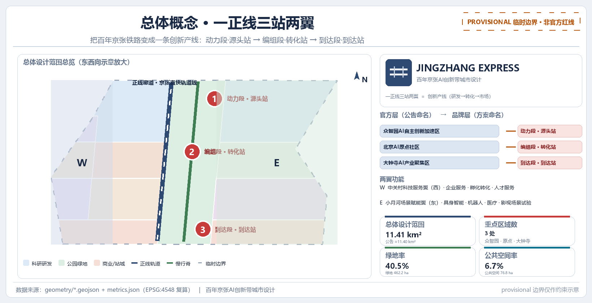
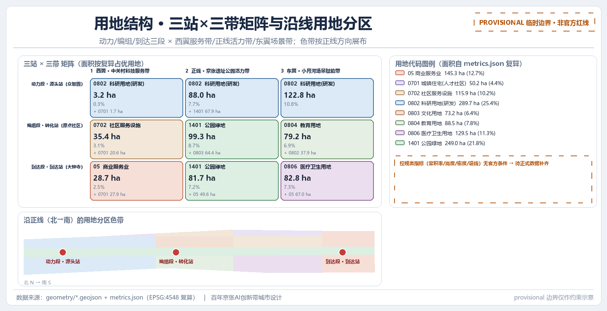
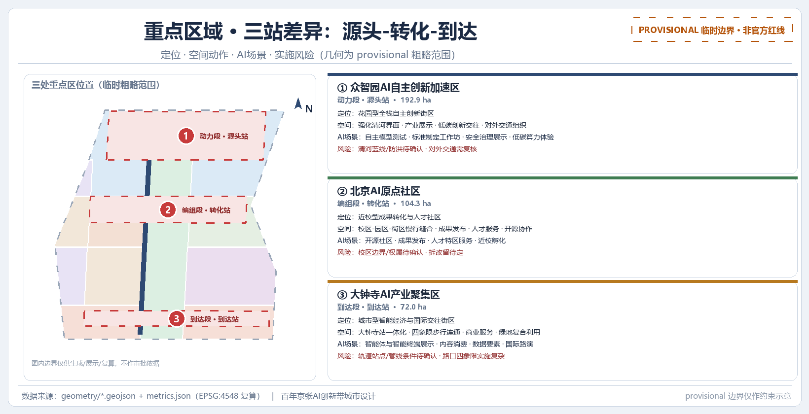
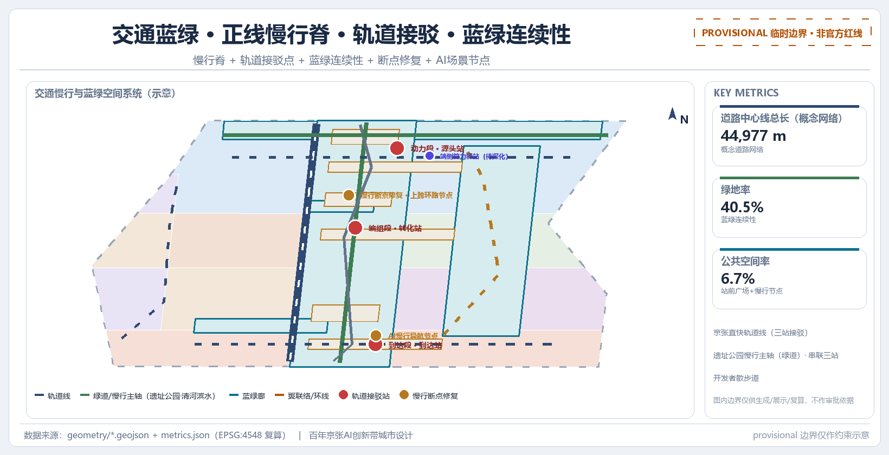
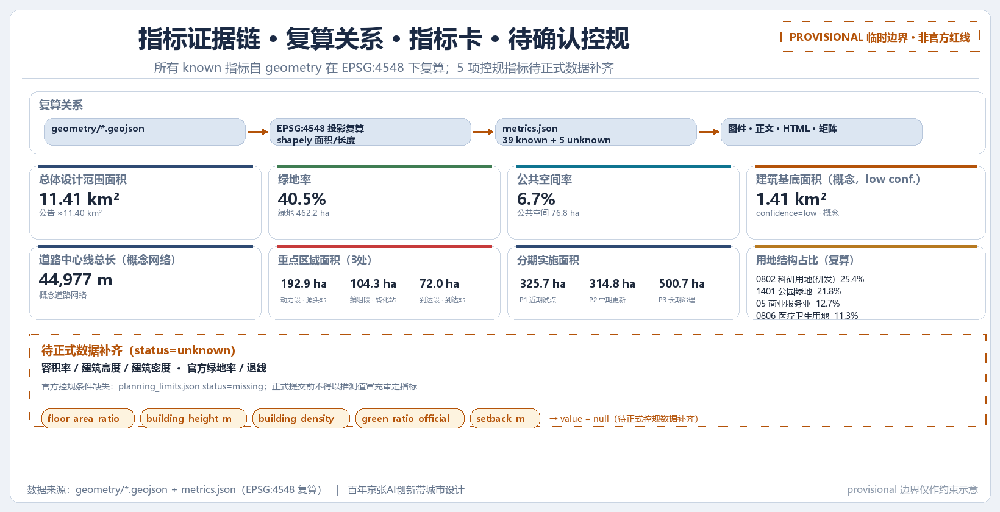

# 京张直快 JINGZHANG EXPRESS：把百年京张铁路变成一条创新产线

## 设计依据与资料清单

本方案是“百年京张AI创新带城市设计国际方案征集”的开放共创成果，由 AI agent 依据北京市规划和自然资源委员会海淀分局发布的资格预审公告、面向全球智能体的开源征集任务书，以及仓库登记的三层范围、三处重点区域、图层、指标和来源清单生成 [source:DATA-SRC-OFFICIAL-ANNOUNCEMENT-20260509] [source:DATA-SRC-AGENT-TASKBOOK-20260518]。公告是本方案任务、范围、深度和成果语境的主控依据，任务书补充了三大定位、五大功能、三区两翼、六项智能体任务和十条共创原则，二者共同构成设计判断的出发点 [standard:PROJECT-OFFICIAL-ANNOUNCEMENT] [standard:PROJECT-AGENT-OPEN-CALL-TASKBOOK]。

本方案采用“provisional boundary”工作模式：征集组织方的精确红线、三处重点区域官方 polygon 和控规条件尚未公开发布，仓库维护者依据公告文字四至与面积值推定了临时粗略边界（`brief/site-package/geometry/provisional_boundaries.geojson`），供智能体先跑通生成、自检和可视化 [source:DATA-SRC-PROVISIONAL-BOUNDARIES-20260605]。该临时边界仅在正文、HTML、自检和讨论中作为临时约束范围使用，不作为官方红线、审批依据、精确面积依据或正式专业评分依据；该数据缺口不阻断内容评分，替换 official polygon 后所有图层与指标均需复算 [depth:existing_conditions_diagnosis]。

全部机器可读证据保存在提交包的 `geometry/*.geojson`、`metrics.json`、`assumptions.json`、`compliance_matrix.json`、`standard_matrix.json` 与 `design_depth_matrix.json` 中；正文只在具体判断后放置少量关键证据标记，完整机器索引不回灌正文。资料使用边界以 `data/source_registry.json` 为准：formal 可用资料可支撑权威判断，背景资料不能支撑空间控制结论，provisional 资料只能支撑临时生成、可视化与讨论，agent 不得把 background_only 或 provisional_only 资料升级为法定控规、正式评分依据或政府实施承诺 [source:DATA-SRC-OFFICIAL-ANNOUNCEMENT-20260509]。

本节的资料清单分为五类：官方公告与任务书、专业标准与本地参考、结构化场地数据、处理层导航资料、以及临时边界与假设。正文各节末尾均保留了“概念建议 / 参考方案 / 可供专业团队深化研究”限定语；任何涉及控规指标、建筑高度、拆改留、道路红线、市政管线、投资测算、开发时序与活动安排的表述都按此边界书写，不得写成已确定政府决策或实施安排 [source:DATA-SRC-AGENT-TASKBOOK-20260518]。

## 三层范围工作框架

三层范围是公告确定的工作骨架：统筹研究范围约 43.6 平方公里，负责AI产业生态、战略定位、创新链与未来城市形态的系统研究；总体设计范围约 11.4 平方公里，负责城市更新总体框架、产业空间布局、交通市政支撑与城市风貌控制，达到控制性详细规划的城市设计深度；重点区域范围约 368.4 公顷，负责三处重点区域的详细设计，达到规划综合实施方案的城市设计深度 [standard:PROJECT-OFFICIAL-ANNOUNCEMENT]。

本方案以“创新产线”为隐喻，把三个层次转译成一组递进的铁路段：统筹层回答“整条产线往哪里开”，总体层回答“编组、路网和站城关系如何组织”，重点层回答“三个站点各自造什么、怎么落地”。创新链从源头研究、转化孵化到市场集聚的节奏，恰好沿京张铁路方向自北向南延伸：众智园承载基础研究与全栈自主创新，北京AI原点社区承载孵化与转化，大钟寺承载市场、资本与全球交往，因此三层范围不是互相割裂的图纸集合，而是同一产线在不同分辨率下的表达 [depth:three_level_scope_framework]。

三层范围的面积与图层证据如下：总体设计范围以提交包中的 `geometry/site_boundary.geojson#SITE-001` 表达，复算面积为 11,412,825.386 平方米，与公告约 11.4 平方公里一致（差值来自临时边界推定的精度误差）；重点区域范围为三处 KEY_AREA 之和，数量指标 `key_area_count` 为 3 [data:geometry/site_boundary.geojson#SITE-001] [metric:site_area_sqm] [metric:key_area_count]。任何由提交几何复算的面积、比例、建筑规模或项目数量，都只能在“临时边界”口径下讨论，官方 polygon 到位后需按替换触发的复算流程整体重算 [depth:metrics_recalculation]。

三层范围与官方四至、临时边界、假设的对应关系保存在 `data/processed/project_scope_summary.csv` 与 `assumptions.json` 中（假设号 A-BOUNDARY-001、A-BOUNDARY-002、A-AREA-TOLERANCE-001 等）；正文不重复机器索引，读者如需逐条核对可从 `compliance_matrix.json` 的 1.3、1.4、1.5 与 agent.1—agent.6 覆盖进入 [source:DATA-SRC-PROVISIONAL-BOUNDARIES-20260605]。

三层范围框架本身不新增伪精确红线，它把公告的三层任务转译为工作方法。本节涉及的三层边界均为概念建议，具体范围认定须待正式控规与官方 CAD/GIS 数据确认后由专业团队深化 [depth:three_level_scope_framework]。

## 统筹研究范围产业与未来城市研究

### 命名层级与品牌叙事

本方案首先明确命名层级，避免叙事层与规划层混淆：

- **官方规划命名层**：三个重点区域名称（众智园AI自主创新加速区、北京AI原点社区、大钟寺AI产业集聚区）与三条主题带（百年京张文化带、都市AI生活体验带、AI融合创新带）是沿用公告与任务书术语的正式命名 [source:DATA-SRC-OFFICIAL-ANNOUNCEMENT-20260509] [source:DATA-SRC-AGENT-TASKBOOK-20260518]。
- **品牌叙事层**：“京张直快 JINGZHANG EXPRESS”是一层叠加在官方命名之上的叙事与视觉品牌，不是规划编号，不替代、不覆盖三处重点区与三条主题带的官方名称。叙事层借用“铁路—产线”意象，让命名、Logo、活动体系和国际传播共享同一张脸，但不改写任何法定名称。

Logo 与视觉识别方向（概念建议）：以“一列穿越百年铁路的创新快车”为核心符号，三节车厢对应三处重点区域，两条轨道对应中关村科技服务翼与小月河场景赋能翼，整体形成向南北延伸的速度线；英文字标使用 JINGZHANG EXPRESS，中文识别以“京张直快”为主、附“百年京张AI创新带”官方全称。所有字体、图形、历史图像与标志在使用前必须完成清权 [standard:PROJECT-AGENT-OPEN-CALL-TASKBOOK] [source:DATA-SRC-AGENT-TASKBOOK-20260518]。

### 三区两翼与创新链协同

统筹研究按“三站两翼”组织AI创新生态：动力段·源头站对应众智园AI自主创新加速区，负责基础研究到全栈自主创新（AI研发、算力底座、模型训练、标准与安全治理）；编组段·转化站对应北京AI原点社区，负责中试、孵化与转化（近校转化、开源协作、人才服务）；到达段·到达站对应大钟寺AI产业集聚区，负责市场、资本与全球门户（AI原生消费、数据要素、国际交流）。两翼分别由中关村科技服务翼（资本、知识产权与全球要素配置）与小月河场景赋能翼（具身智能、机器人低速配送试点、AI+医疗、AI+影视等场景验证）构成，与任务书“三区两翼”定义一致 [source:DATA-SRC-AGENT-TASKBOOK-20260518]。

三条主题带是横切整个场地的空间层级，不是新增红线，而是把官方定位转译为可感知的城市层次：百年京张文化带串联铁路遗产、车站记忆与公共文化叙事；都市AI生活体验带组织可体验的AI生活与消费场景；AI融合创新带承载研发、孵化与产业集聚功能。三站与三带形成一张交叉矩阵，保证每处重点区域在三个维度上都有明确任务：

| | 动力段·源头站（众智园） | 编组段·转化站（原点社区） | 到达段·到达站（大钟寺） |
| --- | --- | --- | --- |
| 百年京张文化带 | 清河文化、源头叙事、工业记忆与站台历史 | 清华园车站人文、近校文化客厅、成果发布仪式 | 大钟寺历史地标、城市门户文化、国际展陈 |
| 都市AI生活体验带 | 低碳绿色创新交往、绿色空间AI场景 | 校区-园区-街区融合生活、人才社区 | AI原生消费、内容体验、夜活力商业 |
| AI融合创新带 | 全栈自主创新、标准制定与安全治理展示 | 孵化器、成果转化、开源协作、人才特区 | 数据要素、智能终端、国际路演与资本对接 |

上表反映的是概念性的三站×三带组织逻辑，具体功能配比与空间落点需结合权属、控规与产业数据由专业团队深化，本表不作实施承诺 [source:DATA-SRC-AGENT-TASKBOOK-20260518] [depth:overall_spatial_structure]。

### 区域协同与全球资源配置

统筹研究以概念建议方式提出京张AI创新带与周边创新极的分工协同，目的是把“一正线三站两翼”放进更大的城市与区域创新网络，而不是在行政边界内封闭自足：北纬社区宜围绕生态与青年社区场景协同，承接创新人才的日常居住与交往需求；未来科学城以研发与中试链条协同，为源头站提供试验放大的互补环节；怀柔科学城以基础科研策源协同，为众智园的全栈自主创新提供原始理论与大科学设施接口；经开区以智能制造与应用转化协同，承接模型与产品的规模化落地；京津冀层面则以张北绿电算力、津冀制造与场景腹地协同，支撑低碳算力与市场腹地。上述协同均以“网络化、可演化”为取向，是可供专业团队深化研究的参考方案，不代表既有协同安排或任何政府承诺 [source:DATA-SRC-OFFICIAL-ANNOUNCEMENT-20260509] [depth:overall_spatial_structure]。

在要素流动层面，本方案把中关村科技服务翼定位为“要素全球化配置”的枢纽性概念：知识产权、资本、人才、数据与算力五类要素通过跨区域流动机制在站点之间配置，使源头的成果与标准、转化的中试与开源、到达的市场与资本在各站点形成可交换、可承接的接口，与京津冀及国际节点保持可对接的开放边界。这一配置机制属于概念建议，具体由哪些机构以何种协议与合规边界运行，须待授权与专业团队深化研究 [source:DATA-SRC-AGENT-TASKBOOK-20260518] [source:DATA-SRC-OFFICIAL-ANNOUNCEMENT-20260509]。

上述协同整体上是“网络化、可演化”的，不是行政边界内的封闭体系：京张AI创新带作为贯通南北的正线，把北部科学城的策源、中部高校与园区的孵化转化、南部市场与资本的到达串成一条协同链路，使周边创新极成为同一产线的外延节点而非并列的孤立板块。该链路的定性判断均为参考方案，是否采纳以及如何落地，须由专业团队结合控规与官方数据深化研究 [depth:three_level_scope_framework] [depth:overall_spatial_structure]。

### 规划创新：空间产业融合与国土空间规划思路

本方案对“综合规划内涵”的回应是“一张图上的综合”：产业规划、空间规划、运营规划与公共参与不再分册表达，而是以 GeoJSON 图层承载空间与产业、metrics 承载可复算指标、矩阵承载任务与证据映射，在同一张图上统筹（如 `geometry/land_use.geojson`、`metrics.json` 与 `compliance_matrix.json` 的联动）。这是对规划方法本身的概念建议，不是法定综合规划成果，具体图层体系、指标与参与机制须由专业团队深化 [data:geometry/land_use.geojson#LU-001] [depth:metrics_recalculation]。

本方案以“站即产业阶段”回应“空间产业融合”：创新链“研究→孵化→市场”与空间站序列一一映射——众智园是研究阶段的站、原点社区是孵化阶段的站、大钟寺是市场阶段的站；每站内部混合产业、公共与生活功能，使研究、交往、通勤与日常生活在同一街区咬合，形成职住商服均衡的单元。这一映射是空间产业融合的概念化表达，站内具体功能配比与混合比例须结合控规、权属与产业数据深化研究 [source:DATA-SRC-AGENT-TASKBOOK-20260518] [depth:three_level_scope_framework]。

在国土空间规划创新层面，本方案提出“可演化的图层式规划”：用地、指标与项目都以可复算的数据图层表达，允许在官方边界与控规条件到位后动态复算，这是 provisional boundary 工作模式在方法上的延续；与一次性出图的静态图纸不同，这是一种 AI 原生的规划方法，把“规划即数据、数据可复算”作为方法内核。需要强调，这是对规划方法本身的创新建议，不是法定规划成果，也不替代任何审批程序，方法可行性须由专业团队结合官方数据验证 [source:DATA-SRC-PROVISIONAL-BOUNDARIES-20260605] [depth:metrics_recalculation]。

### 全球AI创新生态案例研究

统筹研究还对比了 5—8 个全球AI创新生态案例（以下均为公开研究梳理，标注信息来源性质，不编造投资额、产值或企业名单）：美国硅谷以“风险资本+大学+开放文化”构成持续创新循环；波士顿 Kendall Square 以大学实验室、医院与创业社区咬合形成“实验室—转化—上市”的链条；深圳依托硬件供应链与大规模制造能力形成“整机—模组—元器件”的敏捷迭代生态；杭州以平台型公司与数字消费场景带动创新扩散；新加坡以国际枢纽身份组织数据、资本与合规环境；以色列特拉维夫以高强度研发密度与中小企业协作著称；伦敦金融城周边的AI创业集群强调金融与场景耦合；圣何塞则是硅谷南部面向下一代智能终端的产业前沿。这些案例的共同点是：**创新链不是孤立的研发岛，而是“研究—转化—市场”在城市空间上连续咬合的系统** [source:DATA-SRC-AGENT-TASKBOOK-20260518]。

对照这些案例，本方案把“三站两翼”组织为可迁移的机制集合：众智园对应“源头研发与治理平台”，原点社区对应“大学触角与转化窗口”，大钟寺对应“市场与资本出口”，两翼对应“资本/知识产权服务”与“场景验证场”。案例研究只用于支撑机制与结构判断，不用于推断海淀的具体企业、投资或政策安排 [standard:PROJECT-AGENT-OPEN-CALL-TASKBOOK]。

### 文化叙事与导览路线

统筹层还定义了从“争气路”到“创新路”再到“未来路”的文化叙事：百年京张铁路是中国人自主筑路的“争气路”，中关村是改革开放后自主创新的“创新路”，今天的人工智能创新带则是在同一条地理带上延伸的“未来路”。这一叙事把铁路遗产、中关村文化与AI新文化连成一条时间轴，支撑导览路线“三站九节点”：起点站（众智园）设源头叙事与治理展示节点，中段站（原点社区）设开源与转化节点，终点站（大钟寺）设市场与国际交往节点，每站三个节点形成可步行、可讲解、可传播的九节点路线 [source:DATA-SRC-AGENT-TASKBOOK-20260518] [standard:MOHURD-URBAN-DESIGN-MEASURES]。

统筹研究范围涉及的所有命名、Logo、活动与路线设计均为概念建议，具体命名体系、视觉识别与导览运营须由专业团队结合清权、招商与运营条件深化，本方案不作出任何官方品牌或活动承诺 [source:DATA-SRC-AGENT-TASKBOOK-20260518]。

## 总体设计范围城市更新与控规深度城市设计

### 城市更新总体框架

总体设计范围以城市更新为抓手，目标是支撑AI产业空间供给并优化职住商服关系。方案提出“一正线三站两翼”的空间结构：**一正线**指沿京张遗址公园贯通的创新产线主轴（文化、慢行与功能复合走廊）；**三站**即三处重点区域形成的创新站点；**两翼**为站点东西两侧的中关村科技服务翼与小月河场景赋能翼。正线既是铁路遗产的叙事主轴，也是慢行、蓝绿与公共空间的连续骨架 [depth:overall_spatial_structure]。

城市更新的对象以低效空间与遗址公园两侧地区为主，识别逻辑遵循公告要求：更新潜力空间资源、更新项目功能业态、职住商服均衡、AI企业聚集目标与AI产业空间规模。本节只给出识别框架与项目清单的目录级表达，具体地块边界、权属和拆改留结论一律留待正式控规与专业深化，不在文本中给出伪精确控制线 [standard:MOHURD-CONTROL-DETAILED-PLANNING]。

### 用地结构

用地结构由 `geometry/land_use.geojson` 表达（12 个设计地块，代码遵循自然资源部《国土空间调查、规划、用途管制用地用海分类指南》语义），关键代码与占比（复算自 metrics.json，均为设计口径）如下：科研用地（0802）占 25.4%，是众智园AI研发与机器人试验研发的主体；公园绿地（1401）占 21.8%，即京张遗址公园活力带；商业服务业用地（05）占 12.7%，集中在大钟寺站城商业与AI原生消费；医疗卫生用地（0806）占 11.3%，支撑小月河翼的AI+医疗场景；城镇社区服务设施用地（0702）占 10.2%；教育用地（0804）占 7.8%；文化用地（0803）占 6.4%；城镇住宅用地（0701）占 4.4% [data:geometry/land_use.geojson#LU-001] [data:geometry/land_use.geojson#LU-006]。上述占比对应的量化支撑见 [metric:land_use_share_0802]，并以 [metric:land_use_share_1401] 与公园绿地面积相互复核。用地布局的完整面积与占比见 `metrics.json`，本节仅摘其设计含义；所有用地地块均为设计建议，不构成已批准用地布局 [standard:MNR-LAND-USE-CLASSIFICATION-GUIDE] [depth:land_use_layout]。

### 开发强度与待确认控规条件

涉及容积率、建筑高度、建筑密度、绿地率（官方口径）与退线的指标，在 `metrics.json` 中状态均为 `unknown`（floor_area_ratio、building_height_m、building_density、green_ratio_official、setback_m），原因统一记录为官方控规条件缺失、待正式附件补齐 [metric:floor_area_ratio] [metric:building_height_m]。方案不给出任何容积率、高度或强度数值，也不把设计建议冒充审定指标；待正式控规条件发布后，所有建筑规模、密度与退线结论需按假设 A-CONTROLS-001 与 A-CONTROLS-002 复算 [depth:development_intensity_controls]。

本节涉及的城市更新框架、用地结构与开发强度判断均为概念建议，具体拆改留、控规指标与实施时序须待正式控规、权属与工程条件确认后由专业团队深化。

## 重点区域详细设计

三处重点区域是“三站”的物理载体，分别对应创新链的源头、转化与到达三个环节。三处片区在 `geometry/key_areas.geojson` 中均有独立图层（PROV-KEY-001/002/003），当前为临时粗略边界，官方 polygon 到位后需按假设 A-BOUNDARY-002 复算 [data:geometry/key_areas.geojson#PROV-KEY-001] [data:geometry/key_areas.geojson#PROV-KEY-002] [data:geometry/key_areas.geojson#PROV-KEY-003]；三处片区的详细设计深度由设计深度矩阵中的 [depth:three_key_area_detailed_design] 约束。

### 动力段·源头站：众智园AI自主创新加速区

**定位**：花园型全栈自主创新街区，对应创新链的“源头”，承载基础研究、算力底座、模型训练与标准/安全治理。复算面积约 192.92 公顷（公告约 192.1 公顷）[metric:key_area_area_sqm_zhongzhiyuan_ai_acceleration_area]。

- **空间结构**：以清河为界面的创新交往带 + 研发组团 + 治理展示组团，构建“南研北展、蓝绿环抱”的布局 [data:geometry/land_use.geojson#LU-001]。
- **建筑更新**：众智园·AI研发中心、全栈自主创新实验室、算力与标准服务办公、创新人才公寓、源头站接驳枢纽（BLDG-002—BLDG-006）构成建筑基底意象；实际拆改留以权属与现状为准 [data:geometry/buildings.geojson#BLDG-002]。
- **交通慢行**：强化对外交通（含五环路方向）与站城东西接驳（ROAD-006），以遗址公园慢行主轴为南北联系 [data:geometry/roads.geojson#ROAD-006]。
- **公共空间**：源头站广场（PUBLIC-003）与清河·众智园创新界面蓝绿廊（GREEN-001）承载开放测试、标准工作坊与治理展示 [data:geometry/public_space.geojson#PUBLIC-003] [data:geometry/green_space.geojson#GREEN-001]。
- **AI场景**：模型训练与评测开放测试场、安全治理沙盒、低碳算力体验（见第六节场景卡 01、02）。
- **实施风险**：五环路一体化与对外交通涉及工程红线，清河蓝线与防洪条件未定，标准与安全治理展示涉及合规与清权，均列为深化前置条件 [source:DATA-SRC-OFFICIAL-ANNOUNCEMENT-20260509]。

### 编组段·转化站：北京AI原点社区

**定位**：近校型成果转化与人才社区，对应创新链的“转化”，面向清华、北大、中科院等原始创新策源，组织孵化、转化、开源协作与人才服务。复算面积约 104.32 公顷（公告约 104.3 公顷）[metric:key_area_area_sqm_beijing_ai_origin_community]。

- **空间结构**：以近校成果转化街 + 开源协作组团 + 人才居住组团组织校区-园区-街区融合。
- **建筑更新**：近校成果转化孵化器、开源创新教育配套、人才服务驿站、成果转化服务办公（BLDG-001、BLDG-007—BLDG-009）构成建筑基底意象 [data:geometry/buildings.geojson#BLDG-001]。
- **交通慢行**：围绕五道口、清华东路西口等轨道站点开展一体化设计，校区园区之间以慢行缝合 [source:DATA-SRC-OFFICIAL-ANNOUNCEMENT-20260509]。
- **公共空间**：转化站广场（PUBLIC-002）与原点社区·开源广场绿地（GREEN-005）承载成果发布、开源路演与人才活动 [data:geometry/public_space.geojson#PUBLIC-002]。
- **AI场景**：开源成果展示廊、近校创新教育与AI素养课堂、企业服务智能体、开源合规与知识产权服务台（见第六节场景卡 04、05、07）。
- **实施风险**：校区边界、权属与首层业态不确定，拆改留需以低扰动、有机更新为原则，成果发布与知识产权服务涉及清权与合规 [standard:PROJECT-AGENT-OPEN-CALL-TASKBOOK]。

### 到达段·到达站：大钟寺AI产业集聚区

**定位**：城市型智能经济与国际交往街区，对应创新链的“到达”，承载智能体、智能终端、内容消费、数据要素与数字资产流通。复算面积约 72.05 公顷（公告约 72.0 公顷）[metric:key_area_area_sqm_dazhongsi_ai_industry_cluster]。

- **空间结构**：以大钟寺站一体化枢纽 + 站城商业街区 + AI原生消费体验街区组织；规划绿地复合利用。
- **建筑更新**：大钟寺·AI原生商业综合体、AI消费体验街区、轨道接驳枢纽（BLDG-010—BLDG-012）构成建筑基底意象 [data:geometry/buildings.geojson#BLDG-010]。
- **交通慢行**：开展大钟寺地铁站所在路口四象限步行连通设计，完善非机动车停放等静态交通组织，站城东西接驳（ROAD-005）提升重点地块连通度 [data:geometry/roads.geojson#ROAD-005]。
- **公共空间**：到达站广场（PUBLIC-001）与大钟寺·站城公园绿地（GREEN-004）承载国际交往、内容消费与数据要素展示 [data:geometry/public_space.geojson#PUBLIC-001]。
- **AI场景**：大钟寺AI原生消费与内容体验、数据要素会客厅、公共安全运营人工复核（见第六节场景卡 06、09、10）。
- **实施风险**：重点企业周边环境提升涉及权属与商业生态，数据要素流通涉及合规与授权边界，轨道一体化涉及工程红线与管线，均列为深化前置条件 [source:DATA-SRC-OFFICIAL-ANNOUNCEMENT-20260509]。

三处重点区域的定位、空间动作、建筑、交通、公共空间与AI场景均按概念建议深度表达，任何拆改留、建筑规模与实施时序结论须待正式控规、权属与工程条件确认后由专业团队深化，本方案不构成审批依据 [depth:three_key_area_detailed_design]。

## AI 创新生态、人才画像与 AI+ 场景

### 用户画像

面向 AI 人才和企业的空间需求画像，本方案定义六类核心用户（满足不少于 5 类要求），并对应空间响应与自检边界：

| 用户画像 | 典型需求 | 空间响应 | 自检边界 |
| --- | --- | --- | --- |
| 研究者（高校/院所） | 算力、数据、跨校协作、成果发布 | 源头站研发组团、近校转化街、成果发布厅 | 校园数据与科研成果须授权 |
| 开发者（开源社区） | 发布、协作、测试、社区声誉 | 开源成果展示廊、代码贡献墙、夜间协作空间 | 不采集个人行为轨迹，活动数据仅聚合 |
| 创业者（初创团队） | 低成本办公、算力入口、产品试验场 | 共享测试场、端侧算力服务点、合规咨询 | 算力与数据服务另行授权 |
| 投资人/产业资本 | 项目源、路演、尽调、国际对接 | 大钟寺国际路演客厅、数据要素会客厅 | 企业标识与案例须清权 |
| 市民与老年群体 | 通勤、休闲、就医、数字助老 | 遗址公园慢行环、AI健康服务导航、人工柜台 | 不将居民画像用于商业推荐；保留人工服务通道 |
| 国际访客 | 导览、交往、消费、通关体验 | 三站导览、双语导视、国际路演与消费街区 | 多语种内容须清权，不作隐私追踪 |

上表为概念性画像，人才服务需求与运营细则须结合真实人口与产业数据深化，不作实施承诺 [source:DATA-SRC-AGENT-TASKBOOK-20260518] [standard:PROJECT-AGENT-OPEN-CALL-TASKBOOK]。

### AI 场景卡

本方案提供 13 张 AI 场景卡，覆盖 AI+信软、AI+医疗、AI+教育、AI+法律、AI+生活服务、AI+交通、AI+公共空间与 AI+商业，其中 4 个为产业测试验证场景（编号前标 ★）。每张卡给出空间位置、服务对象、数据、隐私边界、人工复核、运营主体与风险七要素：

**★01 模型训练与评测开放测试场**（众智园，产业测试验证）
- 空间位置：众智园·全栈自主创新实验室（BLDG-003）周边公共测试场地 [data:geometry/buildings.geojson#BLDG-003]
- 服务对象：模型开发者、评测机构、标准组织
- 数据：训练/评测集、公开基准；私有数据仅经授权入库
- 隐私边界：不采集个人隐私，评测过程脱敏
- 人工复核：评测结果与模型上架由技术委员会复核
- 运营主体：概念上由园区平台+第三方评测机构共营
- 风险：算力与数据授权边界需协议约束

**02 安全治理沙盒**（众智园）
- 空间位置：众智园·源头站广场周边展示协作节点（PUBLIC-003）
- 服务对象：监管研讨、安全评测、标准工作坊
- 数据：红队测试样本、公开合规指引
- 隐私边界：测试样本脱敏，不含真实个人数据
- 人工复核：标准与治理结论由专家评审
- 运营主体：概念上由治理平台+行业组织共营
- 风险：避免把测试场景写成已批准运营

**03 京张文化智能导览（ai-cultural-guide）**（遗址公园/文化带）
- 空间位置：京张遗址公园活力带与三站文化节点 [data:geometry/green_space.geojson#GREEN-003]
- 服务对象：市民、游客、国际访客
- 数据：公开历史资料、清权图片与语音
- 隐私边界：不追踪个人轨迹，仅提供按需导览
- 人工复核：历史文化内容由专家校对
- 运营主体：概念上由文旅运营方+内容团队共营
- 风险：历史叙事须准确，涉及照片肖像须清权

**04 企业服务智能体（enterprise-service-copilot）**（原点社区/众智园）
- 空间位置：原点社区·成果转化服务办公（BLDG-009）与园区服务节点
- 服务对象：初创企业、成果转化团队、头部企业服务部门
- 数据：公开政策、园区服务目录、企业授权资料
- 隐私边界：企业数据仅在授权内使用，不跨主体共享
- 人工复核：政策与合规建议由专业顾问复核
- 运营主体：概念上由园区运营商+专业机构共营
- 风险：不得把未经授权或未经核实的资料写成事实

**★05 开源合规与知识产权服务台（AI+法律，产业测试验证）**（原点社区）
- 空间位置：原点社区·开源成果展示廊与法务服务节点 [data:geometry/public_space.geojson#PUBLIC-002]
- 服务对象：开源项目、创业团队、成果转化主体
- 数据：开源许可证文本、公开司法判例、清权信息
- 隐私边界：个案资料仅限当事方
- 人工复核：法律意见由持证法律专业人员复核，AI 只做材料整理
- 运营主体：概念上由律所/知识产权机构+园区共营
- 风险：AI 输出不构成法律意见，须明确免责与人工兜底

**06 公共安全运营人工复核（public-safety-operations-review）**（公共空间）
- 空间位置：三站广场与大型活动公共空间（PUBLIC-001/002/003）
- 服务对象：运营方、活动主办、公共空间管理者
- 数据：公开活动信息、人流聚合数据
- 隐私边界：只做聚合分析，不做个体识别与追踪
- 人工复核：任何预警与处置由人工确认后执行
- 运营主体：概念上由运营方+属地部门共营
- 风险：不得把未成熟技术写成已全面部署，需与监控边界严格区分

**★07 近校创新教育与AI素养课堂（AI+教育，产业测试验证）**（原点社区）
- 空间位置：原点社区·开源创新教育配套（BLDG-007）与教育用地（LU-005）[data:geometry/land_use.geojson#LU-005]
- 服务对象：高校师生、中小学生、再培训人群
- 数据：公开课程、清权教材、实验数据
- 隐私边界：学生数据最小化采集
- 人工复核：课程与评测由教师把关
- 运营主体：概念上由高校+教育机构共营
- 风险：教学成果与校园数据须授权

**08 AI健康服务导航（ai-health-service-navigation，AI+医疗）**（小月河翼）
- 空间位置：小月河场景赋能翼·医疗卫生用地（LU-010）周边 [data:geometry/land_use.geojson#LU-010]
- 服务对象：周边居民、患者、老年群体
- 数据：公开医疗资源目录、挂号信息；个人健康数据仅经授权
- 隐私边界：医疗数据严格最小化，不跨机构共享
- 人工复核：就医建议由医护人员复核，保留人工柜台与电话通道
- 运营主体：概念上由医院+社区卫生+平台共营
- 风险：不得替代临床判断；涉及个人健康数据须合规授权

**09 大钟寺AI原生消费与内容体验（AI+商业）**（到达站）
- 空间位置：大钟寺·AI原生商业综合体与消费体验街区（BLDG-010/011）[data:geometry/buildings.geojson#BLDG-010]
- 服务对象：消费者、内容创作者、智能终端厂商
- 数据：公开商品与内容信息；消费行为仅聚合
- 隐私边界：不做跨店画像与追踪
- 人工复核：内容审核由运营方人工把关
- 运营主体：概念上由商业运营商+品牌方共营
- 风险：内容与标识须清权，避免过度娱乐化

**10 数据要素会客厅（AI+商业/治理）**（到达站）
- 空间位置：大钟寺·站城商业区域与数据展示节点
- 服务对象：数据要素市场主体、数字资产机构、监管研讨
- 数据：公开数据目录、授权数据示例
- 隐私边界：展示用合成数据与脱敏样例
- 人工复核：流通机制由合规专家复核
- 运营主体：概念上由交易所/平台+园区共营
- 风险：不推断数据流通已落地，机制与合规边界待确认

**★11 小月河低速机器人配送（robot-delivery-low-speed，AI+交通/具身智能，产业测试验证）**（小月河翼）
- 空间位置：小月河场景赋能翼慢行环线（ROAD-004）与滨水步道（ROAD-008）[data:geometry/roads.geojson#ROAD-004]
- 服务对象：园区通勤者、外卖与社区配送需求方
- 数据：路线公开数据、调度聚合数据
- 隐私边界：不拍摄人脸，仅识别障碍物
- 人工复核：异常情况由远程人工接管
- 运营主体：概念上由配送运营方+属地部门试点共营
- 风险：低速配送是测试验证场景，须明确试点边界、通行规则与责任划分

**12 AI生活服务样板街（AI+生活服务）**（社区/商业交汇处）
- 空间位置：居住与社区服务设施用地（0701/0702）周边街道 [data:geometry/land_use.geojson#LU-008]
- 服务对象：周边居民、老年与残障群体
- 数据：公开公共服务目录、清权信息
- 隐私边界：不将居民画像用于商业推荐
- 人工复核：保留人工柜台与电话服务通道
- 运营主体：概念上由社区+生活服务商共营
- 风险：传统服务方式须与智能化并行，参照无障碍与适老化要求

场景卡对应关系：ai-cultural-guide（卡03）、ai-health-service-navigation（卡08）、ai-traffic-walkability（卡13）、enterprise-service-copilot（卡04）、public-safety-operations-review（卡06）、robot-delivery-low-speed（卡11）。另补充一张 **AI慢行与无障碍导航（ai-traffic-walkability）** 场景卡：

**13 AI慢行与无障碍导航（ai-traffic-walkability，AI+交通/公共空间）**
- 空间位置：遗址公园慢行主轴（ROAD-001/007）与轨道接驳节点 [data:geometry/roads.geojson#ROAD-001]
- 服务对象：通勤者、残障人士、老年人、游客
- 数据：公开路网、公交与轨道时刻、无障碍设施目录
- 隐私边界：不追踪个体路径，仅提供导航建议
- 人工复核：无障碍信息由社区与服务方复核更新
- 运营主体：概念上由交通运营方+社区共营
- 风险：低侵入传感识别慢行断点，须避免过度监控

综上共 13 张场景卡（≥10），其中产业测试验证场景为卡01、卡05、卡07、卡11 共 4 个（≥3）。所有场景的空间载体都能定位到 `geometry/*.geojson` 的具体特征，公共空间场景引用公共空间与绿地图层 [data:geometry/public_space.geojson#PUBLIC-001] [data:geometry/green_space.geojson#GREEN-001]，慢行与交通场景引用道路图层 [data:geometry/roads.geojson#ROAD-001]，蓝绿支撑由绿地与公共空间比例指标复核 [metric:green_ratio] [metric:public_space_ratio]。

AI治理建议统一遵守数据最小化、公开来源、可解释与人工复核原则：城市智能体可以辅助识别慢行断点、公共空间热力、设施维护、企业服务需求与活动安全风险，但不能替代规划审批、不能输出未经授权的个人画像、不能声称获得官方实施承诺。所有场景均为概念建议与测试验证性质，具体运营主体、试点范围与合规边界须待授权与专业深化，本方案不把任何测试场景写成已批准运营 [source:DATA-SRC-AGENT-TASKBOOK-20260518] [standard:PROJECT-AGENT-OPEN-CALL-TASKBOOK]。

## 用地、建筑规模与拆改留方案

### 用地方案

用地方案基于《国土空间调查、规划、用途管制用地用海分类指南》表达，12 个设计地块覆盖科研、公园绿地、商业服务、医疗卫生、社区服务、教育、文化与住宅等用地类型，形成闭合无缝的用地分区（见第四节用地结构）。用地代码与 `metrics.json` 中 `land_use_share_*` 系列一致，任何面积与占比均为设计口径，官方用地布局与用地代码确认后需整体复算 [standard:MNR-LAND-USE-CLASSIFICATION-GUIDE] [depth:land_use_layout]。

### 建筑规模

建筑基底由 `geometry/buildings.geojson` 表达，12 个建筑基底覆盖 AI 研发、实验室、办公、人才公寓、孵化器、教育配套、社区服务、商业综合体、消费街区与轨道接驳枢纽等类型（BLDG-001—BLDG-012）。建筑基底总面积复算为 1,411,751.75 平方米，属于设计意象口径，不作为官方建筑面积、容积率或密度依据 [data:geometry/buildings.geojson#BLDG-001] [metric:building_footprint_area_sqm]。容积率、建筑高度、建筑密度、绿地率（官方口径）与退线指标状态均为 unknown，待正式控规条件补齐 [metric:floor_area_ratio] [depth:development_intensity_controls]。

### 拆改留方案

拆改留采用“方法先于结论”的逻辑，概念上分为三类：**保留**——京张遗址公园、文物文化节点、轨道与有保留价值的既有建筑；**改造**——低效厂房、办公与社区服务空间的功能置换与适AI化改造；**新建**——创新平台、人才住房、消费体验与接驳枢纽等增量空间。由于现状建筑、权属、文保与控规资料缺失，本方案不给出任何具体地块的拆除、保留或新建结论，仅提供分类框架与深化检查项（见 `design_depth_matrix.json` 的 retain_renovate_demolish、height_massing_character）[depth:retain_renovate_demolish] [depth:height_massing_character]。

本节涉及的用地、建筑规模与拆改留逻辑均为概念建议，具体分类、指标与实施时序须待正式控规、权属、文保与工程条件确认后由专业团队深化。

## 交通、轨道、市政与公共服务设施

### 交通与轨道

交通方案围绕轨道站点一体化、道路微循环、慢行断点缝合与绿色交通展开。正线层面，遗址公园慢行主轴（ROAD-001/007）与三站接驳轨道线（ROAD-002）构成南北脊梁，西翼（ROAD-003）与东翼慢行环线（ROAD-004）组织站点两侧联系，清河水步道（ROAD-008）提供滨水慢行 [data:geometry/roads.geojson#ROAD-001] [data:geometry/roads.geojson#ROAD-004]。道路网络复算总长约 44,977.56 米，为概念网络口径，道路红线与线形待正式条件确认 [metric:road_length_m]。轨道站点一体化重点覆盖五道口、清华东路西口与大钟寺站，开展四象限步行连通与非机动车停放组织 [source:DATA-SRC-OFFICIAL-ANNOUNCEMENT-20260509]。

### 市政与新型基础设施

市政与公共服务覆盖AI产业服务设施、创新服务平台、人才生活服务设施、新型基础设施、分布式能源、端侧算力与传统三大设施的融合。本方案只给出设施体系与布局逻辑：端侧算力驿站与公共服务、企业服务、低碳能源策略结合，作为待深化的新型基础设施原型；市政管线、能源、排水、防洪与消防等工程资料缺失，全部列为正式深化前置条件 [depth:municipal_new_infrastructure] [depth:traffic_rail_slow_parking]。

道路红线、轨道线位、桥隧、市政管线与工程可行性均属于待确认事项，本方案涉及的交通与市政结论均为概念建议，须待官方红线、管线与工程条件确认后由专业团队深化，本方案不给出任何工程线位或管线结论 [standard:MOHURD-CONTROL-DETAILED-PLANNING]。

## 蓝绿空间、公共空间与城市风貌

### 蓝绿空间骨架

蓝绿空间以京张遗址公园活力带为骨架，统筹清河、小月河与周边高校、企业、社区出行需求，组织南北贯通、东西连通的步道、骑行道与绿色空间体系。绿地系统复算面积约 462.21 万平方米、绿地率约 40.5%，公共空间面积约 76.82 万平方米、公共空间比例约 6.7%，两者共同支撑“连续无界的绿色空间体系”定位 [metric:green_ratio] [metric:public_space_ratio]。蓝绿空间的空间载体分别落在绿地与公共空间图层，见 [data:geometry/green_space.geojson#GREEN-001] 与 [data:geometry/public_space.geojson#PUBLIC-001]。蓝绿公共空间的完整设计与指标含义见第九节图与 `metrics.json`；所有蓝绿线位为设计口径，清河与小月河蓝线、防洪与生态约束待官方确认（假设 A-BLUELINE-001）[depth:blue_green_public_space]。

### AI 朝圣地标

依托遗址公园与三站公共空间，本方案提出三个 AI 朝圣地标（满足不少于 3 个要求）：**始发钟楼·智能体贡献荣誉墙**——在众智园源头站以“钟楼”意象纪念铁路源头与AI源头，荣誉墙记录智能体与贡献者的名字与成果；**开源成果展示廊**——在原点社区开源广场承载代码贡献、成果发布与荣誉展示；**开发者散步道**——沿遗址公园慢行主轴（ROAD-007）设置站间慢行连廊与活动节点，连接三站九节点 [data:geometry/public_space.geojson#PUBLIC-006] [data:geometry/roads.geojson#ROAD-007]。地标为概念设计，涉及的历史图像、企业标识与人物肖像均须清权 [source:DATA-SRC-AGENT-TASKBOOK-20260518]。

### 城市风貌

城市风貌融合京张铁路历史文化、中关村创新文化与AI创新文化，利用清华园火车站等文化资源与北影等艺术资源，围绕清河、小月河等蓝绿空间打造城市基调。风貌控制提出建筑高度、体量、风貌、屋顶形态、界面与公共艺术引导方向，具体控制线须以文保、控规与城市设计导则为依据，不得在无依据时给出伪精确控制线 [standard:MOHURD-URBAN-DESIGN-MEASURES] [depth:height_massing_character]。

本节涉及的蓝绿空间、地标与风貌引导均为概念建议，具体蓝线、建筑控制与地标设计须待正式控规、文保与工程条件确认后由专业团队深化。

## 更新项目清单、实施政策与分期计划

### 更新项目清单

城市更新项目以“可审查、有依赖、有风险”为原则组织，本方案给出 12 个概念项目，并补充实施阶段、参与主体（概念）与验证指标（示例）三列，阶段映射依据 `geometry/phasing.geojson` 的 PHASE-001/002/003 分期图层（完整机器索引见 `compliance_matrix.json`）。实施阶段、参与主体与验证指标均为概念建议与示例口径，不构成任何机构承诺 [data:geometry/phasing.geojson#PHASE-001] [source:DATA-SRC-AGENT-TASKBOOK-20260518] [depth:renewal_project_list]。

| 编号 | 项目名称 | 类型 | 实施阶段 | 参与主体（概念） | 验证指标（示例） | 主要依赖 |
| --- | --- | --- | --- | --- | --- | --- |
| JZ-01 | 京张遗址公园慢行断点缝合 | 公共空间/交通 | 近期（PHASE-001） | 属地部门、公园与慢行运营、专业机构 | 断点缝合处数、缝合后连续慢行道长度 | 道路红线、桥下空间、交通组织复核 |
| JZ-02 | 众智园清河创新界面 | 蓝绿空间/产业展示 | 中期（PHASE-002） | 园区运营商、生态与水利专业机构 | 蓝绿界面试点节点数、开放测试使用频次 | 河道蓝线、生态与防洪条件 |
| JZ-03 | 原点社区近校成果转化街 | 城市更新/产业服务 | 近期（PHASE-001） | 高校、园区运营商、成果转化服务机构 | 首层业态置换试点处数、入驻转化团队数 | 校区边界、权属、首层业态 |
| JZ-04 | 大钟寺站四象限步行连通 | 轨道一体化/慢行 | 长期（PHASE-003） | 轨道运营方、属地部门、交通专业机构 | 四象限连通试点处、非机动车位补充数 | 轨道站点、道路交叉口、市政管线 |
| JZ-05 | 模型训练与评测开放测试场 | 新基建/产业 | 中期（PHASE-002） | 园区平台、第三方评测机构、标准组织 | 开放测试工位数、试点评测任务数 | 算力、数据授权、安全与运营主体 |
| JZ-06 | 开源成果展示廊与贡献荣誉墙 | 运营/品牌 | 近期（PHASE-001） | 园区运营商、开源社区、文旅运营 | 展陈场次、贡献墙内容条目数 | 公共空间许可、版权清权、运营机制 |
| JZ-07 | 小月河低速机器人配送试点 | 场景/运营 | 长期（PHASE-003） | 配送运营方、属地部门、社区 | 试点投运机器人台数、安全接管次数 | 通行规则、试点授权、责任划分 |
| JZ-08 | AI生活服务样板街 | 城市更新/公共服务 | 长期（PHASE-003） | 社区、生活服务商、属地部门 | 样板街试点段数、服务人次与满意度 | 社区服务设施、无障碍与适老化条件 |
| JZ-09 | 端侧算力与分布式能源驿站 | 新基建/市政 | 中期（PHASE-002） | 算力服务商、能源运营、园区平台 | 试点驿站数、接入服务终端数 | 能源、算力、安全与市政条件 |
| JZ-10 | 全球AI创新活动公共路线 | 运营/品牌 | 近期（PHASE-001） | 文旅运营、活动主办、开发者社区 | 活动场次、参与人次、国际传播触达 | 公共空间许可、活动安全、版权清权 |
| JZ-11 | 三站广场公共体验启动试点 | 运营/公共空间 | 近期起步、随分期扩展 | 公共空间运营、文旅运营、属地部门 | 试点活动场次、广场使用人次 | 公共空间许可、活动安全、版权清权 |
| JZ-12 | 校区-园区慢行缝合试点 | 交通/慢行 | 近期（PHASE-001） | 高校、园区、交通专业机构 | 慢行缝合断点数、试点段慢行连通度 | 校区边界、权属、慢行交通组织 |

更新项目均对应 `geometry/phasing.geojson` 分期图层，项目列表为概念建议，无权属、资金、实施主体与审批路径的条目均列为实施风险而非承诺 [depth:renewal_project_list]。新增的 JZ-11 与 JZ-12 分别落在三站广场（PUBLIC-001/002/003）与校区-园区慢行缝合带（教育用地 LU-005、开发者散步道 ROAD-007），与既有几何图层一致，未新增地块或设施假设 [data:geometry/public_space.geojson#PUBLIC-001] [data:geometry/land_use.geojson#LU-005] [data:geometry/roads.geojson#ROAD-007]。

### 分期计划

分期以 `geometry/phasing.geojson` 表达：PHASE-001 近期试点（约 325.72 万平方米）——原点社区转化站与遗址公园核心段 [data:geometry/phasing.geojson#PHASE-001]；PHASE-002 中期更新（约 314.82 万平方米）——众智园动力站 [data:geometry/phasing.geojson#PHASE-002]；PHASE-003 长期治理（约 500.74 万平方米）——大钟寺到达站与两翼 [data:geometry/phasing.geojson#PHASE-003]。上述分期范围的分期面积总量级由指标文件复核，其中近期试点面积见 [metric:phasing_area_sqm_phase_001]。分期与征集设计周期（约 100 天）严格区分：征集周期是提交成果的时间要求，分期是城市更新与项目建设的推进路径；近期可先以轻量设施、运营活动与服务平台启动，中期与长期必须等待正式控规、市政、交通与权属条件确认 [source:DATA-SRC-OFFICIAL-ANNOUNCEMENT-20260509] [depth:phasing_implementation]。各阶段均按“可先行事项—几何支撑—参与主体—验证指标—依赖与边界”五个维度给出概念建议，供专业团队在正式数据到位后深化：

- **近期试点（PHASE-001）——原点社区转化站与遗址公园核心段**：可先行事项以轻量设施、运营活动与服务平台为主：开发者散步道（ROAD-007）沿线段开通与活动节点挂牌、开源成果展示廊与贡献荣誉墙（JZ-06）轻量展陈、开源合规与知识产权服务台（场景卡★05）试运行、校区-园区慢行缝合试点（JZ-12）启动 [data:geometry/roads.geojson#ROAD-007] [data:geometry/public_space.geojson#PUBLIC-002]。几何支撑来自本期范围内的原点社区转化站（PROV-KEY-002）与遗址公园核心段，其中开源创新教育配套（BLDG-007）、成果转化服务办公（BLDG-009）与转化站广场（PUBLIC-002）可直接作为空间载体 [data:geometry/phasing.geojson#PHASE-001] [data:geometry/buildings.geojson#BLDG-007]。参与主体（概念）为高校与院所、园区运营商、开源社区、文旅运营与属地部门；验证指标（示例）为慢行断点缝合处数、展陈场次、服务台咨询工单数与试点活动场次 [depth:renewal_project_list]。
- **中期更新（PHASE-002）——众智园动力站**：可先行事项以正式产业载体改造为主：模型训练与评测开放测试场（JZ-05）在众智园·全栈自主创新实验室（BLDG-003）周边公共测试场地挂牌运营、科研用地（0802）低效空间功能置换的先行改造、端侧算力与分布式能源驿站（JZ-09）原型试点、源头站广场（PUBLIC-003）开放测试与标准工作坊 [data:geometry/buildings.geojson#BLDG-003] [data:geometry/land_use.geojson#LU-001]。几何支撑为众智园动力站（PROV-KEY-001），科研用地（0802）复算占 25.4%，构成 AI 研发与机器人试验研发的主体 [metric:land_use_share_0802]。参与主体（概念）为园区平台、第三方评测机构、标准组织、算力与能源服务商、高校院所；验证指标（示例）为开放测试工位数、试点评测任务数、驿站接入终端数与标准工作坊场次；依赖与边界为算力与数据授权、安全与运营主体需协议约束，清河蓝线与防洪、五环路一体化对外交通列为深化前置条件 [depth:phasing_implementation]。
- **长期治理（PHASE-003）——大钟寺到达站与两翼**：可先行事项以站城一体化与场景生态培育为主：大钟寺站四象限步行连通（JZ-04）、数据要素会客厅与数字资产流通机制研讨、具身智能与低速机器人配送试点（JZ-07）沿小月河慢行环线（ROAD-004）开展、AI生活服务样板街（JZ-08）在门户过渡带（0701/0702）试点、国际交往与消费街区培育 [data:geometry/roads.geojson#ROAD-004] [data:geometry/land_use.geojson#LU-008]。几何支撑为到达站（PROV-KEY-003）与两翼，商业用地（05）与医疗卫生用地（0806）承载站城商业、AI 原生消费与 AI+ 医疗场景 [metric:land_use_share_05]。参与主体（概念）为轨道运营方、商业与消费运营商、数据与合规机构、配送运营方、属地部门与社区；验证指标（示例）为四象限步行连通试点处数、机器人试点投运台数与安全接管次数、样板街服务人次与国际路演场次；依赖与边界为正式控规、轨道站点方案与权属条件确认，本阶段建议均为概念参考方案 [source:DATA-SRC-OFFICIAL-ANNOUNCEMENT-20260509] [depth:phasing_implementation]。

### 场景开放运营与轻量试点机制

针对 4 个产业测试验证场景（★01 模型训练与评测开放测试场、★05 开源合规与知识产权服务台、★07 近校创新教育与AI素养课堂、★11 小月河低速机器人配送），本方案提出“概念→轻量试点→观察评估→正式化/停止”四步机制，作为测试场景从图纸走向运营的通用路径。四个场景分别锚定众智园测试场地（BLDG-003 周边）、原点社区开源服务节点（PUBLIC-002）、教育用地与教育配套（LU-005/BLDG-007）、小月河慢行环线（ROAD-004），均可定位到提交几何 [data:geometry/buildings.geojson#BLDG-003] [data:geometry/public_space.geojson#PUBLIC-002] [data:geometry/roads.geojson#ROAD-004]。

- **概念建议**：场景停留在方案层，明确空间载体、服务对象、数据与隐私边界、人工复核与运营主体（即场景卡七要素），不进入现实运营。
- **轻量试点**：经授权后开展限定范围、限定周期的试点；试点前完成试点授权、通行规则（如机器人配送的路线与时段）、责任划分（运营方/属地/社区）与风险保障安排 [source:DATA-SRC-AGENT-TASKBOOK-20260518]。
- **观察评估**：以预设指标评估试点效果（测试场开放工位与评测任务数、服务台咨询工单量、课堂场次与满意度、机器人试点台数与安全接管次数），由技术委员会或持证专业人员人工复核，任何预警与处置由人工确认后执行 [standard:PROJECT-AGENT-OPEN-CALL-TASKBOOK]。
- **正式化或停止**：评估达标且取得合规授权的场景可转入正式化运营；不达标或风险不可控的场景按期停止或缩小范围，退回概念层继续深化；退出机制属于常规运营决策，不代表方案整体失败 [depth:phasing_implementation]。

试点授权与责任划分遵循“概念建议不承诺、试点须授权”原则：任何测试场景均不写成已批准运营，具体试点范围、通行规则、责任边界与合规条件须待属地部门与专业团队确认；评估指标仅为示例口径，可由运营方结合真实数据校准。该机制与分期计划衔接：轻量试点尽可能放在近期（PHASE-001）先行验证，正式化运营随中期（PHASE-002）与长期（PHASE-003）的产业载体成熟而推进 [data:geometry/phasing.geojson#PHASE-001] [data:geometry/phasing.geojson#PHASE-002] [source:DATA-SRC-AGENT-TASKBOOK-20260518]。

### 全生命周期空间供给与运营策略

本方案以“轻量先行、分期递进、图层可复算”组织全生命周期的空间供给，回应公告“制定全生命周期的空间供给与运营策略”的要求。空间供给沿三期递进：近期（PHASE-001）以临时、共享与现役空间为主——原点社区转化站广场（PUBLIC-002）、开源创新教育配套（BLDG-007）与成果转化服务办公（BLDG-009）可先作轻量试点与共享办公载体；中期（PHASE-002）在科研用地（0802，复算占比 25.4%）上形成正式产业载体，通过低效空间功能置换与适AI化改造承载测试场、算力驿站与标准服务 [data:geometry/public_space.geojson#PUBLIC-002] [metric:land_use_share_0802] [source:DATA-SRC-OFFICIAL-ANNOUNCEMENT-20260509]。

长期（PHASE-003）以完整街区为供给目标：大钟寺站城一体化、商业用地（05）与医疗卫生用地（0806）承载 AI 原生消费、数据要素与 AI+ 医疗场景，配合教育（0804）、文化（0803）与住宅（0701/0702）用地形成职住商服均衡的完整街区 [data:geometry/land_use.geojson#LU-011] [metric:land_use_share_05]。建筑基底总面积（1,411,751.75 平方米）与公共空间比例（6.7%）仅表达设计意象与骨架规模，不作为官方规模或容量依据 [metric:building_footprint_area_sqm] [metric:public_space_ratio]。

运营策略以“平台化运营、场景开放、共建共治”为三个支点：平台化运营指由园区平台统筹空间、算力、数据与服务的入口，避免空间与场景各自为战；场景开放指通过上述轻量试点机制把公共空间与测试场地向开发者、高校与社区开放；共建共治指高校、企业、开发者、社区与属地部门共同参与运营规则与评估指标制定。三者共同支撑“场景开放—参与测试—成果沉淀—社区增长—招引转化”的运营闭环，与年度活动体系衔接 [source:DATA-SRC-AGENT-TASKBOOK-20260518]。

空间供给与运营策略均以“可演化的图层式规划”为方法论底座：用地、指标与项目以可复算数据图层表达，随官方边界与控规条件到位动态复算 [depth:metrics_recalculation]。本节全部内容为概念建议与参考方案，空间载体的具体规模、运营主体与合规边界须待权属、审批、招商与运营条件确认后由专业团队深化，本方案不把空间供给与运营愿景写成已确定安排 [depth:phasing_implementation] [depth:renewal_project_list]。

### 年度活动体系与运营闭环（概念建议）

年度活动体系为概念建议，所有频率、年份与预算均为示例性安排，不构成已确定政府活动或实施安排：每年围绕“三站九节点”组织京张直快开发者大会、开源成果发布日、AI场景开放周、国际路演与国际传播活动（概念建议频率约为年度大活动与季度专题活动结合）。运营闭环为“场景开放—参与测试—成果沉淀—社区增长—招引转化”，把开发者社区、场景开放运营、公共体验路线与国际传播连接成可持续循环；活动品牌与视觉系统沿用“京张直快”品牌层，所有对外发布与传播须取得授权并按清权要求执行 [source:DATA-SRC-AGENT-TASKBOOK-20260518] [standard:PROJECT-AGENT-OPEN-CALL-TASKBOOK]。

本节涉及的更新项目、分期、试点机制、空间供给运营策略与活动体系均为概念建议，具体实施时序、资金、主体与活动安排须待权属、审批、招商与运营条件确认后由专业团队深化，本方案不作出任何实施承诺 [depth:phasing_implementation] [depth:renewal_project_list]。

## 指标体系、面积复算与合规矩阵

### 指标体系与设计含义

指标体系分为三类。第一类为可复算空间指标：总体设计范围面积（11,412,825.386 平方米）见 [metric:site_area_sqm]，绿地率（40.5%）与公共空间比例（6.7%）分别见 [metric:green_ratio] 和 [metric:public_space_ratio]，建筑基底面积（1,411,751.75 平方米）与道路长度（44,977.56 米）则见 [metric:building_footprint_area_sqm] 与 [metric:road_length_m]，均可从提交几何复算。第二类为待官方条件支撑的管控指标：容积率、建筑高度、建筑密度、绿地率（官方口径）与退线，状态均为 unknown，待正式控规补齐 [metric:floor_area_ratio] [metric:building_height_m] [metric:building_density]。第三类为需运营与产业数据持续校准的绩效指标：AI创新指数、人才密度、产业服务满意度、慢行可达性、活动参与度与场景使用频次，仅作概念方向。

指标的设计含义：绿地率 40.5% 与公共空间比例 6.7% 共同支撑“连续无界绿色空间”与日常交往，建筑基底面积表达AI产业空间的规模意象，道路长度表达慢行与接驳网络的骨架规模。指标复算遵循统一规则，完整公式、来源、置信度与假设见 `metrics.json`，`scripts/spatial_review.py` 与 `scripts/visual_review.py` 的结果作为自检证据 [depth:metrics_recalculation]。

### 面积复算与合规矩阵

面积复算以 EPSG:4548 为计算坐标系，总体范围与三处重点区面积均与公告约值在容差内一致（差值见假设 A-AREA-TOLERANCE-001）；任何面积结论均受临时边界限制，官方 polygon 到位后按替换触发流程复算 [depth:metrics_recalculation] [source:DATA-SRC-PROVISIONAL-BOUNDARIES-20260605]。

合规矩阵是任务响应性的主控文件，覆盖公告 1.3、1.4、1.5（含 1.5.3.1/1.5.3.2/1.5.3.3 三处重点区）与 agent.1—agent.6 的全部必选任务，每条任务对应报告章节、图层、指标、图纸、HTML 页面、来源、假设与自检项；未覆盖任一必选任务即不得进入正式专业评分 [standard:PROJECT-OFFICIAL-ANNOUNCEMENT] [standard:PROJECT-AGENT-OPEN-CALL-TASKBOOK]。本节所列指标为概念口径，凡涉及法定控制的数值均待正式数据补齐后复算，本方案不把运营愿景写成审定规划条件 [depth:risk_missing_data]。

## 风险、版权与合规说明

### 资料与边界风险

本方案基于 provisional boundary 生成，总体边界与三处重点区为临时约束范围，官方红线与控规条件未发布，属组织方数据缺口，不阻断内容评分但保留精度警示与复算要求（假设 A-BOUNDARY-001、A-BOUNDARY-002、A-CONTROLS-002）[source:DATA-SRC-PROVISIONAL-BOUNDARIES-20260605] [data:geometry/constraints.geojson#CONSTRAINTS]。道路红线、权属、市政管线、文保、蓝线与消防条件缺失，相关结论一律降级为待确认事项，列入 `missing_data_checklist.csv` 与 `assumptions.json` [depth:risk_missing_data]。

### 版权、AI生成责任与合规

本方案为 AI agent 生成成果，遵守“生成方法披露”与“人类最终判断”原则：所有事实、来源、版权、空间数据、指标与表达由参赛者（EileenClara）负责，维护者与专业评审可依据自检结果、空间复核与合规矩阵要求返修或拒绝。所有图片、图纸、图标、字体与数据资产须在 `sources.json` 或 `report/copyright_statement.md` 中说明来源、许可与授权状态；HTML 页面不加载远程脚本、远程地图、远程字体、iframe、表单或外部 API，不跟踪评审者行为 [source:DATA-SRC-GENERATIVE-AI-INTERIM-MEASURES]。AI+公共服务场景遵守数据最小化与人工复核原则，无障碍与人本服务参照《无障碍环境建设法》与适老化政策边界设计（仅限正文列举的服务事项场景）[standard:BARRIER-FREE-ENVIRONMENT-LAW] [standard:ELDERLY-SMART-TECH-PLAN-2020-45]。

**双语言契约说明**：本方案设置双语契约版本 `bilingual_contract_version: "1"`，主稿为中文 `proposal.md`，须提供 `proposal.en.md` 完整对照译文；HTML、A3/A0 与含文字图件须提供对应语言副本，术语优先使用 `docs/terminology-glossary.md` 推荐译法。v2 包缺少任一必需译稿、语言映射或有效文件时，finalize 与 CI 会阻断提交；本方案不声称官方批准、审定控规、最终土地权属、最终建设规模或保证实施 [standard:PROJECT-OFFICIAL-ANNOUNCEMENT]。

本节列出的全部风险为资料与合规层面的如实披露，不构成对实施可行性的承诺；涉及法定控制、权属、工程与投资判断的事项均待正式数据与专业团队确认 [depth:risk_missing_data]。

## 参考资料

1. 北京市规划和自然资源委员会海淀分局：《百年京张AI创新带城市设计国际方案征集资格预审公告》（2026-05-09），本地快照见 `brief/site-package/standards/references/project-official-announcement.md` [source:DATA-SRC-OFFICIAL-ANNOUNCEMENT-20260509]
2. 用户提供清权资料：《面向全球智能体开展“百年京张AI创新带城市设计开源征集”的任务书摘录》（2026-05-18），见 `brief/site-package/agent_taskbook.json` 与本地参考 `standards/references/agent-open-call-taskbook-0518.md` [source:DATA-SRC-AGENT-TASKBOOK-20260518]
3. 竞赛场地包：`brief/site-package/design_brief.json`、`allowed_design_space.json`、`enums/`、`ranges/planning_limits.json`、`geometry/provisional_boundaries.geojson` 与 `provisional_boundaries_basis.md` [source:DATA-SRC-PROVISIONAL-BOUNDARIES-20260605]
4. 住房和城乡建设部：《城市设计管理办法》（2017），本地快照见 `standards/references/mohurd-urban-design-measures.md` [standard:MOHURD-URBAN-DESIGN-MEASURES]
5. 住房和城乡建设部：《城市、镇控制性详细规划编制审批办法》，本地快照见 `standards/references/mohurd-control-detailed-planning.md` [standard:MOHURD-CONTROL-DETAILED-PLANNING]
6. 自然资源部：《国土空间调查、规划、用途管制用地用海分类指南》（自然资发〔2023〕234号），本地快照见 `standards/references/mnr-land-use-classification-guide.md` [standard:MNR-LAND-USE-CLASSIFICATION-GUIDE]
7. 国家互联网信息办公室等七部门：《生成式人工智能服务管理暂行办法》（2023-07-13），本地快照见 `standards/references/generative-ai-interim-measures.md` [source:DATA-SRC-GENERATIVE-AI-INTERIM-MEASURES]
8. 全国人大常委会：《中华人民共和国无障碍环境建设法》（2023），本地快照见 `standards/references/barrier-free-environment-law.md` [standard:BARRIER-FREE-ENVIRONMENT-LAW]
9. 数据来源登记表：`data/source_registry.json` 与处理层导航 `data/processed/agent_fact_pack.md`、`project_scope_summary.csv`、`agent_task_requirements.csv`、`source_use_matrix.csv`、`missing_data_checklist.csv`
10. 提交包机器索引：`metrics.json`、`assumptions.json`、`compliance_matrix.json`、`standard_matrix.json`、`design_depth_matrix.json`、`sources.json` 与 `geometry/*.geojson`
11. 写作与提交规范：`docs/formal-submission-guide.md`、`docs/terminology-glossary.md`、`skills/urban-design-ai-submission/references/human-readable-proposal.md`

上述书目均为公开或清权来源的本地快照，完整出处、许可以与获取状态以 `data/source_registry.json` 与提交包 `sources.json` 为准 [source:DATA-SRC-OFFICIAL-ANNOUNCEMENT-20260509] [source:DATA-SRC-AGENT-TASKBOOK-20260518]。
