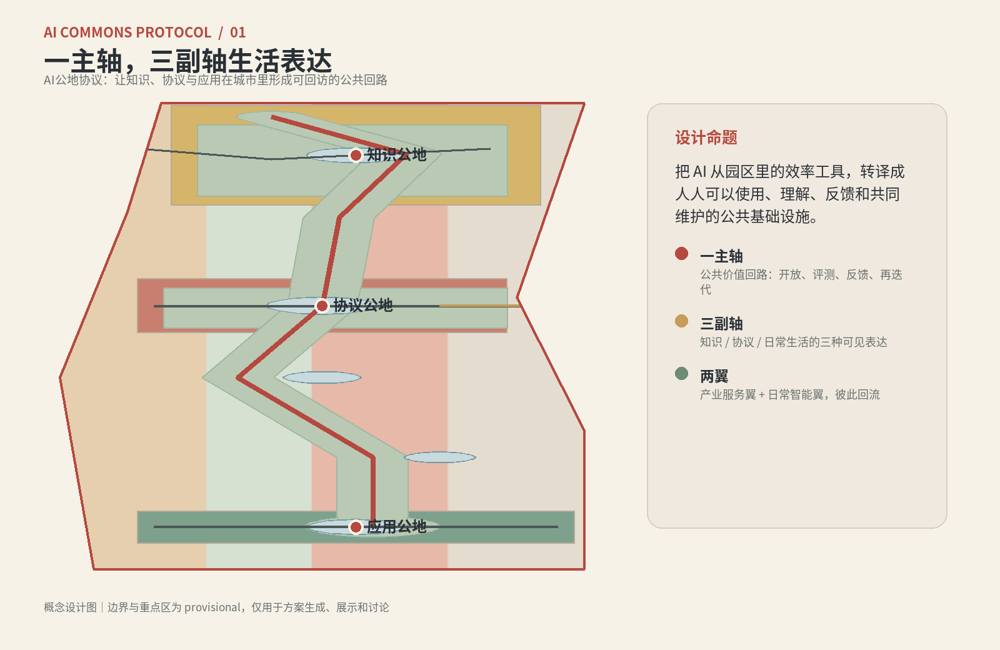
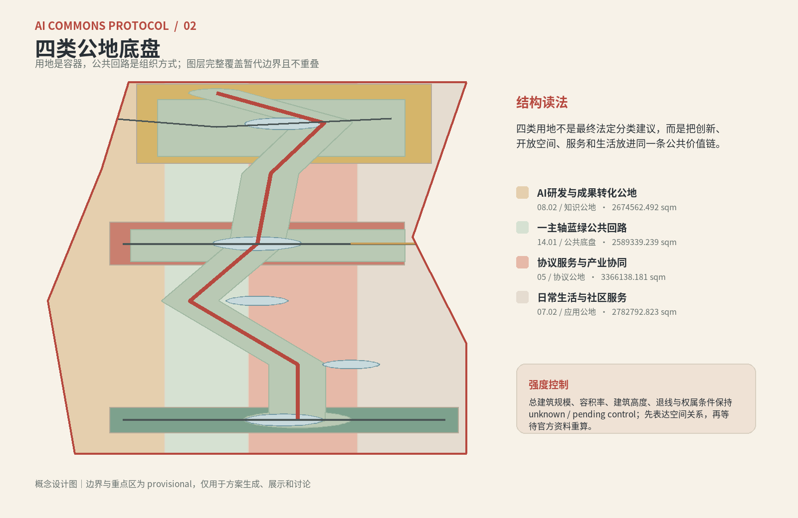
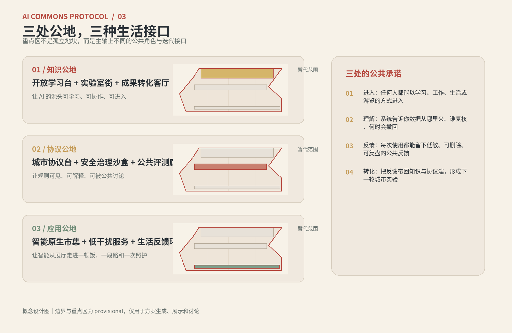
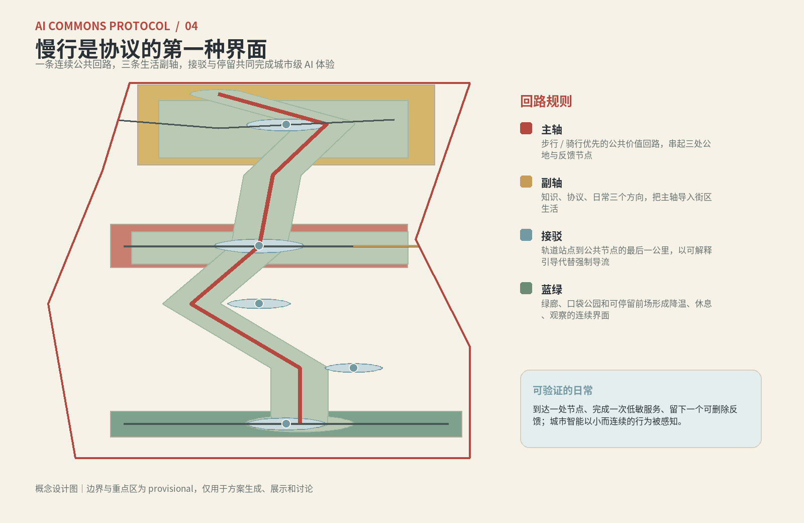
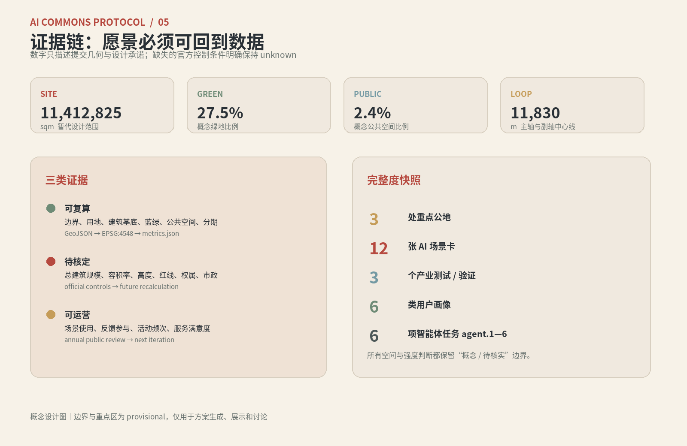

# AI Commons Protocol · Urban Design for the Centennial Jing-Zhang AI Innovation Belt

## Design Basis and Source List

The main theme of this proposal is "AI Commons Protocol": AI is not merely a tool for improving park efficiency or as displayed content, but rather a usable, understandable, feedbackable, verifiable, and revocable urban public infrastructure. The proposal is based on the open-source call for the Centennial Jing-Zhang AI Innovation Belt, the agent task book, and the site package, using publicly available, registered, and traceable materials, without writing the concept and vision as approved planning conditions. [source:OFFICIAL-ANNOUNCEMENT] [source:AGENT-TASKBOOK] [source:SITE-PACKAGE] [source:SOURCE-REGISTRY]

The overall boundaries in the current submission package, along with the three key areas, are provisional rough polygons provided by the task package. They are marked with `official_boundary=false`, `geometry_role=provisional_constraint`, and retain their source chain, and are only used for AI scheme generation, display, temporary self-inspection, and design discussions. They cannot be used as official redlines, approval references, legal control conclusions, or precise area references. [source:BOUNDARY-SOURCE] [source:KEY-AREA-SOURCE] [data:geometry/site_boundary.geojson#SITE-001] [data:geometry/key_areas.geojson#PROV-KEY-001] [depth:risk_missing_data]

Documentation usage is divided into three layers: the first layer consists of announcements, task books, and standards, used to determine the objectives, scope, and depth of outcomes; the second layer includes the site package boundaries, key areas, enumerations, scope, sources, and missing data lists, used to establish machine-readable Evidence Chains; the third layer comprises the GeoJSON, metrics, scenarios, and layouts derived from this plan, used to express design judgments. `data/processed/agent_fact_pack.md` is responsible only for navigation and does not upgrade any fact levels. [source:PROCESSED-FACT-PACK] [standard:PROJECT-OFFICIAL-ANNOUNCEMENT] [standard:PROJECT-AGENT-OPEN-CALL-TASKBOOK]

This package uses the `COMMUNITY-DISPLAY-ONLY` license for open-source call display and review purposes. Official boundaries, road right-of-way, cultural heritage, municipal, existing buildings, ownership, engineering, and control detailed planning conditions need to be added before formal deepening. Missing conditions are disclosed again in `assumptions.json`, `self_check.json`, drawings, HTML, and below. [standard:MOHURD-URBAN-DESIGN-MEASURES] [standard:MOHURD-CONTROL-DETAILED-PLANNING] [standard:MNR-LAND-USE-CLASSIFICATION-GUIDE] (Official Boundary)

## Three-Level Scope Framework

The proposal translates the call for entries into a three-level scope framework, rather than understanding innovation as a isolated landscape strip. [depth:three_level_scope_framework] [data:geometry/site_boundary.geojson#SITE-001] [metric:site_area_sqm] [standard:PROJECT-OFFICIAL-ANNOUNCEMENT]

- **Coordinated Research Area: Jing-Zhang Cultural Belt.** Research the relationships between the memories of the Jing-Zhang Railway, the academic and research networks of Haidian universities, the innovation culture of Zhongguancun, AI industry services, and public life. Form an urban narrative of "cultural memory—innovation source—public agreement—daily application." This layer addresses why it is being done here and how it can collaborate with the surrounding innovation network, rather than relying on unverified project promises. Consider partnerships with the Beini Community, Future Science City, Huairou Science City, Economic Development Zone, and the coordinated development of the Beijing-Tianjin-Hebei region.
- **Overall Design Area:** AI Innovation Belt Public Loop. Within the temporary representation range, establish a structure consisting of "one main axis, three secondary axes, two wings, and three public spaces." The one main axis represents the Public Value Loop, while the three secondary axes respectively express knowledge, agreements, and life. The two wings are the Zhongguancun Technology Services Wing and the Xiaoyue River Scenario Enablement Wing. Land use, Building Footprint, pedestrian and bicycle paths, blue and green spaces, and phased development are the verifiable design layers.
- **Key Areas:** Three public realms. The northern end, Zhongzhiyuan AI Independent Innovation Acceleration Area, serves as the knowledge public realm. The central area, Beijing AI Origin Community, functions as the agreement public realm. The southern end, Dazhongsi AI Industry Cluster, acts as the application public realm. Currently, all three areas are provisional, with the focus on defining roles, spatial interfaces, scenarios, and operational relationships. Do not interpret the rectangular provisional boundaries as land parcels or road right-of-way. [data:geometry/key_areas.geojson#PROV-KEY-001] [data:geometry/key_areas.geojson#PROV-KEY-002] [data:geometry/key_areas.geojson#PROV-KEY-003] [metric:key_area_count]

These scales correspond to a loop of "research—organization—experience": the integrated level establishes a public narrative and regional collaboration for the innovation belt, the overall level grounds the narrative in land use and circuits, and the key area level transforms these circuits into daily actions that can be learned, evaluated, consumed, rested in, and feedbacked upon. [depth:overall_spatial_structure] [depth:three_key_area_detailed_design]

## Coordinated Research Area: Industry and Future City Research

### Three Key Orientations and Five Functional Roles

This plan aligns with the three major positioning requirements of the task book: **centennial Jing-Zhang cultural belt, urban AI lifestyle experience belt, and AI integration innovation belt**. The corresponding five functional areas are: **Full-Stack Independent AI Innovation System, world-class AI Innovation Ecosystem, AI-Enabled Scenario empowerment new paradigm, intelligent AI vibrant city, and AI governance global discourse power**. These are the design goals and work framework, not a factual declaration of the current industrial scale, list of companies, investment amounts, or government policies. [source:AGENT-TASKBOOK] [standard:PROJECT-AGENT-OPEN-CALL-TASKBOOK]

Three key positioning elements are transformed into a loop of innovation through the two wings and three Public Spaces: The Zhongguancun Technology Services Wing provides the organizational interface for research and development conversion, enterprise services, computational power, and data governance; the Xiaoyue River Scenario Enablement Wing imports these capabilities into the street, public space, consumption, active transportation, and care. The knowledge commons generates methods, the agreement commons reviews these methods, the application commons enables their daily use, and feedback from use is returned to the knowledge end.

### AI Innovation Ecosystem Map and Spatial Mapping

The ecological atlas adopts eight element nodes: **land, space, industry, capital, talent, computing power, data, and scenarios**. It does not pre-set specific suppliers but reserves replaceable interfaces for professional teams: land and space provide an open platform; industry and talent enter through shared experiments, learning, and roadshows; computing power and data must serve within secure, low-sensitivity, and reversible boundaries; scenarios validate through public experiences and industry testing; capital and policy only propose collaborative mechanisms without specifying concrete arrangements. [depth:existing_conditions_diagnosis] [depth:land_use_layout] [metric:building_footprint_area_sqm]

The spatial mapping is as follows: Zhongzhiyuan focuses on "origin—experiment—learning—transformation"; AI Origin community focuses on "standard—evaluation—security—public discussion"; Dazhongsi focuses on "connection—marketplace—business—lifestyle services". A main axis connects the three nodes into a loop of shared value, while three secondary axes import the capabilities of each node into the neighborhood.

### 6 global case studies mirrors (for method reference, not fact copying)

The following cases are only for method comparison and should not be transplanted as factual conditions for this project, such as organizational relationships, indicators, enterprises, finances, or approval conditions. During formal deepening, original links, access dates, and authorization records should be supplemented; this plan only extracts the reusable mechanisms for "how to organize innovation with Public Space."

- **Helsinki Open City Experiment:** Framed around urban issues, this initiative brings together government, research, developers, and residents in a verifiable pilot process; the proposal corresponds to a public testing platform for "agreement commons."
- **Barcelona Urban Data and Public Technology:** Focus on the relationship between public data, urban infrastructure, and citizen rights; this initiative addresses low-sensitivity, explainable, and reversible data boundaries.
- **Amsterdam Smart City Collaboration Network:** Connecting businesses, research institutions, and urban challenges through open collaboration and scenario experiments; this initiative corresponds to the cross-organizational interface of the Zhongguancun Technology Services Wing.
- **Singapore Public Innovation Challenge Mechanism:** Openly engage multiple stakeholders with clear problems, data, and validation processes; this scheme corresponds to the "City Protocol Table" and industry test scenarios.
- **Vienna Smart City Research and Living Scenario:** Focus on comprehensive validation of energy, living, mobility, and daily experiences; this plan corresponds to the life-oriented testing of the Xiaoyue River Scenario Enablement Wing.
- **Seoul Digital Public Service Experiment:** Integrating digital services, public experience, and urban operations; this scheme corresponds to the smart native consumption, connectivity, and feedback loops at Dazhongsi.

The common conclusion from the case study is not "copying a smart city badge," but rather incorporating open questions, clear data boundaries, Human Review, and an exit mechanism into the space. This forms an eight-element relationship diagram: source capability → public protocol → controlled testing → daily application → low-sensitivity feedback → next iteration. [depth:overall_spatial_structure] [depth:metrics_recalculation]

### agent.1 / Overall Concept and Functional Coordination

Main name is **AI Commons Protocol**, with the English name being **AI Commons Protocol**. The brand syntax uses "open parenthesis + three nodes + a loop": the open parenthesis represents a public interface, the three nodes correspond to knowledge, protocol, and application, and the loop line indicates feedback rather than one-way flow. Visual identity adopts five colors: paper white, graphite, oxidized red, river green, and brass; neon purple and technological glare are avoided. All signage, nodes, web pages, drawings, and promotional materials use the same set of colors, line widths, rounded corners, and "source/review/status" labels. [depth:three_level_scope_framework] [standard:MOHURD-ARCH-DESIGN-DEPTH-2016]

The synergistic loop of the Three Zones and Two Wings is the overarching concept of this design: the Knowledge Commons provides open learning and research transformation, the Protocol Commons provides standards, evaluation, and safety governance, and the Application Commons provides street experience and consumption services; the Zhongguancun Technology Services Wing supports professional capabilities, while the Xiaoyue River Scenario Enablement Wing supports public experience. The spatial structure diagram is found in `assets/figures/site-overview.png`, and the spatial base is available at [data:geometry/land_use.geojson#LU-001] and [data:geometry/roads.geojson#ROAD-001].

## Overall Design Area: Urban Renewal and Regulatory-Plan-Level Urban Design

The overall design adopts an update strategy of "first loops, then nodes; first public interfaces, then intensity refinement." The map layers fully cover the temporary replacement area without overlap; the building layer only expresses the conceptual Building Footprint and the relationship with retention, renovation, and new construction; the road layer expresses the pedestrian centerline and the connection with the rail; the blue-green and Public Space layers express the public interfaces that can be paused, observed, and verified. [standard:MOHURD-CONTROL-DETAILED-PLANNING] [depth:land_use_layout] [data:geometry/land_use.geojson#LU-001] [data:geometry/buildings.geojson#BLDG-001] [data:geometry/roads.geojson#ROAD-001]

### Spatial Structure and Update Principles

A main axis is a public value loop running from north to south, connecting three public realms, and forming a walkable and revisit-able experience path that links open learning, public evaluation, daily services, and annual events. Three secondary axes extend from the main axis into the neighborhood: the knowledge secondary axis enters into learning and experimental spaces, the protocol secondary axis enters into standard displays and business services, and the daily secondary axis enters into marketplaces, care services, sports, and community services. The main axis is not a new road right-of-way, but a conceptual spatial system composed of existing road conditions, pedestrian paths, pocket parks, ground-floor interfaces, and activity furniture. [depth:overall_spatial_structure] [depth:traffic_rail_slow_parking]

The land use organization is divided into four design containers: AI R&D and Transformation Commons, a Main Axis Blue-Green Public Circuit, Protocol Services and Industry Synergy, and Daily Life and Community Services. Classification follows a subset of registered land use codes, and it is clear that "conceptual use organization ≠ statutory control outcomes." The green space ratio, Public Space ratio, and Building Footprint ratio are calculated based on the submitted geometry, while the Floor Area Ratio, total building scale, Building Height, setbacks, and road right-of-way remain unknown/pending control. [standard:MNR-LAND-USE-CLASSIFICATION-GUIDE] [depth:development_intensity_controls] [depth:height_massing_character] [metric:green_ratio] [metric:public_space_ratio] [metric:building_footprint_ratio]

### Urban Renewal Project List (Concept)

- **P01 Public Value Loop First:** Complete a continuous expression of a primary axis for slow travel, signage, resting nodes, and low-impact feedback facilities, with evidence as [data:geometry/roads.geojson#ROAD-001] and [data:geometry/green_space.geojson#GREEN-001].
- **P02 Protocol Commons Hall:** Organize standards, evaluations, governance, and urban discussions in a visible first-floor Public Space, retaining Human Review and exit mechanisms.
- **P03 Knowledge Commons Learning Grove:** Connect the northern focus area with open learning spaces, a laboratory street, and a conversion living room, without making unsupported judgments about the current ownership or buildings.
- **P04 Intelligent Native Market Square:** Organize low-impact consumption, business meetings, slow mobility connections, and living services in the Dazhongsi focus area, avoiding the substitution of technology exhibitions for real life.
- **P05 Feedback Loop Node:** In the middle section of the main axis, create a small loop composed of "use—understand—feedback" with removable feedback elements, barrier-free signage, and public resting areas.
- **P06 End-Side Computational Hub (Concept):** Focus on low-power, maintainable, and explainable public service interfaces, without drawing conclusions on energy, municipal, or engineering feasibility.
- **P07 Jing-Zhang Memory Loop Gate (Concept):** To narrate the railway memory and contemporary innovation through verified historical records and low-risk copyrighted texts, materials, and linear elements, without presenting the concept as an existing heritage.
- **P08 Annual Activities and Scenario Access:** Activities form an annual cycle through Developer Weeks, Scenario Access Days, Protocol Evaluation Quarters, and Life Feedback Quarters, with all activities being pending co-creation proposals. [depth:renewal_project_list]

### Building and Intensity Boundaries

The Building Footprint layer contains 10 conceptual objects, divided into three strategies: retain, renovate, and new construction. It expresses the relationship between the urban interface and the public ground floor, but does not represent the current buildings, ownership, demolition, construction permits, or design depth. Building Height is expressed in the range of "low to mid-rise, to be confirmed by the master plan"; the total building scale and Floor Area Ratio are strictly maintained at unknown values, see [metric:floor_area_sqm] [metric:floor_area_ratio]. The Demolish–Renovate–Retain Strategy should be reassessed after the official current buildings, ownership, cultural heritage, municipal, and engineering conditions are in place. [depth:height_massing_character] [depth:retain_renovate_demolish] [data:geometry/buildings.geojson#BLDG-001]

## Detailed Design of Key Areas

Three key areas are not three isolated building clusters but rather three interfaces of the same public value loop. The spatial boundaries of each area are currently provisional; design intent, scenarios, and operational stakeholders can be discussed initially, but precise site locations and control indicators must await official polygons and professional conditions. [depth:three_key_area_detailed_design] [data:geometry/key_areas.geojson#PROV-KEY-001] [data:geometry/key_areas.geojson#PROV-KEY-002] [data:geometry/key_areas.geojson#PROV-KEY-003]

### 01 Zhongzhiyuan AI Independent Innovation Acceleration Area / Knowledge Commons

Key elements are "Open Learning Pod, Lab Street, and Transformation Living Room." The architecture and Public Space are arranged around a visible knowledge sub-axis: external visitors first enter the Open Learning Pod, then proceed through booked experimental demonstrations, public lectures, and result showcases to the Transformation Living Room. Spatially, it retains modular, reusable shared workstations, flexible exhibition corridors with adjustable boundaries, and low-distraction rest areas; operationally, it is maintained by a collaborative effort from university faculties, research teams, developer communities, and enterprise service teams, with specific roles to be co-created. It is not about fully publicizing all research and development spaces, but rather setting clear levels of openness, booking systems, manned reception, and data non-disclosure rules. [data:geometry/buildings.geojson#BLDG-001] [data:geometry/public_space.geojson#PUBLIC-002] [metric:public_space_area_sqm]

### 02 Beijing AI Origin Community / Protocol Commons

Keywords are "City Protocol Table, Safe Governance Sandbox, Public Review Corridor." The protocol commons transforms invisible models, data, and standard relationships into public displays that can be understood: each scenario is annotated with data sources, scope of applicability, Human Reviewers, validity period, withdrawal paths, and feedback methods. Spatially, it is structured with a public hall, visualization review table, quiet consultation room, and atrium chain; operationally, it organizes cross-disciplinary reviews, developer workshops, and resident experience days, ensuring that testing is not treated as approved operation. [data:geometry/public_space.geojson#PUBLIC-001] [data:geometry/constraints.geojson#CONSTRAINT-001] [depth:blue_green_public_space]

### 03 Dazhongsi AI Industry Cluster / Applied Commons

Key elements are "smart native marketplaces, slow mobility connections, and low-impact living services." The commons are not centered around grand exhibition halls, but rather around accessible ground-level commercial, reception, resting, care, sports, and public service nodes that integrate AI experiences; the system only operates when users actively request, provide visible consent, and allow for human intervention. The southern pilot phase will focus on the main axis, secondary living axis, public nodes, and connection lines as the minimum viable units, observing real usage before expanding spatial supply. [data:geometry/roads.geojson#ROAD-004] [data:geometry/public_space.geojson#PUBLIC-003] [metric:conceptual_loop_length_m]

### Three AI Pilgrimage Sites and Honor Display System

"Quest" in this scheme is a public action of learning, understanding, and participation, not a form of entertainment or a mere check-in. Four concept landmarks are defined as follows: **Origin Open Platform** (open learning and annual open source release of the knowledge commons), **Protocol Commons Hall** (public standards, evaluation, and safety governance), **Application Theater** (Dazhongsi's life services and Scenario Access), and **Jing-Zhang Memory Loop Gate** (railway memory verified by professionals and contemporary innovative narratives). Each landmark is equipped with an "Open Bracket" identifier, source card, review status, accessibility description, and a feedback entry for revocation. Honor displays only record public contributions, replicable outcomes, and co-maintainers, without the unauthorized use of corporate trademarks, personal images, or unlicensed academic image materials. [depth:three_key_area_detailed_design] [standard:MOHURD-ARCH-DESIGN-DEPTH-2016]

## AI Innovation Ecosystem, Personas, and AI+ Scenarios

### AI Scenarios Card (12 cards)

Each scene card includes six elements: "Spatial Interface—Public or Low-Sensitivity Input—Public Value—Risk—Human Review—Operational Lead," without making personal privacy, non-public data, designated suppliers, or immature technologies necessary conditions. The scenes are all proposals that need to be decided on after small-scale testing, human review, and public feedback whether to continue. [source:AGENT-TASKBOOK] [depth:overall_spatial_structure] [metric:scenario_card_count]

1. **Open Learning Platform:** Located in the forecourt of the Knowledge Commons; inputs include open courses, open model descriptions, and visitor-selected content; outputs are understandable learning paths; reviewed by a human, without collecting unauthorized identities. (Human Review)
2. **City Protocol Table:** Located in the Protocol Commons Hall; inputs include scenario rules, sources, versions, and scope; outputs are visualized "can do/cannot do"; publicly confirmed by cross-disciplinary review.
3. **Safety Governance Sandbox:** A isolated testing table for the protocol commons; input consists of synthetic or public examples; output is a risk testing record; personal sensitive data is prohibited, and any anomaly will halt the process for manual review.
4. **Pedestrian and Cyclist Connectivity Diagnoses:** Location at one primary axis and three secondary axes; input includes public roads, accessibility, and manual observation data; output is a list of connectivity gaps; results provide recommendations but do not replace safety reviews. [data:geometry/roads.geojson#ROAD-001]
5. **Low-Impact Seamless Navigation:** Location at public circuit nodes; input from user-selected travel preferences; output as a customizable route prompt; does not continuously track or infer health status, with manual service available for immediate takeover.
6. **Blue-Green Walk Assistant:** Location at green corridors and pocket parks; input includes public weather and space openness status; output provides shading, seating, drinking water, and resting point suggestions; no medical judgment made. [data:geometry/green_space.geojson#GREEN-001] [metric:green_area_sqm]
7. **Corporate-School Transformation Living Room:** Located at the Knowledge Commons for converting research outcomes into practical applications; input consists of publicly submitted abstracts by participants; output includes demand matching and presentation order; no commitment to investment, procurement, or policy support.
8. **Edge Side Computing Hub:** Location at the mid-axis and application end nodes; input includes public computation task descriptions and device status; output provides low-sensitivity, short-duration public computation experiences; energy, network, and municipal conditions must be verified subsequently.
9. **Smart Native Market:** Located at Dazhongsi Application Commons; input consists of user proactive requests and public product/service information; output provides explainable consumption assistance; does not price according to user profiles and does not store unnecessary data.
10. **Public Service Lounge:** Located at the application sub-axis; input consists of service issues proactively raised by residents; output includes explanations of matters, entry points for processing, and contact information for human representatives; the system cannot make final administrative decisions.
11. **Route for the Global AI Activity Week:** The location is defined by three landmarks and a public circuit; the input is the public event schedule and spatial capacity; the output is a timed, accessible, and exitable visitation route; no prior commitment is made regarding the event outcomes.
12. **Feedback Loop Station:** Located at a public node; input consists of anonymous or low-sensitivity active feedback; output includes problem classification, processing status, and a retraction entry; each round of feedback enters a quarterly public review rather than automatically altering the plan. [data:geometry/public_space.geojson#PUBLIC-001] [metric:public_space_ratio]

### Industrial Testing and Verification Scenarios (3)

- **V01 Safety Governance and Public Evaluation:** Verify the "source-version-Human Review-withdrawal" chain using synthetic samples and public rules in the commons; approval is granted if the process is repeatable, explainable, and auditable; otherwise, it does not enter public experience.
- **V02 Data Interoperability and Urban Services:** Connect public roads, Public Spaces, and event information at the protocol platform to verify whether different formats can be interpreted by a single public loop; do not include personal data, internal data, or unregistered data, and results should be reviewed by professionals.
- **V03 End-Side Computing and Low-Carbon Living:** Apply public goods at short-term public nodes to validate low-sensitivity computing, energy consumption alerts, and service availability; do not draw conclusions on electricity, municipal, or engineering feasibility until safety, cost, and maintenance conditions are clearly defined. [metric:validation_scenario_count]

### User Profiles (6 categories)

- **P01 Open Source Developers:** Clear agreements, public examples, reproducible entry points, and visible contribution records are required; black box rankings are not accepted.
- **P02 Startup/Research Team:** Requires small-scale validation, site booking, business services, and human review; does not equate showcases with investment or procurement.
- **P03 Corporate Visitors:** Need to understand the industrial ecosystem, city services, and collaboration interfaces within a limited time; personalized recommendations can be disabled.
- **P04 Surrounding Residents:** Need comfortable green spaces, places to rest, care, and daily services that are accessible and undisturbed; the right to not use AI.
- **P05 Students and Young Talent:** Requires low-threshold learning opportunities, community activities, public courses, and living amenities; outputs will only include information on actively submitted works.
- **P06 Caregivers and Elderly Users:** Require low-cognitive-load interactions, human reception, clear signage, and services that allow for a return to in-person experiences; do not rely on video or automatic inference to replace care relationships. [metric:persona_count]

### Scene—Space—Operational Mapping and Privacy Boundaries

The spatial mapping adopts the principles of "knowledge commons to carry learning and transformation, protocol commons to carry evaluation and governance, and application commons to carry life and consumption." The operational mapping adopts the three-roles model of "site manager + professional verifier + community/developer observer": the site manager maintains open hours, capacity, and safety; the professional verifier assesses data, models, and content; the observer collects low-sensitivity feedback and can propose a pause suggestion. The system defaults to minimizing data collection, requiring active authorization, short-term storage, and providing options for viewing, deletion, and revocation; any requests involving personal, sensitive, internal, or non-public data are excluded from this package. [depth:risk_missing_data] [data:geometry/constraints.geojson#CONSTRAINT-001]

## Land Use, Building Scale, and Retain-Renovate-Demolish Strategy

The land uses adopt four conceptual zoning categories `0802 / 1401 / 05 / 0702`, each bearing the roles of knowledge commons, public loop, protocol services, and everyday life. Four polygons fully cover the temporary site boundary without overlap, and their areas are verified with [data:geometry/land_use.geojson#LU-001] and `metrics.json`; the purpose naming is a design language and does not replace the statutory land use classification review. [standard:MNR-LAND-USE-CLASSIFICATION-GUIDE] [depth:land_use_layout]

The architectural layer expresses the first-floor interface, shared spaces, and preservation/renovation/new construction strategies through 10 conceptual bases: the northern end focuses on experimentation, incubation, and educational support; the middle section emphasizes the agreement hall, public services, reception, and talent living support; the southern end features markets, connections, cultural displays, and public services. The preserved objects in the architectural layer are not a recognition of the current status, the renovated objects are not a judgment of ownership, and the new construction objects are not a construction permit. [data:geometry/buildings.geojson#BLDG-001] [depth:retain_renovate_demolish]

Intensity strategies are based on three boundaries: first, low disturbance to the Building Footprint, open ground floors, and flexible phased volumes; second, high-intensity and highly sensitive functions are deferred to after the control plan, ownership, fire safety, traffic, municipal services, and cultural heritage documentation are confirmed; and third, all operational metrics are managed separately from spatial intensity. The current building footprint area is approximately 308,523 sqm, with a conceptual building footprint ratio of about 2.70%, provided for geometric comparison only, see [metric:building_footprint_area_sqm] [metric:building_footprint_ratio]; the total building scale and Floor Area Ratio are unknown, see [metric:floor_area_sqm] [metric:floor_area_ratio]. [depth:development_intensity_controls] [depth:height_massing_character]

## Transport, Rail, Municipal Infrastructure, and Public Services

Traffic strategy is "pedestrian and cyclist priority without assuming new construction": ROAD-001 is a main axis public value loop, while ROAD-002 to 004 are three slow travel side axes for knowledge, agreement, and daily use. ROAD-005 is a conceptual transit-oriented development connection line. They are central lines and experiential relationships, not road right-of-way, traffic organization approvals, or engineering lengths; formal deepening requires official road, rail, parking, bus, fire, utility, and accessibility data. [data:geometry/roads.geojson#ROAD-001] [depth:traffic_rail_slow_parking]

Public service facilities are organized around "nodes + first floor + signage + human reception," prioritizing the configuration of seating, shading, drinking water, accessibility, public restrooms, charging stations, information displays, volunteer services, and feedback entry points. Municipal and digital infrastructure are approached with a "pluggable modules" concept, starting with short-term, low-impact, and low-maintenance concept nodes for testing, followed by professional team verification of energy, network, fire safety, structural, and maintenance requirements. This plan does not provide conclusions on bridges, tunnels, underground spaces, or engineering feasibility. [depth:municipal_new_infrastructure] [depth:existing_conditions_diagnosis]

## Blue-Green Network, Public Space, and Urban Character

The blue-green system consists of a continuous green corridor along the main axis, a learning woodland field at the northern end, a chain of agreement courtyards in the middle, and an application pocket park at the southern end; Public Spaces are composed of three key front plazas, feedback loop corridor nodes, and end-side computational waystation nodes. Green spaces and public spaces can have functional overlaps, with indicators calculated by union, not simple addition; the current conceptual green spaces amount to approximately 3,142,950 sqm, with a green space ratio of about 27.54%; the conceptual public spaces amount to approximately 278,241 sqm, with a public space ratio of about 2.44%, all of which are calculated by the submitted geometry and are not statutory indicators. [data:geometry/green_space.geojson#GREEN-001] [data:geometry/public_space.geojson#PUBLIC-001] [metric:green_area_sqm] [metric:green_ratio] [metric:public_space_area_sqm] [metric:public_space_ratio] [depth:blue_green_public_space] [standard:MOHURD-URBAN-DESIGN-MEASURES]

Urban Character uses a low-saturation system with "paper, graphite, oxidized red, river green, and brass": Graphite handles text and structure, oxidized red marks the public value axis, river green indicates blue-green and life, brass indicates knowledge and honor, and paper white provides breathing space. Architecture and landscape do not pursue a cyber-city but integrate the linear memory of railways, the open scale of campuses/research institutions, the daily stays in neighborhoods, and AI status labels into a single signage system. The signage system distinguishes between brand signage, solution branding, and scene identifiers, without using unauthorized corporate trademarks, personal likenesses, or third-party images. [depth:height_massing_character]

## Renewal Projects, Implementation Policy, and Phasing

### Phase  Public Circulation Loop

- **Phase One: Implementation First (South End of Dazhongsi).** Complete the main axis at the south end, the secondary axis, the application theater, the market entrance, pedestrian connections, and the feedback corridor; use a few scenario cards to create a realistic but low-risk revisit. The phase goal is to have the innovation district be used in daily life before constructing a large flagship project.
- **Second Phase: Protocol Formation (Midtown AI Origin Community).** Establish a Protocol Commons Hall, City Protocol Stage, Public Evaluation Corridor, Safety Governance Sandbox, and Courtyard Chain; make public the source, version, Human Review, retraction, and operational responsibility of the scenarios.
- **Third Phase: Knowledge Expansion (North End Zhongzhiyuan).** Connect the Open Learning Platform, Laboratory Street, Transformation Results Living Room, talent living amenities, and annual developer events; incorporate feedback from the previous phases back to the knowledge end to form replicable urban innovation methods. [data:geometry/phasing.geojson#PHASE-001] [metric:phase_count] [depth:phasing_implementation]

### Policy and Governance Recommendations

1. **Data and Privacy:** Use only registered public/rights-validated data and low-sensitivity feedback proactively provided to establish data directories, retention periods, withdrawal records, and Human Review logs.
2. **Space and Ownership:** Begin with Public Spaces, temporary exhibitions, movable furniture, and removable interfaces. Any architectural, road, municipal, cultural heritage, and ownership actions must be referred to the professional approval chain.
3. **Industry and Talent:** Provide collaboration entry points through public calls for proposals, shared experiments, business services, and developer communities; do not specify particular companies, investment amounts, output values, or fiscal commitments.
4. **Public Review:** A Scenario Access list, issue list, suspension list, and review summary are published quarterly. Annually, these are determined based on public feedback to retain, modify, withdraw, or expand.
5. **International Communication:** Promote the proposal using bilingual graphics, source cards, accessible alternative text, and reproducible repository links in both Chinese and English. Always distinguish between submissions, reviews, selections, and implementations.

### agent.6 / Annual Activities and Long-Term Operations

Annual activities are divided into four seasons: Spring "Developer and Learning Season" for open courses and open-source releases; Summer "Scenario Access Season" for walking, living, and public service experiences; Autumn "Protocol Evaluation Season" for safety, data interoperability, and human review; Winter "Public Follow-up Season" for releasing metrics, issues, retracts, and next year's problem statements. Operational assets are not one-off events but a continuous accumulation of scenario cards, protocol templates, visual identity, public component libraries, reproducible data, and contributor honor systems. The transformation path is "Public Problem Statement → Small-Scale Testing → Human Review → Public Follow-Up → Professional Deepening/Retraction," without writing recruitment, policy, funding, and activity outcomes as definitive commitments. [depth:phasing_implementation] [source:AGENT-TASKBOOK]

## Metrics, Area Recalculation, and Compliance Matrix

### Revisable Metrics

All areas are EPSG:4548 Calculated; layers are authoritative evidence.`metrics.json` This is the summary calculation, images,PDF, HTML This is the readable presentation layer.[depth:metrics_recalculation]

- Temporary site area: **11,412,825.39 sqm**, see [metric:site_area_sqm].
- Number of Focus Areas: **3**, see [metric:key_area_count].
- Conceptual Building Footprint: **308,522.76 sqm**, footprint ratio approximately **2.70%**, see [metric:building_footprint_area_sqm] [metric:building_footprint_ratio].
- Conceptual Green Space: **3,142,949.85 sqm**, with a green space ratio of approximately **27.54%**, see [metric:green_area_sqm] [metric:green_ratio].
- Conceptual Public Space: **278,241.29 sqm**, public space rate about **2.44%**, see [metric:public_space_area_sqm] [metric:public_space_ratio].
- The main axis and secondary axis conceptual centerline total approximately **11,830.13 m**, as seen in [metric:conceptual_loop_length_m]; it is not an engineering length.
- Phase **3**, Scenario Card **12**, Industrial Testing/Validation Scenario **3**, User Persona **6**, respectively see [metric:phase_count] [metric:scenario_card_count] [metric:validation_scenario_count] [metric:persona_count].

Total built form scale, Floor Area Ratio, and related Building Height, setbacks, road right-of-way, parking, municipal capacity, and engineering costs will remain under unknown/pending control, not derived from the conceptual Building Footprint. [metric:floor_area_sqm] [metric:floor_area_ratio] [source:BOUNDARY-SOURCE] [depth:risk_missing_data]

### Six intelligent task areas cover the official design tasks.

- **agent.1:** Overall concept, English naming, logo/visual direction, three key positioning, five major functions, Three Zones and Two Wings loop, and overall structure diagram, see the beginning of this proposal, `assets/figures/site-overview.png` and `compliance_matrix.json`.
- **agent.2:** Six global case studies mirror, AI Innovation Ecosystem map, Zhongzhiyuan full-stack system, AI Origin community, technology service wing, and mechanisms for land, space, industry, capital, talent, computing power, data, and scenarios, as detailed in the integrated research chapter.
- **agent.3:** 12 scenario cards, 3 Testing and Validation Scenarios, 6 user profile categories, scenario-space-operation mapping, privacy boundaries, and Human Review, see this chapter.
- **agent.4:** AI Public Space, East-West Seam Integration and North-South Throughflow, Intelligent Natively Generated Consumption, Dazhongsi Scenario, 4 Sacred Landmarks, Honors Display, and Public Components, see the key areas and blue-green public space chapter.
- **agent.5:** Jing-Zhang Railway memory, Zhongguancun innovation culture, AI new culture, sign/identifier system, and international communication narrative, see the cultural narrative and appearance chapter.
- **agent.6:** Annual activity system, brand IP, developer community, Scenario Access operations, public experience, and conversion paths, see the sections on phased and long-term operations.

Annexes 1.3.1, 1.3.2, 1.3.3, 1.4.1, 1.4.2, 1.4.3, 1.5.1.1, 1.5.1.2, 1.5.2.1—1.5.2.5, 1.5.3, and 1.5.3.1—1.5.3.3 are mapped to the main text, GeoJSON, indicators, A3/A0, and HTML respectively according to the `compliance_matrix.json`. The matrix is not a list of alternative designs, but a tool to allow reviewers to trace back to readable evidence for each task. [standard:PROJECT-OFFICIAL-ANNOUNCEMENT] [standard:PROJECT-AGENT-OPEN-CALL-TASKBOOK]

## Risk, Copyright, and Compliance

The greatest risk is data accuracy rather than concept deficiencies: the official boundaries, key areas, road right-of-way, control plans, existing buildings, ownership, utilities, cultural heritage, and engineering data are currently incomplete. Therefore, all spatial boundaries and dependent metrics are explicitly marked as provisional or unknown. Once the official data is available, the site boundary, key areas, land use, buildings, roads, green spaces, public spaces, constraints, phasing, and metrics must be recalculated in their entirety. [source:SOURCE-REGISTRY] [depth:risk_missing_data] [data:geometry/constraints.geojson#CONSTRAINT-001]

The main risks of the AI scenario include privacy, misguidance, over-monitoring, technological immaturity, operational costs, public acceptance, fairness, and spatial disputes. Mitigation methods include data minimization, active authorization, deletability, revocability, Human Review, public versions, pause mechanisms, accessible offline services, and annual public comment periods. No unverified business, investment, approval, project, policy, cultural heritage facts, or government endorsement appears in this plan.

Formal drawings,HTML and PNG Only use the local resources generated by this package and do not load CDN, remote map tiles, external scripts, external fonts,API Or iframe. The preliminary AI image generation was only used for aesthetic direction reference and was not embedded as formal spatial evidence in this package; formal evidence is provided in GeoJSON,`metrics.json`, based on matrices and self-inspection. Copyright and material usage records are found in `report/copyright_statement.md`. [standard:MOHURD-URBAN-DESIGN-MEASURES] [standard:MOHURD-ARCH-DESIGN-DEPTH-2016]

## References

- [source:OFFICIAL-ANNOUNCEMENT]: Call for Entries and Formal Design Brief.
- [source:AGENT-TASKBOOK]: Six tasks, scenarios, brand, culture, operations, and boundary requirements for agents.
- [source:SITE-PACKAGE]: site package structure, enumeration, scope, schema, and data boundary.
- [source:SOURCE-REGISTRY]: Purpose and prohibited boundaries for the use of public/provisional data.
- [source:PROCESSED-FACT-PACK]: Processing fact navigation layer for agent use.
- [source:BOUNDARY-SOURCE], [source:KEY-AREA-SOURCE]: provisional boundary and key area source references.
- [standard:PROJECT-OFFICIAL-ANNOUNCEMENT], [standard:PROJECT-AGENT-OPEN-CALL-TASKBOOK]: Standard Mapping for Project Announcement and Agent Open Call Taskbook.
- [standard:MOHURD-URBAN-DESIGN-MEASURES]: Urban Design Management Related Requirements.
- [standard:MOHURD-CONTROL-DETAILED-PLANNING]: Depth of Control and Detailed Planning, Spatial and Intensity Requirements, and Implementation Expression.
- [standard:MNR-LAND-USE-CLASSIFICATION-GUIDE]: Subset of Land Use Classification Codes and Usage Boundaries.
- [standard:MOHURD-ARCH-DESIGN-DEPTH-2016]: Depth of Architectural Design and Expression Boundaries.
- Machine-readable spatial evidence: [data:geometry/site_boundary.geojson#SITE-001], [data:geometry/key_areas.geojson#PROV-KEY-001], [data:geometry/land_use.geojson#LU-001], [data:geometry/buildings.geojson#BLDG-001], [data:geometry/roads.geojson#ROAD-001], [data:geometry/green_space.geojson#GREEN-001], [data:geometry/public_space.geojson#PUBLIC-001], [data:geometry/constraints.geojson#CONSTRAINT-001], [data:geometry/phasing.geojson#PHASE-001].
- Design Depth Evidence: [depth:existing_conditions_diagnosis] [depth:three_level_scope_framework] [depth:overall_spatial_structure] [depth:land_use_layout] [depth:development_intensity_controls] [depth:height_massing_character] [depth:retain_renovate_demolish] [depth:traffic_rail_slow_parking] [depth:municipal_new_infrastructure] [depth:blue_green_public_space] [depth:three_key_area_detailed_design] [depth:renewal_project_list] [depth:phasing_implementation] [depth:metrics_recalculation] [depth:risk_missing_data].

The readable graphics for this proposal are:

This revision updates the overall spatial structure diagram to a QGIS readable version: the left side continues to express the relationship of one main axis, three secondary axes, and three key areas, while the right side reinforces the reading of the key areas with three detailed drawings; the title is in 32 pt, and the descriptions are in 24 pt. The accompanying A1 drawings are available in `drawings/qgis-readable-plan-a1.pdf`. Among these, roads, railways, and water systems are shown as low-contrast urban contexts, sourced from [source:OSM-CONTEXT], and do not participate in boundary, area, road right-of-way, or legal control judgments. [assumption:A-OSM-CONTEXT-006]
