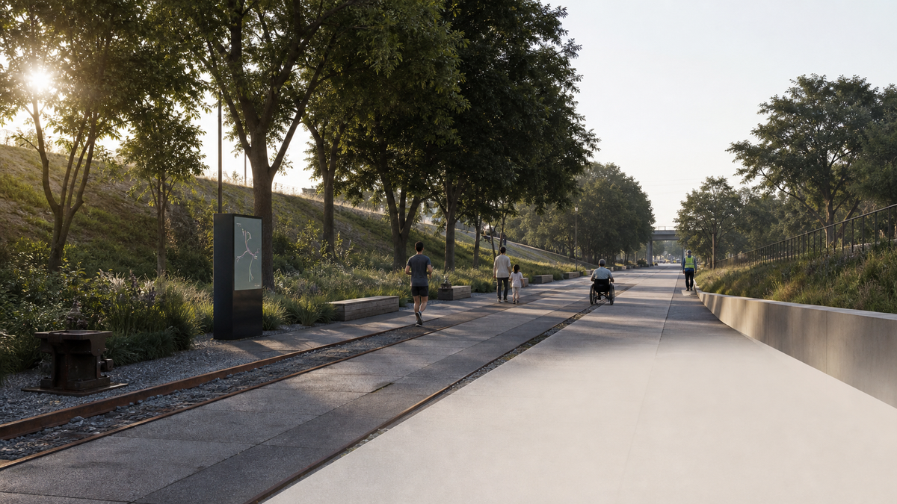
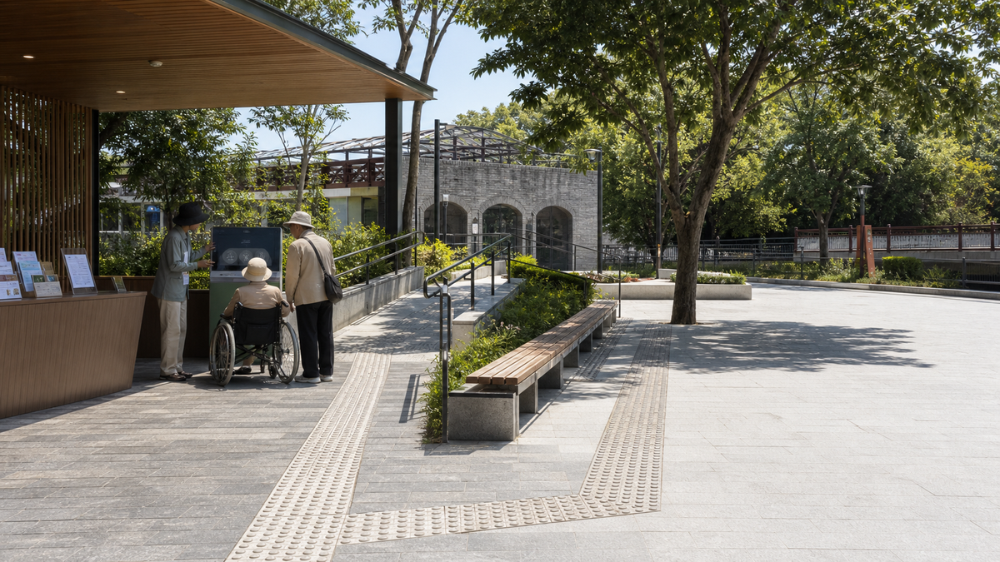
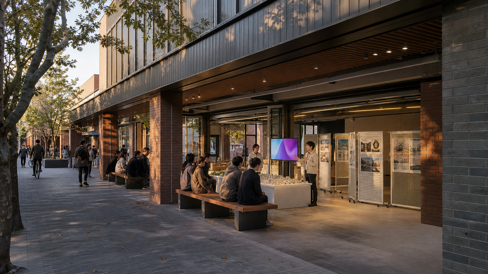
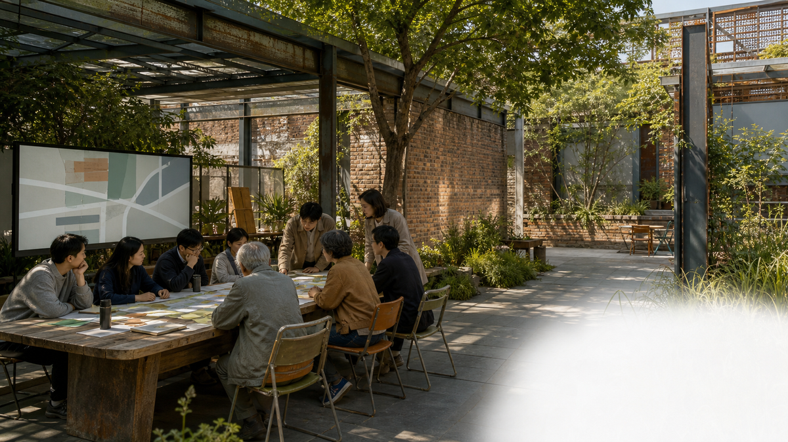
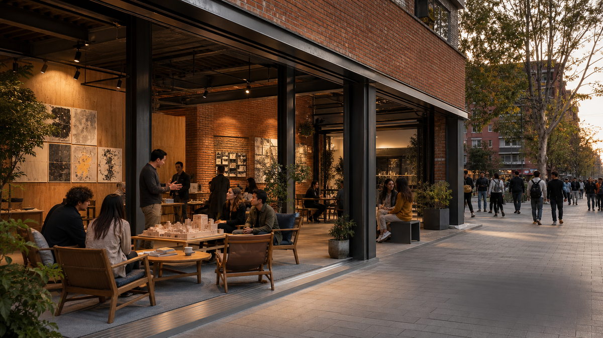
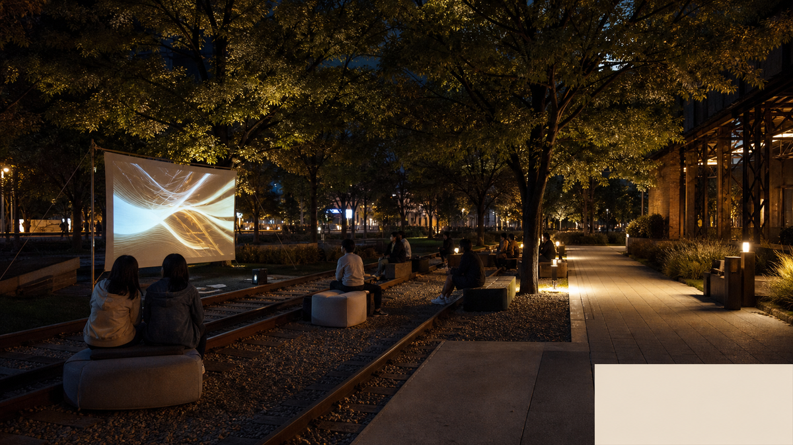

# Centennial Jing-Zhang: AI in the Everyday Life of the Heritage Park

## 1. Proposal Summary

This proposal turns the memory of the Centennial Jing-Zhang Railway, the contemporary Zhongguancun innovation network, and future-oriented AI public services into a walkable urban experience. The Jing-Zhang heritage park is treated as the cultural and public-space spine; the Beijing AI Origin Community, Zhongzhiyuan AI Acceleration Area, and Dazhongsi AI Industry Cluster are three innovation anchors linked through walking, cycling, public space, and open events. [source:AGENT-TASKBOOK] [data:geometry/key_areas.geojson#PROV-KEY-001]

This is a conceptual proposal, not a statutory plan, government approval, engineering design, or investment commitment. The current site and key-area geometries are provisional constraints; official boundaries, road controls, heritage controls, ownership, and municipal conditions require later confirmation and recalculation. [data:geometry/site_boundary.geojson#SITE-001] [source:DATA-SRC-PROVISIONAL-BOUNDARIES-20260605]

## 2. Core Spatial Structure

The proposal uses one cultural spine, three innovation anchors, two collaborative wings, and multiple AI scenario nodes:

- A cultural spine along the Jing-Zhang heritage park for railway memory, urban strolling, and public events.
- Three anchors: the Beijing AI Origin Community for translation and talent life; Zhongzhiyuan for full-stack innovation, testing, and governance display; and Dazhongsi for AI-native industry, public experience, and international exchange.
- A Zhongguancun technology-service wing linking universities, research, enterprise services, and developers.
- A Xiaoyuehe scenario-empowerment wing linking ecology, slow mobility, community service, and AI experience.

No new statutory redlines are proposed. Later professional work should first verify cross-ring-road walking links, rail-station connections, riverfront public space, and walking discontinuities between campuses and communities. [depth:overall_spatial_structure] [standard:PROJECT-OFFICIAL-ANNOUNCEMENT]

## 3. Three Key Areas

### 3.1 Beijing AI Origin Community: An Open Translation District

The area is conceived as a converter from campus outcomes to urban life. Suggested components include an open-source launch hall, an outcome-display promenade, community-service nodes, and reservable co-creation rooms. Research outputs, personal information, and enterprise data require authorization and human review. [data:geometry/key_areas.geojson#PROV-KEY-002] [depth:three_key_area_detailed_design]

### 3.2 Zhongzhiyuan AI Acceleration Area: A Visible Testing and Governance District

The area is conceived as a place where technical testing can be observed while risks remain controlled. Low-carbon public space, developer workshops, model-safety displays, and open test nodes can work together. Public interfaces should display methods, human review, and feedback rather than unauthorized internal models or personal data. [data:geometry/key_areas.geojson#PROV-KEY-001] [standard:PROJECT-AGENT-OPEN-CALL-TASKBOOK]

### 3.3 Dazhongsi AI Industry Cluster: An Interface Between Industry and City Experience

The area is conceived as a place where industry exchange becomes understandable urban experience. Suggested components include an international pitch lounge, compliant data-element display, AI-terminal experiences, and station-adjacent public-event space. Visualizations express a spatial vision; no enterprise list, commercial commitment, investment amount, or delivery schedule is assumed. [data:geometry/key_areas.geojson#PROV-KEY-003] [depth:three_key_area_detailed_design]

## 4. Ten AI Scenarios

The first edition defines ten scenario cards. They are supported by spatial diagrams and evidence notes; six selected public-realm scenarios also receive photorealistic conceptual visualizations:

1. AI Jing-Zhang cultural guide with multilingual and explainable routes.
2. Accessible strolling assistant with rest-point and alternate-route guidance.
3. Open-source outcome launch hall for public results from universities, developers, and start-ups.
4. Model-safety governance sandbox that makes testing and human review publicly understandable.
5. Low-carbon waterfront innovation promenade for ecology, stormwater learning, and walking.
6. Shared developer test station for reservable public demonstrations and exchange.
7. Campus-adjacent outcome-translation street connecting campuses, community, and exhibition services.
8. Dazhongsi international pitch lounge for public presentation and multilingual exchange.
9. AI everyday-service sample street for assisted education, ageing, health, and community services.
10. Global AI activity-week route linking heritage, parks, community, industry, and exchange nodes.

All scenarios are conceptual. They must not require unauthorized personal trajectories, facial recognition, or continuous surveillance; safety-related judgement remains with people and qualified teams. [depth:ai_scenario_operation] [source:DATA-SRC-PUBLIC-SOURCE-REGISTRY]

The following visualizations show public experience only. They do not define statutory boundaries, area, engineering, approval, or delivery commitments. All are labelled conceptual proposals.

## 5. People and Experience

The proposal prioritizes five groups: nearby residents, AI start-up teams, developers and researchers, international visitors, and older or mobility-impaired people. The public realm must offer seating, shade, accessibility, clear wayfinding, toilets, and non-AI alternatives. Each scenario card will answer who uses it, where it operates, how people review it, and what data it uses. [depth:scenario_space_operation_matrix]

## 6. Cultural Narrative and Visual Identity

The visual direction combines parallel railway lines, data-pulse points, and Beijing brick tones into wayfinding, node numbering, and event graphics. It distinguishes historic information, public services, AI experiences, and temporary events without copying unlicensed trademarks, typefaces, photographs, or archival images.

The narrative has three acts: railways once brought distant places to Beijing; universities, communities, and industry bring knowledge into daily life today; AI can help people test, understand, and improve urban services tomorrow. Future visuals may use photorealistic architectural rendering, but must be labelled “Conceptual Proposal” and paired with plans, axonometrics, GeoJSON, and metrics. [source:DATA-SRC-OFFICIAL-ANNOUNCEMENT-20260509]

## 7. Phasing and Verification

Phase one suggests lightweight wayfinding, walking experiences, open events, and movable exhibition. Phase two can deepen public space, industry services, and key nodes after site observation and official data become available. Phase three requires professional work based on official boundaries, regulatory controls, heritage, transport, utilities, and ownership. Phasing is not a government commitment. [depth:phasing_implementation] [data:geometry/phasing.geojson#PHASE-001]

## 8. Data, Metrics, and Risk

The current proposal uses only repository-registered public sources and explicitly marked provisional geometry. Site area, key-area count, green space, and public space can be recalculated from submitted GeoJSON and `metrics.json`. Floor-area ratio, building height, building density, road redlines, ownership, and engineering capacity are not treated as confirmed values. [metric:site_area_sqm] [metric:key_area_count] [source:SOURCE-REGISTRY]

After fieldwork, publicly usable photographs, walking observations, accessibility records, and public-space-use notes will be added to `sources.json` with time, location, method, and limitations. New material cannot be upgraded into official boundaries or statutory controls without verification.

Main risks include provisional-boundary error, missing planning controls, copyright in historic material, privacy, AI misuse, and unclear operating responsibilities. They must be recorded in assumptions and compliance materials rather than hidden by visualizations. [depth:risk_missing_data]

## 9. Proposal Status

This is ElsieLi222's first bilingual working draft. It is intended to test the open-call workflow, organize design logic, and collect field questions. It is not ready for review or submission until all template visuals are replaced, the structured evidence is completed, and project self-checks pass.
