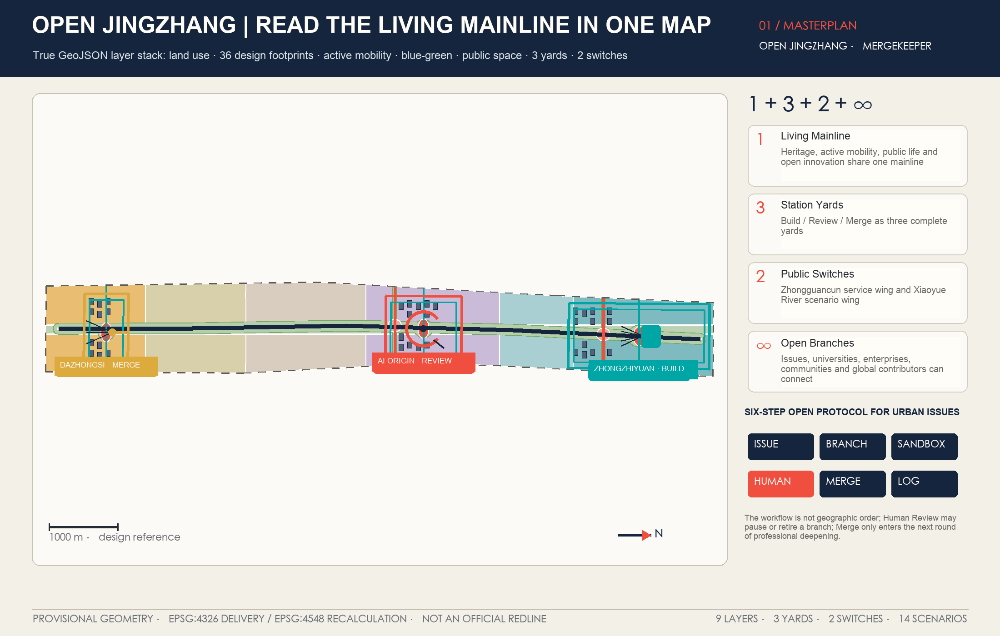
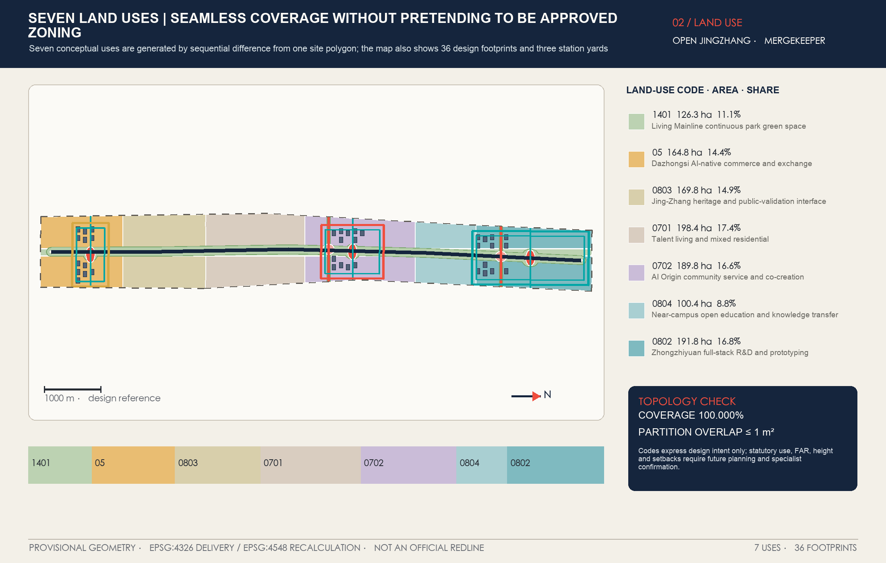
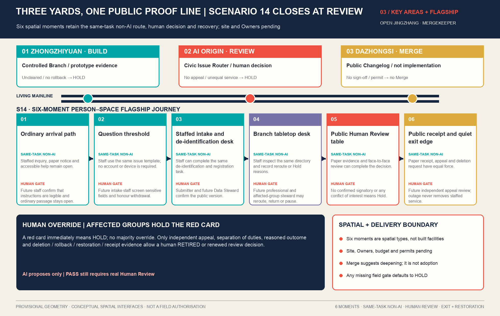
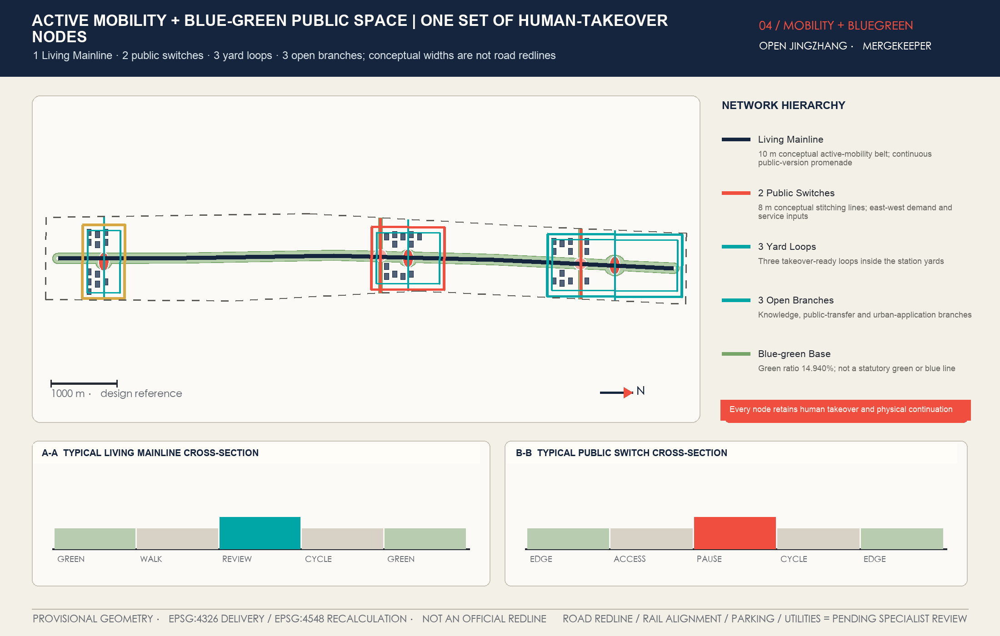
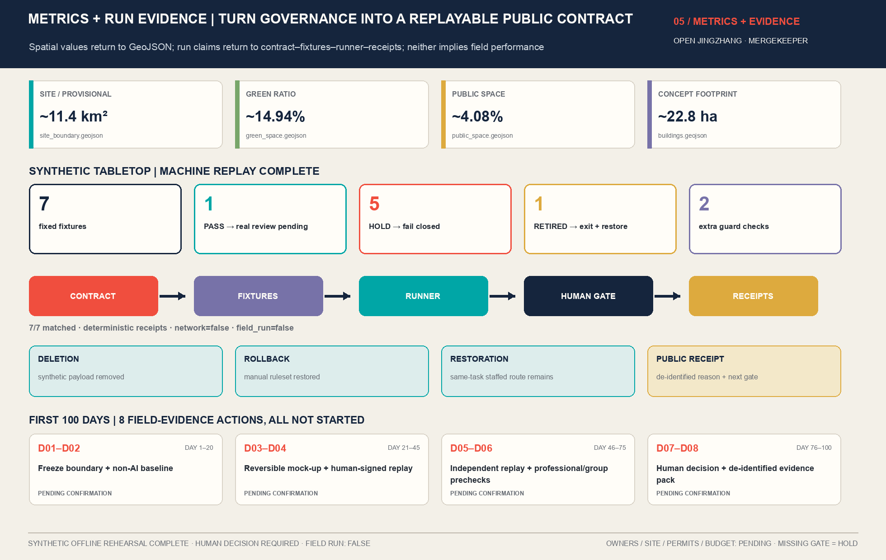

# Open Jing-Zhang | OPEN JINGZHANG — The Living Mainline

**Urban Issues First Go to Jing-Zhang for Public Verification, AI Proves, Then Humans Decide Whether to Enter the City.**

## Design Basis and Source List

The primary judgment for this case is: this is not a "smart city" package that merely affixes technological icons to railway heritage, but rather a public proposal that combines Urban Design with open governance. The formal announcement defines three layers of work scope, three key areas, and tasks related to industry, renewal, transportation, blue-green infrastructure, appearance, and implementation. The task book for the intelligent entities requires the proposal to respond to Agent.1—Agent.6, AI scenarios, branding, and long-term operations. Accordingly, the planning objectives are divided into three evidence levels: the announcement text and national standards are considered as authoritative references; provisional geometric data are subject to Content Review, directional design, and recalibration; the land use, buildings, roads, green spaces, Public Spaces, and phased development generated by this submission are considered design suggestions. The three categories of evidence are not mixed in text, layers, indicators, and drawings. [source:DATA-SRC-OFFICIAL-ANNOUNCEMENT-20260509] [source:DATA-SRC-AGENT-TASKBOOK-20260518]

Professional criteria are based on five mandatory standards: the project announcement defines the task boundary, [standard:PROJECT-OFFICIAL-ANNOUNCEMENT]; the agent task book controls the six tasks of the open call, [standard:PROJECT-AGENT-OPEN-CALL-TASKBOOK]; the Urban Design management measures control Public Space, urban character, building mass, and facade expression, [standard:MOHURD-URBAN-DESIGN-MEASURES]; the control detailed planning compilation and approval method helps distinguish between Conceptual Recommendations and statutory controls, [standard:MOHURD-CONTROL-DETAILED-PLANNING]; the land use and sea area classification guide unifies the semantic meaning of `land_use_code`, [standard:MNR-LAND-USE-CLASSIFICATION-GUIDE]. (Regulatory Detailed Planning) The depth standards for architectural design are insufficient due to inadequate public attachments and are merely data gaps awaiting professional verification. They do not support specific engineering conclusions.[standard:MOHURD-ARCH-DESIGN-DEPTH-2016] These references are from the Ministry of Housing and Urban-Rural Development, the Ministry of Natural Resources, and the project's publicly available documentation.[source:DATA-SRC-MOHURD-URBAN-DESIGN-MEASURES] [source:DATA-SRC-MOHURD-CONTROL-DETAILED-PLANNING] [source:DATA-SRC-MNR-LAND-USE-CLASSIFICATION-202311]

The spatial baseplate adopts the provisional site provided by the warehouse and the focus areas. It is uniformly disclosed as: **This plan uses the provisional geometry provided by the warehouse to conduct Open Co-Creation, directional design, Content Review, visualization expression, geometric recalculation, and self-check; it must not be interpreted as the Official Planning Boundary, legal control boundary, approval basis, or precise area conclusion. The absence of official precise geometry does not constitute a blocker for this review; after the data is supplemented, it must be recalculated and rechecked.** This limitation is simultaneously included in the sources, assumptions, self_check, GeoJSON, and visual. [source:DATA-SRC-PROVISIONAL-BOUNDARIES-20260605] [data:geometry/site_boundary.geojson#SITE-001] [data:geometry/key_areas.geojson#PROV-KEY-001]

Current known information includes the announcement text range and area approximations, names and tasks of three key areas, professional standards, temporary geometry, and data classification categories; missing information includes official three-layer polygons, current buildings and ownership, approved control plans, road right-of-way, rail and utility conditions, cultural heritage protection areas, blue lines for waterways, fire safety, and public service baselines. This case uses a "known—temporary—missing" diagnosis instead of speculative current conditions; `constraints.geojson` is intentionally kept as an empty set because no reliable data exists to draw false boundaries. [depth:existing_conditions_diagnosis] [depth:risk_missing_data] [data:geometry/constraints.geojson#intentionally-empty] [metric:site_area_sqm] [metric:key_area_count]

All conclusions are presented using the same reading method: a design judgment is given first, followed by public and industrial reasoning, then detailed in traceable layers, metrics, drawings, and sources, and finally referencing any unobtained control conditions. Thus, "open source" refers to open problems, agreements, metrics, reviews, and contribution records, not to open personal data, business secrets, or approval rights; "Merge" indicates a recommendation for further professional refinement and review, but does not imply government adoption, procurement, construction, or implementation.

## Three-Level Scope Framework

This case judgment determines that the three layers of scope are not three separate maps, but an Evidence Chain from regional strategy to urban structure to verifiable scenarios. The coordinated research scope is responsible for the AI Innovation Ecosystem, regional collaboration, and future urban rules; the overall design scope implements these rules into land use, updates, transportation, utilities, blue-green spaces, and Public Spaces; the three key areas then take on Build, Review, and Merge responsibilities. The unified spatial syntax is "1 Living Mainline + 3 Station Yards + 2 Switches + Infinite Branches": one Jing-Zhang Public Innovation Mainline, three functionally differentiated station yards, two public crossovers at the east-west seams, and open branches extending to universities, communities, parks, enterprises, rail stations, and global contributors. [depth:three_level_scope_framework] [depth:overall_spatial_structure] (Coordinated Research Area) (Overall Design Area)

"1" is the Living Mainline formed by the Jing-Zhang Ruins Park and its adjacent Public Spaces. It simultaneously carries the culture of a century-old engineering project, continuous active transportation, open topics, scenario displays, and annual events, but is not delineated as a new legal boundary. "3" are the three Station Yards: Zhongzhiyuan Build is responsible for full-stack R&D and prototype assembly; Beijing AI Origin Community is responsible for open-source review, public transformation, and talent living; Dazhongsi is responsible for industrial exchange, urban applications, and international cooperation. "2" are two types of functional inputs: the Knowledge Supply Wing connects universities, research, talent, capital, and professional services, while the Urban Application Wing connects communities, businesses, public services, and real-world issues; they are functional synergies, not indicating new official zoning. "∞" refers to mechanism scalability, not the drawing of infinite roads out of thin air. [source:DATA-SRC-OFFICIAL-ANNOUNCEMENT-20260509] [source:DATA-SRC-AGENT-TASKBOOK-20260518]

Three-tier transmission adopts the same operational protocol: `Issue → Branch → Sandbox → Human Review → Merge → Changelog`. Issue is a publicly documented problem, not a project initiation; Branch is a parallel proposed comparable alternative, not a planning conclusion; Sandbox is a simulation, synthetic data, or time-limited trial with separate consent, not an approved operation; Human Review is completed by residents, professionals, and operators together, with AI not making the final decision; Merge only indicates entry into the next round of professional refinement; Changelog records adoption, modifications, rejections, sources, and responsibilities but does not disclose privacy. Spatial evidence can be verified from the mainline, switch, and three-zone loop. [data:geometry/roads.geojson#ROAD-MAINLINE-001] [data:geometry/green_space.geojson#GREEN-001] [data:geometry/public_space.geojson#PUBLIC-MAINLINE-001]

The public-facing area of the provisional site is approximately **11.4 square kilometres**; the exact recalculated value is retained only in machine-readable evidence such as `metrics.json` and the GeoJSON files. It is derived from the provisional polygon projected into EPSG:4548 and proves package consistency, not an official precise-area conclusion. [metric:site_area_sqm] The number of key areas is three; their shapes retain the repository's provisional geometry and do not overlap. [metric:key_area_count] [data:geometry/key_areas.geojson#PROV-KEY-002] [data:geometry/key_areas.geojson#PROV-KEY-003] Once official polygons arrive, the same workflow must recalculate the site, key areas, land use, buildings, roads, green space, public space, phasing, metrics, five PNGs, both PDFs, and both HTML displays; replacing only one boundary map is insufficient.

## Coordinated Research Area: Industry and Future City Research

This case judgment holds that the Jing-Zhang's world-class competitiveness should not be measured by the arbitrary numbers of "how many enterprises, how much computing power" introduced, but should be established through a city innovation system: public problems can enter, global contributors can simultaneously propose solutions, which form evidence in a controlled environment, then are reviewed by humans, and only then are eligible for professional deepening. This system translates the engineering collaboration spirit of the railways, the continuous innovation culture of Zhongguancun, and the AI version iteration method into urban space. It cannot be replicated in any industrial park because only Jing-Zhang simultaneously possesses a century-old railway engineering narrative, a continuous public backbone, and three functionally distinct focus areas, allowing "mainline—station—switch—branch line" to be both spatial structure and operational structure. [source:DATA-SRC-AGENT-TASKBOOK-20260518]

OPEN JINGZHANG's brand retains only five elements: the overall brand "Open Jing-Zhang"; the spatial framework "1+3+2+∞"; the operational agreement six-step closed loop; the ethical bottom line Human Override; and the time narrative 1909—2026—2126. The logo consists of two parallel tracks and a 45-degree switch forming an open "J", with the central negative space simultaneously forming a door opening and a standing figure. The tracks are deep blue `#15253D` representing the public base, the signal crimson `#F04E3E` only indicating Issues, risks, and pending reviews, and the open-source green `#00A6A6` only indicating validated connections. The graphic does not use the silhouette of a train, government emblems, corporate logos, or unauthorized historical photographs.

International case studies only demonstrate that certain mechanisms have been publicly practiced by relevant institutions, without proving that their performance, legality, or resources can be directly transferred. Eight primary source references are provided below:

| Mechanism Reference | Local Transliteration of Verifiable Facts | Explicitly Not to Be Replicated |
| --- | --- | --- |
| Singapore Punggol Digital District | Translate the sequence of first simulating with digital twins and then entering limited physical testing into a Sandbox entry level. [source:CASE-SRC-SG-JTC-PDD] | Do not extrapolate from Singapore's land system, sensor scale, data permissions, and energy performance. |
| EU CitCom.ai TEF | Translate cross-node real-condition testing into three-zone shared test cards, admission criteria, and evaluation templates. [source:CASE-SRC-EU-CITCOM-AI-TEF] | Do not claim ownership of EU AI Act regulatory sandbox, certification, or conformity assessment status. |
| Helsinki Mobility Lab | Translate resident participation, data catalog, trial end report, and continuation/termination decisions into an open debrief. [source:CASE-SRC-FI-HEL-MOBILITY-LAB] | Do not extrapolate from the Finnish open data conditions; and note that the original project period has ended. |
| Barcelona Innova Lab | Translate urban issues, open call, time-limited experiments, experimental agreements, and knowledge transfer into a six-step protocol. [source:CASE-SRC-ES-BCN-INNOVA-LAB] | Do not replicate Spanish regulations, procurement, public assets, or experimental permits. |
| Mila / Mile-Ex | Translate the co-located presence of research, technology transfer, entrepreneurship, partnerships, and responsible AI into the Zero Station space program. [source:CASE-SRC-CA-MILA-MILE-EX] | Do not replicate the institution's scale, funding, and governance; open science does not mean all data and IP are open. |
| MassRobotics | Translate the shared prototyping tools, resident cohort, testing, and graduation mechanisms into a Collaborative Intelligence Assembly. [source:CASE-SRC-US-MASSROBOTICS] | Do not extrapolate from the private operation in the United States, equipment list, or public street deployment permit. |
| Tsukuba Super Science City | Translate "Leave No One Behind" and resident perspectives into a benefit and exclusion check for each issue. [source:CASE-SRC-JP-TSUKUBA-SUPER-CITY] | Do not replicate Japanese special zone laws, data interoperability, autonomous vehicle permits, or drone permits. |
| Amsterdam Algorithm Lifecycle / Register | Translate the algorithm's purpose, data, responsibility, human review, appeals, audits, and versioning into a Model Passport. [source:CASE-SRC-NL-AMS-ALGORITHM-LIFECYCLE] | Registration does not imply certification, bias-free, or security guarantees. Dutch appeal and procurement laws do not transfer. |

The industrial ecology is composed of five types of interfaces: universities and research institutions propose methods and benchmarks, Zhongzhiyuan provides shared prototypes and safety verification, the Origin Community offers public explanations, technology transfer, and talent living, Dazhongsi provides industrial applications, business, and international exchanges, Living Mainline publicly connects resident issues with experimental results. It responds to three key positions, five major functions, and the "Three Zones and Two Wings," but does not list unauthorized company entries, investments, or production value commitments. All industrial resources are expressed through "interfaces, service types, and entry conditions"; no formal partnership lists are included without a formal cooperation document.

Regional coordination is now registered through four fields: issue, potential resource interface, Jingzhang spatial interface, and non-commitment boundary. The seven entries cover Beiwei Community, Future Science City, Huairou Science City, Beijing E-Town, the Beijing–Tianjin–Hebei region, the Zhongguancun technology-services wing, and the Xiaoyue River scenario-enablement wing. Each entry is a proposed functional connection only: it does not claim a signed partnership, committed resources, an implementation owner, data access, or site permission. The complete matrix and review status are recorded in `report/narrative.md` and `visual/assets/maintenance-followup.json`.

Future urban forms are therefore not ubiquitous screens but three categories of perceivable changes: within buildings, there are shared experimental spaces that can be booked, open-source evaluations, and spaces for industrial exchanges; on streets, there are priority lanes for slow travel, public crosswalks, accessible navigation, and equivalent channels for manual services; in governance, there are scene passports, pause thresholds, exclusion lists, and failure files. The overall structure applies to the site, building, and Public Space layers, rather than independent industrial slogans.[data:geometry/land_use.geojson#LU-001] [data:geometry/buildings.geojson#BLDG-101] [data:geometry/public_space.geojson#PUBLIC-LANDMARK-001]

## Overall Design Area: Urban Renewal and Regulatory-Plan-Level Urban Design

This case determines that the overall update should adopt a "branchable and reversible" progressive structure, rather than a full demolition and reconstruction judgment when there is a lack of existing buildings, ownership, and control plans. Living Mainline is the stable public base, while the three Station Yards are the key intervention areas. The two Switches stitch together the eastern and western city resources. Branches allow schools, communities, parks, and stations to be integrated based on the maturity of the evidence. Land use, buildings, roads, green spaces, Public Spaces, and phasing all originate from the same provisional site; land use is covered by sequential set differences to avoid gaps and overlaps caused by separate hand-drawing. [depth:land_use_layout] [data:geometry/land_use.geojson#LU-002]

Seven conceptual land uses are defined as follows: Living Mainline continuous park green spaces, southern AI-Native commercial and exchange, Jing-Zhang cultural and public validation, talent living and mixed residential, origin community service and co-creation, near-school open-source education and conversion of results, and northern full-stack R&D and prototypes. These codes use only the terms from the national classification guide to express the design functional structure, and do not represent statutory land use changes or approved zoning plans. [source:DATA-SRC-MNR-LAND-USE-CLASSIFICATION-202311] [data:geometry/land_use.geojson#LU-003] [data:geometry/land_use.geojson#LU-004] [data:geometry/land_use.geojson#LU-005] [data:geometry/land_use.geojson#LU-006] [data:geometry/land_use.geojson#LU-007]

The building layer includes 36 conceptual update bases, forming recognizable grains around the Build, Review, and Merge stations. They are not current as-built drawings, nor are they specific demolition or construction objects, but rather serve as design carriers for expressing laboratory, incubation, educational, community service, talent living, mixed commercial, and other space types. The bases total 228,096.0 square meters, calculated from the layer's EPSG:4548. [metric:building_footprint_area_sqm] [data:geometry/buildings.geojson#BLDG-201] Since there are no floor levels, total gross floor area, and approved intensity, `floor_area_ratio` remains unknown; this case only proposes the known, suggested, and to-be-confirmed columns, without fabricating a "control plan" feel by inventing a Floor Area Ratio. [metric:floor_area_ratio] [depth:development_intensity_controls]

Urban Design controls are applied using typological principles rather than pseudo-precise numbers: Research clusters should form accessible ground-level shared interfaces and central open test courtyards; Review clusters prioritize small-scale, reversible Public Space micro-updates, avoiding the default conversion of residential areas into test sites; Merge clusters mix display, business, application, and public services, and retain daily use rather than serving only for launch events. Building Height, roof, massing, setbacks, skyline, and interfaces are listed as professional deepening conditions. [depth:height_massing_character] [source:DATA-SRC-MOHURD-URBAN-DESIGN-MEASURES]

Update the structure in three dependent phases: Phase one focuses on the three zones station field and main public validation pilot; Phase two addresses two switch areas and the integration of the open spur; Phase three only enters continuous urban area updates and long-term maintenance. The phase order does not equal a commitment to commencement, and any space requires corresponding official boundaries, ownership, traffic, municipal, safety, and operational conditions. [data:geometry/phasing.geojson#PHASE-001] [data:geometry/phasing.geojson#PHASE-002] [data:geometry/phasing.geojson#PHASE-003] (Official Boundary)

## Detailed Design of Key Areas

This case determines that the three key areas must each become a complete small plan, rather than being named the same "AI Demonstration Zone" template. Zhongzhiyuan is responsible for Build, AI Origin community is responsible for Review, and Dazhongsi is responsible for Merge; all three include location, structure, updates, architecture, active transportation, Public Space, AI scenarios, and risks, and are connected by Living Mainline and the same six-step protocol. The three areas are provisional, with a key area count of 3; any landmark coordinates, area, or project list only serve the directional design at this precision. [metric:key_area_count] [depth:three_key_area_detailed_design]

**Zhongzhiyuan｜Build｜Zhongzhiyuan Stack Yard.** The positioning is AI full-stack R&D, prototype assembly, and safety validation; the structure is an open experimental cluster around a "stack track" Public Space, where the track sends model, agent, robot, and energy consumption scenarios to the next station for public review. The update method primarily focuses on adaptive reuse or small-scale additions, with the architectural layers expressing laboratory, R&D, and incubation types, but without making a judgment on the retention or demolition of existing buildings. Slow travel is facilitated by the R&D street walking loop and the knowledge supply side branch, with public spaces including a prototype display street, a closed test courtyard, and a model passport interface that can be visited. The industrial scenario includes multi-agent stacking, embodied robot mixed traffic, model safety red teams, and computational—energy scheduling. The greatest risk is the risk of closed parkification and "testing prioritized over public value"; therefore, any results must enter the Review, and those that do not meet the safety, privacy, and human intervention conditions must not be externalized. [data:geometry/key_areas.geojson#PROV-KEY-001] [data:geometry/public_space.geojson#PUBLIC-LANDMARK-001]

**Beijing AI Origin Community | Review | Open Origin Station.** The positioning is a city public validation center where universities, communities, professional teams, and entrepreneurs collectively complete their work; the structure is a composite of an open station hall, an AI citizen living room, a discussion square, a conversion and result space, and services for talent living. The term "station" is a design syntax, not representing new railway facilities. Updates prioritize repairing continuous living streets, improving connections between campuses, parks, and communities through slow travel, and reversible public interfaces; the architectural approach emphasizes shared ground floors, low disturbance during nighttime, barrier-free access, and equivalent channels for human services. Scenarios include community affairs explanation, elderly collaboration, barrier-free navigation, open AI literacy classes, and urban issue routing. A human review must be completed by users, professionals, operators, and public gatekeepers; residents who do not participate will not reduce the original service quality. The greatest risk is defaulting community life as an experiment, so high-risk groups should not be the first test subjects; all trials must be actively chosen and can be exited at any time. [data:geometry/key_areas.geojson#PROV-KEY-002] [data:geometry/public_space.geojson#PUBLIC-LANDMARK-002]

**Dazhongsi｜Merge｜Dazhongsi Agent Exchange.** The positioning is as an AI-Native industrial exchange, urban application, and international cooperation portal; the structure is a showcase, collaboration, application, and commercial mixed-use district embodying the geometry of a "switch junction." It connects the rail transit hub, developer exchange street, and international release plaza. Updates focus on activating underutilized spaces, public ground-level access, and a quadruple walkability continuity, with building types including mixed-use, commercial, and office spaces. Scenarios include AI-Native business trial operations, a global developer interoperability week, enterprise services, and evidence-based cultural tours. Merge does not signify launch but rather the submission of evidence through public and professional reviews to the next round of master planning, engineering, procurement, and permitting studies. The greatest risk is substituting commercial displays for public value or writing "test passed" as government certification; therefore, it is essential to simultaneously make public records of failures, rejections, and withdrawals. [data:geometry/key_areas.geojson#PROV-KEY-003] [data:geometry/public_space.geojson#PUBLIC-LANDMARK-003]

The common deepening list for the three zones includes official polygons, current buildings, property rights, transportation, utilities, fire safety, cultural relics protection, and operational entities. The differentiated list adds details specific to Zhongzhiyuan, including water systems and park conditions, the original community's school interface and living services, and Dazhongsi station and underground works. The current areas that can be deepened include spatial types, public agreements, pedestrian connections, and scene passports; the areas that must be confirmed include legal controls and engineering conditions; and the specific demolition and construction, investment, occupancy, approval, and implementation times cannot be claimed.

## AI Innovation Ecosystem, Personas, and AI+ Scenarios

This case judgment determines that AI scenarios are not a functional checklist but a set of city Branches that can be audited and exited. Each scenario card must register an Issue, responsible party suggestion, spatial carrier, data list, risk level, Human Override, success and pause thresholds, exit responsible party, and Changelog; it must not be merged without a Human Review. The unified state sequence is `concept → simulation → limited_sandbox → human_review → professional_deepening / retired`, without the presence of `deployed` or `approved`. This ensures that Agent.3's innovation does not depend on "the more automation, the more advanced," but rather on the city's ability to see boundaries, errors, and responsibility. [source:DATA-SRC-AGENT-TASKBOOK-20260518]

Eight user persona scenarios forming a spatial and operational mapping: AI startup teams submit Issues, maintain Branches, and undergo replication validation in Zhongzhiyuan; researchers and students provide methods, benchmarks, and evidence and serve as reviewers; residents and families raise issues, pilot solutions, file appeals, and decide whether to scale up; elderly and accessibility users have a "red card hold" right, meaning that in the event of any service differences, inability to exit, accessibility interruptions, or punishment due to refusal of authorization, they can demand that the scene immediately enter a Hold state, which will then be reviewed by personnel who did not participate in the initial review, and cannot be forced to continue by a majority vote; merchants and industry procurement parties provide genuine needs and small-scale feedback in Dazhongsi; urban operation and public service personnel are responsible for Human Review, emergency takeover, and exit; international developers participate in interoperability testing and multilingual dissemination; cultural researchers and community storytellers maintain historical records and narrative versions. No persona is used for unsolicited commercial recommendations.

Agent.1—Agent.6 are not six autonomous decision-makers, but six auditable work passports; they sequentially compile space, ecology, scenario, Public Space, narrative rights, and long-term operations: no single seat can approve, enforce, purchase, or go live on their own.

| Agent | Role, Input, and Tools | Output | Conflict Resolution and Human Gate | Evaluation Evidence |
| --- | --- | --- | --- | --- |
| Agent.1 Belt Steward | Input announcements, three-dimensional scope, provisional geometry, and standards; use GIS, topology, and evidence indexing | Three-dimensional transmission, overall backbone, layers, and source chain | Downgrade evidence hierarchy when official and provisional conflicts arise, submit for review by planning professionals | Geometric validity, land coverage, source completeness, zero false official control. |
| Agent.2 Ecosystem Composer | Input public sector data, user needs, international case studies, and spatial supply; use retrieval, categorization, and case validation | Industry-Space Procedures, Talent Profile, Collaboration Interfaces | Prioritize public pathways over industry promotion when there is a conflict with public value; do not fabricate partners, funding, or policies | 8-Cell Mechanism Case Studies, Profiles—Spatial Mapping, Partner Statements Traceable. |
| Agent.3 Scenario Branch Runner | Input Issue, Model Passport, permit data, and risk register; use simulation, synthetic data, evaluation harness, and tool sandbox | Pass / Hold / Reject recommendations, failure logs, reproducible packages | Hold if any data, security, or fairness objections are raised; final status determined by the human review unit | 14 scenarios, 6 industry validations, takeovers, complaints, rollbacks, and equivalent service records. |
| Agent.4 Public Space Steward | Input roads, green spaces, public spaces, accessibility review, and user feedback; use path checks and reversible pilot design | Three landmarks, pedestrian-friendly, public space, and exit strategy | Brand events must not overshadow daily passage; affected community representatives can trigger a red card suspension | Continuous accessibility, three key areas evidenced, artificial equivalent entrances, exit conditions. |
| Agent.5 Narrative & Rights Curator | Input historical records, 14 sources, brand, and copyright registry; use provenance, copyright, and multilingual QA | 1909—2026—2126 narrative, signage, licensing, and correction records | Ensure the dissemination of memory points does not cross the factual and rights boundaries; remove if the source cannot be resolved | Closed citation loop, external visual assets zero, error correction, and versioning records. |
| Agent.6 Operations Maintainer | Input branches, personnel, resources, SLA, incidents, and appeals that have passed human review; use issue tracker, rosters, cost envelopes, and changelogs | Operations recommendations, responsibility rosters, appeal incident files, and decommissioning recommendations | Do not merge when there is no Owner, on-call, decommissioned resources, or independent appeal contacts | SLA, unresolved appeals, resource coverage, incident handover, and timely decommissioning. |

Collaborative order is as follows:`Agent.1 定范围 → Agent.2 组生态 → Agent.3 做 Sandbox → Agent.4 审空间与受影响群体 → Agent.5 审事实版权 → Agent.6 审运营退役 → Human Review Cell`. Conflicts within the model cells are not resolved through voting; instead, objections to proposals involving data, security, fairness, and statutory conditions are held in abeyance by entering them into Hold; other disagreements are retained by different Branches with evidence, to be selected, merged, or returned by human signatories. Here, the "Human Review Cell" is a combination of responsibility roles for the proposal, not an existing government agency or authorized entity.

The following are fourteen frozen scene cards, among which six belong to industrial test validation:

| Scenario | User and Space Interaction | AI Mechanisms and Human Review | Data Boundaries and Failure Exit |
| --- | --- | --- | --- |
| 01 Multi-Agent Collaborative Grouping [Industrial Validation] | Startup Teams, Research Personnel; Wisdom Pooling Field | Multi-Agent Task Allocation, Conflict Detection, and Task Playback; Technical Committee Gradual Approval | Only Desensitized Logs and Synthetic Data Used; No Production Keys; Disconnect Tools and Roll Back on Timeout, Unauthorized Access, or Unreproducible Results. |
| 02 Bodily Robots Mixed-Use Sandbox [Industrial Validation] | Robot companies, property management, pedestrians; Zhongzhiyuan enclosed courtyard and designated paths | Perception, obstacle avoidance, and scheduling simulation; on-site takeover by safety officers, phased acceptance | No facial recognition, irrelevant images not stored; operations cease upon triggering safety distance, misrecognition, or complaint threshold, and return to the closed venue. |
| 03 Model Safety Red Team Field [Industrial Validation] | Model Prototype, Security Researchers; Zhongzhiyuan Security Lab | Test Prompt Attacks, Tool Privilege Escalation, Hallucinations, and Bias; Independent Red Team Signs Risk Waivers | Only Test Authorized Models and Isolated Data; High-Risk Issues Marked Rejected Until Closed. |
| 04 AI-Native Commercial Trial Operations [Industrial Validation] | Vendors, Consumers; Dazhongsi Application Street | Demand Forecasting, Sales Guidance, and Inventory Coordination; Vendors Confirm Key Decisions, Consumers Can Switch to Manual | Transaction Data Minimized, Prohibition of Default Cross-Store Profiling; Removed from Platform if Misleading, Discriminatory Pricing, or Complaints Exceed Threshold. |
| 05 Computing Power—Energy Consumption Synergy [Industrial Validation] | Computing Power and Building Operators; Zhongzhiyuan R&D Incubator | Load Forecasting and Off-peak Scheduling for Non-critical Tasks; Approval Boundary for Facility Engineers | Read-only Equipment and Energy Consumption Data; Revert to Original Strategy if Comfort or Stability Fails. |
| 06 Global Developer Interoperability Week [Industrial Validation] | International teams, platforms, and standard institutions; Wizards Exchange Station | Agent interoperability across models, tools, and languages; joint review and on-site takeover | Sandbox interfaces, test keys, and synthetic data are only open; isolate versions for unauthorized access or unrepeatable results. |
| 07 Community Affairs Explainable Assistant | Residents, Community Members; AI Citizen Living Room | Public Material Search, Process Explanation, and Multilingual Q&A; Window Staff Confirm High-Impact Responses | Only Using Public Materials and Active Inputs; Errors or Appeals Downgrade to Search Directory. |
| 08 Age-Friendly Living Coordinator | Elderly Individuals, Caregivers; Original Point Community Service Station | Reminders, Route Assistance, and Proactive Inquiry; Confirmation by the Individual or Authorized Caregiver | Health and Family Data End-User Priority, Separate Authorization, and Immediate Deletion Upon Request; Exit Smart Mode on Misreporting or Denial of Authorization. |
| 09 Barrier-Free Continuous Navigation | Visually Impaired, Hearing Impaired, and Mobility Impaired Individuals; Three-Zone Pedestrian Network | Multimodal Path Recognition and Obstacle Alerts; On-Site Review by Barrier-Free Experience Officers | Does Not Save Identity or Complete Trajectory; Route Conflicts or Facility Updates Will Prompt Recall and Warning. |
| 10 Open AI Literacy Classrooms | Students, Teachers, and Families; Origin Open Classroom | Model Comparisons, Source Tracking, and Prompt Experiments; Teacher Review of Course Outputs | Minors' data is not used for training, no face or voiceprint collection; inappropriate content results in immediate course review. |
| 11 Jing-Zhang Cultural Evidence Tour | Residents, tourists, and researchers; Site Mainline | Layered narrative based on Qing Right archives; Edit historical records line by line for review | Only use traceable public sources; Display unknown if source is missing and remove the narrative card. |
| 12 Park Ecological Maintenance Assistant | Landscape Staff, Public; Blue-Green Corridors | Plant Identification, Irrigation Prediction, and Disease Forecasting; Professional Staff Determine Disposition | Environmental Data Publicly Shared in Tiered Access, No Collection of Nearby Resident Information; Immediate Discontinuation of Recommendation on Continuous Misjudgment or Side Effects. |
| 13 Night Safety Co-Governance Lighting Band | Pedestrians, Security, Merchants; Main Avenues and Junction Squares | Crowd Congestion Warning and Lighting Adjustment; Verification by On-Duty Personnel, No Automatic Enforcement | Only Low-Resolution Counting and Environmental Data; Revert to Fixed Lighting if False Alarms, Glare, or Light Pollution Occur. |
| 14 Urban Issue Routing Table | Residents, Businesses, Academic Teams; Open Source Zero Station | Cluster issues and match them with Branches, sites, and mentors; the Issue Committee confirms priorities | Publicly displayed issues are de-identified by default, with only approved contact and responsibility records retained internally; if there are no legal conditions or responsible parties, they are placed in Hold. Formal submissions still retain GitHub attribution as per the rules. |

To prevent names, responsibilities, and passing conditions from drifting, the following table freezes the English short name, proposed human Owner, and minimum success gate for the same fourteen IDs. Every Owner is a proposed role with status `pending_confirmation`; no real party is claimed to have accepted responsibility. A success gate is evidence required before the next review, not an achieved result. When any field condition or professional threshold is unconfirmed, the scenario remains concept/Hold; AI does not invent the missing number.

| ID / English Short Name | Proposed Human Owner (Pending Confirmation) | Minimum Success Evidence (Not Achieved Performance) | Red Card / Suspension / Exit |
| --- | --- | --- | --- |
| 01 Agent Consist Yard | Technical Owner + Independent Reconstructor | Freeze test set can be continuously reproduced, all tool calls and conflict resolutions are logged | Isolate versions for unauthorized access, non-reproducible, or non-rollable cases. |
| 02 Embodied Mobility Sandbox | On-Site Safety Officer + Domain Professional | Each emergency shutdown drill passes with zero red line intrusions within the designated path | Shutdown triggered by safety distance activation, misidentification, or complaint threshold reached. |
| 03 Model Red-Team Bay | Independent Red Team Lead | Each high-risk finding has a reproducibility package, owner, and closure evidence | High-risk items not closed or tested beyond authorized models are Rejected. |
| 04 AI-native Retail Trial | Merchant Owner + Consumer Rights Verifier | All high-impact recommendations and price decisions are confirmed by humans, and human channels can equivalently complete the process | Misleading, discriminatory pricing; will be removed if it cannot be switched to human or if complaints exceed threshold. |
| 05 Compute–Energy Co-pilot | Facility Engineer + Operations Owner | All records of read-only suggestions, manual approval, and original strategy rollback drills are maintained. | The original strategy is restored if comfort, equipment stability, or rollback tests fail. |
| 06 Global Agent Interop Week | Joint Test Convener + Technical Owner | Freeze the anomalies, versions, and traceable chains of reproducibility in the interoperability test set | Isolate if there are unauthorized access, key leakage, or if critical results cannot be reproduced. |
| 07 Explainable Civic Assistant | Window Service Owner + Independent Appeal | Ensure that references, manual verification, and appeal resolution records are complete | High-impact responses that lack sources, cannot be manually verified, or have ongoing erroneous appeals should be downgraded. |
| 08 Age-friendly Life Co-pilot | Principal/Authorized Caregiver + Service Professional | Smart Mode Immediately Stops Upon Revocation of Consent, with Manual Service Always Available | Exit Service if Not Separately Agreed to, Misreported, or Unauthorized, Leading to Service Disruption. |
| 09 Accessible Route Companion | Accessibility Experience Officer + Transportation Professional | All published routes have been field-verified, with unknown facilities clearly marked as unknown | The route will be withdrawn if there are line conflicts, facility expiration, or if no alternative path can be provided. |
| 10 Open AI Literacy Studio | Teacher Owner + Minor Rights Reverter | All practice outputs display sources and model limitations; minor data does not enter training | If inappropriate content, covert data collection, or the teacher cannot take over, the class is paused for a review. |
| 11 Evidence-Based Rail Heritage Guide | Historical Evidence Editor + Rights Curator | Each narrative card includes both the source of evidence and the rights status | If the source or rights cannot be resolved, the card is removed, and no AI is used to fill in unknown historical details. |
| 12 Park Ecology Steward | Landscape Professional + Operations Owner | All maintenance recommendations must be approved by a person, with error rates continuously recorded on frozen samples | Recommendations are discontinued if there are consecutive errors, side effects, or if they do not match field conditions. |
| 13 Co-Governed Night Light | Supervisors + Representatives of Affected Residents | Each adjustment undergoes Human Review, and the fixed lighting retreats for regular drills can be completed | Fixed lighting will be restored if there are false alarms, glare, disturbance, or change in purpose. |
| 14 Civic Issue Router | Scenario Owner + Affected-group Steward | All civic issues should be de-identified, with each Branch having an Owner, gatekeeper, or clear hold rationale | Hold if there are no legal conditions, responsible party, or appeal path. |

The six scenario IDs in the front matter are the scenario families that the warehouse display portal allows to be registered; this section's 14 numbered scenarios constitute the unique design scenario list for this proposal, with scenarios 01-06 forming a subset for industrial testing. A3 pages 9-10 fully display the same 14 items, while A0 page 6 only summarizes 6/14 industrial validation cases and clearly directs to the complete list, not constituting a second set of scenarios. All fourteen scenarios are mapped to the focus area, active travel, blue-green, or Public Space layers, rather than floating icons. [data:geometry/roads.geojson#ROAD-BRANCH-001] [data:geometry/green_space.geojson#GREEN-001] [data:geometry/public_space.geojson#PUBLIC-SWITCH-001] Active selection, informed consent, the right to withdraw at any time, and non-AI equivalent services are fundamental rights; minors, the elderly, patients, and people with disabilities are not considered the initial high-risk test groups. Each scenario must have a risk level, independent reviewer, manual take-over, complaint appeal, immediate suspension threshold, and exit responsibility. [depth:risk_missing_data]

The maintenance package now treats Scenario 14, the Civic Issue Router, as the single flagship evidence journey; Scenarios 10 and 11 remain reusable low-risk protocols. The router freezes how a person completes the same task through six spatial moments: ordinary arrival path, question threshold, staffed intake and de-identification desk, Branch tabletop desk, public Human Review table, and public receipt with a quiet exit edge. Every step retains a non-AI equivalent, a human gate, and a recovery path. If AI is unavailable—or a person refuses or withdraws—the staffed or paper channel still completes the same task without a lower service level.

Its maximum state remains `simulation`. A zero-dependency runner has replayed seven fixed synthetic fixtures offline: `1 PASS / 5 HOLD / 1 RETIRED`; 7/7 matched their expectations and produced deterministic de-identified receipts. Two additional fail-closed guards cover an undeclared input field and a fixture falsely marked as a field run. **This proves only that the rules, failure injections, deletion/rollback/restoration evidence and receipts are repeatable. It is not a field run, involves no real participants, and produces no real-world performance or implementation authorisation.** The first 100 days remain eight proposed evidence actions that have not started: freeze the template and data boundary; define the non-AI baseline; make a reversible low-fidelity mock-up; have pending human roles replay and sign the synthetic cases; commission an independent replay; complete professional and affected-group prechecks; make a human Go/Modify/Hold decision; and publish a de-identified evidence packet. Every Owner, site, budget, insurance, procurement, data-processing, duty-roster, heritage, fire, and accessibility dependency is `pending_confirmation`; any missing confirmation defaults to Hold and no field entry. Contract, fixtures, runner and receipts are in `visual/assets/issue-router-tabletop/`; the 100-day gates are in `visual/assets/first-100-days-evidence-plan.json`. [metric:flagship_journey_step_count] [metric:synthetic_tabletop_case_count] [metric:first_100_days_evidence_action_count]

## Land Use, Building Scale, and Retain-Renovate-Demolish Strategy

In the absence of current building and ownership maps, the most professional approach to the Demolish–Renovate–Retain Strategy is not to guess a red and yellow blueprint, but to establish a reuse-first evaluation process. The building first enters the "Data Pending Verification" phase, obtaining surveying, ownership, structural safety, fire safety, cultural heritage, and performance metrics. Only then are the buildings judged for retention and maintenance, renovation and enhancement, adaptive reuse, or submission to professional demolition and reconstruction analysis; the 36 base cases in this submission are merely spatial types and update envelopes, not corresponding to any specific building. [depth:retain_renovate_demolish] [data:geometry/buildings.geojson#BLDG-301]

The land structure emphasizes the complementary relationship between three types of stations and the everyday urban context. Build requires research facilities, laboratories, incubation spaces, and controlled test courtyards; Review requires educational spaces, community services, talent living quarters, and public review areas; Merge requires mixed commercial, office, exhibition, and transportation access spaces. The green spaces and cultural interfaces of Living Mainline run through these areas, ensuring that innovative spaces do not come at the expense of public continuity. All land polygons are generated by sequential set differences from the same site, and spatial review has confirmed complete coverage and minimal overlap; this demonstrates data consistency but does not prove that statutory uses have changed. [data:geometry/land_use.geojson#LU-001] [standard:MNR-LAND-USE-CLASSIFICATION-GUIDE]

The building massing follows the principles of "courtyard-style R&D, open ground floors, small-grain blocks, and public landmarks with low land occupation." The Zhongzhiyuan cluster is arranged around Stack Yard, with the central test space continuously visible; the Origin cluster forms Review Courtyards, shortening the distance between the university, community, and the interface of technology transfer; the Dazhongsi cluster maintains the 24-hour vitality of the commercial street, and the Wanzhi Exchange Station takes on a public role rather than a closed exhibition space. The height, number of floors, Development Intensity, road setbacks, and roof control are all kept under review, with no specific meters or Floor Area Ratios appearing without regulatory basis. [depth:height_massing_character] [metric:floor_area_ratio]

Building Footprint recalculated value of 228,096.0 square meters only describes the ground projection area of the conceptual design module; it cannot derive the total building scale, Building Coverage Ratio, or investment. After obtaining official architectural and land ownership data, each building layer must be replaced, the Demolish–Renovate–Retain Strategy must be redone, the footprint and intensity must be recalculated, and the review of sunlight, fire safety, structure, traffic, utilities, and cultural heritage must be rechecked. The current result's value is to incorporate the three-station mechanism into reviewable architectural granularity rather than fabricate implementation certainty. [metric:building_footprint_area_sqm] [source:DATA-SRC-MOHURD-CONTROL-DETAILED-PLANNING]

## Transport, Rail, Municipal Infrastructure, and Public Services

This case determines that transportation and facilities are not about "AI automatically scheduling everything," but rather to make Mainline, Switch, and Branch into everyday elements that are walkable, accessible, and takeable. The road layer only expresses the conceptual pedestrian and transit network: one north-south Living Mainline, two east-west public switchways, three pedestrian loops at the stations, and three open branch lines. All are clipped within the provisional site, but do not prove the feasibility of current roadways, rail alignments, bridges, tunnels, right-of-way widths, parking supply, or engineering capacity. [depth:traffic_rail_slow_parking] [data:geometry/roads.geojson#ROAD-SWITCH-001]

Pedestrian and cyclist strategies are organized as follows: "main arteries continuous—crosswalks to connect—circuits around stations to doors—barrier-free recheck." The main arteries will carry north-south pedestrian and cycling traffic and the public innovative tour lines; two crosswalks will prioritize addressing the conceptual breakpoints for east-west connections; three station loops will link research and development, community, commerce, and Public Spaces into readable paths; barrier-free navigation will only assist in identifying issues, not replace on-site reviews. Non-motorized vehicle parking, parking, and rail integration will follow the principles of shared, time-sharing, and proximity to stations, but the numbers and locations must be refined after traffic surveys, station conditions, and road right-of-way are obtained. [metric:public_space_ratio]

Municipal infrastructure and New Infrastructure should adopt "pluggable interfaces" instead of committing to a comprehensive platform. Zhongzhiyuan reserves an indoor computational and energy coordination and security testing interface; the Origin Community retains a human service, accessibility, and low-tech participation channel; and the interoperability scenarios at Dazhongsi only use sandbox interfaces and test keys. Distributed energy, edge-side computation, environmental sensing, lighting, and facility maintenance must be reviewed alongside traditional power supply, communication, drainage, fire protection, and maintenance systems. When municipal pipeline, energy capacity, flood prevention, and fire protection data are lacking, only express responsibilities, inputs, outputs, and failure fallbacks, without providing capacity conclusions. [depth:municipal_new_infrastructure] [data:geometry/constraints.geojson#intentionally-empty]

Public services adhere to the principle of equivalence: AI health navigation only explains service paths without automatic diagnosis; community assistants only retrieve public materials, with high-impact responses confirmed by window personnel; public safety systems only provide auxiliary judgment, without automatic enforcement; low-speed delivery robots are first validated in enclosed environments, then apply for limited-route, limited-time pilot testing in a small scope. Any service rejection or exit still provides an equivalent quality of human channels. These boundaries place technological innovation and public interest on the same transportation infrastructure map.

## Blue-Green Network, Public Space, and Urban Character

This case determines that Living Mainline is first and foremost a public life and memory infrastructure, and only secondarily an AI display interface. The designed green space consists of a main axis buffer, two turnout connections, and three station ecological nodes, with a recalculated green space ratio of 0.149399; Public Space is composed of a main axis pedestrian path and version exhibition corridor, three landmarks, and two turnout squares, with a recalculated ratio of 0.040773. [metric:green_ratio] [metric:public_space_ratio] These numbers reflect the current provisional design geometry and do not replace the green line, blue line, waterway, flood defense, or park-specific approvals. [depth:blue_green_public_space] EPSG:4548

Three landmarks are not showy sculptures but rather three public rituals. The CrowdWorks Assembly uses "assembly tracks" to display different scenarios transitioning from research and development to validation; it is an open courtyard most of the time, switching to a prototype release venue during events. The Open Source Zero Station uses an "open station hall" to form a central review hall and surrounding Sandbox, Review, and Changelog interfaces, where anyone can see why a scenario was accepted, rejected, or halted. The Magic Exchange Station uses a "switching turnout" to organize lines for industrial, community, and international cooperation, and includes failed cases in the "Unmerged Future Archive." All three follow principles of low footprint, reversibility, accessibility, and minimal nighttime disturbance. [data:geometry/public_space.geojson#PUBLIC-LANDMARK-001] [data:geometry/public_space.geojson#PUBLIC-LANDMARK-002] [data:geometry/public_space.geojson#PUBLIC-LANDMARK-003]

Urban Character will translate the railway culture, Zhongguancun innovation culture, and AI new culture into a single graphical syntax: parallel tracks represent the public foundation, crossovers represent choice rather than automatic decision-making, nodes represent human review, dashed lines represent unconfirmed elements, and Changelog represents time. 1909 is the spirit of autonomous railway engineering, 2026 is the starting point for the AI community to publicly submit city suggestions, 2126 is not a predictive scene but a century-long maintenance commitment of "leaving one question, one empirical tool, and a still-functional public interface for each generation." It does not imply the existence of false "switchback heritage sites" within the site, nor does it replicate historical images to create emotion. [source:DATA-SRC-OFFICIAL-ANNOUNCEMENT-20260509]

Public green spaces account for 14.94%, while Public Spaces account for 4.08%. These two types of spaces may be used in a composite manner on the main axis, so the indicators are calculated separately based on their respective layers, and not added together to falsely represent a "total open space rate." The professional deepening for blue-green and public spaces still requires documentation on cultural heritage, trees, water systems, noise, lighting, bridges and tunnels, property rights, operations, and safety for activities. Currently, only continuity, activity types, accessibility, artificial takeover, and decommissioning conditions can be proposed. [data:geometry/green_space.geojson#GREEN-001] [data:geometry/public_space.geojson#PUBLIC-MAINLINE-001]

## Renewal Projects, Implementation Policy, and Phasing

This case judgment holds that the implementation sequence should be determined by the maturity of the evidence and governance, rather than by creating certainty based on unfounded investment amounts or start years. Three phases are defined: Phase One, which verifies the low-risk public interfaces of the three areas: Station Yards and Living Mainline; Phase Two, which addresses the two Switches and Branches after a joint review of traffic, Public Space, and operations; and Phase Three, which studies the continuous urban renewal only after the official boundaries, master plan, buildings, ownership, and capacity data are complete. The phased layers are dependent sequences, not the government's implementation plan. [depth:phasing_implementation] [data:geometry/phasing.geojson#PHASE-001] (Official Boundary)

| Project ID | Concept Project | Entry Criteria | Exit or Withdrawal Criteria |
| --- | --- | --- | --- |
| OJZ-01 | Living Mainline Light Touch Media Main Axis | Official Geometric Calibration, Heritage and Park Management Review, Accessibility Field Testing | Reduce or Withdraw if Affecting Heritage, Ecology, or Daily Passage. |
| OJZ-02 | Stack Yard Indoor/Courtyard Prototype Assembly | Complete in Terms of Site Ownership, Fire Safety, Safety, Operational Responsibility, and Model Passport | Returned to the Enclosed Laboratory if Untransferable, Unreproducible, or Causes Disturbance to Surrounding Areas. |
| OJZ-03 | Open Origin Public Review Hall | Community Voluntary Participation, Equitable Service Provision, Grievance and Exit Procedures Established | Participation Opaque, Vulnerable Groups Affected or Service Suspended. |
| OJZ-04 | Agent Exchange Interoperability and Application Street | Merchant Authorization, Sandbox Interfaces, Consumer Choice, and Robust Security Auditing | Isolate versions if there is unauthorized access, discriminatory pricing, supply chain risks, or complaint thresholds exceeded. |
| OJZ-05 | Two Public Turnout Slow Zones | Review of Roads, Tracks, Pipelines, and Traffic Specialties | If the engineering conditions do not exist, retain as a sign and operational branch line, no construction. |
| OJZ-06 | Future Archive and Centennial Version Wall Not Merged | Copyright, Privacy, Liability, and Long-term Maintenance Mechanisms Clearly Defined | If unable to sustain maintenance or if sensitive information would be disclosed, only an anonymous summary will be retained. |
| OJZ-07 | Scene Passport and Public Achievement Plaque | Auditability of Indicators, Data Sources, Peer Review, and Exit Responsibilities | Shall not be publicly disclosed as "achievements" without promotional indicators or verifiable metrics. |
| OJZ-08 | Research on Adaptive Reuse of Three Zones Buildings | Complete Surveying, Ownership, Structural, Fire Safety, Cultural Heritage, and Zoning Documentation | If any critical documentation is missing, it remains at the typological research level. |
| OJZ-09 | Human Review, Appeal, and Incident Response | Scenario Owner, Data Controller, On-Duty Responsibility, Independent Appeal, Service Objectives, Event Documentation, and Ready Retirement Resources | Hold / Retired if there is no Independent Reviewer, a Lack of Responsibility Owner, an Unavoidable Conflict of Interest, or Continuous Failure to Meet Response Objectives. |

Nine update projects are completed by making available the locations, types, prerequisites, responsibility recommendations, entry, and exit rules in advance, not by committing to construction. [depth:renewal_project_list] Scenario Access adopts a six-level status of observation, simulation, closed sandbox, scheduled trial use, limited access, and formal recommendation. An upgrade must meet evidence, accessibility, privacy, manual takeover, and exit testing simultaneously. Merge only indicates a recommendation to enter the next round of professional deepening and review, and does not represent government adoption, procurement, construction, or launch.

Implement responsibility using a seven-member review unit: Scenario Owner is responsible for purposes and resources, Data Controller/Steward is responsible for the data list and deletion, Technical Owner is responsible for versions, tool permissions, and rolling back, Domain Professional signs only for corresponding planning, transportation, urban, landscape, education, or service opinions, Affected-group Steward represents the specific affected group and holds the red card to halt, Incident Commander/Operations Owner is responsible for on-site takeover, duty shifts, and decommissioning, and Independent Appeal Officer does not participate in initial review, development, or operations. `concept / simulation` must be signed by both the scenario and technical Owners; entering a limited sandbox requires an additional three members for data, professional, and affected-group Stewards. If conflicts of interest are not disclosed or if the initial reviewer and appellant are not isolated, the process can only be held. Liability for the accident remains with the human or organization that actually submitted, operated, and signed off on it, and not with the AI Agent.

Resources and funding are conditional envelopes, not fictional budgets: public governance and equivalent human services will be determined by future entitled public authorities; venue management, duty shifts, and accessibility maintenance will be the responsibility of future operational entities; research, resident, and interoperability activities may apply for transparent and collaborative resources or topics; enterprise testing may use cost-auditable site and professional service mechanisms, but payment must not buy approval, priority, or government endorsement. Any procurement, insurance, venue permits, data processing agreements, and on-site safety responsibilities must remain in a simulated or indoor closed state until all are finalized. If, over two consecutive assessment cycles, the costs of human presence, accessibility, event response, and decommissioning cannot be covered, the scenario will not be expanded and will enter the decommissioning review.

Annual operations form a four-season rhythm: the first quarter "City Issue Season" for publicly submitting issues; the second quarter "Branch Sprint" for team development; the third quarter "Open Bench Week" for concentrated testing, public review, and international interoperability; the fourth quarter "Merge Festival" for releasing the annual merge list, rejection list, and the Jing-Zhang Changelog. Developer community adopt RFC Issue Labels, Scenario Owner, Rotating Maintainers, Dual Reviews, Reproducible Packages, and Version Archiving; Zero Station Handles Offline Onboarding, Pairing, and Public Explanations.

Contributions are recognized for the first proposer, maintainer, reviewer, public gatekeeper, and long-term contributors, not ranked by capital scale; contributions are recorded in the century-version wall and machine-readable profiles. Failed projects are entered into the "Unmerged Future Archive," preserving failed assumptions, risk factors, exit processes, and reusable lessons, without packaging deactivation as success. International cooperation only forms the concept of access for developers, interoperability challenges, joint research, multilingual changelogs, and public benchmarks, without implying signed agreements or government adoption. [source:CASE-SRC-ES-BCN-INNOVA-LAB] [source:CASE-SRC-FI-HEL-MOBILITY-LAB] (Conceptual Recommendation)

## Metrics, Area Recalculation, and Compliance Matrix

This case judgment states that the indicators must be divided into three categories: the text area and task numbers in the announcement are formal textual references; the recalculated site, building, green space, and Public Space from provisional GeoJSON are internal consistency evidence for the design package; and the number of scenes, user reviews, projects, and phases are indicators of deliverability, not socioeconomic performance. These three categories of numbers cannot be mixed into a single "scorecard," and design goals should not be written as achieved effects. [depth:metrics_recalculation]

Current public metrics are: provisional site area approximately `11.4 km²` ([metric:site_area_sqm]); concept building footprint approximately `22.8 ha` ([metric:building_footprint_area_sqm]); green ratio approximately `14.94%` ([metric:green_ratio]); public-space ratio approximately `4.08%` ([metric:public_space_ratio]); and `3` key areas ([metric:key_area_count]). Exact recalculated values remain in `metrics.json` and the geometry files. Areas are recalculated in EPSG:4548, while exchange geometry remains EPSG:4326. Floor Area Ratio remains unknown ([metric:floor_area_ratio]). Each metric records source files, formula, confidence, assumptions, and reason rather than relying on an isolated manual value.

To prevent the six portal families, fourteen design scenarios, and nine renewal actions from being conflated, the same metric ledger records: 14 design scenarios [metric:scenario_card_count], including 6 industry-test scenarios [metric:industry_test_scenario_count]; 8 personas [metric:persona_count]; 9 renewal actions OJZ-01—09 [metric:renewal_project_count]; 3 phase features PHASE-001—003 [metric:phase_count]; and land-use coverage of 1.0 over the provisional site [metric:land_use_coverage_ratio]. The flagship contract separately counts 6 journey steps [metric:flagship_journey_step_count], 7 fixtures completed in the offline synthetic rehearsal [metric:synthetic_tabletop_case_count], and 8 not-started first-100-days evidence actions [metric:first_100_days_evidence_action_count]. The first two prove that the journey is frozen and the machine rules can be replayed; they do not prove field operation, completed real-world human review, or achieved performance.

Nine layers of spatial data form a single Evidence Chain: site [data:geometry/site_boundary.geojson#SITE-001]; key areas [data:geometry/key_areas.geojson#PROV-KEY-001]; land use [data:geometry/land_use.geojson#LU-001]; buildings [data:geometry/buildings.geojson#BLDG-101]; roads [data:geometry/roads.geojson#ROAD-MAINLINE-001]; green spaces [data:geometry/green_space.geojson#GREEN-001]; Public Space [data:geometry/public_space.geojson#PUBLIC-MAINLINE-001];  Constraints Gap [data:geometry/constraints.geojson#intentionally-empty]; Phasing [data:geometry/phasing.geojson#PHASE-001]. The site uses a sequential difference set, with spatial review passing through validity, coverage, overlap, and metric consistency checks; the three key areas maintain their original geometry.

Align the grid system to cover 17 announced tasks and Agent.1 through Agent.6, a total of 23 items. Each item links to the most relevant sections of the article, layers, indicators, drawings, visuals, sources, assumptions, and self-checks, without using the same set of template evidence for all. Design depth for the 15 items are all marked as complete, meaning "this depth has been fully addressed, and conditions for further deepening are provided for missing information," rather than indicating that unknown conditions have been resolved. In addition to the scope, structure, land use, intensity, massing character, demolish–renovate–retain strategy, traffic, municipal new infrastructure, blue-green public space, three key area detailed design, renewal project list, and indicators and risks, the matrix also reviews [depth:overall_spatial_structure], [depth:land_use_layout], [depth:development_intensity_controls], [depth:height_massing_character], [depth:retain_renovate_demolish], [depth:traffic_rail_slow_parking], [depth:municipal_new_infrastructure], [depth:blue_green_public_space], [depth:three_key_area_detailed_design], [depth:renewal_project_list]. (Demolish–Renovate–Retain Strategy) [depth:phasing_implementation] and [depth:metrics_recalculation].

After the official precise geometry is in place, the recalculation process is not simply modifying a number, but replacing site/key polygons, redoing land topology, clipping buildings, roads, green spaces, Public Spaces, and phases, recalculating metrics, and redrawing the five diagrams and two charts.HTML And two documents PDF, and re-execute deterministic, spatial, visual and professional gates. Any inconsistency in the error metrics, land gaps, or file hash should result in a quick failure and public error, rather than covering it with default values.

## Risk, Copyright, and Compliance

This case judgment states that "open source" must coexist with five rights: the right to be informed, the right to refuse, the right to Human Review, the right to retract, and the right to seek redress. Openness is granted to issues, agreements, metrics, public sources, reviews, and contribution records; personal raw data, health information, production keys, trade secrets, unpublished planning documents, and unauthorized intellectual property are not open. Any individual who refuses data authorization, exits testing, or raises objections shall not be subject to service penalties; high-impact decisions shall not be automatically completed by AI. [source:DATA-SRC-AGENT-TASKBOOK-20260518]

Eight categories of risks are managed item-by-item in `risk.json`, but JSON is a summary radar that is schema-compatible with the repository; the table below is the Risk Governance Register v2 for professional deepening. L/I are the internal possibility and impact levels of the scheme, not insurance or statutory ratings; all statuses remain open/monitoring, and mitigation suggestions are not written as risks have been resolved. [depth:risk_missing_data]

| Risk ID (L/I) | Owner Role and Affected Groups | Triggers and Current Status | Manual Signatures, Appeals, Retention, and Residual Risk |
| --- | --- | --- | --- |
| data_privacy(3/4) | Data Steward; Residents, Patients, Merchants, Minors | Unauthorized fields, purpose drift, or exposure of identity or complete trajectory are P0 Hold; open. | Steward + Affected Community Representatives; Independent Appeal; Non-essential original data to be deleted after the session, with a runtime log suggesting a 30-day aggregation/deletion period; remaining 2/5. |
| implementation_complexity(4/4) | Scenario Owner + Domain Professional; User and Site Personnel | None of the responsibilities for ownership, fire safety, traffic, municipal services, or on-duty roles can be closed until the upgrade is approved; open | Planning, engineering, operations, and community signatures are required; any disputes must be independently reviewed within 10 working days; evidence files are retained at each stage; remaining 3/5. |
| public_acceptance(3/3) | Affected-group Steward; residents, small merchants, and non-technical users | Hold if the experiment is experimented with, is difficult to understand, leads to increased exits due to penalties, or if complaints continue to rise; monitoring | Scene Owner and affected groups jointly review; offline/online/agent/accessible appeals; public Changelog retains only de-identified conclusions; remaining 2/5. |
| operations_cost(3/4) | Operations Owner; human service personnel and all users | Continuous two assessment cycles without covering duty, accessibility, accident response, and decommissioning resources will halt expansion; open | Operations and finance/procurement roles verify resource envelopes; no purchasing through payment allowed; cost tables retained annually; remaining 3/5. |
| policy_uncertainty(4/4) | Domain Professional; Property Owners, Operators, and the Public | Reject if deployment is attempted on-site without a control plan, permit, procurement, or data processing basis; open | Recheck with planning and legal compliance personnel; appeal administrative conclusions through formal channels of the competent authority; this plan contains only professional advice; remaining 3/5. |
| spatial_dispute(3/4) | Belt Steward + Survey Professional; adjacent parties and public | official polygon replaced; if the topology, area, or key area relationships are inconsistent after replacement, the entire chain fails quickly; monitoring | Maintainer and survey professional sign; publicly disclose the range of changes and recalculation results; archive the old provisional version without redlining; remaining 2/5. |
| technology_maturity(4/3) | Technical Owner + Incident Commander;  testers and field personnel | Override, non-reproducible, unmanageable, critical test failed or rollback timeout results in Hold; open | Reopen only after independent replication by technical and safety personnel; recommend deletion or anonymization of the minimum safety incident file after 180 days; remaining 2/5. |
| equity_inclusion(3/4) | Affected-group Steward + Public Service Manager; elderly, disabled, minors, small merchants | Immediate suspension upon lack of equivalent services, inaccessibility, differential treatment, or retaliation; open | Co-signed by accessibility experience officers and affected group representatives; initial reviewer cannot reconsider appeals; personal materials deleted or anonymized after case closure; remaining 2/5. |

The complaint and incident service targets are the operational baseline suggested by this scheme, not legal time commitments: P0 for personal safety, privacy breaches, or unauthorized access must be paused immediately and completed with on-site takeover within 15 minutes; 1 hour for confirmation, 24 hours for initial reporting, and 72 hours for forming a human intervention decision; P1 for discrimination, service deprivation, or high-impact errors must be confirmed within 4 hours, temporarily mitigated within 1 working day, and reviewed within 3 working days; P2 for general interpretation and experience issues must be confirmed within 1 working day, initially answered within 3 working days, and decided within 7 working days. For Hold, Merge, or initial review dissatisfaction, it is recommended that they be handled within 2 working days, with a final decision made within 10 working days by an individual who did not participate in the initial review and has no conflict of interest; complex matters may be extended by one time with a reason provided. Any individual may request an artificial explanation, correction, deletion, exit, or pause of Branch; complaints and denials do not reduce the quality of non-AI services.

Information retention follows the principle of "public decisions, protect personal data": non-essential personal original data is not retained by default or is deleted at the end of a session; minimum operational logs are recommended for deletion or aggregation after 30 days; security incident and complaint files are deleted or anonymized after 180 days of closure, with actual retention periods subject to legal verification; public Changelogs retain de-identified purposes, versions, evidence, signatory roles, acceptance/rejection reasons, and exit records, but do not retain health, transaction, location, key, or personally identifiable information. When the data controller, incident responsibility, retention rules, or deletion capabilities cannot be confirmed, the scenario status can only be simulation / Hold.

The content that must be kept as the Conceptual Recommendation includes land use nature adjustment, Floor Area Ratio, Building Height and scale, control of road and rail engineering, municipal conditions, land ownership, Demolish–Renovate–Retain Strategy, cultural heritage control, investment amount, construction timing, operational entity, procurement, international cooperation, data sharing, public service deployment, and administrative conclusions. All spatial and scene suggestions should be conditional, subject to Human Review, and professionally deepened with revocable language. They should not be upgraded to government decisions, engineering guarantees, or automatic promotion bases.

Copyright-wise, the text, logo, mechanism diagrams, five diagrams, PDF, and HTML are all original creations generated under the Design Charter for this submission; the map only uses the repository's provisional GeoJSON, not commercial map screenshots, remote tiles, or OSM; international cases are only summarized with short facts and original abstract mechanisms, without copying images, logos, maps, or charts; fonts are only used from system-renderable fonts or PDF standard CID fonts, and font files are not redistributed; the code is generated by Codex and manually reviewed. A full classification statement can be found in `report/copyright_statement.md`, and machine checks are not considered legal assertions. [source:DATA-SRC-PROVISIONAL-BOUNDARIES-20260605]

This maintenance package also provides the per-file rights ledger `visual/assets/asset-rights-ledger.json` and the image alternative-text ledger `visual/assets/alt-text.json`. Static HTML language, title, structure, offline resources, image alternatives, and minimum small-text size have received code-level preflight checks. The A3/A0 PDFs remain untagged; print proofing, contrast review, screen-reader reading order, and final rights sign-off remain mandatory human gates before public display. The eight international cases have submission-level source-review fields, while external page-by-page human audit remains pending; they must not be presented as centrally certified cases.

This scheme adopts the provisional geometry provided by the warehouse to conduct Open Co-Creation, directional design, Content Review, visualization expression, geometric recalculation, and self-inspection; it must not be interpreted as official planning boundaries, legal control boundaries, approval basis, or precise area conclusions. The absence of official precise geometry does not constitute a blocker for this review; resubmission for recalculation and revalidation is required after the materials are supplemented. Merge only indicates a recommendation to proceed to the next round of professional deepening and review, and does not represent government adoption, procurement, construction, or online deployment. (Official Planning Boundary)

## References

The Open Call Brief Guide `brief/public-brief.md` is used to locate the project's public brief and participation boundaries; it serves as a reading navigation and does not replace the original announcements, standards, briefs, and primary case studies referenced below.

This case adopts 14 minimum sufficient sources. The project and professional basis include: announcement task and text scope [source:DATA-SRC-OFFICIAL-ANNOUNCEMENT-20260509]; six tasks, scenarios, brand, and operations for agents [source:DATA-SRC-AGENT-TASKBOOK-20260518]; Urban Design Public Space and appearance principles [source:DATA-SRC-MOHURD-URBAN-DESIGN-MEASURES]; control and detailed planning depth and approval boundaries [source:DATA-SRC-MOHURD-CONTROL-DETAILED-PLANNING]; land use classification terms [source:DATA-SRC-MNR-LAND-USE-CLASSIFICATION-202311]; temporary sites and key area geometry [source:DATA-SRC-PROVISIONAL-BOUNDARIES-20260605]. They are used for the permitted facts and professional framework respectively, and do not substitute for each other.

International mechanisms include: JTC Punggol Digital District [source:CASE-SRC-SG-JTC-PDD]; EU CitCom.ai Testing and Experimentation Facilities [source:CASE-SRC-EU-CITCOM-AI-TEF]; Helsinki Mobility Lab [source:CASE-SRC-FI-HEL-MOBILITY-LAB]; Barcelona Innova Lab [source:CASE-SRC-ES-BCN-INNOVA-LAB]; Mila Mile-Ex AI Ecosystem [source:CASE-SRC-CA-MILA-MILE-EX]; MassRobotics [source:CASE-SRC-US-MASSROBOTICS];  Super Science City Tsukuba [source:CASE-SRC-JP-TSUKUBA-SUPER-CITY]; Amsterdam Algorithm Lifecycle and Register [source:CASE-SRC-NL-AMS-ALGORITHM-LIFECYCLE]. Each entry supports only mechanism translation, not project redlines, legal controls, engineering feasibility, government approval, or performance guarantees; no external visual assets are included in the submission package.

The evidence framework cites five mandatory standards, 15 design depths, 9 GeoJSONs, 5 known metrics, 5 professional diagrams, A3/A0 drawings, a complete report in HTML, and offline visual. It assumes that the tables of public records include `A-BOUNDARY-001`, `A-CONTROLS-001`, `A-BUILDING-001`, `A-GREEN-001`, `A-PUBLIC-001`, and `A-AI-001`; self-inspection tables record boundary disclosures, key areas, land topology, geometric validity, metric recalculation, offline visualization, professional evidence, and copyright attributions. Readers need not trust slogans but can trace back to the source, layers, formulas, gaps, and the next human gate at any cited reference.

The final design responsibility rests with the GitHub account `Empress7211` and the Agent `Mergekeeper`. Creative Charter is issued by ChatGPT-5.6 Sol Pro, while Codex is responsible for fact verification, structured space production, mapping, formatting, and validation. Any subsequent professional teams adopting this proposal should re-verify the sources, geometry, conditions, ownership, regulations, engineering, data, copyright, and public consent. This submission itself is not a government application, approval, or implementation document.
