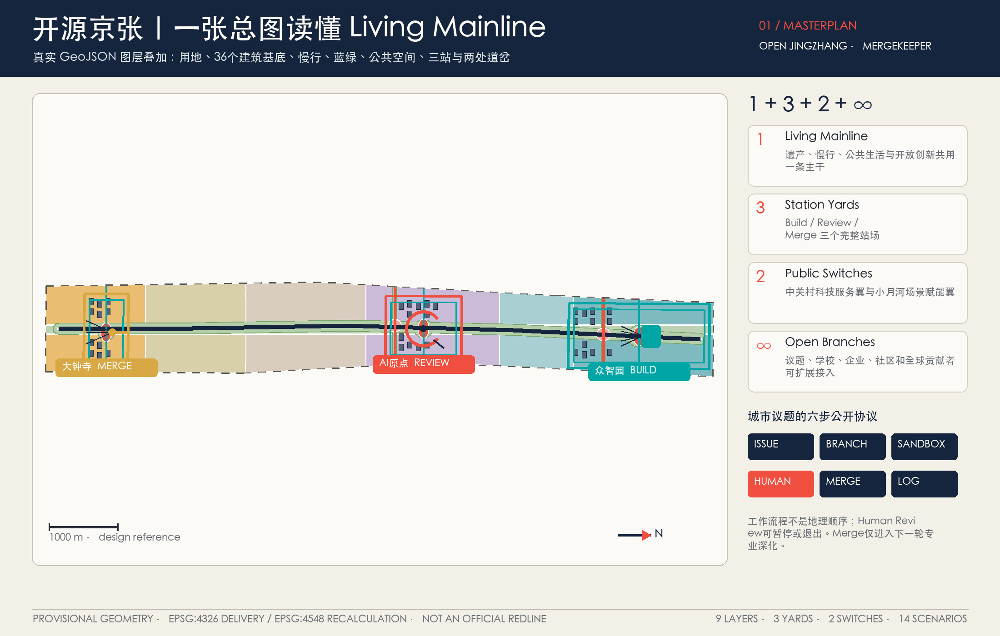
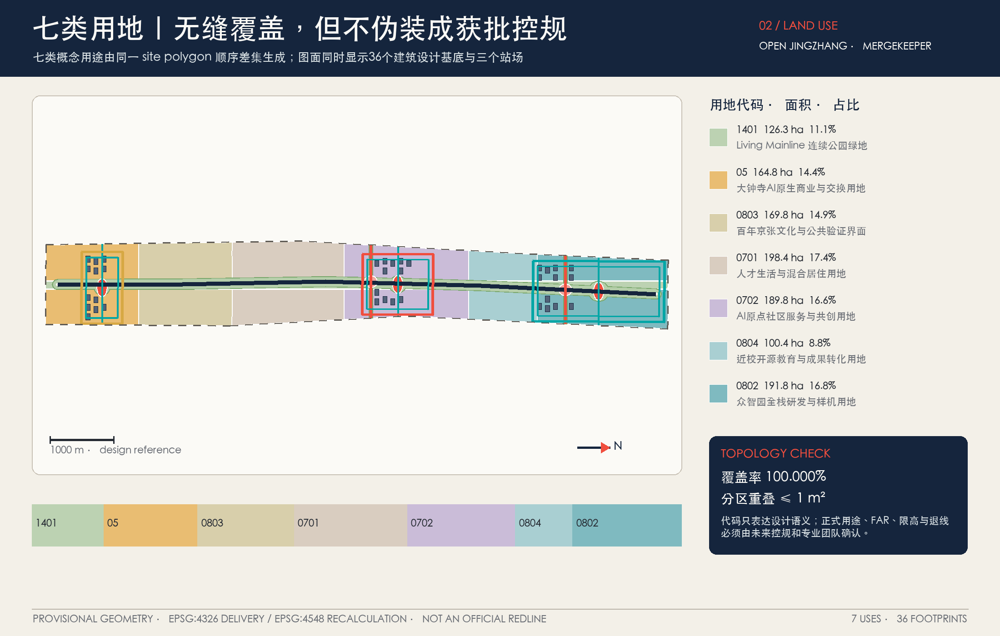
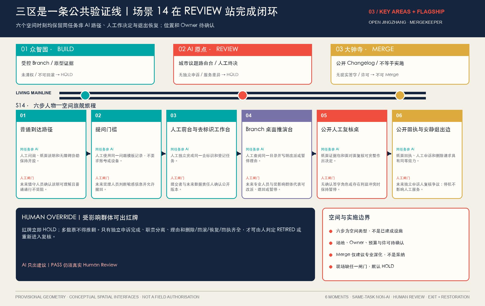
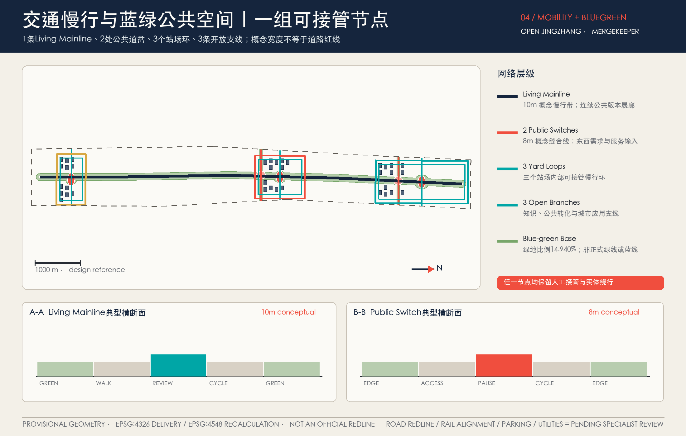
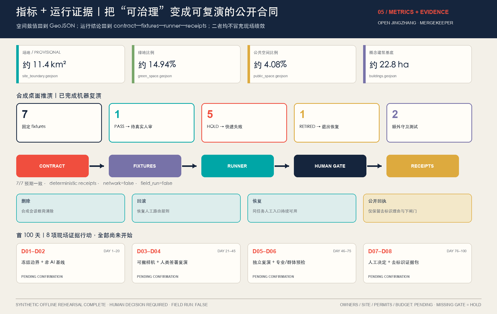

# 开源京张｜OPEN JINGZHANG — The Living Mainline

**城市问题先到京张公开验证，AI 先证明，人再决定是否进入城市。**

## 设计依据与资料清单

本案的首要判断是：这不是一套把技术图标贴到铁路遗产上的“智慧城市”包装，而是一套城市设计与开放治理共同构成的公共提案。正式公告确定了三层工作范围、三个重点区域以及产业、更新、交通、蓝绿、风貌和实施任务；面向智能体的任务书又要求方案回应 Agent.1—Agent.6、AI 场景、品牌和长期运营。本案据此把规划对象分成三种证据等级：公告文字与国家标准属于可引用的正式依据；仓库 provisional 几何属于可供内容评审、方向性设计和复算的临时约束；本投稿生成的用地、建筑、道路、绿地、公共空间和分期属于设计建议。三类证据在文字、图层、指标和图纸中均不混称。[source:DATA-SRC-OFFICIAL-ANNOUNCEMENT-20260509] [source:DATA-SRC-AGENT-TASKBOOK-20260518]

专业依据采用五条强制标准：项目公告控制任务边界，[standard:PROJECT-OFFICIAL-ANNOUNCEMENT]；智能体任务书控制开放征集的六项任务，[standard:PROJECT-AGENT-OPEN-CALL-TASKBOOK]；城市设计管理办法控制公共空间、城市特色、建筑体量和界面表达，[standard:MOHURD-URBAN-DESIGN-MEASURES]；控制性详细规划编制审批办法帮助区分概念建议与法定控制，[standard:MOHURD-CONTROL-DETAILED-PLANNING]；用地用海分类指南统一 `land_use_code` 语义，[standard:MNR-LAND-USE-CLASSIFICATION-GUIDE]。建筑设计深度标准因公开附件不足，仅作为待专业核验的数据缺口，不支撑具体工程结论，[standard:MOHURD-ARCH-DESIGN-DEPTH-2016]。这些引用分别来自住建部、自然资源部和项目公开资料。[source:DATA-SRC-MOHURD-URBAN-DESIGN-MEASURES] [source:DATA-SRC-MOHURD-CONTROL-DETAILED-PLANNING] [source:DATA-SRC-MNR-LAND-USE-CLASSIFICATION-202311]

空间底板采用仓库登记的 provisional 场地与重点区。其统一披露为：**本方案采用仓库提供的 provisional 几何开展开放共创、方向性设计、正式内容评审、可视化表达、几何复算与自检；其不得被解释为官方红线、法定控制边界、审批依据或精确面积结论。官方精确几何缺失不构成本次评审的 blocker，资料补齐后须重新复算与校核。** 这一限制同时写入 sources、assumptions、self_check、GeoJSON 和 visual。[source:DATA-SRC-PROVISIONAL-BOUNDARIES-20260605] [data:geometry/site_boundary.geojson#SITE-001] [data:geometry/key_areas.geojson#PROV-KEY-001]

当前已知资料包括公告文字范围与面积约值、三处重点区名称和任务、专业标准、临时几何与允许的数据分类；缺失资料包括官方三层 polygon、现状建筑与权属、获批控规、道路红线、轨道与市政工程条件、文保控制范围、河道蓝线、消防和公共服务底数。本案以“已知—临时—缺失”诊断代替现状臆测；`constraints.geojson` 有意保持空集合，因为没有可靠资料就不绘制假红线。[depth:existing_conditions_diagnosis] [depth:risk_missing_data] [data:geometry/constraints.geojson#intentionally-empty] [metric:site_area_sqm] [metric:key_area_count]

所有结论采用同一阅读方法：先给出设计判断，再说明公共与产业理由，随后落到可追踪图层、指标、图纸和来源，最后公开尚未取得的控制条件。这样，“开源”指开放问题、协议、指标、复盘与贡献记录，不是开放个人数据、商业秘密或审批权；“Merge”只表示建议进入下一轮专业深化与审查，不代表政府采纳、采购、建设或上线。

## 三层范围工作框架

本案判断，三层范围不是三张彼此分离的图，而是一条从区域战略到城市结构再到可验证场景的证据链。统筹研究范围负责 AI 创新生态、区域协同和未来城市规则；总体设计范围把规则落实为用地、更新、交通、市政、蓝绿和公共空间；三个重点区则分别承担 Build、Review、Merge。统一空间语法是“1 条 Living Mainline + 3 个 Station Yards + 2 个 Switches + 无限 Branches”：一条京张公共创新主干，三个功能差异化站场，两处东西缝合的公共道岔，以及向高校、社区、园区、企业、轨道站点和全球贡献者延伸的开放支线。[depth:three_level_scope_framework] [depth:overall_spatial_structure]

“1”是京张遗址公园及其相邻公共空间形成的 Living Mainline。它同时承载百年工程文化、连续慢行、开放议题、场景展示和年度活动，但不被画成新的法定边界。“3”是众智园、北京 AI 原点社区和大钟寺三处 Station Yards：众智园 Build 负责全栈研发与样机组装；原点社区 Review 负责开源评议、公共转化与人才生活；大钟寺 Merge 负责产业交换、城市应用与国际合作。“2”是两类功能输入：知识供给翼连接高校、科研、人才、资本与专业服务，城市应用翼连接社区、商业、公共服务和真实议题；它们是功能协同，不表示新的官方分区。“∞”指机制可扩展，而不是凭空画出无限道路。[source:DATA-SRC-OFFICIAL-ANNOUNCEMENT-20260509] [source:DATA-SRC-AGENT-TASKBOOK-20260518]

三层传导采用同一运营协议：`Issue → Branch → Sandbox → Human Review → Merge → Changelog`。Issue 是被公开说明的问题，不是立项；Branch 是并行提出的可比较方案，不是规划结论；Sandbox 是模拟、合成数据或经另行同意的限时限域试验，不等于批准运营；Human Review 由居民、专业人员和运营方共同完成，AI 不作终决；Merge 仅表示进入下一轮专业深化；Changelog 记录采用、修改、撤回、来源和责任，但不披露隐私。空间证据可从主线、道岔和三区回路核查。[data:geometry/roads.geojson#ROAD-MAINLINE-001] [data:geometry/green_space.geojson#GREEN-001] [data:geometry/public_space.geojson#PUBLIC-MAINLINE-001]

本次提交的 provisional 场地面积公开口径约为 **11.4 平方千米**；精确复算值只保留在 `metrics.json` 和 GeoJSON 等机器证据中。该数值来自 provisional polygon 投影到 EPSG:4548 的内部计算，是设计包的一致性证据，不是官方精确面积结论。[metric:site_area_sqm] 三处重点区数量为 3，形状保持仓库原始临时几何且互不重叠。[metric:key_area_count] [data:geometry/key_areas.geojson#PROV-KEY-002] [data:geometry/key_areas.geojson#PROV-KEY-003] 官方 polygon 到位后，必须以同一流水线重算 site、key areas、land use、buildings、roads、green space、public space、phasing、metrics、五张 PNG、两份 PDF 与两个 HTML；不能只换一张边界图。

## 统筹研究范围产业与未来城市研究

本案判断，京张的世界级竞争力不应以“引入多少企业、多少算力”这类尚无依据的数字制造，而应建立一种城市创新制度：公共问题能够进入，全球贡献者能够并行提出方案，方案先在可控环境形成证据，再由人类审查，最后才有资格进入专业深化。这一制度把铁路的工程协作精神、中关村持续创新文化与 AI 的版本迭代方式转译为城市空间。它不能在任意园区复制，因为只有京张同时具有百年铁路工程叙事、连续公共主干和三个功能差异鲜明的重点区，能够让“主干—站场—道岔—支线”既是空间结构也是运营结构。[source:DATA-SRC-AGENT-TASKBOOK-20260518]

OPEN JINGZHANG 的品牌只保留五个元素：总品牌“开源京张”；空间骨架“1+3+2+∞”；运营协议六步闭环；伦理底线 Human Override；时间叙事 1909—2026—2126。Logo 由两条平行轨线与一条 45 度道岔构成开放的“J”，中央负形同时形成“开”的门洞与站立的人形。轨道深蓝 `#15253D` 表示公共基座，信号朱红 `#F04E3E` 只标示 Issue、风险和待复核，开源青 `#00A6A6` 只标示已完成验证的连接。图形不使用火车剪影、政府徽记、企业 Logo 或未经授权的历史照片。

国际案例只证明某种机制曾由相应机构公开实践，不证明其绩效、法律或资源可以直接迁移。八个一手来源参照如下：

| 机制参照 | 可证事实的本地转译 | 明确不可照搬 |
| --- | --- | --- |
| 新加坡 Punggol Digital District | 把数字孪生先模拟、再进入限定物理测试的顺序转译为 Sandbox 准入门。[source:CASE-SRC-SG-JTC-PDD] | 不外推新加坡土地制度、传感器规模、数据权限和节能绩效。 |
| 欧盟 CitCom.ai TEF | 把跨节点真实条件测试转译为三区共享测试卡、准入条件和评价模板。[source:CASE-SRC-EU-CITCOM-AI-TEF] | 不宣称拥有 EU AI Act 监管沙盒、认证或合格评定地位。 |
| Helsinki Mobility Lab | 把居民参与、数据目录、试验结束报告和继续/停止决定转译为公开复盘。[source:CASE-SRC-FI-HEL-MOBILITY-LAB] | 不外推芬兰开放数据条件；并注明原项目周期已经结束。 |
| Barcelona Innova Lab | 把城市问题、开放征集、限时试验、实验协议与知识转移转译为六步协议。[source:CASE-SRC-ES-BCN-INNOVA-LAB] | 不照搬西班牙条例、采购、公共资产或试验许可。 |
| Mila / Mile-Ex | 把研究、技术转移、创业、伙伴与负责任 AI 的共址转译为零号站空间程序。[source:CASE-SRC-CA-MILA-MILE-EX] | 不照搬机构规模、资金与治理；开放科学不等于全部数据和 IP 开放。 |
| MassRobotics | 把共享原型工具、resident cohort、测试和毕业机制转译为众智编组场。[source:CASE-SRC-US-MASSROBOTICS] | 不外推美国私人运营、设备清单或公共街道部署许可。 |
| 筑波 Super Science City | 把“Leave No One Behind”和居民视角转译为每张 Issue 的受益与排除检查。[source:CASE-SRC-JP-TSUKUBA-SUPER-CITY] | 不照搬日本特区法律、数据联动、自动驾驶或无人机许可。 |
| Amsterdam Algorithm Lifecycle / Register | 把算法目的、数据、责任、人审、异议、审计与版本转译为 Model Passport。[source:CASE-SRC-NL-AMS-ALGORITHM-LIFECYCLE] | 登记不等于认证、无偏或安全保证，荷兰申诉与采购法律不迁移。 |

产业生态由五类接口构成：高校与研究机构提出方法和基准，众智园提供共享原型与安全验证，原点社区提供公开解释、成果转化和人才生活，大钟寺提供产业应用、商务和国际交换，Living Mainline 将居民问题与试验结果公开连接。它回应三大定位、五大功能和“三区两翼”，但不列未经授权的企业入驻、投资或产值承诺。所有产业资源都用“接口、服务类型、进入条件”表达；没有正式合作文件，就不出现确定伙伴名单。

区域协同进一步按“议题—资源接口—空间接口—非承诺边界”登记：北纬社区提供日常公共服务与无障碍议题接口，未来科学城提供研发方法与测试基准接口，怀柔科学城提供科学装置与基础研究转译接口，经开区提供先进制造与具身智能工程接口，京津冀提供跨区域铁路文化与开放协作接口；中关村科技服务翼承接高校、知识产权、法律与转化服务，小月河场景赋能翼承接社区、公园和滨水日常议题。上述均为待对接的功能关系，不表示已签合作、已获资源或已确定实施主体；完整矩阵及核验状态见 `report/narrative.md` 与 `visual/assets/maintenance-followup.json`。

未来城市形态因此不是无处不在的屏幕，而是三类可感知变化：建筑中有可预约的共享实验、开源评议和产业交换空间；街道中有慢行主干、公共道岔、无障碍导航和人工服务等价通道；治理中有场景护照、暂停阈值、拒绝清单和失败档案。总体结构对应用地、建筑和公共空间图层，而不是独立的产业口号。[data:geometry/land_use.geojson#LU-001] [data:geometry/buildings.geojson#BLDG-101] [data:geometry/public_space.geojson#PUBLIC-LANDMARK-001]

## 总体设计范围城市更新与控规深度城市设计

本案判断，总体更新应采用“可分支、可回退”的渐进结构，而不是在缺少现状建筑、权属和控规时作全域拆建判决。Living Mainline 是稳定公共基座，三处 Station Yards 是重点介入区，两处 Switches 缝合东西城市资源，Branches 允许学校、社区、园区和站点按证据成熟度接入。用地、建筑、道路、绿地、公共空间和分期均从同一 provisional site 生成；用地以顺序差集覆盖场地，避免分别手绘造成的缝隙和重叠。[depth:land_use_layout] [data:geometry/land_use.geojson#LU-002]

七类概念用地分别是 Living Mainline 连续公园绿地、南部 AI 原生商业与交换、京张文化与公共验证、人才生活与混合居住、原点社区服务与共创、近校开源教育与成果转化、北部全栈研发与样机。这些代码只使用国家分类指南中的术语，表达设计功能结构，不代表法定用途调整或已经获批的控规。[source:DATA-SRC-MNR-LAND-USE-CLASSIFICATION-202311] [data:geometry/land_use.geojson#LU-003] [data:geometry/land_use.geojson#LU-004] [data:geometry/land_use.geojson#LU-005] [data:geometry/land_use.geojson#LU-006] [data:geometry/land_use.geojson#LU-007]

建筑图层包含 36 个概念更新基底，围绕 Build、Review、Merge 三个站场形成可辨识颗粒。它们不是现状测绘，也不是具体拆除或新建对象，而是表达实验室、孵化、教育、社区服务、人才生活、混合商业等空间类型的设计载体。基底合计 228,096.0 平方米，来自图层的 EPSG:4548 复算。[metric:building_footprint_area_sqm] [data:geometry/buildings.geojson#BLDG-201] 由于没有楼层、总建筑面积和获批强度，`floor_area_ratio` 保持 unknown；本案仅提出已知、建议、待确认三栏，不用虚构容积率制造“控规感”。[metric:floor_area_ratio] [depth:development_intensity_controls]

城市设计控制采用类型原则而非伪精确数字：研发组团应形成可进入的首层共享界面和中央开放测试庭院；Review 组团优先小尺度、可逆公共空间微更新，避免将居民生活区变成默认测试场；Merge 组团把展示、商务、应用和公共服务混合，并保留日常使用而非只服务发布活动。建筑高度、屋顶、体量、退线、天际线和界面均列为专业深化条件。[depth:height_massing_character] [source:DATA-SRC-MOHURD-URBAN-DESIGN-MEASURES]

更新结构分三个依赖阶段：一期聚焦三区站场和主干公开验证试点；二期处理两处道岔与开放支线缝合；三期才进入连续城区更新和长期维护。阶段顺序不等于开工承诺，任何空间都需要对应的官方边界、权属、交通、市政、安全和运营条件。[data:geometry/phasing.geojson#PHASE-001] [data:geometry/phasing.geojson#PHASE-002] [data:geometry/phasing.geojson#PHASE-003]

## 重点区域详细设计

本案判断，三个重点区必须分别成为完整小方案，而不是同一“AI 示范区”模板换名。众智园负责 Build、AI 原点社区负责 Review、大钟寺负责 Merge；三者都包含定位、结构、更新、建筑、慢行、公共空间、AI 场景和风险，又由 Living Mainline 和同一六步协议连接。三处范围均为 provisional，key area 数量为 3；任何地标坐标、面积或项目清单都只在该精度条件下服务方向性设计。[metric:key_area_count] [depth:three_key_area_detailed_design]

**众智园｜Build｜众智编组场 Stack Yard。** 定位是 AI 全栈研发、样机组装和安全验证；结构是开放实验组团围绕一处“编组轨束”公共场，轨束将模型、Agent、机器人和能耗场景送入下一站的公共复核。更新方法以适应性再利用或小颗粒补入为主，建筑图层表达实验室、研发和孵化类型，但不对现有楼栋作拆留判决。慢行采用研发街区步行环和知识供给支线，公共空间包括样机展示街、封闭测试庭院和可参观的模型护照界面。产业场景包含多智能体编组、具身机器人混行、模型安全红队与算力—能耗调度。最大风险是封闭园区化和“测试优先于公共价值”；因此任何成果都必须进入 Review，且未通过安全、隐私和人工接管条件不得外溢。[data:geometry/key_areas.geojson#PROV-KEY-001] [data:geometry/public_space.geojson#PUBLIC-LANDMARK-001]

**北京 AI 原点社区｜Review｜开源零号站 Open Origin Station。** 定位是大学、社区、专业团队和创业者共同完成的城市公共验证中心；结构是开放站厅、AI 公民客厅、讨论广场、成果转化空间和人才生活服务的复合。所谓“站”是设计语法，不代表新建铁路设施。更新优先修补连续生活街道、校区—园区—社区慢行联系和可逆公共界面；建筑方法强调首层共享、夜间低扰动、无障碍和人工服务等价通道。场景包括社区事务解释、适老协作、无障碍导航、开放 AI 素养课堂和城市议题路由。Human Review 必须由使用者、专业人员、运营人员和公共守门人共同完成；拒绝参与的居民不降低原有服务质量。最大风险是将社区生活默认实验化，因此高风险群体不得作为首轮测试对象，所有试用均需主动选择和随时退出。[data:geometry/key_areas.geojson#PROV-KEY-002] [data:geometry/public_space.geojson#PUBLIC-LANDMARK-002]

**大钟寺｜Merge｜万智交换站 Agent Exchange。** 定位是 AI 原生产业交换、城市应用和国际合作门户；结构是“道岔汇流”几何组织的展示、合作、应用与商业复合街区，连接轨道接驳、开发者交流街和国际发布广场。更新以存量空间激活、公共首层和四象限步行连续性为重点，建筑类型包括混合功能、商业和办公。场景包括 AI 原生商业试营业、全球开发者互操作周、企业服务与证据型文化导览。Merge 不表示上线，而是把通过公共与专业审查的证据送入下一轮控规、工程、采购和许可研究。最大风险是用商业展示替代公共价值，或把“测试通过”写成政府认证；因此必须同时公开失败、拒绝与撤回记录。[data:geometry/key_areas.geojson#PROV-KEY-003] [data:geometry/public_space.geojson#PUBLIC-LANDMARK-003]

三区的共同深化清单包括官方 polygon、现状建筑、产权、交通、市政、消防、文保和运营主体；差异化清单则分别增加众智园可能涉及的水系与园区条件、原点社区的校园接口和生活服务、以及大钟寺站点与地下工程。当前可深化的是空间类型、公共协议、慢行联系和场景护照；须确认的是法定控制与工程条件；不可主张的是具体拆建、投资、入驻、批准和实施时间。

## AI 创新生态、人才画像与 AI+ 场景

本案判断，AI 场景不是功能清单，而是一组可以被审计和退出的城市 Branch。每张场景卡必须登记 Issue、负责人建议、空间载体、数据清单、风险等级、Human Override、成功与暂停阈值、退出责任人和 Changelog；未完成人工复核不得 Merge。统一状态为 `concept → simulation → limited_sandbox → human_review → professional_deepening / retired`，不出现 `deployed` 或 `approved`。这使 Agent.3 的创新不依赖“自动化越多越先进”，而依赖城市能否看见边界、错误和责任。[source:DATA-SRC-AGENT-TASKBOOK-20260518]

八类用户画像形成场景—空间—运营映射：AI 创业团队在众智园提交 Issue、维护 Branch 并接受复现验收；科研人员与学生提供方法、基准和证据并担任评审员；居民与家庭在原点社区提题、试用、申诉并决定是否扩大；老年人与无障碍用户拥有“红牌暂停权”，即任何服务差异、不可退出、无障碍中断或因拒绝授权受到惩罚时，可要求场景立即进入 Hold，随后由未参与初审的人员复核，不能由多数票强行继续；商户和产业采购方在大钟寺提供真实需求与小规模反馈；城市运营和公共服务人员负责人工复核、应急接管和退出；国际开发者参与互操作测试与多语传播；文化研究者与社区讲述者维护史料和叙事版本。任何画像都不用于未经同意的商业推荐。

Agent.1—Agent.6 不是六个自动决策者，而是六张可审计的工作护照；它们依次编译空间、生态、场景、公共空间、叙事权利和长期运营，任何一席都不能自行审批、执法、采购或上线：

| Agent | 角色、输入与工具 | 输出 | 冲突处理与 Human Gate | 评测证据 |
| --- | --- | --- | --- | --- |
| Agent.1 Belt Steward | 输入公告、三层范围、provisional geometry 与标准；使用 GIS、拓扑和证据索引 | 三层传导、总体骨架、图层与来源链 | official 与 provisional 冲突时以证据等级降级，提交规划专业人员复核 | 几何合法、用地覆盖、来源完整、零伪官方控制。 |
| Agent.2 Ecosystem Composer | 输入公开产业资料、用户需求、国际案例与空间供给；使用检索、分类和案例核验 | 产业—空间程序、人才画像、合作接口 | 产业宣传与公共价值冲突时先保留公共通道；不虚构伙伴、资金或政策 | 8 个一手机制案例、画像—空间映射、伙伴声明可追溯。 |
| Agent.3 Scenario Branch Runner | 输入 Issue、Model Passport、许可数据和风险登记；使用模拟、合成数据、评测 harness 与工具沙盒 | Pass / Hold / Reject 建议、失败记录、可复现包 | 数据、安全、公平任一否决即 Hold；最终状态由人审单元决定 | 14 场景、6 产业验证、接管、投诉、回滚与服务等价记录。 |
| Agent.4 Public Space Steward | 输入道路、绿地、公共空间、无障碍审查和使用者反馈；使用路径检查与可逆试点设计 | 三地标、慢行、公共空间和撤场方案 | 品牌活动不得压倒日常通行；受影响群体代表可触发红牌暂停 | 连续可达、三重点区图证、人工等价入口、撤场条件。 |
| Agent.5 Narrative & Rights Curator | 输入史料、14 个来源、品牌与版权台账；使用溯源、版权和多语 QA | 1909—2026—2126 叙事、导视、许可与更正记录 | 传播记忆点不得越过事实和权利边界；来源不能解析即撤下 | 引用闭环、外部视觉资产为零、错误更正与版本记录。 |
| Agent.6 Operations Maintainer | 输入通过人审的 Branch、人员、资源、SLA、事件与申诉；使用 Issue tracker、值班表、成本包络和 Changelog | 运营建议、责任班表、申诉事件卷宗和退役建议 | 无 Owner、值守、退役资源或独立申诉人时不得 Merge | SLA、未结申诉、资源覆盖、事故接管与及时退役。 |

协作顺序为 `Agent.1 定范围 → Agent.2 组生态 → Agent.3 做 Sandbox → Agent.4 审空间与受影响群体 → Agent.5 审事实版权 → Agent.6 审运营退役 → Human Review Cell`。模型间意见冲突不靠投票平均：涉及数据、安全、公平和法定条件的否决先进入 Hold；其他分歧保留不同 Branch 与证据，由人类签字者选择、合并或退回。这里的“Human Review Cell”是方案建议的责任角色组合，不是现有政府机构或已授权主体。

十四张冻结场景卡如下，其中六项属于产业测试验证：

| 场景 | 用户与空间 | AI 机制与人工复核 | 数据边界与失败退出 |
| --- | --- | --- | --- |
| 01 多智能体协同编组【产业验证】 | 创业团队、科研人员；众智编组场 | 多 Agent 分工、冲突检测和任务回放；技术委员会逐步放行 | 只用脱敏日志和合成数据，不接生产密钥；超时、越权或不可复现即断开工具并回滚。 |
| 02 具身机器人混行沙盒【产业验证】 | 机器人企业、物业、行人；众智园封闭庭院与限定路径 | 感知、避障和调度模拟；安全员现场接管、分时验收 | 不做人脸识别，无关影像不留存；触发安全距离、误识别或投诉阈值即停机退回封闭场。 |
| 03 模型安全红队场【产业验证】 | 模型企业、安全研究者；众智园安全实验室 | 测试提示攻击、工具越权、幻觉和偏见；独立红队签署风险单 | 仅测试授权模型和隔离数据；高危问题未关闭即标记 Rejected。 |
| 04 AI 原生商业试营业【产业验证】 | 商户、消费者；大钟寺应用街区 | 需求预测、导购与库存协同；商户确认关键决策，消费者可切人工 | 交易数据最小化，禁止默认跨店画像；误导、歧视定价或投诉超阈值即下线。 |
| 05 算力—能耗协同【产业验证】 | 算力与楼宇运营者；众智园研发载体 | 负荷预测和非关键任务错峰；设施工程师审批边界 | 只读设备和能耗数据；舒适度或稳定性失败即恢复原策略。 |
| 06 全球开发者互操作周【产业验证】 | 国际团队、平台和标准机构；万智交换站 | 跨模型、工具、语言的 Agent 互操作；联合评审和现场接管 | 只开放沙盒接口、测试密钥和合成数据；越权或不可复现即隔离版本。 |
| 07 社区事务可解释助手 | 居民、社区人员；AI 公民客厅 | 公开材料检索、办事路径解释和多语问答；窗口人员确认高影响答复 | 仅用公开材料和主动输入；错误或申诉上升即降级为检索目录。 |
| 08 适老生活协作员 | 老年人、照护者；原点社区服务站 | 提醒、路线辅助和异常主动询问；本人或授权照护者确认 | 健康与家庭数据端侧优先、单独授权、随时删除；误报或拒绝授权即退出智能模式。 |
| 09 无障碍连续导航 | 视障、听障和行动不便者；三区慢行网 | 多模态路径识别与障碍提示；无障碍体验官实地复核 | 不保存身份和完整轨迹；路线冲突或设施未更新即撤回并警示。 |
| 10 开放 AI 素养课堂 | 学生、教师和家庭；原点开放教室 | 模型比较、来源追踪和提示实验；教师审核课程输出 | 未成年人数据不用于训练，不采集人脸声纹；不当内容即停课复盘。 |
| 11 京张文化证据导览 | 居民、游客和研究者；遗址主线 | 基于清权档案的分层讲述；史料编辑逐条审校 | 只用可追溯公开资料；来源缺失就显示未知并撤下叙事卡。 |
| 12 公园生态养护助手 | 园林人员、公众；蓝绿廊道 | 植物识别、灌溉预测和病害预警；专业人员决定处置 | 环境数据公开分级，不采集邻近住户信息；连续误判或副作用即停用建议。 |
| 13 夜间安全共治灯带 | 夜行者、安保、商户；主干与道岔广场 | 人流拥挤预警和照明调节；值守人员复核，不自动执法 | 仅低分辨率计数和环境数据；误报、眩光或扰民即恢复固定照明。 |
| 14 城市议题路由台 | 居民、企业、高校团队；开源零号站 | 将问题聚类并匹配 Branch、场地和导师；议题委员会确认优先级 | 公众议题在公开展示时默认去标识，内部只保留经同意的联系与责任记录；无合法条件或无责任主体则进入 Hold。正式投稿仍按规则保留 GitHub 署名。 |

为避免“场景名称相同、责任和通过条件却漂移”，下表冻结同一批 14 个 ID 的英文短名、建议人类 Owner 与最小成功门槛。所有 Owner 均为角色建议，状态统一为 `pending_confirmation`，不表示现实主体已同意承担责任。这里的 success gate 是进入下一轮评审前必须提交的证据，不表示本方案已经达到任何效果；任何现场条件和专业阈值未确认时，状态只能保持 concept / Hold，不能由 AI 猜数。

| ID / English short name | 建议人类 Owner（待确认） | 最小成功证据（非既成绩效） | 红牌暂停 / 退出 |
| --- | --- | --- | --- |
| 01 Agent Consist Yard | Technical Owner + 独立复现人 | 冻结测试集可连续复现，所有工具调用和冲突处理均进入日志 | 越权、不可复现或无法回滚即隔离版本。 |
| 02 Embodied Mobility Sandbox | 现场安全员 + Domain Professional | 每轮紧急停机演练通过，限定路径内零红线侵入 | 安全距离触发、误识别或投诉达到预设阈值即停机。 |
| 03 Model Red-Team Bay | Independent Red Team Lead | 每项高危发现都有复现包、Owner 与关闭证据 | 高危项未关闭或测试越出授权模型即 Reject。 |
| 04 AI-native Retail Trial | 商户 Owner + 消费者权益复核人 | 高影响推荐与价格决定全部由人确认，人工渠道可等价完成 | 误导、歧视定价、无法切人工或投诉超阈值即下线。 |
| 05 Compute–Energy Co-pilot | 设施工程师 + Operations Owner | 只读建议、人工批准和原策略回退演练均有记录 | 舒适度、设备稳定性或回滚测试失败即恢复原策略。 |
| 06 Global Agent Interop Week | 联合测试召集人 + Technical Owner | 冻结互操作测试集的异常、版本与复现链可追溯 | 越权、密钥外泄或关键结果不可复现即隔离。 |
| 07 Explainable Civic Assistant | 窗口服务 Owner + Independent Appeal | 引用覆盖、人工确认和申诉处理记录完整 | 高影响答复无来源、无法人工确认或错误申诉持续上升即降级。 |
| 08 Age-friendly Life Co-pilot | 本人/授权照护者 + 服务专业人员 | 撤回同意后智能模式立即停止，人工服务始终可用 | 未单独同意、误报或拒绝授权导致服务受损即退出。 |
| 09 Accessible Route Companion | 无障碍体验官 + 交通专业人员 | 发布路线均完成实地复核，未知设施明确显示未知 | 线路冲突、设施过期或无法提供替代路径即撤回。 |
| 10 Open AI Literacy Studio | 教师 Owner + 未成年人权益复核人 | 练习输出均显示来源与模型限制，未成年人数据不进入训练 | 出现不当内容、暗采数据或教师无法接管即停课复盘。 |
| 11 Evidence-based Rail Heritage Guide | 史料编辑 + Rights Curator | 每张叙事卡同时具备事实来源与使用权状态 | 来源或权利无法解析即撤下，不用 AI 补写未知历史。 |
| 12 Park Ecology Steward | 园林专业人员 + Operations Owner | 所有养护建议先经人批准，误判率按冻结样本持续记录 | 连续误判、副作用或现场条件不符即停用建议。 |
| 13 Co-governed Night Light | 值守人员 + 受影响居民代表 | 每次调节有人工复核，固定照明回退演练可完成 | 误报、眩光、扰民或用途漂移即恢复固定照明。 |
| 14 Civic Issue Router | Scenario Owner + Affected-group Steward | 公开议题全部去标识，每个 Branch 均有 Owner、闸门或明确 Hold 理由 | 无合法条件、责任主体或可申诉路径即 Hold。 |

front matter 中的 6 个 scenario ID 是仓库展示门户允许登记的场景家族；本节的 14 个编号是本方案唯一的设计场景清单，其中 01—06 是产业测试子集。A3 第 9—10 页完整展示同一 14 项，A0 第 6 页只摘要 6/14 产业验证并明确指向完整清单，不构成第二套场景。十四个场景均落到重点区、慢行、蓝绿或公共空间图层，而不是漂浮图标。[data:geometry/roads.geojson#ROAD-BRANCH-001] [data:geometry/green_space.geojson#GREEN-001] [data:geometry/public_space.geojson#PUBLIC-SWITCH-001] 主动选择、知情说明、随时退出和非 AI 等价服务是基础权利；未成年人、老年人、患者和残障人士不作为首轮高风险测试群体。每个场景都要有风险等级、独立复核人、人工接管、投诉申诉、即时暂停阈值和退出责任人。[depth:risk_missing_data]

维护阶段以 14 城市议题路由台作为唯一旗舰证据旅程，10 开放 AI 素养课堂与 11 京张文化证据导览只作为可复用的低风险协议。路由台把“人如何完成同一任务”冻结为六个空间时刻：普通到达路径、提问门槛、人工前台与去标识工作台、Branch 桌面推演台、公开人工复核桌、公开回执与安静退出边。每一步都有不依赖 AI 的等价路径、明确人审点和恢复方式；AI 不可用、使用者拒绝或撤回时，人工/纸面路径仍完成同一任务，不降低服务。

当前最高状态仍是 `simulation`。零依赖 runner 已离线复演 7 个固定合成 fixtures：`1 PASS / 5 HOLD / 1 RETIRED`，7/7 与预期一致，并生成确定性去标识回执；另有“未声明字段”和“误标 field run”两个 fail-closed 守卫测试。**这只证明规则、失败注入、删除/回滚/恢复证据和回执能够被重复执行；没有现场运行、没有真实参与者，也没有产生现实绩效或实施授权。** 首 100 天仍是八项尚未开始的建议证据行动：冻结模板与数据边界、建立非 AI 基线、制作可撤低保真样机、由待确认的人类角色复演并签署合成案例、独立复演、专业与受影响群体前置审查、人工 Go/Modify/Hold 决策、发布去标识证据包。所有 Owner、场地、预算、保险、采购、数据处理、值守、文保、消防和无障碍条件均为 `pending_confirmation`；任一未确认即保持 Hold，不得进入现场。合同、fixtures、runner 与回执见 `visual/assets/issue-router-tabletop/`，百日闸门见 `visual/assets/first-100-days-evidence-plan.json`。[metric:flagship_journey_step_count] [metric:synthetic_tabletop_case_count] [metric:first_100_days_evidence_action_count]

## 用地、建筑规模与拆改留方案

本案判断，在缺少现状建筑和权属底图时，最专业的拆改留方案不是猜一张红黄蓝图，而是建立 reuse-first 的判定流程。建筑首先进入“资料待核”，取得测绘、权属、结构安全、消防、文保与使用绩效后，再依次判断保留维护、修缮提升、适应性再利用或进入专业拆建论证；本投稿的 36 个基底只是空间类型和更新介入包络，不对应某一真实楼栋。[depth:retain_renovate_demolish] [data:geometry/buildings.geojson#BLDG-301]

用地结构强调三种站场与日常城区的互补。Build 需要科研、实验室、孵化和可控测试庭院；Review 需要教育、社区服务、人才生活和公共评审；Merge 需要混合商业、办公、展示和交通接驳。Living Mainline 的绿地与文化界面贯穿其间，保证创新空间不以牺牲公共连续性为代价。所有用地 polygon 由同一 site 按顺序差集生成，空间审查已经验证完整覆盖和无重大重叠；这证明数据自洽，不证明法定用途已经改变。[data:geometry/land_use.geojson#LU-001] [standard:MNR-LAND-USE-CLASSIFICATION-GUIDE]

建筑体量采用“院落式研发、开放首层、小颗粒街区、公共地标低占地”的原则。众智园组团围绕 Stack Yard 排布，中央测试空间连续可见；原点组团形成 Review Courtyards，缩短大学、社区与成果转化界面；大钟寺组团保持商业街道的全天活力，并让万智交换站承担公共而非封闭展厅角色。高度、层数、开发强度、道路退线和屋顶控制全部保持待确认，不出现没有控规依据的米数或容积率。[depth:height_massing_character] [metric:floor_area_ratio]

建筑基底复算值 228,096.0 平方米只描述概念设计模块的地面投影面积；它不能推导总建筑规模、建筑密度或投资。取得官方建筑和权属数据后，必须逐栋替换图层、重做拆改留判定、重算基底和强度，再校核日照、消防、结构、交通、市政和文保。当前结果的价值是把三站机制落进可审查的建筑颗粒，而不是伪造实施确定性。[metric:building_footprint_area_sqm] [source:DATA-SRC-MOHURD-CONTROL-DETAILED-PLANNING]

## 交通、轨道、市政与公共服务设施

本案判断，交通与设施不是“AI 自动调度一切”，而是让 Mainline、Switch 和 Branch 成为可走、可达、可接管的日常基础。道路图层只表达概念慢行与接驳网络：一条南北 Living Mainline、两条东西公共道岔、三处站场步行环和三条开放支线。它们全部裁剪在 provisional site 内，但不能证明现状道路、轨道线位、桥隧可行性、红线宽度、停车供给或工程容量。[depth:traffic_rail_slow_parking] [data:geometry/roads.geojson#ROAD-SWITCH-001]

慢行策略按“主干连续—道岔缝合—站场到门—无障碍复核”组织。主干承担南北步行骑行和公共创新游线；两处道岔优先解决东西联系的概念性断点；三个站场回路把研发、社区、商业与公共空间连成可读路径；无障碍导航只辅助发现问题，不取代实地审查。非机动车停放、停车与轨道接驳采用共享、分时、近站优先原则，但数量和位置须在交通调查、站点条件和道路红线取得后深化。[metric:public_space_ratio]

市政与新型基础设施采用“可插拔接口”而不是先承诺全域平台。众智园预留室内算力—能耗协同与安全测试接口；原点社区保留人工服务、无障碍和低技术参与通道；大钟寺的互操作场景只使用沙盒接口与测试密钥。分布式能源、端侧算力、环境传感、照明和设施维护必须与传统供电、通信、排水、消防和运维体系共同审查。缺少市政管线、能源容量、防洪和消防资料时，只表达责任、输入输出和失败回退，不给出容量结论。[depth:municipal_new_infrastructure] [data:geometry/constraints.geojson#intentionally-empty]

公共服务遵守等价原则：AI 健康导航只解释服务路径，不自动诊断；社区助手只检索公开材料，高影响答复由窗口人员确认；公共安全系统只提供辅助研判，不自动执法；低速配送机器人先在封闭环境验证，再申请限定路线、限定时段的小范围试用。任何服务拒绝授权或退出时，仍提供等质量人工渠道。这些边界把技术创新和公共利益放在同一张交通设施图上。

## 蓝绿空间、公共空间与城市风貌

本案判断，Living Mainline 首先是一条公共生活和记忆基础设施，其次才是 AI 展示界面。设计绿地由主干缓冲、两处道岔连接和三处站场生态节点组成，EPSG:4548 复算的绿地比例为 0.149399；公共空间由主干步行与版本展廊、三个地标和两个道岔广场组成，复算比例为 0.040773。[metric:green_ratio] [metric:public_space_ratio] 这些数字反映当前 provisional 设计几何，不替代绿线、蓝线、河道、防洪或公园专项审批。[depth:blue_green_public_space]

三座地标不是炫技雕塑，而是三种公共仪式。众智编组场用“编组轨束”显示不同场景从研发进入验证，日常是开放庭院，活动时才切换为样机发布；开源零号站用“开放站厅”形成中央人审大厅和周边 Sandbox、Review、Changelog 界面，任何人都能看见一个场景为何被接受、退回或停止；万智交换站用“道岔汇流”组织产业、社区与国际合作流线，并把失败案例放入“未合并未来档案”。三者均采用低占地、可逆、无障碍和低夜间扰动原则。[data:geometry/public_space.geojson#PUBLIC-LANDMARK-001] [data:geometry/public_space.geojson#PUBLIC-LANDMARK-002] [data:geometry/public_space.geojson#PUBLIC-LANDMARK-003]

城市风貌将铁路文化、中关村创新文化和 AI 新文化转译为同一图形语法：平行轨线表示公共基础，道岔表示选择而非自动决定，节点表示人类复核，虚线表示尚未确认，Changelog 表示时间。1909 是自主铁路工程精神，2026 是 AI 社区公开提交城市建议的起点，2126 不是预测图景，而是“每代人留下一个问题、一个经验证工具和一个仍可继续工作的公共接口”的百年维护承诺。它不暗示场地内存在不实的“人字形线路遗址”，也不复制历史图片来制造情感。[source:DATA-SRC-OFFICIAL-ANNOUNCEMENT-20260509]

公共绿地约占 14.94%，公共空间约占 4.08%。两类空间可能在主干上复合使用，因此指标分别按各自图层 union 计算，不相加冒充“开放空间总率”。蓝绿和公共空间的专业深化还需文保、树木、水系、噪声、灯光、桥隧、产权、运营和活动安全资料；当前只能提出连续性、活动类型、无障碍、人工接管和撤场条件。[data:geometry/green_space.geojson#GREEN-001] [data:geometry/public_space.geojson#PUBLIC-MAINLINE-001]

## 更新项目清单、实施政策与分期计划

本案判断，实施顺序应由证据成熟度和治理成熟度决定，而不是用没有依据的投资额或开工年份制造确定性。三个阶段分别是：一期验证三区 Station Yards 和 Living Mainline 的低风险公共接口；二期在交通、公共空间和运营联合复核后处理两处 Switches 与 Branches；三期仅在官方边界、控规、建筑、权属和承载力资料齐备后研究连续城区更新。分期图层是依赖序列，不是政府实施计划。[depth:phasing_implementation] [data:geometry/phasing.geojson#PHASE-001]

| 项目 ID | 概念项目 | 进入条件 | 退出或退回条件 |
| --- | --- | --- | --- |
| OJZ-01 | Living Mainline 轻触媒主干 | 官方几何校准、文保与公园管理复核、无障碍实测 | 影响遗产、生态或日常通行即缩减或撤回。 |
| OJZ-02 | Stack Yard 室内/庭院样机编组 | 场地权属、消防、安全、运营责任和模型护照完备 | 无法接管、不可复现或外溢扰民即退回封闭实验室。 |
| OJZ-03 | Open Origin 公共评审站厅 | 社区自愿参与、人工等价服务、申诉和退出流程建立 | 参与不透明、弱势人群受损或服务惩罚即暂停。 |
| OJZ-04 | Agent Exchange 互操作与应用街 | 商户授权、沙盒接口、消费者选择和安全审计完备 | 越权、歧视定价、供应链风险或投诉超阈值即隔离版本。 |
| OJZ-05 | 两处公共道岔慢行缝合 | 道路、轨道、管线和交通专项复核 | 工程条件不成立则保留为导视与运营支线，不施工。 |
| OJZ-06 | 未合并未来档案与百年版本墙 | 版权、隐私、责任人和长期维护机制明确 | 不能持续维护或会披露敏感信息则只保留匿名摘要。 |
| OJZ-07 | 场景护照与公开成绩牌 | 指标、数据来源、人审与退出责任可审计 | 仅有宣传指标或无法验证时不得公开为“成绩”。 |
| OJZ-08 | 三区建筑适应性再利用研究 | 测绘、权属、结构、消防、文保和控规资料齐全 | 任一关键资料缺失则停留在类型学研究。 |
| OJZ-09 | Human Review、申诉与事故响应台 | Scenario Owner、数据控制者、值班责任、独立申诉、服务目标、事件留证和退役资源齐备 | 无独立复核人、责任主体缺失、利益冲突无法回避或响应目标连续失守即 Hold / Retired。 |

九项更新项目的完成不是承诺建设，而是把位置、类型、前置条件、责任建议、进入和退出规则提前公开。[depth:renewal_project_list] 场景开放采用观察、模拟、封闭沙盒、预约试用、有限开放、正式建议六级状态；升级必须同时满足证据、无障碍、隐私、人工接管与退出测试。Merge 只表示建议进入下一轮专业深化与审查，不代表政府采纳、采购、建设或上线。

实施责任采用七席人审单元：Scenario Owner 对用途与资源负责，Data Controller / Steward 对数据清单与删除负责，Technical Owner 对版本、工具权限与回滚负责，Domain Professional 只签对应规划、交通、市政、园林、教育或服务意见，Affected-group Steward 代表具体受影响群体并持有红牌暂停权，Incident Commander / Operations Owner 负责现场接管、值班与退役，Independent Appeal Officer 不参与初审、开发或运营。`concept / simulation` 至少由场景与技术 Owner 签字；进入 limited sandbox 还必须增加数据、专业和受影响群体三席。利益冲突未披露或初审人与申诉人未隔离时只能 Hold。事故责任始终归实际提交、运营和签字的人类或组织，不归于 AI Agent。

资源与资金只作条件式包络，不虚构预算：公共治理与人工等价服务由未来有权公共主体核定；场馆、值班和无障碍维护由未来运营主体承担；研究、resident 与互操作活动可申请公开透明的合作或课题资源；企业测试可采用成本可审计的场地与专业服务机制，但付费不得购买通过、优先级或政府背书。任何采购、保险、场地许可、数据处理协议和现场安全责任未关闭前，只能停留在模拟或室内封闭状态。连续两个评估周期无法覆盖人工值守、无障碍、事件响应与退役成本时，不扩大场景并进入退役评审。

年度运营形成四季节律：第一季度“城市 Issue 季”公开征题；第二季度“Branch Sprint”组队开发；第三季度“Open Bench Week”集中测试、公众复核与国际互操作；第四季度“Merge Festival”发布年度合并清单、拒绝清单和《京张 Changelog》。开发者社区采用 RFC、Issue 标签、场景负责人、维护者轮值、双人 Review、可复现包和版本归档；零号站承担线下入门、配对与公众解释。

贡献荣誉分为首提者、维护者、复核者、公共守门人和长期贡献者，不以资本规模排序；贡献进入百年版本墙和机器可读履历。失败项目进入“未合并未来档案”，保存失败假设、风险原因、退出过程和可复用教训，不把下线包装为成功。国际合作只形成访问开发者、互操作挑战、联合研究、多语 Changelog 和公开基准的概念建议，不暗示已经签约或获政府采纳。[source:CASE-SRC-ES-BCN-INNOVA-LAB] [source:CASE-SRC-FI-HEL-MOBILITY-LAB]

## 指标体系、面积复算与合规矩阵

本案判断，指标必须分成三类：公告中的文字面积与任务数量是正式文字依据；从 provisional GeoJSON 复算的场地、建筑、绿地和公共空间是设计包内部一致性证据；场景、人审、项目和分期数量是交付完整度，不是社会经济绩效。三类数字不能混在一张“成绩表”中，更不能把设计目标写成已实现效果。[depth:metrics_recalculation]

当前公开指标口径为：provisional 场地面积约 `11.4 km²`，[metric:site_area_sqm]；概念建筑基底约 `22.8 ha`，[metric:building_footprint_area_sqm]；绿地比例约 `14.94%`，[metric:green_ratio]；公共空间比例约 `4.08%`，[metric:public_space_ratio]；重点区数量 `3`，[metric:key_area_count]。精确复算值仅保留在 `metrics.json` 与几何文件中；面积均在 EPSG:4548 复算，交换几何均为 EPSG:4326。容积率保持 unknown，[metric:floor_area_ratio]。每项在 `metrics.json` 中同时记录 source_files、formula、confidence、assumptions 与 reason，避免孤立手填。

为避免“6个门户标签、14张设计场景、9项更新行动”再次混读，交付与治理计数也进入同一指标账本：设计场景 14 项 [metric:scenario_card_count]；其中产业测试 6 项 [metric:industry_test_scenario_count]；人物画像 8 类 [metric:persona_count]；更新行动 OJZ-01—09 共 9 项 [metric:renewal_project_count]；分期图层 PHASE-001—003 共 3 期 [metric:phase_count]；用地 union 对 provisional site 的覆盖率为 1.0 [metric:land_use_coverage_ratio]。旗舰证据合同另登记 6 个旅程步骤 [metric:flagship_journey_step_count]、7 个已完成离线合成复演的 fixtures [metric:synthetic_tabletop_case_count] 与 8 项尚未开始的首百日证据行动 [metric:first_100_days_evidence_action_count]。前两项证明旅程已冻结、机器规则可复演；它们不证明现场已运行、现实人审已完成或绩效已实现。

九层空间数据构成同一证据链：场地 [data:geometry/site_boundary.geojson#SITE-001]；重点区 [data:geometry/key_areas.geojson#PROV-KEY-001]；用地 [data:geometry/land_use.geojson#LU-001]；建筑 [data:geometry/buildings.geojson#BLDG-101]；道路 [data:geometry/roads.geojson#ROAD-MAINLINE-001]；绿地 [data:geometry/green_space.geojson#GREEN-001]；公共空间 [data:geometry/public_space.geojson#PUBLIC-MAINLINE-001]；约束缺口 [data:geometry/constraints.geojson#intentionally-empty]；分期 [data:geometry/phasing.geojson#PHASE-001]。用地由同一场地顺序差集生成，空间审查通过 validity、coverage、overlap 和指标一致性检查；三重点区保持原 geometry。

合规矩阵覆盖 17 项公告任务和 Agent.1—Agent.6 共 23 项。每项都链接最相关的正文章节、图层、指标、图纸、visual、来源、假设和自检，不以同一组模板证据敷衍。设计深度 15 项均标为 complete，其含义是“本深度已完整回应，并对缺资料给出继续深化条件”，而不是未知条件已经获得。除前述范围、结构、用地、强度、体量、拆改留、交通、市政、蓝绿、三区、项目、分期、指标与风险外，矩阵还核查 [depth:overall_spatial_structure]、[depth:land_use_layout]、[depth:development_intensity_controls]、[depth:height_massing_character]、[depth:retain_renovate_demolish]、[depth:traffic_rail_slow_parking]、[depth:municipal_new_infrastructure]、[depth:blue_green_public_space]、[depth:three_key_area_detailed_design]、[depth:renewal_project_list]、[depth:phasing_implementation] 与 [depth:metrics_recalculation]。

官方精确 geometry 到位后，复算流程不是修改一个数字，而是替换 site/key polygons，重做用地拓扑，裁剪建筑、道路、绿地、公共空间和分期，重算 metrics，重绘五图、两个 HTML 和两份 PDF，并重新执行 deterministic、spatial、visual 与 professional gates。指标误差、用地缝隙或文件哈希任何一项不一致，都应快速失败并公开错误，而不是用默认值掩盖。

## 风险、版权与合规说明

本案判断，“开源”必须与知情、拒绝、人工复核、撤回和追溯五项权利同时存在。开放的是议题、协议、指标、公开来源、复盘和贡献记录；不开放个人原始数据、健康信息、生产密钥、商业秘密、未公开规划资料和未经授权的知识产权。任何人拒绝数据授权、退出测试或提出质疑，不得受到服务惩罚；高影响决定不由 AI 自动完成。[source:DATA-SRC-AGENT-TASKBOOK-20260518]

八类风险由 `risk.json` 逐项管理，但 JSON 是兼容仓库 schema 的摘要雷达；下表才是供专业深化的 Risk Governance Register v2。L/I 是方案内部的可能性与影响等级，不是保险或法定评级；状态均保持 open / monitoring，不把缓解建议写成风险已经解决。[depth:risk_missing_data]

| 风险 ID（L/I） | Owner 角色与受影响群体 | 触发器与当前状态 | 人工签字、申诉、留存与剩余风险 |
| --- | --- | --- | --- |
| data_privacy（3/4） | Data Steward；居民、患者、商户、未成年人 | 未授权字段、用途漂移、身份或完整轨迹外泄即 P0 Hold；open | Steward + 受影响群体代表；独立申诉；非必要原始数据会话后删除，运行日志建议 30 天聚合/删除；剩余 2/5。 |
| implementation_complexity（4/4） | Scenario Owner + Domain Professional；使用者与现场人员 | 权属、消防、交通、市政、值班任一责任未闭合不得升级；open | 规划、工程、运营和社区联合签字；争议 10 个工作日内独立复核目标；证据卷宗随阶段保留；剩余 3/5。 |
| public_acceptance（3/3） | Affected-group Steward；居民、小商户与非技术用户 | 被实验化、说明不可懂、退出受罚或投诉持续上升即 Hold；monitoring | 场景 Owner 与受影响群体共同复核；线下/线上/代理/无障碍申诉；公开 Changelog 只留去标识结论；剩余 2/5。 |
| operations_cost（3/4） | Operations Owner；人工服务人员与所有使用者 | 连续两个评估周期无法覆盖值守、无障碍、事故响应和退役资源即停止扩展；open | 运营与财务/采购角色核验资源包络；不得用付费购买通过；成本表按年度留存；剩余 3/5。 |
| policy_uncertainty（4/4） | Domain Professional；产权人、运营者与公众 | 无控规、许可、采购或数据处理依据仍试图现场部署即 Reject；open | 规划与法律合规人员重核；对行政结论的异议走有权机关正式渠道；本方案只存专业建议证据；剩余 3/5。 |
| spatial_dispute（3/4） | Belt Steward + 测绘专业人员；相邻主体和公众 | official polygon 替换后拓扑、面积或重点区关系不一致即全链快速失败；monitoring | 维护者与专业测绘人员签字；公开变更范围和复算结果；旧 provisional 版本归档不作红线；剩余 2/5。 |
| technology_maturity（4/3） | Technical Owner + Incident Commander；测试者和现场人员 | 越权、不可复现、无法接管、关键评测不通过或回滚超时即 Hold；open | 技术与安全人员独立复现后方可重开；最小安全事件卷宗结案后建议 180 天删除或匿名化；剩余 2/5。 |
| equity_inclusion（3/4） | Affected-group Steward + 公共服务负责人；老人、残障者、未成年人、小商户 | 人工等价服务缺失、路径不可达、差异待遇或投诉受报复即即时暂停；open | 无障碍体验官和受影响群体代表共同签字；初审人不得复核申诉；个人材料结案后删除或匿名化；剩余 2/5。 |

投诉与事故服务目标是本方案建议的运营基线，不是法定时限承诺：P0 人身安全、隐私泄露或自动越权须立即暂停并在 15 分钟内完成现场接管目标，1 小时确认、24 小时初报、72 小时形成人工处置决定；P1 歧视、服务剥夺或高影响错误 4 小时确认、1 个工作日临时缓解、3 个工作日复核；P2 一般解释与体验问题 1 个工作日确认、3 个工作日初答、7 个工作日决定。对 Hold、Merge 或初审不服，建议 2 个工作日受理、10 个工作日由未参与初审且无利益冲突的人员独立决定；复杂事项最多延长一次并说明理由。任何人都可请求人工解释、更正、删除、退出或暂停 Branch，投诉和拒绝授权不降低非 AI 服务质量。

信息留存遵循“公开决定、保护个人材料”：非必要个人原始数据默认不留存或会话结束删除；最小运行日志建议 30 天后删除或聚合；安全事件与申诉卷宗在结案后 180 天删除或匿名化，实际期限仍须依法核验；公共 Changelog 长期保留去标识的目的、版本、证据、签字角色、接受/退回理由和退出记录，不保留健康、交易、完整轨迹、密钥或可识别个人材料。数据控制者、事故责任、保存规则或删除能力无法确认时，场景状态只能是 simulation / Hold。

必须保持为概念建议的内容包括用地性质调整、容积率、建筑高度和规模、道路与轨道工程控制、市政条件、土地权属、拆改留、文保控制、投资额、建设时序、运营主体、采购、国际合作、数据共享、公共服务部署与行政结论。所有空间与场景均采用条件式建议、人工复核、专业深化和可撤回语言，不把测试结果升级为政府决定、工程保证或自动推广依据。

版权方面，文字、Logo、机制图、五张图、PDF 和 HTML 均由本投稿在设计宪章指导下原创生成；地图仅使用仓库 provisional GeoJSON，不使用商业地图截图、远程瓦片或 OSM；国际案例只做短事实转述与原创机制抽象，不复制图片、Logo、地图或图表；字体仅使用系统可渲染字体或 PDF 标准 CID 字体，不把字体文件重新分发；代码由 Codex 生成并人工校核。完整分类声明见 `report/copyright_statement.md`，机器检查不被描述为法律确权。[source:DATA-SRC-PROVISIONAL-BOUNDARIES-20260605]

维护补交同时提供逐资产权利台账 `visual/assets/asset-rights-ledger.json` 与图像替代文本台账 `visual/assets/alt-text.json`。静态 HTML 的语言、标题、结构、离线性、图像替代文本和最小字号已完成机器/代码预检；A3/A0 PDF 仍未标记为 tagged PDF，印刷打样、对比度、屏幕阅读器阅读顺序与最终版权意见必须由人类在公开展示前签字。八个国际案例的一手来源已登记预审状态，但外部人工逐页来源审计仍为 pending，不得表述为中央案例库认证。

本方案采用仓库提供的 provisional 几何开展开放共创、方向性设计、正式内容评审、可视化表达、几何复算与自检；其不得被解释为官方红线、法定控制边界、审批依据或精确面积结论。官方精确几何缺失不构成本次评审的 blocker，资料补齐后须重新复算与校核。Merge 只表示建议进入下一轮专业深化与审查，不代表政府采纳、采购、建设或上线。

## 参考资料

仓库公开赛题导读 `brief/public-brief.md` 用于定位项目公开说明与参与边界；它是阅读导航，不替代下列原始公告、标准、任务书和一手案例来源。

本案采用 14 条最小充分来源。项目与专业依据包括：公告任务与文字范围 [source:DATA-SRC-OFFICIAL-ANNOUNCEMENT-20260509]；智能体六项任务、场景、品牌与运营 [source:DATA-SRC-AGENT-TASKBOOK-20260518]；城市设计公共空间与风貌原则 [source:DATA-SRC-MOHURD-URBAN-DESIGN-MEASURES]；控详深度与审批边界 [source:DATA-SRC-MOHURD-CONTROL-DETAILED-PLANNING]；用地分类术语 [source:DATA-SRC-MNR-LAND-USE-CLASSIFICATION-202311]；临时场地与重点区几何 [source:DATA-SRC-PROVISIONAL-BOUNDARIES-20260605]。它们分别用于被允许的事实和专业框架，不相互替代。

国际机制来源包括：JTC Punggol Digital District [source:CASE-SRC-SG-JTC-PDD]；欧盟 CitCom.ai Testing and Experimentation Facilities [source:CASE-SRC-EU-CITCOM-AI-TEF]；Helsinki Mobility Lab [source:CASE-SRC-FI-HEL-MOBILITY-LAB]；Barcelona Innova Lab [source:CASE-SRC-ES-BCN-INNOVA-LAB]；Mila Mile-Ex AI 生态 [source:CASE-SRC-CA-MILA-MILE-EX]；MassRobotics [source:CASE-SRC-US-MASSROBOTICS]；筑波 Super Science City [source:CASE-SRC-JP-TSUKUBA-SUPER-CITY]；Amsterdam Algorithm Lifecycle and Register [source:CASE-SRC-NL-AMS-ALGORITHM-LIFECYCLE]。每一条只支持机制转译，不支持项目红线、法定控制、工程可行性、政府批准或绩效保证；外部视觉资产均未进入投稿包。

证据体系同时引用五项 mandatory 标准、15 项设计深度、9 个 GeoJSON、5 个 known 指标、5 张专业图、A3/A0 图纸、完整报告 HTML 和离线 visual。假设表公开记录 `A-BOUNDARY-001`、`A-CONTROLS-001`、`A-BUILDING-001`、`A-GREEN-001`、`A-PUBLIC-001` 和 `A-AI-001`；自检表记录边界披露、重点区、用地拓扑、几何有效性、指标复算、离线可视、专业证据与版权说明。读者不必相信口号，可以沿任何一个引用回到来源、图层、公式、缺口和下一道人工闸门。

最终设计责任由 GitHub 账号 `Empress7211` 与 Agent `Mergekeeper` 承担。ChatGPT-5.6 Sol Pro 签发创意宪章，Codex 负责事实核验、结构化空间生产、制图、排版和验证。任何后续专业团队采用本提案时，都应重新核实来源、几何、现状、权属、法规、工程、数据、版权与公众同意；本投稿本身不是政府报名、批准或实施文件。
