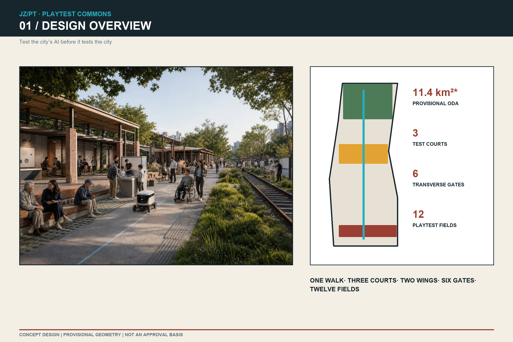
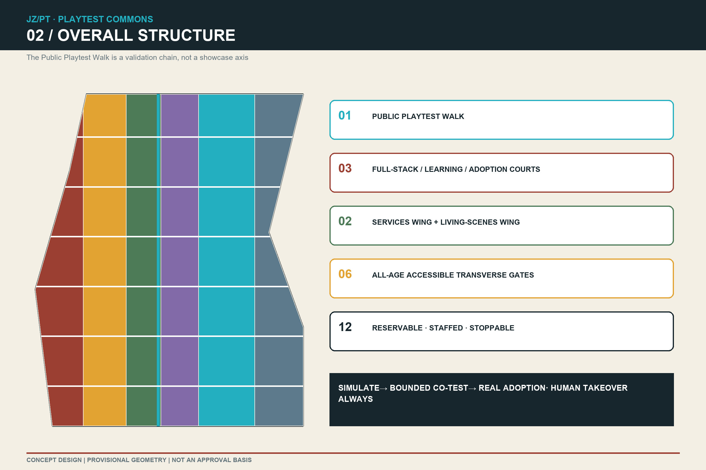
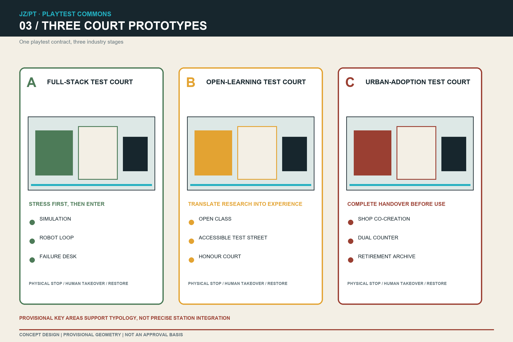
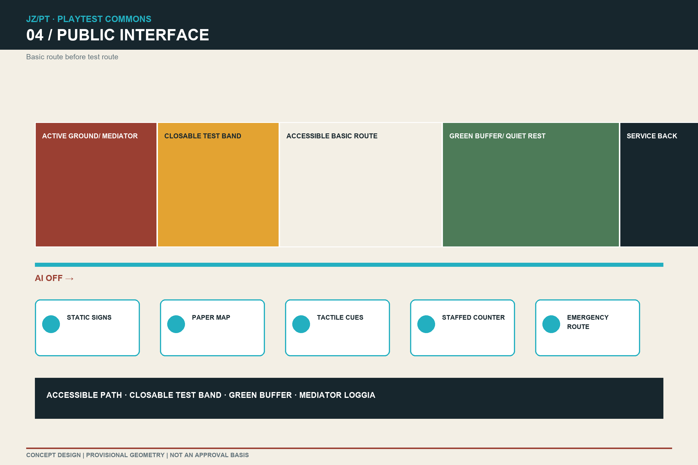
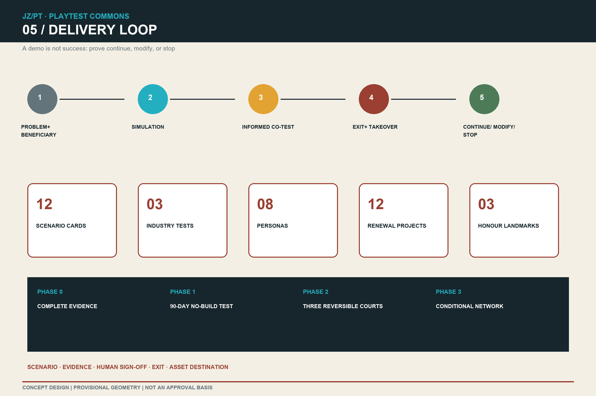

# JING-ZHANG PLAYTEST COMMONS

> **Test the city’s AI before it tests the city.**

This proposal recasts the AI Innovation Belt from a showcase corridor into city-scale co-testing infrastructure. Models, robots, and intelligent services first expose problems in simulation, then enter bounded physical test courts. Developers, residents, disabled users, and public-service staff can try, document, correct, or stop them before any decision about routine operation. “Play” is not entertainment packaging; it is an accessible, observable, counterexample-friendly method of serious validation.

Every plan, zone, and area in this package uses the repository’s provisional rough geometry. It supports conceptual review and recalculation only; it is not an official redline, survey, or approval basis. The three key-area rectangles are not anchored to stations or roads. The package therefore submits transferable spatial prototypes and interface relationships, to be relocated and recalculated when official polygons, regulatory plans, ownership, transport, utilities, and heritage controls become available.[source:BOUNDARY-SOURCE] [assumption:A-KEYAREA-ANCHOR-002]

## Design Basis and Source List

The official announcement and agent taskbook are the first-order basis. The announcement sets the 43.6 km² Coordinated Research Area, approximately 11.4 km² Overall Design Area, three key areas totalling about 368.4 ha, and their required depth. The taskbook requires naming and identity, five to eight international cases, at least ten AI+ scenario cards, at least three industrial test scenarios, at least five personas, three or more pilgrimage landmarks, a cultural narrative, and long-term operation. Registered standards govern urban design, regulatory-plan depth, and land-use expression.[source:OFFICIAL-ANNOUNCEMENT] [source:AGENT-TASKBOOK] [standard:PROJECT-OFFICIAL-ANNOUNCEMENT]

The package uses four evidence states:

| State | May support | Must not support |
| --- | --- | --- |
| official_public | Public tasks, textual scopes, standards, and policies | Unpublished coordinate redlines, ownership, or engineering conditions |
| provisional | Intake, conceptual zoning, recalculation, and replacement tests | Statutory redlines, precise station integration, or approval conclusions |
| conceptual | Proposed structures, prototypes, projects, operation, and test rules | Claims of implementation, government commitment, or fixed investment |
| unknown | Formula, responsible party, trigger, and fallback | Fabricated values for missing controls |

International comparison uses first-party pages only: Singapore’s Punggol Digital District, Helsinki’s Kalasatama, Barcelona Innova / BIT Habitat, Cambridge’s Kendall Square, Montréal’s Mila, and Linz’s Ars Electronica. They yield testing, co-creation, and public-interface mechanisms but do not prove direct transferability to Haidian.[source:CASE-PDD] [source:CASE-KALASATAMA] [source:CASE-BITHABITAT]

Critical gaps remain: official site/key-area polygons, road redlines, statutory land use, building inventory, retain-renovate-demolish data, rail sections, precise heritage controls, levels, utility capacity, trees, and stormwater conditions. FAR, height, building density, statutory green ratio, parking standards, and investment therefore remain unknown.[assumption:A-CONTROLS-001] [depth:existing_conditions_diagnosis]

## Three-Level Scope Framework

The three levels form one validation chain: the coordinated level selects ecosystem mechanisms; the overall level locates public interfaces and renewal levers; the key-area level tests whether space, governance, and operation work together through three court prototypes.[standard:PROJECT-AGENT-OPEN-CALL-TASKBOOK] [depth:three_level_scope_framework]

| Level | Official textual scope | Proposal object | Evidence produced |
| --- | --- | --- | --- |
| Coordinated Research Area | About 43.6 km² | R&D–translation–adoption ecosystem and six global cases | Ecosystem comparison, brand, operations, risks |
| Overall Design Area | About 11.4 km² | One Public Playtest Walk, six transverse gates, three zones and two wings | Topological land use and road/green/public/phasing GeoJSON |
| Key-Area Detailed Design Area | About 368.4 ha in total | Full-Stack Test Court, Open-Learning Test Court, Urban-Adoption Test Court | Three plan/section prototypes, nine building prototypes, projects, and scenarios |

The structure is **one walk, three courts, two wings, six gates, twelve playfields**:

- **One walk**: a Public Playtest Walk reads the railway-heritage public space as a walkable test manual, not a new redline.
- **Three courts**: Full-Stack Court at Zhongzhiyuan, Open-Learning Court at AI Origin, and Urban-Adoption Court at Dazhongsi; each is a typological prototype pending official re-anchoring.
- **Two wings**: the Zhongguancun Services Wing provides standards, legal/IP, finance, and evaluation; the Xiaoyue River Scenes Wing supplies real ecological, community, and service problems.
- **Six gates**: candidate east-west, all-age accessible test interfaces; only count and function are proposed until official base mapping exists.
- **Twelve playfields**: reservable, staffed, stoppable nodes that can be restored after testing.[data:geometry/roads.geojson#ROAD-SPINE] [metric:playtest_node_count]

## Coordinated Research Area: Industry and Future City Research

### A distinct ecosystem product: public playtest capability

Most innovation districts treat launch as the finish. Playtest Commons makes the ability to be understood, challenged, stopped, and adopted in a complex city into a competitive capability. Zhongzhiyuan validates full-stack and embodied systems; AI Origin translates research into legible prototypes; Dazhongsi tests adoption, service continuity, and business models; the two wings contribute rules and problems. The output is not a one-off demo but four reusable products: a test protocol, scenario data statement, failure/exit record, and human-signed adoption recommendation.

### Six transferable global mechanisms

| Case | First-party mechanism | Jing-Zhang translation | Explicit non-transfer |
| --- | --- | --- | --- |
| Punggol Digital District, Singapore | Open Digital Platform, digital twin, and live operating environment support simulation and testbedding | Three gates: simulation, bounded field test, public scenario | No default pervasive sensing; collection still requires minimisation and authorisation |
| Smart Kalasatama, Helsinki | Residents, firms, and experts run roughly six-month agile pilots in real environments and assess them | 90-day playtest season, public retrospective, sunset clause | Short-term satisfaction is not long-term public value |
| Barcelona Innova / BIT Habitat | City challenges, real-environment testing, and measurable public impact | Open “city levels” and evidence briefs | Winning a challenge is not procurement or permanent deployment |
| Kendall Square / The Foundry, Cambridge | Public-space network, active ground interface, and community-accessible creative/technology space | Courts open ground floors to the public, with community hours and mediators | No copying of development intensity or real-estate model |
| Mila, Montréal | Open science, collaborative space, talent–research–industry links, open prototypes | Open-learning court, reproducible experiment library, venture playtest days | Institutional scale is not a local performance promise |
| Ars Electronica, Linz | Interactive installations, open labs, and trainers make complex technology tangible | Civic mediators, playable explanations, and a city-scale AI literacy route | Public space is not converted into a permanent screen gallery |

Together they suggest that “world class” means organising city, business, university, and public into a replayable learning loop, not maximising device count.[source:CASE-KENDALL] [source:CASE-MILA] [source:CASE-ARS]

### Name and visual identity

- Chinese: **京张共测场**; English: **JING-ZHANG PLAYTEST COMMONS**; shorthand: **JZ/PT**.
- Motto: **Test the city’s AI before it tests the city.**
- Mark direction: three open brackets represent simulation, bounded co-test, and real context; the centre dot is human judgement; the opening means exit remains possible.
- Palette: railway brick red, test cyan, paper off-white, accountability charcoal, and ecological green. Every sign has high-contrast, tactile/audio, and static non-AI equivalents.

The identity treats railway heritage as an ethic of public engineering, repeated testing, and social scrutiny, not decorative nostalgia. This is a design proposition, not a substitute for historical research.[source:OFFICIAL-ANNOUNCEMENT] [standard:MOHURD-URBAN-DESIGN-MEASURES]

## Overall Design Area: Urban Renewal and Regulatory-Plan-Level Urban Design

### Urban form: from closed campuses to legible ground floors

The Public Playtest Walk establishes continuous civic ground. Its edges use three interfaces rather than one skyline: a legible public ground floor, quieter upper research/work layers, and a maintainable service back. Mediator desks, prototype windows, test loggias, and non-AI counters face the walk. Controlled research occupies upper floors or inner courts. Loading, charging, waste, and maintenance use the back, keeping basic movement clear. Six transverse gates first ensure passage, legibility, rest, and staff assistance; AI scenarios come second.[depth:overall_spatial_structure] [data:geometry/roads.geojson#ROAD-CROSS-01]

### Six conceptual land-use strategies

`land_use.geojson` cuts the same source boundary into six gap-free, overlap-free zones using recognised classification codes. It proposes research, education, culture, commercial service, community service, and park/open-space directions, not statutory land use. Areas validate topology and relative structure only and must be recalculated after official boundaries arrive.[standard:MNR-LAND-USE-CLASSIFICATION-GUIDE] [data:geometry/land_use.geojson#LU-01]

### Three spatial contracts

1. **Basic-passage contract**: tests never occupy the continuous accessible route, fire, or emergency space; static wayfinding and human service remain when AI is off.
2. **Public-ground-floor contract**: every project discloses purpose, responsible party, data boundary, test period, stop method, and result destination; commercial display cannot replace public explanation.
3. **Restoration contract**: temporary elements use reversible joints; after testing, equipment, data, paving interfaces, and maintenance responsibility are handed over without orphaned assets.

Official FAR, height, setbacks, road width, parking, and utility capacity are absent and remain unknown. Nine building footprints are prototype placeholders testing the relationship among research shed, mediator loggia, and public forecourt; they are not siting, demolition, or construction decisions.[metric:floor_area_ratio] [assumption:A-BUILDING-BASE-003] [depth:development_intensity_controls]

## Detailed Design of Key Areas

All three key areas use a “simulation room–test court–everyday interface” structure while serving different industry stages. Drawings show the source placeholders and prototypes together; rectangle edges are not read as roads or parcels. `PROV-KEY-003` is not anchored to Dazhongsi Station, so typology—not precise station integration—is reviewable until official data arrives.[data:geometry/key_areas.geojson#PROV-KEY-003] [assumption:A-KEYAREA-ANCHOR-002] [depth:three_key_area_detailed_design]

### A | Zhongzhiyuan Full-Stack Test Court: stress first, then enter the city

**Spatial prototype**: controlled test shed, low-speed robot loop, public observation loggia, standards studio, incident replay room, and a candidate ecological interface toward Qinghe. Transparent but closable edges place R&D beside public observation. Robots operate only inside marked areas with human supervision; the basic public path is never the default test ground.

**Industry role**: open-model safety evaluation, edge AI, embodied robotics, system interoperability, and green operations. Three building types—a reconfigurable test shed, standards co-creation building, and public replay loggia—remain subject to regulatory, structural, and transport confirmation.

**First levers**: P01 Simulation and Replay Room; P02 Low-Speed Robot Loop; P03 Public Failure Desk; P04 Full-Stack Standards Workshop. Any water, flood, Fifth Ring Road, or existing-campus action requires dedicated evidence first.

### B | AI Origin Open-Learning Test Court: translate research into human experience

**Spatial prototype**: open classroom, accessible co-test street, model-card library, contributor courtyard, and campus–city interface candidate. It does not presume campus opening or road works; it creates a public-side place for demonstration, questioning, reproduction, and withdrawal.

**Industry role**: university research translation, open-source collaboration, talent services, multilingual experience, and AI literacy. Public hall, short-lease project house, and mediator station connect work, learning, and life through shared ground floors and time zoning rather than one monumental object.

**First levers**: P05 Open Play Library; P06 Accessible Route Co-Test; P07 International Wayfinding Desk; P08 Contributor Honour Court. Honour records reproducible contribution, public correction, and responsible retirement—not paid ranking.

### C | Dazhongsi Urban-Adoption Test Court: complete the handover before routine use

**Spatial prototype**: small-business playtest street, quiet terminal display, staffed service window, international presentation/translation hall, and an unanchored four-way station interface. Because the current polygon conflicts with the named station, the route shows a relational template—station entrance to public space to active ground floor—not an existing path.

**Industry role**: agents and terminals, content consumption, compliant data explanation, business service, and international communication. Building prototypes are the Urban Adoption Hall, Small-Shop Co-Creation House, and Reversible Release Shed.

**First levers**: P09 Small-Shop AI Market; P10 Dual-Track Service Counter; P11 Urban Adoption Review Hall; P12 Failure and Retirement Archive. Exact Juesheng Temple/Dazhongsi heritage boundaries, view corridors, and height controls are missing, so no deterministic building or landscape decision is made.[assumption:A-HERITAGE-004]

## AI Innovation Ecosystem, Personas, and AI+ Scenarios

### Eight personas

| Persona | Actual need | Spatial response |
| --- | --- | --- |
| Model/robotics researcher | Complex context, replayable logs, public feedback | Simulation room, low-speed loop, incident replay |
| Startup product team | Low-cost field validation, compliance, first users | 90-day season, services wing, adoption review |
| Student/international visitor | Open collaboration, multilingual exchange, short project space | Learning court, project house, international desk |
| Resident/carer | Low-disturbance everyday life, questions, stop rights | Community hours, mediator desk, restoration contract |
| Older/low-digital-literacy user | Equivalent service without an app | Paper signs, staffed counter, account-free route |
| Disabled commuter | Continuous access and real co-testing | Accessible test street, tactile/audio/high-contrast interface |
| Small merchant/cultural worker | Contained cost, clear copyright, no forced recommendation | Co-creation house, rights desk, exit button |
| Civic mediator/frontline operator | Responsibility, training, stop authority, handover | Staffed desk, operations log, retirement checklist |

### Twelve scenario cards

| ID | Scenario and place | Minimum data | Human boundary / fail condition | Public output |
| --- | --- | --- | --- | --- |
| SC01★ | Low-speed robot loop / Zhongzhiyuan | Device state, anonymous incidents | Physical emergency stop; boundary breach stops test | Replay and correction order |
| SC02★ | Accessible navigation street / Origin | Consented route feedback | Paper/staffed alternative; no identity trail | Route-difference list |
| SC03★ | District operations rehearsal / three courts | Synthetic data or aggregate counts | Simulate first; AI never issues public decisions | Rehearsal report and human signature |
| SC04 | Human-readable model-bias drawing game / Origin | Voluntary anonymous drawings | Guardians for children; no commercial-model training | Blind-spot atlas |
| SC05 | Railway heritage fact-check table / walk | Cleared source index | Disputes shown; human editorial review | Versioned interpretation cards |
| SC06 | Multilingual arrival station / Origin, Dazhongsi | Ephemeral text/voice; no raw recording | Human translator; sensitive cases escalated | Error terms and service gaps |
| SC07 | Climate-comfort play walk / walk | Temporary readings, paper sensation votes | No health inference; stop in extreme weather | Shade/rest priority list |
| SC08 | Small-shop AI market / Dazhongsi | Merchant-owned authorised product data | No default profiling/differential pricing | Cost–benefit–exit record |
| SC09 | Public-service explanation desk / three courts | Public service rules | Explanation only, no approval; complex cases to staff | Question clusters and rewrite advice |
| SC10 | Accessible event rehearsal / walk | Aggregate flow, human observation | No face recognition; staffed crowd management | Event-route retrospective |
| SC11 | Youth AI co-learning workshop / Origin | Minimum project files | Guardian consent, age-appropriate, no profiling | Open lesson plan and licences |
| SC12 | Retirement and failure gallery / Dazhongsi | De-identified records | Responsible-party review; no individual exposure | Failure modes and exit templates |

★ marks three industrial validation scenarios. Each passes five gates: a clear problem and beneficiary; successful simulation; informed public co-test; working opt-out and human takeover; evidence sufficient for continue/modify/stop. A completed demo is never called deployable when a gate fails.[source:AGENT-TASKBOOK] [metric:scenario_card_count] [metric:test_scenario_count]

### Three AI pilgrimage and honour landmarks

1. **Full-Scale Playtest Hall**: full-size robots, signs, and service interfaces; honour goes to teams whose work can be replayed.
2. **Century Question Table**: railway, Zhongguancun, and AI-city questions share one civic table where the public can add counterexamples.
3. **Failure and Retirement Archive**: stopped, modified, and replaced projects make responsible exit visible as innovation.

All three are conceptual landmarks, not construction, investment, or naming commitments.[assumption:A-IMPLEMENTATION-006]

## Land Use, Building Scale, and Retain-Renovate-Demolish Strategy

Six strategy zones are cut from one site polygon and sum to `[metric:site_area_sqm]` without gaps or overlaps. Their areas are recorded in `metrics.json`; they indicate function direction, not statutory use. Green/public-space and building layers are urban-design overlays, not statutory green ratio or development scale.[data:geometry/land_use.geojson#LU-06] [standard:MNR-LAND-USE-CLASSIFICATION-GUIDE] [depth:land_use_layout]

| Code | Conceptual strategy | Urban-design intent |
| --- | --- | --- |
| 0802 | Research and co-testing | Controlled R&D court; visible ground-floor results |
| 0804 | Learning and translation | Short leases, sharing, cross-campus work; no sealed campus model |
| 0803 | Culture and public explanation | Low-screen, mediated, source-traceable content |
| 05 | Urban adoption and enterprise services | Small active ground floors, reversible trial, no forced consumption |
| 0702 | Community service | Account-free access, care, everyday problem intake |
| 1401 | Park and open space | Continuous basic movement, shade, rest, ecological buffer |

Retain-renovate-demolish is a method, not a quantity: survey first; retain useful buildings; use low-disturbance ground-floor renovation; add reversible test structures; discuss renewal or demolition only after structural, ownership, heritage, operational, and carbon review. Nine footprints in `buildings.geojson` are spatial prototypes, not an existing inventory or proposed demolition/new-build amount.[data:geometry/buildings.geojson#BLDG-A1] [assumption:A-BUILDING-BASE-003] [depth:retain_renovate_demolish]

## Transport, Rail, Municipal Infrastructure, and Public Services

The first rule is “basic route before test route.” The Public Playtest Walk supports continuous walking and cycling. Robots, events, and exhibits use closable adjacent bands. Six candidate transverse gates connect districts, stations, and wings once official mapping confirms positions. Every node has high-contrast static signs, paper maps, tactile prompts, and staffed help, so it works with AI and networks off.[data:geometry/roads.geojson#ROAD-SPINE] [depth:traffic_rail_slow_parking]

Rail strategy is an interface template—station entrance to public space to active ground floor—not an inferred section or redrawn rail redline. Dazhongsi must be corrected with official polygons and entrances; AI Origin must check Wudaokou/Qinghua East Road West stations; Zhongzhiyuan must verify Qinghe, Fifth Ring Road, and campus access.

Municipal and digital infrastructure follow “socket, not private network”: metered, disconnectable power and network points; asset ID, energy record, maintainer, and retirement date; no pervasive sensing prerequisite. Charging, edge compute, fire, drainage, waste, and loading capacities all require specialist checks.[assumption:A-UTILITIES-005] [depth:municipal_and_new_infrastructure]

Public services use four small spaces: mediator desk, quiet waiting point, non-AI counter, and reservable test room. Medical, legal, and government-service AI may explain information or simulate only; qualified professionals retain formal decisions.

## Blue-Green Network, Public Space, and Urban Character

The design does not treat the existing park as blank land. The conceptual green spine tests continuity, shade, rain gardens, rest, and experiment buffers; Qinghe, Xiaoyue River, trees, sponge facilities, and underground utilities still need official/field data. `[metric:green_ratio]` is a design-layer ratio, not statutory green ratio; `[metric:public_space_ratio]` is likewise conceptual.[data:geometry/green_space.geojson#GREEN-SPINE] [assumption:A-BLUEGREEN-007] [depth:bluegreen_and_public_space]

The public-space section has four bands:

1. continuous accessible basic route;
2. reservable, closable co-test band;
3. shade, rain garden, and quiet-rest band;
4. mediator loggia opening to ground floors.

Urban character rejects a generic “future skin.” Brick red recalls industrial public memory; test cyan marks interactive/stoppable interfaces; off-white supports paper/static information; charcoal marks responsibility and warning. Materials are maintainable, replaceable, low-glare, and tactile. Screens remain closable, indoors, or carefully backlit. The conceptual rendering communicates atmosphere only, not an actual site, selected design, or built-effect promise.[source:MEDIA-COVER-PROVENANCE] [standard:MOHURD-URBAN-DESIGN-MEASURES]

## Renewal Projects, Implementation Policy, and Phasing

### Twelve renewal levers

| ID | Project | Output | Prerequisite / stop |
| --- | --- | --- | --- |
| P01 | Simulation and Replay Room | Synthetic scenes, replay, risk register | Data rights; stop if de-identification fails |
| P02 | Low-Speed Robot Loop | Marked loop, emergency stop, observation | Safety/insurance; stop on boundary breach |
| P03 | Public Failure Desk | Incident and correction record | Responsible-party review, privacy removal |
| P04 | Full-Stack Standards Workshop | Interoperability/safety/energy statement | Standards and testing competence |
| P05 | Open Play Library | Model cards, reproducible tests, licences | Complete copyright/open-source licences |
| P06 | Accessible Route Co-Test | Dual-track wayfinding and feedback | Disabled-user organisation sign-off |
| P07 | International Wayfinding Desk | Human + AI multilingual service | No raw voice retention; sensitive cases to staff |
| P08 | Contributor Honour Court | Replayable contribution archive | No paid ranking or false endorsement |
| P09 | Small-Shop AI Market | Low-cost trial and exit ledger | Voluntary merchants; no differential pricing |
| P10 | Dual-Track Service Counter | Equivalent AI/human service | Human staffing and training first |
| P11 | Urban Adoption Review Hall | Continue/modify/stop advice | Public, professional, operator signatures |
| P12 | Failure and Retirement Archive | Assets, failure modes, learning material | De-identification and handover complete |

### Conditional phases

- **Phase 0 | Evidence completion**: obtain official polygons, base mapping, and controls; re-anchor all courts and recalculate the package. No engineering design without this evidence.
- **Phase 1 | 90-day no-build playtest season**: borrow existing rooms/sites for paper tests, digital simulation, and movable devices; validate mediators, opt-out, dual service, and logging.
- **Phase 2 | Three reversible prototype courts**: proceed only after ownership, transport, utilities, fire, accessibility, heritage, and operator checks; each court runs one industrial and one resident co-test.
- **Phase 3 | Six-gate, twelve-field network**: independent review decides expansion, modification, or stop. What scales is protocol and interface, not one visual style.[data:geometry/phasing.geojson#PHASE-1] [depth:phased_implementation]

Conceptual policy tools are a playtest permit, civic-mediator certification, AI/human dual service, data-minimum checklist, open-interface procurement, 90-day sunset, incident/exit disclosure, copyright/model cards, and annual independent review. They do not replace planning, procurement, cyberspace, data, IP, or sector regulation.[source:GENAI-MEASURES] [assumption:A-IMPLEMENTATION-006]

Long-term operations follow four seasons: spring challenge brief, summer 90-day tests, autumn Global Playtest Week, winter retrospective and retirement. Community, disabled-user, developer, and frontline-operation seats review results. Funding and operator remain subjects for organiser/professional study, not commitments.

## Metrics, Area Recalculation, and Compliance Matrix

Core spatial metrics are recalculated from GeoJSON in EPSG:4548; scenario/persona/project counts come from structured lists. Design geometry and counts are computable, while statutory controls and real-world performance are not.[metric:site_area_sqm] [depth:metric_recalculation]

| Metric | State | Value/formula | Meaning |
| --- | --- | --- | --- |
| Provisional site area | known-provisional | `[metric:site_area_sqm]` | Package recalculation only |
| Green design layer | known-conceptual | `[metric:green_space_area_sqm]` / `[metric:green_ratio]` | Not statutory green ratio |
| Public-space design layer | known-conceptual | `[metric:public_space_area_sqm]` / `[metric:public_space_ratio]` | Not existing/statutory measure |
| Prototype building footprint | known-conceptual | `[metric:building_footprint_area_sqm]` | Not a development commitment |
| Nodes/scenarios/tests | known | `[metric:playtest_node_count]` / `[metric:scenario_card_count]` / `[metric:test_scenario_count]` | Proposal counts |
| Personas/landmarks/gates | known | `[metric:persona_count]` / `[metric:landmark_count]` / `[metric:cross_link_count]` | List/road-layer counts |
| FAR, height, density, statutory green ratio, parking | unknown | Official controls and survey required | Never agent-filled |

Land-use polygons share source edges and union to the site polygon; building, green, and public-space geometries remain inside it; every key area retains `official_boundary=false` and `provisional_constraint`. `compliance_matrix.json` maps announcement 1.3/1.4/1.5 and agent.1–6; `standard_matrix.json` maps five mandatory standards; `design_depth_matrix.json` maps fifteen professional depth items. Self-check reports only four-gate facts and does not pre-judge maintainer content review or professional scoring eligibility.[standard:MOHURD-CONTROL-DETAILED-PLANNING] [assumption:A-REVIEW-STATUS-008]

## Risk, Copyright, and Compliance

| Risk | Current treatment | Closure condition |
| --- | --- | --- |
| Provisional/misaligned geometry | Persistent labels; no precise station claim | Official polygons, coordinate check, full recalculation |
| Missing controls/buildings/utilities | FAR, height, demolition, investment remain unknown | Statutory documents, survey, specialist review |
| Robot/public safety | Simulation first, low-speed separation, human stop, logs | Safety review, insurance, permit |
| Privacy/over-sensing | Minimum data, no face recognition, short retention, human option | Data protection assessment and authorisation |
| Token accessibility | Co-design, real route test, AI/non-AI dual track | User-organisation sign-off and correction closure |
| Children/vulnerable groups | Guardian consent, age fit, no identity profiling | Ethics/event review and mediator training |
| Commercial capture/vendor lock-in | Open interfaces, exit and asset destination | Procurement and legal review |
| Demo-only/orphan pilots | Sunset, maintenance/retirement duty, failure archive | Annual independent review and asset handover |
| Cultural error | Parallel sources, dispute labels, human edit | Heritage/history professional review |

Text, code-generated figures, and layouts were produced by an AI agent under the participant account’s direction. The conceptual rendering was generated with OpenAI’s built-in image generation tool and edited to remove text; it is explicitly a `conceptual rendering`, not an actual site or built proposal. Tool, source, and licence notes are in `sources.json`, `agent.json`, and `report/copyright_statement.md`. No remote fonts, map tiles, trackers, or uncleared corporate materials are used.[source:MEDIA-COVER-PROVENANCE]

This proposal is not planning approval, engineering design, procurement, investment commitment, data-processing authorisation, or safety certification. Professional teams and competent authorities retain final judgement. Official-data replacement, engineering development, or public operation each requires renewed review.[standard:MOHURD-CONTROL-DETAILED-PLANNING]

## References

1. Haidian Branch, Beijing Municipal Commission of Planning and Natural Resources, official international-call announcement.[source:OFFICIAL-ANNOUNCEMENT]
2. Project repository, agent-facing Centennial Jing-Zhang AI Innovation Belt open-call taskbook.[source:AGENT-TASKBOOK]
3. MOHURD urban-design measures and registered control-detailed-planning reference.[standard:MOHURD-URBAN-DESIGN-MEASURES] [standard:MOHURD-CONTROL-DETAILED-PLANNING]
4. MNR land-use and sea-use classification guide, project subset.[standard:MNR-LAND-USE-CLASSIFICATION-GUIDE]
5. JTC, Punggol Digital District Open Digital Platform / living lab.[source:CASE-PDD]
6. Forum Virium Helsinki, Agile Pilots / Smart Kalasatama.[source:CASE-KALASATAMA]
7. Barcelona City Council / BIT Habitat, Barcelona Innova urban experimentation.[source:CASE-BITHABITAT]
8. City of Cambridge, Connect Kendall Square / The Foundry.[source:CASE-KENDALL]
9. Mila, AI ecosystem, open science, and collaborative workspace.[source:CASE-MILA]
10. Ars Electronica Center, interactive AI learning and living laboratory.[source:CASE-ARS]
