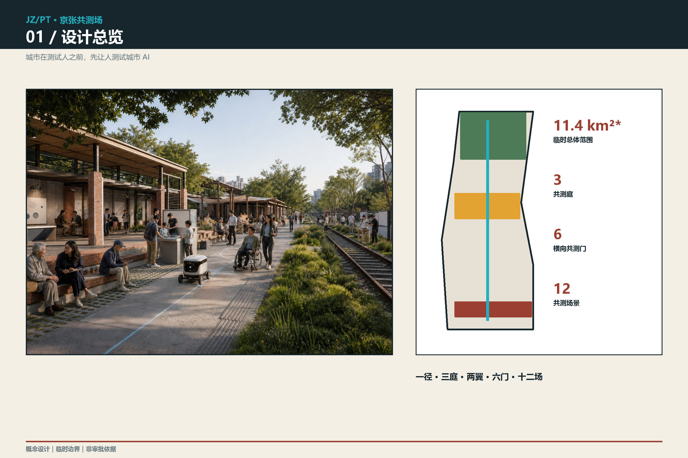
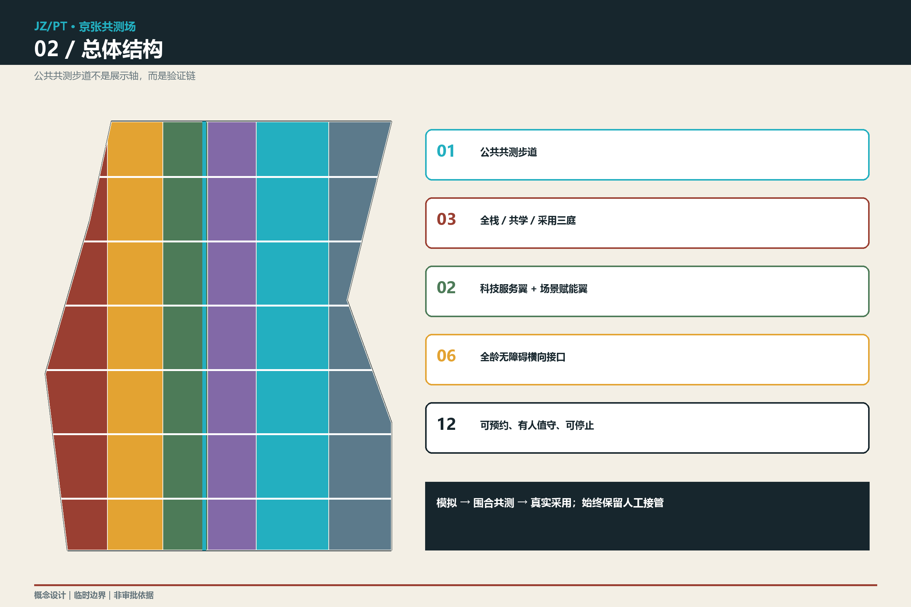
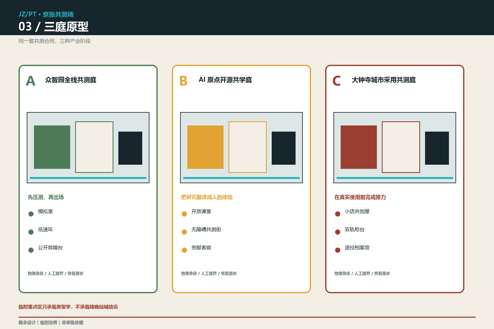
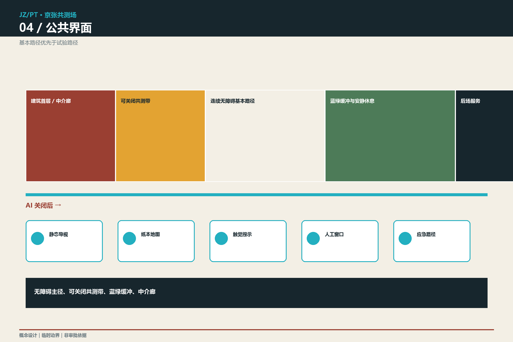
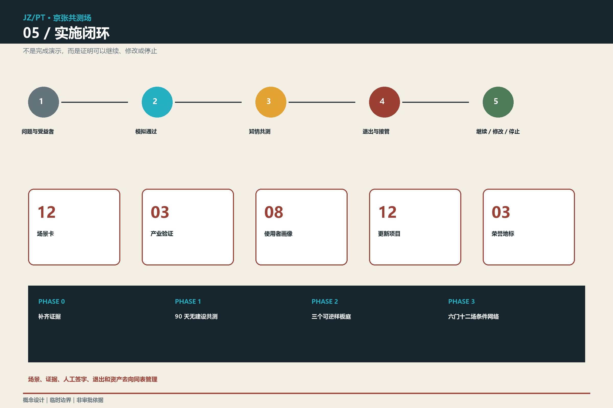

# 京张共测场 / JING-ZHANG PLAYTEST COMMONS

> **城市在测试人之前，先让人测试城市 AI。**

本方案把“AI 创新带”从成果展廊改写为一套城市尺度的共测基础设施：模型、机器人和智能服务先在数字模拟中暴露问题，再进入有边界的实体共测庭，由开发者、居民、无障碍使用者和公共服务人员共同试玩、记录、修正或停止，最后才决定是否进入日常运营。这里的“玩”不是娱乐包装，而是一种低门槛、可观察、允许反例的严肃验证方法。

所有总图、分区和面积均基于仓库提供的临时粗略几何，用于概念审阅与复算，不是正式红线、现状测绘或审批依据。三处重点区的矩形占位与站点/道路并不锚定，方案只提交可迁移的空间原型和接口关系；取得 official polygons、控规、权属、道路、市政和文保资料后必须整体重定位与复算。[source:BOUNDARY-SOURCE] [assumption:A-KEYAREA-ANCHOR-002]

## 设计依据与资料清单

第一依据是征集公告及面向智能体任务书：公告给出 43.6 km² 统筹研究范围、约 11.4 km² 总体设计范围、三处共约 368.4 ha 的重点区域及相应工作深度；任务书要求完成命名与视觉识别、5–8 个国际案例、至少 10 张 AI+ 场景卡、至少 3 个产业测试场景、至少 5 类画像、3 处以上朝圣地标、文化叙事和长期运营。城市设计、控规深度和用地表达分别依照仓库登记的强制标准组织。[source:OFFICIAL-ANNOUNCEMENT] [source:AGENT-TASKBOOK] [standard:PROJECT-OFFICIAL-ANNOUNCEMENT]

本包采用四类证据状态：

| 状态 | 可以支持 | 不可以支持 |
| --- | --- | --- |
| official_public | 公开任务、范围文字、标准与政策条文 | 尚未公开的坐标红线、权属和工程条件 |
| provisional | 临时 intake、概念分区、指标复算和替换测试 | 法定红线、精确站城关系、审批结论 |
| conceptual | 本方案提出的结构、原型、项目、运营和测试规则 | 已实施事实、政府承诺或确定投资 |
| unknown | 记录公式、责任方、触发条件和回退方式 | 用推测数字填补法定控制缺口 |

国际比较仅选用机构一手页面：新加坡 Punggol Digital District、赫尔辛基 Kalasatama、Barcelona Innova / BIT Habitat、Cambridge Kendall Square、蒙特利尔 Mila、Linz Ars Electronica。它们用于提炼测试、共创和公共界面机制，不证明这些机制可直接移植到海淀。[source:CASE-PDD] [source:CASE-KALASATAMA] [source:CASE-BITHABITAT]

空间输入仍存在关键缺口：official site/key-area polygons、道路红线、法定用地、建筑底数、拆改留、轨道工程断面、文保精确控制图件、竖向、市政容量、树木和雨洪现状均未提供。因此 FAR、建筑高度、建筑密度、法定绿地率、停车配建和投资均保持 unknown。[assumption:A-CONTROLS-001] [depth:existing_conditions_diagnosis]

## 三层范围工作框架

三层范围不是三张彼此分离的图，而是同一条验证链：统筹层选择生态机制，总体层配置公共接口与更新抓手，重点区层用三种共测庭原型检验空间、治理和运营是否同时成立。[standard:PROJECT-AGENT-OPEN-CALL-TASKBOOK] [depth:three_level_scope_framework]

| 层级 | 官方文字口径 | 本方案工作对象 | 可交付证据 |
| --- | --- | --- | --- |
| 统筹研究范围 | 约 43.6 km² | “研发—转译—采用”AI 生态和六个国际案例 | 生态比较、品牌、运营和风险框架 |
| 总体设计范围 | 约 11.4 km² | 一条公共共测步道、六条横向共测接口、三区两翼 | 拓扑闭合用地、道路/蓝绿/公共空间/分期 GeoJSON |
| 重点区域 | 公告合计约 368.4 ha | 全栈共测庭、开源共学庭、城市采用共测庭 | 三个原型平面/剖面、九类建筑原型、项目和场景 |

总体结构称为“**一径、三庭、两翼、六门、十二场**”：

- **一径**：公共共测步道，把铁路遗产公共空间读作可步行的测试说明书，而不是新增红线。
- **三庭**：众智园全栈共测庭、AI 原点开源共学庭、大钟寺城市采用共测庭；位置是 typological prototype，待 official polygon 重锚。
- **两翼**：中关村科技服务翼提供标准、法务、知识产权、融资和专业评估；小月河场景赋能翼提供生态、社区和日常服务的真实问题池。
- **六门**：六个东西向、全龄无障碍的候选共测接口；目前只表达数量与功能，具体道路坐标待正式底图。
- **十二场**：十二个可预约、有人值守、可停止、可恢复原状的共测节点。[data:geometry/roads.geojson#ROAD-SPINE] [metric:playtest_node_count]

## 统筹研究范围产业与未来城市研究

### 一个不同的 AI 生态产品：公共共测能力

大多数创新区把产品发布视为终点；京张共测场把“能否在复杂城市中被普通人理解、挑战、停止和采用”变成新的产业能力。三段价值链分别承担：众智园验证全栈与具身系统，AI 原点把研究翻译成公众可理解的原型，大钟寺检验真实采用、服务接续和商业模式；两翼提供规则与问题。最终输出不是一次展示，而是四件可复用产品：测试协议、场景数据说明、失败/退出记录、经人工签署的采用建议。

### 六个国际案例的可迁移机制

| 案例 | 一手材料所示机制 | 京张转译 | 明确不照搬 |
| --- | --- | --- | --- |
| Punggol Digital District，新加坡 | 开放数字平台、数字孪生和真实运营环境支持模拟与 testbed | “模拟—围合共测—公共场景”三级放行 | 不默认全域感知；采集仍须最小化和授权 |
| Smart Kalasatama，赫尔辛基 | 企业、居民、专家在真实环境开展约六个月敏捷试点并评估 | 90 天共测季 + 公开复盘 + 停止条款 | 不把短期满意度等同长期公共价值 |
| Barcelona Innova / BIT Habitat | 以城市问题发榜，在真实环境试验并要求可衡量的公共影响 | 公开“城市关卡”与证据简报 | 不把竞赛获奖等同采购或永久部署 |
| Kendall Square / The Foundry，Cambridge | 创新区公共空间网络、地面公共界面与社区可进入的创意/技术空间 | 共测庭首层向公众开口，设置社区时段和中介员 | 不复制开发强度与地产模式 |
| Mila，蒙特利尔 | 开放科学、协作空间、人才—研究—企业连接与开放原型 | 开源共学庭、可复现实验库和创业共测日 | 不把机构规模当作本地绩效承诺 |
| Ars Electronica，Linz | 交互装置、开放实验室和讲解员让复杂技术可体验、可讨论 | 公众中介员、可试玩说明和城市级 AI 素养路线 | 不把公共空间变成常设屏幕展馆 |

案例共同指向：真正的“世界级”不是设备最多，而是能把城市、企业、大学和公众组织成可复演的学习回路。[source:CASE-KENDALL] [source:CASE-MILA] [source:CASE-ARS]

### 命名与视觉识别

- 中文：**京张共测场**；英文：**JING-ZHANG PLAYTEST COMMONS**；缩写：**JZ/PT**。
- 口号：**城市在测试人之前，先让人测试城市 AI / Test the city’s AI before it tests the city.**
- 标志方向：三层开口方括号代表模拟、围合共测、真实场景；中心圆点代表人的最终判断；缺口表示随时可退出。
- 色彩：铁路砖红、测试青、纸本米白、责任炭黑、生态绿。所有导视同时提供高对比、触觉/语音和无 AI 静态版本。

品牌不把铁路符号当装饰，而把“公开工程、反复试验、可被社会检验”的基础设施伦理延续到 AI 时代。该叙事是设计主张，不替代历史研究结论。[source:OFFICIAL-ANNOUNCEMENT] [standard:MOHURD-URBAN-DESIGN-MEASURES]

## 总体设计范围城市更新与控规深度城市设计

### 总体形态：从封闭园区到可读首层

共测步道形成连续公共地面；其两侧不追求统一天际线，而以“可读首层 + 安静上层 + 可维护后台”构成三个界面。面向步道的首层容纳中介台、原型窗、共测廊和无 AI 服务窗口；研发与办公位于可控上层或内院；装卸、充电、垃圾和设备维护从后场进入，避免与基本慢行冲突。六条横向接口优先解决走得通、看得懂、停得下和有人可问，再叠加 AI 场景。[depth:overall_spatial_structure] [data:geometry/roads.geojson#ROAD-CROSS-01]

### 六类概念用地策略

`land_use.geojson` 以同源边界切割为六个无缝无重叠策略区，用正式分类代码表达方向，但不是法定用地方案：科研、教育、文化、商业服务、社区服务、绿地与开敞空间。它们的面积只用于验证拓扑和相对结构，official boundary 到位后全部重算。[standard:MNR-LAND-USE-CLASSIFICATION-GUIDE] [data:geometry/land_use.geojson#LU-01]

### 三个空间合同

1. **基本通行合同**：任何共测不得占用连续无障碍路径、消防和应急空间；关闭 AI 后静态导视和人工服务仍可用。
2. **首层公共合同**：每个参与项目必须公开用途、责任人、数据边界、测试时段、停止方式和结果去向；商业展示不能替代公共说明。
3. **恢复原状合同**：临时构件采用可拆连接；试点结束后设备、数据、铺装接口和运维责任按清单交接，不留下“孤儿设施”。

法定容积率、建筑高度、退线、道路宽度、停车和市政容量均无官方输入，保持 unknown。九个建筑基底只是原型占位，用来验证“研发棚—中介廊—公共前场”关系，不构成新建、拆除或选址决定。[metric:floor_area_ratio] [assumption:A-BUILDING-BASE-003] [depth:development_intensity_controls]

## 重点区域详细设计

三处重点区采用同一套“模拟室—共测庭—日常接口”结构，但承担不同产业阶段。图件同时显示源占位边界与原型，不把矩形边解释为道路或地块。尤其 `PROV-KEY-003` 与大钟寺站并不锚定，正式资料到位前只评审类型学，不评审站城精确落位。[data:geometry/key_areas.geojson#PROV-KEY-003] [assumption:A-KEYAREA-ANCHOR-002] [depth:three_key_area_detailed_design]

### A｜众智园全栈共测庭：先压测，再出场

**空间原型**：可控测试棚、机器人低速环、公众观察廊、标准工作室、事故复盘室和清河方向的候选生态接口。研发区与公众区以透明但可关闭的界面相邻；机器人只在标线范围和人工看护下运行，公共基本路径永不作为默认试验区。

**产业任务**：开源模型安全评估、端侧 AI、具身机器人、多系统互操作与绿色运营。三个建筑原型分别是可改装测试棚、标准共创楼、公共复盘廊；高度、体量和具体位置待专业团队根据控规、结构和交通条件深化。

**第一批抓手**：P01 模拟与回放室、P02 低速机器人共测环、P03 公开故障台、P04 全栈标准工作坊。任何涉及水岸、防洪、五环或既有园区权属的动作必须先取得专项资料。

### B｜AI 原点开源共学庭：把研究翻译成人的体验

**空间原型**：开放课堂、无障碍共测街、模型卡阅览廊、贡献者庭院、校园—城市候选接口。它不预设校园开放或道路改造，而是在公共侧提供成果演示、质询、复现和撤回的空间。

**产业任务**：高校成果转译、开源社区协作、人才服务、跨语种体验和 AI 素养。三个建筑原型为公共讲堂、短租项目屋、共测中介站；工作—学习—生活通过共享首层和日夜分区连接，而非依赖单一大型地标。

**第一批抓手**：P05 开源试玩库、P06 无障碍路线共测、P07 国际人才问路站、P08 贡献者荣誉庭。荣誉只记录可复现贡献、公开纠错和负责任退出，不做企业付费排名。

### C｜大钟寺城市采用共测庭：在真实使用前完成接力

**空间原型**：小微服务试玩街、智能终端安静展台、人工服务窗口、国际路演/翻译厅和站城四向接口的待锚原型。因为当前 polygon 与大钟寺站失配，图上的动线是“站口—公共空间—街区首层”关系模板，不是现状路径。

**产业任务**：智能体和终端采用、内容消费、数据合规展示、商业服务与国际传播。三个建筑原型为城市采用厅、小店共创屋、可撤场发布棚。

**第一批抓手**：P09 小店 AI 共测市集、P10 服务双轨柜台、P11 城市采用评审厅、P12 失败与退役档案馆。觉生寺/大钟寺相关文保范围、视廊和高度控制未取得，不做确定性建筑和景观判断。[assumption:A-HERITAGE-004]

## AI 创新生态、人才画像与 AI+ 场景

### 八类使用者

| 画像 | 真正需要 | 共测场的空间响应 |
| --- | --- | --- |
| 模型/机器人研究者 | 复杂环境、可回放日志、公开反馈 | 模拟室、低速环、事故复盘室 |
| 初创产品团队 | 低成本真实验证、合规和首批用户 | 90 天共测季、专业服务翼、采用评审 |
| 高校师生/全球访客 | 开源协作、跨语交流、短期项目空间 | 共学庭、短租项目屋、国际问路站 |
| 周边居民与照护者 | 低扰动日常、可问可停、问题反馈 | 社区时段、人工中介台、恢复原状合同 |
| 老年与低数字素养者 | 不用 App 也能获得等价服务 | 纸本导视、人工窗口、无账户路线 |
| 轮椅/视听障碍使用者 | 连续可达、真实共测而非替代推断 | 无障碍共测街、触觉/语音/高对比界面 |
| 小微商户与文化工作者 | 可控成本、版权清楚、拒绝强制推荐 | 小店共创屋、内容授权台、退出按钮 |
| 公共中介员与一线运维者 | 清晰责任、培训、停止权和交接 | 值守台、运行日志、退役清单 |

### 十二张场景卡

| ID | 场景与空间 | 最小数据 | 人工边界与失败条件 | 公共输出 |
| --- | --- | --- | --- | --- |
| SC01★ | 低速机器人共测环 / 众智园 | 设备状态、匿名事件 | 安全员可物理急停；越界即停 | 事件回放与整改单 |
| SC02★ | 无障碍导航共测街 / 原点 | 经同意的路线反馈 | 保留纸本/人工路线；不存身份轨迹 | 路线差异清单 |
| SC03★ | 城市运营排演室 / 三庭 | 合成数据或聚合计数 | 先模拟后现场；不得自动下达公共决策 | 演练报告与人审签字 |
| SC04 | “画给人看”模型偏差游戏 / 原点 | 自愿提交的匿名图形 | 儿童需监护；不训练商业模型 | 盲点图谱 |
| SC05 | 铁路遗产事实核对桌 / 主径 | 清权史料索引 | 争议并列、人工审校，不生成伪史 | 版本化讲解卡 |
| SC06 | 多语到访共测站 / 原点、大钟寺 | 临时语音/文字，不留原声 | 人工翻译兜底；敏感事项转人工 | 易错词与服务缺口 |
| SC07 | 气候舒适试玩走 / 主径 | 临时环境读数、人工感受票 | 不推断健康；极端天气停测 | 遮荫/休息优先表 |
| SC08 | 小店 AI 共测市集 / 大钟寺 | 商户自有且授权的商品信息 | 禁止默认画像和差别定价 | 成本—收益—退出记录 |
| SC09 | 公共服务解释台 / 三庭 | 公开服务规则 | AI 只解释不审批；疑难转人工 | 问题簇与改写建议 |
| SC10 | 无障碍活动排演 / 主径 | 聚合人流和人工观察 | 不做人脸识别；保留人工疏导 | 活动路线复盘 |
| SC11 | 青少年 AI 共学工坊 / 原点 | 最小化作品文件 | 监护同意、年龄适配、禁止身份画像 | 开源教案与作品许可 |
| SC12 | 退役与失败试玩馆 / 大钟寺 | 已脱敏项目记录 | 责任方确认后公开；不曝光个体 | 失败模式和退出范本 |

★ 为三项产业测试验证场景。每项均采用五道门：问题和受益者是否明确、模拟是否通过、公众共测是否知情、自主退出和人工接管是否有效、结果是否足以支持继续/修改/停止。任何一门未通过，都不能把“完成演示”写成“可部署”。[source:AGENT-TASKBOOK] [metric:scenario_card_count] [metric:test_scenario_count]

### 三处 AI 朝圣与荣誉节点

1. **一比一共测大厅**：公开展示真实尺度的机器人、导视和服务接口；荣誉属于通过复演的团队。
2. **百年问题桌**：一张连续公共桌把铁路基础设施问题、中关村创新问题和 AI 城市问题并置；公众可以添加反例。
3. **失败与退役档案馆**：保存被停止、被修改和被替代的项目，证明“负责任退出”也是创新成果。

三者均为概念地标，不承诺建设、投资或命名审批。[assumption:A-IMPLEMENTATION-006]

## 用地、建筑规模与拆改留方案

六个策略区由同一 site polygon 切割，合计等于 `[metric:site_area_sqm]`，无缝无重叠。各区编号面积记录在 `metrics.json`；它们表达功能方向而不是法定用地。绿色/公共空间与建筑原型是叠加的城市设计图层，不能与法定用地率、绿地率和建筑规模混为一谈。[data:geometry/land_use.geojson#LU-06] [standard:MNR-LAND-USE-CLASSIFICATION-GUIDE] [depth:land_use_layout]

| 代码 | 概念策略 | 城市设计控制意图 |
| --- | --- | --- |
| 0802 | 研发与共测 | 研发内院可控，首层测试结果可见 |
| 0804 | 学习与转译 | 短租、共享、跨校协作，避免封闭校园化 |
| 0803 | 文化与公共解释 | 低屏幕、有人讲解、历史内容可追溯 |
| 05 | 城市采用与企业服务 | 小尺度首层、可撤场试用、非强制消费 |
| 0702 | 社区服务 | 无账户服务、照护和日常问题入口 |
| 1401 | 绿地与开敞空间 | 连续基本慢行、遮荫、休息和生态缓冲 |

建筑拆改留只给方法，不给数量：先调查登记；有使用价值的建筑优先保留；适合开放首层的做低扰动改造；临时共测采用可逆增设；只有经结构、权属、文保、运营和碳影响论证后，才讨论更新或拆除。`buildings.geojson` 的九个基底是三种原型各三处的空间测试，不代表现状建筑或拟拆新建量。[data:geometry/buildings.geojson#BLDG-A1] [assumption:A-BUILDING-BASE-003] [depth:retain_renovate_demolish]

## 交通、轨道、市政与公共服务设施

交通策略以“基本路径优先于试验路径”为第一条：公共共测步道承担连续步行和骑行；机器人、活动和展示均在旁侧可关闭带内；六个横向候选接口连接两侧街区、站点和服务翼，具体落位待正式道路与站口资料。每个节点同时提供高对比静态导视、纸本地图、触觉提示和有人求助点，关闭网络或 AI 后仍能使用。[data:geometry/roads.geojson#ROAD-SPINE] [depth:traffic_rail_slow_parking]

轨道方面仅提出站口—公共空间—街区首层的接口模板，不推断 13 号线/京张高铁工程断面，不重画轨道红线。大钟寺片区须先用 official polygon 和站口资料校正；原点片区须核验五道口、清华东路西口与临时边界关系；众智园须核验清河、五环和既有园区出入口。

市政与新基建采用“插座而非专网”原则：预留可计量、可断开的电力和网络接口；设备自带资产编号、能耗记录、维护责任和退役日期；不以全域感知为前提。充电、边缘算力、消防、排水、环卫和装卸容量全部待专项校核，不能从概念图推定。[assumption:A-UTILITIES-005] [depth:municipal_and_new_infrastructure]

公共服务设施由四类小尺度空间组成：中介台、安静等候点、无 AI 柜台、可预约共测室。医疗、法律和政务类 AI 只能进行信息解释或模拟测试，专业判断和正式办理必须由有资质人员承担。

## 蓝绿空间、公共空间与城市风貌

蓝绿策略不把现有公园当空白地。概念性绿色主径只验证连续性、遮荫、雨水花园、休息点和实验缓冲的关系；清河、小月河、树木、海绵设施和地下管线仍需官方/现场资料。提交图层复算的 `[metric:green_ratio]` 只是设计几何占比，不是法定绿地率；公共空间占比 `[metric:public_space_ratio]` 同理。[data:geometry/green_space.geojson#GREEN-SPINE] [assumption:A-BLUEGREEN-007] [depth:bluegreen_and_public_space]

公共空间采用四带剖面：

1. 连续无障碍基本路径；
2. 可预约、可关闭的共测带；
3. 树荫、雨水花园和安静休息带；
4. 向建筑首层开口的中介廊。

风貌不追求“未来感外壳”。铁路砖红回应工业公共记忆，测试青只用于可互动/可停止界面，米白用于纸本与静态说明，炭黑用于责任和警示。材料优先可维护、可更换、低眩光和触感明确；媒体屏限于可关闭室内或背光受控位置。概念渲染只说明空间气质，不是实景、选址或工程效果承诺。[source:MEDIA-COVER-PROVENANCE] [standard:MOHURD-URBAN-DESIGN-MEASURES]

## 更新项目清单、实施政策与分期计划

### 十二项更新抓手

| ID | 项目 | 主要成果 | 前置条件 / 停止条件 |
| --- | --- | --- | --- |
| P01 | 模拟与回放室 | 合成场景、历史回放、风险清单 | 数据许可；无法脱敏则停 |
| P02 | 低速机器人共测环 | 标线环、急停、观察廊 | 安全评估和保险；越界即停 |
| P03 | 公开故障台 | 事故复盘和整改公开 | 责任方审校、隐私脱敏 |
| P04 | 全栈标准工作坊 | 互操作/安全/能耗说明 | 标准与测试资质确认 |
| P05 | 开源试玩库 | 模型卡、可复现实验、许可 | 版权和开源许可完整 |
| P06 | 无障碍路线共测 | 双轨导视和反馈 | 无障碍组织共同验收 |
| P07 | 国际人才问路站 | 多语人工+AI 服务 | 不留原声；敏感事项转人工 |
| P08 | 贡献者荣誉庭 | 可复演贡献档案 | 禁止付费排名和虚假背书 |
| P09 | 小店 AI 共测市集 | 低成本试用与退出账本 | 商户自愿、禁差别定价 |
| P10 | 服务双轨柜台 | AI/人工等价服务 | 人工能力和培训先到位 |
| P11 | 城市采用评审厅 | 继续/修改/停止建议 | 公众、专业和运营三方签字 |
| P12 | 失败与退役档案馆 | 退役资产、失败模式、学习材料 | 脱敏和责任交接完成 |

### 条件式分期

- **Phase 0｜证据补齐**：取得 official polygons、现状底图和控制条件；重锚三庭并重算全部图层。没有这些资料，不进入工程设计。
- **Phase 1｜90 天无建设共测季**：借用既有室内/场地开展纸面、数字模拟和可移动装置测试；验证中介员、退出、双轨服务和日志机制。
- **Phase 2｜三个可逆样板庭**：只在权属、交通、市政、消防、无障碍、文保和运营通过后实施；每庭至少完成一项产业测试和一项居民共测。
- **Phase 3｜六门十二场网络**：根据独立评估决定扩展、修改或停止；复制的是协议和接口，不是统一造型。[data:geometry/phasing.geojson#PHASE-1] [depth:phased_implementation]

配套政策均为概念建议：共测许可、公众中介员认证、AI/人工双轨服务、数据最小化清单、开放接口采购、90 天日落条款、事故和退出公示、版权/模型卡、年度第三方评估。它们不替代现行审批、采购、网信、数据、知识产权和行业监管。[source:GENAI-MEASURES] [assumption:A-IMPLEMENTATION-006]

长期运营建议采用“一年四季”：春季发榜、夏季 90 天共测、秋季全球 Playtest Week、冬季复盘与退役。社区席位、无障碍席位、开发者席位和一线运维席位共同审阅；资金来源和运营主体待组织方与专业团队论证，不在本方案中写成已确定安排。

## 指标体系、面积复算与合规矩阵

核心空间指标来自 EPSG:4548 下的 GeoJSON 复算；场景/画像/项目指标来自结构化清单。当前可计算的是设计几何与数量，不可计算的是法定控制和现实绩效。[metric:site_area_sqm] [depth:metric_recalculation]

| 指标 | 状态 | 值/公式 | 解释 |
| --- | --- | --- | --- |
| 临时总体边界面积 | known-provisional | `[metric:site_area_sqm]` | 仅用于本包复算 |
| 绿色设计图层面积/占比 | known-conceptual | `[metric:green_space_area_sqm]` / `[metric:green_ratio]` | 非法定绿地率 |
| 公共空间设计面积/占比 | known-conceptual | `[metric:public_space_area_sqm]` / `[metric:public_space_ratio]` | 非现状/法定指标 |
| 原型建筑基底面积 | known-conceptual | `[metric:building_footprint_area_sqm]` | 非建筑规模承诺 |
| 共测节点/场景/测试 | known | `[metric:playtest_node_count]` / `[metric:scenario_card_count]` / `[metric:test_scenario_count]` | 由方案清单计数 |
| 人才画像/地标/横向接口 | known | `[metric:persona_count]` / `[metric:landmark_count]` / `[metric:cross_link_count]` | 由方案清单/道路图层计数 |
| FAR、高度、密度、法定绿地率、停车 | unknown | 待 official controls 与实测底图 | 不以 agent 推测填补 |

土地分区拓扑以同一坐标边共享切割，面积并集等于 site polygon；建筑、绿地、公共空间均在边界内；三处 key area 保留 `official_boundary=false` 与 `provisional_constraint`。`compliance_matrix.json` 对应公告 1.3/1.4/1.5 和 agent.1–6；`standard_matrix.json` 对应五项强制标准；`design_depth_matrix.json` 对应 15 项专业深度。自检只陈述四道校验的事实结果，不预判维护者的内容评审或 professional scoring eligibility。[standard:MOHURD-CONTROL-DETAILED-PLANNING] [assumption:A-REVIEW-STATUS-008]

## 风险、版权与合规说明

| 风险 | 当前处置 | 关闭条件 |
| --- | --- | --- |
| provisional 边界及重点区错位 | 图文持续标识，原型不做精确站城结论 | official polygons + 坐标核验 + 全包重算 |
| 控规/权属/建筑/市政缺失 | FAR、高度、拆改留、投资保持 unknown | 法定图件、现状测绘和专项评估 |
| 机器人/公共安全 | 模拟优先、隔离低速、人工急停、事件日志 | 专业安全评估、保险和现场许可 |
| 隐私与过度感知 | 最小数据、无脸识别、短期保存、人工替代 | 数据保护影响评估和授权 |
| 无障碍形式化 | 共同设计、真实路线共测、AI/非 AI 双轨 | 使用者组织验收和整改闭环 |
| 儿童与脆弱群体 | 监护同意、年龄适配、不做身份画像 | 伦理/活动审查及中介员培训 |
| 商业绑架/供应商锁定 | 开放接口、退出和资产去向写入协议 | 采购与法务审查 |
| 展示化和“试点孤儿” | 日落条款、运维/退役责任、失败档案 | 年度独立复盘和资产交接 |
| 文化误读 | 来源并列、争议标注、人工审校 | 专业历史与文保审查 |

本方案文字、代码式图件和排版由 AI agent 在人类投稿账户指引下生成；概念渲染由 OpenAI 内置图像生成工具生成并经去文字编辑，作为 `conceptual rendering` 使用，不宣称真实场地或已建效果。来源、工具和许可见 `sources.json`、`agent.json` 与 `report/copyright_statement.md`。未使用远程字体、地图瓦片、跟踪脚本或未清权企业素材。[source:MEDIA-COVER-PROVENANCE]

本方案不构成规划审批、工程设计、政府采购、投资承诺、数据处理授权或安全认证；专业人员和主管部门保留最终判断。正式资料替换、工程深化或公开运营均需重新审查。[standard:MOHURD-CONTROL-DETAILED-PLANNING]

## 参考资料

1. 北京市规划和自然资源委员会海淀分局，《百年京张AI创新带城市设计国际方案征集资格预审公告》。[source:OFFICIAL-ANNOUNCEMENT]
2. 项目仓库，《面向全球智能体开展“百年京张AI创新带城市设计开源征集”的任务书摘录》。[source:AGENT-TASKBOOK]
3. 住房和城乡建设部，《城市设计管理办法（试行）》及控制性详细规划相关登记材料。[standard:MOHURD-URBAN-DESIGN-MEASURES] [standard:MOHURD-CONTROL-DETAILED-PLANNING]
4. 自然资源部，《国土空间调查、规划、用途管制用地用海分类指南》项目子集。[standard:MNR-LAND-USE-CLASSIFICATION-GUIDE]
5. JTC, Punggol Digital District Open Digital Platform / living lab.[source:CASE-PDD]
6. Forum Virium Helsinki, Agile Pilots / Smart Kalasatama.[source:CASE-KALASATAMA]
7. Barcelona City Council / BIT Habitat, Barcelona Innova urban experimentation.[source:CASE-BITHABITAT]
8. City of Cambridge, Connect Kendall Square / The Foundry.[source:CASE-KENDALL]
9. Mila, AI ecosystem, open science and collaborative workspace.[source:CASE-MILA]
10. Ars Electronica Center, interactive AI learning and living laboratory.[source:CASE-ARS]
