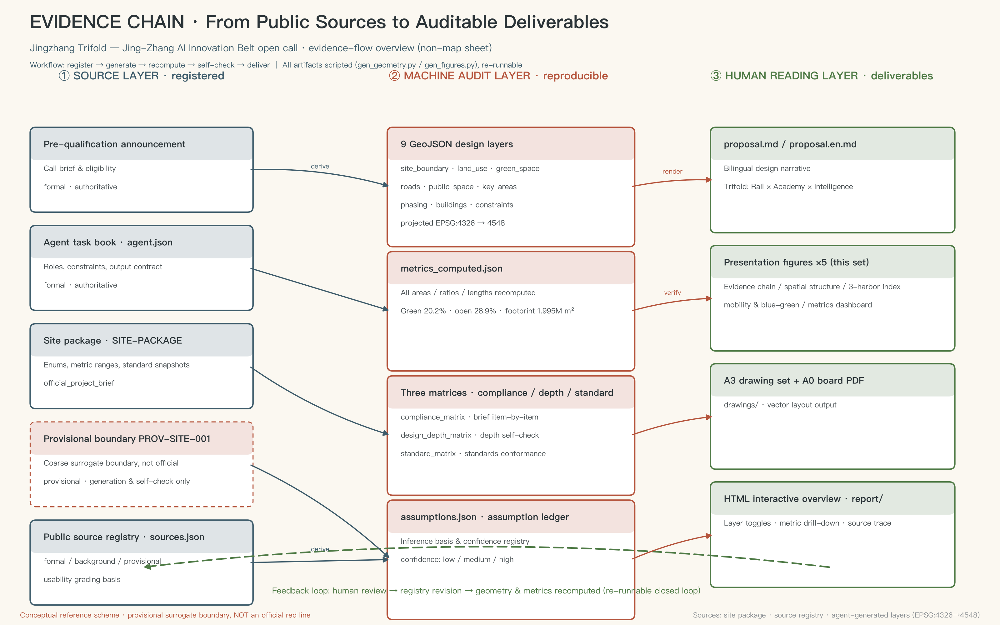
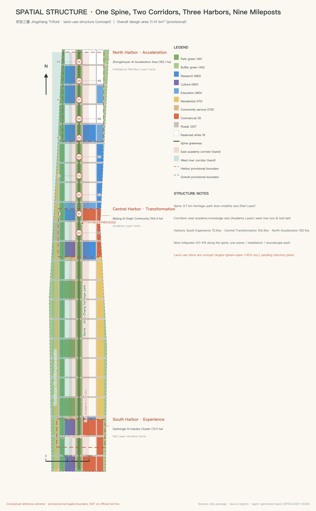
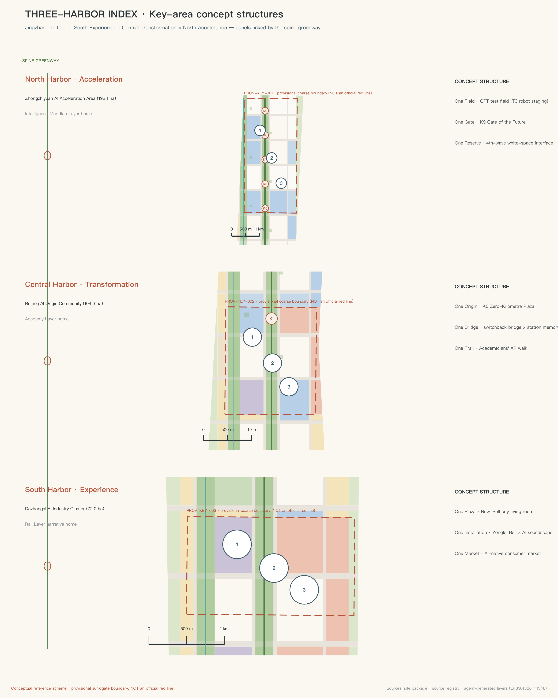
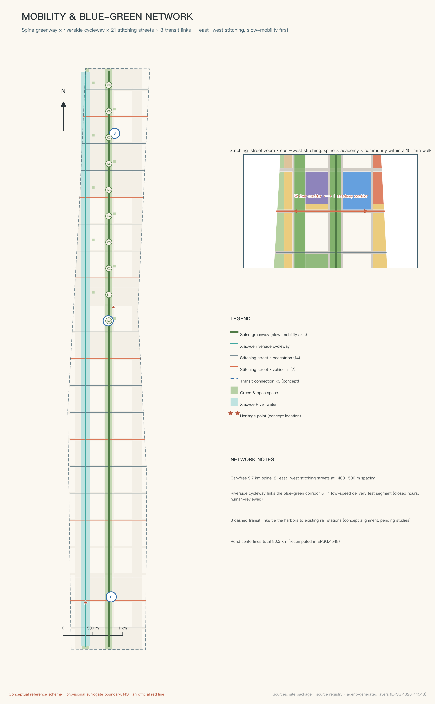
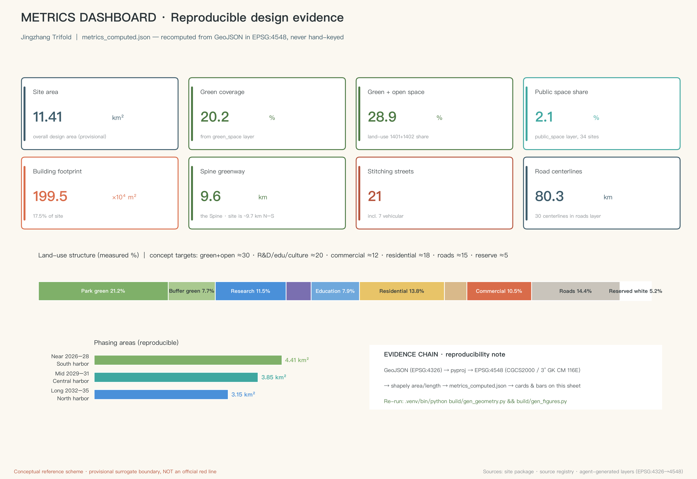

# Jingzhang Trifold: Rail · Academy · Intelligence Meridian — A Conceptual Urban Design Proposal for the Centennial Jing-Zhang AI Innovation Belt

**Concept overview**: In 1909, the first railway designed and built by Chinese engineers departed from here; in 1952, the young republic built the "Eight Colleges" along Xueyuan Road to the east; today, artificial intelligence is clustering here. This proposal argues that these are not three collaged pieces of history, but three occurrences of the same thing — **this corridor has three times served as the national launch site for "General Purpose Technology" (GPT) infrastructure**. The Rail Layer moved people and goods, the Academy Layer nurtured people and ideas, and the Intelligence Meridian Layer computes data and intelligence. Jingzhang Trifold overlays these three "first launches" into a walkable, readable, and continuously growing urban innovation belt. (Note on naming: "Jingzhang Trifold" is retained as a brand proper noun; in project and railway compound names, the official terminology renders 京张 as "Jing-Zhang" with a hyphen.) All spatial recommendations in this proposal are conceptual recommendations and reference schemes; they may be further developed by professional teams, do not replace statutory planning, and do not constitute any government-approved conclusion.

## Design Basis and Source List

The primary basis of this proposal is the pre-qualification announcement issued by the Haidian Branch of the Beijing Municipal Commission of Planning and Natural Resources, which defines the project name, the three-level scope, the three key areas, and the design tasks [source:OFFICIAL-ANNOUNCEMENT]. The agent-oriented taskbook defines the ten co-creation charter articles, six agent tasks, and unified boundary clauses; the concept, scenarios, branding, and operations content of this proposal are all developed within its framework [source:AGENT-TASKBOOK]. The site information package provides the enumerations, metric ranges, standard snapshots, and provisional boundary that form the generative basis for all machine-readable deliverables [source:SITE-PACKAGE].

The use of sources strictly follows the usage grading of the public source registry: formal judgments cite only materials whose usable_for_formal flag is "yes"; background materials are used solely for contextual understanding; provisional boundary materials are used only for generation, visualization, and discussion [source:SOURCE-REGISTRY]. Processed materials in the reading-navigation layer are used only to organize reasoning; all factual judgments return to the original registered sources [source:PROCESSED-FACT-PACK].

It must be stated honestly: as of this submission, the organizer has not released the official precise boundary or key-area polygons. The site boundary and the three key areas in this proposal all adopt the **Provisional Boundary** registered in the repository. It is used only for AI generation, visualization, and local self-checking, and must not be interpreted as an official planning boundary, a basis for approval, or a basis for precise area figures; once the official polygons are published, land use, buildings, roads, green space, public space, phasing, and all area metrics must be recalculated. This organizer data gap does not block content scoring [data:geometry/site_boundary.geojson#PROV-SITE-001].

The machine-audit layer of this proposal is fully preserved in `sources.json`, `metrics.json`, `compliance_matrix.json`, `standard_matrix.json`, `design_depth_matrix.json`, and `geometry/*.geojson`; the main text annotates only one to three pieces of direct evidence beside key judgments. Any area or ratio can be recalculated from the submitted GeoJSON under the EPSG:4548 projection [metric:site_area_sqm].

## Three-Level Scope Framework

The three scope levels correspond to three depths of work, and also to the three observation scales of the "Trifold" concept [depth:three_level_scope_framework].

**Coordinated Research Area (approx. 43.6 sq km)**: bounded by the North Fifth Ring Road to the north, the Beijing–Tibet (Jingzang) Expressway to the east, Xizhimen Outer Street to the south, and Wanquanhe Road to the west. At this level, the proposal answers "why here": the overlay of the Rail Layer, the Academy Layer, and the Intelligence Meridian Layer holds true at the regional scale — the Xueyuan Road university cluster, the Zhongguancun Science City hinterland, and the Qinghe–Jingzang Expressway corridor together form an innovation collaboration network, and this belt is its north–south historical-innovation main axis. This level covers only industrial strategy, regional coordination, and future-city research; it draws no spatial siting conclusions.

**Overall Design Area (approx. 11.4 sq km)**: the urban districts and industrial zones within roughly 1–2 km around the Jing-Zhang Railway Heritage Park. This level reaches the urban-design depth of Regulatory Detailed Planning; it is where the spatial structure of "One Spine, Two Corridors, Three Harbors, Nine Mileposts" is sited, and it is the effective range of the land-use, building, transport, blue-green, and phasing layers [data:geometry/land_use.geojson#LU-001].

**Key-Area Detailed Design Area (approx. 368.4 hectares)**: from north to south, the Zhongzhiyuan AI Independent Innovation Acceleration Area, the Beijing AI Origin Community, and the Dazhongsi AI Industry Cluster, each reaching the depth of an Integrated Planning Implementation Plan; this proposal names them the "North Harbor, Central Harbor, and South Harbor" [data:geometry/key_areas.geojson#PROV-KEY-001].

The usage limits of the provisional boundary are explicitly declared here: the three key-area polygons are coarse rectangles, and rectangle edges must not be interpreted as parcel lines or road planning boundaries; the internal structural designs of the three harbors in this proposal are directional expressions only, and must be comprehensively reviewed once official data is supplied [metric:key_area_count].

## Coordinated Research Area: Industry and Future City Research

**Why here: the factual chain of the Trifold.** In 1909 the Beijing–Zhangjiakou Railway opened; Zhan Tianyou (Jeme Tien-yow) solved the gradient problem at the Qinglongqiao section with a herringbone switchback alignment — this was the first trunk railway designed and built by Chinese engineers, and it moved people and goods. In 1952 the nationwide reorganization of university departments built the "Eight Colleges" along Xueyuan Road; together with the Chinese Academy of Sciences institutes in Zhongguancun, this area became the knowledge base of the republic's "saving the nation through science," and it moved people and ideas. Entering the third decade of the twenty-first century, the Dazhongsi–Zhichun Road–Wudaokou line has gathered the densest cluster of AI companies in China, and this corridor now computes data and intelligence. Three "first launches" happened along the same corridor — this is no coincidence, but the superposition of location, talent, and the demands of the era. Economics calls foundations that "every industry must plug into" — the steam engine, electricity, the computer — General Purpose Technologies (GPT); artificial intelligence is the GPT of this era. Hence the core judgment of this proposal: **the Jing-Zhang Innovation Belt is not just another AI industry park belt, but a memorial and proving ground for three national first launches of general-purpose infrastructure — the Intelligence Meridian Layer is built for AI, yet must reserve interfaces for the next general-purpose technology after AI**.

**Naming system and logo direction (agent.1).** The primary name is "京张三叠" (Jingzhang Trifold). The character "叠" carries three meanings at once: geological strata, folding, and overwriting; "Trifold" also hints at a three-fold leaflet and a triple view. The naming system unfolds accordingly: Rail Layer, Academy Layer, Intelligence Meridian Layer; One Spine, Two Corridors, Three Harbors, Nine Mileposts. Logo direction: three lines of different textures (the straight line of a steel rail, the folded line of a book page, the pulse line of data) converge at a single herringbone node; the mark can be used independently as three monochrome layer versions or overprinted as the complete identity. The suggested color system is rail blue-gray, academy brick red, and meridian warm white. All identity typefaces and graphics must be originally drawn or confirmed as licensed; no unauthorized typefaces, trademarks, or personal portraits are used.

**The Three Zones and Two Wings coordination loop.** The three positionings (the Centennial Jing-Zhang cultural belt, the urban AI life experience belt, and the AI-integrated innovation belt) and five functions operate in a closed loop across the "Three Harbors and Two Wings": the North Harbor (Zhongzhiyuan) carries the Full-Stack Independent AI Innovation System and AI governance voice; the Central Harbor (the AI Origin Community) carries a world-class AI innovation ecosystem; the South Harbor (Dazhongsi) carries AI-native new business formats and scenario consumption; the Zhongguancun Technology Services Wing provides factor allocation and capital empowerment; the Xiaoyue River Scenario Enablement Wing provides open testing and public experience. The loop logic is: original innovation (North Harbor) → scenario testing (West Wing) → ecosystem conversion (Central Harbor) → capital services (East Wing) → consumption feedback (South Harbor) → feedback into R&D [standard:PROJECT-AGENT-OPEN-CALL-TASKBOOK].

**Global case references (agent.2, six cases).** Kendall Square in Boston proves that "industry growing next to a university" requires walkable mixed-use blocks rather than closed campuses; London's King's Cross Knowledge Quarter proves that railway heritage can be stitched together with knowledge industries into an urban living room; Cornell Tech on Roosevelt Island in New York proves that a "small-island testing ground" mechanism lets new technologies enter the city at low risk; the High Tech Campus Eindhoven in the Netherlands proves that shared experimental facilities retain deep-tech teams better than rent discounts; the long-term lesson of Silicon Valley and Stanford is that "a culture tolerant of failure matters more than any single building"; and New York's High Line proves that making industrial heritage public can feed back into the communities along it rather than merely serving tourists. These six lessons are converted into the spatial mechanisms of this proposal: mixed land-use ratios, the publicization of the heritage main spine, reserved blank-slate testing land, shared testing facilities, open-source community operations, and a public art mechanism [depth:existing_conditions_diagnosis].

**Future-city judgment.** Urban competition in the AI era is not about total computing power, but about the circulation speed of "technology–scenario–people." This proposal designs the entire belt as a measurable, stoppable, and reversible open testing system: every testing scenario has explicit human review and exit mechanisms, and every spatial recommendation can be developed, modified, or rejected by professional teams [source:AGENT-TASKBOOK].

## Overall Design Area: Urban Renewal and Regulatory-Plan-Level Urban Design

**Spatial structure: One Spine, Two Corridors, Three Harbors, Nine Mileposts** [depth:overall_spatial_structure].

- **One Spine**: the main spine of the Jing-Zhang Railway Heritage Park, a north–south slow-mobility greenway with a centerline of approx. 9.6 km that is the physical carrier of the Rail Layer and the public-life main axis of the whole belt [data:geometry/green_space.geojson#GS-001].
- **Two Corridors**: to the east, the Xueyuan Road learning-vein corridor, renewing research and education functions along its length and telling the story of "the scholars"; to the west, the Xiaoyue River blue-green corridor, restoring waterfront ecology and serving as a low-risk scenario testing belt [data:geometry/green_space.geojson#GS-002].
- **Three Harbors**: the South Harbor at Dazhongsi (experience), the Central Harbor at the AI Origin Community (conversion), and the North Harbor at Zhongzhiyuan (acceleration), corresponding respectively to the narrative home grounds of the Rail, Academy, and Intelligence Meridian layers.
- **Nine Mileposts**: ten milepost nodes K0–K9 (including the origin K0) arranged along the main spine; each node is one scenario, one piece of public art, and one soundscape, turning a walk of roughly ten kilometres into a century of history that can be read on foot [data:geometry/public_space.geojson#PS-001].

**Renewal framework.** The Overall Design Area is dominated by retention and micro-renewal: existing communities, universities, and research compounds are retained in principle; renewal focuses on inefficient land along the railway corridor, the broken slow-mobility system, and park boundaries that lack publicness. The conceptual recommendation for functional ratios is: green and open space approx. 29%, research/education/culture approx. 24%, residential approx. 18%, roads approx. 14%, commercial approx. 10%, and reserved blank land approx. 5%; all ratios are computed from the submitted land-use layer under EPSG:4548 — see the metrics chapter for details [metric:green_ratio].

**Demolish–Renovate–Retain logic (directional).** Retain: all existing communities, universities, research buildings, and heritage sites; renovate: inefficient factory buildings along the corridors and park boundary spaces; build new: a small number of landmark public buildings and testing facilities inside the three harbors; leave blank: the North Harbor reserves interface land for the "fourth wave." All statutory control indicators such as Floor Area Ratio (FAR), building height, and building coverage ratio are uniformly recorded as pending official data until official Regulatory Detailed Planning conditions are supplied; this proposal gives no statutory planning conclusions [depth:development_intensity_controls].

**Municipal capacity.** At the conceptual level, an "Intelligence Meridian utility corridor" is proposed: combined with the slow-mobility main spine, a composite conduit interface for computing power, data, and energy is reserved; edge computing nodes and distributed energy stations are conceptually sited at the three harbors. Specific capacities, loads, and engineering feasibility all require in-depth calculation by professional teams; this proposal draws no engineering conclusions [depth:municipal_new_infrastructure].

## Detailed Design of Key Areas

The three key areas are the three narrative home grounds of the "Trifold"; each is developed along the sequence "positioning + spatial structure + building renewal + transport and slow mobility + public space + AI scenarios + implementation risk" [depth:three_key_area_detailed_design].

**South Harbor · Dazhongsi AI Industry Cluster (approx. 72.0 ha) — the Rail Layer narrative home ground, the "departure hall" of the whole belt** [data:geometry/key_areas.geojson#PROV-KEY-003]. Positioning: a living room where a century of memory overlaps with AI-native consumption. The spatial structure is organized as "one square, one installation, one market": the South Harbor urban living room square connects to the Dazhongsi metro hub; the "New Bell" light-and-sound installation lets the six-hundred-year-old Yongle Great Bell's voiceprint converse with an AI-generated urban soundscape, becoming the auditory landmark of the whole belt; the open-source market and the unmanned-retail test street form an AI-native consumption scenario band. Building renewal is dominated by conversion of existing commercial and office buildings, with a small number of new cultural facilities. AI scenarios: the open-source market, the silver-hair digital station, and the southern route of the memory-collection vehicle. Implementation risk: commercial property rights are complex, so renewal should proceed mainly through negotiated micro-renewal, avoiding any assumption of large-scale demolition; the key-area boundary is a coarse provisional range, and the internal structure is a directional expression only.

**Central Harbor · Beijing AI Origin Community (approx. 104.3 ha) — the Academy Layer narrative home ground, the "Kilometer Zero" of the whole belt** [data:geometry/key_areas.geojson#PROV-KEY-002]. Positioning: the hub where knowledge is converted into ecosystem, the "origin" of Chinese AI. The spatial structure is organized as "one origin, one bridge, one trail": the K0 Kilometer-Zero Origin Square overprints the railway's mileage starting point and the AI Origin concept into a single memorial space; the Herringbone Switchback Bridge takes Zhan Tianyou's switchback wisdom as its prototype, spatially stitching the two sides of the main spine and narratively metaphorizing that "wherever technology switches back, there lies human wisdom"; the Academician Trail uses AR guidance to tell the stories of the Eight Colleges and Zhongguancun scientists. Building renewal is dominated by mixed conversion of research offices and incubators, paired with talent apartments. AI scenarios: the Crossing Coffee developers' living room, platform morning reading, and the Academician Trail AR guide. Implementation risk: the Origin Community involves multi-party property rights and existing park operations; the conceptual recommendations must be developed in consultation with the operators.

**North Harbor · Zhongzhiyuan AI Independent Innovation Acceleration Area (approx. 192.1 ha) — the Intelligence Meridian Layer narrative home ground, the "acceleration harbor" facing the future** [data:geometry/key_areas.geojson#PROV-KEY-001]. Positioning: the spatial carrier of the Full-Stack Independent AI Innovation System, and the reserved interface for the next general-purpose technology. The spatial structure is organized as "one field, one gate, one blank": the Intelligence Meridian test field is a reconfigurable open testing unit carrying industrial testing scenarios such as robot staging and edge-computing pilots; the K9 Gate of the Future is the closing landmark at the northern end of the belt, facing the direction of future expansion beyond the Fifth Ring Road; approx. 5% of blank land is reserved for the general-purpose technologies "after AI" — embodied intelligence, synthetic biology, quantum computing — whose first occupants are not yet knowable, so the spatial mechanisms (reconfigurable sites, open scenario interfaces, computing-power access) must be reserved for them. Implementation risk: the northern section is close to the Fifth Ring Road, and construction conditions and ecological constraints require professional verification; the activation rules for the blank land should be defined by the governance mechanism to avoid expectations of disorderly development.

## AI Innovation Ecosystem, Personas, and AI+ Scenarios

**Design stance: AI stays behind the scenes; people stand in front.** All scenarios in this proposal follow the same principle — what ordinary people feel is not "artificial intelligence" but lights that are on, guides they can understand, and stories that are remembered; technology is perceptible but never intrusive, and every scenario has explicit data boundaries, human review, and exit mechanisms [standard:GENERATIVE-AI-INTERIM-MEASURES].

**Six user personas (agent.3).** ① Long-time residents: guardians of site memory, who need to be remembered and cared for rather than disturbed by technology; ② university students: masters of the Academy Layer, who need low-cost spaces for study, exchange, and presentation; ③ AI researchers and developers: who need face-to-face community, trial-and-error scenarios, and accessible computing power; ④ international entrepreneurs: who need one-stop landing services and a cross-cultural urban interface; ⑤ families with children and visitors: who need safe, fun, and educational public experiences; ⑥ late-night commuters: who need a lit, humane way home.

**Ten AI scenario cards.** Each card specifies spatial location, target users, data and privacy boundaries, human review, and operating entity; all are conceptual recommendations, and testing-type scenarios additionally carry stoppable mechanisms:

| No. | Scenario | Location | Target users | Data and privacy boundary | Human review and operations |
|---|---|---|---|---|---|
| S1 | Platform Morning Reading: AI-companion self-study pavilion | K1 and Platform Park | Students | No facial capture; local voice interaction only | Daily operator checks; manual content spot-checks |
| S2 | Academician Trail AR guide | Learning-vein corridor | Visitors/students | Public historical materials; positioning processed on-device only | Narration content professionally reviewed |
| S3 | Crossing Coffee · Developers' Living Room | Central Harbor | Developers | Minimal information for event registration | Community self-governance + operator co-management |
| S4 | Night-Walk Guardian lighting | Entire main spine | Late-returners/residents | No facial recognition; crowd-density sensing only | Anomalous events confirmed manually before response |
| S5 | Memory-Collection Vehicle | Rotating through the three harbors | Long-time residents | Oral histories archived only with the narrator's authorization | Each archive manually compiled and confirmed |
| S6 | Silver-Hair Digital Station | South Harbor + communities | Older adults | Manual service windows and on-site guidance retained for high-frequency matters [standard:BARRIER-FREE-ENVIRONMENT-LAW] | Operated by volunteers + social workers |
| S7 | Open-Air Algorithm Cinema | K4 Platform Park | Citizens | Public screenings; no personal data | Content manually curated |
| S8 | Open-Source Market | South Harbor | Makers/citizens | Transaction data per platform rules | Operated by a market committee |
| S9 | Rail Concerts | K6 / Herringbone Bridge | Citizens | Performance data made public | Curator responsibility system |
| S10 | Accessible Tactile Soundscape | Entire main spine | Visually impaired and others | Tactile/auditory interaction; no image capture | Accessibility organizations join evaluation |

**Three AI industry testing and validation scenarios (conceptual testing in nature; all stoppable and reversible).** T1 Low-speed unmanned delivery test section: a time-windowed testing zone is designated in the Xiaoyue River blue-green corridor to serve the delivery needs of nearby communities, with public testing rules and accident-handling procedures; T2 AI music-generation public test field: using the Rail Concerts as the carrier, it tests public-performance and copyright-compliance processes for open-source music models, with every track labeled for generation method and licensing status; T3 urban service robot staging unit: at the North Harbor Intelligence Meridian test field, a "stage first, then go live" testing unit is set up — service robots must pass safety assessment and public notice before entering open areas, and records of errors and accidents are made public. None of the three constitutes approved operation; they are only testing-mechanism recommendations available for professional teams to develop [depth:overall_spatial_structure].

**Overall boundary of privacy and human review.** No facial recognition is deployed in any scenario across the belt; personal data is processed on-device by default; every testing scenario must publish its data flows, responsible entities, and exit methods; for scenarios involving the provision of generative AI services to the public within the territory, compliance obligations are performed by the operating entities under current regulations, and this proposal draws no compliance determination conclusions [source:AGENT-TASKBOOK].

## Land Use, Building Scale, and Retain-Renovate-Demolish Strategy

**Land-use layout.** The land-use layer completely divides the site within the provisional boundary into seamless, non-overlapping conceptual zones; all areas can be recalculated under EPSG:4548 [data:geometry/land_use.geojson#LU-001]. Conceptual balance sheet (computed): green and open space approx. 28.9% (park green space and protective green space), research/education/culture combined approx. 23.5%, residential approx. 17.5%, roads approx. 14.4%, commercial approx. 10.5%, reserved blank land approx. 5.2%. Land-use codes follow the classification logic of the national territorial-space land and sea use classification guide; no self-invented categories are used [standard:MNR-LAND-USE-CLASSIFICATION-GUIDE].

**Building scale (conceptual quantities, low confidence).** The building layer places 784 conceptual building footprints, totaling approx. 1.995 million sq m of footprint area, with an overall footprint ratio of approx. 17.5%; of these, 121 are retained existing buildings, 104 are adaptive-reuse conversions, and 416 are conceptual new buildings (some parcels are combined expressions). These figures are design quantities computed from the conceptual geometry submitted with this proposal; they express spatial intent and **do not equal statutory building scale**; gross floor area, Floor Area Ratio (FAR), building height, and coverage ratio are uniformly recorded as pending official data until official Regulatory Detailed Planning conditions are supplied [metric:building_footprint_area_sqm].

**Demolish–Renovate–Retain classification.** Retain class: existing communities, universities, research buildings, and heritage sites — untouched in principle; renovate class: inefficient spaces along the corridors and park boundaries — mainly functional replacement and interface opening; new-build class: a small number of public buildings and testing facilities inside the three harbors — all falling within conceptual parcels; blank class: the North Harbor interface land, whose function is deliberately undefined for now. The classification results are written into the retention_class attribute of the building layer for item-by-item review by professional teams [depth:retain_renovate_demolish].

**Items pending confirmation.** Regulatory Detailed Planning conditions, the existing-building ledger, property-rights information, and engineering conditions have not been obtained as official documents; the above classifications are directional recommendations only, and any retain-renovate-demolish conclusion for a specific parcel must be determined by professional institutions through statutory procedures [depth:risk_missing_data].

## Transport, Rail, Municipal Infrastructure, and Public Services

**A slow-mobility-first belt skeleton.** The main-spine slow-mobility greenway runs the full approx. 9.6 km of the belt, linking all K0–K9 milepost nodes; twenty-one "stitching streets" cross the corridor east–west at approx. 500 m intervals, repairing the urban rupture caused by a century of railway — seven of them double as secondary vehicular roads, and the rest are pure slow-mobility streets [data:geometry/roads.geojson#RD-001]. The Xiaoyue River waterfront cycling path forms the second north–south slow-mobility line on the west side [data:geometry/roads.geojson#RD-002].

**Rail transit connections.** Each of the three harbors is assigned one rail-connection corridor (conceptual alignment), linking to existing stations in the Dazhongsi, Wudaokou–Qinghua East Road West, and Qinghe directions; specific alignments, transit-station integration schemes, and engineering feasibility all await professional development, and this proposal draws no rail engineering conclusions [depth:traffic_rail_slow_parking].

**Parking and micro-circulation.** Conceptual recommendation: vehicle arrival and parking are organized at the periphery of the three harbors, with slow mobility prioritized within 200 m on both sides of the main spine; the existing local-road network is micro-circulation-optimized into one-way pairing and time-limited sharing — directional recommendations only.

**Integration of municipal and new infrastructure.** The "Intelligence Meridian utility corridor" is a conceptual proposition: composite interfaces for computing power, data, and distributed energy are reserved along the main spine; edge computing nodes are placed in conjunction with the K-milepost squares; waste-heat recovery prioritizes winter heating of public spaces (conceptual proposition; loads and feasibility pending calculation). Traditional municipal systems (water supply and drainage, electricity, gas, sanitation) are upgraded in step with the stitching-street renovations to urban renewal standards; no engineering conclusions are drawn [depth:municipal_new_infrastructure].

**Public services.** Conceptual configuration: one community service center per harbor (co-located with a silver-hair digital station) and one rest post per milepost node (toilets, drinking water, emergency supplies); existing education and medical facilities are checked against service radii to produce gap-filling recommendations, with specific siting pending official data [depth:land_use_layout].

## Blue-Green Network, Public Space, and Urban Character

**Blue-green skeleton.** The main-spine park belt (a continuous green corridor approx. 120 m wide) and the Xiaoyue River blue-green corridor form a "one vertical, one horizontal" blue-green skeleton; overlaid with ten K-node pocket parks and twenty-one platform-park street-side squares, they form a three-tier public-space system of "avenue–park–square" [data:geometry/public_space.geojson#PS-014]. The standalone green-space layer computes a coverage of approx. 20.2%, while green and open space under the land-balance caliber is approx. 28.9%; both calibers are disclosed in the metrics chapter [metric:green_ratio].

**AI pilgrimage landmarks (agent.4, four).** ① Kilometer-Zero Origin Square (K0, Central Harbor): the overprinted memorial of the railway mileage origin and the AI Origin, with paving scored using the 1,435 mm standard gauge as its prototype; ② the Herringbone Switchback Bridge and the Qinghuayuan Old Station Memory Hall (near K2): a pedestrian bridge spatially prototyped on the herringbone switchback, with a memory hall beneath displaying the old station's oral histories and railway relics (sleepers and spikes redesigned as street furniture); ③ the "New Bell" light-and-sound installation (South Harbor): a real-time dialogue between the Yongle Great Bell's voiceprint and the AI urban soundscape, the core of the belt's auditory identity system; ④ the K9 Gate of the Future (northern end of the North Harbor): a closing landmark facing the future, signaling "the next corridor" northward with light pulses at night. All four landmarks are conceptual recommendations; they must be original rights-cleared designs, no engineering feasibility conclusions are drawn, and over-entertainment is avoided [depth:blue_green_public_space].

**Honors display system.** A "Trifold Walk of Fame" is proposed: the Rail Layer commemorates the railway builders (Zhan Tianyou and the nameless laborers), the Academy Layer commemorates the scholars (the Eight Colleges and Zhongguancun scientists), and the Intelligence Meridian Layer establishes an "Open-Source Contributor of the Year" plaque — honors in the AI era belong not only to star entrepreneurs, but also to ordinary people who write code, do annotation, and join testing. The display carrier is a system of plaques embedded in the main-spine paving; all persons and content must pass authorization and historical-fact review.

**Public-space component library and wayfinding.** The component library contains five standard types: milepost markers (K series), platform-canopy pavilions, sleeper benches, soundscape installations, and accessible tactile soundscape modules; the wayfinding system is based on the visual language of railway station signs, bilingual in Chinese and English, with auditory signals (modern reinterpretations of bell chimes and short whistle tones). The cultural identity system and the belt logo system are managed in separate layers and never mixed [standard:MOHURD-URBAN-DESIGN-MEASURES].

**Urban character.** The overall keynote is "restrained monumentality": buildings along the main spine are small-to-medium in massing, with brick red and blue-gray as dominant colors, echoing the material memory of the Rail and Academy layers; new buildings of the Intelligence Meridian Layer are allowed more contemporary expression, but all height and massing control indicators are pending confirmation of Regulatory Detailed Planning conditions [depth:height_massing_character].

## Renewal Projects, Implementation Policy, and Phasing

**Renewal project list (conceptual projects, all recommendations).** ① Main-spine slow-mobility greenway connection works; ② the twenty-one stitching-street repair series; ③ the K0–K9 milepost node construction series; ④ Xiaoyue River blue-green corridor ecological restoration; ⑤ three-harbor urban living rooms and industry-community renovation; ⑥ the Herringbone Switchback Bridge and Memory Hall; ⑦ the New Bell light-and-sound installation and auditory identity system; ⑧ the Intelligence Meridian test field and blank-land interface mechanism; ⑨ the memory-collection and community archive program; ⑩ the component library and wayfinding system. The locations, dependencies, and suggested implementing entities of each project correspond to the phasing layer and the compliance matrix [depth:renewal_project_list].

**Phasing plan.** Near term (2026–2028): the South Harbor launches — the New Bell installation, the open-source market, the southern memory-collection route, the southern section of the main-spine greenway, and the K0 square; medium term (2029–2031): the Central Harbor takes shape — the Herringbone Switchback Bridge, the Academician Trail, learning-vein corridor renewal, and the developer-community mechanism; long term (2032–2035): the North Harbor unfolds — the Intelligence Meridian test field, the K9 Gate of the Future, and the establishment of blank-land interface rules [data:geometry/phasing.geojson#PH-phase_1_near].

**Implementation policy recommendations (all conceptual recommendations).** A community co-governance mechanism forms a "Friends of the Trifold" modeled on the High Line's "Friends" model; activation of blank land must pass public review; testing scenarios follow a four-step procedure of "public notice — trial operation — evaluation — formalization or exit"; all statements involving funding, policy, and investment attraction are development directions and constitute no government commitment [source:AGENT-TASKBOOK].

**Annual event system and long-term operations (agent.6).** A "Four Seasons of the Trifold" event calendar is proposed: spring open-source market and developer conference; summer Rail Concert season (a Different Trains-style centennial sound program); autumn Academician Trail science festival; winter Kilometer-Zero New Year's bell ringing (debut of the New Bell installation and the annual open-source contributor award). The developer community uses Crossing Coffee as its daily base and operates an online open-source project library; the scenario-access mechanism publishes an annual "scenario list" recruiting testing teams worldwide; international communication accumulates brand assets through the multilingual "Trifold Story" content program. All events are propositions and mechanism recommendations and do not represent confirmed arrangements.

## Metrics, Area Recalculation, and Compliance Matrix

**Metric recalculation method.** All area-type metrics are computed as polygon areas from the submitted GeoJSON under EPSG:4548 (CGCS2000 three-degree zone, central meridian 117°E); ratio-type metrics use the computed area of the provisional boundary as denominator; any metric can be reproduced by a third party using the same method [metric:site_area_sqm].

**Core metrics table (computed values, provisional-boundary caliber).** The computed site area is approx. 11.4128 million sq m (the announcement caliber is approx. 11.40 million sq m; the approx. 0.1% deviation stems from the coarseness of the provisional boundary); the three key areas compute to approx. 192.9 / 104.3 / 72.0 hectares, with deviations from the announcement values all under 0.5%; green coverage (standalone green-layer caliber) is approx. 20.2%, and green and open space under the land-balance caliber is approx. 28.9%; the public-space ratio is approx. 2.1%; building footprints total approx. 1.995 million sq m with a footprint ratio of approx. 17.5%; the slow-mobility main spine has a centerline of approx. 9.6 km (site length approx. 9.7 km north–south), with twenty-one stitching streets; the near/medium/long-term phase areas are approx. 4.412 / 3.853 / 3.148 million sq m [metric:green_ratio] [metric:public_space_ratio].

**Interpretation of design implications.** The roughly thirty-percent ratio of green and open space answers "why talent is willing to come and residents are willing to stay": innovation exchange happens in parks and cafés, not meeting rooms; the approx. 2% density of standalone square land (34 sites) guarantees a place to stay within a 500 m walk from any point; and the approx. 17.5% footprint ratio leaves breathing room for the renewal of an existing urban district while reserving flexibility for the long term.

**Compliance coverage.** The item-by-item coverage of the announcement tasks (all items of sections 1.3–1.5) and the agent tasks (agent.1–agent.6) is documented in `compliance_matrix.json`; the item-by-item responses to the five mandatory professional standards are in `standard_matrix.json`; and the completion status of the fifteen design-depth requirements is in `design_depth_matrix.json` [depth:metrics_recalculation]. Statutory control indicators (Floor Area Ratio (FAR), building height, building coverage ratio, green-ratio control values, and setbacks) are uniformly recorded as pending official data until official conditions are supplied, with recalculation trigger conditions registered in `metrics.json` and `assumptions.json`.

## Risk, Copyright, and Compliance

**Sources and copyright.** This proposal uses only public or rights-cleared materials; all drawings, identities, and graphics are AI-generated or originally drawn conceptual expressions, using no unauthorized typefaces, trademarks, personal portraits, or copyrighted images; oral-history and personal-honor content must, upon implementation, be authorized by the persons or rights holders and pass historical-fact review. The complete copyright statement is in `report/copyright_statement.md`.

**Responsibility for AI generation.** This proposal was generated by an AI agent and confirmed through human conceptual-direction discussion; the generation methods, data sources, and limitations are all disclosed; final judgment belongs to humans and professional teams, in line with Article 7 of the co-creation charter [source:AGENT-TASKBOOK].

**Boundary of official conclusions.** This proposal does not represent any government review, approval, or implementation commitment; all spatial recommendations are conceptual recommendations; the provisional boundary is not an official planning boundary; and Floor Area Ratio (FAR), height, retain-renovate-demolish decisions, alignments, capacities, investment, and scheduling are all non-final.

**Privacy and ethics.** Scenario design follows the principles of minimal data collection, on-device processing first, human review, and the ability to exit; no facial-recognition-type applications are deployed; high-frequency services involving older adults retain manual service windows [standard:BARRIER-FREE-ENVIRONMENT-LAW].

**List of materials pending supply.** The official precise boundary and key-area polygons, Regulatory Detailed Planning conditions, the existing-building ledger, property-rights information, and municipal and engineering conditions — once supplied, a comprehensive recalculation must follow the path registered in `assumptions.json` [depth:risk_missing_data].

## References

1. Haidian Branch, Beijing Municipal Commission of Planning and Natural Resources: "Pre-Qualification Announcement for the International Open Call for Urban Design of the Centennial Jing-Zhang AI Innovation Belt," 2026-05-09 [source:OFFICIAL-ANNOUNCEMENT].
2. Provided and rights-cleared by the user: "Excerpts from the Taskbook for the Open Call to Global Agents for Urban Design of the Centennial Jing-Zhang AI Innovation Belt," 2026-05-18 [source:AGENT-TASKBOOK].
3. Beijing Municipal Science and Technology Commission and the Administrative Committee of Zhongguancun Science Park: "'Three Zones and Two Wings' to Build a World-Class AI Cluster," 2026-04-03.
4. Haidian District People's Government: "Haidian District Releases the '1+X+1' Modern Industrial System Construction Layout," 2026-03-02.
5. Ministry of Housing and Urban-Rural Development: "Urban Design Management Measures," 2017.
6. Ministry of Housing and Urban-Rural Development: "Measures for the Preparation and Approval of Regulatory Detailed Planning for Cities and Towns."
7. Ministry of Natural Resources: "Guide for Land and Sea Use Classification for Territorial Spatial Survey, Planning, and Use Control," 2023.
8. Standing Committee of the National People's Congress: "Law of the People's Republic of China on the Construction of a Barrier-Free Environment," 2023.
9. Cyberspace Administration of China and six other departments: "Interim Measures for the Management of Generative Artificial Intelligence Services," 2023.
10. Registered by the repository maintainers: "Provisional Coarse Boundary of the Centennial Jing-Zhang AI Innovation Belt and Polygons of the Three Key Areas," together with the public source registry (`data/source_registry.json`) [source:BOUNDARY-SOURCE] [source:SOURCE-REGISTRY].
