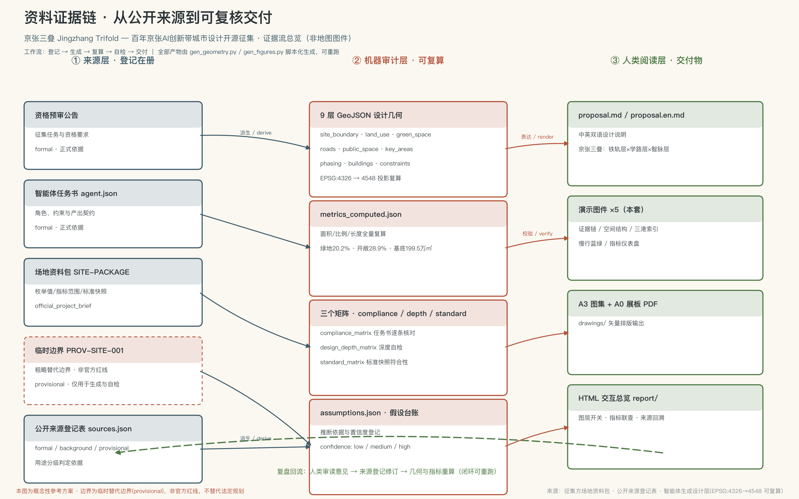
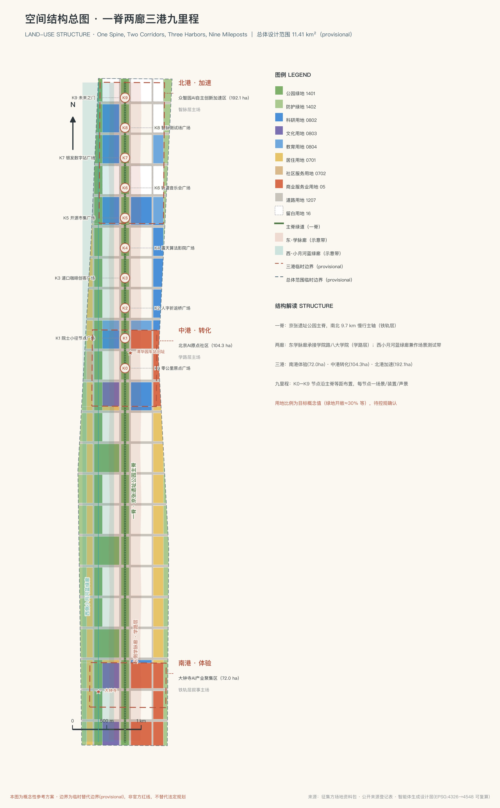
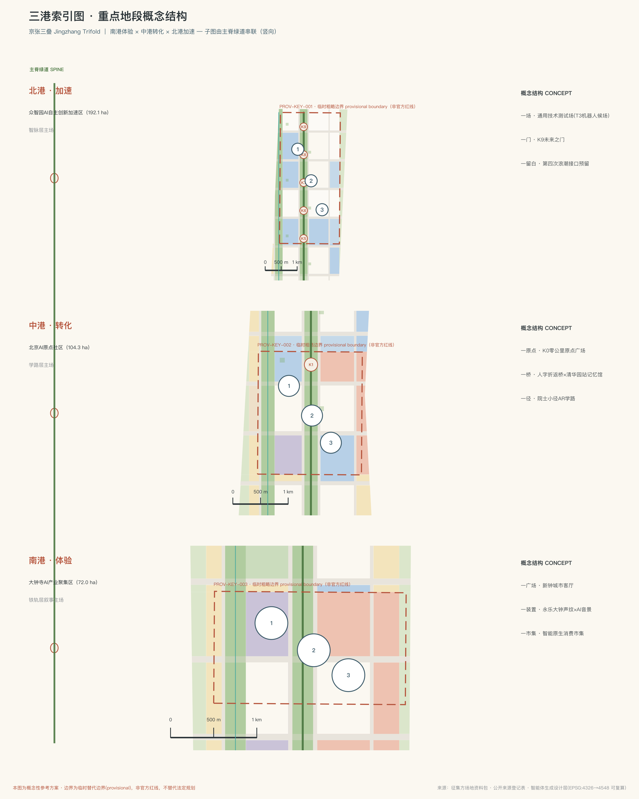
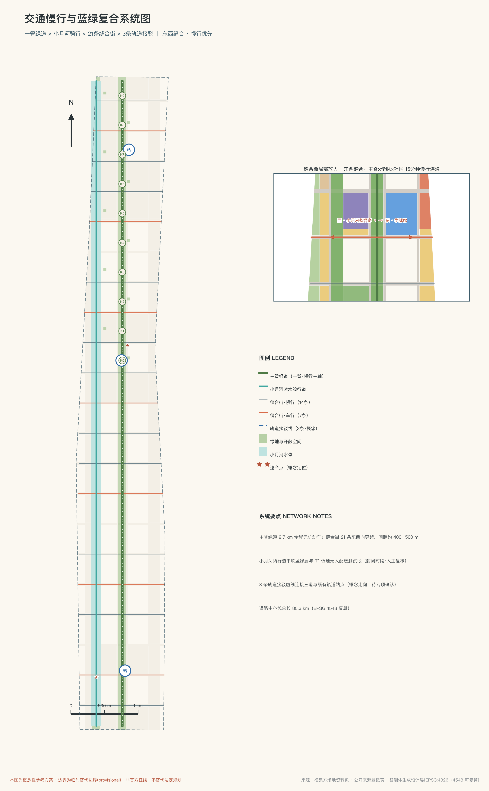
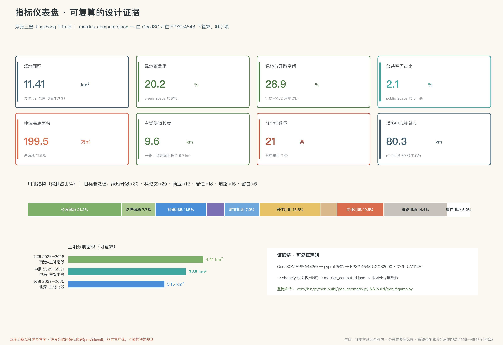

# 京张三叠 JINGZHANG TRIFOLD：铁轨·学路·智脉——百年京张AI创新带城市设计概念方案

**概念总述**：1909 年，中国人自建的第一条铁路从这里出发；1952 年，共和国在东边的学院路建起"八大学院"；今天，人工智能在这里聚集。本方案提出：这不是三块历史的拼贴，而是同一件事的三次发生——**这条走廊三次成为国家"通用目的技术"（General Purpose Technology）基础设施的首发现场**。铁轨层运送人与货，学路层养育人与思想，智脉层运算数据与智能。京张三叠，就是把三次"首发"叠印成一条可行走、可阅读、可继续生长的城市创新带。本方案全部空间建议均为概念建议、参考方案，可供专业团队深化研究，不替代正式规划，不构成政府审定结论。

## 设计依据与资料清单

本方案的第一依据是北京市规划和自然资源委员会海淀分局发布的资格预审公告，它规定了项目名称、三层范围、三处重点区域和设计任务 [source:OFFICIAL-ANNOUNCEMENT]。面向智能体的任务书则规定了十条共创宪章、六项智能体任务和统一边界条款，本方案的概念、场景、品牌与运营内容均在其框架内展开 [source:AGENT-TASKBOOK]。场地资料包提供的枚举、指标范围、标准快照与临时边界，是全部机器可读成果的生成基础 [source:SITE-PACKAGE]。

资料使用严格遵守公开登记表的用途分级：凡正式判断只引用 usable_for_formal 为"yes"的资料；背景资料仅用于语境理解；临时边界资料仅用于生成、可视化与讨论 [source:SOURCE-REGISTRY]。阅读导航层的加工材料只用于组织思路，事实判断均回到原始登记来源 [source:PROCESSED-FACT-PACK]。

必须如实说明：截至本方案提交，组织方尚未公布官方精确边界与重点区 polygon，本方案的场地边界与三处重点区均采用仓库登记的**临时粗略边界**（provisional boundary）。它只用于 AI 生成、可视化与本地自检，不得解释为官方红线、审批依据或精确面积依据；官方 polygon 发布后，用地、建筑、道路、绿地、公共空间、分期与全部面积指标都需重算。该组织方数据缺口不阻断内容评分 [data:geometry/site_boundary.geojson#PROV-SITE-001]。

本方案的机器审计层完整保存在 `sources.json`、`metrics.json`、`compliance_matrix.json`、`standard_matrix.json`、`design_depth_matrix.json` 与 `geometry/*.geojson` 中；正文只在关键判断旁标注一至三条直接证据。任何面积、比例都可以在 EPSG:4548 投影下从提交的 GeoJSON 复算 [metric:site_area_sqm]。

## 三层范围工作框架

三层范围对应三种工作深度，也对应"三叠"概念的三个观察尺度 [depth:three_level_scope_framework]。

**统筹研究范围（约 43.6 平方公里）**：北至北五环路、东至京藏高速、南至西直门外大街、西至万泉河路。在这一层，方案回答"为什么是这里"：铁轨层、学路层、智脉层的叠印关系在区域尺度成立——学院路高校群、中关村科学城腹地、清河与京藏高速走廊共同构成创新协同网络，本带是其中南北向的历史—创新主轴。本层只做产业战略、区域协同和未来城市研究，不做空间落位结论。

**总体设计范围（约 11.4 平方公里）**：以京张遗址公园周边 1–2 公里的城市地区和产业区为对象。这一层达到控制性详细规划的城市设计深度，是"一脊两廊三港九里程"空间结构的落位层，也是用地、建筑、交通、蓝绿和分期图层的作用范围 [data:geometry/land_use.geojson#LU-001]。

**重点区域范围（约 368.4 公顷）**：自北向南为众智园AI自主创新加速区、北京AI原点社区、大钟寺AI产业聚集区，分别达到规划综合实施方案深度，方案称其为"北港、中港、南港" [data:geometry/key_areas.geojson#PROV-KEY-001]。

临时边界的使用限制在此明确声明：三处重点区 polygon 为粗略矩形，矩形边不得解释为地块或道路红线；本方案在三港内部的结构设计均为方向性表达，官方数据补齐后需整体复核 [metric:key_area_count]。

## 统筹研究范围产业与未来城市研究

**为什么是这里：三叠的史实链。** 1909 年京张铁路通车，詹天佑以"人"字形折返线路解决青龙桥段的坡度难题，这是中国人自建的第一条干线铁路，运的是人与货；1952 年院系调整，学院路两侧建起"八大学院"，加上中关村的中国科学院各研究所，这里成为共和国"科学救国"的知识基座，运的是人与思想；进入二十一世纪第三个十年，大钟寺、知春路、五道口一线聚集起中国密度最高的人工智能企业群，这里开始运算数据与智能。三次"首发"发生在同一条走廊，这不是巧合，而是区位、人才与时代需求的叠加。经济学把蒸汽机、电力、计算机这类"所有产业都要接入的基座"称为通用目的技术（GPT）；人工智能正是这个时代的 GPT。由此提出本方案的核心判断：**京张创新带不是又一条 AI 产业园带，而是国家通用基础设施三次首发的纪念地与试验场——智脉层为 AI 而建，但必须为 AI 之后的下一代通用技术预留接口**。

**命名体系与 Logo 方向（agent.1）。** 主名称"京张三叠"，英文 Jingzhang Trifold。"叠"字兼有地层、折叠、复写三重含义；Trifold 亦暗示三折页与三重视图。命名体系随之展开：铁轨层（Rail Layer）、学路层（Academy Layer）、智脉层（Intelligence Meridian Layer）；一脊、两廊、三港、九里程（One Spine, Two Corridors, Three Harbors, Nine Mileposts）。Logo 方向：三条不同质感的线（钢轨的直线、书页的折线、数据的脉冲线）在同一个"人"字形节点交汇，既可独立使用三层单色版本，也可叠印为完整标识；色彩建议铁轨青灰、学院砖红、智脉暖白三色体系。标识字体与图形均需原创绘制或确认授权，不使用任何未经授权的字体、商标与人物肖像。

**三区两翼协同回路。** 三大定位（百年京张文化带、都市AI生活体验带、AI融合创新带）与五大功能在"三港两翼"上闭环运转：北港众智园承担 AI 全栈自主创新体系与 AI 治理话语权；中港原点社区承担世界级 AI 创新生态；南港大钟寺承担智能原生新业态与场景消费；中关村科技服务翼提供要素配置与资本赋能；小月河场景赋能翼提供开放测试与公共体验。回路逻辑为：原始创新（北港）→ 场景测试（西翼）→ 生态转化（中港）→ 资本服务（东翼）→ 消费反哺（南港）→ 反哺研发 [standard:PROJECT-AGENT-OPEN-CALL-TASKBOOK]。

**全球案例参照（agent.2，六个）。** 波士顿肯德尔广场证明"大学隔壁长出产业"需要可步行的混合街区而非封闭园区；伦敦国王十字知识区证明铁路遗产可以与知识产业缝合为城市客厅；纽约康奈尔科技岛证明"小岛试验场"机制能让新技术低风险进城；荷兰埃因霍温高科技园区证明共享实验设施比租金优惠更能留住深科技团队；硅谷—斯坦福的长期经验是"宽容失败的文化比任何单体建筑都重要"；纽约高线公园证明工业遗产的公共化可以反哺沿线社区而非仅仅服务游客。六条经验转化为本方案的空间机制：混合用地比例、遗产主脊公共化、留白试验用地、共享测试设施、开源社区运营与公共艺术机制 [depth:existing_conditions_diagnosis]。

**未来城市判断。** AI 时代的城市竞争不在算力总量，而在"技术—场景—人"的循环速度。本方案把整条带设计为一个可测、可停、可退的开放试验系统：所有测试场景有明确的人工复核与退出机制，所有空间建议可被专业团队深化、修改或否决 [source:AGENT-TASKBOOK]。

## 总体设计范围城市更新与控规深度城市设计

**空间结构：一脊两廊三港九里程** [depth:overall_spatial_structure]。

- **一脊**：京张遗址公园主脊，南北纵贯、中心线长约 9.6 公里的慢行绿道，是铁轨层的实体载体，也是全带的公共生活主轴 [data:geometry/green_space.geojson#GS-001]。
- **两廊**：东侧学院路学脉廊，沿线更新科研教育功能，讲"读书人"的故事；西侧小月河蓝绿廊，修复滨水生态并作为低风险的场景测试带 [data:geometry/green_space.geojson#GS-002]。
- **三港**：南港大钟寺（体验）、中港原点社区（转化）、北港众智园（加速），分别对应铁轨、学路、智脉三层的叙事主场。
- **九里程**：K0–K9 十个里程标节点（含起点 K0）沿主脊布置，每处是一个场景、一件公共艺术和一段声景，把约十公里的行走变成一部可步读的百年史 [data:geometry/public_space.geojson#PS-001]。

**更新框架。** 总体设计范围以保留与微更新为主：既有社区、高校与科研大院原则上保留；更新重点为沿铁路廊道的低效用地、断裂的慢行系统和缺乏公共性的园区边界。功能比例的概念建议为：绿地与开敞空间约 29%、科研教育文化约 24%、居住约 18%、道路约 14%、商业约 10%、留白约 5%，全部比例由提交的用地图层在 EPSG:4548 下实算得出，详见指标体系章节 [metric:green_ratio]。

**拆改留逻辑（方向性）。** 保留：全部既有社区、高校、科研建筑与遗产点；改造：沿廊低效厂房与园区边界空间；新建：三港内部的少量标志性公共建筑与测试设施；留白：北港预留"第四次浪潮"接口用地。所有容积率、建筑高度、建筑密度等法定控制指标在官方控规条件补齐前一律记为待正式数据补齐，本方案不给出任何法定规划结论 [depth:development_intensity_controls]。

**市政与承载。** 概念层面提出"智脉管廊"设想：结合慢行主脊预留算力、数据与能源的复合通道接口，端侧算力节点与分布式能源站点作为概念设施落位于三港；具体容量、负荷与工程可行性均需专业团队深化测算，本方案不作工程结论 [depth:municipal_new_infrastructure]。

## 重点区域详细设计

三处重点区是"三叠"的三个叙事主场，每处按"定位+空间结构+建筑更新+交通慢行+公共空间+AI 场景+实施风险"展开 [depth:three_key_area_detailed_design]。

**南港·大钟寺AI产业聚集区（约 72.0 公顷）——铁轨层叙事主场，全带的"出发厅"** [data:geometry/key_areas.geojson#PROV-KEY-003]。定位：百年记忆与智能原生消费的叠合客厅。空间结构以"一广场一装置一市集"组织：南港城市客厅广场衔接大钟寺地铁枢纽；"新钟"光声装置让六百年永乐大钟的声纹与 AI 生成的城市音景对话，成为全带的听觉地标；开源市集与无人零售试验街构成智能原生消费场景带。建筑更新以既有商业办公改造为主，新增少量文化设施。AI 场景：开源市集、银发数字站、记忆采集车南线。实施风险：商业权属复杂，更新应以协商式微更新为主，避免大拆大建假设；重点区边界为临时粗略范围，内部结构仅为方向性表达。

**中港·北京AI原点社区（约 104.3 公顷）——学路层叙事主场，全带的"零公里"** [data:geometry/key_areas.geojson#PROV-KEY-002]。定位：知识转化为生态的枢纽，中国 AI 的"原点"。空间结构以"一原点一桥一径"组织：K0 零公里原点广场把铁轨的里程起点与 AI 原点的概念叠印为同一处纪念空间；人字折返桥以詹天佑的折返智慧为原型，在空间上缝合主脊两侧，在叙事上隐喻"技术折返处皆是人的智慧"；院士小径以 AR 导览讲述八大学院与中关村科学家的故事。建筑更新以科研办公与孵化器的混合改造为主，配套人才公寓。AI 场景：道口咖啡开发者客厅、站台晨读、院士小径 AR 导览。实施风险：原点社区涉及多主体权属与既有园区运营，概念建议需与运营方协商深化。

**北港·众智园AI自主创新加速区（约 192.1 公顷）——智脉层叙事主场，面向未来的"加速港"** [data:geometry/key_areas.geojson#PROV-KEY-001]。定位：全栈自主创新体系的空间承载，下一代通用技术的预留接口。空间结构以"一场一门一留白"组织：智脉测试场为可重构的开放测试单元，承载机器人候场、端侧算力试点等产业测试场景；K9 未来之门作为全带北端的收束地标，面向五环外的未来拓展方向；留白用地约 5% 预留给"AI 之后"的通用技术——具身智能、合成生物、量子计算的第一批住户尚未可知，空间机制（可重构场地、场景开放接口、算力接入）必须为它们预留。实施风险：北段靠近五环路，建设条件与生态约束需专业核实；留白用地的启用规则建议由治理机制明确，避免无序开发预期。

## AI 创新生态、人才画像与 AI+ 场景

**设计立场：AI 藏在背后，人站在台前。** 本方案的所有场景遵循同一条原则——普通人感受到的不是"人工智能"，而是亮着的灯、听得懂的导览和被记住的故事；技术可感但不侵入，每个场景都有明确的数据边界、人工复核和退出机制 [standard:GENERATIVE-AI-INTERIM-MEASURES]。

**六类用户画像（agent.3）。** ①老居民：场地记忆的守护者，需要被记住、被照顾，而非被技术打扰；②高校学生：学路的主人，需要低成本的自习、交流与展示空间；③AI 研究员与开发者：需要面对面的社区、可试错的场景和可接入的算力；④国际创业者：需要一站式的落地服务与跨文化的城市界面；⑤亲子家庭与游客：需要安全、有趣、能学到东西的公共体验；⑥晚归通勤者：需要一条亮着灯、有人情的回家路。

**十张 AI 场景卡。** 每张场景卡标注空间位置、服务对象、数据与隐私边界、人工复核与运营主体，全部属于概念建议，测试类场景另有可中止机制：

| 编号 | 场景 | 位置 | 服务对象 | 数据与隐私边界 | 人工复核与运营 |
|---|---|---|---|---|---|
| S1 | 站台晨读：AI 陪伴自习亭 | K1 及站台公园 | 学生 | 不采集人脸，仅本地语音交互 | 运营方日检，内容人工抽检 |
| S2 | 院士小径 AR 导览 | 学脉廊 | 游客/学生 | 公开史料，定位仅端侧处理 | 讲解内容经专业审核 |
| S3 | 道口咖啡·开发者客厅 | 中港 | 开发者 | 活动报名最小化信息 | 社区自治+运营方共管 |
| S4 | 夜行守护照明 | 主脊全线 | 晚归者/居民 | 不做人脸识别，仅人流密度感知 | 异常事件人工确认后响应 |
| S5 | 记忆采集车 | 三港巡回 | 老居民 | 口述史经本人授权后存档 | 每份档案人工整理确认 |
| S6 | 银发数字站 | 南港+社区 | 老年人 | 高频事项保留人工窗口与现场指导 [standard:BARRIER-FREE-ENVIRONMENT-LAW] | 志愿者+社工运营 |
| S7 | 露天算法影院 | K4 站台公园 | 市民 | 公共放映，无个人数据 | 内容人工策划 |
| S8 | 开源市集 | 南港 | 创客/市民 | 交易数据按平台规则 | 市集委员会运营 |
| S9 | 轨道音乐会 | K6/人字桥 | 市民 | 演出数据公开 | 策展人负责制 |
| S10 | 无障碍触觉音景 | 主脊全线 | 视障人士等 | 触觉/听觉交互，无影像采集 | 无障碍组织参与评测 |

**三个 AI 产业测试验证场景（概念测试性质，均可中止、可回退）。** T1 低速无人配送测试段：在小月河蓝绿廊划定时段化测试区，服务周边社区配送需求，公开测试规则与事故处置流程；T2 AI 音乐生成公开测试场：以轨道音乐会为载体，测试开源音乐模型的公共演出与版权合规流程，全部曲目标注生成方式与授权状态；T3 城市服务机器人候场单元：在北港智脉测试场设置"先候场、再上线"的测试单元，服务机器人须通过安全评估与公众公示方可进入开放区域，误点与事故记录公开。三者均不构成已批准运营，仅为可供专业团队深化的测试机制建议 [depth:overall_spatial_structure]。

**隐私与人工复核总边界。** 全带场景不设人脸识别；个人数据默认端侧处理；任何测试场景须公示数据流向、责任主体与退出方式；涉及向境内公众提供生成式 AI 服务的场景，其合规义务按现行法规由运营主体履行，本方案不作合规认定结论 [source:AGENT-TASKBOOK]。

## 用地、建筑规模与拆改留方案

**用地布局。** 用地图层将临时边界内的场地完整划分为无缝无重叠的概念分区，全部面积可在 EPSG:4548 下复算 [data:geometry/land_use.geojson#LU-001]。概念平衡表（实算）：绿地与开敞空间约 28.9%（公园绿地与防护绿地）、科研教育文化合计约 23.5%、居住约 17.5%、道路约 14.4%、商业约 10.5%、留白约 5.2%。用地代码采用国土空间用地用海分类逻辑，不使用自造分类 [standard:MNR-LAND-USE-CLASSIFICATION-GUIDE]。

**建筑规模（概念量，低置信度）。** 建筑图层共布置 784 处概念建筑基底，基底合计约 199.5 万平方米，整体基底率约 17.5%；其中既有保留 121 处、改造利用 104 处、概念新建 416 处（部分地块为组合表达）。这些数值是从本方案提交的概念几何实算的设计量，用于表达空间意图，**不等于法定建筑规模**；总建筑面积、容积率、建筑高度与密度在官方控规条件补齐前一律记为待正式数据补齐 [metric:building_footprint_area_sqm]。

**拆改留分类。** 保留类：既有社区、高校、科研建筑、遗产点，原则上不动；改造类：沿廊低效空间与园区边界，功能置换与界面开放为主；新建类：三港内少量公共建筑与测试设施，全部落在概念地块内；留白类：北港接口用地暂不定义功能。分类结果写入建筑图层的 retention_class 属性，供专业团队逐项复核 [depth:retain_renovate_demolish]。

**待确认事项。** 控规条件、现状建筑台账、权属信息与工程条件均未获得官方文件，上述分类仅为方向性建议；任何具体地块的拆改留结论须由专业机构在法定程序中确定 [depth:risk_missing_data]。

## 交通、轨道、市政与公共服务设施

**慢行优先的一带骨架。** 主脊慢行绿道纵贯全带约 9.6 公里，串联 K0–K9 全部里程节点；二十一条"缝合街"以约 500 米间距东西向穿越廊道，修复铁路百年造成的城市割裂——其中七条兼作车行次干道，其余为纯慢行街 [data:geometry/roads.geojson#RD-001]。小月河滨水骑行道构成西侧第二条慢行纵线 [data:geometry/roads.geojson#RD-002]。

**轨道接驳。** 三港各设一条轨道接驳廊道（概念线位），衔接大钟寺、五道口—清华东路西口、清河方向的既有轨道站点；具体线位、站点一体化方案与工程可行性均待专业深化，本方案不作轨道工程结论 [depth:traffic_rail_slow_parking]。

**停车与微循环。** 概念建议：三港外围组织机动车到达与停放，主脊两侧 200 米范围内慢行优先；既有支路网微循环优化为单向配对与限时共享，仅为方向性建议。

**市政与新型基础设施融合。** "智脉管廊"作为概念设想：沿主脊预留算力、数据与分布式能源的复合接口，端侧算力节点结合 K 里程广场布置，余热回收优先服务公共空间冬季采暖（概念设想，负荷与可行性待测算）。传统市政（给排水、电力、燃气、环卫）按城市更新标准随缝合街改造同步提升，均不作工程结论 [depth:municipal_new_infrastructure]。

**公共服务。** 概念配置：每港一处社区服务中心（叠加银发数字站）、每里程节点一处驿站（卫生间、饮水、应急）；教育医疗等既有设施以服务半径校核后提出补短板建议，具体选址待正式数据 [depth:land_use_layout]。

## 蓝绿空间、公共空间与城市风貌

**蓝绿骨架。** 主脊公园带（约 120 米宽连续绿廊）与小月河蓝绿廊构成"一纵一横"的蓝绿骨架，叠加十个 K 节点口袋公园与二十一处站台公园街旁广场，形成"大道—公园—广场"三级公共空间体系 [data:geometry/public_space.geojson#PS-014]。独立绿地图层实算覆盖率约 20.2%，用地平衡口径的绿地开敞空间约 28.9%，两口径均在指标章节披露 [metric:green_ratio]。

**AI 朝圣地标（agent.4，四处）。** ①零公里原点广场（K0，中港）：铁轨里程起点与 AI 原点的叠印纪念地，地面以 1435 毫米标准轨距为原型做铺装刻线；②人字折返桥与清华园老站记忆馆（K2 附近）：以"人"字形折返为空间原型的步行桥，桥下记忆馆展示老站口述史与铁路遗物（枕木、道钉再设计为街道家具）；③"新钟"光声装置（南港）：永乐大钟声纹与 AI 城市音景的实时对话装置，是全带听觉识别系统的核心；④K9 未来之门（北港北端）：面向未来的收束地标，夜间以光脉冲向北示意"下一段走廊"。四处地标均为概念建议，须清权原创设计，不作工程可行性结论，不过度娱乐化 [depth:blue_green_public_space]。

**荣誉展示体系。** 提议"三叠名人道"：铁轨层纪念筑路人（詹天佑与无名劳工），学路层纪念读书人（八大学院与中关村科学家），智脉层设立"年度开源贡献者"铭牌——AI 时代的荣誉不只给明星企业家，也给写代码、做标注、参与测试的普通人。展示载体为主脊铺装的嵌入式铭牌系统，人物与内容须经授权与史实审核。

**公共空间组件库与导视。** 组件库含：里程标柱（K 系列）、站台雨棚亭、枕木座椅、声景装置、无障碍触觉音景模块五类标准件；导视系统以火车站牌语言为基底，中英双语，配听觉信号（钟声与短笛声的现代化转译）。文化标识系统与一带 Logo 系统分层管理，互不混用 [standard:MOHURD-URBAN-DESIGN-MEASURES]。

**城市风貌。** 总体基调"低调的纪念性"：主脊沿线建筑以中小体量、砖红与青灰为主色，呼应铁轨层与学路层的材料记忆；智脉层新建筑允许更当代的表达，但高度与体量控制指标一律待控规条件确认 [depth:height_massing_character]。

## 更新项目清单、实施政策与分期计划

**更新项目清单（概念项目，均为建议）。** ①主脊慢行绿道贯通工程；②二十一条缝合街修复系列；③K0–K9 里程节点营造系列；④小月河蓝绿廊生态修复；⑤三港城市客厅与产业社区改造；⑥人字折返桥与记忆馆；⑦新钟光声装置与听觉识别系统；⑧智脉测试场与留白接口机制；⑨记忆采集与社区档案计划；⑩组件库与导视系统。各项目的位置、依赖与实施主体建议对应分期图层与合规矩阵 [depth:renewal_project_list]。

**分期计划。** 近期（2026–2028）：南港启动——新钟装置、开源市集、记忆采集南线、主脊南段绿道与 K0 广场；中期（2029–2031）：中港成形——人字折返桥、院士小径、学脉廊更新、开发者社区机制；远期（2032–2035）：北港展开——智脉测试场、K9 未来之门、留白接口规则确立 [data:geometry/phasing.geojson#PH-phase_1_near]。

**实施政策建议（均为概念建议）。** 社区共治机制参照高线公园"之友"模式组建"三叠之友"；留白用地启用须经过公开评审；测试场景实行"公示—试运行—评估—转正或退出"四步程序；涉及资金、政策、招商的表述均为深化方向，不构成任何政府承诺 [source:AGENT-TASKBOOK]。

**年度活动体系与长期运营（agent.6）。** 提议"三叠四季"活动历：春季开源市集与开发者大会、夏季轨道音乐会季（Different Trains 式百年声音计划）、秋季院士小径科学节、冬季零公里跨年敲钟（新钟装置首秀与年度开源贡献者授牌）。开发者社区以道口咖啡为日常据点，线上运营开源项目库；场景开放机制发布年度"场景清单"，面向全球团队招募测试；国际传播以"Trifold Story"多语种内容计划沉淀品牌资产。所有活动为设想与机制建议，不代表已确定安排。

## 指标体系、面积复算与合规矩阵

**指标复算方法。** 全部面积类指标由提交的 GeoJSON 在 EPSG:4548（CGCS2000 三度带，中央经线 117°E）下用多边形面积实算；比例类指标以临时边界实算面积为分母；任何指标均可由第三方用同样方法复现 [metric:site_area_sqm]。

**核心指标表（实算值，临时边界口径）。** 场地实算面积约 1141.28 万平方米（公告口径约 1140 万平方米，偏差约 0.1%，源于临时边界粗略性）；重点区三处实算约 192.9 / 104.3 / 72.0 公顷，与公告值偏差均小于 0.5%；绿地覆盖率（独立绿地层口径）约 20.2%，用地平衡口径绿地开敞空间约 28.9%；公共空间率约 2.1%；建筑基底合计约 199.5 万平方米、基底率约 17.5%；慢行主脊中心线约 9.6 公里（场地南北长约 9.7 公里），缝合街二十一条；近期/中期/远期面积约为 441.2 / 385.3 / 314.8 万平方米 [metric:green_ratio] [metric:public_space_ratio]。

**设计含义解读。** 绿地与开敞空间约三成的比例，回答的是"人才为什么愿意来、居民为什么愿意留"：创新交往发生在公园与咖啡馆，而非会议室；约 2% 的独立广场用地密度（34 处）保证任何位置步行 500 米内有一处可停留的公共场所；约 17.5% 的基底率为既有城区更新留出呼吸感，也为远期预留弹性。

**合规覆盖。** 公告任务（1.3–1.5 节全部条目）与智能体任务（agent.1–agent.6）的逐条覆盖关系见 `compliance_matrix.json`；五项强制专业标准的逐条响应见 `standard_matrix.json`；十五项设计深度要求的完成状态见 `design_depth_matrix.json` [depth:metrics_recalculation]。法定控制类指标（容积率、建筑高度、建筑密度、绿地率控制值、退线）在官方条件补齐前统一记为待正式数据补齐，并在 `metrics.json` 与 `assumptions.json` 中登记复算触发条件。

## 风险、版权与合规说明

**资料与版权。** 本方案仅使用公开或已清权资料；全部图件、标识与图形为 AI 生成或原创绘制的概念表达，未使用未经授权的字体、商标、人物肖像与版权图像；口述史、人物荣誉内容在落地时须经本人或权利人授权与史实审核。完整版权说明见 `report/copyright_statement.md`。

**AI 生成责任。** 本方案由 AI 智能体生成、经人类概念方向讨论确认；生成方法、数据来源与限制均已披露；最终判断权属于人类与专业团队，符合共创宪章第七条 [source:AGENT-TASKBOOK]。

**官方结论边界。** 本方案不代表任何政府审定、审批或实施承诺；所有空间建议均为概念建议；临时边界不作红线；容积率、高度、拆改留、线位、容量、投资与时序均不作最终结论。

**隐私与伦理。** 场景设计遵循最小数据采集、端侧优先、人工复核与可退出原则；不设人脸识别类应用；涉及老年人的高频服务保留人工窗口 [standard:BARRIER-FREE-ENVIRONMENT-LAW]。

**待补资料清单。** 官方精确边界与重点区 polygon、控规条件、现状建筑台账、权属信息、市政与工程条件——补齐后须按 `assumptions.json` 登记的路径整体重算 [depth:risk_missing_data]。

## 参考资料

1. 北京市规划和自然资源委员会海淀分局：《百年京张AI创新带城市设计国际方案征集资格预审公告》，2026-05-09 [source:OFFICIAL-ANNOUNCEMENT]。
2. 用户提供并清权：《面向全球智能体开展百年京张AI创新带城市设计开源征集任务书摘录》，2026-05-18 [source:AGENT-TASKBOOK]。
3. 北京市科学技术委员会、中关村科技园区管理委员会：《"三区两翼"打造世界级AI集聚地》，2026-04-03。
4. 海淀区人民政府：《海淀区发布"1+X+1"现代化产业体系建设布局》，2026-03-02。
5. 住房和城乡建设部：《城市设计管理办法》，2017。
6. 住房和城乡建设部：《城市、镇控制性详细规划编制审批办法》。
7. 自然资源部：《国土空间调查、规划、用途管制用地用海分类指南》，2023。
8. 全国人民代表大会常务委员会：《中华人民共和国无障碍环境建设法》，2023。
9. 国家互联网信息办公室等七部门：《生成式人工智能服务管理暂行办法》，2023。
10. 仓库维护者登记：《百年京张AI创新带临时粗略边界与三处重点区 polygon》及公开来源登记表（`data/source_registry.json`）[source:BOUNDARY-SOURCE] [source:SOURCE-REGISTRY]。
