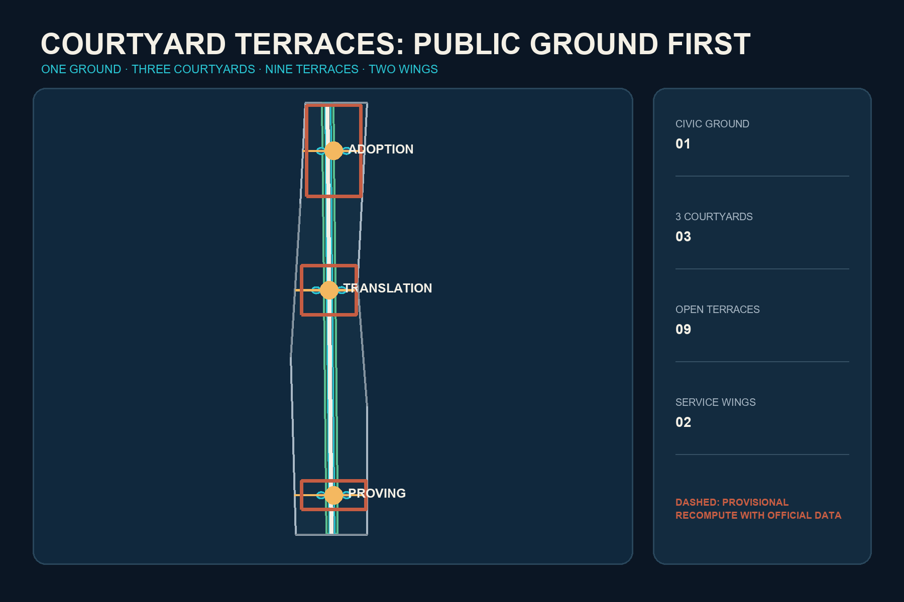
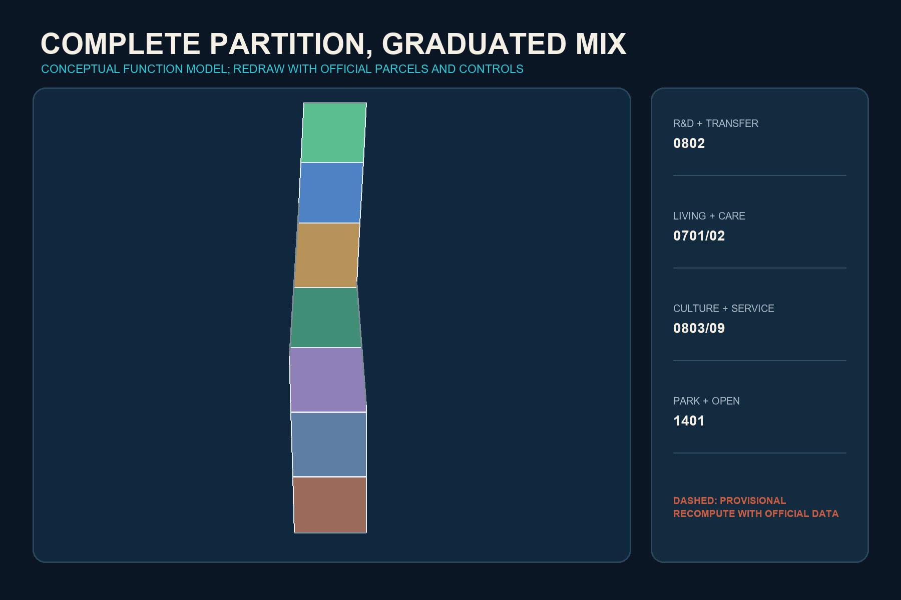
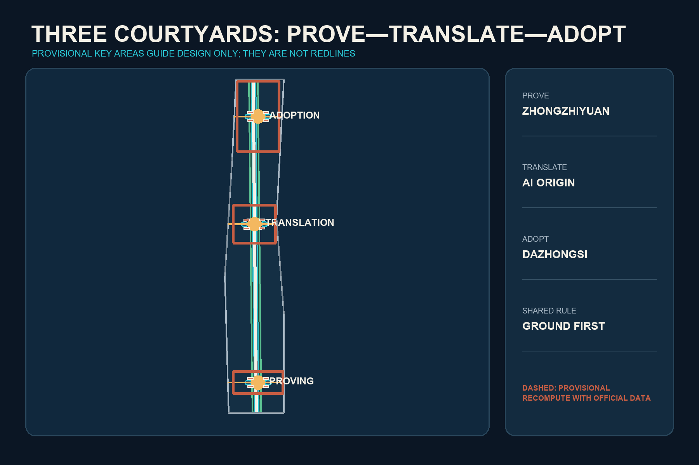
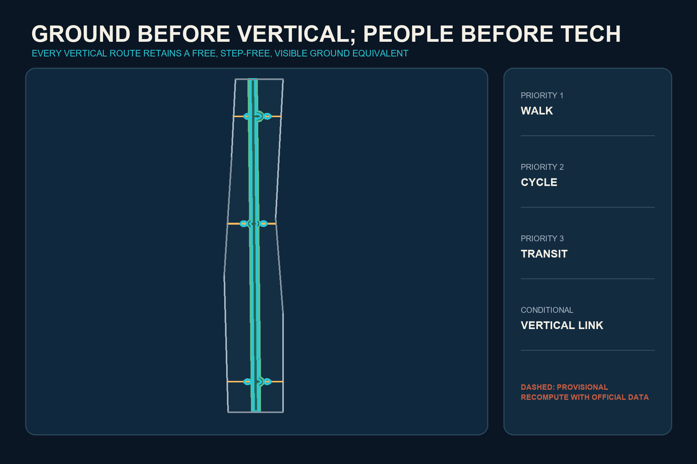
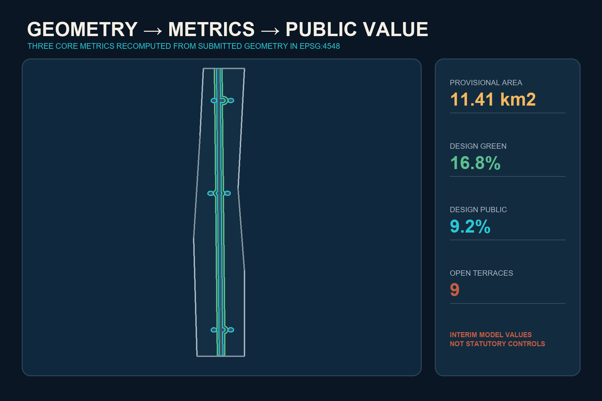

# COURTYARD TERRACES / 院台京张

> Return the city to the ground, then let innovation rise.

## Design Basis and Source List

Developed from the perspective of an entrant from the University of Hong Kong, this proposal treats Beijing as a broad field of concentrated knowledge and Hong Kong as a vertical laboratory of density, transit integration and East-West negotiation. The official call, the Agent taskbook, local professional-standard snapshots and the public source registry are the controlling evidence. Repository geometry is provisional and supports generation, visualization and intake review only [source:OFFICIAL-ANNOUNCEMENT] [source:AGENT-TASKBOOK] [source:BOUNDARY-SOURCE].

“Courtyard Terraces” is not a stylistic collage. Courtyard joins the social scale of the Chinese siheyuan with the open-learning tradition of the Western collegiate quadrangle. Terrace transfers Hong Kong's efficient stacking of mobility, work, living and public activity. The proposal also repairs three failures: Beijing superblocks and institutional edges that interrupt walking; innovation districts that enable displacement and privately controlled public space; and podium urbanism that removes the street, gates access and excludes low-digital-literacy users. A Public Ground Right therefore requires every elevated, underground or digital route to retain a visible, step-free, free-to-use and human-supported at-grade equivalent [source:HKU-INTERSTITIAL-PUBLIC-SPACE] [source:HK-DEVB-WALKABILITY] [standard:BARRIER-FREE-ENVIRONMENT-LAW].

## Three-Level Scope Framework

The 43.6 sq km coordinated research area addresses the metropolitan innovation ecosystem. The approximately 11.4 sq km overall design area addresses public-ground continuity, mixed use and incremental renewal. The 368.4 ha key scope tests how three differentiated courtyards support proving, translation and adoption. These levels retain the call's stated scope, while the submitted provisional geometry remains the spatial audit basis [data:geometry/site_boundary.geojson#SITE-001] [metric:site_area_sqm] [depth:three_level_scope_framework].

The structure is One Civic Ground, Three Courtyards, Nine Open Terraces and Two Wings. The Proving Courtyard at Zhongzhiyuan, Translation Courtyard at the AI Origin Community and Adoption Courtyard at Dazhongsi correspond to stages of an innovation lifecycle. Three terraces in each courtyard make testing, learning, daily life and international exchange visible. The Zhongguancun service wing and Xiaoyuehe scenario wing connect professional services and real urban problems. Elevated connections may be studied only after the at-grade route works [data:geometry/roads.geojson#ROAD-001] [depth:overall_spatial_structure].

## Coordinated Research Area: Industry and Future City Research

Six primary comparisons guide the ecosystem: Hong Kong Science Park's full-cycle venture network; one-north's work-live-play-learn mix; Kendall Square's disclosure of privately owned public-space rights; Cambridge Foundry's reuse of industrial heritage; Barcelona 22@'s productive mixed district; and Paris-Saclay's university-industry-ecology coordination. MaRS Toronto supplements the comparison of dense knowledge co-location [source:HKSTP-ECOSYSTEM] [source:JTC-ONE-NORTH] [source:CAMBRIDGE-KENDALL-POPS]. Mechanisms can transfer; company lists, investment volumes, legal systems and development controls cannot.

The ecosystem is an eight-factor loop: reversible spatial supply; milestone-based capital; affordable living and cross-campus social space; minimal and auditable compute and data; controlled testing before public release; legal, intellectual-property and international services; and public participation through problems, trials and exit rights. The three courtyards perform prove-translate-adopt, while the nine terraces turn backstage processes into civic interfaces [standard:PROJECT-AGENT-OPEN-CALL-TASKBOOK] [depth:industry_future_city_strategy].

The identity mark combines a square void for the courtyard with horizontal terrace lines as an open bracket. Railway brick, harbour cyan and human-judgement gold form the palette. The system extends to wayfinding, terrace numbers, event seals and open-data legends without using corporate marks or restricted fonts.

## Overall Design Area: Urban Renewal and Regulatory-Plan-Level Urban Design

The design secures the continuous public ground before adding vertical volume. A complete conceptual land-use partition distributes research, living, community service, culture, commerce and park space. It is machine-readable but not statutory zoning [data:geometry/land_use.geojson#LU-001] [standard:MNR-LAND-USE-CLASSIFICATION-GUIDE] [depth:land_use_layout]. Vertical mix is considered only at transit and key-area nodes and remains conditional on porous ground floors, recognizable public access, winter solar exposure, wind, fire and evacuation review.

Hong Kong's rail-community integration informs synchronized planning of stations, jobs, homes and services, while its property-finance structure is not claimed as a guaranteed local mechanism [source:HK-MTR-RPLUSPROPERTY]. A proposed public-benefit contract records at-grade access, step-free equivalence, affordable innovation units, community services, canopy and stormwater, human fallback for AI and removal liability. Inspired by Kendall Square's POPS disclosure, each of the nine terraces would publish ownership/operation, hours, accessibility, complaint routes and shutdown conditions [source:CAMBRIDGE-KENDALL-POPS].

FAR, height, road redlines, ownership and utility capacity remain pending official data [metric:floor_area_ratio] [depth:development_intensity_controls]. Submitted building polygons are design envelopes, not an existing-building or demolition inventory.

## Detailed Design of Key Areas

The three courtyards are distinct interfaces in an innovation lifecycle [data:geometry/key_areas.geojson#PROV-KEY-001] [data:geometry/key_areas.geojson#PROV-KEY-002] [depth:three_key_area_detailed_design].

1. **Proving Courtyard, Zhongzhiyuan:** low-rise research courts, standards workshops and controlled test areas beside the Qinghe green edge. Compute, Standards and Safety Terraces separate public viewing from closed testing.
2. **Translation Courtyard, AI Origin Community:** a near-campus walking network links universities, incubation, community life and talent services. Open Source, Co-learning and Daily-life Terraces combine courtyard encounter with collegiate cross-disciplinary exchange.
3. **Adoption Courtyard, Dazhongsi:** at-grade four-quadrant station connections precede any elevated link. Pitch, Market and International Terraces transfer Hong Kong's station-city efficiency without burying public routes inside gated retail.

Every courtyard uses the same professional gate: survey and ownership; retention value; ground-floor publicness; universal access and winter climate; fire and utilities; data and privacy; operator; shutdown and restoration. Official polygons trigger regeneration of every layer, metric, figure, HTML and drawing.

## AI Innovation Ecosystem, Personas, and AI+ Scenarios

Six personas are open-source developer, startup team, university member, corporate/international visitor, resident/small business, and older/disabled/low-digital-literacy user. The last persona is a failure tester: if a person without a smartphone, declining face recognition or encountering an AI outage cannot receive equivalent service, the scenario cannot enter public operation [standard:GENERATIVE-AI-INTERIM-MEASURES] [standard:ELDERLY-SMART-TECH-PLAN-2020-45] [depth:public_service_facilities].

Twelve cards cover model red-teaming, edge-compute booking, slow urban robotics, open-source release, learning support, community-care navigation, multilingual reception, device repair, SME compliance support, accessible walking guidance, heritage sound archives and public-space maintenance. The first three are industry proving scenarios with closed, appointment-based semi-open and reversible public stages. Every card identifies data, a named human owner, fallback, stop trigger and restoration path.

AI supports decisions but does not approve planning, diagnose, grade students, provide final legal advice or profile residents. Complaints, bias and safety incidents enter a visible response process. The public can inspect purpose, data type, accountable person and exit route for each service.

## Land Use, Building Scale, and Retain-Renovate-Demolish Strategy

Seven conceptual bands fully partition the provisional boundary and place research and mixed services around the three courtyards, with living, community service, culture and green space through the central sequence [data:geometry/land_use.geojson#LU-004] [metric:building_footprint_area_sqm] [depth:retain_renovate_demolish]. This is a recomputable functional model, not a conclusion about existing parcels.

Retain-renovate-demolish follows four gates: establish heritage, structure, embodied carbon and community value; retain wherever possible; adapt interiors and ground floors before considering replacement; discuss demolition only after safety, network necessity, ownership and professional review. New construction fills verified station-area service gaps. Every building feature remains pending survey [data:geometry/buildings.geojson#BLDG-001].

The prototype is Low Court-Porous Terrace-Light Tower. The court protects Beijing sunlight and social scale; the terrace creates a visible shared level that always returns to grade; a tower is considered only where official controls and microclimate allow. Hong Kong vertical freespace is retained, while sealed podiums, dark streets and cramped housing are rejected [source:HKU-VERTICAL-FABRIC] [depth:height_massing_character].

## Transport, Rail, Municipal Infrastructure, and Public Services

Priority is walking, cycling, transit, shared connection and necessary vehicles. A north-south Civic Ground and three east-west courtyard streets connect the courtyards and wings; nine terraces provide seasonal shelter, seating and legible pauses [data:geometry/roads.geojson#ROAD-001] [depth:traffic_rail_slow_parking]. Hong Kong's 3D pedestrian precedent informs connectivity, but at-grade continuity, hours, gradients, lift failure and night access are audited before any elevated proposal.

New infrastructure uses small, replaceable and offline-capable units. Edge compute, charging and sensors cluster in maintainable nodes without occupying tactile paths or fire access. Data is processed locally where possible; energy, heat and stormwater integrate with landscape. Exact utilities and loads await professional evidence [depth:municipal_new_infrastructure] [source:HK-DEVB-WALKABILITY].

Public services retain dual channels: digital booking and walk-in queues, smart navigation and human enquiry, cashless and conventional payment, automated translation and human assistance. Every terrace includes a service entry that does not require a smartphone.

## Blue-Green Network, Public Space, and Urban Character

The conceptual green spine follows the Civic Ground, with three courtyard gardens and nine terraces combining landscape, stormwater, learning and daily services. Ratios are recomputed from participant geometry and are not statutory targets [data:geometry/green_space.geojson#GREEN-001] [data:geometry/public_space.geojson#PUBLIC-001] [metric:green_ratio].

Climate transfer rejects formal copying. Hong Kong shade, rain protection and humid-climate ventilation become Beijing devices that shade summers, admit winter sun, block cold wind and permit snow clearance. Podium planting connects to soil, canopy and stormwater at grade. Interstitial Hong Kong research informs small spaces for seating, water, play, quiet rest and micro-exhibitions instead of advertising or equipment storage [source:HKU-INTERSTITIAL-PUBLIC-SPACE] [depth:blue_green_public_space].

The cultural sequence is Engineering Autonomy-Knowledge Openness-Public Judgment. Three pilgrimage landmarks are the Centennial Engineering Datum Court, Open-source Contribution Court and Civic AI Responsibility Terrace. They display methods and contributors rather than spectacular technology sculptures.

## Renewal Projects, Implementation Policy, and Phasing

Years 0-2 audit and repair Civic Ground continuity, pilot three temporary terraces and register responsibilities. Years 3-5, after geometry, ownership and control confirmation, adapt buildings, open station ground floors and deliver the courtyards. Only beyond year 6 are vertical mix and district infrastructure studied [data:geometry/phasing.geojson#PHASE-001] [depth:phasing_implementation].

Eight conceptual projects cover Civic Ground audit, three courtyard pilots, the public ledger for nine terraces, affordable innovation-space agreements, climate-adaptive arcade components and AI retirement/site-restoration. Each needs a public owner, professional team, prerequisite data, cost band, stop condition and restoration liability [depth:renewal_project_list].

The annual programme is Four Seasons and One Assembly: Open Source Courtyard Week, Civic Ground Urban Test Season, Jing-Zhang Centennial Culture and Engineering Forum, Human-in-the-Loop Governance Drill, and the Courtyard Terraces Assembly. Participants move from experience to training, pilot, procurement/investment or documented retirement rather than event traffic alone.

## Metrics, Area Recalculation, and Compliance Matrix

The three core visual metrics are recomputed in EPSG:4548 and match the offline visualization: provisional site area, conceptual green ratio and conceptual public-space ratio [metric:site_area_sqm] [metric:green_ratio] [metric:public_space_ratio]. Building footprint counts only conceptual envelopes. FAR, height and statutory green requirements remain pending.

Spatial metrics audit areas, ratios, nodes and connectivity. Operational metrics will audit opening hours, fallback availability, complaint closure, shutdown and community use. Public-value metrics will cover affordable space, vulnerable-user access, heritage reuse and genuine public opening. The latter two require field baselines and therefore have no invented performance values [depth:metrics_recalculation].

The compliance matrix covers call sections 1.3-1.5 and agent.1-agent.6. The standards matrix separates mandatory authority from background policy. The depth matrix states completed evidence and official-data limits. Visuals and PDFs support human reading; GeoJSON and structured metrics remain authoritative.

## Risk, Copyright, and Compliance

The primary risk is that provisional geometry may be displaced from the actual heritage park and key areas. Issue #846 documents this uncertainty, so no submitted polygon is interpreted as a road, parcel or ownership line [source:BOUNDARY-SOURCE] [depth:risk_missing_data]. Other risks are formal copying of Hong Kong, displacement through innovation-led rent pressure, privatized public space, AI surveillance and digital exclusion. Responses are climate/publicness review, affordable-space agreements, public-access ledgers, data minimization, human review, offline equivalence and shutdown.

All spatial moves are open co-creation concepts and references for professional teams. They do not replace statutory planning or constitute approval, investment, engineering feasibility or parcel-specific demolition conclusions. The cover and atmospheric imagery are AI-generated conceptual representations, not site photographs. Core figures are generated from submitted geometry and metrics. No third-party web imagery, corporate logos, portraits or restricted fonts are redistributed.

## References

The complete provenance and rights register is in `sources.json`. Core task evidence is the official announcement and Agent taskbook [source:OFFICIAL-ANNOUNCEMENT] [source:AGENT-TASKBOOK]. Hong Kong transfer evidence includes MTR and HKU research [source:HK-MTR-RPLUSPROPERTY] [source:HKU-INTERSTITIAL-PUBLIC-SPACE]. Global comparisons include one-north, Cambridge Foundry and Paris-Saclay [source:JTC-ONE-NORTH] [source:CAMBRIDGE-FOUNDRY] [source:PARIS-SACLAY]. External evidence supports comparison only, never official boundaries, statutory indicators or implementation commitments.
