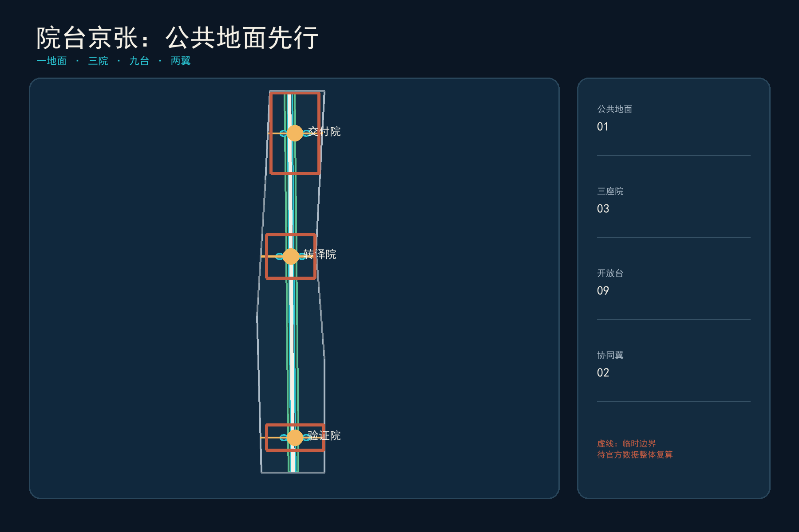
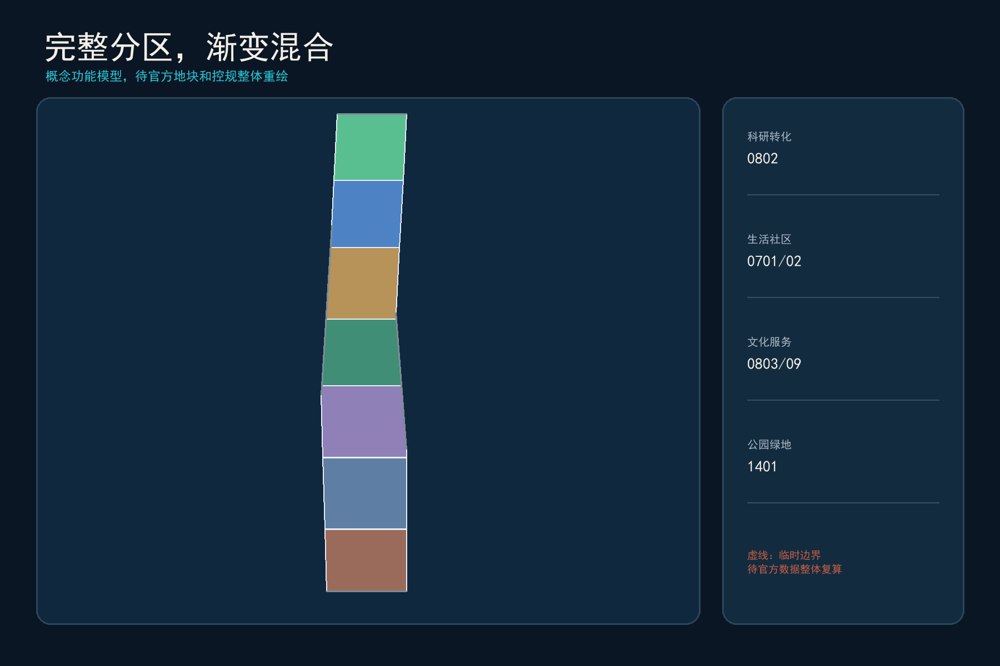
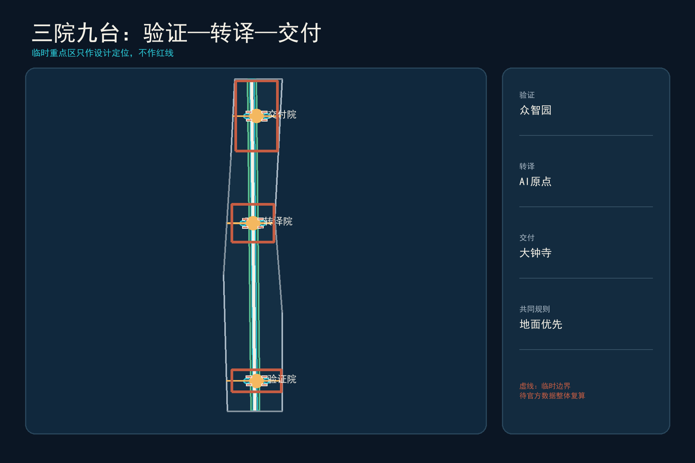
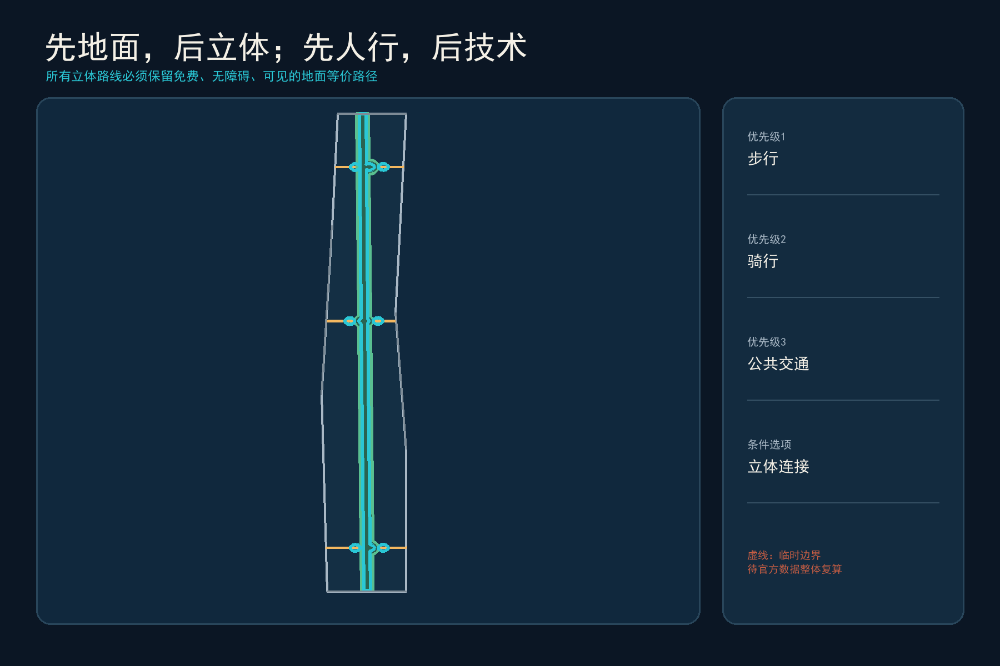
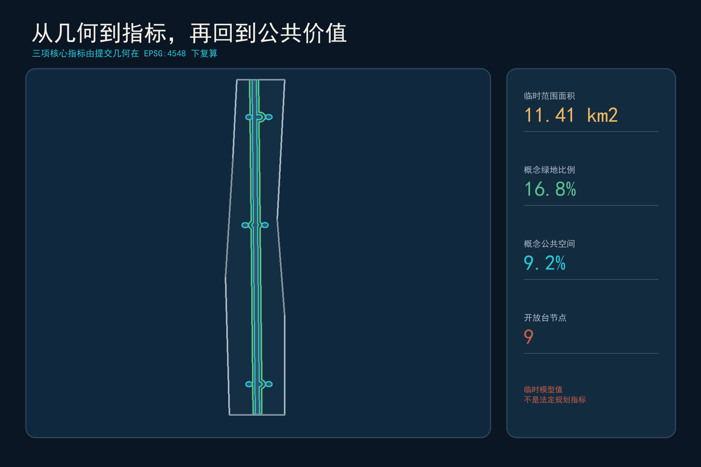

# 院台京张 / COURTYARD TERRACES

> 先把城市还给地面，再让创新向上生长。

## 设计依据与资料清单

本方案由香港大学参赛者视角出发，把北京视为创新资源最密集的“知识平原”，把香港视为检验高密度、轨道一体化和中西混合城市经验的“立体实验室”。正式依据是征集公告、智能体任务书、专业标准快照与公开来源登记；临时边界仅用于生成、展示和自检，不是官方红线 [source:OFFICIAL-ANNOUNCEMENT] [source:AGENT-TASKBOOK] [source:BOUNDARY-SOURCE]。当前总体设计边界与三处重点区均待官方 polygon 补齐，所有面积和比例须在其到位后整体复算。

“院台”不是风格拼贴。院，取中国四合院的共居尺度与西方学院 quadrangle 的开放学习传统；台，取香港把交通、工作、居住和公共活动叠合的立体效率。方案同时修正三类问题：北京超大街区和校园园区边界造成的步行断裂；西方创新区可能出现的科技绅士化和公共空间私有化；香港平台城市中地面消失、门禁化、过密和数字排斥。由此建立“公共地面权”：任何空中、地下或数字服务都必须有可见、无台阶、免费且有人协助的地面等价路径 [source:HKU-INTERSTITIAL-PUBLIC-SPACE] [source:HK-DEVB-WALKABILITY] [standard:BARRIER-FREE-ENVIRONMENT-LAW]。

## 三层范围工作框架

43.6平方公里统筹研究范围回答“如何形成跨校、跨园、跨城的AI创新生态”；约11.4平方公里总体设计范围回答“如何用公共地面、混合功能和渐进更新缝合京张两侧”；368.4公顷重点范围回答“三个院落如何分别完成验证、转译和交付”。三层均沿用公告口径，空间证据以提交的临时边界为准 [data:geometry/site_boundary.geojson#SITE-001] [metric:site_area_sqm] [depth:three_level_scope_framework]。

总体结构为“一地面、三院、九台、两翼”。一地面是南北连续、免费开放、优先步行骑行的 Civic Ground；三院分别是众智园“验证院”、AI原点“转译院”和大钟寺“交付院”；每院设置三座开放台，共九台，承载公共测试、学习、生活和国际交流；中关村科技服务翼与小月河场景赋能翼把资本、专业服务和真实城市问题接入三院。所有立体连接只在地面连续后才进入深化，不以天桥替代街道 [data:geometry/roads.geojson#ROAD-001] [depth:overall_spatial_structure]。

## 统筹研究范围产业与未来城市研究

方案比较六类创新区：香港科学园的全周期孵化与产业网络、新加坡 one-north 的工作—生活—游憩—学习混合、Kendall Square 对私有公共空间权利的公开登记、Cambridge Foundry 的工业遗产再用、Barcelona 22@ 的生产性混合城区、Paris-Saclay 的大学—产业—生态保护协同；MaRS Toronto 作为高密度知识机构共址的补充参照 [source:HKSTP-ECOSYSTEM] [source:JTC-ONE-NORTH] [source:CAMBRIDGE-KENDALL-POPS]。可移植的是空间与运营机制，不可复制的是企业名单、投融资规模、法定制度和建设指标。

| 案例 | 可学机制 | 必须修正/本地化 |
|---|---|---|
| 香港科学园 | 孵化—加速—产业合作—真实场景链 | 避免园区孤岛，接入居民日常公共服务 |
| one-north | 工作生活学习混合、绿链、灵活租期 | 防止功能包装化，公开公共回报 |
| Kendall Square | 公共空间权利、开放时间与法律状态可查 | 防止“看似公共、实则门禁” |
| Cambridge Foundry | 工业遗产、艺术、技术、职业教育共址 | 保留低门槛社区使用时段 |
| Barcelona 22@ | 生产性城市与住区混合 | 用可负担空间抑制排挤效应 |
| Paris-Saclay | 大学集群、公共交通、生态保育 | 不复制外围校园尺度，强化城市街道 |

产业生态不是招商名单，而是八要素回路：土地与空间以可逆更新供给；资金以分阶段里程碑进入；人才获得可负担居住和跨校社交；算力与数据按最小必要、可审计方式供给；场景在受控环境测试后才能进入公共空间；专业服务负责知识产权、法务和国际化；公众以问题、体验和退出权参与。三院分别承担“验证—转译—交付”，九台把后台流程变成可被城市看到的公共界面 [standard:PROJECT-AGENT-OPEN-CALL-TASKBOOK] [depth:industry_future_city_strategy]。

品牌名“院台京张 / COURTYARD TERRACES”使用“院”的方形留白与“台”的水平层线构成开放括号；砖红代表京张铁路与北京院落，海港青代表香港立体交通，金色节点代表可见的人类判断。Logo 不使用企业标识或受限字体，延展为地面导视、九台编号、活动章和开放数据图例。

## 总体设计范围城市更新与控规深度城市设计

总体设计首先保留连续公共地面，再安排增量体量。用地模型把研发、居住、社区服务、文化学习、商业服务和公园绿地组织成南北渐变的概念分区；它是完整、无缝的机器可读分区，但不代替法定用地和地块边界 [data:geometry/land_use.geojson#LU-001] [standard:MNR-LAND-USE-CLASSIFICATION-GUIDE] [depth:land_use_layout]。立体混合只在轨道与重点区节点建议研究，并以首层通透、地面24小时可识别、冬季日照和消防疏散为深化前提。

香港“轨道+社区”启发本方案把站点、就业、生活和公共服务同步组织，而不是照搬以房地产收益为主导的实施模式 [source:HK-MTR-RPLUSPROPERTY]。公共收益合同建议记录：地面通行宽度与开放时段、无障碍等价路径、低租金创新单元、社区服务面积、树冠与雨洪贡献、AI服务的人工兜底和退出责任。Kendall Square 对POPS开放状态的公开做法被转译为“九台公共账本”，每座台公开产权/运营主体、开放时段、无障碍方式、投诉入口和停运条件 [source:CAMBRIDGE-KENDALL-POPS]。

开发强度、建筑高度、道路红线、权属和市政容量均待正式数据补齐；本方案不提供伪精确值 [metric:floor_area_ratio] [depth:development_intensity_controls]。建筑图层只表达院台原型包络，不能被解释为现状建筑或拆改留结论。

## 重点区域详细设计

三院不是三个同质“AI园区”，而是创新生命周期的三个城市接口 [data:geometry/key_areas.geojson#PROV-KEY-001] [data:geometry/key_areas.geojson#PROV-KEY-002] [depth:three_key_area_detailed_design]。

1. **众智园验证院 / Proving Courtyard**：围绕清河蓝绿界面形成低层研发院、标准工坊和受控测试场；三台为“算力台、标准台、安全台”。开放参观与封闭测试分流，任何进入公共空间的系统先在这里完成安全、隐私、无障碍和人工接管测试。
2. **AI原点转译院 / Translation Courtyard**：以近校步行网络连接高校、孵化、社区和人才生活；三台为“开源台、共学台、生活台”。中国院落的可偶遇公共生活与西方学院四合院的跨学科讨论在这里合并，首层提供公共学习、IP法务和小团队空间。
3. **大钟寺交付院 / Adoption Courtyard**：围绕轨道站点提出地面优先的四象限步行联系，再研究有条件的立体连通；三台为“路演台、市场台、国际台”。借鉴香港站城一体化效率，同时禁止把公共路径藏入商场门禁。

每院采用同一深化检查表：现状与权属调查、保留价值、首层公共性、无障碍与冬季气候、消防和市政、数据与隐私、运营主体、停运与复原。正式边界到位后，三院连同全部用地、建筑、道路、绿地、公共空间、分期和指标一次性重算。

## AI 创新生态、人才画像与 AI+ 场景

六类人物是：开源开发者、初创团队、高校师生、头部企业与国际访客、周边居民与小商户、老年人/残障人士/低数字素养者。最后一类不是附加用户，而是所有场景的“失效测试者”：若没有智能手机、拒绝人脸识别或AI停机仍无法获得同等服务，场景不得进入公共运营 [standard:GENERATIVE-AI-INTERIM-MEASURES] [standard:ELDERLY-SMART-TECH-PLAN-2020-45] [depth:public_service_facilities]。

| # | 场景卡 | 空间 | 人工兜底与退出 |
|---:|---|---|---|
| 01 | 模型安全红队工坊 | 验证院·安全台 | 人类安全负责人签署；失败即下线 |
| 02 | 端侧算力预约与碳账 | 验证院·算力台 | 柜台预约；不采集无关身份信息 |
| 03 | 城市机器人慢速试验 | 验证院·标准台 | 物理隔离、现场接管、限定时段 |
| 04 | 开源发布与贡献墙 | 转译院·开源台 | 可匿名浏览；荣誉可撤回更正 |
| 05 | AI学习伙伴 | 转译院·共学台 | 教师/导师在环；不替代教学评价 |
| 06 | 社区照护导航 | 转译院·生活台 | 电话和人工窗口并行 |
| 07 | 多语种城市接待 | 交付院·国际台 | 人工翻译可接管；标明机器生成 |
| 08 | 智能终端体验与维修 | 交付院·市场台 | 维修权、退货与隐私清除流程 |
| 09 | 中小企业合规助手 | 交付院·路演台 | 专业律师/会计复核，不作审批 |
| 10 | 无障碍慢行导航 | 公共地面 | 触觉/高对比/人工问询等价路径 |
| 11 | 遗产声音档案 | 京张文化节点 | 仅用清权录音；可选择静默体验 |
| 12 | 公共空间维护协作 | 九台 | 聚合报修，不做人脸追踪或评分 |

前三项构成产业验证场景：模型安全、端侧算力与城市机器人；它们采用“封闭测试—预约半开放—可撤回公共试点”三级门。其余场景把技术嵌入日常服务，但不把未成熟技术写成全面部署。任何投诉、偏差或安全事件进入公开处置流程，公众可查询系统目的、数据类型、负责人和退出方式。

## 用地、建筑规模与拆改留方案

七个概念用地带完整覆盖临时总体范围，服务一地面三院九台结构；科研与混合服务集中于三院，居住和社区服务嵌入中段，文化学习与绿地形成连续公共界面 [data:geometry/land_use.geojson#LU-004] [metric:building_footprint_area_sqm] [depth:retain_renovate_demolish]。这是一套可重算功能模型，而不是对现状地块性质的判断。

拆改留采用“四步门”而非预设清单：先查历史、结构、碳和社区价值；能保留则保留，能通过内装和首层开放解决则改造；只有公共安全或关键网络无法通过改造满足、并完成权属和专业论证时才讨论拆除；新增建设优先填补轨道节点服务缺口。建筑图层中的“保留/适应性再用/新建”均带 pending survey 标记，不对应具体产权建筑 [data:geometry/buildings.geojson#BLDG-001]。

空间原型为“低院—通台—轻塔”：低院保留北京日照和交往尺度；通台在二层以内提供可见、可回到地面的共享层；轻塔仅在正式控规和风环境允许的轨道节点研究。香港垂直 freespace 的经验被保留，而封闭台基、暗街和小户型挤压被明确排除 [source:HKU-VERTICAL-FABRIC] [depth:height_massing_character]。

## 交通、轨道、市政与公共服务设施

交通优先级为步行—自行车—公共交通—共享接驳—必要机动车。公共地面主脊贯穿南北，三条东西院街连接三院与两翼；九台是遮阴避雨、冬季向阳、可坐可停的慢行节点 [data:geometry/roads.geojson#ROAD-001] [depth:traffic_rail_slow_parking]。香港三维步行网络提供了多层连接经验，但本方案规定地面路线先行、空中连廊后置，并对开放时段、坡度、电梯故障和夜间可达性进行逐项审查。

市政与新基建采用“小单元、可替换、可离线”：端侧算力柜、充电和传感设施集中在可维护节点，不侵占盲道与消防通道；数据在现场尽量完成处理；能源、热环境和雨洪设施与绿地共同设计。具体管线、负荷和设备规格待专业资料确认 [depth:municipal_new_infrastructure] [source:HK-DEVB-WALKABILITY]。

公共服务坚持“双通道”：数字预约与现场排队、智能导航与人工问询、无现金与传统支付、自动翻译与人工协助并行。九台至少各有一处不依赖智能手机的服务入口；这是一项设计承诺，实际服务范围仍需运营方和主管部门确认。

## 蓝绿空间、公共空间与城市风貌

概念绿脊沿公共地面组织，三座院园在重点区形成可停留节点；九台将绿地、雨洪、公共学习和日常服务叠合。绿色空间比例和公共空间比例是从提交几何复算的临时设计模型值，不是法定绿地率或公共空间指标 [data:geometry/green_space.geojson#GREEN-001] [data:geometry/public_space.geojson#PUBLIC-001] [metric:green_ratio]。

气候转译拒绝复制香港形式：香港遮雨、遮阳和高湿通风经验转为北京“夏遮阳、冬得日、挡冬风、可除雪”的季节性廊架；平台绿化必须与地面土壤、树冠和雨洪系统相连；玻璃连廊不作为默认答案。小尺度缝隙空间借鉴港大 Interstitial Hong Kong 研究，优先成为座椅、饮水、儿童游戏、安静休息和小型展示，而非广告与设备堆场 [source:HKU-INTERSTITIAL-PUBLIC-SPACE] [depth:blue_green_public_space]。

文化叙事是“工程自主—知识开放—公共判断”：京张铁路代表自主工程与跨越障碍，中关村代表知识转化与创业文化，香港代表中西制度与高密度城市经验的持续协商，AI新文化则必须允许人质疑、关闭和修正。三处朝圣地标为“百年工程刻度庭”“开源贡献院”“城市AI责任台”；它们展示方法和贡献者，不制造巨型科技雕塑。

## 更新项目清单、实施政策与分期计划

近期（0—2年）先做不依赖大规模建设的公共地面核查、无障碍断点修补、三院临时开放台和数据/责任登记；中期（3—5年）在正式边界、权属和控规确认后推进适应性再用、轨道站点首层开放和三院九台建设；长期（6年以上）才研究立体混合、能源算力协同与跨区域运营 [data:geometry/phasing.geojson#PHASE-001] [depth:phasing_implementation]。

八项概念项目为：Civic Ground连续性审计、众智园验证院、原点转译院、大钟寺交付院、九台公共账本、可负担创新空间协议、气候适应廊架组件、AI服务退役与场地复原机制。每项必须有公共责任主体、专业深化团队、前置数据、成本级别、停止条件和复原责任；无权属、资金或审批时不得承诺开工 [depth:renewal_project_list]。

年度运营形成“四季一会”：春季 Open Source Courtyard 开源周、夏季 Civic Ground 城市测试季、秋季 Jing-Zhang Centennial 文化与工程论坛、冬季 Human-in-the-Loop 公共治理演练，以及年度 Courtyard Terraces Assembly。活动从体验者进入训练营、从训练营进入试点、从试点进入采购/投资或退出复盘，避免只做会展流量。开发者社区维护公开问题库、场景许可、责任人和版本记录。

## 指标体系、面积复算与合规矩阵

三项核心视觉指标由提交几何在 EPSG:4548 下复算，并与离线可视化一致：临时总体范围面积、概念绿地比例、概念公共空间比例 [metric:site_area_sqm] [metric:green_ratio] [metric:public_space_ratio]。建筑基底面积只统计概念原型；FAR、建筑高度和法定绿地率保持待正式数据补齐。

指标分三层：空间层核查面积、比例、节点和连通；运营层跟踪开放时段、人工兜底可用率、投诉闭环、试点停机和社区使用；公共价值层关注可负担空间、弱势群体可达、遗产再用和公共空间真实开放。后两层需在试点后取得现场基线，当前不虚构绩效数值 [depth:metrics_recalculation]。

合规矩阵覆盖公告1.3、1.4、1.5和agent.1—agent.6；标准矩阵区分强制依据与背景政策；设计深度矩阵记录哪些成果完成、哪些仍受官方数据限制。AI生成的可视化和图纸服务人类理解，GeoJSON与结构化指标仍是审计依据。

## 风险、版权与合规说明

首要风险是临时边界可能与真实京张遗址公园和重点区偏离；Issue #846 已记录相关不确定性，因此本方案不将临时图形解释为道路、地块或权属边界 [source:BOUNDARY-SOURCE] [depth:risk_missing_data]。其次是香港经验被形式化复制：对策是每个转译都附北京气候、公共性、审批和运维检查。第三是创新区推高租金和挤出居民：对策是将可负担空间与社区服务写入公共收益合同。第四是AI监控和数字排斥：对策是数据最小化、公开责任、人工复核、离线等价与可停机。

所有空间建议均为开放共创的概念建议、参考方案或可供专业团队深化研究，不替代正式规划，不构成政府审定、投资承诺、工程可行性或具体拆改留结论。封面和氛围图为AI生成的概念表现，不是现场照片；五张核心图由提交几何与指标生成。第三方网页图片、企业Logo、人物肖像和受限字体未被再分发，完整说明见 `report/copyright_statement.md`。

## 参考资料

正式任务依据与许可边界见 `sources.json`。核心包括：征集公告与任务书 [source:OFFICIAL-ANNOUNCEMENT] [source:AGENT-TASKBOOK]；香港轨道与城市经验 [source:HK-MTR-RPLUSPROPERTY] [source:HKU-INTERSTITIAL-PUBLIC-SPACE]；全球创新区比较 [source:JTC-ONE-NORTH] [source:CAMBRIDGE-FOUNDRY] [source:PARIS-SACLAY]。所有外部来源仅用于比较和方法转译，未用于生成官方边界、法定指标或实施承诺。
