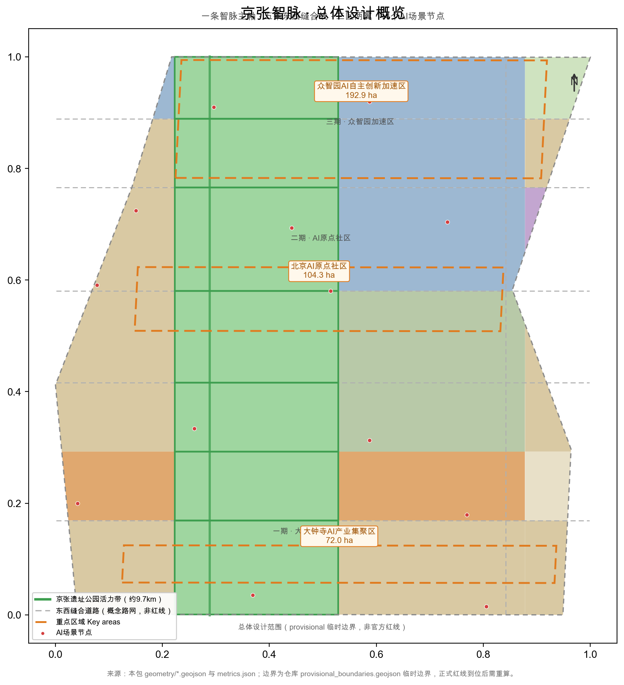
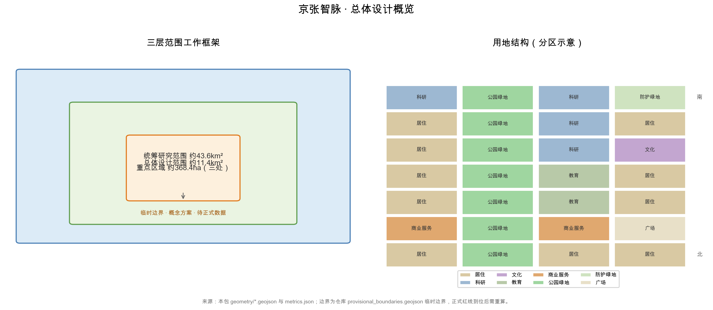
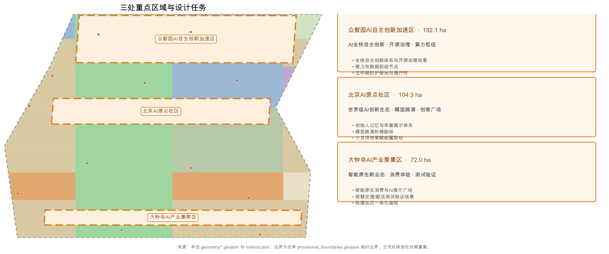
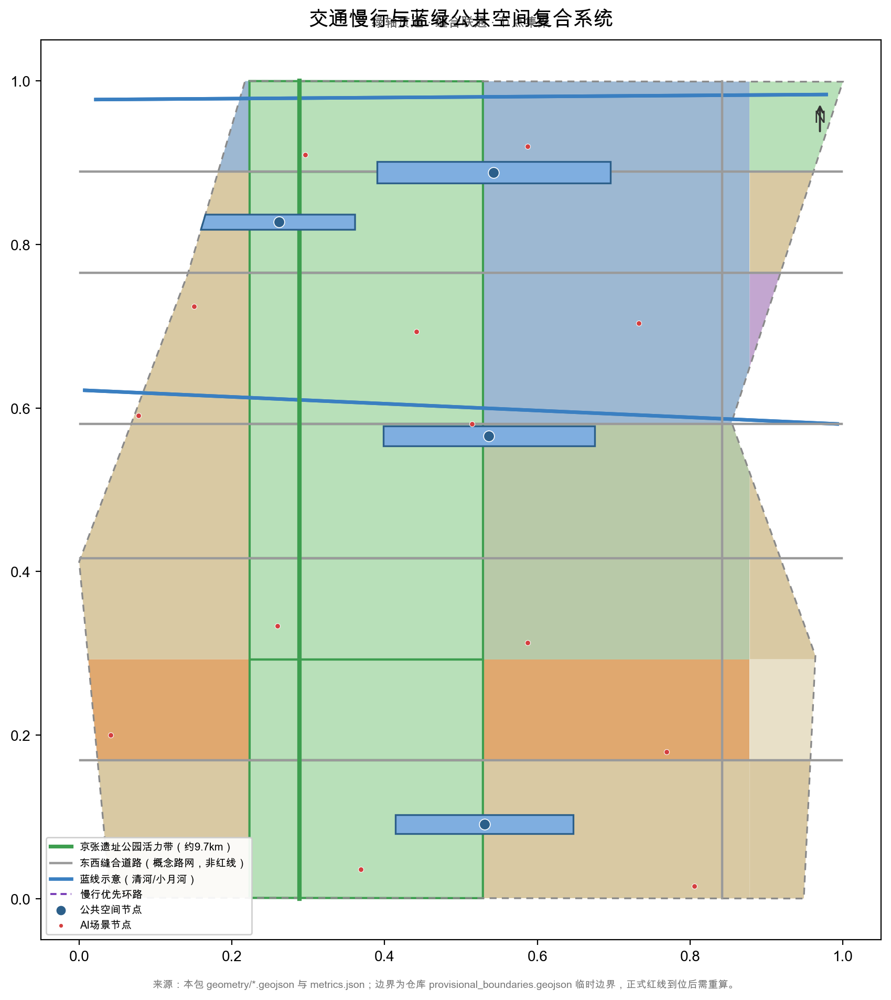
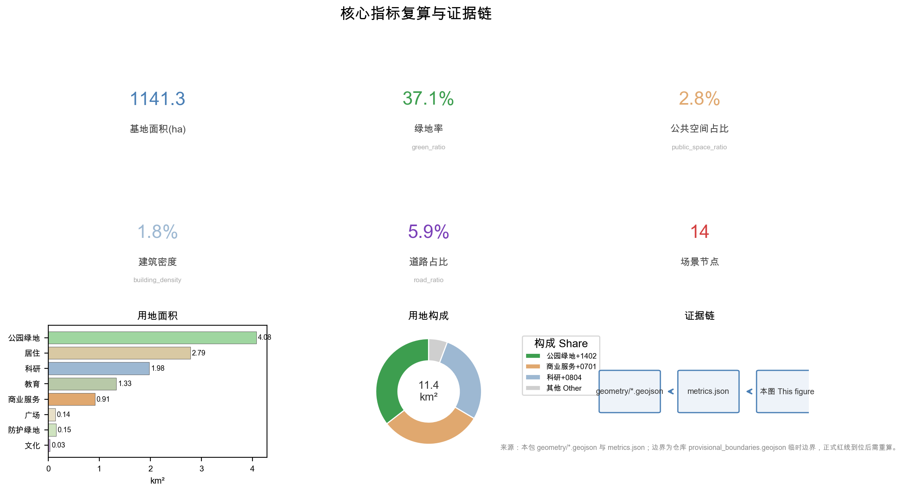

# 京张智脉：百年京张AI创新带总体设计

## 设计依据与资料清单

本方案以北京市规划和自然资源委员会海淀分局《百年京张AI创新带城市设计国际方案征集资格预审公告》为第一依据 [source:OFFICIAL-ANNOUNCEMENT] [standard:PROJECT-OFFICIAL-ANNOUNCEMENT]，并以仓库 site-package 中用户提供并清权的《面向全球智能体的百年京张AI创新带城市设计开源征集任务书》摘录组织智能体任务 [source:AGENT-TASKBOOK] [standard:PROJECT-AGENT-OPEN-CALL-TASKBOOK]。两份文件共同定义三大定位、五大功能、三区两翼布局与六项智能体任务，是本文全部设计判断的出发点。

资料按用途分三级管理 [source:SOURCE-REGISTRY] [source:BOUNDARY-SOURCE]。第一级为 formal-ready：官方公告、任务书摘录、住建部与自然资源部公开规章，可用于支撑设计深度、用地分类与控规深度要求；第二级为 background：京张铁路遗址公园公开报道与行业通识，仅用于背景叙事；第三级为 provisional-only：provisional_boundaries.geojson 等临时几何数据，仅可用于概念生成与自检，不能作为官方红线、精确面积或法定结论依据 [source:SITE-PACKAGE] [source:PROCESSED-FACT-PACK]。

法定管控类依据目前存在明确缺口：官方控规数据、正式边界 polygon、现状建筑与权属底数、道路红线与市政管线资料均未到位。因此本方案对容积率、建筑高度、拆改留分类、道路红线与工程可行性一律不给出结论，统一记为"待正式控规数据补齐" [depth:existing_conditions_diagnosis] [depth:development_intensity_controls] [depth:retain_renovate_demolish]。

上图说明本方案的证据链组织：公告与任务书 → 临时边界与图层 → 指标复算 → 自检与合规矩阵 → 正文结论。本文五张图件均由本包 GeoJSON 与 metrics 派生，分别对应证据链组织、三层范围、重点区域、交通蓝绿复合系统与指标复算五个关键论证环节。

## 三层范围工作框架

三层范围逐级落实产业战略、总体城市设计与重点片区详细设计 [depth:three_level_scope_framework]。统筹研究范围依据公告文字边界约为43.6平方公里，北至北五环路、东至京藏高速、南至西直门外大街、西至万泉河路，工作目标是确定AI产业生态、未来城市形态与三区两翼协同关系；总体设计范围约为11.4平方公里，以京张遗址公园周边1-2公里城市地区和产业区为主，是本次控规深度城市设计的主战场；重点区域范围自北向南为众智园、北京AI原点社区、大钟寺三处，官方文字面积合计约368.4公顷。

本包临时边界复算的总体设计范围面积为11412825.386平方米 [metric:site_area_sqm]，三处重点区域复算面积分别为众智园1929201.877平方米、AI原点社区1043236.909平方米、大钟寺720454.219平方米 [metric:key_area_area_zhongzhiyuan_ai_acceleration_area] [metric:key_area_area_beijing_ai_origin_community] [metric:key_area_area_dazhongsi_ai_industry_cluster]，分别对应临时重点区图层 [data:geometry/key_areas.geojson#PROV-KEY-001] [data:geometry/key_areas.geojson#PROV-KEY-002] [data:geometry/key_areas.geojson#PROV-KEY-003]。必须声明：上述边界均为临时边界、非官方红线，复算面积与官方文字面积的微小差异源于临时多边形，正式边界到位后所有图层与指标需重算 [source:KEY-AREA-SOURCE]。

三层范围不是割裂的图纸集合，而是逐级收敛的证据链：统筹研究层回答"为什么"，总体设计层回答"落哪里"，重点区域层回答"怎么建"。本文所有空间结论均以"概念建议/参考方案/供专业团队深化"表述，任何一层结论都可沿图层与指标回溯到本包结构化数据，避免口号式判断 [source:AGENT-TASKBOOK]。

## 统筹研究范围产业与未来城市研究

**总体概念与命名体系（agent.1）。** 方案建议总体概念名称为"京张智脉"（Jing-Zhang AI Pulse），形成"智脉一带"命名体系：一带（京张智脉）统领三区两翼，三区即众智园AI自主创新加速区、北京AI原点社区、大钟寺AI产业集聚区，两翼即中关村科技服务翼与小月河场景赋能翼，并延伸出14个AI场景节点 [metric:scenario_node_count]。命名逻辑强调"智脉"的双重含义——既是沿原京张铁路廊道展开的城市"动脉"，也是AI算力、数据与人才流动的"神经脉冲"，呼应百年京张与AI新生的时间纵贯关系。该命名与Logo方向均为概念提案，不替代官方命名，未经授权的字体、图形与商标不得使用 [source:AGENT-TASKBOOK] [standard:PROJECT-AGENT-OPEN-CALL-TASKBOOK]。

**Logo与视觉识别方向。** 概念上以"人字形轨道×脉冲波形"为核心图形：两条折线相交模拟京张铁路青龙桥人字形线路与数字信号脉冲的叠合，交汇点即"原点"（AI原点社区），寓意历史分岔处产生新的智能方向；辅助图形为延伸的轨道枕木与数据节点。色彩建议采用铁路锈红（历史层）、中关村科技蓝（创新层）与脉冲青绿（AI活力层）三色体系。Logo仅提供方向性描述，正式标识须委托专业团队设计并完成清权 [depth:overall_spatial_structure]。

**三大定位、五大功能与三区两翼协同回路。** 三大定位为百年京张文化带、都市AI生活体验带、AI融合创新带；五大功能为AI全栈自主创新体系、世界级AI创新生态、AI+场景赋能新范式、智能化AI活力城市、AI治理全球话语权 [source:AGENT-TASKBOOK]。协同回路为：AI原点社区（世界级创新生态）—众智园（全栈自主创新与治理话语权）—大钟寺（智能原生新业态），两翼分别提供要素全球化配置、中关村IP与资本赋能以及场景赋能与活力城市支撑。三区两翼通过五条东西向缝合线实现人才、数据与资本流动，形成"创新策源—加速转化—场景落地—资本回投"闭环。

**总体空间结构。** 建议形成"一条智脉主轴、五条缝合线、三区两翼、14个AI场景节点"的空间结构 [metric:scenario_node_count] [depth:overall_spatial_structure]。智脉主轴即原京张铁路廊道，概念慢行主轴长约9.7公里 [metric:greenway_km]，串联遗址公园活力带与三区；五条缝合线为东西向道路与绿带缝合，修复铁路分隔造成的南北片区割裂；14个场景节点沿主轴与缝合线交错分布，承载测试、展示、体验与治理功能。

**全球AI创新生态案例（agent.2）。** 以下8个案例均来自公开资料综述、非承诺，仅用于提炼可转化经验 [depth:overall_spatial_structure]：

| 案例 | 核心特征（公开资料综述） | 对本地可转化经验 |
| --- | --- | --- |
| 硅谷斯坦福研究园 | 大学策源—园区转化—风险资本走廊一体化 | 研究机构与创业公司物理邻近，对应原点社区近校布局 |
| 深圳南山科技园 | 龙头企业带动产业链集聚 | 链主牵引的产业空间组织方式 |
| 杭州城西科创大走廊 | 走廊式空间组织、多点创新极核 | 线性主轴串联功能片区的空间模式 |
| 新加坡纬壹科技城（one-north） | "工作-生活-休闲-学习"混合园区 | 统一品牌运营与公共客厅设计 |
| 伦敦国王十字（King's Cross） | 铁路枢纽再开发与知识产业导入 | 历史车站与创新社区共生，对应京张遗址再利用 |
| 上海张江科学城 | 大科学装置集聚、梯度空间供给 | "研发-中试-量产"的梯度空间组织 |
| 慕尼黑马普所与IT集群 | 基础研究-龙头-中小企业共生生态 | 稳定制度与长期投入的治理耐心 |
| 东京丸之内 | 商务区总部集聚与城市品质提升 | 国际化接待与展示功能组织 |

对京张智脉的可转化经验集中为四条：第一，以"近校策源+园区加速+场景验证"组织创新链，对应AI原点社区与中关村科技服务翼；第二，以连续公共空间承载创新交往，对应京张智脉主轴与公共空间体系；第三，以混合功能街区而非单一园区组织职住服关系，对应三区内部产城融合结构；第四，以统一品牌与活动运营沉淀长期资产，对应下文活动体系与开发者社区运营建议 [source:AGENT-TASKBOOK] [source:PROCESSED-FACT-PACK]。

## 总体设计范围城市更新与控规深度城市设计

总体设计范围按控制性详细规划的城市设计深度组织，重点回答产业目标、功能布局、更新框架、公共空间、交通市政与风貌控制如何相互支撑 [standard:MOHURD-CONTROL-DETAILED-PLANNING] [depth:land_use_layout]。本包用地图层由28个用地单元组成，按7个横向区段与4列（西侧片区、京张遗址公园绿带、东侧内列、东侧外列）组织 [data:geometry/land_use.geojson#LU-001]，用地总面积与总体范围闭合一致 [metric:land_use_area_total]。

用地分项：居住用地278.6万平方米（0701）、科研用地197.9万平方米（0802）[metric:land_use_area_0701] [metric:land_use_area_0802]，教育用地133.5万平方米（0804）、商业用地91.4万平方米（05）[metric:land_use_area_0804] [metric:land_use_area_05]，文化用地3.1万平方米（0803）[metric:land_use_area_0803]，公园绿地408.1万平方米（1401）、防护绿地15.1万平方米（1402）、广场13.6万平方米（1403）[metric:land_use_area_1401] [metric:land_use_area_1402] [metric:land_use_area_1403]。科研、教育与商业功能合计构成产业与人才服务基础，绿地沿遗址廊道集中，形成"绿核+功能组团"的概念格局。

该格局是"概念用地结构"，不是法定用地规划；功能比例、道路红线与开发强度均待正式控规数据补齐 [depth:development_intensity_controls] [source:SITE-PACKAGE]。城市更新总体框架围绕"低效空间识别—更新对象分级—实施项目打包—分期滚动"展开 [depth:retain_renovate_demolish]。建筑图层为65栋概念建筑，总基底面积204758.129平方米 [metric:building_footprint_area_sqm]，建筑密度约1.8% [metric:building_density]，反映"低密度更新"的概念取向——大量现状建筑因底数缺失暂不计入，不得据此推断任何法定拆改留结论 [depth:existing_conditions_diagnosis]。

风貌控制建议以遗址廊道为视觉主轴，控制沿线建筑体量与屋顶形态，形成"历史层—创新层—生活层"三段式城市基调 [depth:height_massing_character] [standard:MOHURD-URBAN-DESIGN-MEASURES]。所有建筑高度、体量与退线要求均待正式控规条件确认后校核，本方案不给出任何审定数值。

## 重点区域详细设计

三处重点区域按规划综合实施方案的城市设计深度组织，每处均给出定位、空间结构、建筑更新、交通慢行、公共空间、AI场景与实施风险七个方面 [depth:three_key_area_detailed_design]，几何依据为临时重点区图层 [data:geometry/key_areas.geojson#PROV-KEY-001] [data:geometry/key_areas.geojson#PROV-KEY-002] [data:geometry/key_areas.geojson#PROV-KEY-003]，数量由指标复核 [metric:key_area_count]。三处区域全部基于临时边界，下文结论均为方向性设计，正式边界到位后需重算。

### 众智园AI自主创新加速区

定位为"花园型全栈自主创新加速区"，承载AI全栈自主创新体系、开源治理与算力枢纽功能，并与AI治理全球话语权挂钩 [source:AGENT-TASKBOOK]。临时边界复算面积1929201.877平方米 [metric:key_area_area_zhongzhiyuan_ai_acceleration_area]。空间结构建议沿清河界面展开"测试走廊—开源广场—算力园区"三级空间 [data:geometry/key_areas.geojson#PROV-KEY-001]。建筑更新建议以保留现有科研空间底数核实为前提，优先盘活低效用地，建筑高度与体量控制待正式控规数据补齐 [depth:retain_renovate_demolish]。交通慢行建议组织北五环方向的对外接驳，清河滨水步道与遗址廊道联通，形成园区内部慢行环。公共空间以开源广场为核心，结合防护绿地与清河蓝绿空间组织 [metric:land_use_area_1402]。AI场景建议布置大模型评测场、安全治理沙盒、低碳算力体验等测试验证节点。实施风险：清河蓝线、五环周边管控、控规强度与现状权属均待核实，任何桥隧或工程可行性结论均被排除 [depth:risk_missing_data] [source:SITE-PACKAGE]。

### 北京AI原点社区

定位为"近校型成果转化与人才特区"，依托周边高校策源，承担世界级AI创新生态的组织功能 [source:AGENT-TASKBOOK]。临时边界复算面积1043236.909平方米 [metric:key_area_area_beijing_ai_origin_community]。空间结构建议以"创客广场—模型路演阶梯剧场—近校成果转化街"为核心骨架，校区、园区、街区通过慢行缝合线连通 [data:geometry/key_areas.geojson#PROV-KEY-002]。建筑更新建议围绕成果发布、人才服务与居住生活配套组织功能置换，具体拆改留分类待现状底数与控规数据补齐后确定 [depth:retain_renovate_demolish]。交通慢行建议强化五道口、清华东路西口与轨道站点的慢行接驳，组织校区-园区无车化慢行通廊。公共空间以AI原点创客广场为核心，兼作成果发布与社区交往场所。AI场景建议布置大模型路演阶梯剧场、开源广场·智能体发布节点、近校成果转化驿站等节点 [depth:overall_spatial_structure]。实施风险：校区边界与园区权属敏感，社区运营须以公共利益优先并严格人工复核 [source:AGENT-TASKBOOK]。

### 大钟寺AI产业集聚区

定位为"城市型智能原生消费与测试验证街区"，承载智能原生新业态与AI客厅广场功能 [source:AGENT-TASKBOOK]。临时边界复算面积720454.219平方米 [metric:key_area_area_dazhongsi_ai_industry_cluster]。空间结构建议围绕大钟寺站组织四象限步行连通，形成"AI客厅广场—智能原生商业街—数据要素会客厅"的空间序列 [data:geometry/key_areas.geojson#PROV-KEY-003]。建筑更新建议结合商业、办公与公共空间的复合利用，保留既有商业活力，拆改留分类待正式控规数据补齐。交通慢行以大钟寺站一体化开发为核心，解决路口四象限割裂问题，强化步行优先 [depth:traffic_rail_slow_parking]。公共空间以AI客厅广场为核心，结合规划绿地复合利用。AI场景建议布置智慧交通测试交叉口、无人机配送测试点、AI消费舱、数据要素会客厅等节点。实施风险：轨道站点建设时序、交叉口工程条件与商业权属复杂，测试类场景须经安全与隐私合规评估后方可开放 [depth:risk_missing_data]。

## AI 创新生态、人才画像与 AI+ 场景

AI创新生态覆盖"人才—企业—资本—场景—治理"五要素 [source:AGENT-TASKBOOK] [standard:PROJECT-AGENT-OPEN-CALL-TASKBOOK]。方案提出6类用户画像（满足不少于5类的要求）[depth:overall_spatial_structure]：

| 用户画像 | 典型需求 | 空间响应 |
| --- | --- | --- |
| AI研究员 | 算力、数据、实验、国际交流 | 众智园评测场与科研共享空间 |
| 开发者/创业者 | 低成本办公、发布、测试、融资 | 原点社区孵化空间与开源广场 |
| AI企业高管 | 展示、商务、国际接待 | 大钟寺路演客厅与数据要素会客厅 |
| 高校师生 | 成果转化、跨校协作、日常慢行 | 原点近校成果转化街与慢行缝合线 |
| 周边居民与银发用户 | 无障碍、生活服务、公共参与 | 遗址公园公共服务带与AI生活服务样板街 |
| 政府治理者 | 监测、治理、决策支持 | 城市智能体治理沙盒与安全评测 |

AI+场景体系共12张场景卡（满足不少于10张的要求），其中3张为产业测试验证场景（智慧交通测试交叉口、大模型评测场、无人机配送测试点，满足不少于3张的要求），全部为概念建议、未经批准运营 [depth:overall_spatial_structure] [metric:scenario_node_count]：

| 场景卡 | 空间位置 | 服务对象 | 隐私边界与人工复核 |
| --- | --- | --- | --- |
| 智慧交通测试交叉口（测试验证） | 大钟寺片区测试节点 | 企业、研究院 | 仅采集匿名交通流，数据不出试点范围，交管部门人工复核 |
| 大模型评测场（测试验证） | 众智园 | 模型企业、研究者 | 评测样本须授权，输出须标注AI生成，设人工终审 |
| 无人机配送测试点（测试验证） | 大钟寺与清河翼 | 物流企业、居民 | 遵守禁飞区与噪声管控，逐架次审批与人工放行 |
| AI消费舱 | 大钟寺AI客厅广场 | 居民、游客 | 舱内行为数据不保留，消费记录匿名化，人工客服兜底 |
| 开源广场·智能体发布节点 | AI原点社区 | 开发者、社区 | 代码与署名公开，个人轨迹不采集，内容审核人工把关 |
| 大模型路演阶梯剧场 | AI原点社区 | 高校、企业、公众 | 路演内容人工审核，录像须同意，AI生成内容标注 |
| 近校成果转化驿站 | 原点社区近校界面 | 高校师生 | 科研成果与论文图像须授权，法务与知识产权人工复核 |
| 端侧算力服务点 | 总体范围节点 | 中小企业 | 算力数据本地化，服务协议明示，运营方人工审计 |
| 数据要素会客厅 | 大钟寺 | 数据服务商、公众 | 展示脱敏数据，流通合规审查，授权与审计人工复核 |
| AI生活服务样板街 | 社区与商业交汇处 | 居民、银发用户 | 禁止留存人脸与行为数据，适老辅助由人工值守 |
| AI+教育互动课堂 | 高校周边节点 | 师生、居民 | 未成年人数据特别保护，课堂内容教师人工审定 |
| 城市智能体治理沙盒 | 众智园 | 政府治理者、专家 | 沙盒数据闭环隔离，治理建议经专业与公众复核 |

场景运营遵循数据最小化、公开来源、可解释与人工复核四项原则，任何场景均不得采集未经授权的个人画像，不得把未成熟技术写成已可全面部署 [source:AGENT-TASKBOOK]。小月河场景赋能翼作为"智能化AI活力城市"的试验场，承接生活、交通与公共服务类场景的规模化试点 [depth:overall_spatial_structure]。

## 用地、建筑规模与拆改留方案

用地结构按国土空间用地用海分类表达，形成完整闭合的用地分区 [standard:MNR-LAND-USE-CLASSIFICATION-GUIDE] [depth:land_use_layout] [data:geometry/land_use.geojson#LU-001]，总体范围用地总面积与边界面积闭合 [metric:land_use_area_total] [metric:site_area_sqm]。居住、科研、教育、商业四类功能合计约701.3万平方米，构成产业与人才服务的空间基础；绿地与广场合计约436.8万平方米，支撑人才生活品质 [metric:green_space_area_sqm] [metric:public_space_area_sqm]。

建筑规模方面，概念建筑图层共65栋，总基底面积204758.129平方米 [metric:building_footprint_area_sqm]，建筑密度约1.8% [metric:building_density]；概念总建筑面积1635693.039平方米，为低置信度概念设计量 [metric:total_floor_area_sqm]，概念容积率0.143 [metric:conceptual_far]。必须强调：概念容积率不等于法定容积率，法定容积率状态为unknown，待正式控规数据补齐后复算 [metric:floor_area_ratio] [depth:development_intensity_controls]。

拆改留方案只提出分级方法，不给出任何法定结论 [depth:retain_renovate_demolish]。建议按"保留核实—改造提升—更新导入—待确认"四级建立现状建筑底数台账：保留类指历史与文保要素；改造类指功能可置换建筑；更新导入类指低效空间盘活；待确认类指底数缺失对象。由于现状建筑、权属、控规与工程条件均未到位，具体拆改留清单须待正式控规数据补齐与底数调查后确定，本文不列任何地块级拆改留结论 [depth:existing_conditions_diagnosis] [source:SITE-PACKAGE]。

## 交通、轨道、市政与公共服务设施

交通策略以"轨道为骨架、慢行为脉络、测试为特色"组织 [depth:traffic_rail_slow_parking]。概念路网面积678055.077平方米，道路占比约5.9% [metric:road_area_sqm] [metric:road_ratio]；必须声明道路为概念路网、非红线，线形与等级待正式控规数据补齐 [data:geometry/roads.geojson#ROAD-001]。京张智脉慢行主轴概念长度9.733公里 [metric:greenway_km]，承担遗址游览、通勤与测试体验的复合功能。轨道方面建议大钟寺站一体化、五道口与清华东路西口慢行接驳，轨道线位与站点深化不属于本方案范围，工程结论一律排除 [depth:traffic_rail_slow_parking]。

市政与公共服务设施按"传统市政+新型基础设施"双轨组织 [depth:municipal_new_infrastructure]。传统市政包括道路微循环、停车与非机动车组织，管线与消防条件待正式工程资料补齐；新型基础设施建议以分布式能源、端侧算力、智能感知为方向，结合AI场景节点布置。公共服务设施覆盖创新服务平台、人才生活服务与无障碍设施，依据《无障碍环境建设法》要求融入设计 [source:SITE-PACKAGE] [depth:existing_conditions_diagnosis]。

## 蓝绿空间、公共空间与城市风貌

蓝绿空间以京张遗址公园活力带为脊柱，统筹清河、小月河蓝线约束与五环侧防护绿地 [depth:blue_green_public_space] [data:geometry/green_space.geojson#GREEN-001]。绿地空间总面积为4232066.778平方米，绿地率约37.1% [metric:green_space_area_sqm] [metric:green_ratio]；公共空间总面积为319986.638平方米，占比约2.8% [metric:public_space_area_sqm] [metric:public_space_ratio]。建议形成AI原点创客广场、众智园开源广场、大钟寺AI客厅广场、小月河滨水交往带4处公共空间节点 [data:geometry/public_space.geojson#PUBLIC-001]。文保、绿地与蓝线约束以概念示意表达，正式管控范围待官方核实 [source:SITE-PACKAGE]。

城市风貌建议以"历史层—创新层—生活层"控制基调 [depth:height_massing_character] [standard:MOHURD-URBAN-DESIGN-MEASURES]。历史层沿遗址廊道保留铁路工业遗存质感，创新层以三区建筑体量、屋顶形态与公共艺术表达AI气质，生活层以街区尺度与社区服务空间为主。

**AI朝圣地标与荣誉展示（agent.4）。** 建议设置3处以上AI朝圣地标与荣誉展示节点，均为概念建议、不得视为已批准建设：一是"AI原点·创始人记忆馆"，置于AI原点社区，追溯中关村创业者与AI开发者记忆，与中关村创新文化一脉相承；二是"开源广场·智能体发布节点"，面向开发者社区，作为代码发布、贡献墙与荣誉展示的公共空间；三是"大模型路演阶梯剧场"，依托京张遗址公园绿带设置，承载模型发布、国际路演与公众体验 [source:AGENT-TASKBOOK]。三处节点与京张遗址公园、中关村文化、开发者社区的关系是：遗址公园提供时间纵深感，中关村文化提供创新谱系，开发者社区提供持续内容，共同构成"历史—创新—未来"的朝圣叙事。

**三层文化叙事与导视符号（agent.5）。** 文化叙事分三层。第一层为百年京张铁路文化，基于公开通识史料——京张铁路建于20世纪初，由詹天佑主持设计，青龙桥车站采用"人字形"展线解决关沟陡坡问题，是中国自行设计建造的干线铁路之一，本方案不作超出通识的断言；第二层为中关村创新文化，从电子一条街到科技园区的"敢为人先"传统；第三层为AI新文化，强调开源、协作、人机共智与公共治理。导视符号体系建议以"人字轨×脉冲波形×道钉"为母题，仅用于文化导视与历史解说层，与整体Logo体系相区分 [source:AGENT-TASKBOOK] [depth:overall_spatial_structure]。国际传播叙事建议围绕"从人字铁路到智脉城市"展开：一条百年前的"人字轨"让火车翻越群山，一条今天的"智脉"让知识与算力贯通城市，以可翻译、可体验的叙事服务全球传播 [depth:existing_conditions_diagnosis]。

## 更新项目清单、实施政策与分期计划

更新项目按"公共空间缝合、产业空间导入、运营机制启动"三类组织 [depth:renewal_project_list] [depth:phasing_implementation]：

| 编号 | 项目名称 | 类型 | 位置 | 依赖条件 |
| --- | --- | --- | --- | --- |
| JZ-01 | 京张智脉慢行主轴断点缝合 | 公共空间/交通 | 遗址廊道跨环路节点 | 道路红线、桥下空间、交通组织复核 |
| JZ-02 | 众智园清河创新界面 | 蓝绿空间/产业 | 众智园临清河界面 | 清河蓝线、生态与防洪条件 |
| JZ-03 | 原点社区近校成果转化街 | 城市更新/产业服务 | AI原点社区 | 校区边界、权属、首层业态 |
| JZ-04 | 大钟寺站四象限步行连通 | 轨道一体化/慢行 | 大钟寺站周边 | 轨道时序、交叉口工程条件 |
| JZ-05 | 开源广场与智能体发布节点 | 公共空间/运营 | AI原点创客广场 | 公共空间许可、版权清权 |
| JZ-06 | AI测试验证场景试点带 | 场景/产业 | 三区测试节点 | 安全合规评估、人工复核机制 |
| JZ-07 | 数据要素会客厅 | 产业服务/运营 | 大钟寺片区 | 数据合规与授权审计 |
| JZ-08 | 小月河场景赋能试点 | 场景/运营 | 小月河翼 | 蓝线约束、场景安全评估 |

分期计划与数据包复算一致 [data:geometry/phasing.geojson#PHASE-001]：一期为南段（大钟寺一带与缝合线），面积5173651.727平方米 [metric:phasing_area_phase_1]；二期为中段（AI原点社区），面积3803581.704平方米 [metric:phasing_area_phase_2]；三期北段（众智园），面积2435591.955平方米 [metric:phasing_area_phase_3]。分期仅对应概念工作顺序，不代表开发时序或政府安排 [depth:phasing_implementation]。

**全球AI创新活动体系与长期运营（agent.6）。** 全部为概念建议。年度活动体系建议形成品牌矩阵：AI开源大会、开发者嘉年华、场景挑战赛、AI艺术节，辅以月度模型路演与季度开放日 [source:AGENT-TASKBOOK]。活动品牌与传播视觉系统与"京张智脉"命名体系联动，所有字体、图像与肖像须清权。开发者社区运营建议以开源广场为物理据点，建立贡献墙、荣誉展示与持续参与机制。场景开放运营建议采用"申请—审批—试运行—人工复核"流程，测试场景不得跳过安全与隐私评估。公共体验路线建议串联遗址文化、开源社区、产业展示与国际路演，形成可步行、可传播的一日或半日路线。国际传播与招引转化机制建议以活动为入口沉淀人才、企业与资本资源池，但不得把招商、政策或资金写成确定承诺 [source:AGENT-TASKBOOK] [standard:PROJECT-AGENT-OPEN-CALL-TASKBOOK]。

## 指标体系、面积复算与合规矩阵

指标体系分三类 [depth:metrics_recalculation]。空间指标可由本包几何直接复算：总体范围面积11412825.386平方米 [metric:site_area_sqm]，绿地率约37.1% [metric:green_ratio]，公共空间占比约2.8% [metric:public_space_ratio]。建筑基底面积204758.129平方米 [metric:building_footprint_area_sqm]，建筑密度约1.8% [metric:building_density]，慢行主轴约9.7公里 [metric:greenway_km]，场景节点共14个 [metric:scenario_node_count]。

管控指标如法定容积率状态为unknown，待正式控规数据补齐 [metric:floor_area_ratio] [depth:development_intensity_controls]。绩效指标如人才密度、AI创新指数、活动参与度等，须由运营数据持续校准，本文不给出数值 [depth:metrics_recalculation]。

指标设计含义：绿地率37.1%支撑人才向往的高品质城区，公共空间约3.2万平方米支撑创新交往与开放测试 [metric:green_ratio] [metric:public_space_ratio]，建筑密度约1.8%反映低密度更新概念、大量现状保留待底数核实 [metric:building_density]，约9.7公里慢行主轴支撑"都市AI生活体验带"的可步行性 [metric:greenway_km]。全部复算公式、来源与置信度保存在metrics.json，任务覆盖、标准覆盖与设计深度覆盖分别由compliance_matrix.json、standard_matrix.json、design_depth_matrix.json记录，本包已覆盖公告1.3、1.4、1.5与agent.1-agent.6全部必选任务 [depth:metrics_recalculation] [source:PROCESSED-FACT-PACK]。

## 风险、版权与合规说明

主要风险包括：临时边界风险，本包全部边界为临时边界、非官方红线，正式边界到位后所有图层与指标需重算 [depth:risk_missing_data] [source:BOUNDARY-SOURCE]；控规缺口风险，法定容积率、建筑高度、道路红线、拆改留分类均待正式控规数据补齐，本文已按"unknown/概念量"处理 [depth:development_intensity_controls] [depth:height_massing_character]；文保风险，京张遗址保护廊道示意范围待官方核实 [depth:existing_conditions_diagnosis]；工程风险，本方案不含任何桥隧、地下空间与市政容量结论 [source:SITE-PACKAGE]。

版权与合规方面：本文引用资料均来自公开或用户提供清权渠道，未使用未经授权的字体、图像、肖像、商标或企业标识；文化叙事中关于京张铁路的表述限于公开通识史实，不作过度断言；AI生成内容在正文与HTML中以来源标注呈现，最终判断由人类评审与专业团队完成 [source:AGENT-TASKBOOK]。本方案不声称官方批准、审定控规、最终权属或保证实施；英文对照译本以proposal.en.md提供，图件与HTML同步提供双语版本 [standard:PROJECT-OFFICIAL-ANNOUNCEMENT]。

## 参考资料

本方案主要参考以下公开或清权材料，完整机器索引以 sources.json 与三个矩阵文件为准 [source:SOURCE-REGISTRY]：

1. 北京市规划和自然资源委员会海淀分局《百年京张AI创新带城市设计国际方案征集资格预审公告》（2026-05-09）
2. 面向全球智能体的百年京张AI创新带城市设计开源征集任务书摘录（用户提供清权资料）
3. 住房和城乡建设部《城市设计管理办法》（2023）
4. 住房和城乡建设部《城市、镇控制性详细规划编制审批办法》
5. 自然资源部《国土空间调查、规划、用途管制用地用海分类指南》（2023）
6. 国家网信办等《生成式人工智能服务管理暂行办法》
7. 《中华人民共和国无障碍环境建设法》
8. 京张铁路遗址公园公开新闻报道（仅作背景资料）
9. 仓库 site-package 临时边界数据 provisional_boundaries.geojson（仅作概念工作，非官方红线）
10. data/source_registry.json 公开资料登记表
