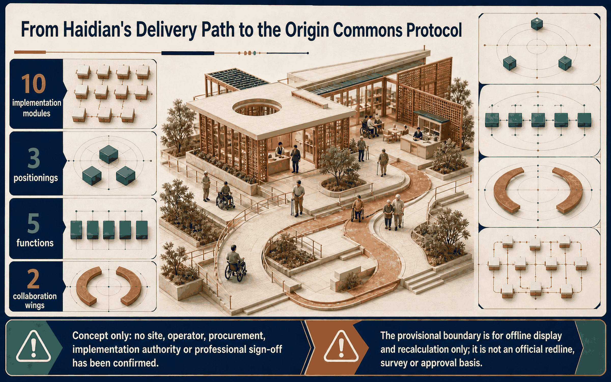
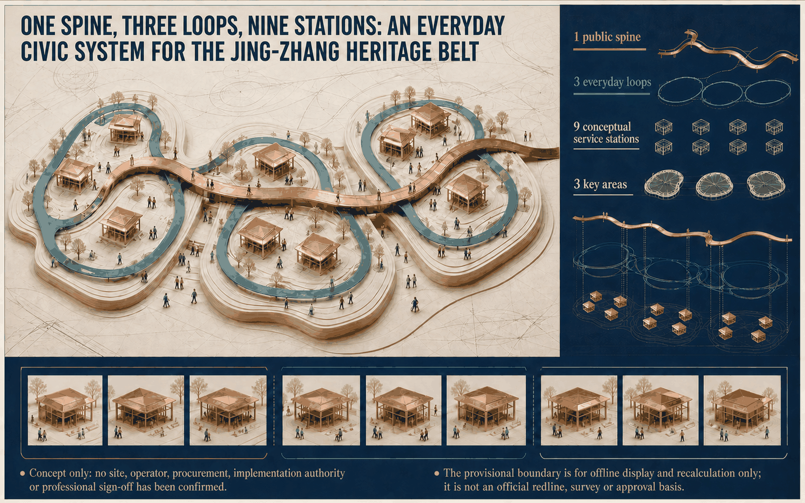
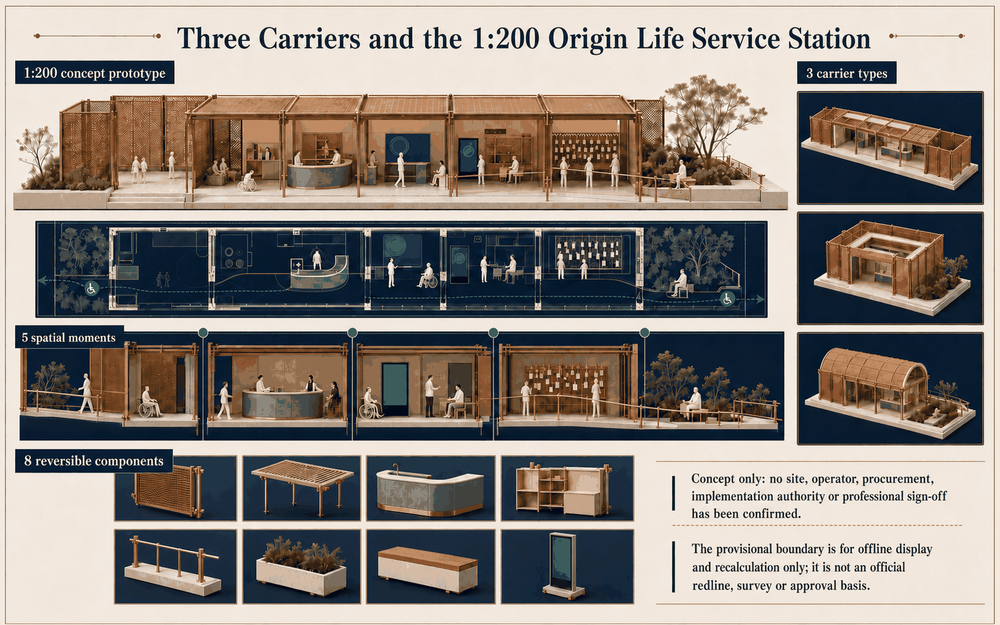
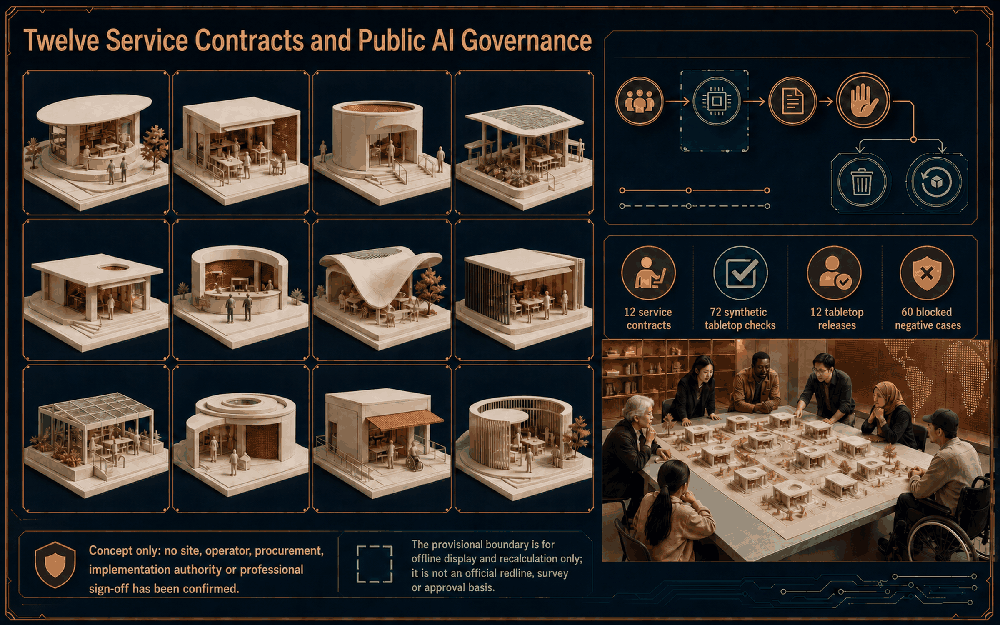
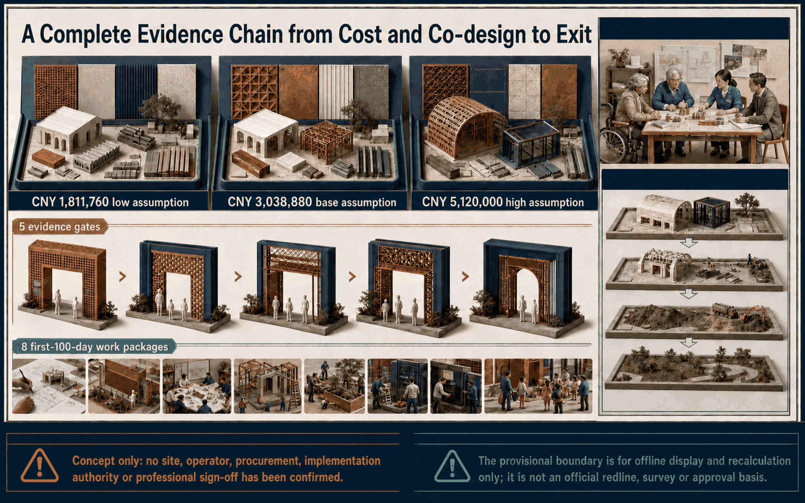

# Jing-Zhang Symbiotic Everyday Loop | Origin Commons Protocol

## Design Basis and Source List

### Current Haidian implementation guidance

The current Haidian District Urban Renewal Guidelines (2025 Edition) (`《海淀区城市更新导则（2025年版）》`) and Haidian District Urban Renewal Implementation Guidelines (2025 Edition) (`《海淀区城市更新实施指引（2025年版）》`), effective 1 July 2025 (2025-07-01), are **pending repository source-registry review**. They are implementation-logic references, not approved formal sources. They connect four-zone coordination, the AI innovation district, the Jing-Zhang railway heritage corridor, third spaces, accessible slow mobility, project generation and public participation. Their named district, subdistrict/town and specialist-department roles are referral points to consult, not a signed project RACI; every critical claim remains independently supported by the approved call, taskbook or applicable standard. [source:HAIDIAN-URBAN-RENEWAL-2025] [standard:PROJECT-AGENT-OPEN-CALL-TASKBOOK]

The Origin Commons Protocol is a competition concept mapped to that route. It is not an urban-renewal implementation filing, selected site, approval, investment decision or government endorsement. The call and taskbook define the three scales, three positionings, five functions, three areas and two wings, and agent.1-agent.6; provisional geometry is confined to offline composition and recalculation. [source:OFFICIAL-ANNOUNCEMENT] [data:geometry/site_boundary.geojson] [depth:risk_missing_data]

Evidence is separated into current formal authority, contextual comparison, provisional/generation-only material and proposal evidence. Official boundaries, title, controls, fire, utilities, heritage, structure, operator and authorization remain missing and therefore unresolved. [source:SOURCE-REGISTRY] [metric:site_area_sqm]

### Review-visible evidence digest

not_an_official_score=true · competition_concept_not_implementation_filing · no_award_selection_approval_or_government_endorsement_claimed · rights_and_provenance_evidence_is_not_legal_clearance

#### Seven-dimension evidence map

| ID | Existing evidence | Reality status | Next real-world gate | Exact evidence paths |
|---|---|---|---|---|
| `brief_relevance` | 9 stations, three S/M/L carrier classes, five G0-G4 gates and 11 delivery checkpoints close the brief-to-delivery loop. | `conditional_concept_programme_not_started_not_authorized` | `G0` — Confirm rights, site, accountable entities and official inputs | `visual/assets/stations.json` `visual/assets/carrier-typologies.json` `visual/assets/first-100-days.json` `visual/assets/raci-and-signoff.json` |
| `originality` | 7 regional interfaces and 3 landmark identities connect research, everyday service and heritage gateways as an exit-capable protocol. | `competition_grade_concept_evidence_not_approval` | `named_counterparty_and_site_authorization` — Confirm named counterparties, sites and public return | `visual/assets/professional-evidence.json` `visual/assets/design-system.json` |
| `ai_planning_innovation` | 12 AI service contracts receive 72 synthetic rule checks: 12 tabletop-only releases and 60 blocked negative cases. | `synthetic_tabletop_only_not_field_test` | `future_pending_authorization` — Authorize comprehension, professional accessibility and named-system evaluation | `visual/assets/public-ai-register.json` `visual/assets/public-acceptance-tabletop/scenario-contracts.json` `visual/assets/professional-evidence.json` |
| `implementation_feasibility` | 11 first-100-day/review checkpoints, 12 monthly records, 5 unassigned role classes and 8 null-result KPIs form a decision-ready handoff. | `annual_concept_programme_not_started_not_authorized` | `authorized_operator_capacity_finance` — Authorize operator, capacity, annual finance and independent procurement | `visual/assets/first-100-days.json` `visual/assets/raci-and-signoff.json` `visual/assets/annual-program.json` |
| `public_interest_inclusion` | Affected users hold pre-release modification or stop rights; same-task staffed routes and restoration evidence are release conditions. | `planned_not_run` | `future_pending_authorization` — Authorize recruitment, compensation, access support and independent facilitation | `visual/assets/co-design-and-equity.json` `visual/assets/public-ai-register.json` `visual/assets/public-acceptance-tabletop/scenario-contracts.json` |
| `risk_compliance` | No supplier is procured and the trademark is not cleared; font, image and toolchain provenance is recorded, but rights/provenance evidence is not legal clearance. | `evidence_recorded_clearance_pending` | `legal_professional_review` — Complete applicable legal, trademark, licence and professional review | `visual/assets/asset-rights-ledger.json` `visual/assets/image2-production-record.json` `visual/assets/design-system.json` |
| `expression_completeness` | Facts, status, next gate and 12 evidence paths for all 7 dimensions are visible in both languages and the matrix. | `deterministic_bilingual_digest` | `named_human_bilingual_signoff` — Complete named-human bilingual substantive sign-off | `visual/assets/professional-evidence.json` `visual/assets/design-system.json` |

#### Brand and rights passport

Font licences: SIL Open Font License 1.1; SIL Open Font License 1.1 / Bitstream Vera License with DejaVu additions. Image-2 provenance: model `gpt-image-2` with page-level production records for all 34 visible pages.

External case imagery reused=false; external Logo reused=false; third-party map tiles=false; trademark status=`not_cleared_not_registered`. Named build-only libraries: Pillow, fontTools, ReportLab, pypdf, Poppler, Chromium. Rights/provenance evidence is not legal clearance.

#### Decision-ready implementation handoff

Space and delivery: 9 stations; three S/M/L carrier classes (S/M/L); five G0-G4 gates (G0-G4); 11 checkpoints `D001-010/D011-025/D026-040/D041-055/D056-070/D071-085/D086-095/D096-100/M03/M12/M36`; review points M03/M12/M36 (M03/M12/M36).

Programme and identity: 12 monthly programme records; S/M/L capacity rules; 5 unassigned role classes; 8 KPI definitions; outcome status=`null`; annual finance=`unknown_no_funding_or_procurement_decision`; 7 regional interfaces; three landmark identities `LM-01/LM-02/LM-03`.

AI and public rights: 12 service contracts; 72 synthetic checks; 12 tabletop-only releases; 60 blocked negative cases. Co-design=`planned_not_run`; `actual_sessions=[]`; future tests=`future_pending_authorization`; supplier=`concept_not_procured`; affected-user right=`modify_or_stop_before_release`; same-task manual route=true; restoration evidence required=true.

## Three-Level Scope Framework

The coordinated-research scale tests four-zone links, two-wing coordination and eight ecosystem inputs: land, space, industry, funding, talent, compute, data and scenarios. The overall-design scale connects a Jing-Zhang heritage public spine with trusted-innovation, community-life and cultural-conversion loops. The key-area scale resolves three focus areas, nine stations and one reversible prototype. The overall area is stated only as “approximately 11.41 km², recalculated from provisional geometry”. [source:OFFICIAL-ANNOUNCEMENT] [depth:three_level_scope_framework] [metric:key_area_count]

One spine, three loops and nine stations form an everyday public network, not another enclosed technology park. The Zhongguancun technology-service wing and Xiaoyue River scenario-enablement wing are proposed interfaces; cross-regional links proceed only after real mandates, parties and project conditions exist. [source:HAIDIAN-URBAN-RENEWAL-2025] [standard:PROJECT-AGENT-OPEN-CALL-TASKBOOK]

Research establishes mechanisms; overall design establishes spatial continuity; detailed design establishes carrier types, services, accountable roles, cost and stop gates. Redlines, development rights, demolition and quantities remain official/professional inputs. [depth:overall_spatial_structure]

## Coordinated Research Area: Industry and Future City Research

agent.2 replaces a company wish-list with an eight-input ecosystem in which each resource has access, public-value, responsibility, evaluation and exit rules. agent.1 holds the common concept; agent.3 turns scenarios into service contracts; agent.4 supplies stations, landmarks and components; agent.5 creates cultural wayfinding; agent.6 defines annual opening, developer-community and conversion gates. [standard:PROJECT-AGENT-OPEN-CALL-TASKBOOK] [depth:renewal_project_list]

### Six-task auditable index

| Task | Locatable competition output | Review gate |
|---|---|---|
| agent.1 | Three positionings, five functions, three zones, two wings and the two-way collaboration loop | Common IDs, public-value exchange and a no-commitment boundary |
| agent.2 | Six global cases, eight ecosystem inputs and cross-regional interfaces | First-party sources, transfer limits and a Beijing translation |
| agent.3 | Twelve public-AI service contracts and three reversible pilots | Same-task staffed route, appeal, stop and restoration |
| agent.4 | Nine-station ledger, three carriers, three pilgrimage landmarks, component library and honour display protocol | Concept-only location, maintainability and consent/removal |
| agent.5 | Brand and wayfinding specification and a three-layer cultural-resource system | Trademark search pending; no copied mark or official-signage implication |
| agent.6 | Annual programme brand, developer community and talent and enterprise conversion pathway | Capacity, responsibility, public record, evaluation and exit |

#### two-way collaboration loop

The Zhongguancun technology-service wing can contribute research questions, model and engineering support, while the Xiaoyue River scenario-enablement wing can contribute bounded everyday public problems, staffed service and feedback. The return path sends evidence, unresolved risks and reusable components back to both wings. Beiwei Community, Future Science City, Huairou Science City, Beijing Economic-Technological Development Area and Jing-Jin-Ji remain invitation-only interfaces pending real mandates, parties, data authority and procurement rules; the diagram is not a signed collaboration network. [standard:PROJECT-AGENT-OPEN-CALL-TASKBOOK] [data:visual/assets/professional-evidence.json#/regional_synergies]

#### Brand, landmarks, honours and cultural resources

The **Brand and wayfinding specification** constructs the mark from two parallel heritage tracks and three open-loop segments, keeps one track-gauge unit of clear space, sets minima of 72 px / 18 mm, and supplies navy-on-ivory and ivory-on-navy monochrome use. It is a competition concept distinct from statutory or official signage, with trademark similarity search pending. The **three pilgrimage landmarks** are Open Model Workshop, Origin Urban Living Room and Centennial Jing-Zhang Memory Gateway Canopy. The **honour display protocol** requires consent, verification, public record, appeal and removal, and forbids unauthorized names, portraits, logos or civic ranking. The **cultural-resource system** records source, rights, verification status and public interpretation for heritage, innovation and public-AI layers. [data:visual/assets/design-system.json#/brand] [data:visual/assets/professional-evidence.json#/landmarks] [depth:blue_green_public_space]

#### Annual opening, developer community and conversion

The **annual programme brand**, Origin Commons Open Calendar, uses monthly S events (up to 30 people), M events (31-80) and L events only after site, fire, crowd, budget and operator approval. Annual finance, staffing capacity and outcome values remain unknown. The **developer community** admits a proposal only after public-problem, data/privacy, accessibility, human-review, public-benefit, incident and exit checks. The **talent and enterprise conversion pathway** links an evidenced prototype to mentoring, compliant test access and a public close-out record; it promises no investment, procurement, venue, visa, residency or government endorsement. [data:visual/assets/annual-program.json#/months] [data:visual/assets/annual-program.json#/developer_community]

Six first-party precedents calibrate distinct mechanisms: Punggol Digital District for district platforms and university-industry coupling; Mila for research-community and responsible-AI governance; STATION F for programme admission and service density; High Tech Campus Eindhoven for shared technical-space ladders; Dubai AI Campus for bundled enterprise access; and Testbed Helsinki for public-problem-led controlled trials. [source:CASE-PUNGGOL-JTC] [source:CASE-MILA]

| Case | Transferable mechanism | Boundary |
|---|---|---|
| Punggol | District platform linked to public realm | No assumed land coordination or recurrent public capital [source:CASE-PUNGGOL-JTC] |
| Mila | Multi-institution research and responsible-AI boundary | No Beijing institutional commitment [source:CASE-MILA] |
| STATION F | Programme admission, mentoring and enterprise services | No copied brand, capital density or historic megastructure [source:CASE-STATION-F] |
| High Tech Campus Eindhoven | Laboratory-to-pilot shared facility ladder | Shared offices do not substitute engineering facilities [source:CASE-HTCE] |
| Dubai AI Campus | Licence, space, capital and training gateway | No transfer of special-jurisdiction, subsidy or visa tools [source:CASE-DUBAI-AI-CAMPUS] |
| Testbed Helsinki | Open calls, contracted trials and post-test evidence | No bypass of procurement, ethics or data protection [source:CASE-TESTBED-HELSINKI] |

The local translation is a research-service-culture sequence: Zhongzhiyuan concentrates open R&D and trustworthy evaluation, the AI Origin Community concentrates everyday care and public feedback, and Dazhongsi concentrates heritage communication and public launch. It commits no operator, site or funding.

## Overall Design Area: Urban Renewal and Regulatory-Plan-Level Urban Design

Because current Haidian guidance puts project generation before implementation, the proposal defines the public problem and evidence gates before construction. The heritage spine carries slow mobility and cultural reading; the loops attach service to rail arrivals, community entrances, research courtyards and heritage nodes without inventing an “AI land-use” class. [source:HAIDIAN-URBAN-RENEWAL-2025] [standard:MOHURD-CONTROL-DETAILED-PLANNING] [depth:overall_spatial_structure]

The sequence is staffed baseline, reversible spatial test, controlled digital layer and restoration acceptance. FAR, height, setbacks, road redlines, underground works and demolition decisions remain unknown; `land_use.geojson` tests relationships only. [data:geometry/land_use.geojson] [standard:MNR-LAND-USE-CLASSIFICATION-GUIDE]

## Detailed Design of Key Areas

### Carrier decision: preferred M

The station compares three non-site carriers: S, a 120-180 m² public-space edge with the lowest dependency but limited capacity; M, a 180-280 m² linear shared ground floor that connects street, staffed service and quiet garden and is preferred for the competition; and L, a 280-450 m² courtyard/campus interface with greater event capacity but heavier title, fire and operating dependencies. These are design-assumption bands, not measurements. [data:visual/assets/carrier-typologies.json#/carriers] [depth:three_key_area_detailed_design]

The M prototype moves through P01 Ordinary Passage, P02 Staffed Service Hall, P03 Voluntary AI Room, P04 Public Receipt Gallery and P05 Quiet Restoration Garden. A continuous step-free bypass, staff/maintenance route, isolated power/data shutdown, dry connections and ordinary-service end state are interfaces; two exits and exact clearances remain subject to fire, structure and accessibility review. [data:visual/assets/origin-life-service-station.json#/spatial_moments] [standard:MOHURD-ARCH-DESIGN-DEPTH-2016]

CMP-01-CMP-08 cover shade, armrest seating, care waiting, three-layer wayfinding, staffed desk, low-height interaction, event power and a reversible sensor interface. Every component records installation, daily/monthly maintenance, data boundary, removal tool, reuse and surface-restoration acceptance. [data:visual/assets/origin-life-service-station.json#/components]

Each key area holds three conceptual stations: research/evaluation at Zhongzhiyuan, everyday care/heritage learning at the Origin Community, and multilingual visitor/cultural conversion at Dazhongsi. The nine IDs remain stable, but locations, radii, areas and responsible bodies require official boundaries, title and field survey. [metric:service_station_count]

## AI Innovation Ecosystem, Personas, and AI+ Scenarios

### Twelve public AI service records

SC-01-SC-12 each disclose the public problem, necessity, same-task staffed/non-digital route, permitted and prohibited inputs, bounded model role, version/supplier dependency, human authority, baseline/equity metrics, incident pause, appeal, procurement audit and exit/restoration. P01-P05 are the common spatial journey. Face recognition, compulsory precise tracking and cross-scenario profiling are excluded from basic public service. [data:visual/assets/public-ai-register.json#/records] [source:UK-ATRS-2.1]

Supplier status is `concept_not_procured` and interfaces must be replaceable. Exit shuts down the intelligent service, preserves staffed service, returns/exports applicable data, verifies deletion and publishes close-out; no reopening occurs without the same-task staffed route. [source:AMSTERDAM-ALGORITHM-REGISTER] [depth:municipal_new_infrastructure]

The 72-case offline exercise is a rule tabletop only: 12 qualified contracts reach `tabletop_only`, while 60 negative cases missing responsibility, a staffed route, data ceiling, stop authority or restoration evidence are blocked. It is not user research, field performance, accessibility review or proof of model effectiveness. [data:simulation.json#/cases] [metric:synthetic_tabletop_check_count]

The future test ladder has five levels. T1 synthetic rule tabletop is complete but non-empirical; T2 user comprehension and same-task staffed route, T3 professional accessibility and route audit, T4 named algorithm/supplier/version evaluation, and T5 time-limited reversible field pilot all remain `future_pending_authorization`. Their gates respectively require accessible recruitment/compensation/consent, verified site and qualified audit, lawful data and incident ownership, or site/fire/structure/insurance/funding authority. Missing evidence blocks escalation; a T5 failure defaults to stop, deletion, removal and restoration of ordinary service. [data:visual/assets/professional-evidence.json#/future_test_ladder]

Five core persona groups cover residents/carers, researchers/developers, startups/SMEs, commuters/international visitors, and public-service/site staff, with children, older people, disabled people and non-smartphone users as cross-cutting checks. Actual insight must come from the unrun co-design protocol, not persona inference. [data:visual/assets/co-design-and-equity.json#/persona_groups]

### Twelve-scenario spatial binding

| ID | Scenario | Stations / areas / wings |
|---|---|---|
| SC-01 | Accessible continuous route | AOC-02/ai_origin_community/X |
| SC-02 | Night safety companion | ALL9/ALL3/X |
| SC-03 | Care transfer | AOC-02/ai_origin_community/X |
| SC-04 | Heritage storytelling | AOC-03,DZS-02/ai_origin_community,dazhongsi/X+T |
| SC-05 | Low-carbon trip | ALL9/ALL3/X |
| SC-06 | Thermal comfort | ZZY-03/zhongzhiyuan/X |
| SC-07 | Facility booking | ZZY-01/zhongzhiyuan/T |
| SC-08 | Venture collaboration | ZZY-01,DZS-01/dazhongsi,zhongzhiyuan/T |
| SC-09 | Community deliberation | AOC-01/ai_origin_community/X |
| SC-10 | Multilingual guidance | DZS-03/dazhongsi/X |
| SC-11 | Emergency information | ALL9/ALL3/X+T |
| SC-12 | Event co-creation | ALL9/ALL3/X+T |

`ALL9=ZZY-01,ZZY-02,ZZY-03,AOC-01,AOC-02,AOC-03,DZS-01,DZS-02,DZS-03;ALL3=ai_origin_community,dazhongsi,zhongzhiyuan;X=xiaoyuehe_scenario_wing;T=zhongguancun_service_wing`. Common service journey: The user first receives a staffed and non-digital route, then may opt into the listed service; evidence, feedback and exit remain visible. These 12 rows are generated jointly from the scenario ledger and professional-evidence bindings. All remain conceptual assignments pending official geometry, site and operator authorization; they are not deployment, site-selection or operating commitments. [data:visual/assets/scenarios.json#/scenarios] [data:visual/assets/professional-evidence.json#/scenario_space_wing_bindings] [metric:scenario_card_count]

## Land Use, Building Scale, and Retain-Renovate-Demolish Strategy

### M01-M10 ten-module implementation path

The official preparation route maps to M01 Basic information, M02 Preliminary assessment, M03 Functional positioning, M04 Planning scheme, M05 Architectural design, M06 Land-use path, M07 Unregistered-building path, M08 Funding plan, M09 Industry and operations, and M10 Construction sequence. Only M03, M05, M09 and M10 are `complete_as_concept`; the rest require official inputs or authorization. [source:HAIDIAN-URBAN-RENEWAL-2025] [data:visual/assets/implementation-dossier.json#/modules]

| Modules | Competition output | Release condition |
|---|---|---|
| M01-M02 | Identity/carrier logic and survey/participation brief | Official boundary, implementation entity, authorized survey |
| M03-M05 | Public-service positioning, S/M/L and 1:200 M concept | Controls, road redline, fire/structure/accessibility review |
| M06-M07 | Compatibility and unregistered-building no-build gate | Title, approved use and registration status |
| M08-M10 | Cost bands, operating contract and 0-100-day / 3/12/36-month route | Funding authority, quotes, operator and site access |

Retention, repair and adaptive reuse precede demolition. No demolition is proposed without title, professional assessment and due process; massing tests enclosure, maintenance and capacity only. [data:geometry/buildings.geojson] [depth:retain_renovate_demolish]

## Transport, Rail, Municipal Infrastructure, and Public Services

Current Haidian guidance supports accessible slow mobility and third spaces. The proposal therefore connects rail arrival, continuous routes, shade/rest, low/high-contrast/tactile wayfinding, staffed help and nine stations as one service baseline. Algorithms may explain candidate routes but do not replace on-site safety judgement; no accompanied walk or professional route verification has yet occurred. [source:HAIDIAN-URBAN-RENEWAL-2025] [depth:traffic_rail_slow_parking]

Municipal interfaces stay light, zoned and disconnectable: event power, network and sensing surfaces sit in reversible components, while capacity, utilities, fire and energy remain official/professional inputs. Human-processing duties in legally specified services are determined case by case; same-task staffed service is the proposal's wider design commitment, not a universal legal conclusion. [source:BARRIER-FREE-LAW] [depth:municipal_new_infrastructure]

Road centrelines, station connections and the “last 500 metres” remain unverified design assumptions, not alignments or redlines. [data:geometry/roads.geojson]

## Blue-Green Network, Public Space, and Urban Character

### Co-design rights and three-stage protocol

Co-design is `planned_not_run` and `actual_sessions=[]`. The stages are a walk/barrier audit, a twelve-scenario tabletop and a public decision jury; offline, telephone and online evidence have equal standing, and no smartphone is required. Recruitment, compensation, interpretation, accessible materials, facilitators and accountable parties remain pending; there are no attendance, vote, quotation or approval results. [source:UNHABITAT-PEOPLE-CENTRED-2025] [data:visual/assets/co-design-and-equity.json#/stages]

Affected users and their chosen supporters hold `modify_or_stop_before_release` authority over same-task human service, route accessibility, complaint handling and unsafe data use. Sponsors, suppliers and facilitators cannot override unresolved safety/rights stops; reopening requires published corrective evidence and renewed review. [source:BARCELONA-DECIDIM] [depth:blue_green_public_space]

The blue-green network treats the Qinghe, Xiaoyue River, heritage line and neighbourhood green space as heat, stormwater and everyday-stay infrastructure. Approximately 12.34% conceptual green ratio and 2.04% conceptual nine-station footprint ratio are internal comparisons; conflicts with green, heritage, transport or title conditions require relocation, reduction or cancellation. [data:geometry/green_space.geojson] [metric:green_ratio]

The CR-01-CR-06 cultural-resource register separates the task-confirmed Jing-Zhang heritage scope from research leads on railway engineering, community oral history, Zhongguancun innovation and Dazhongsi place memory, plus a future AI public-culture co-creation archive. Beyond the competition scope, no date, person, event, precise location, media right or participation result is pre-filled. Content without a primary source, location check and licence is not displayed and must be corrected or withdrawn when challenged. [data:visual/assets/professional-evidence.json#/cultural_resources]

Cultural wayfinding has railway-heritage, Zhongguancun-innovation and public-AI layers, without corporate logos or ranking systems conferring civic authority. [standard:MOHURD-URBAN-DESIGN-MEASURES]

## Renewal Projects, Implementation Policy, and Phasing

### Cost, procurement and exit

For the 230 m² midpoint M assumption, machine files retain low/base/high totals of CNY 1,811,760 / 3,038,880 / 5,120,000; human-facing text uses approximately CNY 1.81 / 3.04 / 5.12 million. Twelve lines recompute as quantity × rate. Only the restoration-material line cites the **needs-review** source `BEIJING-MATERIAL-RATE-2026-07`: the Beijing July 2026 market-reference PDF, p.56, product code **3605000403**, tax-inclusive recycled paving brick at **CNY 44-50/m²**. It excludes base course, labour, removal and transport. The other 11 categories are broad planning assumptions, not quotations. These totals are not a budget, tender control price or investment commitment. [source:BEIJING-MATERIAL-RATE-2026-07] [data:visual/assets/cost-and-procurement.json#/totals_cny]

Procurement clauses cover public value, supplier disclosure, data access, interoperability, incidents, accessibility acceptance, audit, version change, continuity, exit support, return/deletion, component removal and surface restoration. Passing a pilot never triggers automatic procurement; unresolved rights, staffed service or restoration blocks release. [depth:phasing_implementation]

### 0-100 days and M03/M12/M36

The 0-100-day route contains checkpoints D001-010 through D096-100 and five gates: G0 rights/site, G1 human equivalence, G2 controlled release, G3 stop/restoration, and G4 independent review. M03 can frame a reversible pilot only after authorization and evidence; M12 reviews service, equity and cost; M36 considers replication only after site, funding, operating and equity gates. Missing named responsibility, staffed fallback, removal or deletion evidence defaults to rollback. [data:visual/assets/first-100-days.json#/programme] [metric:evidence_gate_count]

The annual organization defines only five unassigned roles: public client, programme steward, staffed-service lead, technical/data lead and independent reviewer. Authorized capacity, FTE, venue, annual budget and funding source remain `null/unknown`; eight KPIs define access, subgroup gap, feedback closure, incident, fallback, maintenance, exit and conversion-review measures without inventing outcomes. Four pathways cover talent, developers, research outputs and enterprises, with 3/6/12-month continue/revise/exit reasons and no promise of jobs, investment, procurement, visas or policy benefit. [data:visual/assets/annual-program.json#/organization] [data:visual/assets/annual-program.json#/conversion_pathways]

The housing/urban-rural development lead, subdistrict/town, commerce, development/reform, disabled-persons federation, urban management, civil affairs, water, culture/tourism, planning/natural-resources and property roles are named referral points from the official route. None has committed to this project. [source:HAIDIAN-URBAN-RENEWAL-2025] [data:visual/assets/raci-and-signoff.json#/referral_roles]

## Metrics, Area Recalculation, and Compliance Matrix

Indicators are separated into provisional-geometry calculations, pending official controls and future authorized-test measures. The area is “approximately 11.41 km², recalculated from provisional geometry”; FAR, height and redline stay unknown; arrival, equity, appeal, stop and restoration have no outcome values before an authorized trial. [metric:site_area_sqm] [data:metrics.json]

`compliance_matrix.json` retains 23 taskbook requirements including agent.1-agent.6; `standard_matrix.json` retains 6 standards; `design_depth_matrix.json` retains 15 professional-depth items; R-01-R-22 links repairs to current evidence and unfinished later tasks. `complete_as_concept` never means implementation conditions are complete. [standard:PROJECT-AGENT-OPEN-CALL-TASKBOOK] [depth:metrics_recalculation]

All 34 pages across the four PDFs passed measured searchable-text checks: 52,223 extracted characters in total, with a minimum of 647 characters per page, above the 120-character threshold. `accessibility-audit.json` records per-file character counts, reading order, metadata and pixel-equivalence results. This is a text-extraction, reading-order, metadata and pixel check, not a legal or professional accessibility certification; semantic HTML remains the primary structured alternative. [data:visual/assets/accessibility-audit.json#/checks]

## Risk, Copyright, and Compliance

The principal risk is converting concept evidence into real-world fact. No official boundary, title, implementation entity, operator, participation, authorization, procurement, field trial, engineering feasibility, accessibility certification or endorsement has been obtained; later boards, PDFs and communications must preserve that boundary. [source:BOUNDARY-SOURCE] [depth:risk_missing_data]

The 12 records and 72 synthetic cases prove rule structure only, the three-stage co-design process is unrun, and cost is a sensitivity model. Data governance uses purpose limitation, minimum necessity, human review, appeal, pause, deletion and reversible exit; actual deployment still requires the authorized parties' legal, cybersecurity, ethics, accessibility, fire and public-safety review. [source:UK-ATRS-2.1]

### Asset-by-asset rights summary

**Noto Sans SC** is distributed under the **SIL Open Font License 1.1** and is subset/embedded only for offline Chinese text; DejaVu Sans is embedded under its bundled licence for the searchable layer. Image-2 visible pages are authored for this submission from text-only briefs and proposal-owned inputs; no page from PR #2247 is an input. Maps and GeoJSON are proposal geometry or explicitly provisional organizer inputs and cannot be read as official redlines. Code and local libraries remain governed by their own licences; no external case photograph, plan, icon, logo or trademark is redistributed. The structured rights ledger records file family, author/tool, input reference, licence, web/PDF embedding and review status. [data:visual/assets/asset-rights-ledger.json#/assets]

### Bilingual substantive check pending named human sign-off

Chinese and English use one factual skeleton but are edited independently. The agent-assisted systematic check compares **titles, numbers, evidence levels, source status, warnings and figure positions**, including 1/3/9, 12/72/12/60, carrier bands, cost bands and all M/SC/P/CMP/G IDs. Its status is `agent_checked_pending_named_human_signoff`; it does not claim completed human translation approval before a named reviewer signs. Layout differences are permitted only when they add no new fact, promise or present-condition claim. External precedents supply facts and mechanisms only; no third-party image, map, trademark or page design is copied. This record is a content-equivalence check, not certified translation. [source:CASE-DUBAI-AI-CAMPUS] [data:visual/assets/bilingual-equivalence.json#/pairs]

## References

Primary anchors are the official call, taskbook, applicable standards and registry-approved first-party institutional pages in `sources.json`. The Haidian 2025 renewal instruments and Beijing material-rate PDF remain `needs_review`; they are bounded implementation-logic and single-material price references, not approved formal sources and not evidence that this project has a site, entity, funding or approval. [source:HAIDIAN-URBAN-RENEWAL-2025] [source:BEIJING-MATERIAL-RATE-2026-07] [source:OFFICIAL-ANNOUNCEMENT]

The six precedent owners are JTC, Mila, STATION F, High Tech Campus Eindhoven, DIFC and the City of Helsinki. Full URLs, access dates and use boundaries are in the source register. [source:CASE-HTCE] [source:CASE-TESTBED-HELSINKI]

Structured review begins with `implementation-dossier.json`, `carrier-typologies.json`, `public-ai-register.json`, `cost-and-procurement.json`, `co-design-and-equity.json`, `first-100-days.json` and `accessibility-audit.json`. [data:visual/assets/implementation-dossier.json]
